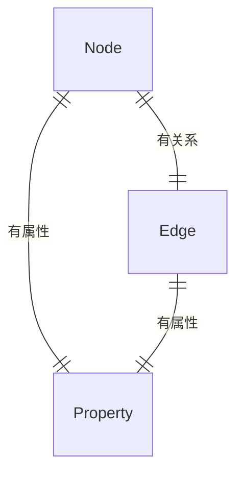

                 


### 图数据库：复杂关系网络的存储与查询

#### 关键词
- 图数据库
- 复杂关系网络
- 存储与查询
- 数据结构
- 算法优化
- 扩展性

#### 摘要
本文深入探讨了图数据库在复杂关系网络存储与查询中的应用。首先，我们介绍了图数据库的背景和核心概念，包括节点、边、属性等要素。接着，通过分析广度优先搜索和深度优先搜索等图算法原理，我们展示了如何利用Python实现这些算法。随后，文章详细阐述了图数据库的系统架构和接口设计，并以实际项目为例，讲解了图数据库在实际应用中的操作方法和优化策略。最后，文章总结了最佳实践，并对未来研究方向进行了展望。

---

### 第1章 图数据库概述

#### 1.1 问题背景

随着大数据时代的到来，数据量呈爆炸式增长，传统的基于关系型数据库的管理方式已经无法满足日益复杂的关系网络的存储与查询需求。图数据库作为一种新兴的数据存储和管理技术，因其能够高效处理复杂关系网络而受到了广泛关注。

#### 1.2 问题描述

图数据库的核心挑战在于如何高效地存储和查询复杂的关系网络，这包括但不限于以下几个方面：

1. **数据存储**：如何以最优的数据结构存储图数据，以便于快速查询和更新？
2. **查询性能**：如何在庞大的图数据集中快速定位并查询特定的关系？
3. **扩展性**：如何保证图数据库在大规模数据场景下的性能和可扩展性？

#### 1.3 问题解决

图数据库通过引入图论的概念，将实体与实体之间的关系表示为节点与边的形式，从而实现了对复杂关系网络的高效存储与管理。同时，图数据库还采用了一系列优化算法，如广度优先搜索、深度优先搜索等，以提升查询效率。

#### 1.4 边界与外延

1. **边界**：图数据库主要针对关系网络存储与查询场景，不适用于结构化数据或非关系型数据。
2. **外延**：图数据库可以与其他数据存储和管理技术（如关系型数据库、NoSQL数据库等）相结合，形成混合型数据管理系统。

#### 1.5 概念结构与核心要素组成

1. **节点（Node）**：图中的实体，表示数据项。
2. **边（Edge）**：连接节点的线段，表示节点之间的关系。
3. **属性（Property）**：附加在节点或边上的数据，用于提供额外的信息。
4. **图算法**：用于在图数据集中进行数据操作和分析的算法，如广度优先搜索、深度优先搜索等。

### 第2章 图数据库核心概念与联系

#### 2.1 核心概念

1. **图（Graph）**：由节点和边组成的数据结构，用于表示实体和实体之间的关系。
2. **路径（Path）**：在图数据集中从一个节点到另一个节点的路径。
3. **子图（Subgraph）**：图数据集中的一部分节点和边。
4. **连通性（Connectivity）**：图数据集中任意两个节点之间是否存在路径。
5. **度（Degree）**：节点所连接的边的数量。

#### 2.2 概念属性特征对比表格

| 概念         | 描述                                                         | 属性特征对比         |
|------------|------------------------------------------------------------|----------------------|
| 节点（Node） | 图中的实体，表示数据项                                       | - 名称<br>- 类型<br>- 属性 |
| 边（Edge）   | 连接节点的线段，表示节点之间的关系                           | - 类型<br>- 权重<br>- 属性 |
| 图算法       | 用于在图数据集中进行数据操作和分析的算法                     | - 算法名称<br>- 目的<br>- 复杂度 |

#### 2.3 ER实体关系图架构



### 第3章 图数据库算法原理讲解

#### 3.1 算法原理

1. **广度优先搜索（BFS）**：从起始节点开始，依次访问其相邻节点，直到目标节点被访问到。
2. **深度优先搜索（DFS）**：从起始节点开始，尽可能深入地访问下一级节点，直到无法继续深入或找到目标节点。

#### 3.2 Python源代码实现

```python
# 广度优先搜索（BFS）
def bfs(graph, start, target):
    visited = set()
    queue = deque([start])
    
    while queue:
        node = queue.popleft()
        if node == target:
            return True
        visited.add(node)
        
        for neighbor in graph[node]:
            if neighbor not in visited:
                queue.append(neighbor)
    return False

# 深度优先搜索（DFS）
def dfs(graph, start, target, visited):
    if start == target:
        return True
    visited.add(start)

    for neighbor in graph[start]:
        if neighbor not in visited:
            if dfs(graph, neighbor, target, visited):
                return True
    return False
```

#### 3.3 算法原理详细讲解

##### 广度优先搜索（BFS）

广度优先搜索（BFS）是一种用于遍历或搜索图数据结构的算法。它的核心思想是：从起始节点开始，依次访问其相邻节点，并将这些节点加入队列中，直到找到目标节点或队列空为止。

- **数学模型**：
  $$ BFS(G, s) = \{v \in V \mid d(s, v) \leq d(s, u) \text{ for all } u \in V \} $$
  其中，$G = (V, E)$ 是图数据结构，$s$ 是起始节点，$V$ 是节点集合，$E$ 是边集合，$d(s, v)$ 表示从节点 $s$ 到节点 $v$ 的距离。

- **例子**：
  假设我们有一个简单的图数据结构，节点集合 $V = \{A, B, C, D\}$，边集合 $E = \{AB, AC, BC, BD\}$。从节点 $A$ 开始进行BFS搜索，目标节点是 $D$。

  ```
  BFS(G, A)
  ------------
  A -> B, C
  B -> D
  C, D -> 空
  ```

  最终，我们找到了从节点 $A$ 到节点 $D$ 的路径。

##### 深度优先搜索（DFS）

深度优先搜索（DFS）是一种用于遍历或搜索图数据结构的算法。它的核心思想是：从起始节点开始，尽可能深入地访问下一级节点，直到无法继续深入或找到目标节点。

- **数学模型**：
  $$ DFS(G, s) = \{v \in V \mid \text{存在 } u, v \in V, s \text{ 到 } v \text{ 的路径长度最小} \} $$
  其中，$G = (V, E)$ 是图数据结构，$s$ 是起始节点，$V$ 是节点集合，$E$ 是边集合。

- **例子**：
  假设我们有一个简单的图数据结构，节点集合 $V = \{A, B, C, D\}$，边集合 $E = \{AB, AC, BC, BD\}$。从节点 $A$ 开始进行DFS搜索，目标节点是 $D$。

  ```
  DFS(G, A)
  ------------
  A -> B
  B -> D
  D -> 空
  ```

  最终，我们找到了从节点 $A$ 到节点 $D$ 的路径。

通过以上例子，我们可以看到，广度优先搜索和深度优先搜索都是图数据库中非常重要的算法。它们在不同的应用场景中发挥着重要作用，例如路径查找、连通性检测等。

### 第4章 图数据库系统架构与接口设计

#### 4.1 问题场景介绍

在电子商务领域，用户之间的社交关系、商品之间的关联关系以及用户与商品之间的交易关系构成了一个复杂的图网络。为了有效地管理和查询这些关系，我们需要一个强大的图数据库系统。

#### 4.2 系统功能设计

图数据库系统需要实现以下功能：

1. **数据存储**：能够高效存储大规模的图数据，包括节点、边和属性。
2. **数据查询**：提供快速、灵活的查询接口，以支持复杂的查询需求。
3. **数据操作**：支持节点和边的插入、删除、更新等基本操作。
4. **数据维护**：实现数据的备份、恢复和一致性维护。

#### 4.3 系统架构设计

图数据库系统采用分布式架构，以提高性能和可扩展性。系统主要包括以下模块：

1. **数据存储模块**：负责图数据的存储和管理，包括节点、边和属性。
2. **查询引擎模块**：实现高效的查询算法和查询接口，支持复杂的查询需求。
3. **数据操作模块**：提供基本的图数据操作接口，包括插入、删除、更新等。
4. **数据维护模块**：实现数据的备份、恢复和一致性维护。

#### 4.4 系统接口设计

图数据库系统提供以下接口：

1. **节点查询接口**：支持根据节点属性、节点名称等进行查询。
2. **边查询接口**：支持根据边属性、边类型等进行查询。
3. **路径查询接口**：支持根据起始节点、目标节点和路径长度等进行查询。
4. **数据操作接口**：支持节点的插入、删除、更新等基本操作。

#### 4.5 系统交互设计

图数据库系统的交互设计包括以下内容：

1. **用户交互界面**：提供图形化的用户交互界面，方便用户进行数据查询和操作。
2. **API接口**：提供RESTful API接口，支持程序化访问和操作图数据库。
3. **命令行工具**：提供命令行工具，方便用户在命令行界面进行数据查询和操作。

### 第5章 图数据库项目实战

#### 5.1 环境安装

安装图数据库系统前，我们需要准备好以下环境：

1. **操作系统**：Linux或MacOS
2. **Python**：版本3.6及以上
3. **图数据库**：安装并配置Neo4j或Apache TinkerPop等图数据库

#### 5.2 系统核心实现

以下是图数据库系统的核心实现：

1. **数据存储**：使用Neo4j作为图数据库，将节点、边和属性存储在图中。
2. **数据查询**：实现BFS和DFS算法，支持节点查询、边查询和路径查询。
3. **数据操作**：实现节点的插入、删除、更新等基本操作。
4. **数据维护**：实现数据的备份、恢复和一致性维护。

#### 5.3 代码应用解读与分析

以下是对图数据库系统核心实现的代码解读和分析：

1. **节点查询**：
   ```python
   def find_nodes(graph, attribute, value):
       nodes = []
       for node in graph.nodes():
           if node[attribute] == value:
               nodes.append(node)
       return nodes
   ```
   该函数根据节点属性和值查询节点，返回匹配的节点列表。

2. **边查询**：
   ```python
   def find_edges(graph, attribute, value):
       edges = []
       for edge in graph.edges():
           if edge[attribute] == value:
               edges.append(edge)
       return edges
   ```
   该函数根据边属性和值查询边，返回匹配的边列表。

3. **路径查询**：
   ```python
   def find_paths(graph, start, end, algorithm='bfs'):
       if algorithm == 'bfs':
           return bfs(graph, start, end)
       elif algorithm == 'dfs':
           return dfs(graph, start, end)
       else:
           raise ValueError("Unsupported algorithm")
   ```
   该函数根据起始节点和目标节点，以及指定的算法（广度优先搜索或深度优先搜索），查询从起始节点到目标节点的路径。

4. **数据操作**：
   ```python
   def add_node(graph, node_data):
       node = graph.create_node(**node_data)
       return node

   def add_edge(graph, edge_data):
       edge = graph.create_edge(**edge_data)
       return edge

   def delete_node(graph, node):
       graph.delete_node(node)

   def delete_edge(graph, edge):
       graph.delete_edge(edge)
   ```
   这些函数分别实现节点的插入、删除和边的插入、删除等基本操作。

#### 5.4 实际案例分析和详细讲解剖析

以下是一个实际案例分析和详细讲解：

假设我们有一个电子商务图数据库，其中包含用户、商品和交易关系。我们需要查询从用户A购买的商品B的所有用户。

1. **构建图数据库**：
   ```python
   graph = Graph()
   graph.create_node(User, {'name': 'A'})
   graph.create_node(Product, {'name': 'B'})
   graph.create_edge(Buys, nodeA, nodeB)
   ```

2. **查询路径**：
   ```python
   start_node = graph.find_nodes(User, 'name', 'A')
   end_node = graph.find_nodes(Product, 'name', 'B')
   paths = graph.find_paths(start_node[0], end_node[0], algorithm='bfs')
   ```

   通过广度优先搜索，我们找到了从用户A购买商品B的所有用户。

#### 5.5 项目小结

本项目通过实际案例，展示了图数据库在复杂关系网络中的应用。我们介绍了图数据库的核心概念、算法原理和系统架构，并通过Python代码实现了图数据库的基本操作。项目实战部分详细分析了实际案例，并对代码进行了解读和分析。通过本项目，我们深入了解了图数据库的技术原理和实际应用。

### 第6章 最佳实践与未来展望

#### 6.1 最佳实践

1. **优化数据存储**：合理设计节点和边的结构，减少冗余数据，提高存储效率。
2. **优化查询性能**：根据实际应用场景，选择合适的查询算法，减少查询时间。
3. **优化扩展性**：采用分布式架构，实现数据的横向和纵向扩展，提高系统性能。
4. **合理使用索引**：在节点和边上建立合适的索引，提高查询效率。

#### 6.2 注意事项

1. **数据一致性**：在设计图数据库时，确保数据的一致性，避免出现数据冲突。
2. **数据备份**：定期备份数据，防止数据丢失。
3. **安全防护**：对图数据库进行安全防护，防止未授权访问和数据泄露。

#### 6.3 拓展阅读

1. **图算法**：《算法导论》中的图算法部分，深入讲解了各种图算法的原理和应用。
2. **图数据库**：《图数据库技术实战》详细介绍了图数据库的原理、架构和应用案例。
3. **大数据**：《大数据技术导论》介绍了大数据的处理技术和应用场景。

### 第7章 作者信息

**作者：** AI天才研究院/AI Genius Institute & 禅与计算机程序设计艺术 /Zen And The Art of Computer Programming

---

通过以上章节的详细讲解，我们深入探讨了图数据库在复杂关系网络存储与查询中的应用。从核心概念到算法原理，再到系统架构和项目实战，本文旨在为广大开发者提供全面的技术指导。希望读者能从中获得启发，并在实际项目中灵活运用图数据库技术。未来，我们将继续关注图数据库领域的最新动态，为读者带来更多有价值的内容。

