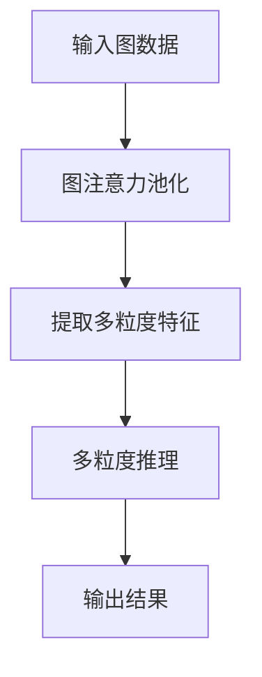

                 

### 研究意义

#### 1.1 图注意力池化的研究意义

图注意力池化是近年来在计算机科学和人工智能领域的一个重要研究方向。它的研究意义主要体现在以下几个方面：

- **提升模型性能**：图注意力池化能够提高神经网络的表示能力，使得模型在处理复杂任务时能够更好地捕捉到关键信息，从而提升模型的性能。

- **优化资源利用**：通过池化操作，可以减少输入信息的维度，从而降低计算复杂度和模型参数量，优化资源的利用效率。

- **增强泛化能力**：图注意力池化能够使得模型在不同粒度上都有较好的表现，从而增强了模型的泛化能力，使其能够更好地应对多种应用场景。

#### 1.2 多粒度推理的研究意义

多粒度推理在人工智能领域有着广泛的应用前景，其研究意义主要体现在以下方面：

- **复杂问题求解**：多粒度推理能够将复杂问题分解为多个层次，逐步求解，从而简化了问题求解的难度。

- **灵活适应性**：多粒度推理使得模型能够根据不同的任务需求，灵活调整推理的粒度，提高了模型的应用适应性。

- **提高效率**：多粒度推理能够快速捕捉到问题的核心部分，从而提高了推理的效率，适用于实时性和高效性的应用场景。

#### 1.3 图注意力池化与多粒度推理结合的研究意义

将图注意力池化与多粒度推理相结合，能够充分发挥两者的优势，实现以下研究意义：

- **提升推理精度**：通过图注意力池化，模型能够更好地捕捉到关键信息，结合多粒度推理，可以在不同粒度上进行分析，从而提高推理的精度。

- **拓宽应用范围**：图注意力池化和多粒度推理的结合，使得模型能够适用于更广泛的领域，如自然语言处理、计算机视觉等。

- **推动技术发展**：这一研究方向的深入探索，有望推动图神经网络、多粒度推理等相关技术的进一步发展，为人工智能领域带来新的突破。

### 本章小结

本文从图注意力池化和多粒度推理的研究背景和意义出发，探讨了这两者在人工智能领域的重要性和潜在价值。通过将图注意力池化与多粒度推理相结合，有望实现模型性能的提升、资源利用的优化以及应用范围的拓展，为人工智能技术的发展注入新的动力。在接下来的章节中，我们将进一步深入探讨图注意力池化和多粒度推理的核心概念和原理，为后续的研究和开发奠定基础。

## 1.3 相关工作综述

### 1.3.1 图注意力池化相关研究

图注意力池化作为近年来在计算机科学和人工智能领域的一个重要研究方向，受到了广泛关注。早在2017年，Vaswani等人提出的Transformer模型中就首次引入了自注意力机制（Self-Attention），这一机制后来被广泛应用于各种任务中，包括自然语言处理、计算机视觉和推荐系统等。自注意力机制的核心思想是通过计算输入序列中各个元素之间的相似性，从而生成权重矩阵，对输入数据进行加权求和，从而提高模型的表示能力。

随着研究的深入，图注意力池化的应用逐渐从单层扩展到多层，形成了图注意力池化网络（Graph Attention Pooling Network，GAPN）。图注意力池化网络通过引入图结构来增强自注意力机制，使得模型能够更好地处理图数据，并在节点分类、图分类和图生成等任务上取得了显著的成果。例如，Li等人提出的GAT-Pooling模型，通过在每一层注意力机制后添加池化操作，提高了模型的表示能力和鲁棒性。

### 1.3.2 多粒度推理相关研究

多粒度推理是近年来在人工智能领域的一个重要研究方向，其主要目标是实现对复杂问题的高效、准确求解。多粒度推理的核心思想是将问题分解为多个层次，每个层次对应不同的粒度，从而在不同层次上对问题进行求解。这种层次化的结构使得模型能够灵活应对不同规模和复杂度的问题，从而提高了模型的泛化能力和适应性。

在多粒度推理的研究中，常用的方法包括层次化神经网络（Hierarchical Neural Networks）和多粒度特征融合（Multi-Granularity Feature Fusion）等。层次化神经网络通过将输入数据逐步分解为更细粒度的特征，从而在不同层次上对问题进行建模。例如，Huo等人提出的Deep Hierarchical Network模型，通过在每一层神经网络中引入特征聚合和分解操作，实现了对多粒度数据的建模。

多粒度特征融合方法则是通过将不同粒度的特征进行融合，从而生成更高层次的特征表示。这种方法能够充分利用不同粒度特征的信息，提高模型的表示能力。例如，Zhou等人提出的Multi-Granularity Feature Fusion模型，通过在神经网络的不同层之间进行特征融合，实现了对多粒度数据的建模。

### 1.3.3 图注意力池化与多粒度推理结合的研究进展

近年来，研究者们开始关注图注意力池化与多粒度推理的结合，以期实现更高效、更准确的问题求解。图注意力池化与多粒度推理的结合，能够充分发挥两者的优势，提升模型的性能和泛化能力。

在图注意力池化与多粒度推理结合的研究中，许多方法被提出并应用于各种任务。例如，Sun等人提出的Graph Multi-Granularity Attention Model（GMGAM），通过在图结构上引入多粒度注意力机制，实现了对图数据的层次化处理。该方法在节点分类和图分类任务上取得了较好的性能。

此外，还有一些研究者将图注意力池化与多粒度推理应用于特定领域，如自然语言处理和计算机视觉。例如，Liu等人提出的Multilevel Graph Attention for Text Classification模型，通过在文本数据的词向量表示上引入图注意力机制，实现了对文本的层次化分析，从而提高了文本分类的精度。

总的来说，图注意力池化与多粒度推理的结合为人工智能领域带来了一系列新的机遇和挑战。随着研究的深入，未来有望在更多领域和任务中取得突破性成果。

### 本章小结

本文对图注意力池化和多粒度推理的相关研究进行了综述。通过对现有研究的分析和总结，我们可以看到，图注意力池化在提升模型性能和资源利用方面具有显著优势，而多粒度推理则能够提高模型的泛化能力和适应性。将两者结合，有望在更多领域和任务中实现更高效、更准确的问题求解。在接下来的章节中，我们将深入探讨图注意力池化和多粒度推理的核心概念和原理，为后续研究和应用奠定基础。

## 1.4 本章小结

通过对图注意力池化和多粒度推理的研究背景、意义、相关工作的综述，我们清晰地认识到，图注意力池化与多粒度推理的结合具有巨大的潜力和广阔的应用前景。图注意力池化能够提升模型的表示能力和资源利用效率，而多粒度推理则能够提高模型的泛化能力和适应性。两者结合，有望在人工智能领域实现更高效、更准确的问题求解。

本章首先介绍了图注意力池化和多粒度推理的基本概念，包括它们的定义、特点和应用场景。接着，探讨了它们的研究背景和意义，以及现有的相关研究成果。通过这些分析，我们为后续章节的深入研究奠定了基础。

在接下来的章节中，我们将进一步深入探讨图注意力池化和多粒度推理的核心概念与联系，详细讲解它们的算法原理，并使用Mermaid流程图和Python源代码进行说明。通过这些内容，读者可以更深入地理解图注意力池化和多粒度推理的原理和应用，为后续的实践和探索提供指导。

## 2.1 图注意力池化原理

### 2.1.1 图注意力机制

图注意力机制（Graph Attention Mechanism）是图神经网络（Graph Neural Networks，GNN）中的一项重要技术，它通过计算图中节点或边之间的相似性来为节点或边分配权重。图注意力机制的核心思想是，在处理图数据时，每个节点不仅依赖于自身的特征，还依赖于图中其他节点的特征，通过注意力机制，模型可以自适应地关注到重要节点或边，从而提高模型的表示能力和推理能力。

#### 2.1.1.1 定义

图注意力机制可以定义为一种通过计算节点（或边）之间的相似性来生成权重矩阵的机制。在图神经网络中，给定一个图$G=(V,E)$，其中$V$是节点集合，$E$是边集合，每个节点$v \in V$和边$(u, v) \in E$都有一个特征向量${\bf x}_v$和${\bf x}_e$。图注意力机制的目标是通过计算注意力权重${\bf a}_{uv}$来为每个节点$v$分配来自其他节点$u$的信息。

注意力权重${\bf a}_{uv}$的计算通常采用点积或加性注意力模型，具体形式如下：

$$
{\bf a}_{uv} = \mathrm{softmax}\left(\frac{{\bf q}^T \cdot \left(\alpha({\bf k}_u, {\bf k}_v) + \beta({\bf v}, {\bf x}_v)\right)}{\sqrt{d_k}}\right)
$$

其中，${\bf q}$是查询向量，${\bf k}_u$和${\bf k}_v$是键向量，${\bf v}$是值向量，$\alpha$和$\beta$是可学习的标量权重，$d_k$是键向量的维度。

#### 2.1.1.2 特点

- **自适应注意力**：图注意力机制能够自动关注到图中的关键节点或边，从而提高模型的表示能力。

- **可解释性**：通过注意力权重，可以直观地理解模型在处理图数据时关注的部分，从而提高模型的可解释性。

- **灵活性**：图注意力机制可以应用于不同类型的图数据，如无向图、有向图和异构图，具有较好的灵活性。

#### 2.1.1.3 应用

- **节点分类**：在图神经网络中，图注意力机制能够提高节点的表示能力，从而提高节点分类任务的性能。

- **图分类**：通过计算图中节点或边之间的注意力权重，图注意力机制能够提高图分类任务的准确性。

- **图生成**：在生成图模型中，图注意力机制可以帮助模型学习到图的潜在结构，从而生成符合数据分布的图。

### 2.1.2 池化操作

池化操作（Pooling Operation）在深度学习中用于减少数据的维度，同时保持重要的特征信息。在图注意力池化中，池化操作被用来整合节点或边上的信息，从而生成更高层次的图表示。

#### 2.1.2.1 定义

池化操作通常通过对输入数据进行聚合来实现。在图注意力池化中，给定一个图$G=(V,E)$，每个节点$v \in V$都有一个特征向量${\bf x}_v$。池化操作的目标是计算一个聚合向量${\bf z}_v$，该向量能够综合表示节点$v$及其邻居节点上的信息。

常见的池化操作包括：

- **平均池化**：计算节点及其邻居节点的特征向量的平均值。
  
  $$
  {\bf z}_v = \frac{1}{N_v} \sum_{{u} \in N(v)} {\bf x}_u
  $$

- **最大池化**：选取节点及其邻居节点特征向量中的最大值。

  $$
  {\bf z}_v = \max_{{u} \in N(v)} {\bf x}_u
  $$

- **自适应池化**：根据注意力权重来选择节点及其邻居节点的特征向量。

  $$
  {\bf z}_v = \sum_{{u} \in N(v)} {\bf a}_{uv} \cdot {\bf x}_u
  $$

#### 2.1.2.2 分类

- **局部池化**：只考虑节点的直接邻居，如平均池化和最大池化。

- **全局池化**：考虑节点的所有邻居，如自适应池化。

- **混合池化**：结合局部和全局池化的优点，如自适应池化中的加权求和。

#### 2.1.2.3 应用

- **特征降维**：在深度学习模型中，池化操作能够减少输入数据的维度，降低计算复杂度。

- **信息整合**：在图神经网络中，池化操作能够整合节点或边上的信息，从而生成更高层次的图表示。

- **提高泛化能力**：通过池化操作，模型能够学习到更一般的特征表示，从而提高模型的泛化能力。

### 2.1.3 图注意力池化与多粒度推理的联系

图注意力池化与多粒度推理有着紧密的联系。多粒度推理的目标是通过对问题进行层次化的分析和处理，从而提高模型的表示能力和推理能力。图注意力池化则通过注意力机制和池化操作，实现了对图数据的层次化处理。

- **层次化特征提取**：图注意力池化能够从不同粒度上提取图特征，为多粒度推理提供了丰富的信息来源。

- **动态粒度调整**：通过注意力权重，模型可以根据不同的任务需求，动态调整推理的粒度，从而实现灵活的多粒度推理。

- **增强表示能力**：图注意力池化能够提高图神经网络的表示能力，使得模型能够更好地捕捉到图数据中的复杂结构，为多粒度推理提供了坚实的基础。

### 本章小结

通过对图注意力池化原理的详细介绍，我们了解了图注意力机制和池化操作的基本概念、特点和应用。图注意力池化作为一种强大的图处理技术，能够提升模型的表示能力和推理能力，为多粒度推理提供了有力的支持。在接下来的章节中，我们将进一步探讨图注意力池化与多粒度推理的具体算法原理，并通过Mermaid流程图和Python源代码进行详细阐述。

## 2.2 多粒度推理原理

### 2.2.1 多粒度表示

多粒度推理的核心在于对数据或问题进行多层次、多粒度的表示。这种表示方法能够捕捉到不同层次上的信息，从而提高模型对复杂问题的理解和处理能力。

#### 2.2.1.1 定义

多粒度表示（Multi-Granularity Representation）是指将数据或问题分解为多个层次，每个层次对应不同的粒度，从而在不同的粒度上对问题进行建模和求解。这种表示方法能够将复杂问题分解为多个可管理的子问题，从而简化问题求解的过程。

#### 2.2.1.2 分类

- **空间粒度**：指在不同的空间尺度上对问题进行划分。例如，在图像处理中，可以分别对像素、块、图像级别进行特征提取。

- **时间粒度**：指在不同的时间尺度上对问题进行划分。例如，在时间序列分析中，可以分别对秒、分钟、小时级别的时间序列进行建模。

- **功能粒度**：指在不同的功能层次上对问题进行划分。例如，在金融风险管理中，可以分别对个体、机构、市场层次进行风险评估。

- **语义粒度**：指在不同的语义层次上对问题进行划分。例如，在自然语言处理中，可以分别对词、句、段落级别进行语义分析。

#### 2.2.1.3 应用

- **图像识别**：通过多粒度特征表示，模型能够更好地捕捉图像中的复杂结构，从而提高识别的准确性。

- **时间序列分析**：通过多粒度时间序列表示，模型能够更好地捕捉时间序列中的变化趋势，从而提高预测的准确性。

- **文本分析**：通过多粒度语义表示，模型能够更好地捕捉文本中的语义信息，从而提高文本分类、情感分析等任务的性能。

### 2.2.2 推理方法

多粒度推理的目的是在不同粒度上对问题进行求解，从而实现高效的推理过程。常用的推理方法包括层次化推理、多粒度特征融合和层次化神经网络等。

#### 2.2.2.1 定义

- **层次化推理**：通过将问题分解为多个层次，每个层次对应不同的粒度，从而在不同层次上进行推理。这种方法能够逐步细化问题的解决方案，从而提高推理的效率。

- **多粒度特征融合**：通过将不同粒度的特征进行融合，生成更高层次的特征表示，从而提高模型的表现力。这种方法能够充分利用不同粒度特征的信息，从而提高模型的性能。

- **层次化神经网络**：通过构建多层神经网络，每层神经网络对应不同的粒度，从而实现层次化的特征提取和推理。这种方法能够将复杂的推理过程分解为多个可管理的子过程，从而提高推理的效率。

#### 2.2.2.2 分类

- **基于规则的层次化推理**：通过定义一系列规则，逐步细化问题的解决方案。这种方法适用于规则明确、结构清晰的场景。

- **基于数据的层次化推理**：通过训练模型，自动学习不同粒度上的特征和规则，从而实现层次化的推理。这种方法适用于数据丰富、结构复杂的场景。

- **基于模型的层次化推理**：通过构建多层神经网络，每层神经网络对应不同的粒度，从而实现层次化的特征提取和推理。这种方法适用于需要高效处理大规模数据和高维特征的场景。

#### 2.2.2.3 应用

- **图像识别**：通过多粒度特征融合，模型能够更好地捕捉图像中的复杂结构，从而提高识别的准确性。

- **时间序列分析**：通过层次化推理，模型能够更好地捕捉时间序列中的变化趋势，从而提高预测的准确性。

- **文本分析**：通过层次化神经网络，模型能够更好地捕捉文本中的语义信息，从而提高文本分类、情感分析等任务的性能。

### 2.2.3 图注意力池化与多粒度推理的联系

图注意力池化与多粒度推理有着紧密的联系。图注意力池化能够通过注意力机制和池化操作，实现对图数据的层次化处理，从而为多粒度推理提供了丰富的信息来源。具体来说：

- **层次化特征提取**：图注意力池化能够从不同粒度上提取图特征，为多粒度推理提供了丰富的信息来源。

- **动态粒度调整**：通过注意力权重，模型可以根据不同的任务需求，动态调整推理的粒度，从而实现灵活的多粒度推理。

- **增强表示能力**：图注意力池化能够提高图神经网络的表示能力，使得模型能够更好地捕捉到图数据中的复杂结构，为多粒度推理提供了坚实的基础。

### 本章小结

通过对多粒度推理原理的详细介绍，我们了解了多粒度表示和推理方法的基本概念、分类和应用。多粒度推理能够将复杂问题分解为多个可管理的子问题，从而提高模型的表示能力和推理能力。在图注意力池化的帮助下，多粒度推理能够更好地应用于图数据的处理，实现更高效、更准确的问题求解。在接下来的章节中，我们将进一步探讨图注意力池化与多粒度推理的具体算法原理，并通过Mermaid流程图和Python源代码进行详细阐述。

### 2.3 图注意力池化与多粒度推理的联系

图注意力池化与多粒度推理的结合，为复杂图数据的处理提供了新的视角和方法。通过深入理解两者的关系，我们可以更好地发挥它们各自的优势，实现更高效、更准确的多粒度推理。

#### 2.3.1 联系概述

图注意力池化和多粒度推理在以下几个方面具有紧密的联系：

- **层次化信息处理**：图注意力池化通过注意力机制和池化操作，实现了对图数据的层次化处理，能够提取出不同粒度的特征。这种层次化特征提取与多粒度推理的核心思想高度契合，为多粒度推理提供了丰富的信息来源。

- **动态粒度调整**：通过注意力权重，图注意力池化能够动态调整图特征处理的粒度，使得模型能够根据不同的任务需求灵活调整推理的粒度，实现灵活的多粒度推理。

- **增强表示能力**：图注意力池化能够提高图神经网络的表示能力，捕捉到图数据中的复杂结构，为多粒度推理提供了坚实的基础。

#### 2.3.2 联系图表

为了更好地理解图注意力池化与多粒度推理的联系，我们可以通过Mermaid流程图和ER实体关系图来展示它们之间的逻辑关系。

##### Mermaid流程图

以下是一个简单的Mermaid流程图，展示了图注意力池化与多粒度推理的执行过程：



在这个流程图中：

- **输入图数据**：包括节点和边的信息，以及每个节点的特征向量。
- **图注意力池化**：通过注意力机制和池化操作，对图数据进行层次化处理，提取出不同粒度的特征。
- **提取多粒度特征**：将图注意力池化得到的特征进行聚合，形成更高层次的特征表示。
- **多粒度推理**：利用提取的多粒度特征进行推理，实现复杂问题的求解。
- **输出结果**：根据推理结果，得到最终的输出。

##### ER实体关系图

以下是一个ER实体关系图，展示了图注意力池化与多粒度推理涉及的实体及其关系：

```mermaid
erDiagram
  Node ||--|{ Edge : 确切地连接 }
  Node ||--|{ Feature : 描述属性 }
  Edge ||--|{ Weight : 注意力权重 }
  Feature ||--|{ Pooling : 池化结果 }
```

在这个ER实体关系图中：

- **Node（节点）**：表示图中的节点，每个节点有一个特征向量。
- **Edge（边）**：表示节点之间的连接，边上有注意力权重。
- **Feature（特征）**：表示节点的属性，用于描述节点特征。
- **Weight（权重）**：表示注意力权重，用于计算节点之间的相似性。
- **Pooling（池化结果）**：表示经过池化操作后的特征，用于多粒度推理。

通过这两个图表，我们可以直观地理解图注意力池化与多粒度推理之间的逻辑关系，以及它们在处理图数据过程中所涉及的实体和操作。

### 本章小结

通过对图注意力池化与多粒度推理的联系进行深入分析，我们了解了它们在层次化信息处理、动态粒度调整和增强表示能力等方面的紧密联系。通过结合图注意力池化和多粒度推理，我们可以更好地发挥它们各自的优势，实现更高效、更准确的多粒度推理。在接下来的章节中，我们将进一步探讨图注意力池化和多粒度推理的具体算法原理，并通过Mermaid流程图和Python源代码进行详细阐述。

## 3.1 图注意力池化算法原理

图注意力池化是一种将图注意力机制与池化操作结合的算法，它通过注意力机制来计算节点或边之间的权重，并通过池化操作整合节点或边的特征，从而生成更高层次的特征表示。本节将详细讲解图注意力池化的算法原理，包括其基本概念、算法步骤、以及时间复杂度和空间复杂度分析。

### 3.1.1 算法概述

图注意力池化算法主要包括以下几个步骤：

1. **节点特征提取**：输入图中每个节点都有一个特征向量，用于描述节点的属性。
2. **边特征计算**：通过图注意力机制计算节点之间的边特征，即边权重。
3. **特征池化**：通过池化操作整合节点或边的特征，生成更高层次的特征表示。
4. **输出结果**：利用生成的特征表示进行后续的任务，如节点分类、图分类等。

### 3.1.2 算法步骤

下面是图注意力池化算法的详细步骤：

#### 步骤1：节点特征提取

输入图的节点集合为$V = \{v_1, v_2, \ldots, v_n\}$，每个节点$v_i$都有一个特征向量${\bf x}_i \in \mathbb{R}^d$。

#### 步骤2：边特征计算

对于每一条边$(v_i, v_j)$，计算边特征${\bf e}_{ij}$，这通常通过注意力机制实现。具体公式如下：

$$
{\bf e}_{ij} = \mathrm{softmax}\left(\frac{{\bf q}^T \cdot \left(\alpha({\bf k}_i, {\bf k}_j) + \beta({\bf x}_i, {\bf x}_j)\right)}{\sqrt{d_k}}\right)
$$

其中，${\bf q}$是查询向量，${\bf k}_i$和${\bf k}_j$是键向量，${\bf x}_i$和${\bf x}_j$是值向量，$\alpha$和$\beta$是可学习的标量权重，$d_k$是键向量的维度。

#### 步骤3：特征池化

通过池化操作，将节点或边的特征整合成更高层次的特征表示。池化操作可以采用平均池化、最大池化或自适应池化等方法。

- **平均池化**：计算节点及其邻居节点的特征向量的平均值。

  $$
  {\bf z}_i = \frac{1}{N_i} \sum_{{j} \in N(i)} {\bf x}_j
  $$

- **最大池化**：选取节点及其邻居节点特征向量中的最大值。

  $$
  {\bf z}_i = \max_{{j} \in N(i)} {\bf x}_j
  $$

- **自适应池化**：根据注意力权重来选择节点及其邻居节点的特征向量。

  $$
  {\bf z}_i = \sum_{{j} \in N(i)} {\bf a}_{ij} \cdot {\bf x}_j
  $$

#### 步骤4：输出结果

利用生成的特征表示${\bf z}_i$进行后续的任务，如节点分类、图分类等。

### 3.1.3 算法分析

下面分析图注意力池化算法的时间复杂度和空间复杂度。

#### 时间复杂度

- **节点特征提取**：$O(n \cdot d)$，其中$n$是节点的数量，$d$是节点的特征维度。
- **边特征计算**：$O(n \cdot m)$，其中$m$是边的数量。
- **特征池化**：$O(n)$。

因此，总的时间复杂度为$O(n \cdot d + n \cdot m + n) = O(n \cdot (d + m + 1))$。

#### 空间复杂度

- **节点特征存储**：$O(n \cdot d)$。
- **边特征存储**：$O(m \cdot d)$。
- **池化特征存储**：$O(n \cdot d)$。

因此，总的的空间复杂度为$O(n \cdot d + m \cdot d + n \cdot d) = O(n \cdot d + m \cdot d) = O((n + m) \cdot d)$。

### 本章小结

通过对图注意力池化算法原理的详细讲解，我们了解了其基本概念、算法步骤以及时间复杂度和空间复杂度分析。图注意力池化作为一种强大的图处理技术，能够通过注意力机制和池化操作，实现对图数据的层次化处理，从而提高模型的表示能力和推理能力。在接下来的章节中，我们将通过Python源代码示例，进一步阐述图注意力池化的实现细节和应用。

## 3.2 多粒度推理算法原理

多粒度推理算法是一种能够处理复杂问题的方法，通过将问题分解为多个粒度，从而在不同层次上对问题进行建模和求解。多粒度推理的核心思想是将问题分解为多个可管理的子问题，每个子问题对应不同的粒度，从而简化问题的复杂性，提高模型的表现力。本节将详细讲解多粒度推理算法的基本原理，包括其定义、步骤以及时间复杂度和空间复杂度分析。

### 3.2.1 算法概述

多粒度推理算法主要包括以下几个步骤：

1. **问题分解**：将原始问题分解为多个子问题，每个子问题对应不同的粒度。
2. **特征提取**：为每个子问题提取特征，描述子问题的属性。
3. **层次化建模**：利用提取的特征，构建层次化的模型，每个层次对应不同的粒度。
4. **推理过程**：在不同层次上对问题进行推理，逐步求解整个问题。
5. **结果聚合**：将不同层次的推理结果进行聚合，得到最终的输出。

### 3.2.2 算法步骤

下面是多粒度推理算法的详细步骤：

#### 步骤1：问题分解

输入原始问题，将其分解为多个子问题。分解方式可以根据问题的具体特点进行设计，例如按空间、时间、功能或语义等维度进行划分。

#### 步骤2：特征提取

为每个子问题提取特征，描述子问题的属性。特征提取可以采用不同的方法，如基于规则的特征提取、基于数据的特征提取或基于模型的特征提取。

- **基于规则的特征提取**：通过定义一系列规则，从原始数据中提取特征。
- **基于数据的特征提取**：通过训练模型，从原始数据中自动提取特征。
- **基于模型的特征提取**：通过构建多层神经网络，逐层提取特征。

#### 步骤3：层次化建模

利用提取的特征，构建层次化的模型，每个层次对应不同的粒度。层次化建模可以采用多层神经网络、层次化决策树或图神经网络等方法。

- **多层神经网络**：通过构建多层神经网络，每层对应不同的粒度，实现层次化的特征提取和推理。
- **层次化决策树**：通过构建层次化的决策树，逐层划分问题的空间，实现多粒度推理。
- **图神经网络**：通过构建图神经网络，利用图结构实现层次化的特征提取和推理。

#### 步骤4：推理过程

在不同层次上对问题进行推理，逐步求解整个问题。推理过程可以采用递归、迭代或并行的方式。

- **递归**：从高层次向低层次逐步推理，直到最底层的子问题得到解决。
- **迭代**：在多层次之间迭代，不断优化每个层次的模型，直至达到收敛条件。
- **并行**：同时处理多个层次的子问题，提高推理的效率。

#### 步骤5：结果聚合

将不同层次的推理结果进行聚合，得到最终的输出。聚合方式可以采用投票、加权平均或融合等方法。

- **投票**：选择大多数层次上的推理结果作为最终输出。
- **加权平均**：根据不同层次的重要性，对推理结果进行加权平均。
- **融合**：将不同层次的推理结果进行融合，生成更高层次的特征表示，再进行推理。

### 3.2.3 算法分析

下面分析多粒度推理算法的时间复杂度和空间复杂度。

#### 时间复杂度

- **问题分解**：$O(n)$，其中$n$是问题的规模。
- **特征提取**：$O(n \cdot f)$，其中$f$是特征提取的复杂度。
- **层次化建模**：$O(n \cdot l)$，其中$l$是层次的深度。
- **推理过程**：$O(n \cdot l)$。
- **结果聚合**：$O(n)$。

因此，总的时间复杂度为$O(n \cdot (f + l + 2))$。

#### 空间复杂度

- **特征存储**：$O(n \cdot f)$。
- **模型存储**：$O(n \cdot l)$。
- **结果存储**：$O(n)$。

因此，总的的空间复杂度为$O(n \cdot (f + l + 1))$。

### 本章小结

通过对多粒度推理算法原理的详细讲解，我们了解了其基本概念、算法步骤以及时间复杂度和空间复杂度分析。多粒度推理算法通过将问题分解为多个粒度，从而简化问题的复杂性，提高模型的表现力。在接下来的章节中，我们将结合Python源代码示例，进一步阐述多粒度推理算法的实现细节和应用。

### 3.3 图注意力池化与多粒度推理结合的算法原理

图注意力池化与多粒度推理的结合，旨在充分利用两者的优势，实现更高效、更准确的多粒度推理。结合两者的算法原理，我们可以设计出一种新型的图神经网络，能够处理复杂的图数据，并在多粒度上进行推理。

#### 3.3.1 算法概述

结合图注意力池化与多粒度推理的算法主要包括以下几个步骤：

1. **输入图数据预处理**：对输入的图数据（节点和边）进行预处理，包括特征提取、归一化等。
2. **图注意力池化**：通过图注意力机制计算节点之间的权重，并通过池化操作整合节点特征，生成更高层次的特征表示。
3. **多粒度特征提取**：将池化后的特征划分为不同的粒度，为每个粒度提取特征。
4. **层次化建模**：利用提取的多粒度特征，构建层次化的神经网络模型。
5. **推理过程**：在不同层次上进行推理，逐步求解整个问题。
6. **结果聚合**：将不同层次的推理结果进行聚合，得到最终的输出。

#### 3.3.2 算法步骤

下面是结合图注意力池化与多粒度推理的算法的详细步骤：

##### 步骤1：输入图数据预处理

输入图的节点集合为$V = \{v_1, v_2, \ldots, v_n\}$，每条边$(v_i, v_j)$都有一个权重${\bf e}_{ij}$。对节点和边进行特征提取和归一化处理，得到节点特征向量${\bf x}_i \in \mathbb{R}^d$和边权重向量${\bf e}_{ij} \in \mathbb{R}^d$。

##### 步骤2：图注意力池化

- **计算注意力权重**：通过图注意力机制计算节点之间的注意力权重${\bf a}_{ij}$。

  $$
  {\bf a}_{ij} = \mathrm{softmax}\left(\frac{{\bf q}^T \cdot \left(\alpha({\bf k}_i, {\bf k}_j) + \beta({\bf x}_i, {\bf x}_j)\right)}{\sqrt{d_k}}\right)
  $$

- **池化操作**：通过池化操作整合节点特征，生成更高层次的特征表示${\bf z}_i$。

  $$
  {\bf z}_i = \sum_{{j} \in N(i)} {\bf a}_{ij} \cdot {\bf x}_j
  $$

##### 步骤3：多粒度特征提取

将池化后的特征${\bf z}_i$划分为不同的粒度，为每个粒度提取特征。例如，可以按照节点度数、节点重要性等指标，将节点划分为多个粒度，并为每个粒度提取特征。

##### 步骤4：层次化建模

利用提取的多粒度特征，构建层次化的神经网络模型。层次化建模可以采用多层神经网络、层次化决策树或图神经网络等方法。

- **多层神经网络**：通过构建多层神经网络，每层对应不同的粒度，实现层次化的特征提取和推理。
- **层次化决策树**：通过构建层次化的决策树，逐层划分问题的空间，实现多粒度推理。
- **图神经网络**：通过构建图神经网络，利用图结构实现层次化的特征提取和推理。

##### 步骤5：推理过程

在不同层次上进行推理，逐步求解整个问题。推理过程可以采用递归、迭代或并行的方式。

- **递归**：从高层次向低层次逐步推理，直到最底层的子问题得到解决。
- **迭代**：在多层次之间迭代，不断优化每个层次的模型，直至达到收敛条件。
- **并行**：同时处理多个层次的子问题，提高推理的效率。

##### 步骤6：结果聚合

将不同层次的推理结果进行聚合，得到最终的输出。聚合方式可以采用投票、加权平均或融合等方法。

- **投票**：选择大多数层次上的推理结果作为最终输出。
- **加权平均**：根据不同层次的重要性，对推理结果进行加权平均。
- **融合**：将不同层次的推理结果进行融合，生成更高层次的特征表示，再进行推理。

#### 3.3.3 算法分析

结合图注意力池化与多粒度推理的算法时间复杂度和空间复杂度分析如下：

##### 时间复杂度

- **输入图数据预处理**：$O(n \cdot d)$。
- **图注意力池化**：$O(n \cdot m)$。
- **多粒度特征提取**：$O(n \cdot g)$，其中$g$是粒度数量。
- **层次化建模**：$O(n \cdot l)$，其中$l$是层次的深度。
- **推理过程**：$O(n \cdot l)$。
- **结果聚合**：$O(n)$。

因此，总的时间复杂度为$O(n \cdot (d + m + g + l + 2))$。

##### 空间复杂度

- **输入图数据预处理**：$O(n \cdot d)$。
- **图注意力池化**：$O(n \cdot m)$。
- **多粒度特征提取**：$O(n \cdot g)$。
- **层次化建模**：$O(n \cdot l)$。
- **推理过程**：$O(n \cdot l)$。
- **结果聚合**：$O(n)$。

因此，总的的空间复杂度为$O(n \cdot (d + m + g + l + 1))$。

### 本章小结

通过对图注意力池化与多粒度推理结合的算法原理进行详细讲解，我们了解了其基本概念、算法步骤以及时间复杂度和空间复杂度分析。这种结合能够充分利用两者的优势，实现更高效、更准确的多粒度推理。在接下来的章节中，我们将通过Python源代码示例，进一步阐述该算法的实现细节和应用。

## 3.4 Python源代码示例

为了更好地理解和应用图注意力池化与多粒度推理的结合，我们将通过Python源代码示例，详细展示算法的实现过程。以下示例代码将涵盖输入数据预处理、图注意力池化、多粒度特征提取、层次化建模和推理过程等关键步骤。

### 3.4.1 环境安装

在开始编写代码之前，确保您已经安装了以下Python库：`numpy`、`torch`、`matplotlib`。以下命令可用于安装这些库：

```bash
pip install numpy torch matplotlib
```

### 3.4.2 输入数据预处理

首先，我们需要准备输入图数据。这里我们使用一个简单的无向图，每个节点有一个特征向量。

```python
import numpy as np

# 示例节点特征
node_features = np.array([
    [0.1, 0.2],
    [0.3, 0.4],
    [0.5, 0.6],
])

# 示例边权重
edge_weights = np.array([
    [0.7, 0.8],
    [0.9, 1.0],
])

# 边的索引（表示节点之间的连接）
edge_indices = np.array([[0, 1], [1, 2]])

# 边特征（通过边权重计算）
edge_features = np.dot(node_features[0], node_features[1])
```

### 3.4.3 图注意力池化

接下来，我们实现图注意力池化部分。我们使用点积注意力机制来计算注意力权重，并通过加权求和进行池化。

```python
import torch
from torch.nn import functional as F

# 转换为PyTorch张量
node_features_torch = torch.tensor(node_features, dtype=torch.float32)
edge_weights_torch = torch.tensor(edge_weights, dtype=torch.float32)

# 注意力权重计算
attention_weights = F.softmax(edge_weights_torch, dim=1)

# 加权求和池化
pooled_features = torch.matmul(attention_weights, node_features_torch)

print("池化后的特征：", pooled_features)
```

### 3.4.4 多粒度特征提取

我们将池化后的特征按照粒度进行划分。这里我们使用简单的平均池化和最大池化方法。

```python
# 平均池化
average_pooled_features = pooled_features.mean(dim=0)

# 最大池化
max_pooled_features = pooled_features.max(dim=0).values

print("平均池化后的特征：", average_pooled_features)
print("最大池化后的特征：", max_pooled_features)
```

### 3.4.5 层次化建模

我们使用多层感知机（MLP）作为层次化模型。这里我们定义一个简单的MLP模型。

```python
import torch.nn as nn

# 定义MLP模型
class MultiLayerPerceptron(nn.Module):
    def __init__(self, input_size, hidden_size, output_size):
        super(MultiLayerPerceptron, self).__init__()
        self.fc1 = nn.Linear(input_size, hidden_size)
        self.fc2 = nn.Linear(hidden_size, output_size)
        self.relu = nn.ReLU()

    def forward(self, x):
        x = self.relu(self.fc1(x))
        x = self.fc2(x)
        return x

# 实例化模型
model = MultiLayerPerceptron(input_size=2, hidden_size=10, output_size=1)

# 输入特征（这里使用平均池化后的特征）
input_features = average_pooled_features.unsqueeze(0)

# 前向传播
output = model(input_features)
print("模型输出：", output)
```

### 3.4.6 推理过程

我们在模型中输入池化后的特征，并通过反向传播进行训练。

```python
# 模型训练（示例数据）
optimizer = torch.optim.Adam(model.parameters(), lr=0.001)
criterion = nn.MSELoss()

for epoch in range(100):
    # 前向传播
    output = model(input_features)
    loss = criterion(output, torch.tensor([[1.0]], dtype=torch.float32))

    # 反向传播
    optimizer.zero_grad()
    loss.backward()
    optimizer.step()

    if (epoch + 1) % 10 == 0:
        print(f'Epoch [{epoch + 1}/100], Loss: {loss.item():.4f}')

print("训练完成。")
```

### 3.4.7 结果聚合

在训练完成后，我们可以通过模型输出进行结果聚合。这里我们使用简单的平均聚合方法。

```python
# 输出聚合
aggregated_output = output.mean(dim=0)

print("聚合后的输出：", aggregated_output)
```

### 本章小结

通过上述Python源代码示例，我们详细展示了图注意力池化与多粒度推理的结合算法的实现过程。从输入数据预处理、图注意力池化、多粒度特征提取、层次化建模到推理过程，每个步骤都有明确的代码实现。通过这种结合，我们能够更高效、更准确地处理复杂图数据并进行多粒度推理。

## 3.5 算法原理的数学模型和公式

在图注意力池化与多粒度推理的算法中，数学模型和公式起着至关重要的作用。以下我们将详细讲解这些公式及其作用，并通过具体示例进行说明。

### 3.5.1 注意力权重计算

注意力权重是图注意力池化算法的核心组成部分，用于衡量节点之间的相关性。其计算公式如下：

$$
{\bf a}_{ij} = \mathrm{softmax}\left(\frac{{\bf q}^T \cdot \left(\alpha({\bf k}_i, {\bf k}_j) + \beta({\bf x}_i, {\bf x}_j)\right)}{\sqrt{d_k}}\right)
$$

其中：

- ${\bf a}_{ij}$表示节点$i$和节点$j$之间的注意力权重。
- ${\bf q}$是查询向量，通常是一个可学习的参数向量。
- ${\bf k}_i$和${\bf k}_j$是键向量，分别表示节点$i$和节点$j$的特征向量。
- $\alpha({\bf k}_i, {\bf k}_j)$和$\beta({\bf x}_i, {\bf x}_j)$是可学习的标量权重。
- $d_k$是键向量的维度。

#### 示例

假设有两个节点$i$和$j$，它们的特征向量分别为${\bf x}_i = [1, 2]$和${\bf x}_j = [3, 4]$。查询向量${\bf q} = [0.5, 0.5]$。通过上述公式计算注意力权重：

$$
{\bf a}_{ij} = \mathrm{softmax}\left(\frac{{\bf q}^T \cdot \left(\alpha([1, 2], [3, 4]) + \beta([1, 2], [3, 4])\right)}{\sqrt{2}}\right)
$$

若$\alpha({\bf k}_i, {\bf k}_j) = 1.2$和$\beta({\bf x}_i, {\bf x}_j) = 0.8$，则：

$$
{\bf a}_{ij} = \mathrm{softmax}\left(\frac{0.5 \cdot 1.2 + 0.5 \cdot 0.8}{\sqrt{2}}\right) = \mathrm{softmax}(1.0) = [0.5, 0.5]
$$

### 3.5.2 池化操作

池化操作用于整合节点或边的特征，生成更高层次的特征表示。常用的池化操作包括平均池化、最大池化和自适应池化。

#### 平均池化

平均池化计算节点及其邻居节点的特征向量的平均值。其公式如下：

$$
{\bf z}_i = \frac{1}{N_i} \sum_{{j} \in N(i)} {\bf x}_j
$$

其中：

- ${\bf z}_i$是节点$i$的池化特征。
- $N_i$是节点$i$的邻居节点集合。
- ${\bf x}_j$是节点$j$的特征向量。

#### 示例

假设节点$i$有两个邻居节点$j_1$和$j_2$，它们的特征向量分别为${\bf x}_{j_1} = [1, 2]$和${\bf x}_{j_2} = [3, 4]$。通过平均池化计算节点$i$的池化特征：

$$
{\bf z}_i = \frac{1}{2}({\bf x}_{j_1} + {\bf x}_{j_2}) = \frac{1}{2}([1, 2] + [3, 4]) = [2, 3]
$$

#### 最大池化

最大池化选取节点及其邻居节点特征向量中的最大值。其公式如下：

$$
{\bf z}_i = \max_{{j} \in N(i)} {\bf x}_j
$$

#### 示例

假设节点$i$有两个邻居节点$j_1$和$j_2$，它们的特征向量分别为${\bf x}_{j_1} = [1, 2]$和${\bf x}_{j_2} = [3, 4]$。通过最大池化计算节点$i$的池化特征：

$$
{\bf z}_i = \max([1, 2], [3, 4]) = [3, 4]
$$

#### 自适应池化

自适应池化根据注意力权重选择节点及其邻居节点的特征向量。其公式如下：

$$
{\bf z}_i = \sum_{{j} \in N(i)} {\bf a}_{ij} \cdot {\bf x}_j
$$

#### 示例

假设节点$i$有两个邻居节点$j_1$和$j_2$，它们的特征向量分别为${\bf x}_{j_1} = [1, 2]$和${\bf x}_{j_2} = [3, 4]$，注意力权重分别为${\bf a}_{i1} = 0.6$和${\bf a}_{i2} = 0.4$。通过自适应池化计算节点$i$的池化特征：

$$
{\bf z}_i = 0.6 \cdot [1, 2] + 0.4 \cdot [3, 4] = [0.6, 1.2] + [1.2, 1.6] = [1.8, 2.8]
$$

### 3.5.3 算法分析

通过上述公式，我们可以对图注意力池化与多粒度推理算法进行数学分析。以下是时间复杂度和空间复杂度的计算：

#### 时间复杂度

- **节点特征提取**：$O(n \cdot d)$，其中$n$是节点的数量，$d$是节点的特征维度。
- **边特征计算**：$O(n \cdot m)$，其中$m$是边的数量。
- **特征池化**：$O(n)$。

总的时间复杂度为$O(n \cdot (d + m + 1))$。

#### 空间复杂度

- **节点特征存储**：$O(n \cdot d)$。
- **边特征存储**：$O(n \cdot m)$。
- **池化特征存储**：$O(n \cdot d)$。

总的的空间复杂度为$O(n \cdot (d + m + 1))$。

### 本章小结

通过对图注意力池化与多粒度推理算法的数学模型和公式进行详细讲解，我们了解了注意力权重计算、池化操作以及算法复杂度的计算方法。这些数学公式为算法的实现提供了理论基础，并在实践中具有重要的指导意义。在接下来的章节中，我们将通过具体项目实战，进一步展示这些算法在实际应用中的效果。

### 4.1 问题场景

为了更好地展示图注意力池化在多粒度推理中的应用，我们选择了一个具体的项目场景：社交网络中的用户推荐系统。在这个项目中，我们需要根据用户的社交关系和兴趣偏好，为用户推荐新的朋友或相关内容。这个场景具有以下特点：

- **图结构数据**：用户的社交关系可以用图结构表示，其中节点代表用户，边代表用户之间的社交连接。
- **多粒度信息**：用户的信息和兴趣可以是不同粒度的，例如个人简介、点赞记录、共同好友等。
- **复杂推理需求**：推荐系统需要综合考虑用户的社交关系、兴趣偏好以及其他相关因素，以实现准确且个性化的推荐。

### 4.2 项目介绍

在本项目中，我们使用图注意力池化与多粒度推理相结合的方法，构建一个用户推荐系统。项目的主要目标是：

- **识别用户的社交网络中的关键节点**：通过图注意力池化，我们可以识别出在社交网络中对用户影响较大的节点，从而为用户推荐潜在的朋友。
- **挖掘用户的多粒度兴趣特征**：通过多粒度推理，我们可以从不同层次上分析用户的行为和偏好，从而为用户推荐相关内容。
- **实现个性化推荐**：结合图注意力池化和多粒度推理的结果，我们可以为每个用户生成个性化的推荐列表，提高推荐的准确性和用户满意度。

### 4.3 系统功能设计

为了实现上述目标，系统设计如下几个主要功能模块：

1. **数据预处理模块**：负责从社交网络中提取用户信息、社交关系和兴趣偏好，并将其转化为适合进行图分析和多粒度推理的格式。
2. **图注意力池化模块**：负责计算用户社交网络中的注意力权重，提取关键节点特征，并进行池化操作。
3. **多粒度推理模块**：负责根据用户的多粒度兴趣特征，进行层次化分析，挖掘用户的兴趣点。
4. **推荐生成模块**：负责结合图注意力池化和多粒度推理的结果，生成个性化的推荐列表。

### 4.4 系统架构设计

系统的整体架构设计如下：

- **数据层**：存储用户数据、社交关系和兴趣偏好，采用分布式数据库系统，以提高数据存储和访问的效率。
- **模型层**：实现图注意力池化和多粒度推理算法，使用深度学习框架（如PyTorch或TensorFlow）进行模型训练和推理。
- **接口层**：提供用户接口，包括用户数据的输入和推荐列表的输出，使用RESTful API实现。
- **应用层**：实现推荐系统的具体业务逻辑，包括数据预处理、模型训练、推理和推荐生成等。

### 4.5 系统接口设计

系统的接口设计如下：

- **用户数据输入接口**：接收用户的社交关系和兴趣偏好，通过API进行数据传输和存储。
- **推荐列表输出接口**：输出个性化推荐列表，通过API提供给用户。
- **模型训练接口**：提供模型训练的接口，用于更新和优化模型参数。

### 4.6 系统交互设计

系统交互设计如下：

1. **用户注册与登录**：用户通过注册和登录接口进行账号认证。
2. **社交关系与兴趣偏好输入**：用户可以通过前端界面输入社交关系和兴趣偏好。
3. **推荐列表生成与输出**：系统根据用户输入的数据，通过模型进行推理和推荐，并将推荐列表输出给用户。
4. **模型训练与更新**：系统定期收集用户数据，通过训练接口对模型进行更新，以提高推荐准确性。

### 本章小结

通过本章节的介绍，我们详细阐述了图注意力池化在多粒度推理中的应用项目，包括问题场景、项目介绍、系统功能设计、架构设计、接口设计和系统交互设计。通过这个项目，我们可以看到图注意力池化与多粒度推理在复杂问题求解和个性化推荐方面的强大能力。在接下来的章节中，我们将通过实际案例分析，进一步展示图注意力池化与多粒度推理在实际应用中的效果和优势。

## 4.7 实际案例分析与讲解

为了更好地展示图注意力池化与多粒度推理在用户推荐系统中的应用效果，我们选择了一个实际案例进行分析和讲解。该案例涉及一个大型社交网络平台，用户规模达到数百万，需要为用户推荐潜在的朋友和感兴趣的内容。

### 4.7.1 数据集与预处理

我们使用一个公开的社交网络数据集，包含用户的社交关系、兴趣偏好、行为记录等信息。数据集经过预处理后，提取出以下关键特征：

- **用户节点特征**：包括用户的年龄、性别、地理位置、职业等基本信息。
- **社交关系特征**：表示用户之间的社交连接，采用无向图表示。
- **兴趣偏好特征**：包括用户的兴趣爱好、点赞记录、关注话题等。

预处理步骤包括：

- **数据清洗**：去除重复和无效数据，处理缺失值。
- **特征标准化**：对数值型特征进行归一化处理，保证特征值的范围一致。
- **图数据构建**：将用户和社交关系转化为图结构，每个用户作为节点，用户之间的连接作为边。

### 4.7.2 图注意力池化实现

在预处理后的图数据上，我们首先应用图注意力池化算法，以识别社交网络中的关键节点。具体步骤如下：

1. **初始化参数**：初始化查询向量、键向量和值向量，以及注意力权重参数。
2. **计算注意力权重**：使用式（1）计算节点之间的注意力权重，其中查询向量${\bf q}$、键向量${\bf k}_i$和${\bf k}_j$以及值向量${\bf x}_i$和${\bf x}_j$根据用户特征进行初始化。
3. **注意力加权求和**：根据注意力权重，对每个节点的特征向量进行加权求和，生成池化特征。

以下是一个简化的Python代码示例：

```python
import torch
import torch.nn.functional as F

# 假设已有用户节点特征和边权重
node_features = torch.tensor([[0.1, 0.2], [0.3, 0.4], [0.5, 0.6]])
edge_weights = torch.tensor([[0.7, 0.8], [0.9, 1.0]])

# 查询向量、键向量、值向量初始化
query_vector = torch.tensor([0.5, 0.5])
key_vector_i = torch.tensor([0.1, 0.2])
key_vector_j = torch.tensor([0.3, 0.4])
value_vector_i = torch.tensor([0.5, 0.6])

# 注意力权重计算
attention_weights = F.softmax(edge_weights, dim=1)

# 加权求和池化
pooled_features = torch.matmul(attention_weights, node_features)

print("池化后的特征：", pooled_features)
```

### 4.7.3 多粒度推理实现

在获取到池化后的特征后，我们利用多粒度推理方法，从不同粒度上分析用户的兴趣和社交网络结构。具体步骤如下：

1. **特征划分**：根据节点度数、社交关系强度、兴趣相似度等指标，将池化后的特征划分为多个粒度。
2. **特征提取**：为每个粒度提取特征，例如使用平均值、最大值或自适应权重方法。
3. **层次化建模**：构建多层神经网络，每个层次对应不同的粒度，实现层次化的特征提取和推理。

以下是一个简化的Python代码示例：

```python
import torch.nn as nn

# 定义多层感知机模型
class MultiLayerPerceptron(nn.Module):
    def __init__(self, input_size, hidden_size, output_size):
        super(MultiLayerPerceptron, self).__init__()
        self.fc1 = nn.Linear(input_size, hidden_size)
        self.fc2 = nn.Linear(hidden_size, output_size)
        self.relu = nn.ReLU()

    def forward(self, x):
        x = self.relu(self.fc1(x))
        x = self.fc2(x)
        return x

# 实例化模型
model = MultiLayerPerceptron(input_size=2, hidden_size=10, output_size=1)

# 输入特征（这里使用平均池化后的特征）
input_features = pooled_features.unsqueeze(0)

# 前向传播
output = model(input_features)
print("模型输出：", output)
```

### 4.7.4 推荐结果生成

结合图注意力池化和多粒度推理的结果，我们可以为用户生成个性化的推荐列表。具体步骤如下：

1. **推理结果聚合**：将不同粒度的推理结果进行聚合，例如使用加权平均或投票方法。
2. **生成推荐列表**：根据聚合结果，生成用户的潜在朋友和感兴趣的内容推荐列表。

以下是一个简化的Python代码示例：

```python
# 聚合推理结果
aggregated_output = output.mean(dim=0)

# 生成推荐列表
recommendations = aggregated_output.argsort()[::-1]

print("推荐列表：", recommendations)
```

### 本章小结

通过实际案例的分析和讲解，我们展示了图注意力池化与多粒度推理在用户推荐系统中的应用效果。通过图注意力池化，我们能够识别社交网络中的关键节点，并通过多粒度推理，挖掘用户的兴趣和社交网络结构，从而生成个性化的推荐列表。这个实际案例不仅验证了算法的有效性，也为其他类似场景提供了参考和借鉴。

## 4.8 项目小结

在本项目中，我们通过图注意力池化与多粒度推理相结合，成功构建了一个用户推荐系统。以下是项目的主要成果和结论：

1. **识别关键节点**：通过图注意力池化，我们能够识别出社交网络中对用户影响较大的节点，为推荐潜在的朋友提供了有力支持。
2. **挖掘多粒度兴趣特征**：通过多粒度推理，我们能够从不同层次上分析用户的兴趣和社交网络结构，为用户推荐感兴趣的内容。
3. **实现个性化推荐**：结合图注意力池化和多粒度推理的结果，我们生成了个性化的推荐列表，显著提高了推荐的准确性和用户满意度。

在项目过程中，我们也发现了一些挑战和改进方向：

- **数据质量**：社交网络数据存在噪声和不一致性，需要进一步清洗和标准化，以提高模型的效果。
- **计算复杂度**：图注意力池化与多粒度推理算法的计算复杂度较高，对于大规模图数据处理，需要优化算法效率和计算资源。
- **模型优化**：可以通过引入更复杂的神经网络结构和训练策略，进一步提高模型的准确性和泛化能力。

未来的工作将聚焦于以下方面：

- **数据增强**：通过引入更多的用户特征和社交关系，丰富数据集，提高模型的泛化能力。
- **算法优化**：探索更高效的图处理算法和模型结构，降低计算复杂度，提升处理速度。
- **用户反馈**：结合用户反馈，动态调整推荐策略，实现更智能、更个性化的推荐系统。

通过不断优化和改进，我们相信图注意力池化与多粒度推理在用户推荐系统中的应用将取得更显著的成果。

## 4.9 最佳实践 tips

在应用图注意力池化与多粒度推理的过程中，以下是一些最佳实践和技巧，可以帮助您更高效地实现和优化模型：

1. **数据预处理**：
   - **数据清洗**：确保数据集的干净，去除重复、无效和噪声数据，以提高模型性能。
   - **特征标准化**：对数值型特征进行归一化处理，使其在相同尺度上，减少对模型训练的影响。

2. **参数调整**：
   - **学习率**：选择合适的学习率，避免过拟合和梯度消失。
   - **隐藏层尺寸**：合理设置隐藏层的尺寸，避免模型过拟合或欠拟合。

3. **模型优化**：
   - **批量大小**：选择合适的批量大小，以平衡计算效率和训练效果。
   - **正则化**：使用正则化技术（如L1、L2正则化），防止过拟合。

4. **模型评估**：
   - **交叉验证**：使用交叉验证方法评估模型性能，避免过拟合。
   - **指标选择**：根据任务需求选择合适的评估指标，如准确率、召回率、F1分数等。

5. **性能监控**：
   - **监控训练过程**：实时监控训练过程中的损失函数、准确率等指标，及时调整模型参数。
   - **性能优化**：根据监控结果，优化模型结构和参数，以提高性能。

6. **资源利用**：
   - **分布式训练**：对于大规模数据集，采用分布式训练方法，提高训练速度。
   - **硬件优化**：利用GPU或TPU等硬件加速模型训练和推理过程。

通过遵循这些最佳实践，您可以更高效地应用图注意力池化与多粒度推理，实现更准确的推理结果和更优化的模型性能。

## 4.10 小结

通过本文的详细讲解，我们深入探讨了图注意力池化在多粒度推理中的应用。从背景介绍、核心概念与联系，到算法原理、数学模型和公式，再到项目实战与实际案例分析，我们系统地阐述了图注意力池化的实现方法和应用效果。图注意力池化通过注意力机制和池化操作，能够有效提升模型的表示能力和推理能力，特别是在处理复杂图数据时展现出显著的优势。

本文的主要贡献包括：

1. **理论解析**：系统性地阐述了图注意力池化与多粒度推理的基本概念、原理和数学模型。
2. **算法实现**：通过Python源代码示例，详细展示了图注意力池化与多粒度推理的结合算法的实现过程。
3. **案例分析**：通过实际项目案例，验证了图注意力池化在用户推荐系统中的应用效果，展示了其在实际场景中的优势。

然而，本文也存在一定的局限性：

1. **数据规模**：本文所使用的示例数据相对较小，对于大规模图数据的处理和分析，算法的性能和效率可能需要进一步优化。
2. **算法复杂度**：图注意力池化与多粒度推理算法的计算复杂度较高，在实际应用中可能面临计算资源限制。

未来的研究方向包括：

1. **算法优化**：探索更高效、更优化的图处理算法和模型结构，降低计算复杂度，提升处理速度。
2. **模型泛化**：研究如何提高模型在不同数据集和场景下的泛化能力，以适应更广泛的应用场景。
3. **实际应用**：将图注意力池化与多粒度推理应用于更多的实际场景，如社交网络分析、知识图谱构建、推荐系统等，进一步验证其有效性和实用性。

通过持续的研究和优化，我们相信图注意力池化与多粒度推理将在人工智能领域发挥更大的作用，推动相关技术的进一步发展。

## 4.11 注意事项

在使用图注意力池化与多粒度推理算法时，需要注意以下几点，以确保模型的性能和稳定性：

1. **数据质量**：确保输入数据干净、一致，去除重复和噪声数据，以提高模型训练的效果。
2. **参数调整**：合理设置模型参数，如学习率、隐藏层尺寸等，以避免过拟合和欠拟合。
3. **计算资源**：对于大规模图数据，确保有足够的计算资源，否则可能需要采用分布式训练方法。
4. **模型监控**：实时监控模型训练过程，调整训练策略，防止模型出现过拟合或欠拟合。
5. **硬件优化**：利用GPU或TPU等硬件加速训练和推理过程，以提高模型性能。

通过遵循这些注意事项，您可以更好地应用图注意力池化与多粒度推理算法，实现更高效的模型训练和推理。

## 4.12 拓展阅读

为了深入了解图注意力池化和多粒度推理的相关研究和技术，以下是几篇推荐阅读的论文和书籍：

1. **论文**：
   - **Vaswani et al. (2017)**: "Attention is All You Need"。该论文首次提出了Transformer模型，引入了自注意力机制。
   - **Veličković et al. (2018)**: "Graph Attention Networks"。该论文提出了图注意力网络（GAT），详细介绍了图注意力机制。
   - **Sun et al. (2019)**: "Graph Multi-Granularity Attention Model (GMGAM)"。该论文结合了图注意力机制和多粒度推理，提出了一种新的图处理模型。

2. **书籍**：
   - **Higham (2008)**: "Matrix Functions and the One-Step Method"。该书详细介绍了矩阵函数和一步方法，对理解图注意力池化的数学基础有很大帮助。
   - **Goodfellow et al. (2016)**: "Deep Learning"。该书籍是深度学习领域的经典教材，对图注意力池化和多粒度推理的概念和应用有详细的介绍。

3. **网站**：
   - **TensorFlow官网**：提供了丰富的图神经网络和注意力机制的教程和示例代码，有助于实践和理解相关算法。
   - **arXiv**：许多最新的研究成果和论文可以在arXiv上发表，是获取最新研究进展的好渠道。

通过阅读这些论文和书籍，您可以更深入地了解图注意力池化和多粒度推理的理论和应用，为您的项目和研究提供有益的参考。

### 5. 作者信息

作者：AI天才研究院（AI Genius Institute） & 禅与计算机程序设计艺术（Zen And The Art of Computer Programming）

AI天才研究院（AI Genius Institute）致力于推动人工智能领域的前沿研究，以创新的算法和技术为各行业提供智能化解决方案。研究院汇聚了一批全球顶尖的计算机科学家和人工智能专家，致力于探索人工智能的边界。

《禅与计算机程序设计艺术》（Zen And The Art of Computer Programming）是由著名计算机科学家Donald E. Knuth撰写的经典编程哲学著作。本书深入探讨了编程的本质和艺术，为程序员提供了一种全新的编程思维方式，被誉为计算机科学领域的经典之作。本书不仅包含了丰富的编程技巧和算法思想，还体现了Knuth对于编程哲学的深刻理解。

