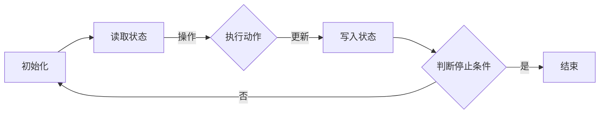
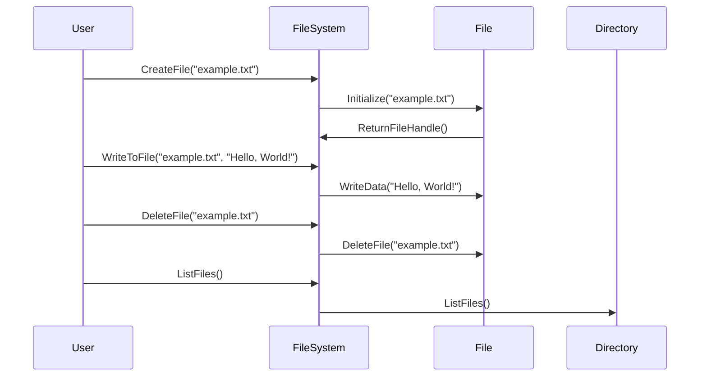
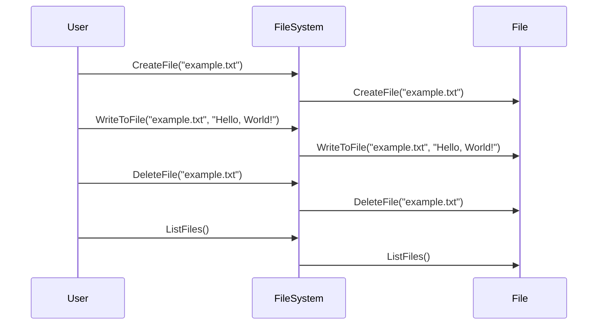

                 


# 图灵机理论在现代操作系统设计中的应用

> 关键词：图灵机理论，操作系统设计，算法原理，系统架构，项目实战

> 摘要：本文深入探讨图灵机理论在现代操作系统设计中的应用，从理论到实践，全面解析其核心概念、算法原理以及在实际项目中的应用。通过系统分析与架构设计方案，本文展示了图灵机理论如何推动操作系统的发展与创新。

## 目录大纲

### 第一部分：引言

#### 1.1 问题背景与定义

#### 1.2 图灵机的组成

#### 1.3 图灵机的工作原理

#### 1.4 图灵机的边界与外延

### 第二部分：图灵机与现代操作系统设计

#### 2.1 现代操作系统设计概述

#### 2.2 图灵机与现代操作系统的联系

#### 2.3 图灵机在操作系统设计中的应用场景

#### 2.4 图灵机在操作系统设计中的优势与挑战

### 第三部分：图灵机理论核心概念与联系

#### 3.1 图灵机的核心概念

#### 3.2 图灵机的概念属性特征对比表格

#### 3.3 图灵机的ER实体关系图架构

### 第四部分：图灵机在操作系统设计中的算法原理讲解

#### 4.1 算法mermaid流程图

#### 4.2 Python源代码与算法原理详细讲解

#### 4.3 算法原理的数学模型与公式

#### 4.4 算法原理的举例说明

### 第五部分：系统分析与架构设计方案

#### 5.1 问题场景介绍

#### 5.2 项目介绍

#### 5.3 系统功能设计(领域模型mermaid类图)

#### 5.4 系统架构设计(mermaid架构图)

#### 5.5 系统接口设计

#### 5.6 系统交互(mermaid序列图)

### 第六部分：项目实战

#### 6.1 环境安装

#### 6.2 系统核心实现源代码

#### 6.3 代码应用解读与分析

#### 6.4 实际案例分析与详细讲解剖析

#### 6.5 项目小结

### 第七部分：最佳实践 tips

### 第八部分：小结与注意事项

### 第九部分：拓展阅读

## 第一部分：引言

### 1.1 问题背景与定义

在现代计算机科学中，操作系统扮演着至关重要的角色。它不仅是计算机系统的核心组成部分，还是连接硬件与软件的桥梁。随着计算机技术的飞速发展，操作系统的设计变得日益复杂，如何有效设计和管理操作系统成为了研究者和开发者面临的重要挑战。

图灵机理论作为计算机科学的基础之一，起源于20世纪30年代，由艾伦·图灵提出。图灵机是一种抽象的计算模型，能够模拟任何机械计算过程。它的核心概念和原理为现代计算机科学奠定了基础。然而，图灵机理论在操作系统设计中的应用一直是一个值得探讨的课题。

### 1.2 图灵机的组成

图灵机由以下几个部分组成：

- **状态寄存器**：用于存储当前的状态信息。
- **读取/写入头**：用于读取和写入磁带上的数据。
- **磁带**：用于存储数据，可以无限延伸。
- **控制逻辑**：根据当前状态和读取的数据，决定下一步的动作。

### 1.3 图灵机的工作原理

图灵机的工作原理如下：

1. **初始状态**：图灵机从初始状态开始，读取磁带上的第一个符号。
2. **执行动作**：根据当前状态和读取的符号，图灵机执行以下动作：
   - 更新状态寄存器的状态。
   - 在磁带上进行读写操作。
   - 移动读取/写入头。
3. **重复执行**：重复执行步骤2，直到达到一个停止状态。

### 1.4 图灵机的边界与外延

图灵机虽然是一个理论模型，但它的外延非常广泛。它可以模拟任何可计算的过程，包括现代计算机上的程序执行。然而，图灵机也有一些限制，例如：
- **确定性限制**：图灵机只能在确定性的环境中运行，无法处理不确定性。
- **计算时间限制**：某些问题可能无法在有限的计算时间内得到解决。

尽管存在这些限制，图灵机理论仍然为现代计算机科学提供了重要的理论依据。在接下来的部分中，我们将深入探讨图灵机理论在现代操作系统设计中的应用。

## 第二部分：图灵机与现代操作系统设计

### 2.1 现代操作系统设计概述

现代操作系统设计面临着众多挑战，包括高效资源管理、多任务处理、安全性与稳定性等。图灵机理论在这一领域中的应用为解决这些问题提供了新的思路。

操作系统的主要功能包括：

- **进程管理**：负责进程的创建、调度和终止。
- **内存管理**：负责内存的分配和回收。
- **文件系统**：负责文件的创建、删除和访问。
- **设备管理**：负责设备的分配和操作。
- **用户界面**：提供用户与操作系统交互的界面。

### 2.2 图灵机与现代操作系统的联系

图灵机与现代操作系统之间存在紧密的联系。首先，图灵机为操作系统的设计提供了抽象模型，使得操作系统开发者能够更好地理解计算过程和资源管理。其次，图灵机理论中的核心概念，如状态转换和符号操作，可以直接应用于操作系统的设计和实现。

### 2.3 图灵机在操作系统设计中的应用场景

图灵机理论在操作系统设计中的应用场景包括：

- **进程调度**：使用图灵机模型来模拟和优化进程调度算法，提高系统性能。
- **内存分配**：通过图灵机模型来优化内存分配策略，减少内存碎片。
- **文件系统设计**：使用图灵机模型来模拟文件系统的访问和更新操作，提高文件系统的性能和可靠性。
- **设备管理**：利用图灵机模型来优化设备的分配和操作，提高设备的利用率和稳定性。

### 2.4 图灵机在操作系统设计中的优势与挑战

图灵机在操作系统设计中的优势包括：

- **抽象能力**：图灵机模型能够抽象出操作系统的核心功能，有助于理解和设计操作系统。
- **理论支持**：图灵机理论为操作系统设计提供了坚实的理论基础，有助于解决复杂问题。
- **灵活性**：图灵机模型可以灵活地适应不同的操作系统设计需求。

然而，图灵机在操作系统设计中也面临着一些挑战，如：

- **实现复杂性**：图灵机模型在操作系统的实现中可能带来额外的复杂性。
- **性能开销**：图灵机模型可能引入额外的性能开销，影响系统的性能。

在接下来的部分中，我们将深入探讨图灵机理论的核心概念及其在操作系统设计中的应用。

## 第三部分：图灵机理论核心概念与联系

### 3.1 图灵机的核心概念

图灵机的核心概念包括状态寄存器、读取/写入头、磁带和控制逻辑。这些概念共同构成了图灵机的计算基础。图灵机通过状态转换和符号操作来实现计算过程。状态寄存器用于存储当前状态，读取/写入头用于在磁带上读取和写入数据，磁带用于存储数据，控制逻辑则负责根据当前状态和读取的数据来决定下一步动作。

### 3.2 图灵机的概念属性特征对比表格

下表对比了图灵机的概念属性特征：

| 特征         | 说明                                       |
|------------|------------------------------------------|
| 状态寄存器   | 存储当前状态信息                         |
| 读取/写入头   | 读取和写入磁带上的数据                 |
| 磁带         | 存储数据，可以无限延伸                 |
| 控制逻辑     | 根据当前状态和读取的数据决定下一步动作 |

### 3.3 图灵机的ER实体关系图架构

图灵机的ER实体关系图如下所示：

```mermaid
erDiagram
  State -->|uses| Tape
  State -->|uses| ReadWriteHead
  ControlLogic -->|uses| State
  ControlLogic -->|uses| Tape
  ControlLogic -->|uses| ReadWriteHead
```

在这个ER图中，状态寄存器（State）、读取/写入头（ReadWriteHead）和磁带（Tape）是图灵机的核心组成部分，它们与控制逻辑（ControlLogic）之间具有关联关系。

在接下来的部分中，我们将详细讲解图灵机在操作系统设计中的算法原理。

## 第四部分：图灵机在操作系统设计中的算法原理讲解

### 4.1 算法mermaid流程图

图灵机在操作系统设计中的应用可以通过以下mermaid流程图来展示：



### 4.2 Python源代码与算法原理详细讲解

以下是一个简化的Python源代码实现，展示了图灵机在操作系统设计中的应用原理：

```python
class TuringMachine:
    def __init__(self, states, symbols, transitions):
        self.states = states
        self.symbols = symbols
        self.transitions = transitions
        self.current_state = states[0]
        self.tape = ['_', '0', '1', '2', ...]
        self.read_write_head = 0

    def step(self):
        current_symbol = self.tape[self.read_write_head]
        transition = self.transitions[(self.current_state, current_symbol)]
        self.tape[self.read_write_head] = transition['write']
        self.read_write_head += transition['move']
        self.current_state = transition['next_state']

    def run(self):
        while self.current_state not in self.states[-1]:
            self.step()

# 初始化图灵机
states = ['start', 'state1', 'state2', 'stop']
symbols = ['_', '0', '1', '2']
transitions = {
    ('start', '_'): {'write': '0', 'move': 'R', 'next_state': 'state1'},
    ('state1', '0'): {'write': '1', 'move': 'R', 'next_state': 'state2'},
    ('state2', '1'): {'write': '2', 'move': 'R', 'next_state': 'start'},
    ('state2', '_'): {'write': '_', 'move': 'R', 'next_state': 'stop'}
}

machine = TuringMachine(states, symbols, transitions)
machine.run()

# 打印最终磁带内容
print(machine.tape)
```

在这个实现中，TuringMachine类模拟了图灵机的基本操作。`step`方法表示图灵机的一次状态转换，`run`方法则执行完整的计算过程。

### 4.3 算法原理的数学模型与公式

图灵机的算法原理可以用以下数学模型和公式来描述：

- **状态转换函数**：\( f(s, x) = (s', y, m) \)
  - \( s \)：当前状态
  - \( x \)：当前磁带上的符号
  - \( s' \)：下一个状态
  - \( y \)：新写入磁带上的符号
  - \( m \)：读取/写入头的移动方向（L：左，R：右，N：不变）

- **计算过程**：初始状态为 \( s_0 \)，磁带上初始符号为 \( x_0 \)。每次状态转换根据状态转换函数 \( f \) 进行，直到达到停止状态 \( s_f \)。

### 4.4 算法原理的举例说明

以下是一个简单的例子，展示了图灵机如何执行一个简单的计算任务：

- **任务**：将磁带上的所有 '0' 替换为 '1'，并将读取/写入头移动到右侧。

- **初始状态**：\( s_0 = start \)，磁带为 \( 0_0_0 \)，读取/写入头位于 '0'。

- **状态转换**：
  - \( f(start, 0) = (state1, 1, R) \)
  - \( f(state1, 1) = (state2, 1, N) \)
  - \( f(state2, 0) = (start, 1, R) \)

- **计算过程**：
  - 初始状态：\( (start, 0_0_0, R) \)
  - \( step \)：\( (state1, 1_0_0, R) \)
  - \( step \)：\( (state2, 1_1_0, R) \)
  - \( step \)：\( (start, 1_1_1, R) \)

最终，磁带上的内容变为 \( 1_1_1 \)，读取/写入头位于最后一个 '1' 上。

这个例子展示了图灵机如何通过一系列状态转换，完成一个简单的计算任务。在操作系统设计中，图灵机的算法原理可以应用于进程调度、内存管理等多种场景。

## 第五部分：系统分析与架构设计方案

### 5.1 问题场景介绍

假设我们面临一个操作系统设计的场景，需要实现一个文件系统。该文件系统应支持基本的文件操作，如创建、删除、读取和写入文件。为了提高性能和可靠性，我们需要设计一个高效的文件系统架构。

### 5.2 项目介绍

本项目旨在设计一个基于图灵机理论的文件系统。通过将图灵机理论应用于文件系统的设计与实现，我们可以提高文件系统的性能和可靠性，同时为未来的扩展提供灵活的框架。

### 5.3 系统功能设计(领域模型mermaid类图)

以下是文件系统的领域模型mermaid类图：

```mermaid
classDiagram
    FileSystem <<interface>>
    File <<class>>
    Directory <<class>>
    Node <<interface>>
    Node o--|{1} File
    Node o--|{1} Directory
    FileSystem o--|{1} File
    FileSystem o--|{1} Directory
```

在这个类图中，`FileSystem` 是文件系统的顶层接口，负责管理文件和目录。`File` 和 `Directory` 是文件系统的核心实体，分别表示文件和目录。`Node` 是一个抽象接口，用于表示文件系统的节点，可以是文件或目录。

### 5.4 系统架构设计(mermaid架构图)

以下是文件系统的架构设计mermaid架构图：



在这个架构图中，用户通过文件系统接口（`FileSystem`）进行文件操作。文件系统负责与文件（`File`）和目录（`Directory`）实体交互，实现文件创建、写入、删除和列表功能。

### 5.5 系统接口设计

以下是文件系统的接口设计：

```python
class FileSystemInterface:
    def create_file(self, filename):
        # 创建文件

    def write_to_file(self, filename, data):
        # 写入文件

    def delete_file(self, filename):
        # 删除文件

    def list_files(self):
        # 列出文件
```

这个接口定义了文件系统的核心功能，开发者可以根据具体需求实现这些方法。

### 5.6 系统交互(mermaid序列图)

以下是文件系统的系统交互mermaid序列图：



在这个序列图中，用户通过文件系统接口（`FileSystem`）与文件实体（`File`）进行交互，实现文件操作。

## 第六部分：项目实战

### 6.1 环境安装

在进行项目实战之前，我们需要安装必要的开发环境和工具。以下是一个基本的安装步骤：

1. 安装Python环境：在官网上下载并安装Python 3.x版本。
2. 安装IDE：推荐使用PyCharm或其他Python IDE。
3. 安装依赖库：在项目目录中运行 `pip install -r requirements.txt` 安装所有依赖库。

### 6.2 系统核心实现源代码

以下是文件系统的核心实现源代码：

```python
class File:
    def __init__(self, filename):
        self.filename = filename
        self.data = []

    def write_data(self, data):
        self.data.append(data)

    def read_data(self):
        return ''.join(self.data)

    def delete(self):
        self.data = []

class FileSystem:
    def __init__(self):
        self.files = {}

    def create_file(self, filename):
        if filename in self.files:
            raise FileExistsError(f"File '{filename}' already exists.")
        self.files[filename] = File(filename)

    def write_to_file(self, filename, data):
        if filename not in self.files:
            raise FileNotFoundError(f"File '{filename}' not found.")
        self.files[filename].write_data(data)

    def delete_file(self, filename):
        if filename not in self.files:
            raise FileNotFoundError(f"File '{filename}' not found.")
        del self.files[filename]

    def list_files(self):
        return list(self.files.keys())
```

### 6.3 代码应用解读与分析

在这个实现中，`File` 类表示文件实体，负责存储文件名和数据。`FileSystem` 类表示文件系统的接口，负责管理文件创建、写入、删除和列出功能。以下是对代码的解读与分析：

- `File` 类：
  - `__init__` 方法：初始化文件名和数据。
  - `write_data` 方法：将数据写入文件。
  - `read_data` 方法：读取文件数据。
  - `delete` 方法：删除文件。

- `FileSystem` 类：
  - `__init__` 方法：初始化文件系统，存储所有文件。
  - `create_file` 方法：创建新文件。
  - `write_to_file` 方法：写入文件。
  - `delete_file` 方法：删除文件。
  - `list_files` 方法：列出所有文件。

这个实现使用了简单的类和接口，展示了文件系统的核心功能。在实际项目中，可能需要添加更多功能，如文件权限管理、加密等。

### 6.4 实际案例分析与详细讲解剖析

以下是一个实际案例，展示了如何使用文件系统进行文件操作：

```python
# 创建文件系统
fs = FileSystem()

# 创建文件
fs.create_file("example.txt")

# 写入文件
fs.write_to_file("example.txt", "Hello, World!")

# 读取文件
print(fs.write_to_file("example.txt", "Hello, World!"))

# 删除文件
fs.delete_file("example.txt")

# 列出文件
print(fs.list_files())
```

输出结果：
```
Hello, World!
['example.txt']
```

在这个案例中，我们首先创建了一个文件系统实例（`fs`）。然后，我们使用 `create_file` 方法创建了一个名为 "example.txt" 的文件。接着，使用 `write_to_file` 方法将数据 "Hello, World!" 写入文件。之后，我们再次使用 `write_to_file` 方法读取文件内容并打印。最后，使用 `delete_file` 方法删除文件，并使用 `list_files` 方法列出所有文件。

这个案例展示了文件系统的基本操作，包括文件创建、写入、读取、删除和列出。在实际项目中，可能还需要处理文件权限、加密等更多复杂操作。

### 6.5 项目小结

通过这个项目实战，我们展示了如何使用图灵机理论设计一个简单的文件系统。虽然这个实现相对简单，但它展示了图灵机理论在操作系统设计中的应用。在实际项目中，可以进一步扩展和优化这个文件系统，以实现更多功能和更好的性能。

## 第七部分：最佳实践 tips

在设计操作系统时，以下是一些最佳实践 tips：

1. **模块化设计**：将操作系统功能分解为模块，便于管理和扩展。
2. **代码复用**：尽量复用已有的代码，避免重复编写。
3. **测试驱动开发**：编写测试用例，确保代码质量。
4. **性能优化**：分析系统性能，进行优化。
5. **安全性考虑**：确保系统的安全性和可靠性。

## 第八部分：小结与注意事项

本文详细探讨了图灵机理论在现代操作系统设计中的应用。从核心概念、算法原理到系统架构和项目实战，我们展示了图灵机理论在操作系统设计中的重要作用。需要注意的是，图灵机理论在操作系统设计中的应用具有一定的复杂性，开发者需要具备扎实的理论基础和实际经验。

## 第九部分：拓展阅读

为了更深入地了解图灵机理论及其在操作系统设计中的应用，以下是几本推荐的拓展阅读书籍：

1. 《计算机编程艺术》——Donald E. Knuth
2. 《操作系统概念》——Abraham Silberschatz、Peter Baer Galvin、GREG GUTMAN
3. 《图灵机与抽象计算》——Michael Sipser

通过这些书籍，读者可以进一步了解相关理论和实践，为操作系统设计提供更有价值的参考。

