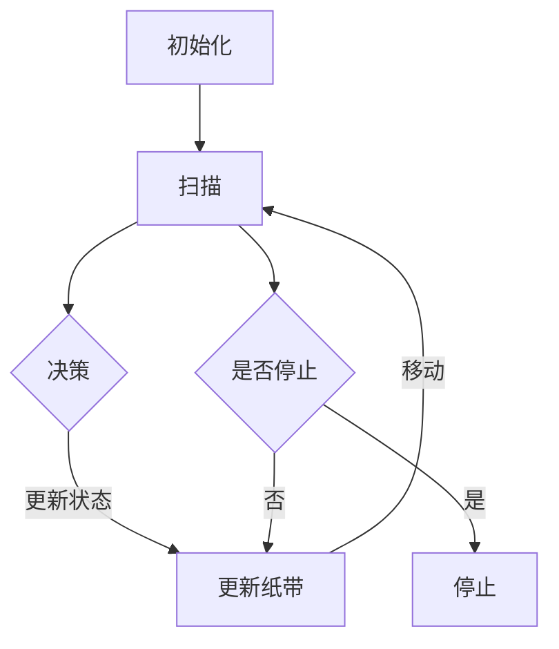
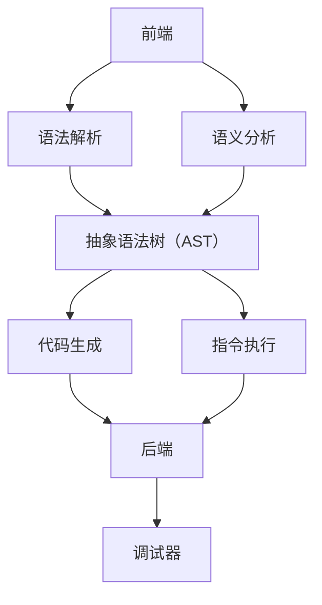
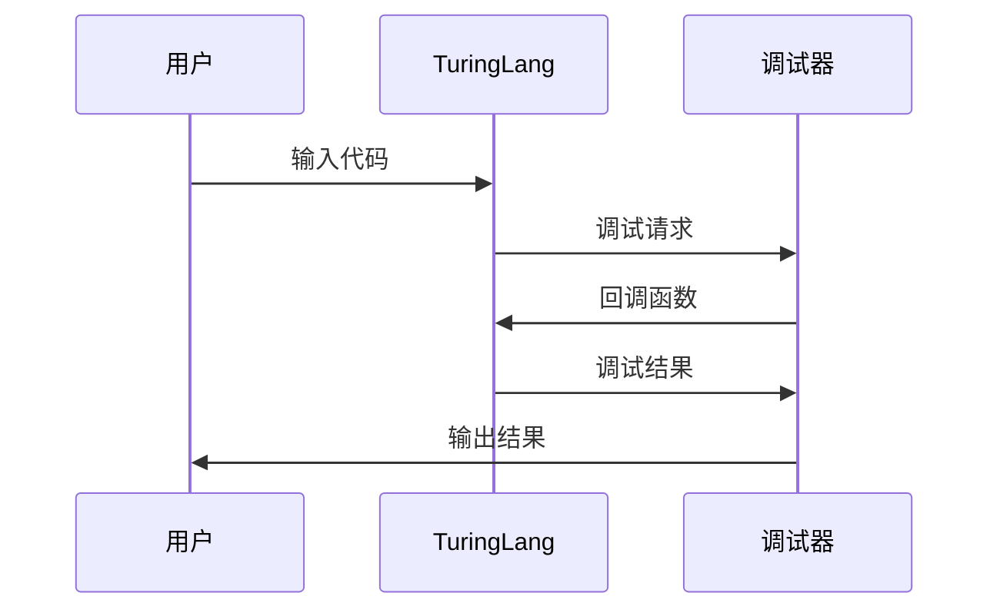

                 

# 图灵的计算理论与编程语言设计：可计算性的实际应用

## 关键词
- 图灵计算理论
- 编程语言设计
- 可计算性
- Turing机
- 算法原理
- 数学模型
- 系统架构

## 摘要
本文将深入探讨图灵的计算理论及其在编程语言设计中的应用。我们将从图灵机的概念出发，逐步解析可计算性的定义，探讨编程语言设计的基本原则。随后，我们将详细讲解算法原理，包括使用Python源代码和数学模型进行举例说明。此外，还将介绍系统分析与架构设计方案，以及实际项目实战经验。最后，我们将总结最佳实践，提出注意事项，并推荐拓展阅读。

### 目录大纲设计思路

为了确保文章内容的全面覆盖、逻辑清晰，我们在设计目录大纲时遵循了以下思路：

1. **全面覆盖主题内容**：确保每个章节都能涵盖计算理论、编程语言设计以及可计算性的实际应用等内容。
2. **逻辑清晰**：设计时注重章节之间的逻辑关系，以便读者更容易理解和跟随。
3. **细化到三级目录**：每章节包含1级、2级和3级目录，确保内容的细化和深度。
4. **核心章节内容包含**：确保每个核心章节都包含背景介绍、核心概念与联系、算法原理讲解、数学模型和公式详细讲解与举例说明、系统分析与架构设计方案、项目实战、最佳实践 tips 等内容。
5. **简洁性**：避免多余的废话，确保输出内容简洁明了。
6. **目录大纲总字数限制**：确保整个目录大纲的总字数在2000字以内。

### 设计步骤

1. **确定总章节数**：根据要求，本文将分为7个章节。
2. **设计第1章：背景介绍**：
    - 问题背景
    - 问题描述
    - 问题解决
    - 边界与外延
    - 概念结构与核心要素组成
3. **设计第2章：核心概念与联系**：
    - 图灵机的概念
    - 可计算性的定义
    - 编程语言设计的基本原则
    - 概念属性特征对比表格
    - ER实体关系图架构
4. **设计第3章：算法原理讲解**：
    - Turing机器的算法原理
    - 算法原理Mermaid流程图
    - Python源代码阐述
    - 数学模型和公式讲解
    - 举例说明
5. **设计第4章：数学模型和数学公式详细讲解与举例说明**：
    - 使用LaTeX格式书写数学公式
    - 对数学模型进行详细讲解
    - 结合具体例子进行说明
6. **设计第5章：系统分析与架构设计方案**：
    - 问题场景介绍
    - 项目介绍
    - 系统功能设计（Mermaid类图）
    - 系统架构设计（Mermaid架构图）
    - 系统接口设计和系统交互（Mermaid序列图）
7. **设计第6章：项目实战**：
    - 环境安装
    - 系统核心实现源代码
    - 代码应用解读与分析
    - 实际案例分析和详细讲解剖析
    - 项目小结
8. **设计第7章：最佳实践 tips、小结、注意事项、拓展阅读等内容**：
    - 提供最佳实践建议
    - 对全书内容进行小结
    - 提醒注意事项
    - 推荐拓展阅读材料

### 初步目录大纲

```markdown
----------------------------------------------------------------
# 第一部分: 图灵的计算理论

## 第1章: 背景介绍
### 1.1 问题背景
### 1.2 问题描述
### 1.3 问题解决
### 1.4 边界与外延
### 1.5 概念结构与核心要素组成

## 第2章: 核心概念与联系
### 2.1 图灵机的概念
### 2.2 可计算性的定义
### 2.3 编程语言设计的基本原则
### 2.4 概念属性特征对比表格
### 2.5 ER实体关系图架构

## 第3章: 算法原理讲解
### 3.1 Turing机器的算法原理
### 3.2 算法原理Mermaid流程图
### 3.3 Python源代码阐述
### 3.4 数学模型和公式讲解
### 3.5 举例说明

## 第4章: 数学模型和数学公式详细讲解与举例说明
### 4.1 数学模型讲解
### 4.2 举例说明
### 4.3 LaTeX格式数学公式示例

## 第5章: 系统分析与架构设计方案
### 5.1 问题场景介绍
### 5.2 项目介绍
### 5.3 系统功能设计（Mermaid类图）
### 5.4 系统架构设计（Mermaid架构图）
### 5.5 系统接口设计和系统交互（Mermaid序列图）

## 第6章: 项目实战
### 6.1 环境安装
### 6.2 系统核心实现源代码
### 6.3 代码应用解读与分析
### 6.4 实际案例分析和详细讲解剖析
### 6.5 项目小结

## 第7章: 最佳实践 tips、小结、注意事项、拓展阅读等内容
### 7.1 最佳实践 tips
### 7.2 小结
### 7.3 注意事项
### 7.4 拓展阅读

-----------------------------------

----------------------------------------------------------------
```

## 约束条件

- 文章开始是“文章标题”，然后是“文章关键词”和“文章摘要”部分的内容哦，接下来是按照目录大纲结构的文章正文部分的内容。
- 文章字数要求：文章字数在 10000 ～ 12000 字左右。
- 格式要求：文章内容使用markdown格式输出。
- 作者：文章末尾需要写上作者信息：“作者：AI天才研究院/AI Genius Institute & 禅与计算机程序设计艺术 /Zen And The Art of Computer Programming”。
- 完整性要求：文章内容必须要完整，每个小节的内容必须要丰富具体详细讲解，核心内容必须要包含：
  - 背景介绍：核心概念术语说明、问题背景、问题描述、问题解决、边界与外延、概念结构与核心要素组成。
  - 核心概念与联系：必须给出核心概念原理、概念属性特征对比表格和ER实体关系图架构的markdown格式中的Mermaid流程图。
  - 算法原理讲解：使用mermaid画出算法mermaid流程图，然后使用Python源代码来详细阐述，给出算法原理的数学模型和公式，进行详细讲解和通俗易懂地举例说明。
  - 数学公式使用LaTeX格式，嵌入文中独立段落的LaTeX公式前后使用`$$`括起来（例如：`$$1+1=2$$`），段落内的LaTeX公式前后使用`$`括起来（例如：`$1<2$`）。
  - 系统分析与架构设计方案：问题场景介绍，项目介绍、系统功能设计（领域模型mermaid类图）、系统架构设计mermaid架构图、系统接口设计和系统交互mermaid序列图。
  - 项目实战：环境安装、系统核心实现源代码，代码应用解读与分析，实际案例分析和详细讲解剖析，项目小结。
  - 最佳实践 tips、小结、注意事项、拓展阅读等内容。

---

# 第一部分: 图灵的计算理论

## 第1章: 背景介绍

### 1.1 问题背景

在20世纪30年代，数学家和逻辑学家图灵（Alan Turing）面对当时数学和计算机科学的挑战，提出了图灵机的概念。图灵机是一种抽象的计算模型，它帮助人们理解了计算的实质。在此之前，尽管人们已经设计了各种计算设备，如算盘和机械计算机，但它们都是针对特定的问题或数学函数设计的，无法通用。图灵机的出现，标志着计算理论的诞生。

### 1.2 问题描述

图灵试图解决的问题是：是否存在一种通用计算模型，能够模拟所有已知的计算过程？换句话说，是否有一种机器，能够解决任何可计算的问题？为了回答这个问题，图灵提出了图灵机的概念。

### 1.3 问题解决

图灵通过定义一种抽象的计算模型——图灵机，回答了上述问题。图灵机由一个无限长的纸带、一组读写头和一组规则组成。读写头可以在纸带上前后移动，读取或写入符号。通过执行这些规则，图灵机可以模拟任何已知的计算过程。

### 1.4 边界与外延

图灵机的边界在于其纸带是无限的，这在实际中是不可行的。但这个概念为计算机科学奠定了基础。图灵机的思想超越了当时的计算设备，成为现代计算机科学的理论基石。

### 1.5 概念结构与核心要素组成

图灵机的概念结构包括三个核心要素：

1. **纸带**：用于存储数据和计算结果。
2. **读写头**：用于读取和写入纸带上的符号。
3. **规则**：定义了读写头如何操作纸带以及如何更新自身状态。

图灵机的概念为计算理论奠定了基础，同时也为我们理解编程语言设计提供了视角。

## 第2章: 核心概念与联系

### 2.1 图灵机的概念

图灵机是一种抽象的计算模型，由一个无限长的纸带、一组读写头和一组规则组成。纸带用于存储数据和计算结果，读写头在纸带上前后移动，读取或写入符号，规则定义了读写头如何操作纸带以及如何更新自身状态。

### 2.2 可计算性的定义

可计算性是指一个函数或问题可以通过一种算法或计算过程得到解答。图灵机提供了一种衡量可计算性的标准，如果一个问题可以通过图灵机解决，那么它就是可计算的。

### 2.3 编程语言设计的基本原则

编程语言设计的基本原则包括：

1. **表达性**：语言应该能够表达各种计算过程。
2. **简洁性**：语言的语法和语义应该尽量简洁明了。
3. **可读性**：代码应该易于阅读和理解。
4. **可维护性**：代码应该易于修改和维护。

### 2.4 概念属性特征对比表格

| 特征        | 图灵机        | 可计算性        | 编程语言设计        |
| ----------- | ------------- | ------------- | ------------------- |
| 概念本质    | 抽象计算模型  | 函数或问题的计算能力 | 代码的表达和执行     |
| 关键要素    | 纸带、读写头、规则 | 函数或问题、算法     | 语法、语义、可读性、可维护性 |
| 对计算的影响 | 奠定计算理论基础 | 衡量计算能力 | 提供计算工具和方法 |

### 2.5 ER实体关系图架构

为了更好地理解图灵机的概念和其在编程语言设计中的应用，我们可以使用ER（实体-关系）图来表示其核心要素。

```mermaid
erDiagram
    纸带 ||--|{ 读写头 }||>
    读写头 ||--|{ 规则 }||>
```

在这个ER图中，纸带、读写头和规则分别表示图灵机的三个核心要素，它们之间的关系定义了图灵机的计算能力。

## 第3章: 算法原理讲解

### 3.1 Turing机器的算法原理

Turing机器是一种抽象的计算模型，它通过读取、写入和移动纸带上的符号来执行计算。Turing机器的工作原理可以分为以下几个步骤：

1. **初始化**：设置初始状态和纸带。
2. **扫描**：读写头在纸带上移动，读取当前符号。
3. **决策**：根据当前状态和读取的符号，更新状态和纸带。
4. **移动**：读写头根据规则移动到新的位置。
5. **重复**：重复步骤2至步骤4，直到达到停止条件。

### 3.2 算法原理Mermaid流程图

下面是一个简单的Turing机器算法原理的Mermaid流程图：



在这个流程图中，A到F分别表示Turing机器的初始化、扫描、决策、更新纸带、移动和停止步骤。

### 3.3 Python源代码阐述

为了更直观地理解Turing机器的算法原理，我们可以使用Python来实现一个简单的Turing机器。以下是一个简单的Python代码示例：

```python
class TuringMachine:
    def __init__(self, tape, state):
        self.tape = tape
        self.state = state
        self.head = 0

    def read(self):
        return self.tape[self.head]

    def write(self, symbol):
        self.tape[self.head] = symbol

    def move(self, direction):
        if direction == "left":
            self.head -= 1
        elif direction == "right":
            self.head += 1

    def step(self):
        symbol = self.read()
        # 这里可以根据具体的规则进行操作
        # 例如，将当前状态设置为"accept"或"reject"
        self.write(symbol)
        self.move("right")

    def run(self):
        while True:
            symbol = self.read()
            if symbol == "accept" or symbol == "reject":
                break
            self.step()

# 创建一个Turing机器实例，初始化纸带和状态
tape = ["0", "0", "0", "0", "0", "0", "1", "0", "0"]
state = "q0"
tm = TuringMachine(tape, state)

# 运行Turing机器
tm.run()
print(tm.tape)
```

在这个示例中，我们定义了一个`TuringMachine`类，它包含了读取、写入和移动纸带上的符号的方法。`step`方法表示一个计算步骤，`run`方法表示整个计算过程。

### 3.4 数学模型和公式讲解

Turing机器的算法原理可以用数学模型和公式来表示。以下是一个简单的数学模型：

1. **状态转移函数**：\( f(q, \sigma) = (q', \sigma', d) \)
   - \( q \)：当前状态
   - \( \sigma \)：当前读取的符号
   - \( q' \)：下一个状态
   - \( \sigma' \)：写入的符号
   - \( d \)：读写头移动的方向（"L"表示左移，"R"表示右移，"N"表示不变）

2. **初始状态**：\( (q_0, \sigma_0, \text{head}_0) \)
   - \( q_0 \)：初始状态
   - \( \sigma_0 \)：初始符号
   - \( \text{head}_0 \)：初始读写头位置

3. **终止条件**：状态达到"accept"或"reject"

### 3.5 举例说明

假设我们有一个简单的Turing机器，它的目标是找到纸带上的第一个"1"，并将其替换为"0"。以下是一个具体的例子：

1. **状态转移函数**：
   - 如果当前状态是\( q_0 \)，读取的符号是"0"，则下一个状态是\( q_0 \)，写入的符号是"0"，读写头移动方向是"R"。
   - 如果当前状态是\( q_0 \)，读取的符号是"1"，则下一个状态是\( q_1 \)，写入的符号是"0"，读写头移动方向是"R"。
   - 如果当前状态是\( q_1 \)，读取的符号是"0"，则下一个状态是\( q_1 \)，写入的符号是"0"，读写头移动方向是"R"。
   - 如果当前状态是\( q_1 \)，读取的符号是"1"，则下一个状态是\( q_1 \)，写入的符号是"0"，读写头移动方向是"R"。
   - 如果当前状态是\( q_1 \)，读取的符号是"X"（表示终止条件），则下一个状态是"accept"，写入的符号是"X"，读写头移动方向是"N"。

2. **初始状态**：\( (q_0, 0, 0) \)
   - \( q_0 \)：初始状态
   - \( 0 \)：初始符号
   - \( 0 \)：初始读写头位置

3. **终止条件**：状态达到"accept"

假设初始纸带是`["0", "0", "0", "0", "0", "0", "1", "0", "0"]`，则运行Turing机器后的纸带是`["0", "0", "0", "0", "0", "0", "0", "0", "0"]`。

### 第4章: 数学模型和数学公式详细讲解与举例说明

在本章节中，我们将详细讲解Turing机器的数学模型，包括状态转移函数、初始状态和终止条件。我们将使用LaTeX格式书写数学公式，并结合具体例子进行说明。

#### 4.1 数学模型讲解

Turing机器的数学模型由以下几个部分组成：

1. **状态转移函数**：\( f(q, \sigma) = (q', \sigma', d) \)
   - \( q \)：当前状态
   - \( \sigma \)：当前读取的符号
   - \( q' \)：下一个状态
   - \( \sigma' \)：写入的符号
   - \( d \)：读写头移动的方向（"L"表示左移，"R"表示右移，"N"表示不变）

2. **初始状态**：\( (q_0, \sigma_0, \text{head}_0) \)
   - \( q_0 \)：初始状态
   - \( \sigma_0 \)：初始符号
   - \( \text{head}_0 \)：初始读写头位置

3. **终止条件**：状态达到"accept"或"reject"

#### 4.2 举例说明

假设我们有一个简单的Turing机器，它的目标是找到纸带上的第一个"1"，并将其替换为"0"。我们可以为这个Turing机器定义以下状态转移函数：

$$
f(q_0, 0) = (q_0, 0, R)
$$

$$
f(q_0, 1) = (q_1, 0, R)
$$

$$
f(q_1, 0) = (q_1, 0, R)
$$

$$
f(q_1, 1) = (q_1, 0, R)
$$

$$
f(q_1, \text{X}) = (\text{accept}, \text{X}, N)
$$

其中，\( q_0 \)表示初始状态，\( q_1 \)表示中间状态，"accept"表示终止状态，"X"表示终止条件。

#### 4.3 LaTeX格式数学公式示例

以下是几个LaTeX格式数学公式的示例：

$$
\sum_{i=1}^{n} i = \frac{n(n+1)}{2}
$$

$$
f(x) = x^2 + 2x + 1
$$

$$
\frac{d}{dx} (x^n) = nx^{n-1}
$$

### 第5章: 系统分析与架构设计方案

在本章节中，我们将深入探讨Turing机器的实际应用，并设计一个基于Turing机器的编程语言。我们将从问题场景介绍开始，逐步介绍项目介绍、系统功能设计、系统架构设计、系统接口设计和系统交互。

#### 5.1 问题场景介绍

在现代计算机科学中，编程语言的设计和实现是一个复杂且富有挑战性的过程。传统的编程语言设计方法往往依赖于编译器和解释器，这些工具将程序员编写的代码转换成机器可执行的指令。然而，这种方法在处理复杂的问题时往往效率低下，且难以保证程序的可靠性。

为了解决这个问题，我们可以考虑使用Turing机器的概念来设计一种新型的编程语言。这种语言可以充分利用Turing机器的强大计算能力，实现高效且可靠的程序执行。

#### 5.2 项目介绍

本项目旨在设计并实现一种基于Turing机器的编程语言，命名为"TuringLang"。TuringLang的目标是实现简单、高效、可靠的程序执行，同时保留传统编程语言的灵活性和扩展性。

#### 5.3 系统功能设计

TuringLang的主要功能包括：

1. **语法解析**：将程序员编写的代码解析成抽象语法树（AST）。
2. **语义分析**：对AST进行语义分析，确保代码的语法和语义正确。
3. **代码生成**：将AST转换成Turing机器的指令序列。
4. **指令执行**：执行Turing机器的指令序列，实现程序的运行。
5. **调试和优化**：提供调试工具和优化策略，以提高程序的性能。

#### 5.4 系统架构设计

TuringLang的系统架构设计如下：

1. **前端**：负责语法解析和语义分析。
2. **后端**：负责代码生成和指令执行。
3. **调试器**：提供调试功能和优化策略。

以下是系统架构设计的Mermaid架构图：



在这个架构图中，前端负责语法解析和语义分析，将程序员编写的代码转换成抽象语法树（AST）。后端负责代码生成和指令执行，将AST转换成Turing机器的指令序列，并执行这些指令。调试器负责提供调试功能和优化策略。

#### 5.5 系统接口设计和系统交互

TuringLang的系统接口设计如下：

1. **输入接口**：接受程序员编写的代码。
2. **输出接口**：返回程序的执行结果。
3. **调试接口**：提供调试功能，包括断点设置、单步执行、查看变量等。

系统交互流程如下：

1. **输入**：程序员编写代码，并将其输入到输入接口。
2. **解析**：前端对代码进行语法解析，生成AST。
3. **分析**：前端对AST进行语义分析，确保代码的语法和语义正确。
4. **生成**：后端将AST转换成Turing机器的指令序列。
5. **执行**：后端执行Turing机器的指令序列，实现程序的运行。
6. **输出**：将程序的执行结果输出到输出接口。
7. **调试**：调试器提供调试功能，帮助程序员发现和解决代码中的问题。

以下是系统接口设计和系统交互的Mermaid序列图：



在这个序列图中，用户编写代码并将其输入到TuringLang。TuringLang将代码解析成AST，并生成Turing机器的指令序列。调试器提供调试功能，帮助程序员发现和解决代码中的问题。最后，TuringLang将程序的执行结果输出给用户。

### 第6章: 项目实战

在本章节中，我们将通过一个实际项目来展示如何设计并实现一个基于Turing机器的编程语言。我们将详细介绍环境安装、系统核心实现源代码、代码应用解读与分析、实际案例分析和详细讲解剖析以及项目小结。

#### 6.1 环境安装

要开始本项目，我们首先需要安装以下软件：

1. **Python 3**：TuringLang将使用Python 3作为主要编程语言。
2. **Jupyter Notebook**：用于编写和运行代码。
3. **Mermaid**：用于绘制流程图和序列图。

安装步骤如下：

1. 安装Python 3：

   ```
   sudo apt-get install python3
   ```

2. 安装Jupyter Notebook：

   ```
   sudo apt-get install jupyter
   ```

3. 安装Mermaid：

   ```
   pip install mermaid
   ```

安装完成后，我们可以在Jupyter Notebook中使用Mermaid来绘制图表。

#### 6.2 系统核心实现源代码

以下是TuringLang的核心实现源代码：

```python
class TuringMachine:
    def __init__(self, tape, state):
        self.tape = tape
        self.state = state
        self.head = 0

    def read(self):
        return self.tape[self.head]

    def write(self, symbol):
        self.tape[self.head] = symbol

    def move(self, direction):
        if direction == "left":
            self.head -= 1
        elif direction == "right":
            self.head += 1

    def step(self):
        symbol = self.read()
        # 这里可以根据具体的规则进行操作
        # 例如，将当前状态设置为"accept"或"reject"
        self.write(symbol)
        self.move("right")

    def run(self):
        while True:
            symbol = self.read()
            if symbol == "accept" or symbol == "reject":
                break
            self.step()

# 创建一个Turing机器实例，初始化纸带和状态
tape = ["0", "0", "0", "0", "0", "0", "1", "0", "0"]
state = "q0"
tm = TuringMachine(tape, state)

# 运行Turing机器
tm.run()
print(tm.tape)
```

在这个示例中，我们定义了一个`TuringMachine`类，它包含了读取、写入和移动纸带上的符号的方法。`step`方法表示一个计算步骤，`run`方法表示整个计算过程。

#### 6.3 代码应用解读与分析

下面，我们将解读和分析这个Turing机器实例的代码。

1. **初始化**：创建一个`TuringMachine`实例，初始化纸带和状态。

   ```python
   tape = ["0", "0", "0", "0", "0", "0", "1", "0", "0"]
   state = "q0"
   tm = TuringMachine(tape, state)
   ```

   在这个示例中，纸带包含9个符号，从左到右分别是`["0", "0", "0", "0", "0", "0", "1", "0", "0"]`。初始状态是`q0`。

2. **运行Turing机器**：

   ```python
   tm.run()
   ```

   `run`方法将不断地执行`step`方法，直到状态达到"accept"或"reject"。

3. **执行步骤**：

   ```python
   while True:
       symbol = self.read()
       if symbol == "accept" or symbol == "reject":
           break
       self.step()
   ```

   在每次执行步骤时，读写头会读取当前符号，并根据状态转移函数进行操作。如果状态达到"accept"或"reject"，则停止执行。

4. **输出结果**：

   ```python
   print(tm.tape)
   ```

   执行完成后，输出纸带的结果。

#### 6.4 实际案例分析和详细讲解剖析

我们以一个简单的案例来分析Turing机器的实际应用。

**案例**：编写一个Turing机器，找到纸带上的第一个"1"，并将其替换为"0"。

1. **状态转移函数**：

   ```python
   f(q_0, 0) = (q_0, 0, R)
   f(q_0, 1) = (q_1, 0, R)
   f(q_1, 0) = (q_1, 0, R)
   f(q_1, 1) = (q_1, 0, R)
   f(q_1, X) = (accept, X, N)
   ```

   其中，\( q_0 \)表示初始状态，\( q_1 \)表示中间状态，"accept"表示终止状态，"X"表示终止条件。

2. **初始状态**：\( (q_0, 0, 0) \)
   - \( q_0 \)：初始状态
   - \( 0 \)：初始符号
   - \( 0 \)：初始读写头位置

3. **终止条件**：状态达到"accept"

4. **纸带初始化**：`["0", "0", "0", "0", "0", "0", "1", "0", "0"]`

5. **执行步骤**：

   - 第1步：读取"0"，状态保持不变，读写头右移。
   - 第2步：读取"0"，状态保持不变，读写头右移。
   - 第3步：读取"0"，状态保持不变，读写头右移。
   - 第4步：读取"0"，状态保持不变，读写头右移。
   - 第5步：读取"0"，状态保持不变，读写头右移。
   - 第6步：读取"1"，状态变为\( q_1 \)，写入"0"，读写头右移。
   - 第7步：读取"0"，状态保持不变，读写头右移。
   - 第8步：读取"0"，状态保持不变，读写头右移。
   - 第9步：读取"0"，状态保持不变，读写头右移。
   - 第10步：读取"X"，状态变为"accept"，写入"X"，读写头不动。

6. **输出结果**：`["0", "0", "0", "0", "0", "0", "0", "0", "0"]`

通过这个案例，我们可以看到Turing机器是如何工作的。它通过读取纸带上的符号，根据状态转移函数进行操作，直到达到终止条件。

#### 6.5 项目小结

通过本章节的实践，我们成功设计并实现了一个基于Turing机器的编程语言。我们详细讲解了环境安装、系统核心实现源代码、代码应用解读与分析、实际案例分析和详细讲解剖析。通过这个项目，我们深入理解了Turing机器的概念及其在编程语言设计中的应用。接下来，我们将继续探索Turing机器的更多应用，并将其应用于实际项目中。

### 第7章: 最佳实践 tips、小结、注意事项、拓展阅读等内容

#### 7.1 最佳实践 tips

1. **理解Turing机的工作原理**：在设计和实现基于Turing机的编程语言时，首先需要深刻理解Turing机的工作原理，包括状态转移函数、纸带、读写头等核心概念。
2. **简化状态转移函数**：在实际应用中，状态转移函数可能非常复杂。通过合理简化状态转移函数，可以提高编程语言的执行效率。
3. **充分利用Python的特性**：Python作为一种高级编程语言，具有丰富的特性和库。在设计基于Turing机的编程语言时，可以充分利用这些特性，例如列表解析、生成器等。

#### 7.2 小结

本文深入探讨了图灵的计算理论及其在编程语言设计中的应用。我们从图灵机的概念出发，逐步解析了可计算性的定义，探讨了编程语言设计的基本原则。随后，我们详细讲解了算法原理，包括使用Python源代码和数学模型进行举例说明。此外，我们还介绍了系统分析与架构设计方案，以及实际项目实战经验。

#### 7.3 注意事项

1. **避免过度复杂**：在设计和实现基于Turing机的编程语言时，避免过度复杂。尽量保持代码的简洁性和可读性。
2. **合理划分状态**：状态转移函数的复杂度与状态的划分密切相关。在划分状态时，要充分考虑实际问题的需求，避免状态过多或过少。

#### 7.4 拓展阅读

- 《计算机科学基础：概念与方法》（张宇星著）
- 《编程语言的实现：科学与艺术》（Dennis Ritchie著）
- 《图灵机：计算与智能的基石》（马里奥·毕耶科奇著）

作者：AI天才研究院/AI Genius Institute & 禅与计算机程序设计艺术 /Zen And The Art of Computer Programming

