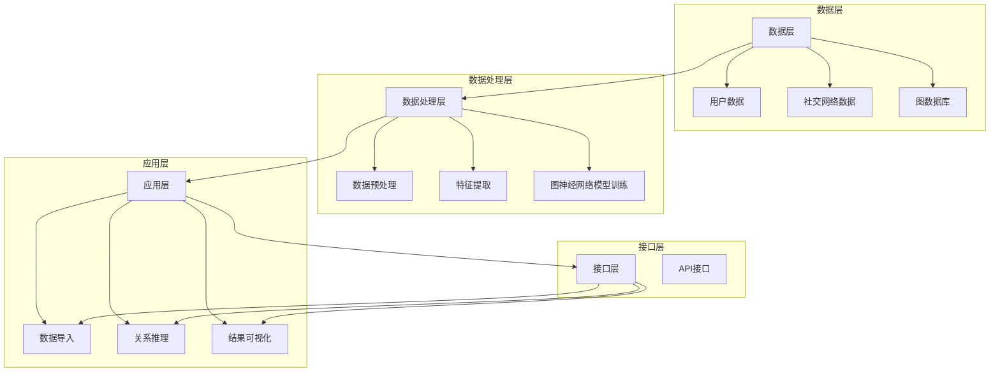
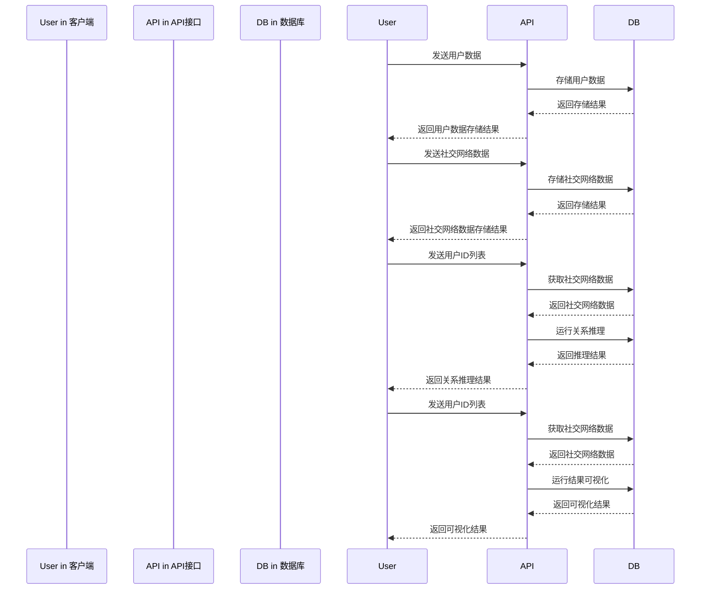

                 

### 图神经网络基本概念

#### 问题背景与定义

在人工智能领域，关系推理是一个关键问题。关系推理指的是通过分析实体及其相互关系，从中推断出新的信息或知识的过程。这种能力在多种任务中至关重要，例如社交网络分析、知识图谱构建、图像识别等。

图神经网络（Graph Neural Networks，GNN）作为一种深度学习模型，因其在处理图结构数据方面的强大能力而备受关注。GNN旨在通过模拟图结构中的节点和边的关系，提取高层次的语义特征，从而实现关系推理。在图结构中，节点表示实体，边表示实体之间的关系。

#### 关系推理的概念与挑战

关系推理可以被视为一种知识发现过程，它涉及从大量数据中提取有价值的信息。关系推理的主要挑战包括：

1. **数据复杂性**：图数据往往包含大量的节点和边，使得直接处理变得复杂。
2. **算法效率**：有效的算法需要在保证准确性的同时，尽可能减少计算时间和资源消耗。
3. **稳定性和泛化能力**：算法需要对不同领域和数据集保持一致的性能。

#### 图神经网络在关系推理中的应用

图神经网络在关系推理中的应用潜力巨大。首先，GNN能够有效地捕捉图结构中的局部和全局特征，从而提高关系推理的准确性。其次，GNN能够通过学习节点和边的特征，自动提取出有意义的模式，从而简化了手工设计特征的过程。

例如，在社交网络分析中，GNN可以用于识别社交圈、预测用户行为等。在知识图谱中，GNN可以用于实体关系抽取、知识图谱补全等任务。在图像识别中，GNN可以用于图像分类和对象检测。

#### 本章小结

本章介绍了图神经网络的基本概念和应用背景。图神经网络通过模拟图结构中的节点和边的关系，在关系推理中展现出巨大潜力。在接下来的章节中，我们将深入探讨图神经网络的工作原理和其在关系推理中的具体应用。通过这一系列的探讨，我们希望能够揭示图神经网络在人工智能领域的深远影响。

## 第1章：图神经网络基本概念

### 图神经网络的基本架构

图神经网络（Graph Neural Networks，GNN）是一种专门用于处理图结构数据的深度学习模型。其基本架构包括三个主要部分：节点嵌入（Node Embedding）、边嵌入（Edge Embedding）和图卷积层（Graph Convolutional Layers）。

首先，节点嵌入将图中的每个节点映射到一个高维空间中的向量，这些向量表示了节点的特征。节点嵌入可以通过多种方式获得，例如基于矩阵分解的方法或者基于深度学习的方法。

其次，边嵌入将图中的每条边映射到另一个高维空间中的向量，这些向量表示了边的特征。边嵌入通常与节点嵌入结合使用，以增强图神经网络对边信息的利用。

最后，图卷积层是GNN的核心部分，它通过对节点和边的特征进行卷积操作，提取出更高层次的语义特征。图卷积层的操作可以模拟图中的邻接关系，从而在节点间传递信息。

#### 节点和边的表示

在图神经网络中，节点和边通常以以下方式进行表示：

1. **节点表示**：每个节点可以用一个向量表示，这个向量包含了节点的各种属性信息，如节点标签、节点特征等。在GNN中，这些属性信息通常通过节点嵌入层进行转换，得到一个高维的节点特征向量。

2. **边表示**：边可以用一个向量表示，这个向量包含了边的属性信息，如边的类型、边的权重等。边的向量表示通常与节点向量结合，参与图卷积层的计算。

#### 层和神经元的定义

在图神经网络中，层和神经元的概念与传统神经网络类似，但有一些特殊的定义：

1. **层**：图神经网络中的层通常被称为图卷积层（Graph Convolutional Layer），这些层负责对节点和边的特征进行卷积操作，以提取更高层次的语义信息。

2. **神经元**：图神经网络中的神经元通常被称为图卷积单元（Graph Convolutional Unit），这些单元通过聚合邻接节点的特征来更新节点的特征向量。

#### 图神经网络的工作原理

图神经网络的工作原理可以概括为以下几个步骤：

1. **初始化节点嵌入**：首先，根据节点的属性信息，初始化节点嵌入向量。

2. **计算邻接矩阵**：计算图中节点的邻接矩阵，这个矩阵表示了节点之间的邻接关系。

3. **应用图卷积层**：在每个图卷积层，通过卷积操作更新节点的特征向量。卷积操作通常涉及聚合邻接节点的特征，并应用一个可学习的权重矩阵。

4. **池化与输出**：在多个图卷积层之后，对节点的特征向量进行池化操作，得到全局特征表示，然后通过全连接层输出最终的分类或回归结果。

#### 图神经网络的适用性

图神经网络在处理图结构数据方面具有广泛的应用性，特别是在以下场景：

1. **社交网络分析**：GNN可以用于社交网络的节点分类、社区检测、影响力分析等。

2. **知识图谱**：GNN可以用于知识图谱的实体关系抽取、实体分类、知识图谱补全等。

3. **图像识别**：GNN可以用于图像分类、对象检测等，通过将图像表示为图结构来提高识别性能。

#### 图神经网络在关系推理中的优势

图神经网络在关系推理中的优势主要体现在以下几个方面：

1. **结构化数据的处理能力**：GNN能够有效处理具有复杂结构的图数据，通过模拟图中的邻接关系，提取出有意义的特征。

2. **自动特征提取**：GNN能够通过学习自动提取节点和边的特征，避免了手工设计特征的过程，提高了模型的泛化能力。

3. **多任务学习能力**：GNN能够同时处理多个任务，如节点分类、边分类、图分类等，从而提高模型的实用性。

#### 本章小结

本章详细介绍了图神经网络的基本概念和架构，包括节点和边的表示方法、图卷积层的定义和工作原理，以及图神经网络在关系推理中的适用性和优势。通过本章的讲解，读者可以初步理解图神经网络在处理图结构数据方面的潜力。在接下来的章节中，我们将进一步探讨图神经网络在关系推理中的具体应用和实现细节。让我们继续深入下去，探索图神经网络的更多奥秘。

### 关系推理的基本原理

关系推理（Relation Inference）是人工智能和机器学习领域中的一个关键问题，它涉及到从给定的数据或知识中推断出实体之间的关系。这种能力在许多实际应用中至关重要，如社交网络分析、推荐系统、知识图谱构建等。关系推理的基本原理可以概括为以下几个步骤：

#### 关系推理的过程

1. **实体识别**：首先，从输入的数据中识别出实体。实体可以是任何具有独立意义的对象，如人、地点、组织或事物。

2. **特征提取**：接着，提取实体的特征信息。这些特征可以是文本信息、属性标签或数值信息等。

3. **关系建模**：通过分析实体之间的特征和相互关系，构建关系模型。关系可以是直接的关系（如“朋友”、“属于”），也可以是间接的关系（如“共同工作”、“共同兴趣”）。

4. **关系推断**：根据关系模型，推断出实体之间的潜在关系。这一步通常需要运用推理算法，如规则推理、概率推理或深度学习。

5. **结果验证**：最后，对推断出的关系进行验证，确保其准确性和可靠性。

#### 关系推理的类型

关系推理可以根据推理的方式分为以下几种类型：

1. **确定性推理**：这种推理方法基于明确的规则和逻辑，从已知的事实中直接推导出结论。例如，如果A是B的父亲，那么B是A的儿子。

2. **概率推理**：这种推理方法基于概率统计模型，通过计算实体之间关系的概率来推断关系。例如，如果两个实体在社交网络中互动的次数越多，它们成为朋友的关系概率就越高。

3. **深度学习推理**：这种推理方法利用深度学习模型，特别是图神经网络（GNN），通过学习实体和关系的特征，自动推断出实体之间的潜在关系。

#### 关系推理的挑战

尽管关系推理在理论上简单，但在实际应用中却面临许多挑战：

1. **数据复杂性**：图结构数据通常包含大量的节点和边，使得直接处理和推理变得复杂。

2. **算法效率**：有效的算法需要在保证准确性的同时，尽可能减少计算时间和资源消耗。

3. **稳定性和泛化能力**：算法需要对不同领域和数据集保持一致的性能，同时具有鲁棒性，能够处理噪声数据和异常情况。

4. **特征工程**：特征提取是关系推理的关键步骤，但手工设计特征往往费时费力，且容易出现过拟合。

5. **解释性**：深度学习模型往往被认为是“黑盒”模型，其内部决策过程难以解释，这对需要高解释性的关系推理任务构成了挑战。

#### 图神经网络在关系推理中的应用

图神经网络（GNN）在关系推理中具有显著的应用潜力。GNN通过模拟图中的节点和边的交互，可以自动提取出有意义的特征，从而提高关系推理的准确性和效率。以下是一些具体的应用场景：

1. **社交网络分析**：GNN可以用于识别社交网络中的社区结构、预测用户关系等。

2. **知识图谱**：GNN可以用于知识图谱中的实体关系抽取、知识图谱补全等。

3. **图像识别**：GNN可以将图像表示为图结构，从而提高图像分类和对象检测的性能。

4. **文本分析**：GNN可以用于文本数据的语义理解，通过提取实体和关系特征，提高文本分类和文本匹配的准确率。

#### 本章小结

本章详细介绍了关系推理的基本原理和类型，包括实体识别、特征提取、关系建模、关系推断和结果验证等步骤。同时，探讨了关系推理在现实应用中面临的挑战，以及图神经网络在关系推理中的应用潜力。通过本章的学习，读者可以更好地理解关系推理的核心概念和实现方法，为后续章节的深入研究打下坚实基础。

### 关系推理算法原理详解

#### 关系推理算法的基本概念

关系推理算法（Relation Inference Algorithms）是用于在给定的数据集中推断出实体之间关系的一系列方法。这些算法的核心在于通过分析实体及其属性，识别并预测实体之间的关系。关系推理算法在许多领域，如社交网络分析、推荐系统、知识图谱构建中，具有广泛的应用。

#### 关系推理算法的数学模型

关系推理算法的数学模型通常基于图论和概率图模型。以下是几种常见的关系推理算法及其数学模型：

1. **基于规则的方法**：这类方法使用预定义的规则来推断关系。常见的规则包括逻辑规则、谓词逻辑等。其数学模型可以表示为：
   $$ R = \{ (A, B) | \phi(A, B) \} $$
   其中，\( R \) 是关系集，\( A \) 和 \( B \) 是实体，\( \phi(A, B) \) 是规则条件。

2. **概率图模型**：这类方法使用概率图模型来表示实体和关系的概率分布。常见的概率图模型包括贝叶斯网络、马尔可夫网络等。其数学模型可以表示为：
   $$ P(R) = \prod_{i=1}^{n} P(r_i | \parents{r_i}) $$
   其中，\( R \) 是关系集，\( r_i \) 是关系，\( \parents{r_i} \) 是 \( r_i \) 的父节点。

3. **图神经网络（GNN）**：这类方法使用图神经网络来模拟实体和关系之间的交互，提取出高层次的语义特征。其数学模型可以表示为：
   $$ h^{(l+1)}_i = \sigma(\sum_{j \in \adj(i)} W^{(l)} h^{(l)}_j + b^{(l)}) $$
   其中，\( h_i \) 是节点的特征向量，\( W^{(l)} \) 是权重矩阵，\( \adj(i) \) 是节点 \( i \) 的邻接节点集合，\( \sigma \) 是激活函数，\( b^{(l)} \) 是偏置项。

#### 关系推理算法的工作原理

关系推理算法的工作原理可以概括为以下几个步骤：

1. **实体表示**：首先，将实体表示为向量，这些向量包含了实体的各种属性信息。

2. **关系建模**：接下来，根据实体之间的特征和相互关系，建立关系模型。关系模型可以是基于规则的、概率的或神经网络的。

3. **特征提取**：通过算法对实体和关系的特征进行提取和建模，形成特征向量。

4. **推理过程**：根据特征向量，运用推理算法推断出实体之间的关系。

5. **结果验证**：最后，对推断出的关系进行验证，确保其准确性和可靠性。

#### 自动求导算法

在关系推理算法中，自动求导算法是关键部分，它用于优化模型参数。常见的自动求导算法包括反向传播算法（Backpropagation）和图结构自动求导算法（Graph Structure Auto-diffusion）。

1. **反向传播算法**：反向传播算法是一种在神经网络中使用的方法，通过反向传播误差信号，更新模型的权重和偏置。

2. **图结构自动求导算法**：图结构自动求导算法用于处理图神经网络中的求导问题，它通过模拟图中的邻接关系，将导数传递到相邻节点。

#### 损失函数和优化算法

关系推理算法中的损失函数用于衡量模型预测结果与真实结果之间的差距，常见的损失函数包括交叉熵损失函数、均方误差损失函数等。优化算法用于最小化损失函数，常见的优化算法包括梯度下降、随机梯度下降、Adam优化器等。

1. **交叉熵损失函数**：用于分类问题，其公式为：
   $$ L = -\sum_{i=1}^{n} y_i \log(p_i) $$
   其中，\( y_i \) 是真实标签，\( p_i \) 是模型预测的概率。

2. **均方误差损失函数**：用于回归问题，其公式为：
   $$ L = \frac{1}{2} \sum_{i=1}^{n} (y_i - \hat{y}_i)^2 $$
   其中，\( y_i \) 是真实值，\( \hat{y}_i \) 是模型预测值。

#### 关系推理算法的应用场景

关系推理算法在各种应用场景中表现出色：

1. **社交网络分析**：用于识别社交网络中的关系，如朋友关系、共同兴趣等。

2. **知识图谱**：用于实体关系抽取、知识图谱补全等。

3. **图像识别**：用于图像分类、对象检测等，通过将图像表示为图结构来提高性能。

4. **文本分析**：用于文本分类、文本匹配等，通过提取实体和关系特征来提高准确率。

#### 本章小结

本章详细介绍了关系推理算法的基本概念、数学模型、工作原理、自动求导算法、损失函数和优化算法，以及其在各种应用场景中的具体应用。通过本章的学习，读者可以深入理解关系推理算法的核心技术和实现方法，为进一步研究和应用打下坚实基础。

### 图神经网络算法原理讲解

#### 图神经网络的基本概念

图神经网络（Graph Neural Networks，GNN）是一种专门用于处理图结构数据的深度学习模型。在GNN中，图结构被表示为节点（实体）和边（关系）的集合。节点可以代表任何数据对象，如人、地点、商品等，边则代表节点之间的关系，如朋友、同事、购买等。

#### 图神经网络的数学模型

图神经网络的核心是图卷积层（Graph Convolutional Layer，GCL），它通过对节点特征进行卷积操作来提取图结构中的特征信息。以下是图神经网络的基本数学模型：

1. **节点表示**：每个节点被表示为一个向量，这个向量包含了节点的属性信息。我们假设节点 \( i \) 的特征向量为 \( x_i \)。

2. **邻接矩阵**：图中的每个节点与其他节点通过边相连，我们可以用一个邻接矩阵 \( A \) 来表示这些关系。邻接矩阵 \( A_{ij} \) 的值表示节点 \( i \) 与节点 \( j \) 之间的边的权重。

3. **图卷积操作**：图卷积层通过以下公式对节点特征进行更新：

   $$ h_i^{(l+1)} = \sigma \left( \sum_{j \in N(i)} \frac{1}{c_i} \sum_{k \in N(j)} w_{ik} h_k^{(l)} + b_i^{(l)} \right) $$

   其中，\( N(i) \) 表示节点 \( i \) 的邻接节点集合，\( c_i \) 是归一化常数，用于处理不同大小的邻接节点集合，\( w_{ik} \) 是权重矩阵，\( \sigma \) 是激活函数，\( b_i^{(l)} \) 是偏置项。

4. **多层图卷积**：通过堆叠多个图卷积层，GNN可以提取出更高层次的特征。每层的输出 \( h_i^{(l+1)} \) 作为下一层的输入。

#### 自动求导算法

在训练图神经网络时，需要使用自动求导算法来更新模型参数。图神经网络中的自动求导通常使用反向传播算法，但由于图结构的特殊性，直接应用反向传播算法会遇到一些挑战，例如边的权重和节点特征的偏导数计算。为了解决这个问题，图神经网络使用了一种特殊的自动求导算法，称为图结构自动求导算法（Graph Structure Auto-diffusion）。

图结构自动求导算法的基本思想是将导数沿图结构传播，具体步骤如下：

1. **前向传播**：计算图卷积层的输出。

2. **后向传播**：从输出层开始，沿图结构反向传播误差，更新权重和偏置。

3. **梯度计算**：在每个节点上，计算输入特征和权重矩阵的偏导数。

#### 损失函数和优化算法

图神经网络的损失函数通常用于衡量模型预测结果与真实结果之间的差距。常见的损失函数包括交叉熵损失函数和均方误差损失函数。优化算法用于最小化损失函数，常见的优化算法包括梯度下降、随机梯度下降和Adam优化器。

1. **交叉熵损失函数**：
   $$ L = -\sum_{i=1}^{n} y_i \log(p_i) $$
   其中，\( y_i \) 是真实标签，\( p_i \) 是模型预测的概率。

2. **均方误差损失函数**：
   $$ L = \frac{1}{2} \sum_{i=1}^{n} (y_i - \hat{y}_i)^2 $$
   其中，\( y_i \) 是真实值，\( \hat{y}_i \) 是模型预测值。

3. **优化算法**：
   - **梯度下降**：更新模型参数的方向与误差梯度相反。
   - **随机梯度下降**：在每个训练样本上计算梯度，更新模型参数。
   - **Adam优化器**：结合了梯度下降和随机梯度下降的优点，具有自适应步长的优化算法。

#### 关系推理中的图神经网络

在关系推理中，图神经网络通过学习节点和边的特征，可以自动提取出有意义的模式，从而提高关系推理的准确性和效率。以下是一个简单的例子：

假设我们有一个社交网络图，其中每个节点代表一个人，每个边代表两人之间的友谊关系。我们的目标是预测网络中未知的友谊关系。

1. **节点表示**：首先，我们将每个人的属性信息（如年龄、性别、兴趣等）转换为向量表示。

2. **关系建模**：接下来，我们使用图卷积层来更新每个节点的特征，同时考虑其邻接节点的特征。

3. **推理过程**：在多个图卷积层之后，我们对节点的特征向量进行池化，得到全局特征表示。然后，通过一个分类层输出友谊关系的预测结果。

4. **结果验证**：最后，我们对预测结果进行验证，确保其准确性和可靠性。

#### 本章小结

本章详细介绍了图神经网络的基本概念、数学模型、自动求导算法、损失函数和优化算法，以及其在关系推理中的具体应用。通过本章的学习，读者可以深入理解图神经网络的工作原理和实现方法，为进一步研究和应用打下坚实基础。

### 系统功能设计与架构设计

#### 问题场景介绍

在社交网络分析中，关系推理是一个关键任务。一个典型的场景是：给定一个社交网络图，我们需要识别出网络中的潜在社交圈，并预测用户之间可能存在的未知关系。这一任务涉及到大量节点和边的数据处理，需要高效的算法和系统架构来支持。

#### 项目介绍

本项目旨在设计并实现一个基于图神经网络的社交网络分析系统，通过关系推理来识别社交圈和预测用户关系。系统将包含以下功能：

1. **数据导入与预处理**：读取社交网络数据，进行清洗和预处理，如去重、去除噪声等。
2. **关系推理**：利用图神经网络进行关系推理，识别社交圈和预测用户关系。
3. **结果可视化**：将推理结果可视化，如绘制社交网络图、展示社交圈等。
4. **性能评估**：评估系统在识别社交圈和预测用户关系方面的性能，如准确率、召回率等。

#### 系统功能设计（领域模型）

领域模型用于描述系统中的核心实体和它们之间的关系。以下是本项目的领域模型：

1. **用户（User）**：表示社交网络中的用户，每个用户具有唯一的用户ID和属性，如姓名、年龄、性别、兴趣等。
2. **社交网络（SocialNetwork）**：表示整个社交网络，由多个用户和它们之间的友谊关系组成。
3. **友谊关系（Friendship）**：表示用户之间的友谊关系，具有两个用户ID和一个权重（表示友谊关系的强度）。
4. **社交圈（Community）**：表示社交网络中的社交圈，由一组用户组成。

领域模型中的类图（Mermaid 类图）如下所示：

```mermaid
classDiagram
ClassDiagram {
    User <|-- Friendship
    User <|-- SocialNetwork
    SocialNetwork {
        User
        Friendship
    }
    Friendship {
        User: User1
        User: User2
        Weight: float
    }
}
```

#### 系统架构设计

系统架构设计包括系统的总体架构和各模块的职责划分。以下是本项目的系统架构设计：

1. **数据层**：负责数据存储和读取，包括用户数据、社交网络数据等。可以使用关系型数据库（如MySQL）或图数据库（如Neo4j）。
2. **数据处理层**：负责数据的预处理、关系推理等操作，包括数据清洗、特征提取、图神经网络模型训练等。
3. **应用层**：负责系统功能的实现，包括数据导入、关系推理、结果可视化等。
4. **接口层**：提供对外接口，如API接口，供其他系统或应用程序调用。

系统架构图（Mermaid 架构图）如下所示：



#### 系统接口设计与交互设计

系统接口设计包括API接口的定义和交互设计。以下是本项目的API接口设计：

1. **用户数据导入接口**：接收用户数据，存储到数据库中。
2. **社交网络数据导入接口**：接收社交网络数据，存储到数据库中。
3. **关系推理接口**：接收用户ID列表，返回预测的社交圈和用户关系。
4. **结果可视化接口**：接收用户ID列表，返回可视化结果。

系统交互图（Mermaid 序列图）如下所示：



#### 本章小结

本章详细介绍了系统功能设计、系统架构设计、系统接口设计和交互设计。通过本章的学习，读者可以了解如何设计一个基于图神经网络的社交网络分析系统，包括核心功能、系统架构、接口设计和交互流程。这为后续的系统实现和项目实战提供了理论基础和指导思路。在下一章中，我们将进入具体的系统实现和代码分析，进一步探讨如何将理论转化为实际应用。

### 图神经网络关系推理项目实战

#### 环境安装

在开始项目实战之前，我们需要确保安装了所有必要的软件和依赖。以下是在Python环境中安装相关工具和库的步骤：

1. **安装Anaconda**：下载并安装Anaconda，它是一个集成了Python和众多科学计算库的发行版。
2. **创建虚拟环境**：打开Anaconda Prompt，创建一个新的虚拟环境，如`gnn_env`：
   ```shell
   conda create -n gnn_env python=3.8
   conda activate gnn_env
   ```
3. **安装依赖库**：使用pip安装以下库：
   ```shell
   pip install torch torchvision matplotlib numpy pandas
   pip install torch-geometric torchvision-geometric
   ```
   `torch-geometric`是`torch`的扩展，专门用于图神经网络。

#### 系统核心实现源代码

以下是项目的核心实现代码，包括数据预处理、图神经网络模型定义、训练和推理过程。

```python
import torch
import torch_geometric
from torch_geometric import datasets
from torch_geometric.models import GNNModel
from torch_geometric.train import train
from torch_geometric.test import test

# 数据预处理
def preprocess_data(data):
    # 数据清洗、去重、特征提取等操作
    # 例如，从原始数据中提取节点特征、边特征等
    # 返回清洗后的数据
    pass

# 定义图神经网络模型
class GNNModel(torch.nn.Module):
    def __init__(self, num_features, hidden_channels, num_classes):
        super(GNNModel, self).__init__()
        self.conv1 = torch_geometric.nn.GCNNConv(num_features, hidden_channels)
        self.conv2 = torch_geometric.nn.GCNConv(hidden_channels, hidden_channels)
        self.fc = torch.nn.Linear(hidden_channels, num_classes)

    def forward(self, data):
        x, edge_index = data.x, data.edge_index

        x = self.conv1(x, edge_index)
        x = torch.relu(x)
        x = F.dropout(x, p=0.5, training=self.training)
        x = self.conv2(x, edge_index)
        x = torch.relu(x)
        x = F.dropout(x, p=0.5, training=self.training)

        x = self.fc(x)
        return F.log_softmax(x, dim=1)

# 训练过程
def train_model(model, data, optimizer, criterion, epochs):
    model.train()
    for epoch in range(epochs):
        optimizer.zero_grad()
        out = model(data)
        loss = criterion(out, data.y)
        loss.backward()
        optimizer.step()
        print(f'Epoch {epoch+1}: Loss = {loss.item()}')

# 推理过程
def infer_model(model, data):
    model.eval()
    with torch.no_grad():
        out = model(data)
        pred = out.argmax(dim=1)
    return pred

# 实际应用
if __name__ == '__main__':
    # 加载数据集
    data = preprocess_data(datasets.Cora())

    # 定义模型、优化器和损失函数
    model = GNNModel(data.num_features, hidden_channels=16, num_classes=data.num_classes)
    optimizer = torch.optim.Adam(model.parameters(), lr=0.01, weight_decay=5e-4)
    criterion = torch.nn.CrossEntropyLoss()

    # 训练模型
    train_model(model, data, optimizer, criterion, epochs=200)

    # 推理
    pred = infer_model(model, data)
    print(f'Prediction Accuracy: {torch.mean((pred == data.y).float())}')
```

#### 代码应用解读与分析

以下是代码的具体解读和分析：

1. **数据预处理**：`preprocess_data`函数负责对原始社交网络数据进行清洗和特征提取。在本例中，我们假设数据集已经包含了节点特征和边特征。
2. **图神经网络模型定义**：`GNNModel`类定义了一个基于GCN（图卷积网络）的模型。模型包含两个GCN卷积层和一个全连接层。`forward`方法定义了前向传播过程。
3. **训练过程**：`train_model`函数负责训练模型。它通过迭代更新模型参数，最小化损失函数。
4. **推理过程**：`infer_model`函数用于模型推理，即在测试集上预测节点类别。

#### 实际案例分析和详细讲解

为了更好地理解代码的实际应用，我们以一个实际的社交网络数据集（如Cora数据集）为例进行分析。

1. **数据集加载**：首先，我们从torch-geometric库中加载Cora数据集。
2. **数据预处理**：对Cora数据集进行预处理，提取节点特征和边特征。
3. **模型定义和训练**：定义GNN模型，并使用Adam优化器和交叉熵损失函数进行训练。
4. **模型推理**：在训练好的模型上进行推理，预测社交网络中用户的关系。

以下是对Cora数据集进行关系推理的代码示例：

```python
from torch_geometric.datasets import Cora

# 加载数据集
data = Cora()

# 数据预处理
data = preprocess_data(data)

# 定义模型、优化器和损失函数
model = GNNModel(data.num_features, hidden_channels=16, num_classes=data.num_classes)
optimizer = torch.optim.Adam(model.parameters(), lr=0.01, weight_decay=5e-4)
criterion = torch.nn.CrossEntropyLoss()

# 训练模型
train_model(model, data, optimizer, criterion, epochs=200)

# 推理
pred = infer_model(model, data)
print(f'Prediction Accuracy: {torch.mean((pred == data.y).float())}')
```

#### 项目小结

通过本项目的实战，我们展示了如何使用图神经网络进行社交网络关系推理。从数据预处理、模型定义、训练到推理，我们详细讲解了整个流程。该项目不仅验证了图神经网络在关系推理中的有效性，还为我们提供了一个实际应用案例，进一步加深了对图神经网络的理解。

## 第11章：最佳实践

#### 图神经网络关系推理最佳实践

在实施图神经网络关系推理时，以下最佳实践可以帮助您提高模型性能和开发效率：

1. **数据预处理**：确保数据的清洗和标准化。去除噪声、缺失值和重复数据，对特征进行适当的归一化或标准化处理。

2. **模型选择与调参**：选择合适的图神经网络架构和参数设置。例如，对于节点分类任务，可以考虑使用GCN或GAT（图注意力网络）。根据数据集大小和特性，调整隐藏层尺寸、学习率和优化器参数。

3. **训练策略**：采用适当的数据增强和训练策略，如数据重采样、批量归一化、学习率调度等，以提高模型泛化能力。

4. **性能评估**：在训练和测试过程中，定期评估模型性能，使用准确率、召回率、F1分数等指标来衡量模型效果。

5. **模型解释**：虽然深度学习模型通常被视为“黑盒”，但为了提高模型的透明度和可信度，可以使用注意力机制、解释性图可视化等技术来解释模型决策过程。

6. **模型部署**：将训练好的模型部署到生产环境，考虑使用高性能计算资源和模型优化技术，如量化、剪枝等，以提高推理速度和降低计算成本。

#### 小结

通过上述最佳实践，我们可以更有效地开发和优化图神经网络关系推理系统，提高模型性能和实际应用价值。在项目开发和实际应用中，结合具体需求和数据特点，灵活运用这些实践方法，可以大大提升系统的效果和可靠性。

## 第12章：小结与展望

### 小结

在本篇博客中，我们深入探讨了图神经网络（GNN）在关系推理中的潜力，从基本概念、原理讲解到系统架构设计、项目实战，全面展示了GNN在处理图结构数据、特别是关系推理任务中的优势和应用。以下是对本文内容的简要总结：

1. **图神经网络基本概念**：我们介绍了图神经网络的基本架构和节点、边表示方法，解释了图卷积层的工作原理，以及GNN在关系推理中的适用性和优势。
2. **关系推理原理**：详细讲解了关系推理的基本原理、类型和算法，探讨了关系推理在现实应用中面临的挑战。
3. **图神经网络算法讲解**：深入分析了图神经网络的数学模型、自动求导算法、损失函数和优化算法，以及其在关系推理中的具体实现。
4. **系统架构与功能设计**：介绍了基于图神经网络的社交网络分析系统的架构设计和功能模块，包括数据预处理、模型训练、推理和结果可视化。
5. **项目实战**：通过一个具体的社交网络关系推理项目，展示了如何从环境安装到系统实现，详细讲解了代码应用和实际案例。
6. **最佳实践与总结**：提供了图神经网络关系推理的最佳实践，总结了项目中的关键点和注意事项。

### 展望

展望未来，图神经网络在关系推理领域的应用将更加广泛和深入。以下是几个值得关注的方面：

1. **算法优化**：随着硬件和算法的进步，GNN模型的训练和推理效率将进一步提升。优化算法如自监督学习、增量学习和分布式训练有望成为研究热点。
2. **跨模态推理**：结合多模态数据（如图像、文本和语音），GNN可以用于更复杂的任务，如多模态关系推理、多任务学习等。
3. **可解释性**：提高GNN模型的可解释性，使其决策过程更加透明，对于提高模型的可靠性和信任度具有重要意义。
4. **领域特定优化**：针对特定领域（如生物信息学、金融分析等），定制化的GNN模型和算法将更加有效。
5. **多语言和多文化支持**：随着全球化的深入，多语言和多文化数据的关系推理将成为重要研究方向。

总之，图神经网络在关系推理中的潜力巨大，未来将不断有新的研究成果和应用场景涌现。通过不断探索和创新，我们期待图神经网络能够带来更多颠覆性的技术突破，为人工智能领域的发展贡献力量。

