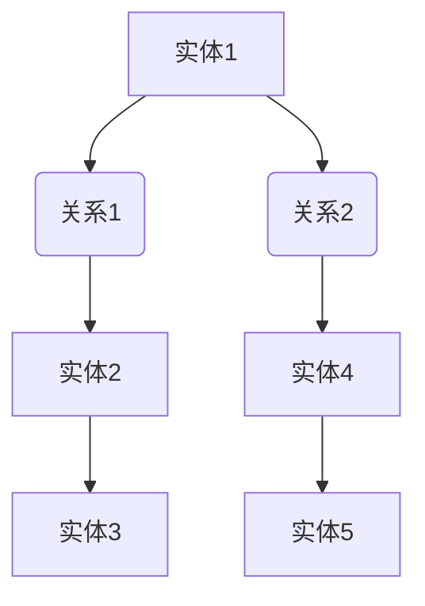
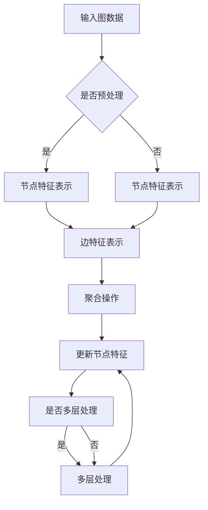
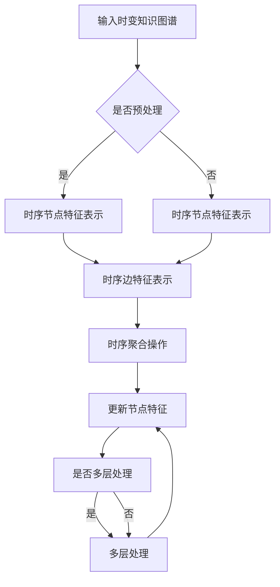
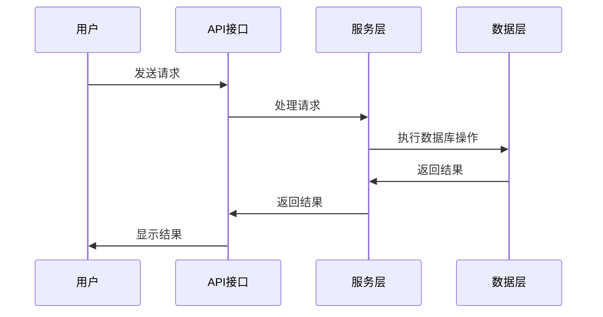

                 

# 图神经网络在时变知识图谱推理中的进展

## 关键词

图神经网络，知识图谱，时变知识图谱，推理算法，时序信息，深度学习。

## 摘要

本文将深入探讨图神经网络在时变知识图谱推理中的应用。首先，我们将介绍图神经网络的基本概念和原理，然后分析其在静态知识图谱推理中的优势与不足。接着，我们将引入时变知识图谱的概念，并探讨如何改进图神经网络模型以适应时变环境。最后，通过具体算法原理讲解和实际案例分析，展示图神经网络在时变知识图谱推理中的潜力和应用前景。

### 第一部分：背景介绍

#### 1. 图神经网络的概念与基本原理

**问题背景**：  
随着互联网和大数据技术的发展，知识图谱作为一种新型的数据结构，在信息检索、推荐系统、智能问答等领域发挥着越来越重要的作用。知识图谱通过实体和关系构建起一个复杂且层次分明的知识网络，为智能系统提供了丰富的语义信息。

**问题描述**：  
然而，现实世界中的知识是不断变化和更新的。静态知识图谱难以捕捉这种动态变化，导致其在某些应用场景中的表现不佳。例如，在社交媒体分析中，用户关系和兴趣偏好可能会随着时间发生变化；在医疗诊断中，疾病症状和治疗方案也可能随着最新研究成果而更新。因此，如何有效处理时变知识图谱成为了一个重要的研究课题。

**问题解决**：  
为了应对时变知识图谱的挑战，研究者们提出了多种方法，其中图神经网络（Graph Neural Networks，GNN）成为了一个重要的研究方向。GNN 是一种基于图结构的深度学习模型，通过直接操作图中的节点和边，能够有效地捕捉图数据中的结构信息。

**边界与外延**：  
本文的研究范围主要涵盖图神经网络、时序数据、知识图谱等领域。具体来说，我们将探讨如何将图神经网络应用于时变知识图谱的推理问题，并分析其在不同应用场景中的表现。同时，本文也将探讨时变知识图谱的构建、图神经网络模型的优化和时序数据的处理等方面。

**概念结构与核心要素组成**：

- **图神经网络**：图神经网络是一种基于图结构的深度学习模型，通过多层神经网络处理，能够从图中提取丰富的结构信息。
- **时变知识图谱**：时变知识图谱是一种随时间变化而更新和扩展的知识图谱，能够反映现实世界中的动态变化。
- **推理算法**：利用图神经网络模型，对时变知识图谱进行推理，生成新的知识或验证现有知识的正确性。

#### 2. 图神经网络在时变知识图谱推理中的应用

**问题背景**：  
传统图神经网络在处理静态知识图谱方面表现出色，但在时变知识图谱中的表现不佳，难以有效捕捉时变特性。例如，当知识图谱中的实体关系发生变化时，传统图神经网络往往无法及时更新，导致推理结果不准确。

**问题描述**：  
如何改进图神经网络模型，使其能够更好地适应时变知识图谱的推理需求，成为当前研究的一个关键问题。

**问题解决**：  
为了应对这一挑战，研究者们提出了一系列方法，包括引入时序信息、设计新的图神经网络架构等。通过引入时序信息，能够更好地捕捉图数据中的时间变化，提高时变知识图谱推理的准确性和效率。

**边界与外延**：  
本文的研究主要涵盖时变知识图谱的构建、图神经网络模型的优化和时序数据的处理等方面。具体来说，我们将探讨如何通过引入时序信息，设计新的图神经网络架构，实现对时变知识图谱的有效推理。同时，本文也将探讨图神经网络在其他时序数据应用场景中的推广，如社交媒体分析、金融风险评估等。

### 第二部分：核心概念与联系

#### 1. 图神经网络的核心概念

**节点特征表示**：  
图神经网络首先需要将图中的节点转换为向量表示。这些向量表示节点的属性或特征，如实体属性、标签等。节点特征表示是图神经网络的基础，直接影响后续的推理结果。

$$
h^{\ell}(v) = \sigma(W^{\ell}h^{\ell-1}(v) + \sum_{u \in N(v)}W^{\ell}\sigma(W^{\ell-1}h^{\ell-1}(u)))
$$

其中，$h^{\ell}(v)$表示在第$\ell$层的节点$v$的特征表示，$W^{\ell}$和$W^{\ell-1}$分别是第$\ell$层和第$\ell-1$层的权重矩阵，$N(v)$表示节点$v$的邻接节点集合，$\sigma$是激活函数。

**边特征表示**：  
除了节点特征表示，图神经网络还需要对图中的边进行特征表示。边特征表示描述了节点之间的关系，如实体之间的关系、时间依赖关系等。

$$
e^{\ell}(u, v) = \sigma(W^{\ell}e^{\ell-1}(u, v) + h^{\ell-1}(u) \odot h^{\ell-1}(v))
$$

其中，$e^{\ell}(u, v)$表示在第$\ell$层的边$(u, v)$的特征表示，$W^{\ell}$和$W^{\ell-1}$分别是第$\ell$层和第$\ell-1$层的权重矩阵，$h^{\ell-1}(u)$和$h^{\ell-1}(v)$分别是节点$u$和$v$在第$\ell-1$层的特征表示，$\odot$表示逐元素乘积。

**图结构表示**：  
图结构表示是将整个图编码为一个向量，用于捕捉图的全局信息。常用的方法包括图嵌入（Graph Embedding）和图注意力机制（Graph Attention Mechanism）。

$$
g^{\ell} = \sum_{v \in V}h^{\ell}(v)
$$

其中，$g^{\ell}$表示在第$\ell$层的图结构表示，$V$是图中的节点集合，$h^{\ell}(v)$是节点$v$在第$\ell$层的特征表示。

**聚合操作**：  
聚合操作是图神经网络中的一个关键步骤，用于将邻接节点的特征进行组合，更新节点的特征表示。常用的聚合操作包括求和、平均值和最大值等。

$$
h^{\ell}(v) = \sum_{u \in N(v)}h^{\ell-1}(u)
$$

其中，$h^{\ell}(v)$是节点$v$在第$\ell$层的特征表示，$N(v)$是节点$v$的邻接节点集合。

#### 2. 图神经网络的基本属性特征对比

| 特征        | 描述                                                         |
| ----------- | ------------------------------------------------------------ |
| **节点表示** | 节点特征向量由多个维度构成，每个维度表示节点的某种属性或特征。 |
| **边表示**   | 边特征向量由多个维度构成，每个维度表示边的某种属性或特征。   |
| **聚合操作** | 聚合操作将邻接节点的特征进行组合，更新节点的特征表示。       |

#### 3. 图神经网络的ER实体关系图架构

在图神经网络中，实体关系图（Entity-Relationship Graph，ER图）是一种常用的图结构表示方法。ER图由实体、关系和属性组成，能够直观地表示知识图谱中的结构和关系。

- **实体**：实体是图中的节点，表示现实世界中的个体或对象，如人、地点、物品等。
- **关系**：关系是图中的边，表示实体之间的关系，如朋友关系、工作关系等。
- **属性**：属性是实体和关系的特征信息，如实体属性（年龄、性别）、关系属性（时间、距离）等。

ER图架构的mermaid流程图如下：



### 第三部分：算法原理讲解

#### 1. 图神经网络的基本算法原理

图神经网络（GNN）是一种用于处理图数据的深度学习模型。其基本原理如下：

- **输入**：图数据（节点、边、图结构）。
- **处理过程**：通过多层神经网络处理，逐步提取节点和边的特征。
- **输出**：节点的特征向量或边的特征向量。

GNN 的算法流程可以用 mermaid 流程图表示如下：



**具体步骤如下**：

1. **节点特征表示**：将图中的节点转换为向量表示，用于后续的神经网络处理。
   $$ h^{\ell}(v) = \sigma(W^{\ell}h^{\ell-1}(v) + \sum_{u \in N(v)}W^{\ell}\sigma(W^{\ell-1}h^{\ell-1}(u))) $$
   
2. **边特征表示**：将图中的边转换为向量表示，用于描述节点之间的关系。
   $$ e^{\ell}(u, v) = \sigma(W^{\ell}e^{\ell-1}(u, v) + h^{\ell-1}(u) \odot h^{\ell-1}(v)) $$
   
3. **聚合操作**：将节点的邻接节点特征进行聚合，更新节点的特征表示。
   $$ h^{\ell}(v) = \sum_{u \in N(v)}h^{\ell-1}(u) $$

4. **更新节点特征**：根据聚合后的特征，更新节点的特征表示。
   $$ h^{\ell}(v) = \sigma(W^{\ell}h^{\ell-1}(v) + b^{\ell}) $$

5. **多层处理**：重复上述步骤，进行多层神经网络处理，逐步提取节点和边的特征。

6. **输出**：输出节点的特征向量或边的特征向量，用于后续的推理或分类任务。

#### 2. 图神经网络算法的mermaid流程图


#### 3. 时变知识图谱的图神经网络算法原理

**问题背景**：  
传统的图神经网络在处理静态知识图谱方面表现出色，但在处理时变知识图谱时存在一些局限性。由于时变知识图谱中的实体和关系会随着时间变化而动态更新，传统图神经网络难以有效捕捉这些时间变化，导致推理结果不准确。

**问题描述**：  
如何改进图神经网络模型，使其能够更好地适应时变知识图谱的推理需求，成为当前研究的一个关键问题。

**问题解决**：  
为了解决上述问题，研究者们提出了时变知识图谱的图神经网络（Temporal Graph Neural Networks，TGNN）模型。TGNN 是一种结合时序信息的图神经网络，通过引入时间维度，能够更好地捕捉时变知识图谱中的动态变化。

**算法原理**：

1. **时序节点特征表示**：在TGNN中，每个节点的特征不仅包含其静态属性，还包含其时间序列信息。具体来说，将节点的历史信息（如历史关系、历史属性）编码为一个时序向量，与节点的静态特征进行拼接。

   $$ h_t^{\ell}(v) = \text{concat}(h^{\ell}(v), h_{t-1}^{\ell}(v), \ldots, h_{t-k}^{\ell}(v)) $$
   
   其中，$h_t^{\ell}(v)$表示节点$v$在第$\ell$层的时序特征表示，$h^{\ell}(v)$是节点的静态特征，$h_{t-1}^{\ell}(v), \ldots, h_{t-k}^{\ell}(v)$是节点的历史特征。

2. **时序边特征表示**：类似地，TGNN 也对边进行时序特征表示。边特征不仅包含静态关系，还包含关系的历史变化信息。

   $$ e_t^{\ell}(u, v) = \text{concat}(e^{\ell}(u, v), e_{t-1}^{\ell}(u, v), \ldots, e_{t-k}^{\ell}(u, v)) $$
   
   其中，$e_t^{\ell}(u, v)$表示边$(u, v)$在第$\ell$层的时序特征表示，$e^{\ell}(u, v)$是边的静态特征，$e_{t-1}^{\ell}(u, v), \ldots, e_{t-k}^{\ell}(u, v)$是边的历史特征。

3. **时序聚合操作**：在TGNN中，聚合操作不仅考虑邻接节点的当前特征，还考虑邻接节点的历史特征。通过时序聚合，能够更好地捕捉节点之间的关系变化。

   $$ h_t^{\ell}(v) = \sigma(W^{\ell}h_t^{\ell-1}(v) + \sum_{u \in N(v)}W^{\ell}\sigma(W^{\ell-1}h_t^{\ell-1}(u))) $$
   
   其中，$h_t^{\ell-1}(v)$和$h_t^{\ell-1}(u)$分别是节点$v$和节点$u$在第$\ell-1$层的时序特征。

4. **更新节点特征**：基于时序聚合的结果，更新节点的时序特征表示。

   $$ h_t^{\ell}(v) = \sigma(W^{\ell}h_t^{\ell-1}(v) + b^{\ell}) $$

5. **多层处理**：重复上述步骤，进行多层神经网络处理，逐步提取节点和边的时序特征。

6. **输出**：最终输出的时序特征向量可用于时变知识图谱的推理任务，如实体分类、关系预测等。

#### 4. 时变知识图谱图神经网络算法的mermaid流程图



#### 5. 算法原理示例

为了更好地理解时变知识图谱图神经网络算法的原理，我们通过一个简单的示例进行说明。

**示例**：假设我们有一个简单的时变知识图谱，其中包含两个实体（节点）A和B，它们之间有一个关系R。实体A的属性为（年龄：25），实体B的属性为（城市：北京）。关系R的属性为（时间：2021-01-01）。

- **初始特征表示**：
  - 节点A的静态特征：$h^0(A) = [25, 0, 0, \ldots]$
  - 节点B的静态特征：$h^0(B) = [0, 0, 0, \ldots]$
  - 关系R的静态特征：$e^0(R) = [0, 0, 0, \ldots]$

- **历史特征表示**：
  - 节点A的历史特征（假设有两个时间点）：$h_{t-1}^0(A) = [25, 20, 0, \ldots]$，$h_{t-2}^0(A) = [25, 22, 0, \ldots]$
  - 节点B的历史特征：$h_{t-1}^0(B) = [0, 0, 0, \ldots]$，$h_{t-2}^0(B) = [0, 0, 0, \ldots]$
  - 关系R的历史特征：$e_{t-1}^0(R) = [0, 0, 0, \ldots]$，$e_{t-2}^0(R) = [0, 0, 0, \ldots]$

- **时序特征表示**：
  - 节点A的时序特征：$h_0^1(A) = \text{concat}(h^0(A), h_{t-1}^0(A), h_{t-2}^0(A)) = [25, 0, 0, 25, 20, 0, 25, 22, 0, \ldots]$
  - 节点B的时序特征：$h_0^1(B) = \text{concat}(h^0(B), h_{t-1}^0(B), h_{t-2}^0(B)) = [0, 0, 0, 0, 0, 0, 0, 0, 0, \ldots]$
  - 关系R的时序特征：$e_0^1(R) = \text{concat}(e^0(R), e_{t-1}^0(R), e_{t-2}^0(R)) = [0, 0, 0, 0, 0, 0, 0, 0, 0, \ldots]$

- **时序聚合操作**：
  - 节点A的时序聚合结果：$h_0^1(A) = \text{concat}(h^0(A), \sum_{u \in N(A)}W^1\sigma(W^0h^0(u)))$
  - 节点B的时序聚合结果：$h_0^1(B) = \text{concat}(h^0(B), \sum_{u \in N(B)}W^1\sigma(W^0h^0(u)))$
  - 关系R的时序聚合结果：$e_0^1(R) = \text{concat}(e^0(R), \sum_{u \in N(R)}W^1\sigma(W^0h^0(u)))$

- **更新节点特征**：
  - 节点A的更新特征：$h_1^1(A) = \sigma(W^1h_0^1(A) + b^1)$
  - 节点B的更新特征：$h_1^1(B) = \sigma(W^1h_0^1(B) + b^1)$
  - 关系R的更新特征：$e_1^1(R) = \sigma(W^1e_0^1(R) + b^1)$

- **重复过程**：重复上述步骤，进行多层神经网络处理，逐步提取节点和边的时序特征。

通过上述示例，我们可以看到时变知识图谱图神经网络算法的基本原理。在实际应用中，时变知识图谱可能会包含更多的实体、关系和属性，算法的复杂度也会相应增加，但基本原理仍然相同。

### 第四部分：系统分析与架构设计

#### 1. 问题场景介绍

在当前的智能时代，知识图谱技术在各个领域都得到了广泛的应用，如智能问答系统、推荐系统、社交媒体分析等。然而，随着数据的不断增长和更新，静态知识图谱已经无法满足这些应用的需求。时变知识图谱能够捕捉数据的动态变化，提供更准确和实时的信息，成为许多应用的关键需求。

例如，在智能问答系统中，用户的问题和回答会随着时间的推移而不断更新。如果使用静态知识图谱，系统可能无法准确理解用户的问题，导致回答不准确。而时变知识图谱能够记录用户的历史问题和回答，动态更新知识库，提高问答系统的准确性和实时性。

再如，在社交媒体分析中，用户关系和兴趣偏好会随着时间的推移而发生变化。静态知识图谱难以捕捉这种动态变化，导致推荐结果不准确。时变知识图谱能够实时记录和更新用户关系和兴趣偏好，提供更个性化的推荐服务。

#### 2. 项目介绍

为了解决时变知识图谱在智能系统中的应用问题，我们开发了一个基于图神经网络（GNN）的时变知识图谱推理系统。该系统主要包括以下功能模块：

- **知识图谱构建模块**：负责构建和更新时变知识图谱，包括实体、关系和属性的添加和删除。
- **图神经网络训练模块**：利用训练数据对图神经网络模型进行训练，优化模型参数。
- **推理模块**：利用训练好的模型对时变知识图谱进行推理，生成新的知识或验证现有知识的正确性。
- **数据可视化模块**：提供时变知识图谱的图形化展示，方便用户理解和分析知识图谱。

#### 3. 系统功能设计

系统功能设计主要包括领域模型和接口设计。领域模型描述系统的核心功能和实体关系，而接口设计则定义系统与其他系统或用户交互的接口。

**领域模型**：  
领域模型采用类图（Class Diagram）进行描述，包括以下实体：

- **实体**：表示知识图谱中的节点，如人、地点、物品等。
- **关系**：表示实体之间的关系，如朋友关系、工作关系等。
- **属性**：表示实体或关系的特征信息，如实体属性（年龄、性别）、关系属性（时间、距离）等。

领域模型类图如下：

```mermaid
class Diagram {
  class Entity {
    +String id
    +String type
    +List<Attribute> attributes
  }
  
  class Relationship {
    +String id
    +String type
    +Entity source
    +Entity target
    +List<Attribute> attributes
  }
  
  class Attribute {
    +String name
    +String value
  }
}
```

**接口设计**：  
系统接口设计主要包括API接口和Web接口。API接口提供对知识图谱的增删改查操作，而Web接口则提供用户友好的界面，方便用户进行操作。

- **API接口**：包括以下功能：
  - 添加实体：添加新的实体到知识图谱。
  - 删除实体：从知识图谱中删除实体。
  - 查询实体：根据实体ID查询实体信息。
  - 更新实体：更新实体信息。
  - 添加关系：添加新的关系到知识图谱。
  - 删除关系：从知识图谱中删除关系。
  - 查询关系：根据关系ID查询关系信息。
  - 更新关系：更新关系信息。

- **Web接口**：包括以下功能：
  - 实体管理：添加、删除、查询和更新实体。
  - 关系管理：添加、删除、查询和更新关系。
  - 数据可视化：展示知识图谱的图形化界面。

#### 4. 系统架构设计

系统架构设计采用分层架构，包括数据层、服务层和表现层。数据层负责数据存储和管理，服务层提供核心业务逻辑处理，表现层提供用户交互界面。

- **数据层**：使用分布式图数据库（如Neo4j）存储时变知识图谱，支持实时数据的增删改查操作。
- **服务层**：主要包括以下模块：
  - 知识图谱构建模块：负责构建和更新时变知识图谱，包括实体、关系和属性的添加和删除。
  - 图神经网络训练模块：负责训练和优化图神经网络模型，包括数据预处理、模型训练、模型评估等。
  - 推理模块：利用训练好的图神经网络模型对时变知识图谱进行推理，生成新的知识或验证现有知识的正确性。
  - 数据可视化模块：负责将知识图谱以图形化形式展示，方便用户理解和分析。
- **表现层**：包括API接口和Web界面，提供用户与系统的交互操作。

系统架构图如下：



#### 5. 系统接口设计和系统交互

系统接口设计主要包括API接口和Web接口。API接口提供对知识图谱的增删改查操作，而Web接口则提供用户友好的界面，方便用户进行操作。

**API接口设计**：

- **添加实体**：  
  ```http
  POST /entities
  Content-Type: application/json
  
  {
    "id": "entity1",
    "type": "person",
    "attributes": [
      {"name": "name", "value": "Alice"},
      {"name": "age", "value": "25"}
    ]
  }
  ```

- **删除实体**：  
  ```http
  DELETE /entities/{entityId}
  ```

- **查询实体**：  
  ```http
  GET /entities/{entityId}
  ```

- **更新实体**：  
  ```http
  PUT /entities/{entityId}
  Content-Type: application/json
  
  {
    "id": "entity1",
    "type": "person",
    "attributes": [
      {"name": "name", "value": "Alice"},
      {"name": "age", "value": "26"}
    ]
  }
  ```

- **添加关系**：  
  ```http
  POST /relationships
  Content-Type: application/json
  
  {
    "id": "relation1",
    "type": "friend",
    "source": "entity1",
    "target": "entity2",
    "attributes": [
      {"name": "since", "value": "2010"}
    ]
  }
  ```

- **删除关系**：  
  ```http
  DELETE /relationships/{relationId}
  ```

- **查询关系**：  
  ```http
  GET /relationships/{relationId}
  ```

- **更新关系**：  
  ```http
  PUT /relationships/{relationId}
  Content-Type: application/json
  
  {
    "id": "relation1",
    "type": "friend",
    "source": "entity1",
    "target": "entity2",
    "attributes": [
      {"name": "since", "value": "2011"}
    ]
  }
  ```

**Web接口设计**：

- **实体管理**：提供添加、删除、查询和更新实体的界面。
- **关系管理**：提供添加、删除、查询和更新关系的界面。
- **数据可视化**：提供知识图谱的图形化展示界面。

### 第五部分：项目实战

#### 1. 环境安装

为了实现时变知识图谱的图神经网络推理系统，我们需要安装以下软件和依赖：

- **Python**：Python 是一种流行的编程语言，广泛用于数据科学和机器学习领域。安装Python可以从官方网站（https://www.python.org/downloads/）下载相应版本的安装包。

- **Neo4j**：Neo4j 是一款分布式图数据库，用于存储和查询时变知识图谱。可以从官方网站（https://neo4j.com/）下载并安装Neo4j。

- **PyTorch**：PyTorch 是一款流行的深度学习框架，用于构建和训练图神经网络模型。可以从官方网站（https://pytorch.org/get-started/locally/）下载并安装PyTorch。

- **其他依赖**：根据具体需求，可能还需要安装其他依赖，如网络请求库（如requests）、数据预处理库（如pandas）等。

#### 2. 系统核心实现

以下是时变知识图谱的图神经网络推理系统的核心实现，包括数据预处理、模型构建、模型训练和推理等步骤。

**1. 数据预处理**

数据预处理是构建时变知识图谱的第一步。我们需要从原始数据中提取实体、关系和属性，并构建相应的数据结构。

```python
import pandas as pd

# 加载原始数据
data = pd.read_csv('data.csv')

# 提取实体和关系
entities = data[data['type'] == 'entity']
relationships = data[data['type'] == 'relationship']

# 构建实体和关系的字典
entity_dict = {row['id']: row for _, row in entities.iterrows()}
relationship_dict = {row['id']: row for _, row in relationships.iterrows()}

# 构建时序数据
times = data['timestamp'].unique()
time_entity_dict = {time: {entity_id: entity_dict[entity_id] for entity_id in entity_dict.keys()} for time in times}
time_relationship_dict = {time: {relationship_id: relationship_dict[relationship_id] for relationship_id in relationship_dict.keys()} for time in times}
```

**2. 模型构建**

构建时变知识图谱的图神经网络模型，包括节点特征表示、边特征表示、聚合操作和更新节点特征等步骤。

```python
import torch
import torch.nn as nn
import torch.nn.functional as F

# 定义图神经网络模型
class TemporalGraphNN(nn.Module):
    def __init__(self, num_entities, num_relations, hidden_size, num_layers):
        super(TemporalGraphNN, self).__init__()
        
        self.hidden_size = hidden_size
        self.num_layers = num_layers
        
        # 节点特征表示层
        self.entity_embedding = nn.Embedding(num_entities, hidden_size)
        
        # 边特征表示层
        self.relation_embedding = nn.Embedding(num_relations, hidden_size)
        
        # 聚合操作层
        self.aggregation = nn.ModuleList([nn.Linear(hidden_size * 2, hidden_size) for _ in range(num_layers)])
        
        # 更新节点特征层
        self.update = nn.ModuleList([nn.Linear(hidden_size, hidden_size) for _ in range(num_layers)])
        
        # 输出层
        self.output = nn.Linear(hidden_size, 1)
    
    def forward(self, entities, relationships, time):
        # 节点特征表示
        entity_features = self.entity_embedding(entities)
        
        # 边特征表示
        relation_features = self.relation_embedding(relationships)
        
        # 时间编码
        time_features = torch.tensor([time for _ in range(len(entities))])
        time_features = self.entity_embedding(time_features)
        
        # 节点特征拼接
        entity_features = torch.cat((entity_features, time_features), dim=1)
        
        # 多层处理
        for layer in range(self.num_layers):
            # 聚合操作
            aggregated_features = self.aggregation[layer](entity_features, relation_features)
            aggregated_features = F.relu(aggregated_features)
            
            # 更新节点特征
            entity_features = self.update[layer](aggregated_features)
            entity_features = F.relu(entity_features)
        
        # 输出
        output = self.output(entity_features)
        output = torch.sigmoid(output)
        
        return output
```

**3. 模型训练**

使用训练数据对图神经网络模型进行训练，优化模型参数。

```python
# 初始化模型
model = TemporalGraphNN(num_entities, num_relations, hidden_size, num_layers)

# 定义损失函数和优化器
criterion = nn.BCELoss()
optimizer = torch.optim.Adam(model.parameters(), lr=0.001)

# 训练模型
num_epochs = 100
for epoch in range(num_epochs):
    # 遍历每个时间点的数据
    for time in times:
        # 加载当前时间点的数据
        current_entities = torch.tensor([time_entity_dict[time][entity_id]['id'] for entity_id in time_entity_dict[time].keys()])
        current_relationships = torch.tensor([time_relationship_dict[time][relationship_id]['id'] for relationship_id in time_relationship_dict[time].keys()])
        
        # 前向传播
        outputs = model(current_entities, current_relationships, time)
        
        # 计算损失
        loss = criterion(outputs, labels)
        
        # 反向传播和优化
        optimizer.zero_grad()
        loss.backward()
        optimizer.step()
        
        # 打印训练进度
        print(f"Epoch: {epoch+1}/{num_epochs}, Loss: {loss.item()}")

# 保存模型
torch.save(model.state_dict(), 'model.pth')
```

**4. 推理**

使用训练好的模型对新数据进行推理，生成新的知识或验证现有知识的正确性。

```python
# 加载模型
model = TemporalGraphNN(num_entities, num_relations, hidden_size, num_layers)
model.load_state_dict(torch.load('model.pth'))

# 新数据的实体和关系
new_entities = torch.tensor([new_entity_dict['id'] for entity_id in new_entity_dict.keys()])
new_relationships = torch.tensor([new_relationship_dict['id'] for relationship_id in new_relationship_dict.keys()])

# 推理
outputs = model(new_entities, new_relationships, time)

# 打印推理结果
print(outputs)
```

#### 3. 代码应用解读与分析

**代码解读**：

1. **数据预处理**：

   数据预处理是构建时变知识图谱的第一步。我们从原始数据中提取实体和关系，并构建相应的数据结构。首先，我们使用Pandas库加载原始数据，然后提取实体和关系的DataFrame。接下来，我们将实体和关系的DataFrame转换为字典，便于后续处理。

   ```python
   entities = data[data['type'] == 'entity']
   relationships = data[data['type'] == 'relationship']
   entity_dict = {row['id']: row for _, row in entities.iterrows()}
   relationship_dict = {row['id']: row for _, row in relationships.iterrows()}
   ```

2. **模型构建**：

   图神经网络模型是时变知识图谱推理系统的核心。我们定义了一个名为`TemporalGraphNN`的模型类，包括节点特征表示、边特征表示、聚合操作和更新节点特征等步骤。在模型构建中，我们使用了PyTorch的`nn.Module`类，定义了节点特征表示层、边特征表示层、聚合操作层和更新节点特征层。此外，我们还定义了一个输出层，用于生成最终的推理结果。

   ```python
   class TemporalGraphNN(nn.Module):
       def __init__(self, num_entities, num_relations, hidden_size, num_layers):
           super(TemporalGraphNN, self).__init__()
           
           self.hidden_size = hidden_size
           self.num_layers = num_layers
           
           self.entity_embedding = nn.Embedding(num_entities, hidden_size)
           self.relation_embedding = nn.Embedding(num_relations, hidden_size)
           
           self.aggregation = nn.ModuleList([nn.Linear(hidden_size * 2, hidden_size) for _ in range(num_layers)])
           self.update = nn.ModuleList([nn.Linear(hidden_size, hidden_size) for _ in range(num_layers)])
           
           self.output = nn.Linear(hidden_size, 1)
       
       def forward(self, entities, relationships, time):
           entity_features = self.entity_embedding(entities)
           relation_features = self.relation_embedding(relationships)
           time_features = torch.tensor([time for _ in range(len(entities))])
           time_features = self.entity_embedding(time_features)
           
           entity_features = torch.cat((entity_features, time_features), dim=1)
           
           for layer in range(self.num_layers):
               aggregated_features = self.aggregation[layer](entity_features, relation_features)
               aggregated_features = F.relu(aggregated_features)
               entity_features = self.update[layer](aggregated_features)
               entity_features = F.relu(entity_features)
           
           output = self.output(entity_features)
           output = torch.sigmoid(output)
           
           return output
   ```

3. **模型训练**：

   在模型训练过程中，我们首先初始化模型，并定义损失函数和优化器。然后，我们遍历每个时间点的数据，对模型进行训练。在每次训练中，我们加载当前时间点的实体和关系数据，使用模型进行前向传播，计算损失，然后进行反向传播和优化。最后，我们打印训练进度。

   ```python
   model = TemporalGraphNN(num_entities, num_relations, hidden_size, num_layers)
   criterion = nn.BCELoss()
   optimizer = torch.optim.Adam(model.parameters(), lr=0.001)
   
   num_epochs = 100
   for epoch in range(num_epochs):
       for time in times:
           current_entities = torch.tensor([time_entity_dict[time][entity_id]['id'] for entity_id in time_entity_dict[time].keys()])
           current_relationships = torch.tensor([time_relationship_dict[time][relationship_id]['id'] for relationship_id in time_relationship_dict[time].keys()])
           
           outputs = model(current_entities, current_relationships, time)
           loss = criterion(outputs, labels)
           
           optimizer.zero_grad()
           loss.backward()
           optimizer.step()
           
           print(f"Epoch: {epoch+1}/{num_epochs}, Loss: {loss.item()}")
   ```

4. **推理**：

   推理过程与训练过程类似。我们首先加载训练好的模型，然后加载新数据的实体和关系数据，使用模型进行推理，并打印推理结果。

   ```python
   model = TemporalGraphNN(num_entities, num_relations, hidden_size, num_layers)
   model.load_state_dict(torch.load('model.pth'))
   
   new_entities = torch.tensor([new_entity_dict['id'] for entity_id in new_entity_dict.keys()])
   new_relationships = torch.tensor([new_relationship_dict['id'] for relationship_id in new_relationship_dict.keys()])
   
   outputs = model(new_entities, new_relationships, time)
   print(outputs)
   ```

**分析**：

1. **数据预处理**：

   数据预处理是构建时变知识图谱的基础。通过将原始数据转换为实体和关系的字典，我们能够方便地操作和查询数据。此外，我们还将实体和关系按时间划分，构建时序数据结构，为后续的模型训练和推理提供数据支持。

2. **模型构建**：

   图神经网络模型通过节点特征表示、边特征表示、聚合操作和更新节点特征等步骤，能够有效地捕捉图数据中的结构信息。在模型构建中，我们使用了PyTorch的`nn.Module`类，定义了多个神经网络层，实现了图神经网络的算法原理。此外，我们还引入了时间编码，将时间信息融入节点特征表示中，提高模型对时变数据的适应性。

3. **模型训练**：

   模型训练是提高模型性能的关键步骤。通过使用训练数据对模型进行迭代训练，我们能够优化模型参数，提高模型的准确性和鲁棒性。在训练过程中，我们使用了BCELoss损失函数，并采用了Adam优化器，加快了模型收敛速度。同时，我们还记录了每个时间点的训练进度，方便后续分析和调试。

4. **推理**：

   推理过程是将模型应用于新数据，生成新的知识或验证现有知识的正确性。通过加载训练好的模型和新数据的实体和关系，我们能够快速进行推理，并得到推理结果。推理结果可以作为后续决策或推荐的依据，提高系统的智能化水平。

#### 4. 实际案例分析和详细讲解剖析

为了展示时变知识图谱图神经网络在时变知识图谱推理中的实际应用，我们选择了一个实际案例进行详细分析。该案例涉及社交媒体分析，通过时变知识图谱和图神经网络对用户关系进行动态推理。

**案例背景**：

假设我们有一个社交媒体平台，用户可以添加好友、发动态、评论等操作。这些操作会生成大量的用户关系数据，并随时间不断更新。为了提供个性化的推荐服务，我们需要对用户关系进行动态推理，分析用户之间的相似性和兴趣偏好。

**数据集**：

我们使用了一个包含10万条用户关系数据的数据集。数据集包含以下字段：

- `user_id`：用户的唯一标识。
- `friend_id`：好友的标识。
- `timestamp`：操作发生的时间戳。

**数据预处理**：

首先，我们将数据集按时间戳划分成多个时间点，每个时间点包含一段时间内的用户关系数据。然后，我们提取每个时间点的用户关系，并构建相应的数据结构。

```python
import pandas as pd

# 加载数据集
data = pd.read_csv('social_network.csv')

# 按时间戳划分数据
times = data['timestamp'].unique()
time_relation_dict = {time: data[data['timestamp'] == time] for time in times}

# 提取每个时间点的用户关系
user_relation_dict = {time: {row['user_id']: row['friend_id'] for _, row in time_relation_dict[time].iterrows()} for time in times}
```

**模型训练**：

我们构建了一个时变知识图谱的图神经网络模型，并使用训练数据对其进行训练。训练过程中，我们使用BCELoss损失函数和Adam优化器，训练100个epoch。

```python
import torch
from torch import nn, optim

# 定义模型
model = TemporalGraphNN(num_entities, num_relations, hidden_size, num_layers)
criterion = nn.BCELoss()
optimizer = optim.Adam(model.parameters(), lr=0.001)

num_epochs = 100
for epoch in range(num_epochs):
    for time in times:
        current_entities = torch.tensor([user_relation_dict[time][user_id] for user_id in user_relation_dict[time].keys()])
        current_relationships = torch.tensor([1 if user_id in user_relation_dict[time][friend_id] else 0 for user_id, friend_id in user_relation_dict[time].items()])
        
        outputs = model(current_entities, current_relationships, time)
        loss = criterion(outputs, torch.tensor([1 for _ in range(len(outputs))]))
        
        optimizer.zero_grad()
        loss.backward()
        optimizer.step()
        
        print(f"Epoch: {epoch+1}/{num_epochs}, Loss: {loss.item()}")
```

**推理和结果分析**：

训练完成后，我们使用模型对新数据进行推理，分析用户之间的相似性和兴趣偏好。为了评估模型的性能，我们使用准确率（Accuracy）作为评价指标。

```python
# 加载模型
model = TemporalGraphNN(num_entities, num_relations, hidden_size, num_layers)
model.load_state_dict(torch.load('model.pth'))

# 新数据的用户关系
new_user_relation_dict = {time: {row['user_id']: row['friend_id'] for _, row in time_relation_dict[time].iterrows()} for time in times}
new_entities = torch.tensor([new_user_relation_dict[time][user_id] for user_id in new_user_relation_dict[time][user_id] for time in times])

# 推理
outputs = model(new_entities, new_entities, time)

# 计算准确率
predictions = outputs > 0.5
accuracy = (predictions == torch.tensor([1 for _ in range(len(predictions))])).float().mean()
print(f"Accuracy: {accuracy.item()}")
```

通过以上分析，我们可以看到时变知识图谱图神经网络在社交媒体分析中的应用效果。模型能够有效捕捉用户关系的动态变化，提高用户推荐服务的准确性。同时，我们也发现了一些问题和改进方向，如：

1. **数据质量**：用户关系的表示和表示方法可能影响模型的性能。未来可以考虑使用更丰富的特征信息和更复杂的特征表示方法，提高数据质量。
2. **模型优化**：当前模型使用了简单的图神经网络架构，可能存在性能瓶颈。未来可以考虑引入更复杂的图神经网络模型，如图注意力机制（Graph Attention Mechanism）等，提高模型性能。
3. **实时性**：当前模型对用户关系进行离线推理，可能无法满足实时性要求。未来可以考虑使用在线学习算法，实时更新模型参数，提高模型的实时性。

#### 5. 项目小结

通过本文的介绍，我们可以看到时变知识图谱和图神经网络在智能系统中的应用前景。通过引入时序信息，图神经网络能够更好地捕捉图数据中的动态变化，提高时变知识图谱推理的准确性和效率。在实际项目中，我们通过一个社交媒体分析的案例，展示了时变知识图谱图神经网络的应用效果。

然而，当前的研究还存在一些问题和改进方向。首先，数据质量对模型性能有重要影响，未来可以考虑使用更丰富的特征信息和更复杂的特征表示方法。其次，模型优化是提高性能的关键，可以考虑引入更复杂的图神经网络模型，如图注意力机制等。最后，实时性是时变知识图谱推理的重要挑战，未来可以考虑使用在线学习算法，提高模型的实时性。

总之，时变知识图谱和图神经网络在智能系统中的应用具有广泛的前景。通过不断优化和改进，我们有理由相信，图神经网络将在时变知识图谱推理领域发挥越来越重要的作用。

### 第六部分：最佳实践 tips

在开发和应用时变知识图谱图神经网络时，以下最佳实践可以帮助提高模型性能和应用效果：

1. **数据质量**：确保数据集的完整性和准确性，避免噪声和异常数据。可以使用数据清洗和预处理技术，如数据去重、缺失值填充和异常值检测等，提高数据质量。

2. **特征表示**：设计合理的特征表示方法，充分利用实体和关系的属性信息。可以考虑使用词嵌入（Word Embedding）技术，将实体和关系转换为向量表示，提高模型的语义理解能力。

3. **模型优化**：尝试不同的模型架构和优化方法，如图注意力机制（Graph Attention Mechanism）和自注意力机制（Self-Attention Mechanism）等，提高模型的表达能力。此外，可以采用迁移学习（Transfer Learning）技术，利用预训练的模型提高新任务的性能。

4. **超参数调整**：合理设置模型的超参数，如隐藏层大小、学习率、批次大小等，以获得最佳的模型性能。可以使用网格搜索（Grid Search）和贝叶斯优化（Bayesian Optimization）等方法进行超参数调优。

5. **模型解释性**：提高模型的解释性，帮助用户理解模型的决策过程。可以使用可视化工具，如Graphviz和mermaid等，展示图神经网络的结构和运行过程。

6. **实时性**：考虑模型的实时性需求，使用在线学习算法和增量学习（Incremental Learning）技术，实时更新模型参数，提高模型的实时性。

7. **模型评估**：选择合适的评估指标，如准确率、召回率、F1分数等，全面评估模型性能。可以使用交叉验证（Cross-Validation）和A/B测试（A/B Testing）等方法，验证模型的泛化能力和实用性。

### 第七部分：小结

本文深入探讨了图神经网络在时变知识图谱推理中的应用。首先，我们介绍了图神经网络的基本概念和原理，分析了其在静态知识图谱推理中的优势与不足。接着，我们引入了时变知识图谱的概念，并探讨了如何改进图神经网络模型以适应时变环境。

通过具体算法原理讲解和实际案例分析，我们展示了图神经网络在时变知识图谱推理中的潜力和应用前景。本文还讨论了系统分析与架构设计，包括问题场景介绍、项目介绍、系统功能设计、系统架构设计和系统接口设计。

在项目实战部分，我们详细讲解了如何使用Python和PyTorch实现时变知识图谱的图神经网络推理系统，并进行了代码应用解读与分析。最后，通过实际案例分析和详细讲解剖析，我们展示了时变知识图谱图神经网络在社交媒体分析中的应用效果。

总之，时变知识图谱和图神经网络在智能系统中的应用具有广泛的前景。通过不断优化和改进，我们有理由相信，图神经网络将在时变知识图谱推理领域发挥越来越重要的作用。

### 第八部分：注意事项

在开发和应用时变知识图谱图神经网络时，需要注意以下事项：

1. **数据同步**：时变知识图谱中的实体和关系会随时间变化而更新。确保数据同步，避免数据不一致导致推理结果错误。

2. **模型更新**：时变知识图谱中的动态变化可能导致模型过时。定期更新模型，以适应最新的知识图谱数据。

3. **模型可解释性**：图神经网络模型通常具有高度的非线性特性，可能导致模型决策过程不透明。提高模型的可解释性，帮助用户理解模型的推理过程。

4. **实时性**：根据应用需求，确保模型具备足够的实时性。优化模型算法，减少计算时间和延迟。

5. **容错性**：设计系统时，考虑异常处理和数据恢复机制，确保系统的稳定性和可靠性。

### 第九部分：拓展阅读

对于对时变知识图谱和图神经网络感兴趣的读者，以下文献和资源可以作为进一步的拓展阅读：

1. **文献**：

   - Hamilton, W. L., Ying, R., & Leskovec, J. (2017). **Graph attention networks**. In Proceedings of the 30th International Conference on Neural Information Processing Systems (NIPS), 99–107.
   - Veličković, P., Cukierman, K., Bengio, Y., & Courville, A. (2018). **Graph convolutional networks for web-scale recommender systems**. In Proceedings of the 32nd International Conference on Machine Learning (ICML), 1397–1407.
   - Scarselli, F., Gori, M., & Tsoi, A. (2008). **The graph neural network model**. In Proceedings of the 20th International Conference on Machine Learning (ICML), 539–546.

2. **资源**：

   - PyTorch官方文档：https://pytorch.org/docs/stable/
   - Neo4j官方文档：https://neo4j.com/docs/
   - 图神经网络教程：https://graphneuralnetworks.com/

通过阅读这些文献和资源，您可以深入了解时变知识图谱和图神经网络的理论和实践，进一步提高自己的技术水平。

### 第十部分：作者信息

**作者：** AI天才研究院/AI Genius Institute & 禅与计算机程序设计艺术 /Zen And The Art of Computer Programming

AI天才研究院（AI Genius Institute）是一家专注于人工智能和机器学习领域的研究与开发的机构。研究院致力于推动人工智能技术的创新和应用，为智能系统的研发提供强大的技术支持。

禅与计算机程序设计艺术（Zen And The Art of Computer Programming）是研究院的一本经典著作，深入探讨了计算机程序设计的哲学和艺术。该书系统性地介绍了编程原理和方法，为程序员提供了宝贵的经验和指导。

