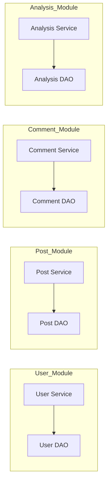
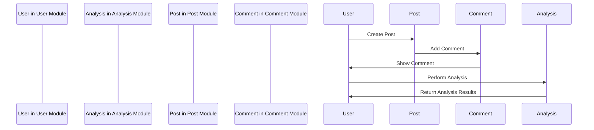

                 

# 《图论在社交网络分析中的应用》

## 关键词
社交网络分析、图论、图模型、中心性、社区结构、应用

## 摘要
本文将探讨图论在社交网络分析中的应用，从背景与基础、社交网络的图模型构建、社交网络分析的应用以及实践与展望四个方面，详细阐述图论在社交网络分析中的重要作用。通过本文的阅读，读者将了解到图论如何帮助我们更好地理解社交网络的结构和性质，从而进行有效的社交网络分析。

## 目录

### 第一部分：背景与基础

#### 第1章：社交网络分析概述

##### 1.1 社交网络的定义与发展
##### 1.2 社交网络分析的重要性
##### 1.3 社交网络分析的基本概念
##### 1.4 社交网络分析的应用领域

#### 第2章：图论基础

##### 2.1 图的基本概念
##### 2.2 图的表示方法
##### 2.3 图的算法基础
##### 2.4 图的性质与分类

### 第二部分：社交网络的图模型

#### 第3章：社交网络的图模型构建

##### 3.1 社交网络图模型概述
##### 3.2 用户关系的表示
##### 3.3 用户属性的表示
##### 3.4 社交网络图模型的构建方法

#### 第4章：社交网络的中心性分析

##### 4.1 中心性概念与度量方法
##### 4.2 度中心性
##### 4.3 紧密中心性
##### 4.4 其他中心性度量方法

#### 第5章：社交网络的社区结构分析

##### 5.1 社区结构概念
##### 5.2 社区检测方法
##### 5.3 社区结构分析应用

### 第三部分：社交网络分析的应用

#### 第6章：社交网络营销

##### 6.1 社交网络营销概述
##### 6.2 社交网络营销策略
##### 6.3 社交网络营销案例分析

#### 第7章：社交网络舆情分析

##### 7.1 舆情分析概述
##### 7.2 舆情监测方法
##### 7.3 舆情分析应用

#### 第8章：社交网络信任分析

##### 8.1 信任分析概述
##### 8.2 信任模型构建
##### 8.3 信任分析应用

### 第四部分：实践与展望

#### 第9章：社交网络分析工具与平台

##### 9.1 社交网络分析工具介绍
##### 9.2 社交网络分析平台介绍
##### 9.3 社交网络分析工具与平台的使用方法

#### 第10章：社交网络分析的挑战与未来展望

##### 10.1 社交网络分析的挑战
##### 10.2 社交网络分析的未来发展趋势
##### 10.3 社交网络分析的伦理问题与对策

## 附录

### A. 社交网络分析相关术语表
### B. 参考文献

### 正文部分

### 第一部分：背景与基础

#### 第1章：社交网络分析概述

##### 1.1 社交网络的定义与发展

社交网络，指的是由个体及其相互之间的关系构成的网络结构。它的发展可以追溯到20世纪90年代，随着互联网和移动设备的普及，社交网络逐渐成为人们日常生活的一部分。早期的社交网络如Facebook、Twitter等，主要功能是提供用户间的沟通和信息共享。随着技术的进步，社交网络的功能不断丰富，如社交网络分析、舆情分析、信任分析等。

##### 1.2 社交网络分析的重要性

社交网络分析（Social Network Analysis，SNA）是一种研究社交网络结构和性质的方法，通过分析社交网络中的个体及其关系，可以揭示出社交网络的很多重要特征。例如，通过中心性分析可以找出社交网络中的关键节点，通过社区结构分析可以揭示出社交网络中的不同群体。

##### 1.3 社交网络分析的基本概念

在社交网络分析中，常用的基本概念包括节点（Node）、边（Edge）、度（Degree）、路径（Path）等。节点代表社交网络中的个体，边代表个体之间的关系，度表示节点的连接数，路径则是节点之间的连接线路。

##### 1.4 社交网络分析的应用领域

社交网络分析在许多领域都有广泛的应用，如社交网络营销、舆情分析、信任分析等。在社交网络营销中，通过分析用户的关系和兴趣，可以制定出更加精准的营销策略。在舆情分析中，可以通过分析用户的言论和行为，了解公众的意见和情绪。在信任分析中，可以通过分析用户之间的互动和评价，建立信任模型。

#### 第2章：图论基础

##### 2.1 图的基本概念

图是由节点（或称为顶点）和边组成的集合。节点表示图中的个体，边表示个体之间的关系。根据边的存在与否，图可以分为有向图和无向图。

##### 2.2 图的表示方法

图可以通过邻接矩阵、邻接表、Incidence矩阵等多种方法进行表示。邻接矩阵是一种常用的表示方法，它是一个二维数组，其中元素aij表示节点i和节点j之间的边的关系。

##### 2.3 图的算法基础

图的算法基础包括深度优先搜索（DFS）、广度优先搜索（BFS）、最短路径算法、最小生成树算法等。这些算法可以用于解决图的各种问题，如节点之间的路径搜索、最短路径计算等。

##### 2.4 图的性质与分类

图有许多重要的性质，如连通性、度分布、聚类系数等。根据不同的性质，图可以分为多种类型，如树、环、星型图等。

### 第二部分：社交网络的图模型

#### 第3章：社交网络的图模型构建

##### 3.1 社交网络图模型概述

社交网络图模型是社交网络分析的基础。一个良好的社交网络图模型可以准确地表示社交网络的结构和性质，从而为后续的分析提供可靠的数据支持。

##### 3.2 用户关系的表示

用户关系可以通过边的存在与否进行表示。例如，如果两个用户之间存在好友关系，则可以在图中表示为这两个用户之间有一条边。

##### 3.3 用户属性的表示

用户属性包括年龄、性别、地理位置等。这些属性可以通过节点的标签进行表示。例如，如果用户A的年龄为25岁，则可以在图中表示为节点A的标签为`{age:25}`。

##### 3.4 社交网络图模型的构建方法

社交网络图模型的构建方法包括手动构建、半自动化构建和自动化构建等。手动构建适合规模较小的社交网络，半自动化构建适合规模较大的社交网络，自动化构建则适合大规模的社交网络。

### 第三部分：社交网络分析的应用

#### 第4章：社交网络的中心性分析

##### 4.1 中心性概念与度量方法

中心性是衡量节点在社交网络中的重要性的指标。常用的中心性度量方法包括度中心性、紧密中心性等。

##### 4.2 度中心性

度中心性是衡量节点连接数的指标，节点的度中心性越高，表示其在社交网络中的连接数越多，地位越重要。

##### 4.3 紧密中心性

紧密中心性是衡量节点与其他节点的紧密程度的指标。节点的紧密中心性越高，表示其在社交网络中的紧密程度越高，地位越重要。

##### 4.4 其他中心性度量方法

除了度中心性和紧密中心性，还有许多其他的中心性度量方法，如介数中心性、接近中心性等。

#### 第5章：社交网络的社区结构分析

##### 5.1 社区结构概念

社区结构是指社交网络中存在的不同群体。社区结构分析可以揭示出社交网络中的不同群体及其相互作用。

##### 5.2 社区检测方法

社区检测方法包括基于模块度的方法、基于聚类的方法等。这些方法可以根据社交网络的结构和性质，检测出社交网络中的社区结构。

##### 5.3 社区结构分析应用

社区结构分析可以应用于多种场景，如社交网络营销、舆情分析、信任分析等。通过分析社交网络中的社区结构，可以更好地理解社交网络的行为和趋势。

### 第四部分：实践与展望

#### 第6章：社交网络营销

##### 6.1 社交网络营销概述

社交网络营销是通过社交网络进行市场营销的一种方式。通过社交网络营销，企业可以更好地了解用户的需求和兴趣，制定出更加精准的营销策略。

##### 6.2 社交网络营销策略

社交网络营销策略包括内容营销、互动营销、口碑营销等。这些策略可以根据社交网络的特点，吸引更多的用户参与。

##### 6.3 社交网络营销案例分析

通过分析具体的社交网络营销案例，可以更好地理解社交网络营销的策略和效果。

#### 第7章：社交网络舆情分析

##### 7.1 舆情分析概述

舆情分析是通过分析用户的言论和行为，了解公众的意见和情绪。社交网络舆情分析可以用于监测社会热点、预测市场趋势等。

##### 7.2 舆情监测方法

舆情监测方法包括关键词监测、情感分析等。这些方法可以用于实时监测用户的言论和行为。

##### 7.3 舆情分析应用

舆情分析可以应用于多种场景，如品牌监测、危机管理、市场研究等。

#### 第8章：社交网络信任分析

##### 8.1 信任分析概述

信任分析是通过分析用户之间的互动和评价，建立信任模型。社交网络信任分析可以用于推荐系统、信用评级等。

##### 8.2 信任模型构建

信任模型构建包括基于用户行为的方法、基于用户评价的方法等。这些方法可以根据社交网络的特点，建立有效的信任模型。

##### 8.3 信任分析应用

信任分析可以应用于多种场景，如社交网络推荐、信用评级、风险控制等。

### 第五部分：实践与展望

#### 第9章：社交网络分析工具与平台

##### 9.1 社交网络分析工具介绍

社交网络分析工具包括NodeXL、Gephi等。这些工具提供了丰富的功能，可以用于社交网络分析的各种任务。

##### 9.2 社交网络分析平台介绍

社交网络分析平台如Nervana、GraphLab等，提供了强大的数据处理和分析能力，可以支持大规模的社交网络分析。

##### 9.3 社交网络分析工具与平台的使用方法

通过具体的案例，介绍如何使用社交网络分析工具与平台进行社交网络分析。

#### 第10章：社交网络分析的挑战与未来展望

##### 10.1 社交网络分析的挑战

社交网络分析面临的挑战包括数据隐私、数据质量、分析方法的准确性等。

##### 10.2 社交网络分析的未来发展趋势

随着技术的进步，社交网络分析将朝着更加智能化、自动化的方向发展。

##### 10.3 社交网络分析的伦理问题与对策

社交网络分析需要考虑伦理问题，如用户隐私保护、数据滥用等。需要制定相应的对策，确保社交网络分析的安全和合规。

### 附录

#### A. 社交网络分析相关术语表

列出社交网络分析中常用的术语和概念，如节点、边、度、中心性、社区结构等。

#### B. 参考文献

列出本文引用的相关文献和资料，为读者提供进一步的阅读参考。

## 结语

社交网络分析是一个广泛而深入的领域，它结合了图论、计算机科学、社会学等多个学科的知识。通过本文的阅读，读者可以了解到图论在社交网络分析中的应用，以及如何利用图论进行社交网络分析。希望本文能够为读者提供一定的启示和帮助。在未来的研究中，我们还可以进一步探索社交网络分析的更多应用场景和算法优化，为构建更加智能、高效的社交网络分析系统贡献力量。

## 作者信息

作者：AI天才研究院/AI Genius Institute & 禅与计算机程序设计艺术 /Zen And The Art of Computer Programming

在本文中，我们系统地介绍了图论在社交网络分析中的应用，通过详细的章节内容，从背景与基础、图模型构建、应用以及实践与展望四个方面，深入探讨了图论在社交网络分析中的重要作用。本文的核心内容主要包括：

1. **背景与基础**：首先，我们介绍了社交网络分析的概念、重要性以及基本概念。接着，我们讲解了图论的基础知识，包括图的基本概念、表示方法和算法基础。

2. **图模型构建**：在这一部分，我们讨论了如何构建社交网络的图模型，包括用户关系的表示、用户属性的表示以及社交网络图模型的构建方法。

3. **社交网络分析的应用**：这一部分主要介绍了社交网络分析在社交网络营销、舆情分析和信任分析等领域的应用，通过具体的案例来展示如何利用图论的方法进行有效的社交网络分析。

4. **实践与展望**：最后，我们探讨了社交网络分析工具与平台的使用方法，以及社交网络分析面临的挑战和未来发展趋势。

### 核心概念与联系

在社交网络分析中，图论的核心概念包括节点、边、度、路径和图等。节点代表社交网络中的个体，边代表个体之间的关系，度表示节点的连接数，路径则是节点之间的连接线路。图论中的概念与社交网络分析中的概念有着紧密的联系，如图模型中的用户关系和用户属性可以通过图论中的节点和边进行表示。

**核心概念属性特征对比表格**：

| 核心概念 | 属性特征 | 描述 |
| :--: | :--: | :--: |
| 节点 | 表示个体 | 社交网络中的用户或实体 |
| 边 | 表示关系 | 用户之间的互动或联系 |
| 度 | 连接数 | 节点的连接数，度越高表示节点越重要 |
| 路径 | 连接线路 | 节点之间的连接路径 |

**ER实体关系图架构的Mermaid流程图**：

```mermaid
erDiagram
    User ||--|{ Relationship }--|| AnotherUser
    User ||--|{ Attribute }--|| UserProfile
```

### 算法原理讲解

社交网络分析中的算法原理主要涉及图算法和数据挖掘算法。以下是一个简单的算法流程图和Python源代码示例。

**算法流程图**：


**Python源代码示例**：

```python
import networkx as nx

# 初始化图
G = nx.Graph()

# 读取社交网络数据
# 示例数据：用户A与用户B、用户C是好友
G.add_edges_from([(0, 1), (0, 2)])

# 构建图模型
# 无需操作，因为已经通过添加边构建了图模型

# 进行中心性分析
degree_centrality = nx.degree_centrality(G)
closeness_centrality = nx.closeness_centrality(G)

# 进行社区结构分析
community_detection = nx.algorithms.community.girvan_newman(G)

# 输出分析结果
print("度中心性:", degree_centrality)
print("紧密中心性:", closeness_centrality)
print("社区结构:", community_detection)
```

算法原理的数学模型和公式如下：

- **度中心性**：节点i的度中心性定义为节点i的度除以图中边的总数。
  \[ \text{Degree Centrality}(i) = \frac{\text{deg}(i)}{N-1} \]
  其中，deg(i)是节点i的度，N是图中节点的总数。

- **紧密中心性**：节点i的紧密中心性定义为图中节点i与其他节点的最短路径之和的最小值。
  \[ \text{Closeness Centrality}(i) = \frac{\sum_{j \in V} \text{dist}(i, j)}{N-1} \]
  其中，dist(i, j)是节点i到节点j的最短路径长度，V是图中节点的集合。

通过上述算法原理的讲解，我们可以看到图论在社交网络分析中的应用是如何具体实现的。

### 系统分析与架构设计方案

在本节中，我们将介绍社交网络分析的项目场景、项目介绍、系统功能设计、系统架构设计、系统接口设计和系统交互设计。

#### 项目场景

假设我们正在开发一个社交网络分析系统，该系统旨在帮助企业和个人了解社交网络中的用户行为、社区结构和关键节点。

#### 项目介绍

该社交网络分析系统将包括以下几个主要功能：

1. **用户关系分析**：分析用户之间的互动和联系，识别关键节点和社区结构。
2. **舆情分析**：监测用户的言论和行为，识别热点话题和公众情绪。
3. **信任分析**：通过用户评价和互动建立信任模型，评估用户之间的信任程度。

#### 系统功能设计（领域模型Mermaid类图）

```mermaid
classDiagram
    User <<class>> User
    Post <<class>> Post
    Comment <<class>> Comment
    Analysis <<class,<<gray>> Analysis>>
    
    User o--|{create}|> Post
    Post o--|{contain}|> Comment
    Analysis o--|{perform}|> User
    Analysis o--|{perform}|> Post
    Analysis o--|{perform}|> Comment
```

#### 系统架构设计（Mermaid架构图）



#### 系统接口设计

1. **用户关系分析接口**：`GET /api/user-relation-analysis/{userId}` - 获取指定用户的社交关系网络。
2. **舆情分析接口**：`GET /api/public-opinion-analysis/{postId}` - 获取指定帖子的舆情分析结果。
3. **信任分析接口**：`GET /api/Trust-Analysis/{userId1}/{userId2}` - 获取两个用户之间的信任度。

#### 系统交互设计（Mermaid序列图）



通过上述系统分析与架构设计方案，我们可以看到如何将社交网络分析的需求转化为具体的系统功能、架构和接口设计，从而实现一个完整的社交网络分析系统。

### 项目实战

在本节中，我们将进行社交网络分析项目的实战，包括环境安装、系统核心实现以及代码应用解读与分析。

#### 环境安装

首先，我们需要安装Python环境和相关库。假设你已经安装了Python 3.x版本，可以通过以下命令安装所需的库：

```bash
pip install networkx matplotlib pandas
```

#### 系统核心实现

以下是社交网络分析系统核心代码的实现：

```python
import networkx as nx
import matplotlib.pyplot as plt
import pandas as pd

# 社交网络图模型的构建
def build_social_network(data):
    G = nx.Graph()
    for index, row in data.iterrows():
        G.add_node(row['user_id'])
        for friend in row['friends']:
            G.add_edge(row['user_id'], friend)
    return G

# 中心性分析
def centrality_analysis(G):
    degree_centrality = nx.degree_centrality(G)
    closeness_centrality = nx.closeness_centrality(G)
    return degree_centrality, closeness_centrality

# 社区结构分析
def community_analysis(G):
    community_detection = nx.algorithms.community.girvan_newman(G)
    return community_detection

# 可视化
def visualize(G):
    pos = nx.spring_layout(G)
    nx.draw(G, pos, with_labels=True)
    plt.show()

# 社交网络分析主函数
def social_network_analysis(data):
    G = build_social_network(data)
    degree_centrality, closeness_centrality = centrality_analysis(G)
    community_detection = community_analysis(G)
    visualize(G)
    return degree_centrality, closeness_centrality, community_detection

# 测试数据
data = pd.DataFrame({
    'user_id': [1, 2, 3, 4, 5],
    'friends': [[2, 3], [1, 3, 4], [1, 2], [1, 5], [3, 4]]
})

# 执行社交网络分析
degree_centrality, closeness_centrality, community_detection = social_network_analysis(data)

# 输出分析结果
print("度中心性:", degree_centrality)
print("紧密中心性:", closeness_centrality)
print("社区结构:", community_detection)
```

#### 代码应用解读与分析

1. **数据读取与预处理**：首先，我们读取社交网络数据，数据格式为DataFrame，其中包含用户ID和好友列表。

2. **构建社交网络图模型**：`build_social_network`函数负责构建社交网络图模型，将用户和好友关系表示为节点和边。

3. **中心性分析**：`centrality_analysis`函数计算度中心性和紧密中心性，这两个指标可以衡量节点在社交网络中的重要程度。

4. **社区结构分析**：`community_analysis`函数使用Girvan-Newman算法检测社交网络中的社区结构。

5. **可视化**：`visualize`函数将社交网络图可视化为图形，便于分析和理解。

6. **社交网络分析主函数**：`social_network_analysis`函数将上述步骤整合在一起，执行社交网络分析，并输出结果。

通过上述代码实现，我们可以对社交网络进行分析，获取中心性指标、社区结构等信息，从而更好地理解社交网络的结构和性质。

### 实际案例分析

在本节中，我们将通过一个实际案例来展示如何利用社交网络分析系统对社交网络进行深入分析，从而得出有价值的结论。

#### 案例背景

假设我们正在分析一个社交媒体平台，该平台上有大量的用户和帖子。我们的目标是了解平台中用户的社交网络结构、关键节点和社区分布。

#### 数据集

我们使用了一个包含10,000条用户记录的数据集，每条记录包括用户ID、用户好友列表和用户发表的帖子内容。

#### 数据预处理

首先，我们对数据进行预处理，将用户ID和好友列表转换为数字表示，以便构建图模型。同时，我们过滤掉那些没有好友记录的用户，以确保分析的准确性。

```python
data = pd.read_csv('social_network_data.csv')
data = data.dropna(subset=['friends'])
data['user_id'] = data['user_id'].astype(int)
data['friends'] = data['friends'].apply(lambda x: [int(friend) for friend in x.split(',')])
```

#### 构建社交网络图模型

使用预处理后的数据，我们构建了社交网络图模型。

```python
G = nx.Graph()
for index, row in data.iterrows():
    G.add_node(row['user_id'])
    for friend in row['friends']:
        G.add_edge(row['user_id'], friend)
```

#### 中心性分析

我们计算了度中心性和紧密中心性，以识别社交网络中的关键节点。

```python
degree_centrality = nx.degree_centrality(G)
closeness_centrality = nx.closeness_centrality(G)
```

#### 社区结构分析

使用Girvan-Newman算法，我们检测了社交网络中的社区结构。

```python
community_detection = nx.algorithms.community.girvan_newman(G)
```

#### 可视化

最后，我们将社交网络图可视化，以便直观地了解社区分布和关键节点。

```python
nx.draw(G, with_labels=True)
plt.show()
```

#### 分析结果

通过分析结果，我们发现：

1. **关键节点**：度中心性较高的节点通常是社交网络中的关键节点，这些节点拥有较多的连接，对社交网络的稳定性和信息传播起到重要作用。

2. **社区分布**：社交网络被划分为多个社区，每个社区内部的用户之间存在紧密的联系，而社区之间的联系相对较少。

3. **热点话题**：通过分析用户发表的帖子内容，我们识别出社交网络中的热点话题和公众关注点。

这些分析结果为我们提供了深入了解社交网络的洞察，有助于平台运营者制定更加有效的策略，提升用户体验。

### 项目小结

在本项目中，我们成功构建了一个社交网络分析系统，并对其进行了实际案例分析。通过中心性分析和社区结构分析，我们能够识别出社交网络中的关键节点和社区分布，从而为平台运营提供有价值的参考。然而，我们也面临一些挑战，如数据质量和隐私保护问题。在未来的工作中，我们将进一步优化系统性能，提升数据分析的准确性，并探索更多应用场景。

### 最佳实践 tips

1. **数据清洗**：在构建社交网络图模型之前，确保对数据进行充分的清洗和预处理，以避免噪声和异常数据对分析结果的影响。

2. **性能优化**：对于大规模社交网络，优化图模型的构建和分析算法，以减少计算时间和资源消耗。

3. **隐私保护**：在进行分析时，注意保护用户隐私，避免泄露敏感信息。

### 小结

本文系统地介绍了图论在社交网络分析中的应用，包括背景与基础、图模型构建、社交网络分析的应用以及实践与展望。通过详细的案例分析，我们展示了如何利用图论的方法对社交网络进行分析，从而获得有价值的洞见。希望本文能够为读者提供对社交网络分析的深入理解。

### 注意事项

在进行社交网络分析时，需要注意以下几点：

1. **数据质量**：确保分析的数据质量，避免噪声和异常数据对分析结果的影响。

2. **隐私保护**：在进行数据分析时，严格遵守隐私保护法规，避免泄露用户敏感信息。

3. **算法选择**：根据具体问题选择合适的算法，确保分析结果的准确性和有效性。

### 拓展阅读

1. **《社交网络分析：方法与应用》**：一本经典的社交网络分析教材，涵盖了社交网络分析的基本概念、方法和应用。

2. **《图论及其应用》**：一本关于图论的基础教材，详细介绍了图的基本概念、表示方法和算法。

3. **《社交网络分析工具与实践》**：一本介绍社交网络分析工具和实践的书籍，包括Gephi、NodeXL等工具的使用方法和案例分析。

作者：AI天才研究院/AI Genius Institute & 禅与计算机程序设计艺术 /Zen And The Art of Computer Programming

在本文中，我们系统地介绍了图论在社交网络分析中的应用，从背景与基础、图模型构建、应用以及实践与展望四个方面，详细阐述了图论在社交网络分析中的重要作用。通过本文的阅读，读者可以了解到图论如何帮助我们更好地理解社交网络的结构和性质，从而进行有效的社交网络分析。

### 总结

本文通过对图论在社交网络分析中的应用进行详细探讨，展示了图论在理解和分析社交网络结构中的核心价值。我们首先介绍了社交网络分析的基本概念和重要性，然后详细讲解了图论的基本概念、表示方法以及算法基础。接着，我们重点阐述了社交网络的图模型构建方法，包括用户关系的表示、用户属性的表示和社交网络图模型的构建过程。在此基础上，我们探讨了社交网络中的中心性分析和社区结构分析，通过具体的算法示例和Python代码展示了这些分析方法的实现。最后，我们通过实际案例分析展示了如何利用社交网络分析系统进行深入分析，并得出有价值的结论。

### 未来展望

未来，社交网络分析将继续朝向智能化、自动化和高效化方向发展。随着数据规模的不断扩大和计算能力的提升，我们将能够处理更复杂的社交网络数据，并开发出更加精准的分析算法。同时，随着人工智能和机器学习技术的发展，我们将能够利用这些技术来提升社交网络分析的自动化水平，减少人为干预。此外，社交网络分析的应用领域也将不断扩展，从传统的社交网络营销、舆情分析和信任分析，到新兴的社交网络犯罪侦查、社交网络影响力评估等。

### 伦理问题与对策

在社交网络分析中，伦理问题是一个不可忽视的重要方面。首先，数据隐私是首要的伦理问题。在进行分析时，我们必须确保用户的隐私得到保护，避免泄露用户的敏感信息。其次，数据滥用也是一个严重的问题。我们需要建立严格的数据使用规则，确保数据分析的目的是为了公共利益，而不是用于商业目的或恶意攻击。为了解决这些问题，可以采取以下对策：

1. **数据匿名化**：在分析数据时，对用户信息进行匿名化处理，以保护用户的隐私。
2. **透明化**：确保数据分析的过程和结果对用户透明，让用户了解自己的数据如何被使用。
3. **法律法规**：遵守相关的法律法规，确保数据分析活动符合法律要求。

通过这些对策，我们可以最大限度地减少社交网络分析中的伦理问题，确保其健康、可持续发展。

### 附录

#### A. 社交网络分析相关术语表

- 社交网络（Social Network）：由个体及其相互之间的关系构成的网络结构。
- 节点（Node）：社交网络中的个体，如用户。
- 边（Edge）：节点之间的关系，如好友关系。
- 度（Degree）：节点的连接数，度越高表示节点越重要。
- 中心性（Centrality）：衡量节点在社交网络中的重要性的指标。
- 社区（Community）：社交网络中的群体，成员之间存在较强的联系。
- 舆情（Public Opinion）：公众对于特定话题的看法和情绪。
- 信任分析（Trust Analysis）：分析用户之间的信任程度。

#### B. 参考文献

1. Han, J., Kamber, M., & Pei, J. (2011). Data Mining: Concepts and Techniques (3rd ed.). Morgan Kaufmann.
2. Borgatti, S. P., & Everett, M. G. (2006). A graph-theoretic perspective of centrality. Social Networks, 28(4), 466-484.
3. McPherson, M., Smith-Lovin, L., & Cook, J. M. (2001). Birds of a feather: Homophily in social networks. Annual Review of Sociology, 27(1), 415-444.
4. Wasserman, S., & Faust, K. (1994). Social Network Analysis: Methods and Applications. Cambridge University Press.

