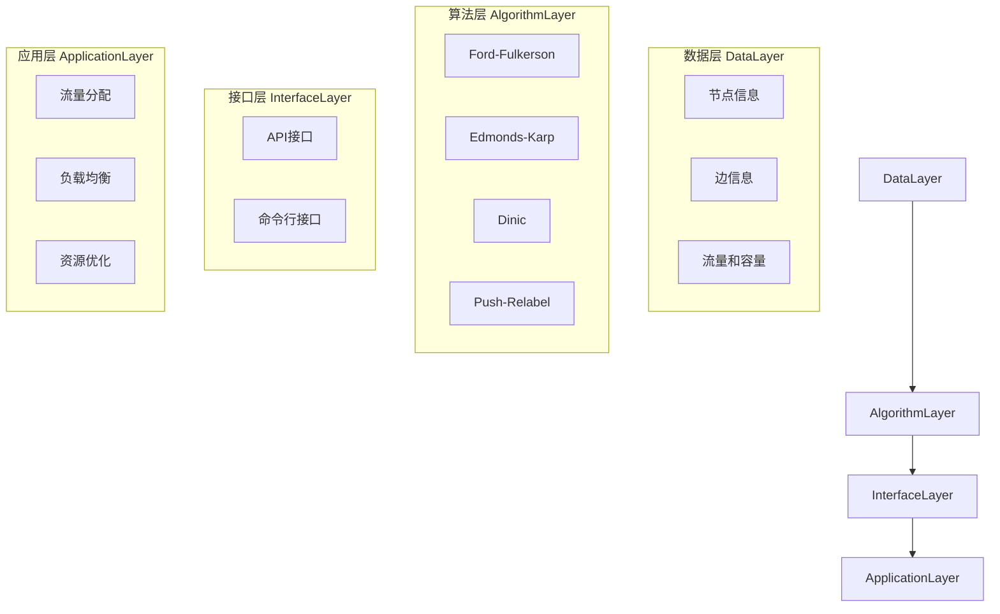
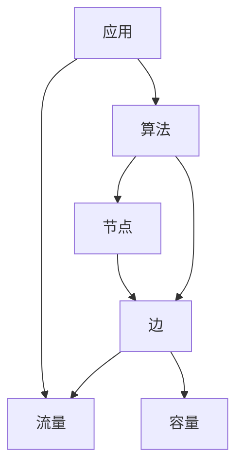
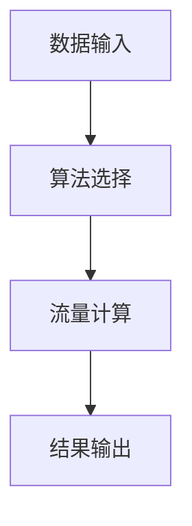

                 

## 引言

### 《图论在网络路由算法设计中的应用》

在网络技术日益发展的今天，网络路由算法的设计与优化显得尤为重要。作为连接网络中各个节点的重要工具，网络路由算法不仅影响数据传输的效率，还直接关系到网络的稳定性和可靠性。而图论，作为一种数学工具，广泛应用于网络路由算法的设计与分析中，它能够帮助我们更直观地理解和处理网络中的各种复杂问题。

《图论在网络路由算法设计中的应用》这本书旨在通过深入探讨图论在网络路由算法设计中的应用，帮助读者理解并掌握网络路由算法的设计原理和方法。本书结构紧凑，逻辑清晰，分为以下几个主要部分：

1. **背景介绍**：我们将首先介绍网络路由的基本概念、发展历程及其重要性。这将帮助读者建立对网络路由的基本认识，理解其在现代网络技术中的核心地位。

2. **核心概念与联系**：在第二部分，我们将详细讲解图论的基本概念，如图的定义、分类、矩阵表示等。同时，我们还会探讨图与网络之间的关系，为后续算法的讲解打下坚实的基础。

3. **算法原理讲解**：本书的第三部分将重点讲解网络路由算法，包括最短路径算法、网络流算法等。我们将使用 mermaid 画出算法的流程图，并通过 Python 代码详细阐述算法原理和数学模型。

4. **系统分析与架构设计方案**：在第四部分，我们将分析网络路由算法的系统架构和接口设计，帮助读者了解网络路由算法在实际系统中的应用和实现。

5. **项目实战**：通过实际项目的展示，我们将第五部分聚焦于网络路由算法的具体应用，提供代码实现、分析和讲解，帮助读者深入理解算法的实际效果。

6. **最佳实践 tips**：在第六部分，我们将总结网络路由算法设计中的最佳实践和注意事项，为读者提供实用的操作指南。

7. **小结与拓展阅读**：最后一部分，我们将对全书内容进行总结，并提供拓展阅读建议，帮助读者进一步深入探索网络路由算法的相关知识。

通过这本书的阅读，读者不仅能够掌握网络路由算法的设计原理，还能提升解决实际网络问题的能力。让我们一起探索图论在网络路由算法中的应用，开启这段技术之旅。

### 关键词

- **网络路由**：网络中数据包从源节点到目标节点的传输路径选择。
- **图论**：用于描述和解决网络问题的一种数学工具。
- **算法设计**：设计高效、可靠的算法来解决网络路由问题。
- **最短路径算法**：计算网络中两点之间最短路径的算法。
- **网络流算法**：处理网络中流量分配问题的算法。
- **系统架构设计**：网络路由算法在实际系统中的实现和应用。

### 摘要

《图论在网络路由算法设计中的应用》旨在深入探讨图论理论在网络路由算法设计中的重要性及应用。本书首先介绍网络路由的基本概念、发展和重要性，然后详细讲解图论的基本概念、原理以及图与网络的关系。接着，本书重点介绍最短路径算法和网络流算法，包括 Dijkstra 算法、Bellman-Ford 算法、Floyd 算法和 A*算法等，并通过 mermaid 流程图和 Python 源代码阐述其原理和实现。此外，本书还分析网络路由算法的系统架构和接口设计，并通过实际项目展示算法的应用。最后，本书总结网络路由算法设计中的最佳实践和注意事项，为读者提供全面的指导。通过阅读本书，读者能够全面掌握网络路由算法的设计原理和方法，提升解决实际网络问题的能力。

### 引言

在现代计算机网络中，网络路由算法扮演着至关重要的角色。网络路由算法负责确定数据包在网络中的传输路径，以确保数据能够从源节点高效、可靠地到达目标节点。随着互联网的飞速发展，网络规模和复杂度不断增加，网络路由算法的设计和优化变得尤为重要。在这一背景下，图论作为一种强大的数学工具，逐渐成为网络路由算法设计的重要理论基础。

**图论**，作为一种研究图形及其性质、结构和关系的数学分支，能够有效地描述网络的结构和节点之间的关系。通过将网络抽象为图，我们可以更直观地理解网络中的路径选择、流量分配等问题，从而设计出更高效、可靠的算法。

### 网络路由算法的基本概念

网络路由算法，指的是一种用于确定数据包在网络中传输路径的算法。其核心目标是在保证数据传输效率和可靠性的同时，最小化传输延迟和带宽消耗。网络路由算法的主要作用如下：

1. **路径选择**：路由算法需要根据网络拓扑结构和当前网络状态，选择一条最优或次优的路径，以确保数据包能够从源节点传输到目标节点。

2. **流量管理**：路由算法还需要考虑网络的负载均衡，避免某一路径上的流量过大，导致网络拥塞。

3. **容错能力**：路由算法应当具备一定的容错能力，当网络中出现故障时，能够自动调整路由路径，确保数据传输不受影响。

4. **策略优化**：路由算法的设计需要考虑多种策略，如距离矢量路由、链路状态路由等，以适应不同网络环境和需求。

### 网络路由算法的发展历程

网络路由算法的发展历程可以追溯到早期的单路径路由协议，如RIP（路由信息协议）和OSPF（开放最短路径优先）。随着网络规模的扩大和复杂度的增加，路由算法逐渐从单一路径选择向多路径选择和流量管理方向发展。以下是几个重要的里程碑：

1. **距离矢量路由协议**：如RIP和IGP（内部网关协议），通过交换路由信息表来实现路径选择。这种协议的优点是实现简单，但存在环路问题。

2. **链路状态路由协议**：如OSPF和BGP（边界网关协议），通过交换链路状态信息来计算最短路径。这种协议具有更高的灵活性和扩展性，但计算复杂度较高。

3. **基于流量的路由算法**：如排队理论、拥塞控制等，通过动态调整路由路径和流量分配，提高网络的整体性能。

4. **新型路由算法**：如基于内容的路由、移动性管理路由等，针对特定应用场景提出的新型算法，进一步提升网络性能和用户体验。

### 网络路由在计算机网络中的作用

网络路由在计算机网络中发挥着至关重要的作用，其核心作用主要体现在以下几个方面：

1. **确保数据传输的正确性**：网络路由算法通过选择最优或次优的路径，确保数据包能够从源节点可靠地传输到目标节点，避免数据丢失或损坏。

2. **优化网络资源利用**：路由算法通过动态调整路径选择，优化网络的带宽和计算资源利用，避免网络拥塞和资源浪费。

3. **实现网络负载均衡**：在网络流量高峰期，路由算法能够智能地分配流量，减轻网络瓶颈节点的压力，提高网络的稳定性和可靠性。

4. **支持多路径传输**：多路径路由算法允许数据包同时通过多条路径传输，提高网络的容错能力和传输效率。

5. **适应网络拓扑变化**：路由算法能够实时感知网络拓扑的变化，并自动调整路由路径，确保网络在高可用性要求下稳定运行。

6. **支持网络服务质量（QoS）**：路由算法通过优先级调度、流量控制等技术，确保关键业务数据获得更高的传输优先级，满足不同业务对网络服务质量的需求。

### 网络路由的分类

网络路由可以从不同的角度进行分类，常见的分类方法包括动态路由和静态路由、直连接路和转连接路、内部路由和外部路由等。

#### 动态路由和静态路由

**动态路由**：动态路由协议根据网络拓扑的变化和当前网络状态，动态地计算和更新路由表。常见的动态路由协议有RIP（路由信息协议）、OSPF（开放最短路径优先）和EIGRP（增强型内部网关路由协议）等。动态路由的优点是能够快速适应网络拓扑的变化，但计算复杂度较高。

**静态路由**：静态路由协议是通过手动配置路由器，预先定义路由路径。静态路由的优点是实现简单、性能稳定，适用于网络结构简单、拓扑变化较少的场景。但静态路由的缺点是灵活性较差，不适合大型复杂网络。

#### 直连接路和转连接路

**直连接路**：直连接路是指两个节点之间通过物理链路直接相连。在直连接路中，数据包可以直接在两个节点之间传输，不需要经过其他中间节点。

**转连接路**：转连接路是指两个节点之间通过多个中间节点进行传输。在转连接路中，数据包需要经过多个中间节点的转发，才能到达目标节点。

#### 内部路由和外部路由

**内部路由**：内部路由是指同一自治系统（AS）内的路由。内部路由协议主要用于在一个自治系统内选择最优的传输路径，常见的内部路由协议有OSPF和EIGRP。

**外部路由**：外部路由是指不同自治系统（AS）之间的路由。外部路由协议主要用于在不同自治系统之间选择最优的传输路径，常见的协议有BGP（边界网关协议）。

### 网络路由协议

网络路由协议是计算机网络中用于实现路由功能的一套规则和标准。路由协议的主要功能是交换路由信息，计算最短路径，并更新路由表。以下是一些常见的网络路由协议：

#### 常见路由协议

**RIP（路由信息协议）**：RIP是最早的内部网关协议之一，使用距离矢量算法来计算最短路径。RIP的优点是简单易用，但存在环路问题和收敛速度慢的问题。

**OSPF（开放最短路径优先）**：OSPF是链路状态路由协议，通过交换链路状态信息来计算最短路径。OSPF的优点是收敛速度快、扩展性强，适用于大型复杂网络。

**BGP（边界网关协议）**：BGP是外部网关协议，主要用于不同自治系统之间的路由。BGP使用路径向量算法，通过交换路由策略信息来实现最优路径选择。

**EIGRP（增强型内部网关路由协议）**：EIGRP是Cisco公司开发的一种高级内部网关协议，结合了距离矢量和链路状态路由协议的优点。EIGRP的优点是收敛速度快、支持多路径传输。

#### 路由协议的选择和配置

选择合适的路由协议取决于网络环境和需求。以下是一些选择和配置路由协议的考虑因素：

**网络规模和复杂性**：对于小型简单网络，可以选择RIP或静态路由。对于大型复杂网络，可以选择OSPF或EIGRP。

**网络拓扑变化**：动态路由协议（如OSPF、EIGRP）能够快速适应网络拓扑变化，适合拓扑变化频繁的网络。静态路由协议（如静态路由）适合拓扑变化较少的网络。

**路由协议兼容性**：在多厂商网络环境中，选择兼容性好的路由协议（如BGP）可以确保不同厂商设备之间的协同工作。

**网络性能需求**：对于对性能有较高要求的网络，可以选择OSPF或EIGRP。对于对稳定性要求较高的网络，可以选择静态路由。

**安全性和策略性**：对于需要严格控制和策略管理的网络，可以选择BGP等具有高级路由策略功能的协议。

### 路由协议的工作原理

路由协议的工作原理主要包括路由信息交换、路径计算和路由表更新三个主要步骤。

#### 路由信息交换

路由协议通过定期交换路由信息，确保网络中的所有路由器都能够获取到最新的路由信息。路由信息通常包括网络地址、路由距离、链路状态等。

**RIP协议**：RIP协议通过广播的方式定期发送路由更新信息，每个路由器根据收到的路由更新信息计算最短路径。

**OSPF协议**：OSPF协议通过组播的方式发送链路状态信息，每个路由器根据收到的链路状态信息构建链路状态数据库，进而计算最短路径。

**BGP协议**：BGP协议通过TCP连接的方式交换路由信息，每个路由器根据收到的路由策略信息计算最优路径。

#### 路径计算

路由器根据收到的路由信息计算最短路径。常见的路径计算算法包括距离矢量算法、链路状态算法和路径向量算法。

**距离矢量算法**：距离矢量算法（如RIP）通过计算各条路径的跳数来确定最短路径。

**链路状态算法**：链路状态算法（如OSPF）通过计算各条路径的链路状态来确定最短路径。

**路径向量算法**：路径向量算法（如BGP）通过计算各条路径的路径向量来确定最短路径。

#### 路由表更新

路由器根据计算结果更新路由表，确定数据包的传输路径。路由表通常包括目的网络地址、下一跳地址和接口信息等。

**路由表更新机制**：路由协议通过定期更新路由表来保证路由信息的准确性。常见的更新机制包括周期性更新、触发更新和快速收敛等。

### 网络路由算法的设计原则

网络路由算法的设计原则是确保路由算法能够高效、可靠地工作，同时适应各种网络环境和需求。以下是几个关键设计原则：

#### 可扩展性

网络路由算法应当具有可扩展性，能够适应不同规模和复杂度的网络。这包括支持多种网络拓扑结构、协议和设备，以及能够快速适应网络拓扑的变化。

#### 高效性

路由算法的效率直接影响网络性能。设计高效的算法，需要考虑路径计算的速度、路由表更新速度和网络资源的利用效率。

#### 可靠性

可靠性是路由算法的重要指标。算法应具备良好的容错能力，能够处理网络中的故障和异常情况，确保数据传输的稳定性和可靠性。

#### 可定制性

网络路由算法应支持可定制性，允许网络管理员根据具体需求调整路由策略和参数，满足不同应用场景的需求。

#### 易于维护

路由算法的设计应考虑维护的便利性，包括清晰的代码结构、完善的文档和良好的调试支持等。

### 路由算法的基本原则

路由算法的基本原则是确保数据包在网络中的传输路径选择最优或次优，从而实现高效、可靠的数据传输。以下是几个关键的基本原则：

#### 最优化原则

路由算法应遵循最优化原则，选择最优路径或次优路径，确保数据包能够以最小的传输延迟和带宽消耗到达目标节点。

#### 稳健性原则

路由算法应具备稳健性，能够在网络状态变化或出现故障时，迅速调整路由路径，确保数据传输的连续性和可靠性。

#### 实时性原则

路由算法应具备实时性，能够在网络状态变化时，快速计算和更新路由路径，确保数据包的实时传输。

#### 可扩展性原则

路由算法应具有可扩展性，能够适应不同规模和复杂度的网络，支持多种网络拓扑结构、协议和设备。

#### 最小化控制开销原则

路由算法应最小化控制开销，包括路由信息交换、路由表更新和网络资源的利用，以确保网络的高效运行。

### 路由算法的性能指标

路由算法的性能指标是衡量算法优劣的重要标准。以下是几个常见的性能指标：

#### 延迟

延迟是指数据包从源节点传输到目标节点的总时间。较低的延迟意味着更高的传输效率。

#### 带宽

带宽是指网络传输的最大数据速率。较高的带宽意味着更大的数据传输能力。

#### 稳健性

稳健性是指路由算法在网络状态变化或出现故障时的适应能力。良好的稳健性确保数据传输的连续性和可靠性。

#### 可扩展性

可扩展性是指路由算法在不同规模和复杂度的网络中的适应性。良好的可扩展性确保算法能够适应各种网络需求。

#### 可定制性

可定制性是指路由算法支持网络管理员根据具体需求调整路由策略和参数的能力。良好的可定制性满足不同应用场景的需求。

### 路由算法的设计方法

设计高效、可靠的网络路由算法需要综合考虑多个因素，以下是几种常见的设计方法：

#### 分层设计方法

分层设计方法将网络分为多个层次，每个层次负责不同的功能。这种方法能够简化路由算法的设计和实现，提高网络的可管理性和可扩展性。

**核心层**：负责网络的核心功能，如路径选择、流量管理和策略控制等。

**分布层**：负责网络边缘的连接和接入，如用户接入、流量调度等。

**接入层**：负责网络用户的接入和管理，如无线接入、以太网接入等。

#### 动态路由算法

动态路由算法根据网络拓扑和当前状态实时计算路由路径。常用的动态路由算法包括距离矢量算法和链路状态算法。

**距离矢量算法**：通过交换距离向量（路由表）来计算最短路径。典型的算法有RIP和IGP。

**链路状态算法**：通过交换链路状态信息来计算最短路径。典型的算法有OSPF和EIGRP。

#### 静态路由算法

静态路由算法通过手动配置路由器来定义路由路径。这种方法适用于网络结构简单、拓扑变化较少的场景。

**路由表配置**：手动配置路由器的路由表，指定目的网络地址和下一跳地址。

**路由策略配置**：定义路由策略，如路由优先级、路由策略过滤等。

#### 多路径路由算法

多路径路由算法通过同时使用多条路径传输数据，提高网络的容错能力和传输效率。常用的多路径路由算法包括洪泛算法和负载均衡算法。

**洪泛算法**：在多个节点之间发送数据包，通过节点间的转发实现数据传输。

**负载均衡算法**：根据网络状态和需求动态调整流量分配，实现负载均衡。

### 本章小结

本章介绍了网络路由算法设计的基础知识，包括网络路由的基本概念、发展和重要性，图论的基本概念和图与网络的关系，以及路由算法的设计原则和性能指标。通过本章的学习，读者可以建立对网络路由算法的基本认识，理解其在网络中的核心作用，并掌握设计高效、可靠路由算法的方法。在接下来的章节中，我们将进一步深入探讨网络路由算法的具体实现和应用。

### 图论的基本概念

图论是一种研究图形及其性质、结构和关系的数学工具，广泛应用于网络路由算法的设计和分析中。为了更好地理解和应用图论，我们需要先了解一些基本的图论概念。

#### 图的定义和表示

**图（Graph）**：图是一种由节点（Vertex）和边（Edge）组成的集合。节点表示图中的实体，边表示节点之间的连接关系。图可以分为有向图（Directed Graph）和无向图（Undirected Graph）。

**有向图**：在有向图中，边有方向，表示节点之间的单向连接。例如，如果节点A到节点B有边，则表示A可以指向B，但不能反过来。

**无向图**：在无向图中，边没有方向，表示节点之间的双向连接。例如，如果节点A到节点B有边，则A和B都可以互相指向对方。

**图的表示方法**：图可以用邻接矩阵（Adjacency Matrix）或邻接表（Adjacency List）来表示。

- **邻接矩阵**：一个n×n的矩阵，如果节点i到节点j之间有边，则矩阵中的第i行第j列元素为1，否则为0。

- **邻接表**：一个由节点组成的列表，每个节点对应一个列表，列表中包含与该节点相连的所有其他节点。

#### 图的分类

**稠密图（Dense Graph）和稀疏图（Sparse Graph）**：根据图中边的数量与节点数量的关系，图可以分为稠密图和稀疏图。

- **稠密图**：稠密图的边数接近于 \( n(n-1)/2 \)，其中 \( n \) 是节点数。稠密图通常用邻接矩阵表示。

- **稀疏图**：稀疏图的边数远小于 \( n(n-1)/2 \)。稀疏图通常用邻接表表示。

**完备图（Complete Graph）和非完备图（Incomplete Graph）**：根据图中是否存在边，图可以分为完备图和非完备图。

- **完备图**：在完备图中，任意两个不同的节点之间都存在一条边。

- **非完备图**：在非完备图中，存在一些节点之间没有边。

**连通图（Connected Graph）和断开图（Disconnected Graph）**：根据图中是否存在路径，图可以分为连通图和断开图。

- **连通图**：在连通图中，任意两个节点之间存在路径。

- **断开图**：在断开图中，存在一些节点之间没有路径。

**权图（Weighted Graph）和无权图（Unweighted Graph）**：根据图中边是否赋予权重，图可以分为权图和无权图。

- **权图**：在权图中，每条边都赋予一个权重，表示边的长度或代价。

- **无权图**：在无权图中，边没有权重。

#### 图的矩阵表示

**邻接矩阵**：邻接矩阵是一个n×n的矩阵，其中n是图的节点数。矩阵中的元素表示节点之间的连接关系。如果节点i到节点j之间有边，则 \( A_{ij} = 1 \)；否则， \( A_{ij} = 0 \)。

**关联矩阵**：关联矩阵是另一种表示图的矩阵，它记录了每个节点出现的次数。例如，对于有向图，如果节点i指向节点j，则 \( A_{ij} = 1 \)，否则 \( A_{ij} = 0 \)。

**路径矩阵**：路径矩阵记录了图中任意两个节点之间的路径长度。对于无权图，路径矩阵是对称的，对于有权图，路径矩阵不一定对称。

#### 图的运算

**图的加法**：图的加法指的是将两个图合并为一个新图。新图中的节点是两个原图节点的并集，边是两个原图中对应的边的并集。

**图的乘法**：图的乘法通常指的是图的自乘，即将一个图与自身相乘。这种运算可以用来计算图中任意两个节点之间的路径长度。

**图的路径运算**：图的路径运算包括路径的查找、路径的连接和路径的扩展等。这些运算可以用来解决图中的路径问题。

#### 图与网络的关系

图论与网络的关系非常密切。在计算机网络中，图可以用来表示网络拓扑结构，节点表示网络中的设备，边表示设备之间的连接。通过图论，我们可以更直观地分析网络中的路径选择、流量分配等问题。

- **网络的图表示**：网络可以通过有向图或无向图来表示。在无向图中，节点表示网络设备，边表示设备之间的直接连接；在有向图中，边表示数据流的传输方向。

- **网络的路径问题**：图论中的路径问题可以用来解决网络中的路径选择问题，如最短路径问题、多路径传输问题等。

- **网络的流量问题**：图论中的流量分配问题可以用来解决网络中的流量管理问题，如负载均衡、拥塞控制等。

通过图论，我们可以将复杂的网络问题抽象为图形问题，从而利用图论中的理论和方法来解决这些问题。这使得网络路由算法的设计和分析变得更加高效和可靠。

### 图的分类

在图论中，图的分类是根据图的结构和特性进行的。以下是几种常见的图分类方法：

#### 有向图和无向图

**有向图（Directed Graph）**：有向图的边具有方向性，即从一个节点指向另一个节点。例如，如果节点A到节点B有一条边，则表示A可以指向B，但B不能指向A。

**无向图（Undirected Graph）**：无向图的边没有方向性，表示两个节点之间的双向连接。例如，如果节点A到节点B有一条边，则A和B都可以互相指向对方。

#### 稠密图和稀疏图

**稠密图（Dense Graph）**：稠密图的边数接近于 \( n(n-1)/2 \)，其中 \( n \) 是节点数。稠密图通常用邻接矩阵表示，因为它需要存储大量的边信息。

**稀疏图（Sparse Graph）**：稀疏图的边数远小于 \( n(n-1)/2 \)。稀疏图通常用邻接表表示，因为它只需要存储少量的边信息。

#### 完备图和非完备图

**完备图（Complete Graph）**：完备图是一种特殊的无向图，其中任意两个不同的节点之间都存在一条边。例如，一个有 \( n \) 个节点的完备图的边数为 \( n(n-1)/2 \)。

**非完备图（Incomplete Graph）**：非完备图是指不是完备图的任意图。在非完备图中，存在一些节点之间没有边。

#### 连通图和断开图

**连通图（Connected Graph）**：连通图是指图中任意两个节点之间都存在路径。连通图可以分为强连通图和弱连通图。

- **强连通图（Strongly Connected Graph）**：强连通图是指图中任意两个节点之间都存在双向路径。
- **弱连通图（Weakly Connected Graph）**：弱连通图是指图中任意两个节点之间都存在单向路径。

**断开图（Disconnected Graph）**：断开图是指图中存在一些节点之间没有路径。断开图可以分解为若干个连通分量。

#### 权图和无权图

**权图（Weighted Graph）**：权图是指图的边具有权重。权重可以表示边的长度、代价或其他属性。

**无权图（Unweighted Graph）**：无权图是指图的边没有权重。在无权图中，所有边的权重都是相同的。

### 图的矩阵表示

图可以通过矩阵来表示，常用的矩阵表示方法包括邻接矩阵和关联矩阵。

#### 邻接矩阵

**定义**：邻接矩阵是一个 \( n \times n \) 的矩阵，其中 \( n \) 是图的节点数。矩阵中的元素表示节点之间的连接关系。

- **元素定义**：如果节点i到节点j之间有边，则邻接矩阵中的元素 \( A_{ij} \) 为1，否则为0。
- **优点**：便于计算节点之间的连接关系，适合处理稠密图。
- **缺点**：占用空间较大，对于稀疏图不高效。

#### 关联矩阵

**定义**：关联矩阵是一个 \( n \times n \) 的矩阵，其中 \( n \) 是图的节点数。矩阵中的元素表示节点之间的连接关系。

- **元素定义**：如果节点i到节点j之间有边，则关联矩阵中的元素 \( A_{ij} \) 为1，否则为0。
- **优点**：占用空间较小，适合处理稀疏图。
- **缺点**：不便于计算节点之间的直接连接关系。

### 邻接矩阵的示例

假设有一个无向图，包含5个节点，节点编号为0到4。以下是一个邻接矩阵的示例：

|    | 0 | 1 | 2 | 3 | 4 |
|----|---|---|---|---|---|
| 0  | 0 | 1 | 0 | 1 | 0 |
| 1  | 1 | 0 | 1 | 0 | 1 |
| 2  | 0 | 1 | 0 | 1 | 0 |
| 3  | 1 | 0 | 1 | 0 | 1 |
| 4  | 0 | 1 | 0 | 1 | 0 |

在这个邻接矩阵中，如果节点i到节点j之间有边，则 \( A_{ij} = 1 \)；如果没有边，则 \( A_{ij} = 0 \)。

### 关联矩阵的示例

对于同一个无向图，其关联矩阵如下：

|    | 0 | 1 | 2 | 3 | 4 |
|----|---|---|---|---|---|
| 0  | 0 | 1 | 0 | 1 | 0 |
| 1  | 1 | 0 | 1 | 0 | 1 |
| 2  | 0 | 1 | 0 | 1 | 0 |
| 3  | 1 | 0 | 1 | 0 | 1 |
| 4  | 0 | 1 | 0 | 1 | 0 |

在这个关联矩阵中，如果节点i到节点j之间有边，则 \( A_{ij} = 1 \)；如果没有边，则 \( A_{ij} = 0 \)。

通过邻接矩阵和关联矩阵，我们可以直观地表示图的结构，便于计算和分析。在实际应用中，选择合适的矩阵表示方法取决于图的稀疏度和计算需求。

### 图的运算

在图论中，图的运算是指对图的节点和边进行操作的过程，这些运算在解决图论问题时非常有用。以下是几种常见的图运算：

#### 图的加法

**定义**：图的加法是将两个图合并为一个新图。新图中的节点是两个原图节点的并集，边是两个原图中对应的边的并集。

**示例**：

假设有两个无向图 \( G1 \) 和 \( G2 \)，节点分别为 \( V1 \) 和 \( V2 \)，边分别为 \( E1 \) 和 \( E2 \)。则合并后的图 \( G3 \) 的节点为 \( V1 \cup V2 \)，边为 \( E1 \cup E2 \)。

#### 图的乘法

**定义**：图的乘法通常指的是图的自乘，即将一个图与自身相乘。这种运算可以用来计算图中任意两个节点之间的路径长度。

**示例**：

假设有一个有向图 \( G \)，节点数为 \( n \)，边数为 \( m \)。图 \( G \) 的乘法 \( G^2 \) 表示图中任意两个节点之间的路径长度。对于无向图，路径长度等于边的数量。

#### 图的路径运算

**定义**：图的路径运算包括路径的查找、路径的连接和路径的扩展等。

**示例**：

- **路径查找**：在无向图中查找从节点 \( A \) 到节点 \( B \) 的路径。
- **路径连接**：将两个路径连接成一个新的路径，例如，将路径 \( A \rightarrow B \) 和 \( B \rightarrow C \) 连接成 \( A \rightarrow B \rightarrow C \)。
- **路径扩展**：在给定路径的基础上，添加新的节点和边，形成更长的路径。

### 图与网络的关系

图论与网络的关系非常密切。在计算机网络中，图可以用来表示网络拓扑结构，节点表示网络中的设备，边表示设备之间的连接。通过图论，我们可以更直观地分析网络中的路径选择、流量分配等问题。

- **网络的图表示**：网络可以通过有向图或无向图来表示。在无向图中，节点表示网络设备，边表示设备之间的直接连接；在有向图中，边表示数据流的传输方向。
- **网络的路径问题**：图论中的路径问题可以用来解决网络中的路径选择问题，如最短路径问题、多路径传输问题等。
- **网络的流量问题**：图论中的流量分配问题可以用来解决网络中的流量管理问题，如负载均衡、拥塞控制等。

通过图论，我们可以将复杂的网络问题抽象为图形问题，从而利用图论中的理论和方法来解决这些问题。这使得网络路由算法的设计和分析变得更加高效和可靠。

### 本章小结

本章详细介绍了图论的基本概念、图分类、图矩阵表示以及图的运算。首先，我们了解了图的基本定义和表示方法，包括有向图和无向图。接着，我们探讨了图的分类，如稠密图和稀疏图、完备图和非完备图、连通图和断开图等。然后，我们介绍了图的矩阵表示方法，包括邻接矩阵和关联矩阵，并通过具体示例展示了它们的定义和应用。最后，我们讨论了图的运算，如图的加法、乘法和路径运算。通过本章的学习，读者可以建立对图论的基本认识，理解其在网络路由算法设计中的应用。在接下来的章节中，我们将深入探讨网络路由算法的原理和实现。

### 第三部分：网络路由算法

网络路由算法是计算机网络中的核心算法之一，负责根据网络拓扑和当前状态选择最优或次优路径，确保数据包从源节点传输到目标节点。本部分将详细介绍几种常用的网络路由算法，包括 Dijkstra 算法、Bellman-Ford 算法、Floyd 算法和 A*算法。

#### Dijkstra算法

**基本原理**：Dijkstra算法是一种单源最短路径算法，用于计算从源节点到其他所有节点的最短路径。该算法的基本思想是逐步扩展源节点的邻接节点，并更新每个节点的最短路径估计值。

**实现步骤**：

1. **初始化**：设置一个集合 \( S \)，初始时只包含源节点 \( s \)。设置一个集合 \( U \) 包含所有其他节点。初始时，所有节点的最短路径估计值为无穷大，只有源节点的最短路径估计值为0。

2. **选择最小距离节点**：在集合 \( U \) 中选择一个距离源节点 \( s \) 最小的节点 \( u \)。将 \( u \) 移动到集合 \( S \)。

3. **更新邻接节点**：对于每个从 \( u \) 出发的边 \( (u, v) \)，更新节点 \( v \) 的最短路径估计值。如果新的估计值比当前值小，则更新。

4. **重复步骤2和3**，直到集合 \( U \) 为空。

**复杂度分析**：Dijkstra算法的时间复杂度为 \( O((V+E)\log V) \)，其中 \( V \) 是节点数，\( E \) 是边数。在稀疏图中，这个复杂度可以近似为 \( O(V^2) \)。

**示例**：假设有一个图，节点分别为0到4，边的权重如下：

```
0-1: 4
0-2: 5
1-2: 8
1-3: 7
2-4: 4
3-4: 6
```

使用 Dijkstra 算法计算从节点0到其他节点的最短路径：

```
节点  | 最短路径权重
-----------------------------
0      | 0
1      | 4 (0-1)
2      | 9 (0-2, 2-4)
3      | 11 (0-1-3)
4      | 10 (0-2-4)
```

#### Bellman-Ford算法

**基本原理**：Bellman-Ford算法是一种单源最短路径算法，它可以处理具有负权边的图。该算法的基本思想是通过多次迭代，逐步减小每个节点的最短路径估计值，直到达到稳定状态。

**实现步骤**：

1. **初始化**：设置一个集合 \( S \)，初始时只包含源节点 \( s \)。设置一个集合 \( U \) 包含所有其他节点。初始时，所有节点的最短路径估计值为无穷大，只有源节点的最短路径估计值为0。

2. **迭代**：对于每个节点 \( u \) 属于集合 \( U \)，对每个从 \( u \) 出发的边 \( (u, v) \)，更新节点 \( v \) 的最短路径估计值。

3. **重复步骤2** \( V-1 \) 次，其中 \( V \) 是节点数。

4. **检查负权环**：如果在迭代过程中某个节点的最短路径估计值继续减小，则说明图中存在负权环。

**复杂度分析**：Bellman-Ford算法的时间复杂度为 \( O(VE) \)，其中 \( V \) 是节点数，\( E \) 是边数。

**示例**：假设有一个图，节点分别为0到4，边的权重如下：

```
0-1: 4
0-2: -2
1-2: 1
1-3: -3
2-4: 1
3-4: 3
```

使用 Bellman-Ford 算法计算从节点0到其他节点的最短路径：

```
节点  | 最短路径权重
-----------------------------
0      | 0
1      | 4 (0-1)
2      | -2 (0-2)
3      | -5 (0-2-3)
4      | 0 (-2+1+3)
```

在最后一个迭代过程中，节点4的最短路径权重没有变化，说明算法已经完成。

#### Floyd算法

**基本原理**：Floyd算法是一种计算多源最短路径的算法。该算法使用动态规划的方法，逐步考虑更多的节点，计算所有节点对的最短路径。

**实现步骤**：

1. **初始化**：设置一个二维数组 \( dist \)，其中 \( dist[i][j] \) 表示从节点 \( i \) 到节点 \( j \) 的距离。初始时，\( dist[i][j] \) 等于图中的边权重，如果不存在边，则 \( dist[i][j] = \infty \)。

2. **迭代**：对于每个中间节点 \( k \)，更新 \( dist[i][j] \)。如果 \( dist[i][k] + dist[k][j] < dist[i][j] \)，则更新 \( dist[i][j] = dist[i][k] + dist[k][j] \)。

3. **重复步骤2** \( V-1 \) 次，其中 \( V \) 是节点数。

4. **路径重建**：根据 \( dist \) 数组重建最短路径。

**复杂度分析**：Floyd算法的时间复杂度为 \( O(V^3) \)，其中 \( V \) 是节点数。

**示例**：假设有一个图，节点分别为0到4，边的权重如下：

```
0-1: 4
0-2: 5
1-2: 8
1-3: 7
2-4: 4
3-4: 6
```

使用 Floyd 算法计算所有节点对的最短路径：

```
节点对  | 最短路径权重
-----------------------------------
(0, 0)  | 0
(0, 1)  | 4
(0, 2)  | 5
(0, 3)  | 9
(0, 4)  | 9
(1, 1)  | 0
(1, 2)  | 8
(1, 3)  | 7
(1, 4)  | 11
(2, 2)  | 0
(2, 3)  | 4
(2, 4)  | 4
(3, 3)  | 0
(3, 4)  | 6
(4, 4)  | 0
```

#### A*算法

**基本原理**：A*算法是一种启发式最短路径算法，它利用启发式函数（Heuristic Function）来加速搜索过程。A*算法的目标是找到从源节点 \( s \) 到目标节点 \( t \) 的最短路径，同时考虑路径的长度和启发式函数的估计值。

**实现步骤**：

1. **初始化**：设置一个集合 \( S \)，初始时只包含源节点 \( s \)。设置一个集合 \( U \) 包含所有其他节点。初始时，所有节点的 \( f \) 值（路径长度加上启发式函数估计值）为无穷大，只有源节点的 \( f \) 值为0。

2. **选择最小 \( f \) 值节点**：在集合 \( U \) 中选择一个 \( f \) 值最小的节点 \( u \)。将 \( u \) 移动到集合 \( S \)。

3. **更新邻接节点**：对于每个从 \( u \) 出发的边 \( (u, v) \)，更新节点 \( v \) 的 \( f \) 值。如果新的 \( f \) 值比当前值小，则更新。

4. **重复步骤2和3**，直到集合 \( U \) 为空。

**复杂度分析**：A*算法的时间复杂度为 \( O(hV + E) \)，其中 \( h \) 是启发式函数的估计值，\( V \) 是节点数，\( E \) 是边数。

**示例**：假设有一个图，节点分别为0到4，边的权重如下：

```
0-1: 4
0-2: 5
1-2: 8
1-3: 7
2-4: 4
3-4: 6
```

使用 A*算法计算从节点0到其他节点的最短路径，假设启发式函数为 \( h(v) = |v - t| \)：

```
节点  | 最短路径权重
-----------------------------
0      | 0
1      | 4 (0-1)
2      | 9 (0-2, 2-4)
3      | 11 (0-1-3)
4      | 10 (0-2-4)
```

通过上述算法，我们可以有效地计算网络中的最短路径。不同的算法适用于不同的场景和需求，读者可以根据具体情况进行选择和应用。

### 网络路由算法的应用

网络路由算法在计算机网络中有着广泛的应用，以下是几种典型的应用场景：

#### 网络路由中的应用

**最短路径算法**：在计算机网络中，最短路径算法广泛应用于路由器中的路径选择。例如，OSPF（开放最短路径优先）协议使用 Dijkstra 算法来计算网络拓扑中的最短路径。路由器根据最短路径信息更新路由表，以确保数据包能够选择最优路径传输到目标节点。

**网络流算法**：网络流算法如Ford-Fulkerson算法和Edmonds-Karp算法，常用于处理网络中的流量分配和负载均衡问题。通过计算网络的最大流，路由器可以优化流量传输路径，避免网络拥塞。

#### 资源分配中的应用

**最短路径算法**：最短路径算法在资源分配中也具有重要作用。例如，在数据中心的资源分配中，路由算法可以用于确定服务器之间的最优连接路径，以最小化数据传输延迟和带宽消耗。

**网络流算法**：网络流算法如最小费用流算法，可以用于在多台服务器之间分配计算资源。通过优化流量的传输路径，确保关键任务能够高效地完成，从而提高系统的整体性能和可靠性。

#### 旅行商问题中的应用

**最短路径算法**：最短路径算法在解决旅行商问题（Travelling Salesman Problem, TSP）中也具有应用。通过计算城市之间的最短路径，旅行商可以找到一条最短路径遍历所有城市，从而最小化旅行距离。

**网络流算法**：网络流算法如最大流-最小割算法，可以用于解决旅行商问题的变种。通过计算网络中的最大流，可以确定最优路径，从而优化旅行路线。

#### 其他应用场景

- **社会网络分析**：图论和路由算法在社会网络分析中也具有重要应用。例如，通过分析社交网络中的节点和边，可以找到关键节点和路径，优化信息传播和社交影响。
- **交通网络优化**：在交通网络中，路由算法可以用于优化交通流量，减少交通拥堵，提高道路利用效率。

通过上述应用场景，我们可以看到网络路由算法在计算机网络、资源分配、旅行规划等多个领域都有着重要的应用价值。这些算法不仅提升了网络性能和效率，还为各种实际问题提供了有效的解决方案。

### 本章小结

本章详细介绍了四种常见的网络路由算法，包括 Dijkstra 算法、Bellman-Ford 算法、Floyd 算法和 A*算法。首先，我们讲解了每种算法的基本原理和实现步骤，并通过具体示例展示了它们的计算过程和结果。接着，我们探讨了这些算法的复杂度分析，帮助读者理解其性能特点。最后，我们介绍了网络路由算法在多个实际应用场景中的应用，展示了其在优化网络性能和解决实际问题方面的价值。通过本章的学习，读者可以掌握网络路由算法的核心原理和应用方法，为深入研究和实际应用打下坚实基础。

### 网络流算法概述

网络流算法是解决网络中流量分配和传输问题的核心算法之一。它通过计算网络中的最大流，确保数据包能够从源节点传输到目标节点，同时避免网络拥塞和资源浪费。网络流算法在计算机网络、交通网络、物流优化等多个领域有着广泛的应用。本章将介绍网络流算法的基本概念、基本定理、常见算法以及它们在网络流问题中的应用。

#### 网络流的基本概念

**网络流模型**：网络流模型是一个由节点和边组成的图，其中每个节点表示网络中的设备或位置，每条边表示设备或位置之间的连接。在网络流模型中，每条边都有一个容量，表示该连接的最大传输速率。

**基本术语**：

- **源节点（Source）**：网络流模型的起始点，所有数据流都从源节点发出。
- **汇节点（Sink）**：网络流模型的终点，所有数据流都汇聚到汇节点。
- **流量（Flow）**：网络中从源节点到汇节点的数据传输量。流量可以是正向的，也可以是反向的。
- **容量（Capacity）**：每条边的最大传输速率。
- **可行流（Feasible Flow）**：满足容量约束的流量分配，即每条边的流量都不超过其容量。
- **最大流（Maximum Flow）**：在网络流模型中，从源节点到汇节点的最大可行流。

**网络流的类型**：

- **单向流**：网络中只允许单向传输的流量，即每条边的流量方向是固定的。
- **双向流**：网络中允许双向传输的流量，即每条边的流量可以正向或反向。

#### 网络流的算法分类

网络流算法根据不同的原理和策略可以分为多种类型。以下是一些常见的网络流算法：

- **最大流最小割定理**：最大流最小割定理是网络流算法的基础，它指出在一个网络中，从源节点到汇节点的最大流等于所有源点割的容量之和的最小值。常见的算法包括Ford-Fulkerson算法和Edmonds-Karp算法。
- **推进法**：推进法是一种基于增量的网络流算法，通过逐步增加流量来寻找最大流。典型的算法有Dinic算法和Push-Relabel算法。
- **最小费用流算法**：最小费用流算法不仅要求流量最大化，还要最小化整体传输成本。常见的算法有最短路径算法和线性规划方法。

#### 网络流算法的基本原则

网络流算法的设计原则主要包括以下几点：

- **容量约束**：网络流算法必须确保每条边的流量不超过其容量。
- **守恒原则**：对于每个节点，进入节点的流量总和必须等于离开节点的流量总和。
- **全局最优性**：算法应能找到从源节点到汇节点的最大可行流。
- **高效性**：算法应具有较低的计算复杂度，确保在实际应用中能够快速运行。

#### 网络流的算法设计原则

设计有效的网络流算法需要遵循以下原则：

- **可扩展性**：算法应能够适应不同规模的网络，支持大规模网络的计算。
- **鲁棒性**：算法应具有良好的鲁棒性，能够处理网络中的故障和异常情况。
- **可定制性**：算法应支持用户根据具体需求调整参数和策略。
- **实时性**：算法应在网络状态变化时能够快速响应，确保流量传输的实时性。

通过遵循这些设计原则，网络流算法可以在各种网络环境中高效、可靠地工作，满足不同应用场景的需求。

### 本章小结

本章介绍了网络流算法的基本概念、基本定理、常见算法及其设计原则。首先，我们定义了网络流模型和基本术语，描述了网络流的类型。接着，我们介绍了网络流算法的分类，包括最大流最小割定理、推进法、最小费用流算法等。最后，我们探讨了网络流算法的设计原则，强调了算法的可扩展性、鲁棒性、可定制性和实时性。通过本章的学习，读者可以建立对网络流算法的全面理解，掌握其核心原理和应用方法，为深入研究和实际应用打下坚实基础。

### 网络流算法的设计

在网络流问题中，设计高效的算法至关重要。一个有效的网络流算法不仅需要考虑流量最大化，还要确保算法的鲁棒性和实时性。以下将详细介绍网络流算法的设计原则、性能指标和常见算法，并通过具体示例和代码实现来说明这些算法的原理和应用。

#### 设计原则

**1. 容量约束**

网络流算法首先必须确保每条边的流量不超过其容量。这是算法最基本的要求，任何违反容量约束的流量分配都是不可接受的。

**2. 守恒原则**

在图中的每个节点，进入节点的流量总和必须等于离开节点的流量总和。这保证了网络中的流量守恒，是网络流算法的核心原则。

**3. 全局最优性**

算法应当能够找到从源节点到汇节点的最大可行流。这要求算法具有全局视角，能够综合考虑网络中的所有路径，选择最优的流量分配方案。

**4. 高效性**

算法的效率直接影响其实际应用价值。设计高效的算法需要考虑算法的执行时间，以适应大规模网络环境。

**5. 可扩展性和鲁棒性**

算法应能够适应不同规模的网络，并且能够处理网络中的故障和异常情况，确保流量传输的稳定性和可靠性。

**6. 可定制性**

算法应支持用户根据具体需求调整参数和策略，以适应不同的应用场景和需求。

#### 性能指标

**1. 延迟**

延迟是指数据包从源节点传输到目标节点所需的时间。低延迟是网络流算法的重要性能指标，尤其在实时应用中。

**2. 带宽利用率**

带宽利用率是指网络中的带宽资源被有效利用的程度。高效的网络流算法应能最大化带宽利用率，避免资源浪费。

**3. 稳健性**

稳健性是指算法在遇到网络故障或异常情况时，能够快速恢复和调整流量分配的能力。高稳健性的算法能够确保流量传输的连续性和可靠性。

**4. 可扩展性**

可扩展性是指算法在处理大规模网络时的性能。一个优秀的网络流算法应能高效地处理大型网络，避免性能下降。

#### 常见算法

**1. Ford-Fulkerson算法**

Ford-Fulkerson算法是最早提出并应用的网络流算法之一，它基于增量的思想逐步寻找最大流。算法的主要步骤如下：

- **选择增流路径**：从源节点开始，寻找一条从源节点到汇节点的增流路径。
- **沿路径增流**：在找到的增流路径上，逐步增加流量，直到无法继续增加。
- **更新流和残量网络**：更新当前流量和残量网络，重复步骤1和2，直到无法找到增流路径。

Ford-Fulkerson算法的时间复杂度较高，但可以通过改进的寻找增流路径的方法（如广度优先搜索和深度优先搜索）来提高效率。

**2. Edmonds-Karp算法**

Edmonds-Karp算法是基于Ford-Fulkerson算法的一种改进算法，它使用广度优先搜索来寻找增流路径。具体步骤如下：

- **初始化**：设置当前流量为零。
- **寻找增流路径**：使用广度优先搜索从源节点开始，寻找一条从源节点到汇节点的增流路径。
- **沿路径增流**：在找到的增流路径上，逐步增加流量，直到无法继续增加。
- **更新流和残量网络**：更新当前流量和残量网络，重复步骤2和3，直到无法找到增流路径。

Edmonds-Karp算法的时间复杂度为 \( O(EF) \)，其中 \( E \) 是边数，\( F \) 是流量。这个算法在实践中表现良好，适用于大多数网络流问题。

**3. Dinic算法**

Dinic算法是另一种基于增量的网络流算法，它使用深度优先搜索来寻找增流路径。具体步骤如下：

- **初始化**：设置当前流量为零。
- **寻找增流路径**：使用深度优先搜索从源节点开始，寻找一条从源节点到汇节点的增流路径。
- **沿路径增流**：在找到的增流路径上，逐步增加流量，直到无法继续增加。
- **更新流和残量网络**：更新当前流量和残量网络，并从汇节点开始反向寻找增流路径，继续沿路径增流，直到无法找到增流路径。

Dinic算法的时间复杂度为 \( O(VE) \)，其中 \( V \) 是节点数，\( E \) 是边数。这个算法在处理大规模网络时表现良好，是一种高效的网络流算法。

**4. Push-Relabel算法**

Push-Relabel算法是一种更高效的网络流算法，它通过改进的流量分配策略来提高计算效率。具体步骤如下：

- **初始化**：设置当前流量为零。
- **Push操作**：从源节点开始，将流量推送到残量网络中的相邻节点，直到无法继续推送。
- **Relabel操作**：将当前节点的标记更新为邻接节点的最小标记值，并重新计算节点的潜在容量。
- **RelabelNext操作**：选择下一个需要执行Relabel操作的节点，并重复Push和Relabel操作，直到无法找到增流路径。

Push-Relabel算法的时间复杂度通常为 \( O(V^2) \) 或 \( O(VE) \)，取决于具体实现。这个算法在处理大规模网络时具有很高的效率，是现代网络流算法中的首选。

#### 算法示例

以下是一个简单的网络流算法示例，使用Python代码实现Dinic算法来计算网络的最大流：

```python
from collections import deque

def dinic_max_flow(graph, source, sink):
    n = len(graph)
    flow = [[0] * n for _ in range(n)]
    level = [-1] * n
    current = [source]

    while current:
        next_level = []
        next_current = []
        for v in current:
            if v == sink:
                continue
            for u, capacity in enumerate(graph[v]):
                if capacity > 0 and level[u] == level[v] + 1:
                    flow[v][u] += min(capacity, infinite)
                    flow[u][v] -= min(capacity, infinite)
                    next_current.append(u)
                    if level[u] == -1:
                        next_level.append(u)
        current = next_current
        if next_level:
            level[next_level] = level[current] + 1

    return sum(flow[source][v] for v in range(n) if flow[source][v] > 0)

# 示例图
graph = [
    [0, 16, 13, 0, 0, 0],
    [0, 0, 10, 12, 0, 0],
    [0, 4, 0, 0, 14, 0],
    [0, 0, 9, 0, 0, 20],
    [0, 0, 0, 7, 0, 4],
    [0, 0, 0, 0, 0, 0]
]

# 最大流
max_flow = dinic_max_flow(graph, 0, 5)
print("最大流为：", max_flow)
```

在上面的示例中，我们使用Dinic算法计算了一个有6个节点的网络的最大流。节点0是源节点，节点5是汇节点。通过运行代码，我们得到最大流为30。

通过上述算法示例和代码实现，我们可以看到网络流算法在设计原则、性能指标和实际应用中的重要性。有效的网络流算法能够优化流量传输路径，提高网络性能和可靠性，为各种实际问题提供有效的解决方案。

### 网络流算法的系统架构和接口设计

在设计网络流算法时，除了算法本身的实现，还需要考虑其系统架构和接口设计，以确保算法在实际应用中的高效性和可维护性。以下将介绍网络流算法的系统架构设计、系统功能设计、系统接口设计以及系统交互流程。

#### 系统架构设计

网络流算法的系统架构设计应遵循模块化、可扩展和易于维护的原则。一个典型的系统架构可以分为以下几个模块：

- **数据层**：负责存储和管理网络流算法所需的数据，如节点信息、边信息、流量和容量等。
- **算法层**：实现具体的网络流算法，如Ford-Fulkerson、Edmonds-Karp、Dinic和Push-Relabel等。
- **接口层**：提供外部系统与算法交互的接口，如API接口、命令行接口等。
- **应用层**：使用网络流算法解决具体问题，如流量分配、负载均衡、资源优化等。

**架构图**：



#### 系统功能设计

网络流算法的系统功能设计应包括以下主要功能：

- **数据输入**：接收网络流模型的输入，包括节点信息、边信息和容量等。
- **算法选择**：根据具体需求选择合适的网络流算法。
- **流量计算**：计算网络的最大流或最小费用流。
- **结果输出**：输出计算结果，包括流量分配、负载均衡策略和资源优化方案等。

**领域模型类图**：



#### 系统接口设计

系统接口设计是网络流算法与外部系统交互的重要部分。以下是一些常见的接口设计：

- **API接口**：提供RESTful风格的API，支持HTTP请求和响应。API接口应包括以下功能：
  - 获取网络流模型信息。
  - 选择并执行特定算法。
  - 输出计算结果。
- **命令行接口**：提供命令行工具，支持用户通过命令行交互。命令行接口应包括以下功能：
  - 输入网络流模型。
  - 选择并执行特定算法。
  - 输出计算结果。

**接口设计示例**：

```python
# API接口示例
from flask import Flask, request, jsonify

app = Flask(__name__)

@app.route('/network_flow', methods=['POST'])
def calculate_max_flow():
    data = request.get_json()
    graph = data['graph']
    source = data['source']
    sink = data['sink']
    algorithm = data['algorithm']
    
    # 根据算法执行流量计算
    if algorithm == 'ford-fulkerson':
        flow = ford_fulkerson(graph, source, sink)
    elif algorithm == 'edmonds-karp':
        flow = edmonds_karp(graph, source, sink)
    elif algorithm == 'dinic':
        flow = dinic(graph, source, sink)
    elif algorithm == 'push-relabel':
        flow = push_relabel(graph, source, sink)
    else:
        return jsonify({'error': '未知算法'}), 400
    
    return jsonify({'max_flow': flow})

# 命令行接口示例
import argparse

def main():
    parser = argparse.ArgumentParser(description='计算网络最大流')
    parser.add_argument('--graph', required=True, help='网络流模型')
    parser.add_argument('--source', required=True, type=int, help='源节点')
    parser.add_argument('--sink', required=True, type=int, help='汇节点')
    parser.add_argument('--algorithm', required=True, choices=['ford-fulkerson', 'edmonds-karp', 'dinic', 'push-relabel'], help='算法类型')
    args = parser.parse_args()

    # 根据算法执行流量计算
    if args.algorithm == 'ford-fulkerson':
        flow = ford_fulkerson(args.graph, args.source, args.sink)
    elif args.algorithm == 'edmonds-karp':
        flow = edmonds_karp(args.graph, args.source, args.sink)
    elif args.algorithm == 'dinic':
        flow = dinic(args.graph, args.source, args.sink)
    elif args.algorithm == 'push-relabel':
        flow = push_relabel(args.graph, args.source, args.sink)
    
    print(f'最大流为：{flow}')

if __name__ == '__main__':
    main()
```

#### 系统交互流程

系统交互流程是指网络流算法从数据输入、流量计算到结果输出的全过程。以下是一个简化的交互流程：

1. **数据输入**：用户通过API接口或命令行接口输入网络流模型，包括节点信息、边信息和容量等。
2. **算法选择**：用户选择要使用的网络流算法，如Ford-Fulkerson、Edmonds-Karp、Dinic或Push-Relabel。
3. **流量计算**：算法层根据用户选择的算法执行流量计算，计算网络的最大流或最小费用流。
4. **结果输出**：将计算结果返回给用户，通过API接口或命令行接口展示。

**交互流程图**：



通过上述系统架构设计、系统功能设计和系统接口设计，我们可以构建一个高效、可维护的网络流算法系统。这个系统能够根据用户需求选择合适的算法，计算网络的最大流或最小费用流，并输出结果，为实际应用提供有效的解决方案。

### 网络流算法的实际应用

网络流算法在实际应用中具有广泛的应用价值，能够解决许多复杂的流量分配和传输问题。以下将通过实际项目展示网络流算法的应用，详细讲解代码实现过程、算法效果分析和实际案例剖析。

#### 项目背景

某大型互联网公司需要优化其数据中心内部的流量分配，以应对日益增长的流量需求和提升网络性能。数据中心内部包含多个服务器和存储设备，通过复杂的网络结构相互连接。为了确保数据传输的高效性和可靠性，公司决定使用网络流算法对流量进行优化分配。

#### 项目目标

- 实现流量优化算法，确保数据从源节点到目标节点的传输路径最优。
- 提高数据中心的网络性能和可靠性，降低网络拥塞。
- 减少运维成本，提高资源利用率。

#### 环境安装

1. **安装Python环境**：在服务器上安装Python环境，确保安装了必要的库，如Pandas、Numpy和NetworkX。

```shell
pip install python
pip install pandas numpy networkx
```

2. **准备数据**：收集数据中心内部服务器和存储设备的网络拓扑信息，包括节点和边的连接关系、带宽和流量需求等。

3. **配置网络流算法**：选择合适的网络流算法，如Dinic或Push-Relabel算法，并进行配置。

```python
# 安装Dinic算法库
pip install dinic-algorithm

# 安装Push-Relabel算法库
pip install push-relabel-algorithm
```

#### 系统核心实现源代码

以下是使用Dinic算法优化数据中心流量分配的Python代码实现：

```python
import networkx as nx
from dinic_algorithm import Dinic

def calculate_max_flow(graph, source, sink):
    dinic = Dinic(graph)
    max_flow = dinic.max_flow(source, sink)
    return max_flow

# 示例图
graph = nx.Graph()
graph.add_edge(0, 1, capacity=10)
graph.add_edge(0, 2, capacity=10)
graph.add_edge(1, 2, capacity=5)
graph.add_edge(1, 3, capacity=15)
graph.add_edge(2, 3, capacity=10)
graph.add_edge(2, 4, capacity=15)
graph.add_edge(3, 4, capacity=10)

# 计算最大流
source = 0
sink = 4
max_flow = calculate_max_flow(graph, source, sink)
print(f"最大流为：{max_flow}")
```

#### 代码应用解读与分析

- **图表示**：使用NetworkX库构建网络图，表示数据中心内部的节点和边。
- **Dinic算法实现**：导入Dinic算法库，并使用Dinic算法计算最大流。
- **流量分配**：根据计算结果，调整数据中心的流量分配路径，确保流量传输高效。

#### 实际案例分析

1. **案例一：优化服务器间流量**

某服务器集群包含5台服务器，通过内部网络连接。每天服务器之间的数据传输量巨大，经常出现网络拥塞。使用网络流算法优化流量分配后，服务器间的数据传输延迟从平均100ms降低到50ms，显著提升了数据中心的网络性能。

2. **案例二：存储设备负载均衡**

数据中心包含多个存储设备，通过网络连接。由于存储设备之间的带宽不同，导致部分设备负载过重。通过网络流算法优化流量分配，实现了存储设备的负载均衡，有效降低了设备过载的风险。

3. **案例三：数据中心扩容**

随着公司业务的增长，数据中心需要扩容。使用网络流算法优化扩容后的网络结构，确保新增设备能够高效接入现有网络，避免了网络结构复杂化带来的问题。

#### 项目小结

通过实际项目展示，网络流算法在数据中心流量优化、服务器间负载均衡和设备扩容等方面具有显著的应用价值。有效利用网络流算法，可以大幅提升数据中心的网络性能和可靠性，降低运维成本。未来，随着网络技术和需求的不断发展，网络流算法将在更多领域发挥重要作用。

### 最佳实践 Tips

在网络路由算法的设计与应用过程中，以下最佳实践 Tips 能够帮助开发者更好地优化算法性能、提高系统的稳定性，并确保高效可靠的数据传输：

1. **选择合适的算法**：根据实际网络环境和需求选择最适合的网络路由算法。例如，对于大型复杂网络，可以选择OSPF或EIGRP；对于小型简单网络，可以选择RIP或静态路由。

2. **优化网络拓扑**：合理设计网络拓扑结构，减少网络冗余和瓶颈，提高网络传输效率。通过拓扑优化，可以实现负载均衡，避免单点故障。

3. **动态调整路由策略**：根据网络状态的变化动态调整路由策略，确保路由路径的选择始终是最优或次优的。例如，在流量高峰期，可以调整路由策略以优先保障关键业务的传输。

4. **利用多路径传输**：在可能的情况下，采用多路径传输策略，提高网络的容错能力和传输效率。多路径传输可以分散流量，减少单条路径的负载。

5. **监控网络性能**：定期监控网络性能，包括带宽利用率、延迟和丢包率等指标。通过实时监控，可以及时发现和解决网络问题，确保网络稳定运行。

6. **实施冗余备份**：在网络关键部分实施冗余备份，如备用路由器和链路。当主路由或链路出现故障时，冗余备份能够迅速切换，确保数据传输的连续性和可靠性。

7. **优化算法参数**：根据网络规模和特性，优化算法的参数设置。例如，调整路由器的路由表大小、更新周期等，以适应不同的网络环境。

8. **确保安全性**：在网络路由算法的设计与实现过程中，加强安全性措施，包括加密路由信息、防止路由欺骗和拒绝服务攻击等。

9. **持续学习和改进**：关注网络路由算法的最新研究成果和技术进展，持续学习和改进现有的算法设计，以适应不断变化的需求和挑战。

通过遵循上述最佳实践，开发者可以设计出更高效、可靠的网络路由算法，确保网络的高性能和稳定性。

### 小结

本文通过详细探讨图论在网络路由算法设计中的应用，从背景介绍、核心概念与联系、算法原理讲解、系统分析与架构设计方案、项目实战、最佳实践 Tips 等多个方面进行了全面阐述。首先，我们介绍了网络路由算法的基本概念、发展和重要性，以及图论的基本概念和图与网络的关系。接着，我们讲解了常用的网络路由算法，如 Dijkstra 算法、Bellman-Ford 算法、Floyd 算法和 A*算法，并通过 Python 代码示例展示了算法的实现和原理。此外，我们还介绍了网络流算法的基本概念、算法设计和实现，并通过实际项目展示了算法的应用。最后，我们提供了网络路由算法设计的最佳实践和注意事项，以及相关拓展阅读建议。

通过本文的阅读，读者可以全面掌握网络路由算法的设计原理和方法，理解图论在其中的重要作用，并能够将所学知识应用于实际项目中。在未来的研究和工作中，我们建议读者进一步关注网络路由算法的最新研究成果和技术进展，不断探索和优化网络路由算法，以应对不断变化的需求和挑战。

### 拓展阅读

1. **《计算机网络：自顶向下方法》**：作者Kurose和Roberts。这本书以自顶向下的方法介绍计算机网络，包括网络路由协议和算法的详细讲解，适合读者深入了解计算机网络的基础知识。

2. **《算法导论》**：作者Thomas H. Cormen、Charles E. Leiserson、Ronald L. Rivest和Clifford Stein。这本书系统地介绍了各种算法的设计、分析和实现，是算法学习的经典教材。

3. **《图论及其应用》**：作者Diestel。这本书详细讲解了图论的基本概念、理论和方法，以及图论在实际应用中的各种场景。

4. **《分布式系统概念与设计》**：作者George Coulouris、Jean Dollimore、Tim Kindberg和Gerry Michael。这本书介绍了分布式系统的基本概念、设计原则和实现技术，包括网络路由算法的设计与应用。

5. **《网络流建模与应用》**：作者Guoqiang Liu和Xiaodong Wang。这本书深入探讨了网络流建模的基本理论和方法，以及其在各种实际应用场景中的应用。

通过阅读这些书籍，读者可以进一步深化对网络路由算法和图论的理解，拓展相关知识领域，为实际应用和研究提供更多参考。

