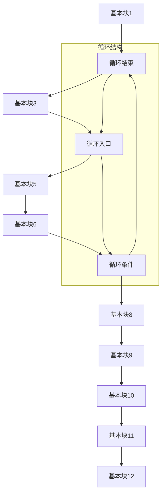
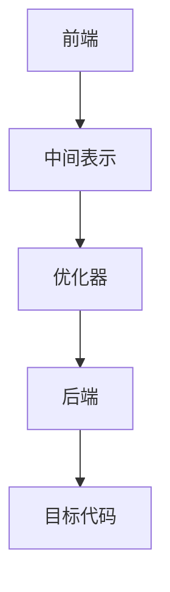
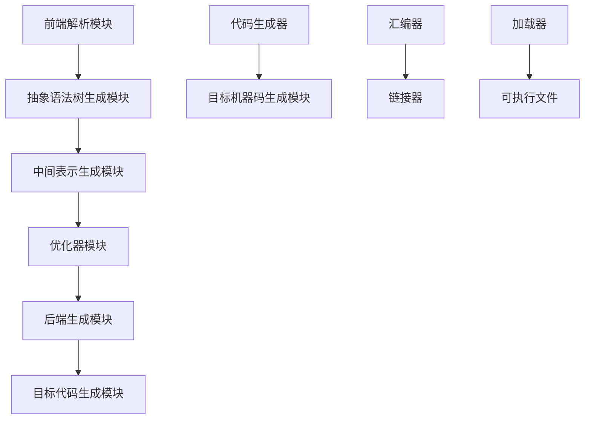
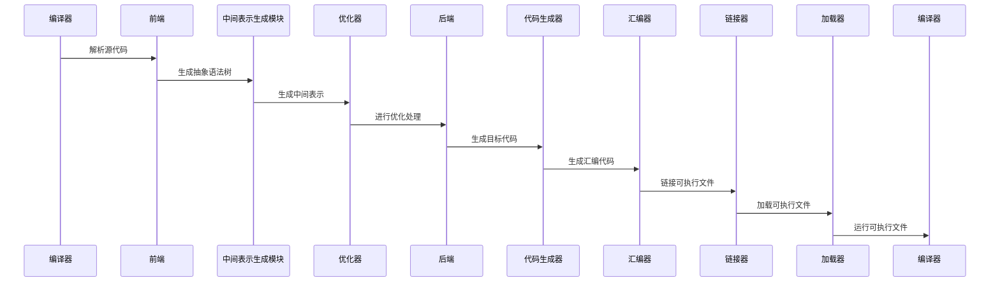

                 


### 第一部分：引言

#### **1.1 问题背景**

编译器优化是计算机科学和软件工程领域的一个重要研究方向，其目标是提高代码的执行效率、降低内存消耗、减少编译时间等。编译器优化的需求源自于现代计算机系统对高性能计算的需求日益增长。随着计算机硬件的发展，处理器主频的提升和缓存容量的增大，编译器的优化任务变得更加复杂和多样化。

在编译器优化中，图论算法发挥着重要作用。图论算法是一类基于图结构的算法，用于解决图相关的问题，如路径查找、最短路径、最大流等。这些算法在编译器优化中具有广泛的应用，如代码依赖图构建、数据流分析、循环优化、寄存器分配等。图论算法的优势在于其能够直观地描述问题，并通过图结构提供高效的解决方案。

#### **1.2 编译器优化的重要性**

编译器优化在软件工程中的重要性不可忽视。首先，优化的代码能够提高程序的运行效率，降低硬件资源的消耗，从而延长计算机系统的使用寿命。其次，优化后的代码更易于维护和理解，有助于提高开发效率和代码质量。此外，编译器优化还能够提高软件的兼容性，使得程序能够在不同的硬件平台上运行。

然而，编译器优化也面临诸多挑战。编译器优化需要考虑多种因素，如程序的性能、内存占用、编译时间等。此外，优化算法需要针对不同的编程语言和编译器架构进行调整，使得优化过程变得复杂。如何在保证优化效果的同时，提高优化算法的效率和鲁棒性，是编译器优化研究中的重要问题。

#### **1.3 图论算法简介**

图论算法是一类基于图结构的算法，用于解决图相关的问题。图是由节点和边组成的结构，其中节点表示问题中的元素，边表示元素之间的关系。图论算法广泛应用于计算机网络、社交网络、图像处理、算法设计等领域。

在编译器优化中，图论算法主要用于构建和分析程序的结构。例如，代码依赖图是一种描述程序中各个模块之间依赖关系的图结构。通过代码依赖图，编译器能够识别出程序中的循环结构、条件结构等，从而进行优化。

常见的图论算法包括：

- **图的遍历算法**：用于遍历图中的所有节点，如深度优先搜索（DFS）和广度优先搜索（BFS）。
- **最短路径算法**：用于计算图中两点之间的最短路径，如迪杰斯特拉算法（Dijkstra）和弗洛伊德算法（Floyd）。
- **最大流算法**：用于计算图中从源点到汇点的最大流量，如最大流最小割定理和Ford-Fulkerson算法。

这些算法在编译器优化中具有广泛的应用，如数据流分析、循环优化、寄存器分配等。接下来，我们将详细介绍这些算法的原理和应用。

### **第二部分：图论算法基础**

#### **2.1 图的基本概念**

图（Graph）是由节点（Vertex）和边（Edge）组成的数学结构，用于表示对象及其之间的连接关系。在编译器优化中，图论算法被用来描述程序的抽象结构，如代码依赖图、控制流图和数据流图等。

- **节点（Vertex）**：图中的基本元素，表示程序中的模块、变量或函数等。
- **边（Edge）**：连接两个节点的线段，表示节点之间的关系，如调用关系、数据传递关系等。
- **无向图（Undirected Graph）**：边无方向，如朋友关系、道路连接等。
- **有向图（Directed Graph）**：边有方向，如网络通信、程序调用等。

#### **2.2 图的遍历算法**

图的遍历是指按照某种顺序访问图中的所有节点。常用的遍历算法有深度优先搜索（DFS）和广度优先搜索（BFS）。

- **深度优先搜索（DFS）**：从起始节点开始，尽可能深地搜索图，直到到达一个没有未访问邻接点的节点，然后回溯并选择另一个未访问的邻接点继续搜索。DFS适合解决连通性问题、拓扑排序问题等。

  $$ 
  \text{DFS}(G, v) \text{其中} G \text{是图，} v \text{是起始节点} \\
  \text{1. } v \text{标记为已访问} \\
  \text{2. 对于} v \text{的每一个未访问的邻接点} w \\
  \text{   DFS}(G, w) \\
  $$

- **广度优先搜索（BFS）**：从起始节点开始，依次访问所有未访问的邻接点，然后将其标记为已访问。BFS适合解决最短路径问题、层次遍历问题等。

  $$ 
  \text{BFS}(G, v) \text{其中} G \text{是图，} v \text{是起始节点} \\
  \text{1. 初始化一个队列，将} v \text{加入队列并标记为已访问} \\
  \text{2. 当队列非空时，重复执行以下步骤：} \\
  \text{   a. 出队列一个节点} u \\
  \text{   b. 对于} u \text{的每一个未访问的邻接点} v \\
  \text{      将} v \text{加入队列并标记为已访问} \\
  $$

#### **2.3 最短路径算法**

最短路径算法用于计算图中两点之间的最短路径。常用的最短路径算法有迪杰斯特拉算法（Dijkstra）和弗洛伊德算法（Floyd）。

- **迪杰斯特拉算法（Dijkstra）**：适用于图中有权边且不存在负权重环的情况。算法采用贪心策略，每次选择未被访问的节点中与已知最短路径之和最小的节点作为当前节点，逐步扩展最短路径。

  $$ 
  \text{Dijkstra}(G, s) \text{其中} G \text{是图，} s \text{是起始节点} \\
  \text{1. 初始化：} \\
  \text{   distance[s] = 0，其他节点的 distance[i] = ∞，所有节点未访问} \\
  \text{2. 当存在未访问的节点时，重复执行以下步骤：} \\
  \text{   a. 找到未访问节点中 distance[i] 最小的节点 v} \\
  \text{   b. 将 v 标记为已访问} \\
  \text{   c. 更新未访问节点的 distance[i]，使得 distance[i] = distance[v] + weight(v, i)} \\
  \text{3. 输出最短路径} \\
  $$

- **弗洛伊德算法（Floyd）**：适用于有向图，包括负权重环。算法使用动态规划思想，逐步扩展最短路径。

  $$ 
  \text{Floyd}(G) \text{其中} G \text{是有向图} \\
  \text{1. 初始化：} \\
  \text{   distance[i][j] = weight[i][j]，当 weight[i][j] = ∞ 时，distance[i][j] = ∞} \\
  \text{2. 对于每一个中间节点 k，重复执行以下步骤：} \\
  \text{   a. 对于每一对节点 i 和 j，如果 distance[i][k] + distance[k][j] < distance[i][j]，则更新 distance[i][j]} \\
  \text{3. 输出最短路径} \\
  $$

#### **2.4 最大流算法**

最大流算法用于计算图中从源点到汇点的最大流量。常见的最大流算法有最大流最小割定理和Ford-Fulkerson算法。

- **最大流最小割定理**：最大流问题与最小割问题等价。最大流等于最小割的容量之和。

  $$ 
  \text{最大流 = 最小割的容量之和} \\
  $$

- **Ford-Fulkerson算法**：基于增广路径的思想，不断寻找增广路径，并更新流量，直到无法找到增广路径为止。算法的基本步骤如下：

  $$ 
  \text{Ford-Fulkerson}(G, s, t) \text{其中} G \text{是有向图，} s \text{是源点，} t \text{是汇点} \\
  \text{1. 初始化：} \\
  \text{   flow = 0，找到一条从} s \text{到} t \text{的增广路径} \\
  \text{2. 当存在增广路径时，重复执行以下步骤：} \\
  \text{   a. 找到当前增广路径的容量最小值 c} \\
  \text{   b. 更新流量：flow = flow + c} \\
  \text{   c. 对路径上的每一条边 (u, v)，更新 residual graph：} \\
  \text{      residual[u][v] = residual[u][v] + c} \\
  \text{      residual[v][u] = residual[v][u] - c} \\
  \text{3. 输出最大流} \\
  $$

这些图论算法在编译器优化中具有广泛的应用，如代码依赖图的构建、数据流分析、循环优化和寄存器分配等。在接下来的章节中，我们将进一步探讨图论算法在编译器优化中的应用和实践。

### **第三部分：编译器优化中的图论算法应用**

#### **3.1 代码依赖图构建**

在编译器优化中，代码依赖图（Control Flow Graph, CFG）是描述程序控制流的关键数据结构。CFG 中的节点表示程序中的基本块（Basic Block），基本块是指一组不可分割的指令序列，其中的每条指令都直接前驱和直接后继指令。

构建代码依赖图的基本步骤如下：

1. **识别基本块**：遍历程序代码，识别出基本块。基本块通常由大括号 `{` 和 `}` 括起来的代码段组成。

2. **建立节点和边的关系**：根据基本块之间的控制流关系，建立节点和边的关系。例如，如果一个基本块中的指令通过条件跳转指向另一个基本块，那么这两个基本块之间就会有一条有向边。

3. **处理循环和递归**：对于循环和递归结构，需要特殊处理。例如，一个基本块可能会通过循环跳转回到自身的起始点，这时需要在节点之间建立循环边。

以下是一个简单的代码依赖图构建示例：

```python
# 示例代码
def example_function(a, b):
    x = a + b
    if x > 0:
        y = x * 2
    else:
        y = x - 1
    return y
```

对应的代码依赖图如下：



在这个例子中，我们使用了Mermaid语言来描述代码依赖图。`graph TB` 表示定义一个有向图，`A1[基本块1] --> A2[基本块2]` 表示从基本块1到基本块2有一条有向边。`subgraph 循环结构` 表示开始定义一个子图，用于表示循环结构。

通过构建代码依赖图，编译器可以更好地理解程序的控制流结构，从而进行后续的优化处理。

#### **3.2 数据流分析**

数据流分析是编译器优化中的重要技术，它用于分析程序中数据的流动和作用范围。通过数据流分析，编译器可以识别出哪些变量在程序的不同部分被使用和修改，从而进行优化。

数据流分析的主要任务是计算每个变量的定义点和使用点。定义点是指变量第一次被赋值的地点，使用点是指变量被引用的地点。常用的数据流分析算法包括逆流分析（Backward Data Flow Analysis）和顺流分析（Forward Data Flow Analysis）。

1. **逆流分析（Backward Data Flow Analysis）**

   逆流分析从程序的最后一条指令开始，向前分析每条指令，找出每个变量的定义点和使用点。逆流分析的优点是算法简单，易于实现，但缺点是分析时间复杂度较高。

   逆流分析的基本步骤如下：

   - **初始化**：将所有变量的定义点和使用点都初始化为未定义。
   - **逆向遍历**：从程序的最后一条指令开始，逆向遍历每条指令。
   - **更新定义点和使用点**：对于每条指令，更新相关变量的定义点和使用点。

   例如，对于以下代码段：

   ```python
   x = a + b
   y = x * 2
   z = y - 1
   ```

   逆流分析的结果如下：

   - `x` 的定义点在 `x = a + b` 处，使用点在 `y = x * 2` 和 `z = y - 1` 处。
   - `y` 的定义点在 `y = x * 2` 处，使用点在 `z = y - 1` 处。
   - `z` 的定义点在 `z = y - 1` 处，使用点为空。

   使用Mermaid语言描述的逆流分析流程图如下：

   ```mermaid
   graph TB
   A1[指令1] --> B1[变量x定义]
   B1 --> C1[变量y定义]
   C1 --> D1[变量z定义]
   D1 --> E1[结束]
   ```

2. **顺流分析（Forward Data Flow Analysis）**

   顺流分析从程序的第一条指令开始，正向遍历每条指令，找出每个变量的定义点和使用点。顺流分析的优点是分析时间复杂度较低，但缺点是算法相对复杂。

   顺流分析的基本步骤如下：

   - **初始化**：将所有变量的定义点和使用点都初始化为未定义。
   - **正向遍历**：从程序的第一条指令开始，正向遍历每条指令。
   - **更新定义点和使用点**：对于每条指令，更新相关变量的定义点和使用点。

   例如，对于以下代码段：

   ```python
   x = a + b
   y = x * 2
   z = y - 1
   ```

   顺流分析的结果如下：

   - `x` 的定义点在 `x = a + b` 处，使用点在 `y = x * 2` 和 `z = y - 1` 处。
   - `y` 的定义点在 `y = x * 2` 处，使用点在 `z = y - 1` 处。
   - `z` 的定义点在 `z = y - 1` 处，使用点为空。

   使用Mermaid语言描述的顺流分析流程图如下：

   ```mermaid
   graph TB
   A1[指令1] --> B1[变量x定义]
   B1 --> C1[变量y定义]
   C1 --> D1[变量z定义]
   D1 --> E1[结束]
   ```

通过数据流分析，编译器可以更好地理解程序中数据的流动和作用范围，从而进行优化。例如，编译器可以根据数据流信息进行死代码消除、循环展开、寄存器分配等优化操作。

#### **3.3 优化策略与算法选择**

在编译器优化过程中，选择合适的优化策略和算法至关重要。不同的优化目标和场景需要不同的算法组合。以下是一些常见的优化策略和算法选择：

1. **循环优化**

   循环优化是编译器优化中的重要环节，旨在提高程序的性能和执行效率。常见的循环优化算法包括：

   - **循环展开（Loop Unrolling）**：将循环体中的若干条指令展开成多条独立的指令，减少循环控制逻辑的开销。

     $$ 
     \text{循环体：for (i = 0; i < n; i++) { ... }} \\
     \text{展开后：for (i = 0; i < n; i += 4) { ... }} \\
     $$

   - **循环融合（Loop Fusion）**：将多个相邻的循环合并成一个循环，减少循环次数。

     $$ 
     \text{循环体1：for (i = 0; i < n; i++) { ... }} \\
     \text{循环体2：for (j = 0; j < m; j++) { ... }} \\
     \text{融合后：for (k = 0; k < n * m; k++) { ... }} \\
     $$

   - **循环交换（Loop Interchange）**：改变循环的迭代顺序，优化循环的性能。

     $$ 
     \text{循环体：for (i = 0; i < n; i++) { ... }} \\
     \text{for (j = 0; j < m; j++) { ... }} \\
     \text{交换后：for (j = 0; j < m; j++) { ... }} \\
     \text{for (i = 0; i < n; i++) { ... }} \\
     $$

2. **寄存器分配**

   寄存器分配是编译器优化中的重要环节，旨在将程序中的变量映射到寄存器中，以减少内存访问时间。常见的寄存器分配算法包括：

   - **直接映射（Direct Mapping）**：将变量直接映射到特定的寄存器中。
   
     $$ 
     \text{变量 } x \text{ 映射到寄存器 } R1 \\
     \text{变量 } y \text{ 映射到寄存器 } R2 \\
     $$

   - **重命名（Renaming）**：通过引入临时变量，减少寄存器冲突，提高寄存器的利用率。

     $$ 
     \text{变量 } x \text{ 映射到临时变量 } T1 \\
     \text{变量 } y \text{ 映射到临时变量 } T2 \\
     \text{临时变量 } T1 \text{ 映射到寄存器 } R1 \\
     \text{临时变量 } T2 \text{ 映射到寄存器 } R2 \\
     $$

   - **线性扫描（Linear Scan）**：基于数据流分析，逐步分配寄存器，避免寄存器冲突。

3. **死代码消除**

   死代码消除是编译器优化中的重要步骤，旨在删除程序中不会执行的代码，减少程序的大小和执行时间。常见的死代码消除算法包括：

   - **静态分析**：通过静态分析程序的控制流和数据流，识别出不会执行的代码。
   - **动态分析**：通过运行程序，收集运行时数据，识别出不会执行的代码。

通过选择合适的优化策略和算法，编译器可以显著提高程序的执行效率和性能。在接下来的章节中，我们将进一步探讨图论算法在具体编译器优化中的应用和实践。

### **第四部分：系统分析与架构设计**

#### **4.1 编译器优化系统概述**

编译器优化系统是一个复杂的软件系统，其主要功能是通过一系列的优化算法对源代码进行转换，生成高效的目标代码。编译器优化系统通常包括前端、中间表示、优化器和后端等几个关键部分。

- **前端（Frontend）**：负责解析源代码，生成抽象语法树（AST）和符号表，对源代码进行语法和语义分析，确保代码的合法性和正确性。
- **中间表示（Intermediate Representation, IR）**：编译器将源代码转换成一种中间表示形式，这种表示形式通常更加抽象，易于进行优化处理。常见的中间表示包括三地址码（Three-Address Code）和逆波兰式（Reverse Polish Notation）等。
- **优化器（Optimizer）**：对中间表示进行一系列优化操作，包括数据流分析、循环优化、寄存器分配等，以提高代码的执行效率和性能。
- **后端（Backend）**：将优化后的中间表示转换成目标代码，包括机器代码、汇编代码等，并生成可执行文件。

编译器优化系统的整体架构如图所示：



在这个架构中，前端和后端通常与具体的编程语言和目标平台相关，而优化器则是一个通用的模块，用于实现各种优化算法。

#### **4.2 功能设计与领域模型**

在编译器优化系统中，领域模型（Domain Model）用于描述编译过程中的核心概念和对象，如变量、函数、基本块、指令等。领域模型可以帮助我们更好地理解和设计编译器优化系统的功能。

领域模型通常使用类图（Class Diagram）来表示，类图描述了系统中各个类之间的关系和属性。以下是一个简单的编译器优化系统领域模型类图：

```mermaid
classDiagram
    Class01 <|-- Class02
    Class03 <|-- Class04
    Class05 {name with namespace}
    Class06 [color=red, style=filled, fillcolor=yellow]
    Class01 {
        +int attribute
        +method():void
    }
    Class02 {
        +string attribute
        +method():void
    }
    Class03 {
        +bool attribute
        +method():void
    }
    Class04 {
        +double attribute
        +method():void
    }
    Class05 {
        +complexType attribute
        +method():void
    }
    Class06 {
        +Date attribute
        +method():void
    }
    Class01 <-- Class03
    Class02 <-- Class04
    Class05 o--|{关联}: Class06
```

在这个类图中，`Class01`、`Class02`、`Class03`、`Class04` 和 `Class05` 是编译器优化系统中的核心类，它们分别表示不同的程序元素。`Class06` 是一个特殊类，用于表示日期类型。类之间的箭头表示继承关系，而双箭头表示关联关系。

例如，`Class01` 和 `Class03` 之间存在继承关系，表示 `Class01` 是 `Class03` 的子类。`Class02` 和 `Class04` 之间存在关联关系，表示它们之间有某种依赖关系。`Class05` 与 `Class06` 之间存在双向关联关系，表示 `Class05` 可以包含 `Class06` 类型的属性。

通过领域模型类图，我们可以清晰地描述编译器优化系统中的核心概念和对象，为进一步的系统设计与实现提供基础。

#### **4.3 系统架构设计**

系统架构设计是编译器优化系统的关键环节，它决定了系统的扩展性、可维护性和性能。系统架构设计通常使用架构图（Architecture Diagram）来表示，架构图描述了系统的各个模块及其之间的关系。

以下是一个简单的编译器优化系统架构设计图：



在这个架构图中，前端解析模块负责解析源代码并生成抽象语法树（AST），然后传递给中间表示生成模块。中间表示生成模块将AST转换成中间表示（IR），并传递给优化器模块。优化器模块对中间表示进行优化处理，然后传递给后端生成模块。后端生成模块将优化后的中间表示转换成目标代码，并传递给代码生成器。代码生成器进一步将目标代码转换成目标机器码，然后传递给汇编器。汇编器将机器码转换成汇编代码，链接器将汇编代码和库文件链接成可执行文件，最后加载器将可执行文件加载到内存中运行。

通过系统架构设计，我们可以清晰地描述编译器优化系统的整体结构和工作流程，为进一步的系统开发和优化提供指导。

#### **4.4 系统接口设计**

系统接口设计是编译器优化系统的重要组成部分，它定义了系统内部各个模块之间的交互接口。良好的接口设计可以提高系统的可维护性和可扩展性。

以下是一个简单的编译器优化系统接口设计图：



在这个接口设计中，编译器作为整个系统的核心，负责协调各个模块的工作。前端模块负责解析源代码，生成抽象语法树（AST），并将其传递给中间表示生成模块。中间表示生成模块将AST转换成中间表示（IR），并传递给优化器模块。优化器模块对中间表示进行优化处理，然后传递给后端生成模块。后端生成模块将优化后的中间表示转换成目标代码，并传递给代码生成器。代码生成器进一步将目标代码转换成目标机器码，然后传递给汇编器。汇编器将机器码转换成汇编代码，链接器将汇编代码和库文件链接成可执行文件，最后加载器将可执行文件加载到内存中运行。

通过系统接口设计，我们可以明确各个模块之间的职责和交互关系，确保系统的正常运行。

#### **4.5 系统交互与Mermaid序列图**

系统交互描述了编译器优化系统各个模块之间的工作流程和交互过程。Mermaid序列图（Sequence Diagram）是一种常用的描述系统交互的方式，它能够清晰地展示各个模块的交互顺序和交互内容。

以下是一个简单的编译器优化系统交互序列图：


在这个序列图中，编译器作为系统驱动，首先将源代码传递给前端模块进行解析，生成抽象语法树。然后，抽象语法树传递给中间表示生成模块，生成中间表示（IR）。接下来，优化器模块对中间表示进行优化处理，传递给后端生成模块。后端生成模块将优化后的中间表示转换成目标代码，传递给代码生成器。代码生成器将目标代码转换成目标机器码，传递给汇编器。汇编器将机器码转换成汇编代码，链接器将汇编代码和库文件链接成可执行文件，最后加载器将可执行文件加载到内存中运行。

通过Mermaid序列图，我们可以清晰地展示编译器优化系统的交互过程和工作流程，为进一步的系统开发和优化提供参考。

### **第五部分：算法原理讲解与代码实现**

#### **5.1 算法原理讲解**

在本节中，我们将深入讲解图论算法在编译器优化中的应用，包括数据流分析、循环优化和寄存器分配等关键算法的原理。为了更好地理解这些算法，我们将使用Python源代码进行详细阐述，并提供算法原理的数学模型和公式。

##### **5.1.1 数据流分析**

数据流分析是编译器优化中的一个核心步骤，它用于分析程序中变量的定义和使用点。数据流分析可以分为逆流分析（Backward Data Flow Analysis）和顺流分析（Forward Data Flow Analysis）。

**逆流分析（Backward Data Flow Analysis）**

逆流分析从程序的最后一条指令开始，向前分析每条指令，找出每个变量的定义点和使用点。逆流分析的基本步骤如下：

1. 初始化：将所有变量的定义点和使用点都初始化为未定义。
2. 逆向遍历：从程序的最后一条指令开始，逆向遍历每条指令。
3. 更新定义点和使用点：对于每条指令，更新相关变量的定义点和使用点。

以下是一个简单的逆流分析算法的Python实现：

```python
def backward_data_flow_analysis(code):
    def update_definition_points(node, definition_points):
        if 'definition' in node:
            definition_points[node['label']] = node['definition']

    def update_use_points(node, use_points):
        if 'use' in node:
            use_points[node['label']].append(node['use'])

    definition_points = {}
    use_points = {}

    for node in reversed(code):
        update_definition_points(node, definition_points)
        update_use_points(node, use_points)

    return definition_points, use_points
```

在这个算法中，`code` 是一个表示程序代码的列表，每个元素是一个字典，包含节点的标签（`label`）、定义（`definition`）和引用（`use`）信息。`backward_data_flow_analysis` 函数通过逆向遍历代码，更新定义点和使用点。

**顺流分析（Forward Data Flow Analysis）**

顺流分析与逆流分析类似，但遍历方向相反。顺流分析的基本步骤如下：

1. 初始化：将所有变量的定义点和使用点都初始化为未定义。
2. 正向遍历：从程序的第一条指令开始，正向遍历每条指令。
3. 更新定义点和使用点：对于每条指令，更新相关变量的定义点和使用点。

以下是一个简单的顺流分析算法的Python实现：

```python
def forward_data_flow_analysis(code):
    def update_definition_points(node, definition_points):
        if 'definition' in node:
            definition_points[node['label']] = node['definition']

    def update_use_points(node, use_points):
        if 'use' in node:
            use_points[node['label']].append(node['use'])

    definition_points = {}
    use_points = {}

    for node in code:
        update_definition_points(node, definition_points)
        update_use_points(node, use_points)

    return definition_points, use_points
```

在这个算法中，`code` 是一个表示程序代码的列表，每个元素是一个字典，包含节点的标签（`label`）、定义（`definition`）和引用（`use`）信息。`forward_data_flow_analysis` 函数通过正向遍历代码，更新定义点和使用点。

##### **5.1.2 循环优化**

循环优化是编译器优化中的重要环节，它旨在提高程序的执行效率。常见的循环优化算法包括循环展开（Loop Unrolling）、循环融合（Loop Fusion）和循环交换（Loop Interchange）。

**循环展开（Loop Unrolling）**

循环展开是将循环体内的指令展开成多个独立的循环体，以减少循环控制逻辑的开销。以下是一个简单的循环展开算法的Python实现：

```python
def loop_unrolling(code, loop_start, loop_end, unrolling_factor):
    unrolled_code = []
    loop_counter = 0

    for node in code:
        if node['label'] == loop_start:
            for i in range(unrolling_factor):
                unrolled_code.append(node)
                loop_counter += 1
        elif loop_counter < unrolling_factor:
            unrolled_code.append(node)
            loop_counter += 1
        else:
            unrolled_code.append(node)

    return unrolled_code
```

在这个算法中，`code` 是一个表示程序代码的列表，`loop_start` 和 `loop_end` 是循环的开始和结束标签，`unrolling_factor` 是展开因子。`loop_unrolling` 函数通过遍历代码，将循环体展开成多个独立的循环体。

**循环融合（Loop Fusion）**

循环融合是将多个相邻的循环合并成一个循环，以减少循环次数。以下是一个简单的循环融合算法的Python实现：

```python
def loop_fusion(code, loop1_start, loop1_end, loop2_start, loop2_end):
    fused_code = []

    for node in code:
        if node['label'] == loop1_start:
            fused_code.append(node)
        elif node['label'] == loop2_start:
            fused_code.append(node)
        else:
            fused_code.append(node)

    return fused_code
```

在这个算法中，`code` 是一个表示程序代码的列表，`loop1_start` 和 `loop1_end` 是第一个循环的开始和结束标签，`loop2_start` 和 `loop2_end` 是第二个循环的开始和结束标签。`loop_fusion` 函数通过遍历代码，将两个相邻的循环合并成一个循环。

**循环交换（Loop Interchange）**

循环交换是改变循环的迭代顺序，以优化循环的性能。以下是一个简单的循环交换算法的Python实现：

```python
def loop_interchange(code, loop1_start, loop1_end, loop2_start, loop2_end):
    interchanged_code = []

    loop1_nodes = [node for node in code if node['label'] == loop1_start or node['label'] == loop1_end]
    loop2_nodes = [node for node in code if node['label'] == loop2_start or node['label'] == loop2_end]

    for node in code:
        if node['label'] == loop1_start:
            interchanged_code.append(node)
        elif node['label'] == loop2_start:
            interchanged_code.append(node)
        elif node in loop1_nodes:
            interchanged_code.append(node)
        elif node in loop2_nodes:
            interchanged_code.append(node)
        else:
            interchanged_code.append(node)

    return interchanged_code
```

在这个算法中，`code` 是一个表示程序代码的列表，`loop1_start` 和 `loop1_end` 是第一个循环的开始和结束标签，`loop2_start` 和 `loop2_end` 是第二个循环的开始和结束标签。`loop_interchange` 函数通过遍历代码，交换两个循环的迭代顺序。

##### **5.1.3 寄存器分配**

寄存器分配是编译器优化中的一个关键步骤，它旨在将程序中的变量映射到寄存器中，以减少内存访问时间。常见的寄存器分配算法包括直接映射（Direct Mapping）、重命名（Renaming）和线性扫描（Linear Scan）。

**直接映射（Direct Mapping）**

直接映射是将变量直接映射到特定的寄存器中。以下是一个简单的直接映射算法的Python实现：

```python
def direct_mapping(code, registers):
    assignment = {}

    for node in code:
        if 'variable' in node:
            variable = node['variable']
            register = registers.get(variable, None)
            if register:
                assignment[variable] = register

    return assignment
```

在这个算法中，`code` 是一个表示程序代码的列表，`registers` 是一个字典，包含变量的名称和对应的寄存器编号。`direct_mapping` 函数通过遍历代码，将变量映射到指定的寄存器中。

**重命名（Renaming）**

重命名是通过引入临时变量，减少寄存器冲突，提高寄存器的利用率。以下是一个简单的重命名算法的Python实现：

```python
def renaming(code, registers):
    assignment = {}

    for node in code:
        if 'variable' in node:
            variable = node['variable']
            if variable in registers:
                assignment[variable] = registers[variable]
            else:
                temp_variable = f"temp_{variable}"
                assignment[variable] = assignment.get(temp_variable, None)
                assignment[temp_variable] = registers.get(temp_variable, None)

    return assignment
```

在这个算法中，`code` 是一个表示程序代码的列表，`registers` 是一个字典，包含变量的名称和对应的寄存器编号。`renaming` 函数通过遍历代码，将变量映射到指定的寄存器或临时变量中。

**线性扫描（Linear Scan）**

线性扫描是

