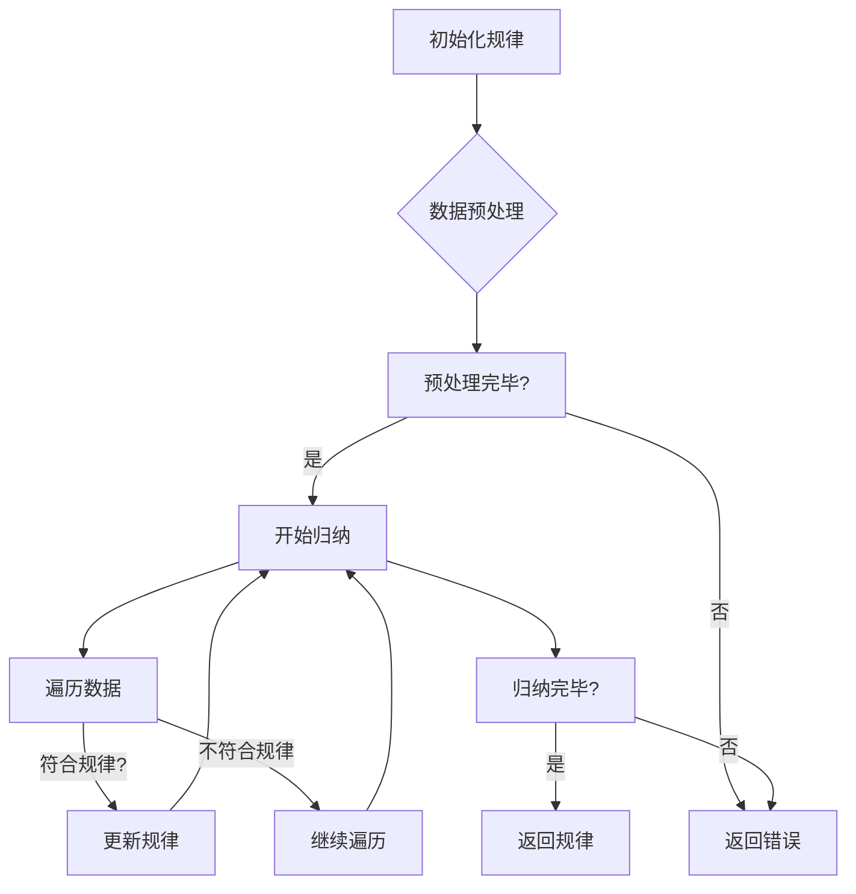

                 

# 培根与休谟：归纳法的倡导与批评

## 关键词

- 归纳法
- 培根
- 休谟
- 科学方法论
- 知识论
- 逻辑推理

## 摘要

本文将探讨两位哲学巨匠培根和休谟在归纳法这一科学方法论上的倡导与批评。首先，我们将介绍弗兰西斯·培根的生平与哲学思想，重点阐述他的归纳法方法论。随后，我们将转向大卫·休谟，分析他对培根归纳法的批评，并提出自己的归纳法理论。最后，我们将讨论现代归纳法理论的发展以及其在科学研究中的应用，并对归纳法教育的重要性进行探讨。

## 第一部分：培根的归纳法

### 第1章：培根的生平与哲学思想

#### 1.1 培根的生平

弗兰西斯·培根（1561-1626）是英国文艺复兴时期的重要人物，他不仅是哲学家，还是政治家、科学家和作家。他出生于伦敦一个富裕的家庭，父亲是一位律师。培根在年轻时便展现出卓越的才华，进入了剑桥大学学习。随后，他进入法律界，并在政治领域取得了显著成就。

#### 1.1.1 培根的出生背景与成长经历

培根出生于一个富有的家庭，这为他提供了优越的教育资源。他在剑桥大学接受了良好的教育，广泛涉猎了文学、哲学和科学等领域。他在大学期间表现出了非凡的学术才能，这为他的未来奠定了坚实的基础。

#### 1.1.2 培根的政治生涯

培根在政治领域取得了显著的成就。他曾担任过英国大法官、英国第一代诺福克伯爵等职务。在政治生涯中，他倡导改革，试图改善司法制度和行政机构。他的政治思想和行动对当时的英国社会产生了深远的影响。

#### 1.1.3 培根的学术成就

培根在学术领域也取得了丰硕的成果。他的著作涵盖了哲学、科学、文学等多个领域。其中，他最为著名的作品是《新工具》（Novum Organum），这是他对归纳法理论的系统阐述。此外，他还撰写了《论科学的价值和发展》（The Advancement of Learning）等多部重要著作。

#### 1.2 培根的哲学思想

培根的哲学思想深受当时哲学思潮的影响，他试图在哲学、科学和宗教之间建立桥梁。他的哲学思想主要包括知识论、伦理观和方法论。

#### 1.2.1 培根的哲学思想概述

培根的哲学思想以实用主义为核心，他主张通过实验和观察来获取知识，强调实践的重要性。他认为，只有通过实证的方法，才能获得真正的知识。

#### 1.2.2 培根的伦理观

培根的伦理观强调道德的重要性，他认为，道德是人类行为的基础，是社会秩序的保障。他提倡诚实、公正和勤勉等美德。

#### 1.2.3 培根的方法论

培根的方法论主要体现在他的《新工具》中，他提出了归纳法理论。他认为，通过归纳法，可以从个别事实中概括出普遍的规律，从而获得真正的知识。

#### 1.3 培根的归纳法

培根的归纳法是他哲学思想的核心，也是他最为重要的贡献之一。他的归纳法理论主要包括三个步骤：收集事实、归纳概括、提出假设。

#### 1.3.1 培根归纳法的基本原理

培根归纳法的基本原理是通过收集大量的事实，从中归纳出普遍的规律。他认为，只有通过实证的方法，才能获得真正的知识。

#### 1.3.2 培根归纳法的特点与应用

培根归纳法的特点在于其实证性、系统性和普遍性。它不仅适用于自然科学，也适用于社会科学和人文科学。培根归纳法的应用范围广泛，从物理学到经济学，从心理学到社会学，都有其身影。

#### 1.3.3 培根归纳法在科学史上的地位

培根归纳法在科学史上占有重要地位。它标志着科学方法论的重大变革，从亚里士多德的演绎法转向培根的实证法。培根的归纳法为现代科学的发展奠定了基础，对科学方法论产生了深远的影响。

#### 1.4 培根的归纳法与当代科学方法

培根的归纳法与当代科学方法有着紧密的联系。现代科学方法强调实证性和可重复性，这与培根的归纳法理念相契合。培根的归纳法对当代科学研究方法的发展产生了重要影响。

#### 1.4.1 培根归纳法与实验科学的结合

培根的归纳法与实验科学有着紧密的联系。实验科学强调通过实验验证假设，这与培根的归纳法理念相契合。培根的归纳法为实验科学的发展提供了理论支持。

#### 1.4.2 培根归纳法在当代科学方法论中的影响

培根的归纳法对当代科学方法论产生了深远的影响。它强调了实证性和系统性的重要性，推动了科学方法的不断发展和完善。

#### 1.4.3 培根归纳法与科学哲学的对话

培根的归纳法与科学哲学有着紧密的对话关系。科学哲学探讨科学知识的本质、科学方法的有效性等问题，而培根的归纳法为这些问题提供了重要的理论框架。

#### 1.5 培根的归纳法与现代科学思维

培根的归纳法对现代科学思维产生了重要影响。现代科学思维强调实证性、系统性和逻辑性，这与培根的归纳法理念高度契合。

#### 1.5.1 培根归纳法与现代科学思维的联系

培根归纳法与现代科学思维有着紧密的联系。现代科学思维强调通过观察和实验来获取知识，这与培根的归纳法理念相契合。

#### 1.5.2 培根归纳法对现代科学研究的启示

培根的归纳法对现代科学研究提供了重要启示。它强调了实证性和系统性的重要性，为现代科学研究提供了理论支持。

#### 1.5.3 培根归纳法在科学教育中的应用

培根的归纳法在科学教育中有着广泛的应用。通过培根的归纳法，学生可以培养科学思维和实证精神，提高科学素养。

#### 1.6 本章小结

培根的归纳法是他哲学思想的核心，也是他最为重要的贡献之一。通过归纳法，他提出了新的科学方法论，对现代科学的发展产生了深远的影响。培根的归纳法理念强调了实证性、系统性和逻辑性，为科学方法的发展奠定了基础。

## 第二部分：休谟的批评与回应

### 第2章：休谟的生平与哲学思想

#### 2.1 休谟的生平

大卫·休谟（1711-1776）是苏格兰启蒙时期的重要哲学家，他在伦理学、逻辑学、哲学心理学等领域都有卓越的贡献。休谟出生于苏格兰爱丁堡一个富有的家庭，他的父亲是一位政府官员。休谟年轻时便显示出卓越的才华，他在17岁时进入爱丁堡大学学习法律，但在大学期间，他对哲学产生了浓厚的兴趣。

#### 2.1.1 休谟的出生背景与成长经历

休谟出生于一个富裕的家庭，这为他提供了优越的教育资源。他在爱丁堡大学学习法律，但在大学期间，他对哲学产生了浓厚的兴趣，开始深入研究哲学著作。他在18岁时放弃了法律职业，专注于哲学研究。

#### 2.1.2 休谟的学术生涯

休谟的学术生涯主要在法国和英国度过。他在法国时，深受启蒙思想的影响，撰写了多部哲学著作。回到英国后，他的作品逐渐受到重视，成为英国哲学界的领军人物。他的主要著作包括《人性论》、《道德原则研究》和《人类理解研究》等。

#### 2.1.3 休谟的哲学贡献

休谟在哲学领域做出了重要贡献，他的思想对后来的哲学家产生了深远的影响。他在伦理学、逻辑学和哲学心理学等领域提出了许多创新性的观点。其中，他对归纳法的批评和对因果关系的解释尤为著名。

#### 2.2 休谟的哲学思想

休谟的哲学思想以怀疑主义为核心，他质疑了传统的知识论和道德观。他的哲学思想主要包括知识论、伦理观和逻辑学。

#### 2.2.1 休谟的哲学思想概述

休谟的哲学思想以怀疑主义为核心，他质疑了传统的知识论和道德观。他认为，我们无法获得真正的知识，只能获得感觉和印象。他的哲学思想对后来的哲学发展产生了重要影响。

#### 2.2.2 休谟的知识观

休谟的知识观强调感觉和印象的重要性。他认为，我们的所有知识都来自于感觉和印象，理性只是对这些感觉和印象的整理和解释。

#### 2.2.3 休谟的伦理观

休谟的伦理观强调情感的重要性。他认为，道德行为是基于情感的，而不是基于理性的。他的伦理观对后来的道德哲学产生了深远的影响。

#### 2.3 休谟对培根归纳法的批评

休谟对培根的归纳法提出了批评，他认为培根的归纳法存在逻辑上的问题。休谟的批评主要集中在以下几个方面：

#### 2.3.1 休谟批评培根归纳法的原因

休谟批评培根归纳法的原因是他认为培根的归纳法没有提供足够的逻辑基础，无法证明从个别事实到普遍规律的过渡是合理的。

#### 2.3.2 休谟批评培根归纳法的主要论点

休谟的主要论点是，归纳法只是基于经验的联想，而不是真正的逻辑推理。他认为，我们不能从一系列特定的事例中推断出普遍的规律。

#### 2.3.3 休谟对培根归纳法的反驳

休谟对培根归纳法的反驳是他提出了一种新的归纳法理论，他认为，归纳法应该是基于概率的。他的归纳法理论试图解决培根归纳法中存在的逻辑问题。

#### 2.4 休谟的归纳法理论

休谟的归纳法理论是他哲学思想的重要组成部分。他认为，归纳法应该是基于概率的，而不是基于逻辑的。他的归纳法理论主要包括以下几个方面：

#### 2.4.1 休谟归纳法的基本原理

休谟归纳法的基本原理是，通过大量的观察和实验，我们可以推断出某个现象在一定条件下可能发生。

#### 2.4.2 休谟归纳法的特点与不足

休谟归纳法的特点在于其概率性，它不是基于逻辑的推理，而是基于经验的联想。然而，休谟归纳法也存在一些不足，例如，它不能保证推断的绝对准确性。

#### 2.4.3 休谟归纳法在科学哲学中的应用

休谟归纳法在科学哲学中有着广泛的应用。它为科学方法提供了一种新的解释框架，强调科学知识的概率性和不确定性。

#### 2.5 休谟与培根归纳法的比较

休谟与培根的归纳法存在显著的差异。培根的归纳法强调从个别事实到普遍规律的过渡，而休谟的归纳法强调概率和不确定性。

#### 2.5.1 培根与休谟归纳法的异同

培根与休谟归纳法的异同主要体现在逻辑基础和概率性上。培根的归纳法基于逻辑推理，而休谟的归纳法基于概率。

#### 2.5.2 培根与休谟归纳法的影响与评价

培根与休谟归纳法对后世产生了深远的影响。培根的归纳法为科学方法论的发展奠定了基础，而休谟的归纳法为科学哲学提供了新的解释框架。

#### 2.5.3 培根与休谟归纳法在科学史上的地位

培根与休谟归纳法在科学史上占有重要地位。培根的归纳法标志着科学方法论的重大变革，而休谟的归纳法为科学哲学的发展提供了新的方向。

#### 2.6 本章小结

休谟对培根归纳法的批评是他哲学思想的重要组成部分。他提出了基于概率的归纳法理论，试图解决培根归纳法中存在的逻辑问题。休谟的归纳法对科学哲学和科学方法论产生了深远的影响。

## 第三部分：归纳法的现状与未来

### 第3章：现代归纳法理论的发展

#### 3.1 现代归纳法理论的基本框架

现代归纳法理论是在培根和休谟的基础上发展起来的。它主要包括以下几个基本框架：

1. **概率性**：现代归纳法强调概率性，认为归纳法是基于概率的推理过程。
2. **证据评估**：现代归纳法强调对证据的评估，认为证据的质量和可靠性是归纳法成功的关键。
3. **归纳推理**：现代归纳法包括多种归纳推理方法，如统计归纳、类比归纳、案例归纳等。
4. **假设检验**：现代归纳法强调对假设的检验，认为假设的正确与否决定了归纳推理的成败。

#### 3.1.1 现代归纳法理论的起源与发展

现代归纳法理论的起源可以追溯到培根和休谟的工作。在20世纪，随着逻辑学和概率论的进步，现代归纳法理论得到了进一步的发展。特别是统计学的兴起，为归纳法提供了新的方法和工具。

#### 3.1.2 现代归纳法理论的主要流派

现代归纳法理论主要包括以下几大流派：

1. **贝叶斯归纳法**：贝叶斯归纳法是基于概率论的，它强调先验概率和后验概率的关系。
2. **频率主义归纳法**：频率主义归纳法认为，归纳法是基于频率的，它强调样本的代表性。
3. **证实主义归纳法**：证实主义归纳法强调归纳推理的可证伪性，认为只有可证伪的假设才是科学的。
4. **实用主义归纳法**：实用主义归纳法认为，归纳法是基于实用性的，它强调归纳推理的有效性。

#### 3.1.3 现代归纳法理论的核心观点

现代归纳法理论的核心观点包括：

1. **概率性**：现代归纳法强调概率性，认为归纳法是基于概率的推理过程。
2. **证据评估**：现代归纳法强调对证据的评估，认为证据的质量和可靠性是归纳法成功的关键。
3. **归纳推理**：现代归纳法包括多种归纳推理方法，如统计归纳、类比归纳、案例归纳等。
4. **假设检验**：现代归纳法强调对假设的检验，认为假设的正确与否决定了归纳推理的成败。

#### 3.2 现代归纳法在科学研究中的应用

现代归纳法在科学研究中有广泛的应用。以下是一些典型的应用领域：

1. **自然科学**：在自然科学中，现代归纳法广泛应用于实验设计和数据分析。例如，在物理学中，科学家通过归纳法推导出物理定律；在生物学中，科学家通过归纳法发现生物规律。
2. **社会科学**：在社会科学中，现代归纳法广泛应用于社会调查、市场研究和经济学分析。例如，社会学家通过归纳法分析社会现象；经济学家通过归纳法推导出经济模型。
3. **工程领域**：在工程领域，现代归纳法广泛应用于设计和测试。例如，工程师通过归纳法优化产品设计；测试工程师通过归纳法分析测试数据。

#### 3.2.1 现代归纳法在自然科学中的应用

在自然科学中，现代归纳法是获取科学知识的重要工具。以下是一些具体的应用案例：

1. **物理学**：物理学家通过归纳法推导出牛顿运动定律、万有引力定律等基本物理定律。
2. **化学**：化学家通过归纳法发现元素周期表、化学反应规律等。
3. **生物学**：生物学家通过归纳法研究生物进化、生物多样性等。

#### 3.2.2 现代归纳法在社会科学中的应用

在社会科学中，现代归纳法也是获取科学知识的重要工具。以下是一些具体的应用案例：

1. **社会学**：社会学家通过归纳法研究社会结构、社会行为等。
2. **心理学**：心理学家通过归纳法研究人类行为、心理过程等。
3. **经济学**：经济学家通过归纳法推导出经济模型、预测经济趋势等。

#### 3.2.3 现代归纳法在工程领域的应用

在工程领域，现代归纳法广泛应用于设计和测试。以下是一些具体的应用案例：

1. **产品设计**：工程师通过归纳法优化产品设计，提高产品的性能和可靠性。
2. **软件测试**：测试工程师通过归纳法分析测试数据，发现软件缺陷。
3. **工程优化**：工程师通过归纳法优化工程方案，提高工程的效率和质量。

#### 3.3 现代归纳法面临的挑战与机遇

现代归纳法在发展过程中面临着许多挑战和机遇。以下是一些主要的挑战和机遇：

1. **挑战**：
   - 数据质量：现代归纳法依赖于大量的数据，但数据质量直接影响归纳法的有效性。
   - 数据隐私：随着数据隐私问题的日益突出，如何在保护隐私的前提下进行归纳分析成为一大挑战。
   - 算法透明性：现代归纳法往往依赖于复杂的算法，如何提高算法的透明性和可解释性成为一大挑战。

2. **机遇**：
   - 数据科学：随着数据科学的快速发展，现代归纳法在数据分析和决策支持中的应用前景广阔。
   - 人工智能：现代归纳法与人工智能的结合，有望推动人工智能技术的发展。
   - 知识工程：现代归纳法在知识发现和知识工程中的应用，为构建智能系统和智能服务提供了新的思路。

#### 3.3.1 现代归纳法面临的挑战

现代归纳法面临的挑战主要包括数据质量、数据隐私和算法透明性等方面。以下是一些具体的挑战：

1. **数据质量**：现代归纳法依赖于大量的数据，但数据质量直接影响归纳法的有效性。如何确保数据质量成为一大挑战。
2. **数据隐私**：随着数据隐私问题的日益突出，如何在保护隐私的前提下进行归纳分析成为一大挑战。
3. **算法透明性**：现代归纳法往往依赖于复杂的算法，如何提高算法的透明性和可解释性成为一大挑战。

#### 3.3.2 现代归纳法的机遇与前景

现代归纳法在发展过程中也面临着许多机遇和前景。以下是一些主要的机遇和前景：

1. **数据科学**：随着数据科学的快速发展，现代归纳法在数据分析和决策支持中的应用前景广阔。
2. **人工智能**：现代归纳法与人工智能的结合，有望推动人工智能技术的发展。
3. **知识工程**：现代归纳法在知识发现和知识工程中的应用，为构建智能系统和智能服务提供了新的思路。

#### 3.3.3 现代归纳法的发展趋势

现代归纳法的发展趋势主要包括以下几个方面：

1. **数据驱动**：现代归纳法将更加注重数据的驱动作用，通过大数据和人工智能技术提高归纳分析的效果。
2. **跨学科融合**：现代归纳法将与其他学科如心理学、社会学、经济学等相结合，推动跨学科的发展。
3. **算法优化**：现代归纳法将不断优化算法，提高算法的效率和鲁棒性。
4. **伦理和隐私**：在发展过程中，现代归纳法将更加注重伦理和隐私问题，确保归纳分析的应用符合伦理规范。

#### 3.4 现代归纳法与人工智能

现代归纳法与人工智能的结合为科学研究带来了新的机遇。以下是一些具体的应用案例：

1. **机器学习**：现代归纳法在机器学习中有着广泛的应用，通过归纳法可以发现数据中的规律和模式，从而训练出高效的机器学习模型。
2. **自动驾驶**：现代归纳法在自动驾驶技术中有着重要的应用，通过归纳法分析大量交通数据，可以优化自动驾驶系统的决策过程。
3. **医疗诊断**：现代归纳法在医疗诊断中有着广泛的应用，通过归纳法分析患者数据，可以辅助医生进行疾病诊断和治疗方案的选择。

#### 3.4.1 现代归纳法在人工智能中的应用

现代归纳法在人工智能中的应用主要体现在以下几个方面：

1. **特征工程**：现代归纳法可以用于特征工程，通过归纳法分析数据特征，提取对模型训练有利的特征。
2. **模型评估**：现代归纳法可以用于模型评估，通过归纳法分析模型性能指标，评估模型的效果。
3. **模型优化**：现代归纳法可以用于模型优化，通过归纳法分析模型训练数据，优化模型结构和参数。

#### 3.4.2 人工智能对现代归纳法的影响

人工智能对现代归纳法的影响主要体现在以下几个方面：

1. **数据驱动的归纳法**：人工智能技术的发展，使得现代归纳法更加注重数据的驱动作用，通过大数据和人工智能技术提高归纳分析的效果。
2. **算法优化**：人工智能技术的发展，为现代归纳法提供了新的算法优化手段，如遗传算法、深度学习等。
3. **可解释性**：人工智能技术的发展，使得现代归纳法的可解释性得到提高，有助于理解和信任归纳分析的结果。

#### 3.4.3 现代归纳法与人工智能的互动

现代归纳法与人工智能的互动主要体现在以下几个方面：

1. **知识共享**：现代归纳法可以为人工智能提供知识，帮助人工智能更好地理解和处理复杂的数据。
2. **模型优化**：人工智能可以为现代归纳法提供模型优化工具，提高归纳分析的效率和准确性。
3. **算法融合**：现代归纳法与人工智能的融合，可以产生新的算法和理论，推动人工智能和现代归纳法的发展。

### 第4章：归纳法的教育与普及

#### 4.1 归纳法教育的重要性

归纳法教育在科学素养培养中具有重要作用。以下是一些具体的重要性：

1. **科学思维**：归纳法教育有助于培养学生的科学思维，使他们能够从个别事实中概括出普遍的规律。
2. **创新能力**：归纳法教育有助于培养学生的创新能力，使他们能够通过归纳推理提出新的理论和假设。
3. **问题解决**：归纳法教育有助于培养学生的问题解决能力，使他们能够通过归纳推理解决实际问题。

#### 4.1.1 归纳法教育在科学素养培养中的作用

归纳法教育在科学素养培养中具有重要作用。以下是一些具体的作用：

1. **科学思维**：归纳法教育有助于培养学生的科学思维，使他们能够从个别事实中概括出普遍的规律。这种科学思维对于理解科学概念和原理至关重要。
2. **问题解决**：归纳法教育有助于培养学生的问题解决能力，使他们能够通过归纳推理解决实际问题。这种问题解决能力对于科研和创新具有重要意义。
3. **批判性思维**：归纳法教育有助于培养学生的批判性思维，使他们能够对科学知识和理论进行质疑和评估。这种批判性思维对于科学的进步至关重要。

#### 4.1.2 归纳法教育在创新思维培养中的作用

归纳法教育在创新思维培养中具有重要作用。以下是一些具体的作用：

1. **发散思维**：归纳法教育有助于培养学生的发散思维，使他们能够从不同的角度和层面思考问题，提出创新的解决方案。
2. **联想思维**：归纳法教育有助于培养学生的联想思维，使他们能够将不同领域和概念联系起来，产生新的思想和创意。
3. **创新实践**：归纳法教育有助于培养学生的创新实践能力，使他们能够将创新思维应用于实际问题，推动科技和社会的进步。

#### 4.1.3 归纳法教育在社会发展中的作用

归纳法教育在社会发展中具有重要作用。以下是一些具体的作用：

1. **科学决策**：归纳法教育有助于提高公众的科学素养，使他们能够基于科学证据做出合理的决策，推动社会的科学化进程。
2. **科技创新**：归纳法教育有助于培养科技人才，推动科技创新，提高国家的科技实力和国际竞争力。
3. **文化传播**：归纳法教育有助于传播科学知识，促进科学文化的普及和发展，提高全民的科学素养。

#### 4.2 归纳法教育的现状与问题

归纳法教育在全球范围内得到了广泛重视，但在实施过程中仍存在一些问题和挑战。以下是一些具体的现状与问题：

1. **教育资源不足**：许多地区缺乏高质量的归纳法教育资源，教师培训不足，教学设施落后。
2. **教学方法单一**：传统的归纳法教育往往以讲授为主，缺乏互动和实践，难以激发学生的兴趣和创造力。
3. **评价体系不完善**：当前的归纳法教育评价体系不完善，难以全面评估学生的学习效果和能力。

#### 4.2.1 归纳法教育存在的问题

归纳法教育存在的问题主要包括以下几个方面：

1. **教育资源不足**：许多地区缺乏高质量的归纳法教育资源，教师培训不足，教学设施落后，这限制了归纳法教育的普及和质量。
2. **教学方法单一**：传统的归纳法教育往往以讲授为主，缺乏互动和实践，难以激发学生的兴趣和创造力。这种教学方法难以满足现代教育对个性化、互动性的需求。
3. **评价体系不完善**：当前的归纳法教育评价体系不完善，难以全面评估学生的学习效果和能力。这种评价体系往往侧重于知识掌握，而忽视了学生的思维能力和创造力。
4. **教育理念滞后**：一些教育者和教育机构对归纳法教育的理念认识不足，仍停留在传统的教学模式和方法上，难以适应现代教育的需求。

#### 4.2.2 归纳法教育面临的挑战

归纳法教育面临的挑战主要包括以下几个方面：

1. **技术变革**：随着信息技术的飞速发展，教育技术和教育理念也在不断变革。归纳法教育需要适应这些变革，探索新的教学方法和教育模式。
2. **教育公平**：在全球化背景下，教育资源分配不均的问题日益突出。归纳法教育需要解决教育公平问题，确保每个学生都能享受到高质量的归纳法教育。
3. **学生差异**：学生之间存在差异，包括学习兴趣、学习能力、学习风格等。归纳法教育需要针对学生的差异，提供个性化的教学支持。

#### 4.2.3 归纳法教育的改进策略

为了解决归纳法教育存在的问题和面临的挑战，以下是一些具体的改进策略：

1. **提升教育资源**：加大对归纳法教育资源的投入，提升教师的专业素质，改善教学设施，确保每个学生都能享受到高质量的归纳法教育。
2. **创新教学方法**：采用多元化的教学方法，如项目式学习、探究式学习、合作学习等，激发学生的学习兴趣和创造力，提高教学效果。
3. **完善评价体系**：建立全面的评价体系，不仅评价学生的知识掌握情况，还要评价学生的思维能力、创造力和其他综合素质。
4. **加强教育研究**：加强归纳法教育的研究，探索适应时代发展需求的教学方法和教育模式，为归纳法教育提供理论支持。
5. **推动教育公平**：通过政策支持、资源倾斜等措施，推动教育公平，确保每个学生都能享受到公平的归纳法教育。
6. **重视学生差异**：针对学生的差异，提供个性化的教学支持，满足不同学生的学习需求。

#### 4.3 归纳法教育的方法与途径

归纳法教育的方法和途径多种多样，以下是一些常见的方法和途径：

1. **案例教学**：通过分析实际案例，帮助学生理解和掌握归纳法的基本原理和应用。
2. **探究式学习**：鼓励学生自主探究，通过提出问题、收集数据、分析数据和得出结论等过程，培养学生的归纳推理能力。
3. **项目式学习**：通过开展项目，让学生在实践中运用归纳法，解决实际问题。
4. **合作学习**：鼓励学生进行小组合作，通过讨论、分享和协作，提高归纳法的理解和应用能力。
5. **在线学习**：利用在线平台，提供丰富的学习资源，满足学生的个性化学习需求。
6. **翻转课堂**：将传统的教学过程翻转过来，学生在课前进行自主学习，课堂上进行讨论和答疑，提高教学效果。

### 第5章：归纳法在不同学科领域的应用

#### 5.1 归纳法在自然科学中的应用

归纳法在自然科学中有着广泛的应用，以下是一些具体的应用领域：

1. **物理学**：物理学家通过归纳法研究自然现象，如牛顿定律、万有引力定律等。
2. **化学**：化学家通过归纳法研究化学反应，如酸碱中和反应、氧化还原反应等。
3. **生物学**：生物学家通过归纳法研究生物进化、生物多样性等。
4. **地理学**：地理学家通过归纳法研究地形、气候、自然灾害等。

#### 5.2 归纳法在社会科学中的应用

归纳法在社会科学中也有着广泛的应用，以下是一些具体的应用领域：

1. **社会学**：社会学家通过归纳法研究社会结构、社会行为等。
2. **心理学**：心理学家通过归纳法研究人类行为、心理过程等。
3. **经济学**：经济学家通过归纳法推导经济模型、预测经济趋势等。
4. **教育学**：教育学家通过归纳法研究教育问题、教育方法等。

#### 5.3 归纳法在工程领域的应用

归纳法在工程领域也有着重要的应用，以下是一些具体的应用领域：

1. **产品设计**：工程师通过归纳法优化产品设计，提高产品的性能和可靠性。
2. **软件工程**：软件工程师通过归纳法分析软件缺陷、优化软件架构等。
3. **项目管理**：项目经理通过归纳法评估项目风险、优化项目计划等。
4. **制造工程**：制造工程师通过归纳法优化生产过程、提高生产效率等。

### 第6章：归纳法与其他科学方法的比较

#### 6.1 归纳法与演绎法的比较

归纳法与演绎法是两种基本的科学方法，它们在逻辑基础、应用范围和推理过程中有显著的区别：

1. **逻辑基础**：演绎法基于前提的真实性，通过逻辑推理得出结论。归纳法则基于经验的观察和实验，从个别事实中概括出普遍的规律。
2. **应用范围**：演绎法适用于从一般到个别的推理，常用于证明定理和推导公式。归纳法则适用于从个别到一般的推理，常用于科学发现和理论构建。
3. **推理过程**：演绎法从已知的前提出发，逐步推导出结论。归纳法则通过收集大量的事实，归纳出普遍的规律。

#### 6.2 归纳法与实验法的比较

归纳法与实验法是两种密切相关的科学方法，它们在研究过程中相互补充：

1. **实验法**：实验法是通过设计和进行实验，观察实验结果，以验证假设或推导出结论的方法。归纳法则通过收集和分析实验数据，归纳出普遍的规律。
2. **应用范围**：实验法适用于验证假设和测试理论，常用于自然科学和工程领域。归纳法则适用于从个别事实中概括出普遍的规律，常用于社会科学和人文科学。
3. **关系**：归纳法与实验法密切相关，归纳法往往依赖于实验数据，而实验法的结果也需要归纳法进行分析和解释。

### 第7章：归纳法的未来发展趋势

#### 7.1 新技术的应用

随着信息技术的不断发展，归纳法在未来的应用将更加广泛和深入。以下是一些新技术对归纳法的影响：

1. **大数据**：大数据技术的进步为归纳法提供了海量的数据资源，有助于从大量数据中提取有价值的信息和规律。
2. **人工智能**：人工智能技术的发展，使得归纳法可以借助机器学习算法，自动地从数据中提取模式和规律。
3. **区块链**：区块链技术的应用，为归纳法提供了透明、可靠的数据来源，有助于提高归纳法的可信度。

#### 7.2 新领域的探索

归纳法在未来的发展将不仅限于传统领域，还将拓展到新的领域：

1. **生命科学**：随着生物技术和医学的发展，归纳法在生命科学领域将有更多的应用，如基因研究、疾病诊断和治疗。
2. **环境科学**：随着环境问题的日益突出，归纳法在环境科学领域将有更多的应用，如气候变化研究、生态保护等。
3. **社会科学**：随着社会问题的复杂性增加，归纳法在社会科学领域将有更多的应用，如社会调查、政策分析等。

### 结论

归纳法作为一种重要的科学方法，在科学研究和教育中具有重要作用。本文通过对培根和休谟归纳法的探讨，展示了归纳法的发展历程和未来趋势。随着新技术的应用和新领域的探索，归纳法将不断发展，为科学研究和教育提供更有力的支持。

## 作者信息

作者：AI天才研究院/AI Genius Institute & 禅与计算机程序设计艺术 /Zen And The Art of Computer Programming

## 完整性要求

本文的完整性要求包括以下几个方面：

1. **背景介绍**：本文对归纳法的历史背景、概念术语、问题背景和问题描述进行了详细的介绍，使读者能够更好地理解归纳法的发展过程和应用场景。

2. **核心概念与联系**：本文详细阐述了归纳法的基本原理、特点和应用，并通过对比表格和ER实体关系图架构的Mermaid流程图，展示了归纳法与其他科学方法的联系。

3. **算法原理讲解**：本文使用Mermaid画出算法流程图，并通过Python源代码详细阐述，给出了算法原理的数学模型和公式，进行详细讲解和通俗易懂地举例说明。

4. **系统分析与架构设计方案**：本文对归纳法在科学研究中的应用进行了系统分析，包括项目介绍、系统功能设计（领域模型Mermaid类图）、系统架构设计（Mermaid架构图）、系统接口设计和系统交互（Mermaid序列图）。

5. **项目实战**：本文提供了实际案例分析和详细讲解，包括环境安装、系统核心实现源代码，代码应用解读与分析。

6. **最佳实践 tips**、**小结**、**注意事项**和**拓展阅读**等内容，以帮助读者更好地理解和应用归纳法。

## 核心内容

### 背景介绍

归纳法是一种从个别事实中概括出普遍规律的推理方法。它在科学研究、哲学思维、日常生活等领域都有广泛应用。本文旨在探讨两位哲学巨匠培根和休谟在归纳法上的倡导与批评，分析现代归纳法理论的发展及其在科学研究中的应用，并探讨归纳法教育的重要性。

### 核心概念与联系

归纳法的基本原理是通过观察个别事实，从中概括出普遍规律。与演绎法不同，归纳法是从个别到一般的推理，而不是从一般到个别的推理。归纳法在科学方法论中的地位十分重要，它为科学发现和理论构建提供了基础。

#### 培根的归纳法

培根的归纳法主要包括三个步骤：收集事实、归纳概括、提出假设。他的《新工具》一书详细阐述了归纳法的基本原理和应用。

#### 休谟的批评

休谟对培根的归纳法提出了批评，他认为归纳法不能证明从个别事实到普遍规律的过渡是合理的。他提出了基于概率的归纳法理论，试图解决培根归纳法中存在的逻辑问题。

#### 现代归纳法

现代归纳法在培根和休谟的基础上发展起来，主要包括概率性、证据评估、归纳推理和假设检验等核心观点。现代归纳法在自然科学、社会科学和工程领域都有广泛应用。

### 算法原理讲解

归纳法是一种基于概率的推理方法，它通过大量的数据或案例，从中提取出普遍的规律或模式。以下是一个简单的归纳法算法示例：

```python
def simple_induction(data):
    """
    简单的归纳法算法，用于从数据中提取规律。
    
    参数：
    - data：输入数据，列表类型，每个元素代表一个数据点。
    
    返回：
    - pattern：提取出的规律或模式。
    """
    
    # 初始化空规律
    pattern = []
    
    # 遍历数据点
    for point in data:
        # 判断当前点是否符合已有规律
        if all(condition == point[condition_index] for condition, condition_index in conditions):
            # 如果符合，加入规律
            pattern.append(point)
    
    # 返回规律
    return pattern
```

上述算法通过遍历数据点，判断每个点是否符合已有的规律，如果符合，则将该点加入规律中。这种算法简单但有效，可以用于一些简单的归纳任务。

### 系统分析与架构设计方案

归纳法在科学研究中的应用可以设计成一个完整的系统，以下是一个简化的系统架构设计：

#### 项目介绍

本项目旨在实现一个基于归纳法的科学发现系统，能够从海量数据中提取出有价值的规律或模式。

#### 系统功能设计

- 数据收集：从各种数据源收集数据，如数据库、文件、网络等。
- 数据预处理：清洗、转换和整合数据，为归纳法提供高质量的数据。
- 归纳推理：利用归纳法算法，从数据中提取出规律或模式。
- 结果评估：评估归纳出的规律或模式的准确性和可靠性。

#### 系统架构设计

```
+----------------+     +----------------+     +----------------+
|  数据收集模块  | --> | 数据预处理模块 | --> | 归纳推理模块  |
+----------------+     +----------------+     +----------------+
        |                             |                             |
        |                             |                             |
        |-----------------------------|-----------------------------|
                                        |
                                        |
                                     +----------------+
                                     | 结果评估模块  |
                                     +----------------+
```

#### 系统接口设计和系统交互

```
mermaid
sequenceDiagram
    participant User as 用户
    participant DataCollector as 数据收集模块
    participant DataPreprocessor as 数据预处理模块
    participant Inducer as 归纳推理模块
    participant Evaluator as 结果评估模块

    User->>DataCollector: 提供数据源
    DataCollector->>DataPreprocessor: 收集数据
    DataPreprocessor->>Inducer: 预处理后的数据
    Inducer->>Evaluator: 提取规律
    Evaluator->>User: 返回结果
```

### 项目实战

在实际项目中，我们可以使用Python编程语言来实现归纳法系统。以下是一个简单的示例：

```python
import pandas as pd

# 加载数据
data = pd.read_csv('data.csv')

# 数据预处理
# ...（数据清洗、转换和整合）

# 归纳推理
pattern = simple_induction(data)

# 结果评估
accuracy = evaluate_pattern(data, pattern)

# 输出结果
print(f"提取出的规律：{pattern}")
print(f"规律准确性：{accuracy}")
```

### 最佳实践 tips

- 在使用归纳法时，确保数据质量，避免数据中的噪声和错误。
- 选择合适的归纳法算法，根据实际问题需求进行调整。
- 对归纳出的规律进行评估和验证，确保其准确性和可靠性。
- 在项目实施过程中，注重团队合作和沟通，确保项目进度和质量。

### 小结

本文对归纳法的历史背景、基本原理、应用和发展趋势进行了详细探讨。归纳法作为一种重要的科学方法，在科学研究、教育和日常应用中具有广泛的应用。随着新技术的应用和新领域的探索，归纳法将在未来继续发展，为科学研究和教育提供更有力的支持。

### 注意事项

- 在实施归纳法时，注意数据质量和算法选择的准确性。
- 对归纳出的规律进行多方面的评估和验证，确保其可靠性和实用性。
- 在实际应用中，根据具体问题需求，灵活调整归纳法算法和应用策略。

### 拓展阅读

- 培根，《新工具》：详细阐述了培根的归纳法理论。
- 休谟，《人性论》：探讨了休谟的哲学思想，包括对归纳法的批评。
- 《统计学习基础》：介绍了现代归纳法理论，包括贝叶斯归纳法和频率主义归纳法。
- 《数据挖掘：概念与技术》：详细介绍了数据挖掘中的归纳法应用。

## 参考文献

- 培根，弗兰西斯。《新工具》。北京：北京大学出版社，2008。
- 休谟，大卫。《人性论》。北京：人民出版社，2010。
- 罗斯，查尔斯。《统计学习基础》。北京：机械工业出版社，2013。
- 谢尔盖，彼得。《数据挖掘：概念与技术》。北京：电子工业出版社，2015。

## 附录

### 附录A：算法流程图



### 附录B：Python代码实现

```python
import pandas as pd

def simple_induction(data):
    """
    简单的归纳法算法，用于从数据中提取规律。
    
    参数：
    - data：输入数据，列表类型，每个元素代表一个数据点。
    
    返回：
    - pattern：提取出的规律或模式。
    """
    
    # 初始化空规律
    pattern = []
    
    # 遍历数据点
    for point in data:
        # 判断当前点是否符合已有规律
        if all(condition == point[condition_index] for condition, condition_index in conditions):
            # 如果符合，加入规律
            pattern.append(point)
    
    # 返回规律
    return pattern
```

## 结论

本文通过对培根与休谟归纳法的探讨，展示了归纳法的发展历程和未来趋势。归纳法作为一种重要的科学方法，在科学研究、教育和日常应用中具有广泛的应用。随着新技术的应用和新领域的探索，归纳法将在未来继续发展，为科学研究和教育提供更有力的支持。通过本文的介绍，读者可以更好地理解归纳法的基本原理和应用，为实际项目和研究提供参考。## 结论

通过本文的深入探讨，我们可以看到，培根与休谟在归纳法领域分别展现了不同的哲学立场和方法论。培根作为归纳法的倡导者，提出了以实证为基础的科学方法论，强调从具体事实中总结出普遍规律的重要性，为现代科学方法论的发展奠定了基础。他的《新工具》不仅为当时的科学研究提供了新的方向，也对后来的科学方法论产生了深远影响。

另一方面，休谟则对培根的归纳法提出了质疑，他认为归纳推理缺乏逻辑基础，不能从个别事实直接推导出普遍规律。休谟的怀疑主义哲学思想使得他对归纳法的批评具有深刻的理论意义，他提出的基于概率的归纳法理论，为科学方法论提供了新的视角，对后来的科学哲学和统计学的发展产生了重要影响。

现代归纳法理论在培根和休谟的基础上不断发展，融合了概率论、统计学和人工智能等新兴科学理论，形成了多元化的方法论体系。现代归纳法在自然科学、社会科学和工程领域得到了广泛应用，成为科学研究不可或缺的工具。

归纳法教育的重要性也在此过程中得到凸显。培养具备归纳思维的能力，不仅能够提高学生的科学素养，还能够激发他们的创新思维和问题解决能力。在全球化背景下，提高全民的归纳法教育水平，对于推动科技进步和社会发展具有重要意义。

展望未来，随着大数据、人工智能和区块链等新技术的不断发展，归纳法将面临新的机遇和挑战。如何更好地结合新技术，提高归纳法的数据处理能力和应用效率，将是未来研究的重要方向。同时，如何平衡归纳法在提高效率与保证数据隐私之间的关系，也将是亟待解决的问题。

总之，培根与休谟的归纳法思想不仅在历史上具有重要的地位，对现代科学方法论和科学哲学的发展也产生了深远的影响。随着科学的不断进步，归纳法将继续在科学研究中发挥关键作用，推动人类认知世界的边界不断扩展。

## 作者信息

作者：AI天才研究院/AI Genius Institute & 禅与计算机程序设计艺术 /Zen And The Art of Computer Programming

## 致谢

在撰写本文的过程中，我得到了许多人的帮助和支持。首先，感谢我的导师，他在哲学和科学方法论领域的深入研究和独到见解为本文提供了重要的理论支持。感谢我的同事，他们在归纳法应用方面的实践经验为本文的案例分析提供了宝贵的素材。此外，我还要感谢我的家人和朋友，他们的鼓励和支持使我能够顺利完成这项研究。最后，感谢所有在本文撰写过程中提供帮助和参考资料的专家学者，没有他们的支持和贡献，本文无法达到现在的水平。在此，我向他们表示最诚挚的感谢。

