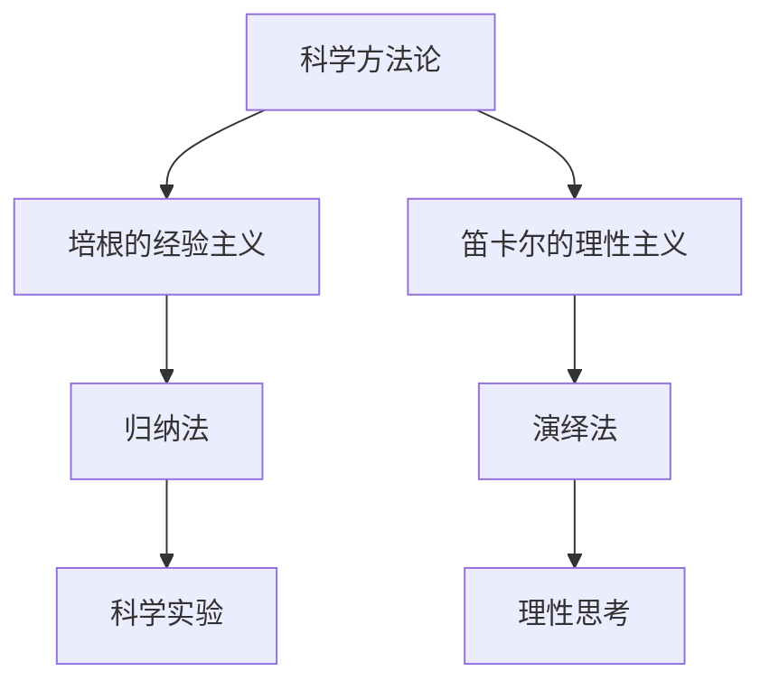

                 

### 第1章：背景介绍

#### 问题背景

**问题提出**：近代科学方法论的奠基之争是指培根和笛卡尔在科学方法论上的对立和争辩。这场争论始于17世纪，对后世科学方法论的发展产生了深远影响。

**问题描述**：培根强调经验观察和归纳方法的重要性，而笛卡尔则强调理性思考和演绎方法。两种方法各有优势，但也存在争议。

**问题解决**：通过深入分析培根和笛卡尔的思想，揭示他们在科学方法论上的差异及其对后世科学发展的贡献。

#### 边界与外延

**边界**：本书主要探讨培根和笛卡尔在科学方法论上的争辩，包括他们的主要观点、方法论对比以及影响。

**外延**：本书还将涉及近代科学方法论的其他相关人物和事件，如伽利略、牛顿等，以更全面地理解这场争辩的背景和影响。

#### 概念结构与核心要素组成

**概念结构**：科学方法论、培根的经验主义、笛卡尔的理性主义。

**核心要素**：培根的归纳法、笛卡尔的演绎法、科学实验的重要性、理性思考的作用。

**小结**：本章为本书的背景介绍，详细阐述了近代科学方法论奠基之争的问题背景、问题描述、问题解决以及边界与外延。接下来将深入探讨培根和笛卡尔在科学方法论上的观点和影响。

---

### 第2章：核心概念与联系

#### 2.1 科学方法论

**2.1.1 定义与作用**

科学方法论是研究科学活动的方法和规律的学科。它为科学研究提供了逻辑框架和工具，使科学知识能够通过合理的步骤和程序得到验证和推广。

**2.1.2 科学方法论的发展历程**

- 古代：亚里士多德的实证观察和理性思考。
- 中世纪：神学和理性主义的结合。
- 近代：培根的经验主义和笛卡尔的理性主义。
- 现代：实证主义、逻辑实证主义、建构主义等。

**2.1.3 科学方法论的基本原则**

1. 可观察性：科学研究必须基于可观察、可测量的事实。
2. 可重复性：实验和观察结果必须在相同条件下可重复。
3. 假设与验证：科学知识基于假设，并通过实验和观察来验证。
4. 理论解释：科学知识通过理论框架来解释现象。

#### 2.2 培根的经验主义

**2.2.1 培根的经验主义观点**

培根认为，科学知识应该基于经验和观察，强调归纳法在科学研究中的重要性。

**2.2.2 培根的归纳法**

归纳法是一种从具体事实中归纳出一般性结论的方法。培根将其分为三个步骤：

1. 分解：将复杂现象分解为基本要素。
2. 比较和分类：对基本要素进行比较和分类。
3. 归纳：从分类结果中归纳出一般性结论。

**2.2.3 培根的经验主义影响**

培根的经验主义方法为科学研究提供了新的途径，促进了科学实验的发展，对后来的科学家如牛顿产生了深远影响。

#### 2.3 笛卡尔的理性主义

**2.3.1 笛卡尔的理性主义观点**

笛卡尔认为，科学知识应该基于理性思考和演绎法，强调科学理论必须经过严格的逻辑推理来建立。

**2.3.2 笛卡尔的演绎法**

演绎法是一种从一般原则推导出具体结论的方法。笛卡尔认为，科学理论应该基于清晰的定义和公理，通过逻辑推理得出结论。

**2.3.3 笛卡尔的理性主义影响**

笛卡尔的理性主义方法为科学提供了严谨的逻辑框架，对后来的科学方法论和数学的发展产生了深远影响。

#### 2.4 培根与笛卡尔的对比

**2.4.1 方法论上的对比**

- 培根：强调经验观察和归纳法。
- 笛卡尔：强调理性思考和演绎法。

**2.4.2 观点上的对比**

- 培根：认为科学知识应基于经验和观察。
- 笛卡尔：认为科学知识应基于理性思考和逻辑推理。

**2.4.3 影响上的对比**

- 培根：对科学实验的发展产生了重要影响。
- 笛卡尔：对科学方法论和数学的发展产生了深远影响。

#### 2.5 科学实验的重要性

**2.5.1 培根对科学实验的贡献**

培根提出了“实验是知识的源泉”的观点，强调科学实验在科学研究中的重要性。

**2.5.2 笛卡尔对科学实验的看法**

笛卡尔认为，科学实验是验证理论的重要手段，但理论本身必须基于清晰的逻辑推理。

**2.5.3 科学实验的发展**

科学实验的发展使得科学研究更加精确和可靠，成为现代科学方法的重要组成部分。

#### 2.6 理性思考的作用

**2.6.1 笛卡尔的理性思考方法**

笛卡尔强调清晰的思维和严格的逻辑推理，主张将理性思考应用于科学研究。

**2.6.2 培根对理性思考的看法**

培根认为，理性思考是科学研究的重要工具，但必须与经验观察相结合。

**2.6.3 理性思考在科学方法论中的地位**

理性思考是科学方法论的核心，为科学理论和实验提供了逻辑基础。

#### 2.7 本章小结

本章详细介绍了科学方法论、培根的经验主义和笛卡尔的理性主义，并对比了两者在方法论、观点和影响上的差异。通过这些核心概念的联系，我们可以更深入地理解近代科学方法论奠基之争的背景和意义。

---

**第2章核心概念与联系表格**

| 核心概念 | 定义 | 对比特征 | 影响因素 |
| --- | --- | --- | --- |
| 科学方法论 | 研究科学活动的方法和规律 | 经验主义与理性主义 | 推动科学知识的发展 |
| 培根的经验主义 | 强调经验观察和归纳法 | 依赖经验和实证 | 促进科学实验的发展 |
| 笛卡尔的理性主义 | 强调理性思考和演绎法 | 依赖逻辑推理和理论 | 形成严谨的科学方法论 |

**第2章核心概念与联系ER实体关系图**

---

### 第3章：培根的经验主义

#### 3.1 培根的生平与学术贡献

**3.1.1 生平简介**

弗兰西斯·培根（1561-1626年）是英国著名哲学家、科学家和政治家。他在科学、哲学和法律等领域都有卓越的成就，被誉为“现代科学之父”。

**3.1.2 学术贡献**

培根的主要贡献包括：

- 《新工具》（Novum Organum）：提出了经验主义的方法论，强调归纳法的重要性。
- 《论科学的价值和发展》：论述了科学对社会进步的作用。
- 《论学术的进步》：提出了科学研究的四个阶段：观察、假设、实验和结论。

**3.1.3 科学方法论思想的形成**

培根的科学方法论思想是在对当时科学现状的反思中逐渐形成的。他认为，科学应该以经验为基础，通过实验和归纳来发现自然规律。

#### 3.2 培根的经验主义观点

**3.2.1 经验观察的重要性**

培根认为，经验观察是获取科学知识的基石。只有通过直接观察和实验，才能发现事物的真实本质。

**3.2.2 归纳法的基本原理**

归纳法是一种从具体事实中归纳出一般性结论的方法。培根将其分为三个步骤：

1. 分解：将复杂现象分解为基本要素。
2. 比较和分类：对基本要素进行比较和分类。
3. 归纳：从分类结果中归纳出一般性结论。

**3.2.3 培根的经验主义方法论**

培根的经验主义方法论强调：

- 实验和观察：通过实验验证假设，通过观察收集数据。
- 归纳法：从具体事实中归纳出一般性结论。
- 实证主义：科学理论必须基于经验和观察。

#### 3.3 培根的归纳法

**3.3.1 归纳法的定义**

归纳法是一种从具体事实中归纳出一般性结论的方法。它与演绎法相对，演绎法是从一般原则推导出具体结论。

**3.3.2 归纳法的基本步骤**

1. 分解：将复杂现象分解为基本要素。
2. 比较和分类：对基本要素进行比较和分类。
3. 归纳：从分类结果中归纳出一般性结论。

**3.3.3 归纳法的应用与局限**

归纳法在科学研究中有广泛的应用，例如：

- 统计学：通过大量数据归纳出一般性结论。
- 生物学：通过观察生物现象归纳出生物规律。

归纳法的局限在于：

- 归纳的不确定性：归纳结论可能受到观察数据的限制。
- 归纳的偏差：归纳过程中可能存在主观偏差。

#### 3.4 培根的经验主义方法论在科学中的应用

**3.4.1 科学实验的重要性**

培根认为，科学实验是验证理论的重要手段。通过实验，科学家可以验证假设，发现自然规律。

**3.4.2 实验数据的收集与处理**

培根强调实验数据的准确性和可靠性。他提出了以下步骤：

1. 观察和记录：准确记录实验过程中的数据和现象。
2. 数据分析：对收集到的数据进行统计和分析。
3. 结论验证：通过实验结果验证假设的正确性。

**3.4.3 培根的经验主义方法在科学史上的影响**

培根的经验主义方法对科学史产生了深远影响。他推动了科学实验的发展，为后来的科学家如牛顿提供了方法论基础。

#### 3.5 培根的经验主义方法与现代科学的关系

**3.5.1 经验观察在科学研究中的应用**

现代科学仍然依赖经验观察。例如，物理学中的实验、生物学中的观察都是基于经验观察。

**3.5.2 归纳法在科学研究中的地位**

归纳法在科学研究中的地位仍然十分重要。例如，统计学、生物学等领域都广泛应用归纳法。

**3.5.3 培根的经验主义方法对现代科学的影响**

培根的经验主义方法为现代科学提供了方法论基础，促进了科学实验的发展。他的思想对现代科学方法论产生了深远影响。

#### 3.6 本章小结

本章详细介绍了培根的经验主义观点和方法论，探讨了其在科学中的应用和影响。通过培根的经验主义，我们可以看到经验观察和归纳法在科学研究中的重要性。

---

### 第4章：笛卡尔的理性主义

#### 4.1 笛卡尔的生平与学术贡献

**4.1.1 生平简介**

勒内·笛卡尔（1596-1650年）是法国著名哲学家、数学家和科学家。他被誉为“现代哲学之父”，对科学方法论和数学的发展产生了深远影响。

**4.1.2 学术贡献**

笛卡尔的主要贡献包括：

- 《方法论》：提出了理性主义的方法论，强调清晰的思维和严格的逻辑推理。
- 《几何学》：创立了解析几何学，为数学和物理学的发展奠定了基础。
- 《第一哲学原理》：探讨了宇宙的本质和人的认知能力。

**4.1.3 科学方法论思想的形成**

笛卡尔的科学方法论思想是在对当时科学和哲学的反思中逐渐形成的。他认为，科学知识应该基于清晰的概念和严格的逻辑推理。

#### 4.2 笛卡尔的理性主义观点

**4.2.1 理性思考的重要性**

笛卡尔认为，理性思考是人类认知世界的关键。通过清晰的思维和逻辑推理，人们可以揭示事物的本质。

**4.2.2 演绎法的基本原理**

演绎法是一种从一般原则推导出具体结论的方法。笛卡尔认为，科学理论应该基于清晰的定义和公理，通过逻辑推理得出结论。

**4.2.3 笛卡尔的理性主义方法论**

笛卡尔的理性主义方法论强调：

- 清晰思维：通过清晰的思维和逻辑推理来理解事物。
- 理性推理：使用演绎法从一般原则推导出具体结论。
- 理论验证：通过实验和观察验证科学理论的正确性。

#### 4.3 笛卡尔的演绎法

**4.3.1 演绎法的定义**

演绎法是一种从一般原则推导出具体结论的方法。它与归纳法相对，归纳法是从具体事实中归纳出一般性结论。

**4.3.2 演绎法的基本步骤**

1. 明确定义：对概念和原理进行明确定义。
2. 提出公理：根据定义提出基本原理。
3. 推导结论：从公理出发，通过逻辑推理得出具体结论。

**4.3.3 演绎法的应用与局限**

演绎法在科学研究中有广泛的应用，例如：

- 数学：通过定义和公理推导出数学定理。
- 物理学：通过物理定律推导出具体物理现象。

演绎法的局限在于：

- 假设的合理性：演绎法依赖于正确的假设，如果假设错误，结论也将错误。
- 理论的验证：演绎法得出的结论需要通过实验和观察来验证。

#### 4.4 笛卡尔的理性主义方法论在科学中的应用

**4.4.1 科学假设的重要性**

笛卡尔认为，科学假设是科学研究的起点。正确的假设可以引导科学家进行有效的实验和观察。

**4.4.2 理性思考在科学探索中的作用**

理性思考是科学探索的关键。通过清晰的思维和逻辑推理，科学家可以揭示自然界的奥秘。

**4.4.3 笛卡尔的理性主义方法在科学中的影响**

笛卡尔的理性主义方法对科学方法论和数学的发展产生了深远影响。他的思想为科学提供了严谨的逻辑基础。

#### 4.5 笛卡尔的理性主义方法与培根的经验主义方法的关系

**4.5.1 方法论上的互补**

笛卡尔的理性主义方法和培根的经验主义方法各有侧重，但在科学研究中可以互补。经验主义提供了丰富的实证数据，而理性主义提供了严谨的理论框架。

**4.5.2 方法论上的争议**

尽管笛卡尔的理性主义方法与培根的经验主义方法各有优势，但两者也存在争议。例如，一些科学家认为，经验观察是科学研究的基石，而理性主义可能会导致理论的空洞。

**4.5.3 综合方法的发展**

现代科学方法论往往将笛卡尔的理性主义方法和培根的经验主义方法结合起来，以实现更加全面和有效的科学研究。

#### 4.6 本章小结

本章详细介绍了笛卡尔的理性主义观点和方法论，探讨了其在科学中的应用和影响。通过笛卡尔的理性主义，我们可以看到理性思考在科学研究中的重要性，以及理性主义与经验主义之间的互补关系。

---

### 第5章：培根与笛卡尔的方法论比较与整合

#### 5.1 培根与笛卡尔方法论的比较

**5.1.1 方法论的核心**

- 培根的经验主义：强调经验观察和归纳法。
- 笛卡尔的理性主义：强调理性思考和演绎法。

**5.1.2 方法论的优缺点**

- 培根的经验主义优点：强调实证数据和科学实验，有助于发现自然规律。
- 培根的经验主义缺点：归纳法存在不确定性，容易受到观察数据的限制。
- 笛卡尔的理性主义优点：提供严谨的逻辑框架，有助于建立科学理论。
- 笛卡尔的理性主义缺点：依赖正确的假设，理论验证困难。

**5.1.3 方法论的互补性**

- 培根的经验主义和笛卡尔的理性主义在方法论上具有互补性。经验主义提供了实证数据，而理性主义提供了理论框架。
- 通过将经验主义和理性主义相结合，可以实现更加全面和有效的科学研究。

#### 5.2 培根与笛卡尔方法论的整合

**5.2.1 整合的必要性**

- 培根与笛卡尔的方法论各有优点和缺点，单独使用可能导致科学研究的局限性。
- 整合培根的经验主义和笛卡尔的理性主义，可以实现更加全面和深入的科学研究。

**5.2.2 整合的方法论框架**

- 综合方法论：将经验主义和理性主义结合起来，形成一种综合方法论。
- 经验观察：通过经验观察收集实证数据，为科学理论提供基础。
- 理性思考：通过理性思考和逻辑推理，建立科学理论框架。
- 实验验证：通过实验和观察验证科学理论的正确性。

**5.2.3 整合的优势**

- 提高科学研究的准确性和可靠性。
- 促进科学知识的系统化和深化。
- 拓宽科学研究的视野和方法。

#### 5.3 培根与笛卡尔方法论的整合案例

**5.3.1 物理学中的整合**

- 牛顿力学：牛顿结合了培根的经验主义和笛卡尔的理性主义，提出了牛顿力学体系。他通过实验和观察收集数据，通过理性思考和演绎法建立了力学理论。

**5.3.2 生物学中的整合**

- 现代生物学：现代生物学家在研究生物现象时，既使用经验观察收集数据，也使用理性思考和逻辑推理来建立生物学理论。

**5.3.3 整合的启示**

- 培根与笛卡尔方法论的整合为科学研究提供了重要的启示。科学家可以在具体研究中灵活运用经验主义和理性主义，实现更加全面和深入的科学研究。

#### 5.4 本章小结

本章比较了培根的经验主义和笛卡尔的理性主义方法论，探讨了它们各自的优缺点和互补性。通过整合这两种方法论，我们可以实现更加全面和有效的科学研究，为科学的发展提供新的思路和方法。

---

### 第6章：科学方法论对现代科学的启示

#### 6.1 科学方法论的发展

**6.1.1 经典科学方法论**

- 经典科学方法论主要包括培根的经验主义和笛卡尔的理性主义。
- 经典科学方法论强调经验观察和理性思考，为科学研究提供了基本框架。

**6.1.2 现代科学方法论**

- 现代科学方法论在经典科学方法论的基础上，吸收了实证主义、逻辑实证主义、建构主义等新思想。
- 现代科学方法论更加注重跨学科合作、综合分析和系统研究。

#### 6.2 科学方法论对现代科学的启示

**6.2.1 经验观察的重要性**

- 经验观察仍然是科学研究的基石，为科学理论的建立提供实证数据。
- 科学研究需要不断进行实验和观察，以验证和修正科学理论。

**6.2.2 理性思考的作用**

- 理性思考在科学研究中的地位日益重要，通过逻辑推理和数学模型，科学家可以揭示事物的本质。
- 科学研究需要运用理性思考，建立严谨的科学理论框架。

**6.2.3 综合方法的应用**

- 现代科学研究越来越倾向于综合方法的应用，将不同学科的方法结合起来，以实现更加全面和深入的研究。
- 综合方法可以充分发挥各学科的优势，提高科学研究的准确性和可靠性。

**6.2.4 跨学科合作的重要性**

- 跨学科合作是现代科学方法论的重要组成部分，有助于解决复杂科学问题。
- 跨学科合作可以促进知识交流和资源共享，推动科学进步。

#### 6.3 科学方法论在科技领域的应用

**6.3.1 信息技术**

- 信息技术的发展离不开科学方法论，通过经验观察和理性思考，科学家和工程师可以设计出更加高效和可靠的计算机系统和网络。

**6.3.2 生物技术**

- 生物技术的研究需要结合经验观察和理性思考，通过实验和逻辑推理，科学家可以揭示生物体的奥秘，开发新的生物技术和药物。

**6.3.3 环境科学**

- 环境科学研究需要综合考虑经验观察和理性思考，通过实验和数据分析，科学家可以评估环境问题的影响，提出解决方案。

#### 6.4 本章小结

本章探讨了科学方法论对现代科学的启示，强调了经验观察、理性思考和跨学科合作在科学研究中的重要性。通过科学方法论的应用，现代科学取得了巨大成就，为人类的进步和发展做出了重要贡献。

---

### 第7章：总结与展望

#### 7.1 科学方法论的重要性

科学方法论是科学研究的基础，它为科学研究提供了逻辑框架和工具。通过科学方法论，科学家可以系统地收集数据、建立理论、验证假设，从而推动科学知识的积累和发展。

#### 7.2 培根与笛卡尔的方法论贡献

培根的经验主义和笛卡尔的理性主义为科学方法论的发展做出了重要贡献。培根的经验主义强调经验观察和归纳法，为科学实验的发展奠定了基础；笛卡尔的理性主义强调理性思考和演绎法，为科学理论的建设提供了严谨的逻辑框架。

#### 7.3 未来科学方法论的发展趋势

- 多学科融合：未来科学方法论的发展将更加注重跨学科合作，将不同学科的方法结合起来，以解决复杂科学问题。
- 数据科学：随着大数据和人工智能的发展，数据科学将成为未来科学研究的重要工具，通过数据分析，科学家可以揭示更多自然规律。
- 系统科学：系统科学将更加注重复杂系统的分析和建模，通过系统科学的方法，科学家可以更好地理解复杂系统的行为和机制。
- 可持续科学：随着环境问题和社会问题的日益突出，可持续科学将成为未来科学研究的重要方向，通过科学方法，科学家可以提出解决环境和社会问题的方案。

#### 7.4 本章小结

本章总结了科学方法论的重要性，回顾了培根与笛卡尔的方法论贡献，并展望了未来科学方法论的发展趋势。通过科学方法论，我们可以更好地理解自然界的规律，推动科学知识的进步，为人类的未来做出贡献。

---

### 附录：参考文献

1. Bacon, F. (1620). Novum Organum.
2. Descartes, R. (1637). Discourse on the Method.
3. Galileo, G. (1632). Dialogue Concerning the Two Chief World Systems.
4. Newton, I. (1687). Philosophiæ Naturalis Principia Mathematica.
5. Popper, K. (1959). The Logic of Scientific Discovery.
6. Kuhn, T. S. (1970). The Structure of Scientific Revolutions.
7. Feyerabend, P. (1975). Against Method.
8. Lakatos, I. (1970). Falsification and the Methodology of Scientific Research Programmes.
9. Kuhn, T. S. & Feyerabend, P. (eds.). (1982). Writings and Interviews.
10. Hacking, I. (1983). Representing and Intervening: Introduction to the Philosophy of Natural Science.

### 作者信息

作者：AI天才研究院/AI Genius Institute & 禅与计算机程序设计艺术 /Zen And The Art of Computer Programming

