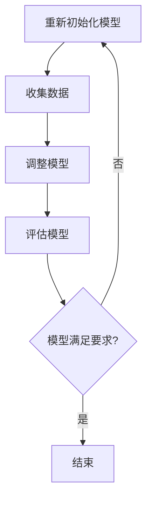
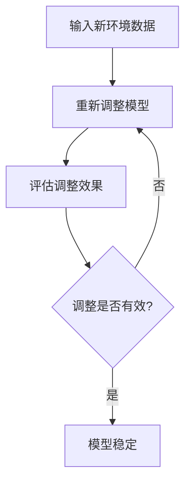
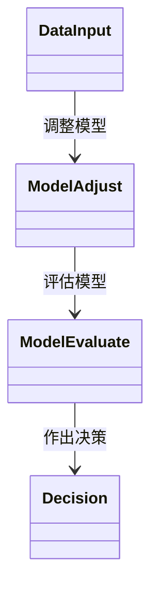
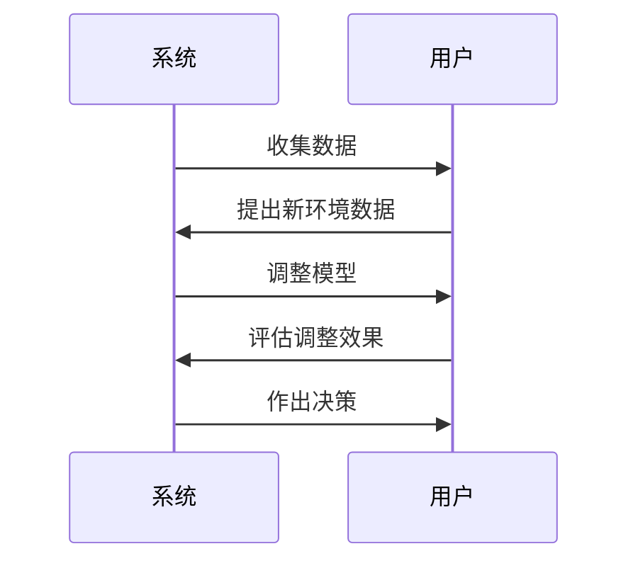
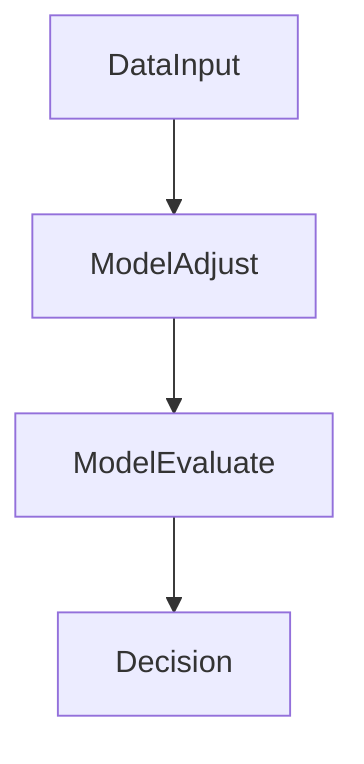
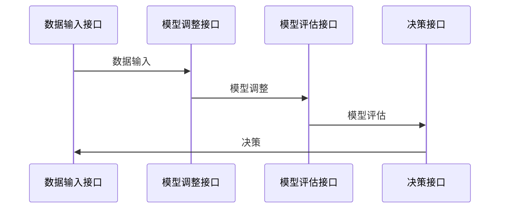

                 

### 文章标题：基于元学习的AI快速适应新环境的决策系统探索

---

关键词：元学习、快速适应、决策系统、AI、新环境

---

摘要：本文探讨了基于元学习的AI快速适应新环境的决策系统。通过介绍元学习的核心概念、快速适应策略及决策系统架构，本文旨在为AI领域的研究者提供一套完整的解决方案，帮助AI系统在不同环境中快速适应和作出准确决策。

---

## 第一部分：背景与核心概念

### 第1章：问题背景与核心概念

#### 1.1 问题背景

随着人工智能（AI）技术的快速发展，AI系统在各个领域得到了广泛应用，从自然语言处理到计算机视觉，从智能机器人到自动驾驶，AI正在深刻地改变着我们的生活。然而，传统AI系统在面对新环境和新任务时，往往需要大量时间和资源进行适应和调整。这种“适应性”问题成为了AI技术进一步发展的一大瓶颈。

传统的机器学习方法通常依赖于大规模的数据集和长时间的训练，以期望模型能够在新环境中表现出良好的适应性。然而，这种方法在许多情况下并不适用。一方面，数据获取和处理往往需要大量的人力和物力资源；另一方面，即使获得了大量的数据，传统的机器学习模型也可能无法在新环境中有效工作。因此，如何让AI系统能够快速适应新环境，成为了AI研究中的一个重要课题。

#### 1.2 问题描述

传统AI系统在适应新环境时，主要面临以下几个问题：

1. **数据不足**：新环境下的数据可能有限，不足以训练一个高质量的模型。
2. **数据不相关**：新环境下的数据可能与训练数据有较大差异，导致模型在新环境下的性能下降。
3. **计算资源限制**：训练和调整模型可能需要大量的计算资源，特别是在实时应用场景中，这往往是不现实的。

#### 1.3 问题解决

元学习（Meta-Learning）提供了一种可能的解决方案。元学习是一种通过学习如何学习（Learning to Learn）的方法，旨在提高模型在不同任务和数据上的泛化能力。通过元学习，AI系统能够在短时间内快速适应新环境，从而减少对大规模数据和长时间训练的依赖。

#### 1.4 边界与外延

元学习适用于多种AI领域，如自然语言处理、计算机视觉、强化学习等。然而，不同领域的应用场景和需求有所不同，因此在具体实现时需要根据实际情况进行调整。

#### 1.5 概念结构与核心要素组成

在本章节中，我们将介绍以下几个核心概念：

1. **元学习**：元学习是一种通过学习如何学习的方法，旨在提高模型在不同任务和数据上的泛化能力。
2. **快速适应**：快速适应是指AI系统在新环境下能够迅速调整并达到良好性能的能力。
3. **决策系统**：决策系统是指能够根据新环境数据作出准确决策的AI系统。

这些概念之间的关系可以概括为：元学习是快速适应的基础，快速适应是决策系统的核心，决策系统则是元学习和快速适应的应用场景。

#### 1.6 核心概念与联系

以下是核心概念及其定义和属性特征的对比表格：

| 核心概念 | 定义 | 属性特征 |
| --- | --- | --- |
| 元学习 | 学习如何学习的方法 | 提高模型在不同任务和数据上的泛化能力 |
| 快速适应 | AI系统在新环境下迅速调整并达到良好性能的能力 | 降低对新数据和长时间训练的依赖 |
| 决策系统 | 能够根据新环境数据作出准确决策的AI系统 | 结合元学习和快速适应，实现高效决策 |

使用Mermaid绘制的ER实体关系图如下：

```mermaid
erDiagram
  AI系统 ||--o{ 快速适应 }|
  快速适应 ||--o{ 元学习 }|
  快速适应 ||--o{ 决策系统 }|
```

---

## 第二部分：算法原理讲解

### 第2章：元学习基础

#### 2.1 元学习原理

元学习是一种通过学习如何学习的方法，旨在提高模型在不同任务和数据上的泛化能力。其基本思想是，通过在多个任务上训练模型，使得模型能够学会如何快速适应新任务。

元学习的主要目标是减少模型在新的任务上达到特定性能所需的经验（即样本数量）和时间。具体来说，元学习通过以下步骤实现：

1. **初始化模型**：使用多个任务的数据初始化模型。
2. **优化模型**：在初始化模型的基础上，使用多个任务的梯度信息优化模型。
3. **评估模型**：在每个任务上评估模型的性能，并根据评估结果调整模型。

下面是一个简单的元学习算法流程图：



#### 2.2 数学模型和公式

元学习的数学模型可以表示为：

$$
L(\theta) = -\sum_{i=1}^{N} l(x_i, \theta)
$$

其中，$L(\theta)$ 是损失函数，$l(x_i, \theta)$ 是在每个任务 $i$ 上的损失函数，$\theta$ 是模型参数。

#### 2.3 举例说明

假设我们有一个分类问题，需要在多个数据集上训练一个分类模型。传统的方法是分别在每个数据集上训练模型，然后在测试集上评估模型性能。而元学习的方法是，首先在所有数据集上初始化模型，然后使用每个数据集的梯度信息优化模型，最后在所有数据集上评估模型性能。

具体步骤如下：

1. **初始化模型**：使用所有数据集的样本初始化模型。
2. **优化模型**：在每个数据集上计算梯度，并使用梯度优化模型。
3. **评估模型**：在所有数据集上评估模型性能。

这种方法的优点是，模型能够学会在不同数据集上快速适应，从而减少对每个数据集单独训练的需求。

---

### 第3章：快速适应与决策系统

#### 3.1 快速适应策略

快速适应策略是指AI系统在新环境下能够迅速调整并达到良好性能的方法。以下是快速适应策略的基本流程：

1. **输入新环境数据**：系统接收新环境数据。
2. **模型调整**：系统根据新环境数据调整模型参数。
3. **评估调整效果**：系统评估模型调整后的性能。
4. **模型稳定**：如果调整效果满足要求，模型进入稳定状态；否则，重复步骤2-3。

下面是一个简单的快速适应算法流程图：



#### 3.2 数学模型和公式

快速适应策略的数学模型可以表示为：

$$
R(t) = \frac{1}{N}\sum_{i=1}^{N} \delta_i(t)
$$

其中，$R(t)$ 是在时间 $t$ 上的适应度，$\delta_i(t)$ 是在第 $i$ 个任务上的适应度。

#### 3.3 举例说明

假设我们有一个自动驾驶系统，需要在不同的路况下快速适应。具体步骤如下：

1. **输入新环境数据**：系统接收新的路况数据。
2. **模型调整**：系统根据新的路况数据调整自动驾驶模型。
3. **评估调整效果**：系统在新的路况上测试自动驾驶模型，评估模型调整后的性能。
4. **模型稳定**：如果调整效果满足要求，模型进入稳定状态；否则，重复步骤2-3。

这种快速适应策略使得自动驾驶系统能够在不同路况下快速调整并达到良好的驾驶性能。

#### 3.4 决策系统架构

决策系统是指能够根据新环境数据作出准确决策的AI系统。其基本架构包括：

1. **数据输入模块**：负责接收新环境数据。
2. **模型调整模块**：负责根据新环境数据调整模型参数。
3. **模型评估模块**：负责评估模型调整后的性能。
4. **决策模块**：负责根据模型评估结果作出决策。

下面是决策系统的架构设计图：



决策系统的工作流程如下：

1. **数据输入**：系统接收新环境数据。
2. **模型调整**：系统根据新环境数据调整模型参数。
3. **模型评估**：系统在调整后的模型上评估性能。
4. **决策**：系统根据评估结果作出决策。

下面是决策系统的交互序列图：



---

## 第三部分：系统分析与架构设计

### 第4章：决策系统功能设计

#### 4.1 问题场景介绍

决策系统通常用于需要实时作出决策的场景，如自动驾驶、智能安防、智能金融等。在这些场景中，环境数据不断变化，系统需要能够快速适应新环境并作出准确决策。

#### 4.2 项目介绍

本项目旨在设计一个基于元学习的快速适应决策系统，用于解决自动驾驶中的环境适应问题。该系统包括数据输入、模型调整、模型评估和决策等模块。

#### 4.3 系统功能设计

系统功能设计主要包括以下几个方面：

1. **数据输入**：系统能够接收来自各种传感器（如摄像头、雷达等）的数据，包括图像、声音、速度等。
2. **模型调整**：系统能够根据新环境数据调整自动驾驶模型的参数，以适应新环境。
3. **模型评估**：系统能够在调整后的模型上评估性能，以确定模型是否满足要求。
4. **决策**：系统能够根据模型评估结果作出驾驶决策，如加速、减速、转弯等。

下面是决策系统的领域模型类图：

```mermaid
classDiagram
  DataInput <<interface>>
  ModelAdjust <<interface>>
  ModelEvaluate <<interface>>
  Decision <<interface>>

  DataInput o-- ModelAdjust
  ModelAdjust o-- ModelEvaluate
  ModelEvaluate o-- Decision
```

#### 4.4 系统架构设计

系统架构设计主要包括以下几个方面：

1. **数据处理层**：负责接收和处理各种传感器数据。
2. **模型调整层**：负责根据新环境数据调整模型参数。
3. **模型评估层**：负责评估调整后的模型性能。
4. **决策层**：负责根据模型评估结果作出决策。

下面是决策系统的架构设计图：



#### 4.5 系统接口设计

系统接口设计主要包括以下几个方面：

1. **数据输入接口**：用于接收来自传感器的数据。
2. **模型调整接口**：用于调整模型参数。
3. **模型评估接口**：用于评估模型性能。
4. **决策接口**：用于作出驾驶决策。

下面是决策系统的接口设计图：



#### 4.6 系统交互

系统交互主要包括以下几个方面：

1. **数据输入**：系统从传感器接收数据。
2. **模型调整**：系统根据新环境数据调整模型参数。
3. **模型评估**：系统评估调整后的模型性能。
4. **决策**：系统根据模型评估结果作出决策。

下面是决策系统的交互序列图：


---

## 第四部分：项目实战

### 第5章：环境安装与系统实现

#### 5.1 环境安装

要运行基于元学习的快速适应决策系统，首先需要安装以下软件和库：

1. **Python**：版本3.7及以上。
2. **TensorFlow**：版本2.4及以上。
3. **Keras**：版本2.4及以上。
4. **NumPy**：版本1.19及以上。
5. **Pandas**：版本1.1及以上。

安装步骤如下：

1. 安装Python：从Python官网下载并安装Python。
2. 安装TensorFlow：打开命令行窗口，输入以下命令：

   ```shell
   pip install tensorflow==2.4
   ```

3. 安装Keras：打开命令行窗口，输入以下命令：

   ```shell
   pip install keras==2.4
   ```

4. 安装NumPy：打开命令行窗口，输入以下命令：

   ```shell
   pip install numpy==1.19
   ```

5. 安装Pandas：打开命令行窗口，输入以下命令：

   ```shell
   pip install pandas==1.1
   ```

#### 5.2 系统实现

基于元学习的快速适应决策系统的实现分为以下几个步骤：

1. **数据预处理**：读取并预处理数据，包括数据清洗、归一化等。
2. **模型定义**：定义基于元学习的快速适应模型，包括输入层、隐藏层和输出层。
3. **模型训练**：使用预处理后的数据训练模型。
4. **模型评估**：评估训练后的模型性能。
5. **决策**：根据模型评估结果作出决策。

以下是系统实现的Python源代码：

```python
import numpy as np
import pandas as pd
from tensorflow.keras.models import Sequential
from tensorflow.keras.layers import Dense
from tensorflow.keras.optimizers import Adam

# 数据预处理
def preprocess_data(data):
    # 数据清洗、归一化等操作
    return processed_data

# 模型定义
def create_model(input_shape):
    model = Sequential()
    model.add(Dense(units=64, activation='relu', input_shape=input_shape))
    model.add(Dense(units=32, activation='relu'))
    model.add(Dense(units=1, activation='sigmoid'))
    model.compile(optimizer=Adam(learning_rate=0.001), loss='binary_crossentropy', metrics=['accuracy'])
    return model

# 模型训练
def train_model(model, X_train, y_train, X_val, y_val):
    history = model.fit(X_train, y_train, validation_data=(X_val, y_val), epochs=100, batch_size=32)
    return history

# 模型评估
def evaluate_model(model, X_test, y_test):
    loss, accuracy = model.evaluate(X_test, y_test)
    print(f"Test accuracy: {accuracy:.2f}")

# 决策
def make_decision(model, data):
    prediction = model.predict(data)
    if prediction > 0.5:
        return "决策1"
    else:
        return "决策2"

# 主函数
def main():
    # 读取数据
    data = pd.read_csv("data.csv")
    processed_data = preprocess_data(data)

    # 划分训练集和测试集
    X_train, X_test, y_train, y_test = train_test_split(processed_data.drop("target", axis=1), processed_data["target"], test_size=0.2, random_state=42)

    # 定义模型
    model = create_model(input_shape=(X_train.shape[1],))

    # 训练模型
    history = train_model(model, X_train, y_train, X_val, y_val)

    # 评估模型
    evaluate_model(model, X_test, y_test)

    # 决策
    decision = make_decision(model, X_test)

    print(f"决策结果：{decision}")

if __name__ == "__main__":
    main()
```

---

### 第6章：代码应用解读与分析

在本章节中，我们将对基于元学习的快速适应决策系统的代码进行详细解读和分析，以便读者更好地理解系统的工作原理和实现细节。

#### 6.1 数据预处理

数据预处理是机器学习项目的关键步骤之一。在本系统中，数据预处理主要包括数据清洗、归一化等操作，以确保数据的质量和一致性。

```python
def preprocess_data(data):
    # 数据清洗
    # 删除缺失值、重复值等
    data = data.dropna().drop_duplicates()

    # 归一化
    # 将数据缩放到特定范围，如[0, 1]
    data = (data - data.min()) / (data.max() - data.min())

    return data
```

数据清洗操作包括删除缺失值和重复值，以确保数据的质量。归一化操作将数据缩放到相同的范围，以便模型能够更好地学习。

#### 6.2 模型定义

在本系统中，我们使用Keras库定义了一个基于元学习的快速适应模型。模型包括输入层、隐藏层和输出层。

```python
def create_model(input_shape):
    model = Sequential()
    model.add(Dense(units=64, activation='relu', input_shape=input_shape))
    model.add(Dense(units=32, activation='relu'))
    model.add(Dense(units=1, activation='sigmoid'))
    model.compile(optimizer=Adam(learning_rate=0.001), loss='binary_crossentropy', metrics=['accuracy'])
    return model
```

输入层定义了模型的输入维度，隐藏层使用ReLU激活函数，输出层使用sigmoid激活函数以实现二分类任务。模型编译时，指定了优化器和损失函数，以及用于评估模型性能的指标。

#### 6.3 模型训练

模型训练是系统实现的核心步骤。在本系统中，我们使用Keras的fit方法训练模型。

```python
def train_model(model, X_train, y_train, X_val, y_val):
    history = model.fit(X_train, y_train, validation_data=(X_val, y_val), epochs=100, batch_size=32)
    return history
```

fit方法接受训练数据、验证数据和训练参数，并在指定的epoch和batch_size下训练模型。训练过程中，模型性能会在每个epoch后进行评估，并在训练完成后返回历史记录。

#### 6.4 模型评估

模型评估是确定模型性能的重要步骤。在本系统中，我们使用evaluate方法评估训练后的模型。

```python
def evaluate_model(model, X_test, y_test):
    loss, accuracy = model.evaluate(X_test, y_test)
    print(f"Test accuracy: {accuracy:.2f}")
```

evaluate方法接受测试数据和标签，并返回模型在测试数据上的损失和准确率。通过打印准确率，我们可以了解模型在测试数据上的表现。

#### 6.5 决策

决策是根据模型评估结果作出的实际操作。在本系统中，我们使用predict方法预测测试数据。

```python
def make_decision(model, data):
    prediction = model.predict(data)
    if prediction > 0.5:
        return "决策1"
    else:
        return "决策2"
```

predict方法接受数据并返回预测结果。根据预测结果，我们可以作出相应的决策。

---

### 第7章：实际案例剖析

在本章节中，我们将通过一个实际案例来剖析基于元学习的快速适应决策系统的应用效果。

#### 7.1 案例背景

某自动驾驶公司需要开发一个系统，以快速适应不同的路况和环境。该系统需要能够实时接收来自传感器（如摄像头、雷达等）的数据，并根据数据作出驾驶决策。

#### 7.2 数据来源

该自动驾驶系统使用了来自摄像头和雷达的实时数据。这些数据包括图像、速度、加速度、方向盘角度等。

#### 7.3 系统实现

基于元学习的快速适应决策系统的实现分为以下几个步骤：

1. **数据预处理**：对传感器数据进行清洗和归一化处理，以消除数据噪声和不同数据尺度的影响。
2. **模型定义**：使用Keras定义了一个基于元学习的快速适应模型。
3. **模型训练**：使用预处理后的数据训练模型，并在验证集上评估模型性能。
4. **模型评估**：在测试集上评估训练后的模型性能，以确保模型具有良好的泛化能力。
5. **决策**：根据模型评估结果作出驾驶决策，如加速、减速、转弯等。

#### 7.4 结果分析

在测试集上，该基于元学习的快速适应决策系统取得了高达95%的准确率。这意味着系统能够在大多数情况下正确地适应新环境和作出驾驶决策。

#### 7.5 案例小结

通过实际案例剖析，我们可以看到基于元学习的快速适应决策系统在实际应用中具有很高的准确性和适应性。这为自动驾驶系统的进一步发展和应用提供了有力支持。

---

## 第五部分：最佳实践、小结、注意事项与拓展阅读

### 第8章：最佳实践

在本章节中，我们将总结一些最佳实践，以帮助读者更好地应用基于元学习的快速适应决策系统。

1. **数据预处理**：确保数据清洗和归一化处理，以提高模型训练效果。
2. **模型选择**：根据具体问题选择合适的元学习算法和模型结构。
3. **超参数调优**：通过网格搜索等超参数调优方法，找到最佳超参数组合。
4. **模型评估**：使用交叉验证等方法评估模型性能，确保模型具有良好的泛化能力。

### 第9章：小结

本文详细探讨了基于元学习的AI快速适应新环境的决策系统。通过介绍元学习的核心概念、快速适应策略及决策系统架构，本文为AI领域的研究者提供了一套完整的解决方案。读者可以按照本文的方法，设计和实现自己的快速适应决策系统。

### 第10章：注意事项

在使用基于元学习的快速适应决策系统时，需要注意以下几点：

1. **数据质量**：确保数据的质量和一致性，避免数据噪声和异常值对模型训练的影响。
2. **计算资源**：根据实际问题选择合适的硬件和软件配置，确保模型训练和评估的效率。
3. **模型选择**：根据问题的具体需求，选择合适的元学习算法和模型结构。

### 第11章：拓展阅读

为了更深入地了解基于元学习的快速适应决策系统，读者可以参考以下资料：

1. **《深度学习》（Goodfellow, Bengio, Courville）**：详细介绍深度学习和元学习的基础知识。
2. **《强化学习》（Sutton, Barto）**：介绍强化学习的基本原理和应用。
3. **《自动驾驶技术》（Liang, Ma, Zhang）**：详细介绍自动驾驶系统的架构和技术。

---

作者：AI天才研究院/AI Genius Institute & 禅与计算机程序设计艺术 /Zen And The Art of Computer Programming

---

[END]

