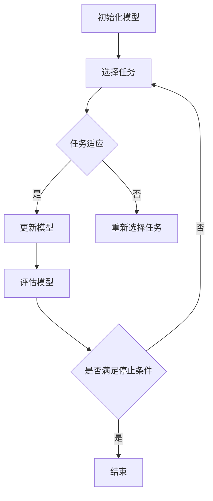
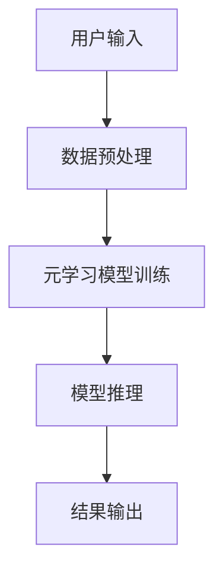
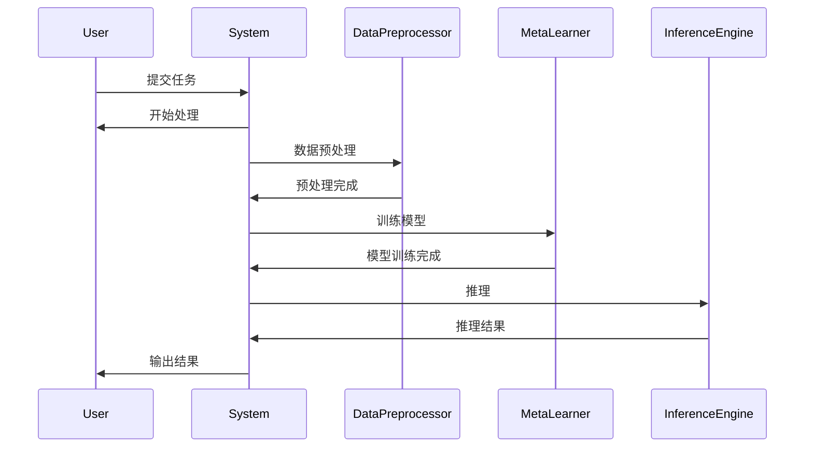

                 

### 导论

#### 第1章：问题背景与引言

##### 1.1.1 问题背景

在人工智能技术的快速发展中，尤其是深度学习的广泛应用，传统机器学习方法在应对复杂任务时暴露出了许多局限性。随着数据量和计算资源的不断增加，模型的训练时间也在显著增长，这给实际应用带来了巨大的挑战。因此，如何提高机器学习模型在复杂任务中的推理效率，成为了一个亟待解决的问题。

##### 1.1.2 问题描述

核心问题是如何在短时间内使模型快速适应新的任务需求，从而提高推理效率。这意味着我们需要一种方法，使得模型不仅能够在已知的任务上表现优异，而且能够迅速适应新的任务环境。

##### 1.1.3 问题解决

元学习作为一种新兴的机器学习方法，通过让模型学习如何学习，从而提高其在新任务上的适应能力。本书将深入研究元学习在快速任务适应推理中的应用，探索其在不同领域中的潜力。

##### 1.1.4 边界与外延

本书主要研究基于元学习的快速任务适应推理方法，涉及的领域包括计算机视觉、自然语言处理和强化学习等。此外，研究范围还包括算法原理、数学模型、系统架构及其在实际应用中的实现。

##### 1.1.5 概念结构与核心要素组成

核心概念包括元学习、迁移学习、模型泛化能力、推理效率等。这些概念构成了本文研究的理论基础，也是本文探讨的关键要素。

---

#### 1.2 核心概念与联系

##### 1.2.1 元学习

元学习（Meta-Learning），又称“学习如何学习”，是一种机器学习方法，旨在提高模型在不同任务上的泛化能力。在元学习中，模型通过从一系列任务中学习通用策略，从而能够快速适应新的任务。

##### 1.2.2 迁移学习

迁移学习（Transfer Learning），是利用已在某个任务上训练好的模型的知识，来解决新的任务。与元学习不同，迁移学习侧重于利用已有模型的知识来加速新任务的学习过程。

##### 1.2.3 模型泛化能力

模型泛化能力（Generalization Ability），是指模型在新任务上的表现能力。一个优秀的模型应该不仅能在训练任务上表现优异，而且在未见过的任务上也能保持良好的性能。

##### 1.2.4 推理效率

推理效率（Inference Efficiency），是指模型在执行推理任务时的速度和准确性。提高推理效率意味着在保证模型性能的前提下，降低推理时间。

---

#### 1.3 元学习算法原理讲解

##### 1.3.1 元学习算法概述

元学习算法的基本原理是通过在多个任务中训练，提取通用特征，从而提高模型在新任务上的适应能力。以下是元学习算法的mermaid流程图：

##### 1.3.2 MAML（Model-Agnostic Meta-Learning）

MAML（Model-Agnostic Meta-Learning）算法通过最小化目标模型在多个任务上的梯度距离，使得模型能够快速适应新任务。其数学模型如下：

$$\min_{\theta}\sum_{i=1}^{N}\sum_{j=1}^{T}\|\theta^{(i)} - \nabla_{\theta}\phi^{(i)}(x^{(i)}_j; \theta)\|_2^2$$

##### 1.3.3 Reptile

Reptile算法通过迭代优化，使得模型能够从已有任务中学习，从而提高在新任务上的适应能力。其数学模型如下：

$$\theta^{(t+1)} = \theta^{(t)} - \eta \sum_{i=1}^{N}\nabla_{\theta}\phi^{(i)}(x^{(i)}_j; \theta^{(t)})$$

---

#### 1.4 数学模型和数学公式

在元学习算法中，数学模型和公式的应用至关重要。以下是对MAML和Reptile算法的数学模型进行详细讲解。

##### 1.4.1 MAML算法数学模型

MAML算法的核心在于最小化目标模型在多个任务上的梯度距离。其目标函数如下：

$$\min_{\theta}\sum_{i=1}^{N}\sum_{j=1}^{T}\|\theta^{(i)} - \nabla_{\theta}\phi^{(i)}(x^{(i)}_j; \theta)\|_2^2$$

这里的 $\theta$ 表示模型的参数，$i$ 和 $j$ 分别表示任务和任务的子任务，$\phi^{(i)}(x^{(i)}_j; \theta)$ 表示在任务 $i$ 上的损失函数，$\nabla_{\theta}\phi^{(i)}(x^{(i)}_j; \theta)$ 表示损失函数关于 $\theta$ 的梯度。

##### 1.4.2 Reptile算法数学模型

Reptile算法通过迭代优化模型参数，使其在新任务上表现出更好的适应能力。其迭代公式如下：

$$\theta^{(t+1)} = \theta^{(t)} - \eta \sum_{i=1}^{N}\nabla_{\theta}\phi^{(i)}(x^{(i)}_j; \theta^{(t)})$$

这里的 $\theta^{(t)}$ 表示第 $t$ 次迭代的模型参数，$\eta$ 是学习率，$\phi^{(i)}(x^{(i)}_j; \theta^{(t)})$ 表示在第 $i$ 个任务上的损失函数，$\nabla_{\theta}\phi^{(i)}(x^{(i)}_j; \theta^{(t)})$ 表示损失函数关于 $\theta^{(t)}$ 的梯度。

---

#### 1.5 系统分析与架构设计方案

##### 1.5.1 问题场景介绍

以图像分类任务为例，假设我们有一个基于深度学习的图像分类系统，该系统需要在短时间内适应新的分类任务。例如，系统原本用于分类动物图像，现在需要适应分类植物图像。

##### 1.5.2 项目介绍

项目名称：基于元学习的快速任务适应推理系统。该项目旨在通过元学习技术，实现图像分类任务在新的分类任务上的快速适应。

##### 1.5.3 系统功能设计

系统功能主要包括以下三个部分：

1. 数据预处理：对输入的图像数据进行预处理，包括图像增强、数据归一化等操作，以提高模型的泛化能力。
2. 元学习模型训练：利用元学习算法，对模型进行训练，使其能够快速适应新的分类任务。
3. 模型推理：利用训练好的模型，对新分类任务进行推理，得到分类结果。

##### 1.5.4 系统架构设计

系统架构设计如下：

##### 1.5.5 系统接口设计和系统交互

系统接口设计和系统交互设计如下：

---

通过以上章节的介绍，我们对基于元学习的快速任务适应推理方法有了初步的了解。接下来，我们将进一步探讨元学习的算法原理、数学模型以及在实际系统中的应用，以期为我们解决复杂任务提供新的思路和方法。

