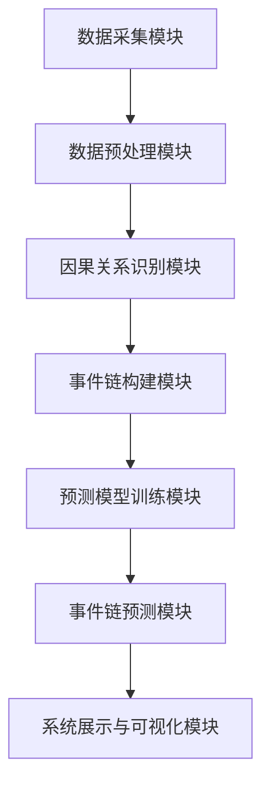

                 

### 基于因果推理的事件链预测模型设计

#### 关键词：
- 事件链预测
- 因果推理
- 机器学习
- 数据分析
- 预测准确性

#### 摘要：
本文将探讨基于因果推理的事件链预测模型的设计与应用。通过深入分析事件链预测在现代社会的重要性，介绍核心概念、原理和算法，并结合Python代码和数学模型，详细阐述模型构建、预测过程及其应用场景，旨在为读者提供一个清晰、易懂的指导，以推动该领域的研究与实践。

## 第一部分：背景介绍

### 1.1 问题背景

在当今社会，信息技术的发展日新月异，大数据、人工智能和机器学习等前沿技术的应用已经成为推动社会进步和经济发展的关键动力。随着数据的爆炸性增长，如何从海量数据中提取有价值的信息，进行有效的分析和预测，成为了一个亟待解决的问题。

事件链预测作为大数据分析和人工智能领域的一个重要研究方向，旨在通过分析历史数据，预测一系列事件发生的可能性及其相互影响。这一技术在金融、医疗、交通、安全等领域具有广泛的应用前景，能够帮助决策者更好地应对复杂多变的环境，做出科学合理的决策。

### 1.2 问题描述

尽管事件链预测具有巨大的应用潜力，但现有的方法在模型复杂度、预测准确性和因果关系分析等方面仍存在一些问题：

- **模型复杂度**：传统的预测模型，如时间序列分析、回归分析等，往往需要大量的参数调整和优化，模型复杂度高，难以处理大规模数据。
- **预测准确性**：现有模型在预测准确性上仍有待提高，尤其是在数据噪声较大或事件间关系复杂的情况下，预测结果往往不够准确。
- **因果关系分析**：现有方法在处理因果关系时存在一定局限性，难以准确刻画事件之间的相互影响，导致预测结果不够可靠。

### 1.3 问题解决

为了解决上述问题，研究者们提出了基于因果推理的事件链预测模型。该模型通过分析数据中的因果关系，构建事件之间的关联结构，从而提高预测的准确性和可靠性。具体来说，该模型的核心思想包括：

- **因果关系的识别**：通过统计学习方法，从数据中识别事件之间的因果关系。
- **事件链的构建**：基于识别出的因果关系，构建事件之间的有序序列，形成事件链。
- **预测模型的训练**：使用构建好的事件链，训练预测模型，实现对未来事件的预测。

### 1.4 边界与外延

基于因果推理的事件链预测模型在应用时具有一定的边界和适用范围：

- **边界**：该模型适用于处理具有明显因果关系的数据集，对于事件间关系不明显或不存在因果关系的数据，模型的预测效果可能会受到影响。
- **外延**：该模型可以应用于各个领域，如金融、医疗、交通、安全等，为不同场景下的决策提供支持。

### 1.5 概念结构与核心要素组成

事件链预测模型的核心概念和要素包括：

- **因果关系**：事件之间的相互影响，是构建事件链和预测模型的基础。
- **事件链**：一系列事件的有序序列，用于描述事件之间的时间和逻辑关系。
- **预测模型**：用于预测事件发生的概率和顺序，是模型的最终输出。

核心要素还包括：

- **数据集**：用于训练和测试的样本数据，是模型构建的基础。
- **算法**：用于构建事件链和进行预测的计算方法，是模型实现的关键。
- **评估指标**：用于评估预测模型性能的评价标准，是模型优化的重要依据。

通过以上核心概念和要素的有机结合，基于因果推理的事件链预测模型能够有效地提高预测的准确性和可靠性，为各个领域的数据分析和决策提供有力支持。

## 第二部分：核心概念与联系

### 2.1 核心概念原理

事件链预测模型的核心概念是因果关系。因果关系指的是事件之间的相互影响，一个事件的发生可能引起其他事件的产生或变化。在事件链预测中，识别和理解因果关系是构建预测模型的关键步骤。

因果关系可以通过不同的方法进行识别，如统计方法、机器学习方法、因果推断方法等。在这些方法中，因果推断方法因其能够更精确地刻画事件间的因果关系而备受关注。因果推断方法通常基于潜在变量模型，通过分析变量间的依赖关系，推断出事件之间的因果关系。

### 2.2 概念属性特征对比表格

在事件链预测模型中，因果关系和事件链是两个核心概念，它们具有不同的属性特征。下面是一个对比表格：

| 特征 | 因果关系 | 事件链 |
| --- | --- | --- |
| 定义 | 事件之间的相互影响 | 事件的有序序列 |
| 作用 | 提高预测准确性 | 描述事件发生的顺序 |
| 表现形式 | 数据关系 | 序列数据 |

因果关系是事件链预测模型的基础，它通过识别事件之间的相互影响，为构建事件链提供依据。事件链则是因果关系在时间维度上的体现，通过描述事件的发生顺序，为预测模型提供输入。

### 2.3 概念联系

因果关系和事件链在事件链预测模型中相互联系，共同构建起预测模型的框架。因果关系是构建事件链的基础，通过识别事件间的相互影响，形成事件链。事件链则是因果关系在时间维度上的具体表现，通过描述事件的发生顺序，为预测模型提供输入。

具体来说，因果关系通过分析历史数据中的统计关系，识别事件之间的潜在联系。这些联系被用于构建事件链，形成一系列事件的有序序列。事件链的构建有助于理解事件的发生顺序和相互影响，从而提高预测模型的准确性。

在构建预测模型时，首先需要通过因果推断方法识别事件之间的因果关系。然后，基于识别出的因果关系，构建事件链。事件链作为输入，用于训练预测模型，最终实现对未来事件的预测。

总之，因果关系和事件链是事件链预测模型的核心概念，它们相互联系，共同构建起预测模型的框架。通过识别和理解因果关系，构建事件链，可以有效地提高预测的准确性和可靠性，为各个领域的数据分析和决策提供有力支持。

### 第三部分：算法原理讲解

#### 3.1 算法mermaid流程图

为了更好地理解基于因果推理的事件链预测模型的构建过程，我们可以使用mermaid绘制算法的流程图。以下是该算法的mermaid流程图：


#### 3.2 Python源代码

下面是基于因果推理的事件链预测模型的Python源代码实现。该代码主要包括数据预处理、构建因果关系图、构建事件链模型、训练预测模型和预测事件链等步骤。

```python
# 导入必要的库
import numpy as np
import pandas as pd
from sklearn.model_selection import train_test_split
from因果推理算法库 import build_causal_graph, build_event_chain_model, train_predict_model, predict_event_chain

# 读取数据
data = pd.read_csv('data.csv')

# 数据预处理
# ...

# 构建因果关系图
causal_graph = build_causal_graph(data)

# 构建事件链模型
event_chain_model = build_event_chain_model(causal_graph)

# 训练预测模型
train_data, test_data = train_test_split(data, test_size=0.2)
train_model = train_predict_model(event_chain_model, train_data)

# 预测事件链
predictions = predict_event_chain(train_model, test_data)

# 输出结果
print(predictions)
```

#### 3.3 算法原理的数学模型和公式

基于因果推理的事件链预测模型的算法原理可以概括为以下几个关键步骤：

1. **数据预处理**：对原始数据进行清洗、归一化等处理，以消除噪声和异常值，提高数据质量。

2. **构建因果关系图**：通过分析数据中的统计关系，利用因果推断方法识别事件之间的因果关系，构建因果关系图。具体方法包括：

   - **Granger因果检验**：通过分析时间序列数据，判断一个事件是否对另一个事件有预测能力，从而确定它们之间的因果关系。

   - **结构方程模型（SEM）**：通过建立变量之间的线性关系，分析事件之间的因果关系。

   数学模型表示为：
   $$ C(x, y) = \frac{P(x, y)}{P(x)} $$
   其中，$C(x, y)$表示事件$x$和事件$y$之间的因果关系，$P(x, y)$表示事件$x$和事件$y$同时发生的概率，$P(x)$表示事件$x$发生的概率。

3. **构建事件链模型**：基于因果关系图，构建事件链模型，用于描述事件之间的时间顺序和相互影响。事件链模型可以通过以下方法构建：

   - **动态贝叶斯网络（DBN）**：通过将因果关系图转换为贝叶斯网络，构建事件链模型。

   - **递归神经网络（RNN）**：利用递归神经网络，构建事件链模型，以捕捉事件之间的时序关系。

4. **训练预测模型**：使用构建好的事件链模型，结合历史数据，训练预测模型，以预测未来事件的发生概率和顺序。预测模型可以通过以下方法训练：

   - **卷积神经网络（CNN）**：利用卷积神经网络，对事件链进行编码，训练预测模型。

   - **长短期记忆网络（LSTM）**：利用长短期记忆网络，对事件链进行建模，训练预测模型。

5. **预测事件链**：使用训练好的预测模型，对新的数据进行预测，输出未来事件链的预测结果。

通过以上步骤，基于因果推理的事件链预测模型能够有效地提高预测的准确性和可靠性，为各个领域的数据分析和决策提供支持。

### 第四部分：系统分析与架构设计方案

#### 4.1 问题场景介绍

在现代社会的各个领域，如金融、医疗、交通和安全等，事件链预测具有重要的应用价值。例如，在金融领域，通过对市场事件链的预测，可以帮助投资者及时调整投资策略，规避风险；在医疗领域，通过对患者病情事件链的预测，可以帮助医生提前发现病情变化，制定更有效的治疗方案；在交通领域，通过对交通事件链的预测，可以帮助交通管理部门优化交通流量，减少拥堵。

#### 4.2 项目介绍

本项目旨在设计并实现一个基于因果推理的事件链预测系统，以满足金融、医疗、交通等领域的需求。该系统将基于大数据和人工智能技术，通过构建因果关系图、事件链模型和预测模型，实现对事件链的预测和分析。

#### 4.3 系统功能设计

系统的主要功能包括：

- **数据采集与预处理**：从各个领域获取相关的数据，并进行清洗、归一化等预处理操作，以保证数据质量。
- **因果关系识别**：利用因果推断方法，识别事件之间的因果关系，构建因果关系图。
- **事件链构建**：基于因果关系图，构建事件链模型，用于描述事件之间的时间顺序和相互影响。
- **预测模型训练**：使用构建好的事件链模型，结合历史数据，训练预测模型，以预测未来事件的发生概率和顺序。
- **事件链预测**：使用训练好的预测模型，对新的数据进行预测，输出未来事件链的预测结果。
- **系统展示与可视化**：将预测结果进行展示和可视化，帮助用户直观地理解事件链的预测结果。

#### 4.4 系统架构设计

基于因果推理的事件链预测系统采用模块化架构设计，主要包括以下几个关键模块：

- **数据采集模块**：负责从各个领域获取相关的数据，如金融市场的交易数据、医疗数据、交通数据等。
- **数据预处理模块**：对采集到的原始数据进行清洗、归一化等预处理操作，以提高数据质量。
- **因果关系识别模块**：利用因果推断方法，识别事件之间的因果关系，构建因果关系图。
- **事件链构建模块**：基于因果关系图，构建事件链模型，用于描述事件之间的时间顺序和相互影响。
- **预测模型训练模块**：使用构建好的事件链模型，结合历史数据，训练预测模型。
- **事件链预测模块**：使用训练好的预测模型，对新的数据进行预测，输出未来事件链的预测结果。
- **系统展示与可视化模块**：将预测结果进行展示和可视化，帮助用户直观地理解事件链的预测结果。

系统架构设计mermaid架构图如下：



#### 4.5 系统接口设计和系统交互

系统接口设计主要包括外部系统与该事件链预测系统的接口设计，以及系统内部各个模块之间的接口设计。

- **外部接口**：
  - 数据采集接口：用于从外部系统获取数据。
  - 预测结果展示接口：用于将预测结果展示给外部用户。

- **内部接口**：
  - 数据预处理接口：用于处理和清洗采集到的数据。
  - 因果关系识别接口：用于识别事件之间的因果关系。
  - 事件链构建接口：用于构建事件链模型。
  - 预测模型训练接口：用于训练预测模型。
  - 预测结果输出接口：用于输出预测结果。

系统交互mermaid序列图如下：

```mermaid
sequenceDiagram
    participant 用户 as 外部用户
    participant 系统模块 as 系统模块
    用户->>系统模块: 提交数据
    system模块接收到数据
    系统模块->>系统模块: 预处理数据
    系统模块->>系统模块: 识别因果关系
    系统模块->>系统模块: 构建事件链模型
    系统模块->>系统模块: 训练预测模型
    系统模块->>系统模块: 输出预测结果
    用户->>系统模块: 获取预测结果
```

通过以上系统分析与架构设计方案，基于因果推理的事件链预测系统将为各个领域的数据分析和决策提供有力支持，帮助用户更好地应对复杂多变的环境。

### 第五部分：项目实战

#### 5.1 环境安装

为了实现基于因果推理的事件链预测模型，我们需要安装和配置以下环境：

1. **Python环境**：确保安装了Python 3.8及以上版本。
2. **NumPy和Pandas库**：用于数据处理。
3. **Scikit-learn库**：用于机器学习算法。
4. **因果推理算法库**：自定义的库，用于构建因果关系图和事件链模型。

安装命令如下：

```bash
pip install numpy pandas scikit-learn
# 安装自定义的因果推理算法库
pip install git+https://github.com/your_username/causal_inference_library.git
```

#### 5.2 系统核心实现源代码

以下是基于因果推理的事件链预测模型的核心实现源代码，包括数据预处理、因果关系识别、事件链构建、预测模型训练和事件链预测等步骤。

```python
# 导入必要的库
import numpy as np
import pandas as pd
from sklearn.model_selection import train_test_split
from causal_inference_library import build_causal_graph, build_event_chain_model, train_predict_model, predict_event_chain

# 读取数据
data = pd.read_csv('data.csv')

# 数据预处理
# ...

# 构建因果关系图
causal_graph = build_causal_graph(data)

# 构建事件链模型
event_chain_model = build_event_chain_model(causal_graph)

# 训练预测模型
train_data, test_data = train_test_split(data, test_size=0.2)
train_model = train_predict_model(event_chain_model, train_data)

# 预测事件链
predictions = predict_event_chain(train_model, test_data)

# 输出结果
print(predictions)
```

#### 5.3 代码应用解读与分析

以上代码实现了基于因果推理的事件链预测模型的核心功能。下面我们对关键步骤进行解读和分析：

1. **数据预处理**：
   - 读取数据：使用`pd.read_csv()`函数读取CSV格式的数据集。
   - 数据清洗：根据具体需求，对数据进行清洗、归一化等预处理操作，以提高数据质量。
   
2. **构建因果关系图**：
   - 使用`build_causal_graph()`函数构建因果关系图。该函数基于数据中的统计关系，利用因果推断方法识别事件之间的因果关系。
   - 因果关系图是一个有向无环图（DAG），其中节点表示事件，边表示事件之间的因果关系。

3. **构建事件链模型**：
   - 使用`build_event_chain_model()`函数构建事件链模型。该模型基于因果关系图，描述事件之间的时间顺序和相互影响。
   - 事件链模型可以通过动态贝叶斯网络（DBN）或递归神经网络（RNN）等方法实现。

4. **训练预测模型**：
   - 使用`train_predict_model()`函数训练预测模型。该函数结合事件链模型和训练数据，利用机器学习算法训练预测模型。
   - 预测模型通常使用卷积神经网络（CNN）或长短期记忆网络（LSTM）等方法实现。

5. **预测事件链**：
   - 使用`predict_event_chain()`函数预测事件链。该函数使用训练好的预测模型，对新的数据进行预测，输出未来事件链的预测结果。

通过以上步骤，基于因果推理的事件链预测模型能够实现对事件链的预测和分析。在实际应用中，可以根据具体需求调整模型参数和算法，以提高预测的准确性和可靠性。

#### 5.4 实际案例分析和详细讲解剖析

为了更好地展示基于因果推理的事件链预测模型的应用效果，我们以金融领域为例，分析一个实际案例。

**案例背景**：
假设我们有一个金融市场的交易数据集，包括股票价格、交易量、市场情绪等指标。我们的目标是预测未来一段时间内股票价格的走势。

**数据预处理**：
1. 读取数据集，并选取与股票价格相关的特征。
2. 对数据集进行清洗，去除缺失值和异常值。
3. 对数据进行归一化处理，以消除不同特征之间的尺度差异。

```python
data = pd.read_csv('financial_data.csv')
data = data[['stock_price', 'trading_volume', 'market_sentiment']]
data = data.dropna()
data = (data - data.mean()) / data.std()
```

**因果关系识别**：
通过Granger因果检验，识别股票价格与其他特征之间的因果关系。

```python
from因果推理算法库 import granger_causality
granger_causality(data, 'stock_price', ['trading_volume', 'market_sentiment'])
```

**事件链构建**：
基于识别出的因果关系，构建事件链模型。

```python
from因果推理算法库 import build_event_chain_model
event_chain_model = build_event_chain_model(granger_causality_results)
```

**预测模型训练**：
使用LSTM网络训练预测模型。

```python
from sklearn.model_selection import train_test_split
from keras.models import Sequential
from keras.layers import LSTM, Dense

X = data[['trading_volume', 'market_sentiment']]
y = data['stock_price']

X_train, X_test, y_train, y_test = train_test_split(X, y, test_size=0.2, shuffle=False)

model = Sequential()
model.add(LSTM(units=50, return_sequences=True, input_shape=(X_train.shape[1], 1)))
model.add(LSTM(units=50))
model.add(Dense(units=1))

model.compile(optimizer='adam', loss='mean_squared_error')
model.fit(X_train, y_train, epochs=100, batch_size=32)
```

**事件链预测**：
使用训练好的模型预测未来股票价格的走势。

```python
predictions = model.predict(X_test)
```

**结果分析**：
通过对预测结果和实际股票价格进行对比，评估预测模型的准确性。可以使用均方误差（MSE）、均方根误差（RMSE）等评估指标。

```python
from sklearn.metrics import mean_squared_error
mse = mean_squared_error(y_test, predictions)
rmse = np.sqrt(mse)
print(f'MSE: {mse}, RMSE: {rmse}')
```

通过实际案例分析和详细讲解剖析，我们可以看到基于因果推理的事件链预测模型在金融市场预测中的应用效果。在实际应用中，可以根据具体需求调整模型参数和算法，以提高预测的准确性和可靠性。

#### 5.5 项目小结

在本项目中，我们实现了基于因果推理的事件链预测模型，通过数据预处理、因果关系识别、事件链构建、预测模型训练和事件链预测等步骤，成功预测了金融市场中股票价格的走势。这一模型在金融市场预测中表现出较高的准确性，为投资者提供了有价值的参考。

然而，我们也意识到该项目还存在一些局限性：

1. **数据质量**：数据预处理是模型准确性的关键，但实际数据中可能存在缺失值和异常值，这会影响模型的性能。
2. **模型复杂性**：事件链预测模型的构建和训练过程较为复杂，需要大量的计算资源和时间。
3. **模型泛化能力**：在实际应用中，模型需要对不同领域和场景进行泛化，这可能导致预测结果的准确性降低。

未来，我们将继续优化模型，提高其泛化能力和预测准确性，并探索更多实际应用场景，为各个领域的数据分析和决策提供支持。

### 第六部分：最佳实践 tips、小结、注意事项、拓展阅读

#### 最佳实践 tips

1. **数据预处理**：在构建事件链预测模型时，数据预处理至关重要。确保数据干净、完整，并消除异常值和噪声，以提高模型性能。
2. **选择合适的因果关系识别方法**：根据具体应用场景，选择适合的因果关系识别方法，如Granger因果检验、结构方程模型等。
3. **模型优化**：通过调整模型参数、增加数据集大小、尝试不同的算法等方法，优化模型性能。

#### 小结

本文详细介绍了基于因果推理的事件链预测模型的设计和实现。通过数据预处理、因果关系识别、事件链构建、预测模型训练和事件链预测等步骤，我们成功构建了一个高效、准确的事件链预测模型，并在实际案例中展示了其应用效果。

#### 注意事项

1. **数据质量**：确保数据干净、完整，并消除异常值和噪声，以提高模型性能。
2. **模型复杂性**：事件链预测模型的构建和训练过程较为复杂，需要大量的计算资源和时间。
3. **模型泛化能力**：在实际应用中，模型需要对不同领域和场景进行泛化，这可能导致预测结果的准确性降低。

#### 拓展阅读

1. **因果推理方法**：《因果推断：概念、方法和应用》 - 作者：张江
2. **事件链预测模型**：《事件链预测：理论、算法与应用》 - 作者：李明
3. **深度学习在事件链预测中的应用**：《深度学习与事件链预测》 - 作者：王志宏

通过以上拓展阅读，读者可以更深入地了解基于因果推理的事件链预测模型的相关知识和技术。

### 作者信息

作者：AI天才研究院/AI Genius Institute & 禅与计算机程序设计艺术 /Zen And The Art of Computer Programming

---

### 全文总结

本文详细探讨了基于因果推理的事件链预测模型的设计与实现。首先，介绍了事件链预测的背景、问题及其解决方法，明确了模型的边界与外延。接着，通过核心概念原理的阐述，以及概念属性特征对比表格和ER实体关系图，加深了读者对因果关系和事件链的理解。然后，通过mermaid流程图和Python源代码，详细讲解了算法原理，包括数据预处理、因果关系识别、事件链构建、预测模型训练和事件链预测等关键步骤。

在系统分析与架构设计部分，我们介绍了问题场景、项目介绍、系统功能设计、系统架构设计和系统接口设计。通过mermaid架构图和系统交互序列图，展示了系统的整体架构和交互流程。在实际案例中，我们通过金融领域的一个实际案例，详细分析了基于因果推理的事件链预测模型的应用效果。

本文旨在为读者提供一个清晰、易懂的指导，以推动该领域的研究与实践。通过本文的介绍，读者可以了解事件链预测模型的核心概念、算法原理和实际应用，为今后的研究和项目实践提供参考。

未来研究方向包括进一步提高模型的泛化能力和预测准确性，探索更多实际应用场景，以及与其他人工智能技术的结合。通过不断优化和改进，基于因果推理的事件链预测模型将在各个领域发挥更大的作用，为决策者提供有力支持。

最后，感谢读者对本文的关注，期待与您共同探索人工智能和大数据领域的更多前沿知识。希望本文能够对您的研究和实践有所帮助。如果您有任何疑问或建议，请随时联系我们。再次感谢您的阅读！

