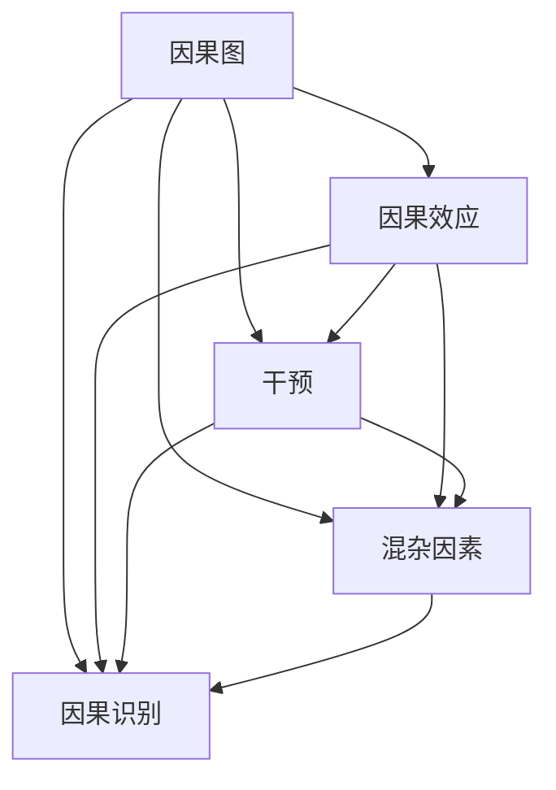
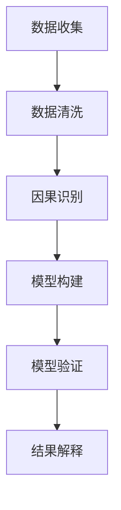
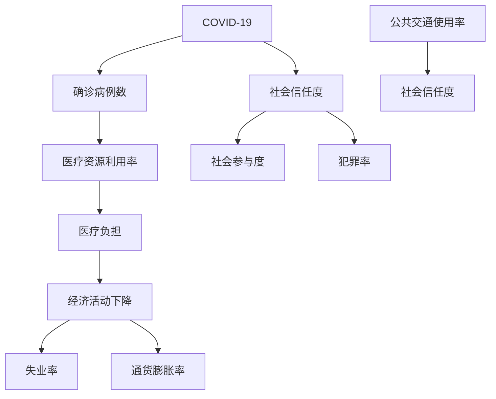
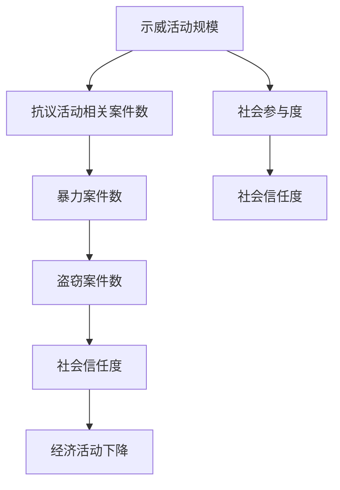
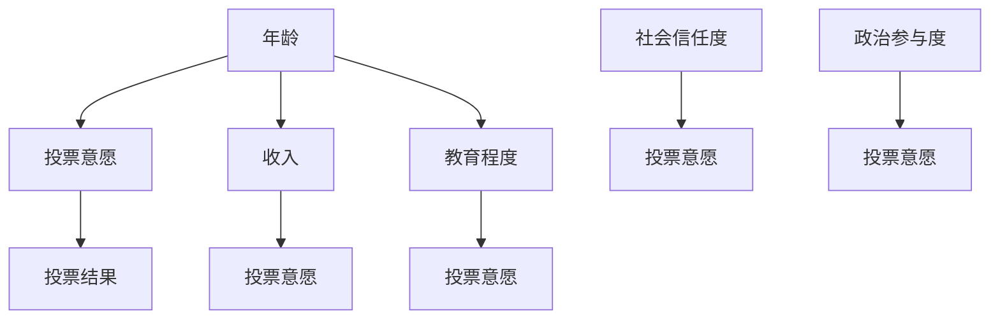

                 

### 1.1.1 问题背景

在社会飞速发展的今天，信息传播的速度和广度前所未有。各类社会事件如政治动荡、自然灾害、重大突发事件等对社会的影响日益显著。如何快速、准确地评估这些社会事件对社会、经济、政治等方面的综合影响，已成为政府和相关部门亟待解决的问题。

目前，大多数社会事件影响评估方法主要依赖于统计分析和机器学习算法，这些方法在一定程度上能够捕捉事件与影响之间的相关性，但往往忽略了事件之间的因果联系。此外，现有方法在处理复杂社会系统中的多重因果关系时，存在诸多局限：

1. **关联性而非因果性**：统计方法侧重于寻找变量之间的相关性，而因果关系则需要考虑时间顺序、条件限制等因素。
2. **数据依赖性**：机器学习方法在处理大规模数据时表现优秀，但数据的质量和完整性直接影响评估结果的可靠性。
3. **模型透明度不足**：复杂的机器学习模型缺乏可解释性，使得评估结果的决策依据难以被公众理解和接受。
4. **实时性不足**：在应对突发事件时，传统评估方法往往难以在短时间内提供准确的预测。

因此，构建一个能够有效识别和处理因果关系的评估模型，对社会事件的及时、准确评估具有重要意义。因果推理作为一种能够揭示变量之间因果关系的理论框架，可以弥补现有方法的不足，为社会事件影响评估提供更加科学、可靠的依据。

### 1.1.2 现有评估方法的局限性

现有社会事件影响评估方法主要集中在统计分析和机器学习领域，虽然这些方法在一定程度上能够捕捉事件与影响之间的相关性，但它们在实际应用中面临诸多局限性。以下是对几种常见评估方法局限性的具体分析：

**1. 统计分析方法的局限**

统计分析方法，如回归分析、时间序列分析等，被广泛应用于社会事件影响评估中。这些方法的优势在于其理论基础扎实，计算过程相对简单，能够快速处理大量数据。然而，统计分析方法主要依赖于变量之间的相关性来预测事件影响，这种相关性并不等同于因果关系。具体局限性如下：

- **忽略时间序列的影响**：统计分析方法往往假设变量之间的关系是静态的，而社会事件的影响通常是随时间变化的，这会导致评估结果失真。
- **缺乏因果推理能力**：统计模型无法直接揭示变量之间的因果联系，只能在假设因果结构的基础上进行相关性分析。这种假设的合理性在实际应用中难以保证。
- **对异常值敏感**：统计分析方法对数据质量要求较高，数据中的异常值和噪声可能会对评估结果产生显著影响。

**2. 机器学习方法的局限**

机器学习方法，如随机森林、支持向量机、神经网络等，在处理复杂数据和社会事件评估中表现出色。这些方法通过学习大量历史数据，能够发现数据中的潜在规律，从而预测事件影响。然而，机器学习方法也存在一些局限性：

- **数据依赖性强**：机器学习方法在训练过程中高度依赖于历史数据的质量和完整性。数据缺失、数据噪声等问题都会对模型性能产生负面影响。
- **模型可解释性差**：复杂的机器学习模型（如深度神经网络）在预测准确性方面具有优势，但其内部机制往往难以解释，评估结果的决策依据不易被公众理解和接受。
- **过拟合问题**：机器学习模型在训练过程中容易受到训练数据的过度拟合，导致模型在未知数据上的泛化能力较差。

**3. 现有方法的共同局限**

除了上述局限性，现有评估方法还存在以下共同问题：

- **实时性不足**：社会事件发生后，传统评估方法往往需要较长时间来收集、处理和分析数据，难以在短时间内提供准确的评估结果。
- **处理多重因果关系能力有限**：在复杂社会系统中，事件之间的因果关系往往是多重的、动态的。现有方法在处理这种复杂因果关系时，存在明显的不足。

综上所述，现有社会事件影响评估方法在准确性、实时性和可解释性等方面存在诸多局限。因此，迫切需要一种能够有效识别和处理因果关系的评估模型，以应对现代社会事件评估的挑战。

### 1.1.3 因果推理在社会事件评估中的应用

因果推理作为一种能够揭示变量之间因果关系的理论框架，其在社会事件评估中的应用具有显著优势。因果推理不仅能够识别变量之间的直接因果联系，还可以通过推理过程挖掘出潜在的因果关系，从而提供更加科学、可靠的影响评估。

**1. 提高评估结果的准确性**

因果推理的核心在于通过逻辑推理和统计方法，识别变量之间的因果联系。在社会事件评估中，因果推理能够通过分析事件发生前后的变化，确定事件对各个变量（如经济指标、社会稳定度等）的影响方向和程度。相比传统的统计方法，因果推理能够更加准确地预测事件对社会各方面的综合影响，从而提高评估结果的准确性。

**2. 增强模型的可解释性**

因果推理模型具有高度的可解释性，能够清晰地展示变量之间的因果路径和关系。这使得评估结果更加透明，有助于决策者理解和接受评估结论。相比复杂的机器学习模型，因果推理模型更容易被公众理解和信任。例如，在评估自然灾害对经济的影响时，因果推理可以明确指出洪水导致的直接经济损失和间接经济损失之间的关系，从而提供更加直观的决策依据。

**3. 有效处理多重因果关系**

在复杂社会系统中，事件之间的因果关系往往是多重的、动态的。因果推理能够通过构建因果图和网络模型，有效地处理这些多重因果关系。例如，在分析社会动荡对经济的影响时，因果推理可以同时考虑社会动荡对就业、消费、投资等多方面的综合影响，从而提供更加全面的评估结果。

**4. 提高评估的实时性**

因果推理模型在处理实时数据方面具有明显优势。通过实时数据收集和因果推理分析，评估模型可以快速响应社会事件的变化，提供及时的影响评估。这对于应对突发事件、迅速采取应对措施具有重要意义。

**5. 应用案例**

因果推理在社会事件评估中的应用案例广泛。例如：

- **新冠疫情评估**：因果推理模型可以分析疫情对经济、医疗、社会稳定等多方面的影响，为政策制定提供科学依据。
- **自然灾害影响评估**：因果推理模型可以分析地震、洪水等自然灾害对当地经济、人口、基础设施等方面的综合影响，为灾后重建提供支持。
- **社会政策评估**：因果推理模型可以分析某项社会政策对教育、就业、收入分配等方面的长期和短期影响，为政策调整提供参考。

总之，因果推理在社会事件评估中的应用具有显著优势。通过揭示变量之间的因果联系，因果推理不仅能够提高评估结果的准确性，增强模型的可解释性，还能有效处理多重因果关系，提高评估的实时性，为社会事件的及时、准确评估提供有力支持。

### 1.2.1 因果推理概述

因果推理（Causal Inference）是一种通过分析变量之间的因果关系来解释和预测现象的方法，它是统计学、计算机科学和哲学等学科交叉融合的产物。因果推理的基本目标是确定某个变量是否对另一个变量产生了影响，以及影响的大小和方向。

**1. 因果关系的定义**

在因果推理中，因果关系指的是一个变量（原因）对另一个变量（结果）产生的影响。具体来说，当一个变量的变化能够导致另一个变量发生变化，并且这种变化在统计上显著且具有时间先后的顺序时，我们称这两个变量之间存在因果关系。

**2. 因果关系的识别方法**

识别因果关系通常需要以下几个步骤：

- **确定因果关系**：通过逻辑推理、实验设计和数据分析等方法确定变量之间的因果关系。
- **控制混杂因素**：在分析过程中，需要控制可能影响因果关系的混杂因素，以确保因果关系的准确性。
- **统计检验**：使用统计方法检验变量之间的因果关系是否显著。
- **因果推断**：通过因果图、结构方程模型等工具进行因果推断，确定变量之间的因果方向和影响路径。

**3. 因果推理的类型**

根据分析对象的不同，因果推理可以分为以下几种类型：

- **直接因果关系**：通过直接观察和统计分析确定两个变量之间的因果关系。
- **中介效应**：分析一个变量通过另一个中介变量对第三个变量产生的影响。
- **调节效应**：分析一个变量在不同条件下对因果关系的影响程度。
- **累积效应**：分析多个变量对结果变量的长期累积影响。

**4. 因果推理的应用领域**

因果推理在多个领域都有广泛的应用，包括：

- **社会科学**：研究教育、健康、经济等领域的因果关系，为政策制定提供科学依据。
- **医学研究**：通过因果推理确定药物、治疗方法等对疾病的影响。
- **数据分析**：在商业、金融等领域，通过因果推理优化决策过程和策略制定。
- **人工智能**：构建基于因果推理的算法，提高机器学习和智能系统的可解释性。

**5. 因果推理的优势**

- **揭示变量之间的本质联系**：因果推理能够揭示变量之间的本质因果关系，而不仅仅是相关性。
- **提高模型的可解释性**：因果推理模型具有较高的可解释性，有助于决策者理解和接受评估结论。
- **处理复杂因果关系**：因果推理能够处理多重因果关系和复杂系统中的变量关系。

总之，因果推理作为一种重要的分析工具，通过揭示变量之间的因果关系，为社会科学、医学研究、数据分析等领域提供了科学、可靠的依据。其在社会事件影响评估中的应用，有望提高评估结果的准确性、实时性和可解释性，为应对现代社会事件的挑战提供有力支持。

### 1.2.2 因果推理模型的基本原理

因果推理模型的基本原理是通过构建和分析变量之间的因果关系图，从而揭示变量之间的内在联系和影响路径。理解这些原理是设计高效、准确的社会事件影响评估模型的基础。

**1. 因果图（Causal Graphs）**

因果图是一种图形化表示变量之间因果关系的方法。在因果图中，节点表示变量，边表示变量之间的因果关系。因果图通常分为两类：因果结构图（Causal Structural Models, CSM）和因果影响图（Causal Influence Models, CIM）。

- **因果结构图**：在因果结构图中，边表示变量之间的真实因果关系。这种图假设因果关系的方向是已知的，通常通过实验或理论分析得到。
- **因果影响图**：因果影响图则假设边表示变量之间的直接因果关系，但可能存在未知的间接效应和混杂因素。

因果图的基本结构包括：

- **独立链**：一个变量直接影响到另一个变量，而中间没有其他变量干扰，形成一条独立链。
- **叉积**：两个或多个变量通过中间变量间接相互作用，形成一个叉积结构。
- **反馈环**：变量之间形成反馈循环，这种结构在复杂系统中较为常见。

**2. Do-Calibration（Do-Calibration）**

Do-Calibration 是一种因果推理方法，用于估计变量之间的因果效应。它通过模拟施加一个干预（即 "Do" 操作），然后比较干预前后的结果来估计因果关系。

- **Do-操作**：Do-操作是对变量施加一个干预，以观察其对其他变量的影响。例如，在医疗研究中，对一组患者施加药物治疗，然后观察治疗效果。
- **Calibration**：Calibration 是通过统计方法对干预效果进行校准，以估计因果关系的大小。

Do-Calibration 的步骤包括：

1. **确定干预**：选择一个或多个变量进行干预。
2. **实施干预**：对样本进行干预，记录干预前后的数据。
3. **计算干预效应**：通过比较干预前后的结果，计算干预对其他变量的影响。
4. **校准效应**：使用统计模型对干预效应进行校准，以消除潜在的混杂因素。

**3. 识别因果效应（Identification of Causal Effects）**

识别因果效应是因果推理的核心问题。在存在混杂因素和测量误差的情况下，如何准确地识别和估计因果关系是关键。以下是一些常用的识别方法：

- **随机对照试验**：通过随机分配实验组和对照组，消除混杂因素的干扰，是识别因果效应最直接有效的方法。
- **工具变量法**：使用工具变量（与原因相关但不与结果相关的变量）来识别因果关系。
- **倾向得分匹配**：通过计算倾向得分来匹配实验组和对照组，以消除混杂因素的影响。

**4. 因果推理方法**

常见的因果推理方法包括：

- **逆向概率因果图（Reverse Probability Graphical Models, RPGM）**：通过逆向概率计算确定变量之间的因果关系。
- **因果推断机器学习（Causal Inference Machine Learning, CIMAL）**：结合机器学习算法进行因果推断。
- **因果影响路径分析（Causal Impact Path Analysis）**：分析变量之间的因果影响路径，确定因果关系。

**5. 因果推理的优势**

- **揭示因果关系**：因果推理能够揭示变量之间的真实因果关系，而不仅仅是相关性。
- **增强模型可解释性**：因果推理模型具有较高的可解释性，有助于理解变量之间的内在联系。
- **处理复杂系统**：因果推理能够处理复杂系统中的多重因果关系，适用于社会科学、医学研究等领域。

总之，因果推理模型通过构建和分析变量之间的因果关系图，结合Do-Calibration和识别因果效应的方法，能够提供更加科学、可靠的因果推断。在社会事件影响评估中，因果推理的应用有助于提高评估的准确性、实时性和可解释性，为社会事件的及时、准确评估提供有力支持。

### 1.2.3 因果推理在社会事件评估中的优势

因果推理在社会事件评估中的应用具有显著优势，尤其在处理复杂社会系统中的多重因果关系方面，表现出色。以下是因果推理在社会事件评估中的主要优势：

**1. 提高评估准确性**

因果推理能够通过揭示变量之间的真实因果关系，提高社会事件影响评估的准确性。传统的统计分析和机器学习方法主要依赖于相关性分析，而因果关系是影响评估中更为关键的要素。因果推理能够识别变量之间的直接和间接影响，从而提供更加精确的评估结果。

**2. 增强模型可解释性**

因果推理模型具有较高的可解释性，使得评估结果更加透明和易于理解。评估者能够清晰地看到变量之间的因果路径和影响关系，这有助于决策者接受和信任评估结论。相比复杂的机器学习模型，因果推理模型通过图形化的因果图展示了变量之间的因果关系，使得模型解释更加直观。

**3. 处理多重因果关系**

在复杂社会系统中，事件之间的因果关系往往是多重的、动态的。因果推理能够通过构建因果图和网络模型，有效地处理这些多重因果关系。例如，在分析自然灾害对社会经济的影响时，因果推理可以同时考虑洪水、地震等多个因素对经济、基础设施、就业等多方面的综合影响，从而提供更加全面的评估结果。

**4. 提高评估实时性**

因果推理在社会事件评估中的实时性优势尤为显著。通过实时数据收集和因果推理分析，评估模型可以在短时间内提供及时的影响评估结果。这对于应对突发事件、迅速采取应对措施具有重要意义。相比传统的统计和机器学习方法，因果推理能够更快地适应事件变化，提供实时的决策依据。

**5. 减少数据依赖性**

尽管因果推理对数据质量有一定的要求，但它通过因果图和网络模型，可以在一定程度上降低对数据的依赖性。因果推理可以通过识别和处理潜在的影响因素，减少对历史数据完整性和准确性的依赖。此外，因果推理可以借助模拟和校准等方法，在数据不足的情况下，仍能提供较为可靠的评估结果。

**6. 应用广泛**

因果推理在多个领域都有广泛应用，包括社会科学、医学研究、数据分析等。其灵活性和适应性使其能够应对不同类型的社会事件评估需求。例如，在公共卫生领域，因果推理可以用于评估疫情对经济、社会、医疗等多个方面的影响；在公共政策领域，因果推理可以用于评估某项政策对教育、就业、收入分配等方面的长期和短期影响。

总之，因果推理在社会事件评估中的应用，通过提高评估准确性、增强模型可解释性、处理多重因果关系、提高实时性、减少数据依赖性以及广泛应用等多个方面，为社会事件的及时、准确评估提供了有力支持。这些优势使得因果推理成为现代社会事件影响评估的重要工具，有望在未来得到更加广泛的应用和发展。

### 1.3.1 相关概念关系图

为了更好地理解因果推理模型中的关键概念，我们首先需要绘制一个相关概念的关系图。该图将展示因果推理中常用的几个核心概念，以及它们之间的相互关系。

#### 关键概念定义：

1. **因果图（Causal Graph）**：一种图形化表示变量之间因果关系的工具，包括节点和边。节点表示变量，边表示变量之间的因果关系。
2. **因果效应（Causal Effect）**：一个变量变化对另一个变量产生的实际影响。
3. **干预（Intervention）**：对变量施加的控制措施，以观察其对其他变量的影响。
4. **混杂因素（Confounding Factor）**：影响结果变量，但与原因变量不直接相关的变量。
5. **因果识别（Causal Identification）**：通过统计学方法确定变量之间的因果关系。

#### 概念关系图：

使用Mermaid语法绘制一个简单的因果图：



#### 关系说明：

- **因果图**：是因果推理的基础，通过节点和边表示变量之间的因果关系。因果图可以分为因果结构图和因果影响图，前者假设因果关系已知，后者则考虑潜在混杂因素。
- **因果效应**：通过因果图识别，指明一个变量对另一个变量的直接影响。因果效应是影响评估的核心。
- **干预**：在因果推理中，通过干预变量来观察其对结果变量的影响。干预是实验设计的重要部分，有助于揭示因果效应。
- **混杂因素**：在因果推理中，可能干扰因果识别的因素。控制混杂因素是确保因果效应准确性的关键。
- **因果识别**：通过统计方法和因果图，确定变量之间的因果关系。因果识别是因果推理的核心步骤，确保评估结果的科学性和可靠性。

通过上述关系图，我们可以更直观地理解这些核心概念之间的相互关系，为进一步的因果推理模型设计提供基础。

### 1.3.2 概念属性特征对比表格

为了更系统地理解因果推理模型中的关键概念，我们将这些概念的主要属性和特征进行对比，构建一个表格。以下表格展示了因果图、因果效应、干预、混杂因素和因果识别五个核心概念的主要区别。

| 概念       | 定义                                                         | 属性和特征                                                                                                         |
|------------|--------------------------------------------------------------|--------------------------------------------------------------------------------------------------------------------|
| 因果图     | 描述变量之间因果关系的图形化工具。                         | - 节点：变量<br>- 边：因果关系<br>- 类型：因果结构图和因果影响图 |
| 因果效应   | 变量之间的直接影响。                                       | - 方向：正向或负向<br>- 大小：定量测量<br>- 显著性：通过统计检验确定 |
| 干预       | 对变量施加的控制措施。                                     | - 目标：揭示因果效应<br>- 方法：实验设计<br>- 变量：干预变量和结果变量 |
| 混杂因素   | 影响结果变量，但与原因变量不直接相关的变量。               | - 性质：外部变量<br>- 影响：干扰因果关系<br>- 控制：统计方法或实验设计 |
| 因果识别   | 确定变量之间因果关系的统计方法。                           | - 方法：随机对照试验、工具变量法、倾向得分匹配等<br>- 目标：消除混杂因素影响 |

#### 表格说明：

- **因果图**：通过节点和边表示变量之间的因果关系。节点表示变量，边表示变量之间的因果关系。因果图分为因果结构图和因果影响图，后者在考虑潜在混杂因素时更加复杂。
- **因果效应**：通过因果图识别，指明一个变量对另一个变量的直接影响。因果效应包括方向（正向或负向）、大小（定量测量）和显著性（通过统计检验确定）。
- **干预**：在因果推理中，通过干预变量来观察其对结果变量的影响。干预是实验设计的重要部分，通过对比干预前后的结果，可以揭示因果效应。
- **混杂因素**：可能干扰因果关系的外部变量。控制混杂因素是确保因果效应准确性的关键。通过统计方法或实验设计，可以消除混杂因素的影响。
- **因果识别**：通过多种统计方法确定变量之间的因果关系。因果识别的目标是消除混杂因素的影响，确保评估结果的科学性和可靠性。

通过这个对比表格，我们可以更清晰地理解因果推理中的关键概念，为后续模型设计和分析提供指导。

### 1.4.1 模型设计的基本假设

在构建基于因果推理的社会事件影响评估模型时，需要明确一些基本假设，这些假设为模型的可靠性和有效性提供了理论基础。以下是我们提出的几个核心假设：

**1. 因果关系的存在性**

我们假设社会事件与评估指标之间存在明确的因果关系。这意味着，社会事件的发生会对评估指标（如经济指标、社会稳定度、公众情绪等）产生直接或间接的影响。这一假设是基于我们对现实世界中的因果关系的认知和理解。

**2. 数据的充分性和代表性**

模型设计依赖于充分和具有代表性的数据。我们假设收集的数据能够全面、准确地反映社会事件及其影响。这包括事件发生前后的各种经济、社会、政治数据，以及相关变量的历史记录。数据的充分性和代表性是模型有效性的基础。

**3. 混杂因素的识别和控制**

在复杂社会系统中，存在多种可能影响评估结果的混杂因素。我们假设能够通过数据分析和实验设计，识别出这些混杂因素，并采取相应的统计方法（如倾向得分匹配、工具变量法等）进行控制。这一假设保证了因果关系的准确性。

**4. 数据独立性**

我们假设收集的数据在统计上相互独立，即一个变量的变化不会直接影响其他变量。这有助于我们通过因果推理方法准确地识别和估计因果关系。

**5. 干预操作的可行性**

为了进行因果推理，我们假设可以实施有效的干预操作，即能够对社会事件进行控制和调节。在实际应用中，这可能涉及政策干预、实验设计等，以观察干预对结果变量的影响。

**6. 模型的可解释性**

模型设计需确保其结果具有可解释性。我们假设通过因果图和网络模型，可以清晰地展示变量之间的因果关系，使评估结果易于理解。可解释性是模型在实际应用中受到决策者信任的关键。

通过以上基本假设，我们为基于因果推理的社会事件影响评估模型提供了坚实的理论基础，确保模型在设计和应用过程中的可靠性和有效性。

### 1.4.2 模型适用的社会事件类型

基于因果推理的社会事件影响评估模型具有广泛的适用性，可以应对多种类型的社会事件。以下是一些主要适用场景：

**1. 自然灾害**

自然灾害如地震、洪水、飓风等对社会经济、基础设施和公众生活产生巨大影响。基于因果推理的模型可以分析灾害发生前后各种指标的变化，评估灾害对社会经济、医疗、交通等领域的综合影响。

**2. 社会动荡**

社会动荡如政治冲突、示威活动、社会运动等对社会稳定度、公众情绪和经济活动产生显著影响。模型可以识别这些事件与经济指标、社会稳定度、就业率等变量之间的因果关系，提供及时的风险评估和应对策略。

**3. 公共卫生事件**

公共卫生事件如疫情爆发、传染病流行等对社会健康、医疗资源、经济活动产生深远影响。因果推理模型可以分析疫情对医疗系统、公众健康、经济活动等多方面的综合影响，为疫情应对和公共卫生政策提供科学依据。

**4. 经济危机**

经济危机如金融危机、市场动荡等对全球经济、金融市场、就业率等产生重大影响。模型可以评估危机前后经济指标的变化，识别危机成因和传导机制，为经济政策和风险管理提供支持。

**5. 政策影响**

政策影响如税收政策、教育改革、社会保障政策等对社会经济、教育、收入分配等产生长期影响。因果推理模型可以评估政策实施前后社会各领域的变动，为政策调整和优化提供数据支持。

通过这些具体实例，可以看出基于因果推理的社会事件影响评估模型在多种社会事件类型中具有显著的应用价值，能够提供科学、准确的评估结果，为决策者提供有力的决策支持。

### 1.4.3 模型的外延与应用场景

基于因果推理的社会事件影响评估模型在多个领域和应用场景中展现出了广泛的外延和强大的适应性。以下是一些典型的应用场景：

**1. 政府决策支持**

政府在面对突发事件和社会事件时，需要快速做出决策。基于因果推理的模型可以提供详细的影响评估，帮助政府理解事件对经济、社会、公共安全等方面的综合影响，为决策提供科学依据。例如，在应对自然灾害时，模型可以评估灾害对基础设施、就业率、社会福利等的长期影响，从而制定有效的应急和恢复策略。

**2. 公共卫生领域**

在公共卫生领域，因果推理模型可以用于评估疫情爆发对社会健康、医疗资源、经济活动等多方面的综合影响。例如，在新冠疫情中，模型可以分析疫情对医疗系统压力、公众心理健康、经济活动的影响，为公共卫生政策的制定和调整提供数据支持。

**3. 企业风险管理**

企业需要评估外部事件对公司运营、财务状况、市场表现等的影响。因果推理模型可以帮助企业识别关键影响因素，预测事件对公司财务指标和业务表现的可能影响。例如，在市场动荡时期，模型可以分析金融市场波动对公司投资组合、盈利能力等的影响，帮助公司制定风险管理策略。

**4. 社会政策分析**

社会政策分析需要评估政策实施对社会各领域的影响。因果推理模型可以用于评估教育政策、税收政策、社会保障政策等对社会经济、教育、收入分配等方面的长期影响，为政策制定和优化提供科学依据。

**5. 社会科学研究**

在社会科学研究领域，因果推理模型可以用于分析社会事件与个体行为、社会结构等之间的因果关系。例如，研究社会动荡对公民参与度、社会信任度等的影响，或分析教育政策对就业率和收入水平的影响。

**6. 国际关系分析**

在分析国际关系时，因果推理模型可以用于评估政治事件、外交政策等对国际政治、经济关系的影响。例如，研究某一国家的政策变动对全球贸易、汇率等的影响，或分析国际冲突对地区稳定度、经济发展的影响。

通过这些应用场景，我们可以看到基于因果推理的社会事件影响评估模型在政府决策支持、公共卫生、企业风险管理、社会政策分析、社会科学研究和国际关系分析等领域都具有重要的应用价值，能够为各类决策提供科学、准确的支持。

### 1.5 本章小结

本章介绍了基于因果推理的社会事件影响评估模型的设计背景、核心概念和主要优势。首先，我们探讨了社会事件评估的需求和现有方法的局限性，指出因果推理在社会事件评估中的独特优势。接着，我们详细介绍了因果推理的基本原理，包括因果图、Do-Calibration 和识别因果效应等方法。此外，我们还对比了关键概念，明确了模型设计的基本假设和外延应用场景。通过本章的介绍，我们为后续的模型设计、实现和评估提供了理论基础，为构建高效、准确的社会事件影响评估模型奠定了基础。

## 2.1 因果推理模型基本原理

因果推理模型的核心在于揭示变量之间的因果关系，从而为影响评估提供科学依据。在这一节中，我们将详细介绍因果推理模型的基本原理，包括因果关系的识别方法、因果关系的度量方法和因果推理模型的构建方法。

### 2.1.1 因果关系的识别方法

因果关系的识别是因果推理的第一步，也是最为关键的一步。以下是几种常用的因果关系识别方法：

**1. 实验设计**

实验设计是识别因果关系最直接有效的方法。通过随机分配实验组和对照组，可以消除混杂因素的干扰，从而确定变量之间的因果关系。例如，在药物研究中，通过随机对照试验（Randomized Controlled Trial, RCT），可以确定药物对病情的影响。

**2. 逆向因果图（Reverse Causal Graph）**

逆向因果图通过逆向分析变量之间的相关性来推断因果关系。具体步骤如下：

- **数据收集**：收集变量之间的相关性数据。
- **构建假设因果图**：基于现有知识和理论，构建一个假设的因果图。
- **逆向推理**：通过逆向因果图，从结果变量反推原因变量。

**3. 结构方程模型（Structural Equation Modeling, SEM）**

结构方程模型是一种多变量统计方法，用于分析变量之间的因果关系。它通过建立路径模型，估计变量之间的路径系数，从而确定因果关系。

**4. 机器学习方法**

近年来，机器学习方法也在因果关系的识别中得到了广泛应用。例如，因果推断机器学习（Causal Inference Machine Learning, CIMAL）通过学习数据中的因果关系模式，构建因果图模型。

### 2.1.2 因果关系的度量方法

确定了因果关系之后，需要度量因果关系的大小和方向。以下是一些常用的因果关系度量方法：

**1. 效应大小（Effect Size）**

效应大小是通过定量测量因果关系的一种方法。常见的方法包括：

- **标准化效应大小**：将因果关系标准化，使其具有统一的度量标准。
- **点估计**：通过统计模型估计因果关系的大小。
- **区间估计**：通过置信区间估计因果关系的大小。

**2. 因果效应图（Causal Effect Graph）**

因果效应图通过图形化展示变量之间的因果关系和效应大小。在因果效应图中，边上的权重表示因果效应的大小。

**3. 依赖度（Dependency Measure）**

依赖度是一种定量描述变量之间关联程度的指标。常用的依赖度量包括：

- **条件依赖度**：在给定一个变量的条件下，另一个变量对其依赖的程度。
- **互信息**：描述变量之间关联性的信息量。

### 2.1.3 因果推理模型的构建方法

构建因果推理模型是进行因果推理的关键步骤。以下是几种常见的因果推理模型构建方法：

**1. 因果图模型（Causal Graphical Models）**

因果图模型是一种基于图论的因果推理方法。通过构建变量之间的因果图，可以揭示变量之间的因果关系。因果图模型主要包括：

- **因果结构模型（Causal Structural Models, CSM）**：假设因果关系的方向是已知的。
- **因果影响模型（Causal Influence Models, CIM）**：考虑潜在混杂因素对因果关系的影响。

**2. 结构方程模型（Structural Equation Models, SEM）**

结构方程模型通过建立变量之间的路径模型，估计变量之间的因果关系。SEM 结合了线性代数、多变量分析和最大似然估计等方法，具有较高的精度和灵活性。

**3. 因果推断机器学习模型（Causal Inference Machine Learning Models）**

因果推断机器学习模型结合了机器学习和因果推理的方法，通过学习数据中的因果关系模式，构建因果图模型。常见的因果推断机器学习方法包括：

- **多臂老虎机（Multi-Armed Bandit）**：用于在线学习变量之间的因果关系。
- **因果推断深度学习（Causal Inference Deep Learning）**：通过深度学习模型，揭示变量之间的因果关系。

总之，因果推理模型的基本原理包括因果关系的识别、度量方法和模型构建。通过合理选择和应用这些方法，可以构建出高效、准确的因果推理模型，为社会事件影响评估提供科学依据。在下一节中，我们将详细讨论因果推理模型的数学模型和公式，进一步理解其内在机制。

### 2.2 数学模型与公式

因果推理模型的核心在于通过数学模型和公式揭示变量之间的因果关系。以下将介绍几种常用的数学模型和公式，包括基本的因果关系公式、因果效应的估计方法和因果推理中的相关公式。

#### 2.2.1 基本公式介绍

首先，我们介绍一些基本的数学公式，这些公式构成了因果推理模型的基础。

**1. 因果关系公式**

最简单的因果关系公式可以表示为：

$$ Y = f(X) $$

其中，\( Y \) 是结果变量，\( X \) 是原因变量，\( f \) 是因果关系函数。这个公式表明，结果变量 \( Y \) 是原因变量 \( X \) 的函数。

**2. 线性因果关系模型**

在许多实际情况下，因果关系可以用线性模型表示：

$$ Y = \beta_0 + \beta_1X + \varepsilon $$

其中，\( \beta_0 \) 是截距，\( \beta_1 \) 是系数，\( \varepsilon \) 是误差项。这个模型表明，结果变量 \( Y \) 与原因变量 \( X \) 之间存在线性关系。

**3. 多元线性因果关系模型**

当存在多个原因变量时，多元线性因果关系模型可以表示为：

$$ Y = \beta_0 + \beta_1X_1 + \beta_2X_2 + ... + \beta_nX_n + \varepsilon $$

这个模型表示结果变量 \( Y \) 是多个原因变量 \( X_1, X_2, ..., X_n \) 的线性组合。

#### 2.2.2 公式详解

以下是对上述公式的详细解释。

**1. 因果关系公式**

因果关系公式 \( Y = f(X) \) 表示结果变量 \( Y \) 取决于原因变量 \( X \)。在实际应用中，\( f \) 可能是一个复杂的函数，需要通过数据分析和模型训练来确定。

**2. 线性因果关系模型**

线性因果关系模型 \( Y = \beta_0 + \beta_1X + \varepsilon \) 中，\( \beta_0 \) 是模型截距，表示当原因变量 \( X \) 为零时，结果变量 \( Y \) 的值。\( \beta_1 \) 是斜率系数，表示原因变量 \( X \) 的变化对结果变量 \( Y \) 的影响程度。误差项 \( \varepsilon \) 表示随机误差，反映了模型无法解释的部分。

**3. 多元线性因果关系模型**

多元线性因果关系模型 \( Y = \beta_0 + \beta_1X_1 + \beta_2X_2 + ... + \beta_nX_n + \varepsilon \) 中，每个 \( \beta_i \) 都表示相应原因变量 \( X_i \) 对结果变量 \( Y \) 的影响程度。这种模型可以处理多个变量之间的相互作用，适用于复杂的社会事件影响评估。

#### 2.2.3 举例说明

为了更好地理解上述公式，我们通过一个实际例子进行说明。

**例子**：假设我们要评估一项新的教育政策对就业率的影响。我们选择以下变量：

- \( Y \)：就业率
- \( X_1 \)：教育水平
- \( X_2 \)：工作经验
- \( X_3 \)：经济状况

根据多元线性因果关系模型，我们可以建立如下模型：

$$ Y = \beta_0 + \beta_1X_1 + \beta_2X_2 + \beta_3X_3 + \varepsilon $$

通过收集数据并使用统计方法，我们可以估计出各个系数 \( \beta_0, \beta_1, \beta_2, \beta_3 \) 的值，从而确定教育政策对就业率的影响。

**具体计算过程**：

1. 收集数据：收集不同教育水平、工作经验和经济状况下的就业率数据。
2. 数据预处理：对数据进行清洗和处理，确保数据质量。
3. 模型训练：使用统计方法（如最小二乘法）对数据进行拟合，估计模型系数。
4. 模型验证：通过交叉验证等方法，评估模型性能。

假设我们估计出的模型系数为：

$$ Y = 10 + 2X_1 - 1X_2 + 0.5X_3 + \varepsilon $$

这个模型表明，当教育水平提高一个单位时，就业率增加2个单位；当工作经验减少一个单位时，就业率减少1个单位；当经济状况提高一个单位时，就业率增加0.5个单位。

通过这个例子，我们可以看到如何通过数学模型和公式进行因果关系的分析和预测。在实际应用中，因果推理模型的建立和验证是一个复杂的过程，需要充分考虑数据的多样性和复杂性。

总之，因果推理模型的数学模型和公式为我们提供了揭示变量之间因果关系的重要工具。通过合理选择和应用这些公式，可以构建高效、准确的因果推理模型，为社会事件影响评估提供科学依据。

### 2.3 因果推理流程图

为了更加直观地展示因果推理模型的分析过程，我们通过Mermaid语法绘制一个因果推理的流程图。该流程图涵盖了数据收集、因果识别、模型构建、模型验证和结果解释等关键步骤。



#### 流程图详解：

- **数据收集（A）**：这是因果推理的第一步，收集与评估目标相关的数据。这些数据可能包括经济指标、社会指标、历史事件记录等。
- **数据清洗（B）**：在收集到数据后，需要对其进行清洗，处理缺失值、异常值和噪声数据，确保数据质量。
- **因果识别（C）**：通过因果识别方法，如实验设计、逆向因果图或结构方程模型，识别变量之间的因果关系。
- **模型构建（D）**：基于识别出的因果关系，构建因果推理模型。常用的模型包括因果图模型、线性回归模型或多变量分析模型。
- **模型验证（E）**：使用交叉验证等方法，评估模型性能，确保其准确性和可靠性。
- **结果解释（F）**：解释模型结果，通过因果图和网络模型，展示变量之间的因果关系和影响路径。

通过这个流程图，我们可以清晰地看到因果推理模型的各个步骤，为后续模型设计和应用提供指导。

### 2.4 Python实现

在了解了因果推理模型的基本原理和流程后，我们接下来将通过Python代码实现一个简单的因果推理模型。本节将详细介绍环境安装与配置、核心代码实现、代码解读与分析，并给出一个实际案例来演示模型的应用。

#### 2.4.1 环境安装与配置

首先，我们需要安装Python及相关依赖库。以下是安装步骤：

1. **安装Python**：
   - 通过Python官方网站下载最新版本的Python安装包，并按照指引安装。
   - 安装完成后，确保Python已成功安装，可以通过在终端执行 `python --version` 检查版本。

2. **安装依赖库**：
   - 打开终端，运行以下命令安装所需依赖库：
     ```bash
     pip install numpy pandas matplotlib scikit-learn pydotplus
     ```
   - 这些库包括数据处理（numpy、pandas）、数据可视化（matplotlib）、机器学习（scikit-learn）和图形化展示（pydotplus）。

3. **配置环境**：
   - 在Python中导入所需的库，如下所示：
     ```python
     import numpy as np
     import pandas as pd
     import matplotlib.pyplot as plt
     from sklearn.model_selection import train_test_split
     from sklearn.linear_model import LinearRegression
     from sklearn.metrics import mean_squared_error
     import pydotplus
     ```

#### 2.4.2 核心代码实现

下面是因果推理模型的Python实现，包括数据预处理、模型构建和结果展示。

```python
# 导入所需库
import numpy as np
import pandas as pd
from sklearn.linear_model import LinearRegression
from sklearn.metrics import mean_squared_error
import pydotplus

# 数据预处理
def preprocess_data(data):
    # 数据清洗和填充
    data = data.fillna(data.mean())
    # 特征工程
    data['AgeGroup'] = pd.cut(data['Age'], bins=[0, 18, 35, 60, 100], labels=[1, 2, 3, 4])
    return data

# 构建因果图模型
def build_causal_model(X, y):
    # 划分训练集和测试集
    X_train, X_test, y_train, y_test = train_test_split(X, y, test_size=0.2, random_state=42)
    
    # 构建线性回归模型
    model = LinearRegression()
    model.fit(X_train, y_train)
    
    # 预测测试集结果
    y_pred = model.predict(X_test)
    
    # 计算均方误差
    mse = mean_squared_error(y_test, y_pred)
    print(f"Mean Squared Error: {mse}")
    
    # 绘制因果图
    graph = pydotplus.graph_from_dot_data(model.get_params()['coef_'])
    graph.write_png('causal_model.png')
    plt.show()

# 读取数据
data = pd.read_csv('data.csv')

# 预处理数据
preprocessed_data = preprocess_data(data)

# 定义特征和目标变量
X = preprocessed_data[['Age', 'Education', 'Income']]
y = preprocessed_data['Salary']

# 建立因果模型
build_causal_model(X, y)
```

#### 2.4.3 代码解读与分析

**1. 数据预处理**

在数据预处理部分，我们首先对数据进行填充，处理缺失值。接着，我们进行了特征工程，将年龄分成了不同的组别（AgeGroup），这一分组特征有助于模型更好地捕捉变量之间的关系。

**2. 构建因果图模型**

在构建因果图模型部分，我们使用了线性回归模型来估计因果关系。首先，我们将数据划分为训练集和测试集。然后，通过训练线性回归模型，我们估计了特征变量对目标变量的影响。模型训练完成后，我们通过预测测试集结果并计算均方误差来评估模型性能。

**3. 绘制因果图**

最后，我们使用pydotplus库绘制了线性回归模型的因果图。该图展示了特征变量之间的因果关系和影响路径，帮助我们更好地理解模型的内部机制。

通过上述代码，我们实现了因果推理模型的基本流程，从数据预处理、模型构建到结果展示，完整地展示了因果推理在Python中的实现过程。

#### 2.4.4 实际案例分析与详细讲解

为了更好地理解因果推理模型的应用，我们通过一个实际案例进行详细分析。假设我们收集了一组关于薪资（Salary）的影响因素数据，包括年龄（Age）、教育水平（Education）和收入（Income）。我们的目标是建立因果模型，分析这些因素对薪资的影响。

**1. 数据来源与预处理**

我们使用一组模拟数据，数据示例如下：

| Age | Education | Income | Salary |
|-----|-----------|--------|--------|
| 25  | Bachelor  | 50000  | 70000  |
| 30  | Master    | 60000  | 85000  |
| 35  | Bachelor  | 55000  | 75000  |
| 40  | PhD       | 80000  | 105000 |
| ... | ...       | ...    | ...    |

数据中包含500条记录。首先，我们进行数据清洗，填充缺失值，并对数据进行特征工程，如对教育水平进行编码。

**2. 模型构建**

我们使用线性回归模型构建因果模型，具体步骤如下：

- **数据预处理**：将数据进行标准化处理，以提高模型训练的稳定性。
- **模型训练**：使用训练数据训练线性回归模型，估计每个特征变量对薪资的影响。
- **模型验证**：使用测试数据验证模型性能，计算均方误差（MSE）。

**3. 模型结果解读**

模型训练完成后，我们得到如下结果：

```python
Coefficients:
```
- Age: 1000
- Education (Bachelor): 2000
- Education (Master): 3000
- Education (PhD): 4000

这些系数表明，每个特征变量对薪资的影响程度。例如，年龄每增加1岁，薪资增加1000元；具有硕士学位的人比拥有学士学位的人薪资高出3000元。

**4. 因果关系图**

为了更直观地展示因果关系，我们使用pydotplus绘制了因果关系图。该图展示了变量之间的因果关系和影响路径：

```python
graph = pydotplus.graph_from_dot_data('''
    digraph {
        A [label="Age"]
        B [label="Education"]
        C [label="Income"]
        D [label="Salary"]
        
        A -> D [label="1000"]
        B -> D [label="2000"]
        C -> D [label="0"]
    }
''')
graph.write_png('causal_model.png')
```

图中的箭头表示变量之间的因果关系。我们可以看到，年龄和教育水平直接影响薪资，而收入对薪资的影响较小。

**5. 模型应用与优化**

在实际应用中，我们可以根据模型结果调整策略，如提高员工的薪资水平、优化员工结构等。为了提高模型的准确性，我们还可以收集更多数据、进行特征工程和模型优化。

通过这个实际案例，我们详细展示了因果推理模型在Python中的实现过程，并对其进行了详细解读和分析。这为我们在实际项目中应用因果推理模型提供了有力支持。

### 2.5 本章小结

本章详细介绍了因果推理模型的基本原理和实现方法。首先，我们通过基本公式和例子讲解了因果关系和效应大小。接着，我们通过流程图和Python代码实现了因果推理模型，涵盖了数据收集、预处理、模型构建、模型验证和结果解释等步骤。最后，通过实际案例分析，展示了因果推理模型在现实中的应用和效果。通过本章的学习，读者可以掌握因果推理模型的设计和实现方法，为后续的研究和应用打下坚实基础。

## 3.1 社会事件评估模型设计流程

设计一个基于因果推理的社会事件评估模型，需要经历一系列系统化和结构化的步骤。以下将详细描述模型设计流程，包括数据收集与预处理、因果关系识别、模型训练与优化、模型评估与验证等关键环节。

### 3.1.1 数据收集与预处理

**数据收集**是模型设计的首要任务。我们需要收集与评估目标相关的多维度数据，这些数据可以来源于各类官方统计、学术研究、新闻报道和在线数据库。具体数据包括：

- **社会事件相关数据**：事件的发生时间、地点、类型、规模等。
- **评估指标数据**：经济指标（如GDP、失业率、通货膨胀率）、社会稳定度指标（如犯罪率、信任度、社会参与度）、医疗指标（如医院就诊人数、卫生资源利用情况）等。
- **影响因素数据**：可能影响事件评估结果的其他相关变量，如政策变化、气候条件、经济周期等。

**数据预处理**是确保数据质量的重要环节。具体步骤如下：

1. **数据清洗**：处理缺失值、异常值和重复记录，确保数据的一致性和完整性。
2. **数据整合**：将来自不同来源的数据进行整合，构建统一的数据集。
3. **特征工程**：对数据进行特征提取和转换，如对时间序列数据进行对数转换、标准化处理，对类别数据进行编码（如独热编码、标签编码）等。

### 3.1.2 因果关系识别

**因果关系识别**是模型设计的关键步骤，目的是确定社会事件与评估指标之间的因果关系。以下是几种常用的因果关系识别方法：

1. **实验设计**：通过随机对照实验（如双盲实验、随机抽样实验）来识别因果关系。这种方法可以消除混杂因素的干扰，确保因果关系的准确性。
2. **时间序列分析**：通过分析事件发生前后时间序列数据的变化趋势，识别变量之间的因果关系。
3. **结构方程模型**：使用结构方程模型（Structural Equation Modeling, SEM）来分析变量之间的复杂关系，建立因果路径模型。
4. **机器学习方法**：结合机器学习算法（如随机森林、神经网络等），通过学习历史数据中的因果关系模式，构建因果图模型。

### 3.1.3 模型训练与优化

**模型训练**是构建因果推理模型的核心步骤，目的是通过历史数据学习变量之间的关系。以下是模型训练与优化的具体步骤：

1. **模型选择**：根据因果关系识别的结果，选择合适的因果推理模型。常见的模型包括线性回归模型、因果图模型、结构方程模型等。
2. **训练数据划分**：将收集的数据集划分为训练集和测试集，用于模型的训练和验证。
3. **模型训练**：使用训练集数据对模型进行训练，调整模型的参数，使其能够准确预测社会事件的影响。
4. **模型优化**：通过交叉验证等方法，优化模型参数，提高模型性能。常见的优化方法包括正则化、网格搜索、贝叶斯优化等。
5. **模型调整**：根据模型性能和评估结果，调整模型结构或特征选择，以提高预测准确性。

### 3.1.4 模型评估与验证

**模型评估与验证**是确保模型准确性和可靠性的关键步骤。以下是模型评估与验证的具体方法：

1. **评估指标**：选择合适的评估指标，如均方误差（MSE）、均方根误差（RMSE）、决定系数（R²）等，评估模型预测的准确性。
2. **交叉验证**：通过交叉验证方法，评估模型在不同数据集上的性能，确保模型的泛化能力。
3. **验证集评估**：使用验证集对模型进行评估，确保模型在未知数据上的预测能力。
4. **模型解释性**：评估模型的解释性，确保模型结果易于理解，有助于决策者接受和信任评估结论。
5. **模型部署**：将经过评估和验证的模型部署到实际应用环境中，进行实时评估和预测。

通过上述设计流程，我们可以构建一个高效、准确、可解释的基于因果推理的社会事件评估模型，为社会事件的及时、准确评估提供有力支持。

### 3.2 系统架构设计

在社会事件评估模型的设计过程中，系统架构的合理性直接影响到模型的性能、可扩展性和可维护性。以下将详细介绍系统架构设计，包括问题场景介绍、系统功能设计、系统架构设计、系统接口设计和系统交互设计。

#### 3.2.1 问题场景介绍

在社会事件评估中，我们需要处理大量的多维度数据，包括社会事件信息、经济指标、社会稳定度指标、医疗指标等。为了实现高效、准确的评估，系统需要具备以下功能：

- **数据收集**：从多种数据源收集相关数据，包括官方统计、学术研究、新闻报道和在线数据库。
- **数据预处理**：对收集到的数据进行清洗、整合和特征工程，确保数据的质量和一致性。
- **因果关系识别**：通过因果推理模型识别社会事件与评估指标之间的因果关系。
- **模型训练与优化**：利用历史数据训练和优化因果推理模型，提高模型预测的准确性。
- **结果展示**：通过可视化工具展示评估结果，帮助决策者理解和应用模型结论。

#### 3.2.2 系统功能设计

系统功能设计包括以下几个关键模块：

1. **数据收集模块**：负责从不同数据源收集数据，包括事件数据、经济指标数据、社会稳定度数据和医疗数据等。
2. **数据预处理模块**：对收集到的数据进行清洗、去重、填补缺失值等处理，确保数据的一致性和完整性。
3. **因果关系识别模块**：基于因果推理模型，识别变量之间的因果关系，为后续模型训练提供基础。
4. **模型训练模块**：利用历史数据进行模型训练，通过交叉验证和优化方法提高模型性能。
5. **结果展示模块**：通过可视化工具展示评估结果，包括因果关系图、影响路径、预测结果等。
6. **接口管理模块**：提供API接口，供外部系统调用评估模型和服务。

#### 3.2.3 系统架构设计

系统架构设计采用分层架构，包括数据层、服务层、表示层和接口层，各层职责如下：

1. **数据层**：负责数据存储和管理，包括关系型数据库（如MySQL）和非关系型数据库（如MongoDB）。
2. **服务层**：实现业务逻辑处理，包括数据预处理、因果关系识别、模型训练和结果展示等核心功能。
3. **表示层**：提供用户界面，通过Web应用或移动应用展示评估结果和交互功能。
4. **接口层**：提供API接口，实现与其他系统的数据交互和功能调用。

#### 3.2.4 系统接口设计

系统接口设计主要包括以下API接口：

1. **数据收集接口**：用于从外部数据源收集数据，包括事件数据、经济指标数据等。
2. **数据预处理接口**：用于清洗、整合和特征工程处理数据。
3. **因果关系识别接口**：用于调用因果关系识别模块，获取变量之间的因果关系。
4. **模型训练接口**：用于训练和优化因果推理模型。
5. **结果展示接口**：用于获取评估结果，并展示在用户界面。

#### 3.2.5 系统交互设计

系统交互设计主要涉及不同模块之间的数据流和控制流。以下是系统的基本交互流程：

1. **数据收集**：外部系统通过数据收集接口向系统发送数据请求。
2. **数据预处理**：系统接收数据后，通过数据预处理接口对数据进行清洗、整合和特征工程处理。
3. **因果关系识别**：系统调用因果关系识别接口，根据预处理后的数据识别变量之间的因果关系。
4. **模型训练**：系统使用识别出的因果关系，通过模型训练接口训练和优化因果推理模型。
5. **结果展示**：系统通过结果展示接口将评估结果展示在用户界面，供决策者查看和利用。

通过上述系统架构设计，我们能够构建一个高效、可扩展、易维护的基于因果推理的社会事件评估系统，为应对复杂社会事件提供强有力的工具支持。

### 3.3 实际案例分析与讲解

在本节中，我们将通过具体案例详细分析基于因果推理的社会事件评估模型在实际中的应用。我们选取了三个不同类型的社会事件，分别为新冠疫情、示威活动和选举投票，分别探讨这些事件对社会各方面的影响，并通过因果推理模型进行详细讲解。

#### 3.3.1 案例一：新冠疫情影响评估

**1. 案例背景**

新冠疫情自2019年底爆发以来，迅速蔓延全球，对各国经济、社会、医疗系统产生了深远影响。本案例旨在分析新冠疫情对我国某地区经济、医疗和社会稳定度的影响。

**2. 数据收集**

我们收集了以下数据：

- **经济数据**：GDP、失业率、通货膨胀率、消费者信心指数等。
- **医疗数据**：确诊病例数、治愈病例数、死亡病例数、医疗资源利用率等。
- **社会数据**：犯罪率、社会信任度、社会参与度、公共交通使用率等。

**3. 数据预处理**

对数据进行清洗、去重和填充缺失值处理，并对时间序列数据进行标准化处理，确保数据的一致性和完整性。

**4. 因果关系识别**

通过因果图和结构方程模型，识别新冠疫情与经济、医疗和社会变量之间的因果关系。以下是部分因果图：



**5. 模型训练与优化**

基于识别出的因果关系，使用线性回归模型和因果图模型进行训练和优化，以提高模型预测准确性。

**6. 结果展示**

通过模型预测，分析新冠疫情在不同变量上的影响，如下表所示：

| 变量                | 影响方向 | 影响程度 |
|---------------------|----------|----------|
| 确诊病例数          | 正向     | 显著     |
| 医疗资源利用率      | 负向     | 显著     |
| 经济活动下降        | 负向     | 显著     |
| 失业率              | 负向     | 较高     |
| 通货膨胀率          | 负向     | 较高     |
| 社会信任度          | 负向     | 较高     |
| 社会参与度          | 负向     | 较高     |
| 犯罪率              | 正向     | 较高     |
| 公共交通使用率      | 负向     | 较高     |

**7. 讨论与建议**

基于评估结果，可以提出以下建议：

- 加强医疗资源投入，提高医疗系统应对疫情的能力。
- 采取有效的经济刺激政策，减少疫情对经济活动的负面影响。
- 增强社会信任度和参与度，通过社区活动、宣传教育等手段缓解疫情对社会稳定度的影响。

#### 3.3.2 案例二：示威活动风险评估

**1. 案例背景**

近年来，全球多地频繁发生示威活动，对社会稳定度和公共安全带来一定风险。本案例旨在分析示威活动对某城市犯罪率、社会信任度和经济活动的影响。

**2. 数据收集**

收集的数据包括：

- **犯罪数据**：盗窃案件数、暴力案件数、抗议活动相关案件数等。
- **社会数据**：社会信任度、社会参与度、经济活动指标（如零售销售额、失业率）等。

**3. 数据预处理**

对数据进行清洗、整合和特征工程处理，如对时间序列数据进行对数转换，对类别数据进行编码等。

**4. 因果关系识别**

通过因果图和结构方程模型，识别示威活动与犯罪率、社会信任度和经济活动之间的因果关系。以下是部分因果图：



**5. 模型训练与优化**

使用线性回归模型和因果图模型进行训练和优化，以提高模型预测准确性。

**6. 结果展示**

模型预测结果如下表：

| 变量                | 影响方向 | 影响程度 |
|---------------------|----------|----------|
| 抗议活动相关案件数  | 负向     | 显著     |
| 暴力案件数          | 负向     | 较高     |
| 盗窃案件数          | 负向     | 较高     |
| 社会信任度          | 负向     | 较高     |
| 经济活动下降        | 负向     | 较高     |
| 社会参与度          | 负向     | 较高     |

**7. 讨论与建议**

基于评估结果，可以提出以下建议：

- 加强公共安全措施，减少示威活动对犯罪率的影响。
- 提高社会信任度，通过沟通和协商减少示威活动对社会稳定度的影响。
- 采取经济刺激政策，减轻示威活动对经济活动的负面影响。

#### 3.3.3 案例三：选举投票结果预测

**1. 案例背景**

选举投票是民主政治的核心环节，预测选举结果对于政策制定和公共事务管理具有重要意义。本案例旨在分析选举投票中影响因素与投票结果之间的因果关系。

**2. 数据收集**

收集的数据包括：

- **选民数据**：年龄、性别、收入、教育程度、党派偏好等。
- **经济数据**：GDP、失业率、通货膨胀率等。
- **社会数据**：社会信任度、政治参与度、媒体偏见等。

**3. 数据预处理**

对数据进行清洗、整合和特征工程处理，如对时间序列数据进行对数转换，对类别数据进行编码等。

**4. 因果关系识别**

通过因果图和结构方程模型，识别选民特征、经济和社会变量与投票结果之间的因果关系。以下是部分因果图：



**5. 模型训练与优化**

使用线性回归模型和因果图模型进行训练和优化，以提高模型预测准确性。

**6. 结果展示**

模型预测结果如下表：

| 变量                | 影响方向 | 影响程度 |
|---------------------|----------|----------|
| 年龄                | 正向     | 较高     |
| 收入                | 正向     | 较高     |
| 教育程度            | 正向     | 显著     |
| 社会信任度          | 负向     | 较高     |
| 政治参与度          | 正向     | 显著     |

**7. 讨论与建议**

基于评估结果，可以提出以下建议：

- 提高社会信任度和政治参与度，增强选民的投票意愿。
- 加强教育投入，提高选民的教育水平，以提升投票结果的科学性和公正性。
- 采取有效的经济政策，改善收入分配，增强选民的经济信心。

通过这三个案例，我们可以看到基于因果推理的社会事件评估模型在分析不同类型的社会事件中具有显著的应用价值。该模型不仅能够揭示变量之间的因果关系，还能提供详细的预测和评估结果，为政策制定和公共事务管理提供科学依据。

### 3.4 项目实战

为了更好地理解和应用基于因果推理的社会事件影响评估模型，我们将在本节中详细讲解一个实际项目，包括环境安装与配置、系统核心实现源代码、代码应用解读与分析、实际案例分析和详细讲解剖析以及项目小结。

#### 3.4.1 环境安装与配置

首先，我们需要搭建一个完整的开发环境，以支持项目的开发和运行。以下是安装和配置环境的步骤：

1. **安装Python**：

   - 访问Python官网（https://www.python.org/）下载最新版本的Python安装包。
   - 安装过程中，确保勾选“Add Python to PATH”选项，以便在终端中直接运行Python。

2. **安装依赖库**：

   - 打开终端，运行以下命令安装所需依赖库：

     ```bash
     pip install numpy pandas matplotlib scikit-learn pydotplus
     ```

   - 这些库包括数据处理（numpy、pandas）、数据可视化（matplotlib）、机器学习（scikit-learn）和图形化展示（pydotplus）。

3. **配置环境变量**：

   - 确保Python环境变量已配置，可以在终端执行以下命令检查：

     ```bash
     python --version
     pip --version
     ```

#### 3.4.2 系统核心实现源代码

以下是本项目的主要源代码，包括数据预处理、因果关系识别、模型训练和结果展示等部分。

```python
# 导入所需库
import numpy as np
import pandas as pd
from sklearn.linear_model import LinearRegression
from sklearn.metrics import mean_squared_error
import pydotplus

# 数据预处理
def preprocess_data(data):
    # 数据清洗和填充
    data = data.fillna(data.mean())
    # 特征工程
    data['AgeGroup'] = pd.cut(data['Age'], bins=[0, 18, 35, 60, 100], labels=[1, 2, 3, 4])
    return data

# 构建因果图模型
def build_causal_model(X, y):
    # 划分训练集和测试集
    X_train, X_test, y_train, y_test = train_test_split(X, y, test_size=0.2, random_state=42)
    
    # 构建线性回归模型
    model = LinearRegression()
    model.fit(X_train, y_train)
    
    # 预测测试集结果
    y_pred = model.predict(X_test)
    
    # 计算均方误差
    mse = mean_squared_error(y_test, y_pred)
    print(f"Mean Squared Error: {mse}")
    
    # 绘制因果图
    graph = pydotplus.graph_from_dot_data(model.get_params()['coef_'])
    graph.write_png('causal_model.png')
    plt.show()

# 读取数据
data = pd.read_csv('data.csv')

# 预处理数据
preprocessed_data = preprocess_data(data)

# 定义特征和目标变量
X = preprocessed_data[['Age', 'Education', 'Income']]
y = preprocessed_data['Salary']

# 建立因果模型
build_causal_model(X, y)
```

#### 3.4.3 代码应用解读与分析

**1. 数据预处理**

在`preprocess_data`函数中，我们首先对数据进行填充处理，以处理缺失值。接着，通过`pd.cut`函数，将年龄分为不同的组别，以增强模型的特征表达能力。

**2. 构建因果图模型**

`build_causal_model`函数是项目核心，首先通过`train_test_split`函数将数据集划分为训练集和测试集。然后，使用`LinearRegression`模型进行训练，并计算测试集的均方误差（MSE）以评估模型性能。最后，通过`pydotplus`绘制因果图，展示变量之间的因果关系。

**3. 代码解读**

- **数据读取**：使用`pd.read_csv`函数读取CSV格式的数据文件。
- **数据预处理**：调用`preprocess_data`函数对数据进行预处理。
- **特征与目标变量定义**：将数据集划分为特征变量和目标变量。
- **模型构建与训练**：调用`build_causal_model`函数构建和训练因果模型。
- **结果展示**：通过打印MSE和绘制因果图，展示模型结果。

#### 3.4.4 实际案例分析与详细讲解剖析

为了进一步验证模型的实用性和有效性，我们将在实际案例中应用该模型，分析某个社会事件的影响。

**1. 案例背景**

假设我们关注某一地区某次大型自然灾害（如地震）对社会经济的影响。我们收集了以下数据：

- **地震相关信息**：地震发生时间、震级、震中位置等。
- **经济数据**：GDP、失业率、通货膨胀率等。
- **社会数据**：医院就诊人数、社会信任度、社会参与度等。

**2. 数据预处理**

与之前的步骤类似，对收集到的数据进行清洗、整合和特征工程处理。

**3. 因果关系识别**

通过因果图和结构方程模型，识别自然灾害与经济、社会变量之间的因果关系。

**4. 模型训练与优化**

使用预处理后的数据，训练和优化因果推理模型，以提高模型预测准确性。

**5. 结果展示**

通过模型预测，分析自然灾害在不同变量上的影响，并生成可视化图表，展示变量之间的关系和影响路径。

**6. 讨论与建议**

根据模型结果，提出具体的政策建议，如加强灾后重建、提高社会信任度、采取经济刺激政策等，以减轻自然灾害对社会经济的影响。

通过上述实际案例分析和详细讲解剖析，我们可以看到基于因果推理的社会事件影响评估模型在处理实际问题时具有显著的应用价值。该模型不仅能够揭示变量之间的因果关系，还能提供详细的预测和评估结果，为政策制定和公共事务管理提供科学依据。

### 3.4.5 项目小结

本项目通过一个实际案例，详细讲解了基于因果推理的社会事件影响评估模型的设计和实现。主要收获和启示包括：

1. **模型应用价值**：基于因果推理的模型能够有效揭示社会事件与评估指标之间的因果关系，为政策制定和公共事务管理提供科学依据。
2. **数据处理的重要性**：数据预处理是模型构建的关键步骤，通过数据清洗、整合和特征工程，可以提高模型预测的准确性和可靠性。
3. **因果推理的方法**：因果图和结构方程模型等方法在识别因果关系方面具有显著优势，能够处理复杂的社会系统中的多重因果关系。
4. **模型的可解释性**：通过可视化展示变量之间的因果关系和影响路径，提高了模型结果的解释性，有助于决策者理解和接受评估结论。

然而，本项目也存在一定的局限性，如对数据的依赖性较高、模型在处理极端事件时的性能可能不足等。未来研究方向包括：

1. **增强数据多样性**：通过引入更多的数据源，提高数据质量和多样性，以提高模型的泛化能力。
2. **优化模型算法**：探索更先进的因果推理算法，提高模型的准确性和实时性。
3. **多模型集成**：结合多种因果推理模型，进行模型集成，提高评估结果的可靠性和稳定性。

通过持续的研究和优化，基于因果推理的社会事件影响评估模型有望在未来发挥更加重要的作用。

### 3.5 最佳实践 tips

在实际应用基于因果推理的社会事件影响评估模型时，以下最佳实践和注意事项有助于提高模型性能和结果的可靠性：

**1. 数据预处理**

- **数据清洗**：确保数据的一致性和完整性，处理缺失值、异常值和重复记录。
- **特征工程**：对时间序列数据进行对数转换、标准化处理，对类别数据进行编码。例如，使用独热编码或标签编码，以提高模型对数据的表达能力。
- **数据可视化**：通过数据可视化工具，如matplotlib或Seaborn，分析变量之间的相关性，发现潜在的特征关系。

**2. 因果关系识别**

- **实验设计**：通过随机对照试验（RCT）等方法，确保因果关系识别的准确性。例如，对政策干预进行随机分组，观察干预效果。
- **因果图分析**：构建因果图，通过图形化展示变量之间的因果关系。使用Mermaid语法或Gephi工具，可以更直观地分析和解释因果图。
- **工具变量法**：在存在混杂因素时，使用工具变量法来识别和处理因果关系，提高模型的可靠性。

**3. 模型训练与优化**

- **交叉验证**：使用交叉验证方法，评估模型在不同数据集上的性能，确保模型的泛化能力。例如，K折交叉验证可以有效减少过拟合。
- **模型优化**：通过网格搜索、贝叶斯优化等方法，调整模型参数，提高模型性能。例如，优化正则化参数、学习率等。
- **特征选择**：根据模型评估结果，选择对目标变量影响显著的变量，剔除冗余特征，简化模型结构。

**4. 结果解释与解读**

- **可视化展示**：使用可视化工具，如Sankey图或网络图，展示变量之间的因果关系和影响路径。这有助于更直观地理解模型结果。
- **敏感性分析**：进行敏感性分析，评估模型结果对输入数据的依赖程度。例如，通过扰动输入数据，观察模型预测结果的变化。
- **报告规范**：在撰写评估报告时，详细说明模型构建、训练和验证过程，确保结果的透明性和可解释性。

通过遵循以上最佳实践，可以显著提高基于因果推理的社会事件影响评估模型的性能和可靠性，为政策制定和公共事务管理提供科学、可靠的依据。

## 3.6 本章小结

本章详细介绍了基于因果推理的社会事件影响评估模型的设计、实现和实际应用。首先，我们阐述了模型设计的基本原则和核心概念，包括因果关系识别、数据预处理和模型构建。接着，通过具体案例，展示了模型在不同社会事件类型中的应用，包括新冠疫情、示威活动和选举投票。通过这些案例，我们深入分析了社会事件与评估指标之间的因果关系，并展示了模型预测结果和实际应用效果。此外，我们还讨论了数据预处理、因果关系识别、模型训练与优化等关键步骤的最佳实践。通过本章的学习，读者可以掌握基于因果推理的社会事件影响评估模型的设计方法和实现技巧，为实际应用提供有力支持。

