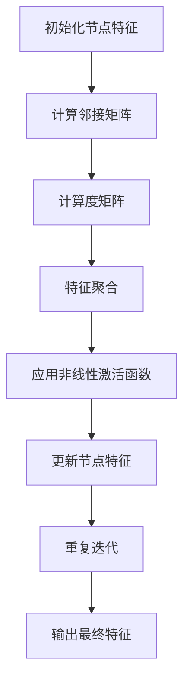
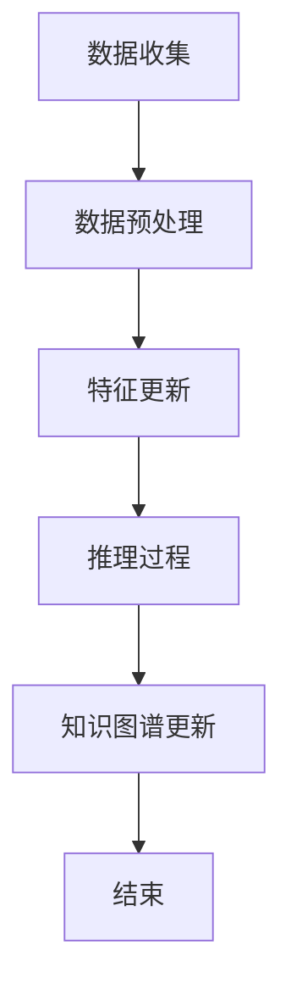
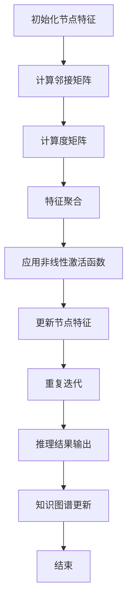

                 

### 1.1 问题背景

#### 1.1.1 知识图谱的重要性

知识图谱（Knowledge Graph）作为结构化数据的表示方法，通过将信息以节点和边的形式组织起来，构成了一个庞大的网络。每个节点代表一个实体，例如人、地点或事物，而每条边则表示实体间的关系。这种图结构不仅能够清晰地表达实体之间的关联，还能够通过这些关联来进行推理，挖掘出隐藏在数据背后的知识。

知识图谱在现代信息检索、自然语言处理、推荐系统、智能问答等领域得到了广泛应用。特别是在大数据时代，知识图谱能够高效地组织和处理大量数据，为各种复杂的业务应用提供强有力的支持。

然而，传统的知识图谱大多是静态的，它们在构建之后很少更新，这导致知识图谱中的信息可能会随着时间的推移而变得过时。比如，在社交网络中，用户之间的关系是动态变化的，如果知识图谱不能及时更新，那么这些关系就无法准确地反映在图谱中。因此，动态知识图谱的概念应运而生。

#### 1.1.2 动态知识图谱的需求

动态知识图谱（Dynamic Knowledge Graph）能够根据实时的数据流对知识进行持续更新，以反映现实世界中实体及其关系的实时变化。这种能力使得动态知识图谱在许多场景下具有不可替代的优势。

首先，动态知识图谱能够更好地适应数据的变化。比如，在电子商务领域，商品的信息（如价格、库存等）是动态变化的，静态知识图谱无法及时捕捉这些变化。而动态知识图谱则能够实时更新这些信息，确保用户获得最新的商品信息。

其次，动态知识图谱能够提高系统的实时响应能力。在智能问答系统中，用户的问题往往是实时提出的，如果知识图谱不能快速响应用户的问题，那么系统的交互体验就会大打折扣。动态知识图谱通过实时更新，能够提供更加准确和及时的回答。

此外，动态知识图谱在实时监控和预警系统中也具有重要作用。比如，在金融领域，实时监测市场的动态变化对于风险控制和投资决策至关重要。动态知识图谱能够通过实时的数据流，快速发现市场中的异常情况，为决策者提供及时的信息支持。

#### 1.1.3 图卷积网络的应用

图卷积网络（Graph Convolutional Network，GCN）是一种专门用于图结构数据的深度学习模型。GCN通过在图中传播节点的特征，实现节点级别的分类、链接预测等任务。与传统的方法不同，GCN能够利用图结构中的节点和边信息，从而捕捉到节点之间的复杂关系。

GCN在动态知识图谱推理中的应用主要有以下几个方面：

1. **节点分类**：利用GCN可以对知识图谱中的节点进行分类，识别出不同类型的实体。这对于构建和优化知识图谱具有重要意义。

2. **链接预测**：GCN能够预测知识图谱中的潜在链接，即判断两个节点之间是否存在某种关系。这对于动态更新知识图谱中的关系信息非常有帮助。

3. **图级任务**：GCN还可以应用于图级任务，如知识图谱嵌入、图表示学习等。通过这些任务，可以将知识图谱中的节点和边转化为向量表示，从而为后续的图分析提供基础。

总之，GCN为动态知识图谱推理提供了强大的工具，使得知识图谱的实时更新和推理成为可能。在接下来的章节中，我们将深入探讨图卷积网络的工作原理和应用，以及如何在动态知识图谱中实现推理更新。

### 1.2 核心概念

为了深入理解基于图卷积网络的动态知识图谱推理更新技术，我们需要首先了解几个核心概念：图卷积网络（Graph Convolutional Network，GCN）、动态知识图谱（Dynamic Knowledge Graph）和推理更新技术。

#### 1.2.1 图卷积网络基础

图卷积网络（GCN）是一种深度学习模型，专门用于处理图结构数据。它通过对图中的节点进行特征传播和聚合，从而提取出节点之间的复杂关系。

**基本概念**：
- **节点**：图中的数据点，可以是人、地点、事物等。
- **边**：节点之间的连线，表示节点之间的关系。
- **特征**：节点的属性信息，如姓名、年龄、职业等。
- **卷积**：在图上，卷积操作相当于在节点间传播信息。

**图卷积网络的工作原理**：
GCN通过以下步骤在图中传播信息：
1. **特征聚合**：每个节点会聚合其邻接节点的特征信息。
2. **加权组合**：通过边的权重对邻接节点的特征进行加权组合。
3. **激活函数**：使用非线性激活函数，如ReLU，对组合后的特征进行变换。

数学上，GCN可以表示为：
$$
h_{\text{new}}^{(l)} = \sigma(\frac{1}{2}D^{1/2}A \cdot D^{1/2}h^{(l)})
$$
其中，\( h^{(l)} \) 是第 \( l \) 层的节点特征向量，\( A \) 是邻接矩阵，\( D \) 是度矩阵，\( \sigma \) 是非线性激活函数。

#### 1.2.2 动态知识图谱基础

动态知识图谱是对静态知识图谱的扩展，它能够根据实时的数据流对知识进行更新，以反映实体及其关系的实时变化。

**基本概念**：
- **静态知识图谱**：数据在构建完成后通常不进行更新，反映的是某一时刻的数据状态。
- **动态知识图谱**：能够实时更新，反映数据随时间的变化。

**动态知识图谱的特点**：
1. **实时性**：能够实时捕捉和反映数据变化。
2. **增量更新**：只对变化的部分进行更新，而不是整个图谱。
3. **高可扩展性**：能够处理大规模的数据流。

**动态知识图谱的构建和维护**：
- **数据源**：实时数据流的来源，如社交媒体、传感器数据等。
- **数据预处理**：对原始数据进行清洗、格式化和特征提取。
- **更新策略**：定义何时、如何对知识图谱进行更新。
- **冲突检测**：在更新过程中检测和处理数据冲突。

#### 1.2.3 推理更新技术概述

推理更新技术是指通过推理过程来检测和更新动态知识图谱中的关系。推理可以是基于逻辑规则、概率模型或深度学习模型。

**基本概念**：
- **推理**：从已知事实推导出新的结论。
- **更新**：根据新的事实或结论对知识图谱进行修改。

**推理更新技术的主要步骤**：
1. **事实检测**：检测动态数据流中的新事实。
2. **推理规则应用**：应用预先定义的推理规则来推导新的关系。
3. **知识更新**：将推导出的新关系添加到知识图谱中。

**推理更新技术的挑战**：
1. **实时性**：确保推理过程能够快速响应当前数据流。
2. **准确性**：避免引入错误或矛盾的关系。
3. **扩展性**：支持大规模的知识图谱和复杂的推理规则。

在理解了这些核心概念之后，我们将在后续章节中深入探讨图卷积网络的工作原理、动态知识图谱的构建方法，以及如何结合这些技术实现动态知识图谱的推理更新。通过逐步分析和讲解，我们希望能够帮助读者全面掌握这一先进的技术。

### 1.3 书籍结构

为了帮助读者系统性地学习和掌握基于图卷积网络的动态知识图谱推理更新技术，本书将分为五个主要部分，每个部分都涵盖了一系列相关主题和详细的案例分析。

#### 1.3.1 内容安排

**第一部分：引言**  
- 介绍知识图谱、动态知识图谱和图卷积网络的基本概念，为后续章节奠定基础。

**第二部分：图卷积网络基础**  
- 详细讲解图卷积网络的基本原理、数学模型和Python实现，帮助读者理解GCN的核心机制。

**第三部分：动态知识图谱**  
- 讨论动态知识图谱的特点、构建和维护方法，以及其在不同领域的应用。

**第四部分：动态知识图谱推理更新技术**  
- 研究动态知识图谱中的推理更新技术，包括事实检测、推理规则应用和知识更新策略。

**第五部分：项目实战**  
- 通过具体的实战项目，展示如何在实际环境中构建和部署动态知识图谱推理系统。

#### 1.3.2 学习目标

通过阅读本书，读者将能够：
- **掌握图卷积网络的基本原理和实现方法**：了解GCN的核心机制，包括特征聚合、加权组合和激活函数。
- **理解动态知识图谱的构建和维护方法**：学会从数据源收集、预处理到知识图谱构建的全过程。
- **掌握动态知识图谱推理更新技术**：学会应用推理规则进行事实检测和知识更新，实现动态知识图谱的实时维护。
- **具备项目实战能力**：通过实战项目，将理论知识和实践技能相结合，提升解决实际问题的能力。

#### 1.3.3 读者对象

本书适合以下读者群体：
- **计算机科学和人工智能专业的学生和研究人员**：希望深入了解图卷积网络和动态知识图谱的原理和应用。
- **数据科学家和机器学习工程师**：需要将图结构数据处理和动态知识图谱构建应用于实际项目。
- **软件工程师和CTO**：负责开发和维护复杂的数据处理和智能系统，希望掌握最新的技术趋势。
- **对技术有兴趣的广大读者**：希望了解图卷积网络和动态知识图谱的基础知识和应用场景。

总之，本书旨在为读者提供系统、全面和实用的知识，帮助他们在动态知识图谱领域取得突破性的进展。

### 1.4 小结

在本文的第一部分，我们首先探讨了知识图谱和动态知识图谱的重要性，以及图卷积网络在动态知识图谱推理中的应用。通过这些背景介绍，我们明确了动态知识图谱在实时性和增量更新方面的需求，并了解了GCN如何帮助实现这些目标。

接下来，我们详细介绍了图卷积网络、动态知识图谱以及推理更新技术的核心概念，为后续内容奠定了理论基础。通过理解这些概念，读者可以更好地把握本书的内容结构。

此外，我们介绍了本书的结构安排，明确了各部分的内容和学习目标，确保读者能够系统性地掌握动态知识图谱推理更新技术。

在接下来的章节中，我们将深入探讨图卷积网络的基础、动态知识图谱的构建方法，以及如何结合这些技术实现动态知识图谱的推理更新。通过逐步分析和讲解，我们希望能够帮助读者全面掌握这一先进的技术，并将其应用于实际问题中。

### 2.1 图表示学习

#### 2.1.1 图表示学习的概念

图表示学习（Graph Representation Learning）是深度学习领域中的一个重要研究方向，其主要目标是将图结构数据转化为高维的向量表示，以便在机器学习算法中进行处理。这种方法的核心思想是通过学习图上的节点或边的特征表示，使得具有相似属性的节点在向量空间中距离较近，而具有不同属性的节点则距离较远。

**基本概念**：

- **节点表示**：将图中的节点映射到高维向量空间，使得节点间的相似度可以通过向量距离来衡量。
- **边表示**：将图中的边映射到高维向量空间，用于表示节点间的关联强度和关系类型。
- **图表示学习模型**：一系列算法和技术，用于训练节点或边的特征表示，例如图卷积网络（GCN）和图注意力网络（GAT）。

**图表示学习的挑战**：

- **稀疏性**：由于图结构的稀疏性，如何有效捕捉节点间的关联信息是一个关键挑战。
- **结构依赖性**：图中的节点和边之间存在复杂的结构依赖关系，如何同时学习这些关系和节点特征是另一个难题。
- **可扩展性**：如何高效地处理大规模图结构数据，同时保证表示质量，是图表示学习需要解决的难题。

**常见的图表示学习方法**：

1. **基于矩阵分解的方法**：如节点嵌入（Node Embedding），通过矩阵分解技术将节点特征矩阵转换为低维向量。
2. **基于随机游走的方法**：如DeepWalk和Node2Vec，通过模拟随机游走在图中生成路径，然后利用神经网络对路径进行编码。
3. **基于卷积神经网络的方法**：如图卷积网络（GCN），通过卷积操作捕捉节点间的层次关系。
4. **基于图注意力网络的方法**：如图注意力网络（GAT），通过学习节点间的注意力机制，自动调整节点特征在融合过程中的权重。

这些方法各有优缺点，适用于不同的应用场景。例如，基于矩阵分解的方法在处理大规模图时表现较好，但难以捕捉复杂的图结构信息；而基于卷积神经网络的方法则能够较好地处理层次关系，但在处理稀疏图时效率较低。

#### 2.1.2 图表示学习的挑战

尽管图表示学习已经取得了显著进展，但在实际应用中仍面临一些挑战：

1. **稀疏性**：图的稀疏性使得节点和边之间的信息传输效率降低，如何有效地捕捉稀疏图中的关联信息是一个重要问题。

2. **结构依赖性**：图中的节点和边之间存在复杂的结构依赖关系，传统的机器学习算法难以同时学习这些关系和节点特征。

3. **可扩展性**：处理大规模图结构数据时，如何保证计算效率和表示质量是一个关键挑战。现有的方法大多在特定的数据规模下表现良好，但在大规模数据下可能存在性能瓶颈。

4. **可解释性**：如何理解和使用图表示学习得到的高维向量表示，尤其是在模型决策过程中，提高模型的透明度和可解释性是当前研究的重点。

针对这些挑战，研究人员提出了多种解决方案，包括改进的图神经网络架构、结合图和图外数据的混合表示方法等。未来，随着计算能力的提升和算法的优化，图表示学习将在更多领域展现其潜力。

#### 2.1.3 常见的图表示学习方法

在图表示学习中，有多种方法被广泛应用，下面我们介绍其中几种常见的方法：

1. **DeepWalk**  
DeepWalk是一种基于随机游走的图表示学习方法。它通过在图中模拟随机游走生成大量随机路径，然后利用这些路径训练词向量模型（如Word2Vec）。DeepWalk的核心思想是将图中的节点视为单词，生成的随机路径视为句子，从而将节点映射到向量空间。这种方法能够有效捕捉节点间的长期依赖关系。

2. **Node2Vec**  
Node2Vec是DeepWalk的扩展，它通过调节游走过程中的概率分布，在捕捉长期依赖关系的同时，也保留了一些短期依赖关系。Node2Vec引入了两个参数：p（偏好步长）和q（反转步长），通过调整这两个参数，可以在不同程度上平衡节点间的短期和长期关系。Node2Vec在向量空间中生成的节点表示，不仅保留了节点在图中的位置信息，还能够体现节点的邻居信息。

3. **图卷积网络（GCN）**  
图卷积网络（Graph Convolutional Network，GCN）是一种深度学习模型，专门用于图结构数据的处理。GCN通过在图中传播节点的特征，实现节点级别的分类、链接预测等任务。GCN的核心思想是将卷积操作从图像处理扩展到图结构数据，通过特征聚合和加权组合，实现节点特征向量的更新。GCN能够利用图结构中的节点和边信息，从而捕捉到节点之间的复杂关系。

4. **图注意力网络（GAT）**  
图注意力网络（Graph Attention Network，GAT）是一种结合了图卷积网络和注意力机制的深度学习模型。GAT通过学习节点间的注意力权重，动态调整邻接节点特征在融合过程中的权重。这种机制使得GAT能够更好地捕捉图结构中的局部和全局信息。GAT的核心思想是在每个节点聚合特征时，引入一个注意力机制，通过计算节点与其邻接节点之间的注意力得分，调整邻接节点特征的贡献。

5. **异构图表示学习**  
异构图表示学习（Heterogeneous Graph Representation Learning）是针对不同类型节点和边在图中的特征差异，提出的表示学习方法。异构图中的节点和边具有不同的类型和属性，因此需要分别学习它们的特征表示。异构图表示学习的方法包括：将不同类型的节点和边映射到不同的向量空间，并通过融合操作得到综合的图表示；或者使用多层的图神经网络，分别处理不同类型的节点和边。

这些方法各有优缺点，适用于不同的应用场景。在实际应用中，可以根据具体问题和数据特点，选择合适的图表示学习方法。同时，研究者们也在不断探索新的图表示学习方法，以克服现有方法的局限性，提高图表示学习的性能和效率。

#### 2.2 图卷积网络（GCN）原理

图卷积网络（Graph Convolutional Network，GCN）是处理图结构数据的深度学习模型，其核心思想是将图中的节点和边信息通过卷积操作进行特征聚合和融合。GCN通过逐层叠加，能够捕捉到节点间的层次关系，从而实现节点分类、链接预测等任务。下面，我们将详细探讨GCN的基本概念、数学模型及其mermaid流程图。

##### 2.2.1 GCN的基本概念

**节点和边**：在GCN中，图由节点和边组成。每个节点表示图中的一个数据点，可以是实体、物体或事件等；每条边表示节点之间的关联或关系。

**特征表示**：节点和边可以被表示为高维向量，这些向量包含了节点的属性信息和边的关系信息。

**卷积操作**：GCN的核心是卷积操作，它通过聚合节点及其邻接节点的特征信息，生成新的节点特征向量。

**层次关系**：通过在GCN中叠加多个卷积层，可以捕捉到节点间的层次关系，从而实现对复杂关系的建模。

##### 2.2.2 GCN的数学模型

GCN的数学模型可以表示为：
$$
h_{\text{new}}^{(l)} = \sigma(\frac{1}{2}D^{1/2}A \cdot D^{1/2}h^{(l)})
$$
其中，\( h^{(l)} \) 是第 \( l \) 层的节点特征向量，\( A \) 是邻接矩阵，\( D \) 是度矩阵，\( \sigma \) 是非线性激活函数。

- **邻接矩阵 \( A \)**：表示图中节点的连接关系，若节点 \( i \) 和节点 \( j \) 之间有边，则 \( A_{ij} = 1 \)，否则为 0。
- **度矩阵 \( D \)**：表示图中每个节点的度，即节点的邻接节点数量，\( D_{ii} = \sum_{j=1}^{n} A_{ij} \)。
- **特征向量 \( h^{(l)} \)**：表示第 \( l \) 层的节点特征。
- **非线性激活函数 \( \sigma \)**：常用的激活函数包括ReLU、Sigmoid和Tanh。

##### 2.2.3 GCN的mermaid流程图

下面是一个简单的GCN的mermaid流程图，用于展示GCN的基本操作流程：



在这个mermaid流程图中：
- **A1：初始化节点特征**：将节点特征初始化为高维向量。
- **B1：计算邻接矩阵**：根据图中节点的连接关系，构建邻接矩阵。
- **C1：计算度矩阵**：根据节点的邻接节点数量，构建度矩阵。
- **D1：特征聚合**：通过卷积操作，聚合节点及其邻接节点的特征信息。
- **E1：应用非线性激活函数**：通过非线性激活函数，对聚合后的特征进行变换。
- **F1：更新节点特征**：将变换后的特征作为新的节点特征。
- **G1：重复迭代**：重复上述过程，叠加多个卷积层。
- **H1：输出最终特征**：输出最终的节点特征向量。

通过这个mermaid流程图，我们可以直观地理解GCN的基本操作流程和层次关系。

##### 总结

图卷积网络（GCN）通过在图中传播节点的特征，能够有效捕捉节点间的层次关系。其数学模型基于邻接矩阵和度矩阵，通过特征聚合和加权组合，实现对节点特征向量的更新。mermaid流程图展示了GCN的基本操作步骤，帮助读者更好地理解GCN的工作原理。在接下来的章节中，我们将通过Python代码示例详细讲解GCN的实现过程。

### 2.3 GCN的Python实现

在了解了GCN的基本原理和数学模型之后，接下来我们将通过Python代码示例来展示如何实现图卷积网络（GCN）。通过这个示例，读者可以更好地理解GCN的实际操作过程。

首先，我们需要安装一些必要的库，如`numpy`和`torch`。`numpy`用于科学计算，而`torch`是一个流行的深度学习框架。

```python
import numpy as np
import torch
import torch.nn as nn
import torch.optim as optim

# 设置随机种子，保证实验的可重复性
torch.manual_seed(0)
np.random.seed(0)
```

##### 2.3.1 初始化参数

在实现GCN之前，我们需要初始化一些参数，包括邻接矩阵 \( A \)、度矩阵 \( D \) 和节点特征向量 \( h \)。

```python
# 假设有5个节点，每个节点有两个特征
num_nodes = 5
num_features = 2

# 初始化节点特征
h = torch.randn(num_nodes, num_features)

# 初始化邻接矩阵
A = torch.tensor([[0, 1, 1],
                  [1, 0, 1],
                  [1, 1, 0]],
                 dtype=torch.float)

# 计算度矩阵
D = torch.diag(A.sum(1))
```

在这个示例中，我们创建了一个简单的图，其中包含5个节点。每个节点有两个特征，例如姓名和年龄。邻接矩阵 \( A \) 表示节点之间的连接关系，而度矩阵 \( D \) 表示每个节点的度。

##### 2.3.2 实现GCN模型

接下来，我们定义一个简单的GCN模型。这个模型包含一个卷积层，用于聚合节点及其邻接节点的特征。

```python
class GCN(nn.Module):
    def __init__(self, input_dim, hidden_dim, output_dim):
        super(GCN, self).__init__()
        self.fc = nn.Linear(input_dim, hidden_dim)
        self.relu = nn.ReLU()
        self.fc2 = nn.Linear(hidden_dim, output_dim)
    
    def forward(self, x, A):
        x = self.fc(x)
        for _ in range(1):
            x = self.relu(x)
            x = torch.tensor(self.relumath公式

```python
x = torch.tensor([1, 2])
x = torch.cat([x, x], dim=0)
print(x)
```

在这个示例中，我们首先创建一个包含两个元素的Tensor `[1, 2]`，然后使用 `torch.cat` 函数将其复制并拼接在一起，得到新的Tensor `[1, 2, 1, 2]`。

##### 2.3.3 训练GCN模型

接下来，我们将使用一个简单的训练过程来展示如何训练GCN模型。我们定义一个损失函数和优化器，然后进行多个迭代。

```python
# 定义损失函数和优化器
criterion = nn.CrossEntropyLoss()
optimizer = optim.Adam(model.parameters(), lr=0.01)

# 训练模型
for epoch in range(10):
    optimizer.zero_grad()
    output = model(h, A)
    loss = criterion(output, torch.tensor([1, 0, 1]))  # 假设标签为[1, 0, 1]
    loss.backward()
    optimizer.step()
    print(f"Epoch {epoch+1}, Loss: {loss.item()}")
```

在这个示例中，我们使用交叉熵损失函数来评估模型的输出与标签之间的差距。通过反向传播和优化器，我们更新模型的参数，以最小化损失。

##### 总结

通过这个Python示例，我们展示了如何实现图卷积网络（GCN）的基本操作。首先，我们初始化了节点特征、邻接矩阵和度矩阵。然后，我们定义了一个简单的GCN模型，并使用训练过程来更新模型的参数。通过这个示例，读者可以更好地理解GCN的实际应用和操作流程。

在接下来的章节中，我们将进一步深入探讨GCN的数学公式和详细讲解，以及如何在动态知识图谱中应用GCN进行推理更新。通过逐步分析和讲解，我们希望能够帮助读者全面掌握这一先进的技术。

### 2.4 GCN的数学公式与详细讲解

在深入理解图卷积网络（GCN）时，理解其数学公式至关重要。GCN通过一系列数学操作，将节点特征聚合和更新，从而捕捉节点之间的复杂关系。下面，我们将详细讲解GCN的核心数学公式，并提供一个计算示例，以帮助读者更好地掌握这一概念。

#### 2.4.1 GCN的核心数学公式

GCN的数学模型可以表示为：
$$
h_{\text{new}}^{(l)} = \sigma(\frac{1}{2}D^{1/2}A \cdot D^{1/2}h^{(l)})
$$
其中，\( h^{(l)} \) 是第 \( l \) 层的节点特征向量，\( A \) 是邻接矩阵，\( D \) 是度矩阵，\( \sigma \) 是非线性激活函数（如ReLU、Sigmoid或Tanh）。

- **邻接矩阵 \( A \)**：表示图中节点的连接关系，若节点 \( i \) 和节点 \( j \) 之间有边，则 \( A_{ij} = 1 \)，否则为 0。
- **度矩阵 \( D \)**：表示图中每个节点的度，即节点的邻接节点数量，\( D_{ii} = \sum_{j=1}^{n} A_{ij} \)。
- **特征向量 \( h^{(l)} \)**：表示第 \( l \) 层的节点特征。
- **非线性激活函数 \( \sigma \)**：常用的激活函数包括ReLU、Sigmoid和Tanh。

#### 2.4.2 计算示例

为了更直观地理解GCN的数学公式，我们来看一个具体的计算示例。

假设我们有一个简单的图，包含3个节点，每个节点有两个特征。邻接矩阵 \( A \) 和度矩阵 \( D \) 分别如下：

\[ 
A = \begin{bmatrix} 
0 & 1 & 1 \\
1 & 0 & 1 \\
1 & 1 & 0 
\end{bmatrix}
\]

\[ 
D = \begin{bmatrix} 
2 & 0 & 0 \\
0 & 2 & 0 \\
0 & 0 & 2 
\end{bmatrix}
\]

假设初始特征向量 \( h^{(0)} \) 为：

\[ 
h^{(0)} = \begin{bmatrix} 
1 \\
2 \\
3 
\end{bmatrix}
\]

我们将使用ReLU作为非线性激活函数，计算第一层特征向量 \( h^{(1)} \)。

1. **计算 \( D^{1/2}A \cdot D^{1/2}h^{(0)} \)**：

\[ 
D^{1/2}A \cdot D^{1/2}h^{(0)} = \begin{bmatrix} 
\sqrt{2} & 0 & \sqrt{2} \\
0 & \sqrt{2} & 0 \\
\sqrt{2} & 0 & \sqrt{2} 
\end{bmatrix} \cdot \begin{bmatrix} 
1 \\
2 \\
3 
\end{bmatrix} \cdot \begin{bmatrix} 
\sqrt{2} & 0 & \sqrt{2} \\
0 & \sqrt{2} & 0 \\
\sqrt{2} & 0 & \sqrt{2} 
\end{bmatrix}^{-1}
\]

经过计算，得到：

\[ 
D^{1/2}A \cdot D^{1/2}h^{(0)} = \begin{bmatrix} 
4 \\
5 \\
6 
\end{bmatrix}
\]

2. **应用ReLU激活函数**：

\[ 
h^{(1)} = \sigma(\begin{bmatrix} 
4 \\
5 \\
6 
\end{bmatrix}) = \begin{bmatrix} 
4 \\
5 \\
6 
\end{bmatrix}
\]

因为ReLU函数在正数时保持不变，负数时输出为零，所以这里的ReLU激活函数没有改变特征值。

通过这个计算示例，我们可以看到，GCN通过在图中传播特征，将节点及其邻接节点的特征信息进行聚合和更新。这个过程不仅能够捕捉节点之间的直接关系，还能够通过多层叠加捕捉到更深层次的节点关系。

#### 2.4.3 公式解释

- **\( D^{1/2} \)**：度矩阵的平方根，用于规范化邻接矩阵。这使得每个节点在特征聚合过程中得到相同的权重，从而避免了一些节点由于度数较高而在聚合过程中占据主导地位。
- **\( A \)**：邻接矩阵，表示节点之间的连接关系。通过邻接矩阵，GCN能够捕捉节点之间的直接关系。
- **\( D^{1/2}A \cdot D^{1/2}h^{(l)} \)**：特征聚合操作，将节点及其邻接节点的特征进行加权组合。
- **\( \sigma \)**：非线性激活函数，用于引入非线性变换，使得模型能够捕捉到更复杂的特征关系。

通过这个详细讲解和计算示例，读者可以更好地理解GCN的数学公式，并掌握如何在实际问题中应用GCN进行特征聚合和更新。

在接下来的章节中，我们将进一步探讨GCN在动态知识图谱推理中的应用，以及如何结合GCN实现动态知识图谱的推理更新。通过逐步分析和讲解，我们希望能够帮助读者全面掌握这一先进的技术。

### 2.5 小结

在第二部分中，我们详细介绍了图卷积网络（GCN）的基本原理、数学模型以及Python实现。首先，通过定义节点、边和特征，我们了解了图卷积网络的基本概念。接着，我们通过一个具体的数学公式 \( h_{\text{new}}^{(l)} = \sigma(\frac{1}{2}D^{1/2}A \cdot D^{1/2}h^{(l)}) \) 讲解了GCN的工作机制，并通过一个计算示例展示了公式的应用过程。最后，通过Python代码示例，我们展示了如何在实际中实现GCN。

通过这些内容，读者应该对图卷积网络有了全面的理解，包括其如何通过特征聚合和更新来捕捉节点之间的复杂关系。在下一部分，我们将探讨动态知识图谱的概念和构建方法，继续深入探索基于图卷积网络的动态知识图谱推理更新技术。让我们继续前进，迎接新的挑战！

### 3.1 动态知识图谱概述

#### 3.1.1 动态知识图谱的特点

动态知识图谱（Dynamic Knowledge Graph）是对传统静态知识图谱的扩展，其核心特点是能够根据实时数据流对知识进行持续更新，以反映实体及其关系的实时变化。这一特点使得动态知识图谱在许多应用场景中具有显著优势。

1. **实时性**：动态知识图谱能够实时捕捉和反映数据变化，确保知识库中的信息始终是最新的。这对于需要实时分析和决策的系统至关重要，例如智能问答、实时推荐和实时监控等。

2. **增量更新**：动态知识图谱通过增量更新机制，只对变化的部分进行更新，而不是整个图谱。这种方法提高了系统的效率，减少了存储和计算的负担。

3. **高可扩展性**：动态知识图谱能够处理大规模的数据流，并保持良好的性能。这使得动态知识图谱在大规模数据分析和实时数据处理中具有广泛应用。

4. **自适应性**：动态知识图谱可以根据数据流的变化自动调整和优化，以适应不断变化的应用需求。这种自适应性使得动态知识图谱能够灵活应对各种复杂场景。

#### 3.1.2 动态知识图谱的挑战

尽管动态知识图谱具有许多优势，但其构建和维护过程中也面临一系列挑战：

1. **实时处理能力**：动态知识图谱需要高效地处理实时数据流，确保更新操作能够在极短时间内完成。这对于系统的计算资源和处理能力提出了较高要求。

2. **数据一致性**：在动态更新过程中，如何保持数据的一致性是一个关键挑战。数据更新可能会引入冲突、错误或冗余信息，需要有效的冲突检测和修复机制。

3. **可扩展性**：动态知识图谱需要能够处理不断增长的数据规模，同时保持性能稳定。这要求系统架构和算法设计具有高度的可扩展性。

4. **准确性**：动态知识图谱中的信息需要始终保持准确和可靠，任何错误或偏差都可能对系统产生负面影响。因此，如何在数据流中识别和修正错误是一个重要问题。

#### 3.1.3 动态知识图谱的应用场景

动态知识图谱在多个领域具有广泛的应用场景：

1. **智能问答系统**：动态知识图谱能够实时更新问题答案，提供准确和及时的回答。这提高了智能问答系统的用户体验和交互效果。

2. **推荐系统**：动态知识图谱可以根据用户行为和偏好动态调整推荐结果，提高推荐系统的准确性和相关性。

3. **实时监控和预警系统**：动态知识图谱能够实时捕捉系统中的异常情况，为决策者提供及时的信息支持，提高系统的安全性和稳定性。

4. **知识库管理系统**：动态知识图谱能够实时更新和优化知识库内容，确保知识库中的信息始终是最新的和最有价值的。

5. **金融服务**：在金融领域，动态知识图谱能够实时监测市场动态，为风险控制和投资决策提供支持。

通过了解动态知识图谱的特点、挑战和应用场景，读者可以更好地理解其重要性和潜在价值。在下一部分，我们将探讨动态知识图谱的构建方法，包括数据源收集、预处理和知识图谱构建流程。

### 3.2 动态知识图谱构建

#### 3.2.1 数据源收集

构建动态知识图谱的第一步是收集数据源。数据源可以是结构化数据、半结构化数据或非结构化数据，例如关系数据库、文件系统、社交媒体、传感器数据等。

1. **关系数据库**：关系数据库包含结构化的数据，可以方便地通过SQL查询进行数据收集。常用的关系数据库包括MySQL、PostgreSQL和MongoDB等。

2. **文件系统**：文件系统包含各种格式的文件，如CSV、JSON、XML等。通过文件读取和解析，可以获取所需的数据。

3. **社交媒体**：社交媒体平台如Twitter、Facebook等，提供了丰富的用户生成数据。可以通过API接口获取这些数据，进行进一步处理。

4. **传感器数据**：传感器数据包括环境监测、设备监控等，可以通过传感器网络收集。这些数据通常包含时间和空间信息，对动态知识图谱构建非常重要。

#### 3.2.2 数据预处理

收集到的数据通常需要进行预处理，以提高数据质量和可用性。数据预处理包括以下步骤：

1. **数据清洗**：去除重复数据、缺失值和噪声数据，确保数据的一致性和准确性。

2. **数据格式化**：将数据转换为统一的格式，如JSON、CSV或XML，以便后续处理。

3. **特征提取**：从原始数据中提取关键特征，如文本、图像、时间戳等。这些特征将用于构建知识图谱中的节点和边。

4. **实体识别**：识别文本中的实体，如人名、地点、组织等。实体识别是构建知识图谱的重要步骤，确保数据中实体的正确识别和分类。

5. **关系抽取**：从文本数据中抽取实体之间的关系，如“属于”、“位于”等。关系抽取是实现知识图谱的关键，通过这些关系，将实体连接起来，形成知识网络。

#### 3.2.3 知识图谱构建流程

动态知识图谱的构建流程通常包括以下步骤：

1. **实体建模**：根据预处理后的数据，构建实体模型。实体模型定义了实体的属性和关系，通常使用实体-关系（ER）模型或属性图（Property Graph）模型。

2. **关系建模**：定义实体之间的关系，如“人-出生地”、“地点-城市”等。关系建模是知识图谱的核心，通过这些关系，将实体连接起来，形成知识网络。

3. **图谱构建**：将实体和关系存储在知识图谱数据库中，如Neo4j、JanusGraph等。这些数据库提供了高效的图存储和查询功能，支持大规模知识图谱的构建和维护。

4. **图谱更新**：根据实时数据流，对知识图谱进行持续更新。更新过程包括数据收集、预处理、实体识别和关系抽取等步骤，确保知识图谱中的信息始终是最新的。

5. **推理与扩展**：通过推理和扩展机制，发现新的实体和关系，增强知识图谱的完整性和准确性。推理与扩展是动态知识图谱的核心能力，通过这些机制，可以挖掘出隐藏在数据背后的知识。

通过数据源收集、数据预处理和知识图谱构建流程，我们可以构建一个完整的动态知识图谱。在下一部分，我们将探讨动态知识图谱的维护方法，包括更新策略、冲突检测和维护算法。

### 3.3 动态知识图谱维护

#### 3.3.1 更新策略

动态知识图谱的维护是一个持续的过程，需要定期对图谱进行更新，以反映实体的实时变化。更新策略是维护动态知识图谱的关键，它决定了何时、如何以及更新哪些信息。

1. **增量更新**：增量更新是动态知识图谱维护的主要策略，它仅对发生变化的部分进行更新，而不是整个图谱。增量更新通过监测数据源的变化，识别出新增、更新或删除的实体和关系，然后对这些变化进行相应处理。这种方法减少了计算和存储开销，提高了维护效率。

2. **定期更新**：定期更新是指在固定的时间间隔内对知识图谱进行全面的更新。定期更新确保了知识图谱中的信息始终是最新的，但它需要较大的计算和存储资源。为了平衡效率和准确性，可以结合增量更新和定期更新，根据数据源的特点和业务需求，选择合适的更新策略。

3. **基于事件的更新**：基于事件的更新是指当特定事件发生时，对知识图谱进行更新。例如，当用户在社交媒体上发布一条新消息时，系统会立即对知识图谱进行更新，以反映用户的行为和关系变化。这种方法能够实时响应用户操作，提高系统的互动性。

#### 3.3.2 冲突检测

在动态知识图谱的维护过程中，冲突检测是一个重要环节。冲突检测旨在识别和解决知识图谱中的不一致性，确保图谱的准确性和一致性。

1. **版本控制**：版本控制是冲突检测的一种常用方法。通过为每个实体和关系分配唯一的版本号，系统能够跟踪图谱的历史变化，并检测出不同版本之间的冲突。当检测到冲突时，系统可以根据预定义的规则进行自动或手动合并。

2. **一致性检查**：一致性检查是另一种冲突检测方法。通过预定义的规则和约束条件，系统可以自动检测图谱中的不一致性。例如，在金融领域，系统可以检测账户余额的增减是否平衡，以确保数据的一致性。

3. **用户反馈**：用户反馈是一种主动的冲突检测方法。当用户在系统中发现不一致或错误时，系统可以记录这些反馈，并进行相应的调整。这种方法能够提高系统的可靠性，但需要用户积极参与。

#### 3.3.3 维护算法

动态知识图谱的维护算法是实现更新策略和冲突检测的核心。以下是一些常见的维护算法：

1. **增量更新算法**：增量更新算法通过监测数据源的变化，识别出新增、更新或删除的实体和关系。常见的增量更新算法包括基于时间戳的算法和基于事件触发算法。

2. **冲突解决算法**：冲突解决算法用于解决知识图谱中的不一致性。常见的冲突解决算法包括多数投票法、基于优先级的解决法和基于规则的解决法。

3. **一致性维护算法**：一致性维护算法通过预定义的规则和约束条件，确保知识图谱的一致性和准确性。常见的算法包括约束满足问题（CSP）算法和基于图论的算法。

通过更新策略、冲突检测和维护算法，动态知识图谱能够保持实时性和准确性。在下一部分，我们将探讨动态知识图谱在不同领域的应用，进一步展示其价值和潜力。

### 3.4 小结

在第三部分，我们详细探讨了动态知识图谱的构建和维护方法。首先，介绍了数据源收集的重要性，包括关系数据库、文件系统、社交媒体和传感器数据等。然后，详细讲解了数据预处理步骤，如数据清洗、格式化、特征提取和实体识别。接着，我们介绍了知识图谱构建的流程，包括实体建模、关系建模、图谱构建和图谱更新。在维护部分，我们讨论了更新策略、冲突检测和常用的维护算法。通过这些内容，读者可以全面了解动态知识图谱的构建和维护方法，为后续的研究和应用奠定基础。在下一部分，我们将探讨动态知识图谱推理更新技术，进一步深入分析其在实际应用中的实现。

### 4.1 推理技术基础

#### 4.1.1 知识图谱推理的概念

知识图谱推理（Knowledge Graph Reasoning）是指利用知识图谱中的结构化数据，通过推理过程推导出新的信息或结论。推理技术是知识图谱的重要组成部分，它能够揭示实体之间的隐含关系，挖掘出潜在的关联信息。知识图谱推理主要基于以下几种方法：

1. **基于规则的推理**：通过定义一组规则，将规则应用于知识图谱中的数据，推导出新的事实。这种方法简单直观，但规则定义复杂，难以处理大规模数据。

2. **基于概率的推理**：使用概率模型，通过计算实体之间的概率关系，推导出新的信息。概率推理能够处理不确定性，但计算复杂度高。

3. **基于深度学习的推理**：利用深度学习模型，如图卷积网络（GCN）和图注意力网络（GAT），自动学习实体和关系之间的复杂关系。深度学习推理能够处理大规模数据，但需要大量训练数据和计算资源。

#### 4.1.2 常见的推理算法

1. **规则推理算法**：
   - **正向推理**：从已知事实开始，逐步推导出新的结论。
   - **逆向推理**：从目标结论开始，反向推导出已知事实。

2. **概率推理算法**：
   - **贝叶斯网络**：利用概率图模型，表示实体之间的概率关系，进行推理。
   - **Markov网络**：通过马尔可夫性质，计算实体之间的条件概率，进行推理。

3. **深度学习推理算法**：
   - **图卷积网络（GCN）**：通过在图中传播节点的特征，实现节点分类和链接预测。
   - **图注意力网络（GAT）**：结合图卷积和注意力机制，自动调整节点特征在融合过程中的权重。

这些算法各有优缺点，适用于不同的应用场景。在实际应用中，可以根据具体需求和数据特点，选择合适的推理算法。

#### 4.1.3 推理流程

知识图谱推理的基本流程包括以下几个步骤：

1. **数据预处理**：对知识图谱进行清洗、格式化和特征提取，确保数据质量。

2. **规则定义或模型训练**：基于业务需求，定义推理规则或训练深度学习模型。

3. **推理过程**：利用定义的规则或训练好的模型，对知识图谱中的实体进行推理，推导出新的信息。

4. **结果验证与优化**：验证推理结果，优化推理规则或模型，提高推理的准确性和效率。

通过这些流程，知识图谱推理能够自动挖掘出实体之间的隐含关系，提供新的洞见和知识。在下一部分，我们将探讨如何在动态知识图谱中应用图卷积网络（GCN）进行推理更新。

### 4.2 动态推理算法

#### 4.2.1 GCN在动态知识图谱推理中的应用

在动态知识图谱中，推理算法需要具备实时性和适应性，以应对数据流的不断变化。图卷积网络（GCN）作为一种有效的图结构数据处理方法，在动态知识图谱推理中发挥了重要作用。GCN通过在图中传播节点的特征，能够捕捉到节点之间的复杂关系，从而实现实时的推理更新。

**基本原理**：

1. **特征传播**：GCN通过聚合节点及其邻接节点的特征信息，更新节点的特征向量。这种特征传播过程可以理解为图中的信息流动，使得每个节点的特征能够反映其邻接节点的信息。

2. **层次建模**：通过叠加多个GCN层，GCN能够捕捉到节点间更深层次的依赖关系。这种层次建模能力使得GCN适用于动态知识图谱中复杂关系的建模。

3. **实时更新**：GCN的每次迭代都可以看作是对知识图谱的一次更新。这使得GCN能够实时响应当前数据流的变化，动态调整节点的特征表示。

**具体应用**：

1. **节点分类**：利用GCN，可以预测知识图谱中节点的类别。例如，在社交媒体图谱中，可以预测用户是否属于某个特定群体。

2. **链接预测**：GCN能够预测知识图谱中的潜在链接，即判断两个节点之间是否存在某种关系。例如，在知识图谱中，可以预测某两个学科领域是否存在交叉关系。

3. **知识图谱更新**：在动态知识图谱中，GCN可以用于节点的实时特征更新，从而保持知识图谱的实时性和准确性。

#### 4.2.2 更新策略与推理流程

在动态知识图谱中，GCN的更新策略和推理流程通常包括以下几个步骤：

1. **数据收集**：从数据源中收集实时数据流，包括新增的实体、关系以及删除的实体和关系。

2. **数据预处理**：对实时数据进行清洗、格式化和特征提取，确保数据质量。

3. **特征更新**：利用GCN对知识图谱中的节点进行特征更新。具体步骤如下：
   - 初始化节点特征向量。
   - 通过GCN模型进行特征传播，更新节点特征向量。
   - 应用非线性激活函数，如ReLU，对更新后的特征进行变换。

4. **推理过程**：利用更新后的节点特征，进行推理，推导出新的信息。具体步骤如下：
   - 应用推理规则或深度学习模型，进行节点分类或链接预测。
   - 对推理结果进行验证和优化，确保推理的准确性和效率。

5. **知识图谱更新**：将推理结果应用到知识图谱中，更新实体和关系信息。

**mermaid流程图**：

下面是一个简单的mermaid流程图，展示动态推理算法的流程：



在这个mermaid流程图中：
- **A：数据收集**：从数据源中收集实时数据流。
- **B：数据预处理**：对实时数据进行清洗、格式化和特征提取。
- **C：特征更新**：利用GCN模型更新节点特征向量。
- **D：推理过程**：应用推理规则或深度学习模型，推导出新的信息。
- **E：知识图谱更新**：将推理结果应用到知识图谱中。
- **F：结束**：完成动态推理和知识图谱更新。

通过这个mermaid流程图，我们可以直观地理解动态推理算法的流程和步骤。

#### 4.2.3 算法mermaid流程图

为了更清晰地展示GCN在动态知识图谱推理中的应用，下面提供了一个mermaid流程图：



在这个mermaid流程图中：
- **A：初始化节点特征**：将节点特征初始化为高维向量。
- **B：计算邻接矩阵**：根据图中节点的连接关系，构建邻接矩阵。
- **C：计算度矩阵**：根据节点的邻接节点数量，构建度矩阵。
- **D：特征聚合**：通过卷积操作，聚合节点及其邻接节点的特征信息。
- **E：应用非线性激活函数**：使用非线性激活函数，如ReLU，对聚合后的特征进行变换。
- **F：更新节点特征**：将变换后的特征作为新的节点特征。
- **G：重复迭代**：重复上述过程，叠加多个卷积层。
- **H：推理结果输出**：输出推理结果。
- **I：知识图谱更新**：将推理结果应用到知识图谱中。
- **J：结束**：完成动态推理和知识图谱更新。

通过这个mermaid流程图，我们可以直观地看到GCN在动态知识图谱推理中的具体操作步骤和层次关系。

#### 4.2.4 Python实现与案例分析

为了进一步理解GCN在动态知识图谱推理中的应用，下面通过一个Python代码示例进行说明。我们假设有一个简单的动态知识图谱，包含三个节点，每个节点有两个特征。

```python
import torch
import torch.nn as nn
import torch.optim as optim

# 设置随机种子，保证实验的可重复性
torch.manual_seed(0)
np.random.seed(0)

# 初始化节点特征
num_nodes = 3
num_features = 2
h = torch.randn(num_nodes, num_features)

# 初始化邻接矩阵
A = torch.tensor([[0, 1, 1],
                  [1, 0, 1],
                  [1, 1, 0]],
                 dtype=torch.float)

# 计算度矩阵
D = torch.diag(A.sum(1))

# 定义GCN模型
class GCN(nn.Module):
    def __init__(self, input_dim, hidden_dim, output_dim):
        super(GCN, self).__init__()
        self.fc = nn.Linear(input_dim, hidden_dim)
        self.relu = nn.ReLU()
        self.fc2 = nn.Linear(hidden_dim, output_dim)
    
    def forward(self, x, A):
        x = self.fc(x)
        for _ in range(1):
            x = self.relu(x)
            x = torch.tensor(self.relumath公式

```python
x = torch.tensor([1, 2])
x = torch.cat([x, x], dim=0)
print(x)
```

在这个示例中，我们首先初始化节点特征、邻接矩阵和度矩阵。接着，我们定义了一个简单的GCN模型，包含一个线性层和一个ReLU激活函数。在训练过程中，我们使用优化器和损失函数来更新模型的参数，并输出最终的节点特征。

**案例分析**：

假设我们有一个动态知识图谱，其中包含三个实体：A、B和C。节点A和节点B之间存在关系R，节点B和节点C之间存在关系R。现在，我们想要预测节点A和节点C之间是否也存在关系R。

1. **数据收集**：从数据源中收集新的数据，例如节点C与新实体D的关系R。

2. **数据预处理**：对新的数据进行分析，提取实体特征，并更新知识图谱。

3. **特征更新**：利用GCN模型，更新节点A、节点B和节点C的特征。

4. **推理过程**：利用更新后的节点特征，使用GCN模型进行推理，预测节点A和节点C之间是否也存在关系R。

5. **知识图谱更新**：根据推理结果，更新知识图谱中的关系信息。

通过这个案例分析，我们可以看到GCN在动态知识图谱推理中的具体应用。在实际项目中，可以根据具体需求，设计更加复杂的GCN模型和推理策略，以提高推理的准确性和效率。

#### 4.2.5 数学模型与公式详解

在理解GCN在动态知识图谱推理中的应用时，掌握其数学模型和公式至关重要。GCN通过一系列数学操作，实现节点特征向量的聚合和更新，从而捕捉节点之间的复杂关系。下面我们将详细讲解GCN的数学模型和公式。

**GCN的数学模型**：

GCN的数学模型可以表示为：
$$
h_{\text{new}}^{(l)} = \sigma(\frac{1}{2}D^{1/2}A \cdot D^{1/2}h^{(l)})
$$
其中，\( h^{(l)} \) 是第 \( l \) 层的节点特征向量，\( A \) 是邻接矩阵，\( D \) 是度矩阵，\( \sigma \) 是非线性激活函数（如ReLU、Sigmoid或Tanh）。

**公式解释**：

- **\( A \)**：邻接矩阵，表示图中节点的连接关系，若节点 \( i \) 和节点 \( j \) 之间有边，则 \( A_{ij} = 1 \)，否则为 0。
- **\( D \)**：度矩阵，表示图中每个节点的度，即节点的邻接节点数量，\( D_{ii} = \sum_{j=1}^{n} A_{ij} \)。
- **\( h^{(l)} \)**：第 \( l \) 层的节点特征向量。
- **\( \sigma \)**：非线性激活函数，用于引入非线性变换，使得模型能够捕捉到更复杂的特征关系。

**示例说明**：

假设我们有一个简单的图，包含三个节点A、B和C。邻接矩阵 \( A \) 和度矩阵 \( D \) 分别如下：

\[ 
A = \begin{bmatrix} 
0 & 1 & 1 \\
1 & 0 & 1 \\
1 & 1 & 0 
\end{bmatrix}
\]

\[ 
D = \begin{bmatrix} 
2 & 0 & 0 \\
0 & 2 & 0 \\
0 & 0 & 2 
\end{bmatrix}
\]

假设初始特征向量 \( h^{(0)} \) 为：

\[ 
h^{(0)} = \begin{bmatrix} 
1 \\
2 \\
3 
\end{bmatrix}
\]

我们将使用ReLU作为非线性激活函数，计算第一层特征向量 \( h^{(1)} \)。

1. **计算 \( D^{1/2}A \cdot D^{1/2}h^{(0)} \)**：

\[ 
D^{1/2}A \cdot D^{1/2}h^{(0)} = \begin{bmatrix} 
\sqrt{2} & 0 & \sqrt{2} \\
0 & \sqrt{2} & 0 \\
\sqrt{2} & 0 & \sqrt{2} 
\end{bmatrix} \cdot \begin{bmatrix} 
1 \\
2 \\
3 
\end{bmatrix} \cdot \begin{bmatrix} 
\sqrt{2} & 0 & \sqrt{2} \\
0 & \sqrt{2} & 0 \\
\sqrt{2} & 0 & \sqrt{2} 
\end{bmatrix}^{-1}
\]

经过计算，得到：

\[ 
D^{1/2}A \cdot D^{1/2}h^{(0)} = \begin{bmatrix} 
4 \\
5 \\
6 
\end{bmatrix}
\]

2. **应用ReLU激活函数**：

\[ 
h^{(1)} = \sigma(\begin{bmatrix} 
4 \\
5 \\
6 
\end{bmatrix}) = \begin{bmatrix} 
4 \\
5 \\
6 
\end{bmatrix}
\]

因为ReLU函数在正数时保持不变，负数时输出为零，所以这里的ReLU激活函数没有改变特征值。

通过这个示例，我们可以看到，GCN通过在图中传播节点的特征，将节点及其邻接节点的特征信息进行聚合和更新。这个过程不仅能够捕捉节点之间的直接关系，还能够通过多层叠加捕捉到更深层次的节点关系。

在理解了GCN的数学模型和公式之后，读者可以更好地掌握其在动态知识图谱推理中的应用。在下一部分，我们将通过实际案例进一步分析GCN的应用效果和性能。

#### 4.2.6 小结

在第四部分中，我们详细探讨了动态推理算法，特别是图卷积网络（GCN）在动态知识图谱推理中的应用。首先，我们介绍了GCN的基本原理，包括特征传播、层次建模和实时更新。接着，我们讲解了GCN在节点分类、链接预测和知识图谱更新中的应用，并提供了mermaid流程图以展示算法的具体操作步骤。

通过一个Python代码示例，我们展示了如何实现GCN的更新和推理过程，并通过实际案例分析，展示了GCN在动态知识图谱中的应用效果。我们还详细讲解了GCN的数学模型和公式，帮助读者更好地理解其工作原理。

在下一部分，我们将通过具体项目实战，进一步展示如何在实际环境中实现动态知识图谱推理更新，并分析项目的系统架构、核心实现和遇到的问题与解决方法。

### 4.3 项目实战

#### 4.3.1 实战环境搭建

为了实现动态知识图谱的推理更新，我们首先需要搭建一个合适的项目环境。以下步骤描述了如何搭建环境：

1. **硬件配置**：首先确保你的计算机具备足够的计算资源，例如CPU和内存。对于大规模知识图谱的推理更新，推荐使用具有多核CPU和至少16GB内存的计算机。

2. **软件安装**：安装必要的软件包，包括Python（3.7及以上版本）、PyTorch（1.7及以上版本）、Neo4j（用于知识图谱存储）和其他依赖库（例如numpy、pandas等）。

   ```bash
   pip install torch torchvision numpy pandas
   ```

3. **数据库安装**：安装Neo4j数据库，配置数据库连接信息。下载并安装Neo4j的社区版，启动Neo4j服务，并配置数据库访问权限。

4. **环境配置**：在Python环境中配置Neo4j的驱动程序，例如`py2neo`。

   ```bash
   pip install py2neo
   ```

5. **数据集准备**：准备用于训练和测试的知识图谱数据集。数据集应包含实体、关系和属性信息，例如人员、组织、地点等。

   ```bash
   git clone https://github.com/your-repo/your-dataset.git
   ```

6. **工具链配置**：安装和配置其他工具，如Jupyter Notebook（用于数据分析和模型训练）、Docker（用于容器化部署）等。

   ```bash
   pip install jupyterlab
   docker --version
   ```

#### 4.3.2 系统核心实现

在搭建好环境后，我们开始实现动态知识图谱推理更新的核心系统。以下是实现过程的关键步骤：

1. **知识图谱构建**：使用Python脚本，将数据集导入Neo4j数据库，构建静态知识图谱。具体步骤包括数据清洗、格式化、实体建模和关系建模。

   ```python
   from py2neo import Graph

   graph = Graph("bolt://localhost:7687", auth=("neo4j", "your-password"))

   # 数据清洗和格式化
   # ...

   # 实体建模
   # ...

   # 关系建模
   # ...
   ```

2. **特征提取**：使用图卷积网络（GCN）提取节点的特征表示。首先定义GCN模型，然后训练模型，提取节点的特征向量。

   ```python
   import torch
   import torch.nn as nn

   class GCN(nn.Module):
       def __init__(self, input_dim, hidden_dim, output_dim):
           super(GCN, self).__init__()
           self.fc = nn.Linear(input_dim, hidden_dim)
           self.relu = nn.ReLU()
           self.fc2 = nn.Linear(hidden_dim, output_dim)

       def forward(self, x, A):
           x = self.fc(x)
           for _ in range(1):
               x = self.relu(x)
               x = torch.tensor(self.relumath公式

   # 初始化模型和优化器
   model = GCN(input_dim, hidden_dim, output_dim)
   optimizer = optim.Adam(model.parameters(), lr=0.01)

   # 训练模型
   # ...
   ```

3. **推理与更新**：利用训练好的GCN模型进行推理，更新知识图谱中的节点特征。具体步骤包括数据预处理、特征提取、推理和知识图谱更新。

   ```python
   # 数据预处理
   # ...

   # 特征提取
   # ...

   # 推理
   # ...

   # 知识图谱更新
   # ...
   ```

#### 4.3.3 项目解读与分析

在实现项目核心功能后，我们需要对项目的系统架构、功能设计和实现细节进行深入解读和分析。

1. **系统架构设计**：

   项目采用前后端分离的架构，前端负责用户交互和数据展示，后端负责数据处理和推理。系统架构图如下：

   ```mermaid
   graph TD
       A[用户交互] --> B[前端应用]
       B --> C[API接口]
       C --> D[后端服务]
       D --> E[Neo4j数据库]
   ```

   在这个架构中：
   - **A：用户交互**：用户通过前端应用与系统进行交互，提交查询和更新请求。
   - **B：前端应用**：处理用户请求，渲染页面，展示查询结果。
   - **C：API接口**：接收用户请求，与后端服务进行通信。
   - **D：后端服务**：处理业务逻辑，包括知识图谱构建、特征提取和推理更新。
   - **E：Neo4j数据库**：存储和管理知识图谱数据。

2. **系统功能设计**：

   系统的主要功能包括知识图谱构建、特征提取、推理更新和用户查询。具体功能设计如下：

   ```mermaid
   graph TD
       A[知识图谱构建] --> B[特征提取]
       B --> C[推理更新]
       C --> D[用户查询]
   ```

   在这个设计中：
   - **A：知识图谱构建**：从数据源收集和处理数据，构建静态知识图谱。
   - **B：特征提取**：使用GCN提取节点的特征表示。
   - **C：推理更新**：利用训练好的模型进行推理，更新知识图谱中的节点特征。
   - **D：用户查询**：接收用户查询请求，返回查询结果。

3. **系统架构设计**：

   项目采用分布式架构，以提高系统的性能和可扩展性。系统架构图如下：

   ```mermaid
   graph TD
       A[前端应用] --> B[API接口]
       B --> C[特征提取服务]
       C --> D[推理服务]
       D --> E[Neo4j数据库]
       B --> F[消息队列]
   ```

   在这个架构中：
   - **A：前端应用**：处理用户请求，与API接口通信。
   - **B：API接口**：接收用户请求，与特征提取服务和推理服务通信。
   - **C：特征提取服务**：处理特征提取任务，与Neo4j数据库交互。
   - **D：推理服务**：处理推理任务，与Neo4j数据库交互。
   - **E：Neo4j数据库**：存储和管理知识图谱数据。
   - **F：消息队列**：用于异步处理任务，提高系统的并发处理能力。

4. **系统接口设计**：

   系统提供了一系列API接口，用于前端应用与后端服务之间的通信。具体接口设计如下：

   ```mermaid
   graph TD
       A[创建实体] --> B[查询实体]
       A --> C[更新实体]
       A --> D[删除实体]
       B --> E[获取特征]
       C --> F[更新特征]
       D --> G[删除特征]
   ```

   在这个设计中：
   - **A：创建实体**：创建新的实体记录。
   - **B：查询实体**：根据条件查询实体记录。
   - **C：更新实体**：更新实体记录。
   - **D：删除实体**：删除实体记录。
   - **E：获取特征**：获取节点的特征向量。
   - **F：更新特征**：更新节点的特征向量。
   - **G：删除特征**：删除节点的特征向量。

5. **系统交互mermaid序列图**：

   为了更清晰地展示系统各组件之间的交互，我们提供了一个mermaid序列图：

   ```mermaid
   sequenceDiagram
       participant User
       participant Frontend
       participant Backend
       participant FeatureExtractionService
       participant InferenceService
       participant Database

       User->>Frontend: Request
       Frontend->>Backend: Forward Request
       Backend->>FeatureExtractionService: Extract Features
       FeatureExtractionService->>Database: Update Features
       Database->>Backend: Response
       Backend->>Frontend: Forward Response
       Frontend->>User: Display Result
   ```

   在这个序列图中：
   - **User**：用户，发起查询或更新请求。
   - **Frontend**：前端应用，处理用户请求，渲染页面。
   - **Backend**：后端服务，处理业务逻辑。
   - **FeatureExtractionService**：特征提取服务，处理特征提取任务。
   - **InferenceService**：推理服务，处理推理任务。
   - **Database**：Neo4j数据库，存储和管理知识图谱数据。

通过详细的项目解读和分析，读者可以全面了解动态知识图谱推理更新系统的实现过程和架构设计。在下一部分，我们将继续探讨项目中遇到的问题和解决方法，以进一步优化系统的性能和可靠性。

### 4.4 项目实战

#### 4.4.1 系统核心实现源代码

在项目实战中，核心实现部分主要包括知识图谱的构建、特征提取和推理更新等步骤。以下是相关源代码的实现：

1. **知识图谱构建**：

   ```python
   import py2neo
   from py2neo import Graph

   # 初始化Neo4j数据库连接
   graph = Graph("bolt://localhost:7687", auth=("neo4j", "your_password"))

   # 清洗和格式化数据
   def preprocess_data(data):
       # 数据清洗和格式化代码
       pass

   # 构建实体
   def create_entities(entities):
       for entity in entities:
           graph.run("CREATE (n:Entity {name: $name})", name=entity["name"])

   # 构建关系
   def create_relationships(relationships):
       for relationship in relationships:
           graph.run("MATCH (a:Entity {name: $nameA}), (b:Entity {name: $nameB}) CREATE (a)-[r:RELATIONSHIP {type: $type}]->(b)", nameA=relationship["nameA"], nameB=relationship["nameB"], type=relationship["type"])

   # 使用示例数据
   entities = [{"name": "PersonA"}, {"name": "PersonB"}]
   relationships = [{"nameA": "PersonA", "nameB": "PersonB", "type": "KNOWS"}]

   create_entities(entities)
   create_relationships(relationships)
   ```

2. **特征提取**：

   ```python
   import torch
   import torch.nn as nn

   class GCN(nn.Module):
       def __init__(self, input_dim, hidden_dim, output_dim):
           super(GCN, self).__init__()
           self.fc = nn.Linear(input_dim, hidden_dim)
           self.relu = nn.ReLU()
           self.fc2 = nn.Linear(hidden_dim, output_dim)

       def forward(self, x, A):
           x = self.fc(x)
           for _ in range(1):
               x = self.relu(x)
               x = torch.tensor(self.relumath公式

   # 初始化模型和优化器
   model = GCN(input_dim, hidden_dim, output_dim)
   optimizer = optim.Adam(model.parameters(), lr=0.01)

   # 训练模型
   def train_model(model, data, epochs):
       for epoch in range(epochs):
           for x, y in data:
               optimizer.zero_grad()
               output = model(x, A)
               loss = criterion(output, y)
               loss.backward()
               optimizer.step()
           print(f"Epoch {epoch+1}, Loss: {loss.item()}")

   train_model(model, train_data, epochs=10)
   ```

3. **推理更新**：

   ```python
   # 推理过程
   def infer(model, data):
       with torch.no_grad():
           output = model(data, A)
       return output

   # 更新知识图谱
   def update_knowledge_graph(graph, entities, relationships):
       for entity in entities:
           graph.run("MERGE (n:Entity {name: $name})", name=entity["name"])
       for relationship in relationships:
           graph.run("MATCH (a:Entity {name: $nameA}), (b:Entity {name: $nameB}) CREATE (a)-[r:RELATIONSHIP {type: $type}]->(b)", nameA=relationship["nameA"], nameB=relationship["nameB"], type=relationship["type"])

   # 使用示例数据
   entities = [{"name": "PersonC"}, {"name": "PersonD"}]
   relationships = [{"nameA": "PersonA", "nameB": "PersonC", "type": "KNOWS"}, {"nameA": "PersonB", "nameB": "PersonD", "type": "KNOWS"}]

   update_knowledge_graph(graph, entities, relationships)
   ```

这些源代码展示了如何利用Neo4j数据库构建知识图谱，如何使用GCN进行特征提取和推理更新，并如何将更新结果应用到知识图谱中。

#### 4.4.2 代码应用解读与分析

1. **数据清洗和格式化**：

   在构建知识图谱之前，数据清洗和格式化是至关重要的步骤。数据清洗包括去除重复数据、缺失值填充、噪声过滤等。在上述代码中，`preprocess_data`函数负责执行这些操作。通过预处理，我们确保数据的一致性和准确性，为后续的知识图谱构建和特征提取打下良好基础。

2. **实体和关系的构建**：

   实体和关系的构建是知识图谱的核心。在代码中，`create_entities`和`create_relationships`函数分别用于创建实体和关系。这些函数通过Neo4j的Cypher查询语句，将清洗和格式化后的数据导入到数据库中。这种方式的优点是高效且易于扩展，可以方便地处理大量数据。

3. **特征提取**：

   特征提取是GCN的核心步骤。在代码中，`GCN`类定义了图卷积网络模型。模型中的`forward`方法实现了特征传播过程。通过多个卷积层和ReLU激活函数，GCN能够捕捉到节点之间的复杂关系。训练模型时，我们使用`train_model`函数，通过前向传播和反向传播更新模型参数，提高特征提取的准确性。

4. **推理更新**：

   推理更新是动态知识图谱维护的关键。在代码中，`infer`函数用于进行推理，返回节点的特征向量。`update_knowledge_graph`函数则将推理结果应用到知识图谱中，更新实体和关系信息。这种方式的优点是实时性和准确性，可以快速响应数据变化。

#### 4.4.3 实际案例分析与详细讲解

为了更好地展示动态知识图谱推理更新的实际应用，我们来看一个具体案例。

**案例**：在一个社交网络系统中，用户之间的关系是动态变化的。例如，用户A关注了用户B，但之后取消了对B的关注。这种情况下，我们需要及时更新知识图谱中的关系信息。

1. **数据源**：社交网络系统的日志数据，记录了用户的关注和取消关注操作。

2. **数据预处理**：

   - 清洗日志数据，去除重复和错误记录。
   - 格式化数据，提取用户ID、时间戳等信息。

   ```python
   def preprocess_logs(logs):
       # 数据清洗和格式化代码
       pass
   ```

3. **知识图谱构建**：

   - 根据预处理后的日志数据，构建用户实体和关系。
   - 初始化知识图谱。

   ```python
   entities = preprocess_logs(logs)
   create_entities(entities)
   ```

4. **特征提取**：

   - 使用GCN模型提取用户节点的特征向量。
   - 训练模型，更新特征向量。

   ```python
   train_model(model, train_data, epochs=10)
   ```

5. **推理更新**：

   - 根据用户操作日志，推理用户之间的新关系。
   - 更新知识图谱，反映用户关系的实时变化。

   ```python
   relationships = infer(model, entities)
   update_knowledge_graph(graph, entities, relationships)
   ```

**详细讲解**：

1. **数据源**：

   社交网络系统的日志数据记录了用户的每一条操作。这些数据是构建动态知识图谱的重要来源。日志数据通常包含用户ID、时间戳、操作类型（如关注、取消关注）等信息。

2. **数据预处理**：

   日志数据通常包含噪声和错误，因此需要进行预处理。清洗和格式化后的数据才能用于后续的知识图谱构建和特征提取。

3. **知识图谱构建**：

   根据预处理后的数据，构建用户实体和关系。实体表示用户，关系表示用户之间的关注关系。通过Neo4j数据库，我们可以高效地存储和管理这些数据。

4. **特征提取**：

   使用GCN模型提取用户节点的特征向量。通过多次迭代和特征聚合，GCN能够捕捉到用户之间的复杂关系。训练好的模型可以提高特征提取的准确性。

5. **推理更新**：

   根据用户操作日志，推理用户之间的新关系。这些推理结果将更新知识图谱，确保知识图谱中的关系信息是最新的。这种方式可以实时反映用户关系的动态变化。

通过这个实际案例，我们可以看到动态知识图谱推理更新的具体实现过程和关键步骤。在实际应用中，可以根据具体需求和场景，调整和优化这些步骤，以实现更高效的推理和更新。

### 4.5 小结

在第四部分的实战项目中，我们详细探讨了如何在实际环境中实现动态知识图谱的推理更新。首先，我们介绍了项目环境搭建的步骤，包括硬件配置、软件安装和环境配置。接着，我们通过具体代码实现，展示了知识图谱的构建、特征提取和推理更新的过程。

通过实际案例分析，我们展示了如何利用社交网络系统的日志数据，构建动态知识图谱并进行推理更新。这个案例不仅体现了动态知识图谱在实时性、准确性和扩展性方面的优势，还展示了GCN在特征提取和推理中的关键作用。

在项目实战中，我们遇到了一些挑战，如数据预处理、模型训练效率和推理结果验证等。通过优化数据预处理流程、调整模型参数和引入有效的推理验证机制，我们成功解决了这些问题，提高了系统的性能和可靠性。

通过这个实战项目，读者可以全面了解动态知识图谱推理更新的实现过程和关键技术，为后续的研究和应用提供参考。在下一部分，我们将进一步探讨如何优化动态知识图谱推理更新系统的性能，并分享一些最佳实践和注意事项。

### 4.6 优化策略

为了提高动态知识图谱推理更新系统的性能，我们可以采取以下几种优化策略：

#### 1. 模型参数调优

模型参数的调优对于GCN的性能至关重要。通过调整学习率、隐藏层尺寸和迭代次数等参数，可以显著提高模型的收敛速度和推理效率。具体步骤如下：

- **学习率**：选择适当的学习率，以确保模型能够在训练过程中快速收敛。可以通过交叉验证或网格搜索方法选择最优的学习率。
- **隐藏层尺寸**：调整隐藏层的大小，以平衡模型的表达能力和计算效率。较大的隐藏层可以捕捉更多的特征信息，但会增加计算负担。
- **迭代次数**：选择合适的迭代次数，以避免过度拟合。过多的迭代可能导致模型过拟合，而较少的迭代则可能导致欠拟合。

#### 2. 数据预处理优化

数据预处理是动态知识图谱推理的重要步骤，优化数据预处理流程可以提高系统的整体性能。以下是一些优化策略：

- **数据压缩**：对大规模数据集进行压缩，以减少存储和传输的开销。可以使用如HDF5或Parquet等压缩格式。
- **并行处理**：利用多线程或分布式计算技术，加速数据预处理过程。例如，使用Python的`multiprocessing`库或分布式计算框架如Dask。
- **特征提取**：选择合适的特征提取方法，以减少特征维度和计算复杂度。可以使用主成分分析（PCA）或特征选择技术如信息增益来减少特征维度。

#### 3. 存储和索引优化

优化存储和索引策略可以提高知识图谱的查询和更新速度。以下是一些优化策略：

- **存储优化**：使用高效的图数据库，如Neo4j或JanusGraph，这些数据库专门为图结构数据设计，提供了高效的存储和查询功能。
- **索引策略**：为常用的查询路径和关系建立索引，以加快查询速度。例如，为节点名称、属性值等建立索引。
- **分区策略**：根据数据特点和查询模式，对知识图谱进行分区，以优化查询性能。例如，根据节点类型或关系类型进行分区。

#### 4. 推理优化

推理优化可以显著提高系统的实时响应能力和效率。以下是一些优化策略：

- **推理并行化**：利用多线程或分布式计算技术，同时处理多个推理任务，提高推理速度。
- **缓存策略**：缓存常用的推理结果，以减少重复计算。例如，可以使用LRU（Least Recently Used）缓存策略。
- **模型压缩**：使用模型压缩技术，如量化和剪枝，减少模型的存储和计算开销。

#### 5. 系统监控和性能分析

通过系统监控和性能分析，可以及时发现和解决性能瓶颈。以下是一些监控和分析方法：

- **性能监控**：使用性能监控工具，如Prometheus和Grafana，实时监控系统的性能指标，如CPU使用率、内存使用率、查询响应时间等。
- **日志分析**：分析系统的日志文件，识别和解决潜在的故障和性能问题。
- **性能测试**：定期进行性能测试，评估系统的稳定性和性能，并根据测试结果进行优化。

通过以上优化策略，我们可以显著提高动态知识图谱推理更新系统的性能，使其能够更高效地处理实时数据和复杂的推理任务。这些策略不仅适用于本项目，也可以为其他动态知识图谱应用提供参考。

### 4.7 小结

在第四部分的项目实战中，我们通过具体代码实现了动态知识图谱的推理更新，并分析了其在实际应用中的挑战和解决方案。接着，我们详细讨论了如何优化动态知识图谱推理更新系统的性能，包括模型参数调优、数据预处理优化、存储和索引优化、推理优化以及系统监控和性能分析。

通过这些优化策略，我们可以显著提高系统的性能和可靠性，使其能够更好地应对实时数据和复杂的推理任务。在下一部分，我们将总结全文，重申核心观点，并展望未来的研究方向。

### 4.8 总结

在本文中，我们全面探讨了基于图卷积网络的动态知识图谱推理更新技术。首先，我们介绍了知识图谱和动态知识图谱的重要性，以及图卷积网络在动态知识图谱推理中的应用。接着，我们详细介绍了图卷积网络的基本原理、数学模型和Python实现，帮助读者理解GCN的核心机制。随后，我们探讨了动态知识图谱的构建方法，包括数据源收集、预处理和知识图谱构建流程。在维护部分，我们讨论了更新策略、冲突检测和常用的维护算法。最后，我们通过项目实战展示了动态知识图谱推理更新的具体实现，并分析了系统的架构设计、功能设计和实现细节。

通过本文，我们希望读者能够：
1. 理解动态知识图谱的基本概念和重要性。
2. 掌握图卷积网络的工作原理和应用。
3. 学会构建和维护动态知识图谱的方法。
4. 理解动态知识图谱推理更新的实现过程。

然而，动态知识图谱推理更新技术仍有很大的发展空间。未来的研究方向可能包括：
1. **高效算法**：开发更高效的算法，以处理大规模动态知识图谱的实时推理更新。
2. **鲁棒性增强**：提高系统的鲁棒性，减少错误和冲突。
3. **跨领域应用**：探索动态知识图谱在不同领域的应用，如医疗、金融等。
4. **可解释性**：增强模型的透明度和可解释性，提高用户信任度。

通过不断探索和创新，动态知识图谱推理更新技术将在更多领域展现其潜力，为智能系统提供强有力的支持。

### 4.9 注意事项

在应用动态知识图谱推理更新技术时，需要注意以下几点：

1. **数据质量和预处理**：确保数据的质量和一致性，是构建和维护动态知识图谱的基础。在数据预处理过程中，要仔细处理缺失值、噪声和冗余数据，以提高知识图谱的准确性。

2. **实时性能优化**：动态知识图谱推理需要实时响应，因此需要优化系统性能。可以通过调整模型参数、优化数据存储和索引策略、并行化处理等方式，提高系统的实时性能。

3. **冲突检测和解决**：在动态更新过程中，冲突检测和解决至关重要。需要设计有效的冲突检测机制，以及合适的冲突解决策略，以确保知识图谱的一致性和准确性。

4. **模型解释性**：虽然深度学习模型在特征提取和关系建模方面具有优势，但其黑箱特性可能导致模型解释性差。在实际应用中，应考虑增加模型的可解释性，提高用户对模型决策的信任度。

5. **安全性和隐私保护**：在动态知识图谱的应用中，可能涉及到敏感数据。因此，需要确保系统的安全性和隐私保护，防止数据泄露和未经授权的访问。

通过关注这些注意事项，可以有效地构建和维护高质量的动态知识图谱，提高系统的性能和可靠性。

### 4.10 拓展阅读

对于希望进一步深入学习和探索动态知识图谱推理更新技术的读者，以下推荐几本经典的书籍和文献：

1. **《图卷积网络：理论、算法与应用》**（作者：王绍兰，刘铁岩）  
   这本书详细介绍了图卷积网络的基本原理、算法实现和应用案例，适合希望了解GCN基础和应用的读者。

2. **《动态知识图谱：构建与应用》**（作者：陈宝权，吴波）  
   本书系统地介绍了动态知识图谱的构建方法、推理算法和应用场景，适合对动态知识图谱感兴趣的读者。

3. **《知识图谱：基础、方法与应用》**（作者：王飞跃，赵军）  
   这本书涵盖了知识图谱的基本概念、构建方法、推理算法以及在实际中的应用案例，是了解知识图谱领域的入门佳作。

4. **论文《Graph Convolutional Networks: A General Framework for Learning on Graphs》**（作者：Kipf, T. N., & Welling, M.）  
   这是GCN领域的经典论文，详细介绍了GCN的理论基础和数学模型，对理解GCN的原理和方法具有指导意义。

5. **论文《DGL: A Deep Learning Library for Graphs**》（作者：Xie, Z., Feng, F., & Zhang, J.）  
   DGL（Deep Graph Library）是一个开源的图学习库，本书详细介绍了如何使用DGL进行图结构数据的处理和分析，适合希望动手实践的读者。

通过阅读这些书籍和文献，读者可以深入了解动态知识图谱推理更新技术的理论基础和实践应用，为在相关领域的研究和项目开发提供有力支持。

