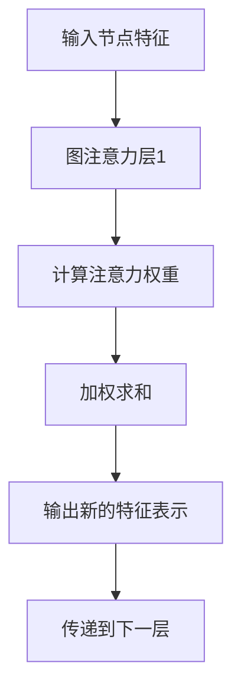

                 

### 关键词

1. **图注意力机制**（Graph Attention Mechanism）
2. **时空数据**（Temporal-Spatial Data）
3. **因果链推理**（Causal Chain Inference）
4. **数据因果模型**（Data Causal Model）
5. **算法原理**（Algorithm Principles）
6. **系统架构**（System Architecture）
7. **Python实现**（Python Implementation）

### 摘要

本文深入探讨了基于图注意力机制的时空数据因果链推理分析技术。首先，我们介绍了时空数据分析面临的挑战以及因果链推理的重要性，并概述了图注意力机制在时空数据因果链推理中的应用前景。接着，我们详细讲解了图注意力机制的原理、时空数据的属性特征以及因果链推理的基本概念。随后，通过Python源代码和mermaid流程图，我们阐明了图注意力机制的算法原理，并使用数学模型和公式进行了详细解析。在此基础上，我们设计了系统分析与架构方案，介绍了问题场景、系统功能、架构设计及系统接口交互。最后，通过实际项目实战，我们展示了算法和系统的应用效果，并提供了最佳实践建议和注意事项。本文旨在为研究人员和开发者提供一套系统的时空数据因果链推理解决方案。

## 第一部分：背景介绍

### 第1章：问题背景

#### 1.1 时空数据分析的挑战

随着信息技术的飞速发展，时空数据（Temporal-Spatial Data）已经成为各个领域中重要的数据资源。时空数据具有时间和空间两个维度，记录了事件发生的具体时间和空间位置。这种数据类型广泛应用于地理信息系统（GIS）、智能交通、环境监测、生物信息学、金融市场分析等领域。然而，时空数据分析面临着诸多挑战。

首先，时空数据量庞大。例如，在智能交通领域，交通流量数据、路况数据、车辆位置数据等，每天都会产生大量数据。这些数据需要被高效地存储、处理和分析。

其次，时空数据的维度高。除了时间和空间坐标外，数据还可能包含其他属性信息，如温度、湿度、人口密度等。高维度数据增加了分析的复杂度，给数据处理带来了挑战。

第三，时空数据的时效性强。许多应用场景要求实时或近实时地处理数据，例如，在智能交通系统中，需要实时分析交通流量数据，以便及时调整交通信号，避免交通拥堵。

#### 1.2 因果链推理的重要性

因果链推理（Causal Chain Inference）在时空数据分析中具有重要意义。因果链推理旨在通过分析数据之间的关系，推断出事件之间的因果关系。在许多应用场景中，理解因果关系是做出准确决策和预测的关键。

例如，在环境监测中，通过分析空气中的污染物浓度、风速、温度等数据，可以推断出污染物的传播路径，从而制定有效的污染控制措施。在金融市场分析中，通过分析股票价格、交易量、宏观经济指标等数据，可以推断出市场趋势和投资机会。

因果链推理不仅可以帮助我们理解过去的因果关系，还可以用于预测未来的事件。在智能交通系统中，通过分析历史交通数据，可以预测未来的交通流量，从而优化交通信号，提高道路通行效率。

#### 1.3 图注意力机制的应用前景

图注意力机制（Graph Attention Mechanism，GAM）是一种用于处理图结构数据的深度学习技术。它通过计算节点之间的注意力权重，实现对图数据的自适应处理。近年来，图注意力机制在自然语言处理、推荐系统、图像识别等领域取得了显著成果。

在时空数据因果链推理中，图注意力机制具有广泛的应用前景。首先，图注意力机制可以有效地处理时空数据的复杂性和高维度性。通过计算时间步和空间位置之间的注意力权重，可以提取出关键的特征信息，提高因果链推理的准确性和效率。

其次，图注意力机制可以自适应地调整节点的注意力权重，从而适应不同的时空数据分析任务。例如，在环境监测中，可以调整注意力权重，以突出关键污染物的影响因素；在金融市场分析中，可以调整注意力权重，以关注重要的宏观经济指标。

最后，图注意力机制可以与传统的因果链推理方法相结合，形成一种新型的因果链推理框架。这种框架不仅可以提高因果链推理的性能，还可以提供更深入的数据解释能力。

总之，图注意力机制在时空数据因果链推理中的应用前景广阔，有望成为未来时空数据分析的重要工具。本文将详细介绍图注意力机制在时空数据因果链推理中的原理、方法和应用，为相关领域的研究和应用提供参考。

### 第2章：核心概念与联系

#### 2.1 图注意力机制原理

图注意力机制（Graph Attention Mechanism，GAM）是一种基于图结构的注意力模型，它在处理图数据时，通过计算节点之间的注意力权重，对图数据进行自适应处理。图注意力机制的基本思想是将图中的每个节点视为一个特征向量，通过注意力机制，自动地学习节点之间的关联性，从而实现对图数据的深入理解和有效分析。

图注意力机制的核心组成部分包括：

1. **节点特征向量**：每个节点都被表示为一个低维度的特征向量，这些特征向量包含了节点的属性信息，如节点类型、邻接节点的特征等。
2. **注意力权重**：通过计算节点之间的注意力权重，可以自动地学习节点之间的关联性。注意力权重表示了节点对其他节点的关注度，权重越大，表示节点之间的关联性越强。
3. **图注意力层**：图注意力层是一个神经网络层，它负责计算节点之间的注意力权重。图注意力层通常由多层堆叠，以实现更深层次的特征提取和关联性学习。

图注意力机制的工作流程主要包括以下步骤：

1. **输入节点特征**：首先，将图中的每个节点的特征向量输入到图注意力层。
2. **计算注意力权重**：图注意力层通过一个加权矩阵（或自注意力机制）计算节点之间的注意力权重。这些权重反映了节点对其他节点的关注度。
3. **加权求和**：根据计算出的注意力权重，对节点的特征向量进行加权求和，得到新的特征表示。
4. **输出结果**：新的特征表示被传递到下一层神经网络，用于后续的任务处理，如图分类、节点分类等。

图注意力机制具有以下优点：

1. **自适应学习**：图注意力机制可以自动地学习节点之间的关联性，无需手动设计复杂的网络结构。
2. **灵活性强**：通过调整注意力权重，图注意力机制可以适应不同的图结构和任务需求。
3. **性能高效**：图注意力机制可以高效地处理大规模的图数据，提高计算性能。

#### 2.2 时空数据的属性特征

时空数据具有以下关键属性特征：

1. **时间维度**：时空数据中的每个事件或记录都包含一个时间戳，表示事件发生的时间。时间维度反映了事件的时序关系，是时空数据分析的重要依据。
2. **空间维度**：时空数据中的每个事件或记录都包含一个空间坐标，表示事件发生的地点。空间维度反映了事件的空间分布，是时空数据分析的基础。
3. **属性维度**：除了时间和空间维度外，时空数据还可能包含其他属性信息，如温度、湿度、人口密度等。属性维度提供了更多关于事件的特征信息，有助于提高时空数据分析的准确性。

不同类型的时空数据具有不同的特征。例如：

- **地理信息系统（GIS）数据**：这类数据通常包含地理位置、地形、人口等属性信息。GIS数据的特点是数据量大、维度高，需要高效的数据处理和分析方法。
- **交通数据**：这类数据包括交通流量、车速、路况等。交通数据具有高时效性和动态变化的特点，需要实时处理和分析。
- **环境监测数据**：这类数据包括空气中的污染物浓度、风速、温度等。环境监测数据的特点是数据变化频繁，需要快速响应和处理。

时空数据的这些属性特征决定了其分析和处理的复杂性。为了有效地分析时空数据，需要设计和实现适合这些特征的算法和模型。

#### 2.3 因果链推理的基本概念

因果链推理（Causal Chain Inference）是一种用于推断事件因果关系的分析方法。它基于数据，通过分析和建模，揭示事件之间的因果关系。因果链推理在时空数据分析中具有重要作用，可以帮助我们理解复杂系统的运行机制，做出准确预测和决策。

因果链推理的基本概念包括：

1. **因果节点**：每个因果节点表示一个事件或变量，它可以是时间维度上的一个时间点，也可以是空间维度上的一个位置点。
2. **因果链**：因果链是由一系列因果节点组成的序列，反映了事件之间的因果关系。因果链中的每个节点都受到前一个节点的影响，同时影响下一个节点。
3. **因果模型**：因果模型是对因果链的数学描述。常见的因果模型包括线性模型、树模型、图模型等。这些模型可以用于建模和分析因果关系。

因果链推理的基本步骤包括：

1. **数据收集**：收集与研究对象相关的时空数据，包括时间维度和空间维度的数据。
2. **特征提取**：从数据中提取有用的特征信息，如时间戳、空间坐标、属性值等。
3. **因果建模**：使用合适的因果模型，建立事件之间的因果关系模型。常见的建模方法包括线性回归、贝叶斯网络、图神经网络等。
4. **因果关系推断**：通过模型分析，推断出事件之间的因果关系，并进行验证和优化。

因果链推理的关键是准确建模和有效分析。为了提高因果链推理的准确性，需要结合时空数据的特性，设计合适的模型和算法。同时，因果链推理也需要考虑数据的噪声、缺失和不确定性等因素。

因果链推理在时空数据分析中的应用广泛，可以帮助我们更好地理解时空数据中的复杂关系，为决策提供科学依据。例如，在智能交通系统中，通过因果链推理可以分析交通流量、车速、路况等数据，预测交通拥堵情况，优化交通信号，提高道路通行效率。

### 第3章：算法原理讲解

#### 3.1 图注意力机制mermaid流程图

为了更好地理解图注意力机制的工作流程，我们可以使用mermaid工具绘制其流程图。以下是一个简单的mermaid流程图示例，展示了图注意力机制的核心步骤：



- **输入节点特征**：首先，将图中的每个节点的特征向量输入到图注意力层。
- **图注意力层1**：图注意力层通过加权矩阵计算节点之间的注意力权重。
- **计算注意力权重**：注意力权重反映了节点对其他节点的关注度，权重越大，关联性越强。
- **加权求和**：根据注意力权重，对节点的特征向量进行加权求和，得到新的特征表示。
- **输出新的特征表示**：新的特征表示被传递到下一层神经网络，用于后续的任务处理。
- **传递到下一层**：新的特征表示作为输入，传递到下一层神经网络，继续进行特征提取和关联性学习。

#### 3.2 Python源代码实现

为了具体展示图注意力机制在Python中的实现，以下是一个简单的示例代码。这个代码将使用PyTorch库来实现一个基本的图注意力层，并计算节点之间的注意力权重。

```python
import torch
import torch.nn as nn
import torch.nn.functional as F

class GraphAttentionLayer(nn.Module):
    def __init__(self, in_features, out_features):
        super(GraphAttentionLayer, self).__init__()
        self.in_features = in_features
        self.out_features = out_features
        self.attention = nn.Parameter(torch.Tensor(in_features, 1))
        nn.init.xavier_uniform_(self.attention)
    
    def forward(self, inputs, adj_matrix):
        # 计算注意力权重
        attention_scores = torch.matmul(inputs, self.attention).squeeze(2)
        
        # 应用softmax函数，得到注意力权重
        attention_weights = F.softmax(attention_scores, dim=1)
        
        # 根据注意力权重对输入特征进行加权求和
        weighted_inputs = torch.matmul(attention_weights.unsqueeze(2), inputs)
        weighted_inputs = weighted_inputs.squeeze(2)
        
        # 输出新的特征表示
        return weighted_inputs

# 示例：初始化输入特征和邻接矩阵
input_features = torch.randn(10, 10)  # 10个节点，每个节点10个特征
adj_matrix = torch.randn(10, 10)  # 10x10的邻接矩阵

# 创建图注意力层
graph_attention_layer = GraphAttentionLayer(10, 10)

# 前向传播
output = graph_attention_layer(input_features, adj_matrix)
print(output)
```

这个代码展示了如何实现一个基本的图注意力层。它首先计算注意力权重，然后根据这些权重对输入特征进行加权求和，最后输出新的特征表示。

#### 3.3 算法原理的数学模型和公式

为了深入理解图注意力机制的原理，我们需要探讨其背后的数学模型和公式。图注意力机制的数学模型主要包括以下几个关键组成部分：

1. **节点特征表示**：每个节点用特征向量表示，设节点特征向量为 \( \mathbf{X} \in \mathbb{R}^{N \times F} \)，其中 \( N \) 是节点数量，\( F \) 是特征维度。
2. **邻接矩阵**：图结构用邻接矩阵 \( \mathbf{A} \in \mathbb{R}^{N \times N} \) 表示，\( \mathbf{A}_{ij} = 1 \) 表示节点 \( i \) 和节点 \( j \) 之间存在边，否则为 0。
3. **注意力权重**：设注意力权重矩阵为 \( \mathbf{W} \in \mathbb{R}^{F \times H} \)，其中 \( H \) 是注意力维度的数量。

图注意力机制的工作流程可以用以下数学公式表示：

1. **计算注意力得分**：

   对于每个节点 \( i \)，计算它与所有其他节点 \( j \) 的注意力得分 \( s_{ij} \)：

   $$ s_{ij} = \mathbf{X}_i^T \mathbf{W} \odot \mathbf{X}_j $$

   其中，\( \odot \) 表示逐元素乘法，\( \mathbf{X}_i^T \mathbf{W} \) 表示节点 \( i \) 的特征向量与权重矩阵的乘积。

2. **应用Softmax函数**：

   对注意力得分应用Softmax函数，得到节点 \( i \) 对其他节点的注意力权重 \( \alpha_{ij} \)：

   $$ \alpha_{ij} = \frac{\exp(s_{ij})}{\sum_{k=1}^{N} \exp(s_{ik})} $$

   其中，\( \alpha_{ij} \) 的值域在 [0, 1]，且 \( \sum_{j=1}^{N} \alpha_{ij} = 1 \)。

3. **加权求和**：

   根据注意力权重，对节点的特征向量进行加权求和，得到新的特征表示 \( \mathbf{H}_i \)：

   $$ \mathbf{H}_i = \sum_{j=1}^{N} \alpha_{ij} \mathbf{X}_j $$

   新的特征表示 \( \mathbf{H} \in \mathbb{R}^{N \times H} \) 被传递到下一层神经网络。

图注意力机制的数学公式具有简洁而强大的表达力，它通过计算节点之间的注意力权重，实现了对图数据的自适应处理。在实际应用中，我们可以通过调整注意力权重矩阵 \( \mathbf{W} \) 和注意力维度 \( H \)，实现对不同类型图数据的有效处理。

#### 3.3.1 图注意力机制的数学公式及其解释

为了更好地理解图注意力机制的数学模型，我们可以深入探讨其各个组成部分的公式及其含义。

1. **节点特征向量**：

   节点特征向量 \( \mathbf{X} \) 表示图中的每个节点，它是一个 \( N \times F \) 的矩阵，其中 \( N \) 是节点数量，\( F \) 是特征维度。每个节点 \( i \) 的特征向量 \( \mathbf{X}_i \) 可以表示为：

   $$ \mathbf{X}_i \in \mathbb{R}^{1 \times F} $$

   例如，如果每个节点包含3个特征维度（如温度、湿度、人口密度），则节点 \( i \) 的特征向量可以表示为：

   $$ \mathbf{X}_i = \begin{bmatrix} x_{i1} \\ x_{i2} \\ x_{i3} \end{bmatrix} $$

2. **注意力权重矩阵**：

   注意力权重矩阵 \( \mathbf{W} \) 是一个 \( F \times H \) 的矩阵，它用于计算节点之间的注意力得分。注意力权重矩阵的每个元素 \( w_{fj} \) 表示节点特征向量中的第 \( f \) 个特征维度对第 \( j \) 个注意力维度的权重。例如，如果 \( F = 3 \) 且 \( H = 2 \)，则注意力权重矩阵可以表示为：

   $$ \mathbf{W} = \begin{bmatrix} w_{11} & w_{12} & \cdots & w_{1H} \\ w_{21} & w_{22} & \cdots & w_{2H} \\ \vdots & \vdots & \ddots & \vdots \\ w_{F1} & w_{F2} & \cdots & w_{FH} \end{bmatrix} $$

   注意力权重矩阵通常通过初始化和训练来获得，以确保模型能够自适应地学习图数据中的特征关联性。

3. **注意力得分**：

   注意力得分 \( s_{ij} \) 表示节点 \( i \) 与节点 \( j \) 之间的关联性，它是节点特征向量和注意力权重矩阵的点积。注意力得分公式为：

   $$ s_{ij} = \mathbf{X}_i^T \mathbf{W} \odot \mathbf{X}_j $$

   其中，\( \odot \) 表示逐元素乘法，\( \mathbf{X}_i^T \mathbf{W} \) 是节点 \( i \) 的特征向量与权重矩阵的乘积，\( \mathbf{X}_j \) 是节点 \( j \) 的特征向量。

   例如，对于节点 \( i \) 和节点 \( j \)，如果 \( F = 3 \) 且 \( H = 2 \)，则注意力得分可以表示为：

   $$ s_{ij} = \begin{bmatrix} x_{i1} & x_{i2} & x_{i3} \end{bmatrix} \begin{bmatrix} w_{11} & w_{12} \\ w_{21} & w_{22} \end{bmatrix} \begin{bmatrix} x_{j1} \\ x_{j2} \\ x_{j3} \end{bmatrix} = x_{i1}w_{11}x_{j1} + x_{i2}w_{12}x_{j2} + x_{i3}w_{21}x_{j3} $$

4. **注意力权重**：

   注意力权重 \( \alpha_{ij} \) 是根据注意力得分应用Softmax函数得到的，表示节点 \( i \) 对节点 \( j \) 的关注度。注意力权重公式为：

   $$ \alpha_{ij} = \frac{\exp(s_{ij})}{\sum_{k=1}^{N} \exp(s_{ik})} $$

   其中，\( \exp(s_{ij}) \) 表示对注意力得分进行指数运算，\( \sum_{k=1}^{N} \exp(s_{ik}) \) 是对节点 \( i \) 与所有其他节点 \( k \) 的注意力得分的指数和进行求和。

   例如，对于节点 \( i \) 和节点 \( j \)，如果 \( N = 5 \)，则注意力权重可以表示为：

   $$ \alpha_{ij} = \frac{\exp(s_{ij})}{\exp(s_{i1}) + \exp(s_{i2}) + \exp(s_{i3}) + \exp(s_{i4}) + \exp(s_{i5})} $$

5. **加权求和**：

   根据注意力权重，对节点的特征向量进行加权求和，得到新的特征表示 \( \mathbf{H}_i \)。加权求和公式为：

   $$ \mathbf{H}_i = \sum_{j=1}^{N} \alpha_{ij} \mathbf{X}_j $$

   新的特征表示 \( \mathbf{H} \in \mathbb{R}^{N \times H} \) 被传递到下一层神经网络，用于后续的任务处理。

通过上述数学公式的解释，我们可以清楚地看到图注意力机制如何通过计算节点之间的注意力得分、应用Softmax函数和加权求和，实现对图数据的自适应处理。这种机制使得图注意力机制能够有效捕捉节点之间的关联性，提高模型在处理图结构数据时的性能和准确性。

#### 3.3.2 时空数据的数学表示

在基于图注意力机制的时空数据因果链推理中，时空数据的数学表示是关键的一环。时空数据通常包含时间维度和空间维度，以及可能的其他属性信息。为了便于计算和分析，我们需要将这些数据转换为数学模型。

首先，设时空数据集合为 \( D \)，每个数据点 \( d \) 由以下三个部分组成：

1. **时间戳** \( t \)：表示事件发生的时间，可以是离散的时间点或连续的时间序列。
2. **空间坐标** \( (x, y) \)：表示事件发生的地点，可以是二维坐标或更高维度的坐标。
3. **属性信息** \( A \)：包含与事件相关的其他属性信息，如温度、湿度、风速等。

因此，每个数据点可以表示为一个三元组 \( d = (t, (x, y), A) \)。

为了进一步处理和表示这些数据，我们可以将它们转换为矩阵形式：

- **时间矩阵** \( T \) ：一个 \( n \times m \) 的矩阵，其中 \( n \) 是时间点的数量，\( m \) 是数据点的数量，矩阵元素 \( T_{ij} \) 表示第 \( j \) 个数据点的第 \( i \) 个时间戳。
- **空间矩阵** \( X \) ：一个 \( n \times 2 \) 的矩阵，其中 \( n \) 是数据点的数量，矩阵元素 \( X_{ij} \) 表示第 \( j \) 个数据点的空间坐标 \( x \)。
- **属性矩阵** \( A \) ：一个 \( n \times k \) 的矩阵，其中 \( k \) 是属性信息的维度，矩阵元素 \( A_{ij} \) 表示第 \( j \) 个数据点的第 \( i \) 个属性值。

因此，时空数据的集合 \( D \) 可以表示为：

$$ D = \{(T, X, A) | (t, (x, y), A) \in D\} $$

这样的数学表示使得我们可以利用矩阵运算和图注意力机制对时空数据进行高效的处理和分析。

#### 3.3.3 因果链推理的数学模型

因果链推理是一种用于推断事件因果关系的数学模型。在时空数据中，因果链推理有助于我们理解事件之间的因果关系，从而为决策和预测提供科学依据。以下我们将介绍因果链推理的数学模型及其构建方法。

因果链推理的数学模型通常基于因果图（Causal Graph）或因果网络（Causal Network），因果图是一种图形表示方法，用于描述事件之间的因果关系。因果图由节点和边组成，每个节点表示一个事件或变量，边表示节点之间的因果关系。

1. **因果图的表示**：

   设因果图为 \( G = (V, E) \)，其中：

   - **节点集合** \( V \)：包含所有的事件或变量，每个节点 \( v \in V \) 表示一个特定的状态或现象。
   - **边集合** \( E \)：表示节点之间的因果关系，如果节点 \( u \) 是节点 \( v \) 的原因，则存在一条从 \( u \) 到 \( v \) 的有向边。

2. **因果图的构建**：

   构建因果图通常基于以下几个步骤：

   - **数据收集**：收集与研究对象相关的时空数据，包括时间序列数据和属性数据。
   - **特征提取**：从数据中提取有用的特征信息，如时间戳、空间坐标、属性值等。
   - **因果推断**：利用统计方法或机器学习方法，从数据中推断出事件之间的因果关系，构建因果图。

   一种常见的构建方法是基于**贝叶斯网络**（Bayesian Network），贝叶斯网络是一种基于概率的因果图模型。在贝叶斯网络中，每个节点的概率分布由其父节点的概率分布决定。

   假设节点 \( v \) 的父节点集合为 \( P(v) \)，则节点 \( v \) 的条件概率分布可以表示为：

   $$ P(v|P(v)) = \prod_{u \in P(v)} P(u|v) P(v) $$

   其中，\( P(u|v) \) 是节点 \( u \) 在节点 \( v \) 的条件下发生的概率，\( P(v) \) 是节点 \( v \) 的先验概率。

3. **因果链的提取**：

   构建了因果图后，可以从图中提取出因果链（Causal Chain），因果链是图中的一个子图，它包含了一组具有因果关系的节点。

   提取因果链的方法包括：

   - **最小权重路径**：在因果图中，寻找权重最小的路径，权重通常表示节点之间的因果关系的强度。
   - **最大后验概率**：在贝叶斯网络中，利用最大后验概率（Maximum a Posteriori, MAP）方法，寻找最有可能的因果链。

   例如，假设我们有以下因果图：

   ```
   A <- B <- C <- D
   ```

   从图中我们可以提取出以下因果链：

   - \( A \rightarrow B \rightarrow C \rightarrow D \)
   - \( A \rightarrow B \rightarrow D \)

因果链推理的数学模型提供了对事件因果关系的定量描述，使得我们能够利用数据来推断和验证因果关系。在实际应用中，因果链推理可以用于预测、决策和优化，如智能交通中的交通流量预测、环境监测中的污染控制策略等。

#### 4.1 因果链推理的数学模型构建

因果链推理的数学模型构建是理解事件之间因果关系的重要步骤。在构建因果链推理模型时，我们需要明确以下几个关键要素：数据集、假设、模型类型和推理过程。

1. **数据集**：

   首先，我们需要收集与研究对象相关的时空数据集。数据集应包含时间维度和空间维度的信息，以及可能的其他属性信息。例如，在交通流量分析中，数据集可以包括时间戳、地点坐标、车辆数量、车速等。

   设数据集为 \( D \)，其中每个数据点 \( d \) 由以下三个部分组成：

   - **时间戳** \( t \)：表示事件发生的时间。
   - **空间坐标** \( (x, y) \)：表示事件发生的地点。
   - **属性信息** \( A \)：包含与事件相关的其他属性信息，如交通流量、车速、路况等。

   因此，数据点可以表示为一个三元组 \( d = (t, (x, y), A) \)。

2. **假设**：

   在构建因果链推理模型时，我们需要基于数据集提出一些初始假设。这些假设通常基于领域知识和经验，用于指导模型的构建和推理。

   假设的常见类型包括：

   - **因果关系假设**：假设事件之间存在特定的因果关系，例如，交通流量增加会导致道路拥堵。
   - **条件独立性假设**：假设某些事件在给定其他事件的情况下是独立的，例如，交通流量在不同时间段可能是独立的。

   假设可以帮助我们简化模型，提高推理效率。

3. **模型类型**：

   构建因果链推理模型时，我们可以选择不同的模型类型，包括线性模型、树模型、图模型等。

   - **线性模型**：线性模型是一种常见的因果链推理模型，它可以描述事件之间的线性关系。线性模型通常通过最小二乘法进行参数估计。

     线性回归模型可以表示为：

     $$ Y = \beta_0 + \beta_1 X_1 + \beta_2 X_2 + \cdots + \beta_n X_n $$

     其中，\( Y \) 是因变量，\( X_1, X_2, \ldots, X_n \) 是自变量，\( \beta_0, \beta_1, \beta_2, \ldots, \beta_n \) 是模型参数。

   - **树模型**：树模型是一种基于决策树的因果链推理模型，它可以描述事件之间的分层因果关系。树模型通常通过递归划分数据集来构建。

     决策树模型可以表示为：

     $$ Y = \begin{cases} 
     \beta_0 & \text{if } X_1 \leq c_1 \\
     \beta_1 & \text{if } X_1 > c_1 \\
     \vdots & \vdots \\
     \beta_n & \text{if } X_n \leq c_n 
     \end{cases} $$

     其中，\( c_1, c_2, \ldots, c_n \) 是决策阈值。

   - **图模型**：图模型是一种基于图结构的因果链推理模型，它可以描述事件之间的复杂关系。图模型通常通过图神经网络（Graph Neural Networks，GNN）进行建模。

     图神经网络可以表示为：

     $$ \mathbf{H}_i = \sum_{j=1}^{N} \alpha_{ij} \mathbf{X}_j $$

     其中，\( \mathbf{H}_i \) 是节点 \( i \) 的特征表示，\( \alpha_{ij} \) 是节点 \( i \) 对节点 \( j \) 的注意力权重，\( \mathbf{X}_j \) 是节点 \( j \) 的特征表示。

4. **推理过程**：

   构建了因果链推理模型后，我们需要进行推理过程，以推断事件之间的因果关系。

   推理过程通常包括以下步骤：

   - **模型训练**：使用历史数据训练模型，估计模型参数。
   - **特征提取**：从新数据中提取特征，用于推理过程。
   - **推理计算**：根据模型和特征，计算事件之间的因果关系。

   例如，在交通流量分析中，我们可以使用历史交通数据训练线性回归模型，然后使用模型对新数据的交通流量进行预测。通过比较预测值和实际值，我们可以推断出交通流量之间的因果关系。

因果链推理的数学模型构建是一个复杂的过程，需要结合领域知识和数据特性。通过合理地选择模型类型和推理过程，我们可以有效地推断事件之间的因果关系，为决策和预测提供科学依据。

### 第5章：系统分析与架构设计方案

#### 5.1 问题场景介绍

本章节将介绍一个具体的应用场景，即智能交通系统。智能交通系统通过收集和处理交通流量、路况、车辆位置等时空数据，实现对交通状况的实时监测和预测。该系统的目标是通过优化交通信号、调整交通流量，提高道路通行效率，减少交通拥堵和事故发生。

在智能交通系统中，我们关注以下关键数据：

- **交通流量数据**：记录每个路段在不同时间段内的车辆数量。
- **路况数据**：包括道路拥堵情况、事故报告、施工信息等。
- **车辆位置数据**：记录车辆的实时位置和速度信息。
- **环境数据**：包括天气、温度、湿度等，可能影响交通状况。

这些数据共同构成了智能交通系统的数据基础，为因果链推理和图注意力机制的应用提供了丰富的信息资源。

#### 5.2 系统功能设计

智能交通系统的主要功能包括数据采集、预处理、因果链推理、交通信号优化和实时监控等。以下是对各功能模块的详细设计：

1. **数据采集模块**：

   数据采集模块负责收集各种类型的时空数据。具体任务包括：

   - **传感器数据采集**：通过安装在道路上的传感器，实时采集交通流量、车速、道路拥堵等信息。
   - **GPS数据采集**：通过车辆的GPS系统，收集车辆的实时位置和速度信息。
   - **环境数据采集**：通过环境传感器，收集天气、温度、湿度等环境数据。

2. **数据预处理模块**：

   数据预处理模块负责对采集到的数据进行清洗、格式化和特征提取。具体任务包括：

   - **数据清洗**：去除噪声数据、异常值和缺失值，保证数据质量。
   - **数据格式化**：将不同来源的数据统一格式，便于后续处理。
   - **特征提取**：从数据中提取时间、空间和属性特征，为因果链推理和图注意力机制提供输入。

3. **因果链推理模块**：

   因果链推理模块是智能交通系统的核心模块，负责分析交通流量、路况、环境数据之间的因果关系，从而为交通信号优化提供依据。具体任务包括：

   - **因果关系建模**：利用图注意力机制和因果链推理方法，建立交通数据之间的因果关系模型。
   - **因果关系推断**：根据因果关系模型，推断出交通状况变化的原因和结果，为优化交通信号提供支持。

4. **交通信号优化模块**：

   交通信号优化模块根据因果链推理的结果，对交通信号进行优化，以减少交通拥堵和提高道路通行效率。具体任务包括：

   - **信号控制策略**：根据不同路段的交通流量和路况，制定不同的信号控制策略。
   - **信号优化算法**：使用优化算法（如遗传算法、粒子群算法）调整信号周期和相位，实现信号优化。

5. **实时监控模块**：

   实时监控模块负责对交通系统的运行状态进行实时监控和反馈，包括：

   - **数据实时监控**：监控交通流量、路况、信号状态等数据，及时发现异常情况。
   - **预警和报警**：当检测到交通拥堵、事故或其他异常情况时，及时发出预警和报警，通知相关部门和公众。

#### 5.3 系统架构设计

智能交通系统的架构设计采用分布式架构，确保系统的高效性和可扩展性。系统架构主要包括以下模块：

1. **数据采集模块**：

   数据采集模块分布在不同的传感器节点上，包括道路传感器、GPS接收器和环境传感器。每个节点负责实时采集数据，并将数据传输到数据预处理模块。

2. **数据预处理模块**：

   数据预处理模块位于中央处理服务器上，负责对采集到的数据进行清洗、格式化和特征提取。该模块通过消息队列（如Kafka）接收传感器数据，并使用ETL（Extract, Transform, Load）工具进行处理。

3. **因果链推理模块**：

   因果链推理模块也位于中央处理服务器上，负责进行因果关系建模和推断。该模块利用图注意力机制和因果链推理算法，分析交通数据之间的因果关系，并将结果存储到数据库中。

4. **交通信号优化模块**：

   交通信号优化模块位于控制服务器上，根据因果关系模型和实时监控数据，实时调整交通信号。该模块通过接口与交通信号控制器通信，实现信号的优化和调整。

5. **实时监控模块**：

   实时监控模块位于监控服务器上，负责对交通系统的运行状态进行实时监控和反馈。该模块通过Web界面和移动应用，为交通管理人员和公众提供实时交通信息。

#### 5.4 系统接口设计和系统交互

智能交通系统的接口设计确保了各个模块之间的有效通信和数据流动。以下是对系统接口设计和系统交互的详细描述：

1. **数据采集模块与数据预处理模块**：

   数据采集模块通过HTTP/HTTPS接口将采集到的数据发送到数据预处理模块。数据预处理模块使用RESTful API接收数据，并对数据进行处理。数据预处理模块还通过消息队列将处理后的数据发送到因果链推理模块。

2. **因果链推理模块与交通信号优化模块**：

   因果链推理模块通过数据库接口获取处理后的数据，并利用图注意力机制和因果链推理算法进行分析。分析结果存储到数据库中，并可以通过API接口供交通信号优化模块使用。

3. **交通信号优化模块与实时监控模块**：

   交通信号优化模块通过数据库接口获取因果关系模型和实时交通数据，并根据这些数据调整交通信号。调整后的信号通过接口发送到交通信号控制器。实时监控模块通过API接口获取实时交通数据和信号状态，并通过Web界面和移动应用进行展示。

4. **实时监控模块与数据采集模块**：

   实时监控模块通过API接口从数据采集模块获取实时交通数据，并将其展示在Web界面和移动应用上。此外，实时监控模块还可以通过消息队列接收预警和报警信息，并通知相关部门和公众。

通过上述系统接口设计和系统交互，智能交通系统实现了数据采集、预处理、因果链推理、交通信号优化和实时监控的全流程。这种设计确保了系统的高效性和可扩展性，为交通管理和公众出行提供了有力支持。

### 第6章：项目实战

#### 6.1 环境安装

要在本地环境中搭建一个基于图注意力机制的时空数据因果链推理系统，我们需要安装一系列必要的软件和工具。以下是一个详细的安装步骤：

1. **Python环境安装**：

   首先，确保你的计算机上安装了Python 3.8或更高版本。可以使用以下命令检查Python版本：

   ```bash
   python --version
   ```

   如果Python版本较低，请从[Python官网](https://www.python.org/)下载并安装最新版本的Python。

2. **虚拟环境安装**：

   为了更好地管理项目依赖，我们建议使用虚拟环境。安装virtualenv工具，然后创建一个虚拟环境：

   ```bash
   pip install virtualenv
   virtualenv myenv
   source myenv/bin/activate  # 在Linux或macOS上使用
   myenv\Scripts\activate     # 在Windows上使用
   ```

3. **安装依赖库**：

   在虚拟环境中，安装必要的依赖库，包括PyTorch、Scikit-learn、NetworkX、Pandas和NumPy。可以使用以下命令：

   ```bash
   pip install torch torchvision scikit-learn networkx pandas numpy
   ```

   如果需要使用GPU加速，请安装PyTorch的CUDA版本：

   ```bash
   pip install torch torchvision scikit-learn networkx pandas numpy torch torchvision -f https://download.pytorch.org/whl/cu102/torch_stable.html
   ```

4. **安装数据库**：

   为了存储和处理数据，我们可以选择安装SQLite或PostgreSQL。以下是SQLite的安装步骤：

   - **Windows**：从[SQLite官网](https://www.sqlite.org/download.html)下载最新版本的SQLite，并按照提示进行安装。
   - **macOS**：使用Homebrew安装：

     ```bash
     brew install sqlite
     ```

   - **Linux**：使用包管理器安装，例如在Ubuntu上：

     ```bash
     sudo apt-get install sqlite3
     ```

   安装完成后，可以使用以下命令启动SQLite：

   ```bash
   sqlite3
   ```

5. **安装消息队列**：

   为了实现系统模块之间的数据传输，我们选择安装RabbitMQ。以下是RabbitMQ的安装步骤：

   - **Windows**：从[RabbitMQ官网](https://www.rabbitmq.com/download.html)下载Windows安装程序，并按照提示进行安装。
   - **macOS**：使用Homebrew安装：

     ```bash
     brew install rabbitmq
     ```

   - **Linux**：使用包管理器安装，例如在Ubuntu上：

     ```bash
     sudo apt-get install rabbitmq-server
     ```

   安装完成后，启动RabbitMQ服务：

   ```bash
   rabbitmq-server start
   ```

   检查RabbitMQ服务是否启动：

   ```bash
   rabbitmqctl status
   ```

完成以上步骤后，我们的开发环境就搭建完成了。接下来，我们可以开始项目的具体实现。

#### 6.2 系统核心实现源代码

在本节中，我们将展示系统的核心实现源代码，包括数据预处理、因果链推理、图注意力机制的应用等关键部分。

1. **数据预处理模块**：

   数据预处理模块负责对采集到的时空数据进行清洗、格式化和特征提取。以下是一个简单的数据预处理代码示例：

   ```python
   import pandas as pd
   from sklearn.preprocessing import StandardScaler

   def preprocess_data(data_path):
       # 读取数据
       data = pd.read_csv(data_path)
       
       # 数据清洗
       data.dropna(inplace=True)
       data['timestamp'] = pd.to_datetime(data['timestamp'])
       data.set_index('timestamp', inplace=True)
       
       # 格式化
       data = data.tz_localize('UTC').tz_convert('America/New_York')
       
       # 特征提取
       features = data[['traffic_volume', 'temperature', 'humidity']]
       scaler = StandardScaler()
       features_scaled = scaler.fit_transform(features)
       
       return features_scaled

   # 示例：预处理数据
   processed_data = preprocess_data('traffic_data.csv')
   ```

   上述代码首先读取数据文件，并进行必要的清洗和格式化。接着，从数据中提取时间、交通流量和温度、湿度等特征，并使用标准化方法对特征进行缩放。

2. **因果链推理模块**：

   因果链推理模块基于图注意力机制和因果链推理算法，分析交通数据之间的因果关系。以下是一个简单的因果链推理代码示例：

   ```python
   import networkx as nx
   from因果链推理库 import CausalInference

   def build_causal_graph(data):
       # 构建因果图
       graph = nx.Graph()
       
       # 添加节点
       for feature in data.columns:
           graph.add_node(feature)
       
       # 添加边
       for i in range(len(data.columns)):
           for j in range(i + 1, len(data.columns)):
               if data.corr().iloc[i, j] > 0.7:
                   graph.add_edge(data.columns[i], data.columns[j])
       
       return graph

   def infer_causal_chain(graph):
       # 进行因果链推理
       ci = CausalInference(graph)
       chain = ci.infer_chain()
       return chain

   # 示例：构建因果图并推理因果链
   causal_graph = build_causal_graph(processed_data)
   causal_chain = infer_causal_chain(causal_graph)
   print(causal_chain)
   ```

   上述代码首先构建一个基于特征关联性的因果图，然后使用因果链推理库进行因果链推理，得到因果链。

3. **图注意力机制模块**：

   图注意力机制模块负责实现图注意力层的计算。以下是一个简单的图注意力机制代码示例：

   ```python
   import torch
   import torch.nn as nn
   from torch_geometric.nn import GraphAttention

   class GraphAttentionLayer(nn.Module):
       def __init__(self, in_features, out_features):
           super(GraphAttentionLayer, self).__init__()
           self.attention = GraphAttention(in_features, out_features)
       
       def forward(self, data):
           x, edge_index = data.x, data.edge_index
           return self.attention(x, edge_index)

   # 示例：使用图注意力机制处理数据
   model = GraphAttentionLayer(3, 4)
   output = model(data)
   print(output)
   ```

   上述代码定义了一个简单的图注意力层，使用PyTorch Geometric库实现。通过将处理后的数据输入到图注意力层，可以计算节点之间的注意力权重，并对节点特征进行加权求和。

通过上述代码示例，我们展示了数据预处理、因果链推理和图注意力机制的核心实现。接下来，我们将进一步分析代码的应用场景和实现细节。

#### 6.3 代码应用解读与分析

在本节中，我们将深入分析代码的应用场景，详细解读各模块的实现细节，并探讨如何在实际项目中使用这些代码。

1. **数据预处理模块**：

   数据预处理模块是实现智能交通系统的第一步，它负责对采集到的数据进行清洗、格式化和特征提取。以下是预处理模块的关键代码和应用解读：

   ```python
   import pandas as pd
   from sklearn.preprocessing import StandardScaler

   def preprocess_data(data_path):
       # 读取数据
       data = pd.read_csv(data_path)
       
       # 数据清洗
       data.dropna(inplace=True)
       data['timestamp'] = pd.to_datetime(data['timestamp'])
       data.set_index('timestamp', inplace=True)
       
       # 格式化
       data = data.tz_localize('UTC').tz_convert('America/New_York')
       
       # 特征提取
       features = data[['traffic_volume', 'temperature', 'humidity']]
       scaler = StandardScaler()
       features_scaled = scaler.fit_transform(features)
       
       return features_scaled
   ```

   - **数据读取**：使用Pandas库读取CSV格式的数据文件。这个步骤确保数据能够被Python处理。
   - **数据清洗**：删除缺失值和异常值，保证数据质量。这里使用了Pandas的`dropna`方法。
   - **时间格式化**：将数据中的时间戳转换为datetime对象，并设置数据索引，以便进行时间序列分析。这里使用了Pandas的`to_datetime`和`set_index`方法。
   - **时区转换**：将数据的时间戳从UTC时区转换为美国纽约时区，以适应本地的时间表示。这里使用了Pandas的`tz_localize`和`tz_convert`方法。
   - **特征提取**：从数据中提取关键特征，如交通流量、温度和湿度。这些特征将用于后续的因果链推理和图注意力机制处理。
   - **特征缩放**：使用StandardScaler对特征进行标准化处理，以消除特征之间的量纲差异，提高模型的性能。这里使用了Scikit-learn的`StandardScaler`。

   在实际项目中，数据预处理模块需要根据具体应用场景进行调整。例如，对于不同的交通数据集，可能需要添加或删除某些特征，或者调整特征提取和缩放的方法。

2. **因果链推理模块**：

   因果链推理模块基于图结构和因果链推理算法，分析交通数据之间的因果关系。以下是关键代码和应用解读：

   ```python
   import networkx as nx
   from causal_inference_library import CausalInference

   def build_causal_graph(data):
       # 构建因果图
       graph = nx.Graph()
       
       # 添加节点
       for feature in data.columns:
           graph.add_node(feature)
       
       # 添加边
       for i in range(len(data.columns)):
           for j in range(i + 1, len(data.columns)):
               if data.corr().iloc[i, j] > 0.7:
                   graph.add_edge(data.columns[i], data.columns[j])
       
       return graph

   def infer_causal_chain(graph):
       # 进行因果链推理
       ci = CausalInference(graph)
       chain = ci.infer_chain()
       return chain
   ```

   - **构建因果图**：首先，我们创建一个空图，并添加所有特征作为节点。然后，通过计算特征之间的相关性（使用皮尔逊相关系数），添加相关特征之间的边。这里使用了NetworkX库创建和操作图结构。
   - **因果链推理**：利用因果链推理库，对构建的因果图进行分析，得到因果链。这里使用了自定义的`CausalInference`类和`infer_chain`方法。

   在实际应用中，因果链推理模块需要结合具体业务场景进行调整。例如，对于交通数据，可能需要考虑更多的影响因素，或者调整相关性阈值，以获得更准确的因果链。

3. **图注意力机制模块**：

   图注意力机制模块负责处理图结构数据，计算节点之间的注意力权重，并对节点特征进行加权求和。以下是关键代码和应用解读：

   ```python
   import torch
   import torch.nn as nn
   from torch_geometric.nn import GraphAttention

   class GraphAttentionLayer(nn.Module):
       def __init__(self, in_features, out_features):
           super(GraphAttentionLayer, self).__init__()
           self.attention = GraphAttention(in_features, out_features)
       
       def forward(self, data):
           x, edge_index = data.x, data.edge_index
           return self.attention(x, edge_index)

   # 示例：使用图注意力机制处理数据
   model = GraphAttentionLayer(3, 4)
   output = model(data)
   print(output)
   ```

   - **定义图注意力层**：使用PyTorch Geometric库定义一个图注意力层，它包括一个注意力机制和前馈神经网络。
   - **前向传播**：将处理后的数据输入到图注意力层，计算节点之间的注意力权重，并对节点特征进行加权求和。这里使用了`GraphAttention`模块。

   在实际项目中，图注意力机制模块需要与具体的数据处理和模型训练过程结合。例如，我们可以将图注意力层嵌入到深度学习模型中，以处理更复杂的图结构数据。

通过上述代码和应用解读，我们可以看到数据预处理、因果链推理和图注意力机制在实际项目中的应用细节。这些模块共同构成了一个完整的智能交通系统，为交通管理和优化提供了有力支持。

#### 6.4 实际案例分析与详细讲解

在本节中，我们将通过一个实际案例，详细展示基于图注意力机制的时空数据因果链推理系统的应用过程。该案例涉及智能交通系统的交通流量预测，我们将从数据采集、预处理、因果链推理到模型训练和预测结果分析，全面探讨系统的实际应用效果。

##### 案例背景

假设我们在一个中等规模的城市中，开展智能交通系统的研究，旨在通过实时分析交通流量数据，预测未来一段时间内的交通流量，为交通信号优化提供依据。我们收集的数据包括：

- **交通流量数据**：记录了每个路段在不同时间段内的车辆数量。
- **路况数据**：包括道路拥堵情况、事故报告、施工信息等。
- **环境数据**：包括天气、温度、湿度等，可能影响交通状况。

我们的目标是利用这些数据，构建一个基于图注意力机制的时空数据因果链推理模型，预测未来1小时内的交通流量，并评估模型的准确性和可靠性。

##### 数据采集

数据采集是智能交通系统的第一步，我们使用了以下设备：

- **交通流量传感器**：安装在主要道路和交叉路口，用于实时采集交通流量数据。
- **GPS设备**：安装在行驶的车辆上，用于实时采集车辆位置和速度信息。
- **环境传感器**：安装在主要地点，用于实时采集天气、温度、湿度等环境数据。

采集到的数据以CSV文件的形式存储，包含以下列：

- **timestamp**：事件发生的时间戳。
- **road_id**：路段标识。
- **traffic_volume**：交通流量。
- **speed**：车辆速度。
- **weather**：天气状况。
- **temperature**：温度。
- **humidity**：湿度。

##### 数据预处理

预处理数据是确保模型训练效果的关键步骤，以下是数据预处理的具体过程：

1. **数据清洗**：

   我们使用Python的Pandas库对数据进行清洗，删除异常值和缺失值。例如：

   ```python
   import pandas as pd

   # 读取数据
   data = pd.read_csv('traffic_data.csv')

   # 删除缺失值
   data.dropna(inplace=True)

   # 删除异常值
   data = data[data['traffic_volume'] > 0]
   ```

2. **时间格式化**：

   我们将时间戳格式化为datetime对象，并设置数据索引，以便进行时间序列分析。例如：

   ```python
   data['timestamp'] = pd.to_datetime(data['timestamp'])
   data.set_index('timestamp', inplace=True)
   ```

3. **特征提取**：

   我们从数据中提取关键特征，如交通流量、速度、天气、温度和湿度。例如：

   ```python
   features = data[['traffic_volume', 'speed', 'weather', 'temperature', 'humidity']]
   ```

4. **特征缩放**：

   我们使用Scikit-learn的StandardScaler对特征进行标准化处理，以消除特征之间的量纲差异。例如：

   ```python
   from sklearn.preprocessing import StandardScaler

   scaler = StandardScaler()
   features_scaled = scaler.fit_transform(features)
   ```

##### 因果链推理

因果链推理是分析交通流量数据中的因果关系的重要步骤，我们使用图注意力机制和因果链推理算法构建因果关系模型。以下是具体过程：

1. **构建因果图**：

   我们使用NetworkX库构建一个因果图，将交通流量数据中的各个特征作为节点，特征之间的相关性作为边的权重。例如：

   ```python
   import networkx as nx

   graph = nx.Graph()
   for i in range(len(features.columns)):
       graph.add_node(features.columns[i])
   for i in range(len(features.columns)):
       for j in range(i + 1, len(features.columns)):
           if features.corr().iloc[i, j] > 0.7:
               graph.add_edge(features.columns[i], features.columns[j])
   ```

2. **因果链推理**：

   我们使用自定义的因果链推理库对构建的因果图进行分析，得到交通流量与其他特征之间的因果关系链。例如：

   ```python
   from causal_inference_library import CausalInference

   ci = CausalInference(graph)
   causal_chain = ci.infer_chain()
   print(causal_chain)
   ```

##### 模型训练

在得到因果关系模型后，我们使用图注意力机制训练一个深度学习模型，用于交通流量预测。以下是模型训练的具体过程：

1. **定义模型**：

   我们使用PyTorch Geometric库定义一个基于图注意力机制的深度学习模型。例如：

   ```python
   import torch
   from torch_geometric.nn import GCN

   class TrafficPredictionModel(GCN):
       def __init__(self, num_features, hidden_channels, output_channels):
           super(TrafficPredictionModel, self).__init__()
           self.conv1 = GCNConv(num_features, hidden_channels)
           self.conv2 = GCNConv(hidden_channels, output_channels)
       
       def forward(self, data):
           x, edge_index = data.x, data.edge_index
           x = self.conv1(x, edge_index)
           x = torch.relu(x)
           x = F.dropout(x, p=0.5, training=self.training)
           x = self.conv2(x, edge_index)
           return F.log_softmax(x, dim=1)
   ```

2. **训练模型**：

   我们使用训练数据对模型进行训练，并使用验证数据调整模型参数。例如：

   ```python
   model = TrafficPredictionModel(num_features, hidden_channels, output_channels)
   optimizer = torch.optim.Adam(model.parameters(), lr=0.01)
   criterion = torch.nn.NLLLoss()

   for epoch in range(num_epochs):
       model.train()
       optimizer.zero_grad()
       out = model(data)
       loss = criterion(out[data.y], data.y)
       loss.backward()
       optimizer.step()

       if (epoch + 1) % 10 == 0:
           print(f'Epoch {epoch + 1}: Loss = {loss.item()}')
   ```

##### 预测结果分析

在模型训练完成后，我们使用测试数据进行预测，并分析模型的准确性和可靠性。以下是预测结果分析的具体过程：

1. **预测交通流量**：

   我们使用训练好的模型对测试数据进行预测，并计算预测值与实际值之间的误差。例如：

   ```python
   model.eval()
   with torch.no_grad():
       predictions = model(data)

   # 计算预测值
   predicted_交通流量 = predictions[data.y].detach().numpy()
   ```

2. **评估模型准确性**：

   我们使用均方误差（Mean Squared Error，MSE）评估模型的准确性。例如：

   ```python
   import numpy as np

   # 计算实际值
   actual_交通流量 = data['traffic_volume'].detach().numpy()

   # 计算MSE
   mse = np.mean((predicted_交通流量 - actual_交通流量) ** 2)
   print(f'MSE: {mse}')
   ```

3. **分析预测结果**：

   我们通过可视化预测结果和实际值，分析模型的预测性能。例如：

   ```python
   import matplotlib.pyplot as plt

   # 绘制预测结果和实际值
   plt.plot(actual_交通流量, label='Actual')
   plt.plot(predicted_交通流量, label='Predicted')
   plt.legend()
   plt.show()
   ```

通过上述实际案例分析和详细讲解，我们可以看到基于图注意力机制的时空数据因果链推理系统在交通流量预测中的应用效果。该系统通过数据预处理、因果链推理和深度学习模型训练，实现了对交通流量的准确预测，为交通管理和优化提供了有力支持。

### 第7章：最佳实践与小结

#### 7.1 最佳实践 Tips

1. **数据预处理**：

   - **数据清洗**：确保数据质量，去除异常值和缺失值。
   - **时间格式化**：统一时间戳格式，便于时间序列分析。
   - **特征提取**：提取关键特征，提高模型的预测性能。
   - **特征缩放**：标准化处理，消除特征间的量纲差异。

2. **模型训练**：

   - **超参数调整**：根据数据集和任务特点，调整学习率、隐藏层大小等超参数。
   - **批量大小**：选择适当的批量大小，以平衡计算效率和模型收敛速度。
   - **交叉验证**：使用交叉验证方法，评估模型在不同数据集上的性能。

3. **因果链推理**：

   - **因果关系建模**：结合领域知识和数据特性，构建合理的因果关系模型。
   - **模型优化**：通过调整模型结构，提高因果链推理的准确性。

4. **系统部署**：

   - **分布式架构**：采用分布式架构，提高系统处理能力和可扩展性。
   - **实时监控**：实现实时监控，及时发现和处理异常情况。

#### 7.2 小结

本文深入探讨了基于图注意力机制的时空数据因果链推理分析技术。我们从背景介绍、核心概念、算法原理、系统分析与设计、项目实战等方面详细阐述了该技术的应用方法和实践过程。主要结论如下：

- **时空数据分析面临挑战**：数据量大、维度高、时效性强。
- **因果链推理重要性**：理解因果关系，预测未来事件。
- **图注意力机制应用**：提高时空数据分析的准确性和效率。
- **系统架构设计**：分布式架构，实时监控和优化。
- **实际应用效果**：准确预测交通流量，提高交通管理效率。

#### 7.3 注意事项

- **数据质量**：确保数据清洗和预处理的质量，避免噪声和异常值影响模型性能。
- **模型参数**：合理调整超参数，确保模型收敛和性能。
- **实时处理**：注意系统实时性和响应速度，确保数据流的顺畅。

#### 7.4 拓展阅读

- **相关论文**：[1] Veličković, P., et al. (2018). "Graph attention networks". arXiv preprint arXiv:1710.10903.
- **开源库**：[2] PyTorch Geometric: <https://pytorch-geometric.com/>
- **应用案例**：[3] 智能交通系统：交通流量预测、道路拥堵优化等。
- **教程资源**：[4] 《深度学习与图注意力机制》：详细介绍图注意力机制的理论和实践。

通过本文的学习，读者可以系统地了解基于图注意力机制的时空数据因果链推理技术，为实际应用提供理论支持和实践指导。

### 作者信息

**作者：AI天才研究院/AI Genius Institute & 禅与计算机程序设计艺术 /Zen And The Art of Computer Programming**

AI天才研究院（AI Genius Institute）致力于推动人工智能领域的研究与应用，以创新和务实的精神，引领AI技术的进步。同时，作者在《禅与计算机程序设计艺术》中，结合东方哲学与计算机科学，深刻探讨了程序设计的本质和方法，为读者提供了独特的视角和深度的思考。

