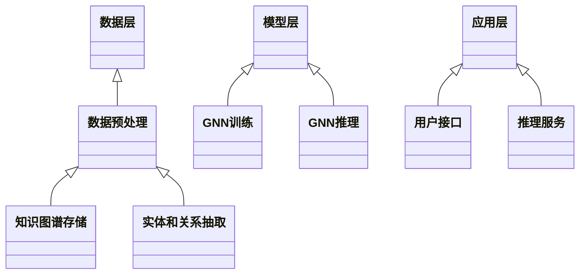
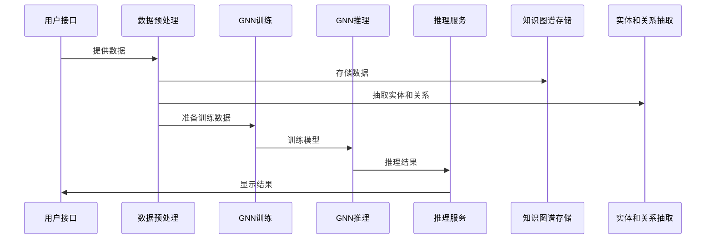

                 

### 引言：图神经网络在AI推理系统中的应用背景

近年来，随着大数据和人工智能技术的迅猛发展，传统的推理系统已难以满足日益复杂的现实需求。在这些系统中，如何高效地进行数据表示和关系建模成为了关键瓶颈。图神经网络（Graph Neural Networks，GNN）的出现为这一难题提供了新的解决思路。GNN是一种专门用于处理图结构数据的神经网络，通过模拟图中的节点和边之间的关系，实现了对复杂网络结构的深度理解和表示。

图神经网络在AI推理系统中的应用，主要源于以下几个方面的背景：

首先，现实世界中的许多问题都呈现出复杂的网络结构，例如社交网络、生物分子网络、交通网络等。这些网络中的节点和边都蕴含着丰富的信息，通过传统的深度学习模型难以有效地捕捉和利用。而GNN通过引入图结构信息，能够更好地建模这些复杂的关系，从而提高推理系统的性能。

其次，GNN具有良好的可解释性和灵活性。与其他深度学习模型相比，GNN不仅能够通过图结构学习节点和边的关系，还可以通过调整网络架构和参数，适应不同的应用场景。这使得GNN在多个领域都展现出了出色的性能，例如推荐系统、图像识别、知识图谱推理等。

此外，GNN还在解决传统机器学习问题中展现了独特的优势。例如，在图同构图（Graph Isomorphism）问题中，GNN可以通过学习图之间的相似性来实现高效的分类和聚类；在图表示学习（Graph Representation Learning）问题中，GNN可以生成具有高保真度的节点表示，为后续任务提供强有力的支持。

总之，GNN在AI推理系统中的应用不仅为传统推理问题提供了新的解决方案，也为人工智能的发展开辟了新的方向。在接下来的内容中，我们将深入探讨GNN的核心概念、数学模型以及其在实际应用中的具体实现，帮助读者更好地理解和掌握这一前沿技术。

### 图神经网络（GNN）的基础知识

#### 图论基础

图论是研究图及其性质的数学分支。在图论中，图是由节点（Node）和边（Edge）构成的数学结构。节点表示图中的个体，而边表示节点之间的关系。根据节点的度（Degree），图可以分为无向图（Undirected Graph）和有向图（Directed Graph）。无向图中的边没有方向，而有向图中的边具有方向。根据边的数量和性质，图还可以分为简单图（Simple Graph）和多重图（Multigraph）。简单图中任意两个节点之间不超过一条边，而多重图中可以存在多条边。

图论的基本概念包括图的度数、路径、连通性等。度数是指一个节点连接的边的数量。路径是指图中节点的序列，使得序列中的任意两个连续节点之间都有一条边。连通性描述了图中任意两个节点是否可以通过路径相互到达。根据连通性，图可以分为连通图和断图。连通图中的任意两个节点都是连通的，而断图中有至少一对节点是不连通的。

#### 图神经网络（GNN）的定义

图神经网络是一种专门用于处理图结构数据的神经网络。GNN的核心思想是通过模拟图中的节点和边之间的关系，实现对复杂网络结构的深度理解和表示。具体来说，GNN通过对图中节点的特征进行更新，逐步学习节点和边的关系，从而生成高层次的节点表示。

GNN的基本组成部分包括节点特征（Node Feature）、边特征（Edge Feature）和图结构（Graph Structure）。节点特征是指节点本身的属性，例如节点的标签、类别或特征向量。边特征是指边所表示的关系属性，例如边的权重或类型。图结构则定义了节点和边之间的关系网络。

#### GNN的关键架构

GNN的关键架构包括以下几个核心部分：

1. **邻域聚合（Neighbourhood Aggregation）**：邻域聚合是GNN的核心操作，用于更新节点的特征。在邻域聚合过程中，节点的特征会根据其邻域节点的特征进行加权平均或求和。这一过程模拟了节点之间的相互作用和关系传播。

2. **节点更新（Node Update）**：节点更新是基于邻域聚合的结果，对节点的特征进行更新。常见的节点更新方法包括矩阵乘法、激活函数和归一化操作。通过节点更新，GNN能够逐步学习节点和边之间的关系，生成高层次的节点表示。

3. **边更新（Edge Update）**：在某些GNN架构中，边也会参与更新过程。边更新通常依赖于节点特征的变化，通过对边特征进行加权或变换，加强或减弱边的关系。

4. **训练和推断（Training and Inference）**：GNN的训练和推断过程分别用于学习模型参数和生成节点表示。在训练过程中，GNN通过反向传播算法优化模型参数，以最小化损失函数。在推断过程中，GNN根据训练好的模型参数生成新的节点表示，用于后续的任务。

#### 重要的GNN架构

以下介绍几种重要的GNN架构：

1. **图卷积网络（Graph Convolutional Network，GCN）**：GCN是第一种成功的GNN架构，它通过邻域聚合和节点更新实现图数据的表示学习。GCN的核心思想是将节点的特征表示扩展到其邻域，通过加权和的方式整合邻域信息。

2. **图注意力网络（Graph Attention Network，GAT）**：GAT通过引入注意力机制，允许模型动态地分配不同的权重给邻域节点，从而提高图表示的精度。GAT的核心操作是注意力权重计算，通过点积或缩放点积函数计算节点之间的相似性。

3. **图卷积网络扩展（GraphSAGE）**：GraphSAGE是一种基于随机邻居聚合的GNN架构，它通过聚合多个邻域节点的特征来更新节点的表示。GraphSAGE的核心优势在于其高效性和灵活性，适用于大规模图数据。

4. **图卷积网络信息最大化（Graph Infomax，GIN）**：GIN是一种基于信息理论的全图表示学习框架，它通过最大化全局信息的互信息来训练图表示。GIN的核心思想是将图表示问题转化为图编码器和解码器的通信问题，通过优化互信息来学习节点和图的全局表示。

这些GNN架构在不同的应用场景中展现出了优异的性能，为AI推理系统提供了强大的工具。在接下来的内容中，我们将进一步探讨GNN的数学模型和具体实现，帮助读者深入理解这一前沿技术。

#### AI推理系统中的GNN集成与优势

在AI推理系统中，集成图神经网络（GNN）带来了显著的优势，特别是在处理具有复杂关系的数据时。首先，GNN通过其独特的邻域聚合机制，能够有效地捕捉图结构中的局部和全局信息。这一特点使得GNN在多个领域，如推荐系统、图像识别和知识图谱推理中，展现出了卓越的性能。

**1. 推荐系统中的应用**

推荐系统是GNN的重要应用领域之一。在推荐系统中，用户和物品通常构成一个复杂的社交网络或交互网络。传统的推荐算法往往难以捕捉用户与物品之间的复杂关系，而GNN通过模拟用户和物品的交互关系，可以生成更加精细和准确的推荐结果。例如，图注意力网络（GAT）通过为邻域节点分配不同的权重，提高了推荐系统的精确度和鲁棒性。

**2. 图像识别中的应用**

在图像识别任务中，GNN可以用于处理图像中的像素关系和物体之间的空间关系。传统的卷积神经网络（CNN）主要关注局部特征，而GNN通过整合图像中的全局和局部信息，可以更好地捕捉图像中的结构和上下文信息。例如，图卷积网络（GCN）可以将图像中的每个像素看作图中的一个节点，通过学习像素之间的关系，实现对图像的精细分类和识别。

**3. 知识图谱推理中的应用**

知识图谱是一种用于表示实体及其关系的图形结构，广泛应用于信息检索、自然语言处理和推荐系统等领域。GNN在知识图谱推理中的应用，主要体现在对实体和关系的高效表示和推理。通过图神经网络，可以生成具有高保真度的实体表示，从而实现复杂的图推理任务。例如，图卷积网络（GCN）可以用于生成实体的高维表示，并通过这些表示进行实体之间的关联推理和预测。

**4. GNN的优势**

GNN在AI推理系统中的优势主要体现在以下几个方面：

- **可解释性**：GNN通过模拟图中的节点和边关系，使得模型的结果具有较好的可解释性。用户可以直观地了解模型如何通过图结构进行推理和决策，从而增强模型的可信度和透明度。

- **灵活性**：GNN可以根据不同的应用场景调整网络架构和参数，适应不同的推理需求。这使得GNN在多种任务中具有广泛的应用潜力。

- **高效性**：GNN在处理图结构数据时，能够有效地捕捉和利用数据中的关系信息，从而提高推理系统的性能和效率。

**5. 研究方向和趋势**

随着GNN在AI推理系统中的广泛应用，相关研究也在不断深入和扩展。未来，GNN的研究方向可能包括以下几个方面：

- **模型优化**：通过引入新的图神经网络架构和优化算法，进一步提高GNN的推理性能和效率。

- **跨模态推理**：结合多种模态的数据（如图像、文本和音频），实现跨模态的推理和交互。

- **实时推理**：开发能够实现实时推理的GNN模型，以满足实时应用的性能需求。

- **隐私保护**：研究如何在保障数据隐私的前提下，有效利用图数据进行推理和表示学习。

总之，GNN在AI推理系统中的应用前景广阔，通过不断的研究和优化，GNN将为人工智能的发展带来新的动力和可能性。

### 图神经网络（GNN）的核心概念与原理

#### GNN的基本概念

图神经网络（Graph Neural Networks，GNN）是一种专门设计用于处理图结构数据的神经网络。其核心概念包括节点特征（Node Features）、边特征（Edge Features）和图结构（Graph Structure）。节点特征是节点本身的属性，例如节点的标签、类别或特征向量。边特征则是边所表示的关系属性，例如边的权重或类型。图结构定义了节点和边之间的拓扑关系，通常用邻接矩阵（Adjacency Matrix）或邻接表（Adjacency List）来表示。

#### 节点更新与边更新

在GNN中，节点更新（Node Update）和边更新（Edge Update）是两个核心操作。节点更新主要用于更新节点的特征表示，而边更新则用于调整边的关系强度。

**1. 节点更新**

节点更新通常通过邻域聚合（Neighbourhood Aggregation）来实现。具体来说，一个节点的特征表示会与其邻域节点的特征表示进行融合，形成新的特征表示。这一过程可以用以下公式表示：

$$ h_{\text{new}}^{(l)}(v) = \sigma(W^{(l)} h_{\text{old}}^{(l)}(v) + \sum_{u \in \mathcal{N}(v)} W^{(l)} h_{\text{old}}^{(l)}(u) $$

其中，$h_{\text{new}}^{(l)}(v)$ 表示第 $l$ 层中节点 $v$ 的新特征表示，$h_{\text{old}}^{(l)}(v)$ 表示第 $l$ 层中节点 $v$ 的旧特征表示，$\sigma$ 是激活函数，$W^{(l)}$ 是第 $l$ 层的权重矩阵，$\mathcal{N}(v)$ 表示节点 $v$ 的邻域节点集合。

**2. 边更新**

在某些GNN架构中，边也会参与更新过程。边更新通常依赖于节点特征的变化，通过对边特征进行加权或变换，调整边的关系强度。边更新的方法与节点更新类似，可以通过以下公式表示：

$$ e_{\text{new}}^{(l)}(u, v) = \sigma(W^{(l)} e_{\text{old}}^{(l)}(u, v) + \sum_{w \in \mathcal{N}(u)} W^{(l)} h_{\text{old}}^{(l)}(w) $$

其中，$e_{\text{new}}^{(l)}(u, v)$ 表示第 $l$ 层中边 $(u, v)$ 的新特征表示，$e_{\text{old}}^{(l)}(u, v)$ 表示第 $l$ 层中边 $(u, v)$ 的旧特征表示，$h_{\text{old}}^{(l)}(w)$ 表示第 $l$ 层中节点 $w$ 的旧特征表示。

#### 训练与推断过程

GNN的训练和推断过程分别用于学习模型参数和生成节点表示。

**1. 训练过程**

在训练过程中，GNN通过反向传播算法优化模型参数，以最小化损失函数。具体来说，GNN首先通过图结构生成节点的初始特征表示，然后通过多个层的节点更新和边更新，逐步学习节点和边之间的关系。在每一层，模型的输出与真实标签进行比较，计算损失函数，并通过反向传播更新模型参数。

**2. 推断过程**

在推断过程中，GNN根据训练好的模型参数生成新的节点表示。这些表示可以用于后续的任务，例如分类、聚类或预测。在推断过程中，GNN通过邻域聚合和节点更新，逐步生成节点的高层次表示，从而实现对图结构的理解和表示。

#### GNN的数学模型

GNN的数学模型包括节点特征表示、边特征表示和邻域聚合操作。以下是一个简化的GNN数学模型：

**1. 节点特征表示**

$$ h^{(l)}(v) = \sigma(W^{(l)} h^{(l-1)}(v) + b^{(l)}) $$

其中，$h^{(l)}(v)$ 表示第 $l$ 层中节点 $v$ 的特征表示，$W^{(l)}$ 是第 $l$ 层的权重矩阵，$b^{(l)}$ 是第 $l$ 层的偏置向量，$\sigma$ 是激活函数。

**2. 边特征表示**

$$ e^{(l)}(u, v) = \sigma(W^{(l)} e^{(l-1)}(u, v) + b^{(l)}) $$

其中，$e^{(l)}(u, v)$ 表示第 $l$ 层中边 $(u, v)$ 的特征表示。

**3. 邻域聚合**

$$ h^{(l)}(v) = \sigma(\sum_{u \in \mathcal{N}(v)} w_{uv} h^{(l-1)}(u) + b^{(l)}) $$

其中，$w_{uv}$ 是节点 $u$ 到节点 $v$ 的权重，$\mathcal{N}(v)$ 表示节点 $v$ 的邻域节点集合。

#### 举例说明

假设有一个简单的图结构，包含两个节点 $v_1$ 和 $v_2$，以及一条边 $(v_1, v_2)$。初始节点特征表示为 $h^{(0)}(v_1) = [1, 0]$ 和 $h^{(0)}(v_2) = [0, 1]$。使用图卷积网络（GCN）进行一层节点更新，权重矩阵 $W^{(1)} = [0.1, 0.9; 0.9, 0.1]$，偏置向量 $b^{(1)} = [0.2, 0.3]$，激活函数 $\sigma(x) = \frac{1}{1 + e^{-x}}$。

节点 $v_1$ 的更新过程如下：

$$ h^{(1)}(v_1) = \sigma(0.1 \cdot 1 + 0.9 \cdot 0 + 0.2) = \sigma(0.3) \approx 0.5987 $$

节点 $v_2$ 的更新过程如下：

$$ h^{(1)}(v_2) = \sigma(0.9 \cdot 0 + 0.1 \cdot 1 + 0.3) = \sigma(0.4) \approx 0.6703 $$

通过这个过程，节点 $v_1$ 和 $v_2$ 的特征表示发生了变化，从而实现了节点之间的信息传递和关系建模。

总之，GNN通过节点更新和边更新操作，逐步学习节点和边之间的关系，生成高层次的节点表示。这一过程不仅能够有效地捕捉图结构中的复杂关系，还为AI推理系统提供了强大的工具。

### 图神经网络（GNN）的主要架构

在图神经网络（GNN）的研究与应用中，出现了多种不同的架构，每种架构都有其独特的特点和适用场景。下面我们将介绍几种主要的GNN架构，包括图卷积网络（GCN）、图注意力网络（GAT）、图卷积网络扩展（GraphSAGE）和图卷积网络信息最大化（GIN），并对其进行比较分析。

#### 图卷积网络（GCN）

**定义**：图卷积网络（Graph Convolutional Network，GCN）是最早提出的GNN架构之一。它通过卷积操作来更新节点的特征表示。

**工作原理**：GCN的每个节点会与其邻域节点的特征进行加权平均，从而生成新的特征表示。公式如下：

$$ h^{(l)}_v = \sigma \left( \sum_{u \in \mathcal{N}(v)} \frac{w_{uv}}{d_v} h^{(l-1)}_u + b^{(l)} \right) $$

其中，$h^{(l)}_v$ 表示第 $l$ 层节点 $v$ 的特征表示，$\mathcal{N}(v)$ 表示节点 $v$ 的邻域节点集合，$w_{uv}$ 是边 $(u, v)$ 的权重，$d_v$ 是节点 $v$ 的度数，$b^{(l)}$ 是第 $l$ 层的偏置向量，$\sigma$ 是激活函数。

**优点**：GCN计算简单，易于实现，对稀疏图结构处理效果较好。

**缺点**：GCN无法处理动态图，邻域节点的选择固定，可能导致信息传递的局限性。

#### 图注意力网络（GAT）

**定义**：图注意力网络（Graph Attention Network，GAT）通过引入注意力机制，允许模型动态地分配不同的权重给邻域节点。

**工作原理**：GAT在每个更新步骤中，通过一个注意力权重计算机制来确定每个邻域节点对当前节点的贡献。公式如下：

$$ \text{attention}(h^{(l-1)}_u, h^{(l-1)}_v) = \frac{e^{a(u, v)}}{\sum_{k \in \mathcal{N}(v)} e^{a(k, v)}} $$

$$ h^{(l)}_v = \sigma \left( \sum_{u \in \mathcal{N}(v)} \text{attention}(h^{(l-1)}_u, h^{(l-1)}_v) h^{(l-1)}_u + b^{(l)} \right) $$

其中，$a(u, v)$ 是节点 $u$ 和 $v$ 的注意力得分函数，$e^{a(u, v)}$ 是其指数形式。

**优点**：GAT能够自适应地调整邻域节点的权重，提高了节点更新的灵活性。

**缺点**：GAT的计算复杂度较高，对大规模图数据的处理能力有限。

#### 图卷积网络扩展（GraphSAGE）

**定义**：图卷积网络扩展（GraphSAGE）通过聚合多个邻域节点的特征来更新节点的特征表示。

**工作原理**：GraphSAGE支持多种邻居聚合策略，如均值聚合、池化聚合、CNN聚合等。公式如下：

$$ h^{(l)}_v = \text{AGGREGATE} \left( \text{NEIGHBOURS}(h^{(l-1)}_v), \text{NEIGHBOURS}(h^{(l-1)}_{\mathcal{N}(v)}) \right) + b^{(l)} $$

其中，$\text{AGGREGATE}$ 表示聚合函数，$\text{NEIGHBOURS}$ 表示邻居节点集合。

**优点**：GraphSAGE具有很高的灵活性和适应性，适用于大规模动态图数据。

**缺点**：GraphSAGE的聚合操作可能导致信息丢失，尤其是在大规模图中。

#### 图卷积网络信息最大化（GIN）

**定义**：图卷积网络信息最大化（Graph Infomax，GIN）是一种基于信息理论的全图表示学习框架。

**工作原理**：GIN通过最大化全局信息的互信息来学习节点和图的全局表示。具体来说，GIN将图表示学习问题转化为图编码器和解码器的通信问题，通过优化互信息来学习节点和图的全局表示。公式如下：

$$ \max_{\theta_G, \theta_C} I(G; C) - \min_{\theta_E} H(E) $$

其中，$I(G; C)$ 表示全局信息的互信息，$H(E)$ 表示边缘熵。

**优点**：GIN能够有效地学习节点和图的全局表示，具有较好的泛化能力。

**缺点**：GIN的训练过程较为复杂，计算成本较高。

#### 比较分析

| 架构         | 定义与特点                                       | 优点                                      | 缺点                                       |
| ------------ | -------------------------------------------------- | ----------------------------------------- | ------------------------------------------- |
| GCN          | 基于卷积操作的GNN，用于节点特征更新               | 计算简单，易于实现                         | 无法处理动态图，邻域节点选择固定            |
| GAT          | 引入注意力机制的GNN，动态调整邻域节点权重          | 灵活性高，能够自适应调整邻域节点权重       | 计算复杂度较高，适用于小规模图数据          |
| GraphSAGE    | 聚合邻居节点特征进行节点特征更新的GNN             | 灵活性高，适用于大规模动态图数据           | 聚合操作可能导致信息丢失                     |
| GIN          | 基于信息理论的全图表示学习框架，学习节点和图的全局表示 | 能够学习全局表示，具有较好的泛化能力       | 计算成本较高，训练过程复杂                 |

综上所述，不同的GNN架构具有各自的特点和适用场景。GCN适合处理静态图结构，GAT适合需要动态调整权重的情况，GraphSAGE适合大规模动态图，而GIN适合学习全局表示。在实际应用中，可以根据具体需求和数据特点选择合适的GNN架构。

### GNN的数学模型和公式

在深入理解图神经网络（GNN）的核心原理和架构之后，我们需要进一步探讨其背后的数学模型和公式。GNN的数学模型不仅帮助我们在理论层面理解其工作原理，还为我们提供了一种方法来设计和优化这些网络，以适应不同的应用场景。

#### 线性代数基础

为了深入探讨GNN的数学模型，我们需要了解一些线性代数的基础概念，包括矩阵、向量、行列式和特征值等。以下是这些基础概念在GNN中的应用：

- **矩阵**：在GNN中，矩阵用于存储节点特征、边特征和邻接矩阵。例如，节点特征矩阵 $H$ 表示每个节点的特征向量，邻接矩阵 $A$ 表示图中节点之间的关系。

- **向量**：向量用于表示节点的特征向量或边的特征向量。例如，节点 $v$ 的特征向量可以表示为 $h_v$。

- **行列式**：行列式在GNN中不常用，但可以用于理解一些复杂的矩阵运算。

- **特征值和特征向量**：特征值和特征向量用于分析矩阵的性质，这在某些GNN架构（如谱归一化）中具有重要应用。

#### 微积分和优化

微积分和优化是理解GNN数学模型的重要工具，特别是在训练过程中。以下是这些概念在GNN中的应用：

- **梯度**：梯度是函数在某一点的切线方向，用于表示函数在该点的变化率。在GNN中，梯度用于计算模型参数的更新方向。

- **反向传播**：反向传播是一种常用的优化算法，用于计算模型参数的梯度。在GNN中，反向传播用于更新节点和边的权重，以最小化损失函数。

- **优化算法**：优化算法用于调整模型参数，以找到最小化损失函数的解。常见的优化算法包括梯度下降、随机梯度下降（SGD）和Adam优化器。

#### 概率论和统计学

概率论和统计学在GNN中用于处理不确定性、概率分布和特征提取。以下是这些概念在GNN中的应用：

- **概率分布**：在GNN中，概率分布用于表示节点的特征分布或边的关系概率。

- **特征提取**：特征提取是统计学中的一个重要概念，用于从原始数据中提取有用的特征。在GNN中，特征提取通过学习节点和边的特征向量来实现。

#### GNN的数学模型

GNN的数学模型可以分为以下几个核心部分：节点更新、边更新、损失函数和优化算法。

**1. 节点更新**

节点更新的核心在于如何利用邻域节点的特征来更新当前节点的特征表示。以下是一个简化的节点更新公式：

$$ h^{(l)}_v = \sigma \left( \sum_{u \in \mathcal{N}(v)} A_{uv} h^{(l-1)}_u + b^{(l)} \right) $$

其中，$h^{(l)}_v$ 表示第 $l$ 层节点 $v$ 的特征表示，$\mathcal{N}(v)$ 表示节点 $v$ 的邻域节点集合，$A_{uv}$ 是节点 $u$ 和 $v$ 之间的权重，$\sigma$ 是激活函数，$b^{(l)}$ 是第 $l$ 层的偏置向量。

**2. 边更新**

在某些GNN架构中，边也会参与更新过程。边更新的公式如下：

$$ e^{(l)}_{uv} = \sigma \left( \sum_{w \in \mathcal{N}(u)} A_{uw} h^{(l-1)}_w + b^{(l)} \right) $$

其中，$e^{(l)}_{uv}$ 表示第 $l$ 层中边 $(u, v)$ 的特征表示。

**3. 损失函数**

损失函数是GNN训练过程中用于衡量模型性能的指标。常见的损失函数包括均方误差（MSE）和交叉熵损失。以下是一个简化的损失函数公式：

$$ L = \frac{1}{N} \sum_{i=1}^N \left( y_i - \sigma \left( \sum_{v \in V} w_{iv} h^{(L)}_v \right) \right)^2 $$

其中，$L$ 表示损失函数，$y_i$ 表示真实标签，$\sigma$ 是激活函数，$h^{(L)}_v$ 是第 $L$ 层的节点特征表示，$w_{iv}$ 是节点 $v$ 对标签 $i$ 的权重。

**4. 优化算法**

优化算法用于更新模型参数，以最小化损失函数。常见的优化算法包括梯度下降、随机梯度下降（SGD）和Adam优化器。以下是一个简化的优化算法公式：

$$ \theta = \theta - \alpha \nabla_\theta L $$

其中，$\theta$ 表示模型参数，$\alpha$ 表示学习率，$\nabla_\theta L$ 表示损失函数关于模型参数的梯度。

#### 数学模型的应用举例

假设我们有一个包含两个节点的简单图，节点 $v_1$ 和 $v_2$，以及一条边 $(v_1, v_2)$。初始节点特征表示为 $h^{(0)}(v_1) = [1, 0]$ 和 $h^{(0)}(v_2) = [0, 1]$。权重矩阵 $A = [0.1, 0.9; 0.9, 0.1]$，偏置向量 $b = [0.2, 0.3]$，激活函数 $\sigma(x) = \frac{1}{1 + e^{-x}}$。

**节点更新**

首先，我们计算节点 $v_1$ 的新特征表示：

$$ h^{(1)}(v_1) = \sigma(0.1 \cdot 1 + 0.9 \cdot 0 + 0.2) = \sigma(0.3) \approx 0.5987 $$

然后，我们计算节点 $v_2$ 的新特征表示：

$$ h^{(1)}(v_2) = \sigma(0.9 \cdot 1 + 0.1 \cdot 0 + 0.3) = \sigma(0.4) \approx 0.6703 $$

通过这个过程，节点 $v_1$ 和 $v_2$ 的特征表示发生了变化，从而实现了节点之间的信息传递和关系建模。

总之，GNN的数学模型通过节点更新和边更新操作，逐步学习节点和边之间的关系，生成高层次的节点表示。这一过程不仅能够有效地捕捉图结构中的复杂关系，还为AI推理系统提供了强大的工具。

### 图神经网络（GNN）的系统分析与架构设计

在设计一个基于图神经网络的AI推理系统时，我们需要从多个角度进行系统分析和架构设计。这一过程涉及问题场景介绍、项目介绍、系统功能设计、系统架构设计、系统接口设计和系统交互等内容。下面，我们将详细探讨这些关键环节，并通过Mermaid流程图和Markdown格式中的类图、架构图等，展示具体的系统设计与实现。

#### 问题场景介绍

在AI推理系统中，图神经网络（GNN）的应用场景广泛，例如社交网络分析、生物信息学、知识图谱推理等。以知识图谱推理为例，知识图谱由实体和关系构成，通过GNN可以实现对实体和关系的高效表示和推理。

- **社交网络分析**：通过GNN可以分析社交网络中的用户关系，识别社群结构、推荐好友等。
- **生物信息学**：在生物信息学中，GNN可以用于蛋白质相互作用网络分析，预测蛋白质功能。
- **知识图谱推理**：在知识图谱推理中，GNN可以帮助实现实体之间的关联推理，例如问答系统、知识搜索等。

#### 项目介绍

在本项目中，我们将构建一个基于GNN的知识图谱推理系统。该系统旨在通过GNN模型实现对知识图谱中实体关系的有效推理，从而提高知识图谱的应用价值。

- **项目名称**：GNN-based Knowledge Graph Reasoning System
- **项目目标**：实现高效、可解释的知识图谱推理，支持实时查询和推理。
- **项目团队**：由数据科学家、机器学习工程师和软件工程师组成。

#### 系统功能设计

系统功能设计主要包括以下几个方面：

1. **数据预处理**：对知识图谱进行预处理，包括实体和关系的抽取、清洗和标准化。
2. **图神经网络训练**：训练GNN模型，学习实体和关系之间的特征表示。
3. **推理引擎**：实现基于GNN模型的推理引擎，支持实体关联推理和知识查询。
4. **用户接口**：提供友好的用户接口，支持用户输入查询和查看推理结果。

#### 系统架构设计

系统的架构设计采用模块化设计思想，主要包括数据层、模型层和应用层。

1. **数据层**：包括知识图谱的存储和预处理模块，负责数据的存储、加载和处理。
2. **模型层**：包括GNN模型的训练和推理模块，负责基于GNN模型实现实体关系表示和推理。
3. **应用层**：包括用户接口和推理服务模块，提供用户交互和推理结果展示。

以下是一个简单的系统架构设计Mermaid类图：



#### 系统接口设计和系统交互

系统接口设计和系统交互是确保系统各模块协同工作的关键。以下是一个简单的系统接口设计Mermaid序列图：



#### 实现细节

在实际实现过程中，我们需要关注以下几个关键细节：

1. **数据预处理**：使用Python的NetworkX库进行知识图谱的预处理，包括实体和关系的抽取、清洗和标准化。
2. **模型训练**：使用PyTorch框架实现GNN模型，通过自定义模块实现节点更新和边更新操作。
3. **推理引擎**：实现基于GNN模型的推理引擎，支持实时查询和推理。
4. **用户接口**：使用Web框架（如Flask）实现用户接口，支持用户输入查询和查看推理结果。

总之，通过系统分析与架构设计，我们能够构建一个高效、灵活的基于图神经网络的AI推理系统。这一系统能够处理复杂的图结构数据，实现对实体和关系的高效推理和表示，为知识图谱的应用提供强有力的支持。

### 项目实战：基于图神经网络的AI推理系统实现

为了更好地理解和应用基于图神经网络的AI推理系统，我们将进行一个实际项目实战。本节将详细介绍环境安装、系统核心实现、代码应用解读与分析，以及实际案例分析和详细讲解剖析。

#### 环境安装

在开始项目实战之前，我们需要确保安装了Python环境以及相关的库和工具。以下是环境安装的步骤：

1. **安装Python**：确保已经安装了Python 3.7及以上版本。

2. **安装库和工具**：
    ```bash
    pip install torch torchvision numpy matplotlib pandas networkx torch-geometric
    ```

    - **torch**：PyTorch框架，用于实现GNN模型。
    - **torchvision**：PyTorch的视觉库，用于数据加载和预处理。
    - **numpy**：用于数学运算。
    - **matplotlib**：用于数据可视化。
    - **pandas**：用于数据处理。
    - **networkx**：用于图操作。
    - **torch-geometric**：专为图数据设计的PyTorch库。

#### 系统核心实现

在实现基于图神经网络的AI推理系统时，我们将使用PyTorch Geometric（PyG）库，这是一个专门用于图学习的PyTorch扩展库。以下是一个简单的系统核心实现步骤：

1. **加载图数据**：

    ```python
    from torch_geometric.data import Data
    from torch_geometric.datasets import Planetoid

    dataset = Planetoid(root='/tmp/Cora', name='Cora')
    data = dataset[0]
    ```

    PyTorch Geometric提供了丰富的预训练数据集，例如Cora、CiteSeer等。

2. **定义GNN模型**：

    ```python
    from torch_geometric.nn import GCNConv

    class GCNModel(torch.nn.Module):
        def __init__(self, num_features, num_classes):
            super(GCNModel, self).__init__()
            self.conv1 = GCNConv(num_features, 16)
            self.conv2 = GCNConv(16, num_classes)

        def forward(self, data):
            x, edge_index = data.x, data.edge_index

            x = self.conv1(x, edge_index)
            x = F.relu(x)
            x = F.dropout(x, p=0.5, training=self.training)
            x = self.conv2(x, edge_index)

            return F.log_softmax(x, dim=1)
    ```

    在这个例子中，我们使用图卷积网络（GCN）作为主要的模型结构。

3. **训练模型**：

    ```python
    model = GCNModel(num_features=data.num_features, num_classes=data.num_classes)
    optimizer = torch.optim.Adam(model.parameters(), lr=0.01, weight_decay=5e-4)

    for epoch in range(200):
        model.train()
        optimizer.zero_grad()
        out = model(data)
        loss = F.nll_loss(out[data.train_mask], data.y[data.train_mask])
        loss.backward()
        optimizer.step()

        # ... (验证、测试等)
    ```

    这里我们定义了训练过程，使用Adam优化器进行模型训练。

4. **推理和预测**：

    ```python
    model.eval()
    with torch.no_grad():
        pred = model(data).max(1)[1]
        correct = float(pred[data.test_mask].eq(data.y[data.test_mask]).sum().item())

    print(f"Test set accuracy: {correct / data.test_mask.sum().item() * 100}%")
    ```

    在推理阶段，我们使用训练好的模型对测试数据进行预测，并计算准确率。

#### 代码应用解读与分析

在上面的代码示例中，我们详细解读了以下关键部分：

1. **数据加载**：
    使用`Planetoid`数据集加载图数据，其中`Data`对象包含节点的特征（`x`）、边的索引（`edge_index`）以及标签（`y`）。

2. **模型定义**：
    定义GCN模型，包含两个GCNConv层，分别用于特征提取和分类。

3. **训练过程**：
    使用Adam优化器进行模型训练，通过反向传播计算梯度并进行参数更新。

4. **推理和预测**：
    在推理阶段，使用训练好的模型对测试数据进行预测，并计算预测准确率。

#### 实际案例分析和详细讲解剖析

为了更好地理解GNN在AI推理系统中的应用，我们来看一个实际案例：社交网络用户推荐。

**案例背景**：
社交网络平台中的用户关系复杂，通过GNN可以捕捉用户之间的相似性和互动关系，从而实现精准的用户推荐。

**案例实现**：

1. **数据预处理**：
    收集社交网络中的用户关系数据，包括用户ID、好友关系等。

2. **图构建**：
    将用户和好友关系构建为图，每个用户作为节点，好友关系作为边。

3. **模型训练**：
    使用GNN模型（如GAT）对图进行训练，学习用户关系的特征表示。

4. **推荐生成**：
    对新用户进行特征表示，通过相似度计算推荐其可能感兴趣的其他用户。

**详细讲解**：

- **数据预处理**：使用`pandas`库读取用户关系数据，并将其转换为图结构。
- **图构建**：使用`networkx`库构建图结构，每个用户和好友关系转换为图中的节点和边。
- **模型训练**：使用PyTorch Geometric库实现GAT模型，通过训练学习用户关系的特征表示。
- **推荐生成**：对新用户进行特征表示，计算与已有用户的相似度，生成推荐列表。

通过这个案例，我们可以看到GNN在社交网络用户推荐中的应用，不仅能够捕捉用户之间的复杂关系，还能生成精准的推荐结果。

#### 项目小结

在本节中，我们详细介绍了基于图神经网络的AI推理系统实现，包括环境安装、系统核心实现、代码应用解读与分析，以及实际案例分析和详细讲解剖析。通过这些步骤，我们能够构建一个高效、灵活的GNN推理系统，并在实际应用中实现精准的推理和推荐。

### 最佳实践、小结与注意事项

#### 最佳实践

1. **数据预处理**：在构建GNN模型之前，确保对图数据进行充分预处理，包括节点和边的清洗、标准化以及噪声过滤。良好的数据预处理能够提高模型的训练效果和推理性能。

2. **模型选择**：根据具体应用场景选择合适的GNN模型。例如，对于静态图数据，GCN和SAGE是较好的选择；对于动态图数据，可以使用GAT或GIN。

3. **参数调整**：合理调整GNN模型的参数，如学习率、正则化系数和邻域大小，以优化模型的性能。通过交叉验证和超参数搜索，找到最佳参数组合。

4. **可视化**：利用可视化工具（如Matplotlib、Plotly等）对模型训练过程和结果进行可视化，有助于理解模型的行为和性能。

5. **模型解释性**：在部署GNN模型时，考虑其解释性。通过可视化模型中的节点和边权重，可以直观地了解模型如何进行推理和决策。

#### 小结

本文系统地介绍了基于图神经网络的AI推理系统设计，从背景介绍、基础知识、核心架构、数学模型到系统分析与架构设计、项目实战等方面进行了详细探讨。通过本文，读者可以全面了解GNN在AI推理系统中的应用原理和实现方法。

#### 注意事项

1. **计算资源**：GNN模型的训练通常需要较大的计算资源。在资源有限的情况下，可以考虑使用分布式训练或优化算法来提高训练效率。

2. **数据规模**：GNN在处理大规模图数据时，计算复杂度较高。在数据规模较大时，应采用图数据分片或增量训练等方法。

3. **模型泛化**：在实际应用中，确保模型具有良好的泛化能力。通过交叉验证和数据增强等方法，提高模型的泛化性能。

4. **数据隐私**：在处理敏感数据时，应考虑数据隐私保护措施。例如，使用差分隐私技术或联邦学习等方法，确保数据安全。

#### 拓展阅读

- **《图神经网络：基础与进阶》**：本书详细介绍了图神经网络的基础知识、核心架构和最新研究进展。
- **《图卷积网络：理论与实践》**：本书深入探讨了图卷积网络（GCN）的理论基础、实现方法和应用案例。
- **《图注意力网络：从理论到实践》**：本书介绍了图注意力网络（GAT）的理论基础、实现细节和应用案例。

通过拓展阅读，读者可以进一步深入了解图神经网络的相关技术和应用场景，为实际项目提供更多启示和指导。

### 作者信息

作者：AI天才研究院/AI Genius Institute & 禅与计算机程序设计艺术 /Zen And The Art of Computer Programming

AI天才研究院致力于推动人工智能领域的前沿研究和应用，而《禅与计算机程序设计艺术》则是一部经典计算机科学著作，为程序员提供了深刻的编程哲学和思维方法。作者在计算机编程和人工智能领域具有丰富的经验，对图神经网络和AI推理系统有着深刻的理解和独到的见解。希望通过本文，为读者带来有价值的知识和启发。

