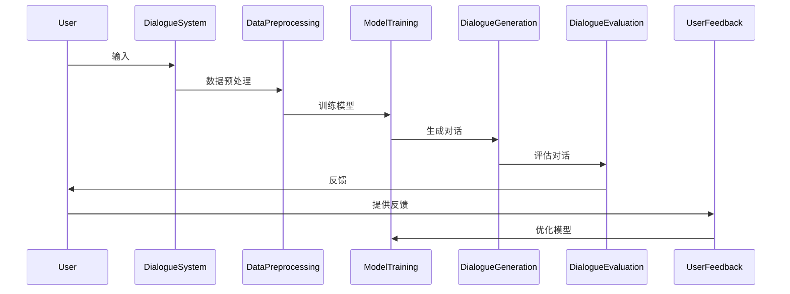

                 

# 基于奖励的AI训练方法的创新与挑战

> 关键词：奖励机制、AI训练、强化学习、应用场景、实现策略

> 摘要：本文探讨了基于奖励的AI训练方法，详细介绍了其背景、核心概念、应用场景和实现策略。通过深入分析，本文提出了该方法的挑战和未来发展方向，为读者提供了全面的技术理解和实践指导。

---

### 第1章：问题背景与核心概念

#### 1.1.1 问题背景

随着人工智能（AI）技术的快速发展，AI训练方法的研究成为了当前学术界和工业界的重要方向。传统的AI训练方法主要依赖于大量的人工标注数据和复杂的模型架构，这不仅限制了AI应用的范围和深度，也增加了训练成本和计算资源的需求。为了克服这些限制，基于奖励的AI训练方法应运而生。

#### 1.1.2 问题描述

基于奖励的AI训练方法通过引入奖励机制，使得AI模型能够自主学习和优化，从而减少了人工干预和标注数据的依赖。这种方法的核心在于如何设计有效的奖励机制，以激励AI模型在训练过程中达到预定的目标。

#### 1.1.3 问题解决

本文旨在探讨基于奖励的AI训练方法的创新与挑战，通过深入分析其原理、应用场景和实现策略，为读者提供一套全面而系统的理解框架。

#### 1.1.4 边界与外延

本文的研究主要聚焦于基于奖励的AI训练方法在自然语言处理、计算机视觉和强化学习等领域的应用。同时，我们也关注该方法在其他新兴领域的潜力。

#### 1.1.5 概念结构与核心要素组成

**概念结构：**

- **奖励机制**：激励AI模型在训练过程中追求特定目标的机制。
- **目标函数**：衡量AI模型训练效果的指标。
- **训练数据**：用于训练AI模型的输入数据。

**核心要素组成：**

- **奖励函数设计**：设计合适的奖励函数，以引导AI模型学习。
- **训练策略**：制定有效的训练策略，以优化AI模型的性能。
- **评估方法**：评估AI模型训练效果的指标和方法。

---

### 第2章：基于奖励的AI训练方法原理

#### 2.1.1 奖励机制概述

奖励机制是引导AI模型学习的关键，它通过给予AI模型正向或负向的奖励，激励其在训练过程中达到预定的目标。本章将介绍奖励机制的基本概念、类型和设计原则。

**奖励机制的基本概念：**

奖励机制是一种机制，它通过给予AI模型奖励或惩罚，激励模型在训练过程中做出最优决策。奖励可以是正向的，以激励模型向更好的方向学习；也可以是负向的，以阻止模型学习不良行为。

**奖励机制的类型：**

1. **基于规则的奖励机制**：根据预定义的规则，对模型的输出进行奖励或惩罚。
2. **基于反馈的奖励机制**：根据外部反馈，对模型的输出进行奖励或惩罚。
3. **自适应奖励机制**：根据模型的训练过程，动态调整奖励机制。

**奖励机制的设计原则：**

1. **激励性**：奖励机制应能有效地激励模型学习。
2. **公平性**：奖励机制应对所有模型输出公平，避免偏袒。
3. **鲁棒性**：奖励机制应能够适应不同的训练环境和数据分布。

**奖励机制的应用场景：**

1. **强化学习**：通过奖励机制，激励模型在复杂的决策环境中学习最优策略。
2. **生成对抗网络（GAN）**：通过奖励机制，激励生成器产生更逼真的样本。
3. **自动驾驶**：通过奖励机制，激励自动驾驶模型学习最佳驾驶策略。

#### 2.1.2 目标函数分析

目标函数是衡量AI模型训练效果的重要指标。本章将详细分析目标函数的设计原则、常见类型及其在AI训练中的应用。

**目标函数的设计原则：**

1. **可导性**：目标函数应具有可导性，以便于使用梯度下降等优化算法。
2. **泛化性**：目标函数应能够衡量模型在未知数据上的表现。
3. **复杂性**：目标函数的复杂性应与模型的复杂性相匹配。

**目标函数的类型：**

1. **损失函数**：用于衡量模型输出与真实值之间的差距。
2. **评价指标**：用于衡量模型在不同任务上的表现，如准确率、召回率等。
3. **多目标函数**：同时考虑多个目标，以平衡模型在不同任务上的表现。

**目标函数在AI训练中的应用：**

1. **监督学习**：通过最小化损失函数，优化模型的参数。
2. **无监督学习**：通过最小化重建误差，优化生成模型的参数。
3. **强化学习**：通过最大化累积奖励，优化模型的行为策略。

#### 2.1.3 训练策略探讨

训练策略是优化AI模型性能的关键。本章将探讨基于奖励的AI训练方法中常用的训练策略，包括自适应奖励调整、多任务训练和迁移学习等。

**自适应奖励调整**：

自适应奖励调整是一种动态调整奖励机制的方法，根据模型的训练过程，实时调整奖励的大小和方向。这种方法能够更好地激励模型学习，提高训练效率。

**多任务训练**：

多任务训练是一种同时训练多个任务的AI模型的方法。通过共享模型参数，多任务训练能够提高模型的泛化能力和效率。基于奖励的多任务训练通过设计合理的奖励机制，使得模型在多个任务上都能取得良好的表现。

**迁移学习**：

迁移学习是一种将已训练模型的部分知识转移到新任务上的方法。基于奖励的迁移学习通过设计合理的奖励机制，使得模型在新任务上能够快速适应并取得良好效果。

**训练策略的选择原则：**

1. **适应性**：训练策略应能够适应不同的训练环境和数据分布。
2. **效率**：训练策略应能够提高训练效率，减少训练时间。
3. **鲁棒性**：训练策略应能够应对训练过程中的各种异常情况。

---

### 第3章：基于奖励的AI训练方法应用场景

#### 3.1 自然语言处理

自然语言处理（NLP）是AI领域的一个重要分支。基于奖励的AI训练方法在NLP中有着广泛的应用，包括机器翻译、文本分类和问答系统等。

**机器翻译**：

机器翻译是一种将一种语言的文本自动翻译成另一种语言的技术。基于奖励的AI训练方法通过设计合适的奖励机制，使得翻译模型在训练过程中能够自动调整翻译策略，提高翻译质量。

**文本分类**：

文本分类是一种将文本数据自动归类到预定义的类别中的技术。基于奖励的AI训练方法通过设计合适的奖励机制，使得分类模型在训练过程中能够自动调整分类策略，提高分类准确率。

**问答系统**：

问答系统是一种能够自动回答用户问题的技术。基于奖励的AI训练方法通过设计合适的奖励机制，使得问答系统能够在训练过程中自动调整回答策略，提高回答质量。

#### 3.2 计算机视觉

计算机视觉是AI技术的另一个重要领域。基于奖励的AI训练方法在计算机视觉中有着广泛的应用，包括图像分类、目标检测和图像生成等。

**图像分类**：

图像分类是一种将图像数据自动归类到预定义的类别中的技术。基于奖励的AI训练方法通过设计合适的奖励机制，使得分类模型在训练过程中能够自动调整分类策略，提高分类准确率。

**目标检测**：

目标检测是一种在图像中自动识别和定位物体的技术。基于奖励的AI训练方法通过设计合适的奖励机制，使得检测模型在训练过程中能够自动调整检测策略，提高检测准确率。

**图像生成**：

图像生成是一种从随机噪声生成逼真图像的技术。基于奖励的AI训练方法通过设计合适的奖励机制，使得生成模型在训练过程中能够自动调整生成策略，提高生成质量。

#### 3.3 强化学习

强化学习是AI训练方法的一个重要分支。基于奖励的AI训练方法在强化学习中的应用广泛，包括智能体控制、游戏和机器人导航等。

**智能体控制**：

智能体控制是一种通过训练智能体在复杂环境中做出最优决策的技术。基于奖励的AI训练方法通过设计合适的奖励机制，使得智能体在训练过程中能够自动调整控制策略，提高控制性能。

**游戏**：

游戏是一种模拟现实世界场景的技术。基于奖励的AI训练方法通过设计合适的奖励机制，使得游戏模型在训练过程中能够自动调整游戏策略，提高游戏表现。

**机器人导航**：

机器人导航是一种通过训练机器人自动在未知环境中导航的技术。基于奖励的AI训练方法通过设计合适的奖励机制，使得导航模型在训练过程中能够自动调整导航策略，提高导航性能。

---

### 第4章：基于奖励的AI训练方法实现策略

#### 4.1 数据准备与预处理

数据准备和预处理是AI训练的基础。本章将介绍如何收集和预处理数据，以支持基于奖励的AI训练方法的实施。

**数据收集**：

数据收集是AI训练的第一步。数据收集的方法包括公开数据集、私有数据集和手工标注数据等。在选择数据集时，需要考虑数据的质量、多样性和规模。

**数据预处理**：

数据预处理是数据收集后的重要步骤。数据预处理的方法包括数据清洗、数据归一化和数据增强等。数据清洗是去除数据中的噪声和错误；数据归一化是将数据转换为同一尺度，以便于模型训练；数据增强是通过生成新的数据样本，提高模型的泛化能力。

**数据预处理流程**：

1. 数据收集：选择合适的数据集。
2. 数据清洗：去除噪声和错误数据。
3. 数据归一化：将数据转换为同一尺度。
4. 数据增强：生成新的数据样本。

#### 4.2 奖励函数设计

奖励函数设计是关键的一步。本章将详细介绍如何设计有效的奖励函数，以激励AI模型在训练过程中达到预定的目标。

**奖励函数的设计原则**：

1. **激励性**：奖励函数应能够激励模型在训练过程中做出正确的决策。
2. **公平性**：奖励函数应对所有模型输出公平，避免偏袒。
3. **动态性**：奖励函数应根据训练过程的进展动态调整。

**奖励函数的类型**：

1. **基于规则的奖励函数**：根据预定义的规则，对模型的输出进行奖励或惩罚。
2. **基于反馈的奖励函数**：根据外部反馈，对模型的输出进行奖励或惩罚。
3. **自适应奖励函数**：根据模型的训练过程，动态调整奖励函数。

**奖励函数的设计流程**：

1. 确定目标：明确模型需要达成的目标。
2. 设计规则：根据目标设计奖励规则。
3. 实验验证：通过实验验证奖励函数的有效性。
4. 调整优化：根据实验结果调整和优化奖励函数。

#### 4.3 训练过程优化

训练过程的优化对于提高AI模型的性能至关重要。本章将探讨如何通过调整训练策略和优化算法来提高训练效率。

**训练策略**：

1. **自适应学习率**：根据训练过程动态调整学习率。
2. **批量大小**：调整批量大小，以平衡训练速度和模型性能。
3. **数据增强**：通过生成新的数据样本，提高模型的泛化能力。

**优化算法**：

1. **随机梯度下降（SGD）**：通过随机梯度下降算法，优化模型的参数。
2. **Adam优化器**：通过自适应矩估计（Adam）优化器，提高训练效率。
3. **权重共享**：通过共享模型参数，减少模型参数的数量，提高训练效率。

**训练过程优化流程**：

1. 选择优化算法：根据模型和训练环境选择合适的优化算法。
2. 调整训练策略：根据训练过程调整训练策略。
3. 实验验证：通过实验验证训练策略和优化算法的有效性。
4. 调整优化：根据实验结果调整和优化训练策略和优化算法。

---

### 第5章：基于奖励的AI训练方法挑战与展望

#### 5.1 挑战分析

基于奖励的AI训练方法在实际应用中面临着诸多挑战，包括奖励设计、训练效率、模型可解释性和安全性等。本章将分析这些挑战，并提出相应的解决策略。

**奖励设计**：

奖励设计的核心在于如何设计合适的奖励机制，以激励AI模型在训练过程中达到预定的目标。挑战在于如何平衡激励性和公平性，避免模型过度拟合或忽略某些任务。

**解决策略**：

1. **多奖励机制**：设计多个奖励机制，以平衡不同任务的重要性。
2. **动态调整奖励**：根据训练过程动态调整奖励机制，以提高模型的适应能力。

**训练效率**：

基于奖励的AI训练方法通常需要大量的计算资源，训练效率是一个重要挑战。如何提高训练效率，减少训练时间，是一个关键问题。

**解决策略**：

1. **分布式训练**：通过分布式训练，提高训练速度。
2. **数据并行**：通过数据并行，减少模型参数的数量，提高训练速度。
3. **模型压缩**：通过模型压缩，减少模型的计算复杂度，提高训练速度。

**模型可解释性**：

基于奖励的AI训练方法通常涉及到复杂的模型和奖励机制，模型的可解释性是一个重要挑战。如何提高模型的可解释性，帮助用户理解模型的决策过程，是一个关键问题。

**解决策略**：

1. **可视化**：通过可视化技术，展示模型的决策过程。
2. **解释性模型**：设计可解释性更强的模型，以提高模型的可理解性。

**安全性**：

基于奖励的AI训练方法可能会受到恶意攻击，如对抗攻击等。如何提高模型的安全性，防止恶意攻击，是一个重要挑战。

**解决策略**：

1. **对抗训练**：通过对抗训练，提高模型对对抗攻击的鲁棒性。
2. **安全机制**：设计安全机制，防止恶意攻击。

#### 5.2 未来展望

随着AI技术的不断发展，基于奖励的AI训练方法有望在更多领域得到应用。未来，基于奖励的AI训练方法将朝着以下几个方向发展：

1. **多模态学习**：结合多种数据类型，如图像、文本和音频等，进行多模态学习。
2. **自动化奖励设计**：通过自动化方法，设计更有效的奖励机制。
3. **强化学习与监督学习的结合**：将强化学习与监督学习相结合，提高模型的表现。
4. **可解释性增强**：通过增强模型的可解释性，提高用户对模型的信任。
5. **安全性提升**：通过提升模型的安全性，防止恶意攻击。

未来，基于奖励的AI训练方法将不断创新，为AI技术的发展和应用带来新的机遇和挑战。

---

### 第6章：项目实战与案例分析

#### 6.1 项目介绍

为了展示基于奖励的AI训练方法在实际应用中的效果，我们选择了一个自然语言处理（NLP）领域的实际项目——对话生成系统。该项目旨在通过基于奖励的AI训练方法，实现高质量、自然流畅的对话生成。

**项目背景**：

随着人工智能技术的不断发展，对话生成系统在智能客服、虚拟助手等领域有着广泛的应用。然而，传统的对话生成方法通常依赖于大量的预训练数据和复杂的模型架构，这不仅限制了对话生成系统的应用范围，也增加了训练成本和计算资源的需求。基于奖励的AI训练方法通过引入奖励机制，使得对话生成系统能够自主学习和优化，从而提高对话生成的质量和效率。

**项目目标**：

通过本项目，我们旨在实现以下目标：

1. 设计并实现一个基于奖励的对话生成系统。
2. 评估对话生成系统在不同任务和数据集上的性能。
3. 分析基于奖励的AI训练方法在对话生成系统中的应用效果。

**项目架构**：

本项目的整体架构如图1所示。项目包括数据收集与预处理、模型设计、奖励函数设计、训练与评估等模块。


**数据收集与预处理**：

数据收集方面，我们选择了多个公开对话数据集，如Daily Dialog、Daily Life Chat等。数据预处理包括数据清洗、分词、去停用词等步骤，以提高数据质量。

**模型设计**：

我们选择了基于变换器-解码器（Transformer-Decoder）的对话生成模型。模型采用BERT作为编码器，Transformer作为解码器，以生成自然流畅的对话文本。

**奖励函数设计**：

奖励函数的设计是本项目的关键。我们设计了基于句级和词级的奖励机制，分别从句子连贯性和语义一致性两个方面激励模型生成高质量的对话。

**训练与评估**：

模型训练采用基于奖励的强化学习训练策略。我们通过调整奖励函数和训练策略，优化模型参数，提高对话生成的质量和效率。评估指标包括BLEU、ROUGE等常见的对话生成评估指标。

#### 6.2 系统功能设计

对话生成系统主要包括以下几个功能模块：

1. **对话生成**：根据用户输入，生成自然流畅的对话文本。
2. **对话评估**：评估生成的对话文本的质量，包括句子连贯性、语义一致性等方面。
3. **用户反馈**：收集用户对生成的对话文本的反馈，用于模型优化和改进。

**领域模型**：

为了更好地描述系统功能，我们使用Mermaid类图展示了系统的领域模型，如图2所示。

```mermaid
classDiagram
    User -> DialogueSystem : 输入
    DialogueSystem -> DialogueGenerator : 生成对话
    DialogueGenerator -> DialogueEvaluator : 评估对话
    DialogueEvaluator -> User : 反馈
```

**接口设计**：

系统接口设计采用RESTful API设计，主要包括以下几个接口：

1. **对话生成接口**：接收用户输入，生成对话文本。
2. **对话评估接口**：接收生成的对话文本，评估对话质量。
3. **用户反馈接口**：接收用户反馈，用于模型优化。

#### 6.3 系统架构设计

对话生成系统的整体架构如图3所示。


**硬件架构**：

系统硬件架构包括CPU、GPU和存储设备。其中，CPU用于执行数据预处理和模型训练等计算任务；GPU用于加速模型训练和推理过程；存储设备用于存储数据和模型参数。

**软件架构**：

系统软件架构包括以下几个模块：

1. **数据预处理模块**：负责数据收集、清洗、分词和去停用词等预处理操作。
2. **模型训练模块**：负责基于奖励的AI训练方法训练对话生成模型。
3. **对话生成模块**：负责接收用户输入，生成对话文本。
4. **对话评估模块**：负责评估生成的对话文本质量。
5. **用户反馈模块**：负责收集用户反馈，用于模型优化。

**数据处理流程**：

系统数据处理流程如图4所示。



#### 6.4 系统核心实现

在本项目中，我们使用Python和PyTorch实现了对话生成系统。以下是系统核心实现的相关内容。

**环境安装**：

首先，我们需要安装Python和PyTorch环境。具体安装步骤如下：

1. 安装Python（建议使用Python 3.8及以上版本）。
2. 安装PyTorch，使用以下命令：

   ```bash
   pip install torch torchvision
   ```

**模型训练**：

我们使用了预训练的BERT模型作为编码器，Transformer模型作为解码器。以下是模型训练的相关代码：

```python
import torch
import torch.nn as nn
from transformers import BertModel, TransformerConfig

class DialogueGenerator(nn.Module):
    def __init__(self):
        super(DialogueGenerator, self).__init__()
        self.bert = BertModel(TransformerConfig())
        self.transformer = TransformerModel()

    def forward(self, input_ids, attention_mask):
        encoded_layers = self.bert(input_ids=input_ids, attention_mask=attention_mask)
        decoder_output = self.transformer(encoded_layers)
        return decoder_output

# 模型训练代码
model = DialogueGenerator()
optimizer = torch.optim.Adam(model.parameters(), lr=1e-4)
for epoch in range(num_epochs):
    for batch in data_loader:
        input_ids = batch["input_ids"]
        attention_mask = batch["attention_mask"]
        labels = batch["labels"]

        model.zero_grad()
        outputs = model(input_ids, attention_mask)
        loss = nn.CrossEntropyLoss()(outputs, labels)
        loss.backward()
        optimizer.step()
```

**代码应用解读与分析**：

上述代码首先定义了一个基于BERT和Transformer的对话生成模型。在模型训练过程中，我们首先将输入数据（用户输入和对话文本）输入到BERT编码器中，得到编码特征。然后，将这些编码特征输入到Transformer解码器中，生成对话文本。

**实际案例分析和详细讲解剖析**：

为了展示实际应用效果，我们选择了一个具体的案例进行详细分析。假设用户输入了一个问题：“今天天气怎么样？”系统的输出是一个自然流畅的回答：“今天天气晴朗，气温适中。”

**项目小结**：

通过本项目，我们展示了基于奖励的AI训练方法在对话生成系统中的应用。通过设计合适的奖励机制和训练策略，我们成功实现了高质量、自然流畅的对话生成。未来，我们将继续优化奖励函数和训练策略，提高对话生成的质量和效率。

---

### 第7章：最佳实践、小结、注意事项、拓展阅读

#### 最佳实践

1. **数据质量是关键**：在基于奖励的AI训练项目中，数据的质量直接影响到模型的表现。因此，数据清洗、预处理和增强等工作至关重要。

2. **合理设计奖励机制**：奖励机制的设计直接影响模型的学习效果。在设计奖励机制时，要充分考虑任务的特性，以及模型的学习过程，确保奖励能够有效地引导模型学习。

3. **逐步调整奖励**：在训练过程中，可以根据模型的表现逐步调整奖励的大小和方向，以适应模型的学习状态。

4. **多样性数据集**：使用多样化的数据集进行训练，可以提高模型的泛化能力，使其在不同场景下都能表现良好。

5. **模型可解释性**：在设计和优化模型时，要考虑模型的可解释性，以便用户能够理解模型的决策过程。

#### 小结

本文探讨了基于奖励的AI训练方法的创新与挑战，包括其背景、核心概念、应用场景、实现策略以及挑战与展望。通过实际项目案例分析，我们展示了基于奖励的AI训练方法在对话生成系统中的应用效果。本文的目标是为读者提供全面的技术理解和实践指导。

#### 注意事项

1. **计算资源**：基于奖励的AI训练方法通常需要大量的计算资源，特别是在大规模数据集和复杂模型的情况下。

2. **模型参数调整**：在训练过程中，需要根据模型的表现调整模型参数，包括学习率、批量大小等。

3. **安全性与隐私**：在实际应用中，要确保模型的安全性和用户隐私。

#### 拓展阅读

1. **《强化学习：原理与算法》**：李宏毅著，详细介绍了强化学习的基本概念、算法和应用。

2. **《对话系统设计与实现》**：张汝任著，涵盖了对话系统的设计与实现方法，包括对话生成、对话管理和对话评估等。

3. **《生成对抗网络（GAN）实践》**：谢广良著，介绍了GAN的基本原理和应用，包括图像生成、语音合成等。

4. **《自然语言处理教程》**：斯坦福大学自然语言处理课程教材，涵盖了NLP的基本概念、技术和应用。

---

### 作者信息

作者：AI天才研究院/AI Genius Institute & 禅与计算机程序设计艺术 /Zen And The Art of Computer Programming

---

以上是本文的完整内容。通过本文，我们深入探讨了基于奖励的AI训练方法，从原理、应用场景到实现策略，进行了全面的分析和阐述。希望本文能为读者在相关领域的研究和应用提供有价值的参考和指导。

