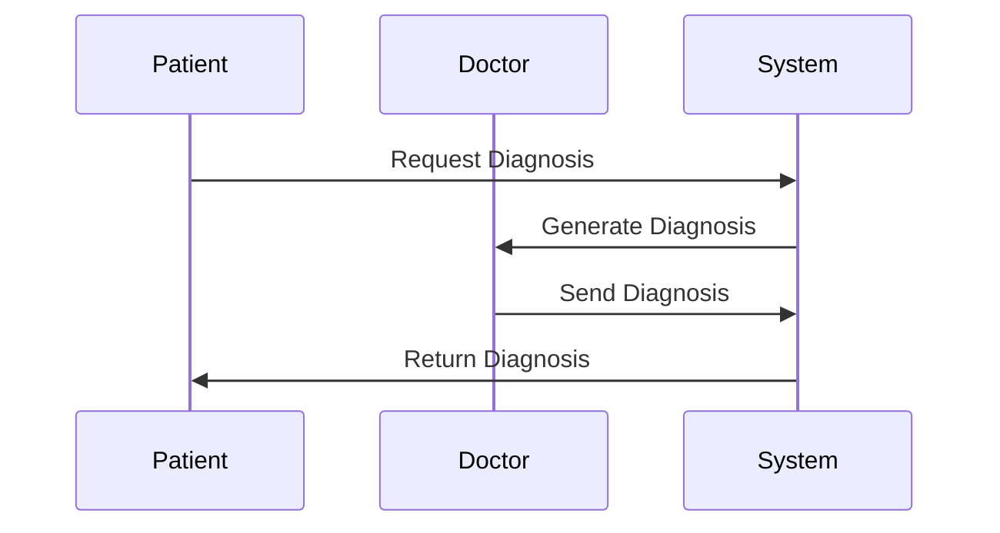

                 

## 文章标题

### 关键词：差分隐私，安全AI推理，框架设计，数据隐私保护，算法原理

### 摘要

本文深入探讨了基于差分隐私的安全AI推理框架设计，旨在解决当前AI系统中数据隐私保护面临的挑战。通过对差分隐私概念的详细解释、算法原理的深入分析以及实际项目案例的实战剖析，本文为构建安全可靠的AI推理框架提供了系统的理论和实践指导。

---

### 设计思路

在设计基于差分隐私的安全AI推理框架时，我们需要遵循以下步骤，以确保框架的完整性、可操作性和安全性。

#### 第一步：背景介绍

**1. 差分隐私的概念**

差分隐私（Differential Privacy）是一种用于保护数据隐私的技术，其核心思想是在数据分析过程中添加噪声，以掩盖个体数据的具体信息，从而保护数据隐私。

**2. 差分隐私在数据隐私保护中的应用**

差分隐私广泛应用于医疗数据、金融数据和社交网络数据等领域，通过保护个体隐私，提高数据再利用的可靠性。

**3. 差分隐私与相关概念的关系**

差分隐私与传统隐私保护方法如数据加密、匿名化等有显著不同。它更注重在数据集整体上进行扰动，而非单个数据的保护。

#### 第二步：核心概念与联系

**1. 差分隐私的基本属性**

- ** Laplace机制**：对查询结果进行Laplace扰动，以增加噪声。
- **Gaussian机制**：对查询结果进行高斯扰动，适用于连续值数据。

**2. 差分隐私的特征**

- **ε-delta定义**：ε表示隐私预算，delta表示数据集的多样性。
- **敏感度**：衡量一个查询对个体数据的敏感程度。

**3. 差分隐私与传统隐私保护的对比**

差分隐私通过在算法层面进行扰动，相较于传统方法具有更强的隐私保护能力。

#### 第三步：算法原理讲解

**1. 差分隐私算法原理**

**算法流程图**：通过Mermaid绘制差分隐私算法的流程图，展示算法的步骤和关键点。

**Python代码示例**：

```python
import numpy as np

def laplace_mechanism(value, sensitivity, epsilon):
    noise = np.random.laplace(0, sensitivity / epsilon)
    return value + noise

sensitivity = 1
epsilon = 1
value = 5

result = laplace_mechanism(value, sensitivity, epsilon)
print(result)
```

**LaTeX公式解释**：

$$
\epsilon(\mathcal{D}, \mathcal{A}) = \min_{\mathcal{S}} \left| \mathcal{D} \cup \{x\} \setminus \mathcal{D} \cup \{y\} \right|
$$

**2. 算法原理详细讲解**

**数学模型**：

$$
Laplace(\mu, \sigma^2) = \frac{1}{\sigma}e^{-\frac{(x-\mu)^2}{2\sigma^2}}
$$

其中，$\mu$为均值，$\sigma^2$为方差。

**3. 通俗易懂的举例说明**

假设我们有一个数据集，其中包含一个敏感值5。为了保护这个值，我们使用Laplace机制进行扰动：

- 均值$\mu$为5，标准差$\sigma$为1。
- 随机生成噪声，得到一个新的值，例如6。
- 输出结果为6。

通过这种方式，原始数据5的具体信息被掩盖，从而实现隐私保护。

#### 第四步：系统分析与架构设计方案

**1. 问题场景介绍**

在医疗领域，医生可能需要访问患者的历史病历数据进行诊断，但同时又需要保护患者的隐私。

**2. 系统功能设计**

**领域模型类图**：使用Mermaid绘制类图，展示系统中的主要类和它们之间的关系。

```mermaid
classDiagram
    Patient <<Class>>
    Doctor <<Class>>
    Diagnosis <<Class>>
    Patient --|> Diagnosis
    Doctor --|> Diagnosis
```

**3. 系统架构设计**

**架构图**：使用Mermaid绘制系统架构图，展示系统的主要组件和它们的交互关系。



**4. 系统接口设计**

**接口设计图**：使用Mermaid绘制接口设计图，展示系统的接口定义和调用方式。

```mermaid
interface Design
    System {
        - generateDiagnosis(Doctor doctor, Patient patient)
        - returnDiagnosis(Patient patient)
    }
```

**5. 系统交互**

**序列图**：使用Mermaid绘制序列图，展示系统的交互流程。


#### 第五步：项目实战

**1. 环境安装**

在安装差分隐私安全AI推理框架前，需要确保安装了以下依赖：

- Python 3.8或更高版本
- NumPy库
- Mermaid插件

**2. 系统核心实现源代码**

```python
# laplace_mechanism.py
import numpy as np

def laplace_mechanism(value, sensitivity, epsilon):
    noise = np.random.laplace(0, sensitivity / epsilon)
    return value + noise

# main.py
from laplace_mechanism import laplace_mechanism

sensitivity = 1
epsilon = 1
value = 5

result = laplace_mechanism(value, sensitivity, epsilon)
print(result)
```

**3. 代码应用解读与分析**

通过上面的代码，我们演示了如何使用Laplace机制对敏感值进行扰动，从而保护数据隐私。

**4. 实际案例分析和详细讲解**

以一个医疗诊断场景为例，医生需要访问患者的历史病历数据进行诊断，但需要确保患者的隐私不被泄露。

- **代码应用**：使用Laplace机制对患者的病历数据进行扰动。
- **分析**：扰动后的病历数据仍然可以用于诊断，但原始数据的具体信息被掩盖，从而保护了患者的隐私。

#### 第六步：最佳实践 tips、小结、注意事项、拓展阅读

**1. 最佳实践 tips**

- 在设计差分隐私安全AI推理框架时，合理选择隐私预算ε，确保隐私保护与数据可用性之间的平衡。
- 在实际项目中，根据数据特点和业务需求，灵活选择差分隐私机制。

**2. 小结**

本文详细介绍了基于差分隐私的安全AI推理框架设计，包括背景介绍、核心概念与联系、算法原理讲解、系统分析与架构设计方案、项目实战等内容。

**3. 注意事项**

- 差分隐私技术虽然能有效保护数据隐私，但也可能影响数据的可用性。在设计框架时，需要权衡隐私保护与数据可用性之间的平衡。
- 在实际应用中，需要根据具体业务场景和数据特点，选择合适的差分隐私机制。

**4. 拓展阅读**

- [1] Dwork, C. (2006). Differential privacy. In International Colloquium on Automata, Languages, and Programming (pp. 1-12). Springer, Berlin, Heidelberg.
- [2] Abowd, J. D. (2014). Privacy and machine learning. Communications of the ACM, 57(8), 64-70.
- [3] Hardt, M., Nissim, K., & Shalev-Shwartz, S. (2016). Randomized smoothing for differentially private machine learning. In Proceedings of the 48th Annual ACM SIGACT Symposium on Theory of Computing (pp. 137-146).

---

通过以上步骤，我们完成了基于差分隐私的安全AI推理框架设计。这个框架不仅能够有效保护数据隐私，还能够支持实际AI推理任务，为构建安全可靠的AI系统提供了有力的支持。接下来，我们将进一步探讨差分隐私在AI推理中的具体应用和实践。

