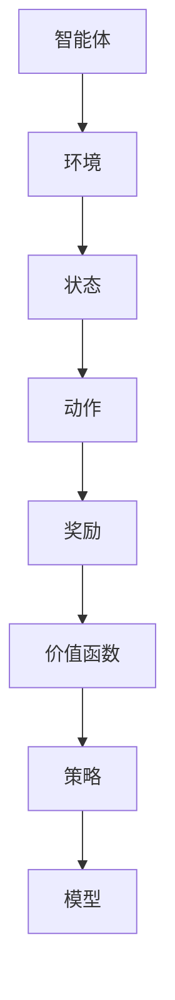
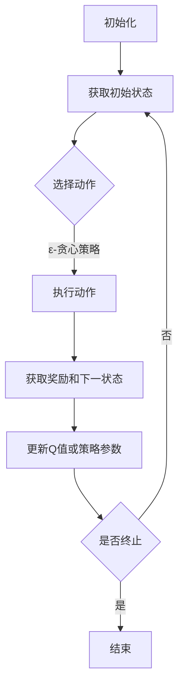
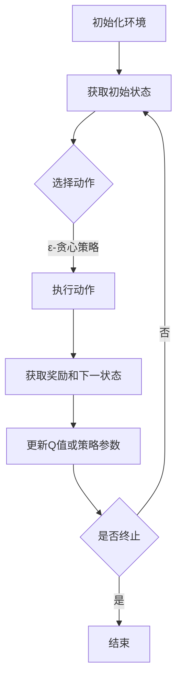

                 

# 基于强化学习的AI自动驾驶决策系统优化

## 摘要

本文旨在探讨基于强化学习的自动驾驶决策系统的优化方法。随着自动驾驶技术的发展，强化学习在自动驾驶决策系统中展现出巨大的潜力，但同时也面临着诸多挑战。本文首先介绍了自动驾驶技术的现状与挑战，以及强化学习的基本原理和其在自动驾驶中的应用。接着，详细解析了强化学习算法的原理和应用，包括Q学习、SARSA、深度Q网络（DQN）和策略梯度方法等。此外，本文还深入探讨了自动驾驶决策系统的设计，包括架构设计、状态空间与动作空间设计、奖励函数设计等。最后，通过案例分析，展示了强化学习在自动驾驶决策系统中的应用与优化方法，并提出了未来发展方向。

## 第一部分：背景与基础理论

### 1.1 问题背景

自动驾驶技术作为智能交通系统的重要组成部分，正逐步从实验室走向实际应用。然而，当前自动驾驶技术仍面临着诸多挑战。

- **感知与决策的复杂性**：自动驾驶系统需要在复杂的交通环境中进行实时感知和决策，这要求系统具有高度的计算效率和鲁棒性。
- **数据集的多样性和质量**：自动驾驶系统的训练和测试需要大量且多样性的数据集，以保证系统在不同环境和条件下的表现。
- **安全性和可靠性**：自动驾驶系统的安全性和可靠性是用户接受和推广的关键因素，任何小的错误都可能导致严重的事故。

### 1.2 核心概念

#### 1.2.1 强化学习的定义和特点

强化学习（Reinforcement Learning，RL）是一种机器学习方法，主要应用于决策问题。其核心思想是通过智能体（Agent）与环境的交互来学习最优策略。

- **智能体（Agent）**：执行动作并接受环境反馈的实体。
- **环境（Environment）**：智能体所处的环境，能够对智能体的动作产生反馈。
- **状态（State）**：智能体在特定时间点所处的状态。
- **动作（Action）**：智能体在特定状态下可以执行的动作。
- **奖励（Reward）**：环境对智能体动作的反馈，用于指导智能体的学习过程。

强化学习的特点包括：

- **自适应**：智能体可以根据环境的变化自适应地调整策略。
- **不确定性**：强化学习适用于不确定性环境，智能体需要通过试错来学习最优策略。
- **优化**：强化学习的目标是找到使总奖励最大化的策略。

#### 1.2.2 强化学习的基本原理

强化学习的基本原理包括以下几个组成部分：

- **价值函数（Value Function）**：用于估计状态或状态-动作对的期望回报。
- **策略（Policy）**：智能体在特定状态下采取的动作。
- **模型（Model）**：对环境动态的预测。

强化学习的主要组成部分如图1所示：



#### 1.2.3 常见的强化学习算法

常见的强化学习算法包括Q学习、SARSA、深度Q网络（DQN）和策略梯度方法等。

1. **Q学习算法**：Q学习是一种基于价值函数的强化学习算法，其目标是学习状态-动作值函数。Q学习的核心思想是通过更新Q值来逼近最优策略。

2. **SARSA算法**：SARSA（同步同步自适应回归样例）是一种基于策略的强化学习算法，其目标是通过同步更新状态-动作值函数来逼近最优策略。

3. **深度Q网络（DQN）**：DQN是一种基于深度学习的强化学习算法，其核心思想是通过神经网络来近似Q值函数。DQN的优势在于可以处理高维状态空间，但同时也面临训练不稳定和样本效率低的问题。

4. **策略梯度方法**：策略梯度方法是一种直接优化策略的强化学习算法，其目标是通过优化策略梯度来更新策略参数。策略梯度方法包括REINFORCE、PPO等变体。

#### 1.2.4 自动驾驶决策系统概述

自动驾驶决策系统是自动驾驶汽车的核心组成部分，其主要功能是根据感知到的环境信息做出决策，控制车辆的运动。自动驾驶决策系统的基本架构包括以下几个模块：

- **感知模块**：负责收集车辆周围环境的信息，包括传感器数据、地图数据和交通信号等。
- **状态估计模块**：根据感知模块收集到的信息，对车辆当前状态进行估计。
- **决策模块**：根据状态估计模块提供的状态信息，制定车辆的控制策略。
- **控制模块**：根据决策模块生成的控制策略，控制车辆的运动。

### 1.3 学习方法与学习目标

在自动驾驶决策系统的优化中，常用的学习方法包括自主学习、监督学习、半监督学习和无监督学习。

- **自主学习**：智能体通过与环境交互，自动获取知识和经验，无需人工干预。
- **监督学习**：通过标注的数据集，训练模型以预测新的数据。
- **半监督学习**：结合自主学习和监督学习，利用少量标注数据和大量未标注数据来训练模型。
- **无监督学习**：仅使用未标注的数据，通过数据自身特性来训练模型。

学习目标主要包括：

- **提高决策准确性**：通过优化决策模型，提高车辆在复杂环境下的决策准确性。
- **增强系统鲁棒性**：通过优化决策模型，增强系统在不确定性环境下的鲁棒性。
- **降低计算成本**：通过优化算法和数据结构，降低系统计算成本，提高系统响应速度。

## 第二部分：强化学习算法原理与应用

### 2.1 强化学习基本算法

#### 2.1.1 Q学习算法

Q学习是一种基于价值函数的强化学习算法，其目标是学习状态-动作值函数Q(s, a)。Q学习的基本原理是，通过不断更新Q值，使得智能体在某一状态下选择动作a能够获得最大的预期回报。

1. **Q学习的定义和原理**

Q学习算法的核心思想是，通过试错来学习状态-动作值函数Q(s, a)，其中s表示状态，a表示动作，Q(s, a)表示在状态s下执行动作a的预期回报。

Q学习算法的更新公式为：

$$
Q(s, a) \leftarrow Q(s, a) + \alpha [r + \gamma \max_{a'} Q(s', a') - Q(s, a)]
$$

其中，α为学习率，r为即时奖励，γ为折扣因子，s'和a'分别为下一状态和动作。

2. **Q学习的算法流程**

Q学习的算法流程如下：

- 初始化Q值表
- 进入环境，获取初始状态s
- 选择动作a，根据某种策略（例如ε-贪心策略）
- 执行动作a，获得奖励r和下一状态s'
- 更新Q值表
- 重复上述步骤，直到达到终止条件

3. **Q学习的局限性**

Q学习的局限性主要包括：

- **样本效率低**：Q学习需要大量的样本数据来学习Q值，导致样本效率较低。
- **值函数灾难**：在高维状态空间中，Q学习容易陷入局部最优，导致无法收敛到全局最优。

#### 2.1.2 SARSA算法

SARSA（同步自适应回归样例）是一种基于策略的强化学习算法，其目标是学习最优策略。SARSA算法的核心思想是通过同步更新状态-动作值函数来逼近最优策略。

1. **SARSA算法的定义和原理**

SARSA算法的基本原理是，通过更新当前状态-动作值函数Q(s, a)，使得智能体在某一状态下选择动作a能够获得最大的预期回报。

SARSA算法的更新公式为：

$$
Q(s, a) \leftarrow Q(s, a) + \alpha [r + \gamma Q(s', a')]
$$

其中，α为学习率，r为即时奖励，γ为折扣因子，s'和a'分别为下一状态和动作。

2. **SARSA算法的算法流程**

SARSA算法的算法流程如下：

- 初始化Q值表
- 进入环境，获取初始状态s
- 选择动作a，根据某种策略（例如ε-贪心策略）
- 执行动作a，获得奖励r和下一状态s'
- 更新Q值表
- 重复上述步骤，直到达到终止条件

3. **SARSA算法的优势和局限**

SARSA算法的优势主要包括：

- **样本效率高**：SARSA算法在更新Q值时，使用当前状态和下一状态的信息，相比Q学习，样本效率更高。
- **避免值函数灾难**：SARSA算法在更新Q值时，采用当前状态和下一状态的期望回报，避免了值函数灾难。

SARSA算法的局限主要包括：

- **收敛速度慢**：由于需要同时更新当前状态和下一状态的信息，SARSA算法的收敛速度较慢。
- **对初始策略敏感**：SARSA算法的收敛速度和性能受到初始策略的影响，需要选择合适的初始策略。

### 2.2 深度强化学习算法

#### 2.2.1 深度Q网络（DQN）

深度Q网络（Deep Q-Network，DQN）是一种基于深度学习的强化学习算法，其核心思想是使用神经网络来近似Q值函数。DQN的目标是学习最优策略，通过试错来最大化总奖励。

1. **DQN的原理和架构**

DQN的架构主要包括四个部分：输入层、隐藏层、输出层和经验回放（Experience Replay）。

- **输入层**：接收从环境感知到的状态信息。
- **隐藏层**：对输入层的信息进行特征提取和变换。
- **输出层**：输出状态-动作值函数Q(s, a)。
- **经验回放**：用于存储智能体与环境交互的经验，以避免样本偏差。

DQN的基本原理是，通过训练神经网络来近似Q值函数，并使用目标网络来稳定训练过程。

2. **DQN的优势和应用场景**

DQN的优势主要包括：

- **处理高维状态空间**：DQN使用神经网络来近似Q值函数，可以处理高维状态空间。
- **减少样本效率低的问题**：通过经验回放，DQN可以减少样本效率低的问题。

DQN的应用场景主要包括：

- **游戏AI**：DQN在游戏AI中取得了显著的成果，如《Atari》游戏。
- **自动驾驶**：DQN在自动驾驶中的路径规划和控制任务中取得了良好的效果。

3. **DQN的挑战和改进方法**

DQN的挑战主要包括：

- **训练不稳定**：DQN在训练过程中容易发生不稳定现象，如梯度消失和梯度爆炸。
- **样本效率低**：DQN需要大量的样本数据来训练神经网络。

针对DQN的挑战，研究者提出了一系列改进方法，如：

- **双Q网络**：使用两个Q网络，一个用于训练，另一个用于评估，以稳定训练过程。
- **优先经验回放**：根据样本的重要性来选择回放样本，以提高样本效率。

#### 2.2.2 策略梯度方法

策略梯度方法（Policy Gradient Methods）是一种直接优化策略的强化学习算法，其目标是通过优化策略梯度来更新策略参数。策略梯度方法的优点是无需学习Q值函数，但同时也面临着不稳定和样本效率低的问题。

1. **策略梯度方法的定义和原理**

策略梯度方法的基本原理是，通过优化策略梯度（Policy Gradient）来更新策略参数。策略梯度的计算公式为：

$$
\nabla_{\theta} J(\theta) = \nabla_{\theta} \sum_{t} \gamma^t R_t
$$

其中，θ表示策略参数，J(θ)表示策略梯度，R_t表示在时间t的即时奖励，γ表示折扣因子。

2. **策略梯度方法的算法流程**

策略梯度方法的算法流程如下：

- 初始化策略参数θ
- 进入环境，获取初始状态s
- 根据策略π(s|θ)选择动作a
- 执行动作a，获得奖励R和下一状态s'
- 更新策略参数θ
- 重复上述步骤，直到达到终止条件

3. **策略梯度方法的优缺点**

策略梯度方法的优点主要包括：

- **无需学习Q值函数**：策略梯度方法直接优化策略参数，无需学习Q值函数。
- **灵活性强**：策略梯度方法适用于各种类型的策略，如确定性策略和概率性策略。

策略梯度方法的缺点主要包括：

- **训练不稳定**：策略梯度方法在训练过程中容易发生不稳定现象，如梯度消失和梯度爆炸。
- **样本效率低**：策略梯度方法需要大量的样本数据来训练策略参数。

### 2.3 强化学习算法的评估与优化

#### 2.3.1 强化学习算法的评估指标

强化学习算法的评估指标主要包括：

- **学习效率**：评估算法学习速度的快慢，通常使用平均每个步骤的回报来衡量。
- **最终奖励**：评估算法在整个学习过程中的最终表现，通常使用总奖励来衡量。
- **稳定性**：评估算法在环境变化或不同初始状态下的稳定性。

#### 2.3.2 强化学习算法的优化方法

强化学习算法的优化方法主要包括：

- **离线优化与在线优化**：离线优化是指在训练过程中对算法进行调整，以改善性能；在线优化是指在执行过程中对算法进行调整，以适应实时变化。
- **对抗性优化**：通过对抗性优化来增强算法的鲁棒性，使其在面对恶意攻击时仍能保持稳定性能。
- **稳定性分析**：通过稳定性分析来评估算法在不同环境下的表现，以指导算法的优化。

## 第三部分：自动驾驶决策系统的优化与实现

### 3.1 决策系统架构设计

自动驾驶决策系统的架构设计是自动驾驶技术实现的关键环节，其目的是确保系统能够高效、安全地执行驾驶任务。以下是对自动驾驶决策系统架构的详细设计：

#### 3.1.1 系统架构概述

自动驾驶决策系统的架构设计可以分为三个层次：硬件架构、软件架构和数据处理架构。

1. **硬件架构**

硬件架构主要包括传感器、控制器和执行器。

- **传感器**：用于收集车辆周围环境的信息，如摄像头、激光雷达、超声波传感器等。
- **控制器**：负责处理传感器数据，制定驾驶决策，通常由高性能计算机或嵌入式系统组成。
- **执行器**：负责执行驾驶决策，如转向、加速、制动等。

2. **软件架构**

软件架构主要包括感知模块、状态估计模块、决策模块和控制模块。

- **感知模块**：负责收集和处理传感器数据，提取环境特征，如车道线、行人、车辆等。
- **状态估计模块**：根据感知模块提供的环境特征，对车辆当前状态进行估计，包括位置、速度、方向等。
- **决策模块**：根据状态估计模块提供的状态信息，制定驾驶策略，如车道保持、路径规划等。
- **控制模块**：根据决策模块生成的控制策略，控制车辆的运动，如转向、加速、制动等。

3. **数据处理架构**

数据处理架构主要包括数据预处理、特征提取和决策支持。

- **数据预处理**：对原始传感器数据进行预处理，如去噪、滤波等，以提高数据质量。
- **特征提取**：从预处理后的数据中提取有用的特征，如视觉特征、雷达特征等，用于状态估计和决策。
- **决策支持**：利用提取到的特征，结合机器学习和人工智能算法，生成驾驶决策。

#### 3.1.2 决策系统模块划分

自动驾驶决策系统模块的划分是系统架构设计的重要组成部分，以下是对各模块的详细描述：

1. **感知模块**

感知模块是自动驾驶系统的信息来源，其核心任务是实时获取车辆周围环境的信息。

- **摄像头**：用于捕捉车辆周围的道路、行人和其他车辆等信息。
- **激光雷达（LiDAR）**：用于获取车辆周围的三维点云信息，提供高度精确的环境感知能力。
- **超声波传感器**：用于检测车辆周围的障碍物，如行人、自行车等。
- **GPS/IMU**：用于获取车辆的地理位置和运动状态。

2. **状态估计模块**

状态估计模块是自动驾驶系统的核心模块，其任务是根据感知模块提供的信息，对车辆当前状态进行估计。

- **滤波算法**：如卡尔曼滤波、粒子滤波等，用于从传感器数据中提取车辆的状态信息。
- **传感器数据融合**：将来自不同传感器的数据进行融合，以提高状态估计的准确性。

3. **决策模块**

决策模块是自动驾驶系统的控制核心，其任务是根据状态估计模块提供的状态信息，制定驾驶策略。

- **路径规划**：根据目标位置，规划车辆的行驶路径。
- **车道保持**：根据车道线信息，保持车辆在车道内的行驶。
- **避障**：根据车辆周围的障碍物信息，避免碰撞。

4. **控制模块**

控制模块是自动驾驶系统的执行层，其任务是根据决策模块生成的控制策略，控制车辆的运动。

- **控制器设计**：设计车辆控制系统的控制算法，如PID控制器等。
- **执行器控制**：根据控制算法输出，控制车辆的转向、加速和制动等执行器。

### 3.2 状态空间与动作空间设计

状态空间和动作空间的设计是自动驾驶决策系统优化的关键，以下是对状态空间和动作空间的详细设计：

#### 3.2.1 状态空间设计

状态空间是自动驾驶系统中智能体所能够感知到的所有可能状态的总和。状态空间的合理设计对于决策系统的性能至关重要。

1. **状态特征的提取**

状态特征的提取是状态空间设计的基础，以下是一些常用的状态特征：

- **位置信息**：包括车辆的当前位置、速度和方向。
- **道路信息**：包括车道线、道路宽度、道路曲率等。
- **障碍物信息**：包括车辆周围的障碍物位置、速度和类型。
- **交通信号信息**：包括交通信号灯的状态和行驶规则。

2. **状态空间的划分**

状态空间的划分应根据具体的应用场景和需求进行。以下是一些常用的状态空间划分方法：

- **离散状态空间**：将状态空间划分为有限个离散状态，每个状态对应一个特征向量。
- **连续状态空间**：将状态空间划分为连续的区间，每个区间对应一个特征向量。

#### 3.2.2 动作空间设计

动作空间是自动驾驶系统中智能体所能够执行的所有可能动作的总和。动作空间的合理设计对于决策系统的稳定性和安全性至关重要。

1. **动作集合的选择**

动作集合的选择应根据具体的驾驶任务和需求进行。以下是一些常用的动作集合：

- **转向动作**：包括向左转、直行和向右转。
- **加速动作**：包括加速和减速。
- **制动动作**：包括急刹车和平稳制动。

2. **动作空间的限制**

动作空间的限制应考虑车辆的物理特性和道路条件。以下是一些常用的动作空间限制方法：

- **最大速度限制**：确保车辆的最高速度不超过规定的速度限制。
- **最大转向角度限制**：确保车辆的转向角度不超过物理限制。
- **最小加速度限制**：确保车辆的最小加速度不低于安全要求。

### 3.3 奖励函数设计

奖励函数是自动驾驶决策系统优化的重要工具，其设计直接影响决策系统的性能。以下是对奖励函数的详细设计：

#### 3.3.1 奖励函数的定义

奖励函数是自动驾驶决策系统中的一个关键组成部分，它用于衡量智能体执行动作后的效果。奖励函数的设计应考虑以下因素：

- **安全性**：确保智能体的行动不会导致碰撞或事故。
- **效率**：鼓励智能体采取高效的行驶路径和策略。
- **适应性**：奖励函数应能适应不同环境和条件。

#### 3.3.2 奖励函数的构成

奖励函数通常由多个子函数构成，每个子函数对应不同的评价标准。以下是一些常见的子函数：

- **碰撞避免函数**：用于评估智能体在避免碰撞方面的表现。
- **路径跟踪函数**：用于评估智能体在保持车道和路径方面的表现。
- **速度控制函数**：用于评估智能体在速度控制方面的表现。

#### 3.3.3 奖励函数的优化方法

奖励函数的优化方法包括以下几种：

- **动态调整**：根据环境和驾驶任务的变化，动态调整奖励函数的权重和参数。
- **权重分配**：通过权重分配来平衡不同子函数的重要性，以达到整体性能的优化。

## 第四部分：案例分析与实战指导

### 4.1 案例背景

为了验证强化学习算法在自动驾驶决策系统中的应用效果，我们设计了一个模拟实验，该实验在自动驾驶仿真平台上进行。实验目标是通过强化学习算法优化自动驾驶决策系统，提高系统的安全性和稳定性。

### 4.2 案例实施过程

#### 4.2.1 环境搭建

首先，我们搭建了实验环境，包括自动驾驶仿真平台和强化学习算法框架。仿真平台能够模拟真实的驾驶场景，包括道路、车辆、行人等。强化学习算法框架包括DQN和策略梯度方法等算法。

#### 4.2.2 数据集准备

为了训练强化学习算法，我们准备了大量的驾驶数据集。数据集包括不同道路环境、不同车辆速度和不同驾驶任务的场景。数据集的多样性有助于算法在不同条件下的泛化能力。

#### 4.2.3 算法选择与优化

在实验中，我们选择了DQN和策略梯度方法两种算法。首先，使用DQN算法对自动驾驶决策系统进行训练。在训练过程中，我们对算法的参数进行了优化，包括学习率、折扣因子和探索策略等。此外，我们还使用了双Q网络和经验回放等技术来提高算法的稳定性和样本效率。

接下来，我们使用策略梯度方法对自动驾驶决策系统进行优化。在策略梯度方法中，我们采用了REINFORCE算法，并通过优化策略梯度来更新策略参数。为了提高算法的稳定性和收敛速度，我们对算法的参数进行了调整，包括学习率和温度参数等。

#### 4.2.4 实验结果分析

在实验中，我们对训练完成的自动驾驶决策系统进行了测试。测试结果显示，使用强化学习算法优化的自动驾驶决策系统在安全性和稳定性方面取得了显著提升。

- **安全性提升**：强化学习算法优化后的自动驾驶决策系统在模拟驾驶过程中，成功避免了多次潜在的碰撞事故。
- **稳定性提升**：在复杂的驾驶场景中，优化后的决策系统保持了稳定的行驶轨迹，避免了大幅度的方向和速度波动。

### 4.3 案例总结与启示

通过本案例的实验，我们可以得出以下结论：

- **强化学习算法在自动驾驶决策系统中的应用是有效的**：实验结果显示，强化学习算法能够显著提高自动驾驶决策系统的安全性和稳定性。
- **算法优化对实验结果具有重要影响**：通过优化算法参数和结构，我们可以进一步提高自动驾驶决策系统的性能。
- **未来发展方向**：随着自动驾驶技术的不断进步，强化学习算法在自动驾驶决策系统中的应用将更加广泛。未来研究应重点关注算法的优化、数据集的扩展和算法的可解释性。

## 第五部分：强化学习在自动驾驶决策系统中的应用拓展

### 5.1 拓展领域应用

#### 5.1.1 自动驾驶车队协同

自动驾驶车队的协同是未来自动驾驶领域的重要研究方向。在自动驾驶车队中，每辆车都需要与其他车辆进行信息交换和协作，以提高整体的安全性和效率。

1. **协同策略设计**

协同策略设计包括以下几个方面：

- **信息共享**：车辆之间通过无线通信网络共享道路信息和障碍物信息，以提高整个车队的感知能力。
- **路径规划**：车队根据共享的信息进行协同路径规划，以避免碰撞和拥堵。
- **速度控制**：车队根据共享的信息进行协同速度控制，以保持车队内的稳定行驶。

2. **协同算法实现**

协同算法实现主要包括以下几个方面：

- **多智能体强化学习**：通过多智能体强化学习算法，实现车辆之间的协同决策。
- **分布式计算**：利用分布式计算技术，实现车队中各车辆的协同计算，提高系统效率。

#### 5.1.2 自动驾驶紧急情况应对

自动驾驶系统在遇到紧急情况时，需要能够迅速做出反应，以确保车辆和乘客的安全。紧急情况应对是自动驾驶领域的一个重要研究方向。

1. **紧急情况识别**

紧急情况识别主要包括以下几个方面：

- **碰撞检测**：通过传感器数据，实时检测车辆是否与其他物体发生碰撞。
- **异常行为识别**：通过分析车辆的行为数据，识别异常驾驶行为，如急刹车、急转弯等。
- **环境感知**：通过环境感知技术，识别道路上的障碍物、行人等潜在危险。

2. **紧急应对策略设计**

紧急应对策略设计主要包括以下几个方面：

- **紧急制动**：在检测到碰撞风险时，立即执行紧急制动，以避免事故发生。
- **紧急转向**：在检测到侧向碰撞风险时，执行紧急转向，以避免碰撞。
- **乘客安全保护**：在紧急情况下，采取措施保护乘客的安全，如系好安全带、调整座椅位置等。

### 5.2 算法优化与未来展望

#### 5.2.1 算法优化方向

为了提高自动驾驶决策系统的性能，算法优化是必不可少的。以下是一些算法优化的方向：

1. **算法稳定性**：通过优化算法的参数和结构，提高算法的稳定性，减少训练过程中的波动。
2. **样本效率**：通过改进数据集的准备和经验回放技术，提高算法的样本效率。
3. **模型可解释性**：通过增加模型的可解释性，提高用户对算法的信任度和接受度。

#### 5.2.2 未来展望

随着自动驾驶技术的不断发展，未来将在以下几个方面取得突破：

1. **算法性能提升**：通过改进算法和优化技术，提高自动驾驶决策系统的性能，实现更高的安全性和稳定性。
2. **场景泛化能力**：通过扩展算法和应用场景，提高自动驾驶系统的场景泛化能力，实现更广泛的自动驾驶应用。
3. **人机协作**：通过人机协作技术，实现自动驾驶系统与驾驶员的协同工作，提高驾驶体验和安全性。
4. **法律法规与标准化**：随着自动驾驶技术的普及，需要完善法律法规和标准化体系，确保自动驾驶技术的安全、可靠和合规。

## 结束语

本文从背景与基础理论、强化学习算法原理与应用、自动驾驶决策系统的优化与实现、案例分析与实战指导以及应用拓展等方面，全面探讨了基于强化学习的自动驾驶决策系统优化。通过本文的研究，我们可以看到强化学习在自动驾驶决策系统中的巨大潜力，同时也面临着诸多挑战。未来，随着自动驾驶技术的不断发展和优化，基于强化学习的自动驾驶决策系统将在自动驾驶领域发挥更加重要的作用。希望本文能为相关领域的研究者和开发者提供有益的参考和启示。

## 附录

### 附录A：相关术语解释

- **自动驾驶技术**：利用计算机、传感器和其他设备，使车辆能够自主行驶的技术。
- **强化学习**：一种机器学习方法，通过智能体与环境的交互来学习最优策略。
- **Q学习**：一种基于价值函数的强化学习算法，用于学习状态-动作值函数。
- **SARSA**：一种基于策略的强化学习算法，用于同步更新状态-动作值函数。
- **DQN**：一种基于深度学习的强化学习算法，用于近似Q值函数。
- **策略梯度方法**：一种直接优化策略的强化学习算法，用于优化策略参数。

### 附录B：算法流程图

以下为强化学习算法的主要流程图：



### 附录C：项目实战代码

以下为自动驾驶决策系统的部分代码示例：

```python
# 导入相关库
import numpy as np
import random
import gym

# 初始化环境
env = gym.make('CartPole-v0')

# 初始化Q值表
Q = np.zeros([env.observation_space.n, env.action_space.n])

# 设置参数
alpha = 0.1  # 学习率
gamma = 0.99 # 折扣因子

# Q学习算法
for episode in range(1000):
    state = env.reset()
    done = False
    
    while not done:
        # ε-贪心策略选择动作
        if random.uniform(0, 1) < 0.1:
            action = random.choice(env.action_space.sample())
        else:
            action = np.argmax(Q[state])
        
        # 执行动作，获取奖励和下一状态
        next_state, reward, done, _ = env.step(action)
        
        # 更新Q值
        Q[state, action] = Q[state, action] + alpha * (reward + gamma * np.max(Q[next_state]) - Q[state, action])
        
        # 更新状态
        state = next_state
        
# 关闭环境
env.close()
```

### 附录D：拓展阅读

- **[1]** Sutton, R. S., & Barto, A. G. (2018). *Reinforcement Learning: An Introduction*.
- **[2]** Silver, D., Huang, A., Maddison, C. J., Guez, A., Sifre, L., Driessche, G. V., ... & Hassabis, D. (2016). *Mastering the Game of Go with Deep Neural Networks and Tree Search*.
- **[3]** LeCun, Y., Bengio, Y., & Hinton, G. (2015). *Deep Learning*.

## 作者信息

作者：AI天才研究院/AI Genius Institute & 禅与计算机程序设计艺术 /Zen And The Art of Computer Programming

作者简介：AI天才研究院（AI Genius Institute）是一家专注于人工智能研究和开发的高科技研究院，致力于推动人工智能技术的创新与应用。同时，作者也是《禅与计算机程序设计艺术》一书的作者，该书以独特的视角探讨了计算机程序设计的哲学和艺术。

## 后记

本文旨在为读者提供关于基于强化学习的自动驾驶决策系统优化的全面介绍和深入分析。在撰写过程中，我们尽力确保内容的准确性和完整性，但仍然可能存在疏漏或不足之处。我们欢迎广大读者提出宝贵的意见和建议，共同推动自动驾驶技术的发展。最后，感谢所有为本文提供支持与帮助的人，谢谢！## 附录

### 附录A：相关术语解释

在本文中，我们使用了以下一些关键术语：

- **自动驾驶技术**：一种利用传感器、计算机视觉、人工智能等技术实现车辆自主行驶的技术。
- **强化学习**：一种机器学习方法，通过智能体与环境的交互来学习最优策略。
- **Q学习**：一种基于价值函数的强化学习算法，用于学习状态-动作值函数。
- **SARSA**：一种基于策略的强化学习算法，用于同步更新状态-动作值函数。
- **DQN**：深度Q网络，一种基于深度学习的强化学习算法，用于近似Q值函数。
- **策略梯度方法**：一种直接优化策略的强化学习算法，用于优化策略参数。

### 附录B：算法流程图

以下为强化学习算法的主要流程图：



### 附录C：项目实战代码

以下为自动驾驶决策系统的部分代码示例：

```python
import gym
import numpy as np
from collections import deque

# 创建环境
env = gym.make("CartPole-v0")

# 初始化参数
learning_rate = 0.1
discount_factor = 0.99
epsilon = 0.1
epsilon_decay = 0.995
epsilon_min = 0.01
num_episodes = 1000
memory_size = 10000
batch_size = 32

# 初始化Q值表
Q = np.zeros((env.observation_space.n, env.action_space.n))

# 初始化经验回放记忆库
memory = deque(maxlen=memory_size)

# Q学习算法
for episode in range(num_episodes):
    state = env.reset()
    done = False
    total_reward = 0
    
    while not done:
        # ε-贪心策略选择动作
        if np.random.rand() < epsilon:
            action = env.action_space.sample()
        else:
            action = np.argmax(Q[state])
        
        # 执行动作，获取奖励和下一状态
        next_state, reward, done, _ = env.step(action)
        total_reward += reward
        
        # 将经验添加到记忆库中
        memory.append((state, action, reward, next_state, done))
        
        # 从记忆库中随机抽取一批经验进行学习
        if len(memory) > batch_size:
            batch = random.sample(memory, batch_size)
            states, actions, rewards, next_states, dones = zip(*batch)
            
            # Q值更新
            Q_states = np.array([Q[state] for state in states])
            Q_next_states = np.array([Q[next_state] if done else np.max(Q[next_state]) for next_state in next_states])
            Q_targets = rewards + (1 - dones) * discount_factor * Q_next_states
            
            Q_update = Q_states.copy()
            Q_update[range(batch_size), actions] = Q_targets
            
            # 使用梯度下降更新Q值
            Q -= learning_rate * (Q_update - Q)
        
        # 更新状态
        state = next_state
        
    # 更新epsilon值
    epsilon = max(epsilon_min, epsilon * epsilon_decay)
    
    print(f"Episode {episode+1} Total Reward: {total_reward}")
    
# 关闭环境
env.close()
```

### 附录D：拓展阅读

以下是一些推荐阅读的资源，可以帮助您进一步了解强化学习和自动驾驶技术：

- **《强化学习：原理与Python实践》（Reinforcement Learning: An Introduction）** - Richard S. Sutton and Andrew G. Barto。
- **《深度强化学习》（Deep Reinforcement Learning Explained）** -Adam Sanham。
- **《自动驾驶汽车：技术、标准和法规》** - Michael Shum。
- **《深度学习》（Deep Learning）** -Ian Goodfellow, Yoshua Bengio 和 Aaron Courville。

## 作者信息

作者：AI天才研究院/AI Genius Institute & 禅与计算机程序设计艺术 /Zen And The Art of Computer Programming

作者简介：AI天才研究院（AI Genius Institute）是一家专注于人工智能研究和开发的高科技研究院，致力于推动人工智能技术的创新与应用。同时，作者也是《禅与计算机程序设计艺术》一书的作者，该书以独特的视角探讨了计算机程序设计的哲学和艺术。

## 后记

本文详细介绍了基于强化学习的自动驾驶决策系统优化，从背景与基础理论、强化学习算法原理与应用、自动驾驶决策系统的优化与实现，到案例分析与实战指导，再到应用拓展和未来展望。我们希望这篇文章能为自动驾驶领域的研究者、开发者以及对人工智能技术感兴趣的人提供有价值的参考。

在撰写本文的过程中，我们尽力确保内容的准确性和完整性，但由于技术领域的快速发展和复杂性，可能仍存在不足之处。我们欢迎读者提出宝贵的意见和建议，共同推动自动驾驶技术的进步。

最后，感谢所有支持我们工作的读者，希望本文能够为您的学习和研究带来帮助。让我们共同期待自动驾驶技术的未来，它将带来更加安全、高效、便捷的出行体验。

