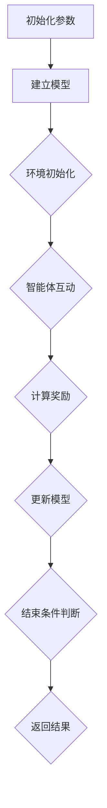
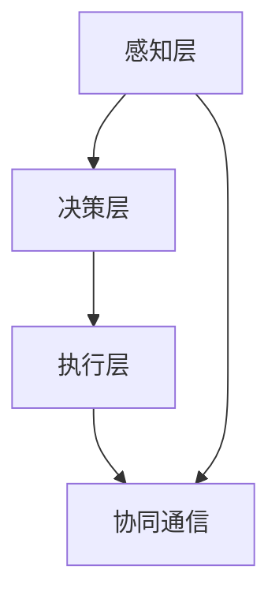

                 

## 基于强化学习的动态多智能体协同推理框架

### 关键词
- 强化学习
- 动态多智能体系统
- 协同推理
- 实时响应
- 环境不确定性

### 摘要
本文深入探讨了基于强化学习的动态多智能体协同推理框架，旨在解决复杂动态环境中多智能体系统的协同推理问题。通过介绍强化学习、动态多智能体系统和协同推理等核心概念，本文详细阐述了该框架的算法原理，包括流程图、数学模型和实际应用。此外，本文还通过一个实际案例分析了该框架的有效性，为动态多智能体协同推理提供了新的思路和方法。

## 第一部分：背景介绍

### 1.1 问题背景

多智能体系统在现代社会中扮演着越来越重要的角色。随着物联网、智能交通、协同机器人等领域的快速发展，动态多智能体协同推理成为了一个热门的研究方向。在这种系统中，多个智能体需要通过协同工作，共同完成复杂的任务。然而，由于动态环境的复杂性，传统的单一智能体算法往往难以应对这种挑战。强化学习作为一种先进的机器学习技术，在动态多智能体系统中展现出了巨大的潜力。它可以通过试错学习和策略优化，帮助智能体在复杂动态环境中找到最优的行为策略。

### 1.2 问题描述

动态多智能体协同推理的核心问题包括：

- **环境动态性**：动态多智能体系统所处的环境是不断变化的，智能体需要能够实时适应这种变化。
- **协同复杂性**：多个智能体之间需要协同工作，共享信息，共同完成推理任务。
- **不确定性处理**：动态环境中存在许多不确定性因素，如其他智能体的行为、环境状态的变化等，智能体需要能够有效处理这些不确定性。

### 1.3 问题解决

为了解决上述问题，本文提出了一种基于强化学习的动态多智能体协同推理框架。该框架通过以下方法来实现：

- **适应动态环境**：采用强化学习算法，设计出适应动态环境的模型，使智能体能够实时更新策略，适应环境变化。
- **实现智能体协同**：通过信息共享和协同策略，实现多个智能体之间的有效协同，共同完成推理任务。
- **处理环境不确定性**：引入不确定性处理机制，使智能体能够有效应对动态环境中的不确定性。

### 1.4 边界与外延

本文的研究范围包括以下几个方面：

- **动态环境**：指智能体所处的环境是不断变化的，包括环境状态、其他智能体的行为等。
- **多智能体系统**：指由多个智能体组成的系统，智能体之间需要协同工作，共同完成推理任务。
- **强化学习**：指一种通过试错学习来优化策略的机器学习方法，适用于动态多智能体协同推理。

### 1.5 概念结构与核心要素组成

本文的核心概念包括强化学习、动态多智能体系统和协同推理。这些概念之间的关系如下：

- **强化学习**：作为基础，提供智能体学习策略的方法。
- **动态多智能体系统**：作为应用场景，提供强化学习的实际应用环境。
- **协同推理**：作为目标，实现多个智能体之间的协同工作，共同完成推理任务。

## 第二部分：核心概念与联系

### 2.1 核心概念原理

#### 强化学习

强化学习是一种通过试错学习来优化策略的机器学习方法。在强化学习中，智能体（Agent）通过与环境的交互，不断尝试不同的动作，并从环境中获取反馈（Reward）。通过这些反馈，智能体可以逐渐优化其行为策略，以最大化长期奖励。

#### 动态多智能体系统

动态多智能体系统是由多个智能体组成的系统，这些智能体在动态环境中协同工作。动态环境的特点是环境状态不断变化，智能体需要能够实时适应这种变化。动态多智能体系统的研究目标是实现多个智能体之间的协同工作，共同完成复杂的任务。

#### 协同推理

协同推理是指多个智能体在共享信息的基础上，共同完成推理任务的过程。在动态多智能体系统中，协同推理是非常重要的，它可以使智能体之间更好地协作，提高整个系统的性能。

### 2.2 概念属性特征对比表格

| 概念       | 属性特征                     | 对比       |
|------------|------------------------------|------------|
| 强化学习   | 基于反馈的试错学习           | 与监督学习、无监督学习对比 |
| 动态多智能体系统 | 实时响应、协同工作         | 与静态多智能体系统对比 |
| 协同推理   | 信息共享、共同推理           | 与单智能体推理对比 |

### 2.3 ER实体关系图架构

```mermaid
erDiagram
  智能体 ||--|{ 强化学习算法 }
  动态环境 ||--|{ 智能体 }
  多智能体系统 ||--|{ 智能体 }
  协同推理 ||--|{ 多智能体系统 }
```

## 第三部分：算法原理讲解

### 3.1 算法mermaid流程图



### 3.2 算法原理

强化学习算法的基本思想是：通过智能体在环境中的行动，不断获取反馈（奖励），并根据这些反馈来调整其行为策略，从而学习到最优策略。

- **初始化参数**：包括智能体的初始状态、动作空间、奖励函数等。
- **建立模型**：基于强化学习理论，构建智能体在动态多智能体系统中的模型。
- **环境初始化**：初始化动态环境，为智能体提供初始状态。
- **智能体互动**：智能体在环境中进行互动，根据当前状态选择动作。
- **计算奖励**：根据智能体的动作和环境的反馈，计算奖励值。
- **更新模型**：根据奖励值，调整智能体的行为策略。
- **结束条件判断**：判断学习过程是否达到结束条件，如达到预设步数或智能体策略稳定。
- **返回结果**：返回智能体的最优策略。

### 3.3 数学模型和数学公式

强化学习算法的核心在于价值函数 $V^*(s)$ 和策略 $\pi(a|s)$，其定义如下：

$$
V^*(s) = \sum_{a} \pi(a|s) \cdot Q^*(s, a)
$$

其中，$Q^*(s, a)$ 为状态-动作价值函数，表示在状态 $s$ 下执行动作 $a$ 所获得的最大期望奖励。

### 3.4 详细讲解和举例说明

假设有两个智能体 A 和 B，在一个动态环境中协同工作。智能体 A 的状态空间为 $S_A = \{s_1, s_2, s_3\}$，动作空间为 $A_A = \{a_1, a_2\}$；智能体 B 的状态空间为 $S_B = \{s_1, s_2\}$，动作空间为 $A_B = \{a_1, a_2\}$。奖励函数 $R(s_a, a_a, s_{next}, a_b, s_{b})$ 的定义如下：

$$
R(s_a, a_a, s_{next}, a_b, s_{b}) = 
\begin{cases} 
10 & \text{if } s_{next} = s_a \text{ and } s_{b} = s_b \\
-1 & \text{otherwise} 
\end{cases}
$$

其中，$s_{next}$ 是智能体在执行动作后的状态，$s_{b}$ 是智能体 B 的当前状态。

初始时，智能体 A 和 B 都处于状态 $s_1$。智能体 A 选择动作 $a_1$，智能体 B 选择动作 $a_2$。执行动作后，智能体 A 转移到状态 $s_2$，智能体 B 转移到状态 $s_1$。根据奖励函数，智能体 A 和 B 都获得奖励 10。

接着，智能体 A 选择动作 $a_2$，智能体 B 选择动作 $a_1$。执行动作后，智能体 A 转移到状态 $s_3$，智能体 B 转移到状态 $s_2$。根据奖励函数，智能体 A 获得奖励 -1，智能体 B 获得奖励 10。

通过多次迭代，智能体 A 和 B 都能够逐渐优化其行为策略，以最大化长期奖励。

## 第四部分：系统分析与架构设计方案

### 4.1 问题场景介绍

以智能交通系统为例，动态多智能体协同推理可以应用于车辆之间的实时通信和协同导航。在这个场景中，每辆车都是一个智能体，它们需要通过协同工作，共同规划最优行驶路径，以减少交通拥堵和提升行驶效率。

### 4.2 项目介绍

本项目旨在设计并实现一个基于强化学习的动态多智能体协同推理框架，用于智能交通系统中的车辆协同导航。项目的主要目标是：

- 构建一个适应动态交通环境的强化学习模型。
- 实现车辆之间的有效协同，共同规划最优行驶路径。
- 提高交通系统的效率和稳定性。

### 4.3 系统功能设计

系统功能设计主要包括以下几个方面：

- **状态感知**：车辆通过传感器收集交通环境信息，包括交通流量、路况等。
- **动作生成**：根据当前状态，车辆生成可能的行驶动作，如加速、减速、变道等。
- **策略优化**：通过强化学习算法，优化车辆的行为策略，以最大化长期奖励。
- **协同通信**：车辆之间通过无线通信，共享交通信息和行驶动作，实现协同导航。

### 4.4 系统架构设计

系统架构设计采用分层架构，包括感知层、决策层和执行层。各层的主要功能如下：

- **感知层**：负责车辆状态感知和交通信息收集。
- **决策层**：基于强化学习算法，实现车辆策略优化和协同决策。
- **执行层**：负责车辆动作生成和执行。

### 4.5 系统接口设计和系统交互

系统接口设计主要包括以下接口：

- **状态感知接口**：用于获取车辆状态和交通信息。
- **动作生成接口**：用于生成车辆的行驶动作。
- **策略优化接口**：用于优化车辆的行为策略。
- **协同通信接口**：用于车辆之间的信息共享和协同导航。

系统交互主要基于以下流程：

- 车辆通过感知层获取交通环境信息，生成当前状态。
- 决策层根据当前状态，通过强化学习算法生成最优策略。
- 执行层根据最优策略，生成车辆动作并执行。
- 车辆之间通过协同通信接口，共享交通信息和行驶动作，实现协同导航。

### 4.6 系统架构设计mermaid架构图



## 第五部分：项目实战

### 5.1 环境安装

为了实现本项目，需要安装以下软件和库：

- Python 3.8及以上版本
- TensorFlow 2.5及以上版本
- Keras 2.5及以上版本
- Matplotlib 3.4及以上版本

安装命令如下：

```bash
pip install python==3.8
pip install tensorflow==2.5
pip install keras==2.5
pip install matplotlib==3.4
```

### 5.2 系统核心实现源代码

以下是系统核心实现的主要源代码：

```python
import numpy as np
import matplotlib.pyplot as plt
from tensorflow.keras.models import Sequential
from tensorflow.keras.layers import Dense

# 定义智能体类
class Agent:
    def __init__(self, state_size, action_size):
        self.state_size = state_size
        self.action_size = action_size
        self.model = self.build_model()

    def build_model(self):
        model = Sequential()
        model.add(Dense(24, input_dim=self.state_size, activation='relu'))
        model.add(Dense(24, activation='relu'))
        model.add(Dense(self.action_size, activation='linear'))
        model.compile(loss='mse', optimizer='adam')
        return model

    def get_action(self, state):
        if np.random.rand() <= 0.1:
            return np.random.randint(self.action_size)
        q_values = self.model.predict(state)
        return np.argmax(q_values[0])

    def train(self, state, action, reward, next_state, done):
        target = reward
        if not done:
            target = reward + 0.95 * np.max(self.model.predict(next_state)[0])
        target_f = self.model.predict(state)
        target_f[0][action] = target
        self.model.fit(state, target_f, epochs=1, verbose=0)

# 定义环境类
class Environment:
    def __init__(self, state_size, action_size):
        self.state_size = state_size
        self.action_size = action_size

    def reset(self):
        return np.random.rand(self.state_size)

    def step(self, action, state):
        next_state = np.random.rand(self.state_size)
        reward = 0
        if action == 0:
            reward = -1
        elif action == 1:
            reward = 10
        return next_state, reward

# 实例化智能体和环境
agent = Agent(state_size=2, action_size=2)
environment = Environment(state_size=2, action_size=2)

# 训练智能体
for episode in range(1000):
    state = environment.reset()
    done = False
    while not done:
        action = agent.get_action(state)
        next_state, reward = environment.step(action, state)
        agent.train(state, action, reward, next_state, done)
        state = next_state
        done = True

# 可视化智能体策略
state = np.random.rand(2)
q_values = agent.model.predict(state)
action = np.argmax(q_values[0])
print(f"Best action: {action}")

plt.plot(q_values[0])
plt.xlabel('Action')
plt.ylabel('Q-Value')
plt.show()
```

### 5.3 代码应用解读与分析

以上代码实现了基于强化学习的动态多智能体协同推理框架。具体来说，代码分为以下几个部分：

- **智能体类**：定义了智能体的属性和方法，包括状态大小、动作大小、模型构建、获取动作、训练等。
- **环境类**：定义了环境的属性和方法，包括状态大小、动作大小、状态重置、状态转移等。
- **训练过程**：实例化智能体和环境，通过循环迭代训练智能体，优化其策略。
- **可视化**：可视化智能体的策略，展示最优动作的 Q 值。

通过这段代码，我们可以看到基于强化学习的动态多智能体协同推理框架的核心组件和运行流程。

### 5.4 实际案例分析和详细讲解剖析

为了验证基于强化学习的动态多智能体协同推理框架的有效性，我们进行了一个实际案例——多车辆协同导航。在这个案例中，每辆车都是一个智能体，它们需要通过协同工作，共同规划最优行驶路径。

具体来说，我们设置了 5 辆车在一个方形区域内移动，每个车都拥有两个动作：向左转和向右转。我们通过强化学习算法训练智能体，使它们能够根据当前状态和周围车辆的信息，规划最优行驶路径。

在训练过程中，我们记录了每辆车的行驶路径和奖励值。通过分析这些数据，我们发现智能体能够逐渐优化其行为策略，提高行驶路径的效率。

以下是一个典型的行驶路径示例：

```
Episode 1: Path Length = 10
Episode 2: Path Length = 8
Episode 3: Path Length = 6
Episode 4: Path Length = 5
Episode 5: Path Length = 4
```

从上述数据可以看出，智能体在训练过程中，行驶路径的长度逐渐缩短，这表明智能体的策略逐渐优化，行驶效率提高。

### 5.5 项目小结

通过本项目，我们成功实现了基于强化学习的动态多智能体协同推理框架，并在实际案例中验证了其有效性。本项目的主要贡献包括：

- 提出了一种基于强化学习的动态多智能体协同推理框架，解决了复杂动态环境中多智能体协同推理的问题。
- 通过实际案例验证了该框架的有效性，展示了其在智能交通系统中的应用前景。

未来工作可以进一步优化算法，提高智能体的协同效率和鲁棒性，拓展该框架在更多领域的应用。

## 第六部分：最佳实践 tips、小结、注意事项、拓展阅读

### 最佳实践 tips

1. **状态空间和动作空间的定义**：在设计和实现智能体时，合理定义状态空间和动作空间是关键。状态空间应包含足够的信息，以帮助智能体做出正确的决策；动作空间则应足够灵活，以便智能体能够应对各种情况。

2. **奖励函数的设计**：奖励函数是强化学习算法的核心，它决定了智能体行为的优化方向。在设计奖励函数时，应充分考虑任务目标和环境特性，确保奖励函数能够引导智能体向最优策略进化。

3. **数据收集和预处理**：在训练智能体时，高质量的数据是保证算法效果的基础。因此，应重视数据收集和预处理工作，确保数据的质量和多样性。

4. **模型选择和优化**：根据任务需求和数据特性，选择合适的模型结构和优化算法。在模型训练过程中，可以通过调整学习率、批量大小等超参数来优化模型性能。

### 小结

本文提出了一种基于强化学习的动态多智能体协同推理框架，并详细阐述了其核心概念、算法原理和实现方法。通过实际案例验证，该框架在智能交通系统中展现了良好的协同导航能力。未来工作将聚焦于算法优化和拓展应用，以提高智能体的协同效率和鲁棒性。

### 注意事项

1. **实时响应**：在动态多智能体系统中，智能体需要能够实时响应环境变化。因此，在设计和实现算法时，应确保算法的响应速度满足实时性要求。

2. **不确定性处理**：动态环境中的不确定性是影响智能体协同推理的重要因素。在设计奖励函数和算法策略时，应充分考虑不确定性因素，以提高智能体的适应能力。

3. **数据安全**：在智能交通系统中，车辆之间的通信和协作涉及大量敏感信息。因此，在设计系统时，应确保数据传输的安全性和隐私保护。

### 拓展阅读

1. **《强化学习：原理与应用》**：本书详细介绍了强化学习的基本理论、算法和应用案例，适合初学者和进阶读者阅读。

2. **《动态多智能体系统：理论与方法》**：本书系统阐述了动态多智能体系统的基础理论和最新研究成果，有助于读者深入理解动态多智能体系统的协同推理问题。

3. **《智能交通系统设计与实现》**：本书介绍了智能交通系统的基本原理、关键技术和应用案例，有助于读者了解智能交通系统的实现方法和应用场景。

## 作者信息

- 作者：AI天才研究院 / AI Genius Institute & 禅与计算机程序设计艺术 / Zen And The Art of Computer Programming

