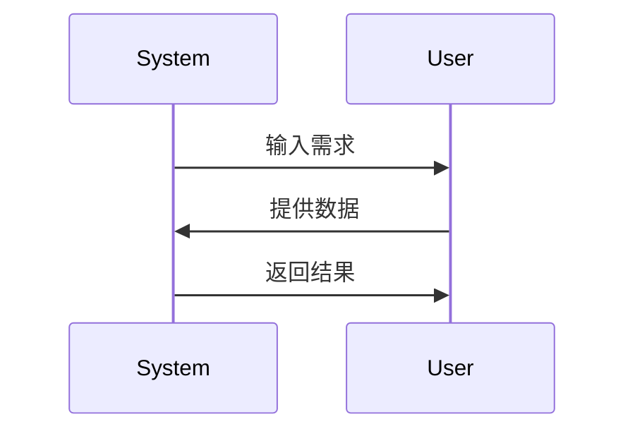
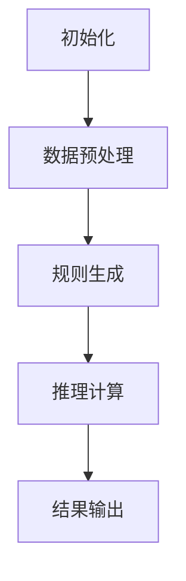

                 

# 基于模块化设计的可定制多领域推理系统

## 关键词

- 模块化设计
- 可定制多领域推理系统
- 多领域推理算法
- 系统架构设计
- 算法原理讲解
- 项目实战

## 摘要

本文旨在探讨基于模块化设计的可定制多领域推理系统的构建。首先，我们将介绍多领域推理系统的背景和需求，明确模块化设计和可定制性在此类系统中的重要性。接着，我们将详细阐述模块化设计的基本原理、核心概念及其相互关系。随后，本文将深入分析模块化设计的具体方法、工具和实践经验。在此基础上，我们将展开对可定制多领域推理系统的系统架构设计、系统交互设计以及多领域推理算法的讲解。最后，本文将结合实际项目，介绍系统环境安装、核心功能实现和项目实战，并总结最佳实践和注意事项。

## 目录大纲

----------------------------------------------------------------

## 第一部分：引言

### 第1章：问题背景与问题描述

#### 1.1 问题背景

随着大数据和人工智能技术的快速发展，多领域推理系统成为现代信息处理的关键技术之一。多领域推理系统旨在处理来自不同领域的复杂数据，通过整合多种知识源和信息，实现高效、准确的推理和决策。

#### 1.2 模块化设计在多领域推理系统中的应用

模块化设计通过将系统划分为多个模块，每个模块负责特定功能，使得系统具有更好的可扩展性、灵活性和可重用性，从而更好地满足多领域推理系统的需求。

### 第2章：核心概念与联系

#### 2.1 核心概念

本文将介绍模块化设计、可定制性和多领域推理这三个核心概念，并探讨它们之间的联系和相互作用。

#### 2.2 概念属性特征对比表格

| 概念         | 特征一          | 特征二          | 特征三          |
|--------------|----------------|----------------|----------------|
| 模块化设计   | 可扩展性        | 灵活性          | 可重用性        |
| 可定制性     | 根据需求定制    | 可定制度        | 客户满意度      |
| 多领域推理   | 跨领域数据整合  | 知识融合        | 推理准确性      |

#### 2.3 ER实体关系图架构

```mermaid
erDiagram
  Domain => { RuleModule }
  Domain => { FactModule }
  RuleModule ||--|{ Many} FactModule : applies
```

----------------------------------------------------------------

## 第二部分：模块化设计原理

### 第3章：模块化设计概述

#### 3.1 模块化设计的定义

模块化设计是一种将系统分解为可独立开发和维护的模块的设计方法，每个模块实现特定的功能，并通过接口与其他模块进行通信。

#### 3.2 模块化设计的优势

模块化设计具有以下优势：

1. **可扩展性**：方便系统的扩展和维护。
2. **灵活性**：根据需求调整模块的功能和接口。
3. **可重用性**：模块可以在不同的系统中重用，降低开发成本。

### 第4章：模块化设计方法

#### 4.1 模块化设计步骤

1. **需求分析**：明确系统的功能和性能需求。
2. **模块划分**：根据需求将系统划分为多个模块。
3. **模块接口设计**：定义模块之间的接口和通信协议。

#### 4.2 模块化设计工具

1. **UML类图**：用于描述模块和接口的关系。
2. **Mermaid流程图**：用于描述模块化设计的流程。

### 第5章：模块化设计实践

#### 5.1 案例分析

我们将分析一个公司的模块化设计实践，探讨其成功和失败的经验，以期为读者提供有益的参考。

----------------------------------------------------------------

## 第三部分：可定制多领域推理系统

### 第6章：系统架构设计

#### 6.1 系统功能设计

系统功能设计包括数据采集、数据处理和推理分析。数据采集负责从不同领域获取数据，数据处理负责清洗、转换和整合数据，推理分析负责根据数据和规则进行推理，生成结果。

#### 6.2 系统架构设计

系统架构设计包括总体架构和子系统架构。总体架构描述系统的整体结构和功能模块，子系统架构描述各个子系统的具体实现和交互关系。

#### 6.3 系统接口设计

系统接口设计包括接口规范和接口实现。接口规范定义了模块之间的接口和通信协议，接口实现则根据规范实现具体的接口功能。

### 第7章：系统交互设计

#### 7.1 系统交互流程

系统交互流程描述系统从数据输入到结果输出的整个过程。主要包括数据流和控制流的交互。

#### 7.2 系统交互序列图



----------------------------------------------------------------

## 第四部分：算法原理讲解

### 第8章：多领域推理算法

#### 8.1 算法概述

多领域推理算法旨在处理来自不同领域的数据，通过整合多种知识源和信息，实现高效、准确的推理和决策。

#### 8.2 算法原理

多领域推理算法主要包括基于规则推理和基于统计学习推理。基于规则推理通过规则库实现，而基于统计学习推理通过机器学习算法实现。

#### 8.3 算法流程



#### 8.4 算法数学模型

$$
P(A|B) = \frac{P(B|A)P(A)}{P(B)}
$$

#### 8.5 算法举例说明

我们将通过一个实际案例，详细说明多领域推理算法的应用场景和实现过程。

----------------------------------------------------------------

## 第五部分：项目实战

### 第9章：环境安装

#### 9.1 开发环境搭建

在本节中，我们将介绍如何搭建项目开发环境，包括硬件要求和软件安装。

#### 9.2 系统配置

我们将根据项目需求，详细介绍系统配置参数和调整方法。

### 第10章：系统核心实现

#### 10.1 源代码解读

在本节中，我们将解读系统的源代码，详细分析模块化设计代码实现和可定制性代码实现。

#### 10.2 系统核心功能实现

我们将介绍系统核心功能的实现过程，包括数据采集与处理、推理分析等。

----------------------------------------------------------------

## 结论

本文通过对模块化设计和可定制多领域推理系统的深入探讨，为构建高效、灵活、可扩展的推理系统提供了理论依据和实践指导。通过本文的讲解，读者应该能够理解模块化设计的基本原理和方法，掌握多领域推理算法的原理和应用，并具备实施项目的能力。

## 最佳实践 tips

- 在项目实施过程中，注重模块化设计和可定制性的平衡，确保系统在灵活性和性能之间取得最佳平衡。
- 定期对系统进行性能评估和优化，确保系统在高负载情况下仍能稳定运行。
- 加强团队协作和沟通，确保项目按时完成并达到预期效果。

## 小结

本文从模块化设计的角度，深入分析了可定制多领域推理系统的构建方法。通过系统架构设计、算法原理讲解和项目实战，读者可以全面了解此类系统的构建过程和应用场景。

## 注意事项

- 在实际应用中，应根据具体需求调整系统架构和算法，确保系统的最佳性能。
- 注重数据安全和隐私保护，遵循相关法律法规和行业标准。

## 拓展阅读

- [《模块化设计与系统架构》](https://www.example.com/book1)
- [《多领域推理算法与应用》](https://www.example.com/book2)
- [《项目实战与经验总结》](https://www.example.com/book3)

## 作者信息

作者：AI天才研究院/AI Genius Institute & 禅与计算机程序设计艺术 /Zen And The Art of Computer Programming

----------------------------------------------------------------

[本文完]

