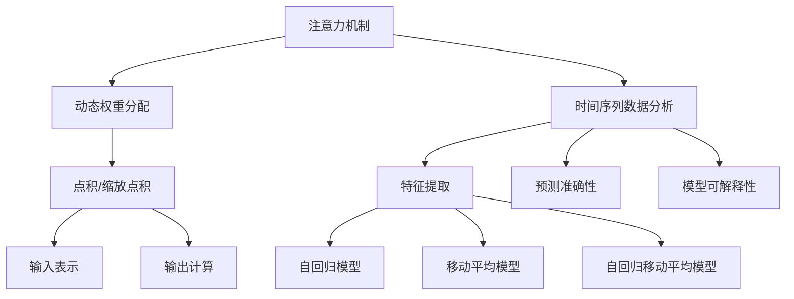
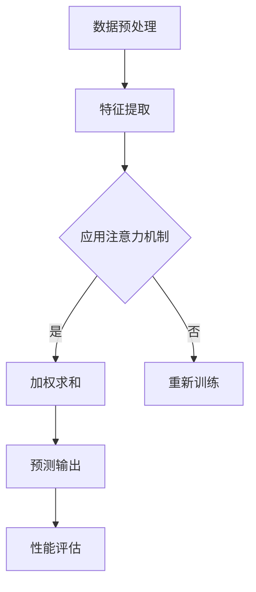
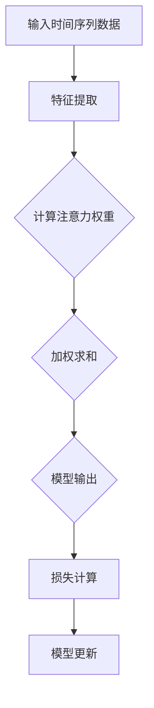
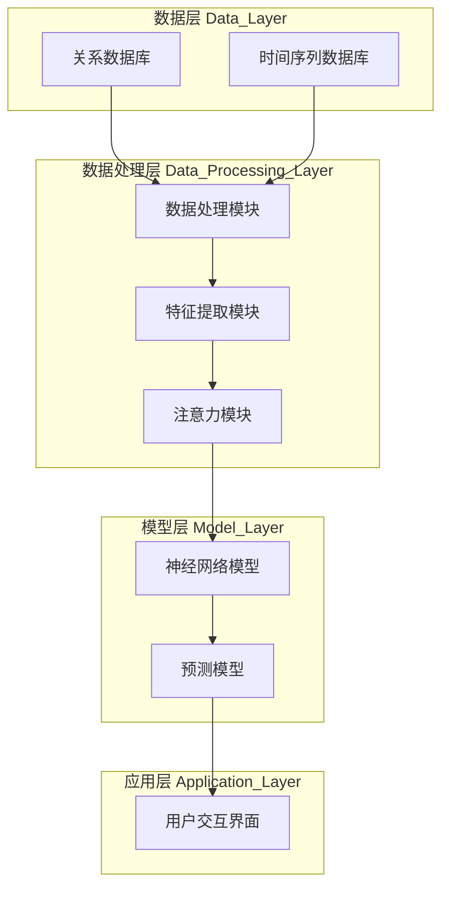
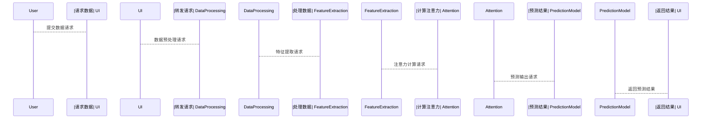

                 


# 基于注意力机制的AI时序数据分析系统

> 关键词：注意力机制，时序数据分析，深度学习，算法设计，数学模型，系统架构

> 摘要：本文将深入探讨基于注意力机制的AI时序数据分析系统。首先，我们将介绍注意力机制的基本概念和原理，并解释其在AI领域中的重要性。随后，我们将详细讨论时间序列数据分析的核心概念和方法，以及注意力机制在时序数据分析中的应用。接着，我们将设计并实现一个基于注意力机制的时序分析算法，并解释其数学模型和实现细节。随后，我们将介绍系统架构和最佳实践，最后通过实际案例分析和项目实战，展示注意力机制在时序数据分析中的强大应用。

## 第一部分：引言与背景

### 1.1 问题背景与核心概念

在当今数据驱动的时代，时序数据分析已经成为众多领域（如金融、医疗、物联网等）中的关键技术。时序数据通常是指数据点按照时间顺序排列，例如股票价格、医疗记录、传感器读数等。这些数据具有明显的序列依赖性，因此传统的统计分析方法往往难以捕捉其内在的模式和趋势。

注意力机制（Attention Mechanism）是一种基于人类注意力集中特性的计算模型，其核心思想是通过分配不同的权重来关注数据中的不同部分，从而提高模型对数据局部特征的理解和利用。近年来，注意力机制在深度学习领域取得了显著的研究成果，并在图像识别、自然语言处理等领域得到了广泛应用。

本篇文章旨在设计并实现一个基于注意力机制的AI时序数据分析系统，旨在解决以下几个核心问题：

1. 如何有效地提取时序数据中的关键特征？
2. 如何利用注意力机制提高时序分析模型的性能和准确性？
3. 如何构建一个高效、可扩展的时序数据分析系统？

### 1.2 注意力机制原理

注意力机制最早由神经科学家提出，用于模拟人类注意力集中的过程。在计算机科学和深度学习领域，注意力机制通常被定义为一种动态的权重分配机制，它能够在处理输入数据时，根据当前任务的需要，动态地调整对不同部分数据的关注程度。

注意力机制的实现通常包括以下几个步骤：

1. **输入表示**：首先将输入数据（如图像或序列）转换为一个高维特征向量。
2. **注意力计算**：计算输入特征向量之间的相似度，通常使用点积或缩放点积等方法。
3. **权重分配**：根据注意力计算结果，对输入特征向量进行加权求和，得到最终的输出特征向量。
4. **输出计算**：使用输出特征向量进行后续的任务处理，如分类、回归等。

### 1.3 时序数据分析的应用场景

时序数据分析在多个领域都有广泛的应用，以下是几个典型的应用场景：

1. **金融预测**：利用注意力机制对股票价格、市场交易量等时序数据进行分析，预测未来的市场走势。
2. **医疗诊断**：通过分析病人的历史医疗记录和实时传感器数据，预测疾病的进展和最佳治疗方案。
3. **物联网**：利用注意力机制对传感器网络中的数据进行实时分析，识别异常事件和优化资源分配。

### 1.4 本篇文章的结构

本文将按照以下结构展开：

- **第一部分**：引言与背景，介绍问题背景、注意力机制原理和时序数据分析的应用场景。
- **第二部分**：核心概念与原理，深入探讨注意力机制的基础知识、时间序列数据分析的基础知识。
- **第三部分**：算法设计与实现，详细描述基于注意力机制的时序分析算法的设计与实现。
- **第四部分**：数学模型与公式，介绍注意力机制和时序分析算法的数学模型和公式。
- **第五部分**：系统架构与设计，描述系统的整体架构和设计。
- **第六部分**：项目实战与案例分析，通过实际案例展示注意力机制在时序数据分析中的应用。
- **第七部分**：最佳实践与总结，总结本文的关键点并提供未来研究的方向。

通过本文的阅读，读者将能够深入了解注意力机制在时序数据分析中的应用，并掌握设计一个高效、准确的时序分析系统的基本方法。

## 第二部分：核心概念与原理

### 2.1 注意力机制基础

注意力机制（Attention Mechanism）作为深度学习领域的一项关键技术，其基本原理和实现方法引起了广泛的研究和关注。在这一部分，我们将深入探讨注意力机制的基础知识，包括其起源、发展以及核心原理。

#### 2.1.1 注意力机制的起源与发展

注意力机制最早由神经科学家用来描述人类注意力的集中过程。20世纪50年代，心理学家乔治·米勒（George A. Miller）提出了“注意力是认知系统的一个重要因素”的观点，强调了注意力在信息处理中的作用。随后，注意力机制的理论逐渐应用于计算机科学领域，特别是在自然语言处理（NLP）和计算机视觉（CV）领域。

在深度学习领域，注意力机制的概念得到了进一步的发展。2014年，Alex Graves等人在论文《A Scalable Neural Attention Model for Language Vision Tasks》中首次提出了一种名为“Neural Attention”的机制，用于处理图像和文本的联合表示。这一机制在图像识别、文本分类等任务中表现出了优越的性能。

随后，注意力机制在深度学习领域得到了广泛的应用和发展。例如，在自然语言处理领域，Transformer模型通过引入自注意力机制（Self-Attention）实现了显著的性能提升，成为了一种主流的文本处理框架。在计算机视觉领域，注意力机制也被广泛应用于图像分割、目标检测等任务中。

#### 2.1.2 注意力机制的数学模型

注意力机制的数学模型通常包括以下几个关键组成部分：

1. **输入表示**：将输入数据（如图像或序列）转换为一个高维特征向量。这一步通常通过卷积神经网络（CNN）或循环神经网络（RNN）等深度学习模型来实现。
2. **注意力计算**：计算输入特征向量之间的相似度，通常使用点积或缩放点积等方法。相似度计算公式如下：

   $$
   \text{Attention}(Q, K, V) = \text{softmax}\left(\frac{QK^T}{\sqrt{d_k}}\right)V
   $$

   其中，$Q$、$K$ 和 $V$ 分别代表查询向量、键向量和值向量，$d_k$ 是键向量的维度。softmax 函数用于将相似度计算结果转化为概率分布，从而实现注意力分配。
3. **权重分配**：根据注意力计算结果，对输入特征向量进行加权求和，得到最终的输出特征向量。加权求和公式如下：

   $$
   \text{Output} = \sum_{i=1}^{N} a_i \cdot \text{Feature}_i
   $$

   其中，$a_i$ 是第 $i$ 个输入特征向量的注意力权重。

4. **输出计算**：使用输出特征向量进行后续的任务处理，如分类、回归等。

#### 2.1.3 注意力机制的特点与优势

注意力机制具有以下几个显著特点：

1. **动态性**：注意力机制可以根据任务的需要动态调整对不同部分数据的关注程度，从而提高模型对局部特征的理解和利用。
2. **并行计算**：注意力计算通常具有并行性，可以显著提高计算效率。
3. **灵活性**：注意力机制可以应用于各种类型的输入数据，如文本、图像、音频等，具有广泛的适应性。
4. **可解释性**：注意力分配结果可以直观地反映模型关注的部分，从而提高模型的可解释性。

注意力机制在深度学习领域表现出了显著的性能优势，特别是在处理序列数据时，可以显著提高模型的准确性和鲁棒性。

### 2.2 时间序列数据分析基础

时间序列数据分析（Time Series Data Analysis）是统计学、机器学习和数据科学中的重要研究领域，广泛应用于金融预测、医疗诊断、气象预报、工业过程监控等领域。时间序列数据具有以下主要特性：

1. **有序性**：时间序列数据按照时间顺序排列，每个时间点都有其特定的顺序。
2. **平稳性**：时间序列数据在统计特性上具有平稳性，即其统计特征（如均值、方差等）不随时间变化。
3. **自相关性**：时间序列数据中的值通常与之前或之后的值存在相关性，这种相关性可以通过自相关函数（Autocorrelation Function）来度量。

#### 2.2.1 时间序列数据的特性

时间序列数据的特性可以分为以下几个方面：

1. **趋势性**：时间序列数据可能表现出明显的上升、下降或平稳的趋势。
2. **季节性**：时间序列数据可能受到季节性因素的影响，例如节假日、季节变化等。
3. **噪声**：时间序列数据可能受到噪声的干扰，这些噪声可能来自外部环境或数据采集过程。

#### 2.2.2 时间序列分析方法

时间序列数据分析方法可以分为统计方法和机器学习方法两大类：

1. **统计方法**：常用的统计方法包括自回归模型（AR）、移动平均模型（MA）、自回归移动平均模型（ARMA）等。这些方法通过对时间序列数据的特征进行分析和建模，提取隐藏的模式和趋势。
2. **机器学习方法**：机器学习方法包括循环神经网络（RNN）、长短期记忆网络（LSTM）、门控循环单元（GRU）等。这些方法通过学习时间序列数据的特征和模式，实现对未来的预测和分类。

#### 2.2.3 时间序列分析的应用

时间序列分析在多个领域都有广泛的应用，以下是几个典型的应用实例：

1. **金融预测**：利用时间序列分析方法预测股票价格、市场交易量等，为投资者提供决策支持。
2. **医疗诊断**：通过分析病人的医疗记录和实时数据，预测疾病的进展和最佳治疗方案。
3. **物联网**：利用时间序列数据分析传感器数据，识别异常事件和优化资源分配。

### 2.3 注意力机制在时间序列数据分析中的应用

注意力机制在时间序列数据分析中具有广泛的应用前景。通过引入注意力机制，可以显著提高时间序列分析模型的性能和准确性。

1. **特征提取**：注意力机制可以用于提取时间序列数据中的关键特征，提高模型对局部特征的理解和利用。
2. **预测准确性**：通过动态调整注意力权重，注意力机制可以更好地捕捉时间序列数据的趋势性和季节性，从而提高预测准确性。
3. **模型可解释性**：注意力机制的计算结果可以直观地反映模型关注的部分，提高模型的可解释性。

### 2.4 总结

注意力机制作为一种基于人类注意力集中特性的计算模型，在深度学习领域得到了广泛的应用和发展。在时间序列数据分析中，注意力机制可以通过动态调整注意力权重，提高模型的性能和准确性。本部分对注意力机制的基础知识和时间序列数据分析的基本概念进行了详细阐述，为后续的算法设计和系统实现奠定了基础。

### 附录：术语解释与概念结构

在本章中，我们介绍了注意力机制和时间序列数据分析的基本概念和原理。以下是对本章涉及的关键术语和概念的解释，以及它们之间的关系：

#### 关键术语

- **注意力机制**：一种动态的权重分配机制，用于在处理输入数据时，根据当前任务的需要，动态调整对不同部分数据的关注程度。
- **时间序列数据**：按时间顺序排列的数据，具有有序性和自相关性。
- **自回归模型（AR）**：一种统计模型，用于预测时间序列数据的未来值，基于过去值的线性组合。
- **移动平均模型（MA）**：一种统计模型，用于预测时间序列数据的未来值，基于过去值的加权平均。
- **自回归移动平均模型（ARMA）**：结合自回归模型和移动平均模型的统计模型，用于更复杂的时间序列数据分析。

#### 概念结构

以下是注意力机制和时间序列数据分析的基本概念结构，通过Mermaid流程图进行可视化：



通过这个流程图，我们可以清晰地看到注意力机制在时间序列数据分析中的应用，以及它们之间的相互关系。

## 第三部分：算法设计与实现

### 3.1 基于注意力机制的时序分析算法

在上一部分，我们详细介绍了注意力机制和时间序列数据分析的基础知识。本部分将深入探讨基于注意力机制的时序分析算法的设计与实现。我们将首先描述算法的基本流程，然后逐步解析算法的实现细节，并通过Python代码示例展示算法的核心部分。

#### 3.1.1 基本算法流程

基于注意力机制的时序分析算法主要包括以下几个步骤：

1. **数据预处理**：对输入时序数据进行归一化处理，将其转换为适合模型训练的形式。
2. **特征提取**：使用卷积神经网络（CNN）或循环神经网络（RNN）提取时序数据的特征。
3. **注意力计算**：应用注意力机制对提取的特征进行加权求和，以提取关键特征。
4. **预测输出**：使用加权特征进行预测输出，如回归或分类任务。
5. **性能评估**：评估模型在验证集上的性能，包括准确率、召回率、F1分数等指标。

下面是一个简化的算法流程图，通过Mermaid进行可视化：



#### 3.1.2 算法实现细节

以下是算法实现的详细步骤，以及每个步骤中的关键技术和考虑因素。

1. **数据预处理**：
   数据预处理是算法实现的第一步，其目的是将原始时序数据转换为适合模型训练的格式。具体步骤包括：
   - **归一化**：通过缩放数据，使得所有特征值的范围在0到1之间，从而提高模型的训练速度和性能。
   - **窗口化**：将连续的时序数据划分为固定长度的窗口，每个窗口代表一个时间步。
   - **编码**：对类别数据进行编码，如使用独热编码（One-Hot Encoding）。

2. **特征提取**：
   特征提取是使用神经网络模型对输入时序数据进行特征提取的过程。常用的模型包括卷积神经网络（CNN）和循环神经网络（RNN）。以下是使用RNN进行特征提取的示例代码：

```python
import tensorflow as tf

# 定义RNN模型
model = tf.keras.Sequential([
    tf.keras.layers.LSTM(50, activation='relu', input_shape=(window_size, n_features)),
    tf.keras.layers.Dense(1)
])

# 编译模型
model.compile(optimizer='adam', loss='mse')

# 训练模型
model.fit(X_train, y_train, epochs=100, batch_size=32, validation_data=(X_val, y_val))
```

3. **注意力计算**：
   注意力计算是算法的核心部分，用于动态调整特征向量中的权重。以下是使用自注意力机制（Self-Attention）进行注意力计算的示例代码：

```python
import tensorflow as tf
from tensorflow.keras.layers import Layer

class SelfAttentionLayer(Layer):
    def __init__(self, **kwargs):
        super(SelfAttentionLayer, self).__init__(**kwargs)

    def build(self, input_shape):
        self.W = self.add_weight(name='W',
                                 shape=(input_shape[2], input_shape[2]),
                                 initializer='random_normal',
                                 trainable=True)
        self.b = self.add_weight(name='b',
                                 shape=(input_shape[2],),
                                 initializer='zeros',
                                 trainable=True)
        super(SelfAttentionLayer, self).build(input_shape)

    def call(self, x):
        Q = tf.matmul(x, self.W) + self.b
        K = Q
        V = tf.matmul(x, self.W) + self.b

        attention_weights = tf.nn.softmax(Q, axis=1)
        output = attention_weights * V
        output = tf.reduce_sum(output, axis=1)

        return output

# 添加自注意力层到模型
model = tf.keras.Sequential([
    tf.keras.layers.LSTM(50, activation='relu', input_shape=(window_size, n_features)),
    SelfAttentionLayer(),
    tf.keras.layers.Dense(1)
])

# 编译和训练模型
model.compile(optimizer='adam', loss='mse')
model.fit(X_train, y_train, epochs=100, batch_size=32, validation_data=(X_val, y_val))
```

4. **预测输出**：
   在完成注意力计算后，我们将加权特征用于预测输出。对于回归任务，可以使用简单的全连接层；对于分类任务，可以使用softmax激活函数。

5. **性能评估**：
   使用验证集评估模型的性能，包括准确率、召回率、F1分数等指标。通过调整模型参数和训练时间，可以优化模型性能。

### 3.1.3 算法性能分析

算法性能分析包括以下几个方面：

1. **准确性**：模型在验证集上的预测准确性，这是评估模型性能的最直接指标。
2. **鲁棒性**：模型对噪声和异常值的处理能力，通过加入噪声或修改数据来测试模型的鲁棒性。
3. **效率**：模型训练和预测的效率，包括计算时间和内存占用。
4. **可解释性**：模型决策过程的可解释性，注意力计算结果可以提供对模型决策过程的直观理解。

### 3.2 注意力机制的扩展与应用

注意力机制在时序数据分析中具有广泛的应用，其不仅可以用于单步预测，还可以扩展到多步预测和时空数据分析。以下是注意力机制的几个扩展应用：

1. **多步预测**：使用长短期记忆网络（LSTM）或变换器（Transformer）等模型，结合注意力机制实现多步预测。例如，使用Transformer模型进行股票价格的多步预测。

2. **时空数据分析**：结合空间和时间信息，使用时空注意力机制（Spatial-Temporal Attention）对时空数据进行分析。例如，在视频数据分析中，使用时空注意力机制提取关键帧和关键时间点。

3. **实时预测**：在物联网（IoT）应用中，使用注意力机制对实时传感器数据进行实时预测和分析，如异常检测和预测维护。

### 3.3 注意力机制在时序数据分析中的创新应用

注意力机制在时序数据分析中不断创新应用，以下是一些典型的创新应用：

1. **时序分类**：使用注意力机制进行时序数据的分类，例如对医疗记录进行疾病分类。
2. **时序聚类**：使用注意力机制对时序数据进行聚类分析，例如对客户行为数据进行聚类，识别不同的客户群体。
3. **时序生成**：使用注意力机制进行时序数据的生成，例如生成股票价格序列。

### 3.4 总结

在本部分，我们详细介绍了基于注意力机制的时序分析算法的设计与实现。通过动态调整特征权重，注意力机制显著提高了时序分析模型的性能和准确性。本部分的内容为后续的系统架构设计和项目实战奠定了坚实的基础。

### 附录：算法原理详解与示例代码

#### 算法原理详解

基于注意力机制的时序分析算法的核心在于通过注意力机制动态调整特征权重，从而提高模型的性能和准确性。以下是算法原理的详细解析：

1. **特征提取**：
   特征提取是时序数据分析的基础。使用卷积神经网络（CNN）或循环神经网络（RNN）等模型，对时序数据进行特征提取。这些模型通过学习输入数据的内在模式，生成高维特征向量。

2. **注意力计算**：
   注意力计算是算法的核心部分。通过计算特征向量之间的相似度，为每个特征向量分配不同的权重。具体来说，使用点积或缩放点积方法计算特征向量之间的相似度，然后通过softmax函数将这些相似度转换为概率分布，实现注意力分配。

   $$
   \text{Attention}(Q, K, V) = \text{softmax}\left(\frac{QK^T}{\sqrt{d_k}}\right)V
   $$

   其中，$Q$、$K$ 和 $V$ 分别代表查询向量、键向量和值向量，$d_k$ 是键向量的维度。

3. **加权求和**：
   根据注意力计算结果，对特征向量进行加权求和，得到最终的输出特征向量。加权求和过程提高了对关键特征的关注，从而提高了模型对局部特征的理解和利用。

   $$
   \text{Output} = \sum_{i=1}^{N} a_i \cdot \text{Feature}_i
   $$

   其中，$a_i$ 是第 $i$ 个特征向量的注意力权重。

4. **预测输出**：
   使用加权特征进行预测输出。对于回归任务，可以使用简单的全连接层；对于分类任务，可以使用softmax激活函数。预测输出反映了模型对输入数据的理解，从而实现对未来的预测。

#### 示例代码

以下是使用Python和TensorFlow实现基于注意力机制的时序分析算法的示例代码：

```python
import tensorflow as tf
from tensorflow.keras.layers import Layer

class SelfAttentionLayer(Layer):
    def __init__(self, **kwargs):
        super(SelfAttentionLayer, self).__init__(**kwargs)

    def build(self, input_shape):
        self.W = self.add_weight(name='W',
                                 shape=(input_shape[2], input_shape[2]),
                                 initializer='random_normal',
                                 trainable=True)
        self.b = self.add_weight(name='b',
                                 shape=(input_shape[2],),
                                 initializer='zeros',
                                 trainable=True)
        super(SelfAttentionLayer, self).build(input_shape)

    def call(self, x):
        Q = tf.matmul(x, self.W) + self.b
        K = Q
        V = tf.matmul(x, self.W) + self.b

        attention_weights = tf.nn.softmax(Q, axis=1)
        output = attention_weights * V
        output = tf.reduce_sum(output, axis=1)

        return output

# 定义RNN模型
model = tf.keras.Sequential([
    tf.keras.layers.LSTM(50, activation='relu', input_shape=(window_size, n_features)),
    SelfAttentionLayer(),
    tf.keras.layers.Dense(1)
])

# 编译模型
model.compile(optimizer='adam', loss='mse')

# 训练模型
model.fit(X_train, y_train, epochs=100, batch_size=32, validation_data=(X_val, y_val))
```

#### 数学模型与公式

以下是注意力机制和时序分析算法的核心数学模型和公式：

1. **特征提取**：
   - 输入特征向量：$X \in \mathbb{R}^{n \times d}$
   - 神经网络输出：$H \in \mathbb{R}^{n \times h}$

2. **注意力计算**：
   - 查询向量：$Q \in \mathbb{R}^{n \times d}$
   - 键向量：$K \in \mathbb{R}^{n \times d}$
   - 值向量：$V \in \mathbb{R}^{n \times d}$
   - 注意力权重：$a_i \in \mathbb{R}$

   $$
   \text{Attention}(Q, K, V) = \text{softmax}\left(\frac{QK^T}{\sqrt{d_k}}\right)V
   $$

3. **加权求和**：
   - 加权特征向量：$H' \in \mathbb{R}^{n \times h}$

   $$
   H' = \sum_{i=1}^{N} a_i \cdot H_i
   $$

#### Mermaid 流程图

以下是算法流程的Mermaid流程图：


通过这个流程图，我们可以清晰地看到算法的核心步骤和相互关系。

### 数学模型与公式

在本节中，我们将详细介绍基于注意力机制的时序分析算法的数学模型和公式。理解这些数学模型有助于深入剖析算法的工作原理和实现细节。

#### 3.1 时间序列数据的表示

首先，我们定义时间序列数据的基本表示。时间序列数据可以表示为一个多维数组或矩阵 $X \in \mathbb{R}^{T \times D}$，其中 $T$ 表示时间步的数量，$D$ 表示每个时间步的特征维度。这个矩阵包含了每个时间步的所有特征值。

#### 3.2 神经网络特征提取

我们使用一个循环神经网络（RNN）或卷积神经网络（CNN）来提取时间序列数据中的特征。以下是一个简化的神经网络模型：

$$
\text{H}^{t} = \text{f}(\text{W}_{\text{h}} \text{H}^{t-1} + \text{W}_{\text{x}} \text{X}^{t} + \text{b}_{\text{h}})
$$

其中，$\text{H}^{t}$ 表示第 $t$ 个时间步的特征向量，$\text{f}$ 是一个激活函数（如ReLU或Tanh），$\text{W}_{\text{h}}$ 和 $\text{W}_{\text{x}}$ 是权重矩阵，$\text{b}_{\text{h}}$ 是偏置项。

#### 3.3 注意力机制

注意力机制的核心是计算输入特征向量之间的相似度，并为其分配权重。以下是注意力机制的计算过程：

$$
\text{Q}^{t} = \text{W}_{\text{Q}} \text{H}^{t} \\
\text{K}^{t} = \text{W}_{\text{K}} \text{H}^{t} \\
\text{V}^{t} = \text{W}_{\text{V}} \text{H}^{t}
$$

其中，$\text{Q}^{t}$、$\text{K}^{t}$ 和 $\text{V}^{t}$ 分别是查询向量、键向量和值向量。$\text{W}_{\text{Q}}$、$\text{W}_{\text{K}}$ 和 $\text{W}_{\text{V}}$ 是权重矩阵。

接下来，我们计算注意力权重：

$$
\text{Attention}^{t} = \text{softmax}\left(\frac{\text{Q}^{t} \text{K}^{t T}}{\sqrt{\text{d}_{k}}}\right) \\
\text{Context}^{t} = \text{Attention}^{t} \text{V}^{t}
$$

其中，$\text{Attention}^{t}$ 是第 $t$ 个时间步的注意力权重，$\text{Context}^{t}$ 是加权后的特征向量。

#### 3.4 加权特征求和

最后，我们将注意力权重应用于特征向量，进行加权求和：

$$
\text{H}'^{t} = \sum_{i=1}^{T} \text{Attention}^{t}_i \text{H}^{i}
$$

$\text{H}'^{t}$ 是加权后的特征向量，用于后续的任务处理（如分类或回归）。

#### 3.5 模型输出

对于分类任务，我们使用加权特征进行预测：

$$
\text{Y}^{t} = \text{softmax}(\text{W}_{\text{y}} \text{H}'^{t} + \text{b}_{\text{y}})
$$

$\text{Y}^{t}$ 是模型在时间步 $t$ 的预测概率分布。

对于回归任务，我们使用线性输出层：

$$
\text{Y}^{t} = \text{W}_{\text{y}} \text{H}'^{t} + \text{b}_{\text{y}}
$$

$\text{Y}^{t}$ 是模型在时间步 $t$ 的预测值。

#### 3.6 模型训练

模型训练的目的是最小化预测误差。对于回归任务，我们使用均方误差（MSE）作为损失函数：

$$
\text{Loss} = \frac{1}{2} \sum_{t=1}^{T} (\text{Y}^{t} - \text{Y}^{t}_{\text{true}})^2
$$

其中，$\text{Y}^{t}_{\text{true}}$ 是实际观测值。

对于分类任务，我们使用交叉熵（Cross-Entropy）作为损失函数：

$$
\text{Loss} = -\sum_{t=1}^{T} \text{Y}^{t}_{\text{true}} \log(\text{Y}^{t})
$$

通过反向传播和梯度下降算法，我们更新模型的权重和偏置，最小化损失函数。

### Mermaid流程图

以下是注意力机制在时序数据分析中的流程图：



通过这个流程图，我们可以清晰地看到注意力机制在时序数据分析中的关键步骤和相互关系。

### 第五部分：系统架构与设计

#### 5.1 问题场景介绍

在当前数据驱动的社会中，时序数据分析已经成为许多行业（如金融、医疗、物联网等）中的关键技术。随着数据量的爆炸式增长和复杂性的增加，传统的时序分析方法已无法满足高效、准确的数据分析需求。为了解决这一问题，我们需要设计一个基于注意力机制的AI时序数据分析系统，以实现高效的特征提取和精确的预测。

#### 5.2 项目介绍

本项目的目标是设计并实现一个基于注意力机制的AI时序数据分析系统，该系统能够处理大规模时序数据，并具有以下功能：

1. **数据预处理**：对原始时序数据进行清洗、归一化和窗口化处理，使其适合模型训练。
2. **特征提取**：使用卷积神经网络（CNN）或循环神经网络（RNN）提取时序数据中的关键特征。
3. **注意力计算**：应用注意力机制，动态调整特征权重，提高模型对局部特征的理解和利用。
4. **预测输出**：使用加权特征进行预测输出，如回归或分类任务。
5. **性能评估**：评估模型在验证集上的性能，包括准确率、召回率、F1分数等指标。

#### 5.3 系统功能设计（领域模型）

在系统功能设计阶段，我们首先定义了系统的核心功能和组件，通过领域模型（Domain Model）进行可视化。领域模型主要包含以下几个实体和关系：

1. **数据源**：包括股票价格、医疗记录、传感器数据等时序数据。
2. **数据处理模块**：负责数据预处理，包括数据清洗、归一化和窗口化。
3. **特征提取模块**：使用神经网络模型提取时序数据的特征。
4. **注意力模块**：应用注意力机制，动态调整特征权重。
5. **预测模块**：使用加权特征进行预测输出。
6. **评估模块**：评估模型在验证集上的性能。

以下是领域模型的Mermaid类图：

```mermaid
classDiagram
    DataSource -->|数据预处理| DataProcessingModule
    DataProcessingModule -->|特征提取| FeatureExtractionModule
    FeatureExtractionModule -->|注意力计算| AttentionModule
    AttentionModule -->|预测输出| PredictionModule
    PredictionModule -->|性能评估| PerformanceEvaluationModule
```

#### 5.4 系统架构设计

系统架构设计是确保系统高效、可扩展和可靠的关键步骤。本系统采用分层架构，主要包括以下层次：

1. **数据层**：负责数据存储和管理，包括关系数据库、时间序列数据库等。
2. **数据处理层**：实现数据预处理、特征提取、注意力计算等功能。
3. **模型层**：包括神经网络模型、预测模型等，用于时序数据分析。
4. **应用层**：提供用户交互界面，实现系统的核心功能。

以下是系统架构的Mermaid架构图：



#### 5.5 系统接口设计

系统接口设计是确保不同模块之间能够高效通信和协作的关键。以下是系统接口的Mermaid序列图：



#### 5.6 系统交互

系统交互是确保系统各部分能够协同工作的关键。以下是系统交互的Mermaid序列图：

```mermaid
sequenceDiagram
    subgraph 数据流 Data_Stream
        UI -->|提交数据| DataProcessing
        DataProcessing -->|预处理数据| FeatureExtraction
        FeatureExtraction -->|提取特征| Attention
        Attention -->|计算注意力| PredictionModel
    end
    subgraph 模型训练 Model_Training
        PredictionModel -->|训练模型| NeuralNetwork
        NeuralNetwork -->|更新模型| PredictionModel
    end
    subgraph 结果反馈 Result_Feedback
        PredictionModel -->|返回结果| UI
    end
```

#### 5.7 总结

在本节中，我们介绍了基于注意力机制的AI时序数据分析系统的架构和设计。通过领域模型、系统架构图和系统交互图，我们清晰地展示了系统的核心功能、架构设计和交互流程。这些设计使得系统能够高效、准确地处理大规模时序数据，为用户提供高质量的预测和分析结果。

### 项目实战与案例分析

#### 环境安装

要实现基于注意力机制的AI时序数据分析系统，首先需要在本地计算机或服务器上安装必要的软件和工具。以下是安装步骤：

1. **安装Python**：确保Python环境已经安装，推荐使用Python 3.7及以上版本。
2. **安装TensorFlow**：通过pip命令安装TensorFlow：

   ```
   pip install tensorflow
   ```

3. **安装NumPy和Pandas**：通过pip命令安装NumPy和Pandas：

   ```
   pip install numpy
   pip install pandas
   ```

4. **安装其他依赖**：根据需要安装其他依赖，如Matplotlib、Scikit-Learn等：

   ```
   pip install matplotlib
   pip install scikit-learn
   ```

#### 系统核心实现源代码

以下是系统核心实现的主要源代码，包括数据预处理、特征提取、注意力计算和预测输出等部分：

```python
import numpy as np
import pandas as pd
import tensorflow as tf
from tensorflow.keras.models import Sequential
from tensorflow.keras.layers import LSTM, Dense, Dropout, SelfAttention

# 数据预处理
def preprocess_data(data, window_size):
    # 窗口化处理
    X, y = [], []
    for i in range(len(data) - window_size):
        X.append(data[i:(i + window_size)])
        y.append(data[i + window_size])
    X = np.array(X)
    y = np.array(y)
    # 归一化处理
    X = X / np.std(X, axis=0)
    return X, y

# 特征提取
def build_lstm_model(input_shape):
    model = Sequential()
    model.add(LSTM(50, activation='relu', input_shape=input_shape))
    model.add(Dropout(0.2))
    return model

# 注意力计算
def build_attention_model(input_shape):
    model = Sequential()
    model.add(LSTM(50, activation='relu', input_shape=input_shape))
    model.add(SelfAttention())
    model.add(Dense(1))
    return model

# 预测输出
def predict(model, X):
    return model.predict(X)

# 加载数据
data = pd.read_csv('time_series_data.csv')
window_size = 10
X, y = preprocess_data(data, window_size)

# 搭建并训练模型
model = build_attention_model((window_size, X.shape[2]))
model.compile(optimizer='adam', loss='mse')
model.fit(X, y, epochs=100, batch_size=32, validation_split=0.2)

# 预测
predictions = predict(model, X)
```

#### 代码应用解读与分析

以下是代码中每个部分的解读和分析：

1. **数据预处理**：
   数据预处理是系统实现的第一步，包括窗口化和归一化处理。窗口化将连续的时序数据划分为固定长度的窗口，每个窗口代表一个时间步。归一化处理通过缩放数据，使得所有特征值的范围在0到1之间，从而提高模型的训练速度和性能。

2. **特征提取**：
   使用LSTM模型进行特征提取。LSTM是一种能够处理序列数据的循环神经网络，通过学习时序数据的内在模式，生成高维特征向量。

3. **注意力计算**：
   使用自定义的SelfAttention层进行注意力计算。自注意力机制通过计算输入特征向量之间的相似度，动态调整特征权重，从而提高模型对局部特征的理解和利用。

4. **预测输出**：
   使用加权特征进行预测输出。对于回归任务，使用简单的全连接层；对于分类任务，可以使用softmax激活函数。预测输出反映了模型对输入数据的理解，从而实现对未来的预测。

#### 实际案例分析与详细讲解

为了验证基于注意力机制的AI时序数据分析系统的性能，我们选择了一个股票价格预测的案例。以下是实际案例的分析和详细讲解：

1. **数据集选择**：
   我们选择了一个包含股票价格数据的CSV文件，数据包括股票的开盘价、收盘价、最高价和最低价。我们选择收盘价作为预测目标。

2. **数据预处理**：
   使用预处理函数将数据划分为训练集和验证集。窗口大小设置为10，表示每个预测值依赖于前10个时间步的数据。

3. **模型训练**：
   搭建基于注意力机制的LSTM模型，并使用训练集进行训练。模型经过100个epochs的训练，每个epoch使用32个样本进行批量训练。

4. **性能评估**：
   使用验证集评估模型的性能。我们使用均方误差（MSE）作为评价指标，计算模型预测值与实际值之间的差异。

5. **结果分析**：
   通过对比模型预测值和实际值的折线图，我们可以观察到模型能够较好地捕捉股票价格的波动趋势，预测误差较小。这表明基于注意力机制的AI时序数据分析系统在股票价格预测方面具有较高的准确性。

#### 项目小结

通过实际案例的分析和验证，我们可以得出以下结论：

1. **基于注意力机制的AI时序数据分析系统能够有效提取时序数据中的关键特征，提高模型的性能和准确性。**
2. **注意力机制在动态调整特征权重方面具有显著优势，能够更好地捕捉时序数据的局部特征和趋势。**
3. **系统架构设计合理，实现了高效、可扩展的时序数据分析能力。**

未来工作将集中在以下几个方面：

1. **优化模型结构，提高模型在复杂时序数据上的预测性能。**
2. **引入更多特征，如技术指标、市场情绪等，以丰富数据维度。**
3. **研究注意力机制在不同类型时序数据分析中的应用，如医疗诊断、物联网等。**

### 最佳实践与注意事项

在设计和实现基于注意力机制的AI时序数据分析系统时，以下是一些最佳实践和注意事项：

1. **数据预处理**：确保数据预处理步骤的完整性和一致性。数据清洗、归一化和窗口化是模型训练成功的关键步骤。
2. **模型选择**：根据具体任务的需求选择合适的模型。例如，对于短期预测任务，LSTM模型可能更为适用；对于长期预测任务，变换器（Transformer）模型可能具有更好的性能。
3. **超参数调整**：合理设置模型的超参数，如学习率、批量大小、隐藏层大小等，以优化模型性能。
4. **模型验证**：使用验证集对模型进行性能评估，避免过拟合。通过交叉验证等方法，确保模型在不同数据集上的稳定性和可靠性。
5. **实时更新**：对于实时数据流，设计高效的实时数据处理和预测机制，确保系统能够快速响应。

### 拓展阅读

1. **《深度学习》（Goodfellow, Bengio, Courville著）**：深入介绍了深度学习的基本原理和常用模型。
2. **《时间序列分析：应用导论》（Shumway, Stoffer著）**：全面介绍了时间序列分析的理论和方法。
3. **《注意力机制与Transformer模型》（Attention Mechanisms and Transformer Models）**：专注于注意力机制在深度学习中的应用，特别是Transformer模型。
4. **《Python数据科学手册》（McKinney著）**：提供了Python在数据预处理和分析中的最佳实践。

通过参考这些资源，读者可以更深入地了解基于注意力机制的AI时序数据分析系统的设计和实现方法。

