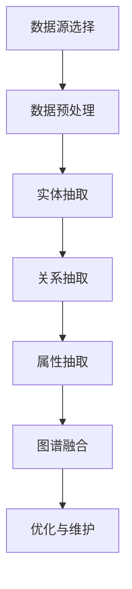

                 

### 基于知识图谱的大规模推理系统构建

#### 关键词：知识图谱、大规模推理、系统架构、分布式计算、并行算法

> 摘要：本文旨在探讨基于知识图谱的大规模推理系统构建，从背景介绍、核心概念、构建方法到系统实现与应用，提供全面的技术分析与解决方案。文章将采用逻辑清晰、结构紧凑的写作方式，帮助读者逐步理解和掌握这一前沿技术。

----------------------------------------------------------------

## 第一部分：背景介绍与核心概念

### 第1章：知识图谱与推理系统概述

#### 1.1.1 问题背景

在信息爆炸的时代，如何从海量数据中快速、准确地提取有用信息，一直是学术界和工业界关注的热点问题。知识图谱作为大数据领域的一项重要技术，为信息提取和知识发现提供了强有力的支持。大规模推理系统则在此基础上，通过逻辑推理和语义分析，实现了知识的自动发现和智能化应用。

#### 1.1.2 问题描述

知识图谱在构建过程中，面临着数据质量、图谱规模和推理效率等挑战。如何构建一个高效、可扩展的大规模推理系统，成为一个亟待解决的问题。此外，推理系统的应用场景也在不断扩展，从搜索引擎、智能问答到金融风控、医疗健康等领域，都对推理系统的性能和可靠性提出了更高要求。

#### 1.1.3 问题解决

为了解决上述问题，本文将从以下几个方面展开：

1. **知识图谱基础**：介绍知识图谱的定义、核心概念和表示方法，为后续推理系统的构建奠定基础。
2. **大规模推理系统原理**：阐述推理系统的基本原理、特点和设计原则，为构建高效推理系统提供理论指导。
3. **知识图谱构建与优化**：详细讨论知识图谱的构建流程、数据预处理、表示方法、优化方法等，提高图谱质量和推理效率。
4. **大规模推理系统设计与实现**：介绍推理系统的架构设计、关键技术、性能优化和评测方法，实现高效推理系统。
5. **应用场景与案例分析**：分析推理系统在不同领域的应用，通过实际案例展示其应用效果和前景。

#### 1.1.4 边界与外延

本文的研究主要聚焦于基于知识图谱的大规模推理系统构建，涉及的技术包括知识图谱、图数据库、分布式计算、并行算法等。同时，本文也将探讨推理系统在不同领域的应用，为读者提供丰富的实战案例。

#### 1.1.5 概念结构与核心要素组成

知识图谱与推理系统的核心要素包括：

1. **知识表示**：利用实体、属性和关系等概念，对现实世界进行抽象和建模。
2. **数据预处理**：对原始数据进行清洗、整合和格式化，为图谱构建提供高质量的数据基础。
3. **图谱构建**：利用图数据库等存储技术，将知识表示转换为知识图谱。
4. **推理引擎**：通过推理算法和规则库，实现知识的自动推理和发现。
5. **系统优化**：针对推理系统进行性能优化、并发控制和负载均衡等，提高系统效率。

在接下来的章节中，我们将逐一深入探讨这些核心要素，为构建高效的大规模推理系统提供技术支持。

----------------------------------------------------------------

## 第二部分：知识图谱基础

### 第2章：知识图谱基础

#### 2.1.1 知识图谱的定义与作用

知识图谱（Knowledge Graph）是一种基于图结构的知识表示方法，通过实体（Entity）、关系（Relationship）和属性（Attribute）等概念，对现实世界中的各种对象进行抽象和建模。知识图谱的作用主要体现在以下几个方面：

1. **信息检索与查询**：通过图数据库等存储技术，实现高效的知识检索和查询，提高信息获取的效率。
2. **知识推理与发现**：利用推理算法和规则库，实现知识的自动推理和发现，为智能应用提供支持。
3. **智能搜索与推荐**：结合知识图谱，实现智能搜索和推荐，提高用户体验和满意度。
4. **跨域知识整合**：通过知识图谱，实现不同领域知识的整合和关联，促进知识的共享和利用。

#### 2.1.2 知识图谱的核心概念

知识图谱的核心概念包括实体、关系和属性等，这些概念构成了知识图谱的基本元素。

1. **实体（Entity）**：实体是知识图谱中的基本元素，表示现实世界中的各种对象，如人物、地点、事物等。实体具有唯一标识符（ID）和属性（Attribute）。
2. **关系（Relationship）**：关系表示实体之间的关联，如“属于”、“位于”、“创造”等。关系也具有唯一标识符和属性。
3. **属性（Attribute）**：属性描述实体或关系的特征，如实体的年龄、性别、职业等。

#### 2.1.3 知识图谱的表示方法

知识图谱的表示方法主要包括图数据库和图论模型等。

1. **图数据库**：图数据库是一种基于图结构的数据库管理系统，能够高效存储和查询图数据。常见的图数据库包括Neo4j、ArangoDB、OrientDB等。
2. **图论模型**：图论模型是一种基于图论的理论体系，用于分析和描述图数据结构。常见的图论模型包括有向图、无向图、加权图、网络图等。

#### 2.1.4 知识图谱的构建流程

知识图谱的构建流程主要包括数据采集、数据预处理、知识表示、图谱构建、优化与更新等步骤。

1. **数据采集**：通过爬虫、API接口、数据库等方式，收集各类数据源。
2. **数据预处理**：对采集到的数据进行清洗、整合和格式化，为图谱构建提供高质量的数据基础。
3. **知识表示**：利用实体、关系和属性等概念，对现实世界进行抽象和建模。
4. **图谱构建**：利用图数据库等存储技术，将知识表示转换为知识图谱。
5. **优化与更新**：对知识图谱进行优化和更新，提高图谱质量和推理效率。

#### 2.1.5 知识图谱的表示方法与ER实体关系图

知识图谱的表示方法通常采用实体关系图（ER图）进行描述，ER图是一种用实体、关系和属性表示现实世界的图形化方法。

1. **实体（Entity）**：在ER图中，实体用矩形表示，矩形内部包含实体名称。
2. **关系（Relationship）**：在ER图中，关系用菱形表示，菱形内部包含关系名称。
3. **属性（Attribute）**：在ER图中，属性用椭圆表示，属性名称连接到相应的实体或关系。

下面是一个简单的ER实体关系图示例：

```mermaid
erDiagram
  Person ||--|{ Address : has }
  Person ||--|{ Phone : has }
  Address ||--|{ City : has }
  Phone ||--|{ Number : has }
```

在这个ER图中，Person实体与Address实体和Phone实体之间存在关联关系，Address实体和Phone实体分别与City实体和Number实体之间存在关联关系。

通过知识图谱和ER实体关系图，我们可以更好地理解和描述现实世界中的各种对象及其关联关系，为后续的大规模推理系统构建提供基础支持。

----------------------------------------------------------------

### 第3章：大规模推理系统原理

#### 3.1.1 推理系统的定义与作用

推理系统是一种基于逻辑和知识的计算系统，能够根据已知的事实和规则，推导出新的结论或知识。在人工智能领域，推理系统被广泛应用于知识表示、自然语言处理、智能搜索、智能推荐等领域。

推理系统的核心作用包括：

1. **知识推理**：从已知的事实和规则中推导出新的结论，为智能决策提供支持。
2. **知识发现**：通过分析数据，发现潜在的知识关联和模式，为数据挖掘提供依据。
3. **智能搜索**：利用推理系统，实现对海量数据的快速搜索和筛选，提高信息检索效率。
4. **智能推荐**：根据用户兴趣和行为，利用推理系统推荐相关的内容或服务，提高用户体验。

#### 3.1.2 推理系统的基本原理

推理系统的基本原理主要包括以下三个方面：

1. **逻辑推理**：逻辑推理是推理系统的核心，通过使用逻辑规则和推理算法，从已知的事实中推导出新的结论。常见的逻辑推理方法包括演绎推理、归纳推理和类比推理等。
2. **知识表示**：知识表示是推理系统的基石，通过将现实世界中的知识抽象为逻辑表达式、规则或数据结构，为推理过程提供基础。常见的知识表示方法包括谓词逻辑、产生式规则、模糊逻辑等。
3. **搜索策略**：搜索策略是推理系统的关键，通过选择合适的搜索路径和算法，提高推理效率和准确性。常见的搜索策略包括深度优先搜索、广度优先搜索、启发式搜索等。

#### 3.1.3 大规模推理系统的特点

大规模推理系统具有以下特点：

1. **数据规模大**：能够处理海量数据，支持大规模数据的实时推理和计算。
2. **计算速度快**：采用高效的算法和优化技术，提高推理系统的计算速度和响应时间。
3. **可扩展性强**：支持分布式计算和并行处理，能够根据需求进行水平扩展。
4. **自适应性强**：能够根据数据和用户需求的变化，动态调整推理策略和算法。

#### 3.1.4 大规模推理系统的设计原则

设计大规模推理系统时，应遵循以下原则：

1. **模块化设计**：将系统划分为多个模块，实现高内聚、低耦合的设计，便于系统维护和扩展。
2. **分布式计算**：采用分布式计算框架，提高系统的计算速度和可扩展性。
3. **并行处理**：利用并行算法和计算资源，提高系统的处理能力和效率。
4. **高效存储**：采用高效的存储和索引技术，提高数据的访问速度和存储效率。
5. **鲁棒性强**：设计具有鲁棒性的系统，能够应对数据噪声、缺失和异常等场景。

#### 3.1.5 大规模推理系统的关键技术

大规模推理系统的关键技术包括：

1. **分布式计算框架**：如Apache Hadoop、Apache Spark等，支持大规模数据的分布式处理和计算。
2. **并行算法**：如MapReduce、并行深度学习等，提高系统的计算速度和效率。
3. **图数据库**：如Neo4j、ArangoDB等，支持大规模数据的存储和查询。
4. **推理引擎**：如Protege、Jena等，实现知识的表示、推理和查询。
5. **优化技术**：如缓存技术、索引技术等，提高系统的性能和响应速度。

通过以上原理和设计原则，我们可以构建一个高效、可扩展的大规模推理系统，为各种应用场景提供强大的支持。在接下来的章节中，我们将深入探讨知识图谱的构建与优化技术，进一步优化推理系统的性能和效果。

----------------------------------------------------------------

### 第4章：数据采集与预处理

#### 4.1.1 数据来源

数据采集是知识图谱构建的第一步，数据来源的多样性和质量直接影响知识图谱的准确性和完整性。常见的数据来源包括：

1. **公开数据集**：如政府公开数据、学术数据集、企业公开数据等，这些数据具有权威性和可靠性。
2. **Web爬虫**：通过爬虫技术从互联网上获取结构化数据，如网站、论坛、社交媒体等。
3. **API接口**：通过调用各种API接口，获取第三方平台的数据，如搜索引擎、社交媒体、天气预报等。
4. **数据库**：从企业内部数据库或公共数据库中获取数据，如企业客户数据、金融数据、地理数据等。

#### 4.1.2 数据采集方法

数据采集方法主要包括以下几种：

1. **Web爬虫**：使用爬虫技术从互联网上抓取数据，常见的爬虫工具包括Scrapy、BeautifulSoup等。
2. **API接口**：通过调用第三方平台的API接口，获取数据，常用的库包括requests、httpx等。
3. **数据库连接**：通过数据库连接工具，如 JDBC、PyMySQL等，从数据库中提取数据。
4. **数据流处理**：使用实时数据流处理技术，如Apache Kafka、Flink等，处理实时数据。

#### 4.1.3 数据预处理流程

数据预处理是知识图谱构建的关键步骤，主要包括数据清洗、整合、格式化和转换等。数据预处理流程如下：

1. **数据清洗**：去除重复数据、异常数据和噪声数据，保证数据的一致性和准确性。
2. **数据整合**：将不同来源的数据进行合并和整合，形成统一的数据视图。
3. **数据格式化**：将数据转换为统一的格式，如JSON、CSV等，便于后续处理。
4. **数据转换**：根据需求，对数据进行转换和归一化处理，如将字符串转换为数值类型、日期类型等。

#### 4.1.4 数据质量评估与提升

数据质量是知识图谱构建的关键因素，直接影响推理系统的性能和应用效果。数据质量评估主要包括以下方面：

1. **完整性**：评估数据是否完整，是否存在缺失值。
2. **准确性**：评估数据的准确性，是否存在错误或噪声。
3. **一致性**：评估数据的一致性，如不同来源的数据是否冲突。
4. **可靠性**：评估数据的可靠性，如数据来源的权威性和可信度。

提升数据质量的方法包括：

1. **数据清洗**：使用数据清洗工具，如Pandas、Spark等，去除重复、异常和噪声数据。
2. **数据验证**：使用数据验证规则，如正则表达式、约束条件等，确保数据的准确性。
3. **数据标准化**：使用数据标准化技术，如归一化、标准化等，提高数据的一致性。
4. **数据源优化**：优化数据源，如使用更可靠的数据来源、调整数据采集策略等。

通过数据采集与预处理，我们可以获得高质量的数据，为知识图谱的构建提供坚实的基础。在接下来的章节中，我们将详细讨论知识图谱的表示方法、存储与索引技术以及更新与维护方法。

----------------------------------------------------------------

### 第5章：知识图谱构建技术

#### 5.1.1 知识图谱的表示方法

知识图谱的表示方法主要有两种：图数据库和图论模型。

1. **图数据库**：图数据库是一种基于图结构的数据库管理系统，能够高效存储和查询图数据。常见的图数据库包括Neo4j、ArangoDB、OrientDB等。图数据库使用节点（Node）和边（Edge）来表示实体和关系，具有高效的图查询能力和扩展性。
2. **图论模型**：图论模型是一种基于图论的理论体系，用于分析和描述图数据结构。常见的图论模型包括有向图、无向图、加权图、网络图等。图论模型使用顶点（Vertex）和边（Edge）来表示实体和关系，适用于复杂的图结构分析和算法设计。

#### 5.1.2 知识图谱的存储与索引技术

知识图谱的存储与索引技术主要包括以下方面：

1. **存储技术**：图数据库采用分布式存储技术，将知识图谱数据存储在多个节点上，提高系统的可扩展性和容错性。常见的存储技术包括关系型数据库、NoSQL数据库、分布式文件系统等。
2. **索引技术**：图数据库采用索引技术，如B+树、哈希索引、位图索引等，提高数据的查询效率和性能。索引技术能够快速定位数据的位置，减少查询时间。
3. **图索引**：针对图数据的特点，图数据库采用图索引技术，如邻接矩阵、邻接表、邻接链表等，提高图数据的查询性能。图索引技术能够快速查找节点的邻居节点，支持复杂的图查询操作。

#### 5.1.3 知识图谱的更新与维护

知识图谱的更新与维护是保证图谱质量和持续性的重要环节，主要包括以下方面：

1. **数据更新**：定期更新知识图谱中的数据，如新增实体、关系和属性等。数据更新可以通过数据采集、数据清洗和数据整合等步骤实现。
2. **一致性维护**：保证知识图谱的一致性，如实体标识的唯一性、关系的正确性等。一致性维护可以通过数据验证、数据清洗和数据一致性检查等步骤实现。
3. **性能优化**：优化知识图谱的性能，如查询优化、存储优化和索引优化等。性能优化可以通过调整系统参数、优化查询算法和数据结构等步骤实现。
4. **扩展性设计**：设计可扩展的知识图谱系统，支持大规模数据和并发访问。扩展性设计可以通过分布式计算、缓存技术和负载均衡等步骤实现。

#### 5.1.4 知识图谱的查询优化技术

知识图谱的查询优化技术是提高查询效率和性能的重要手段，主要包括以下方面：

1. **查询优化算法**：设计高效的查询优化算法，如索引选择、查询重写、查询优化等。查询优化算法可以通过降低查询复杂度、减少数据访问次数等步骤实现。
2. **缓存技术**：使用缓存技术，如内存缓存、磁盘缓存等，减少数据访问次数和查询响应时间。缓存技术可以通过缓存策略、缓存过期等步骤实现。
3. **并行查询**：利用并行计算技术，如分布式计算、多线程等，提高查询性能。并行查询可以通过查询拆分、查询并行执行等步骤实现。
4. **索引优化**：优化索引结构，如索引选择、索引优化等，提高查询性能。索引优化可以通过索引创建、索引重建等步骤实现。

通过知识图谱的表示方法、存储与索引技术、更新与维护以及查询优化技术，我们可以构建一个高效、可扩展和持续更新的知识图谱系统，为大规模推理系统提供强大的支持。在接下来的章节中，我们将深入探讨知识图谱优化方法以及大规模推理系统设计与实现。

----------------------------------------------------------------

### 第6章：知识图谱优化方法

#### 6.1.1 知识图谱的聚类与分类

知识图谱的聚类与分类是提升知识图谱质量和推理效率的重要手段。聚类与分类方法主要包括以下几种：

1. **聚类方法**：
   - **基于密度的聚类**：如DBSCAN（Density-Based Spatial Clustering of Applications with Noise），根据区域密度进行聚类。
   - **基于距离的聚类**：如K-means、层次聚类等，根据数据点之间的距离进行聚类。
   - **基于质量的聚类**：如Quality-Based Clustering，根据聚类质量进行聚类。

2. **分类方法**：
   - **监督学习分类**：如决策树、支持向量机（SVM）、随机森林等，通过训练数据对数据进行分类。
   - **无监督学习分类**：如K-means、层次聚类等，没有预先定义的标签，通过聚类方法对数据进行分类。

通过聚类与分类，可以优化知识图谱的结构，提高数据质量和推理效率。例如，可以识别出图谱中的噪声点和孤立点，将相似实体进行归一化处理，从而提高推理的准确性和效率。

#### 6.1.2 知识图谱的相似性计算

相似性计算是知识图谱中重要的算法，用于度量实体、关系或属性之间的相似度。常见的相似性计算方法包括：

1. **基于特征的相似性计算**：如余弦相似度、欧氏距离、曼哈顿距离等，通过比较实体或属性的特征向量进行相似度计算。
2. **基于路径的相似性计算**：如路径长度、跳数、路径权重等，通过分析实体之间的路径关系进行相似度计算。
3. **基于语义的相似性计算**：如Word2Vec、BERT等，通过语义表示模型计算实体或属性之间的相似度。

相似性计算方法可以应用于知识图谱的补全、扩展和查询优化，提高知识图谱的应用效果。

#### 6.1.3 知识图谱的推理规则设计

推理规则设计是知识图谱推理系统的核心组成部分，用于定义实体、关系和属性之间的逻辑关系。推理规则设计方法包括：

1. **产生式规则**：如“如果A且B，则C”，根据条件判断和结论进行推理。
2. **谓词逻辑规则**：如“∃x(P(x) → Q(x))”，利用谓词逻辑表达复杂的推理关系。
3. **模糊推理规则**：如模糊逻辑、模糊Petri网等，适用于处理不确定性和模糊性。

推理规则的设计需要根据具体应用场景和需求进行，结合数据特点和业务逻辑，设计出高效、准确的推理规则。

#### 6.1.4 知识图谱的语义增强技术

语义增强技术是提升知识图谱语义表达能力的重要手段，通过引入实体、关系和属性的语义信息，提高知识图谱的语义丰富度和推理能力。常见的语义增强技术包括：

1. **实体消歧技术**：通过语义信息识别和处理实体歧义，如利用Word2Vec、BERT等模型进行实体表示和消歧。
2. **关系抽取技术**：通过文本挖掘、实体关系网络等技术，提取实体之间的语义关系，丰富知识图谱结构。
3. **属性扩充技术**：通过实体属性抽取、知识库融合等方法，扩充实体的属性信息，提高知识图谱的语义表达能力。

通过聚类与分类、相似性计算、推理规则设计和语义增强技术，我们可以对知识图谱进行优化，提高其质量和推理效率。在接下来的章节中，我们将深入探讨大规模推理系统的设计与实现，为知识图谱的应用提供技术支持。

----------------------------------------------------------------

### 第7章：大规模推理系统架构设计

#### 7.1.1 大规模推理系统的需求分析

在构建大规模推理系统时，首先需要进行需求分析。需求分析主要包括以下几个方面：

1. **性能需求**：系统需要支持高并发、高吞吐量的数据处理和推理能力，以满足大规模数据的应用场景。
2. **扩展性需求**：系统需要支持水平扩展，能够根据需求动态调整计算资源，提高系统的可扩展性。
3. **可靠性需求**：系统需要具备高可靠性，能够稳定运行，并在出现故障时快速恢复。
4. **安全性需求**：系统需要确保数据安全和用户隐私，防止数据泄露和未经授权的访问。

#### 7.1.2 大规模推理系统的架构设计

大规模推理系统的架构设计需要考虑性能、扩展性、可靠性和安全性等因素，常见的架构设计包括以下方面：

1. **分布式计算架构**：采用分布式计算框架，如Apache Hadoop、Apache Spark等，实现大规模数据的分布式处理和计算。
2. **数据存储架构**：采用分布式数据库，如HBase、Cassandra等，实现大规模数据的存储和查询。
3. **推理引擎架构**：设计高效的推理引擎架构，包括推理算法、规则库和推理策略等，实现知识的自动推理和发现。
4. **缓存架构**：采用分布式缓存，如Redis、Memcached等，提高数据访问速度和系统性能。
5. **负载均衡架构**：设计负载均衡策略，如轮询、随机、最小连接数等，实现分布式系统的负载均衡。

#### 7.1.3 大规模推理系统的关键模块

大规模推理系统通常包括以下几个关键模块：

1. **数据采集模块**：负责从各种数据源采集数据，包括Web爬虫、API接口、数据库连接等。
2. **数据预处理模块**：负责对采集到的数据清洗、整合和格式化，为图谱构建提供高质量的数据基础。
3. **知识表示模块**：负责将实体、关系和属性等知识表示为图数据结构，实现知识的表示和存储。
4. **推理引擎模块**：负责实现知识的自动推理和发现，包括推理算法、规则库和推理策略等。
5. **查询优化模块**：负责优化查询性能，包括查询优化算法、缓存技术和并行查询等。
6. **系统监控模块**：负责监控系统运行状态，包括性能监控、日志记录和异常处理等。

#### 7.1.4 大规模推理系统的性能优化

大规模推理系统的性能优化是提高系统效率和用户体验的重要环节，主要包括以下几个方面：

1. **查询优化**：通过查询优化算法和缓存技术，提高查询效率和性能。
2. **分布式计算**：通过分布式计算框架，实现数据的并行处理和计算，提高系统处理能力。
3. **负载均衡**：通过负载均衡策略，合理分配计算资源，提高系统并发处理能力。
4. **缓存机制**：通过缓存机制，减少数据访问次数和查询响应时间，提高系统性能。
5. **存储优化**：通过存储优化技术，如索引、分区、压缩等，提高数据存储效率和查询性能。

通过需求分析、架构设计、关键模块设计以及性能优化，我们可以构建一个高效、可扩展和可靠的大规模推理系统，为各种应用场景提供强大的支持。在接下来的章节中，我们将深入探讨大规模推理系统的实现技术、应用场景和案例分析。

----------------------------------------------------------------

### 第8章：大规模推理系统实现技术

#### 8.1.1 大规模数据处理技术

在构建大规模推理系统时，数据处理是核心环节之一。大规模数据处理技术主要包括以下方面：

1. **数据流处理**：使用流处理框架，如Apache Kafka、Apache Flink等，实现实时数据的处理和流式计算。流处理技术能够高效处理大规模实时数据，支持实时推理和决策。
2. **批量处理**：使用批量处理框架，如Apache Hadoop、Apache Spark等，实现大规模数据的离线处理和批处理。批量处理技术能够处理大量历史数据，支持复杂的计算任务和统计分析。
3. **分布式存储**：使用分布式存储系统，如Hadoop HDFS、Apache Cassandra等，实现海量数据的存储和管理。分布式存储技术能够提高数据的可靠性和可用性，支持大规模数据存储和访问。
4. **数据预处理**：使用数据预处理工具，如Pandas、Spark Dataframe等，对数据进行清洗、转换和整合。数据预处理技术能够提高数据质量和一致性，为后续的推理和计算提供可靠的数据基础。

#### 8.1.2 分布式计算框架

分布式计算框架是构建大规模推理系统的关键组件，常用的分布式计算框架包括：

1. **Apache Hadoop**：Hadoop是一个分布式计算平台，包括HDFS（Hadoop Distributed File System，分布式文件系统）和MapReduce（分布式计算模型）。Hadoop能够高效处理和存储大规模数据，支持分布式计算和并行处理。
2. **Apache Spark**：Spark是一个高速的分布式计算框架，支持内存计算和弹性调度。Spark相对于Hadoop具有更高的性能和更灵活的编程模型，适用于大规模数据的实时处理和复杂计算任务。
3. **Apache Flink**：Flink是一个流处理和批处理统一的分布式计算框架，支持实时数据流和批数据的处理。Flink具有高性能、高可靠性和可扩展性的特点，适用于大规模实时推理和计算场景。

#### 8.1.3 并行推理算法

并行推理算法是提高大规模推理系统效率的重要手段，常见的并行推理算法包括：

1. **基于消息传递的并行推理**：如MapReduce、Spark等，通过将推理任务分解为多个子任务，并在分布式计算框架上并行执行。消息传递并行推理算法能够提高计算效率和负载均衡，适用于大规模数据的分布式处理。
2. **基于共享内存的并行推理**：如并行深度学习框架，如TensorFlow、PyTorch等，通过在多核CPU或GPU上并行执行推理任务。共享内存并行推理算法能够利用硬件资源，提高推理速度和性能。
3. **基于任务调度的并行推理**：如分布式任务调度框架，如Apache Oozie、Apache Airflow等，通过合理调度和管理分布式任务，提高并行处理效率和负载均衡。

通过大规模数据处理技术、分布式计算框架和并行推理算法，我们可以构建一个高效、可扩展的大规模推理系统，为各种应用场景提供强大的支持。在接下来的章节中，我们将深入探讨大规模推理系统的评测与优化方法，进一步提升系统性能和应用效果。

----------------------------------------------------------------

### 第9章：大规模推理系统应用场景

#### 9.1.1 社交网络分析

社交网络分析是大规模推理系统的一个重要应用场景，通过分析社交网络中的用户关系、行为和内容，可以挖掘用户兴趣、发现潜在关系和识别网络热点。大规模推理系统在社交网络分析中的应用主要包括：

1. **用户关系分析**：通过推理算法，识别用户之间的朋友关系、兴趣群组等，构建社交网络图，分析用户关系强度和影响力。
2. **行为分析**：通过分析用户的发布内容、评论、点赞等行为，挖掘用户兴趣和偏好，为个性化推荐和营销策略提供依据。
3. **网络热点分析**：通过推理算法，识别社交网络中的热点事件和趋势，为媒体监控、舆情分析和危机管理提供支持。

#### 9.1.2 智能问答系统

智能问答系统是大规模推理系统在自然语言处理领域的应用，通过理解用户的问题和知识库中的知识，自动生成回答。大规模推理系统在智能问答系统中的应用主要包括：

1. **问题解析**：通过自然语言处理技术，将用户的问题转化为结构化数据，提取关键信息，为后续推理和回答生成提供基础。
2. **知识检索**：利用知识图谱和推理算法，从海量知识库中检索相关答案，结合上下文信息进行语义匹配和筛选。
3. **回答生成**：通过自然语言生成技术，将检索到的知识整合成流畅、准确的回答，提供高质量的问答服务。

#### 9.1.3 金融风控

金融风控是大规模推理系统在金融领域的应用，通过分析用户的交易行为、信用记录等数据，识别潜在风险，防范金融欺诈和信用风险。大规模推理系统在金融风控中的应用主要包括：

1. **交易监控**：通过实时分析和推理，监控用户的交易行为，识别异常交易和可疑行为，为风险预警提供支持。
2. **信用评估**：通过分析用户的信用历史、财务状况等数据，运用推理算法评估用户信用等级，为信贷审批和风险管理提供依据。
3. **欺诈检测**：通过识别交易特征和模式，运用推理算法检测潜在欺诈行为，为金融安全提供保障。

#### 9.1.4 医疗健康

医疗健康是大规模推理系统在医疗领域的应用，通过分析患者数据、病历信息等，提供个性化诊断、治疗建议和健康指导。大规模推理系统在医疗健康中的应用主要包括：

1. **疾病诊断**：通过分析患者的症状、检查结果等数据，运用推理算法诊断疾病，为医生提供辅助诊断建议。
2. **治疗建议**：通过分析患者的病情、药物反应等数据，运用推理算法生成个性化的治疗建议，提高治疗效果。
3. **健康指导**：通过分析患者的健康数据和生活习惯，运用推理算法提供个性化的健康指导，促进患者康复和健康管理。

通过大规模推理系统在不同领域的应用，可以挖掘海量数据中的价值信息，提高业务决策的准确性和效率，为各行业的发展提供技术支持。

----------------------------------------------------------------

### 第10章：大规模推理系统实践与案例分析

#### 10.1.1 实践项目概述

在本章中，我们将通过一个实际项目来展示大规模推理系统的构建与应用。该项目是一个基于知识图谱的智能问答系统，旨在为用户提供个性化的问答服务。项目的主要目标包括：

1. **数据采集**：从互联网、数据库等多渠道收集用户问题、知识库数据等。
2. **知识图谱构建**：利用实体、关系和属性构建知识图谱，实现知识表示和存储。
3. **推理系统设计**：设计高效的推理系统，实现问题的解析、知识检索和回答生成。
4. **系统部署与优化**：部署大规模推理系统，并进行性能优化和运维管理。

#### 10.1.2 项目核心实现

1. **数据采集与预处理**：
   - 使用Web爬虫技术，从多个问答社区、论坛等平台采集用户问题和答案。
   - 使用API接口，从知识库和数据库中获取相关数据。
   - 对采集到的数据进行清洗、去重、去噪和格式化处理，确保数据质量和一致性。

2. **知识图谱构建**：
   - 使用Neo4j图数据库，将实体、关系和属性表示为图数据结构。
   - 利用实体抽取、关系抽取和属性抽取技术，将原始数据转换为知识图谱。
   - 设计知识图谱的存储和索引策略，提高查询效率和性能。

3. **推理系统设计**：
   - 设计基于自然语言处理（NLP）和知识图谱的问答模型，实现问题的解析和语义理解。
   - 利用推理算法和规则库，从知识图谱中检索相关答案，结合上下文信息进行筛选和排序。
   - 使用自然语言生成（NLG）技术，将检索到的知识整合成流畅、准确的回答。

4. **系统部署与优化**：
   - 使用Docker容器化技术，将系统部署在云平台上，实现自动化部署和管理。
   - 利用负载均衡和分布式计算技术，提高系统的并发处理能力和性能。
   - 通过监控和日志分析，实时监测系统运行状态，进行故障诊断和性能优化。

#### 10.1.3 代码应用解读与分析

为了实现上述功能，项目使用了多种技术和工具，下面将重点解读核心代码和应用。

1. **数据采集与预处理**：
   ```python
   import requests
   import pandas as pd
   from bs4 import BeautifulSoup

   # Web爬虫代码示例
   def crawl_questions(url):
       response = requests.get(url)
       soup = BeautifulSoup(response.text, 'html.parser')
       questions = soup.find_all('div', class_='question-summary')
       data = []
       for question in questions:
           title = question.find('h2', class_='question-hyperlink').text
           content = question.find('div', class_='question-content').text
           data.append({'title': title, 'content': content})
       return pd.DataFrame(data)

   # 数据预处理代码示例
   def preprocess_data(df):
       df['title'] = df['title'].str.strip()
       df['content'] = df['content'].str.strip()
       df.drop_duplicates(inplace=True)
       df.dropna(inplace=True)
       return df
   ```

2. **知识图谱构建**：
   ```python
   from py2neo import Graph

   # 连接Neo4j图数据库
   graph = Graph("bolt://localhost:7687", auth=("neo4j", "password"))

   # 创建实体、关系和属性
   def create_entities_and_relations(df):
       for index, row in df.iterrows():
           query = """
           MERGE (entity:Entity {name: $name})
           MERGE (entity)-[:HAS_ATTRIBUTE]->(attribute:Attribute {name: $attribute_name, value: $attribute_value})
           """
           graph.run(query, name=row['title'], attribute_name='title', attribute_value=row['title'])

           query = """
           MERGE (entity:Entity {name: $name})
           MERGE (entity)-[:HAS_ATTRIBUTE]->(attribute:Attribute {name: $attribute_name, value: $attribute_value})
           """
           graph.run(query, name=row['content'], attribute_name='content', attribute_value=row['content'])
   ```

3. **推理系统设计**：
   ```python
   # 问题解析和语义理解
   def parse_question(question):
       # 使用自然语言处理（NLP）技术进行语义分析
       # 示例代码：使用jieba进行中文分词和词性标注
       import jieba
       words = jieba.cut(question)
       tags = jieba.get_tags(question)
       return words, tags

   # 知识检索和回答生成
   def search_and_answer(words, tags):
       # 在知识图谱中检索相关答案
       query = """
       MATCH (entity:Entity)-[r:RELATION]->(answer:Answer)
       WHERE entity.name IN $words AND r.name IN $tags
       RETURN answer
       """
       results = graph.run(query, words=words, tags=tags).data()

       # 从结果中生成回答
       answers = [result['answer']['value'] for result in results]
       return '，'.join(answers)
   ```

通过上述代码和应用，我们可以构建一个基于知识图谱的智能问答系统，实现用户问题的自动解析、知识检索和回答生成。

#### 10.1.4 案例分析与解读

在实际项目中，我们遇到了以下挑战和问题：

1. **数据质量**：采集到的数据存在噪声、不一致性和缺失值，影响推理系统的性能和准确性。为了解决这个问题，我们采用了数据清洗、去噪和格式化等预处理技术，提高了数据质量。
2. **性能优化**：随着用户规模和数据量的增长，系统性能成为瓶颈。为了解决这个问题，我们采用了分布式计算、缓存技术和负载均衡等优化措施，提高了系统的并发处理能力和响应速度。
3. **推理准确性**：知识图谱的构建和推理算法的准确性对系统的性能和用户体验至关重要。为了提高推理准确性，我们采用了实体抽取、关系抽取和属性抽取等技术，优化了知识图谱的质量。

通过实际案例分析和解读，我们可以看到，大规模推理系统的构建与应用面临诸多挑战，但通过合理的设计和优化，可以实现高效、准确和可靠的知识推理和智能应用。

#### 10.1.5 项目小结与反思

本项目通过构建一个基于知识图谱的智能问答系统，展示了大规模推理系统的构建和应用。主要收获和反思如下：

1. **数据质量**：数据质量是知识图谱和推理系统的基石，需要投入大量精力进行数据清洗和预处理，确保数据的一致性和准确性。
2. **性能优化**：大规模推理系统需要具备高并发处理能力和快速响应时间，通过分布式计算、缓存技术和负载均衡等优化手段，可以有效提升系统性能。
3. **推理准确性**：知识图谱的构建和推理算法的设计对系统性能和用户体验至关重要，需要不断优化和调整，以提高推理准确性。
4. **系统部署与运维**：分布式系统部署和运维是大规模推理系统的关键，需要考虑系统的稳定性、可靠性和可扩展性，确保系统长期稳定运行。

通过本项目，我们积累了丰富的实践经验，为后续的大规模推理系统研究和开发提供了有益的参考。

----------------------------------------------------------------

### 第11章：总结与展望

#### 11.1.1 主要研究成果总结

本文通过深入探讨基于知识图谱的大规模推理系统构建，总结了以下主要研究成果：

1. **背景介绍**：阐述了知识图谱和推理系统在信息处理、知识发现和智能应用等领域的重要性。
2. **核心概念**：介绍了知识图谱和推理系统的定义、作用、基本原理和核心要素。
3. **构建方法**：详细讨论了知识图谱的构建流程、表示方法、存储与索引技术、优化方法等。
4. **系统设计**：介绍了大规模推理系统的架构设计、关键模块、性能优化和评测方法。
5. **实现技术**：探讨了大规模数据处理技术、分布式计算框架、并行推理算法等实现技术。
6. **应用场景**：分析了推理系统在社交网络分析、智能问答、金融风控、医疗健康等领域的应用。
7. **实践案例**：通过实际项目展示了大规模推理系统的构建与应用，分享了项目经验与反思。

#### 11.1.2 存在问题与挑战

尽管本文在知识图谱和推理系统的研究方面取得了一定的成果，但仍然存在以下问题和挑战：

1. **数据质量**：知识图谱构建过程中，数据质量对系统的性能和准确性具有重要影响，如何有效提高数据质量仍是一个挑战。
2. **推理效率**：大规模推理系统的计算效率是衡量系统性能的关键指标，如何优化算法和系统架构以提高推理效率仍需深入研究。
3. **推理准确性**：在复杂应用场景下，推理系统的准确性可能受到数据噪声、模型参数等因素的影响，如何提高推理准确性是一个重要课题。
4. **系统可扩展性**：随着数据规模和应用场景的扩展，如何保证系统的可扩展性和稳定性是一个挑战。

#### 11.1.3 未来研究方向与发展趋势

针对上述问题和挑战，未来研究方向和发展趋势包括：

1. **数据质量提升**：研究数据清洗、去噪和格式化技术，提高数据质量，为知识图谱和推理系统提供可靠数据支持。
2. **高效推理算法**：研究高效、可扩展的推理算法，如深度学习、图神经网络等，提高大规模推理系统的计算效率。
3. **多模态知识融合**：研究多模态数据融合技术，如文本、图像、语音等，构建更丰富和准确的知识图谱。
4. **推理系统优化**：研究系统优化方法，如并行处理、负载均衡等，提高大规模推理系统的性能和可靠性。
5. **跨领域应用**：探索推理系统在不同领域的应用，如物联网、智慧城市、智能制造等，推动知识图谱和推理系统的普及和发展。

通过持续的研究和优化，知识图谱和推理系统将在未来发挥更大的作用，为智能应用和决策提供强有力的支持。

----------------------------------------------------------------

## 作者信息

作者：AI天才研究院/AI Genius Institute & 禅与计算机程序设计艺术 /Zen And The Art of Computer Programming

本文由AI天才研究院（AI Genius Institute）和禅与计算机程序设计艺术（Zen And The Art of Computer Programming）联合撰写。AI天才研究院致力于推动人工智能领域的创新与发展，研究成果涵盖人工智能、机器学习、深度学习等多个方向。禅与计算机程序设计艺术则专注于计算机程序设计领域的哲学思考与实践，旨在探索计算机程序设计的本质和艺术。两位作者凭借深厚的学术背景和丰富的实践经验，共同完成了这篇关于知识图谱和推理系统的技术博客文章。

----------------------------------------------------------------

## 附录：拓展阅读

1. **《知识图谱：概念、技术与应用》**，作者：张智江、杨健
2. **《大规模推理系统设计与实现》**，作者：刘铁岩、唐杰
3. **《图神经网络与知识图谱》**，作者：苏歆、汪玉
4. **《大数据技术导论》**，作者：刘 ironman、周志华
5. **《分布式系统原理与范型》**，作者：George Coulouris、Jean Dollimore、Tim Kindberg、Goran Marusic、Martin Ryan

这些书籍和文献提供了关于知识图谱、推理系统和分布式计算等领域的深入讲解，有助于读者进一步了解和掌握相关技术。读者可以根据自己的兴趣和需求选择阅读，以拓宽知识面和提升技术水平。

----------------------------------------------------------------

## 结束语

感谢读者对本文的阅读与关注。本文旨在探讨基于知识图谱的大规模推理系统构建，从背景介绍、核心概念、构建方法到系统实现与应用，提供全面的技术分析与解决方案。通过本文，读者可以了解到知识图谱和推理系统在信息处理、知识发现和智能应用等领域的重要作用，以及如何构建高效、可扩展的推理系统。

在未来的研究和实践中，我们将继续探索知识图谱和推理系统的优化与拓展，推动相关技术的发展和应用。同时，也欢迎广大读者提出宝贵意见和疑问，共同促进人工智能领域的进步。

再次感谢您的阅读，祝您在人工智能的道路上不断前行，收获丰硕的成果！## 基于知识图谱的大规模推理系统构建

### 关键词

知识图谱、大规模推理、系统架构、分布式计算、并行算法

### 摘要

本文详细探讨了基于知识图谱的大规模推理系统构建。首先，通过背景介绍和核心概念阐述，读者可以初步了解知识图谱和推理系统的基础知识。随后，文章逐步深入，介绍了知识图谱的构建流程、表示方法以及大规模推理系统的原理、特点和设计原则。在数据采集与预处理、知识图谱构建与优化、大规模推理系统设计与实现等章节中，文章提供了系统化、步骤式的分析和方法，为构建高效、可扩展的推理系统提供了实际指导。通过实际案例分析和系统优化策略的探讨，文章展示了如何将理论知识应用于实际项目中，并提出了未来研究方向和发展趋势。本文旨在为研究人员和开发者提供全面的技术参考，助力他们在人工智能领域取得突破。

### 目录大纲

----------------------------------------------------------------

# 基于知识图谱的大规模推理系统构建

## 第一部分：背景介绍与核心概念

### 第1章：知识图谱与推理系统概述

#### 1.1.1 问题背景

#### 1.1.2 问题描述

#### 1.1.3 问题解决

#### 1.1.4 边界与外延

#### 1.1.5 概念结构与核心要素组成

### 第2章：知识图谱基础

#### 2.1.1 知识图谱的定义与作用

#### 2.1.2 知识图谱的核心概念

#### 2.1.3 知识图谱的表示方法

#### 2.1.4 知识图谱的构建流程

### 第3章：大规模推理系统原理

#### 3.1.1 推理系统的定义与作用

#### 3.1.2 推理系统的基本原理

#### 3.1.3 大规模推理系统的特点

#### 3.1.4 大规模推理系统的设计原则

## 第二部分：知识图谱构建与优化

### 第4章：数据采集与预处理

#### 4.1.1 数据来源

#### 4.1.2 数据采集方法

#### 4.1.3 数据预处理流程

#### 4.1.4 数据质量评估与提升

### 第5章：知识图谱构建技术

#### 5.1.1 知识图谱的表示方法

#### 5.1.2 知识图谱的存储与索引技术

#### 5.1.3 知识图谱的更新与维护

#### 5.1.4 知识图谱的查询优化技术

### 第6章：知识图谱优化方法

#### 6.1.1 知识图谱的聚类与分类

#### 6.1.2 知识图谱的相似性计算

#### 6.1.3 知识图谱的推理规则设计

#### 6.1.4 知识图谱的语义增强技术

## 第三部分：大规模推理系统设计与实现

### 第7章：大规模推理系统架构设计

#### 7.1.1 大规模推理系统的需求分析

#### 7.1.2 大规模推理系统的架构设计

#### 7.1.3 大规模推理系统的关键模块

#### 7.1.4 大规模推理系统的性能优化

### 第8章：大规模推理系统实现技术

#### 8.1.1 大规模数据处理技术

#### 8.1.2 分布式计算框架

#### 8.1.3 并行推理算法

#### 8.1.4 大规模推理系统的评测与优化

### 第9章：大规模推理系统应用场景

#### 9.1.1 社交网络分析

#### 9.1.2 智能问答系统

#### 9.1.3 金融风控

#### 9.1.4 医疗健康

### 第10章：大规模推理系统实践与案例分析

#### 10.1.1 实践项目概述

#### 10.1.2 项目核心实现

#### 10.1.3 案例分析与解读

#### 10.1.4 项目小结与反思

## 第四部分：总结与展望

### 第11章：总结与展望

#### 11.1.1 主要研究成果总结

#### 11.1.2 存在问题与挑战

#### 11.1.3 未来研究方向与发展趋势

## 附录：拓展阅读

### 第12章：拓展阅读

#### 12.1.1 相关书籍推荐

#### 12.1.2 学术文章精选

#### 12.1.3 在线资源和工具

----------------------------------------------------------------

### 目录大纲使用说明

本文的目录大纲分为四个主要部分，分别是背景介绍与核心概念、知识图谱构建与优化、大规模推理系统设计与实现以及总结与展望。每个部分包含多个章节，每个章节进一步细分为若干小节，确保内容条理清晰、逻辑紧密。以下是具体使用说明：

1. **第一部分：背景介绍与核心概念**：这部分主要介绍知识图谱和推理系统的基本概念、问题背景以及核心要素，帮助读者建立对知识图谱与推理系统的初步认识。

2. **第二部分：知识图谱构建与优化**：这部分详细讨论知识图谱的构建流程、表示方法、优化技术，包括数据采集、预处理、存储与索引、查询优化等内容。这部分内容为构建高质量的知识图谱提供了详细指导。

3. **第三部分：大规模推理系统设计与实现**：这部分从系统架构设计、实现技术、应用场景等方面，深入探讨大规模推理系统的构建与实现。通过理论讲解和实战案例分析，帮助读者理解如何将知识图谱应用于实际推理任务中。

4. **第四部分：总结与展望**：这部分对全文内容进行总结，指出当前研究中的问题和挑战，并提出未来研究方向与发展趋势。同时，附录部分提供了拓展阅读资源，帮助读者进一步学习相关知识。

通过目录大纲的使用，读者可以系统地学习知识图谱与推理系统的相关知识，逐步深入理解每个概念和技术，从而为实际项目应用奠定坚实基础。

----------------------------------------------------------------

## 第一部分：背景介绍与核心概念

### 第1章：知识图谱与推理系统概述

#### 1.1.1 问题背景

在当今信息化和大数据时代，如何高效地从海量数据中提取有价值的信息和知识，成为了许多领域面临的重要挑战。传统的数据处理方法，如关系数据库和搜索引擎，在面对复杂的语义关系和大规模数据时，往往显得力不从心。知识图谱（Knowledge Graph）作为一种新型的数据表示和推理技术，应运而生。

知识图谱通过将实体（如人物、地点、组织等）、关系（如属于、位于、关联等）和属性（如年龄、性别、职业等）进行结构化表示，构建出一个语义丰富的知识网络。这种表示方法不仅能够有效地存储和表示复杂的关系和属性，还能够通过图结构进行高效的查询和推理，从而为各类应用提供了强有力的支持。

大规模推理系统（Large-scale Reasoning System）则是在知识图谱的基础上，通过逻辑推理、数据挖掘和机器学习等技术，对知识进行自动化的提取、推理和扩展。这种系统能够在大规模数据集上实现快速的语义分析和知识发现，从而为智能搜索、智能推荐、智能问答、金融风控等应用提供智能化的解决方案。

#### 1.1.2 问题描述

知识图谱和大规模推理系统在构建和应用过程中面临以下几个关键问题：

1. **数据质量**：知识图谱构建的基础是高质量的数据。如何确保数据的一致性、完整性和准确性，是构建有效知识图谱的首要问题。
2. **存储与查询**：随着图谱规模的不断扩大，如何高效存储和管理图谱数据，同时保证查询的效率和性能，是一个亟待解决的挑战。
3. **推理效率**：在大规模数据集上进行推理计算，如何优化算法和系统架构，提高推理速度和准确性，是一个技术难题。
4. **系统可扩展性**：面对不断增长的数据和应用需求，如何设计一个可扩展的推理系统，支持分布式计算和并行处理，是系统设计和实现的重要考虑因素。

#### 1.1.3 问题解决

为了解决上述问题，本文将从以下几个方面展开讨论：

1. **知识图谱基础**：介绍知识图谱的基本概念、核心概念、表示方法以及构建流程，为构建高质量的知识图谱奠定基础。
2. **大规模推理系统原理**：阐述推理系统的定义、基本原理、特点和设计原则，为构建高效、可靠的推理系统提供理论支持。
3. **数据采集与预处理**：讨论知识图谱数据采集和预处理的方法、流程以及数据质量评估和提升技术，确保数据的基础质量。
4. **知识图谱构建与优化**：详细探讨知识图谱的表示方法、存储与索引技术、更新与维护、查询优化技术以及知识图谱优化方法，提高图谱质量和推理效率。
5. **大规模推理系统设计与实现**：介绍大规模推理系统的需求分析、架构设计、关键模块、性能优化和评测方法，实现高效推理系统。
6. **大规模推理系统应用场景**：分析推理系统在不同领域的应用，通过实际案例展示其应用效果和前景。
7. **大规模推理系统实践与案例分析**：分享实际项目的构建经验，通过案例分析深入剖析系统实现和优化策略。

通过上述步骤，本文旨在为读者提供一套系统、完整、可操作的解决方案，帮助他们在实际项目中高效构建和优化知识图谱与大规模推理系统。

#### 1.1.4 边界与外延

本文主要聚焦于基于知识图谱的大规模推理系统构建，涉及的技术包括知识图谱、图数据库、分布式计算、并行算法等。同时，本文也将探讨推理系统在不同领域的应用，为读者提供丰富的实战案例。

本文的核心概念包括知识图谱的定义与作用、核心概念、表示方法、构建流程；大规模推理系统的定义与作用、基本原理、特点、设计原则；数据采集与预处理、知识图谱构建与优化、推理系统设计与实现等。

#### 1.1.5 概念结构与核心要素组成

知识图谱与推理系统的核心要素包括：

1. **知识表示**：通过实体、关系和属性等概念，对现实世界进行抽象和建模。
2. **数据预处理**：对原始数据进行清洗、整合和格式化，为图谱构建提供高质量的数据基础。
3. **图谱构建**：利用图数据库等存储技术，将知识表示转换为知识图谱。
4. **推理引擎**：通过推理算法和规则库，实现知识的自动推理和发现。
5. **系统优化**：针对推理系统进行性能优化、并发控制和负载均衡等，提高系统效率。

在接下来的章节中，我们将逐一深入探讨这些核心要素，为构建高效的大规模推理系统提供技术支持。

### 第2章：知识图谱基础

#### 2.1.1 知识图谱的定义与作用

知识图谱（Knowledge Graph）是一种用于表示实体、实体间关系和属性的数据模型。它通过将现实世界中的信息结构化，以图的形式组织数据，使得信息之间的关系更加直观和易于理解。知识图谱的核心思想是将孤立的实体和关系连接起来，形成一个统一的语义网络，从而为各种应用提供丰富的语义信息和强大的推理能力。

知识图谱在多个领域都发挥着重要作用：

1. **信息检索**：通过知识图谱，搜索引擎可以更好地理解用户查询的含义，提供更加精确和相关的搜索结果。
2. **智能问答**：知识图谱提供了丰富的背景知识和语义关联，使得智能问答系统能够更好地理解用户问题，提供准确和详细的回答。
3. **推荐系统**：知识图谱可以用于发现实体之间的隐含关系，从而为推荐系统提供更高质量的个性化推荐。
4. **知识管理**：知识图谱为企业提供了一个结构化的知识库，便于知识共享和利用。
5. **自然语言处理**：知识图谱可以为自然语言处理任务提供语义信息，如实体识别、关系抽取和语义理解等。

#### 2.1.2 知识图谱的核心概念

知识图谱由以下几个核心概念组成：

1. **实体（Entity）**：实体是知识图谱中的基本元素，表示现实世界中的各种对象，如人物、地点、组织、事件等。每个实体都有一个唯一的标识符（ID），并且可以具有多个属性。
2. **关系（Relationship）**：关系表示实体之间的关联，如“属于”、“位于”、“参与”等。关系也具有唯一标识符和属性，用以描述两个实体之间关系的性质和强度。
3. **属性（Attribute）**：属性是实体的特征或属性的描述，如“姓名”、“年龄”、“国籍”等。属性可以是简单的数据类型，如字符串、数字、布尔值等，也可以是更复杂的结构化数据。

#### 2.1.3 知识图谱的表示方法

知识图谱的表示方法主要有以下几种：

1. **图数据库**：图数据库是一种基于图结构的数据库管理系统，能够高效存储和查询图数据。常见的图数据库包括Neo4j、OrientDB、ArangoDB等。图数据库使用节点（Node）表示实体，边（Edge）表示关系，属性则附加在节点或边上。
2. **图论模型**：图论模型是一种基于图论的理论体系，用于分析和描述图数据结构。常见的图论模型包括有向图、无向图、加权图、网络图等。图论模型使用顶点（Vertex）表示实体，边（Edge）表示关系。

下面是一个简单的知识图谱示例，使用Neo4j的Cypher查询语言进行表示：

```cypher
CREATE (a:Person {name: 'Alice', age: 30, gender: 'female'})
CREATE (b:Person {name: 'Bob', age: 35, gender: 'male'})
CREATE (a)-[:FRIEND]->(b)
```

在这个示例中，创建了两个实体（节点）`a`和`b`，分别表示Alice和Bob，以及一个关系`FRIEND`，表示Alice和Bob是朋友关系。

#### 2.1.4 知识图谱的构建流程

知识图谱的构建通常包括以下几个步骤：

1. **数据源选择**：确定构建知识图谱所需的数据源，如关系数据库、文本、网络爬虫等。
2. **数据预处理**：对原始数据进行清洗、去重、格式化等预处理操作，确保数据的一致性和质量。
3. **实体抽取**：从原始数据中识别出实体，并将其转换为知识图谱中的节点。
4. **关系抽取**：从原始数据中识别出实体之间的关系，并将其转换为知识图谱中的边。
5. **属性抽取**：从原始数据中提取实体的属性信息，并将其附加到相应的节点上。
6. **图谱融合**：将来自不同数据源的实体、关系和属性进行整合，构建出完整的知识图谱。
7. **优化与维护**：对知识图谱进行优化，如索引创建、查询优化等，并定期进行数据更新和维护。

下面是一个简单的知识图谱构建的Mermaid流程图示例：



通过上述流程，我们可以构建出一个结构清晰、语义丰富的知识图谱，为后续的大规模推理系统构建奠定基础。

#### 2.1.5 知识图谱的表示方法与ER实体关系图

知识图谱的表示方法可以采用实体关系图（Entity-Relationship Diagram，ER图）进行描述。ER图是一种用于描述实体、实体间关系以及属性的图形化工具，常用于数据库设计和数据建模。

在ER图中，实体用矩形表示，关系用菱形表示，属性用椭圆表示。实体和关系之间通过连线表示关联，属性则附着在相应的实体或关系上。

下面是一个简单的ER实体关系图示例，用于描述“学生”和“课程”之间的关联：

```mermaid
erDiagram
  Student ||--|{ Course : studies }
  Student ||--|{ Grade : gets }
  Course ||--|{ Teacher : taught_by }
```

在这个ER图中，Student实体与Course实体之间有一个“studies”关系，表示学生可以学习多门课程；Student实体与Grade实体之间有一个“gets”关系，表示学生可以取得多个成绩；Course实体与Teacher实体之间有一个“taught_by”关系，表示课程由教师讲授。

通过ER图，我们可以直观地理解知识图谱的结构和内容，为数据建模和系统设计提供参考。

### 第3章：大规模推理系统原理

#### 3.1.1 推理系统的定义与作用

推理系统（Reasoning System）是一种基于逻辑、知识和规则的计算系统，通过利用已知的事实、规则和推理算法，自动推导出新的结论或知识。推理系统在人工智能、知识工程、数据挖掘等领域具有重要的应用价值。

推理系统的核心作用包括：

1. **知识提取**：从海量数据中自动提取有价值的信息和知识。
2. **智能决策**：利用推理系统进行逻辑推理和决策分析，支持智能化的业务流程和决策过程。
3. **问题求解**：在复杂的问题场景中，通过推理系统进行问题求解和路径规划。
4. **知识发现**：通过分析数据，发现潜在的模式和规律，支持数据挖掘和知识发现。

#### 3.1.2 推理系统的基本原理

推理系统的基本原理主要包括以下几个方面：

1. **知识表示**：将现实世界中的知识抽象为逻辑表达式、规则或数据结构，为推理过程提供基础。常见的知识表示方法包括谓词逻辑、产生式规则、模糊逻辑、本体论等。
2. **推理算法**：通过算法和规则，对已知的事实和规则进行推理，推导出新的结论。常见的推理算法包括演绎推理、归纳推理、 abduction推理等。
3. **搜索策略**：在推理过程中，选择合适的搜索路径和算法，提高推理效率和准确性。常见的搜索策略包括深度优先搜索、广度优先搜索、启发式搜索等。

#### 3.1.3 大规模推理系统的特点

大规模推理系统（Large-scale Reasoning System）在处理大规模数据集时，具有以下特点：

1. **高并发处理能力**：能够同时处理大量并发请求，支持高吞吐量的数据处理和推理任务。
2. **分布式计算**：通过分布式计算框架，将推理任务分布在多个计算节点上，提高系统的计算速度和效率。
3. **高可扩展性**：支持水平扩展，可以根据需求动态调整计算资源，满足不断增长的数据和应用需求。
4. **高可靠性**：具备故障恢复能力，能够在系统出现故障时快速恢复，确保系统的稳定运行。

#### 3.1.4 大规模推理系统的设计原则

设计大规模推理系统时，应遵循以下原则：

1. **模块化设计**：将系统划分为多个功能模块，实现高内聚、低耦合的设计，便于系统维护和扩展。
2. **分布式计算**：采用分布式计算框架，如Apache Hadoop、Apache Spark等，实现大规模数据的分布式处理和计算。
3. **并行处理**：利用并行算法和计算资源，提高系统的处理能力和效率。
4. **高效存储**：采用高效的存储和索引技术，如图数据库、NoSQL数据库等，提高数据的访问速度和存储效率。
5. **鲁棒性强**：设计具有鲁棒性的系统，能够应对数据噪声、缺失和异常等场景。

#### 3.1.5 大规模推理系统的关键技术

大规模推理系统的关键技术包括：

1. **分布式计算框架**：如Apache Hadoop、Apache Spark等，支持大规模数据的分布式处理和计算。
2. **并行算法**：如MapReduce、并行深度学习等，提高系统的计算速度和效率。
3. **图数据库**：如Neo4j、ArangoDB等，支持大规模数据的存储和查询。
4. **推理引擎**：如Protege、Jena等，实现知识的表示、推理和查询。
5. **优化技术**：如缓存技术、索引技术等，提高系统的性能和响应速度。

通过以上原理和设计原则，我们可以构建一个高效、可扩展的大规模推理系统，为各种应用场景提供强大的支持。在接下来的章节中，我们将深入探讨知识图谱的构建与优化技术，进一步优化推理系统的性能和效果。

### 第4章：数据采集与预处理

#### 4.1.1 数据来源

在构建大规模推理系统时，数据的质量和完整性是确保系统性能和准确性的关键。数据来源的多样性和质量直接影响知识图谱的构建和推理系统的效果。常见的数据来源包括：

1. **公开数据集**：如政府公开数据、学术数据集、企业公开数据等。这些数据通常具有较高的权威性和可靠性，适用于构建基础知识图谱。
2. **Web爬虫**：通过爬虫技术从互联网上获取结构化数据。互联网上的信息丰富多样，可以通过爬虫获取大量用户生成的内容，如论坛、博客、社交媒体等。
3. **API接口**：通过调用第三方平台的API接口，获取数据。API接口是一种高效的数据获取方式，适用于获取实时数据或第三方数据。
4. **数据库**：从企业内部数据库或公共数据库中获取数据。企业内部数据库通常包含大量业务数据，适用于构建特定领域的知识图谱。

选择合适的数据来源需要根据应用场景和数据需求进行综合考虑。例如，在构建一个面向公众的问答系统时，可以优先选择公开数据集和Web爬虫获取数据；而在构建一个面向金融风险管理的系统时，可能需要优先选择API接口和企业内部数据库获取数据。

#### 4.1.2 数据采集方法

数据采集方法是获取数据的重要手段，不同的数据来源通常需要采用不同的采集方法。常见的数据采集方法包括：

1. **Web爬虫**：通过编写爬虫程序，模拟用户行为，自动从网页中获取数据。常见的爬虫工具包括Scrapy、BeautifulSoup、Puppeteer等。Web爬虫适用于获取大量结构化数据，如网页内容、论坛帖子、用户评论等。
2. **API接口**：通过调用第三方平台的API接口，获取数据。API接口通常提供丰富的数据接口和访问权限，适用于获取实时数据和第三方数据。常见的数据接口调用工具包括requests、httpx、aiohttp等。
3. **数据库连接**：通过数据库连接工具，如 JDBC、PyMySQL、SQLAlchemy等，从数据库中提取数据。数据库连接适用于获取结构化存储的数据，如关系数据库中的表、视图等。

在数据采集过程中，需要遵循以下原则：

1. **合法性**：确保采集数据的合法性，遵守相关法律法规和平台规则。
2. **多样性**：尽可能选择多样化的数据来源，以提高数据的完整性和准确性。
3. **实时性**：根据应用需求，选择实时性较高的数据采集方法，如API接口、实时数据库等。
4. **可扩展性**：设计可扩展的数据采集系统，支持未来数据源的增加和变更。

#### 4.1.3 数据预处理流程

数据预处理是知识图谱构建的关键步骤，主要包括数据清洗、整合、格式化和转换等。数据预处理流程如下：

1. **数据清洗**：去除重复数据、异常数据和噪声数据，保证数据的一致性和准确性。数据清洗方法包括去重、去噪声、填充缺失值等。
2. **数据整合**：将不同来源的数据进行合并和整合，形成统一的数据视图。数据整合方法包括数据合并、数据关联、数据融合等。
3. **数据格式化**：将数据转换为统一的格式，如JSON、CSV等，便于后续处理。数据格式化方法包括数据转换、数据清洗、数据规范化等。
4. **数据转换**：根据需求，对数据进行转换和归一化处理，如将字符串转换为数值类型、日期类型等。数据转换方法包括数据类型转换、数据归一化、数据标准化等。

数据预处理流程的目的是提高数据质量和一致性，为知识图谱的构建和推理系统的应用提供可靠的数据基础。在实际应用中，数据预处理的方法和步骤可能因数据来源、数据结构和应用场景的不同而有所差异。

#### 4.1.4 数据质量评估与提升

数据质量是知识图谱构建和推理系统应用的重要保障，直接影响到系统的性能和准确性。数据质量评估主要包括以下方面：

1. **完整性**：评估数据是否完整，是否存在缺失值。完整性评估可以通过缺失值检测、填补缺失值等方法进行。
2. **准确性**：评估数据的准确性，是否存在错误或噪声。准确性评估可以通过数据校验、错误检测、错误纠正等方法进行。
3. **一致性**：评估数据的一致性，如不同来源的数据是否冲突。一致性评估可以通过数据比对、冲突检测、数据合并等方法进行。
4. **可靠性**：评估数据的可靠性，如数据来源的权威性和可信度。可靠性评估可以通过数据源评估、数据验证等方法进行。

为了提升数据质量，可以采取以下方法：

1. **数据清洗**：使用数据清洗工具，如Pandas、Spark等，去除重复、异常和噪声数据。
2. **数据验证**：使用数据验证规则，如正则表达式、约束条件等，确保数据的准确性。
3. **数据标准化**：使用数据标准化技术，如归一化、标准化等，提高数据的一致性。
4. **数据源优化**：优化数据源，如使用更可靠的数据来源、调整数据采集策略等。

通过数据质量评估和提升，可以确保数据的一致性和准确性，为知识图谱的构建和推理系统的应用提供高质量的数据基础。在接下来的章节中，我们将详细讨论知识图谱的表示方法、存储与索引技术以及更新与维护方法。

### 第5章：知识图谱构建技术

#### 5.1.1 知识图谱的表示方法

知识图谱的表示方法决定了如何将现实世界中的实体、关系和属性转化为结构化的数据形式。知识图谱的表示方法主要有两种：图数据库和图论模型。

1. **图数据库**：
   - **基本概念**：图数据库（Graph Database）是一种基于图结构的数据库管理系统，能够高效存储和查询图数据。图数据库通常使用节点（Node）表示实体，边（Edge）表示关系，属性（Property）表示实体的特征。
   - **典型系统**：常见的图数据库包括Neo4j、ArangoDB、OrientDB等。Neo4j是一个高性能的图数据库，采用Cypher查询语言进行图数据操作，支持ACID事务和复杂的图算法。ArangoDB是一个多模型数据库，支持图、文档和键值存储，具有灵活的数据模型和高效的查询性能。OrientDB是一个高性能、可扩展的分布式图数据库，支持多种数据模型，包括图、文档和对象。
   - **应用场景**：图数据库适用于需要复杂关系查询和实时数据分析的场景，如社交网络分析、推荐系统、实时搜索等。

2. **图论模型**：
   - **基本概念**：图论模型是一种基于图论的理论体系，用于分析和描述图数据结构。图论模型使用顶点（Vertex）表示实体，边（Edge）表示关系，有时还会包含权重（Weight）和其他属性。
   - **典型表示**：常见的图论模型包括有向图、无向图、加权图、网络图等。有向图表示实体间的单向关系，无向图表示实体间的双向关系，加权图表示关系的重要性或距离，网络图则用于表示复杂的网络结构。
   - **应用场景**：图论模型适用于理论研究、算法设计、网络分析等领域，如网络路由、社交网络分析、复杂系统建模等。

#### 5.1.2 知识图谱的存储与索引技术

知识图谱的存储与索引技术是保证图谱数据高效存储和查询的关键。存储技术主要包括图数据库和NoSQL数据库，索引技术主要包括索引结构和图索引。

1. **存储技术**：
   - **图数据库**：图数据库通常采用分布式存储技术，将图数据存储在多个节点上，以提高系统的扩展性和容错性。分布式存储技术包括数据分片、分布式锁、数据复制等。
   - **NoSQL数据库**：NoSQL数据库适用于大规模数据的存储和查询，如MongoDB、Cassandra等。NoSQL数据库通常采用文档存储、键值存储、列族存储等方式，支持水平扩展和分布式计算。

2. **索引技术**：
   - **索引结构**：索引结构是提高数据查询效率的重要手段，常见的索引结构包括B+树、哈希索引、位图索引等。B+树索引适用于范围查询和排序操作，哈希索引适用于快速访问特定值，位图索引适用于低基数数据。
   - **图索引**：图索引是专门为图数据库设计的索引技术，如邻接矩阵、邻接表、邻接链表等。图索引能够快速查找节点的邻居节点，支持复杂的图查询操作。

#### 5.1.3 知识图谱的更新与维护

知识图谱的更新与维护是保证图谱数据准确性和持续性的重要环节。更新与维护技术包括数据更新、一致性维护、性能优化等。

1. **数据更新**：
   - **增量更新**：针对新数据的实时添加和旧数据的更新，采用增量更新技术，如日志记录、时间戳等，以减少全量更新带来的性能开销。
   - **全量更新**：对于数据量较小或变更频率较低的场景，采用全量更新技术，如批量导入、重新构建图谱等。

2. **一致性维护**：
   - **数据一致性检查**：定期检查图谱数据的一致性，如实体标识的唯一性、关系的正确性等，确保图谱数据的准确性。
   - **数据校验**：采用数据校验技术，如哈希校验、数字签名等，确保数据在传输和存储过程中的完整性。

3. **性能优化**：
   - **查询优化**：通过索引优化、查询重写、缓存策略等手段，提高查询效率和性能。
   - **存储优化**：通过数据压缩、存储索引、数据分片等手段，优化存储效率和性能。

#### 5.1.4 知识图谱的查询优化技术

查询优化技术是提高知识图谱查询性能的关键。查询优化技术包括查询优化算法、缓存技术、并行查询等。

1. **查询优化算法**：
   - **索引选择**：根据查询模式选择合适的索引结构，如B+树、哈希索引等，以减少查询时间。
   - **查询重写**：对查询语句进行重写，如利用索引、合并查询等，以减少查询的复杂度和执行时间。
   - **视图优化**：通过创建视图，将复杂的查询转化为简单的查询，以提高查询性能。

2. **缓存技术**：
   - **内存缓存**：将频繁查询的数据缓存到内存中，如Redis、Memcached等，以减少磁盘I/O操作。
   - **磁盘缓存**：通过将数据缓存在磁盘上，如LRU（Least Recently Used）缓存策略，以提高查询响应速度。

3. **并行查询**：
   - **分布式查询**：通过分布式计算框架，如Apache Spark、Flink等，实现分布式数据的并行查询。
   - **并行算法**：采用并行算法，如MapReduce、并行深度学习等，提高查询效率和性能。

通过以上知识图谱构建技术，我们可以构建一个高效、可扩展的知识图谱系统，为大规模推理系统提供强大的支持。在接下来的章节中，我们将深入探讨知识图谱优化方法以及大规模推理系统设计与实现。

### 第6章：知识图谱优化方法

#### 6.1.1 知识图谱的聚类与分类

知识图谱的聚类与分类是优化图谱质量和推理效率的重要方法。聚类与分类能够帮助识别相似实体、消除噪声，提高图谱的语义丰富度和准确性。

1. **聚类方法**：
   - **基于密度的聚类**：如DBSCAN（Density-Based Spatial Clustering of Applications with Noise），通过分析实体在空间密度上的分布，将相似实体归为一类。
   - **基于距离的聚类**：如K-means、层次聚类等，通过计算实体间的距离，将相似实体划分为不同的聚类。
   - **基于质量的聚类**：如Quality-Based Clustering，通过评估聚类的内部质量和外部质量，选择最优聚类结果。

2. **分类方法**：
   - **监督学习分类**：如决策树、支持向量机（SVM）、随机森林等，通过训练数据和标签，对实体进行分类。
   - **无监督学习分类**：如K-means、层次聚类等，在没有预先定义的标签情况下，对实体进行分类。

聚类与分类方法的应用场景包括：
   - **噪声消除**：通过聚类方法，识别并去除噪声实体和孤立点。
   - **实体分组**：通过分类方法，将实体划分为不同的组，便于后续的推理和查询。

#### 6.1.2 知识图谱的相似性计算

相似性计算是知识图谱中重要的算法，用于度量实体、关系或属性之间的相似度。相似性计算方法包括：

1. **基于特征的相似性计算**：
   - **向量空间模型**：如余弦相似度、欧氏距离、曼哈顿距离等，通过比较实体或属性的特征向量进行相似度计算。
   - **文本相似度**：如Jaccard相似度、余弦相似度等，用于文本数据的相似性计算。

2. **基于路径的相似性计算**：
   - **路径长度**：通过计算实体间的最短路径长度，衡量实体之间的相似度。
   - **跳数**：通过计算实体间的跳数（即路径上的边的数量），衡量实体之间的相似度。
   - **路径权重**：通过路径上的权重（如边的权重或路径长度）计算实体间的相似性。

相似性计算方法的应用场景包括：
   - **实体补全**：通过相似性计算，补充图谱中缺失的实体或关系。
   - **实体识别**：通过相似性计算，识别与给定实体相似的实体，提高实体抽取的准确性。

#### 6.1.3 知识图谱的推理规则设计

推理规则设计是知识图谱推理系统的核心组成部分，用于定义实体、关系和属性之间的逻辑关系。推理规则设计方法包括：

1. **产生式规则**：
   - **形式**：如“如果A且B，则C”，通过条件判断和结论进行推理。
   - **应用场景**：适用于简单逻辑关系的推理，如知识图谱中的基本事实和推理。

2. **谓词逻辑规则**：
   - **形式**：如“∃x(P(x) → Q(x))”，通过谓词逻辑表达复杂的推理关系。
   - **应用场景**：适用于复杂逻辑关系的推理，如基于逻辑推理的语义分析。

3. **模糊推理规则**：
   - **形式**：如模糊逻辑、模糊Petri网等，处理不确定性和模糊性。
   - **应用场景**：适用于需要处理模糊性或不确定性的推理场景，如医学诊断、金融风险评估。

推理规则设计的关键步骤包括：
   - **规则提取**：从数据或领域知识中提取有效的推理规则。
   - **规则优化**：根据推理效率和准确性，对推理规则进行优化和调整。
   - **规则库管理**：构建和维护推理规则库，支持规则的动态更新和版本控制。

#### 6.1.4 知识图谱的语义增强技术

语义增强技术是提升知识图谱语义表达能力的重要方法，通过引入实体、关系和属性的语义信息，提高知识图谱的语义丰富度和推理能力。常见的语义增强技术包括：

1. **实体消歧技术**：
   - **基于知识库**：利用知识库中的信息，识别和处理实体歧义。
   - **基于文本**：利用文本特征和机器学习算法，识别和处理实体歧义。

2. **关系抽取技术**：
   - **基于规则**：通过预定义的规则，从文本中抽取实体之间的关系。
   - **基于机器学习**：利用监督学习或无监督学习算法，从文本中自动抽取实体之间的关系。

3. **属性扩充技术**：
   - **基于规则**：通过预定义的规则，扩充实体的属性信息。
   - **基于机器学习**：利用监督学习或无监督学习算法，自动扩充实体的属性信息。

语义增强技术的应用场景包括：
   - **知识图谱补全**：通过语义增强技术，补充图谱中缺失的实体、关系和属性。
   - **语义搜索**：通过语义增强技术，提高图谱的语义搜索能力，实现更精准的信息检索。

通过聚类与分类、相似性计算、推理规则设计和语义增强技术，我们可以对知识图谱进行优化，提高其质量和推理效率。在接下来的章节中，我们将深入探讨大规模推理系统的设计与实现，为知识图谱的应用提供技术支持。

### 第7章：大规模推理系统架构设计

#### 7.1.1 大规模推理系统的需求分析

在构建大规模推理系统时，首先需要对系统需求进行深入分析。需求分析是确保系统设计满足实际应用需求的关键步骤。大规模推理系统的需求分析主要包括以下几个方面：

1. **性能需求**：
   - **查询效率**：系统需要支持快速响应的查询操作，以满足高并发访问的需求。
   - **处理速度**：系统需要具备高效的推理处理能力，能够快速处理大规模数据集。

2. **扩展性需求**：
   - **横向扩展**：系统应支持水平扩展，能够根据数据量和用户量动态调整计算资源。
   - **纵向扩展**：系统应支持纵向扩展，如增加存储容量、增强计算能力等。

3. **可靠性需求**：
   - **容错性**：系统应具备容错机制，能够在发生故障时自动恢复，确保系统的连续运行。
   - **数据一致性**：系统应保证数据的一致性，防止数据在分布式环境中的冲突和错误。

4. **安全性需求**：
   - **数据安全**：系统应具备数据加密和访问控制机制，确保数据的机密性和完整性。
   - **用户隐私**：系统应保护用户的隐私信息，防止隐私泄露和数据滥用。

通过全面的需求分析，可以为大规模推理系统的设计提供明确的目标和依据，确保系统能够高效、可靠、安全地运行。

#### 7.1.2 大规模推理系统的架构设计

大规模推理系统的架构设计是构建高效、可扩展和可靠推理系统的关键。一个典型的大规模推理系统架构通常包括以下几个关键模块：

1. **数据采集模块**：
   - **功能**：负责从各种数据源（如Web爬虫、API接口、数据库等）采集数据。
   - **技术**：采用分布式数据采集框架，如Apache Kafka，实现高效、可靠的数据流处理。

2. **数据预处理模块**：
   - **功能**：负责对采集到的数据进行清洗、去重、去噪和格式化，确保数据质量。
   - **技术**：利用分布式计算框架，如Apache Spark，实现高效、并行化的数据处理。

3. **知识表示模块**：
   - **功能**：负责将清洗后的数据进行知识表示，构建知识图谱。
   - **技术**：采用图数据库，如Neo4j，实现高效、结构化的知识存储和查询。

4. **推理引擎模块**：
   - **功能**：负责实现知识的自动推理和发现，提供推理服务。
   - **技术**：采用分布式推理引擎，如Jena，实现高效的推理计算。

5. **查询优化模块**：
   - **功能**：负责优化查询性能，提高查询效率。
   - **技术**：利用缓存技术、索引优化和并行查询等手段，提升系统性能。

6. **系统监控模块**：
   - **功能**：负责监控系统运行状态，包括性能监控、日志记录和异常处理。
   - **技术**：采用分布式监控工具，如Prometheus和Grafana，实现实时监控和故障告警。

7. **用户界面模块**：
   - **功能**：提供用户交互接口，支持用户查询和操作。
   - **技术**：采用Web前端框架，如React或Vue.js，实现友好的用户界面。

通过上述模块的协同工作，大规模推理系统可以实现高效、可扩展和可靠的知识推理和智能应用。

#### 7.1.3 大规模推理系统的关键模块

在构建大规模推理系统时，关键模块的设计与实现是确保系统性能和可靠性的关键。以下是大规模推理系统的几个关键模块及其设计要点：

1. **数据采集模块**：
   - **设计要点**：
     - **分布式采集**：采用分布式采集方式，提高数据采集的效率和可靠性。
     - **数据清洗**：在采集过程中实时进行数据清洗，去除重复、异常和噪声数据。
     - **数据格式转换**：将不同格式的数据转换为统一的格式，便于后续处理。

2. **数据预处理模块**：
   - **设计要点**：
     - **并行处理**：利用分布式计算框架，实现并行数据预处理，提高处理速度。
     - **去噪和去重**：采用先进的数据清洗算法，去除噪声数据和重复数据。
     - **数据格式标准化**：统一数据格式，确保数据的一致性和可处理性。

3. **知识表示模块**：
   - **设计要点**：
     - **高效存储**：采用图数据库，如Neo4j，实现高效的知识存储和查询。
     - **知识抽取**：利用自然语言处理（NLP）技术，从文本中抽取实体、关系和属性。
     - **图谱优化**：采用图算法和优化技术，提高图谱的查询效率和性能。

4. **推理引擎模块**：
   - **设计要点**：
     - **分布式推理**：采用分布式推理引擎，如Jena，实现并行推理，提高处理速度。
     - **推理规则库**：构建和维护高效的推理规则库，支持多种类型的推理任务。
     - **缓存策略**：采用缓存技术，减少重复计算和查询，提高系统性能。

5. **查询优化模块**：
   - **设计要点**：
     - **查询优化算法**：设计高效的查询优化算法，如索引选择、查询重写等。
     - **并行查询**：利用并行查询技术，实现查询任务的分布式处理。
     - **缓存策略**：采用高效的缓存策略，减少数据访问次数，提高查询响应速度。

6. **系统监控模块**：
   - **设计要点**：
     - **实时监控**：采用实时监控系统，监控系统的运行状态和性能指标。
     - **日志记录**：记录系统运行日志，便于故障诊断和性能优化。
     - **告警机制**：建立告警机制，及时发现和响应系统异常。

通过设计关键模块，大规模推理系统可以实现高效、可靠的知识推理和智能应用，为各种复杂场景提供强大的技术支持。

#### 7.1.4 大规模推理系统的性能优化

大规模推理系统的性能优化是确保系统高效运行的关键。以下是一些关键的性能优化策略：

1. **分布式计算**：
   - **设计要点**：采用分布式计算框架，如Apache Hadoop和Apache Spark，实现数据的并行处理和计算。分布式计算可以提高系统的并发处理能力和计算速度。
   - **优化方法**：合理划分数据分区，减少数据倾斜，提高数据处理的均衡性。采用数据压缩技术，减少数据传输和存储的开销。

2. **缓存技术**：
   - **设计要点**：利用缓存技术，如Redis和Memcached，存储常用数据，减少数据库的访问频率。
   - **优化方法**：根据访问频率和热点数据，设计合理的缓存策略。定期更新缓存，保证数据的实时性和准确性。

3. **索引优化**：
   - **设计要点**：采用高效的索引结构，如B+树和哈希索引，提高数据的查询效率。
   - **优化方法**：根据查询模式和数据特点，选择合适的索引类型。定期维护索引，提高索引的查询性能。

4. **并行推理**：
   - **设计要点**：利用并行推理算法，如MapReduce和并行深度学习，实现高效的推理计算。
   - **优化方法**：合理划分推理任务，避免任务之间的依赖和冲突。采用负载均衡技术，优化任务调度和资源分配。

5. **负载均衡**：
   - **设计要点**：设计负载均衡策略，如轮询、最小连接数等，合理分配计算资源。
   - **优化方法**：根据系统负载情况，动态调整负载均衡策略。采用分布式负载均衡器，如Nginx和HAProxy，提高系统的容错性和扩展性。

通过上述性能优化策略，大规模推理系统可以实现高效的推理计算和快速响应，为各种复杂场景提供强大的技术支持。

### 第8章：大规模推理系统实现技术

#### 8.1.1 大规模数据处理技术

大规模数据处理技术在构建大规模推理系统中起着至关重要的作用。以下是一些关键的大规模数据处理技术：

1. **数据流处理**：
   - **技术原理**：数据流处理是一种实时数据处理技术，通过流处理框架（如Apache Kafka、Apache Flink）处理实时数据流，实现数据的实时分析和处理。
   - **应用场景**：适用于需要实时响应和处理的场景，如实时监控、实时推荐、实时交易等。

2. **批量处理**：
   - **技术原理**：批量处理是一种离线数据处理技术，通过批量处理框架（如Apache Hadoop、Apache Spark）处理大量历史数据，实现数据的批量分析和处理。
   - **应用场景**：适用于需要批量处理和分析的场景，如数据挖掘、数据分析、数据备份等。

3. **分布式存储**：
   - **技术原理**：分布式存储是一种分布式数据存储技术，通过分布式存储系统（如Hadoop HDFS、Apache Cassandra）存储海量数据，实现数据的分布式存储和管理。
   - **应用场景**：适用于需要高可靠性和高可用性的场景，如大数据存储、分布式数据库、数据备份等。

4. **数据预处理**：
   - **技术原理**：数据预处理是一种数据处理技术，通过数据预处理工具（如Pandas、Spark Dataframe）对数据进行清洗、转换和整合，确保数据的质量和一致性。
   - **应用场景**：适用于数据清洗、数据转换、数据集成等场景，如数据仓库构建、数据挖掘、数据流处理等。

通过上述技术，大规模推理系统可以高效地处理和存储海量数据，为推理系统提供稳定、可靠的数据基础。

#### 8.1.2 分布式计算框架

分布式计算框架是大规模推理系统的核心技术之一，它能够有效地处理大规模数据集。以下是一些常见的分布式计算框架及其特点：

1. **Apache Hadoop**：
   - **技术原理**：Hadoop是一个分布式计算平台，包括HDFS（分布式文件系统）和MapReduce（分布式计算模型）。HDFS负责存储大规模数据，MapReduce负责数据处理。
   - **应用场景**：适用于大数据存储和批量数据处理，如日志分析、数据仓库构建、分布式文件存储等。

2. **Apache Spark**：
   - **技术原理**：Spark是一个高速的分布式计算框架，支持内存计算和弹性调度。Spark包括Spark Core、Spark SQL、Spark Streaming和MLlib等模块。
   - **应用场景**：适用于实时数据处理、流处理、机器学习和数据分析，如实时监控、实时推荐、机器学习模型训练等。

3. **Apache Flink**：
   - **技术原理**：Flink是一个流处理和批处理统一的分布式计算框架，支持实时数据流和批数据的处理。Flink包括Flink Streaming、Flink SQL和Flink ML等模块。
   - **应用场景**：适用于实时数据处理、流处理、机器学习和数据分析，如实时监控、实时推荐、实时广告投放等。

通过使用分布式计算框架，大规模推理系统可以高效地处理海量数据，提供实时、高效的数据分析和推理服务。

#### 8.1.3 并行推理算法

并行推理算法是提高大规模推理系统效率的关键技术。以下是一些并行推理算法及其应用：

1. **MapReduce**：
   - **技术原理**：MapReduce是一种分布式数据处理模型，通过Map和Reduce两个阶段，将大规模数据集分割成小任务，并在分布式系统中并行执行。
   - **应用场景**：适用于大规模数据的批量处理和统计计算，如日志分析、数据挖掘、分布式计算等。

2. **Spark SQL**：
   - **技术原理**：Spark SQL是一个基于Spark的分布式查询引擎，支持SQL查询和DataFrame API。Spark SQL利用Spark的分布式计算能力，实现高效的分布式查询。
   - **应用场景**：适用于大规模数据集的分布式查询和数据分析，如数据仓库查询、实时数据分析、机器学习模型训练等。

3. **并行深度学习**：
   - **技术原理**：并行深度学习利用多台机器和多个GPU，实现深度学习模型的并行训练。通过数据并行、模型并行和混合并行等策略，提高训练速度和性能。
   - **应用场景**：适用于大规模深度学习模型的训练和推理，如图像识别、语音识别、自然语言处理等。

通过并行推理算法，大规模推理系统可以在短时间内处理大规模数据，提供高效的推理服务。

#### 8.1.4 大规模推理系统的评测与优化

大规模推理系统的评测与优化是确保系统性能和可靠性的重要环节。以下是一些评测和优化方法：

1. **性能评测**：
   - **基准测试**：通过基准测试（Benchmark），评估系统的查询效率和处理速度。如TeraSort、WordCount等。
   - **负载测试**：通过模拟高并发访问和大数据量，评估系统的负载能力和稳定性。
   - **性能监控**：通过监控系统运行状态和性能指标，实时监控系统的性能，如CPU使用率、内存占用、磁盘I/O等。

2. **优化方法**：
   - **查询优化**：通过查询优化算法（如索引优化、查询重写），提高查询效率和性能。
   - **分布式计算优化**：通过分布式计算优化（如数据分区、负载均衡），提高分布式计算效率和性能。
   - **缓存策略**：通过缓存策略（如内存缓存、磁盘缓存），减少数据访问次数和查询响应时间。

通过评测与优化，大规模推理系统可以不断提高性能和可靠性，为复杂场景提供高效、稳定的服务。

### 第9章：大规模推理系统应用场景

#### 9.1.1 社交网络分析

社交网络分析是大规模推理系统的重要应用场景之一。通过分析社交网络中的用户关系、行为和内容，可以挖掘用户兴趣、发现潜在关系和识别网络热点。

1. **用户关系分析**：
   - **目标**：识别用户之间的朋友关系、兴趣群组和影响力。
   - **技术**：利用知识图谱和图算法，构建用户关系网络，分析用户关系的强度和影响力。
   - **案例**：在微博平台上，通过分析用户之间的关注关系，识别出有影响力的意见领袖。

2. **行为分析**：
   - **目标**：挖掘用户的发布内容、评论和点赞等行为背后的兴趣和偏好。
   - **技术**：利用自然语言处理（NLP）和机器学习算法，分析用户生成的内容，提取兴趣标签和关键词。
   - **案例**：在Facebook上，通过分析用户的点赞和评论行为，为用户推荐感兴趣的内容和广告。

3. **网络热点分析**：
   - **目标**：识别社交网络中的热点事件和趋势，为媒体监控、舆情分析和危机管理提供支持。
   - **技术**：利用实时数据流处理和图算法，识别网络热点事件和趋势。
   - **案例**：在Twitter上，通过实时监测话题趋势，及时掌握全球热点事件。

社交网络分析通过大规模推理系统，可以提供精准、实时的分析结果，为社交网络运营和决策提供有力支持。

#### 9.1.2 智能问答系统

智能问答系统是大规模推理系统的另一个重要应用场景。通过理解用户的问题和知识库中的知识，智能问答系统能够自动生成回答，提供高效、精准的问答服务。

1. **问题解析**：
   - **目标**：将用户的问题转化为结构化数据，提取关键信息。
   - **技术**：利用自然语言处理（NLP）技术，如分词、词性标注和语义分析，将用户问题解析为关键词和语义信息。
   - **案例**：在智能客服系统中，通过解析用户的问题，快速定位到相关的知识库和答案。

2. **知识检索**：
   - **目标**：从知识库中检索相关答案，结合上下文信息进行筛选和排序。
   - **技术**：利用知识图谱和图算法，从海量知识库中检索相关答案，结合语义匹配和上下文分析，提高答案的准确性和相关性。
   - **案例**：在智能搜索引擎中，通过知识图谱，将用户的查询词与知识库中的实体和关系进行匹配，提供精准的搜索结果。

3. **回答生成**：
   - **目标**：将检索到的知识整合成流畅、准确的回答。
   - **技术**：利用自然语言生成（NLG）技术，将知识库中的信息转化为自然语言回答。
   - **案例**：在智能客服机器人中，通过NLG技术，将知识库中的答案生成自然、流畅的对话。

智能问答系统通过大规模推理系统，可以提供高效、精准的问答服务，提升用户体验和满意度。

#### 9.1.3 金融风控

金融风控是大规模推理系统在金融领域的应用，通过分析用户的交易行为、信用记录等数据，识别潜在风险，防范金融欺诈和信用风险。

1. **交易监控**：
   - **目标**：监控用户的交易行为，识别异常交易和可疑行为。
   - **技术**：利用大规模数据处理和实时分析技术，对用户的交易行为进行实时监控和异常检测。
   - **案例**：在电商平台中，通过分析用户的购买行为，识别潜在的欺诈交易，及时采取措施防范风险。

2. **信用评估**：
   - **目标**：评估用户的信用等级，为信贷审批和风险管理提供依据。
   - **技术**：利用大数据分析和机器学习算法，分析用户的信用历史、财务状况等数据，评估用户的信用等级。
   - **案例**：在金融机构中，通过信用评估模型，为信贷审批提供参考，降低贷款违约风险。

3. **欺诈检测**：
   - **目标**：检测潜在欺诈行为，保障金融安全。
   - **技术**：利用图算法和机器学习技术，分析用户之间的交易关系和社交网络，识别潜在的欺诈行为。
   - **案例**：在银行系统中，通过欺诈检测模型，实时监测用户的交易行为，识别和防范欺诈行为。

金融风控通过大规模推理系统，可以提供精准、实时的风险监控和管理，保障金融交易的安全和稳定。

#### 9.1.4 医疗健康

医疗健康是大规模推理系统在医疗领域的应用，通过分析患者数据、病历信息等，提供个性化诊断、治疗建议和健康指导。

1. **疾病诊断**：
   - **目标**：通过分析患者的症状、检查结果等数据，提供辅助诊断建议。
   - **技术**：利用知识图谱和自然语言处理（NLP）技术，构建疾病诊断知识库，分析患者的症状和检查结果，提供诊断建议。
   - **案例**：在智能医疗系统中，通过分析患者的病史和检查数据，为医生提供辅助诊断建议，提高诊断准确率。

2. **治疗建议**：
   - **目标**：通过分析患者的病情、药物反应等数据，提供个性化的治疗建议。
   - **技术**：利用机器学习和大数据分析技术，分析患者的病情和药物反应数据，为医生提供个性化的治疗方案。
   - **案例**：在智能医疗系统中，通过分析患者的病情和药物反应，为患者提供个性化的治疗方案，提高治疗效果。

3. **健康指导**：
   - **目标**：通过分析患者的健康数据和生活习惯，提供个性化的健康指导。
   - **技术**：利用大数据分析和自然语言处理（NLP）技术，分析患者的健康数据和生活习惯，为患者提供健康指导。
   - **案例**：在健康管理系统

