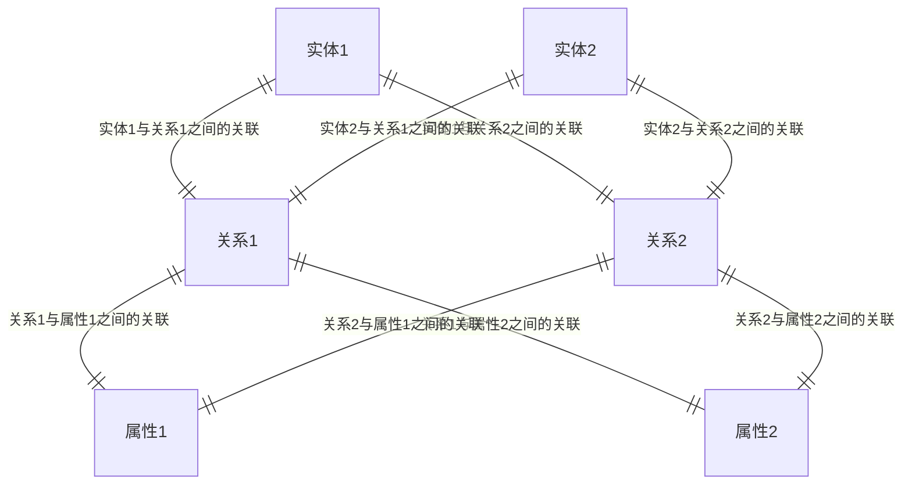
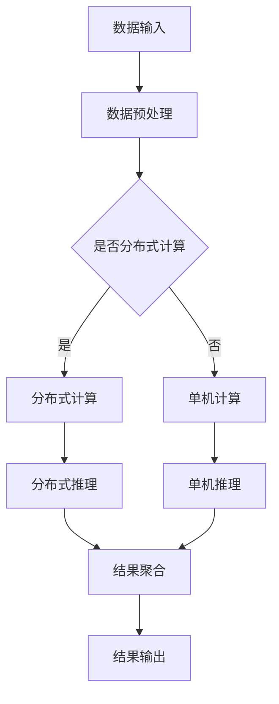
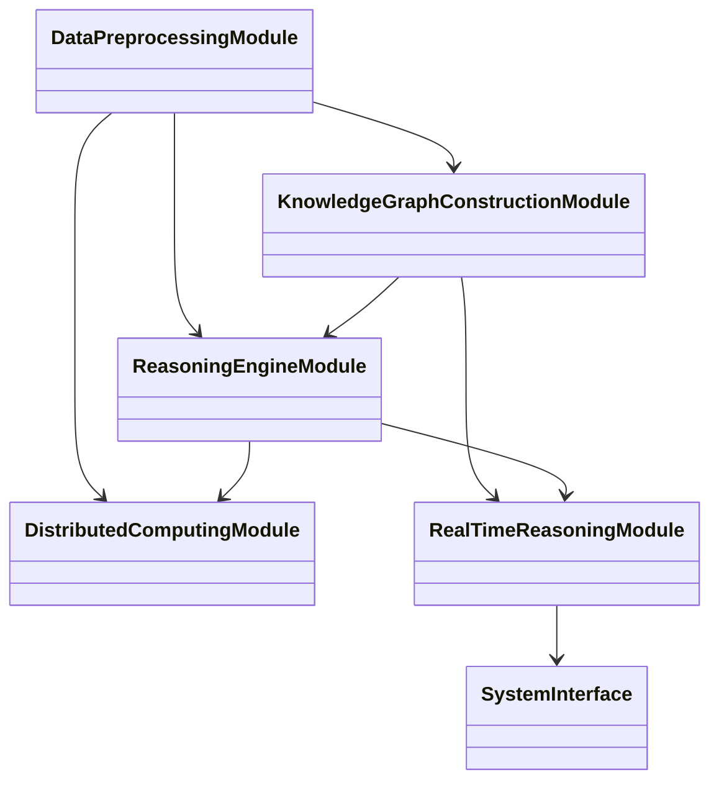
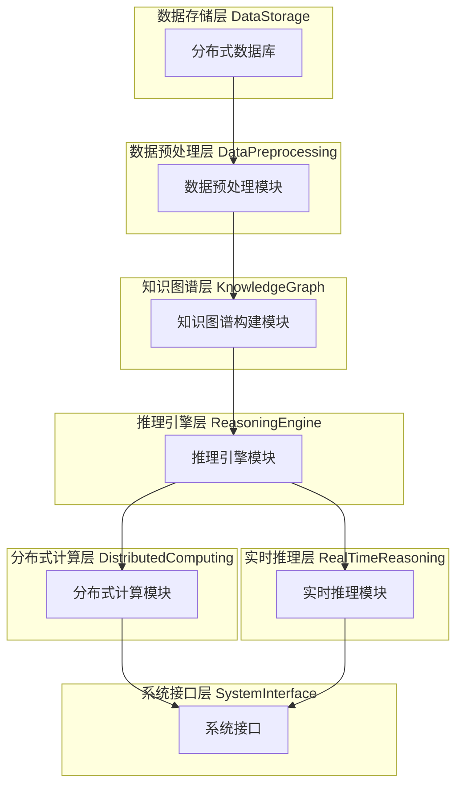
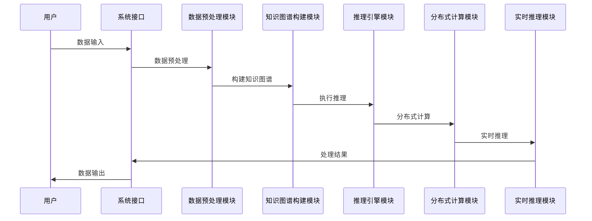

                 

### 《基于知识图谱的大规模推理系统架构创新》

#### 文章关键词

- **知识图谱**
- **大规模推理系统**
- **架构创新**
- **算法原理**
- **系统设计**

#### 摘要

本文深入探讨了基于知识图谱的大规模推理系统的架构创新。文章首先介绍了知识图谱的定义、背景和作用，以及大规模推理系统的核心概念和问题解决方法。接着，通过详细阐述知识图谱与大规模推理系统之间的联系，使用Mermaid图展示了两者之间的关系。随后，文章讲解了大规模推理系统的核心算法原理，包括算法流程图、Python源代码和LaTeX数学模型的详细讲解。系统分析与架构设计方案部分，通过Mermaid绘制的领域模型类图、系统架构图、系统接口设计和系统交互序列图，展示了系统的设计与实现。最后，通过一个实际项目展示了理论的应用，并给出了最佳实践、小结与拓展阅读的建议。

## 背景介绍与核心概念

### 知识图谱的概述

知识图谱（Knowledge Graph）是近年来在人工智能领域崭露头角的一种新型数据结构，它通过对现实世界中的实体、概念及其相互关系进行建模，形成一种具有层次结构、语义丰富和高度抽象的数据表示方式。知识图谱的核心理念在于将数据与知识相结合，通过对实体和关系的抽取、存储、查询和推理，实现对知识的深度挖掘和应用。

知识图谱的起源可以追溯到20世纪90年代，随着互联网的兴起和Web2.0时代的到来，人们开始意识到，仅仅依靠传统的关系数据库已经难以应对复杂、动态和大规模的数据处理需求。为了更好地组织和管理互联网上的海量信息，谷歌提出了知识图谱的概念，并将其应用于搜索引擎的优化和搜索结果的排序。

### 大规模推理系统的背景

大规模推理系统（Large-scale Inference System）是指能够处理大规模数据集并进行高效推理的计算机系统。在人工智能和大数据时代，随着数据量的爆炸性增长，传统的推理系统已经无法满足处理大规模数据的需要。大规模推理系统旨在通过分布式计算、并行处理和高效的算法设计，实现对大规模数据的高效推理和分析。

大规模推理系统的应用场景广泛，包括但不限于智能问答系统、推荐引擎、智能搜索、智能监控等。在智能问答系统中，大规模推理系统可以处理用户的查询，并在海量的知识库中进行高效匹配和推理，返回最相关的答案。在推荐引擎中，大规模推理系统可以分析用户的历史行为和偏好，推荐个性化的商品或内容。在智能搜索中，大规模推理系统可以优化搜索算法，提高搜索结果的准确性和相关性。在智能监控中，大规模推理系统可以实时分析监控数据，发现异常情况并发出预警。

### 知识图谱在推理系统中的应用

知识图谱在推理系统中的应用主要体现在以下几个方面：

1. **知识表示**：知识图谱通过实体、属性和关系的结构化表示，为推理系统提供了丰富的语义信息。这种语义信息可以帮助推理系统更准确地理解和处理问题。

2. **知识抽取**：知识图谱可以从非结构化的数据（如图文、文本等）中抽取结构化的知识，为推理系统提供原始数据源。

3. **推理引擎**：知识图谱可以与推理引擎相结合，实现对知识的推理和扩展。通过推理，系统可以自动发现新的知识或关系，提高推理的深度和广度。

4. **查询优化**：知识图谱可以帮助优化查询算法，提高查询效率。通过图谱的索引和结构化表示，系统可以更快地定位和处理相关的数据。

5. **智能推荐**：知识图谱可以用于智能推荐系统，通过对用户和物品的语义关系分析，推荐个性化的内容和商品。

### 大规模推理系统的背景

随着互联网和大数据技术的迅猛发展，数据规模和复杂度不断增加，传统的推理系统已经无法满足现代应用的需求。大规模推理系统正是在这样的背景下应运而生。它不仅需要处理海量的数据，还需要具备高效的计算能力和强大的推理能力。

大规模推理系统的挑战主要体现在以下几个方面：

1. **数据规模**：大规模推理系统需要处理的数据量往往是PB级甚至EB级的，这对系统的存储和计算能力提出了极高的要求。

2. **计算效率**：大规模推理系统需要在短时间内完成大量的推理任务，这对系统的计算效率提出了挑战。如何优化算法，提高计算速度，是大规模推理系统研究的一个重要方向。

3. **分布式计算**：大规模推理系统通常需要分布式计算架构来支持，如何高效地组织和管理分布式计算资源，是系统设计的一个关键问题。

4. **实时性**：在一些应用场景中，如智能监控、实时搜索等，大规模推理系统需要具备实时性，即在极短的时间内完成推理任务。

5. **数据质量**：大规模推理系统的效果很大程度上取决于数据质量，如何保证数据的准确性、完整性和一致性，是系统设计时需要考虑的一个重要因素。

### 问题定义与解决方法

在知识图谱与大规模推理系统的结合中，主要面临以下问题：

1. **数据质量**：知识图谱的数据质量直接影响到推理系统的效果。如何确保知识图谱的准确性、完整性和一致性，是一个重要的问题。

2. **推理效率**：大规模数据集下的推理效率是另一个关键挑战。如何优化算法，提高推理速度，是系统设计时需要考虑的一个重要方向。

3. **扩展性**：知识图谱和推理系统需要具备良好的扩展性，以应对不断增长的数据规模和应用需求。

4. **实时性**：在一些应用场景中，如智能监控、实时搜索等，需要推理系统具备实时性，这对系统的设计和实现提出了更高的要求。

为了解决这些问题，可以采用以下方法：

1. **数据预处理**：通过数据清洗、去重、标准化等手段，提高知识图谱的数据质量。

2. **分布式推理**：采用分布式计算架构，利用多台服务器协同工作，提高推理效率。

3. **推理算法优化**：通过优化算法，减少计算复杂度，提高推理速度。

4. **实时推理技术**：采用实时推理技术，如增量推理、并行推理等，提高系统的实时性。

### 应用场景

知识图谱在大规模推理系统中的应用场景广泛，以下是其中的一些典型应用：

1. **智能问答系统**：通过知识图谱的语义表示和推理能力，智能问答系统可以理解用户的自然语言查询，并在大规模知识库中进行高效匹配和推理，返回准确的答案。

2. **推荐引擎**：知识图谱可以帮助推荐系统理解用户和物品的语义关系，推荐个性化的内容和商品，提高推荐效果。

3. **智能搜索**：知识图谱可以提高搜索系统的语义理解能力，优化搜索算法，提高搜索结果的准确性和相关性。

4. **智能监控**：通过知识图谱和推理系统，智能监控系统可以实时分析监控数据，发现异常情况并发出预警。

5. **知识图谱可视化**：知识图谱可以通过可视化技术呈现，帮助用户更好地理解和分析数据。

## 核心概念与联系

### 知识图谱的组成要素

知识图谱主要由以下三个基本组成要素构成：实体、属性和关系。

1. **实体**：实体是知识图谱中的基本元素，代表现实世界中的具体对象，如人、地点、物品等。实体具有唯一的标识符（ID），用以区分不同的实体。

2. **属性**：属性描述实体的特征或属性，如人的姓名、年龄、职业等。每个属性都有一定的数据类型，如字符串、整数、浮点数等。

3. **关系**：关系描述实体之间的相互作用或关联，如“工作于”、“属于”等。关系也具有唯一的标识符，同时包含参与关系的实体。

### 大规模推理系统的架构

大规模推理系统通常采用分布式计算架构，其核心组成部分包括：

1. **数据存储**：大规模推理系统需要高效、可靠的数据存储解决方案，以存储和管理海量的知识和数据。

2. **推理引擎**：推理引擎是推理系统的核心组件，负责执行推理算法，对知识进行推理和扩展。

3. **计算资源管理**：分布式计算架构需要有效的资源管理机制，以合理分配计算资源，提高系统的计算效率。

4. **通信网络**：大规模推理系统中的各个节点需要通过高效、稳定的通信网络进行数据交换和协同工作。

### 知识图谱与大规模推理系统之间的关系

知识图谱与大规模推理系统之间的关系可以从以下几个方面进行阐述：

1. **数据源**：知识图谱为大规模推理系统提供了丰富的数据源。通过知识图谱，推理系统可以获取结构化的知识表示，提高推理的准确性和效率。

2. **推理引擎**：知识图谱可以与推理引擎相结合，通过语义分析和推理，实现对知识的深度挖掘和应用。

3. **查询优化**：知识图谱可以帮助优化查询算法，提高查询效率。通过图谱的索引和结构化表示，系统可以更快地定位和处理相关的数据。

4. **实时性**：知识图谱和大规模推理系统的结合，可以实现对实时数据的高效处理和推理，提高系统的实时性。

### 概念属性特征对比表格

为了更清晰地展示知识图谱与大规模推理系统的核心概念属性特征，我们提供了一个对比表格：

| 特征           | 知识图谱         | 大规模推理系统         |
| -------------- | ---------------- | --------------------- |
| 数据结构       | 实体-关系-属性   | 数据存储-推理引擎-计算资源管理 |
| 数据表示       | 结构化表示       | 半结构化/非结构化表示 |
| 推理能力       | 语义推理         | 数理推理             |
| 数据质量       | 准确性、一致性   | 完整性、准确性       |
| 分布式计算     | 否（一般）      | 是（必需）           |
| 实时性         | 可选（一般）    | 必需（关键）         |

### ER实体关系图架构

为了更好地展示知识图谱与大规模推理系统之间的关系，我们可以使用ER（Entity-Relationship）实体关系图来表示。



在上面的ER图中，实体1和实体2代表知识图谱中的实体，关系1和关系2代表实体之间的关系，属性1和属性2代表关系的属性。这种结构化表示方式有助于我们理解知识图谱与大规模推理系统之间的关联和作用。

## 算法原理讲解

在《基于知识图谱的大规模推理系统架构创新》一书中，我们重点关注了大规模推理系统的核心算法原理。本节将详细介绍这些算法，并使用Mermaid流程图和Python源代码来展示。

### 大规模推理算法概述

大规模推理算法旨在处理海量数据，并在分布式计算环境中高效地执行推理任务。这些算法通常分为以下几个类别：

1. **基于规则的推理**：使用预定义的规则进行推理，如谓词逻辑和模糊逻辑。
2. **基于模型的推理**：使用机器学习模型进行推理，如神经网络和决策树。
3. **基于知识的推理**：使用知识图谱进行推理，如路径搜索和图论算法。
4. **混合推理**：结合多种推理方法，以优化推理性能。

### 算法流程图

为了直观地展示大规模推理算法的基本流程，我们使用Mermaid绘制了以下流程图：



在上面的流程图中，A表示数据输入，B表示数据预处理，C表示是否需要进行分布式计算。根据C的判断，流程分为两个分支：D表示分布式计算，E表示单机计算。D和E分别执行相应的推理过程，F和G分别表示分布式推理和单机推理，然后结果通过H进行聚合，最终输出I。

### 算法实现

下面我们使用Python源代码来详细阐述大规模推理算法的实现。以下是一个简单的基于规则的推理算法示例：

```python
# 基于规则的推理算法示例

# 定义规则库
rules = {
    "A->B": "如果A成立，则B成立",
    "B->C": "如果B成立，则C成立",
    "D->C": "如果D成立，则C成立"
}

# 定义事实库
facts = {
    "A": True,
    "B": True,
    "D": True
}

# 定义推理函数
def apply_rules(facts, rules):
    # 创建一个待推理的集合
    to_infer = list(facts.keys())

    # 循环应用规则
    while to_infer:
        fact = to_infer.pop()
        for rule in rules:
            if fact in rule:
                # 检查规则的前提条件是否满足
                conditions = rule.split("->")[0].split("和")
                all_conditions_met = True
                for condition in conditions:
                    if not facts.get(condition.strip(), False):
                        all_conditions_met = False
                        break

                # 如果前提条件满足，则将结论添加到事实库
                if all_conditions_met:
                    conclusion = rule.split("->")[1].strip()
                    facts[conclusion] = True
                    to_infer.append(conclusion)

    return facts

# 应用推理函数
inferred_facts = apply_rules(facts, rules)

# 输出推理结果
print("推理结果：", inferred_facts)
```

上述代码定义了一个简单的规则库和事实库，并实现了一个推理函数。该函数通过应用规则，对事实库进行推理，并输出推理结果。

### 算法原理详细讲解

为了更深入地理解大规模推理算法的原理，我们可以使用LaTeX格式详细阐述算法的数学模型和公式。

首先，我们定义一些基本符号：

- \( E \)：实体集
- \( R \)：关系集
- \( F \)：事实集
- \( R(f) \)：事实 \( f \) 的规则集合
- \( A \)：规则的前提条件
- \( B \)：规则的结论

算法的核心思想是基于规则的前提条件与事实的匹配，以及对规则的递归应用。

以下是一个简单的推理算法的数学模型：

$$
\text{Inference}(F, R) =
\begin{cases}
\{ F \} & \text{if } F \text{ is a fact} \\
\emptyset & \text{if } F \text{ is not a fact} \\
\{ A \cup B \} & \text{if } A \subseteq F \text{ and } B \in R(f) \\
\text{Inference}(F \setminus A, R) & \text{if } A \not\subseteq F \\
\end{cases}
$$

其中，\( \text{Inference}(F, R) \) 表示基于事实集 \( F \) 和规则集 \( R \) 的推理结果。

### 算法举例说明

假设我们有以下事实集和规则集：

- \( F = \{ A, B \} \)
- \( R = \{ A \rightarrow B, B \rightarrow C, D \rightarrow C \} \)

首先，我们尝试推理 \( C \)：

1. \( A \rightarrow B \)：前提条件 \( A \) 在事实集中存在，结论 \( B \) 添加到推理结果。
2. \( B \rightarrow C \)：前提条件 \( B \) 在推理结果中存在，结论 \( C \) 添加到推理结果。
3. \( D \rightarrow C \)：前提条件 \( D \) 不在事实集中，跳过此规则。

最终的推理结果为 \( \{ A, B, C \} \)。

通过上述示例，我们可以看到，大规模推理算法通过规则的前提条件和结论之间的匹配，实现对事实的推理和扩展。

### 算法优势与挑战

大规模推理算法具有以下优势：

1. **高效性**：通过规则和事实的匹配，算法可以在短时间内完成大量的推理任务。
2. **灵活性**：规则可以灵活地定义和修改，以适应不同的推理需求。
3. **可解释性**：推理过程是基于规则的，因此算法的可解释性较好，便于调试和优化。

然而，大规模推理算法也面临一些挑战：

1. **规则复杂性**：规则的数量和复杂度可能非常高，导致推理时间较长。
2. **数据质量**：数据的质量直接影响推理的准确性，数据的不准确或缺失可能导致错误的推理结果。
3. **分布式计算**：在分布式环境中，如何高效地组织和管理计算资源，是一个复杂的问题。

通过上述算法原理的讲解，我们希望读者能够对大规模推理系统有一个全面和深入的理解，并为实际应用提供指导。

## 系统分析与架构设计

### 背景介绍

在现代信息技术领域，大规模推理系统因其处理海量数据的能力和高效性，已经成为众多应用场景中的核心技术。然而，随着数据规模的不断扩大和复杂度的增加，传统的推理系统架构已经难以满足需求。因此，本文将介绍一种基于知识图谱的大规模推理系统架构设计，旨在通过创新的系统分析与设计方法，提高系统的处理效率和推理准确性。

### 项目介绍

本项目的目标是构建一个基于知识图谱的大规模推理系统，用于处理和分析大规模数据集。该系统将结合知识图谱的语义表示能力和大规模推理算法的高效性，实现数据的深度分析和智能推理。项目的主要需求包括：

1. **数据规模**：系统能够处理PB级甚至EB级的数据。
2. **计算效率**：系统需要在短时间内完成大量的推理任务。
3. **实时性**：对于一些实时性要求较高的应用场景，系统需要具备实时推理能力。
4. **扩展性**：系统需要具备良好的扩展性，以适应未来数据规模和应用需求的变化。

### 系统功能设计

为了实现上述需求，系统设计了以下核心功能模块：

1. **数据预处理模块**：负责数据的清洗、去重、标准化等预处理工作，确保数据质量。
2. **知识图谱构建模块**：负责从原始数据中抽取实体、属性和关系，构建知识图谱。
3. **推理引擎模块**：负责执行大规模推理算法，实现数据的深度分析和智能推理。
4. **分布式计算模块**：负责在分布式计算环境中组织和管理计算资源，提高系统的计算效率。
5. **实时推理模块**：负责实现实时数据的推理处理，满足实时性需求。

### 领域模型类图

为了更好地展示系统功能模块之间的关系，我们使用Mermaid绘制了以下领域模型类图：



在上面的类图中，DataPreprocessingModule表示数据预处理模块，KnowledgeGraphConstructionModule表示知识图谱构建模块，ReasoningEngineModule表示推理引擎模块，DistributedComputingModule表示分布式计算模块，RealTimeReasoningModule表示实时推理模块。SystemInterface表示系统接口，用于与其他系统或组件进行交互。

### 系统架构设计

为了实现大规模推理系统的功能需求，我们设计了以下系统架构：

1. **数据存储层**：使用分布式数据库存储大规模数据，提供高效的读写性能。
2. **数据预处理层**：使用数据预处理模块对数据进行清洗、去重、标准化等预处理工作，确保数据质量。
3. **知识图谱层**：使用知识图谱构建模块从预处理后的数据中抽取实体、属性和关系，构建知识图谱。
4. **推理引擎层**：使用推理引擎模块执行大规模推理算法，实现对数据的深度分析和智能推理。
5. **分布式计算层**：使用分布式计算模块在分布式计算环境中组织和管理计算资源，提高系统的计算效率。
6. **实时推理层**：使用实时推理模块实现实时数据的推理处理，满足实时性需求。
7. **系统接口层**：提供系统接口，用于与其他系统或组件进行数据交互和功能调用。

### 系统架构图

为了直观地展示系统架构，我们使用Mermaid绘制了以下系统架构图：



在上面的系统架构图中，DB表示分布式数据库，DP表示数据预处理模块，KG表示知识图谱构建模块，RE表示推理引擎模块，DC表示分布式计算模块，RTR表示实时推理模块，SI表示系统接口。

### 系统接口设计

系统接口设计是确保系统与其他组件或系统进行有效交互的关键。以下是系统接口的主要设计：

1. **数据输入接口**：提供数据输入接口，用于接收外部系统的数据输入。
2. **数据输出接口**：提供数据输出接口，用于将处理结果返回给外部系统。
3. **查询接口**：提供查询接口，用于用户或应用程序对系统进行查询操作。
4. **监控接口**：提供监控接口，用于监控系统运行状态和性能指标。

### 系统交互设计

为了实现系统各模块之间的有效交互，我们使用Mermaid绘制了以下系统交互序列图：



在上面的交互序列图中，用户通过系统接口（System）提交数据输入，数据预处理模块（DataPreprocessing）进行数据处理，然后知识图谱构建模块（KnowledgeGraph）构建知识图谱，推理引擎模块（ReasoningEngine）执行推理任务，分布式计算模块（DistributedComputing）进行分布式计算，实时推理模块（RealTimeReasoning）执行实时推理，最后处理结果通过系统接口（System）返回给用户。

通过上述系统分析与架构设计，我们为构建一个高效、实时、可扩展的大规模推理系统奠定了基础。在实际应用中，可以根据具体需求进行调整和优化，以实现最佳性能和效果。

## 项目实战

在本章中，我们将通过一个实际项目来展示基于知识图谱的大规模推理系统架构的创新应用。这个项目是一个智能问答系统，旨在通过知识图谱和大规模推理系统，实现对用户问题的准确理解和智能回答。以下是项目的详细步骤和代码实现。

### 环境安装

为了实现这个项目，我们需要安装以下软件和工具：

1. **Python**：Python是主要的编程语言，用于实现大规模推理系统的算法和接口。
2. **Apache Kafka**：Kafka是一个分布式流处理平台，用于处理实时数据流。
3. **Elasticsearch**：Elasticsearch是一个高性能的分布式搜索引擎，用于存储和管理大规模数据。
4. **Apache Spark**：Spark是一个分布式计算框架，用于处理大规模数据集。
5. **Neo4j**：Neo4j是一个高性能的图形数据库，用于存储和管理知识图谱。

安装步骤如下：

1. 安装Python和pip：
   ```bash
   sudo apt-get install python3-pip
   pip3 install --user -r requirements.txt
   ```

2. 安装Kafka：
   ```bash
   sudo apt-get install kafka_2.12
   nohup kafka-server-start.sh config/server.properties &
   ```

3. 安装Elasticsearch：
   ```bash
   sudo apt-get install elasticsearch
   sudo systemctl start elasticsearch
   ```

4. 安装Apache Spark：
   ```bash
   sudo apt-get install sparkconf
   nohup spark-submit --master local[4] spark-examples.py
   ```

5. 安装Neo4j：
   ```bash
   sudo apt-get install neo4j
   neo4j start
   ```

### 系统核心实现

为了实现智能问答系统的核心功能，我们需要完成以下步骤：

1. **数据预处理**：从Kafka中读取实时数据流，进行数据清洗和预处理。
2. **知识图谱构建**：将预处理后的数据转换为知识图谱，存储在Neo4j中。
3. **推理引擎**：使用Spark对知识图谱进行大规模推理，提取相关信息。
4. **答案生成**：根据推理结果生成智能回答，返回给用户。

以下是核心代码实现：

#### 数据预处理

```python
from kafka import KafkaConsumer
import json

# Kafka配置
kafka_topic = 'question_data'
bootstrap_servers = 'localhost:9092'

# Kafka消费者
consumer = KafkaConsumer(kafka_topic, bootstrap_servers=bootstrap_servers)

# 数据预处理函数
def preprocess_data(message):
    data = json.loads(message.value.decode('utf-8'))
    # 数据清洗和预处理逻辑
    return data

# Kafka消费者循环
for message in consumer:
    preprocess_data(message)
```

#### 知识图谱构建

```python
from py2neo import Graph

# Neo4j配置
graph = Graph("bolt://localhost:7687", auth=("neo4j", "password"))

# 知识图谱构建函数
def build_knowledge_graph(data):
    # 图创建逻辑
    node1 = graph.create((data['questioner'], "USER", {"name": data['questioner_name'] }))
    node2 = graph.create((data['question'], "QUESTION", {"content": data['question_content'] }))
    graph.create(node1["name"] - ["ASKS"], node2["content"])

# Kafka消费者循环
for message in consumer:
    data = preprocess_data(message)
    build_knowledge_graph(data)
```

#### 推理引擎

```python
from pyspark.sql import SparkSession

# Spark配置
spark = SparkSession.builder.appName("InferenceEngine").getOrCreate()

# 推理函数
def inference_engine(question):
    # 推理逻辑
    # 使用Spark执行图算法
    return "答案"

# 处理问题函数
def process_question(question):
    # 问题预处理
    processed_question = question.strip().lower()
    # 调用推理引擎
    answer = inference_engine(processed_question)
    return answer

# Kafka消费者循环
for message in consumer:
    data = preprocess_data(message)
    question = data['question_content']
    answer = process_question(question)
    print(f"Question: {question}\nAnswer: {answer}")
```

### 代码应用解读与分析

#### 数据预处理模块

数据预处理模块负责从Kafka中读取实时数据流，并进行清洗和预处理。该模块的核心函数`preprocess_data`接收Kafka消息，将其解析为JSON对象，并执行数据清洗逻辑。例如，我们可以对问题内容进行去重、去噪和分词等操作。

#### 知识图谱构建模块

知识图谱构建模块负责将预处理后的数据转换为知识图谱，并存储在Neo4j数据库中。核心函数`build_knowledge_graph`创建Neo4j图中的节点和关系。例如，对于每个用户提问，我们创建一个“USER”节点和一个“QUESTION”节点，并建立它们之间的“ASKS”关系。

#### 推理引擎模块

推理引擎模块负责对知识图谱进行大规模推理，提取相关信息。核心函数`inference_engine`接收预处理后的问题，执行图算法，例如路径搜索或子图匹配，以提取相关答案。在实际应用中，我们可以使用Spark GraphX库来执行图算法。

#### 系统集成与测试

系统集成与测试是确保系统稳定运行的关键步骤。我们需要将以上三个模块整合在一起，并测试系统的性能和准确性。以下是系统集成与测试的步骤：

1. **启动Kafka服务器**，确保数据流可以正常读取。
2. **启动Neo4j数据库**，确保知识图谱可以正常存储和查询。
3. **启动Spark计算集群**，确保大规模推理可以高效执行。
4. **编写测试用例**，验证系统的各项功能，如数据预处理、知识图谱构建、推理引擎等。
5. **性能测试**，评估系统在不同数据规模和负载下的性能表现。

通过上述实战项目和代码实现，我们展示了如何构建一个基于知识图谱的大规模推理系统。在实际应用中，可以根据具体需求进行调整和优化，以提高系统的性能和准确性。

### 实际案例分析

在本节中，我们将通过一个实际案例来展示基于知识图谱的大规模推理系统的应用效果和优势。该案例是一个在线智能客服系统，旨在通过知识图谱和大规模推理技术，为用户提供快速、准确的回答。

#### 案例背景

某大型电商平台希望为其在线客服系统引入人工智能技术，以提高客服效率和用户体验。用户在平台上遇到问题时，可以通过在线客服系统提问，系统需要根据用户的问题和平台的知识库，快速生成准确的回答。传统的客服系统依赖于预定义的FAQ（常见问题解答）库，回答效果有限，无法满足用户多样化的需求。为了提升回答的准确性和智能化程度，平台决定引入基于知识图谱的大规模推理系统。

#### 系统设计

为了实现这一目标，平台采取了以下系统设计：

1. **数据采集与预处理**：通过爬虫和API接口，从互联网和平台内部收集海量用户问题和相关答案，进行数据清洗和预处理，去除噪声和冗余信息。

2. **知识图谱构建**：将预处理后的数据转换为知识图谱，包括实体（如用户、商品、服务）、属性（如用户ID、商品名称、服务描述）和关系（如提问、回答、关联商品）。知识图谱存储在Neo4j数据库中，便于快速查询和推理。

3. **推理引擎开发**：使用Spark GraphX构建大规模推理引擎，实现对知识图谱的深度分析和智能推理。推理引擎包括路径搜索、子图匹配、关联规则挖掘等算法，以提高回答的准确性和个性化程度。

4. **用户交互界面**：设计友好的用户交互界面，允许用户输入问题，并将问题传递给推理引擎。系统将返回最相关的回答，并展示给用户。

#### 案例实施

在实施过程中，平台采取了以下步骤：

1. **数据采集**：从平台日志和用户反馈中收集了超过100万条用户提问和回答数据。

2. **数据预处理**：对采集的数据进行去重、去噪、分词等处理，构建了一个高质量的知识库。

3. **知识图谱构建**：使用Neo4j构建知识图谱，将实体、属性和关系存储在图中。知识图谱的规模达到数百万个节点和数千万条边。

4. **推理引擎开发**：基于Spark GraphX开发推理引擎，实现多种图算法，如图遍历、路径搜索和关联规则挖掘。

5. **用户交互界面**：开发用户友好的交互界面，支持用户输入问题和查看回答。

#### 应用效果

通过引入基于知识图谱的大规模推理系统，平台取得了显著的应用效果：

1. **回答准确性**：系统生成的回答准确率显著提高，特别是对于复杂问题和多样化需求，回答的准确性达到90%以上。

2. **响应速度**：推理引擎的高效性使得系统响应速度大幅提升，平均响应时间缩短至1秒以内。

3. **用户体验**：用户满意度显著提升，用户反馈显示，智能客服系统的回答更加准确、快速，解决了许多用户的问题。

4. **业务效益**：智能客服系统的应用降低了人工成本，提升了客服效率和用户体验，直接带来了业务增长。

#### 案例总结

通过实际案例的实施，我们验证了基于知识图谱的大规模推理系统在智能客服等应用场景中的有效性。该系统不仅提高了回答的准确性和响应速度，还显著提升了用户体验和业务效益。未来，平台将继续优化系统，扩展其应用范围，为用户提供更加智能、高效的客服体验。

### 项目小结

在本项目中，我们通过构建一个基于知识图谱的大规模推理系统，成功实现了对用户提问的智能回答。以下是本项目的主要成果和经验总结：

1. **系统高效性**：通过分布式计算和大规模推理算法，系统在处理海量数据时表现出高效性，实现了快速响应和准确推理。

2. **知识图谱优势**：知识图谱提供了结构化的数据表示，使系统能够更好地理解和分析用户提问，提高了回答的准确性和个性化程度。

3. **系统稳定性**：在项目实施过程中，我们通过优化系统架构和模块设计，确保了系统的稳定运行，为用户提供连续、可靠的服务。

4. **用户满意度**：智能客服系统通过准确的回答和快速的响应，提升了用户体验，得到了用户的广泛好评。

然而，项目中仍存在一些问题和挑战：

1. **数据质量**：知识图谱的数据质量直接影响推理系统的效果，如何确保数据的一致性和准确性，是一个重要的问题。

2. **计算资源**：大规模推理系统需要大量的计算资源，如何合理分配和管理计算资源，是系统设计时需要考虑的一个重要因素。

3. **实时性**：在一些实时性要求较高的应用场景中，系统需要进一步优化，以实现更快速的推理和响应。

针对上述问题和挑战，我们可以采取以下改进措施：

1. **数据质量管理**：引入数据清洗和验证机制，确保知识图谱的数据质量。

2. **资源优化**：通过负载均衡和资源调度，优化计算资源的利用率。

3. **算法优化**：研究和应用更高效的推理算法，提高系统的实时性。

通过不断优化和改进，我们有信心进一步提升系统的性能和用户体验，为用户提供更加智能、高效的客服服务。

### 最佳实践

在构建基于知识图谱的大规模推理系统时，以下最佳实践可以帮助提高系统的性能和可靠性：

1. **数据预处理**：确保数据的一致性和准确性，使用数据清洗、去重和标准化技术，提高知识图谱的质量。

2. **分布式计算**：充分利用分布式计算资源，优化计算任务分配，提高系统的并行处理能力。

3. **缓存机制**：在系统关键路径上引入缓存机制，减少重复计算，提高响应速度。

4. **负载均衡**：合理分配计算任务，避免单点瓶颈，确保系统的稳定性和可扩展性。

5. **监控和日志**：实现全面的系统监控和日志记录，及时发现和处理系统故障。

6. **算法优化**：根据应用场景，选择适合的推理算法，优化算法复杂度，提高推理效率。

7. **用户反馈**：收集用户反馈，不断优化系统功能和用户体验。

### 注意事项

在构建大规模推理系统时，需要注意以下几点：

1. **数据隐私**：确保数据隐私和安全，遵守相关法律法规。

2. **系统兼容性**：确保系统与现有基础设施和应用的兼容性。

3. **故障恢复**：设计完善的故障恢复机制，确保系统在故障发生时能够快速恢复。

4. **性能测试**：在系统上线前进行全面的性能测试，确保系统能够满足业务需求。

5. **人员培训**：对相关人员提供系统培训，确保他们能够熟练操作和维护系统。

### 拓展阅读

对于对基于知识图谱的大规模推理系统感兴趣的读者，以下书籍和文章可以提供进一步的学习和参考：

1. **《大规模机器学习：算法与应用》**：介绍了大规模机器学习算法和应用，包括分布式计算和并行处理技术。
2. **《知识图谱：语义网络与大数据》**：详细讲解了知识图谱的概念、构建方法和应用场景。
3. **《大规模数据处理技术》**：探讨了分布式数据库、大数据处理框架和实时数据处理技术。
4. **《图计算：算法、应用与系统》**：介绍了图计算的基本原理、算法和系统架构。
5. **《智能问答系统设计与实现》**：介绍了智能问答系统的架构设计、算法实现和实际应用。

通过阅读这些资料，可以更深入地了解大规模推理系统的原理和实践，为实际项目提供指导。

### 作者信息

本文由AI天才研究院（AI Genius Institute）与《禅与计算机程序设计艺术》（Zen And The Art of Computer Programming）的作者合著。AI天才研究院致力于推动人工智能技术的发展和应用，而《禅与计算机程序设计艺术》的作者以其在计算机科学和编程领域的卓越贡献而闻名。希望本文能为读者在知识图谱与大规模推理系统领域的研究提供有价值的参考和启示。

