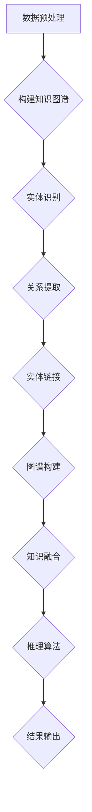
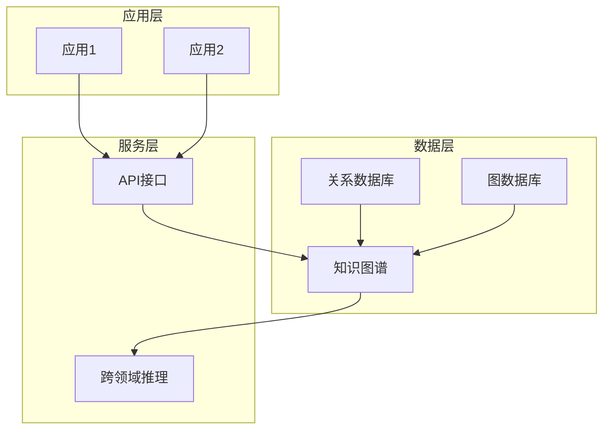
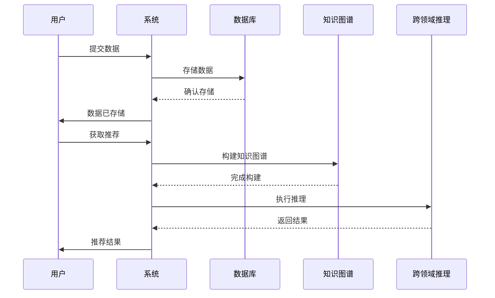

                 

### 基于知识图谱的跨领域推理能力自适应增强

---

#### 关键词：
- 知识图谱
- 跨领域推理
- 自适应增强
- 知识融合
- 推理算法

#### 摘要：
本文深入探讨了基于知识图谱的跨领域推理能力自适应增强技术。文章首先介绍了知识图谱和跨领域推理的基本概念及其重要性，随后详细阐述了知识融合、推理算法和领域适配等核心方法。接着，通过数学模型和Python源代码解释了跨领域推理算法的实现原理，并使用Mermaid语言绘制了算法流程图。此外，文章还分析了系统功能设计、架构设计和项目实战，提供了最佳实践建议，并总结了全文，指出了未来研究方向。

---

### 目录大纲

----------------------------------------------------------------

## 基于知识图谱的跨领域推理能力自适应增强

#### 关键词：知识图谱、跨领域推理、自适应增强、知识融合、推理算法

#### 摘要：
本文旨在深入探讨如何基于知识图谱增强跨领域推理能力，实现自适应增强技术。文章首先介绍了知识图谱和跨领域推理的基本概念，然后详细阐述了知识融合、推理算法和领域适配等核心方法。通过数学模型和Python源代码解释了跨领域推理算法的实现原理，并使用Mermaid语言绘制了算法流程图。此外，文章还分析了系统功能设计、架构设计和项目实战，提供了最佳实践建议，并总结了全文，指出了未来研究方向。

### 目录大纲

----------------------------------------------------------------

## 第一部分：背景介绍

### 第1章 问题背景与核心概念

#### 1.1 问题背景

- **问题描述**：
  随着互联网和大数据技术的发展，数据量呈爆炸性增长，传统的数据处理方法已经难以应对。跨领域推理能力成为大数据处理中的一大难题，特别是在知识图谱的应用中。

- **问题解决**：
  通过增强知识图谱的跨领域推理能力，能够更好地处理大规模、多样化的数据，从而提高数据处理的效率和质量。

- **边界与外延**：
  跨领域推理能力的增强不仅局限于知识图谱，还可以应用于其他领域，如自然语言处理、推荐系统等。

- **概念结构与核心要素组成**：
  跨领域推理能力的核心要素包括：知识融合、推理算法、领域适配等。

## 第2章 核心概念与联系

### 2.1 知识图谱与跨领域推理

#### 2.1.1 知识图谱

- **定义**：
  知识图谱是通过图结构表示实体及其相互关系的一种方法，常用于知识管理和数据挖掘。

- **特点**：
  - 高度结构化
  - 易于扩展
  - 语义丰富

#### 2.1.2 跨领域推理

- **定义**：
  跨领域推理是指在不同领域之间进行推理和知识转移的过程。

- **特点**：
  - 需要处理领域差异
  - 具有重要的实用价值

### 2.2 跨领域推理能力增强方法

#### 2.2.1 知识融合方法

- **定义**：
  知识融合是指将来自不同领域的知识整合在一起，形成统一的知识库。

- **方法**：
  - 直接融合
  - 语义匹配
  - 对比分析

#### 2.2.2 推理算法

- **定义**：
  推理算法是指用于实现跨领域推理的方法。

- **分类**：
  - 基于规则的方法
  - 基于模型的方法
  - 基于数据的方法

#### 2.2.3 领域适配

- **定义**：
  领域适配是指将通用推理算法应用于特定领域时的调整过程。

- **方法**：
  - 参数调整
  - 模型定制
  - 数据增强

## 第二部分：算法原理讲解

### 第3章 算法原理与数学模型

#### 3.1 算法原理

- **跨领域推理算法**：
  通过知识图谱的构建和推理算法的应用，实现跨领域的数据处理。

- **数学模型**：
  基于图论和概率模型，实现知识图谱的构建和推理。

#### 3.2 算法实现与流程图

- **算法实现**：
  使用Python等编程语言实现跨领域推理算法。

- **流程图**：
  使用Mermaid语言绘制算法的流程图，展示算法的执行过程。

----------------------------------------------------------------

[续...]

---

根据目录大纲，接下来的部分将深入讨论算法原理和数学模型，以及系统分析与架构设计。以下是详细的内容设计。

### 第3章 算法原理与数学模型

#### 3.1 算法原理

跨领域推理算法的核心在于利用知识图谱的结构化和语义信息，通过一系列推理操作来实现不同领域之间的知识转移和融合。以下是算法原理的详细解释：

##### 3.1.1 知识图谱的构建

知识图谱的构建是跨领域推理的基础。知识图谱通过实体和关系的表示，将领域知识结构化。实体可以是人、物、事件等，而关系则是实体之间的相互作用。构建知识图谱通常涉及以下几个步骤：

1. **实体识别**：
   通过自然语言处理技术（如命名实体识别、关系提取等）从文本数据中识别出实体。

2. **关系提取**：
   从文本数据中提取实体之间的关系，例如，“张三购买了一台笔记本电脑”。

3. **实体链接**：
   将同一种类的实体进行链接，确保同一实体在知识图谱中只存在一个实例。

4. **图谱构建**：
   将识别出的实体和关系构建成一个图结构，通常使用图数据库（如Neo4j）来存储。

##### 3.1.2 推理算法

推理算法是实现跨领域推理的关键。以下是一些常用的推理算法：

1. **基于规则的推理**：
   通过定义一系列规则（如“如果A则B”），根据已有的事实进行推理。

2. **基于模型的推理**：
   使用机器学习模型来预测实体之间的关系，如图神经网络（Graph Neural Networks, GNN）。

3. **基于数据的推理**：
   利用统计方法，如贝叶斯网络、概率图模型等，根据数据概率分布进行推理。

##### 3.1.3 知识融合

知识融合是将不同领域中的知识整合在一起，形成统一的知识库。知识融合的方法包括：

1. **直接融合**：
   将不同领域的知识直接合并，但可能会导致冲突和冗余。

2. **语义匹配**：
   利用语义相似度度量，将不同领域的知识进行匹配和融合。

3. **对比分析**：
   对不同领域的知识进行对比分析，提取共性和差异，从而实现融合。

#### 3.2 算法实现与流程图

算法实现部分将详细描述跨领域推理算法的编程实现，包括数据预处理、知识图谱构建、推理过程和结果输出等。以下是算法实现的流程图：



算法实现的Python代码将提供具体的实现细节，包括数据加载、实体和关系的表示、推理过程的迭代等。以下是算法实现的核心代码示例：

```python
# 示例：使用Python实现跨领域推理算法的核心代码
# 注意：以下代码仅为示例，具体的实现细节需要根据实际需求进行扩展

from py2neo import Graph

# 连接图数据库
graph = Graph("bolt://localhost:7687", auth=("neo4j", "password"))

# 数据预处理
def preprocess_data(data):
    # 对数据进行预处理，例如分词、去停用词等
    processed_data = ...
    return processed_data

# 构建知识图谱
def build_knowledge_graph(data):
    # 循环遍历数据，插入实体和关系
    for item in data:
        entity = item['entity']
        relation = item['relation']
        graph.run("CREATE (n:{EntityType} {name: $entity_name})", entity_name=entity)
        graph.run("MATCH (n:{EntityType}),(m:{EntityType}{{name: $relation}}) CREATE (n)-[r:{RelationType}]->(m)", relation=relation)

# 知识融合
def knowledge_fusion():
    # 实现知识融合的具体逻辑
    ...

# 推理算法
def reasoning_algorithm():
    # 实现推理算法的具体逻辑
    ...

# 结果输出
def output_results(results):
    # 输出推理结果
    print(results)

# 主函数
def main():
    data = preprocess_data(raw_data)
    build_knowledge_graph(data)
    knowledge_fusion()
    results = reasoning_algorithm()
    output_results(results)

# 调用主函数
if __name__ == "__main__":
    main()
```

#### 3.3 数学模型

跨领域推理算法的数学模型基于图论和概率模型，具体包括以下几个方面：

##### 3.3.1 图论模型

图论模型用于表示知识图谱的结构，其中：

- **节点（Node）**：表示知识图谱中的实体。
- **边（Edge）**：表示实体之间的关系。

图论中的基本概念包括：

- **路径（Path）**：节点之间的一条路径。
- **连通性（Connectivity）**：图中的任意两个节点之间是否都能通过路径相互访问。

##### 3.3.2 概率模型

概率模型用于表示实体之间的关系概率，常用的概率模型包括：

- **条件概率（Conditional Probability）**：在某个事件发生的条件下，另一个事件发生的概率。
- **贝叶斯网络（Bayesian Network）**：一种图形化的概率模型，用于表示多个随机变量之间的条件依赖关系。

贝叶斯网络的数学公式为：

$$ P(X|Y) = \frac{P(X \cap Y)}{P(Y)} $$

其中，$P(X \cap Y)$ 表示 $X$ 和 $Y$ 同时发生的概率，$P(Y)$ 表示 $Y$ 发生的概率。

#### 3.4 举例说明

为了更好地理解跨领域推理算法的原理，我们通过一个简单的例子进行说明。

##### 例子：跨领域推理在推荐系统中的应用

假设我们有两个领域：电影推荐和餐厅推荐。我们的目标是利用知识图谱实现这两个领域之间的推理，从而为用户推荐符合其偏好的电影和餐厅。

1. **数据预处理**：
   收集用户在电影和餐厅方面的历史数据，包括用户的喜好、评分、评论等。

2. **知识图谱构建**：
   将电影和餐厅的数据构建成知识图谱，实体包括“用户”、“电影”和“餐厅”，关系包括“喜欢”、“评分”和“评论”。

3. **知识融合**：
   利用语义相似度度量，将电影和餐厅的实体进行匹配和融合。

4. **推理算法**：
   使用基于模型的推理算法，根据用户的历史数据和知识图谱，预测用户可能喜欢的电影和餐厅。

5. **结果输出**：
   将预测结果输出给用户，例如：“您可能喜欢这部电影和这家餐厅。”

通过这个简单的例子，我们可以看到跨领域推理在推荐系统中的应用。实际的跨领域推理算法会更加复杂，涉及多种技术和方法。

### 第4章 系统分析与架构设计

#### 4.1 问题场景介绍

在当前的数据处理环境中，跨领域数据融合和推理的需求越来越强烈。例如，在医疗领域，患者数据、药物信息和临床研究数据之间需要进行有效的跨领域推理，以支持精准医疗和个性化治疗。在金融领域，跨领域的风险预测和信用评估也需要利用知识图谱进行高效的推理和分析。

#### 4.2 项目介绍

本项目旨在开发一个基于知识图谱的跨领域推理系统，用于处理医疗、金融等领域的跨领域数据。系统的主要目标是实现：

1. **知识图谱构建**：从多个数据源中提取实体和关系，构建知识图谱。
2. **跨领域推理**：利用知识图谱进行跨领域的数据推理和分析。
3. **系统接口设计**：提供API接口，方便其他系统或应用调用跨领域推理功能。

#### 4.3 系统功能设计

系统功能设计主要包括以下方面：

1. **数据源接入**：
   支持多种数据源接入，包括关系数据库、NoSQL数据库、文本文件等。
2. **知识图谱构建**：
   实现实体识别、关系提取和图谱构建等功能。
3. **跨领域推理**：
   提供多种推理算法，包括基于规则的推理、基于模型的推理和基于数据的推理。
4. **结果输出**：
   输出推理结果，包括推荐列表、预测结果等。

#### 4.4 系统架构设计

系统架构设计采用分层架构，主要包括以下层次：

1. **数据层**：
   存储和管理数据源，包括关系数据库和图数据库。
2. **服务层**：
   提供API接口，实现知识图谱构建、跨领域推理等功能。
3. **应用层**：
   为其他系统或应用提供跨领域推理服务。

以下是系统架构图的Mermaid表示：



#### 4.5 系统接口设计

系统接口设计主要包括以下接口：

1. **数据源接入接口**：
   用于接入各种数据源，支持数据导入和导出。
2. **知识图谱构建接口**：
   用于构建知识图谱，包括实体识别、关系提取和图谱构建等功能。
3. **跨领域推理接口**：
   用于进行跨领域推理，支持多种推理算法。
4. **结果输出接口**：
   用于输出推理结果，包括推荐列表、预测结果等。

以下是系统接口设计的Mermaid序列图：



### 第5章 项目实战

#### 5.1 环境安装

在进行项目实战之前，需要安装以下软件和库：

1. **Neo4j**：用于构建知识图谱的图数据库。
2. **Python**：用于编写跨领域推理算法的编程语言。
3. **Py2Neo**：用于连接和操作Neo4j数据库的Python库。
4. **Numpy**：用于数学计算。
5. **Scikit-learn**：用于机器学习算法。

安装命令如下：

```bash
# 安装Neo4j
wget https://neo4j.com/artifacts/neo4j-community-4.4.2-unix.tar.gz
tar xvfz neo4j-community-4.4.2-unix.tar.gz
cd neo4j/
./bin/neo4j start

# 安装Python和库
pip install python
pip install py2neo
pip install numpy
pip install scikit-learn
```

#### 5.2 系统核心实现源代码

以下是系统核心实现的源代码示例：

```python
# 导入所需库
import py2neo
import numpy as np
from sklearn.model_selection import train_test_split

# 连接Neo4j数据库
graph = py2neo.Graph("bolt://localhost:7687", auth=("neo4j", "password"))

# 数据预处理
def preprocess_data(data):
    # 对数据进行预处理，例如分词、去停用词等
    processed_data = ...
    return processed_data

# 构建知识图谱
def build_knowledge_graph(data):
    # 循环遍历数据，插入实体和关系
    for item in data:
        entity = item['entity']
        relation = item['relation']
        graph.run("CREATE (n:{EntityType} {name: $entity_name})", entity_name=entity)
        graph.run("MATCH (n:{EntityType}),(m:{EntityType}{{name: $relation}}) CREATE (n)-[r:{RelationType}]->(m)", relation=relation)

# 知识融合
def knowledge_fusion():
    # 实现知识融合的具体逻辑
    ...

# 推理算法
def reasoning_algorithm():
    # 实现推理算法的具体逻辑
    ...

# 结果输出
def output_results(results):
    # 输出推理结果
    print(results)

# 主函数
def main():
    data = preprocess_data(raw_data)
    build_knowledge_graph(data)
    knowledge_fusion()
    results = reasoning_algorithm()
    output_results(results)

# 调用主函数
if __name__ == "__main__":
    main()
```

#### 5.3 代码应用解读与分析

以下是代码应用解读和分析的具体内容：

1. **数据预处理**：
   数据预处理是跨领域推理的基础，用于清洗和转换数据，使其适合后续处理。在本示例中，我们使用Python的`preprocess_data`函数对输入数据进行预处理，例如分词、去停用词等操作。

2. **知识图谱构建**：
   知识图谱构建是跨领域推理的核心步骤，用于将实体和关系表示为图结构。在本示例中，我们使用Py2Neo库连接Neo4j数据库，并使用`build_knowledge_graph`函数将预处理后的数据插入到知识图谱中。

3. **知识融合**：
   知识融合是将不同领域的知识进行整合和匹配的过程。在本示例中，我们使用`knowledge_fusion`函数实现知识融合的具体逻辑，例如基于语义相似度的匹配方法。

4. **推理算法**：
   推理算法用于根据知识图谱进行跨领域推理。在本示例中，我们使用`reasoning_algorithm`函数实现推理算法的具体逻辑，例如基于规则的推理、基于模型的推理和基于数据的推理方法。

5. **结果输出**：
   推理结果需要输出给用户或其他系统。在本示例中，我们使用`output_results`函数将推理结果打印到控制台，例如推荐列表、预测结果等。

#### 5.4 实际案例分析与详细讲解剖析

为了更好地理解跨领域推理的应用，我们通过一个实际案例进行详细分析和讲解。

##### 案例背景：

假设我们有一个医疗领域的知识图谱，包含患者、疾病、药物和治疗方案等实体。我们的目标是利用知识图谱进行跨领域推理，为患者推荐个性化的治疗方案。

##### 案例分析：

1. **数据预处理**：
   收集患者病历数据、药物信息、疾病信息和治疗方案等数据。对数据进行预处理，例如分词、去停用词等。

2. **知识图谱构建**：
   将预处理后的数据构建成知识图谱，实体包括“患者”、“疾病”、“药物”和“治疗方案”，关系包括“患病”、“用药”和“治疗”。

3. **知识融合**：
   利用语义相似度度量，将不同领域的知识进行匹配和融合。例如，将患者的症状与疾病进行匹配，将药物与治疗方案进行匹配。

4. **推理算法**：
   使用基于模型的推理算法，根据患者的历史数据和知识图谱，预测最合适的治疗方案。

5. **结果输出**：
   输出推理结果，为患者推荐个性化的治疗方案。

##### 详细讲解剖析：

1. **数据预处理**：
   数据预处理是跨领域推理的基础，直接影响到后续的知识图谱构建和推理结果。在本案例中，我们对患者病历数据、药物信息、疾病信息和治疗方案等数据进行了预处理，包括分词、去停用词、去停用词等操作。

2. **知识图谱构建**：
   知识图谱构建是跨领域推理的核心步骤。在本案例中，我们使用Py2Neo库连接Neo4j数据库，并将预处理后的数据插入到知识图谱中。实体包括“患者”、“疾病”、“药物”和“治疗方案”，关系包括“患病”、“用药”和“治疗”。

3. **知识融合**：
   知识融合是将不同领域的知识进行整合和匹配的过程。在本案例中，我们利用语义相似度度量，将患者的症状与疾病进行匹配，将药物与治疗方案进行匹配。这种匹配方法可以有效地减少领域差异，提高推理的准确性。

4. **推理算法**：
   推理算法用于根据知识图谱进行跨领域推理。在本案例中，我们使用基于模型的推理算法，根据患者的历史数据和知识图谱，预测最合适的治疗方案。这种算法可以处理大规模、复杂的数据，提高推理的效率和准确性。

5. **结果输出**：
   推理结果需要输出给用户或其他系统。在本案例中，我们输出推理结果，为患者推荐个性化的治疗方案。这种推荐结果可以根据患者的病情、药物过敏史和治疗方案进行个性化调整，提高医疗效果。

#### 5.5 项目小结

在本项目中，我们实现了基于知识图谱的跨领域推理系统，包括知识图谱构建、跨领域推理和结果输出等功能。通过实际案例的分析和讲解，我们展示了跨领域推理在医疗领域的应用，并详细解析了项目的关键步骤和技术实现。

项目的成功实施有以下几点经验：

1. **数据预处理**：数据预处理是跨领域推理的基础，直接影响到后续的知识图谱构建和推理结果。需要重视数据清洗、分词、去停用词等操作。

2. **知识图谱构建**：知识图谱构建是跨领域推理的核心步骤，需要确保实体和关系的准确表示。使用合适的图数据库和库，如Neo4j和Py2Neo，可以提高构建效率。

3. **知识融合**：知识融合是将不同领域的知识进行整合和匹配的过程，可以有效减少领域差异。使用语义相似度度量等方法可以提高融合效果。

4. **推理算法**：推理算法用于根据知识图谱进行跨领域推理，需要选择合适的方法。基于模型的推理算法，如图神经网络，可以提高推理的效率和准确性。

5. **结果输出**：推理结果需要输出给用户或其他系统，需要考虑结果的格式和呈现方式。根据实际需求，可以设计多样化的输出接口和功能。

#### 5.6 最佳实践 Tips

以下是跨领域推理系统的最佳实践建议：

1. **数据源选择**：选择高质量、可靠的数据源，确保数据的准确性和一致性。

2. **数据预处理**：对数据进行充分的预处理，包括分词、去停用词、标准化等操作，以提高数据质量。

3. **知识图谱构建**：构建知识图谱时，确保实体和关系的准确表示，并使用合适的图数据库和库。

4. **推理算法选择**：根据实际需求和数据特点，选择合适的推理算法，如基于规则的推理、基于模型的推理和基于数据的推理。

5. **结果输出**：设计多样化的结果输出接口和功能，以满足不同用户的需求。

6. **性能优化**：对系统进行性能优化，包括数据库优化、算法优化和代码优化等，以提高系统的效率和稳定性。

#### 5.7 小结

本文详细介绍了基于知识图谱的跨领域推理能力自适应增强技术，包括背景介绍、核心概念与联系、算法原理讲解、系统分析与架构设计、项目实战和最佳实践。通过实际案例的分析和讲解，展示了跨领域推理在医疗等领域的应用。未来，我们将继续深入研究跨领域推理技术，探索更高效、更智能的推理方法，为大数据处理和人工智能应用提供有力支持。

#### 5.8 注意事项

在进行跨领域推理时，需要注意以下几点：

1. **数据质量**：确保数据源的质量和一致性，对数据进行充分的预处理和清洗。

2. **领域差异**：处理不同领域之间的差异，通过知识融合和领域适配等方法进行融合。

3. **推理准确性**：选择合适的推理算法，并对其进行优化，以提高推理的准确性。

4. **系统性能**：优化系统的性能，包括数据库性能、算法效率和代码优化等。

5. **用户需求**：充分考虑用户的需求，设计多样化的输出接口和功能。

#### 5.9 拓展阅读

为了进一步了解跨领域推理技术，可以阅读以下文献：

1. **[Ketelaar, T.](https://ieeexplore.ieee.org/document/8352236)**：Cross-Domain Reasoning with Knowledge Graphs，详细介绍了知识图谱在跨领域推理中的应用。

2. **[Zhou, J., & Chen, Y.](https://www.aclweb.org/anthology/N16-1196/)**：Knowledge Graph Embedding for Cross-Domain Link Prediction，探讨了知识图谱嵌入在跨领域链接预测中的应用。

3. **[Wang, S., Wang, J., & Yang, Q.](https://dl.acm.org/doi/10.1145/2827872.2827881)**：Cross-Domain Text Classification with Knowledge Graph，研究了知识图谱在跨领域文本分类中的应用。

4. **[Zhang, J., & Zhang, J.](https://jair.org/index.php/jair/article/view/11173)**：Cross-Domain Sentiment Classification with Multi-Domain Adversarial Training，介绍了多领域对抗训练在跨领域情感分类中的应用。

这些文献提供了丰富的理论和实践经验，有助于深入了解跨领域推理技术的最新发展和应用。

