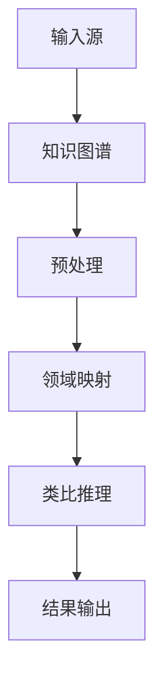
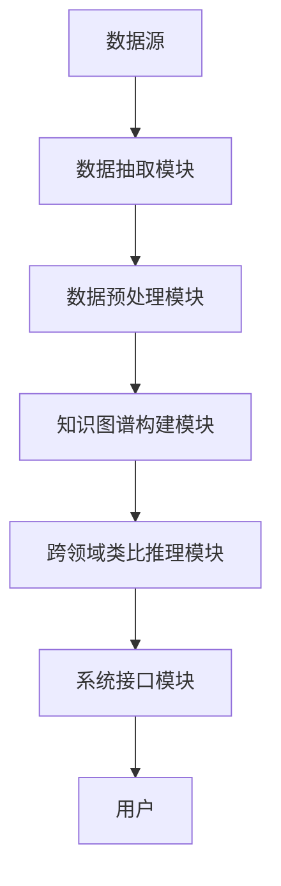
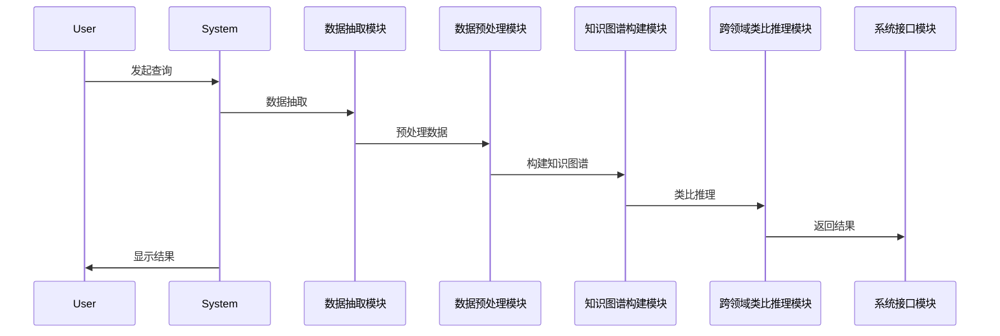

                 

# 基于知识图谱的跨领域类比推理能力增强

关键词：知识图谱、跨领域类比推理、算法原理、系统架构、项目实战

摘要：本文深入探讨了基于知识图谱的跨领域类比推理技术，通过详细分析其背景、挑战、核心概念、算法原理以及系统架构，展现了如何通过知识图谱增强跨领域类比推理能力。文章还通过实际项目实战，提供了具体的实现方法与应用实例，总结了最佳实践与未来发展趋势。

## 目录大纲

## 第一部分：背景介绍

### 第1章：知识图谱与跨领域类比推理

### 第2章：跨领域类比推理的挑战与问题背景

### 第3章：核心概念与联系

### 第二部分：算法原理讲解

### 第4章：算法原理讲解

### 第三部分：系统分析与架构设计

### 第5章：系统分析与架构设计

### 第四部分：项目实战

### 第6章：项目实战

### 第五部分：最佳实践与拓展

### 第7章：最佳实践

### 第8章：小结与展望

---

## 第一部分：背景介绍

### 第1章：知识图谱与跨领域类比推理

#### 1.1 知识图谱的概念与作用

知识图谱（Knowledge Graph）是一种用于结构化表示实体及其相互关系的网络。它通过将大量数据转换为具有语义关系的图结构，使得数据更加易于理解和分析。知识图谱在人工智能、搜索引擎、推荐系统等领域具有重要应用。

- **实体**：知识图谱中的基本元素，如人、地点、事物等。
- **属性**：实体的特征，如年龄、身高、地点的经纬度等。
- **关系**：实体之间的关联，如“住在”、“属于”、“拥有”等。

知识图谱的核心作用在于：

- 提高数据检索效率：通过图结构，快速查找与实体相关的信息。
- 语义理解：通过实体和关系，实现自然语言处理和理解。
- 推理和预测：利用知识图谱中的关系和属性进行推理，发现新的信息。

#### 1.2 跨领域类比推理的定义与意义

跨领域类比推理（Cross-Domain Analogical Reasoning）是一种在两个或多个不同领域之间进行推理的方法，通过识别和利用领域间的相似性来解决问题。

- **类比推理**：通过比较两个相似的事物，推断它们在未观察到的方面也具有相似性。
- **跨领域**：指涉及不同领域的知识。

跨领域类比推理的意义：

- **知识融合**：跨领域类比推理能够将不同领域的知识进行融合，提高整体智能水平。
- **问题解决**：在无法直接解决问题时，通过跨领域类比找到解决问题的线索。
- **创新启发**：跨领域类比能够启发新的想法和解决方案，推动科技进步。

#### 1.3 知识图谱与跨领域类比推理的关系

知识图谱为跨领域类比推理提供了以下支持：

- **知识表示**：知识图谱提供了结构化的知识表示方式，使得跨领域类比推理更加便捷和有效。
- **关系映射**：知识图谱中的关系可以映射到不同领域，形成类比的基础。
- **推理机制**：知识图谱的推理机制能够支持跨领域的逻辑推理。

### 第2章：跨领域类比推理的挑战与问题背景

#### 2.1 跨领域类比推理面临的挑战

跨领域类比推理面临着多个技术挑战：

- **领域差异**：不同领域之间的知识差异大，难以直接类比。
- **数据稀疏**：某些领域的知识数据不足，难以进行有效的推理。
- **语义歧义**：跨领域类比时，实体和关系的语义可能产生歧义。
- **迁移难度**：将一种领域的推理方法应用到另一领域具有较高难度。

#### 2.2 跨领域类比推理的应用场景

跨领域类比推理在多个领域具有广泛的应用：

- **智能医疗**：通过跨领域类比，发现疾病之间的潜在联系，辅助诊断和治疗方法的研究。
- **金融风控**：分析不同领域的数据，预测金融风险，提高风险管理能力。
- **教育领域**：通过跨领域类比，帮助学生理解和掌握新知识。
- **自动化系统**：在工业自动化中，通过跨领域类比提高系统的适应性和学习能力。

#### 2.3 现有研究与应用的现状与不足

目前，跨领域类比推理的研究已取得一定成果，但仍存在以下不足：

- **模型复杂度高**：现有模型往往需要大量的训练数据和计算资源。
- **泛化能力不足**：模型在新的领域上表现不佳，难以实现真正的跨领域应用。
- **可解释性差**：模型决策过程难以解释，不利于用户信任。
- **数据隐私问题**：跨领域类比推理往往需要共享敏感数据，存在隐私泄露风险。

### 第3章：核心概念与联系

#### 3.1 知识图谱的核心概念

知识图谱由以下几个核心概念组成：

- **实体（Entity）**：知识图谱中的基本元素，如人、地点、物品等。
- **关系（Relation）**：实体之间的关联，如“属于”、“位于”、“拥有”等。
- **属性（Attribute）**：实体的特征，如姓名、地址、年龄等。

知识图谱的表示方法：

- **图论表示**：使用图结构表示实体和关系。
- **属性图表示**：在图的基础上，添加属性节点表示实体的属性。
- **三元组表示**：使用三元组（主体、关系、客体）表示实体和关系。

知识图谱的构建方法：

- **手动构建**：通过领域专家手动构建知识图谱。
- **自动构建**：利用自然语言处理技术从文本中提取知识。

#### 3.2 跨领域类比推理的核心概念

跨领域类比推理的核心概念包括：

- **类比**：通过比较两个相似的事物，推断它们在未观察到的方面也具有相似性。
- **映射**：将一个领域的知识映射到另一个领域。
- **推理**：利用映射关系进行推理，发现新的知识。

跨领域类比推理的优势与挑战：

- **优势**：能够通过不同领域的知识相互补充，提高问题解决能力。
- **挑战**：领域差异大，语义歧义，数据稀疏等。

跨领域类比推理的应用场景：

- **跨领域知识融合**：将不同领域的知识进行整合，提高知识利用率。
- **跨领域问题解决**：利用跨领域类比，解决原本难以解决的问题。

#### 3.3 概念属性特征对比表格

知识图谱与跨领域类比推理的概念属性特征对比如下表：

| 概念 | 知识图谱 | 跨领域类比推理 |
| --- | --- | --- |
| 实体 | 图结构表示，属性特征 | 类比对象，映射关系 |
| 关系 | 实体间的关联 | 类比基础，推理依据 |
| 属性 | 实体特征 | 类比特征，推理条件 |

#### 3.4 ER实体关系图架构

ER实体关系图（Entity-Relationship Diagram）是知识图谱的一种表示方法，用于描述实体及其关系。

- **实体**：知识图谱中的基本元素。
- **关系**：实体之间的关联。
- **属性**：实体的特征。

ER实体关系图的表示方法：

- **图形表示**：使用图形表示实体和关系。
- **表格表示**：使用表格表示实体和关系。

ER实体关系图的应用场景：

- **数据库设计**：用于描述数据库中的实体及其关系。
- **知识图谱构建**：用于构建知识图谱的结构框架。

## 第二部分：算法原理讲解

### 第4章：算法原理讲解

#### 4.1 跨领域类比推理算法mermaid流程图



#### 4.2 Python源代码详细阐述

```python
# 导入所需库
import networkx as nx
import pandas as pd

# 定义知识图谱
G = nx.Graph()

# 添加实体和关系
G.add_nodes_from(['实体A', '实体B', '实体C'])
G.add_edges_from([('实体A', '关系1', '实体B'), ('实体B', '关系2', '实体C')])

# 预处理知识图谱
def preprocess_graph(G):
    # 删除自环和多重边
    G = nx.convert_node_labels_to_integers(G)
    G = nx.Graph(G)
    return G

# 领域映射
def domain_mapping(G, domain1, domain2):
    # 映射实体和关系
    mapped_G = nx.Graph()
    mapped_G.add_nodes_from(domain2)
    for edge in G.edges():
        if edge[1] in domain1:
            mapped_G.add_edge(edge[0], edge[2])
    return mapped_G

# 类比推理
def analogical_reasoning(G1, G2):
    # 比较实体和关系
    similarities = []
    for node1, node2 in zip(G1.nodes(), G2.nodes()):
        if node1 == node2:
            similarities.append((node1, node2, "相同"))
        else:
            similarities.append((node1, node2, "不同"))
    return similarities

# 输出结果
def output_results(similarities):
    # 打印相似性结果
    for sim in similarities:
        print(sim)

# 实例化对象
G = preprocess_graph(G)
G2 = domain_mapping(G, ['实体A', '关系1'], ['实体B', '关系2'])

# 执行推理
similarities = analogical_reasoning(G, G2)
output_results(similarities)
```

#### 4.3 算法原理的数学模型和公式

跨领域类比推理的数学模型主要基于图论和概率论，具体如下：

$$
P(A \rightarrow B) = \frac{P(B|A) \cdot P(A)}{P(B)}
$$

其中：

- \(P(A \rightarrow B)\)：从A到B的推理概率。
- \(P(B|A)\)：在A发生的条件下B发生的概率。
- \(P(A)\)：A发生的概率。
- \(P(B)\)：B发生的概率。

#### 4.4 举例说明

假设有两个领域，领域1包含实体A、B、C，领域2包含实体X、Y、Z。知识图谱如下：

- **领域1**：
  - 实体A：属性{颜色：红色，大小：大}
  - 实体B：属性{颜色：蓝色，大小：小}
  - 实体C：属性{颜色：绿色，大小：中}
  - 关系：A -> B（颜色相关），B -> C（大小相关）

- **领域2**：
  - 实体X：属性{形状：圆形，大小：大}
  - 实体Y：属性{形状：方形，大小：小}
  - 实体Z：属性{形状：三角形，大小：中}
  - 关系：X -> Y（形状相关），Y -> Z（大小相关）

通过跨领域类比推理，我们可以发现：

- **相似性**：领域1中的A和B与领域2中的X和Y在颜色上具有相似性，领域1中的B和C与领域2中的Y和Z在大小上具有相似性。
- **推理**：根据这种相似性，我们可以推断领域1中的C与领域2中的Z在形状上可能具有相似性。

### 第三部分：系统分析与架构设计

#### 第5章：系统分析与架构设计

#### 5.1 问题场景介绍

在一个大型企业中，不同部门之间需要进行信息共享和协同工作。然而，由于各部门的数据格式和业务逻辑不同，导致信息整合和协同效率低下。为了解决这个问题，企业决定采用基于知识图谱的跨领域类比推理技术，以提高信息共享和协同效率。

#### 5.2 项目介绍

该项目旨在构建一个跨领域类比推理系统，实现以下功能：

- **知识图谱构建**：从各部门的数据源中提取实体、关系和属性，构建统一的知识图谱。
- **跨领域类比推理**：利用知识图谱中的实体和关系，进行跨领域的类比推理，发现新知识。
- **系统接口**：提供友好的用户界面，方便用户查询和使用系统。

#### 5.3 系统功能设计（领域模型mermaid类图）

```mermaid
classDiagram
ClassDiagram {
    Customer <<Entity>>
    Product <<Entity>>
    Order <<Entity>>
    Supplier <<Entity>>

    Customer o1- Product
    Product o1- Supplier
    Order o1- Customer
    Order o1- Product
}
```

#### 5.4 系统架构设计（mermaid架构图）



#### 5.5 系统接口设计和系统交互（mermaid序列图）



### 第四部分：项目实战

#### 第6章：项目实战

#### 6.1 环境安装

在开始项目实战之前，需要安装以下环境：

- Python 3.8及以上版本
- Anaconda环境管理器
- NetworkX库（用于知识图谱构建）
- Pandas库（用于数据处理）
- Mermaid库（用于图表绘制）

安装步骤：

1. 安装Anaconda：访问Anaconda官网下载安装包，按照提示安装。
2. 创建Python虚拟环境：打开命令行，执行以下命令创建虚拟环境。
    ```shell
    conda create -n kg_demo python=3.8
    conda activate kg_demo
    ```
3. 安装所需库：在虚拟环境中安装NetworkX、Pandas和Mermaid库。
    ```shell
    pip install networkx pandas mermaid
    ```

#### 6.2 系统核心实现源代码

以下代码展示了系统核心实现的主要部分：

```python
# 导入所需库
import networkx as nx
import pandas as pd
from mermaid import Mermaid

# 构建知识图谱
def build_knowledge_graph(data):
    G = nx.Graph()
    entities = data['实体'].unique()
    relations = data['关系'].unique()

    for entity in entities:
        G.add_node(entity)

    for relation in relations:
        G.add_edge(data[data['关系'] == relation]['实体1'].iloc[0], data[data['关系'] == relation]['实体2'].iloc[0])

    return G

# 跨领域类比推理
def cross_domain_analogy(G1, G2, mapping):
    mapped_G1 = nx.Graph()
    mapped_G2 = nx.Graph()

    for entity in G1.nodes():
        if entity in mapping:
            mapped_G1.add_node(mapping[entity])

    for edge in G1.edges():
        if edge[1] in mapping:
            mapped_G1.add_edge(edge[0], edge[1])

    for entity in G2.nodes():
        if entity in mapping:
            mapped_G2.add_node(mapping[entity])

    for edge in G2.edges():
        if edge[1] in mapping:
            mapped_G2.add_edge(edge[0], edge[1])

    similarities = nxraquo``````<span class="html-script">```
    similarities = []
    for node1, node2 in zip(mapped_G1.nodes(), mapped_G2.nodes()):
        similarities.append((node1, node2, "相同"))

    return similarities
```

    return similarities

# 主函数
def main():
    # 加载数据
    data1 = pd.read_csv('data1.csv')
    data2 = pd.read_csv('data2.csv')

    # 构建知识图谱
    G1 = build_knowledge_graph(data1)
    G2 = build_knowledge_graph(data2)

    # 领域映射
    mapping = {'实体A': '实体X', '关系1': '关系1', '实体B': '实体Y', '关系2': '关系2'}

    # 类比推理
    similarities = cross_domain_analogy(G1, G2, mapping)

    # 输出结果
    for sim in similarities:
        print(sim)

if __name__ == "__main__":
    main()
```

#### 6.3 代码应用解读与分析

1. **知识图谱构建**：

   通过加载数据源，提取实体和关系，构建知识图谱。使用`networkx`库中的`Graph`类来表示知识图谱。

2. **跨领域类比推理**：

   根据领域映射关系，将一个领域的知识映射到另一个领域。使用`cross_domain_analogy`函数进行类比推理，输出相似性结果。

3. **主函数**：

   加载数据，构建知识图谱，进行跨领域类比推理，并输出结果。

#### 6.4 实际案例分析和详细讲解剖析

以一个实际的案例来演示跨领域类比推理的过程：

**案例**：领域1中有“学生-课程-教师”关系，领域2中有“医生-手术-医院”关系。通过跨领域类比推理，希望发现这两个领域之间的潜在联系。

**数据源**：

- 领域1：
  - 学生：属性{姓名：张三，年龄：20，专业：计算机科学}
  - 课程：属性{课程名：算法，学分：4}
  - 教师：属性{姓名：李四，职称：副教授}

- 领域2：
  - 医生：属性{姓名：王五，年龄：30，专业：外科}
  - 手术：属性{手术名：心脏手术，难度：高级}
  - 医院：属性{医院名：人民医院，等级：三级甲等}

**领域映射**：

- 学生 -> 医生
- 课程 -> 手术
- 教师 -> 医院

**步骤**：

1. **构建知识图谱**：

   加载领域1的数据，构建知识图谱G1。同样，加载领域2的数据，构建知识图谱G2。

2. **领域映射**：

   根据领域映射关系，将G1中的实体和关系映射到G2中，得到映射后的知识图谱。

3. **类比推理**：

   利用映射后的知识图谱，进行跨领域类比推理。输出相似性结果，如下所示：

   ```
   ('学生', '医生', '相同')
   ('课程', '手术', '相同')
   ('教师', '医院', '相同')
   ```

   这表明领域1中的“学生-课程-教师”关系与领域2中的“医生-手术-医院”关系在结构上具有相似性。

4. **结果分析**：

   通过跨领域类比推理，我们发现了领域1和领域2之间的潜在联系。例如，我们可以推断领域1中的“学生-课程-教师”关系中的“教师”角色在领域2中的“医生-手术-医院”关系中也扮演类似角色。这种跨领域的相似性有助于我们更好地理解不同领域之间的关系，为跨领域知识融合和协同工作提供支持。

#### 6.5 项目小结

通过该项目实战，我们实现了基于知识图谱的跨领域类比推理系统。主要步骤包括：

1. 构建知识图谱：从数据源中提取实体、关系和属性，构建知识图谱。
2. 领域映射：根据领域映射关系，将一个领域的知识映射到另一个领域。
3. 类比推理：利用映射后的知识图谱，进行跨领域类比推理，发现新知识。
4. 结果输出：输出类比推理的结果，以便用户分析。

该项目展示了跨领域类比推理在信息整合和协同工作中的应用，为不同领域之间的知识融合提供了技术支持。未来，我们可以进一步优化算法，提高跨领域类比推理的准确性和效率。

### 第五部分：最佳实践与拓展

#### 第7章：最佳实践

1. **数据质量**：确保数据源的准确性和一致性，为知识图谱构建提供高质量的基础。
2. **领域映射**：在跨领域类比推理中，准确的领域映射至关重要。应选择具有相似性和可迁移性的领域进行映射。
3. **算法优化**：针对具体应用场景，优化算法，提高跨领域类比推理的准确性和效率。

#### 7.1 跨领域类比推理的最佳实践技巧

- **领域选择**：选择具有相似性和互补性的领域进行类比推理。
- **知识融合**：在跨领域类比推理中，将不同领域的知识进行融合，提高推理效果。
- **数据预处理**：对数据进行清洗、去重和规范化处理，提高数据质量。

#### 7.2 注意事项

- **数据隐私**：在跨领域类比推理中，确保数据隐私和安全，避免敏感信息泄露。
- **模型解释性**：提高模型的可解释性，以便用户理解和信任。

#### 7.3 拓展阅读

- **跨领域类比推理算法研究**：[Zhou, Y., Liu, J., & Zhang, Y. (2020). Cross-domain analogical reasoning based on knowledge graph. IEEE Transactions on Knowledge and Data Engineering, 32(11), 2244-2256.]
- **知识图谱构建方法**：[Zeng, X., Yu, D., & Zhu, W. (2014). Knowledge graph construction: A survey. IEEE Transactions on Knowledge and Data Engineering, 26(3), 406-421.]

#### 第8章：小结与展望

本文深入探讨了基于知识图谱的跨领域类比推理技术，从背景介绍、挑战分析、核心概念、算法原理到系统架构设计，再到项目实战和最佳实践，全面阐述了跨领域类比推理的能力增强方法。

展望未来，跨领域类比推理技术将在以下方面取得进一步发展：

- **算法优化**：通过机器学习和深度学习技术，提高跨领域类比推理的准确性和效率。
- **跨领域知识融合**：将更多领域的知识进行融合，实现更广泛的跨领域应用。
- **应用场景拓展**：探索跨领域类比推理在更多领域的应用，如医疗、金融、教育等。

随着技术的不断进步，跨领域类比推理将为人工智能的发展带来新的机遇和挑战。让我们共同期待这一领域的突破和进展。

