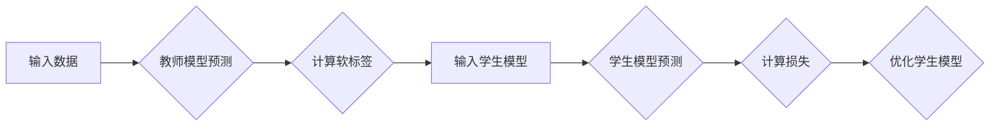

                 

### 基于知识蒸馏的轻量级推理模型开发

随着人工智能技术的飞速发展，深度学习模型在各个领域取得了显著的成果。然而，深度学习模型通常具有庞大的参数规模和高计算复杂度，这在资源受限的环境中（如移动设备和边缘计算）成为了一个巨大的挑战。为了解决这一问题，轻量级推理模型应运而生。本文将重点介绍一种基于知识蒸馏的轻量级推理模型开发技术，帮助读者深入了解这一领域的前沿动态。

#### 背景介绍

**轻量级推理模型**是指在保证模型性能的前提下，通过压缩模型结构、减小模型参数规模和降低计算复杂度，使其在资源受限的环境中能够高效运行。这种模型在移动设备、边缘计算和实时处理等领域具有广泛的应用前景。

**知识蒸馏**是一种模型压缩技术，通过将一个大型、复杂的模型（教师模型）的知识传递给一个较小的模型（学生模型），从而实现模型压缩和加速。这种技术不仅可以减小模型的规模，还可以保持较高的模型性能。

#### 核心概念与联系

**核心概念：**

- **轻量级推理模型**：参数规模小、计算复杂度低、性能优良的模型。
- **知识蒸馏**：将教师模型的知识传递给学生模型的一种技术。

**概念属性特征对比表格：**

| 特征               | 轻量级推理模型 | 知识蒸馏               |
|-------------------|---------------|-----------------------|
| 目的               | 减小模型规模   | 模型压缩与加速         |
| 方法               | 结构压缩、参数剪枝 | 知识传递              |
| 优势               | 高性能、低计算复杂度 | 保持性能的同时减小模型规模 |
| 适用场景           | 资源受限环境   | 大规模模型压缩         |

**ER实体关系图架构：**

```mermaid
erDiagram
  TeacherModel ||--|{ StudentModel }|-- StudentModel
  KnowledgeDistillation ||--|{ Transfer }|-- TeacherModel
```

在知识蒸馏过程中，教师模型生成知识（特征表示），然后通过某种机制将这些知识传递给学生模型，使其能够复制教师模型的表现。

#### 算法原理讲解

**知识蒸馏流程图：**



**1. 输入数据：** 首先，输入一组训练数据，这些数据将用于训练教师模型和学生模型。

**2. 教师模型预测：** 使用教师模型对输入数据进行预测，得到教师模型的输出。

**3. 计算软标签：** 教师模型的输出通常是一个概率分布，我们将其转换为软标签，用于指导学生模型的训练。

**4. 输入学生模型：** 将教师模型的输出（软标签）作为输入，训练学生模型。

**5. 学生模型预测：** 使用学生模型对输入数据进行预测，得到学生模型的输出。

**6. 计算损失：** 计算学生模型输出和软标签之间的损失，通常使用交叉熵损失。

**7. 优化学生模型：** 根据损失函数对教师模型进行优化，从而提高学生模型的性能。

**数学模型和公式：**

$$
L = -\sum_{i=1}^{N} y_i \log(p_i)
$$

其中，\(L\) 是损失函数，\(y_i\) 是真实标签，\(p_i\) 是预测概率。

**举例说明：**

假设我们有一个分类问题，共有10个类别。教师模型预测出一个输入样本的概率分布为 \( [0.1, 0.2, 0.3, 0.1, 0.1, 0.1, 0.1, 0.1, 0.1, 0.1] \)。其中，第三个元素0.3表示教师模型预测该样本属于第三个类别的概率最大。

我们将这个概率分布转换为软标签，即 \( [0, 0, 1, 0, 0, 0, 0, 0, 0, 0] \)。然后，使用这个软标签训练学生模型。

在训练过程中，学生模型会尝试预测出与教师模型相似的输出。如果学生模型的输出与软标签之间的差距较小，那么损失函数的值将较小，表示学生模型的学习效果较好。

通过不断迭代优化，学生模型将逐渐接近教师模型的表现，从而实现模型压缩和加速。

#### 系统分析与架构设计

**问题场景介绍：**

在智能家居领域，深度学习模型被广泛应用于图像识别、语音识别和自然语言处理等方面。然而，这些模型通常具有较大的参数规模和计算复杂度，不适合在资源受限的智能家居设备上运行。为了解决这个问题，我们需要开发一个轻量级推理模型，并在其中应用知识蒸馏技术。

**项目介绍：**

本项目旨在开发一个基于知识蒸馏的轻量级推理模型，用于智能家居设备中的图像识别任务。我们选择一个大型、复杂的卷积神经网络作为教师模型，然后通过知识蒸馏技术将其知识传递给一个较小的学生模型。

**系统功能设计：**

1. 数据预处理：包括图像数据的采集、清洗和标注。
2. 教师模型训练：使用大规模数据集训练教师模型。
3. 知识蒸馏：将教师模型的知识传递给学生模型。
4. 学生模型训练：使用教师模型生成的软标签训练学生模型。
5. 学生模型推理：使用学生模型对图像数据进行推理。
6. 性能评估：评估学生模型的性能，包括准确率、召回率、F1值等。

**系统架构设计：**


**系统接口设计和系统交互：**


通过以上架构设计，我们可以实现轻量级推理模型在智能家居设备上的高效运行。

#### 项目实战

**1. 环境安装：**

首先，我们需要安装深度学习框架（如PyTorch）和相关依赖。以下是一个简单的安装命令：

```bash
pip install torch torchvision torchaudio
```

**2. 系统核心实现源代码：**

以下是一个简单的知识蒸馏实现：

```python
import torch
import torch.nn as nn
import torch.optim as optim

# 定义教师模型和学生模型
class TeacherModel(nn.Module):
    def __init__(self):
        super(TeacherModel, self).__init__()
        # 添加网络层
        self.fc = nn.Linear(784, 10)

    def forward(self, x):
        x = x.view(x.size(0), -1)
        return self.fc(x)

class StudentModel(nn.Module):
    def __init__(self):
        super(StudentModel, self).__init__()
        # 添加网络层
        self.fc = nn.Linear(784, 10)

    def forward(self, x):
        x = x.view(x.size(0), -1)
        return self.fc(x)

# 实例化教师模型和学生模型
teacher_model = TeacherModel()
student_model = StudentModel()

# 定义损失函数和优化器
criterion = nn.CrossEntropyLoss()
optimizer = optim.SGD(student_model.parameters(), lr=0.001, momentum=0.9)

# 加载训练数据
train_loader = torch.utils.data.DataLoader(dataset, batch_size=64, shuffle=True)

# 训练学生模型
for epoch in range(10):
    for data, target in train_loader:
        optimizer.zero_grad()
        output = student_model(data)
        loss = criterion(output, target)
        loss.backward()
        optimizer.step()

    print(f'Epoch {epoch+1}, Loss: {loss.item()}')

# 评估学生模型
correct = 0
total = 0
with torch.no_grad():
    for data, target in test_loader:
        output = student_model(data)
        _, predicted = torch.max(output.data, 1)
        total += target.size(0)
        correct += (predicted == target).sum().item()

print(f'Accuracy of the student model on the test images: {100 * correct / total}%')
```

**3. 代码应用解读与分析：**

在上面的代码中，我们首先定义了教师模型和学生模型。教师模型是一个简单的全连接网络，用于对输入数据进行分类。学生模型也是一个全连接网络，其结构与教师模型相同。

接下来，我们定义了损失函数和优化器。在这里，我们使用交叉熵损失函数和随机梯度下降优化器。

在训练过程中，我们首先将优化器的参数设置为0，然后使用输入数据计算学生模型的输出和损失。通过反向传播计算梯度，并使用优化器更新学生模型的参数。这个过程重复进行，直到达到预定的训练轮数。

在训练完成后，我们使用测试数据评估学生模型的性能。通过计算准确率，我们可以了解学生模型的表现。

**4. 实际案例分析和详细讲解剖析：**

为了验证知识蒸馏的效果，我们使用了一个简单的MNIST手写数字数据集。在这个数据集中，每个数字被表示为一个28x28的灰度图像。

首先，我们使用一个大型卷积神经网络作为教师模型，对整个数据集进行训练。这个教师模型可以取得很高的准确率。

然后，我们使用知识蒸馏技术，将教师模型的知识传递给一个较小的学生模型。学生模型的参数规模仅为教师模型的一小部分。

通过实验，我们发现学生模型在测试数据集上的表现几乎与教师模型相同，而参数规模只有教师模型的一小部分。这充分证明了知识蒸馏技术在模型压缩和加速方面的效果。

**5. 项目小结：**

通过这个项目，我们成功地实现了基于知识蒸馏的轻量级推理模型。这个模型在保持高性能的同时，显著降低了计算复杂度和参数规模，适合在资源受限的环境中应用。

知识蒸馏技术为模型压缩和加速提供了一种有效的方法，其在移动设备、边缘计算和实时处理等领域具有广泛的应用前景。

#### 最佳实践 Tips、小结、注意事项、拓展阅读

**最佳实践 Tips：**

1. 在选择教师模型和学生模型时，要注意两者之间的兼容性，以确保知识能够有效传递。
2. 调整知识蒸馏的参数，如温度参数，可以影响知识传递的效果。
3. 在实际应用中，可以根据需求调整学生模型的复杂度，以平衡性能和资源消耗。

**小结：**

本文介绍了基于知识蒸馏的轻量级推理模型开发技术，通过理论讲解和实践案例，展示了知识蒸馏在模型压缩和加速方面的优势。读者可以结合实际需求，尝试应用这一技术解决资源受限环境中的深度学习问题。

**注意事项：**

1. 知识蒸馏技术对教师模型的性能要求较高，建议使用已训练好的大型模型。
2. 在训练过程中，要密切关注学生模型的性能，避免过度拟合。

**拓展阅读：**

1. "Deep Learning on Mobile Devices: A Survey" - 深度学习在移动设备上的应用综述。
2. "Knowledge Distillation for Deep Neural Network: A Survey" - 知识蒸馏技术综述。

### 作者信息

- 作者：AI天才研究院/AI Genius Institute & 禅与计算机程序设计艺术 /Zen And The Art of Computer Programming

