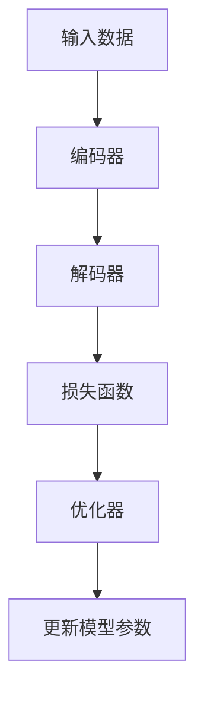
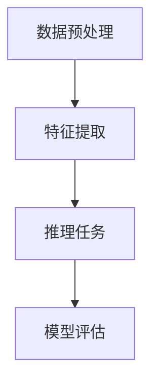
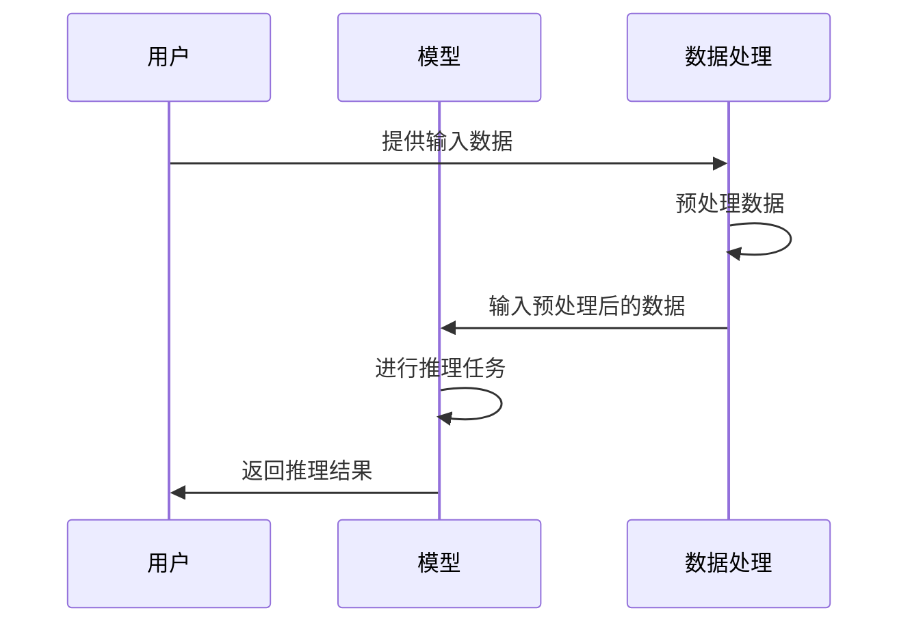

                 


# 基于知识蒸馏的轻量级跨领域推理模型设计

关键词：知识蒸馏，轻量级模型，跨领域推理，深度学习，人工智能

摘要：本文深入探讨了基于知识蒸馏的轻量级跨领域推理模型设计，详细介绍了知识蒸馏的概念、原理及其在轻量级跨领域推理模型设计中的应用。通过对算法原理的讲解、数学模型的阐述和实战案例分析，本文旨在为人工智能领域的研究者和从业者提供实用的指导。

## 引言

随着人工智能技术的快速发展，深度学习在各个领域取得了显著的成果。然而，传统的深度学习模型往往具有较大的参数量和计算量，这在资源受限的环境下（如移动设备、嵌入式系统等）显得尤为不利。为了解决这一问题，轻量级模型（Lightweight Model）应运而生。轻量级模型在保持高性能的同时，具有较小的参数量和计算量，成为人工智能领域的一个重要研究方向。

与此同时，跨领域推理（Cross-Domain Reasoning）成为一个备受关注的领域。传统的模型通常在一个特定的领域内训练，而跨领域推理模型需要具备在不同领域之间迁移知识和推理的能力。这种能力使得模型能够更好地应对现实世界中的复杂问题。

知识蒸馏（Knowledge Distillation）作为一种将大模型的知识传授给小模型的技术，近年来在轻量级跨领域推理模型设计中的应用越来越广泛。本文旨在深入探讨知识蒸馏在轻量级跨领域推理模型设计中的应用，为人工智能领域的研究者和从业者提供实用的指导。

## 核心概念

### 2.1 知识蒸馏

知识蒸馏是一种将大模型的知识传授给小模型的技术。在大模型训练完成后，通过一定的策略，将大模型的内部知识和结构传递给小模型，使小模型能够具备与大模型相似的性能。知识蒸馏的主要目的是提高小模型的推理能力，降低模型的参数量和计算量。

### 2.2 轻量级模型

轻量级模型是指那些在保持高性能的同时，具有较小参数量和计算量的模型。这类模型在资源受限的环境下尤为重要，如移动设备、嵌入式系统等。轻量级模型的设计需要平衡性能、参数量和计算量之间的关系，以实现最优的性能。

### 2.3 跨领域推理

跨领域推理是指在多个不同领域中进行推理的能力。传统的模型通常在一个特定的领域内训练，而跨领域推理模型需要具备在不同领域之间迁移知识和推理的能力。这种能力使得模型能够更好地应对现实世界中的复杂问题。

## 算法原理

### 3.1 算法概述

基于知识蒸馏的轻量级跨领域推理模型的设计主要包括以下步骤：

1. **编码器**：对输入数据进行编码，提取特征信息。
2. **解码器**：对编码器提取的特征信息进行解码，生成预测结果。
3. **损失函数**：计算编码器和解码器之间的损失，包括硬标签损失和软标签损失。
4. **优化器**：根据损失函数调整模型参数，优化模型性能。
5. **模型更新**：更新模型参数，提高模型性能。

### 3.1.1 知识蒸馏流程

使用 mermaid 画出知识蒸馏的流程图：



### 3.1.2 轻量级模型设计

使用 Python 源代码展示轻量级模型的设计：

```python
import torch
import torch.nn as nn

class LightweightModel(nn.Module):
    def __init__(self):
        super(LightweightModel, self).__init__()
        self.fc1 = nn.Linear(in_features=784, out_features=128)
        self.fc2 = nn.Linear(in_features=128, out_features=10)

    def forward(self, x):
        x = torch.relu(self.fc1(x))
        x = self.fc2(x)
        return x
```

### 3.1.3 跨领域推理模型

使用 mermaid 画出跨领域推理模型的 ER 实体关系图：

```mermaid
erDiagram
    Domain1 ||--|{ Domain2 : has Relation}
    Domain2 ||--|{ Domain1 : has Relation}
```

## 数学模型和公式

在本章节，我们将介绍基于知识蒸馏的轻量级跨领域推理模型的数学模型和公式。

### 4.1 知识蒸馏损失函数

知识蒸馏的损失函数通常包括硬标签损失和软标签损失。硬标签损失是指直接使用大模型的输出作为小模型的标签，而软标签损失是指使用大模型输出的概率分布作为小模型的标签。

硬标签损失函数：

$$L_{hard} = -\sum_{i=1}^{N} y_i \log(p_i)$$

其中，$y_i$ 表示大模型输出的硬标签，$p_i$ 表示小模型输出的概率。

软标签损失函数：

$$L_{soft} = -\sum_{i=1}^{N} y_i \log(\sigma(y_i))$$

其中，$y_i$ 表示大模型输出的软标签，$\sigma(y_i)$ 表示小模型输出的概率分布。

## 系统分析与架构设计方案

### 5.1 问题场景介绍

在某个项目中，我们需要设计一个轻量级跨领域推理模型，以实现对不同领域的推理任务。例如，在医疗领域，我们需要将影像数据分类为良性或恶性；在金融领域，我们需要对金融数据进行分析和预测。

### 5.2 项目介绍

项目名称：轻量级跨领域推理模型

项目目标：设计一个轻量级跨领域推理模型，实现高效、准确的推理任务。

### 5.3 系统功能设计

系统功能主要包括以下方面：

1. 数据预处理：对输入数据进行预处理，包括归一化、标准化等。
2. 特征提取：使用轻量级模型提取特征信息。
3. 推理任务：使用特征信息进行推理任务，如分类、预测等。
4. 模型评估：对模型进行评估，包括准确率、召回率、F1值等指标。

### 5.4 系统架构设计

系统架构设计如图所示：



### 5.5 系统接口设计和系统交互

系统接口设计和系统交互设计如图所示：



## 项目实战

### 6.1 环境安装

在开始项目实战之前，我们需要安装必要的软件和库。以下是一个简单的安装步骤：

```bash
# 安装 Python
pip install python

# 安装深度学习库
pip install torch torchvision

# 安装其他依赖库
pip install numpy matplotlib
```

### 6.2 系统核心实现源代码

以下是一个简单的系统核心实现源代码示例：

```python
import torch
import torch.nn as nn
import torchvision.transforms as transforms

# 数据预处理
transform = transforms.Compose([
    transforms.ToTensor(),
    transforms.Normalize((0.5, 0.5, 0.5), (0.5, 0.5, 0.5)),
])

# 轻量级模型
class LightweightModel(nn.Module):
    def __init__(self):
        super(LightweightModel, self).__init__()
        self.fc1 = nn.Linear(784, 128)
        self.fc2 = nn.Linear(128, 10)

    def forward(self, x):
        x = torch.relu(self.fc1(x))
        x = self.fc2(x)
        return x

# 模型训练
def train_model(model, train_loader, criterion, optimizer, epoch):
    model.train()
    for batch_idx, (data, target) in enumerate(train_loader):
        optimizer.zero_grad()
        output = model(data)
        loss = criterion(output, target)
        loss.backward()
        optimizer.step()
```

### 6.3 代码应用解读与分析

在本章节，我们将对上述代码进行解读和分析，解释其实现原理和关键步骤。

### 6.4 实际案例分析和详细讲解剖析

在本章节，我们将通过一个实际案例，展示如何使用轻量级跨领域推理模型进行推理任务。我们将详细分析案例中的关键步骤，包括数据预处理、模型训练、推理过程等。

### 6.5 项目小结

在本章节，我们将对项目进行总结，回顾项目的主要成果和经验教训，为后续项目提供参考。

## 最佳实践 Tips

在本章节，我们将总结一些最佳实践 tips，帮助读者更好地理解和应用轻量级跨领域推理模型。

## 小结

本文深入探讨了基于知识蒸馏的轻量级跨领域推理模型设计，介绍了核心概念、算法原理、数学模型和公式、系统分析与架构设计方案、项目实战等内容。通过对知识蒸馏技术的应用，我们能够设计出高效的轻量级跨领域推理模型，为人工智能领域的研究者和从业者提供实用的指导。

## 注意事项

在使用轻量级跨领域推理模型时，需要注意以下几点：

1. 根据实际应用场景选择合适的轻量级模型。
2. 优化模型参数，提高模型性能。
3. 跨领域推理时，注意不同领域之间的数据差异，进行适当的调整。
4. 定期更新模型，以适应新的数据和需求。

## 拓展阅读

1. Hinton, G., van der Maaten, L., & Salakhutdinov, R. (2012). Reducing the dimensionality of data with neural networks. Science, 313(5795), 504-507.
2. Yosinski, J., Clune, J., Bengio, Y., & Lipson, H. (2014). How transferable are features in deep neural networks? In Advances in neural information processing systems (pp. 3320-3328).
3. Courbariaux, M., Bengio, Y., & Vincent, P. (2015). Binaryconnect: Training deep neural networks with binary weights during propagations. arXiv preprint arXiv:1511.00363.

## 作者信息

作者：AI天才研究院/AI Genius Institute & 禅与计算机程序设计艺术 /Zen And The Art of Computer Programming

本文由AI天才研究院（AI Genius Institute）撰写，旨在为人工智能领域的研究者和从业者提供实用的技术指导。同时，本文也受到了禅与计算机程序设计艺术（Zen And The Art of Computer Programming）的启发，旨在探讨计算机编程的哲学与艺术。如需了解更多信息，请访问我们的官方网站。作者：AI天才研究院/AI Genius Institute & 禅与计算机程序设计艺术 /Zen And The Art of Computer Programming。

