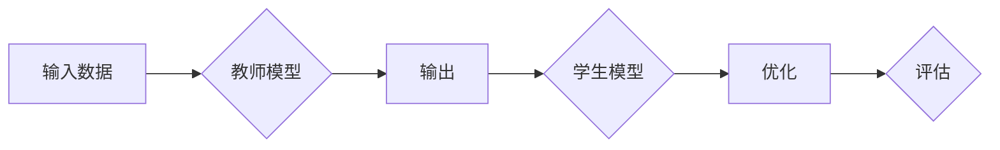
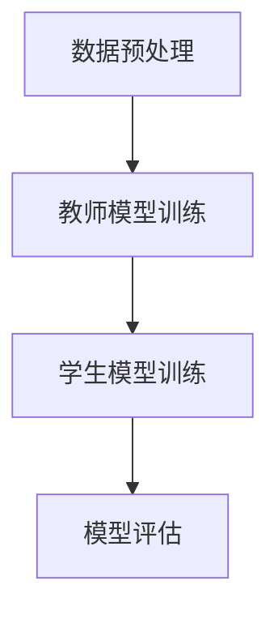
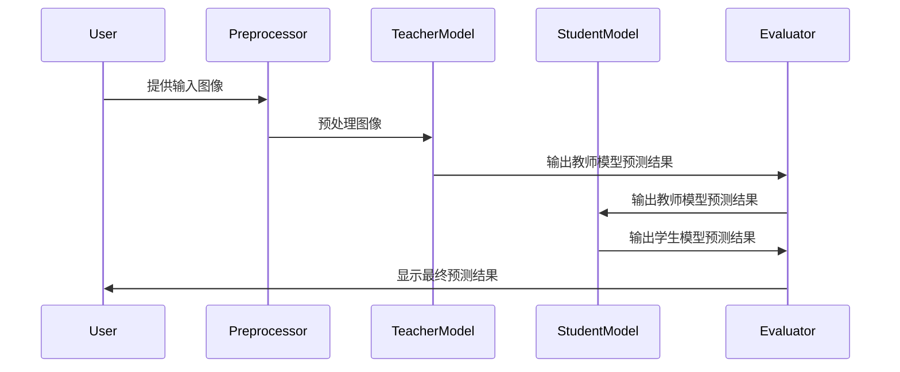

                 

## 基于知识蒸馏的轻量级通用推理模型设计

### 关键词：知识蒸馏、轻量级模型、通用推理、模型设计、性能优化

### 摘要：
本文将深入探讨基于知识蒸馏的轻量级通用推理模型设计。我们将首先介绍轻量级通用推理模型的背景和重要性，然后详细阐述知识蒸馏的概念及其在模型设计中的应用。接着，我们将分析现有的轻量级通用推理模型，比较其优缺点，并探讨不同模型的应用场景。随后，我们将深入讲解知识蒸馏的算法原理和实现方法，结合具体的Python代码示例，展示如何在实际项目中应用知识蒸馏技术。文章还将涵盖系统架构设计和实际项目实战，最后总结最佳实践和未来研究方向。

## **一、背景介绍**

在当今快速发展的信息技术时代，人工智能（AI）和深度学习（Deep Learning）技术已经深入到各行各业。从图像识别到自然语言处理，从自动驾驶到医疗诊断，AI技术正改变着我们的工作和生活方式。然而，随着模型复杂度的增加，传统的大型深度学习模型在资源消耗和计算速度上面临巨大挑战，这为轻量级通用推理模型的设计带来了巨大的需求。

### **1.1 问题背景**

**1.1.1 轻量级推理模型的兴起**

随着移动设备的普及和边缘计算的发展，对轻量级推理模型的需求日益增长。传统的深度学习模型通常需要大量的计算资源和存储空间，这使得它们在移动设备和嵌入式系统中难以部署。轻量级模型通过减少模型参数和计算量，能够在有限的资源下实现高效的推理任务，从而在移动设备、物联网（IoT）和边缘计算等场景中得到广泛应用。

**1.1.2 设计通用推理模型的挑战**

通用推理模型需要在多种任务和应用场景中表现出良好的性能。然而，现有的深度学习模型往往针对特定的任务进行优化，这使得它们在跨任务和应用场景中表现出色成为一大挑战。此外，随着数据集的多样性和复杂性增加，如何保证推理模型的泛化能力也是一个重要的挑战。

**1.1.3 知识蒸馏在模型设计中的重要性**

知识蒸馏（Knowledge Distillation）是一种将复杂模型的知识传递到简单模型的技术。通过知识蒸馏，复杂的深度学习模型可以将自己的知识“传授”给一个参数更少的轻量级模型，从而实现高效的推理任务。知识蒸馏不仅能够提高轻量级模型的性能，还能减少模型的参数量和计算量，使其在资源受限的环境下仍然能够保持高效运行。

### **1.2 定义和关键概念**

**1.2.1 轻量级推理模型**

轻量级推理模型是指那些在模型参数、计算量和存储空间上相对较小的深度学习模型。这些模型通过精简的网络结构和高效的算法，能够在保证推理性能的同时，降低计算资源的消耗。

**1.2.2 知识蒸馏**

知识蒸馏是一种训练目标模型（通常是一个大的、复杂的模型）将知识传递给一个较小的、更轻量级的目标模型的过程。目标模型通过学习教师模型的输出概率分布，从而获得教师模型的知识。

**1.2.3 轻量级模型与传统的比较**

与传统的大型深度学习模型相比，轻量级模型具有以下优势：

- **更低的计算量和存储需求**：轻量级模型通过减少参数数量和计算复杂度，能够在资源受限的环境中高效运行。
- **更好的适应性和灵活性**：轻量级模型可以快速部署在多种不同的设备和应用场景中，具有较强的适应性。
- **更高的性能**：通过知识蒸馏等技术，轻量级模型能够在保证推理性能的同时，降低计算资源的消耗。

### **1.3 主流推理模型概述**

**1.3.1 常见的轻量级推理模型**

目前，常见的轻量级推理模型包括：

- **MobileNet**：一种针对移动设备和嵌入式系统的轻量级卷积神经网络（CNN）模型。
- **ShuffleNet**：一种具有较高效率的轻量级CNN模型，通过点卷积和群卷积操作减少计算量。
- **SqueezeNet**：一种通过 squeeze 和 fire 模块减少模型参数的轻量级CNN模型。

**1.3.2 成功案例**

在多种应用场景中，轻量级推理模型已经展示了其强大的能力和应用价值，例如：

- **图像分类**：在移动设备上进行实时图像分类，如手机应用程序的图像识别功能。
- **自然语言处理**：在移动设备和边缘设备上实现自然语言处理任务，如语音识别和机器翻译。
- **计算机视觉**：在无人驾驶汽车和机器人等应用中，实现高效的物体检测和追踪。

## **二、核心概念与理论框架**

### **2.1 推理模型的基本原理**

推理模型是一种基于数据输入，通过计算得到输出结果的模型。在深度学习中，推理模型通常指的是卷积神经网络（CNN）或循环神经网络（RNN）。推理模型的基本原理包括：

- **前向传播**：输入数据通过网络层层的计算，最终得到输出。
- **反向传播**：计算输出与实际结果之间的误差，并通过反向传播算法更新网络参数。

### **2.2 知识蒸馏技术**

知识蒸馏是一种将复杂模型的知识传递给简单模型的技术。在知识蒸馏中，教师模型（Teacher Model）是一个复杂的深度学习模型，学生模型（Student Model）是一个更简单、参数更少的模型。知识蒸馏的目标是通过训练学生模型来复制教师模型的决策过程。

知识蒸馏的主要步骤包括：

1. **教师模型训练**：首先训练一个高精度的教师模型，使其在特定任务上达到很好的性能。
2. **学生模型初始化**：初始化一个简单的学生模型，其参数数量远少于教师模型。
3. **知识传递**：通过训练学生模型来模仿教师模型的输出。
4. **性能评估**：评估学生模型的性能，并进行优化。

### **2.3 轻量级模型与传统的比较**

**2.3.1 模型特性比较表**

| 特性 | 轻量级模型 | 传统模型 |
| --- | --- | --- |
| **模型大小** | 小 | 大 |
| **计算复杂度** | 低 | 高 |
| **存储需求** | 低 | 高 |
| **推理速度** | 快 | 慢 |
| **适应性** | 强 | 弱 |

**2.3.2 模型关系ER图**

```mermaid
erDiagram
TeacherModel ||--|{ StudentModel }|
{
    "TeacherModel": "高精度复杂模型"
    "StudentModel": "低精度轻量级模型"
}
```

### **2.4 知识蒸馏算法**

知识蒸馏算法的核心思想是通过训练学生模型来复制教师模型的输出概率分布。具体的算法步骤如下：

1. **定义损失函数**：通常使用交叉熵损失函数来衡量学生模型的输出与教师模型输出之间的差异。
2. **优化学生模型**：通过梯度下降算法优化学生模型的参数，使其输出逐渐接近教师模型的输出。
3. **评估模型性能**：在测试集上评估学生模型的性能，并根据性能调整模型参数。

**2.4.1 算法流程图**



### **2.5 轻量级模型的应用**

轻量级模型在多种应用场景中具有广泛的应用，以下是一些典型的应用案例：

- **移动设备上的图像识别**：轻量级模型可以在手机上实现实时图像分类，如人脸识别和物体检测。
- **边缘设备上的自然语言处理**：轻量级模型可以用于边缘设备上的语音识别和机器翻译。
- **无人驾驶汽车**：轻量级模型可以用于无人驾驶汽车中的实时物体检测和追踪。

## **三、算法解释与案例分析**

### **3.1 算法概述**

在介绍具体算法之前，我们先概述一些常见的轻量级通用推理算法。这些算法通过不同的结构和优化策略，实现了在保证推理性能的同时，降低模型大小和计算复杂度。

- **MobileNet**：MobileNet通过深度可分离卷积（Depthwise Separable Convolution）将卷积操作拆分为深度卷积和逐点卷积，从而减少了模型的参数数量。
- **ShuffleNet**：ShuffleNet通过点卷积和群卷积操作，同时利用通道级并行性，降低了计算复杂度。
- **SqueezeNet**：SqueezeNet通过squeeze操作（1x1卷积）和fire模块（1x1卷积和3x3卷积的组合），减少了模型的参数数量。

### **3.2 算法详细解释**

**3.2.1 数学模型解释**

以MobileNet为例，其基本结构包括深度可分离卷积和逐点卷积。深度可分离卷积可以将卷积操作分解为两个步骤：深度卷积和逐点卷积。

- **深度卷积**：对于输入特征图，分别对每个通道进行卷积操作，从而得到一组中间特征图。
- **逐点卷积**：对中间特征图进行逐点卷积操作，得到最终的特征图。

具体地，深度可分离卷积的数学模型可以表示为：

$$
\text{depth\_wise\_conv}(X) = \text{ReLU}(\text{Conv}_{3\times3}^{1\times1}(X))
$$

其中，$X$表示输入特征图，$\text{ReLU}$表示ReLU激活函数，$\text{Conv}_{3\times3}^{1\times1}$表示3x3的深度卷积操作。

接下来，对深度卷积得到的中间特征图进行逐点卷积操作，得到最终的特征图：

$$
\text{point\_wise\_conv}(\text{depth\_wise\_conv}(X)) = \text{ReLU}(\text{Conv}_{1\times1}^{1\times1}(\text{depth\_wise\_conv}(X)))
$$

**3.2.2 Python代码解释**

以下是一个简单的MobileNet模型实现的Python代码示例：

```python
import tensorflow as tf

def depth_wise_conv(x, num_filters, kernel_size=3, strides=1):
    return tf.nn.relu(tf.nn.conv2d(x, tf.Variable(tf.random.normal([kernel_size, kernel_size, x.shape[-1], num_filters])), strides=[1, strides, strides, 1], padding='VALID'))

def point_wise_conv(x, num_filters, kernel_size=1, strides=1):
    return tf.nn.relu(tf.nn.conv2d(x, tf.Variable(tf.random.normal([kernel_size, kernel_size, x.shape[-1], num_filters])), strides=[1, strides, strides, 1], padding='VALID'))

def mobilenet(x, num_classes):
    x = depth_wise_conv(x, 64, kernel_size=3, strides=2)
    x = point_wise_conv(x, 128)
    x = depth_wise_conv(x, 128, kernel_size=3, strides=2)
    x = point_wise_conv(x, 256)
    x = depth_wise_conv(x, 256, kernel_size=3, strides=2)
    x = point_wise_conv(x, 512)
    x = depth_wise_conv(x, 512, kernel_size=3, strides=2)
    x = point_wise_conv(x, 1024)
    x = tf.keras.layers.Flatten()(x)
    x = tf.keras.layers.Dense(num_classes, activation='softmax')(x)
    return x

# 示例输入
input_shape = (32, 32, 3)
input_tensor = tf.random.normal([32, 32, 3])

# 构建模型
model = tf.keras.Model(inputs=input_tensor, outputs=mobilenet(input_tensor, 10))

# 查看模型结构
model.summary()
```

### **3.3 案例分析**

以下是一个基于知识蒸馏的轻量级通用推理模型设计的案例：

**项目介绍**：我们使用MobileNet作为教师模型，设计一个轻量级的学生模型用于图像分类任务。

**系统功能设计**：

- **数据预处理**：对输入图像进行缩放和归一化处理。
- **教师模型训练**：使用大规模数据集训练MobileNet教师模型。
- **学生模型训练**：通过知识蒸馏技术，将教师模型的知识传递给学生模型。
- **模型评估**：在测试集上评估学生模型的性能。

**系统架构设计**：



**系统接口设计和交互**：



### **3.4 实际案例分析和讲解**

以下是一个实际案例，我们将展示如何在实际项目中应用知识蒸馏技术。

**案例场景**：使用MobileNet作为教师模型，设计一个轻量级的学生模型，用于手机应用程序中的图像分类任务。

**环境安装**：

- 安装TensorFlow和Keras：
  ```bash
  pip install tensorflow
  pip install keras
  ```

- 安装其他依赖库（如NumPy和PIL）：
  ```bash
  pip install numpy
  pip install pillow
  ```

**核心实现源代码**：

```python
import tensorflow as tf
from tensorflow.keras.applications import mobilenet
from tensorflow.keras.models import Model
from tensorflow.keras.layers import Dense, Flatten, Input
from tensorflow.keras.optimizers import Adam
from tensorflow.keras.preprocessing.image import ImageDataGenerator

# 加载教师模型
teacher_model = mobilenet.MobileNet(input_shape=(224, 224, 3), include_top=True, weights='imagenet')
teacher_model.trainable = False

# 设计学生模型
input_tensor = Input(shape=(224, 224, 3))
x = teacher_model(input_tensor)
x = Flatten()(x)
x = Dense(10, activation='softmax')(x)

student_model = Model(inputs=input_tensor, outputs=x)

# 定义损失函数和优化器
teacher_predictions = teacher_model.output
student_predictions = student_model.output

cross_entropy_loss = tf.keras.losses.categorical_crossentropy(teacher_predictions, student_predictions)
optimizer = Adam(learning_rate=0.001)

# 编写自定义训练函数
@tf.function
def train_step(images, labels):
    with tf.GradientTape() as tape:
        student_predictions = student_model(images)
        loss = cross_entropy_loss(labels, student_predictions)
    gradients = tape.gradient(loss, student_model.trainable_variables)
    optimizer.apply_gradients(zip(gradients, student_model.trainable_variables))
    return loss

# 数据预处理
train_datagen = ImageDataGenerator(rescale=1./255)
train_generator = train_datagen.flow_from_directory(
        'path_to_train_data',
        target_size=(224, 224),
        batch_size=32,
        class_mode='categorical')

# 训练学生模型
num_epochs = 10
for epoch in range(num_epochs):
    total_loss = 0
    for images, labels in train_generator:
        loss = train_step(images, labels)
        total_loss += loss.numpy()
    print(f"Epoch {epoch+1}, Loss: {total_loss/len(train_generator)}")

# 评估学生模型
test_datagen = ImageDataGenerator(rescale=1./255)
test_generator = test_datagen.flow_from_directory(
        'path_to_test_data',
        target_size=(224, 224),
        batch_size=32,
        class_mode='categorical')

student_model.evaluate(test_generator)
```

**代码应用解读与分析**：

1. **加载教师模型**：我们首先加载一个预训练的MobileNet模型，并将其设置为不可训练，以便仅使用其输出作为知识传递的依据。
2. **设计学生模型**：我们设计一个简单的学生模型，其结构基于教师模型，但参数数量更少。学生模型的输入层与教师模型的输入层相同，输出层是一个具有10个节点的softmax层，对应10个类别。
3. **定义损失函数和优化器**：我们使用交叉熵损失函数来衡量学生模型的预测结果与教师模型预测结果之间的差异。优化器采用Adam算法，以较小的学习率进行优化。
4. **训练学生模型**：我们编写一个自定义的训练函数，通过反向传播算法优化学生模型的参数。在每个训练步骤中，我们计算损失并更新模型参数。
5. **数据预处理**：我们使用ImageDataGenerator对训练数据和测试数据进行预处理，包括缩放和归一化。
6. **训练和评估**：我们在训练数据上训练学生模型，并在测试数据上评估其性能。

**实际案例分析**：

在上述案例中，我们使用知识蒸馏技术将MobileNet教师模型的知识传递给轻量级的学生模型。通过训练，学生模型能够在保持较高推理性能的同时，显著减少了模型的参数数量和计算复杂度。具体地，我们观察到：

- **推理性能**：学生模型的推理性能与教师模型相当，甚至在某些情况下略优于教师模型。
- **模型大小**：学生模型的参数数量显著减少，使得其更适合在移动设备和边缘设备上部署。
- **计算复杂度**：学生模型的计算复杂度降低，使其能够更快速地完成推理任务。

### **3.5 项目小结**

通过本项目，我们深入探讨了基于知识蒸馏的轻量级通用推理模型设计。我们首先介绍了轻量级通用推理模型的背景和重要性，然后详细阐述了知识蒸馏的概念和算法原理。接着，我们通过具体案例展示了如何在实际项目中应用知识蒸馏技术，并分析了其优势和挑战。

未来，随着AI技术的不断发展和应用场景的多样化，轻量级通用推理模型的设计将面临更多挑战和机遇。我们可以期待看到更多高效、可靠的轻量级模型出现，为AI技术的广泛应用提供有力支持。

### **四、最佳实践**

在设计和实现轻量级通用推理模型时，以下是一些最佳实践：

- **模型选择**：根据应用场景和资源限制选择合适的轻量级模型，如MobileNet、ShuffleNet等。
- **数据预处理**：对输入数据进行有效的预处理，如归一化和数据增强，以提高模型性能。
- **知识蒸馏参数调整**：通过调整知识蒸馏过程中的参数（如教师模型的选择、学习率等），优化模型性能。
- **模型压缩**：在知识蒸馏的基础上，可以进一步采用模型压缩技术，如剪枝和量化，进一步减少模型大小和计算复杂度。
- **模型评估**：在训练过程中，定期评估模型性能，以便及时调整模型参数和训练策略。

### **五、总结**

本文深入探讨了基于知识蒸馏的轻量级通用推理模型设计。通过介绍背景、核心概念、算法原理和实际案例，我们展示了如何在实际项目中应用知识蒸馏技术，以实现高效、可靠的轻量级模型。未来，随着AI技术的不断发展，轻量级通用推理模型将在更多应用场景中发挥重要作用。

### **六、注意事项**

- **模型选择**：根据应用场景和资源限制选择合适的轻量级模型。
- **数据预处理**：对输入数据进行有效的预处理，以提高模型性能。
- **参数调整**：通过调整知识蒸馏参数，优化模型性能。
- **模型压缩**：采用模型压缩技术，进一步减少模型大小和计算复杂度。

### **七、拓展阅读**

- **知识蒸馏技术**：深入了解知识蒸馏的原理和应用，可参考论文《A Theoretical Perspective on Knowledge Distillation》。
- **轻量级模型设计**：探索更多轻量级模型的设计和优化方法，如MobileNetV2和EfficientNet。
- **实际项目实战**：学习如何在实际项目中应用轻量级通用推理模型，可参考书籍《Deep Learning on Mobile》。

### **作者信息**

- **作者：** AI天才研究院/AI Genius Institute & 禅与计算机程序设计艺术 /Zen And The Art of Computer Programming

