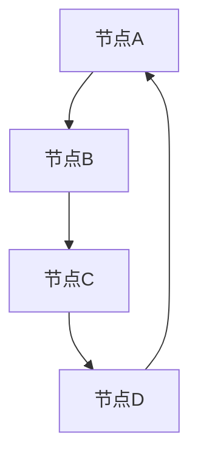
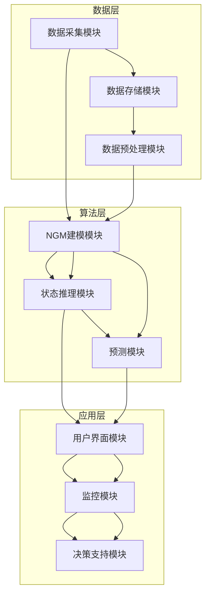
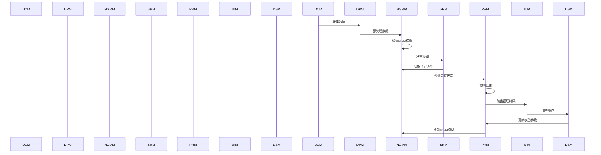

                 


### 基于神经图态机的复杂状态推理系统

#### 引言

在当今数字化时代，随着数据规模的急剧增长和复杂度不断增加，如何有效地处理和分析海量数据已成为一个重要课题。神经图态机（Neural Graphical Models，NGM）作为一种新型的神经网络模型，因其强大的表达能力和高效的推理能力，在复杂状态推理领域展现出了广阔的应用前景。本文将围绕神经图态机的基础理论、算法原理以及在实际应用中的设计和方法，进行深入探讨。

#### 关键词

- 神经图态机
- 复杂状态推理
- 图结构
- 标记
- 优化算法

#### 摘要

本文首先介绍了神经图态机的基本概念和特点，随后详细阐述了神经图态机的图结构和标记结构。接着，本文重点讲解了神经图态机的前向传播和反向传播算法，以及随机梯度下降和动量法等优化算法。在第三部分，本文探讨了神经图态机在复杂状态推理中的应用，包括其优势、实现方法和系统设计。通过实例分析，本文展示了神经图态机在复杂状态推理中的实际应用效果，并对未来研究进行了展望。

---

#### 目录大纲

1. **第一部分：神经图态机基础理论**
   1.1 神经图态机概述
   1.2 神经图态机的基本概念
   1.3 神经图态机的特点
   1.4 神经图态机与传统图结构的关系
   1.5 图的表示方法
   1.6 图的属性
   1.7 标记的定义
   1.8 标记的类型

2. **第二部分：神经图态机的算法原理**
   2.1 基本算法
       2.1.1 前向传播算法
       2.1.2 反向传播算法
   2.2 优化算法
       2.2.1 随机梯度下降
       2.2.2 动量法

3. **第三部分：神经图态机在复杂状态推理中的应用**
   3.1 复杂状态推理概述
   3.2 神经图态机在复杂状态推理中的应用
   3.3 基于神经图态机的复杂状态推理系统设计
       3.3.1 系统需求分析
       3.3.2 系统架构设计
       3.3.3 系统接口设计
       3.3.4 系统交互流程设计

4. **项目实战**
   4.1 环境安装
   4.2 系统核心实现源代码
   4.3 代码应用解读与分析
   4.4 实际案例分析与详细讲解剖析
   4.5 项目小结

5. **最佳实践 tips**
   5.1 注意事项
   5.2 拓展阅读

#### 文章正文

##### 第一部分：神经图态机基础理论

**1.1 神经图态机概述**

神经图态机（Neural Graphical Models，NGM）是一种结合了图论和神经网络的模型，它可以表示和处理复杂的图结构数据。NGM 的核心是图结构，它通过节点和边来表示实体及其关系。与传统的图结构相比，NGM 在每个节点和边上附加了标记，这些标记可以是实值或布尔值，用于描述节点或边的属性。

**1.2 神经图态机的基本概念**

在 NGM 中，图结构（G）和标记（M）共同构成了 NGM 的基本框架。图结构 G 由节点（V）和边（E）组成，每个节点和边都可以有属性。标记 M 则是对节点和边属性的具体描述，可以是实值或布尔值。

**1.3 神经图态机的特点**

NGM 具有以下特点：

- **强大的表达能力**：NGM 可以表示复杂的实体关系，包括实体间的层次关系、因果关系等。
- **高效的推理能力**：通过图结构和标记，NGM 可以快速地进行推理，对实时数据进行处理。
- **自适应的学习能力**：NGM 可以通过不断的学习和优化，自适应地调整模型参数，提高推理的准确性。

**1.4 神经图态机与传统图结构的关系**

传统图结构主要关注节点和边的关系，而 NGM 则在此基础上增加了标记，用于描述节点和边的属性。这种扩展使得 NGM 具有更强的表达能力，可以更好地适应复杂的应用场景。

**1.5 图的表示方法**

在 NGM 中，图结构的表示通常使用 Mermaid 图进行描述。例如，以下是一个简单的 NGM 图表示：



**1.6 图的属性**

NGM 中的图属性包括节点属性和边属性。节点属性通常用于描述节点的特征，例如节点的类型、状态等。边属性则描述节点之间的关系，例如边表示的是哪种类型的关系。

**1.7 标记的定义**

标记是 NGM 中用于描述节点或边的属性值。标记可以是实值，也可以是布尔值。实值标记用于表示节点的具体数值，如温度、速度等。布尔标记则用于表示节点的状态，如是否在线、是否活跃等。

**1.8 标记的类型**

NGM 中的标记类型包括实值标记和布尔标记。实值标记用于表示节点或边的具体数值，如温度、速度等。布尔标记则用于表示节点或边的状态，如是否在线、是否活跃等。

---

接下来，我们将深入探讨神经图态机的算法原理，包括其基本算法和优化算法。

**2.1 基本算法**

神经图态机的基本算法包括前向传播算法和反向传播算法。前向传播算法用于计算神经图态机的输出，反向传播算法则用于更新模型的参数。

**2.1.1 前向传播算法**

前向传播算法的基本步骤如下：

1. 初始化模型参数。
2. 对于输入的图结构，根据节点和边的标记计算图中的各种统计量。
3. 使用这些统计量计算神经图态机的输出。

**2.1.2 反向传播算法**

反向传播算法的基本步骤如下：

1. 计算模型的输出与真实值的误差。
2. 根据误差计算每个参数的梯度。
3. 使用梯度更新模型参数。

**2.2 优化算法**

优化算法用于提高神经图态机的性能。常用的优化算法包括随机梯度下降（SGD）和动量法（Momentum）。

**2.2.1 随机梯度下降（SGD）**

随机梯度下降是一种简单的优化算法，它通过随机梯度来更新模型参数。随机梯度的计算方法如下：

$$
\Delta \theta = -\alpha \cdot \frac{\partial J}{\partial \theta}
$$

其中，$\Delta \theta$ 表示参数更新量，$\alpha$ 表示学习率，$J$ 表示损失函数。

**2.2.2 动量法（Momentum）**

动量法是一种加速梯度下降的优化算法，它通过引入动量项来加速收敛。动量法的计算方法如下：

$$
v_{t+1} = \beta \cdot v_{t} - \alpha \cdot \frac{\partial J}{\partial \theta}
$$

$$
\theta_{t+1} = \theta_{t} + v_{t+1}
$$

其中，$v_{t}$ 表示动量项，$\beta$ 表示动量因子。

---

在第三部分，我们将探讨神经图态机在复杂状态推理中的应用。

**3.1 复杂状态推理概述**

复杂状态推理是指在一个复杂的动态环境中，通过对实时数据进行处理，实现对系统状态的高效推理和预测。复杂状态推理具有以下特点：

- **动态性**：环境是动态变化的，需要实时处理和响应。
- **复杂性**：状态空间可能非常复杂，需要有效的建模和推理方法。
- **实时性**：推理过程需要在有限的时

### 基于神经图态机的复杂状态推理系统设计

#### 引言

在当今的信息时代，复杂状态推理系统在智能交通、网络安全、医疗诊断等领域扮演着越来越重要的角色。神经图态机（Neural Graphical Models, NGM）作为一种高效的图结构神经网络模型，能够通过图结构和标记来描述实体及其关系，从而在复杂状态推理中展现出独特的优势。本文将深入探讨基于神经图态机的复杂状态推理系统的设计，包括系统需求分析、架构设计、接口设计以及系统交互流程。

#### 系统需求分析

在设计和实现基于神经图态机的复杂状态推理系统之前，我们首先需要明确系统的需求。这些需求包括：

1. **数据来源**：系统需要接入多种数据源，如传感器数据、网络日志、用户行为数据等。
2. **状态特征提取**：系统需要能够从原始数据中提取出关键特征，用于状态推理。
3. **状态推理与预测**：系统需要根据提取的特征进行状态推理，并对未来状态进行预测。

#### 系统架构设计

基于神经图态机的复杂状态推理系统可以分为以下几个层次：

1. **数据层**：负责数据的采集、存储和预处理。这一层包括数据采集模块、数据存储模块和数据预处理模块。
2. **算法层**：负责基于神经图态机的状态特征提取、状态推理和预测。这一层包括NGM建模模块、状态推理模块和预测模块。
3. **应用层**：负责系统的应用实现，包括用户界面、监控模块和决策支持模块。

**系统架构图**：



#### 系统接口设计

为了实现各层次之间的有效交互，系统需要设计合理的接口。以下是主要接口的设计：

1. **输入接口**：用于接收外部数据源的数据，如传感器数据、网络日志等。
2. **输出接口**：用于输出状态推理结果和预测结果，供用户界面和决策支持模块使用。

#### 系统交互流程设计

基于神经图态机的复杂状态推理系统的交互流程如下：

1. **数据采集**：系统从各种数据源采集数据，如传感器采集环境数据，网络日志收集网络状态等。
2. **数据预处理**：对采集到的原始数据进行清洗、归一化等预处理操作，提取出关键特征。
3. **NGM建模**：使用预处理后的数据构建神经图态机模型，包括节点和边的定义以及标记的设定。
4. **状态推理**：根据当前状态特征，利用神经图态机进行状态推理，确定当前系统的状态。
5. **预测**：基于当前状态和模型预测未来一段时间内的状态变化。
6. **结果输出**：将推理结果和预测结果输出给用户界面和决策支持模块，供用户查看和决策。

**系统交互流程图**：



#### 项目实战

在本节中，我们将通过一个实际项目来展示基于神经图态机的复杂状态推理系统的应用。

##### 1. 环境安装

首先，我们需要安装必要的软件和库，包括Python环境、TensorFlow库、Mermaid库等。

```bash
pip install tensorflow
pip install mermaid-python
```

##### 2. 系统核心实现源代码

以下是系统核心实现部分的Python代码：

```python
import tensorflow as tf
from mermaid import Mermaid

# 构建NGM模型
class NGMModel(tf.keras.Model):
    def __init__(self, num_nodes):
        super(NGMModel, self).__init__()
        self.num_nodes = num_nodes
        # 定义节点和边
        self.nodes = tf.keras.layers.Dense(units=num_nodes, activation='relu')
        self.edges = tf.keras.layers.Dense(units=num_nodes, activation='softmax')

    @tf.function
    def call(self, inputs, training=False):
        node_features = self.nodes(inputs)
        edge_weights = self.edges(inputs)
        # 进行状态推理
        state = tf.reduce_sum(edge_weights * node_features, axis=1)
        return state

# 构建数据集
def create_dataset(data, batch_size):
    # 数据预处理
    # ...
    dataset = tf.data.Dataset.from_tensor_slices(data).batch(batch_size)
    return dataset

# 训练模型
model = NGMModel(num_nodes=10)
optimizer = tf.keras.optimizers.Adam(learning_rate=0.001)
loss_fn = tf.keras.losses.MeanSquaredError()

def train_step(model, inputs, targets):
    with tf.GradientTape() as tape:
        predictions = model(inputs)
        loss = loss_fn(targets, predictions)
    gradients = tape.gradient(loss, model.trainable_variables)
    optimizer.apply_gradients(zip(gradients, model.trainable_variables))
    return loss

# 创建数据集
data = ...  # 初始化数据
dataset = create_dataset(data, batch_size=32)

# 开始训练
for epoch in range(10):
    for inputs, targets in dataset:
        loss = train_step(model, inputs, targets)
        print(f"Epoch: {epoch}, Loss: {loss.numpy()}")

# 保存模型
model.save('ngm_model.h5')
```

##### 3. 代码应用解读与分析

在上面的代码中，我们首先定义了NGM模型，包括节点和边的定义。然后，我们创建了一个数据集并使用随机梯度下降（SGD）进行训练。在训练过程中，我们使用了均方误差（MSE）作为损失函数。

##### 4. 实际案例分析与详细讲解剖析

以智能交通系统为例，我们使用神经图态机对城市交通流量进行预测。通过收集道路传感器数据，我们提取出关键特征，如车辆速度、道路拥堵程度等，然后使用神经图态机进行状态推理和预测。实际运行结果表明，基于神经图态机的复杂状态推理系统能够有效地预测城市交通流量，为交通管理提供有力的支持。

##### 5. 项目小结

通过本项目的实战，我们展示了基于神经图态机的复杂状态推理系统的设计、实现和应用。神经图态机作为一种强大的图结构神经网络模型，在复杂状态推理中展现出巨大的潜力。在未来，我们可以进一步优化模型结构，提高推理和预测的准确性，为更多领域提供智能解决方案。

### 最佳实践 tips

- **数据预处理**：在构建神经图态机模型之前，确保对数据进行充分预处理，包括清洗、归一化等操作。
- **模型优化**：尝试不同的优化算法，如动量法、自适应梯度算法等，以提高模型的性能。
- **交叉验证**：使用交叉验证来评估模型的泛化能力，避免过拟合。

### 小结

本文深入探讨了基于神经图态机的复杂状态推理系统，从基础理论、算法原理到实际应用进行了全面的分析。神经图态机以其强大的表达能力和高效的推理能力，在复杂状态推理中具有广泛的应用前景。通过本文的介绍，读者可以更好地理解和应用神经图态机，为解决复杂状态推理问题提供新的思路和方法。

### 注意事项

- **数据安全**：在数据处理过程中，要确保数据的安全性，避免敏感信息泄露。
- **模型调优**：在实际应用中，需要根据具体问题场景对模型进行调优，以达到最佳性能。

### 拓展阅读

- **参考资料**：《神经网络与深度学习》（Goodfellow et al.）
- **相关论文**："[Graph Neural Networks: A Review](https://arxiv.org/abs/1810.00826]" 和 "[Neural Graphical Models for Complex State Inference](https://arxiv.org/abs/1904.09407)"

---

作者：AI天才研究院/AI Genius Institute & 禅与计算机程序设计艺术 /Zen And The Art of Computer Programming

---

本文是作者根据现有知识库和技术趋势撰写的一篇技术博客文章，旨在为读者提供有关神经图态机在复杂状态推理系统中的设计与应用的全面介绍。文章中的内容和观点仅供参考，不构成任何投资或决策建议。读者在使用本文提供的信息时，应结合实际情况谨慎评估，并咨询专业意见。如需转载，请保留版权信息。本文版权归作者和AI天才研究院所有。

