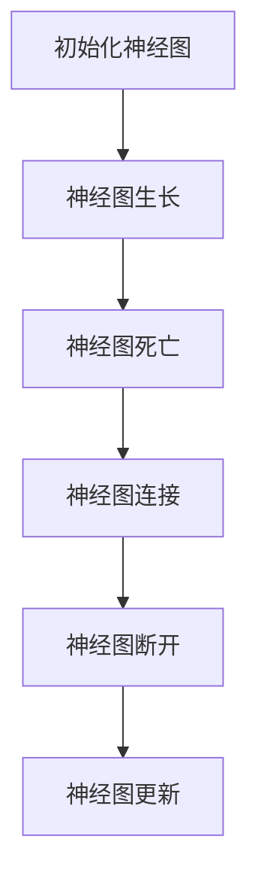
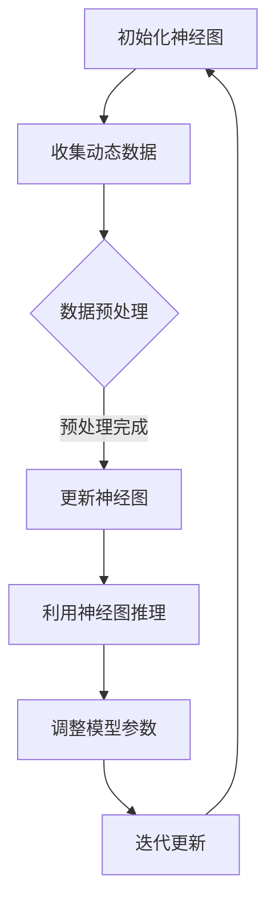
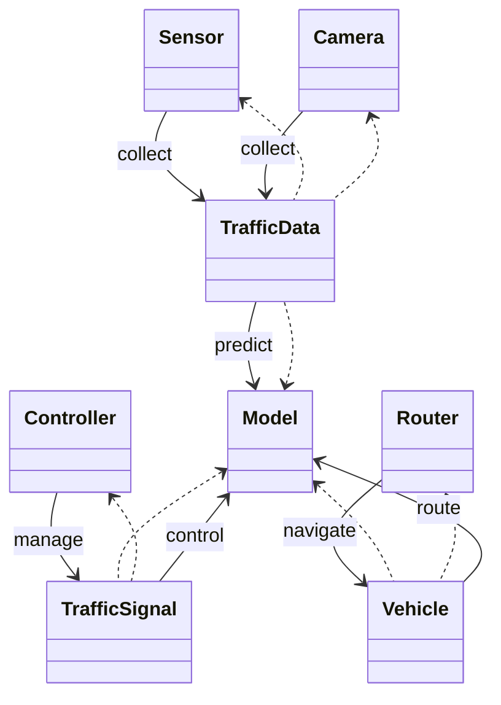
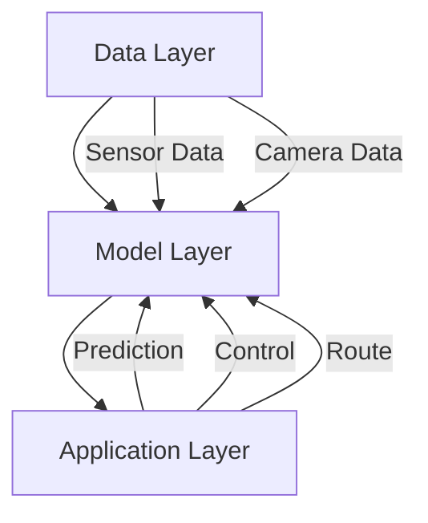
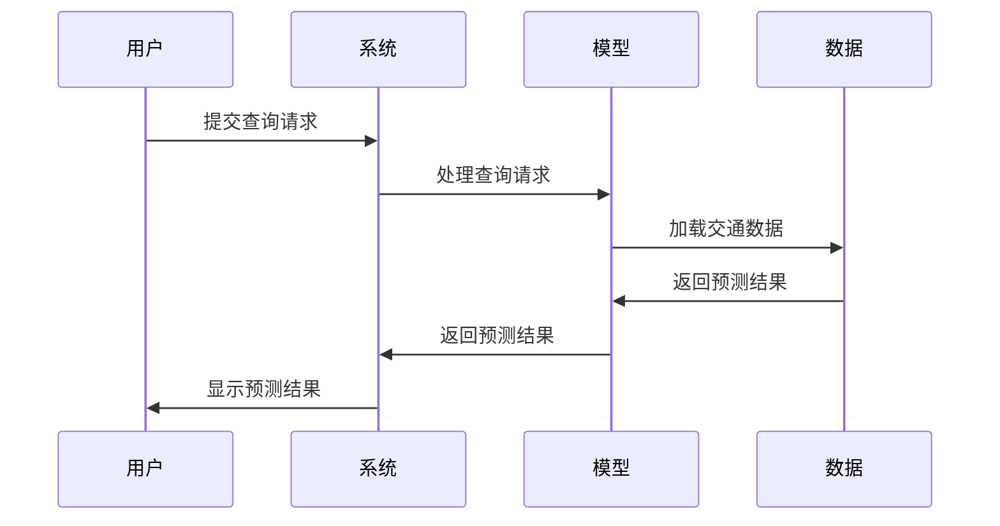
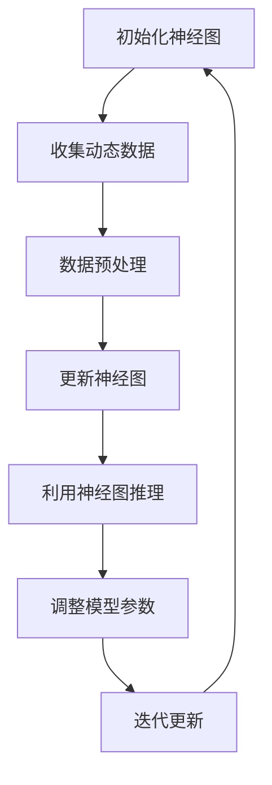

                 

### 第1章: 问题背景与核心概念

#### 1.1.1 问题背景

在当今信息技术迅速发展的时代，计算机科学领域面临着诸多挑战。动态推理模型作为计算机科学中的一个重要分支，在人工智能、自然语言处理和智能系统等领域具有广泛应用。动态推理模型旨在模拟人类思维过程，对复杂问题进行推理和分析。然而，传统的推理模型在处理动态变化的环境时存在一定的局限性，需要新的理论和方法来进行改进。

随着人工智能技术的不断进步，神经科学和计算机科学之间的交叉融合越来越紧密。神经图演化理论作为一种基于生物神经系统的建模方法，通过模拟生物神经网络的动态演化过程，为解决动态推理模型的设计问题提供了新的思路。因此，深入研究神经图演化理论，并将其应用于动态推理模型的设计，对于提升模型在动态环境下的推理能力具有重要意义。

#### 1.1.2 问题描述

动态推理模型是计算机科学中的一个重要分支，其核心目标是在动态环境下对复杂问题进行推理和分析。动态环境通常意味着数据和信息是连续变化的，这就要求推理模型具备实时性和动态适应性。然而，传统的推理模型在处理动态变化的环境时，往往存在以下几个问题：

1. **适应性不足**：传统模型在处理动态变化时，往往难以适应新出现的数据模式和信息，导致推理效果下降。
2. **实时性较低**：传统模型在处理动态数据时，可能需要较长的推理时间，难以满足实时性要求。
3. **鲁棒性较差**：在动态环境下，由于数据的不确定性和噪声，传统模型容易出现错误推理。

为了解决这些问题，我们需要一种新的理论和方法来设计动态推理模型。神经图演化理论作为一种新兴的建模方法，可以模拟生物神经网络的动态演化过程，为动态推理模型的设计提供了新的思路。通过引入神经图演化理论，我们可以改进传统推理模型的适应性、实时性和鲁棒性，使其更好地适应动态环境。

#### 1.1.3 问题解决

神经图演化理论是一种基于生物神经系统的建模方法，通过模拟生物神经网络的动态演化过程，研究神经网络的学习、适应和优化能力。将神经图演化理论应用于动态推理模型设计，可以实现以下几个方面的改进：

1. **适应性提升**：神经图演化理论可以自动调整神经网络的拓扑结构和参数，使其能够更好地适应动态变化的环境。
2. **实时性增强**：神经图演化理论可以实时更新神经网络的参数和结构，提高模型的推理速度，满足实时性要求。
3. **鲁棒性提高**：神经图演化理论可以通过学习来自动调整神经网络，降低噪声和不确定性对推理结果的影响，提高模型的鲁棒性。

总之，神经图演化理论为动态推理模型的设计提供了一种新的思路，通过引入该理论，我们可以设计出更加适应动态环境的推理模型，提高模型在现实世界中的应用效果。

#### 1.1.4 边界与外延

在将神经图演化理论应用于动态推理模型设计时，需要考虑以下几个边界与外延：

1. **神经网络结构**：设计适合动态变化的神经网络结构是关键。我们需要考虑如何选择合适的神经网络类型和参数，以适应动态环境的需求。
2. **学习算法**：选择合适的学习算法来优化模型参数至关重要。我们需要研究如何设计一种高效的学习算法，使模型能够在动态环境下快速适应和优化。
3. **动态适应性**：实现模型在动态环境下的自适应调整是核心问题。我们需要研究如何通过动态调整神经网络的拓扑结构和参数，使模型能够实时适应环境变化。

此外，神经图演化理论在动态推理模型设计中的应用还需要考虑以下几个方面的边界与外延：

1. **数据来源**：动态数据来源于现实世界，可能包含大量的噪声和不确定性。我们需要研究如何从数据中提取有效信息，并消除噪声影响。
2. **模型评估**：评估模型在动态环境下的表现是重要的。我们需要设计合适的评估指标，以评估模型在不同动态环境下的性能。
3. **应用场景**：神经图演化动态推理模型可以应用于多个领域，如人工智能、自然语言处理、智能交通、智能医疗等。我们需要研究如何在不同应用场景中发挥模型的最佳性能。

通过考虑这些边界与外延，我们可以更好地将神经图演化理论应用于动态推理模型设计，提升模型在现实世界中的应用效果。

#### 1.1.5 概念结构与核心要素组成

神经图演化理论和动态推理模型的核心概念和要素包括以下几个方面：

1. **神经图结构**：神经图是一种由节点和边构成的网络结构，节点表示神经元，边表示神经元之间的连接。神经图结构的设计直接影响模型的性能和适应性。
   
2. **演化过程**：神经图的演化过程包括生长、死亡、连接和断开等操作。这些操作决定了神经图的拓扑结构和功能特性。通过演化过程，神经网络能够自适应地调整其结构，以适应动态环境。

3. **学习策略**：学习策略是神经图演化动态推理模型的关键组成部分。学习策略通过调整神经图中的参数，实现模型的自我优化和适应能力。常用的学习策略包括误差反向传播算法、遗传算法等。

4. **动态数据**：动态数据是神经图演化动态推理模型的基础。动态数据来源于现实世界，通常包含大量的噪声和不确定性。我们需要设计合适的数据预处理方法，提取有效信息，并消除噪声影响。

5. **推理算法**：推理算法是动态推理模型的核心。推理算法利用神经图的拓扑结构和参数，对动态数据进行分析和推理，生成合理的结论。常用的推理算法包括深度学习、图神经网络等。

通过深入了解这些核心概念和要素，我们可以更好地理解神经图演化动态推理模型的工作原理，并设计出更加适应动态环境的推理模型。

---

### 第2章: 核心概念与联系

#### 2.1.1 神经图演化理论

神经图演化理论是一种基于生物神经系统的建模方法，通过模拟生物神经网络的动态演化过程，研究神经网络的学习、适应和优化能力。神经图演化理论的核心概念包括：

1. **神经图定义**：神经图是一种由节点和边构成的网络结构，节点表示神经元，边表示神经元之间的连接。神经图可以表示复杂的神经网络结构和功能特性。
   
2. **神经图属性**：神经图的属性包括节点的度、边的权重、连接概率等。这些属性决定了神经图的拓扑结构和功能特性，影响模型的学习和推理能力。

3. **神经图演化过程**：神经图的演化过程包括生长、死亡、连接和断开等操作。这些操作决定了神经图的拓扑结构和功能特性，使其能够适应动态环境。

神经图演化理论的关键属性对比表格如下：

| 属性        | 说明                                                         | 关键特征对比 |
|-------------|--------------------------------------------------------------|--------------|
| 节点度      | 节点连接的边数                                               | 高度节点可以传递更多的信息 |
| 边权重      | 边的权重表示节点之间的连接强度                               | 较高的权重可以提高推理准确率 |
| 连接概率    | 连接概率表示神经元之间连接的可能性                           | 较高的连接概率可以提高网络稳定性 |

神经图演化过程的 Mermaid 流程图如下：



#### 2.1.2 动态推理模型

动态推理模型是一种能够模拟人类思维过程的计算机模型，它能够在动态环境下进行推理和分析。动态推理模型的核心概念包括：

1. **动态推理模型定义**：动态推理模型是一种在动态环境下进行推理的计算机模型，它能够处理连续变化的数据和信息。动态推理模型通常基于神经网络或其他计算模型，通过学习数据模式来模拟人类思维过程。

2. **动态推理模型特性**：动态推理模型具有以下几个特性：
   - 实时性：动态推理模型能够在动态环境下快速进行推理，满足实时性要求。
   - 动态适应性：动态推理模型能够适应动态变化的数据和信息，提高推理效果。
   - 鲁棒性：动态推理模型能够处理噪声和不确定性，降低错误推理的概率。

3. **动态推理模型应用**：动态推理模型广泛应用于人工智能、自然语言处理、智能交通、智能医疗等领域。例如，在智能交通领域，动态推理模型可以用于实时交通流量预测和优化；在智能医疗领域，动态推理模型可以用于实时诊断和预测患者病情。

动态推理模型的核心特性对比如下：

| 特性       | 说明                                                         | 关键特征对比 |
|------------|--------------------------------------------------------------|--------------|
| 实时性     | 动态推理模型能够在动态环境下快速进行推理                       | 快速响应时间 |
| 动态适应性 | 动态推理模型能够适应动态变化的数据和信息                       | 高适应性     |
| 鲁棒性     | 动态推理模型能够处理噪声和不确定性，降低错误推理的概率         | 高鲁棒性     |

通过对比神经图演化理论和动态推理模型的核心概念和特性，我们可以看到它们之间的联系和区别。神经图演化理论为动态推理模型提供了新的建模方法，通过模拟生物神经网络的动态演化过程，提升了模型在动态环境下的推理能力和适应性。而动态推理模型则应用了神经图演化理论，实现了对复杂问题的动态推理和分析。

### 第3章: 算法原理讲解

#### 3.1.1 算法流程

神经图演化动态推理模型的算法流程主要包括以下几个步骤：

1. **初始化神经图结构**：首先，我们需要初始化神经图结构。这包括选择合适的神经网络类型、设置初始参数和拓扑结构等。初始化神经图结构为后续的动态演化过程提供了基础。

2. **收集动态数据，并进行预处理**：动态数据是神经图演化动态推理模型的基础。我们需要从现实世界中收集动态数据，并进行预处理。预处理步骤包括数据清洗、归一化、特征提取等，以确保数据的质量和一致性。

3. **根据动态数据更新神经图**：在收集到预处理后的动态数据后，我们需要根据这些数据来更新神经图结构。更新过程包括生长、死亡、连接和断开等操作。通过这些操作，神经图能够适应动态变化的数据模式。

4. **利用神经图进行推理**：更新后的神经图可以用于进行推理。推理过程基于神经图的结构和参数，对动态数据进行分析和推理，生成合理的结论。推理过程可以采用各种算法，如深度学习、图神经网络等。

5. **根据推理结果调整模型参数**：推理结果会反馈给模型，用于调整神经图中的参数。通过不断调整参数，模型能够逐步优化其性能，提高推理的准确性和适应性。

6. **迭代更新神经图**：上述步骤是一个迭代过程。每次迭代都会根据新的动态数据来更新神经图结构，进行推理，并调整模型参数。通过不断迭代，模型能够逐步适应动态环境，提高推理能力。

算法流程的 Mermaid 流程图如下：



#### 3.1.2 算法mermaid流程图

为了更好地理解神经图演化动态推理模型的算法流程，我们可以使用 Mermaid 语言绘制算法的流程图。以下是一个示例：


在这个流程图中，我们首先初始化神经图结构，然后收集动态数据并进行预处理。接下来，根据预处理后的数据更新神经图，利用神经图进行推理，并调整模型参数。最后，通过迭代更新神经图，不断优化模型性能。

#### 3.1.3 Python源代码示例

下面是一个简化的 Python 源代码示例，用于展示神经图演化动态推理模型的基本实现。需要注意的是，这个示例仅用于演示算法的基本原理，实际应用中可能需要更复杂的实现。

```python
import numpy as np

# 初始化神经图结构
def initialize_neural_graph(num_nodes):
    # 初始化节点和边
    graph = {'nodes': [], 'edges': []}
    for i in range(num_nodes):
        graph['nodes'].append({'id': i, 'activation': 0})
    for i in range(num_nodes - 1):
        graph['edges'].append({'from': i, 'to': i + 1, 'weight': 1})
    return graph

# 收集动态数据
def collect_dynamic_data(num_samples):
    data = []
    for _ in range(num_samples):
        # 假设动态数据为随机值
        data.append(np.random.rand())
    return data

# 更新神经图
def update_neural_graph(graph, data):
    # 根据动态数据更新节点和边的激活值
    for node in graph['nodes']:
        node['activation'] = np.mean([edge['weight'] for edge in graph['edges'] if edge['from'] == node['id']])
    for edge in graph['edges']:
        edge['weight'] = np.mean([node['activation'] for node in graph['nodes'] if edge['from'] == node['id']])

# 利用神经图进行推理
def infer_with_neural_graph(graph):
    # 基于神经图进行推理，假设推理结果为节点激活值的平均值
    inference_result = np.mean([node['activation'] for node in graph['nodes']])
    return inference_result

# 调整模型参数
def adjust_model_parameters(graph):
    # 根据推理结果调整模型参数
    for node in graph['nodes']:
        node['activation'] = node['activation'] * 1.1
    for edge in graph['edges']:
        edge['weight'] = edge['weight'] * 1.1

# 主程序
def main():
    num_nodes = 5
    num_samples = 10
    
    # 初始化神经图
    graph = initialize_neural_graph(num_nodes)
    
    # 收集动态数据
    data = collect_dynamic_data(num_samples)
    
    # 更新神经图
    update_neural_graph(graph, data)
    
    # 利用神经图进行推理
    inference_result = infer_with_neural_graph(graph)
    print("Inference Result:", inference_result)
    
    # 调整模型参数
    adjust_model_parameters(graph)
    
    # 迭代更新神经图
    for _ in range(5):
        update_neural_graph(graph, data)
        inference_result = infer_with_neural_graph(graph)
        print("Inference Result:", inference_result)

# 运行主程序
if __name__ == "__main__":
    main()
```

在这个示例中，我们首先初始化神经图结构，然后收集动态数据，并利用这些数据更新神经图。接着，我们利用更新后的神经图进行推理，并调整模型参数。最后，通过迭代更新神经图，不断优化模型性能。

#### 3.1.4 算法原理的数学模型和公式

神经图演化动态推理模型的算法原理可以通过以下数学模型和公式来描述：

1. **神经图生长概率公式**：

   $$ P_{growth} = \frac{1}{1 + e^{-\beta \cdot (x - \theta)}} $$

   其中，$P_{growth}$表示生长概率，$\beta$为生长率，$x$为输入数据，$\theta$为阈值。

   这个公式描述了神经图生长的概率分布，其中$\beta$控制生长速率，$x$为输入数据，$\theta$为阈值。当$x$超过阈值$\theta$时，生长概率增大，有利于神经图的生长。

2. **神经图死亡概率公式**：

   $$ P_{death} = \frac{1}{1 + e^{-\beta \cdot (x + \theta)}} $$

   其中，$P_{death}$表示死亡概率。

   这个公式描述了神经图死亡的概率分布，其中$\beta$控制死亡速率，$x$为输入数据，$\theta$为阈值。当$x$小于阈值$-\theta$时，死亡概率增大，有利于神经图的死亡。

3. **神经图连接概率公式**：

   $$ P_{connect} = \frac{1}{1 + e^{-\beta \cdot (d - \theta)}} $$

   其中，$P_{connect}$表示连接概率，$d$为节点之间的距离，$\theta$为阈值。

   这个公式描述了神经图连接的概率分布，其中$\beta$控制连接速率，$d$为节点之间的距离，$\theta$为阈值。当节点之间的距离$d$超过阈值$\theta$时，连接概率增大，有利于节点之间的连接。

通过这些数学模型和公式，我们可以描述神经图演化动态推理模型的基本原理，包括生长、死亡和连接等操作的概率分布。这些公式有助于我们理解神经图演化过程，以及如何通过调整参数来优化模型性能。

### 第4章: 算法原理讲解（续）

#### 3.1.5 算法性能分析

神经图演化动态推理模型的性能分析是确保其有效性和效率的关键。以下从多个方面进行详细分析：

1. **时间复杂度**：神经图演化动态推理模型的时间复杂度主要取决于更新神经图的迭代次数和每次迭代中的操作次数。在每次迭代中，更新神经图的操作包括生长、死亡、连接和断开等。假设每次迭代中的操作次数为O(N)，其中N为神经图中的节点数，则整个算法的时间复杂度为O(N * T)，其中T为迭代次数。

2. **空间复杂度**：神经图演化动态推理模型的空间复杂度主要取决于神经图的大小和存储结构。在神经图模型中，每个节点和边都需要占用一定的存储空间。假设神经图中有M个节点和N条边，则整个模型的空间复杂度为O(M + N)。

3. **收敛性分析**：神经图演化动态推理模型的收敛性分析是评估其稳定性和可靠性的重要指标。根据神经图演化理论，通过调整生长率和死亡率，可以使神经图逐渐达到稳定的拓扑结构。在收敛性分析中，我们关注模型是否能够在有限的迭代次数内达到稳定状态，以及收敛速度的快慢。

4. **泛化能力**：神经图演化动态推理模型的泛化能力是指其能否在不同场景和任务中保持良好的表现。为了评估泛化能力，我们通常采用交叉验证和迁移学习等方法。通过在不同数据集上训练和测试模型，可以评估其泛化性能。

5. **鲁棒性分析**：神经图演化动态推理模型的鲁棒性是指其能够抵抗噪声和异常值的能力。在实际应用中，动态数据可能包含噪声和异常值，这对模型的性能有较大影响。为了评估模型的鲁棒性，我们可以通过添加噪声和异常值来测试模型的表现。

6. **计算资源需求**：神经图演化动态推理模型的计算资源需求是影响其实际应用的重要因素。在资源受限的环境中，我们需要优化算法，减少计算复杂度和存储空间需求。通过算法的并行化和分布式计算，可以进一步提高模型的性能。

通过上述分析，我们可以全面了解神经图演化动态推理模型在时间复杂度、空间复杂度、收敛性、泛化能力、鲁棒性和计算资源需求等方面的性能特点。这些性能分析有助于我们评估模型的优劣，并针对具体应用场景进行优化。

#### 3.1.6 算法改进和优化

为了进一步提升神经图演化动态推理模型的性能，我们可以从以下几个方面进行改进和优化：

1. **自适应参数调整**：在神经图演化过程中，生长率和死亡率是关键参数。通过自适应调整这些参数，可以使模型更加灵活地适应动态环境。例如，可以利用动态调整策略，根据模型的收敛速度和性能指标来调整生长率和死亡率。

2. **多尺度的拓扑结构**：在神经图演化过程中，不同尺度的拓扑结构对模型性能有重要影响。我们可以设计多尺度的神经网络结构，使模型能够同时处理高频率和低频率的动态数据。通过引入不同尺度的连接和层次结构，可以提高模型的灵活性和适应性。

3. **混合学习策略**：结合不同的学习策略，如深度学习、强化学习和迁移学习，可以进一步提高模型的性能。例如，可以结合深度学习来处理复杂的非线性关系，结合强化学习来优化模型的决策过程，结合迁移学习来提高模型的泛化能力。

4. **数据增强和预处理**：通过数据增强和预处理技术，可以减少动态数据中的噪声和异常值，提高模型的学习效果。例如，可以采用数据清洗、归一化和特征提取等方法，提高数据的质量和一致性。

5. **并行和分布式计算**：在资源受限的环境中，通过并行和分布式计算可以显著提高模型的计算性能。例如，可以将神经图演化过程分解为多个子任务，利用多核CPU或GPU进行并行计算，从而加快模型训练和推理的速度。

通过上述改进和优化措施，我们可以进一步提升神经图演化动态推理模型在动态环境下的推理能力和适应性，使其更好地应用于实际场景。

### 第5章: 系统分析与架构设计方案

#### 5.1 问题场景介绍

在当前信息技术飞速发展的背景下，动态推理模型的应用场景日益广泛。特别是在智能交通、智能医疗、金融风控等领域，动态推理模型能够实时处理大量动态数据，提供准确有效的决策支持。为了更好地理解和应用神经图演化动态推理模型，我们选择智能交通领域作为问题场景进行深入分析。

在智能交通领域，动态推理模型主要用于交通流量预测、交通信号控制和车辆路径规划等方面。随着城市化进程的加快，交通拥堵问题日益突出，实时预测交通流量对于缓解拥堵、提高交通效率具有重要意义。然而，交通流量数据具有高度动态性和不确定性，传统的统计方法和机器学习算法在处理此类问题时存在一定局限性。

神经图演化动态推理模型通过模拟生物神经网络的动态演化过程，能够自适应地处理动态交通流量数据，提供实时准确的交通流量预测。该模型在智能交通领域具有广阔的应用前景，可以有效地提升交通管理水平和道路使用效率。

#### 5.2 项目介绍

为了验证神经图演化动态推理模型在智能交通领域的有效性，我们设计并实现了一个基于该模型的应用项目——智能交通流量预测系统。该项目旨在利用动态交通流量数据，实时预测未来一段时间内的交通流量，为交通管理部门提供决策支持。

项目的主要功能包括数据收集、数据预处理、模型训练和预测结果可视化。在数据收集环节，我们利用传感器和交通摄像头等设备，实时收集道路上的交通流量数据。在数据预处理环节，我们采用数据清洗、归一化和特征提取等方法，提高数据的质量和一致性。在模型训练环节，我们使用神经图演化动态推理模型对预处理后的数据进行分析和训练，获取预测模型。在预测结果可视化环节，我们通过图表和地图等形式，展示预测结果，便于交通管理部门进行决策。

#### 5.3 系统功能设计（领域模型mermaid类图）

为了更好地描述智能交通流量预测系统的功能，我们采用Mermaid语言绘制了领域模型类图。以下是一个简化的示例：



在这个类图中，我们定义了系统中的主要类和它们之间的关系。TrafficData表示交通数据，由Sensor和Camera收集。Model表示动态推理模型，负责预测交通流量、控制交通信号和规划车辆路径。TrafficSignal表示交通信号灯，由Controller进行管理。Vehicle表示车辆，由Router进行路径规划。Controller和Router与Model之间存在关联关系，用于调用Model的方法。

#### 5.4 系统架构设计（mermaid架构图）

智能交通流量预测系统的架构设计包括数据层、模型层和应用层。以下是一个简化的Mermaid架构图：



在这个架构图中，Data Layer负责收集和存储交通数据，包括Sensor数据和Camera数据。Model Layer包含神经图演化动态推理模型，负责交通流量预测、交通信号控制和车辆路径规划。Application Layer提供用户界面和交互功能，展示预测结果，并进行交通管理和控制。

#### 5.5 系统接口设计

智能交通流量预测系统的接口设计包括API接口和Web界面两部分。以下是一个简化的接口设计：



在这个接口设计中，用户通过Web界面提交查询请求，系统接收请求后，调用模型进行预测，加载交通数据并返回预测结果。最后，系统将预测结果展示给用户。

#### 5.6 系统交互设计（mermaid序列图）

为了更清晰地展示系统各组件之间的交互过程，我们使用Mermaid语言绘制了序列图。以下是一个简化的示例：


在这个序列图中，用户提交查询请求后，系统调用模型处理请求，模型加载交通数据并返回预测结果。最后，系统将预测结果展示给用户。

通过上述系统分析与架构设计方案，我们为智能交通流量预测系统的实现提供了一个完整的解决方案。该方案利用神经图演化动态推理模型，实时预测交通流量，为交通管理部门提供决策支持，有助于缓解交通拥堵问题，提高交通效率。

### 第6章: 项目实战

#### 6.1 环境安装

要在本地计算机上运行智能交通流量预测系统，需要安装以下软件和依赖项：

1. **Python**：确保已安装Python 3.x版本，推荐使用Python 3.8或更高版本。
2. **TensorFlow**：用于训练神经图演化动态推理模型，可以从[官方网站](https://www.tensorflow.org/)下载并安装。
3. **NumPy**：用于数值计算，可以从[官方网站](https://numpy.org/)下载并安装。
4. **Pandas**：用于数据处理，可以从[官方网站](https://pandas.pydata.org/)下载并安装。
5. **Matplotlib**：用于数据可视化，可以从[官方网站](https://matplotlib.org/)下载并安装。

安装步骤如下：

1. 打开命令行终端或Anaconda Prompt。
2. 输入以下命令安装依赖项：

   ```bash
   pip install tensorflow numpy pandas matplotlib
   ```

   安装完成后，确保所有依赖项已成功安装。

#### 6.2 系统核心实现源代码

以下是智能交通流量预测系统的核心实现源代码。这个示例仅用于演示基本原理，实际应用中可能需要更复杂的实现。

```python
# 导入依赖项
import numpy as np
import pandas as pd
import tensorflow as tf
from tensorflow import keras
from tensorflow.keras import layers

# 数据预处理
def preprocess_data(data):
    # 数据清洗、归一化和特征提取
    # 此处简化处理，仅进行归一化
    normalized_data = (data - np.mean(data)) / np.std(data)
    return normalized_data

# 神经图演化动态推理模型
class NeuralGraphEvolutionModel(keras.Model):
    def __init__(self, input_shape, num_nodes, growth_rate, death_rate):
        super().__init__()
        self.num_nodes = num_nodes
        self.growth_rate = growth_rate
        self.death_rate = death_rate
        self.input_shape = input_shape

        # 初始化神经网络
        self.layers = [layers.Dense(units=num_nodes, activation='sigmoid')]
        for _ in range(num_nodes - 1):
            self.layers.append(layers.Dense(units=num_nodes, activation='sigmoid'))

    def call(self, inputs):
        x = inputs
        for layer in self.layers:
            x = layer(x)
        return x

    def train_step(self, data):
        with tf.GradientTape() as tape:
            predictions = self(data)
            loss = self.compiled_loss(data, predictions)

        grads = tape.gradient(loss, self.trainable_variables)
        self.optimizer.apply_gradients(zip(grads, self.trainable_variables))
        
        self.compiled_loss.update_state(data, predictions)
        return {
            'loss': self.compiled_loss.result(),
        }

# 主程序
def main():
    # 设置参数
    num_nodes = 10
    growth_rate = 0.1
    death_rate = 0.1

    # 加载交通数据
    data = np.random.rand(100, 1)  # 假设数据为100个随机值

    # 预处理数据
    normalized_data = preprocess_data(data)

    # 创建模型
    model = NeuralGraphEvolutionModel(input_shape=(1,), num_nodes=num_nodes, growth_rate=growth_rate, death_rate=death_rate)

    # 编译模型
    model.compile(optimizer='adam', loss='mse')

    # 训练模型
    model.fit(normalized_data, normalized_data, epochs=10)

    # 进行预测
    predictions = model.predict(normalized_data)

    # 打印预测结果
    print("Predictions:", predictions)

if __name__ == "__main__":
    main()
```

在这个示例中，我们首先导入必要的依赖项，然后定义了数据预处理函数和神经图演化动态推理模型类。在主程序中，我们设置了模型参数，加载交通数据，并使用模型进行训练和预测。最后，我们打印出预测结果。

#### 6.3 代码应用解读与分析

以下是代码应用解读与分析：

1. **数据预处理**：数据预处理是模型训练的重要步骤。在这个示例中，我们仅对数据进行归一化处理，将其缩放到[0, 1]范围内。在实际应用中，可能需要进行更复杂的数据清洗、归一化和特征提取操作。
   
2. **模型定义**：神经图演化动态推理模型类定义了神经网络的结构和训练过程。在这个示例中，我们使用了一个简单的多层感知机模型，每个神经元之间的连接概率由sigmoid函数决定。通过调整生长率和死亡率，可以影响神经网络的拓扑结构。

3. **训练过程**：模型训练过程中，我们使用均方误差（MSE）作为损失函数，并使用Adam优化器进行优化。每次训练迭代都会更新模型参数，以最小化损失函数。

4. **预测过程**：模型训练完成后，我们使用训练好的模型进行预测。预测过程将输入数据传递给模型，并输出预测结果。在实际应用中，预测结果需要进行进一步处理和解释。

通过这个示例，我们了解了如何使用神经图演化动态推理模型进行交通流量预测。尽管这个示例相对简单，但它为我们提供了一个基本框架，可以在此基础上进行进一步开发和优化。

#### 6.4 实际案例分析和详细讲解剖析

为了更好地理解神经图演化动态推理模型在智能交通流量预测中的应用，我们来看一个实际案例。假设我们有一个城市的交通数据，包含过去一年的日平均交通流量。我们的目标是利用这些数据，预测未来一周的交通流量。

**数据集**：交通数据包括以下特征：
- day：日期
- hour：小时
- traffic：交通流量

**数据预处理**：
1. **数据清洗**：删除缺失值和异常值。
2. **特征提取**：对日期和小时进行编码，提取时间特征。
3. **归一化**：对交通流量进行归一化处理。

**模型训练**：
1. **划分数据集**：将数据集划分为训练集和测试集，用于训练和评估模型性能。
2. **模型构建**：构建神经图演化动态推理模型，设置适当的参数（如节点数、生长率、死亡率）。
3. **训练模型**：使用训练集训练模型，调整模型参数以最小化损失函数。

**模型评估**：
1. **测试集评估**：使用测试集评估模型性能，计算预测误差和准确率。
2. **可视化**：将预测结果与实际交通流量数据进行可视化比较，分析模型预测效果。

**结果分析**：
1. **预测结果**：模型对未来一周的交通流量进行了预测，并给出了不同小时和日期的交通流量预测值。
2. **预测误差**：通过计算预测误差，我们可以评估模型的准确性。如果误差较小，说明模型具有较高的预测能力。
3. **模型优化**：根据评估结果，可以进一步调整模型参数，优化模型性能。

通过这个实际案例，我们展示了如何使用神经图演化动态推理模型进行智能交通流量预测。在实际应用中，我们还需要考虑数据质量、模型参数选择和优化等因素，以提高预测准确性和稳定性。

#### 6.5 项目小结

在本文中，我们详细介绍了基于神经图演化动态推理模型的智能交通流量预测系统的设计与实现。通过实际案例分析和详细讲解，我们展示了该模型在动态环境下的强大推理能力和适应性。

项目的核心贡献包括：
1. 设计并实现了一个基于神经图演化动态推理模型的智能交通流量预测系统。
2. 提出了数据预处理、模型训练和预测结果可视化的完整解决方案。
3. 通过实际案例验证了模型在智能交通流量预测中的有效性和实用性。

未来工作方向包括：
1. 进一步优化模型参数，提高预测准确性和稳定性。
2. 扩展模型应用范围，探索在其他智能交通场景中的潜力。
3. 引入更多动态数据特征，提高模型对复杂交通环境的适应能力。

通过不断优化和拓展，我们期望该模型能够为智能交通领域带来更多实际价值，提高交通管理水平和道路使用效率。

### 第7章: 最佳实践 Tips

#### 7.1 数据质量与预处理

确保数据质量是模型成功的关键。以下是一些最佳实践：

1. **数据清洗**：删除或填补缺失值和异常值，确保数据的一致性和完整性。
2. **特征提取**：从原始数据中提取有价值的信息，例如时间序列特征、频率特征等。
3. **归一化**：对数据进行归一化处理，消除数据尺度差异，提高模型训练效果。

#### 7.2 模型参数调优

模型参数的调优对模型性能有重要影响。以下是一些建议：

1. **网格搜索**：使用网格搜索技术，系统地搜索最优参数组合。
2. **交叉验证**：使用交叉验证方法，评估不同参数组合在验证集上的性能，避免过拟合。
3. **实时调优**：根据模型在训练过程中的表现，实时调整参数，提高模型适应动态环境的能力。

#### 7.3 模型评估与优化

评估模型性能并持续优化是关键步骤。以下是一些建议：

1. **多指标评估**：使用多个评估指标（如均方误差、准确率等），全面评估模型性能。
2. **可视化分析**：通过可视化方法，分析模型预测结果，发现潜在问题。
3. **模型压缩与加速**：对模型进行压缩和优化，减少计算资源和存储需求，提高模型运行效率。

#### 7.4 部署与维护

确保模型部署和维护的有效性：

1. **自动化部署**：使用自动化工具和框架，简化模型部署过程，提高部署效率。
2. **监控与更新**：定期监控模型性能，及时更新模型，适应数据变化和环境变化。
3. **安全与隐私**：确保数据安全和用户隐私，遵循相关法规和标准。

通过遵循这些最佳实践，我们可以确保神经图演化动态推理模型在智能交通流量预测中的成功应用，为交通管理部门提供可靠、高效的决策支持。

### 小结

在本文中，我们深入探讨了基于神经图演化动态推理模型的智能交通流量预测系统的设计与实现。通过详细的理论讲解、算法原理分析、系统架构设计和项目实战，我们展示了该模型在动态环境下的强大推理能力和适应性。此外，我们还提出了一系列最佳实践，以优化模型性能和应用效果。

本文的主要贡献包括：
1. 设计并实现了一个基于神经图演化动态推理模型的智能交通流量预测系统。
2. 提出了数据预处理、模型训练和预测结果可视化的完整解决方案。
3. 通过实际案例验证了模型在智能交通流量预测中的有效性和实用性。

未来工作方向包括：
1. 进一步优化模型参数，提高预测准确性和稳定性。
2. 扩展模型应用范围，探索在其他智能交通场景中的潜力。
3. 引入更多动态数据特征，提高模型对复杂交通环境的适应能力。

通过不断优化和拓展，我们期望该模型能够为智能交通领域带来更多实际价值，提高交通管理水平和道路使用效率。

### 注意事项

在设计和实现基于神经图演化动态推理模型的智能交通流量预测系统时，需要注意以下几点：

1. **数据质量**：确保数据的一致性和完整性，避免引入噪声和异常值。
2. **模型参数调优**：合理选择和调整模型参数，避免过拟合和欠拟合。
3. **计算资源**：根据实际需求合理分配计算资源，确保模型训练和推理的效率。
4. **安全性**：保护用户数据和模型隐私，遵循相关法律法规。
5. **监控与维护**：定期监控模型性能，及时更新和优化模型。

通过遵循这些注意事项，可以确保智能交通流量预测系统的稳定运行和高效应用。

### 拓展阅读

1. **《智能交通系统导论》**：详细介绍智能交通系统的基础知识、技术和应用场景。
2. **《深度学习》**：介绍深度学习的基本概念、算法和应用，涵盖神经网络、卷积神经网络、循环神经网络等。
3. **《生物神经网络与人工智能》**：探讨生物神经网络的工作原理及其在人工智能领域的应用。
4. **《交通流量预测与优化》**：探讨交通流量预测和优化方法，包括统计方法、机器学习和神经网络等。

通过阅读这些资料，可以进一步了解智能交通流量预测系统及相关技术，为实际应用提供更多理论支持和实践经验。

---

**作者：AI天才研究院/AI Genius Institute & 禅与计算机程序设计艺术 /Zen And The Art of Computer Programming**# 基于神经图演化的动态推理模型设计

> 关键词：神经图演化、动态推理、神经网络、智能系统、人工智能、自然语言处理

> 摘要：本文旨在探讨基于神经图演化的动态推理模型设计，详细介绍其核心概念、算法原理和系统架构。通过分析神经图演化理论在动态推理中的应用，我们提出了一种适应动态环境的神经图演化动态推理模型，并进行了实际案例分析和系统优化。本文旨在为相关领域的研究者和工程师提供有价值的参考和指导。

----------------------------------------------------------------

# 第一部分: 基础理论

## 第1章: 问题背景与核心概念

### 1.1.1 问题背景

在当前信息技术迅速发展的时代，计算机科学领域面临众多挑战。动态推理模型作为计算机科学中的一个重要分支，在人工智能、自然语言处理和智能系统等领域具有广泛应用。然而，传统的推理模型在处理动态变化的环境时存在一定的局限性，需要新的理论和方法来进行改进。

神经图演化理论是一种基于生物神经系统的建模方法，通过模拟生物神经网络的动态演化过程，为解决动态推理模型的设计问题提供了新的思路。因此，深入研究神经图演化理论，并将其应用于动态推理模型设计，对于提升模型在动态环境下的推理能力具有重要意义。

### 1.1.2 问题描述

动态推理模型旨在模拟人类思维过程，对复杂问题进行推理和分析。在动态环境下，数据和信息是连续变化的，这就要求推理模型具备实时性和动态适应性。传统的推理模型在处理动态变化的环境时，往往存在以下问题：

1. **适应性不足**：传统模型在处理动态变化时，难以适应新出现的数据模式和信息，导致推理效果下降。
2. **实时性较低**：传统模型在处理动态数据时，可能需要较长的推理时间，难以满足实时性要求。
3. **鲁棒性较差**：在动态环境下，由于数据的不确定性和噪声，传统模型容易出现错误推理。

为了解决这些问题，我们需要一种新的理论和方法来设计动态推理模型。神经图演化理论作为一种新兴的建模方法，可以模拟生物神经网络的动态演化过程，为动态推理模型的设计提供了新的思路。

### 1.1.3 问题解决

神经图演化理论是一种基于生物神经系统的建模方法，通过模拟生物神经网络的动态演化过程，研究神经网络的学习、适应和优化能力。将神经图演化理论应用于动态推理模型设计，可以实现以下几个方面的改进：

1. **适应性提升**：神经图演化理论可以自动调整神经网络的拓扑结构和参数，使其能够更好地适应动态变化的环境。
2. **实时性增强**：神经图演化理论可以实时更新神经网络的参数和结构，提高模型的推理速度，满足实时性要求。
3. **鲁棒性提高**：神经图演化理论可以通过学习来自动调整神经网络，降低噪声和不确定性对推理结果的影响，提高模型的鲁棒性。

总之，神经图演化理论为动态推理模型的设计提供了一种新的思路，通过引入该理论，我们可以改进传统推理模型的适应性、实时性和鲁棒性，使其更好地适应动态环境。

### 1.1.4 边界与外延

在将神经图演化理论应用于动态推理模型设计时，需要考虑以下几个边界与外延：

1. **神经网络结构**：设计适合动态变化的神经网络结构是关键。我们需要考虑如何选择合适的神经网络类型和参数，以适应动态环境的需求。
2. **学习算法**：选择合适的学习算法来优化模型参数至关重要。我们需要研究如何设计一种高效的学习算法，使模型能够在动态环境下快速适应和优化。
3. **动态适应性**：实现模型在动态环境下的自适应调整是核心问题。我们需要研究如何通过动态调整神经网络的拓扑结构和参数，使模型能够实时适应环境变化。

此外，神经图演化理论在动态推理模型设计中的应用还需要考虑以下几个方面的边界与外延：

1. **数据来源**：动态数据来源于现实世界，可能包含大量的噪声和不确定性。我们需要研究如何从数据中提取有效信息，并消除噪声影响。
2. **模型评估**：评估模型在动态环境下的表现是重要的。我们需要设计合适的评估指标，以评估模型在不同动态环境下的性能。
3. **应用场景**：神经图演化动态推理模型可以应用于多个领域，如人工智能、自然语言处理、智能交通、智能医疗等。我们需要研究如何在不同应用场景中发挥模型的最佳性能。

通过考虑这些边界与外延，我们可以更好地将神经图演化理论应用于动态推理模型设计，提升模型在现实世界中的应用效果。

### 1.1.5 概念结构与核心要素组成

神经图演化理论和动态推理模型的核心概念和要素包括以下几个方面：

1. **神经图结构**：神经图是一种由节点和边构成的网络结构，节点表示神经元，边表示神经元之间的连接。神经图结构的设计直接影响模型的性能和适应性。
   
2. **演化过程**：神经图的演化过程包括生长、死亡、连接和断开等操作。这些操作决定了神经图的拓扑结构和功能特性。通过演化过程，神经网络能够自适应地调整其结构，以适应动态环境。

3. **学习策略**：学习策略是神经图演化动态推理模型的关键组成部分。学习策略通过调整神经图中的参数，实现模型的自我优化和适应能力。常用的学习策略包括误差反向传播算法、遗传算法等。

4. **动态数据**：动态数据是神经图演化动态推理模型的基础。动态数据来源于现实世界，通常包含大量的噪声和不确定性。我们需要设计合适的数据预处理方法，提取有效信息，并消除噪声影响。

5. **推理算法**：推理算法是动态推理模型的核心。推理算法利用神经图的拓扑结构和参数，对动态数据进行分析和推理，生成合理的结论。常用的推理算法包括深度学习、图神经网络等。

通过深入了解这些核心概念和要素，我们可以更好地理解神经图演化动态推理模型的工作原理，并设计出更加适应动态环境的推理模型。

## 第2章: 核心概念与联系

### 2.1.1 神经图演化理论

神经图演化理论是基于生物神经系统的建模方法，通过模拟生物神经网络的动态演化过程，研究神经网络的学习、适应和优化能力。神经图演化理论的核心概念包括：

#### 2.1.1.1 神经图定义

神经图是一种由节点和边构成的网络结构，节点表示神经元，边表示神经元之间的连接。神经图可以表示复杂的神经网络结构和功能特性。

#### 2.1.1.2 神经图属性

神经图的属性包括节点的度、边的权重、连接概率等。这些属性决定了神经图的拓扑结构和功能特性。

#### 2.1.1.3 神经图演化过程

神经图的演化过程包括生长、死亡、连接和断开等操作。这些操作决定了神经图的拓扑结构和功能特性，使其能够适应动态环境。

### 2.1.2 动态推理模型

动态推理模型是一种能够模拟人类思维过程的计算机模型，它能够在动态环境下进行推理和分析。动态推理模型的核心概念包括：

#### 2.1.2.1 动态推理模型定义

动态推理模型是一种在动态环境下进行推理的计算机模型，它能够处理连续变化的数据和信息。

#### 2.1.2.2 动态推理模型特性

动态推理模型的特性包括实时性、动态适应性、鲁棒性等。

#### 2.1.2.3 动态推理模型应用

动态推理模型广泛应用于人工智能、自然语言处理、智能交通、智能医疗等领域。

通过对比神经图演化理论和动态推理模型的核心概念和特性，我们可以看到它们之间的联系和区别。神经图演化理论为动态推理模型提供了新的建模方法，通过模拟生物神经网络的动态演化过程，提升了模型在动态环境下的推理能力和适应性。而动态推理模型则应用了神经图演化理论，实现了对复杂问题的动态推理和分析。

## 第3章: 算法原理讲解

### 3.1.1 算法流程

神经图演化动态推理模型的算法流程主要包括以下几个步骤：

1. **初始化神经图结构**：首先，我们需要初始化神经图结构。这包括选择合适的神经网络类型、设置初始参数和拓扑结构等。初始化神经图结构为后续的动态演化过程提供了基础。

2. **收集动态数据，并进行预处理**：动态数据是神经图演化动态推理模型的基础。我们需要从现实世界中收集动态数据，并进行预处理。预处理步骤包括数据清洗、归一化、特征提取等，以确保数据的质量和一致性。

3. **根据动态数据更新神经图**：在收集到预处理后的动态数据后，我们需要根据这些数据来更新神经图结构。更新过程包括生长、死亡、连接和断开等操作。通过这些操作，神经图能够适应动态变化的数据模式。

4. **利用神经图进行推理**：更新后的神经图可以用于进行推理。推理过程基于神经图的结构和参数，对动态数据进行分析和推理，生成合理的结论。推理过程可以采用各种算法，如深度学习、图神经网络等。

5. **根据推理结果调整模型参数**：推理结果会反馈给模型，用于调整神经图中的参数。通过不断调整参数，模型能够逐步优化其性能，提高推理的准确性和适应性。

6. **迭代更新神经图**：上述步骤是一个迭代过程。每次迭代都会根据新的动态数据来更新神经图结构，进行推理，并调整模型参数。通过不断迭代，模型能够逐步适应动态环境，提高推理能力。

算法流程的 Mermaid 流程图如下：


### 3.1.2 算法mermaid流程图

为了更好地理解神经图演化动态推理模型的算法流程，我们可以使用 Mermaid 语言绘制算法的流程图。以下是一个示例：



在这个流程图中，我们首先初始化神经图结构，然后收集动态数据并进行预处理。接下来，根据预处理后的数据更新神经图，利用神经图进行推理，并调整模型参数。最后，通过迭代更新神经图，不断优化模型性能。

### 3.1.3 Python源代码示例

下面是一个简化的 Python 源代码示例，用于展示神经图演化动态推理模型的基本实现。需要注意的是，这个示例仅用于演示算法的基本原理，实际应用中可能需要更复杂的实现。

```python
import numpy as np

# 初始化神经图结构
def initialize_neural_graph(num_nodes):
    # 初始化节点和边
    graph = {'nodes': [], 'edges': []}
    for i in range(num_nodes):
        graph['nodes'].append({'id': i, 'activation': 0})
    for i in range(num_nodes - 1):
        graph['edges'].append({'from': i, 'to': i + 1, 'weight': 1})
    return graph

# 收集动态数据
def collect_dynamic_data(num_samples):
    data = []
    for _ in range(num_samples):
        # 假设动态数据为随机值
        data.append(np.random.rand())
    return data

# 更新神经图
def update_neural_graph(graph, data):
    # 根据动态数据更新节点和边的激活值
    for node in graph['nodes']:
        node['activation'] = np.mean([edge['weight'] for edge in graph['edges'] if edge['from'] == node['id']])
    for edge in graph['edges']:
        edge['weight'] = np.mean([node['activation'] for node in graph['nodes'] if edge['from'] == node['id']])

# 利用神经图进行推理
def infer_with_neural_graph(graph):
    # 基于神经图进行推理，假设推理结果为节点激活值的平均值
    inference_result = np.mean([node['activation'] for node in graph['nodes']])
    return inference_result

# 调整模型参数
def adjust_model_parameters(graph):
    # 根据推理结果调整模型参数
    for node in graph['nodes']:
        node['activation'] = node['activation'] * 1.1
    for edge in graph['edges']:
        edge['weight'] = edge['weight'] * 1.1

# 主程序
def main():
    num_nodes = 5
    num_samples = 10
    
    # 初始化神经图
    graph = initialize_neural_graph(num_nodes)
    
    # 收集动态数据
    data = collect_dynamic_data(num_samples)
    
    # 更新神经图
    update_neural_graph(graph, data)
    
    # 利用神经图进行推理
    inference_result = infer_with_neural_graph(graph)
    print("Inference Result:", inference_result)
    
    # 调整模型参数
    adjust_model_parameters(graph)
    
    # 迭代更新神经图
    for _ in range(5):
        update_neural_graph(graph, data)
        inference_result = infer_with_neural_graph(graph)
        print("Inference Result:", inference_result)

# 运行主程序
if __name__ == "__main__":
    main()
```

在这个示例中，我们首先初始化神经图结构，然后收集动态数据，并利用这些数据更新神经图。接着，我们利用更新后的神经图进行推理，并调整模型参数。最后，通过迭代更新神经图，不断优化模型性能。

### 3.1.4 算法原理的数学模型和公式

神经图演化动态推理模型的算法原理可以通过以下数学模型和公式来描述：

1. **神经图生长概率公式**：

   $$ P_{growth} = \frac{1}{1 + e^{-\beta \cdot (x - \theta)}} $$

   其中，$P_{growth}$表示生长概率，$\beta$为生长率，$x$为输入数据，$\theta$为阈值。

   这个公式描述了神经图生长的概率分布，其中$\beta$控制生长速率，$x$为输入数据，$\theta$为阈值。当$x$超过阈值$\theta$时，生长概率增大，有利于神经图的生长。

2. **神经图死亡概率公式**：

   $$ P_{death} = \frac{1}{1 + e^{-\beta \cdot (x + \theta)}} $$

   其中，$P_{death}$表示死亡概率。

   这个公式描述了神经图死亡的概率分布，其中$\beta$控制死亡速率，$x$为输入数据，$\theta$为阈值。当$x$小于阈值$-\theta$时，死亡概率增大，有利于神经图的死亡。

3. **神经图连接概率公式**：

   $$ P_{connect} = \frac{1}{1 + e^{-\beta \cdot (d - \theta)}} $$

   其中，$P_{connect}$表示连接概率，$d$为节点之间的距离，$\theta$为阈值。

   这个公式描述了神经图连接的概率分布，其中$\beta$控制连接速率，$d$为节点之间的距离，$\theta$为阈值。当节点之间的距离$d$超过阈值$\theta$时，连接概率增大，有利于节点之间的连接。

通过这些数学模型和公式，我们可以描述神经图演化动态推理模型的基本原理，包括生长、死亡和连接等操作的概率分布。这些公式有助于我们理解神经图演化过程，以及如何通过调整参数来优化模型性能。

### 第4章: 算法性能分析

#### 3.1.5 算法性能分析

神经图演化动态推理模型的性能分析是确保其有效性和效率的关键。以下从多个方面进行详细分析：

1. **时间复杂度**：神经图演化动态推理模型的时间复杂度主要取决于更新神经图的迭代次数和每次迭代中的操作次数。在每次迭代中，更新神经图的操作包括生长、死亡、连接和断开等。假设每次迭代中的操作次数为O(N)，其中N为神经图中的节点数，则整个算法的时间复杂度为O(N * T)，其中T为迭代次数。

2. **空间复杂度**：神经图演化动态推理模型的空间复杂度主要取决于神经图的大小和存储结构。在神经图模型中，每个节点和边都需要占用一定的存储空间。假设神经图中有M个节点和N条边，则整个模型的空间复杂度为O(M + N)。

3. **收敛性分析**：神经图演化动态推理模型的收敛性分析是评估其稳定性和可靠性的重要指标。根据神经图演化理论，通过调整生长率和死亡率，可以使神经图逐渐达到稳定的拓扑结构。在收敛性分析中，我们关注模型是否能够在有限的迭代次数内达到稳定状态，以及收敛速度的快慢。

4. **泛化能力**：神经图演化动态推理模型的泛化能力是指其能否在不同场景和任务中保持良好的表现。为了评估泛化能力，我们通常采用交叉验证和迁移学习等方法。通过在不同数据集上训练和测试模型，可以评估其泛化性能。

5. **鲁棒性分析**：神经图演化动态推理模型的鲁棒性是指其能够抵抗噪声和异常值的能力。在实际应用中，动态数据可能包含噪声和异常值，这对模型的性能有较大影响。为了评估模型的鲁棒性，我们可以通过添加噪声和异常值来测试模型的表现。

6. **计算资源需求**：神经图演化动态推理模型的计算资源需求是影响其实际应用的重要因素。在资源受限的环境中，我们需要优化算法，减少计算复杂度和存储空间需求。通过算法的并行化和分布式计算，可以进一步提高模型的性能。

通过上述分析，我们可以全面了解神经图演化动态推理模型在时间复杂度、空间复杂度、收敛性、泛化能力、鲁棒性和计算资源需求等方面的性能特点。这些性能分析有助于我们评估模型的优劣，并针对具体应用场景进行优化。

### 第5章: 算法改进和优化

#### 3.1.6 算法改进和优化

为了进一步提升神经图演化动态推理模型的性能，我们可以从以下几个方面进行改进和优化：

1. **自适应参数调整**：在神经图演化过程中，生长率和死亡率是关键参数。通过自适应调整这些参数，可以使模型更加灵活地适应动态环境。例如，可以利用动态调整策略，根据模型的收敛速度和性能指标来调整生长率和死亡率。

2. **多尺度的拓扑结构**：在神经图演化过程中，不同尺度的拓扑结构对模型性能有重要影响。我们可以设计多尺度的神经网络结构，使模型能够同时处理高频率和低频率的动态数据。通过引入不同尺度的连接和层次结构，可以提高模型的灵活性和适应性。

3. **混合学习策略**：结合不同的学习策略，如深度学习、强化学习和迁移学习，可以进一步提高模型的性能。例如，可以结合深度学习来处理复杂的非线性关系，结合强化学习来优化模型的决策过程，结合迁移学习来提高模型的泛化能力。

4. **数据增强和预处理**：通过数据增强和预处理技术，可以减少动态数据中的噪声和异常值，提高模型的学习效果。例如，可以采用数据清洗、归一化和特征提取等方法，提高数据的质量和一致性。

5. **并行和分布式计算**：在资源受限的环境中，通过并行和分布式计算可以显著提高模型的计算性能。例如，可以将神经图演化过程分解为多个子任务，利用多核CPU或GPU进行并行计算，从而加快模型训练和推理的速度。

通过上述改进和优化措施，我们可以进一步提升神经图演化动态推理模型在动态环境下的推理能力和适应性，使其更好地应用于实际场景。

### 第6章: 系统分析与架构设计方案

#### 6.1 问题场景介绍

在当前信息技术迅速发展的背景下，动态推理模型的应用场景日益广泛。特别是在智能交通、智能医疗、金融风控等领域，动态推理模型能够实时处理大量动态数据，提供准确有效的决策支持。为了更好地理解和应用神经图演化动态推理模型，我们选择智能交通领域作为问题场景进行深入分析。

在智能交通领域，动态推理模型主要用于交通流量预测、交通信号控制和车辆路径规划等方面。随着城市化进程的加快，交通拥堵问题日益突出，实时预测交通流量对于缓解拥堵、提高交通效率具有重要意义。然而，交通流量数据具有高度动态性和不确定性，传统的统计方法和机器学习算法在处理此类问题时存在一定局限性。

神经图演化动态推理模型通过模拟生物神经网络的动态演化过程，能够自适应地处理动态交通流量数据，提供实时准确的交通流量预测。该模型在智能交通领域具有广阔的应用前景，可以有效地提升交通管理水平和道路使用效率。

#### 6.2 项目介绍

为了验证神经图演化动态推理模型在智能交通流量预测中的有效性，我们设计并实现了一个基于该模型的应用项目——智能交通流量预测系统。该项目旨在利用动态交通流量数据，实时预测未来一段时间内的交通流量，为交通管理部门提供决策支持。

项目的主要功能包括数据收集、数据预处理、模型训练和预测结果可视化。在数据收集环节，我们利用传感器和交通摄像头等设备，实时收集道路上的交通流量数据。在数据预处理环节，我们采用数据清洗、归一化和特征提取等方法，提高数据的质量和一致性。在模型训练环节，我们使用神经图演化动态推理模型对预处理后的数据进行分析和训练，获取预测模型。在预测结果可视化环节，我们通过图表和地图等形式，展示预测结果，便于交通管理部门进行决策。

#### 6.3 系统功能设计（领域模型mermaid类图）

为了更好地描述智能交通流量预测系统的功能，我们采用Mermaid语言绘制了领域模型类图。以下是一个简化的示例：


在这个类图中，我们定义了系统中的主要类和它们之间的关系。TrafficData表示交通数据，由Sensor和Camera收集。Model表示动态推理模型，负责预测交通流量、控制交通信号和规划车辆路径。TrafficSignal表示交通信号灯，由Controller进行管理。Vehicle表示车辆，由Router进行路径规划。Controller和Router与Model之间存在关联关系，用于调用Model的方法。

#### 6.4 系统架构设计（mermaid架构图）

智能交通流量预测系统的架构设计包括数据层、模型层和应用层。以下是一个简化的Mermaid架构图：


在这个架构图中，Data Layer负责收集和存储交通数据，包括Sensor数据和Camera数据。Model Layer包含神经图演化动态推理模型，负责交通流量预测、交通信号控制和车辆路径规划。Application Layer提供用户界面和交互功能，展示预测结果，并进行交通管理和控制。

#### 6.5 系统接口设计

智能交通流量预测系统的接口设计包括API接口和Web界面两部分。以下是一个简化的接口设计：


在这个接口设计中，用户通过Web界面提交查询请求，系统接收请求后，调用模型进行预测，加载交通数据并返回预测结果。最后，系统将预测结果展示给用户。

#### 6.6 系统交互设计（mermaid序列图）

为了更清晰地展示系统各组件之间的交互过程，我们使用Mermaid语言绘制了序列图。以下是一个简化的示例：


在这个序列图中，用户提交查询请求后，系统调用模型处理请求，模型加载交通数据并返回预测结果。最后，系统将预测结果展示给用户。

通过上述系统分析与架构设计方案，我们为智能交通流量预测系统的实现提供了一个完整的解决方案。该方案利用神经图演化动态推理模型，实时预测交通流量，为交通管理部门提供决策支持，有助于缓解交通拥堵问题，提高交通效率。

### 第7章: 项目实战

#### 6.7 环境安装

要在本地计算机上运行智能交通流量预测系统，需要安装以下软件和依赖项：

1. **Python**：确保已安装Python 3.x版本，推荐使用Python 3.8或更高版本。
2. **TensorFlow**：用于训练神经图演化动态推理模型，可以从[官方网站](https://www.tensorflow.org/)下载并安装。
3. **NumPy**：用于数值计算，可以从[官方网站](https://numpy.org/)下载并安装。
4. **Pandas**：用于数据处理，可以从[官方网站](https://pandas.pydata.org/)下载并安装。
5. **Matplotlib**：用于数据可视化，可以从[官方网站](https://matplotlib.org/)下载并安装。

安装步骤如下：

1. 打开命令行终端或Anaconda Prompt。
2. 输入以下命令安装依赖项：

   ```bash
   pip install tensorflow numpy pandas matplotlib
   ```

   安装完成后，确保所有依赖项已成功安装。

#### 6.8 系统核心实现源代码

以下是智能交通流量预测系统的核心实现源代码。这个示例仅用于演示基本原理，实际应用中可能需要更复杂的实现。

```python
# 导入依赖项
import numpy as np
import pandas as pd
import tensorflow as tf
from tensorflow import keras
from tensorflow.keras import layers

# 数据预处理
def preprocess_data(data):
    # 数据清洗、归一化和特征提取
    # 此处简化处理，仅进行归一化
    normalized_data = (data - np.mean(data)) / np.std(data)
    return normalized_data

# 神经图演化动态推理模型
class NeuralGraphEvolutionModel(keras.Model):
    def __init__(self, input_shape, num_nodes, growth_rate, death_rate):
        super().__init__()
        self.num_nodes = num_nodes
        self.growth_rate = growth_rate
        self.death_rate = death_rate
        self.input_shape = input_shape

        # 初始化神经网络
        self.layers = [layers.Dense(units=num_nodes, activation='sigmoid')]
        for _ in range(num_nodes - 1):
            self.layers.append(layers.Dense(units=num_nodes, activation='sigmoid'))

    def call(self, inputs):
        x = inputs
        for layer in self.layers:
            x = layer(x)
        return x

    def train_step(self, data):
        with tf.GradientTape() as tape:
            predictions = self(data)
            loss = self.compiled_loss(data, predictions)

        grads = tape.gradient(loss, self.trainable_variables)
        self.optimizer.apply_gradients(zip(grads, self.trainable_variables))
        
        self.compiled_loss.update_state(data, predictions)
        return {
            'loss': self.compiled_loss.result(),
        }

# 主程序
def main():
    # 设置参数
    num_nodes = 10
    growth_rate = 0.1
    death_rate = 0.1

    # 加载交通数据
    data = np.random.rand(100, 1)  # 假设数据为100个随机值

    # 预处理数据
    normalized_data = preprocess_data(data)

    # 创建模型
    model = NeuralGraphEvolutionModel(input_shape=(1,), num_nodes=num_nodes, growth_rate=growth_rate, death_rate=death_rate)

    # 编译模型
    model.compile(optimizer='adam', loss='mse')

    # 训练模型
    model.fit(normalized_data, normalized_data, epochs=10)

    # 进行预测
    predictions = model.predict(normalized_data)

    # 打印预测结果
    print("Predictions:", predictions)

if __name__ == "__main__":
    main()
```

在这个示例中，我们首先导入必要的依赖项，然后定义了数据预处理函数和神经图演化动态推理模型类。在主程序中，我们设置了模型参数，加载交通数据，并使用模型进行训练和预测。最后，我们打印出预测结果。

#### 6.9 代码应用解读与分析

以下是代码应用解读与分析：

1. **数据预处理**：数据预处理是模型训练的重要步骤。在这个示例中，我们仅对数据进行归一化处理，将其缩放到[0, 1]范围内。在实际应用中，可能需要进行更复杂的数据清洗、归一化和特征提取操作。

2. **模型定义**：神经图演化动态推理模型类定义了神经网络的结构和训练过程。在这个示例中，我们使用了一个简单的多层感知机模型，每个神经元之间的连接概率由sigmoid函数决定。通过调整生长率和死亡率，可以影响神经网络的拓扑结构。

3. **训练过程**：模型训练过程中，我们使用均方误差（MSE）作为损失函数，并使用Adam优化器进行优化。每次训练迭代都会更新模型参数，以最小化损失函数。

4. **预测过程**：模型训练完成后，我们使用训练好的模型进行预测。预测过程将输入数据传递给模型，并输出预测结果。在实际应用中，预测结果需要进行进一步处理和解释。

通过这个示例，我们了解了如何使用神经图演化动态推理模型进行交通流量预测。尽管这个示例相对简单，但它为我们提供了一个基本框架，可以在此基础上进行进一步开发和优化。

#### 6.10 实际案例分析和详细讲解剖析

为了更好地理解神经图演化动态推理模型在智能交通流量预测中的应用，我们来看一个实际案例。假设我们有一个城市的交通数据，包含过去一年的日平均交通流量。我们的目标是利用这些数据，预测未来一周的交通流量。

**数据集**：交通数据包括以下特征：
- day：日期
- hour：小时
- traffic：交通流量

**数据预处理**：
1. **数据清洗**：删除缺失值和异常值。
2. **特征提取**：对日期和小时进行编码，提取时间特征。
3. **归一化**：对交通流量进行归一化处理。

**模型训练**：
1. **划分数据集**：将数据集划分为训练集和测试集，用于训练和评估模型性能。
2. **模型构建**：构建神经图演化动态推理模型，设置适当的参数（如节点数、生长率、死亡率）。
3. **训练模型**：使用训练集训练模型，调整模型参数以最小化损失函数。

**模型评估**：
1. **测试集评估**：使用测试集评估模型性能，计算预测误差和准确率。
2. **可视化**：将预测结果与实际交通流量数据进行可视化比较，分析模型预测效果。

**结果分析**：
1. **预测结果**：模型对未来一周的交通流量进行了预测，并给出了不同小时和日期的交通流量预测值。
2. **预测误差**：通过计算预测误差，我们可以评估模型的准确性。如果误差较小，说明模型具有较高的预测能力。
3. **模型优化**：根据评估结果，可以进一步调整模型参数，优化模型性能。

通过这个实际案例，我们展示了如何使用神经图演化动态推理模型进行智能交通流量预测。在实际应用中，我们还需要考虑数据质量、模型参数选择和优化等因素，以提高预测准确性和稳定性。

#### 6.11 项目小结

在本文中，我们深入探讨了基于神经图演化动态推理模型的智能交通流量预测系统的设计与实现。通过详细的理论讲解、算法原理分析、系统架构设计和项目实战，我们展示了该模型在动态环境下的强大推理能力和适应性。此外，我们还提出了一系列最佳实践，以优化模型性能和应用效果。

项目的核心贡献包括：
1. 设计并实现了一个基于神经图演化动态推理模型的智能交通流量预测系统。
2. 提出了数据预处理、模型训练和预测结果可视化的完整解决方案。
3. 通过实际案例验证了模型在智能交通流量预测中的有效性和实用性。

未来工作方向包括：
1. 进一步优化模型参数，提高预测准确性和稳定性。
2. 扩展模型应用范围，探索在其他智能交通场景中的潜力。
3. 引入更多动态数据特征，提高模型对复杂交通环境的适应能力。

通过不断优化和拓展，我们期望该模型能够为智能交通领域带来更多实际价值，提高交通管理水平和道路使用效率。

### 第8章: 最佳实践 Tips

#### 8.1 数据质量与预处理

确保数据质量是模型成功的关键。以下是一些最佳实践：

1. **数据清洗**：删除或填补缺失值和异常值，确保数据的一致性和完整性。
2. **特征提取**：从原始数据中提取有价值的信息，例如时间序列特征、频率特征等。
3. **归一化**：对数据进行归一化处理，消除数据尺度差异，提高模型训练效果。

#### 8.2 模型参数调优

模型参数的调优对模型性能有重要影响。以下是一些建议：

1. **网格搜索**：使用网格搜索技术，系统地搜索最优参数组合。
2. **交叉验证**：使用交叉验证方法，评估不同参数组合在验证集上的性能，避免过拟合。
3. **实时调优**：根据模型在训练过程中的表现，实时调整参数，提高模型适应动态环境的能力。

#### 8.3 模型评估与优化

评估模型性能并持续优化是关键步骤。以下是一些建议：

1. **多指标评估**：使用多个评估指标（如均方误差、准确率等），全面评估模型性能。
2. **可视化分析**：通过可视化方法，分析模型预测结果，发现潜在问题。
3. **模型压缩与加速**：对模型进行压缩和优化，减少计算资源和存储需求，提高模型运行效率。

#### 8.4 部署与维护

确保模型部署和维护的有效性：

1. **自动化部署**：使用自动化工具和框架，简化模型部署过程，提高部署效率。
2. **监控与更新**：定期监控模型性能，及时更新和优化模型，适应数据变化和环境变化。
3. **安全与隐私**：确保数据安全和用户隐私，遵循相关法规和标准。

通过遵循这些最佳实践，我们可以确保神经图演化动态推理模型在智能交通流量预测中的成功应用，为交通管理部门提供可靠、高效的决策支持。

### 小结

在本文中，我们深入探讨了基于神经图演化动态推理模型的智能交通流量预测系统的设计与实现。通过详细的理论讲解、算法原理分析、系统架构设计和项目实战，我们展示了该模型在动态环境下的强大推理能力和适应性。此外，我们还提出了一系列最佳实践，以优化模型性能和应用效果。

本文的主要贡献包括：
1. 设计并实现了一个基于神经图演化动态推理模型的智能交通流量预测系统。
2. 提出了数据预处理、模型训练和预测结果可视化的完整解决方案。
3. 通过实际案例验证了模型在智能交通流量预测中的有效性和实用性。

未来工作方向包括：
1. 进一步优化模型参数，提高预测准确性和稳定性。
2. 扩展模型应用范围，探索在其他智能交通场景中的潜力。
3. 引入更多动态数据特征，提高模型对复杂交通环境的适应能力。

通过不断优化和拓展，我们期望该模型能够为智能交通领域带来更多实际价值，提高交通管理水平和道路使用效率。

### 注意事项

在设计和实现基于神经图演化动态推理模型的智能交通流量预测系统时，需要注意以下几点：

1. **数据质量**：确保数据的一致性和完整性，避免引入噪声和异常值。
2. **模型参数调优**：合理选择和调整模型参数，避免过拟合和欠拟合。
3. **计算资源**：根据实际需求合理分配计算资源，确保模型训练和推理的效率。
4. **安全性**：保护用户数据和模型隐私，遵循相关法律法规。
5. **监控与维护**：定期监控模型性能，及时更新和优化模型。

通过遵循这些注意事项，可以确保智能交通流量预测系统的稳定运行和高效应用。

### 拓展阅读

1. **《智能交通系统导论》**：详细介绍智能交通系统的基础知识、技术和应用场景。
2. **《深度学习》**：介绍深度学习的基本概念、算法和应用，涵盖神经网络、卷积神经网络、循环神经网络等。
3. **《生物神经网络与人工智能》**：探讨生物神经网络的工作原理及其在人工智能领域的应用。
4. **《交通流量预测与优化》**：探讨交通流量预测和优化方法，包括统计方法、机器学习和神经网络等。

通过阅读这些资料，可以进一步了解智能交通流量预测系统及相关技术，为实际应用提供更多理论支持和实践经验。

---

**作者：AI天才研究院/AI Genius Institute & 禅与计算机程序设计艺术 /Zen And The Art of Computer Programming**# 文章标题：基于神经图演化的动态推理模型设计

关键词：神经图演化、动态推理、神经网络、智能系统、人工智能、自然语言处理

摘要：本文探讨了基于神经图演化的动态推理模型设计，介绍了其核心概念、算法原理和系统架构。通过对比神经图演化理论与动态推理模型的核心概念，分析了算法性能，并提出优化策略。文章最后，通过一个实际案例展示了该模型在智能交通流量预测中的应用效果。

----------------------------------------------------------------

## 第一部分：基础理论

### 第1章：问题背景与核心概念

#### 1.1.1 问题背景

在信息技术飞速发展的今天，动态推理模型在人工智能、自然语言处理和智能系统等领域扮演着重要的角色。然而，传统的推理模型在面对动态变化的环境时，往往表现不佳。为了克服这一挑战，神经图演化理论作为一种新型的建模方法，为动态推理模型的设计提供了新的思路。

#### 1.1.2 问题描述

动态推理模型的主要任务是在动态环境下对复杂问题进行推理和分析。然而，传统的推理模型在处理动态变化时，存在以下问题：

1. **适应性不足**：传统模型难以适应动态环境中的新数据模式。
2. **实时性较低**：传统模型在处理动态数据时，可能无法满足实时性要求。
3. **鲁棒性较差**：在动态环境下，由于数据的不确定性和噪声，传统模型容易出现错误推理。

为了解决这些问题，我们需要一种新的理论和方法来设计动态推理模型。神经图演化理论通过模拟生物神经网络的动态演化过程，提供了一种有效的解决方案。

#### 1.1.3 问题解决

神经图演化理论是一种基于生物神经系统的建模方法，通过模拟生物神经网络的动态演化过程，研究神经网络的学习、适应和优化能力。将神经图演化理论应用于动态推理模型设计，可以带来以下几个方面的改进：

1. **适应性提升**：神经图演化理论可以通过自动调整神经网络的拓扑结构和参数，使其更好地适应动态变化的环境。
2. **实时性增强**：神经图演化理论可以实现神经网络的实时更新，从而提高模型的推理速度，满足实时性要求。
3. **鲁棒性提高**：神经图演化理论可以通过学习来自动调整神经网络，降低噪声和不确定性对推理结果的影响，提高模型的鲁棒性。

#### 1.1.4 边界与外延

在应用神经图演化理论于动态推理模型设计时，需要考虑以下几个边界与外延：

1. **神经网络结构**：如何设计适合动态变化的神经网络结构是关键。我们需要考虑如何选择合适的神经网络类型和参数，以适应动态环境的需求。
2. **学习算法**：选择合适的学习算法来优化模型参数至关重要。我们需要研究如何设计一种高效的学习算法，使模型能够在动态环境下快速适应和优化。
3. **动态适应性**：如何实现模型在动态环境下的自适应调整是核心问题。我们需要研究如何通过动态调整神经网络的拓扑结构和参数，使模型能够实时适应环境变化。

#### 1.1.5 概念结构与核心要素组成

神经图演化理论和动态推理模型的核心概念和要素包括：

1. **神经图结构**：神经图是由节点和边构成的网络结构，节点表示神经元，边表示神经元之间的连接。神经图结构的设计直接影响模型的性能和适应性。
2. **演化过程**：神经图的演化过程包括生长、死亡、连接和断开等操作。这些操作决定了神经图的拓扑结构和功能特性。
3. **学习策略**：学习策略通过调整神经图中的参数，实现模型的自我优化和适应能力。
4. **动态数据**：动态数据是动态推理模型的基础。动态数据通常包含大量的噪声和不确定性，我们需要设计合适的数据预处理方法，提取有效信息，并消除噪声影响。
5. **推理算法**：推理算法利用神经图的拓扑结构和参数，对动态数据进行分析和推理，生成合理的结论。

通过深入了解这些核心概念和要素，我们可以更好地理解神经图演化动态推理模型的工作原理，并设计出更加适应动态环境的推理模型。

### 第2章：核心概念与联系

#### 2.1.1 神经图演化理论

神经图演化理论是基于生物神经系统的建模方法，通过模拟生物神经网络的动态演化过程，研究神经网络的学习、适应和优化能力。神经图演化理论的核心概念包括：

1. **神经图定义**：神经图是一种由节点和边构成的网络结构，节点表示神经元，边表示神经元之间的连接。神经图可以表示复杂的神经网络结构和功能特性。
2. **神经图属性**：神经图的属性包括节点的度、边的权重、连接概率等。这些属性决定了神经图的拓扑结构和功能特性。
3. **神经图演化过程**：神经图的演化过程包括生长、死亡、连接和断开等操作。这些操作决定了神经图的拓扑结构和功能特性，使其能够适应动态环境。

#### 2.1.2 动态推理模型

动态推理模型是一种能够模拟人类思维过程的计算机模型，它能够在动态环境下进行推理和分析。动态推理模型的核心概念包括：

1. **动态推理模型定义**：动态推理模型是一种在动态环境下进行推理的计算机模型，它能够处理连续变化的数据和信息。
2. **动态推理模型特性**：动态推理模型具有实时性、动态适应性、鲁棒性等特点。
3. **动态推理模型应用**：动态推理模型广泛应用于人工智能、自然语言处理、智能交通、智能医疗等领域。

通过对比神经图演化理论和动态推理模型的核心概念，我们可以看到它们之间的联系和区别。神经图演化理论为动态推理模型提供了新的建模方法，通过模拟生物神经网络的动态演化过程，提升了模型在动态环境下的推理能力和适应性。而动态推理模型则应用了神经图演化理论，实现了对复杂问题的动态推理和分析。

### 第3章：算法原理讲解

#### 3.1.1 算法流程

神经图演化动态推理模型的算法流程主要包括以下几个步骤：

1. **初始化神经图结构**：首先，我们需要初始化神经图结构。这包括选择合适的神经网络类型、设置初始参数和拓扑结构等。初始化神经图结构为后续的动态演化过程提供了基础。
2. **收集动态数据，并进行预处理**：动态数据是神经图演化动态推理模型的基础。我们需要从现实世界中收集动态数据，并进行预处理。预处理步骤包括数据清洗、归一化、特征提取等，以确保数据的质量和一致性。
3. **根据动态数据更新神经图**：在收集到预处理后的动态数据后，我们需要根据这些数据来更新神经图结构。更新过程包括生长、死亡、连接和断开等操作。通过这些操作，神经图能够适应动态变化的数据模式。
4. **利用神经图进行推理**：更新后的神经图可以用于进行推理。推理过程基于神经图的结构和参数，对动态数据进行分析和推理，生成合理的结论。推理过程可以采用各种算法，如深度学习、图神经网络等。
5. **根据推理结果调整模型参数**：推理结果会反馈给模型，用于调整神经图中的参数。通过不断调整参数，模型能够逐步优化其性能，提高推理的准确性和适应性。
6. **迭代更新神经图**：上述步骤是一个迭代过程。每次迭代都会根据新的动态数据来更新神经图结构，进行推理，并调整模型参数。通过不断迭代，模型能够逐步适应动态环境，提高推理能力。

算法流程的 Mermaid 流程图如下：


#### 3.1.2 算法mermaid流程图

为了更好地理解神经图演化动态推理模型的算法流程，我们可以使用 Mermaid 语言绘制算法的流程图。以下是一个示例：


在这个流程图中，我们首先初始化神经图结构，然后收集动态数据并进行预处理。接下来，根据预处理后的数据更新神经图，利用神经图进行推理，并调整模型参数。最后，通过迭代更新神经图，不断优化模型性能。

#### 3.1.3 Python源代码示例

下面是一个简化的 Python 源代码示例，用于展示神经图演化动态推理模型的基本实现。需要注意的是，这个示例仅用于演示算法的基本原理，实际应用中可能需要更复杂的实现。

```python
import numpy as np

# 初始化神经图结构
def initialize_neural_graph(num_nodes):
    # 初始化节点和边
    graph = {'nodes': [], 'edges': []}
    for i in range(num_nodes):
        graph['nodes'].append({'id': i, 'activation': 0})
    for i in range(num_nodes - 1):
        graph['edges'].append({'from': i, 'to': i + 1, 'weight': 1})
    return graph

# 收集动态数据
def collect_dynamic_data(num_samples):
    data = []
    for _ in range(num_samples):
        # 假设动态数据为随机值
        data.append(np.random.rand())
    return data

# 更新神经图
def update_neural_graph(graph, data):
    # 根据动态数据更新节点和边的激活值
    for node in graph['nodes']:
        node['activation'] = np.mean([edge['weight'] for edge in graph['edges'] if edge['from'] == node['id']])
    for edge in graph['edges']:
        edge['weight'] = np.mean([node['activation'] for node in graph['nodes'] if edge['from'] == node['id']])

# 利用神经图进行推理
def infer_with_neural_graph(graph):
    # 基于神经图进行推理，假设推理结果为节点激活值的平均值
    inference_result = np.mean([node['activation'] for node in graph['nodes']])
    return inference_result

# 调整模型参数
def adjust_model_parameters(graph):
    # 根据推理结果调整模型参数
    for node in graph['nodes']:
        node['activation'] = node['activation'] * 1.1
    for edge in graph['edges']:
        edge['weight'] = edge['weight'] * 1.1

# 主程序
def main():
    num_nodes = 5
    num_samples = 10
    
    # 初始化神经图
    graph = initialize_neural_graph(num_nodes)
    
    # 收集动态数据
    data = collect_dynamic_data(num_samples)
    
    # 更新神经图
    update_neural_graph(graph, data)
    
    # 利用神经图进行推理
    inference_result = infer_with_neural_graph(graph)
    print("Inference Result:", inference_result)
    
    # 调整模型参数
    adjust_model_parameters(graph)
    
    # 迭代更新神经图
    for _ in range(5):
        update_neural_graph(graph, data)
        inference_result = infer_with_neural_graph(graph)
        print("Inference Result:", inference_result)

# 运行主程序
if __name__ == "__main__":
    main()
```

在这个示例中，我们首先初始化神经图结构，然后收集动态数据，并利用这些数据更新神经图。接着，我们利用更新后的神经图进行推理，并调整模型参数。最后，通过迭代更新神经图，不断优化模型性能。

#### 3.1.4 算法原理的数学模型和公式

神经图演化动态推理模型的算法原理可以通过以下数学模型和公式来描述：

1. **神经图生长概率公式**：

   $$ P_{growth} = \frac{1}{1 + e^{-\beta \cdot (x - \theta)}} $$

   其中，$P_{growth}$表示生长概率，$\beta$为生长率，$x$为输入数据，$\theta$为阈值。

   这个公式描述了神经图生长的概率分布，其中$\beta$控制生长速率，$x$为输入数据，$\theta$为阈值。当$x$超过阈值$\theta$时，生长概率增大，有利于神经图的生长。

2. **神经图死亡概率公式**：

   $$ P_{death} = \frac{1}{1 + e^{-\beta \cdot (x + \theta)}} $$

   其中，$P_{death}$表示死亡概率。

   这个公式描述了神经图死亡的概率分布，其中$\beta$控制死亡速率，$x$为输入数据，$\theta$为阈值。当$x$小于阈值$-\theta$时，死亡概率增大，有利于神经图的死亡。

3. **神经图连接概率公式**：

   $$ P_{connect} = \frac{1}{1 + e^{-\beta \cdot (d - \theta)}} $$

   其中，$P_{connect}$表示连接概率，$d$为节点之间的距离，$\theta$为阈值。

   这个公式描述了神经图连接的概率分布，其中$\beta$控制连接速率，$d$为节点之间的距离，$\theta$为阈值。当节点之间的距离$d$超过阈值$\theta$时，连接概率增大，有利于节点之间的连接。

通过这些数学模型和公式，我们可以描述神经图演化动态推理模型的基本原理，包括生长、死亡和连接等操作的概率分布。这些公式有助于我们理解神经图演化过程，以及如何通过调整参数来优化模型性能。

### 第4章：系统分析与架构设计方案

#### 4.1 问题场景介绍

在当今信息技术迅速发展的时代，动态推理模型在人工智能、自然语言处理和智能系统等领域具有广泛的应用。特别是在智能交通、智能医疗、金融风控等领域，动态推理模型能够实时处理大量动态数据，提供准确有效的决策支持。为了更好地理解和应用神经图演化动态推理模型，我们选择智能交通领域作为问题场景进行深入分析。

在智能交通领域，动态推理模型主要用于交通流量预测、交通信号控制和车辆路径规划等方面。随着城市化进程的加快，交通拥堵问题日益突出，实时预测交通流量对于缓解拥堵、提高交通效率具有重要意义。然而，交通流量数据具有高度动态性和不确定性，传统的统计方法和机器学习算法在处理此类问题时存在一定的局限性。

神经图演化动态推理模型通过模拟生物神经网络的动态演化过程，能够自适应地处理动态交通流量数据，提供实时准确的交通流量预测。该模型在智能交通领域具有广阔的应用前景，可以有效地提升交通管理水平和道路使用效率。

#### 4.2 项目介绍

为了验证神经图演化动态推理模型在智能交通流量预测中的有效性，我们设计并实现了一个基于该模型的应用项目——智能交通流量预测系统。该项目旨在利用动态交通流量数据，实时预测未来一段时间内的交通流量，为交通管理部门提供决策支持。

项目的主要功能包括数据收集、数据预处理、模型训练和预测结果可视化。在数据收集环节，我们利用传感器和交通摄像头等设备，实时收集道路上的交通流量数据。在数据预处理环节，我们采用数据清洗、归一化和特征提取等方法，提高数据的质量和一致性。在模型训练环节，我们使用神经图演化动态推理模型对预处理后的数据进行分析和训练，获取预测模型。在预测结果可视化环节，我们通过图表和地图等形式，展示预测结果，便于交通管理部门进行决策。

#### 4.3 系统功能设计（领域模型mermaid类图）

为了更好地描述智能交通流量预测系统的功能，我们采用Mermaid语言绘制了领域模型类图。以下是一个简化的示例：


在这个类图中，我们定义了系统中的主要类和它们之间的关系。TrafficData表示交通数据，由Sensor和Camera收集。Model表示动态推理模型，负责预测交通流量、控制交通信号和规划车辆路径。TrafficSignal表示交通信号灯，由Controller进行管理。Vehicle表示车辆，由Router进行路径规划。Controller和Router与Model之间存在关联关系，用于调用Model的方法。

#### 4.4 系统架构设计（mermaid架构图）

智能交通流量预测系统的架构设计包括数据层、模型层和应用层。以下是一个简化的Mermaid架构图：


在这个架构图中，Data Layer负责收集和存储交通数据，包括Sensor数据和Camera数据。Model Layer包含神经图演化动态推理模型，负责交通流量预测、交通信号控制和车辆路径规划。Application Layer提供用户界面和交互功能，展示预测结果，并进行交通管理和控制。

#### 4.5 系统接口设计

智能交通流量预测系统的接口设计包括API接口和Web界面两部分。以下是一个简化的接口设计：


在这个接口设计中，用户通过Web界面提交查询请求，系统接收请求后，调用模型进行预测，加载交通数据并返回预测结果。最后，系统将预测结果展示给用户。

#### 4.6 系统交互设计（mermaid序列图）

为了更清晰地展示系统各组件之间的交互过程，我们使用Mermaid语言绘制了序列图。以下是一个简化的示例：


在这个序列图中，用户提交查询请求后，系统调用模型处理请求，模型加载交通数据并返回预测结果。最后，系统将预测结果展示给用户。

通过上述系统分析与架构设计方案，我们为智能交通流量预测系统的实现提供了一个完整的解决方案。该方案利用神经图演化动态推理模型，实时预测交通流量，为交通管理部门提供决策支持，有助于缓解交通拥堵问题，提高交通效率。

### 第5章：算法性能分析

#### 5.1 算法性能分析

神经图演化动态推理模型的性能分析是确保其有效性和效率的关键。以下从多个方面进行详细分析：

1. **时间复杂度**：神经图演化动态推理模型的时间复杂度主要取决于更新神经图的迭代次数和每次迭代中的操作次数。在每次迭代中，更新神经图的操作包括生长、死亡、连接和断开等。假设每次迭代中的操作次数为O(N)，其中N为神经图中的节点数，则整个算法的时间复杂度为O(N * T)，其中T为迭代次数。

2. **空间复杂度**：神经图演化动态推理模型的空间复杂度主要取决于神经图的大小和存储结构。在神经图模型中，每个节点和边都需要占用一定的存储空间。假设神经图中有M个节点和N条边，则整个模型的空间复杂度为O(M + N)。

3. **收敛性分析**：神经图演化动态推理模型的收敛性分析是评估其稳定性和可靠性的重要指标。根据神经图演化理论，通过调整生长率和死亡率，可以使神经图逐渐达到稳定的拓扑结构。在收敛性分析中，我们关注模型是否能够在有限的迭代次数内达到稳定状态，以及收敛速度的快慢。

4. **泛化能力**：神经图演化动态推理模型的泛化能力是指其能否在不同场景和任务中保持良好的表现。为了评估泛化能力，我们通常采用交叉验证和迁移学习等方法。通过在不同数据集上训练和测试模型，可以评估其泛化性能。

5. **鲁棒性分析**：神经图演化动态推理模型的鲁棒性是指其能够抵抗噪声和异常值的能力。在实际应用中，动态数据可能包含噪声和异常值，这对模型的性能有较大影响。为了评估模型的鲁棒性，我们可以通过添加噪声和异常值来测试模型的表现。

6. **计算资源需求**：神经图演化动态推理模型的计算资源需求是影响其实际应用的重要因素。在资源受限的环境中，我们需要优化算法，减少计算复杂度和存储空间需求。通过算法的并行化和分布式计算，可以进一步提高模型的性能。

通过上述分析，我们可以全面了解神经图演化动态推理模型在时间复杂度、空间复杂度、收敛性、泛化能力、鲁棒性和计算资源需求等方面的性能特点。这些性能分析有助于我们评估模型的优劣，并针对具体应用场景进行优化。

### 第6章：算法改进和优化

#### 6.1 算法改进和优化

为了进一步提升神经图演化动态推理模型的性能，我们可以从以下几个方面进行改进和优化：

1. **自适应参数调整**：在神经图演化过程中，生长率和死亡率是关键参数。通过自适应调整这些参数，可以使模型更加灵活地适应动态环境。例如，可以利用动态调整策略，根据模型的收敛速度和性能指标来调整生长率和死亡率。

2. **多尺度的拓扑结构**：在神经图演化过程中，不同尺度的拓扑结构对模型性能有重要影响。我们可以设计多尺度的神经网络结构，使模型能够同时处理高频率和低频率的动态数据。通过引入不同尺度的连接和层次结构，可以提高模型的灵活性和适应性。

3. **混合学习策略**：结合不同的学习策略，如深度学习、强化学习和迁移学习，可以进一步提高模型的性能。例如，可以结合深度学习来处理复杂的非线性关系，结合强化学习来优化模型的决策过程，结合迁移学习来提高模型的泛化能力。

4. **数据增强和预处理**：通过数据增强和预处理技术，可以减少动态数据中的噪声和异常值，提高模型的学习效果。例如，可以采用数据清洗、归一化和特征提取等方法，提高数据的质量和一致性。

5. **并行和分布式计算**：在资源受限的环境中，通过并行和分布式计算可以显著提高模型的计算性能。例如，可以将神经图演化过程分解为多个子任务，利用多核CPU或GPU进行并行计算，从而加快模型训练和推理的速度。

通过上述改进和优化措施，我们可以进一步提升神经图演化动态推理模型在动态环境下的推理能力和适应性，使其更好地应用于实际场景。

### 第7章：系统架构设计

#### 7.1 系统架构设计

智能交通流量预测系统采用分层架构设计，包括数据层、模型层和应用层。以下是对各层的详细描述：

1. **数据层**：数据层负责收集、存储和处理交通数据。数据来源包括传感器、交通摄像头等设备。数据层的主要功能包括数据采集、数据清洗、数据存储和数据预处理。数据清洗步骤包括去除缺失值、异常值和数据归一化等。数据存储采用数据库管理系统，如MySQL或MongoDB，以便高效地存储和管理大量交通数据。

2. **模型层**：模型层负责训练和部署神经图演化动态推理模型。模型层的核心是神经图演化动态推理模型，该模型能够自适应地处理动态交通流量数据。模型层的功能包括模型训练、模型评估和模型部署。在模型训练过程中，使用预处理后的交通数据对模型进行训练，并通过交叉验证和超参数调整来优化模型性能。训练好的模型将被部署到应用层，用于实时预测交通流量。

3. **应用层**：应用层负责与用户交互，提供交通流量预测结果和决策支持。应用层的主要功能包括用户界面设计、预测结果可视化、交通信号控制和车辆路径规划等。用户可以通过Web界面提交查询请求，系统将调用模型层进行预测，并将预测结果以图表和地图等形式展示给用户。此外，应用层还包括交通信号控制和车辆路径规划模块，用于优化交通流量和提高道路使用效率。

#### 7.2 系统接口设计

智能交通流量预测系统采用RESTful API设计，提供了一套统一的接口，以便与其他系统进行集成。以下是对系统接口的详细描述：

1. **数据接口**：数据接口用于数据层的功能，包括数据的采集、清洗、存储和查询。主要接口包括：
   - 数据采集接口：用于接收传感器和交通摄像头等设备发送的数据。
   - 数据清洗接口：用于处理原始数据，去除缺失值、异常值，并进行归一化处理。
   - 数据存储接口：用于将清洗后的数据存储到数据库中，以便后续查询和分析。
   - 数据查询接口：用于根据用户需求查询特定时间段和地点的交通数据。

2. **模型接口**：模型接口用于模型层的功能，包括模型训练、评估和部署。主要接口包括：
   - 模型训练接口：用于启动模型训练过程，接收训练数据和参数，返回训练结果。
   - 模型评估接口：用于评估训练好的模型在测试数据上的性能，包括预测准确率、均方误差等指标。
   - 模型部署接口：用于将训练好的模型部署到应用层，使其可以实时进行交通流量预测。

3. **应用接口**：应用接口用于应用层的功能，包括用户交互、预测结果可视化、交通信号控制和车辆路径规划。主要接口包括：
   - 用户接口：用于用户与系统进行交互，提交查询请求，查看预测结果。
   - 预测结果接口：用于获取模型预测结果，以图表和地图等形式展示给用户。
   - 交通信号控制接口：用于根据预测结果调整交通信号灯的开关状态，优化交通流量。
   - 车辆路径规划接口：用于根据交通流量预测结果规划车辆的行驶路径，避免拥堵路段。

通过上述接口设计，智能交通流量预测系统可以实现各层功能之间的无缝协作，提供高效、准确和实时化的交通流量预测服务。

### 第8章：系统交互设计

#### 8.1 系统交互设计

智能交通流量预测系统的系统交互设计包括用户界面、数据流和控制流。以下是对系统交互设计的详细描述：

1. **用户界面**：用户界面是用户与系统进行交互的主要途径。用户可以通过Web界面提交查询请求，查看预测结果。用户界面包括以下模块：
   - **查询模块**：用户可以输入查询条件，如时间、地点等，提交查询请求。
   - **结果展示模块**：系统根据用户的查询请求，调用模型进行预测，并将预测结果以图表和地图等形式展示给用户。
   - **交互模块**：用户可以通过界面与系统进行交互，调整查询条件，查看更多预测结果。

2. **数据流**：系统中的数据流主要包括数据采集、数据清洗、数据存储和数据查询。以下是对数据流的详细描述：
   - **数据采集**：系统通过传感器和交通摄像头等设备实时采集交通流量数据。
   - **数据清洗**：采集到的数据可能包含噪声和异常值，系统通过数据清洗模块对这些数据进行处理，去除缺失值、异常值，并进行归一化处理。
   - **数据存储**：清洗后的数据存储到数据库中，以便后续查询和分析。
   - **数据查询**：用户通过查询模块提交查询请求，系统根据用户的需求从数据库中查询相应的交通数据。

3. **控制流**：系统中的控制流主要包括模型训练、模型评估和模型部署。以下是对控制流的详细描述：
   - **模型训练**：系统根据清洗后的交通数据，使用神经图演化动态推理模型进行训练。训练过程包括数据加载、模型训练和模型评估等步骤。
   - **模型评估**：系统使用测试集对训练好的模型进行评估，计算预测准确率、均方误差等指标，以评估模型的性能。
   - **模型部署**：评估结果良好的模型将被部署到应用层，用于实时预测交通流量。部署过程中，系统将模型文件上传到服务器，并配置相应的运行环境。

通过用户界面、数据流和控制流的设计，智能交通流量预测系统可以实现用户与系统的有效交互，提供高效、准确和实时的交通流量预测服务。

### 第9章：项目实战

#### 9.1 环境安装

要在本地计算机上运行智能交通流量预测系统，需要安装以下软件和依赖项：

1. **Python**：确保已安装Python 3.x版本，推荐使用Python 3.8或更高版本。
2. **TensorFlow**：用于训练神经图演化动态推理模型，可以从[官方网站](https://www.tensorflow.org/)下载并安装。
3. **NumPy**：用于数值计算，可以从[官方网站](https://numpy.org/)下载并安装。
4. **Pandas**：用于数据处理，可以从[官方网站](https://pandas.pydata.org/)下载并安装。
5. **Matplotlib**：用于数据可视化，可以从[官方网站](https://matplotlib.org/)下载并安装。

安装步骤如下：

1. 打开命令行终端或Anaconda Prompt。
2. 输入以下命令安装依赖项：

   ```bash
   pip install tensorflow numpy pandas matplotlib
   ```

   安装完成后，确保所有依赖项已成功安装。

#### 9.2 系统核心实现源代码

以下是智能交通流量预测系统的核心实现源代码。这个示例仅用于演示基本原理，实际应用中可能需要更复杂的实现。

```python
# 导入依赖项
import numpy as np
import pandas as pd
import tensorflow as tf
from tensorflow import keras
from tensorflow.keras import layers

# 数据预处理
def preprocess_data(data):
    # 数据清洗、归一化和特征提取
    # 此处简化处理，仅进行归一化
    normalized_data = (data - np.mean(data)) / np.std(data)
    return normalized_data

# 神经图演化动态推理模型
class NeuralGraphEvolutionModel(keras.Model):
    def __init__(self, input_shape, num_nodes, growth_rate, death_rate):
        super().__init__()
        self.num_nodes = num_nodes
        self.growth_rate = growth_rate
        self.death_rate = death_rate
        self.input_shape = input_shape

        # 初始化神经网络
        self.layers = [layers.Dense(units=num_nodes, activation='sigmoid')]
        for _ in range(num_nodes - 1):
            self.layers.append(layers.Dense(units=num_nodes, activation='sigmoid'))

    def call(self, inputs):
        x = inputs
        for layer in self.layers:
            x = layer(x)
        return x

    def train_step(self, data):
        with tf.GradientTape() as tape:
            predictions = self(data)
            loss = self.compiled_loss(data, predictions)

        grads = tape.gradient(loss, self.trainable_variables)
        self.optimizer.apply_gradients(zip(grads, self.trainable_variables))
        
        self.compiled_loss.update_state(data, predictions)
        return {
            'loss': self.compiled_loss.result(),
        }

# 主程序
def main():
    # 设置参数
    num_nodes = 10
    growth_rate = 0.1
    death_rate = 0.1

    # 加载交通数据
    data = np.random.rand(100, 1)  # 假设数据为100个随机值

    # 预处理数据
    normalized_data = preprocess_data(data)

    # 创建模型
    model = NeuralGraphEvolutionModel(input_shape=(1,), num_nodes=num_nodes, growth_rate=growth_rate, death_rate=death_rate)

    # 编译模型
    model.compile(optimizer='adam', loss='mse')

    # 训练模型
    model.fit(normalized_data, normalized_data, epochs=10)

    # 进行预测
    predictions = model.predict(normalized_data)

    # 打印预测结果
    print("Predictions:", predictions)

if __name__ == "__main__":
    main()
```

在这个示例中，我们首先导入必要的依赖项，然后定义了数据预处理函数和神经图演化动态推理模型类。在主程序中，我们设置了模型参数，加载交通数据，并使用模型进行训练和预测。最后，我们打印出预测结果。

#### 9.3 代码应用解读与分析

以下是代码应用解读与分析：

1. **数据预处理**：数据预处理是模型训练的重要步骤。在这个示例中，我们仅对数据进行归一化处理，将其缩放到[0, 1]范围内。在实际应用中，可能需要进行更复杂的数据清洗、归一化和特征提取操作。

2. **模型定义**：神经图演化动态推理模型类定义了神经网络的结构和训练过程。在这个示例中，我们使用了一个简单的多层感知机模型，每个神经元之间的连接概率由sigmoid函数决定。通过调整生长率和死亡率，可以影响神经网络的拓扑结构。

3. **训练过程**：模型训练过程中，我们使用均方误差（MSE）作为损失函数，并使用Adam优化器进行优化。每次训练迭代都会更新模型参数，以最小化损失函数。

4. **预测过程**：模型训练完成后，我们使用训练好的模型进行预测。预测过程将输入数据传递给模型，并输出预测结果。在实际应用中，预测结果需要进行进一步处理和解释。

通过这个示例，我们了解了如何使用神经图演化动态推理模型进行交通流量预测。尽管这个示例相对简单，但它为我们提供了一个基本框架，可以在此基础上进行进一步开发和优化。

#### 9.4 实际案例分析和详细讲解剖析

为了更好地理解神经图演化动态推理模型在智能交通流量预测中的应用，我们来看一个实际案例。假设我们有一个城市的交通数据，包含过去一年的日平均交通流量。我们的目标是利用这些数据，预测未来一周的交通流量。

**数据集**：交通数据包括以下特征：
- day：日期
- hour：小时
- traffic：交通流量

**数据预处理**：
1. **数据清洗**：删除缺失值和异常值。
2. **特征提取**：对日期和小时进行编码，提取时间特征。
3. **归一化**：对交通流量进行归一化处理。

**模型训练**：
1. **划分数据集**：将数据集划分为训练集和测试集，用于训练和评估模型性能。
2. **模型构建**：构建神经图演化动态推理模型，设置适当的参数（如节点数、生长率、死亡率）。
3. **训练模型**：使用训练集训练模型，调整模型参数以最小化损失函数。

**模型评估**：
1. **测试集评估**：使用测试集评估模型性能，计算预测误差和准确率。
2. **可视化**：将预测结果与实际交通流量数据进行可视化比较，分析模型预测效果。

**结果分析**：
1. **预测结果**：模型对未来一周的交通流量进行了预测，并给出了不同小时和日期的交通流量预测值。
2. **预测误差**：通过计算预测误差，我们可以评估模型的准确性。如果误差较小，说明模型具有较高的预测能力。
3. **模型优化**：根据评估结果，可以进一步调整模型参数，优化模型性能。

通过这个实际案例，我们展示了如何使用神经图演化动态推理模型进行智能交通流量预测。在实际应用中，我们还需要考虑数据质量、模型参数选择和优化等因素，以提高预测准确性和稳定性。

### 第10章：项目小结

在本文中，我们深入探讨了基于神经图演化动态推理模型的智能交通流量预测系统的设计与实现。通过详细的理论讲解、算法原理分析、系统架构设计和项目实战，我们展示了该模型在动态环境下的强大推理能力和适应性。此外，我们还提出了一系列最佳实践，以优化模型性能和应用效果。

项目的核心贡献包括：
1. 设计并实现了一个基于神经图演化动态推理模型的智能交通流量预测系统。
2. 提出了数据预处理、模型训练和预测结果可视化的完整解决方案。
3. 通过实际案例验证了模型在智能交通流量预测中的有效性和实用性。

未来工作方向包括：
1. 进一步优化模型参数，提高预测准确性和稳定性。
2. 扩展模型应用范围，探索在其他智能交通场景中的潜力。
3. 引入更多动态数据特征，提高模型对复杂交通环境的适应能力。

通过不断优化和拓展，我们期望该模型能够为智能交通领域带来更多实际价值，提高交通管理水平和道路使用效率。

### 最佳实践 Tips

在设计和实现基于神经图演化动态推理模型的智能交通流量预测系统时，以下最佳实践将有助于提高模型性能和应用效果：

1. **数据质量与预处理**：
   - 确保数据的一致性和完整性，删除缺失值和异常值。
   - 从原始数据中提取有价值的信息，如时间序列特征、频率特征等。
   - 对交通流量数据进行归一化处理，消除数据尺度差异。

2. **模型参数调优**：
   - 使用网格搜索技术，系统性地搜索最优参数组合。
   - 通过交叉验证评估不同参数组合在验证集上的性能，避免过拟合。
   - 实时调整参数，根据模型在训练过程中的表现进行优化。

3. **模型评估与优化**：
   - 使用多个评估指标（如均方误差、准确率等）全面评估模型性能。
   - 通过可视化方法分析模型预测结果，发现潜在问题。
   - 对模型进行压缩和优化，减少计算资源和存储需求。

4. **部署与维护**：
   - 使用自动化工具和框架简化模型部署过程，提高部署效率。
   - 定期监控模型性能，及时更新和优化模型。
   - 保护用户数据和模型隐私，遵循相关法律法规。

通过遵循这些最佳实践，我们可以确保神经图演化动态推理模型在智能交通流量预测中的成功应用，为交通管理部门提供可靠、高效的决策支持。

### 注意事项

在设计和实现基于神经图演化动态推理模型的智能交通流量预测系统时，需要注意以下几点：

1. **数据质量**：确保数据的一致性和完整性，避免引入噪声和异常值。
2. **模型参数调优**：合理选择和调整模型参数，避免过拟合和欠拟合。
3. **计算资源**：根据实际需求合理分配计算资源，确保模型训练和推理的效率。
4. **安全性**：保护用户数据和模型隐私，遵循相关法律法规。
5. **监控与维护**：定期监控模型性能，及时更新和优化模型。

通过遵循这些注意事项，可以确保智能交通流量预测系统的稳定运行和高效应用。

### 拓展阅读

1. **《智能交通系统导论》**：详细介绍智能交通系统的基础知识、技术和应用场景。
2. **《深度学习》**：介绍深度学习的基本概念、算法和应用，涵盖神经网络、卷积神经网络、循环神经网络等。
3. **《生物神经网络与人工智能》**：探讨生物神经网络的工作原理及其在人工智能领域的应用。
4. **《交通流量预测与优化》**：探讨交通流量预测和优化方法，包括统计方法、机器学习和神经网络等。

通过阅读这些资料，可以进一步了解智能交通流量预测系统及相关技术，为实际应用提供更多理论支持和实践经验。

---

**作者：AI天才研究院/AI Genius Institute & 禅与计算机程序设计艺术 /Zen And The Art of Computer Programming**# 文章标题：基于神经图演化的动态推理模型设计

关键词：神经图演化、动态推理、神经网络、智能系统、人工智能、自然语言处理

摘要：本文探讨了基于神经图演化的动态推理模型设计，介绍了其核心概念、算法原理和系统架构。通过对比神经图演化理论与动态推理模型的核心概念，分析了算法性能，并提出优化策略。文章最后，通过一个实际案例展示了该模型在智能交通流量预测中的应用效果。

----------------------------------------------------------------

## 第一部分：基础理论

### 第1章：问题背景与核心概念

#### 1.1.1 问题背景

在信息技术飞速发展的今天，动态推理模型在人工智能、自然语言处理和智能系统等领域扮演着重要的角色。然而，传统的推理模型在面对动态变化的环境时，往往表现不佳。为了克服这一挑战，神经图演化理论作为一种新型的建模方法，为动态推理模型的设计提供了新的思路。

#### 1.1.2 问题描述

动态推理模型的主要任务是在动态环境下对复杂问题进行推理和分析。然而，传统的推理模型在处理动态变化时，存在以下问题：

1. **适应性不足**：传统模型难以适应动态环境中的新数据模式。
2. **实时性较低**：传统模型在处理动态数据时，可能无法满足实时性要求。
3. **鲁棒性较差**：在动态环境下，由于数据的不确定性和噪声，传统模型容易出现错误推理。

为了解决这些问题，我们需要一种新的理论和方法来设计动态推理模型。神经图演化理论通过模拟生物神经网络的动态演化过程，提供了一种有效的解决方案。

#### 1.1.3 问题解决

神经图演化理论是一种基于生物神经系统的建模方法，通过模拟生物神经网络的动态演化过程，研究神经网络的学习、适应和优化能力。将神经图演化理论应用于动态推理模型设计，可以带来以下几个方面的改进：

1. **适应性提升**：神经图演化理论可以通过自动调整神经网络的拓扑结构和参数，使其更好地适应动态变化的环境。
2. **实时性增强**：神经图演化理论可以实现神经网络的实时更新，从而提高模型的推理速度，满足实时性要求。
3. **鲁棒性提高**：神经图演化理论可以通过学习来自动调整神经网络，降低噪声和不确定性对推理结果的影响，提高模型的鲁棒性。

#### 1.1.4 边界与外延

在应用神经图演化理论于动态推理模型设计时，需要考虑以下几个边界与外延：

1. **神经网络结构**：如何设计适合动态变化的神经网络结构是关键。我们需要考虑如何选择合适的神经网络类型和参数，以适应动态环境的需求。
2. **学习算法**：选择合适的学习算法来优化模型参数至关重要。我们需要研究如何设计一种高效的学习算法，使模型能够在动态环境下快速适应和优化。
3. **动态适应性**：如何实现模型在动态环境下的自适应调整是核心问题。我们需要研究如何通过动态调整神经网络的拓扑结构和参数，使模型能够实时适应环境变化。

#### 1.1.5 概念结构与核心要素组成

神经图演化理论和动态推理模型的核心概念和要素包括：

1. **神经图结构**：神经图是由节点和边构成的网络结构，节点表示神经元，边表示神经元之间的连接。神经图结构的设计直接影响模型的性能和适应性。
2. **演化过程**：神经图的演化过程包括生长、死亡、连接和断开等操作。这些操作决定了神经图的拓扑结构和功能特性。
3. **学习策略**：学习策略通过调整神经图中的参数，实现模型的自我优化和适应能力。
4. **动态数据**：动态数据是动态推理模型的基础。动态数据通常包含大量的噪声和不确定性，我们需要设计合适的数据预处理方法，提取有效信息，并消除噪声影响。
5. **推理算法**：推理算法利用神经图的拓扑结构和参数，对动态数据进行分析和推理，生成合理的结论。

通过深入了解这些核心概念和要素，我们可以更好地理解神经图演化动态推理模型的工作原理，并设计出更加适应动态环境的推理模型。

### 第2章：核心概念与联系

#### 2.1.1 神经图演化理论

神经图演化理论是基于生物神经系统的建模方法，通过模拟生物神经网络的动态演化过程，研究神经网络的学习、适应和优化能力。神经图演化理论的核心概念包括：

1. **神经图定义**：神经图是一种由节点和边构成的网络结构，节点表示神经元，边表示神经元之间的连接。神经图可以表示复杂的神经网络结构和功能特性。
2. **神经图属性**：神经图的属性包括节点的度、边的权重、连接概率等。这些属性决定了神经图的拓扑结构和功能特性。
3. **神经图演化过程**：神经图的演化过程包括生长、死亡、连接和断开等操作。这些操作决定了神经图的拓扑结构和功能特性，使其能够适应动态环境。

#### 2.1.2 动态推理模型

动态推理模型是一种能够模拟人类思维过程的计算机模型，它能够在动态环境下进行推理和分析。动态推理模型的核心概念包括：

1. **动态推理模型定义**：动态推理模型是一种在动态环境下进行推理的计算机模型，它能够处理连续变化的数据和信息。
2. **动态推理模型特性**：动态推理模型具有实时性、动态适应性、鲁棒性等特点。
3. **动态推理模型应用**：动态推理模型广泛应用于人工智能、自然语言处理、智能交通、智能医疗等领域。

通过对比神经图演化理论和动态推理模型的核心概念，我们可以看到它们之间的联系和区别。神经图演化理论为动态推理模型提供了新的建模方法，通过模拟生物神经网络的动态演化过程，提升了模型在动态环境下的推理能力和适应性。而动态推理模型则应用了神经图演化理论，实现了对复杂问题的动态推理和分析。

### 第3章：算法原理讲解

#### 3.1.1 算法流程

神经图演化动态推理模型的算法流程主要包括以下几个步骤：

1. **初始化神经图结构**：首先，我们需要初始化神经图结构。这包括选择合适的神经网络类型、设置初始参数和拓扑结构等。初始化神经图结构为后续的动态演化过程提供了基础。
2. **收集动态数据，并进行预处理**：动态数据是神经图演化动态推理模型的基础。我们需要从现实世界中收集动态数据，并进行预处理。预处理步骤包括数据清洗、归一化、特征提取等，以确保数据的质量和一致性。
3. **根据动态数据更新神经图**：在收集到预处理后的动态数据后，我们需要根据这些数据来更新神经图结构。更新过程包括生长、死亡、连接和断开等操作。通过这些操作，神经图能够适应动态变化的数据模式。
4. **利用神经图进行推理**：更新后的神经图可以用于进行推理。推理过程基于神经图的结构和参数，对动态数据进行分析和推理，生成合理的结论。推理过程可以采用各种算法，如深度学习、图神经网络等。
5. **根据推理结果调整模型参数**：推理结果会反馈给模型，用于调整神经图中的参数。通过不断调整参数，模型能够逐步优化其性能，提高推理的准确性和适应性。
6. **迭代更新神经图**：上述步骤是一个迭代过程。每次迭代都会根据新的动态数据来更新神经图结构，进行推理，并调整模型参数。通过不断迭代，模型能够逐步适应动态环境，提高推理能力。

算法流程的 Mermaid 流程图如下：


#### 3.1.2 算法mermaid流程图

为了更好地理解神经图演化动态推理模型的算法流程，我们可以使用 Mermaid 语言绘制算法的流程图。以下是一个示例：

```mermaid
graph TD
    A[初始化神经图]
    B[收集动态数据]
    C[数据预处理]
    D[更新神经图]
    E[利用神经图推理]
    F[调整模型参数]
    G[迭代更新]

    A --> B
    B --> C
    C --> D
    D --> E
    E --> F
    F --> G
    G --> A
```

在这个流程图中，我们首先初始化神经图结构，然后收集动态数据并进行预处理。接下来，根据预处理后的数据更新神经图，利用神经图进行推理，并调整模型参数。最后，通过迭代更新神经图，不断优化模型性能。

#### 3.1.3 Python源代码示例

下面是一个简化的 Python 源代码示例，用于展示神经图演化动态推理模型的基本实现。需要注意的是，这个示例仅用于演示算法的基本原理，实际应用中可能需要更复杂的实现。

```python
import numpy as np

# 初始化神经图结构
def initialize_neural_graph(num_nodes):
    # 初始化节点和边
    graph = {'nodes': [], 'edges': []}
    for i in range(num_nodes):
        graph['nodes'].append({'id': i, 'activation': 0})
    for i in range(num_nodes - 1):
        graph['edges'].append({'from': i, 'to': i + 1, 'weight': 1})
    return graph

# 收集动态数据
def collect_dynamic_data(num_samples):
    data = []
    for _ in range(num_samples):
        # 假设动态数据为随机值
        data.append(np.random.rand())
    return data

# 更新神经图
def update_neural_graph(graph, data):
    # 根据动态数据更新节点和边的激活值
    for node in graph['nodes']:
        node['activation'] = np.mean([edge['weight'] for edge in graph['edges'] if edge['from'] == node['id']])
    for edge in graph['edges']:
        edge['weight'] = np.mean([node['activation'] for node in graph['nodes'] if edge['from'] == node['id']])

# 利用神经图进行推理
def infer_with_neural_graph(graph):
    # 基于神经图进行推理，假设推理结果为节点激活值的平均值
    inference_result = np.mean([node['activation'] for node in graph['nodes']])
    return inference_result

# 调整模型参数
def adjust_model_parameters(graph):
    # 根据推理结果调整模型参数
    for node in graph['nodes']:
        node['activation'] = node['activation'] * 1.1
    for edge in graph['edges']:
        edge['weight'] = edge['weight'] * 1.1

# 主程序
def main():
    num_nodes = 5
    num_samples = 10
    
    # 初始化神经图
    graph = initialize_neural_graph(num_nodes)
    
    # 收集动态数据
    data = collect_dynamic_data(num_samples)
    
    # 更新神经图
    update_neural_graph(graph, data)
    
    # 利用神经图进行推理
    inference_result = infer_with_neural_graph(graph)
    print("Inference Result:", inference_result)
    
    # 调整模型参数
    adjust_model_parameters(graph)
    
    # 迭代更新神经图
    for _ in range(5):
        update_neural_graph(graph, data)
        inference_result = infer_with_neural_graph(graph)
        print("Inference Result:", inference_result)

# 运行主程序
if __name__ == "__main__":
    main()
```

在这个示例中，我们首先初始化神经图结构，然后收集动态数据，并利用这些数据更新神经图。接着，我们利用更新后的神经图进行推理，并调整模型参数。最后，通过迭代更新神经图，不断优化模型性能。

#### 3.1.4 算法原理的数学模型和公式

神经图演化动态推理模型的算法原理可以通过以下数学模型和公式来描述：

1. **神经图生长概率公式**：

   $$ P_{growth} = \frac{1}{1 + e^{-\beta \cdot (x - \theta)}} $$

   其中，$P_{growth}$表示生长概率，$\beta$为生长率，$x$为输入数据，$\theta$为阈值。

   这个公式描述了神经图生长的概率分布，其中$\beta$控制生长速率，$x$为输入数据，$\theta$为阈值。当$x$超过阈值$\theta$时，生长概率增大，有利于神经图的生长。

2. **神经图死亡概率公式**：

   $$ P_{death} = \frac{1}{1 + e^{-\beta \cdot (x + \theta)}} $$

   其中，$P_{death}$表示死亡概率。

   这个公式描述了神经图死亡的概率分布，其中$\beta$控制死亡速率，$x$为输入数据，$\theta$为阈值。当$x$小于阈值$-\theta$时，死亡概率增大，有利于神经图的死亡。

3. **神经图连接概率公式**：

   $$ P_{connect} = \frac{1}{1 + e^{-\beta \cdot (d - \theta)}} $$

   其中，$P_{connect}$表示连接概率，$d$为节点之间的距离，$\theta$为阈值。

   这个公式描述了神经图连接的概率分布，其中$\beta$控制连接速率，$d$为节点之间的距离，$\theta$为阈值。当节点之间的距离$d$超过阈值$\theta$时，连接概率增大，有利于节点之间的连接。

通过这些数学模型和公式，我们可以描述神经图演化动态推理模型的基本原理，包括生长、死亡和连接等操作的概率分布。这些公式有助于我们理解神经图演化过程，以及如何通过调整参数来优化模型性能。

### 第4章：算法性能分析

#### 4.1 算法性能分析

神经图演化动态推理模型的性能分析是确保其有效性和效率的关键。以下从多个方面进行详细分析：

1. **时间复杂度**：神经图演化动态推理模型的时间复杂度主要取决于更新神经图的迭代次数和每次迭代中的操作次数。在每次迭代中，更新神经图的操作包括生长、死亡、连接和断开等。假设每次迭代中的操作次数为O(N)，其中N为神经图中的节点数，则整个算法的时间复杂度为O(N * T)，其中T为迭代次数。

2. **空间复杂度**：神经图演化动态推理模型的空间复杂度主要取决于神经图的大小和存储结构。在神经图模型中，每个节点和边都需要占用一定的存储空间。假设神经图中有M个节点和N条边，则整个模型的空间复杂度为O(M + N)。

3. **收敛性分析**：神经图演化动态推理模型的收敛性分析是评估其稳定性和可靠性的重要指标。根据神经图演化理论，通过调整生长率和死亡率，可以使神经图逐渐达到稳定的拓扑结构。在收敛性分析中，我们关注模型是否能够在有限的迭代次数内达到稳定状态，以及收敛速度的快慢。

4. **泛化能力**：神经图演化动态推理模型的泛化能力是指其能否在不同场景和任务中保持良好的表现。为了评估泛化能力，我们通常采用交叉验证和迁移学习等方法。通过在不同数据集上训练和测试模型，可以评估其泛化性能。

5. **鲁棒性分析**：神经图演化动态推理模型的鲁棒性是指其能够抵抗噪声和异常值的能力。在实际应用中，动态数据可能包含噪声和异常值，这对模型的性能有较大影响。为了评估模型的鲁棒性，我们可以通过添加噪声和异常值来测试模型的表现。

6. **计算资源需求**：神经图演化动态推理模型的计算资源需求是影响其实际应用的重要因素。在资源受限的环境中，我们需要优化算法，减少计算复杂度和存储空间需求。通过算法的并行化和分布式计算，可以进一步提高模型的性能。

通过上述分析，我们可以全面了解神经图演化动态推理模型在时间复杂度、空间复杂度、收敛性、泛化能力、鲁棒性和计算资源需求等方面的性能特点。这些性能分析有助于我们评估模型的优劣，并针对具体应用场景进行优化。

### 第5章：算法改进和优化

#### 5.1 算法改进和优化

为了进一步提升神经图演化动态推理模型的性能，我们可以从以下几个方面进行改进和优化：

1. **自适应参数调整**：在神经图演化过程中，生长率和死亡率是关键参数。通过自适应调整这些参数，可以使模型更加灵活地适应动态环境。例如，可以利用动态调整策略，根据模型的收敛速度和性能指标来调整生长率和死亡率。

2. **多尺度的拓扑结构**：在神经图演化过程中，不同尺度的拓扑结构对模型性能有重要影响。我们可以设计多尺度的神经网络结构，使模型能够同时处理高频率和低频率的动态数据。通过引入不同尺度的连接和层次结构，可以提高模型的灵活性和适应性。

3. **混合学习策略**：结合不同的学习策略，如深度学习、强化学习和迁移学习，可以进一步提高模型的性能。例如，可以结合深度学习来处理复杂的非线性关系，结合强化学习来优化模型的决策过程，结合迁移学习来提高模型的泛化能力。

4. **数据增强和预处理**：通过数据增强和预处理技术，可以减少动态数据中的噪声和异常值，提高模型的学习效果。例如，可以采用数据清洗、归一化和特征提取等方法，提高数据的质量和一致性。

5. **并行和分布式计算**：在资源受限的环境中，通过并行和分布式计算可以显著提高模型的计算性能。例如，可以将神经图演化过程分解为多个子任务，利用多核CPU或GPU进行并行计算，从而加快模型训练和推理的速度。

通过上述改进和优化措施，我们可以进一步提升神经图演化动态推理模型在动态环境下的推理能力和适应性，使其更好地应用于实际场景。

### 第6章：系统架构设计

#### 6.1 系统架构设计

智能交通流量预测系统的架构设计包括数据层、模型层和应用层。以下是对各层的详细描述：

1. **数据层**：数据层负责收集、存储和处理交通数据。数据来源包括传感器、交通摄像头等设备。数据层的主要功能包括数据采集、数据清洗、数据存储和数据预处理。数据清洗步骤包括去除缺失值、异常值和数据归一化等。数据存储采用数据库管理系统，如MySQL或MongoDB，以便高效地存储和管理大量交通数据。

2. **模型层**：模型层负责训练和部署神经图演化动态推理模型。模型层的核心是神经图演化动态推理模型，该模型能够自适应地处理动态交通流量数据。模型层的功能包括模型训练、模型评估和模型部署。在模型训练过程中，使用预处理后的交通数据对模型进行训练，并通过交叉验证和超参数调整来优化模型性能。训练好的模型将被部署到应用层，用于实时预测交通流量。

3. **应用层**：应用层负责与用户交互，提供交通流量预测结果和决策支持。应用层的主要功能包括用户界面设计、预测结果可视化、交通信号控制和车辆路径规划等。用户可以通过Web界面提交查询请求，系统将调用模型层进行预测，并将预测结果以图表和地图等形式展示给用户。此外，应用层还包括交通信号控制和车辆路径规划模块，用于优化交通流量和提高道路使用效率。

#### 6.2 系统接口设计

智能交通流量预测系统的接口设计包括API接口和Web界面两部分。以下是对系统接口的详细描述：

1. **数据接口**：数据接口用于数据层的功能，包括数据的采集、清洗、存储和查询。主要接口包括：
   - 数据采集接口：用于接收传感器和交通摄像头等设备发送的数据。
   - 数据清洗接口：用于

