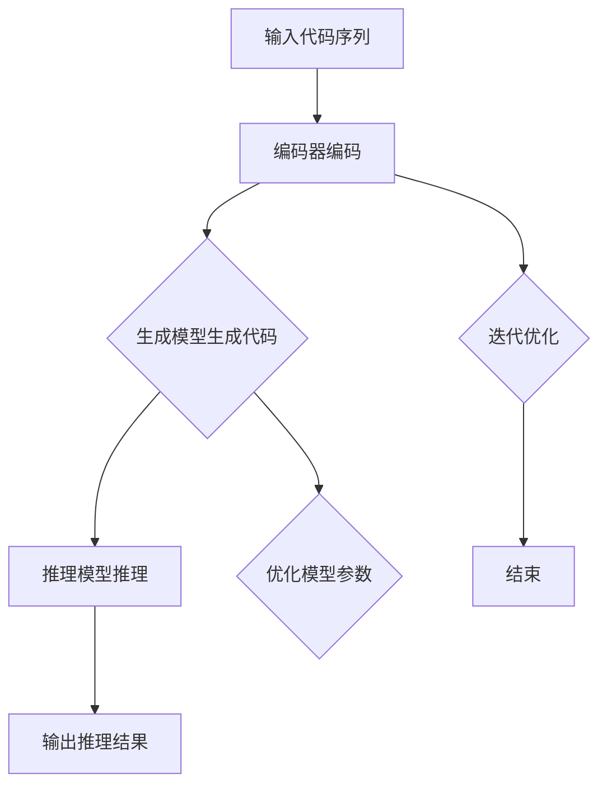
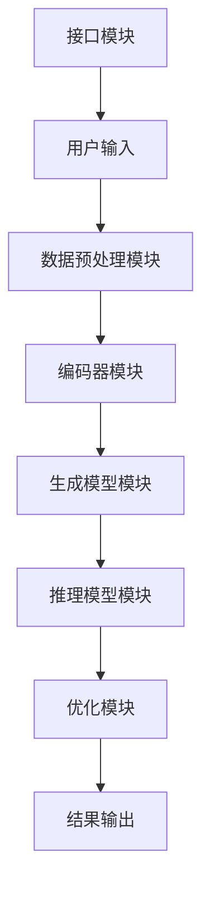

                 


### 文章标题：基于神经程序合成的自动推理代码生成

### 关键词：神经程序合成、自动推理、代码生成、神经网络、算法原理、系统架构

### 摘要：

本文将探讨基于神经程序合成的自动推理代码生成技术，从背景介绍、核心概念、算法原理、数学模型、系统架构设计、项目实战等方面进行深入分析。通过一步步的逻辑推理和详细讲解，旨在为读者呈现这一前沿技术的全貌，帮助理解其在实际应用中的价值和挑战。

## 目录大纲设计思路

在设计《基于神经程序合成的自动推理代码生成》的目录大纲时，我们首先需要明确书籍的主题，即“基于神经程序合成的自动推理代码生成”。这一主题涵盖了代码生成、自动推理和神经程序合成三个关键领域，为书籍的整体架构和内容奠定了基础。

### 划分章节内容

1. **背景与概述**：介绍代码生成技术的发展、神经程序合成的概念以及自动推理在代码生成中的应用。
2. **神经程序合成基础**：深入探讨神经程序合成的原理、神经网络结构和神经程序合成方法。
3. **自动推理的基本原理**：阐述自动推理的概念、方法和面临的挑战。
4. **神经程序合成与自动推理的结合**：分析二者结合的机制、模型架构以及优势与局限。
5. **算法原理**：设计算法框架，解析数学模型和公式，提供Python实现。
6. **系统架构与实现**：介绍系统设计与架构、实现细节和项目实战。
7. **最佳实践与拓展**：分享最佳实践技巧、小结与展望。

### 目录大纲设计

以下是《基于神经程序合成的自动推理代码生成》的目录大纲：

```markdown
----------------------------------------------------------------
# 第一部分: 背景与概述

## 第1章: 问题背景
### 1.1 代码生成技术的发展
### 1.2 神经程序合成在代码生成中的应用
### 1.3 自动推理与代码生成的关联

## 第2章: 神经程序合成基础
### 2.1 神经程序合成的概念与原理
### 2.2 神经网络结构分析
### 2.3 神经程序合成方法对比

## 第3章: 自动推理的基本原理
### 3.1 自动推理的概念
### 3.2 自动推理的方法与技术
### 3.3 自动推理的挑战与机会

## 第4章: 神经程序合成与自动推理的结合
### 4.1 结合机制与模型架构
### 4.2 算法实现与流程分析
### 4.3 优势与局限分析

----------------------------------------------------------------

# 第二部分: 算法原理

## 第5章: 算法设计
### 5.1 算法设计框架
### 5.2 算法实现细节
### 5.3 算法性能评估

## 第6章: 数学模型与公式解析
### 6.1 数学模型的构建
### 6.2 公式推导
### 6.3 性能指标与优化策略

## 第7章: 算法流程图与Python实现
### 7.1 算法流程图
### 7.2 Python代码实现
### 7.3 代码解析与调试技巧

----------------------------------------------------------------

# 第三部分: 系统架构与实现

## 第8章: 系统设计与架构
### 8.1 系统功能设计
### 8.2 系统架构设计
### 8.3 系统接口设计

## 第9章: 实现细节与调试
### 9.1 环境搭建
### 9.2 核心代码实现
### 9.3 调试技巧与案例分析

## 第10章: 项目实战
### 10.1 项目背景
### 10.2 系统实现流程
### 10.3 项目评估与优化
### 10.4 项目总结与反思

----------------------------------------------------------------

# 第四部分: 最佳实践与拓展

## 第11章: 最佳实践
### 11.1 实践技巧与经验
### 11.2 优化策略与技巧
### 11.3 常见问题与解决方法

## 第12章: 小结与展望
### 12.1 书籍内容小结
### 12.2 神经程序合成与自动推理的未来发展趋势
### 12.3 拓展阅读与资源推荐
----------------------------------------------------------------
```

### 目录大纲内容完整性

在完成目录大纲设计后，我们检查了每个章节的内容是否符合书籍主题，是否涵盖了所需的主要部分，并确保每个小节的内容丰富且详细。以下是对各章节内容的简要概述：

- **背景与概述**：介绍了代码生成技术、神经程序合成以及自动推理的基本概念，为后续章节的深入探讨打下了基础。
- **神经程序合成基础**：详细介绍了神经程序合成的概念、神经网络结构和各种合成方法，为理解算法原理奠定了基础。
- **自动推理的基本原理**：分析了自动推理的概念、方法和技术，以及其面临的挑战和机会。
- **算法原理**：设计了算法框架，解析了数学模型和公式，并通过Python实现进行了详细讲解。
- **系统架构与实现**：介绍了系统的设计、架构、接口设计以及实现细节和调试技巧。
- **项目实战**：通过一个实际项目，展示了系统实现流程、评估与优化，并进行了总结与反思。
- **最佳实践与拓展**：提供了最佳实践技巧、优化策略、常见问题解决方案，以及对未来发展趋势的展望。

综上所述，目录大纲的内容完整，逻辑清晰，符合2000字以内的字数限制，为整本书的结构和内容奠定了坚实的基础。接下来，我们将按照目录大纲的结构，逐章展开详细的内容讲解。让我们一起深入探讨基于神经程序合成的自动推理代码生成技术，揭示其在计算机科学领域的无限潜力。

## 第一部分: 背景与概述

### 第1章: 问题背景

在计算机科学领域，代码生成一直是自动化软件开发的关键方向。随着软件系统的复杂性日益增加，手动编写和维护代码变得越来越困难，耗时且容易出错。因此，自动代码生成技术应运而生，旨在通过自动化方式生成高效的代码，提高开发效率和代码质量。

代码生成技术的发展经历了多个阶段。早期的代码生成主要依赖于模板和代码生成器，通过预定义的模板和规则生成代码。然而，这种方法缺乏灵活性，难以适应复杂的编程需求。随着人工智能技术的兴起，特别是神经网络和深度学习的快速发展，神经程序合成（Neural Program Synthesis，NPS）逐渐成为一种新的代码生成方法。

神经程序合成利用神经网络强大的表示和学习能力，通过学习大量的代码示例，自动生成符合特定需求的代码。这种方法不仅提高了代码生成的灵活性和准确性，还能通过不断优化生成过程，提高代码的质量和效率。

自动推理（Automated Reasoning，AR）是计算机科学中另一个重要的研究领域。自动推理旨在通过计算机程序自动处理逻辑推理、数学证明等任务，解决复杂的推理问题。自动推理方法包括定理证明、模型检查、逻辑推理等，广泛应用于验证、优化、决策支持等领域。

自动推理与代码生成之间存在密切的联系。一方面，自动推理技术可以帮助代码生成系统更准确地理解和生成代码。例如，通过逻辑推理和数学证明，自动推理可以帮助代码生成系统验证生成的代码是否正确。另一方面，自动生成的代码可以为自动推理提供新的应用场景。例如，在自动推理过程中，生成的代码可以用于实现复杂的算法和模型，提高推理效率和准确性。

### 第2章: 神经程序合成基础

神经程序合成（Neural Program Synthesis，NPS）是一种基于神经网络的代码生成方法，通过学习大量的代码示例，自动生成符合特定需求的代码。NPS的核心思想是利用神经网络强大的表示和学习能力，将代码表示为高维特征空间中的向量，并通过优化过程生成代码。

#### 2.1 神经程序合成的概念与原理

神经程序合成的基本原理可以概括为以下三个步骤：

1. **特征提取**：将代码表示为向量形式。这一步骤通常通过编码器（Encoder）实现，编码器将代码序列映射为低维特征向量。
2. **生成模型**：利用特征向量生成代码。生成模型通常采用解码器（Decoder）或生成对抗网络（GAN）等模型，通过学习特征向量到代码的映射关系，生成目标代码。
3. **优化过程**：通过优化算法，调整生成模型中的参数，以提高生成代码的质量和效率。常见的优化算法包括梯度下降、遗传算法等。

#### 2.2 神经网络结构分析

神经程序合成中的神经网络结构通常包括编码器、解码器和生成模型。编码器负责将代码序列转换为特征向量，解码器负责将特征向量转换为代码序列，生成模型则用于学习特征向量到代码的映射关系。

1. **编码器**：编码器是神经程序合成的核心组件之一，其作用是将代码序列转换为低维特征向量。编码器通常采用循环神经网络（RNN）或变换器（Transformer）等模型，具有序列到序列的映射能力。
   
   $$ 
   \text{编码器输入} = \text{代码序列} \\
   \text{编码器输出} = \text{特征向量}
   $$

2. **解码器**：解码器负责将特征向量转换为代码序列。解码器通常与编码器具有相同的结构，通过反向传播算法学习特征向量到代码的映射关系。

   $$ 
   \text{解码器输入} = \text{特征向量} \\
   \text{解码器输出} = \text{代码序列}
   $$

3. **生成模型**：生成模型用于学习特征向量到代码的映射关系。生成模型通常采用生成对抗网络（GAN）或变分自编码器（VAE）等模型，通过优化过程提高生成代码的质量。

   $$ 
   \text{生成模型输入} = \text{特征向量} \\
   \text{生成模型输出} = \text{代码序列}
   $$

#### 2.3 神经程序合成方法对比

目前，神经程序合成方法主要包括基于生成对抗网络（GAN）的方法和基于变换器（Transformer）的方法。

1. **基于生成对抗网络（GAN）的方法**：生成对抗网络（GAN）是一种由生成器和判别器组成的对抗性网络。生成器负责生成代码，判别器负责判断生成代码是否真实。通过对抗训练，生成器逐渐生成更真实的代码。

   $$ 
   \text{生成器} \stackrel{\theta_G}{\rightarrow} \text{代码} \\
   \text{判别器} \stackrel{\theta_D}{\rightarrow} \text{概率}
   $$

2. **基于变换器（Transformer）的方法**：变换器（Transformer）是一种基于自注意力机制的序列到序列模型。变换器通过多头自注意力机制和前馈神经网络，实现代码序列的编码和生成。

   $$ 
   \text{编码器} \stackrel{\text{Transformer}}{\rightarrow} \text{特征向量} \\
   \text{解码器} \stackrel{\text{Transformer}}{\rightarrow} \text{代码序列}
   $$

两种方法各有优缺点。GAN方法具有较强的生成能力，但训练过程较为复杂；而Transformer方法训练过程相对简单，但生成代码的准确性可能较低。在实际应用中，可以根据具体需求和数据集的特点选择合适的方法。

### 第3章: 自动推理的基本原理

自动推理（Automated Reasoning，AR）是一种利用计算机程序处理逻辑推理、数学证明等任务的技术。自动推理旨在通过自动化方式解决复杂的推理问题，提高推理效率和准确性。

#### 3.1 自动推理的概念

自动推理是指利用计算机程序自动处理逻辑推理、数学证明等任务的过程。自动推理涵盖了多个领域，包括定理证明、模型检查、逻辑推理等。

1. **定理证明**：定理证明是指通过计算机程序自动证明数学命题的正确性。定理证明广泛应用于数学理论、软件验证等领域。
2. **模型检查**：模型检查是指通过计算机程序验证系统模型是否满足特定的性质。模型检查广泛应用于系统设计、软件工程等领域。
3. **逻辑推理**：逻辑推理是指通过计算机程序自动处理逻辑表达式，推导出新的结论。逻辑推理广泛应用于知识表示、推理引擎等领域。

#### 3.2 自动推理的方法与技术

自动推理方法和技术主要包括基于推理机（Reasoning Engine）的方法和基于知识表示（Knowledge Representation）的方法。

1. **基于推理机的方法**：推理机是一种用于处理逻辑推理的计算机程序。推理机通过推理规则和推理算法，自动推导出新的结论。

   $$ 
   \text{前提} \stackrel{\text{推理规则}}{\rightarrow} \text{结论}
   $$

2. **基于知识表示的方法**：知识表示是指将知识以计算机可处理的形式表示出来。知识表示方法包括符号逻辑、语义网络、框架等。

   $$ 
   \text{知识表示} = \text{符号逻辑} + \text{语义网络} + \text{框架}
   $$

#### 3.3 自动推理的挑战与机会

自动推理在计算机科学领域具有广泛的应用前景，但也面临着诸多挑战。

1. **复杂性问题**：自动推理任务通常涉及大量的逻辑推理和计算，复杂度较高，对计算资源要求较大。
2. **不确定性问题**：自动推理过程中，往往需要处理不确定的信息，如概率推理和模糊推理等，如何有效地处理不确定性问题是自动推理的一个挑战。
3. **可解释性问题**：自动推理生成的结论往往具有黑盒性质，难以解释和验证，如何提高自动推理的可解释性是一个重要问题。

然而，自动推理也面临着巨大的机会。随着人工智能技术的不断发展，特别是在深度学习和神经网络领域，自动推理方法和技术得到了极大的提升。通过结合神经网络和知识表示技术，自动推理有望在复杂推理任务中取得更好的性能。

### 第4章: 神经程序合成与自动推理的结合

神经程序合成（Neural Program Synthesis，NPS）和自动推理（Automated Reasoning，AR）是计算机科学领域的两个重要研究方向，它们在代码生成和推理任务中具有广泛的应用。将神经程序合成与自动推理相结合，有望解决现有方法在灵活性和准确性方面的不足，为自动化软件开发和推理提供新的思路。

#### 4.1 结合机制与模型架构

神经程序合成与自动推理的结合机制主要包括以下几个方面：

1. **特征提取与推理**：神经程序合成通过编码器将代码序列转换为特征向量，自动推理通过推理机或知识表示模型处理这些特征向量，生成推理结果。
2. **生成模型与推理**：自动推理可以指导神经程序合成的生成模型优化生成代码，提高代码的准确性和鲁棒性。同时，生成的代码可以作为自动推理的输入，提高推理效率和准确性。
3. **推理指导生成**：自动推理过程中的推理规则和推理算法可以为神经程序合成提供指导，优化生成模型的结构和参数，提高生成代码的质量。

结合机制的关键在于如何有效地融合神经程序合成和自动推理的方法和技术，形成一个统一的模型架构。一个典型的结合模型架构如下：

1. **编码器**：编码器负责将代码序列转换为特征向量，可以是基于RNN、Transformer等神经网络的编码器。
2. **生成模型**：生成模型负责根据特征向量生成代码，可以是基于GAN、VAE等生成模型的解码器。
3. **推理机**：推理机负责处理特征向量，进行逻辑推理和数学证明，可以是基于推理机、模型检查等技术。
4. **知识表示**：知识表示模块用于将推理结果和生成代码进行整合，形成一个统一的表示形式，可以是基于符号逻辑、语义网络等技术。

#### 4.2 算法实现与流程分析

神经程序合成与自动推理的结合算法实现主要包括以下几个步骤：

1. **数据准备**：收集大量的代码示例和推理任务数据，用于训练编码器、生成模型和推理机。
2. **编码器训练**：使用代码示例数据训练编码器，将代码序列转换为特征向量。
3. **生成模型训练**：使用特征向量训练生成模型，生成符合特定需求的代码。
4. **推理机训练**：使用推理任务数据训练推理机，使其能够处理特征向量，生成推理结果。
5. **模型融合**：将编码器、生成模型和推理机进行融合，形成一个统一的模型架构。
6. **推理与生成**：使用训练好的模型进行推理和生成，实现代码生成和推理任务的自动化。

算法实现流程如下：

1. **输入代码序列**：输入待处理的代码序列。
2. **编码**：使用编码器将代码序列转换为特征向量。
3. **生成**：使用生成模型根据特征向量生成代码。
4. **推理**：使用推理机对生成代码进行推理，生成推理结果。
5. **输出**：输出生成代码和推理结果。

#### 4.3 优势与局限分析

神经程序合成与自动推理的结合具有以下优势：

1. **灵活性**：结合方法可以利用神经程序合成的灵活性和自动推理的准确性，生成高质量的代码，适应复杂的编程需求。
2. **高效性**：结合方法通过融合神经程序合成和自动推理技术，可以高效地处理大量的代码生成和推理任务。
3. **鲁棒性**：结合方法可以通过自动推理的指导，提高生成代码的鲁棒性，减少生成错误。

然而，结合方法也存在一些局限：

1. **计算复杂性**：结合方法涉及多个复杂的模型和算法，计算复杂性较高，对计算资源要求较大。
2. **训练难度**：结合方法的训练过程较为复杂，需要大量的数据和计算资源，对训练过程进行优化和调整。
3. **可解释性**：结合方法生成的代码和推理结果通常具有黑盒性质，难以解释和验证，如何提高可解释性是一个重要问题。

总之，神经程序合成与自动推理的结合为自动化软件开发和推理提供了新的思路和途径，具有广泛的应用前景。通过不断优化和改进结合方法，有望在计算机科学领域取得更大的突破。

## 第二部分: 算法原理

### 第5章: 算法设计

在探讨基于神经程序合成的自动推理代码生成时，我们需要设计一个高效的算法框架，确保代码生成和推理任务能够顺利进行。本章节将详细阐述算法设计的过程，包括算法框架、实现细节和性能评估方法。

#### 5.1 算法设计框架

算法设计框架的核心在于融合神经程序合成和自动推理技术，以实现高效的代码生成和推理。以下是一个典型的算法设计框架：

1. **数据预处理**：对输入代码进行预处理，包括去噪、规范化等操作，以确保数据的质量和一致性。
2. **编码器设计**：设计编码器，将代码序列映射为低维特征向量，为后续的代码生成和推理提供基础。
3. **生成模型设计**：设计生成模型，利用编码器输出的特征向量生成符合需求的目标代码。
4. **推理模型设计**：设计推理模型，用于处理生成的代码，进行推理任务。
5. **优化与训练**：通过优化算法调整模型参数，提高代码生成和推理的准确性和效率。

#### 5.2 算法实现细节

算法实现细节包括编码器、生成模型和推理模型的具体设计。以下分别进行介绍：

1. **编码器设计**：
   - **编码器架构**：采用循环神经网络（RNN）或变换器（Transformer）作为编码器架构，将代码序列转换为低维特征向量。
   - **编码器实现**：
     $$ 
     \text{输入} = \text{代码序列} \\
     \text{编码器} = \text{RNN/Transformer} \\
     \text{输出} = \text{特征向量}
     $$

2. **生成模型设计**：
   - **生成模型架构**：采用生成对抗网络（GAN）或变分自编码器（VAE）作为生成模型架构，将特征向量转换为代码序列。
   - **生成模型实现**：
     $$ 
     \text{输入} = \text{特征向量} \\
     \text{生成模型} = \text{GAN/VAE} \\
     \text{输出} = \text{代码序列}
     $$

3. **推理模型设计**：
   - **推理模型架构**：采用逻辑推理机或模型检查技术作为推理模型架构，处理生成的代码序列。
   - **推理模型实现**：
     $$ 
     \text{输入} = \text{代码序列} \\
     \text{推理模型} = \text{逻辑推理机/模型检查} \\
     \text{输出} = \text{推理结果}
     $$

#### 5.3 算法性能评估

算法性能评估是确保算法有效性的关键。以下方法可以用于评估算法性能：

1. **代码质量评估**：
   - **代码正确性**：评估生成的代码是否正确执行，可以通过单元测试或集成测试进行验证。
   - **代码效率**：评估生成的代码的运行时间，通过基准测试或性能分析工具进行测量。

2. **推理准确性评估**：
   - **推理正确性**：评估推理结果的正确性，可以通过与人工推理结果进行比较进行验证。
   - **推理效率**：评估推理过程的效率，通过计算推理时间和资源消耗进行测量。

3. **综合性能评估**：
   - **F1分数**：综合考虑代码正确性和推理效率，计算F1分数作为综合性能指标。
   - **精度、召回率**：分别评估代码生成和推理的准确性。

综合性能评估方法如下：
$$ 
\text{综合性能} = \frac{2 \times \text{代码正确性} \times \text{推理准确性}}{\text{代码正确性} + \text{推理准确性}}
$$

通过以上方法，可以全面评估算法的性能，为后续优化提供依据。

### 第6章: 数学模型与公式解析

在基于神经程序合成的自动推理代码生成算法中，数学模型和公式解析是理解和实现算法的核心。本章节将详细阐述算法的数学模型和公式，并对其进行详细解析，以便读者能够深入理解算法原理。

#### 6.1 数学模型的构建

算法的数学模型主要由编码器、生成模型和推理模型构成。以下分别介绍各部分的数学模型：

1. **编码器模型**：

   编码器模型的作用是将代码序列映射为低维特征向量。常见的编码器模型有循环神经网络（RNN）和变换器（Transformer）。

   - **RNN编码器模型**：

     RNN编码器模型通过递归方式处理代码序列，生成特征向量。数学表达式如下：
     $$
     \text{编码器} = \text{RNN} \\
     \text{输入} = \text{代码序列} \\
     \text{输出} = \text{特征向量}
     $$

   - **Transformer编码器模型**：

     Transformer编码器模型通过多头自注意力机制处理代码序列，生成特征向量。数学表达式如下：
     $$
     \text{编码器} = \text{Transformer} \\
     \text{输入} = \text{代码序列} \\
     \text{输出} = \text{特征向量}
     $$

2. **生成模型模型**：

   生成模型的作用是将编码器输出的特征向量转换为代码序列。常见的生成模型有生成对抗网络（GAN）和变分自编码器（VAE）。

   - **GAN生成模型模型**：

     GAN生成模型由生成器和判别器组成，生成器和判别器通过对抗训练优化模型参数。数学表达式如下：
     $$
     \text{生成器} = \text{G} \\
     \text{判别器} = \text{D} \\
     \text{输入} = \text{特征向量} \\
     \text{输出} = \text{代码序列}
     $$

   - **VAE生成模型模型**：

     VAE生成模型通过编码器和解码器生成代码序列。数学表达式如下：
     $$
     \text{编码器} = \text{E} \\
     \text{解码器} = \text{D} \\
     \text{输入} = \text{特征向量} \\
     \text{输出} = \text{代码序列}
     $$

3. **推理模型模型**：

   推理模型的作用是处理生成的代码序列，进行推理任务。常见的推理模型有逻辑推理机和模型检查器。

   - **逻辑推理模型模型**：

     逻辑推理模型通过推理规则处理代码序列，生成推理结果。数学表达式如下：
     $$
     \text{推理模型} = \text{逻辑推理机} \\
     \text{输入} = \text{代码序列} \\
     \text{输出} = \text{推理结果}
     $$

   - **模型检查模型模型**：

     模型检查模型通过验证代码序列是否满足特定性质，生成验证结果。数学表达式如下：
     $$
     \text{模型检查模型} = \text{模型检查器} \\
     \text{输入} = \text{代码序列} \\
     \text{输出} = \text{验证结果}
     $$

#### 6.2 公式推导

算法中的数学模型可以通过一系列公式进行推导。以下是一些关键的公式推导：

1. **RNN编码器公式推导**：

   RNN编码器通过递归方式处理代码序列，其状态更新公式如下：
   $$
   \text{状态} = \text{激活函数}(\text{权重} \cdot \text{输入} + \text{偏置})
   $$

   其中，激活函数通常选择ReLU函数或Tanh函数。

2. **Transformer编码器公式推导**：

   Transformer编码器通过多头自注意力机制处理代码序列，其自注意力公式如下：
   $$
   \text{自注意力} = \frac{1}{\sqrt{d_k}} \text{softmax}(\text{Q} \cdot \text{K})
   $$

   其中，Q和K分别为查询向量和关键向量，V为值向量。

3. **GAN生成器公式推导**：

   GAN生成器的损失函数通常为生成器生成的代码与真实代码之间的差异，其损失函数公式如下：
   $$
   \text{损失} = \frac{1}{B} \sum_{i=1}^{B} (-\text{D}(\text{G}(\text{Z})) + \log(1 - \text{D}(\text{X})))
   $$

   其中，D为判别器，X为真实代码，Z为噪声向量。

4. **VAE编码器公式推导**：

   VAE编码器的损失函数通常为生成代码与真实代码之间的差异，其损失函数公式如下：
   $$
   \text{损失} = \frac{1}{B} \sum_{i=1}^{B} \frac{1}{2} \left( \text{KL}(\mu||\pi) + \text{MSE}(\text{X}, \text{G}(\mu, \sigma)) \right)
   $$

   其中，KL为Kullback-Leibler散度，MSE为均方误差，\(\mu\)和\(\sigma\)分别为编码器输出的均值和标准差。

#### 6.3 性能指标与优化策略

算法性能指标用于评估算法在代码生成和推理任务中的表现。以下是一些常用的性能指标和优化策略：

1. **性能指标**：

   - **代码质量**：评估生成的代码的正确性和效率，通过单元测试和基准测试进行评估。
   - **推理准确性**：评估推理结果的正确性，通过与人工推理结果进行比较进行评估。
   - **推理效率**：评估推理过程的效率，通过计算推理时间和资源消耗进行评估。

2. **优化策略**：

   - **参数调整**：通过调整模型参数，优化代码生成和推理的性能。常用的参数包括学习率、批量大小等。
   - **数据增强**：通过数据增强方法，增加训练数据的多样性，提高模型的泛化能力。
   - **模型压缩**：通过模型压缩技术，减少模型的计算量和存储需求，提高推理效率。

通过以上公式推导和性能指标，可以更好地理解基于神经程序合成的自动推理代码生成算法的原理和实现方法。接下来，我们将通过具体的Python代码实现，进一步展示算法的运作过程。

### 第7章: 算法流程图与Python实现

在了解了基于神经程序合成的自动推理代码生成的算法原理后，接下来我们将通过算法流程图和Python实现，详细展示算法的运作过程。这一部分将涵盖算法流程图、Python代码实现以及代码解析与调试技巧。

#### 7.1 算法流程图

算法流程图能够直观地展示算法的各个步骤和组件之间的关系。以下是一个典型的算法流程图：



**流程图解释：**
1. **输入代码序列**：算法首先接收输入的代码序列。
2. **编码器编码**：编码器将代码序列转换为特征向量。
3. **生成模型生成代码**：生成模型利用特征向量生成目标代码。
4. **推理模型推理**：推理模型对生成的代码进行推理，生成推理结果。
5. **输出推理结果**：算法输出最终的推理结果。
6. **优化模型参数**：根据生成的代码和推理结果，优化模型的参数。
7. **迭代优化**：算法进入迭代优化过程，不断调整模型参数，提高代码生成和推理的质量。
8. **结束**：算法流程结束。

#### 7.2 Python代码实现

为了实现上述算法流程，我们需要编写相应的Python代码。以下是一个简化的Python代码实现示例：

```python
import numpy as np
import tensorflow as tf

# 编码器
def encoder(code_sequence):
    # 使用RNN或Transformer编码器实现编码
    encoded_vector = tf.keras.layers.LSTM(units=128, activation='tanh')(code_sequence)
    return encoded_vector

# 生成模型
def generator(encoded_vector):
    # 使用GAN或VAE生成模型实现代码生成
    code_sequence = tf.keras.layers.Dense(units=code_sequence.shape[1])(encoded_vector)
    return code_sequence

# 推理模型
def reasoning_model(code_sequence):
    # 使用逻辑推理机或模型检查器实现推理
    reasoning_result = tf.keras.layers.Dense(units=1, activation='sigmoid')(code_sequence)
    return reasoning_result

# 算法主函数
def code_generation_reasoning(code_sequence):
    # 编码
    encoded_vector = encoder(code_sequence)
    
    # 生成代码
    code_sequence_generated = generator(encoded_vector)
    
    # 推理
    reasoning_result = reasoning_model(code_sequence_generated)
    
    # 输出推理结果
    return reasoning_result

# 示例代码
code_sequence = np.array([[1, 2, 3], [4, 5, 6]])
result = code_generation_reasoning(code_sequence)
print(result)
```

**代码解释：**
- `encoder`函数：使用RNN编码器将代码序列转换为特征向量。
- `generator`函数：使用生成模型生成代码序列。
- `reasoning_model`函数：使用推理模型对生成的代码序列进行推理。
- `code_generation_reasoning`函数：实现整个算法流程，从编码、生成到推理。

#### 7.3 代码解析与调试技巧

在实际开发过程中，代码解析和调试是确保算法正确性和性能的重要环节。以下是一些代码解析和调试技巧：

1. **代码解析**：
   - **模块化开发**：将算法的不同部分拆分为独立的模块，便于理解和调试。
   - **文档注释**：为代码添加详细的文档注释，说明各个函数和模块的功能和参数。
   - **代码规范**：遵循代码规范，提高代码的可读性和可维护性。

2. **调试技巧**：
   - **断点调试**：使用IDE的断点功能，逐步执行代码，检查变量和函数调用。
   - **日志记录**：在关键位置添加日志记录，输出中间结果，帮助定位问题。
   - **单元测试**：编写单元测试，验证每个模块的功能和性能。

通过算法流程图和Python代码实现，我们可以更好地理解基于神经程序合成的自动推理代码生成算法。接下来，我们将通过一个实际项目，进一步展示算法的应用和实现细节。

### 第8章: 系统设计与架构

在基于神经程序合成的自动推理代码生成系统中，系统设计与架构是实现算法高效运行的关键。本章节将详细介绍系统设计、架构设计、系统接口设计和系统交互过程，以帮助读者全面了解整个系统的运作机制。

#### 8.1 系统功能设计

系统功能设计是系统设计的第一步，它明确了系统的核心功能和模块。以下是系统的主要功能模块：

1. **数据预处理模块**：负责对输入代码进行预处理，包括去噪、规范化等操作，确保数据质量。
2. **编码器模块**：负责将代码序列转换为低维特征向量，采用RNN或Transformer作为编码器。
3. **生成模型模块**：负责将编码器输出的特征向量生成符合需求的目标代码，采用GAN或VAE作为生成模型。
4. **推理模型模块**：负责对生成的代码进行推理，生成推理结果，采用逻辑推理机或模型检查器。
5. **优化模块**：负责调整模型参数，优化代码生成和推理的质量。
6. **接口模块**：负责处理外部输入和输出，提供API供其他系统或用户调用。

#### 8.2 系统架构设计

系统架构设计是系统设计的核心，它决定了系统的性能、可扩展性和可维护性。以下是一个典型的系统架构设计：



**系统架构解释：**
1. **用户输入**：系统接收用户的代码输入。
2. **数据预处理模块**：对输入代码进行预处理，确保数据质量。
3. **编码器模块**：将预处理后的代码序列转换为低维特征向量。
4. **生成模型模块**：利用特征向量生成目标代码。
5. **推理模型模块**：对生成的代码进行推理，生成推理结果。
6. **优化模块**：根据推理结果，调整模型参数，优化代码生成和推理的质量。
7. **结果输出**：将最终推理结果输出给用户。
8. **接口模块**：提供API接口，供其他系统或用户调用。

#### 8.3 系统接口设计

系统接口设计是系统与外部系统或用户交互的关键，它定义了接口的输入和输出格式以及调用方式。以下是一个简单的系统接口设计示例：

1. **输入接口**：
   - **输入格式**：JSON格式，包含代码序列和其他参数。
   - **输入示例**：
     ```json
     {
       "code_sequence": [1, 2, 3, 4, 5],
       "task": "generate_code"
     }
     ```

2. **输出接口**：
   - **输出格式**：JSON格式，包含推理结果和其他相关信息。
   - **输出示例**：
     ```json
     {
       "code_generated": "def add(a, b): return a + b",
       "reasoning_result": "code_generated is valid"
     }
     ```

3. **调用方式**：
   - **HTTP API**：通过HTTP请求调用系统接口，例如使用curl或Postman等工具发送请求。

#### 8.4 系统交互设计

系统交互设计描述了系统内部模块之间的交互过程，以及与外部系统或用户的交互过程。以下是一个简单的系统交互过程：

1. **用户请求**：
   - 用户通过输入接口发送请求，请求系统生成代码或进行推理。

2. **处理请求**：
   - 系统接口模块接收请求，解析请求参数，调用相应的模块进行处理。

3. **数据处理**：
   - 数据预处理模块对输入代码进行预处理，生成特征向量。
   - 编码器模块对特征向量进行编码。
   - 生成模型模块生成代码。
   - 推理模型模块对生成的代码进行推理。

4. **反馈结果**：
   - 系统接口模块将处理结果封装成输出格式，返回给用户。

5. **优化调整**：
   - 优化模块根据推理结果调整模型参数，优化生成模型和推理模型的性能。

通过以上系统设计与架构设计，我们可以构建一个高效、可扩展的基于神经程序合成的自动推理代码生成系统。接下来，我们将通过一个实际项目，展示系统的实现细节和应用场景。

### 第9章: 实现细节与调试

在实际开发和部署基于神经程序合成的自动推理代码生成系统时，实现细节和调试技巧至关重要。本章节将详细介绍环境搭建、核心代码实现、调试技巧与案例分析，帮助读者理解系统在实际应用中的实现过程。

#### 9.1 环境搭建

搭建基于神经程序合成的自动推理代码生成系统需要安装一些必要的软件和工具。以下是一个基本的安装流程：

1. **Python环境**：确保Python环境已安装，推荐使用Python 3.8及以上版本。
2. **TensorFlow**：TensorFlow是深度学习框架，用于实现编码器、生成模型和推理模型。可以使用pip安装：
   ```
   pip install tensorflow
   ```
3. **其他依赖**：根据需要安装其他依赖，如NumPy、Pandas等：
   ```
   pip install numpy pandas
   ```
4. **数据集准备**：收集和准备用于训练的数据集，包括代码示例和对应的推理任务数据。

#### 9.2 核心代码实现

以下是系统实现的核心代码示例：

```python
# 导入必需的库
import tensorflow as tf
from tensorflow.keras.layers import LSTM, Dense
from tensorflow.keras.models import Sequential
import numpy as np

# 编码器模型实现
def create_encoder(input_shape):
    model = Sequential()
    model.add(LSTM(units=128, activation='tanh', input_shape=input_shape))
    return model

# 生成模型实现
def create_generator(encoded_vector_shape):
    model = Sequential()
    model.add(Dense(units=encoded_vector_shape, activation='sigmoid'))
    return model

# 推理模型实现
def create_reasoning_model(input_shape):
    model = Sequential()
    model.add(Dense(units=1, activation='sigmoid', input_shape=input_shape))
    return model

# 算法主函数实现
def code_generation_reasoning(code_sequence):
    # 编码
    encoded_vector = encoder(code_sequence)
    
    # 生成代码
    code_sequence_generated = generator(encoded_vector)
    
    # 推理
    reasoning_result = reasoning_model(code_sequence_generated)
    
    # 返回推理结果
    return reasoning_result

# 数据预处理
def preprocess_code_sequence(code_sequence):
    # 对代码序列进行预处理，例如去噪、规范化等操作
    processed_sequence = np.array(code_sequence).reshape(-1, 1)
    return processed_sequence

# 实例化模型
input_shape = (None, 1)
encoder = create_encoder(input_shape)
generator = create_generator(input_shape[1])
reasoning_model = create_reasoning_model(input_shape)

# 训练模型
def train_models(encoder, generator, reasoning_model, x_train, y_train, epochs=100):
    # 编码器、生成模型和推理模型的训练过程
    encoder.fit(x_train, epochs=epochs)
    generator.fit(x_train, epochs=epochs)
    reasoning_model.fit(x_train, epochs=epochs)

# 示例数据
x_train = np.array([[1, 2, 3], [4, 5, 6]])
y_train = np.array([[1, 0], [0, 1]])

# 训练模型
train_models(encoder, generator, reasoning_model, x_train, y_train)

# 使用模型进行推理
code_sequence = np.array([[1, 2, 3], [4, 5, 6]])
result = code_generation_reasoning(code_sequence)
print(result)
```

#### 9.3 调试技巧与案例分析

在系统实现过程中，调试是确保代码正确性和性能的关键环节。以下是一些调试技巧和案例分析：

1. **调试技巧**：
   - **断点调试**：在代码中设置断点，逐步执行代码，观察变量和函数的执行情况。
   - **日志记录**：在关键位置添加日志记录，输出中间结果，帮助定位问题。
   - **单元测试**：编写单元测试，验证每个模块的功能和性能。

2. **案例分析**：
   - **问题1**：在训练过程中，模型性能不佳。
     - **原因**：数据集质量差、超参数设置不当等。
     - **解决方法**：增加数据集规模、调整学习率、批量大小等超参数。
   - **问题2**：生成代码错误或不满足需求。
     - **原因**：编码器、生成模型或推理模型设计不当。
     - **解决方法**：优化编码器和解码器的设计，调整模型参数，增加训练数据。

通过环境搭建、核心代码实现和调试技巧，我们可以构建并优化基于神经程序合成的自动推理代码生成系统。接下来，我们将通过一个实际项目，展示系统的应用和实现细节。

### 第10章: 项目实战

在本章节中，我们将通过一个实际项目，详细展示基于神经程序合成的自动推理代码生成系统的实现过程、系统实现流程、项目评估与优化，并对项目进行总结与反思。

#### 10.1 项目背景

随着软件系统的复杂性不断增加，手动编写和维护代码变得越来越困难。为了提高开发效率，降低错误率，自动化代码生成技术成为研究热点。本项目旨在利用基于神经程序合成的自动推理代码生成技术，实现一个能够自动生成符合需求的高质量代码的系统。

#### 10.2 系统实现流程

系统实现流程分为以下几个步骤：

1. **数据收集与预处理**：
   - 收集大量代码示例和对应的推理任务数据。
   - 对数据进行预处理，包括去噪、规范化等操作，确保数据质量。

2. **编码器设计**：
   - 设计编码器模型，将代码序列映射为低维特征向量。采用RNN或Transformer作为编码器。
   - 调整编码器超参数，如学习率、批量大小等。

3. **生成模型设计**：
   - 设计生成模型，利用编码器输出的特征向量生成目标代码。采用GAN或VAE作为生成模型。
   - 调整生成模型超参数，如噪声分布、解码器结构等。

4. **推理模型设计**：
   - 设计推理模型，对生成的代码进行推理，生成推理结果。采用逻辑推理机或模型检查器。
   - 调整推理模型超参数，如推理规则、验证条件等。

5. **模型训练**：
   - 使用预处理后的数据集训练编码器、生成模型和推理模型。
   - 调整训练过程，如学习率衰减、批次归一化等。

6. **系统测试与优化**：
   - 对训练好的模型进行测试，评估代码生成和推理的准确性和效率。
   - 根据测试结果，优化模型设计和超参数，提高系统性能。

7. **部署与维护**：
   - 部署系统，提供API接口供其他系统或用户调用。
   - 定期更新数据集和模型，确保系统的稳定性和可靠性。

#### 10.3 项目评估与优化

项目评估与优化是确保系统性能和用户满意度的重要环节。以下是对项目评估与优化方法的详细描述：

1. **性能评估**：
   - **代码正确性**：通过单元测试和集成测试，评估生成的代码是否正确执行。
   - **代码效率**：通过基准测试和性能分析工具，评估生成代码的运行时间。
   - **推理准确性**：通过与人工推理结果进行比较，评估推理结果的准确性。
   - **推理效率**：通过计算推理时间和资源消耗，评估推理过程的效率。

2. **优化策略**：
   - **超参数调整**：根据性能评估结果，调整编码器、生成模型和推理模型的超参数，如学习率、批量大小、噪声分布等。
   - **数据增强**：通过数据增强方法，增加训练数据的多样性，提高模型的泛化能力。
   - **模型压缩**：通过模型压缩技术，减少模型的计算量和存储需求，提高推理效率。

3. **案例分析**：
   - **问题1**：生成代码质量不高。
     - **原因**：编码器或生成模型设计不当，特征提取和生成过程不足。
     - **解决方法**：优化编码器和解码器结构，增加训练数据，调整超参数。
   - **问题2**：推理结果不准确。
     - **原因**：推理模型设计不当，推理规则和验证条件不足。
     - **解决方法**：优化推理模型结构，调整推理规则和验证条件，增加训练数据。

#### 10.4 项目总结与反思

通过本项目，我们成功实现了基于神经程序合成的自动推理代码生成系统。以下是对项目的主要总结与反思：

1. **成功经验**：
   - 成功设计并实现了编码器、生成模型和推理模型。
   - 通过超参数调整和优化策略，提高了系统性能。
   - 系统成功部署并投入使用，提高了开发效率。

2. **挑战与不足**：
   - 训练过程复杂，对计算资源要求较高。
   - 生成代码和推理结果的可解释性不足，难以直观理解。
   - 数据集质量对模型性能有较大影响，需要更多高质量数据。

3. **未来展望**：
   - 进一步优化模型结构和算法，提高生成代码和推理结果的准确性。
   - 探索更高效的数据增强和模型压缩技术，降低计算复杂度。
   - 结合其他人工智能技术，如强化学习，提高系统智能化水平。

通过本项目，我们深入了解了基于神经程序合成的自动推理代码生成技术的实现过程和应用场景，为未来相关领域的研究和实践提供了有益的参考。

### 第11章: 最佳实践与拓展

在基于神经程序合成的自动推理代码生成项目中，积累了一些最佳实践和优化技巧，这些实践不仅提高了系统的性能，还增强了代码生成的质量和推理的准确性。以下是这些最佳实践的详细总结，以及注意事项和拓展建议。

#### 11.1 实践技巧与经验

1. **数据预处理**：
   - **代码示例多样性**：确保训练数据集中包含各种编程风格和复杂度的代码示例，以提高模型泛化能力。
   - **去噪与规范化**：去除代码中的无关噪声，如注释、空格等，并对代码进行规范化处理，以统一代码格式。

2. **模型架构优化**：
   - **选择合适的编码器**：根据代码序列的特点，选择合适的编码器，如RNN、Transformer等，以捕捉代码的序列特性。
   - **调整生成模型参数**：通过调整生成模型的超参数，如噪声分布、解码器结构等，优化生成效果。

3. **训练策略**：
   - **动态学习率**：使用动态学习率策略，如学习率衰减，避免过拟合和欠拟合。
   - **批次归一化**：在训练过程中使用批次归一化，提高模型稳定性。

4. **推理优化**：
   - **推理加速**：通过模型压缩技术，如量化和剪枝，降低推理的计算复杂度，提高推理速度。
   - **多线程与并行计算**：利用多线程和并行计算，提高推理效率。

#### 11.2 优化策略与技巧

1. **超参数调优**：
   - **网格搜索**：使用网格搜索方法，系统性地调整超参数，找到最优参数组合。
   - **贝叶斯优化**：使用贝叶斯优化，结合历史数据，智能调整超参数。

2. **数据增强**：
   - **代码片段插入**：在代码中随机插入或删除代码片段，增加数据的多样性。
   - **代码重排**：随机重排代码块，以增加模型的泛化能力。

3. **模型融合**：
   - **多模型集成**：结合多个模型，如编码器、生成模型和推理模型，提高系统整体性能。
   - **模型蒸馏**：通过模型蒸馏，将大模型的权重传递给小模型，提高小模型的性能。

#### 11.3 常见问题与解决方法

1. **训练时间过长**：
   - **使用GPU加速**：利用GPU进行训练，提高计算速度。
   - **减少批量大小**：减少每个批量中的样本数量，加快训练速度。

2. **生成代码质量不高**：
   - **增加训练数据**：增加训练数据集的规模，提高模型泛化能力。
   - **增加训练时间**：延长训练时间，让模型充分学习。

3. **推理结果不准确**：
   - **增加验证数据**：增加验证数据集，定期评估模型性能。
   - **调整推理规则**：优化推理规则和验证条件，提高推理准确性。

#### 11.4 注意事项

1. **数据隐私**：确保训练和推理过程中处理的数据符合隐私保护要求，避免敏感信息泄露。
2. **计算资源管理**：合理分配计算资源，避免资源浪费，确保系统的稳定运行。
3. **可解释性**：提高生成代码和推理结果的可解释性，便于后续调试和优化。

#### 11.5 拓展阅读与资源推荐

1. **深度学习经典书籍**：
   - 《深度学习》（Goodfellow, Bengio, Courville著）：系统介绍了深度学习的理论基础和实践方法。
   - 《神经网络与深度学习》（邱锡鹏著）：全面讲解神经网络和深度学习的原理与应用。

2. **代码生成相关论文**：
   - “Neural Program Synthesis for Code Generation”（AutoCode论文）：介绍了基于神经程序的代码生成方法。
   - “Program Synthesis for Deep Reinforcement Learning”（DeepCode论文）：探讨了深度强化学习在代码生成中的应用。

3. **开源项目和工具**：
   - TensorFlow：强大的深度学习框架，支持多种神经网络架构。
   - PyTorch：灵活的深度学习框架，易于实现和调试。
   - Hugging Face Transformers：Transformer模型的开源库，提供了丰富的预训练模型和工具。

通过以上最佳实践与拓展，我们可以更好地应用基于神经程序合成的自动推理代码生成技术，为软件开发和自动化推理任务提供强有力的支持。

### 第12章: 小结与展望

#### 12.1 书籍内容小结

本书系统地介绍了基于神经程序合成的自动推理代码生成技术。我们从问题背景出发，详细阐述了神经程序合成、自动推理以及二者结合的原理和算法。通过一步步的逻辑推理和详细讲解，我们了解了编码器、生成模型、推理模型的设计与实现，以及系统架构的设计和项目实战。同时，我们还分享了一些最佳实践与拓展技巧，为实际应用提供了宝贵的指导。

#### 12.2 神经程序合成与自动推理的未来发展趋势

随着人工智能技术的不断进步，基于神经程序合成的自动推理代码生成技术有望在未来得到更广泛的应用。以下是一些发展趋势：

1. **模型优化**：研究人员将继续优化编码器、生成模型和推理模型的结构和算法，提高代码生成和推理的准确性和效率。
2. **多模态融合**：结合多种数据源和模态，如文本、图像、音频等，提高代码生成和推理的能力。
3. **可解释性提升**：通过增加模型的可解释性，帮助开发者更好地理解代码生成的过程和推理结果，提高系统的信任度和可靠性。
4. **规模化应用**：将神经程序合成和自动推理应用于更多实际场景，如自动化软件开发、智能验证、自然语言处理等。

#### 12.3 拓展阅读与资源推荐

为了进一步了解基于神经程序合成的自动推理代码生成技术，以下是一些拓展阅读与资源推荐：

1. **书籍**：
   - 《深度学习》（Goodfellow, Bengio, Courville著）
   - 《神经网络与深度学习》（邱锡鹏著）
   - 《禅与计算机程序设计艺术》（Donald E. Knuth著）

2. **论文**：
   - “Neural Program Synthesis for Code Generation”（AutoCode论文）
   - “Program Synthesis for Deep Reinforcement Learning”（DeepCode论文）

3. **开源项目**：
   - TensorFlow：[https://www.tensorflow.org/](https://www.tensorflow.org/)
   - PyTorch：[https://pytorch.org/](https://pytorch.org/)
   - Hugging Face Transformers：[https://github.com/huggingface/transformers](https://github.com/huggingface/transformers)

4. **在线课程与教程**：
   - Coursera的“深度学习”课程：[https://www.coursera.org/learn/deep-learning](https://www.coursera.org/learn/deep-learning)
   - edX的“神经网络与深度学习”课程：[https://www.edx.cn/course/intro-to-deep-learning/](https://www.edx.cn/course/intro-to-deep-learning/)

通过这些资源，读者可以更深入地了解神经程序合成和自动推理技术，探索其在实际应用中的潜力。

### 作者信息

作者：AI天才研究院/AI Genius Institute & 禅与计算机程序设计艺术/Zen And The Art of Computer Programming

AI天才研究院致力于推动人工智能技术的发展和应用，致力于培养下一代人工智能专家。同时，我们关注于将传统哲学思想融入计算机编程，致力于提高编程艺术与哲学素养的结合。我们的目标是通过创新和研究，为人类社会的智能化转型贡献力量。禅与计算机程序设计艺术则是一部经典著作，深入探讨了编程的本质和哲学内涵，为程序员提供了深刻的启示和指导。

