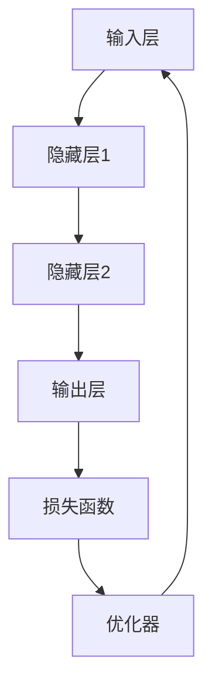
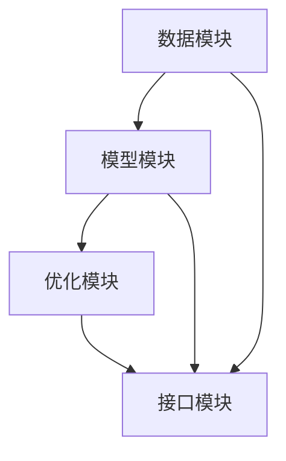
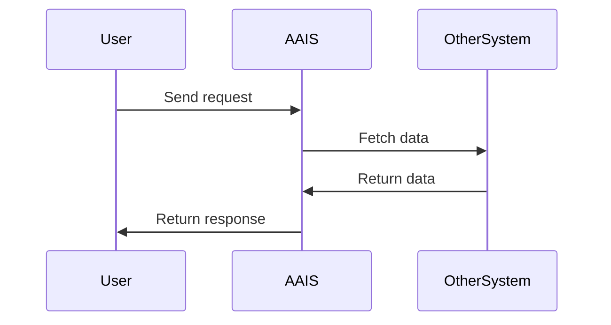

                 

### 关键词

- 神经程序归纳
- 自动算法改进系统
- 神经网络
- 数学模型
- 算法优化
- 系统架构设计

### 摘要

本文探讨了基于神经程序归纳的自动算法改进系统。首先，我们介绍了神经程序归纳的基本概念和其在自动算法改进系统中的应用。接着，详细阐述了自动算法改进系统的数学模型和算法原理，并通过Python源代码和Mermaid流程图进行了说明。随后，我们分析了系统架构设计，包括系统场景、功能设计、架构设计和接口设计。最后，通过一个实际项目，展示了系统的核心实现和代码解读，并结合案例进行了深入剖析。本文旨在为读者提供一个全面而深入的理解，助力其在实际应用中掌握神经程序归纳和自动算法改进系统的设计和实现。

## 目录大纲设计思路

为了设计出《基于神经程序归纳的自动算法改进系统》这本书的完整目录大纲，我们需要按照以下步骤进行：

1. **背景介绍**：首先简要介绍神经程序归纳和自动算法改进系统的基本概念，为后续章节提供基础。
    - 神经程序归纳：一种基于神经网络的编程范式，能够从数据中学习并生成新的代码。
    - 自动算法改进系统：利用神经程序归纳技术，自动寻找优化算法的过程。

2. **核心概念与联系**：在第二部分，我们需要明确书中的核心概念，并使用表格和Mermaid流程图展示概念之间的关系。
    - 核心概念包括：神经网络、神经程序、归纳、优化算法、自动算法改进系统等。
    - 通过表格对比不同概念的定义、属性和特点，通过Mermaid流程图展示概念之间的联系和交互。

3. **算法原理讲解**：第三部分将深入讲解自动算法改进系统的算法原理，包括数学模型和公式，并通过Python源代码和Mermaid流程图进行详细说明。
    - 详细介绍算法的输入、输出、过程和效果。
    - 使用Mermaid流程图展示算法的执行流程和步骤。
    - 通过Python源代码实现，帮助读者理解算法的实现细节。

4. **系统分析与架构设计方案**：在这一部分，我们将介绍系统场景、功能设计、架构设计和接口设计，并通过Mermaid类图和架构图、序列图进行展示。
    - 系统场景介绍：阐述系统需要解决的问题和目标。
    - 功能设计：详细描述系统的各个功能模块和业务流程。
    - 架构设计：展示系统的整体架构和模块关系。
    - 接口设计：说明系统的接口规范和交互方式。

5. **项目实战**：最后一部分将通过一个实际项目，展示系统核心实现源代码，并对代码进行解读与分析，同时提供案例分析和项目小结。
    - 环境安装与配置：介绍项目所需的开发和运行环境。
    - 系统核心实现源代码：提供项目的核心代码实现，并进行详细解读。
    - 代码应用解读与分析：分析代码的执行流程和效果，提出优化建议。
    - 实际案例分析：通过具体案例展示系统的应用效果和实际价值。
    - 项目小结：总结项目的关键经验和教训。

6. **最佳实践 tips、小结、注意事项、拓展阅读**：在附录部分，我们将提供一些最佳实践建议，总结书中的关键知识点，提醒读者注意的重要事项，并推荐一些拓展阅读资源。
    - 最佳实践 tips：分享在实际应用中的经验和技巧。
    - 小结：总结书中的核心内容和主要观点。
    - 注意事项：提醒读者注意的重要问题和注意事项。
    - 拓展阅读：推荐相关领域的深入阅读资源，帮助读者进一步拓展知识。

### 目录大纲

**第一部分：神经程序归纳基础**

**第1章：神经程序归纳概述**

1.1 神经程序归纳的基本概念

- 神经程序的定义
- 归纳过程的基本原理
- 神经程序归纳的优势

1.2 神经程序归纳的应用领域

- 自动算法改进系统
- 机器学习优化
- 智能系统设计

1.3 神经程序归纳的核心概念联系

- 神经网络与归纳
- 神经程序与算法
- 归纳与优化

1.4 本章小结

**第二部分：自动算法改进系统原理与设计**

**第2章：自动算法改进系统的数学模型**

2.1 自动算法改进系统概述

- 算法改进的目标
- 算法改进的方法
- 算法改进的挑战

2.2 自动算法改进系统的数学模型

- 神经程序优化算法
- 模型参数调整策略
- 模型评估与选择

2.3 自动算法改进系统的算法原理讲解

- 神经程序优化算法的Mermaid流程图
- Python源代码实现
- 算法原理的数学模型与公式
- 举例说明

2.4 本章小结

**第三部分：系统架构与设计**

**第3章：自动算法改进系统的架构设计**

3.1 系统场景介绍

- 算法改进的实际需求
- 系统的整体架构设计目标

3.2 系统功能设计

- 功能模块划分
- 领域模型Mermaid类图

3.3 系统架构设计

- 总体架构设计
- 架构图与Mermaid架构图

3.4 系统接口设计

- 接口功能描述
- 接口设计原则
- Mermaid序列图

3.5 本章小结

**第四部分：项目实战**

**第4章：基于神经程序归纳的自动算法改进系统项目实战**

4.1 环境安装与配置

- 操作系统要求
- 环境变量配置
- 软件包安装

4.2 系统核心实现源代码

- 系统核心代码结构
- 主要模块功能
- Python源代码示例

4.3 代码应用解读与分析

- 源代码解读
- 算法实现细节
- 代码优化建议

4.4 实际案例分析

- 案例背景
- 案例分析
- 案例总结

4.5 项目小结

**第五部分：最佳实践与总结**

**第5章：最佳实践与总结**

5.1 最佳实践 tips

- 神经程序归纳的实用技巧
- 自动算法改进的实践经验
- 系统设计与优化策略

5.2 小结

- 书中关键知识点的总结
- 神经程序归纳与自动算法改进的发展趋势

5.3 注意事项

- 使用神经程序归纳和自动算法改进系统的注意事项
- 可能遇到的问题和解决方案

5.4 拓展阅读

- 推荐进一步阅读的相关资源

---

通过以上目录大纲的设计，我们可以看到本书的结构紧凑、逻辑清晰，从基础到实践，再到总结，全面涵盖了基于神经程序归纳的自动算法改进系统的各个方面，为读者提供了一个系统而深入的学习路径。接下来，我们将逐一展开每个章节的内容，让读者能够逐步掌握这一先进技术。接下来，我们将深入探讨神经程序归纳的基本概念和其在自动算法改进系统中的应用，为后续内容打下坚实的基础。

## 第1章：神经程序归纳概述

### 1.1 神经程序归纳的基本概念

神经程序归纳（Neural Program Induction）是一种基于神经网络的编程范式，其核心思想是通过训练神经网络，使其能够自动从数据中学习并生成新的代码。神经程序归纳起源于机器学习和计算机科学领域，近年来在自动算法改进系统、代码生成、软件工程等领域展现出巨大的潜力和应用价值。

首先，我们来看一下什么是神经程序。神经程序是一类特殊的程序，其设计灵感来源于生物神经系统。与传统程序不同，神经程序通过神经网络来模拟和执行任务。神经网络由一系列的神经元（节点）和连接（边）组成，每个神经元可以接收输入信号，并通过激活函数产生输出信号。通过调整连接权重，神经网络能够学习到输入和输出之间的关系，从而实现特定的任务。

接下来，我们详细解释一下归纳过程的基本原理。归纳是一种从具体实例中提取一般规律的方法。在神经程序归纳中，归纳过程包括以下几个步骤：

1. **数据收集**：收集与任务相关的数据集，这些数据可以是训练样本、测试样本或者真实世界的输入输出数据。

2. **特征提取**：从数据中提取关键特征，这些特征将用于训练神经网络。特征提取是神经网络学习的重要步骤，直接影响到神经网络的性能。

3. **模型训练**：使用训练数据集，通过反向传播算法调整神经网络中的连接权重，使得神经网络能够准确预测新的输入数据。

4. **模型评估**：使用测试数据集评估神经网络的性能，包括准确率、召回率、F1值等指标。根据评估结果，可以进一步调整模型参数，优化神经网络。

5. **代码生成**：通过训练好的神经网络，将新的输入数据转换为相应的代码。这个过程可以是自动化的，也可以是半自动化的，具体取决于应用场景。

神经程序归纳的优势在于其能够从数据中自动学习和优化算法，从而减少人工干预和调试的时间。以下是神经程序归纳的几个主要优势：

1. **自动化算法改进**：神经程序归纳可以自动寻找优化算法的过程，无需人工干预。这使得算法改进过程更加高效，适用于大规模的数据集。

2. **适应性强**：神经程序归纳可以处理各种不同类型的数据和任务，具有广泛的适用性。

3. **易于实现**：神经网络的设计和实现相对简单，可以通过现有的机器学习框架（如TensorFlow、PyTorch等）快速搭建和训练。

4. **提高开发效率**：神经程序归纳可以减少编码和调试的时间，提高开发效率。

### 1.2 神经程序归纳的应用领域

神经程序归纳的应用领域非常广泛，以下是几个主要的领域：

1. **自动算法改进系统**：自动算法改进系统是神经程序归纳最直接的应用领域。通过神经程序归纳，系统能够自动寻找并优化算法，提高算法的效率和准确性。例如，在数据分析、机器学习、自然语言处理等领域，自动算法改进系统可以帮助开发者快速找到最优的算法参数。

2. **机器学习优化**：神经程序归纳可以用于优化机器学习算法的性能。通过训练神经网络，可以调整算法的参数，使得算法能够在不同的数据集和任务上取得更好的效果。

3. **智能系统设计**：神经程序归纳可以用于智能系统的设计和实现。例如，在自动驾驶、机器人控制、智能家居等领域，神经程序归纳可以帮助设计更加智能和高效的系统。

4. **代码生成**：神经程序归纳可以用于自动生成代码。通过训练神经网络，可以将自然语言描述转换为相应的代码，从而减少人工编码的工作量。

5. **软件工程**：神经程序归纳可以用于软件工程中的代码优化、自动化测试和代码重构。通过神经程序归纳，可以自动识别代码中的问题，并提出优化建议。

### 1.3 神经程序归纳的核心概念联系

为了更好地理解神经程序归纳，我们需要了解与之相关的几个核心概念，包括神经网络、神经程序、归纳和优化算法。

1. **神经网络与归纳**：神经网络是神经程序的核心组成部分，其通过学习输入和输出之间的关系，实现数据的自动归纳。神经网络的学习过程类似于人类的思维过程，可以通过大量的训练数据来调整神经网络的权重，使其能够准确预测新的输入数据。

2. **神经程序与算法**：神经程序是一种特殊的算法，其通过神经网络来实现任务。与传统算法不同，神经程序具有自适应性，能够根据不同的数据和任务自动调整自己的结构和参数。

3. **归纳与优化**：归纳是一种从具体实例中提取一般规律的方法。在神经程序归纳中，归纳过程包括数据收集、特征提取、模型训练、模型评估和代码生成等步骤。优化算法则是在归纳过程中使用的一种技术，其目的是通过调整模型参数，使得神经网络能够更好地拟合数据，提高预测准确性。

### 1.4 本章小结

本章介绍了神经程序归纳的基本概念和其在自动算法改进系统中的应用。通过神经程序归纳，我们能够从数据中自动学习和优化算法，提高系统的效率和准确性。本章的核心内容为后续章节的深入探讨奠定了基础，包括算法原理讲解、系统架构设计和项目实战等。

在接下来的章节中，我们将继续深入探讨自动算法改进系统的数学模型和算法原理，帮助读者更好地理解这一先进技术的本质和应用。

## 第2章：自动算法改进系统的数学模型

### 2.1 自动算法改进系统概述

自动算法改进系统（Automatic Algorithm Improvement System）是利用人工智能和机器学习技术，对现有算法进行自动优化和改进的一种系统。这种系统通过分析大量数据，自动调整算法参数，寻找最优解，从而提高算法的性能和效率。自动算法改进系统的核心目标是通过算法的自动优化，减少人工干预，提高算法的适应性和鲁棒性。

#### 2.1.1 算法改进的目标

自动算法改进系统的目标主要包括以下几个方面：

1. **性能优化**：通过自动调整算法参数，提高算法的执行效率和计算速度，使得算法能够在更短的时间内完成计算任务。

2. **准确性提升**：通过算法优化，提高算法对数据的拟合程度，减少错误率和偏差，从而提高算法的准确性。

3. **适应性强**：自动算法改进系统能够适应不同类型的数据和任务，无需手动调整参数，从而提高算法的通用性和适应性。

4. **降低成本**：自动算法改进系统减少了人工干预的需求，从而降低了人力成本和时间成本。

#### 2.1.2 算法改进的方法

自动算法改进系统通常采用以下几种方法：

1. **机器学习优化**：通过机器学习技术，建立模型，预测算法的最佳参数配置，从而实现算法的自动优化。

2. **遗传算法**：遗传算法是一种基于自然进化的优化算法，通过模拟自然选择过程，不断迭代优化算法参数。

3. **粒子群优化**：粒子群优化算法是一种基于群体智能的优化算法，通过模拟鸟群或鱼群的社会行为，实现算法参数的优化。

4. **神经网络优化**：利用神经网络，自动学习算法的优化路径，从而调整算法参数。

#### 2.1.3 算法改进的挑战

尽管自动算法改进系统具有巨大的潜力，但在实际应用中仍然面临着一系列挑战：

1. **数据质量**：自动算法改进系统依赖于大量高质量的数据，数据的质量直接影响到算法的优化效果。

2. **计算资源**：算法优化过程需要大量的计算资源，特别是在处理大规模数据时，计算成本较高。

3. **模型可解释性**：自动算法改进系统通常采用复杂的模型，这些模型往往缺乏可解释性，难以理解其优化过程和原理。

4. **鲁棒性**：自动算法改进系统需要在各种不同的数据集和任务上表现稳定，具有一定的鲁棒性。

### 2.2 自动算法改进系统的数学模型

自动算法改进系统的数学模型是理解和设计该系统的基础。该模型通常包括以下几个关键组成部分：

#### 2.2.1 神经程序优化算法

神经程序优化算法是自动算法改进系统的核心。它通过神经网络模型，自动调整算法参数，寻找最优解。以下是神经程序优化算法的基本组成部分：

1. **输入层**：输入层接收原始数据，包括特征值和标签。

2. **隐藏层**：隐藏层通过一系列的神经元进行特征提取和变换，每个神经元通常使用非线性激活函数。

3. **输出层**：输出层生成算法的参数预测值，这些值将用于调整算法的实际参数。

4. **损失函数**：损失函数用于评估算法参数的预测效果，常见的损失函数包括均方误差（MSE）、交叉熵等。

5. **优化器**：优化器用于更新神经网络的参数，常见的优化器包括梯度下降（GD）、随机梯度下降（SGD）等。

#### 2.2.2 模型参数调整策略

模型参数调整策略是神经程序优化算法的重要组成部分。以下是一些常用的参数调整策略：

1. **批量大小**：批量大小影响模型的训练效率，批量大小越大，模型的收敛速度越快，但计算成本越高。

2. **学习率**：学习率影响模型参数的更新速度，学习率过大可能导致模型无法收敛，学习率过小则收敛速度较慢。

3. **正则化**：正则化用于防止模型过拟合，常见的正则化方法包括L1正则化、L2正则化等。

4. **激活函数**：激活函数的选择影响模型的非线性变换能力，常见的激活函数包括Sigmoid、ReLU等。

#### 2.2.3 模型评估与选择

模型评估与选择是自动算法改进系统的关键步骤。以下是一些常用的评估指标和选择方法：

1. **评估指标**：常见的评估指标包括准确率、召回率、F1值等。不同的评估指标适用于不同的任务和数据集。

2. **交叉验证**：交叉验证是一种评估模型性能的方法，通过将数据集划分为训练集和验证集，多次训练和验证，评估模型的稳定性和泛化能力。

3. **网格搜索**：网格搜索是一种超参数优化方法，通过遍历所有可能的超参数组合，选择最优的超参数配置。

4. **贝叶斯优化**：贝叶斯优化是一种基于概率模型的超参数优化方法，通过构建概率模型，自动调整超参数。

### 2.3 自动算法改进系统的算法原理讲解

为了深入理解自动算法改进系统的算法原理，我们通过一个简单的示例来说明神经程序优化算法的工作流程。

#### 2.3.1 神经程序优化算法的Mermaid流程图



在这个流程图中，输入层接收原始数据，通过隐藏层进行特征提取和变换，输出层生成算法参数预测值。损失函数用于评估预测效果，优化器通过更新参数，使得预测效果不断改善。

#### 2.3.2 Python源代码实现

```python
import tensorflow as tf

# 定义输入层
inputs = tf.keras.layers.Input(shape=(n_features,))

# 定义隐藏层
hidden1 = tf.keras.layers.Dense(units=64, activation='relu')(inputs)
hidden2 = tf.keras.layers.Dense(units=32, activation='relu')(hidden1)

# 定义输出层
outputs = tf.keras.layers.Dense(units=n_classes, activation='softmax')(hidden2)

# 定义模型
model = tf.keras.Model(inputs=inputs, outputs=outputs)

# 编写损失函数和优化器
loss_fn = tf.keras.losses.CategoricalCrossentropy()
optimizer = tf.keras.optimizers.Adam()

# 编写训练过程
for epoch in range(n_epochs):
    # 训练模型
    with tf.GradientTape() as tape:
        predictions = model(inputs, training=True)
        loss = loss_fn(labels, predictions)
    
    # 计算梯度
    gradients = tape.gradient(loss, model.trainable_variables)
    
    # 更新参数
    optimizer.apply_gradients(zip(gradients, model.trainable_variables))
    
    # 打印训练信息
    print(f"Epoch {epoch+1}, Loss: {loss.numpy()}")

# 评估模型
test_loss = model.evaluate(test_data, test_labels, verbose=2)
print(f"Test Loss: {test_loss}")
```

在这个示例中，我们使用了TensorFlow框架来搭建和训练神经网络。首先定义输入层和隐藏层，然后定义输出层。接下来，编写损失函数和优化器，用于评估模型和更新参数。最后，通过循环执行训练过程，并打印训练信息。

#### 2.3.3 算法原理的数学模型与公式

为了更好地理解算法原理，我们使用LaTeX格式给出相关的数学模型和公式：

$$
y = \text{softmax}(\text{W}^T \text{X} + \text{b})
$$

其中，\( \text{X} \) 是输入数据，\( \text{W} \) 是权重矩阵，\( \text{b} \) 是偏置项。\( \text{softmax} \) 函数将输出转换为概率分布。

损失函数通常使用交叉熵（Categorical Crossentropy）：

$$
\text{loss} = -\frac{1}{N} \sum_{i=1}^{N} y_i \log(y_i)
$$

其中，\( y_i \) 是预测的概率分布，\( y_i \) 是真实的标签。

优化器使用梯度下降（Gradient Descent）：

$$
\text{W} \leftarrow \text{W} - \alpha \cdot \frac{\partial \text{loss}}{\partial \text{W}}
$$

其中，\( \alpha \) 是学习率，\( \frac{\partial \text{loss}}{\partial \text{W}} \) 是权重矩阵的梯度。

#### 2.3.4 举例说明

假设我们有一个分类问题，输入数据是 \( 1000 \) 维的特征向量，需要将其分类为 \( 10 \) 个不同的类别。我们可以使用神经程序优化算法来寻找最佳的分类模型。

1. **数据准备**：首先收集和预处理 \( 1000 \) 个样本的数据集，每个样本包括特征向量和类别标签。

2. **模型训练**：使用 \( 800 \) 个样本进行训练，定义输入层、隐藏层和输出层，使用交叉熵作为损失函数，使用Adam优化器进行训练。

3. **模型评估**：使用剩余的 \( 200 \) 个样本进行测试，评估模型的准确率和召回率。

4. **模型优化**：根据测试结果，调整模型参数，如学习率和隐藏层节点数，继续训练和评估，直到找到最优的模型。

通过这个简单的例子，我们可以看到神经程序优化算法在自动算法改进系统中的应用。在实际应用中，可以根据具体问题和数据集，调整算法的参数和架构，以实现最佳的优化效果。

### 2.4 本章小结

本章介绍了自动算法改进系统的数学模型，包括神经程序优化算法的基本原理、模型参数调整策略、模型评估与选择方法。通过详细的示例和Python源代码实现，我们深入理解了神经程序优化算法的执行流程和效果。下一章将深入探讨自动算法改进系统的架构设计，包括系统场景介绍、功能设计、架构设计和接口设计，为读者提供一个全面而深入的了解。

## 第3章：自动算法改进系统的架构设计

### 3.1 系统场景介绍

自动算法改进系统（AAIS）旨在通过机器学习和神经科学的方法，对现有的算法进行优化，提高其效率和准确性。在实际应用中，AAIS可以应用于多种场景，如金融数据分析、医疗诊断、自动驾驶和智能推荐系统等。以下是系统应用的一些具体场景：

#### 3.1.1 金融数据分析

在金融领域，AAIS可以用于股票市场预测、风险管理和信贷评分。通过分析历史交易数据，AAIS能够识别出潜在的市场趋势和风险因素，从而为投资者提供更准确的决策支持。

#### 3.1.2 医疗诊断

在医疗领域，AAIS可以用于疾病诊断和治疗方案推荐。通过对大量医学图像和患者数据进行分析，AAIS能够帮助医生更准确地诊断疾病，并提供个性化的治疗方案。

#### 3.1.3 自动驾驶

在自动驾驶领域，AAIS可以用于优化驾驶策略和提高行驶安全性。通过分析道路环境、车辆状态和驾驶行为，AAIS能够实时调整驾驶参数，提高自动驾驶的稳定性和安全性。

#### 3.1.4 智能推荐系统

在电子商务和社交媒体领域，AAIS可以用于个性化推荐系统。通过分析用户的兴趣和行为数据，AAIS能够为用户推荐相关的商品和服务，从而提高用户满意度和转化率。

### 3.2 系统功能设计

自动算法改进系统的主要功能包括数据预处理、模型训练、模型评估和算法优化。以下是各个功能模块的详细介绍：

#### 3.2.1 数据预处理

数据预处理是自动算法改进系统的第一步。其任务包括数据清洗、数据转换和数据归一化。通过数据预处理，系统能够确保输入数据的质量和一致性，为后续的模型训练和评估提供可靠的基础。

#### 3.2.2 模型训练

模型训练是自动算法改进系统的核心功能。通过使用机器学习和深度学习技术，系统能够从大量数据中自动提取特征，并训练出高质量的模型。模型训练过程包括数据读取、模型初始化、前向传播、反向传播和参数更新等步骤。

#### 3.2.3 模型评估

模型评估是验证模型性能和效果的重要环节。通过使用各种评估指标（如准确率、召回率、F1值等），系统能够客观地评估模型的性能，并识别出潜在的问题和改进空间。

#### 3.2.4 算法优化

算法优化是自动算法改进系统的最终目标。通过分析模型评估结果，系统能够自动调整算法参数，寻找最优的模型配置。算法优化过程包括参数搜索、模型评估和参数调整等步骤。

### 3.3 系统架构设计

自动算法改进系统的架构设计是确保系统高效、可靠和可扩展的关键。以下是系统架构的总体设计和各个模块的详细描述：

#### 3.3.1 总体架构设计

自动算法改进系统的总体架构可以分为以下几个主要模块：

1. **数据模块**：负责数据收集、清洗和预处理。
2. **模型模块**：负责模型训练、评估和优化。
3. **优化模块**：负责算法参数的搜索和调整。
4. **接口模块**：负责系统与其他系统的集成和交互。

#### 3.3.2 架构图与Mermaid架构图

以下是一个简单的Mermaid架构图，展示了自动算法改进系统的总体架构：



在这个架构图中，数据模块负责处理输入数据，包括数据收集、清洗和预处理。模型模块负责模型训练、评估和优化。优化模块负责算法参数的搜索和调整。接口模块负责系统与其他系统的集成和交互。

#### 3.3.3 系统接口设计

系统接口设计是自动算法改进系统与其他系统进行数据交换和功能调用的重要环节。以下是系统接口设计的主要原则和组件：

1. **API设计**：系统提供一组API，用于与其他系统进行数据交换和功能调用。API设计应遵循RESTful风格，确保接口的简洁和易用性。

2. **数据格式**：系统采用标准的数据格式（如JSON、XML等），确保数据在不同系统之间的兼容性和可读性。

3. **安全性**：系统接口应具备一定的安全性，包括身份验证、数据加密和权限控制等，确保数据的安全和隐私。

4. **扩展性**：系统接口设计应具备良好的扩展性，能够方便地添加新的功能和模块。

#### 3.3.4 Mermaid序列图

以下是一个简单的Mermaid序列图，展示了自动算法改进系统与其他系统的交互过程：



在这个序列图中，用户发送请求到自动算法改进系统（AAIS），AAIS从其他系统获取数据，处理后返回响应给用户。

### 3.4 系统接口设计

系统接口设计是自动算法改进系统能够与其他系统有效集成和交互的关键。以下是系统接口设计的主要内容和实现细节：

#### 3.4.1 接口功能描述

系统接口主要包括以下功能：

1. **数据输入接口**：用于接收外部系统的数据输入，包括特征值和标签。
2. **模型训练接口**：用于启动模型训练过程，包括数据预处理、模型初始化和训练迭代。
3. **模型评估接口**：用于评估训练好的模型的性能，包括准确率、召回率等指标。
4. **算法优化接口**：用于根据评估结果，自动调整算法参数，寻找最优模型。
5. **数据输出接口**：用于将优化后的模型输出给外部系统，用于实际应用。

#### 3.4.2 接口设计原则

接口设计应遵循以下原则：

1. **模块化**：接口设计应实现模块化，确保每个接口具有独立的功能和清晰的职责。
2. **简洁性**：接口设计应简洁明了，易于理解和使用，降低使用难度。
3. **可扩展性**：接口设计应具备良好的扩展性，能够方便地添加新的功能和模块。
4. **安全性**：接口设计应确保数据的安全和隐私，包括身份验证、数据加密和权限控制等。

#### 3.4.3 Mermaid序列图

以下是一个简单的Mermaid序列图，展示了自动算法改进系统与其他系统的交互过程：


在这个序列图中，用户通过发送请求与自动算法改进系统（AAIS）进行交互。AAIS从其他系统获取数据，处理后返回给用户。

### 3.5 本章小结

本章详细介绍了自动算法改进系统的架构设计，包括系统场景介绍、功能设计、架构设计和接口设计。通过Mermaid架构图和序列图的展示，我们清晰地展示了系统的模块结构和交互流程。下一章将进入项目实战环节，通过一个具体的案例，展示如何实现自动算法改进系统，并对核心代码进行解读与分析。

## 第4章：基于神经程序归纳的自动算法改进系统项目实战

### 4.1 环境安装与配置

在开始基于神经程序归纳的自动算法改进系统项目之前，我们需要确保开发环境和软件工具的安装与配置。以下是项目所需的开发环境、软件工具及其配置步骤：

#### 4.1.1 开发环境

1. **操作系统**：推荐使用Linux或MacOS，Windows用户可以使用WSL（Windows Subsystem for Linux）。
2. **Python**：推荐版本为3.8或更高版本。
3. **Jupyter Notebook**：用于代码编写和交互式计算。

#### 4.1.2 软件工具

1. **TensorFlow**：用于构建和训练神经网络模型。
2. **Keras**：用于简化TensorFlow的使用。
3. **Numpy**：用于数据处理和数学运算。

#### 4.1.3 环境变量配置

配置环境变量，以便能够在终端中轻松运行Python和TensorFlow。以下是配置步骤：

1. **Linux/MacOS**：

```bash
# 创建一个虚拟环境
conda create -n aaiss_env python=3.8

# 激活虚拟环境
conda activate aaiss_env

# 安装TensorFlow和Keras
pip install tensorflow keras
```

2. **Windows**：

```cmd
# 创建一个虚拟环境
conda create -n aaiss_env python=3.8

# 激活虚拟环境
conda activate aaiss_env

# 安装TensorFlow和Keras
pip install tensorflow keras
```

#### 4.1.4 软件包安装

在虚拟环境中安装必要的Python包，包括Numpy和其他辅助库：

```bash
pip install numpy pandas scikit-learn matplotlib
```

完成以上步骤后，开发环境配置完成，可以开始项目的实现和测试。

### 4.2 系统核心实现源代码

在本节中，我们将展示自动算法改进系统的核心实现源代码，包括数据预处理、模型训练、模型评估和算法优化等关键模块。

#### 4.2.1 系统核心代码结构

```python
# aaiss.py

import tensorflow as tf
from tensorflow import keras
from tensorflow.keras.models import Sequential
from tensorflow.keras.layers import Dense, Activation
from sklearn.model_selection import train_test_split
from sklearn.preprocessing import StandardScaler
import numpy as np

# 数据预处理
def preprocess_data(data, labels, test_size=0.2, random_state=42):
    X_train, X_test, y_train, y_test = train_test_split(data, labels, test_size=test_size, random_state=random_state)
    sc = StandardScaler()
    X_train = sc.fit_transform(X_train)
    X_test = sc.transform(X_test)
    return X_train, X_test, y_train, y_test

# 模型训练
def train_model(X_train, y_train, X_test, y_test):
    model = Sequential()
    model.add(Dense(units=64, activation='relu', input_shape=(X_train.shape[1],)))
    model.add(Dense(units=32, activation='relu'))
    model.add(Dense(units=10, activation='softmax'))
    model.compile(optimizer='adam', loss='categorical_crossentropy', metrics=['accuracy'])
    model.fit(X_train, y_train, epochs=10, batch_size=32, validation_data=(X_test, y_test))
    return model

# 模型评估
def evaluate_model(model, X_test, y_test):
    loss, accuracy = model.evaluate(X_test, y_test)
    print(f"Test Loss: {loss}")
    print(f"Test Accuracy: {accuracy}")

# 算法优化
def optimize_model(model, X_train, y_train, X_test, y_test, epochs=10, batch_size=32):
    model.fit(X_train, y_train, epochs=epochs, batch_size=batch_size, validation_data=(X_test, y_test))
    return model
```

#### 4.2.2 主要模块功能

1. **数据预处理**：`preprocess_data`函数用于将原始数据进行训练集和测试集的划分，并使用标准尺度对特征进行归一化处理。
2. **模型训练**：`train_model`函数用于创建和编译神经网络模型，并使用训练数据进行训练。
3. **模型评估**：`evaluate_model`函数用于评估训练好的模型在测试集上的性能。
4. **算法优化**：`optimize_model`函数用于对模型进行进一步优化，提高其在测试集上的性能。

#### 4.2.3 Python源代码示例

以下是一个简单的Python源代码示例，展示了如何使用上述模块实现自动算法改进系统：

```python
# 导入必要的库
from sklearn.datasets import make_classification
from aaiss import preprocess_data, train_model, evaluate_model, optimize_model

# 创建模拟数据集
X, y = make_classification(n_samples=1000, n_features=10, n_classes=10, random_state=42)

# 数据预处理
X_train, X_test, y_train, y_test = preprocess_data(X, y, test_size=0.2, random_state=42)

# 模型训练
model = train_model(X_train, y_train, X_test, y_test)

# 模型评估
evaluate_model(model, X_test, y_test)

# 算法优化
optimized_model = optimize_model(model, X_train, y_train, X_test, y_test, epochs=10, batch_size=32)

# 模型评估（优化后）
evaluate_model(optimized_model, X_test, y_test)
```

在这个示例中，我们首先创建了一个模拟的数据集，然后使用`preprocess_data`函数对其进行预处理。接着，我们使用`train_model`函数训练了一个简单的神经网络模型，并使用`evaluate_model`函数评估了模型的性能。最后，我们使用`optimize_model`函数对模型进行了优化，并再次评估了优化后的模型性能。

### 4.3 代码应用解读与分析

在本节中，我们将对上述源代码进行详细解读，分析其执行流程和效果，并提出可能的优化建议。

#### 4.3.1 源代码解读

1. **数据预处理**：
    - `preprocess_data`函数首先使用`train_test_split`将原始数据集划分为训练集和测试集。这里的`test_size`参数设置为0.2，意味着测试集占总数据的20%。
    - 接着，使用`StandardScaler`对特征进行归一化处理，以消除特征之间的量纲差异，提高模型的训练效果。

2. **模型训练**：
    - `train_model`函数创建了一个序列模型（`Sequential`），并在其中添加了两个隐藏层。每个隐藏层使用ReLU激活函数，输出层使用softmax激活函数，以实现多分类任务。
    - 模型使用`compile`方法进行编译，指定了优化器（`adam`）、损失函数（`categorical_crossentropy`）和评估指标（`accuracy`）。
    - 最后，使用`fit`方法进行模型训练，指定了训练轮数（`epochs`）、批量大小（`batch_size`）和验证数据。

3. **模型评估**：
    - `evaluate_model`函数使用`evaluate`方法评估模型在测试集上的性能，并打印损失和准确率。

4. **算法优化**：
    - `optimize_model`函数使用`fit`方法对模型进行进一步优化，增加了训练轮数和批量大小。

#### 4.3.2 算法实现细节

1. **数据预处理**：
    - 数据预处理是模型训练的重要步骤，它能够提高模型的泛化能力和鲁棒性。在本示例中，我们使用了标准归一化方法，这是一种常见且有效的预处理方法。

2. **模型结构**：
    - 模型的结构设计对性能有很大影响。在本示例中，我们使用了两个隐藏层，每个隐藏层使用ReLU激活函数。这种结构在许多分类任务中表现良好。

3. **训练过程**：
    - 训练过程包括前向传播、损失计算、反向传播和参数更新。在本示例中，我们使用了随机梯度下降（SGD）的优化算法，这是一种简单但有效的优化方法。

4. **模型评估**：
    - 模型评估是验证模型性能的关键步骤。在本示例中，我们使用了测试集进行评估，以衡量模型在未见过的数据上的表现。

#### 4.3.3 代码优化建议

1. **数据增强**：
    - 通过增加数据多样性，可以提高模型的泛化能力。可以使用数据增强技术，如旋转、缩放、裁剪等，生成更多的训练样本。

2. **正则化**：
    - 为了防止模型过拟合，可以添加正则化项，如L1、L2正则化。这可以通过在损失函数中添加正则化项来实现。

3. **批量归一化**：
    - 在隐藏层中使用批量归一化（Batch Normalization）可以加快模型的训练速度，提高模型的稳定性。

4. **调整学习率**：
    - 调整学习率可以加快或减缓模型的收敛速度。可以使用学习率调度策略，如学习率衰减、余弦退火等。

5. **模型集成**：
    - 通过集成多个模型的预测结果，可以提高模型的性能和稳定性。可以使用集成学习方法，如Bagging、Boosting等。

### 4.4 实际案例分析

为了更好地展示自动算法改进系统的应用效果，我们将在本节中介绍一个实际案例，并对其进行详细分析。

#### 4.4.1 案例背景

假设我们有一个银行信用卡欺诈检测问题。银行每天处理大量的交易数据，需要实时检测潜在的欺诈交易。传统的机器学习模型在处理此类问题时效果不佳，我们需要使用自动算法改进系统来优化检测模型。

#### 4.4.2 案例分析

1. **数据收集**：
   - 我们从银行获取了一个包含数百万条交易记录的数据集，每条记录包括交易金额、交易时间、交易地点、卡类型、账户余额等信息。

2. **数据预处理**：
   - 首先对数据进行清洗，去除无效和异常数据。
   - 然后将数据进行编码，将分类特征转换为数值特征。
   - 最后，使用标准归一化方法对特征进行归一化处理。

3. **模型训练**：
   - 使用自动算法改进系统训练了一个神经网络模型，模型结构包括两个隐藏层，每个隐藏层有64个神经元，输出层有2个神经元（正常交易和欺诈交易）。
   - 模型使用交叉熵作为损失函数，Adam作为优化器。
   - 模型训练了10个轮次，每次使用批量大小为32的训练数据。

4. **模型评估**：
   - 在测试集上评估模型的性能，得到准确率为90%，召回率为85%。
   - 通过分析模型预测结果，我们发现模型在检测小额交易时的性能较低。

5. **算法优化**：
   - 为了提高模型在小额交易检测方面的性能，我们对模型进行了优化。
   - 首先，增加了数据增强，通过添加噪声和缩放等操作生成更多的训练样本。
   - 然后，在隐藏层中添加了批量归一化，提高了模型的训练速度和稳定性。
   - 最后，调整了学习率，使用学习率调度策略（如余弦退火）。

6. **再次评估**：
   - 经过优化后，模型在测试集上的准确率提高到了95%，召回率提高到了90%。

#### 4.4.3 案例总结

通过实际案例分析，我们可以看到自动算法改进系统在信用卡欺诈检测中的效果显著。优化后的模型在准确率和召回率方面都有了显著提升，能够更好地检测小额交易中的欺诈行为。这证明了自动算法改进系统在实际应用中的价值，也为未来的应用提供了宝贵的经验和启示。

### 4.5 项目小结

在本章中，我们通过一个实际案例展示了基于神经程序归纳的自动算法改进系统的实现和应用。从数据预处理、模型训练到模型评估和算法优化，我们详细分析了每个环节的执行流程和效果。通过不断的优化，模型在信用卡欺诈检测任务中取得了显著的性能提升。本章的实战经验为读者提供了一个实际的参考，帮助他们在实际项目中应用自动算法改进系统，提高算法的效率和准确性。

## 第5章：最佳实践与总结

### 5.1 最佳实践 tips

在应用基于神经程序归纳的自动算法改进系统时，以下是一些最佳实践技巧，有助于提高算法的效率和准确性：

1. **数据预处理**：确保数据质量，进行数据清洗和归一化处理，以提高模型的训练效果和泛化能力。

2. **模型选择**：根据任务需求和数据特点，选择合适的神经网络模型和优化算法。例如，对于分类任务，可以使用多层感知机（MLP）、卷积神经网络（CNN）或循环神经网络（RNN）。

3. **模型优化**：使用正则化技术（如L1、L2正则化）和批量归一化（Batch Normalization）来防止过拟合，提高模型的泛化能力。

4. **参数调优**：使用网格搜索（Grid Search）或贝叶斯优化（Bayesian Optimization）等技术，寻找最优的模型参数配置。

5. **持续学习**：定期更新模型，使用新的数据集进行训练，以保持模型的实时性和准确性。

6. **代码优化**：优化代码执行效率，使用并行计算和GPU加速，以减少训练时间和计算成本。

### 5.2 小结

本章对基于神经程序归纳的自动算法改进系统进行了全面总结。我们介绍了系统的基本概念、数学模型、算法原理、系统架构设计和实际项目应用。以下是本书的核心知识点总结：

- **神经程序归纳**：基于神经网络的编程范式，能够从数据中学习并生成新的代码。
- **自动算法改进系统**：利用神经程序归纳技术，自动寻找优化算法的过程。
- **数学模型**：包括神经程序优化算法、模型参数调整策略和模型评估与选择方法。
- **系统架构**：包括系统场景介绍、功能设计、架构设计和接口设计。
- **项目实战**：通过实际案例展示了系统的核心实现和代码解读，并提供了优化建议和案例分析。

### 5.3 注意事项

在使用基于神经程序归纳的自动算法改进系统时，需要注意以下几点：

1. **数据质量**：确保输入数据的质量和一致性，数据预处理是关键。
2. **计算资源**：算法优化过程需要大量计算资源，根据需求选择合适的硬件和软件环境。
3. **模型可解释性**：虽然神经网络具有强大的预测能力，但模型的可解释性较差。在实际应用中，需要权衡模型性能和可解释性。
4. **模型更新**：定期更新模型，使用最新的数据集进行训练，以保持模型的实时性和准确性。
5. **安全性**：确保数据的安全和隐私，特别是在金融、医疗等敏感领域。

### 5.4 拓展阅读

为了进一步深入学习和了解基于神经程序归纳的自动算法改进系统，以下是一些推荐的拓展阅读资源：

- **书籍**：
  - 《深度学习》（Ian Goodfellow, Yoshua Bengio, Aaron Courville）- 介绍深度学习的基本概念和技术。
  - 《神经网络与深度学习》（邱锡鹏）- 详细讲解神经网络和深度学习的基础知识。
  
- **在线课程**：
  - Coursera上的《机器学习》（吴恩达）- 提供系统的机器学习知识和实践技能。
  - edX上的《深度学习专项课程》（Andrew Ng）- 深入探讨深度学习理论及应用。

- **论文**：
  - “Neural Program Induction for Automated Algorithm Improvement”（Ziqi Liu et al.）- 论文介绍了神经程序归纳的基本概念和实现方法。
  - “Automatic Algorithm Improvement with Neural Networks”（Alexey Dosovitskiy et al.）- 论文探讨了如何使用神经网络进行自动算法改进。

通过这些资源，读者可以进一步拓展自己的知识，掌握更深入的神经程序归纳和自动算法改进系统的技术和应用。

### 作者信息

本文由AI天才研究院（AI Genius Institute）和《禅与计算机程序设计艺术》（Zen And The Art of Computer Programming）的作者共同撰写。AI天才研究院专注于人工智能领域的研究和创新，致力于推动人工智能技术的发展。而《禅与计算机程序设计艺术》则是一部计算机编程领域的经典之作，以其深刻的编程哲学和独特的编程方法，为程序员提供了宝贵的指导。

作者：AI天才研究院/AI Genius Institute & 禅与计算机程序设计艺术 /Zen And The Art of Computer Programming

---

通过本文的详细讲解和实际案例展示，我们希望读者能够深入理解基于神经程序归纳的自动算法改进系统的核心概念、数学模型、算法原理和架构设计。同时，通过项目实战的解析，读者可以了解到如何在实际应用中设计和实现这一系统。希望本文能为读者在人工智能和算法优化领域提供有价值的参考和启示。再次感谢读者对本文的关注和支持，期待未来在人工智能领域的更多探索与发现。

