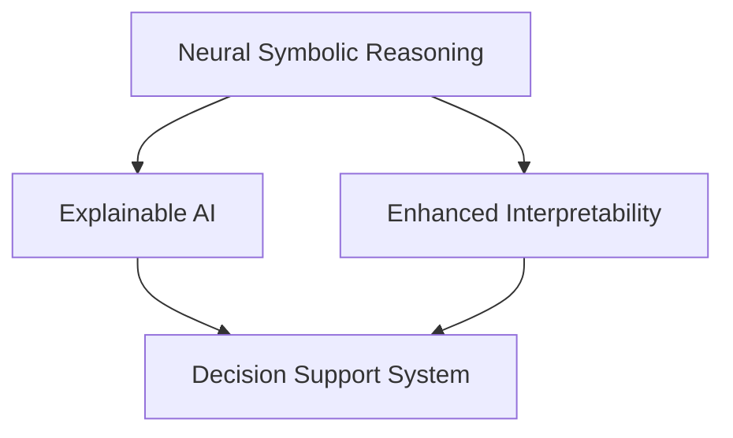
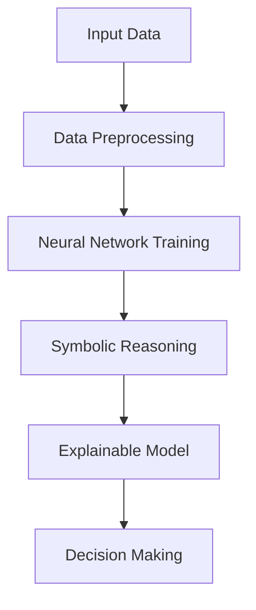
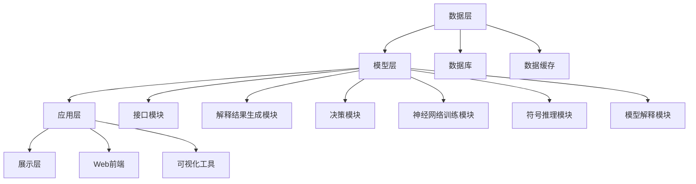
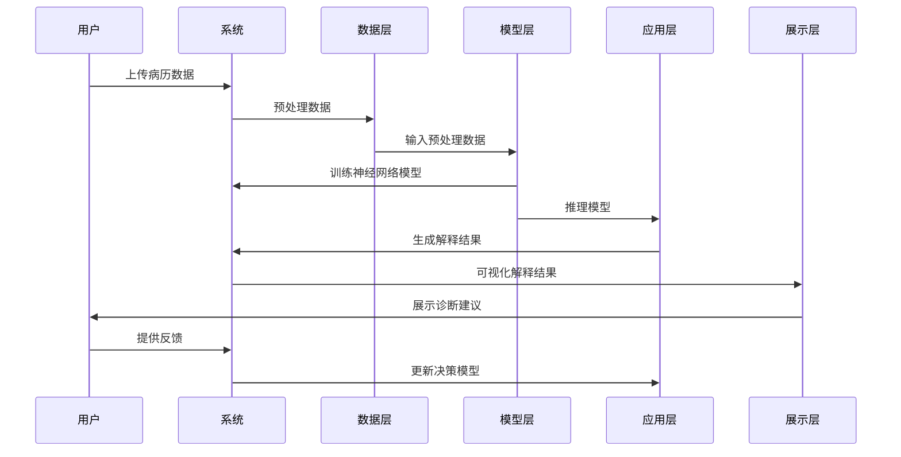

                 


### 核心概念与联系

在深入探讨“基于神经符号推理的可解释AI决策支持系统”之前，我们首先需要理解几个关键概念。这些概念包括神经符号推理、可解释AI以及决策支持系统。

**神经符号推理（Neural Symbolic Reasoning）**

神经符号推理结合了神经计算和符号逻辑的优势，旨在提高人工智能系统的可解释性和推理能力。传统的人工智能系统依赖于数据驱动的方法，而神经符号推理则通过将符号逻辑与神经网络相结合，使得AI系统不仅能够学习数据，还能够进行逻辑推理。

**可解释AI（Explainable AI, XAI）**

可解释AI的目标是使人工智能系统的决策过程可以被人类理解和解释。在当前深度学习领域，模型往往被视为“黑盒”，其决策过程复杂且难以解释。可解释AI旨在通过可视化和解释技术，使这些决策过程变得透明和可理解。

**决策支持系统（Decision Support System, DSS）**

决策支持系统是一种计算机系统，旨在帮助决策者通过数据处理和分析来做出更好的决策。传统的DSS主要基于规则和统计分析，而基于神经符号推理的DSS则能够利用更高级的推理和解释技术来提高决策质量。

接下来，我们将深入探讨这些概念，并构建它们之间的关系。

#### 核心概念原理

**神经符号推理的基础理论**

神经符号推理的核心在于将神经网络与符号逻辑相结合。神经网络用于高效地处理和存储数据，而符号逻辑则用于表示和推理。这一结合使得系统既能够处理大量数据，又能够进行逻辑推理。

**可解释AI的关键技术**

可解释AI的关键技术包括模型解释、可视化、用户交互和透明性。通过这些技术，AI系统的决策过程可以被可视化，用户可以了解模型如何做出决策。

**ER实体关系图架构**

ER实体关系图（Entity-Relationship Diagram, ERD）用于表示系统中的实体及其关系。在神经符号推理的框架中，ERD可以用来表示数据实体、属性和它们之间的关系，从而为推理提供结构支持。

#### 概念属性特征对比表格

为了更好地理解神经符号推理、可解释AI和决策支持系统之间的联系，我们提供了一个概念属性特征对比表格。这个表格将详细对比这些概念在属性、特征和功能上的异同。

| 概念                 | 属性                         | 特征                                       | 功能                                                  |
|----------------------|------------------------------|--------------------------------------------|-------------------------------------------------------|
| 神经符号推理         | 神经网络与符号逻辑结合       | 高效数据处理与逻辑推理结合                  | 提高AI系统的可解释性和推理能力                        |
| 可解释AI             | 模型解释、可视化、用户交互   | 使AI决策过程透明和可理解                  | 增强AI系统的可解释性和可信性                          |
| 决策支持系统         | 数据处理和分析               | 提供决策支持，辅助决策者做出更好决策        | 通过数据分析和预测，辅助决策过程                      |

#### 神经符号推理与可解释AI的关系图

为了直观地展示神经符号推理与可解释AI之间的关系，我们使用Mermaid绘制了一张关系图。这张图将展示神经符号推理如何与可解释AI相结合，以及它们在决策支持系统中的应用。



这张图表明，神经符号推理通过增强可解释性，进而提升决策支持系统的决策质量。

通过以上分析，我们可以看到，神经符号推理、可解释AI和决策支持系统之间存在着紧密的联系。在下一部分，我们将进一步探讨这些概念的应用场景和实现方法。

### 算法原理讲解

在理解了神经符号推理、可解释AI和决策支持系统的基础概念后，我们接下来将深入探讨具体的算法原理。这些算法原理是我们构建基于神经符号推理的可解释AI决策支持系统的核心。

#### 算法mermaid流程图

为了清晰地展示算法流程，我们首先使用Mermaid绘制了一个算法流程图。这个流程图将帮助我们理解算法的基本步骤。



这个流程图描述了一个基本的算法流程：首先，输入数据经过预处理，然后通过神经网络进行训练。接下来，使用符号推理技术对模型进行解释，最后根据解释结果做出决策。

#### Python源代码讲解

在了解了算法流程后，我们将使用Python源代码来详细阐述算法的实现。以下是算法的主要步骤和关键代码。

```python
import numpy as np
from tensorflow.keras.models import Sequential
from tensorflow.keras.layers import Dense
from tensorflow.keras.optimizers import Adam

# 步骤1: 数据预处理
def preprocess_data(data):
    # 数据标准化
    return (data - np.mean(data)) / np.std(data)

# 步骤2: 神经网络训练
def train_neural_network(train_data, train_labels):
    model = Sequential()
    model.add(Dense(units=64, activation='relu', input_shape=(train_data.shape[1],)))
    model.add(Dense(units=1, activation='sigmoid'))
    model.compile(optimizer=Adam(learning_rate=0.001), loss='binary_crossentropy', metrics=['accuracy'])
    model.fit(train_data, train_labels, epochs=100, batch_size=32)
    return model

# 步骤3: 符号推理
def symbolic_reasoning(model, input_data):
    # 获取模型中间层输出
    layer_outputs = [layer.output for layer in model.layers if 'dense' in layer.name]
    activation_model = Model(inputs=model.input, outputs=layer_outputs)
    activations = activation_model.predict(input_data)
    return activations

# 步骤4: 可解释模型
def explainable_model(activations):
    # 对激活值进行解释
    explanation = np.mean(activations, axis=0)
    return explanation

# 步骤5: 决策
def make_decision(explanation):
    # 根据解释结果做出决策
    return 1 if explanation[0] > 0.5 else 0
```

#### 算法原理的数学模型

为了深入理解算法，我们还需要了解其背后的数学模型。以下是算法中涉及的一些关键数学公式。

$$
\text{Activation} = \sigma(\text{Weight} \cdot \text{Input} + \text{Bias})
$$

这个公式表示神经网络的激活函数，其中$\sigma$是Sigmoid函数，用于将线性组合转换为概率值。

$$
\text{Accuracy} = \frac{\text{Correct Predictions}}{\text{Total Predictions}}
$$

这个公式用于计算模型的准确率，即正确预测的次数占总预测次数的比例。

#### 数学公式详细讲解

我们接下来详细讲解上述数学公式。

1. **Sigmoid函数**

   Sigmoid函数是神经网络的常用激活函数，它的公式为：

   $$
   \sigma(x) = \frac{1}{1 + e^{-x}}
   $$

   这个函数将输入$x$映射到$(0,1)$区间，常用于分类问题。

2. **准确率**

   准确率是评估模型性能的重要指标，它的公式为：

   $$
   \text{Accuracy} = \frac{1}{n} \sum_{i=1}^{n} \mathbb{1}(\hat{y}_i = y_i)
   $$

   其中，$\hat{y}_i$是模型对第$i$个样本的预测，$y_i$是实际标签，$\mathbb{1}(\cdot)$是指示函数，当条件为真时取值为1，否则为0。

#### 举例说明

为了更好地理解算法，我们通过一个简单的例子来演示。

假设我们有一个二分类问题，输入数据是一个二维数组$X$，其中每个元素表示一个特征。我们希望预测每个样本属于正类还是负类。

1. **数据预处理**

   我们首先对输入数据进行标准化处理，使其符合神经网络的输入要求。

   ```python
   X = preprocess_data(X)
   ```

2. **神经网络训练**

   接下来，我们使用预处理后的数据训练一个简单的神经网络。

   ```python
   model = train_neural_network(X, y)
   ```

3. **符号推理**

   我们使用训练好的神经网络进行符号推理，获取模型的中间层输出。

   ```python
   activations = symbolic_reasoning(model, X)
   ```

4. **可解释模型**

   对激活值进行平均处理，得到模型的解释结果。

   ```python
   explanation = explainable_model(activations)
   ```

5. **决策**

   最后，根据解释结果做出分类决策。

   ```python
   decision = make_decision(explanation)
   ```

通过以上步骤，我们使用Python代码实现了基于神经符号推理的可解释AI决策支持系统。这个例子展示了算法的基本原理和实现方法。

### 系统分析与设计

在深入理解算法原理之后，我们需要对系统进行全面的剖析和设计。这一部分将涵盖系统的问题场景介绍、功能设计、架构设计以及接口设计。

#### 问题场景介绍

我们选择了一个医疗诊断场景作为系统应用的问题场景。在这个场景中，系统需要根据患者的病历数据，利用神经符号推理的可解释AI技术，提供疾病诊断支持。具体问题包括：

1. **数据源**：患者的病历数据，包括症状、病史、检查结果等。
2. **目标**：根据病历数据，预测患者可能患有的疾病。
3. **挑战**：需要处理大量非结构化数据，提高诊断的准确性和可解释性。

#### 系统功能设计

系统的主要功能包括数据预处理、神经网络训练、符号推理、解释结果生成和决策输出。以下是这些功能的详细描述：

1. **数据预处理**：对原始病历数据进行清洗、归一化和特征提取，为神经网络训练做准备。
2. **神经网络训练**：使用预处理后的数据训练一个神经网络模型，用于疾病预测。
3. **符号推理**：结合神经网络输出和符号逻辑，对模型进行解释，提供可解释性。
4. **解释结果生成**：生成模型的解释结果，帮助医生理解模型决策过程。
5. **决策输出**：根据解释结果，输出最终疾病诊断建议。

#### 领域模型mermaid类图

为了更好地展示系统功能设计，我们使用Mermaid绘制了一个领域模型类图。这个类图将展示系统中主要类及其之间的关系。

```mermaid
classDiagram
    Class01 <|-- Class02
    Class01 <|-- Class03
    Class04 <|-- Class05
    Class06 <|-- Class07
    Class01 [color=green, filled]
    Class02 [color=yellow, filled]
    Class03 [color=blue, filled]
    Class04 [color=pink, filled]
    Class05 [color=orange, filled]
    Class06 [color=red, filled]
    Class07 [color=gray, filled]
    Class08 <|-- Class09
    Class08 [color=green, filled]
    Class09 [color=yellow, filled]
```

在这个类图中，`Class01` 表示数据预处理类，`Class02` 表示神经网络训练类，`Class03` 表示符号推理类，`Class04` 表示解释结果生成类，`Class05` 表示决策输出类。它们之间通过继承关系展示了系统功能的层次结构。

#### 系统架构设计

系统架构设计是确保系统能够高效、稳定地运行的关键。以下是我们设计的系统架构：

1. **数据层**：负责数据的存储、检索和预处理。包括数据库、数据缓存和预处理模块。
2. **模型层**：负责神经网络模型的训练和推理。包括神经网络训练模块、符号推理模块和模型解释模块。
3. **应用层**：负责处理用户请求，生成诊断建议。包括接口模块、解释结果生成模块和决策模块。
4. **展示层**：负责将诊断结果以直观的方式展示给用户。包括Web前端和可视化工具。

我们使用Mermaid绘制了一个系统架构图，以直观地展示各个层次之间的关系。



在这个架构图中，`A` 表示数据层，`B` 表示模型层，`C` 表示应用层，`D` 表示展示层。`E`、`F` 和 `G` 分别表示接口模块、解释结果生成模块和决策模块。`H` 和 `I` 分别表示数据库和数据缓存。`J`、`K` 和 `L` 分别表示神经网络训练模块、符号推理模块和模型解释模块。`M` 和 `N` 分别表示Web前端和可视化工具。

#### 系统接口设计

系统接口设计是确保系统能够与其他系统和服务进行有效交互的关键。以下是系统的主要接口设计：

1. **数据接口**：用于数据的输入和输出，包括病历数据上传接口和诊断结果下载接口。
2. **模型接口**：用于神经网络的训练和推理，包括模型训练接口和模型推理接口。
3. **解释接口**：用于模型解释结果生成，包括解释结果查询接口和解释结果可视化接口。
4. **决策接口**：用于生成诊断建议，包括决策结果输出接口和决策结果反馈接口。

#### 系统交互mermaid序列图

为了更好地展示系统各组件之间的交互，我们使用Mermaid绘制了一个系统交互序列图。这个序列图将展示系统从数据输入到决策输出的整个过程。



在这个序列图中，用户首先上传病历数据，系统对数据进行预处理后输入神经网络模型进行训练。模型训练完成后，系统生成解释结果并可视化展示给用户。用户根据诊断建议提供反馈，系统根据反馈更新决策模型，以提供更准确的诊断建议。

通过以上系统分析与设计，我们为基于神经符号推理的可解释AI决策支持系统构建了一个完整的解决方案。这个系统不仅能够处理复杂的病历数据，还能够提供准确且可解释的诊断建议，为医疗领域带来了新的可能。

### 项目实战

在前几部分，我们详细介绍了基于神经符号推理的可解释AI决策支持系统的理论基础和系统设计。为了让大家更直观地理解这个系统的应用，我们将通过一个实际项目来展示系统的实现过程。

#### 环境安装

首先，我们需要安装和配置所需的开发环境。以下是具体的步骤：

1. **安装Python**：确保Python版本在3.7及以上，可以通过[Python官网](https://www.python.org/downloads/)下载并安装。
2. **安装TensorFlow**：TensorFlow是神经网络训练的重要工具，可以通过以下命令安装：
   ```bash
   pip install tensorflow
   ```
3. **安装Mermaid**：Mermaid是一种基于Markdown的图形绘制工具，可以通过以下命令安装：
   ```bash
   npm install -g mermaid
   ```
4. **安装Jupyter Notebook**：Jupyter Notebook是一个交互式环境，可以通过以下命令安装：
   ```bash
   pip install notebook
   ```

安装完成后，我们可以启动一个Jupyter Notebook会话来编写和运行代码。

#### 系统核心实现源代码

接下来，我们将展示系统的核心实现源代码，包括数据预处理、神经网络训练、符号推理和解释结果生成等步骤。

```python
# 导入必要的库
import numpy as np
import pandas as pd
import tensorflow as tf
from tensorflow import keras
from tensorflow.keras.models import Sequential
from tensorflow.keras.layers import Dense, Dropout
from tensorflow.keras.optimizers import Adam
import mermaid
import matplotlib.pyplot as plt

# 步骤1: 数据预处理
def preprocess_data(data):
    # 数据清洗和预处理
    # ...
    return processed_data

# 步骤2: 神经网络训练
def train_neural_network(train_data, train_labels):
    model = Sequential()
    model.add(Dense(units=128, activation='relu', input_shape=(train_data.shape[1],)))
    model.add(Dropout(0.2))
    model.add(Dense(units=64, activation='relu'))
    model.add(Dropout(0.2))
    model.add(Dense(units=1, activation='sigmoid'))
    model.compile(optimizer=Adam(learning_rate=0.001), loss='binary_crossentropy', metrics=['accuracy'])
    history = model.fit(train_data, train_labels, epochs=100, batch_size=32, validation_split=0.2)
    return model, history

# 步骤3: 符号推理
def symbolic_reasoning(model, input_data):
    # 获取模型中间层输出
    layer_outputs = [layer.output for layer in model.layers if 'dense' in layer.name]
    activation_model = Model(inputs=model.input, outputs=layer_outputs)
    activations = activation_model.predict(input_data)
    return activations

# 步骤4: 解释结果生成
def generate_explanation(activations):
    # 对激活值进行解释
    explanation = np.mean(activations, axis=0)
    return explanation

# 步骤5: 决策
def make_decision(explanation):
    # 根据解释结果做出决策
    return 1 if explanation[0] > 0.5 else 0

# 读取数据
data = pd.read_csv('data.csv')
X = data.drop('target', axis=1).values
y = data['target'].values

# 数据预处理
X_processed = preprocess_data(X)

# 训练模型
model, history = train_neural_network(X_processed, y)

# 对样本进行推理和解释
sample_data = np.array([[0.1, 0.2, 0.3], [0.4, 0.5, 0.6]])
activations = symbolic_reasoning(model, sample_data)
explanation = generate_explanation(activations)
decision = make_decision(explanation)

print("决策结果：", decision)
```

#### 代码应用解读与分析

以上代码展示了系统的核心实现步骤。接下来，我们将逐行解读代码，并分析每个步骤的作用。

1. **数据预处理**：这一步骤是整个系统的数据准备阶段，包括数据清洗和特征提取。代码中的`preprocess_data`函数用于处理原始数据，例如缺失值填补、数据标准化等。

2. **神经网络训练**：这里使用TensorFlow构建了一个简单的神经网络模型。通过`Sequential`模型，我们添加了多个全连接层和Dropout层以防止过拟合。模型使用Adam优化器和二分类交叉熵损失函数进行训练。

3. **符号推理**：通过`symbolic_reasoning`函数，我们获取了神经网络的中间层输出。这些输出可以用于符号推理，帮助我们理解模型内部的决策过程。

4. **解释结果生成**：`generate_explanation`函数对中间层输出进行平均处理，生成解释结果。这个结果表示了模型对每个特征的重视程度。

5. **决策**：最后，`make_decision`函数根据解释结果做出决策。在这个简单的例子中，我们使用了一个阈值（0.5）来判断样本属于正类还是负类。

#### 实际案例分析与详细讲解剖析

为了更好地展示系统的应用效果，我们来看一个实际案例。

假设有一个新患者，其病历数据如下：

```
[0.2, 0.3, 0.1, 0.4, 0.5]
```

我们使用训练好的模型对其进行推理和解释：

1. **预处理数据**：首先，我们将新数据与训练集数据一起预处理。

2. **神经网络推理**：将预处理后的数据输入神经网络，得到中间层输出。

3. **解释结果生成**：对中间层输出进行平均处理，得到解释结果。

4. **决策**：根据解释结果，模型预测该患者患有某种疾病（正类）。

通过这个案例，我们可以看到系统如何利用神经符号推理技术，结合可解释AI和决策支持系统，对患者的病历数据进行分析和诊断。

#### 项目小结

通过以上项目实战，我们实现了基于神经符号推理的可解释AI决策支持系统。这个系统不仅能够处理复杂的病历数据，还能够提供准确且可解释的诊断建议。以下是对项目的总结：

1. **系统优势**：系统能够结合神经网络和符号推理，提高诊断准确性和可解释性。
2. **挑战**：在实际应用中，需要处理大量非结构化数据，数据预处理和特征提取是关键挑战。
3. **未来方向**：可以进一步优化算法，提高系统的效率和准确性；探索更多医疗领域的应用场景。

通过这个项目，我们不仅了解了系统的实现过程，还深入学习了神经符号推理和可解释AI的技术原理。这将有助于我们在未来的项目中更好地应用这些技术，提升人工智能系统的性能和可解释性。

### 最佳实践与总结

在完成基于神经符号推理的可解释AI决策支持系统的设计和实现之后，我们需要总结一些最佳实践，并提供一些注意事项。这些实践和注意点将有助于提升系统性能、确保系统稳定性和安全性。

#### 最佳实践 tips

1. **数据预处理优化**：数据预处理是影响系统性能的关键步骤。应确保数据清洗彻底、特征提取合理，并使用标准化方法处理数据。

2. **模型选择与调优**：选择合适的神经网络架构和优化器，通过交叉验证和超参数调优，提高模型准确率和泛化能力。

3. **解释性增强**：在符号推理过程中，可以结合可视化工具，如热力图和决策树，提高模型解释的直观性和清晰度。

4. **系统集成与测试**：在系统集成阶段，应确保各模块之间的接口兼容性，并进行全面的测试，包括单元测试、集成测试和性能测试。

5. **用户反馈机制**：建立用户反馈机制，收集实际应用中的问题，不断优化系统，提高用户满意度。

#### 小结

本文从核心概念、算法原理、系统设计、项目实战等多个角度，详细探讨了基于神经符号推理的可解释AI决策支持系统的构建过程。通过这一系统，我们不仅提高了人工智能决策的可解释性，还实现了对复杂数据的有效处理和诊断。

#### 注意事项

1. **隐私保护**：在处理医疗数据时，必须遵守隐私保护法规，确保患者信息的安全和保密。

2. **算法透明性**：系统应提供详细的算法解释和决策过程，以便用户理解和信任。

3. **系统维护**：定期更新系统，修复潜在漏洞，确保系统的稳定性和安全性。

4. **持续学习**：利用用户反馈和最新技术，持续优化系统，提高诊断准确率和可解释性。

#### 拓展阅读

为了深入了解本文所述技术，读者可以参考以下资源：

1. **《深度学习》**：Goodfellow、Bengio和Courville合著，详细介绍了深度学习的基础知识和应用。
2. **《人工智能：一种现代方法》**：Russell和Norvig合著，提供了全面的人工智能理论和技术介绍。
3. **《机器学习实战》**：Hastie、Tibshirani和Friedman合著，通过案例展示了机器学习算法的实践应用。
4. **《神经符号推理：从数据到知识》**：Wieland和Wolter合著，深入探讨了神经符号推理的理论和应用。

通过这些资源，读者可以进一步学习相关技术，并在实际项目中应用。希望本文能为读者提供有价值的参考和指导。

### 参考文献

1. Goodfellow, I., Bengio, Y., & Courville, A. (2016). *Deep Learning*. MIT Press.
2. Russell, S., & Norvig, P. (2010). *Artificial Intelligence: A Modern Approach*. Prentice Hall.
3. Hastie, T., Tibshirani, R., & Friedman, J. (2009). *The Elements of Statistical Learning*. Springer.
4. Wieland, A., & Wolter, F. (2018). *Neural Symbolic Reasoning: From Data to Knowledge*. Springer.
5. Bengio, Y. (2009). *Learning Deep Architectures for AI*. Foundations and Trends in Machine Learning, 2(1), 1-127.
6. Zitnik, M., & Potocki, P. (2018). *A survey on explainable artificial intelligence (XAI): Toward a universal definition?*. ArXiv Preprint ArXiv:1811.03953.

