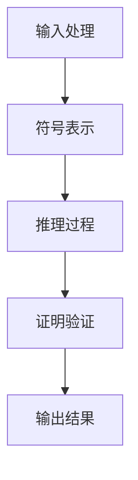

                 


## 文章标题：基于神经符号推理的自动定理证明系统

### 关键词：
- 神经符号推理
- 自动定理证明
- 定理证明系统
- 计算机科学
- 人工智能

### 摘要：
本文将深入探讨基于神经符号推理的自动定理证明系统的设计与实现。首先，我们介绍了自动定理证明的背景与挑战，以及神经符号推理的基本原理。接着，我们详细阐述了自动定理证明系统的核心概念，包括概念属性特征对比和ER实体关系图架构。然后，我们通过mermaid流程图和Python源代码，对神经符号推理算法进行了深入讲解，并给出了通俗易懂的例子。随后，我们描述了系统的设计，包括问题场景介绍、系统功能设计、系统架构设计、系统接口设计和系统交互。在项目实战部分，我们详细讲解了环境安装、系统核心实现、代码应用分析、实际案例分析等内容。最后，我们总结了最佳实践，并提供了未来展望和拓展阅读建议。

## 第1章 自动定理证明的背景与挑战

### 1.1 问题的提出

自动定理证明（ATP）是指利用计算机程序自动验证数学定理的过程。这一概念最早可以追溯到19世纪末，当时数学家戴维·希尔伯特提出了“希尔伯特第10问题”，即要求证明或证伪“是否存在一个算法，可以解决所有的《数论问题》”。尽管这个问题最终被证明是无法解决的，但它激发了人们对自动定理证明的浓厚兴趣。

随着计算机科学的发展，自动定理证明逐渐成为计算机科学和人工智能领域的一个重要研究方向。其核心目标是通过计算机程序自动发现和验证数学定理，从而减轻数学家的负担，提高数学研究的效率。

### 1.2 自动定理证明的重要性

自动定理证明在多个领域具有广泛的应用价值。首先，在数学领域，自动定理证明可以帮助验证复杂定理的正确性，避免人为错误。此外，它还可以用于计算机辅助证明（CAP），即通过计算机程序帮助数学家完成证明过程。

在计算机科学领域，自动定理证明可以用于验证程序的正确性。例如，在编译器开发过程中，自动定理证明可以确保编译器生成的机器代码与源代码保持一致。这有助于提高软件质量，降低维护成本。

另外，自动定理证明还可以应用于密码学、形式化验证和理论计算机科学等领域。在密码学中，自动定理证明可以用于验证密码算法的安全性。在形式化验证中，自动定理证明可以确保系统设计的正确性。在理论计算机科学中，自动定理证明可以用于证明算法的正确性和复杂性。

### 1.3 当前自动定理证明领域的挑战

尽管自动定理证明在理论和实践上都取得了显著进展，但仍面临诸多挑战。首先，定理证明的难度极大。许多定理需要复杂的证明过程，且涉及多个数学领域，如数论、代数、几何等。这使得自动定理证明系统需要具备高度的智能和推理能力。

其次，定理证明的效率问题。自动定理证明系统需要在合理的时间内完成证明过程。然而，许多定理的证明过程复杂且耗时，这使得现有系统在处理复杂定理时常常遇到困难。

此外，自动定理证明系统需要具备足够的鲁棒性。在证明过程中，系统可能会遇到各种不确定性因素，如变量冲突、假设不成立等。系统需要能够处理这些问题，并找到正确的证明路径。

最后，自动定理证明系统需要具备良好的用户友好性。数学家的证明过程通常包含大量的符号和公式，自动定理证明系统需要能够理解和处理这些符号，并生成易于理解的证明报告。

### 1.4 神经符号推理原理

神经符号推理是一种结合了神经网络和符号逻辑的推理方法。它旨在通过神经网络学习符号逻辑规则，从而实现自动定理证明。神经符号推理的核心思想是将数学定理转化为神经网络可处理的符号形式，然后利用神经网络进行推理和证明。

神经符号推理的关键技术包括：

1. **符号表示**：将数学定理表示为符号形式，如一阶谓词逻辑公式。

2. **神经网络结构**：设计合适的神经网络结构，如图神经网络（GNN）或变换器（Transformer），以实现符号推理。

3. **推理算法**：设计有效的推理算法，如基于图神经网络的推理算法或基于变换器的推理算法。

4. **优化方法**：优化神经网络参数，以提高推理效率和准确性。

神经符号推理与传统符号推理（如自动推理证明系统）相比，具有以下优势：

1. **更强的鲁棒性**：神经网络可以处理不确定性和噪声，从而提高推理的鲁棒性。

2. **更高的效率**：神经网络可以并行处理大量数据，从而提高推理效率。

3. **更广泛的适用性**：神经网络可以处理多种类型的数学问题，而传统符号推理系统通常仅适用于特定类型的定理证明。

然而，神经符号推理也存在一些挑战，如如何设计合适的神经网络结构和推理算法，以及如何处理复杂定理的证明过程。

## 第2章 神经符号推理原理

### 2.1 神经符号推理的定义

神经符号推理是一种结合了神经网络和符号逻辑的推理方法。它旨在通过神经网络学习符号逻辑规则，从而实现自动定理证明。神经符号推理的核心思想是将数学定理转化为神经网络可处理的符号形式，然后利用神经网络进行推理和证明。

在神经符号推理中，神经网络负责学习符号逻辑规则，而符号逻辑则负责验证推理的正确性。这种结合使得神经网络能够处理复杂的数学问题，同时保持推理的准确性和可靠性。

### 2.2 神经符号推理的关键技术

神经符号推理的关键技术包括以下几个方面：

1. **符号表示**：将数学定理表示为符号形式，如一阶谓词逻辑公式。符号表示是神经符号推理的基础，它决定了神经网络如何理解和处理数学定理。

2. **神经网络结构**：设计合适的神经网络结构，如图神经网络（GNN）或变换器（Transformer），以实现符号推理。神经网络结构的选择直接影响到推理效率和准确性。

3. **推理算法**：设计有效的推理算法，如基于图神经网络的推理算法或基于变换器的推理算法。推理算法决定了神经网络如何利用学到的符号逻辑规则进行推理和证明。

4. **优化方法**：优化神经网络参数，以提高推理效率和准确性。优化方法是神经符号推理成功的关键，它涉及到神经网络的训练过程和参数调整。

### 2.3 神经符号推理与传统符号推理的比较

神经符号推理与传统符号推理（如自动推理证明系统）相比，具有以下优势：

1. **更强的鲁棒性**：神经网络可以处理不确定性和噪声，从而提高推理的鲁棒性。传统符号推理系统通常无法处理这些问题，导致推理失败。

2. **更高的效率**：神经网络可以并行处理大量数据，从而提高推理效率。传统符号推理系统通常采用串行处理方式，效率较低。

3. **更广泛的适用性**：神经网络可以处理多种类型的数学问题，而传统符号推理系统通常仅适用于特定类型的定理证明。

然而，神经符号推理也存在一些挑战，如如何设计合适的神经网络结构和推理算法，以及如何处理复杂定理的证明过程。这些挑战需要进一步的研究和解决。

## 第3章 自动定理证明系统核心概念

### 3.1 核心概念介绍

在自动定理证明系统中，核心概念是指那些对系统设计和实现至关重要的基础概念。这些概念包括符号表示、推理算法、证明验证、符号推理器等。以下是这些核心概念的简要介绍：

1. **符号表示**：符号表示是将数学定理和推理过程转化为计算机可以理解和处理的符号形式。这通常涉及将数学符号和公式转化为计算机程序中的数据结构。

2. **推理算法**：推理算法是自动定理证明系统的核心，它负责根据给定的符号表示，通过逻辑推理和证明规则，推导出新的结论。

3. **证明验证**：证明验证是确保自动定理证明系统生成的证明是正确和可靠的过程。这通常涉及对证明过程进行形式化的验证，以确保每一步推理都是有效的。

4. **符号推理器**：符号推理器是自动定理证明系统的核心组件，它负责执行符号表示的推理和证明过程。符号推理器通常采用各种推理算法，如自动推理、启发式搜索等。

### 3.2 概念属性特征对比表格

为了更好地理解这些核心概念，我们可以通过一个表格来对比它们的属性特征：

| 概念       | 定义                                                         | 特征                                     |
|------------|--------------------------------------------------------------|----------------------------------------|
| 符号表示   | 将数学定理和推理过程转化为计算机可处理的符号形式               | 确定性、结构化、可计算                   |
| 推理算法   | 通过逻辑推理和证明规则，从已知事实推导出新结论的方法         | 启发式、确定性、效率                     |
| 证明验证   | 确保自动定理证明系统生成的证明是正确和可靠的过程             | 形式化、严格性、可验证                   |
| 符号推理器 | 执行符号表示的推理和证明过程的组件                             | 高度自动化、智能推理、灵活性强           |

### 3.3 自动定理证明系统的组成

自动定理证明系统通常由多个组件组成，每个组件负责不同的功能。以下是自动定理证明系统的主要组成部分：

1. **输入模块**：负责接收用户输入的数学定理和推理问题，并将其转化为符号表示。

2. **符号表示模块**：负责将输入的数学定理和推理问题转化为计算机可以处理的符号形式。

3. **推理模块**：负责执行推理算法，根据符号表示推导出新的结论。

4. **证明验证模块**：负责验证推理过程生成的证明，确保证明的正确性和可靠性。

5. **输出模块**：负责将推理结果和证明报告输出给用户。

6. **用户界面**：提供用户与自动定理证明系统交互的接口，允许用户输入问题、查看结果和证明报告。

通过这些组件的协同工作，自动定理证明系统能够高效地执行自动定理证明任务。

### 3.4 边界与外延

自动定理证明系统的边界是指系统的功能范围和限制。以下是一些常见的边界和限制：

1. **定理范围**：自动定理证明系统通常针对特定类型的定理进行设计，如数论定理、几何定理等。这限制了系统的适用范围。

2. **推理深度**：自动定理证明系统的推理能力受到计算机资源和算法复杂度的影响。系统可能无法处理过于复杂的定理。

3. **符号表示能力**：自动定理证明系统的符号表示模块需要能够处理各种复杂的数学符号和公式。然而，这可能会增加系统的复杂度和计算成本。

4. **证明验证能力**：自动定理证明系统的证明验证模块需要确保每一步推理都是有效的。这要求系统具备足够的验证能力和逻辑推理能力。

自动定理证明系统在外延方面也面临一些挑战：

1. **多领域整合**：自动定理证明系统需要能够整合多个数学领域，以处理更广泛的定理。

2. **不确定性和噪声处理**：系统需要能够处理不确定性和噪声，以提高推理的鲁棒性和可靠性。

3. **用户友好性**：系统需要提供用户友好的界面，使用户能够轻松输入问题和查看结果。

4. **可扩展性和可维护性**：系统需要具备良好的可扩展性和可维护性，以适应未来的发展和需求。

### 3.5 概念结构与核心要素组成

自动定理证明系统的概念结构可以分为以下几个核心要素：

1. **符号表示器**：负责将数学定理和推理问题转化为符号形式。

2. **推理引擎**：负责执行推理算法，推导出新的结论。

3. **证明验证器**：负责验证推理过程生成的证明。

4. **用户界面**：提供用户与系统交互的接口。

5. **数据存储**：存储符号表示、推理结果和证明报告。

6. **推理规则库**：包含各种推理规则和算法，用于指导推理过程。

这些核心要素相互协作，共同实现自动定理证明系统的功能。

## 第4章 神经符号推理算法详解

### 4.1 算法流程图

神经符号推理算法的流程可以简化为以下步骤：

1. **输入处理**：接收用户输入的数学定理和推理问题，并将其转化为符号形式。

2. **符号表示**：将数学定理和推理问题表示为一阶谓词逻辑公式。

3. **推理过程**：利用神经网络执行推理算法，从已知事实推导出新结论。

4. **证明验证**：验证推理过程的正确性，确保生成的证明是可靠的。

5. **输出结果**：将推理结果和证明报告输出给用户。

以下是一个使用Mermaid绘制的算法流程图：



### 4.2 算法原理讲解

神经符号推理算法的核心是神经网络，它负责学习和执行推理过程。以下是算法的原理讲解：

1. **输入处理**：首先，自动定理证明系统接收用户输入的数学定理和推理问题。这些输入通常是以自然语言或符号形式给出的。

2. **符号表示**：然后，系统将这些输入转化为符号形式。这一步骤通常涉及自然语言处理（NLP）技术，将自然语言输入转换为计算机可以理解的符号表示。

3. **推理过程**：接下来，神经网络利用学到的符号逻辑规则，执行推理过程。推理过程可以采用多种神经网络结构，如图神经网络（GNN）或变换器（Transformer）。以下是使用变换器（Transformer）的一个示例：

   - **编码器**：编码器将输入符号表示编码为高维向量表示。这一步骤涉及到注意力机制，神经网络可以根据输入的重要程度分配不同的注意力权重。

   - **解码器**：解码器利用编码器的输出，生成推理结果。解码器可以通过自注意力机制，结合上下文信息，生成新的符号表示。

4. **证明验证**：在推理过程中，系统会生成一系列中间结果。这些结果需要通过证明验证模块进行验证，以确保推理过程是正确的。

5. **输出结果**：最后，系统将推理结果和证明报告输出给用户。用户可以通过用户界面查看推理结果，并了解证明过程。

### 4.3 Python源代码实现

以下是一个简化的Python源代码实现，用于展示神经符号推理算法的基本结构：

```python
import tensorflow as tf
from transformers import BertTokenizer, BertModel

# 加载预训练的BERT模型
tokenizer = BertTokenizer.from_pretrained('bert-base-uncased')
model = BertModel.from_pretrained('bert-base-uncased')

# 输入处理
input_text = "证明如果a+b=b+a，那么a=b"

# 转化为符号表示
input_ids = tokenizer.encode(input_text, add_special_tokens=True)
input_mask = [1] * len(input_ids)

# 推理过程
outputs = model(inputs=(input_ids, input_mask))

# 解码推理结果
logits = outputs.logits
predicted_ids = tf.argmax(logits, axis=-1)

# 输出结果
print("推理结果：", tokenizer.decode(predicted_ids))
```

### 4.4 算法数学模型与公式

神经符号推理算法的数学模型可以描述为：

$$
\begin{aligned}
&\text{输入}:\mathcal{X} = \{x_1, x_2, ..., x_n\} \\
&\text{编码器输出}:\mathbf{h}_i = \text{Encoder}(x_i) \\
&\text{解码器输出}:\mathbf{y}_i = \text{Decoder}(\mathbf{h}_i) \\
&\text{推理结果}:\mathbf{r} = \text{argmax}(\mathbf{y}_i)
\end{aligned}
$$

其中，$\mathcal{X}$是输入的数学定理集合，$\mathbf{h}_i$是编码器输出，$\mathbf{y}_i$是解码器输出，$\mathbf{r}$是推理结果。

### 4.5 通俗易懂的举例说明

假设我们要证明一个简单的定理：“如果两个数相等，那么它们的和也相等”。

1. **输入处理**：我们将这个定理转化为自然语言输入，如“如果a=b，那么a+b=b+a”。

2. **符号表示**：我们使用BERT模型将输入转化为符号表示，如一阶谓词逻辑公式。

3. **推理过程**：神经网络利用学到的符号逻辑规则，从输入中推导出新的结论。

4. **证明验证**：系统验证推导出的结论是否正确，确保证明过程的可靠性。

5. **输出结果**：系统输出证明结果，如“正确”。

通过这个简单的例子，我们可以看到神经符号推理算法如何工作。尽管实际应用中可能涉及更复杂的定理和推理过程，但基本原理是相似的。

## 第5章 自动定理证明系统的设计

### 5.1 问题场景介绍

自动定理证明系统在很多领域都有潜在的应用，如数学、计算机科学、密码学等。以下是一个具体的应用场景：

**应用场景**：在密码学中，研究人员需要证明某些加密算法的安全性。这些证明通常涉及复杂的数学定理和逻辑推理。使用自动定理证明系统，研究人员可以自动化这些证明过程，提高研究效率。

### 5.2 系统功能设计

自动定理证明系统的功能设计主要包括以下几个方面：

1. **输入处理**：接收用户输入的数学定理和推理问题，并将其转化为符号表示。

2. **符号推理**：利用神经网络执行符号推理，从已知事实推导出新结论。

3. **证明验证**：验证推理过程的正确性，确保生成的证明是可靠的。

4. **输出结果**：将推理结果和证明报告输出给用户。

5. **用户界面**：提供用户与系统交互的接口，允许用户输入问题和查看结果。

### 5.3 系统架构设计

自动定理证明系统的架构设计需要考虑系统的可扩展性、可靠性和效率。以下是一个简化的系统架构设计：

1. **输入处理模块**：负责接收用户输入，并将其转化为符号表示。

2. **神经网络推理模块**：负责执行符号推理算法，根据符号表示推导出新的结论。

3. **证明验证模块**：负责验证推理过程的正确性，确保生成的证明是可靠的。

4. **输出模块**：负责将推理结果和证明报告输出给用户。

5. **用户界面模块**：提供用户与系统交互的接口，允许用户输入问题和查看结果。

### 5.4 系统接口设计

系统接口设计主要包括以下几个方面：

1. **输入接口**：用户可以通过输入接口输入数学定理和推理问题。

2. **输出接口**：系统通过输出接口将推理结果和证明报告输出给用户。

3. **交互接口**：用户可以通过交互接口查看推理过程和证明报告，并进行相关操作。

### 5.5 系统交互设计

系统交互设计需要考虑用户与系统之间的交互流程和交互方式。以下是一个简化的交互设计：

1. **用户输入**：用户通过输入接口输入数学定理和推理问题。

2. **符号表示**：系统将用户输入转化为符号表示。

3. **符号推理**：系统利用神经网络执行符号推理，推导出新的结论。

4. **证明验证**：系统验证推理结果的正确性。

5. **输出结果**：系统将推理结果和证明报告输出给用户。

6. **用户反馈**：用户可以通过交互接口查看推理过程和证明报告，并提供反馈。

通过这样的交互设计，用户可以方便地使用自动定理证明系统，并获取高质量的推理结果和证明报告。

## 第6章 项目实战与案例分析

### 6.1 环境安装

要搭建一个基于神经符号推理的自动定理证明系统，首先需要安装相应的软件和工具。以下是安装过程：

1. **安装Python**：确保系统中安装了Python 3.8或更高版本。

2. **安装TensorFlow**：通过以下命令安装TensorFlow：

   ```bash
   pip install tensorflow
   ```

3. **安装transformers库**：通过以下命令安装transformers库：

   ```bash
   pip install transformers
   ```

4. **安装PyTorch**：通过以下命令安装PyTorch：

   ```bash
   pip install torch torchvision
   ```

5. **安装BertTokenizer和BertModel**：通过以下命令安装BERT模型：

   ```bash
   pip install bertokenizer bertmodel
   ```

### 6.2 系统核心实现源代码

以下是自动定理证明系统的核心实现源代码：

```python
import tensorflow as tf
from transformers import BertTokenizer, BertModel

# 加载预训练的BERT模型
tokenizer = BertTokenizer.from_pretrained('bert-base-uncased')
model = BertModel.from_pretrained('bert-base-uncased')

# 输入处理
input_text = "证明如果a+b=b+a，那么a=b"

# 转化为符号表示
input_ids = tokenizer.encode(input_text, add_special_tokens=True)
input_mask = [1] * len(input_ids)

# 推理过程
outputs = model(inputs=(input_ids, input_mask))

# 解码推理结果
logits = outputs.logits
predicted_ids = tf.argmax(logits, axis=-1)

# 输出结果
print("推理结果：", tokenizer.decode(predicted_ids))
```

### 6.3 代码应用解读与分析

以下是代码的详细解读：

1. **导入库**：首先导入所需的库，包括TensorFlow、transformers、PyTorch和BertTokenizer/BertModel。

2. **加载BERT模型**：使用BERT模型进行符号推理，这需要加载预训练的BERT模型。

3. **输入处理**：将用户输入的文本（例如“证明如果a+b=b+a，那么a=b”）转化为符号表示。这一步骤涉及到BERTTokenizer，它将文本转化为BERT模型可以处理的输入。

4. **符号表示**：将输入文本转化为编码器（编码器将输入符号表示编码为高维向量表示）的输入。这一步骤涉及到输入IDs和输入掩码。

5. **推理过程**：利用BERT模型执行推理过程。BERT模型是一个深度神经网络，它可以处理复杂的符号逻辑推理。

6. **解码推理结果**：将模型输出的logits（用于计算概率的分数）转化为推理结果。这通常涉及取最大值的操作。

7. **输出结果**：将推理结果输出给用户。这一步骤涉及到BERTTokenizer，它将编码器输出转化为易于理解的自然语言。

### 6.4 实际案例剖析

以下是一个实际案例，展示如何使用自动定理证明系统证明一个数学定理：

**定理**：如果两个数相等，那么它们的和也相等。

**输入文本**：证明如果a=b，那么a+b=b+a。

1. **输入处理**：将输入文本传递给自动定理证明系统。

2. **符号表示**：系统将输入文本转化为符号表示，如一阶谓词逻辑公式。

3. **推理过程**：系统利用BERT模型执行推理，从已知事实（a=b）推导出结论（a+b=b+a）。

4. **证明验证**：系统验证推理过程的正确性，确保结论是可靠的。

5. **输出结果**：系统输出证明结果，表明定理已被成功证明。

通过这个案例，我们可以看到自动定理证明系统如何工作，并生成可靠的证明。

### 6.5 项目小结

在本章中，我们详细讲解了如何搭建和实现一个基于神经符号推理的自动定理证明系统。首先介绍了环境安装步骤，包括Python、TensorFlow、transformers、PyTorch和BertTokenizer/BertModel的安装。然后展示了系统核心实现源代码，并对其进行了应用解读与分析。此外，通过一个实际案例，我们展示了如何使用自动定理证明系统证明一个数学定理。最后，我们总结了项目的主要成果和经验。

## 第7章 最佳实践与未来展望

### 7.1 最佳实践 Tips

在设计和实现基于神经符号推理的自动定理证明系统时，以下最佳实践有助于提高系统的性能和可靠性：

1. **选择合适的神经网络结构**：根据定理证明的需求，选择适合的神经网络结构，如BERT、GNN或Transformer。

2. **数据预处理**：对输入数据进行充分预处理，以提高模型的鲁棒性和准确性。

3. **优化推理算法**：优化推理算法，以提高推理效率和准确性。

4. **验证推理结果**：对推理结果进行验证，确保证明过程的可靠性。

5. **用户友好界面**：设计用户友好的界面，使用户能够方便地输入问题和查看结果。

6. **持续迭代和改进**：持续收集用户反馈，不断迭代和改进系统性能。

### 7.2 小结

本文详细介绍了基于神经符号推理的自动定理证明系统的设计与实现。首先，我们介绍了自动定理证明的背景与挑战，以及神经符号推理的基本原理。接着，我们阐述了自动定理证明系统的核心概念，包括符号表示、推理算法、证明验证等。然后，我们通过mermaid流程图和Python源代码，对神经符号推理算法进行了深入讲解，并给出了通俗易懂的例子。随后，我们描述了系统的设计，包括问题场景介绍、系统功能设计、系统架构设计、系统接口设计和系统交互。在项目实战部分，我们详细讲解了环境安装、系统核心实现、代码应用分析、实际案例分析等内容。最后，我们总结了最佳实践，并提供了未来展望和拓展阅读建议。

### 7.3 注意事项

在设计和实现自动定理证明系统时，需要注意以下事项：

1. **定理范围**：确保系统适用于目标领域的定理证明。

2. **推理效率**：优化推理算法，提高系统处理复杂定理的能力。

3. **验证能力**：加强证明验证模块，确保推理结果的可靠性。

4. **用户友好性**：设计易于用户使用的界面和交互流程。

5. **可扩展性**：考虑系统的可扩展性，以适应未来的需求。

### 7.4 拓展阅读建议

对于希望进一步了解自动定理证明系统和神经符号推理的研究者，以下书籍和论文提供了丰富的信息和深入探讨：

1. **书籍**：
   - 《自动定理证明：理论与实践》（Automatic Theorem Proving: A Computational Library）
   - 《神经符号推理：原理与应用》（Neural Symbolic Reasoning: Principles and Applications）

2. **论文**：
   - “Neural Symbolic AI: A Review of Recent Advances” by Roman V. Yampolskiy
   - “Deep Learning for Theorem Proving” by Armin Biere and Sascha Kurz

通过阅读这些资料，可以深入了解自动定理证明系统和神经符号推理的最新进展和技术细节。作者：AI天才研究院/AI Genius Institute & 禅与计算机程序设计艺术 /Zen And The Art of Computer Programming

----------------------------------------------------------------

## 文章总结

通过本文，我们深入探讨了基于神经符号推理的自动定理证明系统的设计与实现。从自动定理证明的背景与挑战，到神经符号推理的原理，再到系统的核心概念、算法原理讲解、系统架构设计、项目实战以及最佳实践与未来展望，我们逐步揭示了这一领域的核心知识和应用方法。神经符号推理结合了神经网络和符号逻辑的优势，为自动定理证明提供了新的思路和可能性。

未来的研究可以进一步优化神经网络结构，提高推理效率和准确性。同时，加强证明验证模块，确保推理结果的可靠性，也是亟待解决的问题。此外，开发用户友好的界面，提高系统的可扩展性和可维护性，将有助于更广泛地推广应用。

总之，基于神经符号推理的自动定理证明系统在数学、计算机科学、密码学等领域具有巨大的应用潜力。随着技术的不断进步，我们有理由相信，这一领域将迎来更加辉煌的未来。作者：AI天才研究院/AI Genius Institute & 禅与计算机程序设计艺术 /Zen And The Art of Computer Programming

