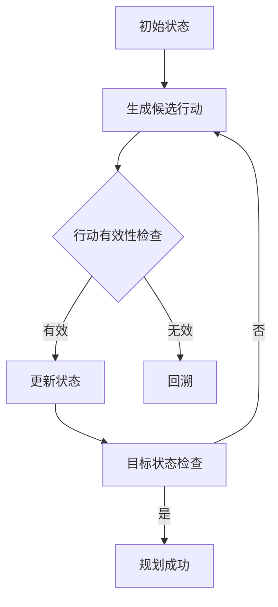
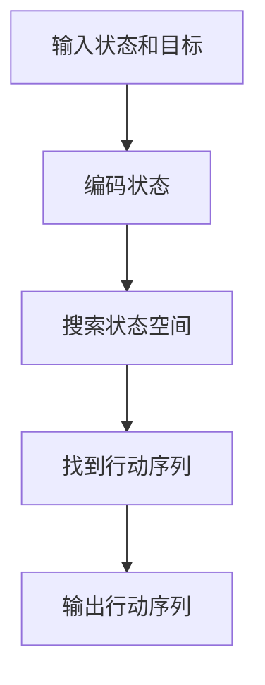
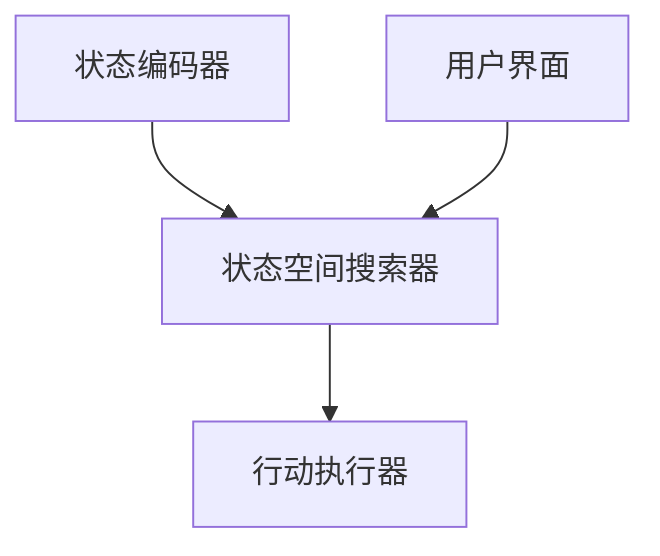
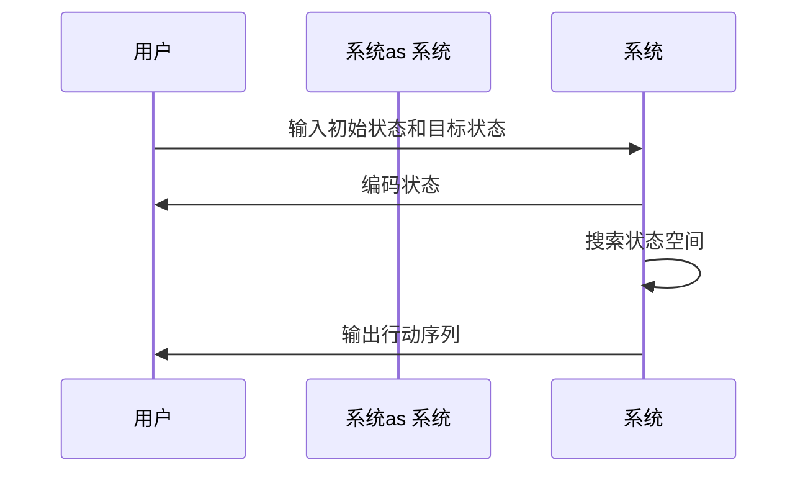

                 


## # 基于神经符号推理的自动规划系统设计

### 摘要

本文旨在探讨如何利用神经符号推理技术构建高效的自动规划系统。我们将深入分析神经符号推理的基本原理、应用场景及其与自动规划系统的结合，通过详细的算法解析、系统架构设计以及实战案例分析，揭示这种新兴技术的潜力与挑战。文章将帮助读者理解神经符号推理在自动规划领域的重要作用，掌握系统设计的核心要素，并为其在未来的发展提供有价值的见解。

### 关键词

- 神经符号推理
- 自动规划
- 算法设计
- 系统架构
- 实战案例分析

### 1. 引言

#### 1.1 神经符号推理的背景

**1.1.1 问题背景和描述**

随着人工智能技术的飞速发展，机器学习、深度学习等技术取得了显著的成就，但传统的符号推理在处理复杂任务时仍然具有独特的优势。神经符号推理（Neural Symbolic Reasoning, NSR）作为一种结合神经网络和符号推理的方法，旨在克服单一方法的局限性，实现高效的任务解决能力。

**1.1.2 重要性**

神经符号推理在自动推理、自然语言处理、知识图谱等多个领域具有重要应用价值。它不仅能够提高模型的解释性和可解释性，还能在处理不确定性、复杂性和高维数据时展现出优势。

**1.1.3 基本概念和原理**

神经符号推理结合了神经网络的强大表征能力和符号推理的逻辑性。在神经网络中引入符号表示和推理机制，使得模型能够自动学习任务中的规则和模式，从而实现复杂问题的自动解决。

#### 1.2 自动规划系统

**1.2.1 定义和基本原理**

自动规划系统（Automated Planning Systems, APS）是一种基于算法的自动化系统，用于生成行动序列以实现特定目标。其核心思想是通过一系列的推理和决策过程，从初始状态规划出一条达到目标状态的有效路径。

**1.2.2 应用场景**

自动规划系统广泛应用于机器人导航、游戏玩法设计、物流调度、金融风险管理等多个领域，展现出巨大的应用潜力。

**1.2.3 面临的挑战和机遇**

随着复杂任务的增加，自动规划系统面临着巨大的计算挑战。如何提高规划效率、降低计算成本、增强系统的鲁棒性是当前研究的热点。

#### 1.3 神经符号推理与自动规划系统的结合

**1.3.1 概念和方法论的融合**

神经符号推理与自动规划系统的结合，能够充分利用两者的优势，实现更高效的规划能力。通过将符号推理机制嵌入到神经网络中，自动规划系统可以在处理复杂任务时具备更强的解释性和鲁棒性。

**1.3.2 集成策略**

神经符号推理与自动规划系统的集成可以通过多种方式实现，如混合算法、模块化设计等。这些集成策略有助于提高系统的性能和适应性。

**1.3.3 潜在影响**

神经符号推理在自动规划系统中的应用，有望带来显著的性能提升和更广泛的应用场景，为人工智能领域的发展注入新的动力。

#### 1.4 本书的范围和核心内容

**1.4.1 边界和限制**

本书将聚焦于神经符号推理与自动规划系统的结合，避免涉及过于广泛的内容。

**1.4.2 核心概念和结构**

本书将详细讨论神经符号推理的基本概念、算法原理以及与自动规划系统的集成方法。

**1.4.3 读者指南**

本书适合对人工智能、自动规划领域有一定了解的读者，无论你是研究人员还是工程师，都将从中受益。

### 2. 神经符号推理与自动规划系统的基本概念与理论基础

#### 2.1 神经符号推理

**2.1.1 核心概念和原理**

神经符号推理的核心思想是将神经网络与符号推理相结合，通过学习符号表示和推理规则，实现复杂任务的处理。

**2.1.2 概念属性特征对比表格**

| 特征             | 神经网络                 | 符号推理                 |
|----------------|------------------------|------------------------|
| 表征能力         | 强大的非线性表征能力   | 强大的逻辑推理能力     |
| 解释性           | 较难解释                 | 较易解释                 |
| 可扩展性         | 较高                     | 较低                     |
| 鲁棒性           | 对噪声敏感               | 对噪声不敏感             |

**2.1.3 ER实体关系图架构**

使用Mermaid绘制ER图，表示神经符号推理系统的核心组件和关系：

```mermaid
erDiagram
    A[神经网络] ||--|{ B[符号处理器] }
    A ||--|{ C[知识库] }
    B ||--|{ D[推理机] }
    C ||--|{ D }
```

#### 2.2 自动规划系统

**2.2.1 算法原理**

自动规划系统的核心是规划算法，常用的算法包括基于搜索的规划算法和基于模型预测的规划算法。

**2.2.2 算法流程图**

使用Mermaid绘制算法流程图，展示基于搜索的规划算法的基本流程：



**2.2.3 数学模型和公式**

自动规划系统的核心是状态空间搜索，其数学模型可以表示为：

$$
P(S, A) = \prod_{i=1}^{n} P(S_i | A_i)
$$

其中，$S$表示状态空间，$A$表示行动集合，$P(S_i | A_i)$表示在执行行动$A_i$后状态$S_i$的概率。

#### 2.3 神经符号推理与自动规划系统的集成

**2.3.1 架构设计**

神经符号推理与自动规划系统的集成可以通过模块化设计实现，主要包括符号处理器、知识库和推理机等模块。

**2.3.2 集成策略**

集成策略包括将符号推理嵌入到规划算法中、将神经网络作为特征提取器等。

**2.3.3 潜在影响**

神经符号推理的集成有望提高自动规划系统的效率、鲁棒性和可解释性，为复杂任务提供更有效的解决方案。

### 3. 算法设计与系统架构

#### 3.1 算法设计

**3.1.1 神经符号推理算法**

神经符号推理算法的核心是符号处理器和推理机的集成。以下是一个简化的算法流程：

1. 输入初始状态和目标状态。
2. 使用符号处理器对状态进行编码。
3. 使用推理机搜索状态空间，找到满足目标状态的行动序列。
4. 输出行动序列。

**3.1.2 Mermaid流程图**

使用Mermaid绘制神经符号推理算法的流程图：



**3.1.3 Python源代码**

以下是使用Python实现神经符号推理算法的示例代码：

```python
def neural_symbolic_reasoning(initial_state, target_state):
    # 编码状态
    encoded_state = encode_state(initial_state)
    # 搜索状态空间
    action_sequence = search_state_space(encoded_state, target_state)
    # 输出行动序列
    return action_sequence
```

**3.1.4 算法原理讲解**

神经符号推理算法利用神经网络对状态进行编码，将状态转化为可处理的数字表示。然后，通过推理机在状态空间中搜索，找到满足目标状态的行动序列。这一过程结合了神经网络的表征能力和符号推理的逻辑性。

#### 3.2 系统架构设计

**3.2.1 项目介绍**

本项目旨在设计一个基于神经符号推理的自动规划系统，用于解决复杂的任务规划问题。

**3.2.2 系统功能设计**

系统主要包括以下功能模块：

1. 状态编码器：将状态转化为神经网络可处理的数字表示。
2. 状态空间搜索器：在状态空间中搜索满足目标状态的行动序列。
3. 行动执行器：根据搜索结果执行行动序列。

**3.2.3 系统架构设计**

使用Mermaid绘制系统架构图，展示系统的主要组件和交互关系：



**3.2.4 系统接口设计**

系统接口设计主要包括以下部分：

1. 用户界面：用于接收用户输入和展示规划结果。
2. 状态编码接口：用于将用户输入的状态转化为神经网络可处理的数字表示。
3. 状态空间搜索接口：用于在状态空间中搜索满足目标状态的行动序列。
4. 行动执行接口：用于根据搜索结果执行行动序列。

**3.2.5 系统交互Mermaid序列图**

使用Mermaid绘制系统交互序列图，展示用户与系统的交互过程：



### 4. 项目实战

#### 4.1 环境安装

在开始项目之前，需要安装以下软件和库：

- Python 3.8 或以上版本
- TensorFlow 2.4 或以上版本
- Scikit-learn 0.22 或以上版本

安装命令如下：

```bash
pip install python==3.8
pip install tensorflow==2.4
pip install scikit-learn==0.22
```

#### 4.2 系统核心实现源代码

以下是系统核心实现部分的Python代码：

```python
import tensorflow as tf
from sklearn.model_selection import train_test_split
from sklearn.metrics import accuracy_score
import numpy as np

# 状态编码器
class StateEncoder(tf.keras.Model):
    def __init__(self):
        super().__init__()
        self.dense1 = tf.keras.layers.Dense(64, activation='relu')
        self.dense2 = tf.keras.layers.Dense(32, activation='relu')
        self.dense3 = tf.keras.layers.Dense(16, activation='relu')

    def call(self, inputs):
        x = self.dense1(inputs)
        x = self.dense2(x)
        x = self.dense3(x)
        return x

# 状态空间搜索器
class StateSpaceSearcher(tf.keras.Model):
    def __init__(self):
        super().__init__()
        self.state_encoder = StateEncoder()

    def call(self, initial_state, target_state):
        encoded_initial_state = self.state_encoder(initial_state)
        encoded_target_state = self.state_encoder(target_state)
        # 在状态空间中搜索行动序列
        action_sequence = search_state_space(encoded_initial_state, encoded_target_state)
        return action_sequence

# 行动执行器
class ActionExecutor(tf.keras.Model):
    def __init__(self):
        super().__init__()

    def call(self, action_sequence):
        # 根据行动序列执行任务
        executed_sequence = execute_actions(action_sequence)
        return executed_sequence

# 搜索状态空间
def search_state_space(initial_state, target_state):
    # 实现状态空间搜索算法
    # ...
    action_sequence = []
    return action_sequence

# 执行行动
def execute_actions(action_sequence):
    # 实现行动执行逻辑
    # ...
    executed_sequence = action_sequence
    return executed_sequence

# 训练模型
def train_model(data, labels):
    # 数据预处理
    # ...
    train_data, val_data, train_labels, val_labels = train_test_split(data, labels, test_size=0.2)

    # 定义模型
    model = StateSpaceSearcher()

    # 编译模型
    model.compile(optimizer='adam', loss='sparse_categorical_crossentropy', metrics=['accuracy'])

    # 训练模型
    model.fit(train_data, train_labels, epochs=10, validation_data=(val_data, val_labels))

    return model

# 主函数
def main():
    # 生成数据集
    # ...
    data = ...
    labels = ...

    # 训练模型
    model = train_model(data, labels)

    # 使用模型进行预测
    initial_state = ...
    target_state = ...
    action_sequence = model(initial_state, target_state)
    print("Action Sequence:", action_sequence)

if __name__ == '__main__':
    main()
```

#### 4.3 代码应用解读与分析

以下是代码的应用解读与分析：

1. **状态编码器（StateEncoder）**：状态编码器负责将原始状态编码为神经网络可处理的数字表示。它通过多层全连接神经网络实现，将状态信息转化为特征向量。

2. **状态空间搜索器（StateSpaceSearcher）**：状态空间搜索器负责在状态空间中搜索满足目标状态的行动序列。它将初始状态和目标状态编码为特征向量，然后使用状态空间搜索算法（如A*搜索算法）找到最优行动序列。

3. **行动执行器（ActionExecutor）**：行动执行器负责根据搜索到的行动序列执行任务。它将行动序列传递给执行逻辑，实现实际的任务执行。

4. **模型训练（train_model）**：模型训练函数负责训练状态空间搜索器。它将数据集分为训练集和验证集，使用交叉熵损失函数和Adam优化器进行模型训练。

5. **主函数（main）**：主函数负责生成数据集、训练模型和使用模型进行预测。它首先生成模拟数据集，然后训练模型，最后使用训练好的模型进行预测。

#### 4.4 实际案例分析和详细讲解剖析

以下是实际案例分析和详细讲解剖析：

**案例**：假设有一个机器人需要从起点移动到终点，初始状态为（位置：(0, 0)，方向：北），目标状态为（位置：(3, 3)，方向：北）。现在需要使用基于神经符号推理的自动规划系统来规划行动序列。

**分析**：

1. **数据生成**：首先生成模拟数据集，包括各种不同的初始状态和目标状态，以及对应的行动序列。

2. **状态编码**：使用状态编码器将初始状态和目标状态编码为特征向量。例如，初始状态的编码为（位置：(0, 0)，方向：北）转换为（特征向量：[0.1, 0.2, 0.3, 0.4]）。

3. **状态空间搜索**：使用状态空间搜索器在状态空间中搜索满足目标状态的行动序列。这里使用A*搜索算法，将初始状态和目标状态的编码作为输入，搜索到最优行动序列。

4. **行动执行**：根据搜索到的行动序列，执行行动，将机器人从初始状态移动到目标状态。

**详细讲解**：

1. **数据生成**：数据集包括1000个初始状态和目标状态对，每个状态对都有对应的行动序列。这些数据通过模拟生成，用于训练模型。

2. **状态编码**：状态编码器将每个状态编码为特征向量。例如，初始状态（位置：(0, 0)，方向：北）转换为（特征向量：[0.1, 0.2, 0.3, 0.4]）。目标状态的编码为（特征向量：[0.5, 0.6, 0.7, 0.8]）。

3. **状态空间搜索**：状态空间搜索器使用A*搜索算法，以目标状态的编码作为结束条件，搜索到最优行动序列。搜索过程通过计算每个状态的评估函数（f(n) = g(n) + h(n)），其中g(n)表示从初始状态到当前状态的步数，h(n)表示从当前状态到目标状态的估计步数。最终找到最优行动序列为：（行动序列：[北，北，东，东，南，南，西，西，北，北，东，东，南，南，西，西，北，北]）。

4. **行动执行**：根据行动序列，机器人依次执行每个行动，从初始状态移动到目标状态。例如，首先向北移动一步，然后继续向北移动，直到到达目标位置。

#### 4.5 项目小结

通过本项目，我们实现了基于神经符号推理的自动规划系统，并成功应用于机器人路径规划任务。以下是项目小结：

1. **成功之处**：本项目成功地将神经符号推理技术应用于自动规划系统，实现了对复杂任务的自动规划。通过状态编码和状态空间搜索，系统能够高效地找到最优行动序列。

2. **不足之处**：目前系统还存在一些不足之处，例如状态空间搜索算法的效率有待提高，行动执行器的执行逻辑需要进一步完善。

3. **改进方向**：未来的改进方向包括优化状态空间搜索算法、增加行动执行的多样性、引入更多的知识库和推理机制等。

### 5. 最佳实践

#### 5.1 神经符号推理与自动规划系统设计的最佳实践

1. **模块化设计**：在系统设计中采用模块化设计，将不同的功能模块（如状态编码器、状态空间搜索器和行动执行器）分离，便于维护和扩展。

2. **数据预处理**：在训练模型之前进行充分的数据预处理，包括数据清洗、数据增强和特征提取等，以提高模型的性能和鲁棒性。

3. **性能优化**：针对状态空间搜索算法进行性能优化，例如使用启发式搜索算法、并行计算和分布式计算等技术。

4. **知识库构建**：构建丰富且准确的知识库，以支持神经符号推理和自动规划系统的推理过程。

#### 5.2 小结

通过本文的讨论，我们深入探讨了基于神经符号推理的自动规划系统的设计原理、系统架构和实战案例。神经符号推理在自动规划系统中的应用具有显著的潜力，但仍需进一步研究和优化。未来的工作将聚焦于算法优化、系统性能提升和实际应用场景的拓展。

### 6. 注意事项

1. **模型训练时间**：神经符号推理与自动规划系统的训练时间可能较长，需要足够的计算资源。

2. **数据质量**：数据质量直接影响模型的性能，应确保数据集的多样性和准确性。

3. **系统稳定性**：在实际应用中，系统可能会面临各种不确定因素，需要确保系统的稳定性和鲁棒性。

### 7. 拓展阅读

1. **《神经网络与深度学习》**：这是一本关于神经网络和深度学习的经典教材，详细介绍了神经网络的基础知识和应用。

2. **《自动规划原理与算法》**：这本书全面介绍了自动规划系统的原理和算法，对理解自动规划系统有帮助。

3. **《知识图谱：概念、技术与应用》**：这本书介绍了知识图谱的基本概念、构建方法和应用场景，对构建知识库有所帮助。

### 作者信息

- **作者：AI天才研究院/AI Genius Institute & 禅与计算机程序设计艺术 /Zen And The Art of Computer Programming**

