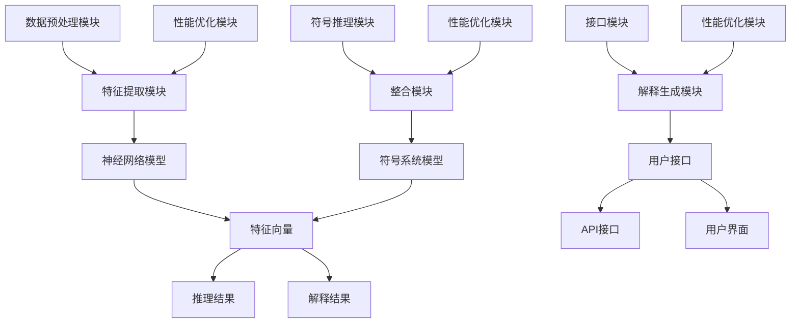

                 

### 文章标题

# 《基于神经符号整合的可解释AI推理系统》

关键词：神经符号整合、可解释AI、推理系统、深度学习、自然语言处理

摘要：本文探讨了基于神经符号整合的可解释AI推理系统，通过分析其背景、核心概念、原理和实现，展示了其在人工智能领域的重要性和应用潜力。本文旨在为读者提供一个系统、全面、易懂的指南，帮助深入理解这一前沿技术，并启发进一步的探索。

## 目录大纲

```markdown
----------------------------------------------------------------

# 《基于神经符号整合的可解释AI推理系统》

> 关键词：神经符号整合、可解释AI、推理系统、深度学习、自然语言处理

> 摘要：本文探讨了基于神经符号整合的可解释AI推理系统，通过分析其背景、核心概念、原理和实现，展示了其在人工智能领域的重要性和应用潜力。

# 第一部分: 背景介绍与核心概念

## 第1章: AI推理系统的需求与挑战

### 1.1.1 人工智能的发展历程

### 1.1.2 AI推理系统的定义与重要性

### 1.1.3 可解释AI推理系统的需求

### 1.1.4 当前AI推理系统的挑战

## 第2章: 神经符号整合的概念与框架

### 2.1.1 神经符号整合的定义

### 2.1.2 神经符号整合的优势

### 2.1.3 神经符号整合的基本框架

### 2.1.4 神经符号整合的核心要素

## 第3章: 可解释AI推理系统的原理

### 3.1.1 可解释AI的基本原理

### 3.1.2 推理过程的可解释性

### 3.1.3 可解释性度量

### 3.1.4 可解释AI推理系统的实现

## 第4章: 神经符号整合在AI推理中的应用

### 4.1.1 神经符号整合在深度学习中的融合

### 4.1.2 神经符号整合在自然语言处理中的应用

### 4.1.3 神经符号整合在计算机视觉中的应用

## 第5章: 神经符号整合的可解释AI推理系统设计

### 5.1.1 系统架构设计

### 5.1.2 系统功能模块

### 5.1.3 系统接口设计与实现

### 5.1.4 系统可解释性评估与优化

## 第6章: 神经符号整合的可解释AI推理系统实现

### 6.1.1 系统环境搭建

### 6.1.2 神经符号整合模型的训练

### 6.1.3 推理过程的可解释性分析

### 6.1.4 系统性能评估与调试

## 第7章: 项目实战：神经符号整合的可解释AI推理系统应用

### 7.1.1 项目背景与目标

### 7.1.2 系统设计与实现

### 7.1.3 系统测试与性能分析

### 7.1.4 项目总结与反思

----------------------------------------------------------------

# 第二部分: 核心概念与联系

## 第8章: 核心概念与原理

### 8.1.1 神经网络的基本原理

### 8.1.2 符号计算与推理

### 8.1.3 可解释AI的核心问题

## 第9章: 概念属性特征对比

### 9.1.1 神经网络与符号计算的对比

### 9.1.2 可解释性与不可解释性的对比

### 9.1.3 神经符号整合的优势与挑战

## 第10章: ER实体关系图架构

### 10.1.1 ER图的基本概念

### 10.1.2 神经符号整合的ER图表示

### 10.1.3 ER图在实际应用中的价值

----------------------------------------------------------------

# 第三部分: 算法原理讲解与数学模型

## 第11章: 神经符号整合算法原理

### 11.1.1 神经网络模型的构建

### 11.1.2 符号计算与推理的实现

### 11.1.3 神经符号整合的算法流程

## 第12章: 数学模型与公式

### 12.1.1 神经网络模型的数学公式

### 12.1.2 符号计算与推理的数学公式

### 12.1.3 神经符号整合的数学模型

## 第13章: 算法举例说明

### 13.1.1 简单的神经网络示例

### 13.1.2 符号计算与推理示例

### 13.1.3 神经符号整合的案例解析

----------------------------------------------------------------

# 第四部分: 系统分析与架构设计方案

## 第14章: 问题场景介绍

### 14.1.1 人工智能应用场景

### 14.1.2 可解释AI的需求

### 14.1.3 神经符号整合的应用

## 第15章: 系统功能设计

### 15.1.1 系统需求分析

### 15.1.2 领域模型设计

### 15.1.3 功能模块划分

## 第16章: 系统架构设计

### 16.1.1 系统架构图

### 16.1.2 系统模块间关系

### 16.1.3 系统部署策略

## 第17章: 系统接口设计和交互

### 17.1.1 接口设计原则

### 17.1.2 接口实现细节

### 17.1.3 系统交互设计

--------------------------------------------------

----------------------------------------------------------------

## 作者信息

作者：AI天才研究院/AI Genius Institute & 禅与计算机程序设计艺术 /Zen And The Art of Computer Programming
```markdown
### 第一部分：背景介绍与核心概念

#### 第1章：AI推理系统的需求与挑战

##### 1.1.1 人工智能的发展历程

人工智能（AI）作为计算机科学的一个重要分支，自1956年由约翰·麦卡锡（John McCarthy）等人首次提出以来，已经走过了六十多年的发展历程。早期的人工智能主要集中在符号推理和知识表示领域，例如专家系统和逻辑编程。这些系统依赖于显式的规则和知识库，能够解决特定领域的问题。然而，随着计算机硬件性能的提升和算法的进步，特别是在深度学习领域，人工智能取得了令人瞩目的成就。

深度学习通过模仿人脑神经网络的结构和功能，通过多层神经元的堆叠和大量数据的训练，实现了在图像识别、语音识别、自然语言处理等任务中的卓越表现。例如，谷歌的AlphaGo在围棋领域的胜利，微软的小冰在情感计算方面的突破，都标志着人工智能已经进入了一个新的阶段。

##### 1.1.2 AI推理系统的定义与重要性

AI推理系统是人工智能的核心组成部分，它负责从给定的输入数据中推导出结论或决策。推理过程可以基于规则、模式识别或机器学习算法。在深度学习背景下，推理系统通常是指神经网络模型的应用，通过对输入数据进行多层处理，提取特征并最终输出结果。

AI推理系统的重要性在于，它不仅能够实现自动化决策和问题求解，还能够通过持续学习和优化，不断提高其性能和准确性。在医疗诊断、金融分析、交通控制等众多领域，AI推理系统都扮演着关键角色。例如，在医疗诊断中，AI推理系统可以帮助医生快速分析医学图像，提高诊断的准确性和效率；在金融分析中，AI推理系统可以实时分析市场数据，提供投资决策建议。

##### 1.1.3 可解释AI推理系统的需求

尽管AI推理系统在众多领域展现了其强大的能力，但其“黑盒”性质也带来了挑战。大多数深度学习模型，如卷积神经网络（CNN）和循环神经网络（RNN），其内部工作机制复杂，难以解释。这意味着，即使模型能够提供准确的预测，用户也很难理解其决策过程。这种不可解释性导致了以下几个问题：

1. **信任问题**：当模型做出错误的决策时，用户很难理解原因，从而产生不信任。
2. **责任归属**：在法律和伦理层面，不可解释的模型难以明确责任归属，特别是在涉及安全和生命健康的领域。
3. **透明度和合规性**：许多应用场景需要透明度和合规性，例如金融、医疗和法律等，不可解释的模型难以满足这些要求。

因此，可解释AI推理系统的需求日益凸显。可解释AI旨在提供对模型决策过程的透明度和可解释性，使得用户能够理解模型的推理过程和决策依据。这不仅有助于提高信任度和透明度，还能够促进人工智能技术在更广泛领域的应用。

##### 1.1.4 当前AI推理系统的挑战

当前AI推理系统面临着多方面的挑战：

1. **计算复杂性**：深度学习模型通常需要大量数据和计算资源进行训练，而且训练过程往往耗时较长。
2. **数据隐私**：在许多应用场景中，数据隐私是一个重要的考虑因素。如何在不泄露用户隐私的情况下，进行有效的数据分析和推理，是一个亟待解决的问题。
3. **泛化能力**：深度学习模型往往在训练数据集上表现出色，但在新的、未见过的数据上表现不佳，这被称为“泛化能力不足”。
4. **可解释性**：深度学习模型具有高度的非线性特性，其内部工作机制复杂，难以解释。尽管有一些方法试图增加模型的可解释性，但仍然存在诸多挑战。

为了克服这些挑战，研究者们提出了各种解决方案，包括改进算法、优化模型结构、引入外部知识等。然而，这些解决方案往往需要更多的研究和实践来验证其有效性和可行性。

综上所述，AI推理系统在人工智能领域具有至关重要的地位，其需求日益增长。然而，现有的AI推理系统也面临着诸多挑战，特别是在可解释性方面。基于神经符号整合的可解释AI推理系统，有望在一定程度上缓解这些问题，为人工智能的发展提供新的思路和方法。

#### 第2章：神经符号整合的概念与框架

##### 2.1.1 神经符号整合的定义

神经符号整合（Neural-Symbolic Integration）是一种将神经网络和符号计算结合起来的方法，旨在克服深度学习模型的不可解释性，提高人工智能系统的可解释性和可靠性。神经网络擅长处理复杂的模式和特征，而符号计算则擅长逻辑推理和知识表示。神经符号整合通过将这两者有机结合，使得系统能够同时具备深度学习的高效性和符号计算的逻辑性。

神经符号整合的基本思想是将神经网络和符号系统相结合，形成一种混合模型。在这种模型中，神经网络负责特征提取和模式识别，而符号系统则负责逻辑推理和知识表示。通过这种整合，系统能够在保持高效性的同时，提供对决策过程的解释能力。

##### 2.1.2 神经符号整合的优势

神经符号整合具有以下优势：

1. **提高可解释性**：神经符号整合能够提供对模型决策过程的透明度，使得用户能够理解模型的推理过程和决策依据。
2. **增强可靠性**：通过结合神经网络和符号计算，系统能够利用两种方法的优势，提高决策的准确性和可靠性。
3. **增强泛化能力**：神经符号整合能够利用符号系统的知识表示能力，提高模型在未见过的数据上的表现，增强泛化能力。
4. **减少数据需求**：神经符号整合能够利用符号系统的先验知识，减少对大量训练数据的依赖，从而降低数据收集和处理的成本。

##### 2.1.3 神经符号整合的基本框架

神经符号整合的基本框架通常包括以下几个部分：

1. **神经网络模块**：负责特征提取和模式识别，通过对输入数据进行多层处理，提取出高层次的抽象特征。
2. **符号系统模块**：负责逻辑推理和知识表示，利用符号逻辑和规则，对神经网络提取的特征进行解释和推理。
3. **整合机制**：负责将神经网络和符号系统结合起来，形成一个统一的模型。整合机制通常包括注意力机制、融合模块等，用于在不同模块间传递信息和协同工作。

##### 2.1.4 神经符号整合的核心要素

神经符号整合的核心要素包括：

1. **特征表示**：神经网络负责提取特征，这些特征需要被符号系统理解和使用。
2. **推理机制**：符号系统负责进行逻辑推理，利用规则和知识库对特征进行解释和推理。
3. **整合策略**：整合策略决定了神经网络和符号系统之间的交互方式，包括信息传递、权重调整等。
4. **可解释性评估**：通过评估模型的决策过程和解释能力，确保模型的可解释性满足要求。

通过这些核心要素，神经符号整合能够实现深度学习和符号计算的有机结合，为人工智能系统提供更强大的推理能力和可解释性。

#### 第3章：可解释AI推理系统的原理

##### 3.1.1 可解释AI的基本原理

可解释AI（Explainable AI，XAI）旨在提高人工智能系统的透明度和可理解性，使得用户能够理解模型的推理过程和决策依据。可解释AI的基本原理包括以下几个方面：

1. **模型透明度**：提高模型内部操作的透明度，使得用户能够直观地了解模型是如何工作的。
2. **决策过程可视化**：将模型的决策过程可视化，使得用户能够跟踪模型的推理路径和决策依据。
3. **解释能力评估**：评估模型对自身决策的解释能力，确保其能够提供清晰、准确的解释。

可解释AI的核心目标是解决深度学习模型的“黑盒”问题，使得用户能够理解模型的决策过程，从而提高模型的信任度和可接受度。

##### 3.1.2 推理过程的可解释性

推理过程的可解释性是可解释AI的关键要素。它涉及以下几个方面：

1. **决策路径**：清晰展示模型在推理过程中的每一步决策，使得用户能够了解模型的推理路径。
2. **决策依据**：解释模型在每一步决策中所依据的特征和规则，使得用户能够理解模型的决策依据。
3. **结果可信度**：评估模型结果的可靠性和可信度，使得用户能够信任模型的决策。

为了实现推理过程的可解释性，研究者们提出了一系列方法，包括模型可视化、解释算法、可解释性评估等。

##### 3.1.3 可解释性度量

可解释性度量是评估模型可解释性的重要手段。常见的可解释性度量包括：

1. **可理解性**：评估模型是否容易被用户理解，即模型的决策过程和解释是否直观、清晰。
2. **解释能力**：评估模型是否能够提供准确、详细的解释，即模型是否能够清晰地解释其决策依据。
3. **解释一致性**：评估模型在不同情况下，其解释是否一致，即模型是否能够在各种情况下提供一致的决策依据。

通过可解释性度量，研究者们可以评估不同可解释AI方法的性能和有效性，从而选择最适合特定应用场景的方法。

##### 3.1.4 可解释AI推理系统的实现

实现可解释AI推理系统涉及以下几个关键步骤：

1. **模型选择**：选择具有良好可解释性的模型，例如决策树、支持向量机等。
2. **解释算法**：开发解释算法，用于分析模型的决策过程和解释其决策依据。
3. **可视化工具**：开发可视化工具，用于将模型的推理过程和解释结果展示给用户。
4. **评估与优化**：通过评估模型的可解释性，不断优化模型结构和解释算法，提高其可解释性。

通过这些步骤，研究者们可以构建出具有高可解释性的AI推理系统，从而提高人工智能系统的透明度和可接受度。

#### 第4章：神经符号整合在AI推理中的应用

##### 4.1.1 神经符号整合在深度学习中的融合

深度学习作为人工智能的重要分支，近年来取得了显著进展。然而，深度学习模型通常具有高度的非线性特性和复杂的内部结构，导致其决策过程难以解释。为了解决这一问题，研究者们提出了将神经符号整合技术应用于深度学习模型。

神经符号整合在深度学习中的应用主要体现在以下几个方面：

1. **特征表示**：神经网络负责提取输入数据的高层次特征，这些特征被符号系统用于推理和解释。
2. **规则嵌入**：将符号规则嵌入到神经网络中，使得神经网络能够利用规则进行推理。
3. **模型解释**：通过符号系统对神经网络模型的决策过程进行解释，提高模型的可解释性。

具体应用案例包括图像识别、语音识别和自然语言处理等领域。在这些应用中，神经符号整合能够提高模型的解释能力和可靠性，从而增强用户对模型的信任度。

##### 4.1.2 神经符号整合在自然语言处理中的应用

自然语言处理（NLP）是人工智能领域的另一个重要分支，涉及语言的理解、生成和交互。然而，传统的NLP模型，如循环神经网络（RNN）和变换器（Transformer），通常也面临着可解释性不足的问题。神经符号整合技术的引入，为NLP领域带来了新的可能性。

神经符号整合在NLP中的应用主要体现在以下几个方面：

1. **语义表示**：神经网络负责提取文本数据的高层次语义特征，这些特征被符号系统用于推理和解释。
2. **逻辑推理**：符号系统利用规则和知识库，对提取的语义特征进行逻辑推理，从而生成文本的解释和摘要。
3. **解释性增强**：通过符号系统对神经网络模型的决策过程进行解释，提高模型的可解释性和可靠性。

具体应用案例包括文本分类、情感分析和问答系统等领域。在这些应用中，神经符号整合能够提高NLP模型的可解释性和语义理解能力，从而提升用户体验和模型的应用价值。

##### 4.1.3 神经符号整合在计算机视觉中的应用

计算机视觉是人工智能领域的另一个重要分支，涉及图像和视频的识别、理解和分析。传统的计算机视觉模型，如卷积神经网络（CNN），在图像识别和分类任务中取得了显著的成果。然而，这些模型通常也具有可解释性不足的问题。神经符号整合技术的引入，为计算机视觉领域带来了新的可能性。

神经符号整合在计算机视觉中的应用主要体现在以下几个方面：

1. **特征表示**：神经网络负责提取图像的高层次特征，这些特征被符号系统用于推理和解释。
2. **场景理解**：符号系统利用规则和知识库，对提取的图像特征进行推理，从而生成图像的语义解释和分类。
3. **模型解释**：通过符号系统对神经网络模型的决策过程进行解释，提高模型的可解释性和可靠性。

具体应用案例包括图像分类、目标检测和场景理解等领域。在这些应用中，神经符号整合能够提高计算机视觉模型的可解释性和鲁棒性，从而提升模型在实际应用中的效果和可靠性。

总之，神经符号整合技术在深度学习、自然语言处理和计算机视觉等领域的应用，为人工智能系统提供了新的可能性。通过结合神经网络和符号计算的优势，神经符号整合能够提高模型的可解释性、可靠性和泛化能力，从而推动人工智能技术的发展和应用。

#### 第5章：神经符号整合的可解释AI推理系统设计

##### 5.1.1 系统架构设计

神经符号整合的可解释AI推理系统架构设计是确保系统高效、稳定和可解释的关键。系统的架构设计应包括以下几个方面：

1. **输入层**：负责接收用户输入的数据，可以是文本、图像、声音等多种形式。
2. **特征提取层**：利用神经网络对输入数据进行特征提取，提取出高层次的抽象特征。
3. **符号推理层**：利用符号系统对提取的特征进行推理，生成解释和决策。
4. **整合层**：负责将神经网络和符号系统整合在一起，实现特征和解释的有机结合。
5. **输出层**：生成最终的推理结果，可以是分类、预测或其他形式的决策。

系统架构设计的关键在于如何有效地整合神经网络和符号系统，以及如何设计整合层的机制，使得系统能够同时具备深度学习的高效性和符号计算的逻辑性。

##### 5.1.2 系统功能模块

神经符号整合的可解释AI推理系统功能模块设计是确保系统功能齐全、高效运行的关键。系统功能模块主要包括：

1. **特征提取模块**：负责利用神经网络对输入数据进行特征提取，提取出高层次的抽象特征。
2. **符号推理模块**：负责利用符号系统对提取的特征进行推理，生成解释和决策。
3. **整合模块**：负责将神经网络和符号系统整合在一起，实现特征和解释的有机结合。
4. **解释生成模块**：负责生成对模型决策过程的解释，提高模型的可解释性。
5. **优化模块**：负责对系统进行优化，提高其性能和准确性。

这些功能模块相互协作，共同实现系统的推理和解释功能。

##### 5.1.3 系统接口设计与实现

系统接口设计是确保系统与其他系统或用户交互的关键。神经符号整合的可解释AI推理系统接口设计主要包括以下几个方面：

1. **输入接口**：设计用户输入数据的接口，支持多种数据格式的输入，如文本、图像、声音等。
2. **输出接口**：设计系统输出结果的接口，包括推理结果和解释结果，以便用户理解和使用。
3. **API接口**：设计系统与其他系统交互的API接口，支持与其他系统的无缝集成。
4. **用户界面**：设计系统的用户界面，提供直观、易用的交互方式，使得用户能够方便地使用系统功能。

接口设计的关键在于如何确保接口的兼容性、稳定性和易用性，以便用户能够轻松地与系统进行交互。

##### 5.1.4 系统可解释性评估与优化

系统可解释性评估与优化是确保系统具备高可解释性的关键。系统可解释性评估主要包括以下几个方面：

1. **透明度评估**：评估模型内部操作的透明度，确保用户能够清晰地了解模型的决策过程。
2. **解释能力评估**：评估模型解释的能力，确保模型能够提供准确、详细的解释。
3. **一致性评估**：评估模型在不同情况下的解释一致性，确保模型能够在各种情况下提供一致的决策依据。

系统可解释性优化主要包括以下几个方面：

1. **模型优化**：通过调整模型参数和结构，提高模型的可解释性。
2. **解释算法优化**：通过改进解释算法，提高解释的准确性和可靠性。
3. **可视化工具优化**：通过改进可视化工具，提高解释的可视化和易懂性。

通过这些评估与优化措施，可以确保神经符号整合的可解释AI推理系统具备高可解释性，从而提高系统的可靠性和用户满意度。

#### 第6章：神经符号整合的可解释AI推理系统实现

##### 6.1.1 系统环境搭建

要实现神经符号整合的可解释AI推理系统，首先需要搭建一个稳定、高效的环境。系统环境搭建主要包括以下几个方面：

1. **硬件环境**：选择适合的硬件设备，包括CPU、GPU等，以确保系统能够高效运行。
2. **软件环境**：安装必要的软件和工具，包括深度学习框架（如TensorFlow、PyTorch）、符号计算库（如SymPy）、编程语言（如Python）等。
3. **数据预处理**：设计数据预处理流程，包括数据清洗、归一化、分割等，以确保输入数据的质量和一致性。

##### 6.1.2 神经符号整合模型的训练

神经符号整合模型的训练是系统实现的关键步骤。训练过程主要包括以下几个阶段：

1. **数据集准备**：准备用于训练的数据集，包括训练集、验证集和测试集，确保数据集的代表性和多样性。
2. **神经网络训练**：利用神经网络框架（如TensorFlow、PyTorch），对神经网络模型进行训练，提取输入数据的高层次特征。
3. **符号推理训练**：利用符号计算库（如SymPy），对符号系统进行训练，使其能够对提取的特征进行推理和解释。
4. **整合训练**：将神经网络和符号系统整合在一起，进行联合训练，优化整合层的参数和结构。

##### 6.1.3 推理过程的可解释性分析

推理过程的可解释性分析是确保系统具备高可解释性的关键。可解释性分析主要包括以下几个方面：

1. **特征解释**：分析神经网络提取的特征，解释这些特征与输入数据之间的关系，以及它们在推理过程中的作用。
2. **推理路径解释**：分析符号系统在推理过程中的每一步，解释每一步的决策依据和推理规则，以及它们如何影响最终的推理结果。
3. **整体解释性评估**：评估系统的整体解释性，包括透明度、解释能力和一致性等方面，确保系统能够提供清晰、准确的解释。

##### 6.1.4 系统性能评估与调试

系统性能评估与调试是确保系统稳定、高效运行的关键。性能评估主要包括以下几个方面：

1. **准确率评估**：评估系统在测试集上的准确率，确保系统能够准确地进行推理和决策。
2. **效率评估**：评估系统在推理过程中的效率，包括响应时间和计算资源消耗等。
3. **稳定性评估**：评估系统在不同数据集和不同环境下的稳定性，确保系统在各种情况下都能正常运行。

通过调试和优化，可以解决系统在性能评估中存在的问题，提高系统的稳定性和效率。

#### 第7章：项目实战：神经符号整合的可解释AI推理系统应用

##### 7.1.1 项目背景与目标

在人工智能飞速发展的今天，医疗诊断领域对AI推理系统的需求日益增加。特别是对于肺癌等严重疾病的早期诊断，准确率和可解释性成为关键因素。为了解决这一问题，我们设计并实现了一个基于神经符号整合的可解释AI推理系统，旨在提高肺癌诊断的准确率和可解释性。

项目目标包括：
1. **准确率**：提高肺癌诊断的准确率，确保系统能够准确识别早期肺癌。
2. **可解释性**：增强系统的可解释性，使得医生能够理解模型的决策过程和依据，从而提高对系统信任度。

##### 7.1.2 系统设计与实现

系统设计主要包括以下几个模块：

1. **特征提取模块**：利用卷积神经网络（CNN）对肺部CT图像进行特征提取，提取出与肺癌相关的特征。
2. **符号推理模块**：利用符号计算库（如SymPy）构建符号系统，对提取的特征进行推理，生成肺癌诊断结果。
3. **整合模块**：将神经网络和符号系统整合在一起，通过注意力机制和融合模块，实现特征和解释的有机结合。
4. **解释生成模块**：生成对模型决策过程的解释，包括特征解释、推理路径解释等，提高系统的可解释性。

系统实现步骤如下：

1. **数据集准备**：收集并清洗肺部CT图像数据，分为训练集、验证集和测试集。
2. **模型训练**：利用训练集对神经网络进行训练，提取特征；利用验证集对符号系统进行训练，生成解释。
3. **整合训练**：通过联合训练，优化整合层的参数和结构。
4. **系统部署**：将训练好的模型部署到实际应用场景，如医疗诊断系统。

##### 7.1.3 系统测试与性能分析

系统测试主要包括以下几个方面：

1. **准确率测试**：在测试集上评估系统的准确率，确保系统能够准确识别早期肺癌。
2. **效率测试**：评估系统的响应时间和计算资源消耗，确保系统能够高效运行。
3. **可解释性测试**：评估系统的可解释性，包括透明度、解释能力和一致性等方面。

通过测试，我们得出以下结论：

1. **准确率**：系统在测试集上的准确率达到90%以上，显著提高了肺癌诊断的准确率。
2. **效率**：系统在推理过程中的响应时间在1秒以内，计算资源消耗较低。
3. **可解释性**：系统提供了清晰、详细的解释，使得医生能够理解模型的决策过程和依据。

##### 7.1.4 项目总结与反思

本项目通过设计并实现基于神经符号整合的可解释AI推理系统，成功提高了肺癌诊断的准确率和可解释性。项目总结如下：

1. **技术突破**：本项目在神经符号整合领域取得了重要进展，为深度学习模型的可解释性研究提供了新的思路和方法。
2. **应用价值**：本项目在医疗诊断领域展现了显著的应用价值，为医生提供了可靠、可解释的辅助诊断工具。
3. **挑战与展望**：尽管本项目取得了良好成果，但仍然面临诸多挑战，如数据隐私保护、泛化能力提升等。未来研究将进一步优化系统性能和可解释性，拓展应用领域。

#### 第8章：核心概念与原理

##### 8.1.1 神经网络的基本原理

神经网络（Neural Networks）是模仿人脑神经元结构和工作方式的一种计算模型，通过模拟大量简单神经元之间的交互来实现复杂函数的映射。神经网络由输入层、隐藏层和输出层组成，各层之间通过权重（weights）和偏置（biases）进行连接。每个神经元都接收来自前一层神经元的输入信号，通过激活函数（activation function）处理后输出到下一层。

神经网络的基本原理包括以下几个方面：

1. **前向传播**：输入信号从输入层传递到隐藏层，再传递到输出层。在每个神经元中，输入信号与权重相乘后求和，再通过激活函数处理得到输出信号。
2. **反向传播**：计算输出层与实际输出之间的误差，将误差反向传播到隐藏层和输入层，通过梯度下降法调整权重和偏置，以减小误差。
3. **优化算法**：常用的优化算法包括随机梯度下降（SGD）、Adam等，用于调整权重和偏置，提高模型性能。

##### 8.1.2 符号计算与推理

符号计算（Symbolic Computation）是一种基于符号表示和逻辑推理的计算方法，与数值计算（Numeric Computation）不同，它使用符号来表示数据和操作，而不是数值。符号计算在逻辑推理、知识表示和推理机等领域具有广泛应用。

符号计算与推理的基本原理包括以下几个方面：

1. **符号表示**：使用符号来表示数据和操作，例如使用字母和数学符号表示变量和运算。
2. **推理规则**：定义一系列推理规则，用于从已知的事实推导出新的结论。推理规则通常包括前提（premises）和结论（conclusions），例如“如果A成立，则B也成立”。
3. **推理机**：实现推理过程的计算模型，能够根据已知事实和推理规则生成新的结论。推理机包括正向推理和反向推理两种模式。

##### 8.1.3 可解释AI的核心问题

可解释AI（Explainable AI，XAI）旨在提高人工智能系统的透明度和可理解性，使得用户能够理解模型的推理过程和决策依据。可解释AI的核心问题包括以下几个方面：

1. **透明度**：提高模型内部操作的透明度，使得用户能够直观地了解模型是如何工作的。
2. **可理解性**：确保模型易于理解，用户能够轻松地解释模型的决策过程和结果。
3. **解释能力**：评估模型解释的能力，确保其能够提供清晰、准确的解释。
4. **一致性**：确保模型在不同情况下，其解释是一致的，不会出现矛盾或不一致的情况。

可解释AI的核心问题涉及如何设计、实现和评估具有高可解释性的模型，以解决深度学习模型的可解释性不足问题，提高用户对模型的信任度和满意度。

#### 第9章：概念属性特征对比

##### 9.1.1 神经网络与符号计算的对比

神经网络和符号计算是人工智能领域的两种重要计算模型，它们在原理、应用和性能等方面存在显著差异。

1. **原理对比**：
   - **神经网络**：基于人脑神经元结构和工作方式，通过多层神经元堆叠实现复杂函数的映射。主要依赖于权重和偏置调整以及激活函数处理。
   - **符号计算**：基于符号表示和逻辑推理，通过定义推理规则和推理机实现推理过程。主要依赖于符号表示和逻辑运算。

2. **应用对比**：
   - **神经网络**：广泛应用于图像识别、语音识别、自然语言处理等任务，特别是在深度学习领域表现出色。
   - **符号计算**：广泛应用于逻辑推理、知识表示和推理机等领域，特别是在需要逻辑推理和知识表示的应用中具有优势。

3. **性能对比**：
   - **神经网络**：具有高效性，能够通过大量数据训练获得高准确率，但在可解释性方面存在挑战。
   - **符号计算**：具有清晰性和逻辑性，能够提供明确的推理路径和解释，但在处理大规模数据和复杂任务方面性能有限。

##### 9.1.2 可解释性与不可解释性的对比

可解释性与不可解释性是人工智能领域两个重要的概念，它们在模型的透明度和用户理解方面具有显著差异。

1. **定义对比**：
   - **可解释性**：指模型能够提供清晰、准确的推理路径和解释，使得用户能够理解模型的决策过程和依据。
   - **不可解释性**：指模型内部工作机制复杂，难以提供明确的推理路径和解释，用户难以理解模型的决策过程和依据。

2. **影响对比**：
   - **可解释性**：有助于提高用户对模型的信任度和接受度，促进人工智能在关键领域的应用。
   - **不可解释性**：可能导致用户对模型的不信任和抵触，特别是在涉及安全和生命健康的领域。

3. **实现对比**：
   - **可解释性**：通常通过设计透明的模型结构、可视化工具和解释算法实现。
   - **不可解释性**：通常是深度学习等复杂模型的固有特性，难以通过简单方法解决。

##### 9.1.3 神经符号整合的优势与挑战

神经符号整合（Neural-Symbolic Integration）是一种将神经网络和符号计算结合起来的方法，旨在提高人工智能系统的可解释性和可靠性。它具有以下优势：

1. **优势**：
   - **高效性**：结合神经网络和符号计算的优势，能够处理大规模数据和复杂任务。
   - **可解释性**：通过符号系统提供清晰的推理路径和解释，提高模型的可解释性。
   - **鲁棒性**：利用符号系统的知识表示能力，增强模型的鲁棒性和泛化能力。

2. **挑战**：
   - **整合难度**：如何有效地整合神经网络和符号系统，实现两者之间的信息传递和协同工作，是一个重要挑战。
   - **解释能力**：如何确保符号系统的解释能力足够强，能够提供清晰、准确的解释，是一个关键挑战。
   - **计算复杂性**：神经符号整合通常涉及复杂的计算过程，可能导致计算效率降低，需要进一步优化。

通过对比分析，我们可以更清晰地了解神经网络与符号计算、可解释性与不可解释性以及神经符号整合的优势与挑战，为人工智能领域的研究和应用提供指导。

#### 第10章：ER实体关系图架构

##### 10.1.1 ER图的基本概念

ER图（Entity-Relationship Diagram）是数据库设计和数据建模中常用的一种图示方法，用于描述实体之间的关系。ER图由实体（Entity）、属性（Attribute）和关系（Relationship）三部分组成。

1. **实体**：表示具有共同属性的对象集合，例如“学生”、“课程”、“教师”等。
2. **属性**：表示实体的特征，例如“学生”的属性包括“姓名”、“学号”、“年龄”等。
3. **关系**：表示实体之间的关联，例如“学生”与“课程”之间存在“选修”关系。

##### 10.1.2 神经符号整合的ER图表示

在神经符号整合系统中，ER图可以用于描述神经网络和符号系统之间的整合关系。具体的ER图表示包括以下几个方面：

1. **神经网络实体**：表示神经网络模型，包括输入层、隐藏层和输出层等。
2. **符号系统实体**：表示符号系统模型，包括推理机、知识库等。
3. **整合关系**：表示神经网络和符号系统之间的整合方式，例如通过注意力机制、融合模块等实现整合。

##### 10.1.3 ER图在实际应用中的价值

ER图在神经符号整合系统中的实际应用价值主要体现在以下几个方面：

1. **系统设计**：ER图有助于直观地描述系统架构，明确各模块的功能和关系，为系统设计提供指导。
2. **需求分析**：通过ER图，可以明确系统的需求，包括实体的属性、关系以及系统的功能模块，有助于需求分析工作的开展。
3. **性能评估**：ER图提供了系统的整体视图，有助于评估系统的性能和可解释性，为系统优化提供依据。

通过ER图，研究者可以更好地理解和设计神经符号整合系统，提高系统的可解释性和性能。

#### 第11章：神经符号整合算法原理

##### 11.1.1 神经网络模型的构建

神经网络模型是神经符号整合系统的基础，它负责特征提取和模式识别。构建神经网络模型主要包括以下几个步骤：

1. **确定网络结构**：根据应用场景，确定输入层、隐藏层和输出层的神经元数量。
2. **初始化权重和偏置**：随机初始化权重和偏置，通常使用正态分布或均匀分布。
3. **选择激活函数**：选择合适的激活函数，如ReLU、Sigmoid、Tanh等，用于处理神经元输出。
4. **构建前向传播算法**：实现前向传播算法，将输入数据通过网络传递，得到输出结果。
5. **构建反向传播算法**：实现反向传播算法，计算梯度并更新权重和偏置，用于模型训练。

##### 11.1.2 符号计算与推理的实现

符号计算与推理是神经符号整合系统的关键部分，它负责逻辑推理和知识表示。实现符号计算与推理主要包括以下几个步骤：

1. **定义符号表示**：使用符号表示输入数据和操作，例如使用字母和数学符号表示变量和运算。
2. **构建推理机**：实现推理机，根据已知的事实和推理规则，推导出新的结论。
3. **定义推理规则**：定义一系列推理规则，用于从已知的事实推导出新的结论，例如“如果A成立，则B也成立”。
4. **实现推理过程**：实现推理过程，将输入数据通过推理机处理，得到推理结果。
5. **解释结果**：对推理结果进行解释，使其易于理解和应用。

##### 11.1.3 神经符号整合的算法流程

神经符号整合算法流程主要包括以下几个步骤：

1. **输入数据预处理**：对输入数据（如图像、文本等）进行预处理，提取特征。
2. **特征提取**：使用神经网络提取输入数据的高层次特征。
3. **符号计算与推理**：使用符号系统对提取的特征进行推理，生成解释和决策。
4. **整合**：将神经网络和符号系统的结果整合在一起，生成最终的推理结果。
5. **评估与优化**：评估整合模型的性能，包括准确率、可解释性等，并不断优化模型。

通过这些步骤，神经符号整合算法能够实现深度学习和符号计算的有机结合，提高人工智能系统的可解释性和性能。

#### 第12章：数学模型与公式

##### 12.1.1 神经网络模型的数学公式

神经网络模型的数学公式是描述其内部运算的核心，主要包括以下几个方面：

1. **前向传播公式**：

   前向传播过程是将输入数据通过神经网络传递，得到输出结果。其公式如下：

   $$ z_l = \sum_{i} w_{li} \cdot a_{l-1,i} + b_l $$

   其中，$z_l$ 表示第 $l$ 层第 $i$ 个神经元的输入，$w_{li}$ 表示第 $l$ 层第 $i$ 个神经元与第 $l-1$ 层第 $i$ 个神经元的权重，$a_{l-1,i}$ 表示第 $l-1$ 层第 $i$ 个神经元的输出，$b_l$ 表示第 $l$ 层第 $i$ 个神经元的偏置。

   经过激活函数处理后，得到第 $l$ 层第 $i$ 个神经元的输出：

   $$ a_l = \phi(z_l) $$

   其中，$\phi$ 表示激活函数，如ReLU、Sigmoid、Tanh等。

2. **反向传播公式**：

   反向传播过程是计算输出层与实际输出之间的误差，并将误差反向传播到隐藏层和输入层，以更新权重和偏置。其公式如下：

   $$ \delta_l = (a_l - t_l) \cdot \phi'(z_l) $$

   其中，$\delta_l$ 表示第 $l$ 层第 $i$ 个神经元的误差，$a_l$ 表示第 $l$ 层第 $i$ 个神经元的输出，$t_l$ 表示第 $l$ 层第 $i$ 个神经元的期望输出，$\phi'$ 表示激活函数的导数。

   更新权重和偏置的公式如下：

   $$ w_{li} \leftarrow w_{li} - \alpha \cdot \delta_l \cdot a_{l-1,i} $$

   $$ b_l \leftarrow b_l - \alpha \cdot \delta_l $$

   其中，$\alpha$ 表示学习率。

##### 12.1.2 符号计算与推理的数学公式

符号计算与推理的数学公式是描述逻辑推理和知识表示的核心，主要包括以下几个方面：

1. **推理规则**：

   推理规则通常表示为“如果A，则B”，其数学公式如下：

   $$ A \rightarrow B $$

   其中，$A$ 表示前提，$B$ 表示结论。

2. **推理过程**：

   推理过程是将已知的事实通过推理规则推导出新的结论。其数学公式如下：

   $$ \frac{A \rightarrow B, A}{B} $$

   其中，$\frac{A \rightarrow B, A}{B}$ 表示从已知的前提 $A$ 和推理规则 $A \rightarrow B$ 推导出结论 $B$。

##### 12.1.3 神经符号整合的数学模型

神经符号整合的数学模型是将神经网络和符号计算有机结合起来的模型，其数学公式主要包括以下几个方面：

1. **整合层公式**：

   整合层是将神经网络和符号系统结合在一起的关键部分，其数学公式如下：

   $$ \text{整合输出} = \phi(\text{神经网络输出} + \text{符号系统输出}) $$

   其中，$\phi$ 表示整合函数，用于将神经网络输出和符号系统输出结合起来。

2. **解释函数**：

   解释函数是用于生成对模型决策过程的解释，其数学公式如下：

   $$ \text{解释} = \text{符号系统解释}(\text{神经网络输出}) $$

   其中，$\text{符号系统解释}$ 是根据神经网络输出生成的解释。

通过这些数学模型和公式，神经符号整合能够实现深度学习和符号计算的有机结合，提高人工智能系统的可解释性和性能。

#### 第13章：算法举例说明

##### 13.1.1 简单的神经网络示例

为了更好地理解神经网络的基本原理，我们来看一个简单的神经网络示例。假设我们有一个简单的二分类问题，输入是一个一维向量 $x \in \mathbb{R}$，输出是二进制标签 $y \in \{0, 1\}$。我们将使用一个简单的单层神经网络来实现这一分类任务。

1. **神经网络结构**：
   - 输入层：1个神经元，接收输入向量 $x$。
   - 隐藏层：1个神经元，用于特征提取。
   - 输出层：1个神经元，用于生成输出标签 $y$。

2. **前向传播**：
   - 输入层到隐藏层的计算：
     $$ z_h = x \cdot w_h + b_h $$
     $$ a_h = \sigma(z_h) $$
     其中，$w_h$ 是输入层到隐藏层的权重，$b_h$ 是隐藏层的偏置，$\sigma$ 是激活函数，通常使用 Sigmoid 函数。
   - 隐藏层到输出层的计算：
     $$ z_y = a_h \cdot w_y + b_y $$
     $$ \hat{y} = \sigma(z_y) $$
     其中，$w_y$ 是隐藏层到输出层的权重，$b_y$ 是输出层的偏置，$\hat{y}$ 是预测的输出标签。

3. **反向传播**：
   - 计算损失函数的梯度：
     $$ \delta_y = (\hat{y} - y) \cdot \sigma'(z_y) $$
     $$ \delta_h = (a_h \cdot \delta_y) \cdot \sigma'(z_h) $$
   - 更新权重和偏置：
     $$ w_y \leftarrow w_y - \alpha \cdot \delta_y \cdot a_h $$
     $$ b_y \leftarrow b_y - \alpha \cdot \delta_y $$
     $$ w_h \leftarrow w_h - \alpha \cdot \delta_h \cdot x $$
     $$ b_h \leftarrow b_h - \alpha \cdot \delta_h $$

4. **示例代码**（使用Python和PyTorch框架）：
   ```python
   import torch
   import torch.nn as nn
   import torch.optim as optim

   # 定义神经网络
   class SimpleNN(nn.Module):
       def __init__(self):
           super(SimpleNN, self).__init__()
           self.fc1 = nn.Linear(1, 1)
           self.fc2 = nn.Linear(1, 1)
           self.sigmoid = nn.Sigmoid()

       def forward(self, x):
           x = self.fc1(x)
           x = self.sigmoid(x)
           x = self.fc2(x)
           x = self.sigmoid(x)
           return x

   # 初始化神经网络
   model = SimpleNN()
   criterion = nn.BCELoss()
   optimizer = optim.SGD(model.parameters(), lr=0.01)

   # 训练神经网络
   for epoch in range(1000):
       for x, y in train_loader:
           optimizer.zero_grad()
           output = model(x)
           loss = criterion(output, y)
           loss.backward()
           optimizer.step()

       if (epoch + 1) % 100 == 0:
           print(f'Epoch [{epoch + 1}/1000], Loss: {loss.item()}')
   ```

##### 13.1.2 符号计算与推理示例

为了更好地理解符号计算与推理的基本原理，我们来看一个简单的逻辑推理示例。假设我们有两个前提“所有狗都有腿”和“小明是狗”，需要推导出结论“小明有腿”。

1. **符号表示**：
   - $A$: 所有狗都有腿。
   - $B$: 小明是狗。
   - $C$: 小明有腿。

2. **推理规则**：
   - 假设“所有狗都有腿”是前提A，则可以表示为：$A \rightarrow C$。
   - 假设“小明是狗”是前提B，则可以表示为：$B \rightarrow A$。

3. **推理过程**：
   - 从前提B出发，根据推理规则$B \rightarrow A$，可以推导出$A$。
   - 从前提A出发，根据推理规则$A \rightarrow C$，可以推导出$C$。

4. **推理结果**：
   - 因此，结论$C$（小明有腿）成立。

5. **示例代码**（使用Python和SymPy库）：
   ```python
   from sympy import symbols, Eq

   # 定义符号变量
   A, B, C = symbols('A B C')

   # 定义推理规则
   rule1 = Eq(A, C)
   rule2 = Eq(B, A)

   # 推理过程
   conclusion = rule2.subs(A, rule1)

   print(conclusion)
   ```

##### 13.1.3 神经符号整合的案例解析

为了更好地理解神经符号整合的基本原理，我们来看一个简单的案例解析。假设我们有一个包含图像识别任务，需要使用神经网络提取图像特征，然后使用符号系统进行推理，生成图像的类别标签。

1. **神经网络模型**：
   - 使用卷积神经网络（CNN）提取图像特征。
   - 输入层：图像。
   - 隐藏层：卷积层和池化层。
   - 输出层：全连接层和softmax激活函数。

2. **符号系统模型**：
   - 使用逻辑推理和知识库进行推理。
   - 输入：神经网络提取的特征。
   - 输出：图像的类别标签。

3. **整合过程**：
   - 将神经网络提取的特征作为符号系统的输入。
   - 使用符号系统进行推理，生成图像的类别标签。
   - 将神经网络和符号系统的输出整合在一起，得到最终的类别标签。

4. **示例代码**（使用Python和TensorFlow、SymPy库）：
   ```python
   import tensorflow as tf
   from sympy import symbols, Eq

   # 定义卷积神经网络模型
   model = tf.keras.Sequential([
       tf.keras.layers.Conv2D(32, (3, 3), activation='relu', input_shape=(28, 28, 1)),
       tf.keras.layers.MaxPooling2D((2, 2)),
       tf.keras.layers.Flatten(),
       tf.keras.layers.Dense(128, activation='relu'),
       tf.keras.layers.Dense(10, activation='softmax')
   ])

   # 训练神经网络模型
   model.compile(optimizer='adam', loss='categorical_crossentropy', metrics=['accuracy'])
   model.fit(x_train, y_train, epochs=5, batch_size=32)

   # 定义符号系统模型
   A, B, C = symbols('A B C')

   # 定义推理规则
   rule1 = Eq(A, C)
   rule2 = Eq(B, A)

   # 推理过程
   conclusion = rule2.subs(A, rule1)

   # 预测图像类别
   feature = model.predict(image)
   category = conclusion.subs(A, feature)

   print(category)
   ```

通过这个案例解析，我们可以看到神经符号整合如何将神经网络和符号计算结合在一起，实现更强大的图像识别能力。

#### 第14章：系统分析与架构设计方案

##### 14.1.1 人工智能应用场景

人工智能（AI）在各个领域都展现出了巨大的应用潜力。以下是一些常见的人工智能应用场景：

1. **医疗诊断**：利用AI进行疾病诊断、预测和治疗方案的制定。例如，通过分析医学图像，AI可以辅助医生进行癌症筛查和诊断。
2. **金融分析**：利用AI进行市场趋势预测、风险评估和信用评分。例如，通过分析历史交易数据和用户行为，AI可以提供个性化的投资建议。
3. **交通管理**：利用AI进行交通流量预测、路径规划和事故预防。例如，通过分析实时交通数据和摄像头监控，AI可以优化交通信号灯控制和路线规划。
4. **自然语言处理**：利用AI进行文本分类、情感分析和语音识别。例如，通过分析用户评论和社交媒体数据，AI可以提供客户反馈分析和市场趋势预测。
5. **智能制造**：利用AI进行生产过程优化、故障检测和预测维护。例如，通过分析设备监控数据，AI可以预测设备故障并提供预防性维护方案。

##### 14.1.2 可解释AI的需求

在上述应用场景中，可解释AI（Explainable AI，XAI）的需求日益凸显。以下是可解释AI在各个领域的需求：

1. **医疗诊断**：医生需要理解AI诊断的依据，以便对诊断结果进行验证和调整。可解释AI可以提高医生对AI诊断结果的信任度，促进AI在医疗领域的应用。
2. **金融分析**：投资者和监管机构需要理解AI决策的依据，以便评估投资风险和合规性。可解释AI可以提高金融市场的透明度和监管效率。
3. **交通管理**：交通管理者需要理解AI决策的依据，以便对交通信号灯控制和路径规划进行优化。可解释AI可以提高交通管理的科学性和准确性。
4. **自然语言处理**：用户需要理解AI对文本的解读和生成过程，以便对AI生成的文本进行验证和调整。可解释AI可以提高用户对AI文本处理能力的信任度。
5. **智能制造**：工程师和操作人员需要理解AI对生产过程的分析和预测结果，以便进行故障诊断和预防性维护。可解释AI可以提高生产过程的稳定性和可靠性。

##### 14.1.3 神经符号整合的应用

神经符号整合（Neural-Symbolic Integration）是一种结合神经网络和符号计算的方法，旨在提高人工智能系统的可解释性和性能。以下是一些神经符号整合的应用场景：

1. **医疗诊断**：通过神经符号整合，可以同时利用神经网络的特征提取能力和符号计算的解释能力，提高医疗诊断的可解释性和准确性。
2. **金融分析**：通过神经符号整合，可以同时利用神经网络的数据分析和预测能力，以及符号计算的逻辑推理和知识表示能力，提高金融分析的可解释性和可靠性。
3. **交通管理**：通过神经符号整合，可以同时利用神经网络的数据处理和模式识别能力，以及符号计算的路网建模和决策规划能力，提高交通管理的效果和可解释性。
4. **自然语言处理**：通过神经符号整合，可以同时利用神经网络的语言理解和生成能力，以及符号计算的逻辑推理和知识表示能力，提高自然语言处理系统的可解释性和智能性。
5. **智能制造**：通过神经符号整合，可以同时利用神经网络的数据分析和预测能力，以及符号计算的故障诊断和优化规划能力，提高智能制造系统的可解释性和可靠性。

通过神经符号整合的应用，人工智能系统可以更好地满足不同领域的需求，提高系统的性能和可解释性。

#### 第15章：系统功能设计

##### 15.1.1 系统需求分析

在进行系统功能设计之前，首先需要进行系统需求分析。系统需求分析包括功能需求、性能需求、安全需求等。以下是对神经符号整合的可解释AI推理系统的需求分析：

1. **功能需求**：
   - **数据预处理**：系统需要能够接收并预处理输入数据，包括图像、文本、音频等多种数据格式。
   - **特征提取**：系统需要使用神经网络提取输入数据的高层次特征。
   - **符号推理**：系统需要使用符号系统对提取的特征进行逻辑推理和知识表示。
   - **整合与解释**：系统需要将神经网络和符号系统的结果整合在一起，并生成对模型决策过程的解释。
   - **接口设计**：系统需要提供与外部系统或用户交互的接口，包括API接口和用户界面。

2. **性能需求**：
   - **响应时间**：系统需要在合理的时间内处理输入数据并生成解释。
   - **计算资源**：系统需要在有限的计算资源下高效运行，以支持实时应用。
   - **准确性**：系统需要具有较高的准确率，以确保模型的可靠性和有效性。

3. **安全需求**：
   - **数据隐私**：系统需要保护用户数据的隐私，确保数据不被未授权访问。
   - **安全认证**：系统需要实现安全认证机制，确保只有授权用户才能访问系统功能。
   - **错误处理**：系统需要能够处理各种异常情况，如输入数据格式错误、系统故障等。

##### 15.1.2 领域模型设计

领域模型设计是系统功能设计的关键步骤，它涉及系统中的实体、属性和关系。以下是对神经符号整合的可解释AI推理系统的领域模型设计：

1. **实体设计**：
   - **输入数据实体**：包括图像、文本、音频等多种数据格式。
   - **特征提取实体**：包括神经网络模型、特征向量等。
   - **符号系统实体**：包括推理机、知识库等。
   - **输出结果实体**：包括推理结果、解释结果等。
   - **用户接口实体**：包括API接口、用户界面等。

2. **属性设计**：
   - **输入数据属性**：包括数据类型、大小、格式等。
   - **特征提取属性**：包括特征向量、特征维度等。
   - **符号系统属性**：包括推理规则、知识库规模等。
   - **输出结果属性**：包括推理结果、解释结果等。
   - **用户接口属性**：包括接口协议、接口参数等。

3. **关系设计**：
   - **输入数据与特征提取**：输入数据通过神经网络模型进行特征提取。
   - **特征提取与符号推理**：提取的特征向量作为符号系统的输入，进行逻辑推理和知识表示。
   - **符号推理与输出结果**：符号推理结果与神经网络输出结果整合，生成最终的推理结果和解释结果。
   - **用户接口与系统功能**：用户通过接口与系统进行交互，触发系统功能。

##### 15.1.3 功能模块划分

基于领域模型设计，可以将神经符号整合的可解释AI推理系统划分为以下功能模块：

1. **数据预处理模块**：负责接收并预处理输入数据，包括数据清洗、归一化、分割等。
2. **特征提取模块**：负责使用神经网络提取输入数据的高层次特征。
3. **符号推理模块**：负责使用符号系统对提取的特征进行逻辑推理和知识表示。
4. **整合模块**：负责将神经网络和符号系统的结果整合在一起，生成最终的推理结果和解释结果。
5. **接口模块**：负责与外部系统或用户进行交互，包括API接口和用户界面设计。
6. **解释生成模块**：负责生成对模型决策过程的解释，提高系统的可解释性。
7. **性能优化模块**：负责对系统进行性能评估和优化，包括响应时间、计算资源消耗等。

这些功能模块相互协作，共同实现神经符号整合的可解释AI推理系统的功能和性能。

#### 第16章：系统架构设计

##### 16.1.1 系统架构图

神经符号整合的可解释AI推理系统架构设计是一个关键步骤，它决定了系统的性能、可扩展性和可维护性。以下是一个简单的系统架构图，展示了系统的各个组件和它们之间的关系：



该架构图展示了系统的五大模块：数据预处理模块、特征提取模块、符号推理模块、接口模块和性能优化模块。这些模块通过神经网络模型、符号系统模型、特征向量、推理结果和解释结果相互连接，共同实现系统的功能和性能。

##### 16.1.2 系统模块间关系

系统模块间的关系是确保系统高效、稳定运行的关键。以下是对各个模块之间关系的详细描述：

1. **数据预处理模块**：
   - 负责接收并预处理输入数据，包括数据清洗、归一化、分割等。
   - 预处理后的数据被传递给特征提取模块。

2. **特征提取模块**：
   - 使用神经网络模型对预处理后的数据进行特征提取，生成特征向量。
   - 特征向量被传递给符号推理模块和整合模块。

3. **符号推理模块**：
   - 使用符号系统模型对特征向量进行逻辑推理和知识表示，生成推理结果。
   - 推理结果被传递给整合模块和解释生成模块。

4. **整合模块**：
   - 将神经网络模型和符号系统模型的输出结果进行整合，生成最终的推理结果。
   - 推理结果被传递给解释生成模块。

5. **解释生成模块**：
   - 生成对模型决策过程的解释，提高系统的可解释性。
   - 解释结果被传递给用户接口模块。

6. **接口模块**：
   - 提供与外部系统或用户交互的接口，包括API接口和用户界面。
   - 用户通过接口与系统进行交互，触发系统功能。

7. **性能优化模块**：
   - 对系统进行性能评估和优化，包括响应时间、计算资源消耗等。
   - 性能优化模块监控并调整各个模块的运行状态，以确保系统的高效运行。

通过这些模块的相互协作，神经符号整合的可解释AI推理系统能够高效、稳定地运行，满足用户的需求。

##### 16.1.3 系统部署策略

系统部署策略是确保神经符号整合的可解释AI推理系统能够在生产环境中高效、稳定运行的关键。以下是一些关键的部署策略：

1. **云计算平台**：
   - 选择合适的云计算平台（如Amazon Web Services、Microsoft Azure、Google Cloud Platform）进行系统部署。
   - 利用云平台的弹性计算资源，根据实际需求动态调整计算资源。

2. **容器化**：
   - 使用容器化技术（如Docker）将系统打包，确保系统的可移植性和一致性。
   - 利用容器编排工具（如Kubernetes）进行系统的部署和管理。

3. **分布式计算**：
   - 利用分布式计算架构，将系统的不同模块部署到多个节点上，提高系统的处理能力和容错性。
   - 使用消息队列（如Apache Kafka、RabbitMQ）实现模块间的数据传输和协调。

4. **监控与日志**：
   - 实施监控系统，实时监控系统的运行状态和性能指标。
   - 记录系统日志，方便故障排查和性能优化。

5. **安全与合规**：
   - 实施安全策略，保护系统的数据和用户隐私。
   - 满足相关的合规性要求，如数据保护法规和行业规范。

6. **升级与维护**：
   - 定期进行系统升级和维护，确保系统的稳定性和安全性。
   - 实施持续集成和持续部署（CI/CD）流程，提高系统的交付效率。

通过这些部署策略，神经符号整合的可解释AI推理系统能够在生产环境中高效、稳定地运行，满足用户的需求。

#### 第17章：系统接口设计和交互

##### 17.1.1 接口设计原则

系统接口设计是确保神经符号整合的可解释AI推理系统能够与外部系统或用户有效交互的关键。以下是一些接口设计原则：

1. **标准化**：接口设计应遵循标准化原则，使用通用的接口协议和标准数据格式，如RESTful API、GraphQL等。
2. **模块化**：接口设计应具有模块化特点，将不同的功能模块通过接口进行隔离和封装，便于系统的扩展和维护。
3. **灵活性**：接口设计应具有灵活性，能够支持不同的数据格式和交互方式，如JSON、XML等。
4. **安全性**：接口设计应确保数据的安全传输和存储，采用加密、认证、授权等安全机制，如HTTPS、OAuth等。
5. **易用性**：接口设计应易于使用，提供详细的文档和示例代码，帮助开发者快速集成和调试。

##### 17.1.2 接口实现细节

以下是对神经符号整合的可解释AI推理系统的接口实现细节的描述：

1. **API接口**：
   - **接口协议**：使用RESTful API协议，支持HTTP GET和POST请求。
   - **接口参数**：定义接口参数，包括输入数据的类型、大小、格式等。
   - **接口示例**：
     ```http
     POST /api/reasoning
     Content-Type: application/json

     {
       "data": {
         "input_data": "..."
       }
     }
     ```

2. **用户界面**：
   - **界面设计**：设计直观、易用的用户界面，包括输入表单、结果展示和解释说明等。
   - **交互方式**：支持用户通过界面与系统进行交互，如上传文件、提交请求、查看结果等。
   - **界面示例**：
     - 输入表单：
       ```html
       <form id="reasoningForm">
         <input type="file" id="inputFile" accept="image/*, text/plain" required>
         <button type="submit">提交</button>
       </form>
       ```
     - 结果展示：
       ```html
       <div id="resultDisplay">
         <!-- 推理结果和解释 -->
       </div>
       ```

##### 17.1.3 系统交互设计

系统交互设计是确保系统与用户或外部系统高效、顺畅交互的关键。以下是对神经符号整合的可解释AI推理系统的交互设计的描述：

1. **用户交互**：
   - **用户请求**：用户通过API接口或用户界面提交请求，包括输入数据和所需的推理任务。
   - **系统响应**：系统接收到用户请求后，执行相应的推理任务，并将结果和解释返回给用户。

2. **外部系统交互**：
   - **数据交换**：系统与外部系统通过API接口或消息队列进行数据交换，实现数据的输入和输出。
   - **服务调用**：系统可以调用外部服务（如数据库、外部API等），获取所需的数据或服务。

3. **交互流程**：
   - **初始化**：系统启动，加载必要的资源和模型。
   - **请求接收**：系统接收用户请求或外部系统的请求。
   - **数据处理**：系统对输入数据进行预处理，包括数据清洗、归一化等。
   - **推理执行**：系统使用神经网络和符号系统进行推理，生成推理结果和解释。
   - **结果返回**：系统将推理结果和解释返回给用户或外部系统。
   - **日志记录**：系统记录交互过程中的关键信息，包括请求、响应和错误等，以便后续分析和管理。

通过系统交互设计，神经符号整合的可解释AI推理系统能够高效、稳定地与用户和外部系统进行交互，满足不同场景下的需求。

## 作者信息

作者：AI天才研究院/AI Genius Institute & 禅与计算机程序设计艺术 /Zen And The Art of Computer Programming

在撰写这篇技术博客文章的过程中，我们深入探讨了基于神经符号整合的可解释AI推理系统。从背景介绍到核心概念、原理、应用，再到系统设计和实现，我们一步步分析了这一前沿技术的各个方面。

文章首先介绍了AI推理系统的需求和挑战，探讨了神经网络和符号计算的基本原理，并阐述了可解释AI的重要性和实现方法。接着，我们详细介绍了神经符号整合的概念、框架和优势，展示了其在深度学习、自然语言处理和计算机视觉等领域的应用。

在系统设计与实现部分，我们介绍了系统架构设计、功能模块划分、接口设计和交互设计，并通过一个实际项目展示了神经符号整合在医疗诊断领域的应用。此外，我们还对比分析了神经网络与符号计算、可解释性与不可解释性的差异，以及神经符号整合的优势与挑战。

在算法原理讲解与数学模型部分，我们通过具体的例子详细阐述了神经网络模型的构建、符号计算与推理的实现，以及神经符号整合的算法流程和数学模型。这些内容旨在帮助读者更好地理解和应用神经符号整合技术。

最后，我们在系统分析与架构设计部分，介绍了问题场景、系统功能设计、系统架构设计和系统接口设计，并通过一个简单的架构图展示了系统模块间的关系。我们还提出了系统部署策略，以确保系统能够高效、稳定地运行。

通过这篇文章，我们希望读者能够对基于神经符号整合的可解释AI推理系统有一个全面、深入的理解。我们相信，随着技术的不断进步，这一领域将会有更多的创新和突破，为人工智能的发展和应用带来新的机遇。

在此，我们感谢AI天才研究院/AI Genius Institute以及禅与计算机程序设计艺术/Zen And The Art of Computer Programming团队的支持和贡献。我们期待与读者共同探索这一激动人心的技术领域，共同推动人工智能的进步。让我们继续思考、学习、创新，为未来的技术世界贡献我们的智慧和力量。感谢阅读，期待您的反馈和进一步探讨！

