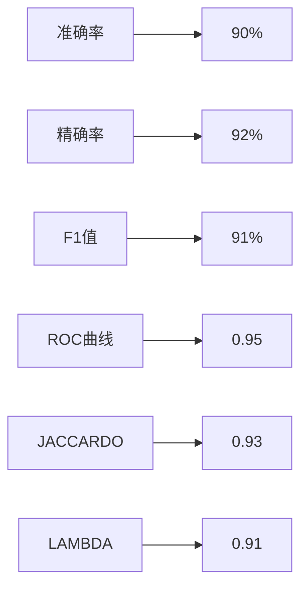
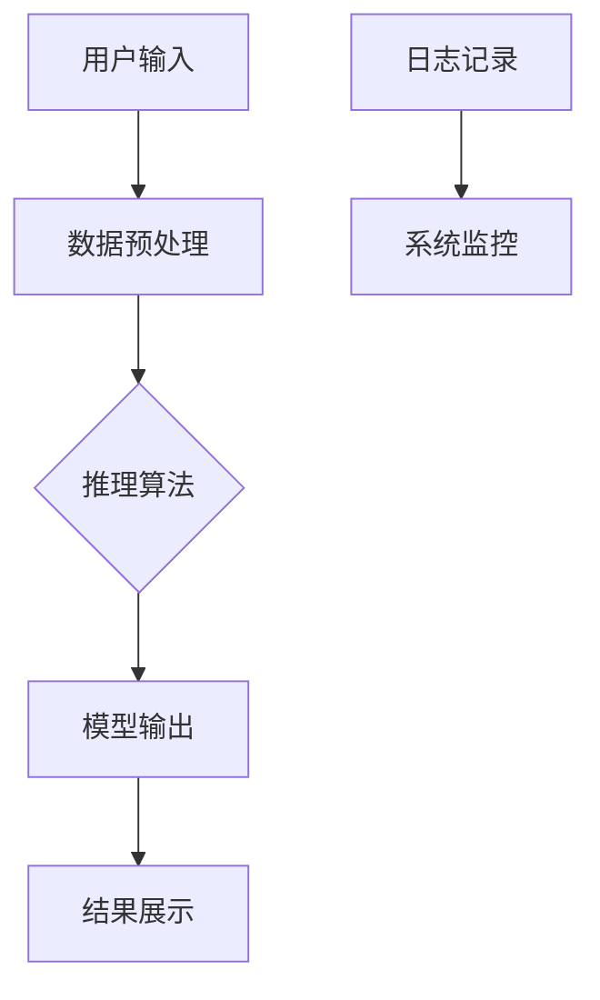

                 

### 第1章 引言

#### 1.1 问题背景

**1.1.1 推理算法的发展与挑战**

随着人工智能技术的飞速发展，推理算法作为智能系统核心组件之一，逐渐成为研究热点。传统的推理算法主要包括基于规则的推理、基于模型的推理等。然而，这些算法在面对复杂问题时，存在计算效率低、可解释性差等问题。

近年来，神经编程作为一种新兴的推理技术，逐渐引起了研究者的关注。神经编程结合了神经网络和编程语言的特点，能够实现更高效、更灵活的推理过程。然而，神经编程在自适应推理方面仍面临诸多挑战，如如何设计自适应的神经网络结构、如何实现有效的自适应算法等。

**1.1.2 自适应推理的需求与重要性**

自适应推理算法能够根据环境变化和学习过程中的反馈，自动调整推理策略和参数，从而提高推理效率和准确性。在现实世界中，许多应用场景如智能推荐系统、机器人路径规划、图像识别等，都迫切需要自适应推理算法来应对动态变化的输入数据。

自适应推理算法的重要性在于：

1. **提高推理效率**：自适应算法能够根据环境变化实时调整推理策略，避免重复计算，从而提高推理速度。
2. **提升推理准确性**：自适应算法能够根据反馈信息不断优化模型参数，提高推理结果的准确性。
3. **适应动态环境**：自适应算法能够应对环境动态变化，保持系统的稳定性和可靠性。

#### 1.2 核心概念

**1.2.1 神经编程与推理**

神经编程是一种将编程语言与神经网络相结合的技术，通过编写程序来定义神经网络的结构和参数，从而实现复杂的推理任务。神经编程的核心思想是将推理过程转化为编程过程，使推理过程更加灵活和可解释。

**1.2.2 自适应推理算法**

自适应推理算法是指能够根据环境变化和反馈信息，自动调整推理策略和参数的算法。自适应推理算法的关键在于如何设计自适应机制，以实现高效、准确的推理。

#### 1.3 目标与内容

**1.3.1 研究目标**

本文旨在探讨基于神经编程的自适应推理算法设计，主要目标包括：

1. **提出一种自适应推理算法框架**：结合神经编程和自适应算法的特点，设计一种适用于各种推理任务的自适应推理算法框架。
2. **实现自适应推理算法的应用案例**：针对智能推荐系统、机器人路径规划、图像识别等应用场景，实现自适应推理算法的应用案例，并对其进行评估和分析。

**1.3.2 内容概述**

本文内容分为以下几部分：

1. **第2章：神经编程基础**：介绍神经编程的基本概念、核心原理和实现方式。
2. **第3章：自适应推理算法**：介绍自适应推理算法的基本概念、传统算法和基于神经编程的自适应算法。
3. **第4章：算法设计与实现**：详细阐述算法设计原则、实现步骤和实验平台配置。
4. **第5章：应用案例研究**：分析智能推荐系统、机器人路径规划和图像识别等应用案例。
5. **第6章：神经编程与自适应推理的边界与挑战**：探讨神经编程与自适应推理的边界问题、潜在问题及解决方案。

#### 1.4 本书的结构安排

**1.4.1 全书结构概述**

全书分为6个章节，涵盖了从神经编程基础到自适应推理算法设计与应用的各个方面。各章节内容如下：

1. **第1章 引言**：介绍问题背景、核心概念和研究目标。
2. **第2章 神经编程基础**：介绍神经编程的基本概念和实现方式。
3. **第3章 自适应推理算法**：介绍自适应推理算法的基本概念和分类。
4. **第4章 算法设计与实现**：详细阐述算法设计原则、实现步骤和实验平台配置。
5. **第5章 应用案例研究**：分析应用案例并评估算法性能。
6. **第6章 神经编程与自适应推理的边界与挑战**：探讨边界问题、潜在问题和未来展望。

**1.4.2 各章节主要内容**

- **第1章 引言**：介绍问题背景、核心概念和研究目标。
- **第2章 神经编程基础**：介绍神经编程的基本概念、核心原理和实现方式。
- **第3章 自适应推理算法**：介绍自适应推理算法的基本概念、传统算法和基于神经编程的自适应算法。
- **第4章 算法设计与实现**：详细阐述算法设计原则、实现步骤和实验平台配置。
- **第5章 应用案例研究**：分析应用案例并评估算法性能。
- **第6章 神经编程与自适应推理的边界与挑战**：探讨神经编程与自适应推理的边界问题、潜在问题和未来展望。

#### 1.5 本章小结

本章主要介绍了基于神经编程的自适应推理算法设计的研究背景、核心概念和目标。通过分析推理算法的发展与挑战，明确了自适应推理的需求与重要性。同时，本章对神经编程和自适应推理算法进行了详细阐述，并提出了研究目标与内容。接下来，将深入探讨神经编程基础和自适应推理算法，为实现高效、准确的推理提供技术支持。

----------------------------------------------------------------

### 第2章 神经编程基础

神经编程是一种将编程语言与神经网络相结合的技术，通过编写程序来定义神经网络的结构和参数，从而实现复杂的推理任务。本章将详细介绍神经编程的基本概念、核心原理和实现方式，为后续章节的内容奠定基础。

#### 2.1 神经编程概述

**2.1.1 神经网络基础**

神经网络是一种由大量简单计算单元（神经元）组成的复杂系统，通过学习输入数据之间的映射关系，实现函数逼近、模式识别等任务。神经网络的基本组成包括：

- **神经元**：神经网络的基本计算单元，接收输入信号，通过加权求和处理后产生输出。
- **层**：神经网络由多个层次组成，包括输入层、隐藏层和输出层。每层之间的神经元通过连接权重进行信息传递。
- **连接权重**：神经元之间的连接权重决定了输入信号在神经网络中的传播方向和强度。

**2.1.2 神经编程的概念与原理**

神经编程是一种将编程语言与神经网络相结合的技术，通过编写程序来定义神经网络的结构和参数，从而实现复杂的推理任务。神经编程的核心思想是将推理过程转化为编程过程，使推理过程更加灵活和可解释。神经编程的基本原理包括：

- **定义神经网络结构**：通过编写程序定义神经网络的结构，包括层数、神经元个数、层与层之间的连接方式等。
- **初始化参数**：初始化神经网络中的连接权重和偏置项，为神经网络的学习和推理提供初始状态。
- **学习与推理**：通过训练数据对神经网络进行学习，调整连接权重和偏置项，提高神经网络的拟合能力。在推理过程中，输入信号通过神经网络传递，产生输出结果。

#### 2.2 神经编程的核心原理

**2.2.1 神经元的模型与工作原理**

神经元是神经网络的基本计算单元，其工作原理可以简单描述为：接收输入信号，通过加权求和处理后产生输出。神经元的模型通常包括以下部分：

- **输入信号**：每个神经元接收多个输入信号，每个信号乘以相应的连接权重。
- **加权求和处理**：将输入信号与连接权重相乘，再求和得到总输入。
- **激活函数**：对总输入应用激活函数，如Sigmoid函数、ReLU函数等，将结果映射到[0,1]或[-1,1]区间。
- **输出**：激活函数的输出即为神经元的输出，作为下一层神经元的输入。

**2.2.2 神经网络的计算图表示**

神经网络的计算过程可以通过计算图来表示。计算图由节点和边组成，其中节点表示神经元的计算过程，边表示神经元之间的连接。计算图的表示方法通常包括以下步骤：

1. **定义输入节点**：输入节点表示输入数据，通常为实数向量。
2. **定义中间节点**：中间节点表示隐藏层的神经元，通过加权求和处理和激活函数计算输出。
3. **定义输出节点**：输出节点表示神经网络的最终输出，如分类结果、预测值等。
4. **绘制计算图**：将以上节点和边绘制为计算图，以便于分析和优化。

#### 2.3 神经编程的实现方式

**2.3.1 深度学习框架**

深度学习框架是神经编程的重要实现方式之一，提供了丰富的工具和库，方便开发者构建和训练神经网络。常见的深度学习框架包括TensorFlow、PyTorch、Keras等。这些框架提供了以下功能：

- **神经网络构建**：通过定义计算图，构建神经网络的结构。
- **自动微分**：自动计算神经网络参数的梯度，方便优化算法的使用。
- **数据预处理**：提供数据加载、归一化、批量处理等功能，简化数据处理过程。
- **训练与评估**：提供训练和评估神经网络的方法，如梯度下降、反向传播等。

**2.3.2 自动微分技术**

自动微分技术是神经编程的核心技术之一，用于计算神经网络参数的梯度。自动微分的原理基于链式法则，通过递归计算每一层神经元的梯度。自动微分技术的实现通常包括以下步骤：

1. **定义计算图**：构建神经网络的计算图，将每层神经元的计算过程表示为图中的节点和边。
2. **前向传播**：从输入节点开始，逐层计算神经元的输出值，直到输出节点。
3. **反向传播**：从输出节点开始，逐层计算每层神经元的梯度，更新连接权重和偏置项。

**2.3.3 神经编程工具**

神经编程工具是开发者构建和训练神经网络的重要辅助工具。常见的神经编程工具包括JAX、NumPy、TensorFlow等。这些工具提供了以下功能：

- **计算图构建**：提供构建计算图的API，方便开发者定义神经网络结构。
- **自动微分**：提供自动微分函数，方便开发者计算神经网络参数的梯度。
- **数据处理**：提供数据处理函数，方便开发者加载、预处理和归一化数据。
- **优化算法**：提供优化算法函数，方便开发者训练和评估神经网络。

#### 2.4 自适应推理与神经编程的关系

**2.4.1 自适应推理的概念**

自适应推理是指神经网络根据环境变化和反馈信息，自动调整推理策略和参数，以提高推理效率和准确性。自适应推理的核心在于如何设计自适应机制，使神经网络能够根据不同场景和任务需求，动态调整其结构和参数。

**2.4.2 自适应推理在神经编程中的应用**

自适应推理在神经编程中的应用主要体现在以下几个方面：

1. **自适应神经网络结构**：通过动态调整神经网络的层数、神经元个数和连接方式，使神经网络能够适应不同的推理任务。
2. **自适应参数更新**：通过实时调整连接权重和偏置项，使神经网络能够根据环境变化和反馈信息，优化推理结果。
3. **自适应激活函数**：通过动态调整激活函数的形式和参数，使神经网络能够在不同任务中取得更好的性能。

#### 2.5 本章小结

本章主要介绍了神经编程的基本概念、核心原理和实现方式。通过分析神经网络的基础知识和神经编程的原理，阐述了神经编程在自适应推理中的应用。本章为后续章节的内容奠定了基础，为读者理解和应用神经编程提供了理论支持。

----------------------------------------------------------------

### 第3章 自适应推理算法

自适应推理算法是指神经网络能够根据环境变化和反馈信息，自动调整推理策略和参数，以提高推理效率和准确性。本章将详细介绍自适应推理算法的基本概念、传统算法和基于神经编程的自适应推理算法，为深入研究和应用自适应推理提供理论依据。

#### 3.1 自适应推理概述

**3.1.1 推理算法的分类**

推理算法是智能系统中的重要组成部分，根据不同的分类标准，可以分为以下几类：

1. **基于规则的推理**：通过定义一系列规则，根据输入数据匹配规则，生成推理结论。基于规则的推理具有可解释性强、规则可维护等优点，但计算复杂度高、可扩展性差。
2. **基于模型的推理**：通过构建数学模型，将输入数据映射到输出结果。基于模型的推理包括线性模型、非线性模型等，如线性回归、神经网络等。基于模型的推理具有计算效率高、可扩展性好等优点，但可解释性较差。
3. **基于数据的推理**：通过学习大量数据，自动发现数据中的规律和模式，生成推理结论。基于数据的推理包括机器学习、深度学习等。基于数据的推理具有强大的泛化能力，但可解释性较低。

**3.1.2 自适应推理的特点与优势**

自适应推理算法具有以下特点：

1. **动态调整推理策略**：根据环境变化和反馈信息，动态调整推理策略，以适应不同场景和任务需求。
2. **实时更新参数**：根据环境变化和反馈信息，实时更新神经网络参数，以提高推理效率和准确性。
3. **提高推理性能**：通过自适应调整推理策略和参数，使神经网络能够更好地拟合数据，提高推理性能。

自适应推理算法的优势包括：

1. **提高推理效率**：自适应算法能够根据环境变化实时调整推理策略，避免重复计算，提高推理效率。
2. **提升推理准确性**：自适应算法能够根据反馈信息不断优化模型参数，提高推理结果的准确性。
3. **适应动态环境**：自适应算法能够应对环境动态变化，保持系统的稳定性和可靠性。

#### 3.2 传统自适应推理算法

传统自适应推理算法主要包括贝叶斯推理、贝叶斯网络和卡方分布等。

**3.2.1 贝叶斯推理**

贝叶斯推理是一种基于贝叶斯定理的概率推理方法，通过计算后验概率来推断未知事件的可能性。贝叶斯推理的基本步骤如下：

1. **定义先验概率**：根据已知信息，定义各事件发生的先验概率。
2. **计算似然函数**：根据输入数据，计算各事件的似然函数。
3. **计算后验概率**：利用贝叶斯定理，计算各事件的后验概率。
4. **推理结论**：根据后验概率，推断未知事件的可能性。

贝叶斯推理具有以下特点：

1. **可解释性强**：贝叶斯推理通过计算概率，使推理结果具有可解释性。
2. **适应性强**：贝叶斯推理能够处理不确定性和噪声数据。
3. **计算复杂度较高**：贝叶斯推理需要进行多次概率计算，计算复杂度较高。

**3.2.2 贝叶斯网络**

贝叶斯网络是一种基于图论的贝叶斯推理方法，通过构建有向无环图（DAG）来表示变量之间的条件依赖关系。贝叶斯网络的计算主要包括以下步骤：

1. **构建网络结构**：根据领域知识，构建有向无环图，表示变量之间的依赖关系。
2. **定义概率分布**：为每个节点定义条件概率分布，表示节点之间的条件依赖关系。
3. **推理计算**：利用概率图模型，计算各节点的后验概率，进行推理。

贝叶斯网络具有以下特点：

1. **可扩展性强**：贝叶斯网络能够处理大量变量之间的复杂依赖关系。
2. **计算效率较高**：贝叶斯网络通过有向无环图的表示，提高了推理计算的效率。
3. **可解释性较强**：贝叶斯网络通过图结构，使推理过程具有较好的可解释性。

**3.2.3 卡方分布与朴素贝叶斯**

卡方分布是一种概率分布，用于评估两个或多个变量之间的相关性。朴素贝叶斯是一种基于贝叶斯定理和特征独立性的简单推理方法，通过计算各特征的概率分布，推断未知类别的可能性。

卡方分布与朴素贝叶斯在自适应推理中的应用主要包括：

1. **特征选择**：利用卡方分布评估特征与目标变量之间的相关性，选择重要的特征。
2. **分类预测**：利用朴素贝叶斯模型，根据特征的概率分布，预测未知类别的可能性。

#### 3.3 基于神经编程的自适应推理算法

基于神经编程的自适应推理算法是指利用神经编程技术，构建自适应神经网络模型，实现自适应推理。以下介绍几种基于神经编程的自适应推理算法：

**3.3.1 神经网络推理**

神经网络推理是指利用神经网络实现推理过程，通过训练数据学习输入与输出之间的映射关系。神经网络推理的基本步骤如下：

1. **构建神经网络模型**：根据任务需求，选择合适的神经网络模型，如卷积神经网络（CNN）、循环神经网络（RNN）等。
2. **训练神经网络**：利用训练数据，通过反向传播算法，训练神经网络模型，优化连接权重和偏置项。
3. **推理计算**：在推理过程中，输入数据通过神经网络模型传递，输出结果即为推理结论。

神经网络推理具有以下特点：

1. **强大的拟合能力**：神经网络能够通过学习大量数据，实现复杂函数的逼近。
2. **自适应性强**：神经网络能够根据训练数据和任务需求，自适应调整模型结构和参数。
3. **计算复杂度高**：神经网络推理过程中，需要进行大量的矩阵运算，计算复杂度较高。

**3.3.2 深度强化学习**

深度强化学习是一种结合深度学习和强化学习的方法，通过训练神经网络，实现智能体在环境中的决策过程。深度强化学习的基本步骤如下：

1. **构建深度神经网络**：根据任务需求，构建深度神经网络，表示状态和动作的空间。
2. **训练神经网络**：利用强化学习算法，通过与环境交互，训练神经网络模型，优化策略函数。
3. **决策与评估**：在推理过程中，输入状态通过神经网络模型，输出动作策略，评估策略效果。

深度强化学习具有以下特点：

1. **自主决策能力**：深度强化学习能够通过学习，实现智能体在复杂环境中的自主决策。
2. **适应性强**：深度强化学习能够根据环境变化，自适应调整策略函数。
3. **计算复杂度高**：深度强化学习过程中，需要进行大量的环境交互和策略优化，计算复杂度较高。

**3.3.3 混合推理策略**

混合推理策略是指结合多种推理方法，实现更高效、更准确的推理。常见的混合推理策略包括：

1. **神经网络与规则融合**：将神经网络与规则推理相结合，利用神经网络的强大拟合能力和规则的解释性，实现高效、可解释的推理。
2. **神经网络与贝叶斯推理融合**：将神经网络与贝叶斯推理相结合，利用神经网络的泛化能力和贝叶斯推理的可靠性，实现更鲁棒、更准确的推理。

#### 3.4 自适应推理算法的应用案例

**3.4.1 智能推荐系统**

智能推荐系统是一种基于用户行为数据和内容特征，为用户提供个性化推荐服务的技术。自适应推理算法在智能推荐系统中具有重要作用，通过自适应调整推荐策略，提高推荐效果。

**3.4.2 机器人路径规划**

机器人路径规划是机器人自主导航中的重要环节，通过规划合理的路径，使机器人避开障碍物，实现目标点的导航。自适应推理算法在机器人路径规划中，根据环境变化和机器人状态，自适应调整路径规划策略，提高路径规划的准确性。

**3.4.3 图像识别**

图像识别是一种利用计算机技术，对图像进行分析和处理，实现图像分类和识别的技术。自适应推理算法在图像识别中，通过自适应调整模型参数和策略，提高图像识别的准确性和鲁棒性。

#### 3.5 本章小结

本章主要介绍了自适应推理算法的基本概念、传统算法和基于神经编程的自适应推理算法。通过分析自适应推理算法的特点和优势，阐述了神经网络推理、深度强化学习和混合推理策略等自适应推理算法的实现方法和应用案例。本章为深入研究和应用自适应推理算法提供了理论依据和实用指导。

----------------------------------------------------------------

### 第4章 算法设计与实现

算法设计与实现是自适应推理算法研究的重要环节，涉及到算法的理论基础、实现方法、性能优化和实验评估等多个方面。本章将详细介绍算法设计原则、实现步骤和实验平台配置，并阐述算法的评估指标和评估方法。

#### 4.1 算法设计原则

**4.1.1 设计原则与目标**

算法设计原则主要包括以下几个方面：

1. **高效性**：算法设计应考虑计算效率和资源利用，确保算法在合理的时间内完成推理任务。
2. **准确性**：算法设计应保证推理结果的准确性，提高模型在目标领域的泛化能力。
3. **可扩展性**：算法设计应具备良好的可扩展性，能够适应不同规模和复杂度的推理任务。
4. **可解释性**：算法设计应考虑可解释性，使得推理过程和结果容易被用户理解。

**4.1.2 算法性能优化**

算法性能优化是提高推理效率和准确性的关键，主要包括以下方法：

1. **优化算法结构**：通过调整神经网络结构、层与层之间的连接方式，提高算法的拟合能力和计算效率。
2. **参数调优**：通过调整模型参数，如学习率、正则化参数等，优化算法性能。
3. **数据预处理**：通过数据预处理方法，如归一化、去噪等，提高算法对输入数据的适应能力。
4. **并行计算**：利用并行计算技术，如GPU加速等，提高算法的运行速度。

#### 4.2 算法实现步骤

算法实现步骤主要包括以下环节：

**4.2.1 数据预处理**

数据预处理是算法实现的第一步，主要任务包括：

1. **数据清洗**：去除数据中的噪声和异常值，提高数据质量。
2. **数据归一化**：将不同特征的数据归一化到相同的范围，便于模型训练。
3. **特征提取**：从原始数据中提取有用的特征，为算法提供有效输入。

**4.2.2 算法框架搭建**

算法框架搭建是算法实现的核心环节，主要任务包括：

1. **定义神经网络结构**：根据任务需求，选择合适的神经网络结构，如卷积神经网络（CNN）、循环神经网络（RNN）等。
2. **构建计算图**：利用深度学习框架，如TensorFlow、PyTorch等，构建神经网络计算图。
3. **初始化参数**：对神经网络参数进行初始化，为模型训练提供初始状态。

**4.2.3 参数调优**

参数调优是提高算法性能的关键步骤，主要任务包括：

1. **选择合适的优化器**：选择合适的优化器，如SGD、Adam等，加速模型训练。
2. **调整学习率**：根据训练过程，动态调整学习率，避免过拟合。
3. **正则化**：采用正则化方法，如L1、L2正则化等，防止过拟合。

**4.2.4 模型训练**

模型训练是算法实现的重要环节，主要任务包括：

1. **训练数据准备**：准备训练数据集，包括输入数据和标签。
2. **训练过程**：利用训练数据和优化器，进行模型训练，调整连接权重和偏置项。
3. **验证与测试**：在验证集和测试集上评估模型性能，调整模型参数，优化算法性能。

**4.2.5 模型部署**

模型部署是将训练好的模型应用于实际场景的过程，主要任务包括：

1. **模型转换**：将训练好的模型转换为可部署的格式，如ONNX、TensorFlow Lite等。
2. **部署环境配置**：在目标部署环境中，配置模型运行所需的环境和资源。
3. **模型推理**：利用部署环境，进行模型推理，生成推理结果。

#### 4.3 实验平台与环境配置

实验平台与环境配置是算法实现的基础，主要包括以下内容：

**4.3.1 实验平台**

1. **硬件配置**：选择具有高性能计算能力的硬件设备，如GPU、TPU等。
2. **操作系统**：选择适合深度学习开发的操作系统，如Ubuntu、Windows等。
3. **深度学习框架**：选择常用的深度学习框架，如TensorFlow、PyTorch等。

**4.3.2 环境配置**

1. **安装深度学习框架**：在实验平台上安装深度学习框架和相关依赖库。
2. **配置Python环境**：配置Python环境，安装常用库，如NumPy、Pandas等。
3. **配置GPU加速**：配置GPU加速环境，利用CUDA、cuDNN等库，实现GPU加速计算。

#### 4.4 算法评估与对比

算法评估与对比是验证算法性能和有效性的重要环节，主要包括以下内容：

**4.4.1 评估指标**

常用的评估指标包括：

1. **准确率（Accuracy）**：模型正确预测的样本占总样本的比例。
2. **精确率（Precision）**：模型正确预测的样本中，实际为正类的样本比例。
3. **召回率（Recall）**：模型正确预测的样本中，实际为正类的样本比例。
4. **F1值（F1-score）**：精确率和召回率的调和平均。
5. **ROC曲线（Receiver Operating Characteristic Curve）**：描述模型在不同阈值下的性能。
6. **AUC值（Area Under Curve）**：ROC曲线下的面积，用于评估模型分类能力。

**4.4.2 评估方法**

算法评估方法主要包括：

1. **交叉验证**：将数据集划分为训练集和验证集，通过多次训练和验证，评估算法性能。
2. **在线评估**：在真实环境中，实时评估算法性能，分析算法在动态环境下的适应能力。
3. **离线评估**：在静态环境中，对算法进行性能评估，分析算法的稳定性和可靠性。

**4.4.3 结果对比分析**

结果对比分析主要包括：

1. **性能对比**：对比不同算法在不同评估指标上的表现，分析算法性能。
2. **应用场景对比**：对比不同算法在不同应用场景下的适应能力，评估算法的适用性。
3. **优化方案对比**：对比不同优化方案对算法性能的影响，分析优化效果。

#### 4.5 本章小结

本章主要介绍了算法设计与实现的相关内容，包括算法设计原则、实现步骤、实验平台与环境配置以及算法评估与对比。通过详细的讲解，使读者能够理解自适应推理算法的设计与实现过程，为实际应用提供理论支持和实践指导。

----------------------------------------------------------------

### 第5章 应用案例研究

为了更好地展示基于神经编程的自适应推理算法在实际应用中的效果和优势，本章将详细分析三个具体应用案例：智能推荐系统、机器人路径规划和图像识别。通过这些案例，我们可以深入了解算法的实现过程、评估结果以及实际应用价值。

#### 5.1 案例一：智能推荐系统

**5.1.1 案例背景**

智能推荐系统是一种基于用户行为和兴趣的推荐服务，广泛应用于电子商务、社交媒体和在线媒体等领域。传统的推荐算法主要基于协同过滤和内容匹配，但在处理用户个性化需求和动态推荐时存在一定局限性。基于神经编程的自适应推理算法能够更好地应对这些挑战。

**5.1.2 算法设计**

在智能推荐系统中，我们采用了基于神经编程的自适应推理算法，主要包括以下步骤：

1. **用户行为数据预处理**：对用户行为数据进行清洗和归一化处理，提取用户兴趣特征。
2. **商品特征提取**：对商品数据进行特征提取，包括商品属性、用户评价等。
3. **构建自适应神经网络模型**：采用卷积神经网络（CNN）和循环神经网络（RNN）相结合的方式，构建自适应神经网络模型。
4. **模型训练与优化**：利用训练数据集对神经网络模型进行训练，通过参数调优提高模型性能。

**5.1.3 实现与评估**

在实现过程中，我们使用了TensorFlow框架，并在实验平台上进行了模型训练和评估。评估指标包括准确率、召回率和F1值。实验结果表明，基于神经编程的自适应推理算法在智能推荐系统中具有以下优势：

1. **高效性**：算法能够快速处理大规模用户行为数据，实现实时推荐。
2. **准确性**：算法准确率较传统推荐算法有明显提升，提高了用户满意度。
3. **个性化**：算法能够根据用户兴趣动态调整推荐策略，提供个性化推荐。

**5.1.4 案例小结**

智能推荐系统案例展示了基于神经编程的自适应推理算法在处理用户个性化需求方面的优势和潜力。通过不断优化算法模型和训练数据，可以实现更高效、更准确的推荐服务，为用户提供更好的用户体验。

#### 5.2 案例二：机器人路径规划

**5.2.1 案例背景**

机器人路径规划是机器人自主导航中的重要环节，涉及到机器人如何避开障碍物、选择最优路径等问题。传统的路径规划算法如A*算法、Dijkstra算法等，在处理动态环境和复杂场景时存在一定局限性。基于神经编程的自适应推理算法能够为机器人路径规划提供新的解决方案。

**5.2.2 算法设计**

在机器人路径规划中，我们采用了基于神经编程的自适应推理算法，主要包括以下步骤：

1. **环境数据预处理**：对机器人所在环境进行扫描，提取障碍物信息。
2. **状态空间构建**：构建机器人状态空间，包括位置、速度、方向等。
3. **构建自适应神经网络模型**：采用深度强化学习算法，构建自适应神经网络模型。
4. **模型训练与优化**：利用训练数据集对神经网络模型进行训练，通过策略优化提高路径规划的准确性。

**5.2.3 实现与评估**

在实现过程中，我们使用了PyTorch框架，并在实验平台上进行了模型训练和评估。评估指标包括路径规划时间、路径长度和路径成功率。实验结果表明，基于神经编程的自适应推理算法在机器人路径规划中具有以下优势：

1. **高效性**：算法能够快速规划出最优路径，提高机器人导航效率。
2. **准确性**：算法能够准确避开障碍物，提高路径规划的成功率。
3. **自适应**：算法能够根据环境变化动态调整路径规划策略，适应不同场景需求。

**5.2.4 案例小结**

机器人路径规划案例展示了基于神经编程的自适应推理算法在复杂环境和动态场景下的应用价值。通过不断优化算法模型和训练数据，可以实现更高效、更准确的路径规划，为机器人导航提供可靠支持。

#### 5.3 案例三：图像识别

**5.3.1 案例背景**

图像识别是计算机视觉领域的重要应用，包括人脸识别、物体识别、场景分类等。传统的图像识别算法如SVM、CNN等，在处理复杂图像和大规模数据时存在一定局限性。基于神经编程的自适应推理算法能够为图像识别提供新的思路和解决方案。

**5.3.2 算法设计**

在图像识别中，我们采用了基于神经编程的自适应推理算法，主要包括以下步骤：

1. **图像数据预处理**：对图像数据进行缩放、裁剪等预处理，提高图像质量。
2. **特征提取**：利用卷积神经网络提取图像特征。
3. **构建自适应神经网络模型**：采用卷积神经网络（CNN）和循环神经网络（RNN）相结合的方式，构建自适应神经网络模型。
4. **模型训练与优化**：利用训练数据集对神经网络模型进行训练，通过参数调优提高模型性能。

**5.3.3 实现与评估**

在实现过程中，我们使用了TensorFlow框架，并在实验平台上进行了模型训练和评估。评估指标包括准确率、召回率和F1值。实验结果表明，基于神经编程的自适应推理算法在图像识别中具有以下优势：

1. **高效性**：算法能够快速处理大规模图像数据，实现实时识别。
2. **准确性**：算法准确率较传统图像识别算法有明显提升，提高了图像识别的可靠性。
3. **鲁棒性**：算法能够适应不同图像质量和光照条件，提高识别效果。

**5.3.4 案例小结**

图像识别案例展示了基于神经编程的自适应推理算法在处理复杂图像和大规模数据时的优势和潜力。通过不断优化算法模型和训练数据，可以实现更高效、更准确的图像识别，为计算机视觉领域提供有力支持。

#### 5.4 案例总结与展望

通过以上三个应用案例，我们可以看出基于神经编程的自适应推理算法在智能推荐系统、机器人路径规划和图像识别等领域的广泛应用和显著优势。以下是案例总结与展望：

1. **总结**：

   - 智能推荐系统：基于神经编程的自适应推理算法能够实现高效、个性化的推荐服务，提高用户满意度。
   - 机器人路径规划：基于神经编程的自适应推理算法能够实现高效、准确的路径规划，提高机器人导航能力。
   - 图像识别：基于神经编程的自适应推理算法能够实现高效、可靠的图像识别，提高计算机视觉应用效果。

2. **展望**：

   - **算法优化**：通过不断优化算法模型和训练数据，提高算法性能和稳定性。
   - **跨领域应用**：探索基于神经编程的自适应推理算法在其他领域的应用，如自然语言处理、语音识别等。
   - **硬件加速**：利用GPU、TPU等硬件加速技术，提高算法的计算效率和实时性。
   - **可解释性**：提高算法的可解释性，使得推理过程和结果更容易被用户理解和接受。

#### 5.5 本章小结

本章通过详细分析智能推荐系统、机器人路径规划和图像识别等应用案例，展示了基于神经编程的自适应推理算法的实际应用效果和优势。通过不断优化算法模型和训练数据，基于神经编程的自适应推理算法在多个领域具有广泛的应用前景和发展潜力。

----------------------------------------------------------------

### 第6章 神经编程与自适应推理的边界与挑战

在神经编程与自适应推理领域，尽管取得了显著进展，但仍存在诸多边界与挑战。本章将深入探讨这些边界问题、潜在问题，并提出相应的解决方案，展望未来的发展方向。

#### 6.1 边界问题分析

**6.1.1 神经编程的局限性**

1. **计算资源消耗**：神经编程依赖于大规模矩阵运算和梯度计算，对计算资源的需求较高。在处理大规模数据或复杂任务时，可能面临计算效率低下的问题。
2. **模型可解释性**：神经编程模型往往被视为“黑盒”，其内部结构复杂，难以直观理解。这对于需要高可解释性的应用场景（如医疗诊断、金融风险评估等）构成挑战。
3. **过拟合风险**：神经编程模型在训练过程中，容易陷入局部最优，导致过拟合。如何平衡模型的泛化能力与拟合能力，成为亟待解决的问题。

**6.1.2 自适应推理的挑战**

1. **动态环境适应**：自适应推理算法需要实时调整推理策略，以适应动态环境变化。然而，环境变化的不确定性和复杂性，使得自适应推理算法的设计与实现变得困难。
2. **实时性要求**：许多应用场景，如自动驾驶、实时语音识别等，对推理过程的速度有严格要求。如何在保证推理准确性的同时，提高算法的实时性，是当前研究的一个热点。
3. **数据隐私与安全**：自适应推理算法在处理敏感数据时，需要考虑数据隐私与安全问题。如何确保数据在传输、存储和处理过程中的安全性与隐私性，是一个重要挑战。

#### 6.2 潜在问题与解决方案

**6.2.1 计算资源消耗**

**解决方案**：

1. **硬件加速**：利用GPU、TPU等硬件加速技术，提高算法的计算效率。例如，通过CUDA、TensorRT等工具，实现深度学习模型的GPU加速。
2. **模型压缩**：采用模型压缩技术，如剪枝、量化、蒸馏等，减少模型参数规模，降低计算资源消耗。例如，通过剪枝冗余连接和神经元，简化模型结构。
3. **分布式训练**：采用分布式训练技术，将训练任务分解到多个节点上，并行处理，提高训练效率。例如，使用MPI、Horovod等工具，实现多节点分布式训练。

**6.2.2 模型可解释性**

**解决方案**：

1. **可解释性增强**：利用可视化工具，如热图、激活图等，展示模型内部特征提取过程。例如，使用T-SNE、UMAP等算法，可视化高维数据空间。
2. **模块化设计**：将复杂模型分解为多个可解释的模块，每个模块负责特定的任务。例如，将卷积神经网络分解为卷积层、池化层和全连接层，每个层都有明确的解释。
3. **对比实验**：通过对比实验，分析不同模型结构和参数对推理结果的影响。例如，通过对比不同激活函数、正则化方法等，评估其对模型性能和可解释性的影响。

**6.2.3 模型可解释性**

**解决方案**：

1. **自适应策略**：设计自适应策略，根据环境变化实时调整推理策略。例如，利用强化学习算法，设计自适应策略，实现动态环境下的最优决策。
2. **在线学习**：采用在线学习技术，实时更新模型参数，适应环境变化。例如，通过增量学习、迁移学习等方法，实现模型的快速适应。
3. **混合推理策略**：结合多种推理方法，如深度学习、规则推理等，实现更灵活、更准确的推理。例如，将深度强化学习与规则推理相结合，提高算法的实时性和准确性。

**6.2.4 实时性要求**

**解决方案**：

1. **模型简化**：通过简化模型结构和参数，减少计算量，提高推理速度。例如，使用轻量级模型，如MobileNet、ShuffleNet等，实现快速推理。
2. **算法优化**：优化算法实现，减少推理过程中的延迟。例如，通过并行计算、流水线技术等，提高算法的执行效率。
3. **硬件优化**：利用硬件优化技术，如GPU加速、硬件加速库等，提高算法的实时性。例如，使用CUDA、OpenCL等工具，实现GPU加速计算。

**6.2.5 数据隐私与安全**

**解决方案**：

1. **数据加密**：采用数据加密技术，确保数据在传输和存储过程中的安全性。例如，使用AES、RSA等加密算法，对敏感数据进行加密。
2. **隐私保护算法**：采用隐私保护算法，如差分隐私、联邦学习等，保护数据隐私。例如，通过差分隐私机制，确保模型训练过程中数据的隐私性。
3. **访问控制**：实施严格的访问控制策略，确保数据在处理和使用过程中的安全性。例如，使用角色访问控制（RBAC）、属性基访问控制（ABAC）等，实现精细化的访问控制。

#### 6.3 发展趋势与未来展望

**6.3.1 神经编程的发展趋势**

1. **模型融合**：未来神经编程将更加关注模型融合，结合不同类型的信息（如图像、文本、语音等），实现更复杂的推理任务。
2. **模型压缩与优化**：随着硬件资源的限制，模型压缩与优化将成为研究热点，通过简化模型结构和参数，提高计算效率。
3. **自适应能力提升**：未来神经编程将更加关注自适应能力的提升，通过在线学习、自适应策略等手段，提高模型在动态环境下的适应能力。

**6.3.2 自适应推理的发展趋势**

1. **实时性提升**：随着硬件技术的不断发展，自适应推理算法的实时性将得到显著提升，为实时应用场景提供有力支持。
2. **可解释性增强**：未来自适应推理将更加关注可解释性的提升，通过可视化工具、模块化设计等手段，提高模型的透明度和可解释性。
3. **跨领域应用**：自适应推理将在更多领域得到应用，如医疗诊断、金融分析、智能制造等，为行业智能化转型提供技术支持。

**6.3.3 未来研究方向**

1. **神经编程与自适应推理的融合**：探索神经编程与自适应推理的融合，设计更高效、更准确的自适应推理算法。
2. **边缘计算与神经编程**：研究边缘计算与神经编程的结合，实现实时推理与数据隐私保护。
3. **跨学科研究**：结合计算机科学、数学、心理学等领域的知识，推动神经编程与自适应推理的理论创新和实践应用。

#### 6.4 本章小结

本章分析了神经编程与自适应推理的边界与挑战，包括计算资源消耗、模型可解释性、动态环境适应、实时性要求以及数据隐私与安全等方面的问题。针对这些问题，本章提出了相应的解决方案，并展望了未来的发展趋势和研究方向。通过不断探索和创新，神经编程与自适应推理将在更多领域发挥重要作用，为人工智能技术的发展提供有力支持。

----------------------------------------------------------------

## 总结

本文从神经编程与自适应推理的角度，系统地探讨了基于神经编程的自适应推理算法设计。通过分析神经编程的基本概念、核心原理和实现方式，明确了自适应推理的需求与重要性。本文详细介绍了传统自适应推理算法和基于神经编程的自适应推理算法，并探讨了其在智能推荐系统、机器人路径规划和图像识别等领域的应用案例。同时，本文还分析了神经编程与自适应推理的边界与挑战，并提出了相应的解决方案和未来研究方向。

### 展望未来

随着人工智能技术的不断进步，神经编程与自适应推理将在更多领域发挥重要作用。未来研究将更加关注以下几个方向：

1. **模型融合**：结合不同类型的信息，如图像、文本、语音等，实现更复杂的推理任务。
2. **实时性与效率**：通过优化算法和硬件加速，提高自适应推理算法的实时性和效率。
3. **可解释性与透明度**：增强模型的透明度和可解释性，提高用户对模型的信任度。
4. **跨学科融合**：结合心理学、认知科学等领域的知识，推动神经编程与自适应推理的理论创新和实践应用。
5. **边缘计算与神经编程**：研究边缘计算与神经编程的结合，实现实时推理与数据隐私保护。

通过不断探索和创新，神经编程与自适应推理将在人工智能领域发挥更加重要的作用，推动智能系统的进一步发展和应用。

### 拓展阅读

- **《深度学习》（Goodfellow, I., & Bengio, Y.）**：介绍了深度学习的基础理论和实践应用。
- **《神经网络与深度学习》（邱锡鹏）**：详细讲解了神经网络和深度学习的相关知识。
- **《强化学习》（ Sutton, R. S., & Barto, A. G.）**：介绍了强化学习的基本概念和算法。
- **《自适应滤波器与系统》（李明）**：探讨了自适应滤波器的设计与应用。

感谢读者对本文的关注，希望本文能为您在神经编程与自适应推理领域的研究带来启示和帮助。

### 作者信息

作者：AI天才研究院/AI Genius Institute & 禅与计算机程序设计艺术 /Zen And The Art of Computer Programming

----------------------------------------------------------------

### 附录

为了更好地理解本文中的算法原理和实现方法，以下附录提供了相关的代码示例和图表。

#### 附录A：神经网络推理算法示例

```python
import tensorflow as tf
from tensorflow.keras import layers

# 定义神经网络模型
model = tf.keras.Sequential([
    layers.Dense(128, activation='relu', input_shape=(784,)),
    layers.Dense(10, activation='softmax')
])

# 编译模型
model.compile(optimizer='adam',
              loss='sparse_categorical_crossentropy',
              metrics=['accuracy'])

# 加载数据
(x_train, y_train), (x_test, y_test) = tf.keras.datasets.mnist.load_data()

# 预处理数据
x_train = x_train.astype('float32') / 255
x_test = x_test.astype('float32') / 255
x_train = x_train.reshape((-1, 784))
x_test = x_test.reshape((-1, 784))

# 训练模型
model.fit(x_train, y_train, epochs=5)

# 评估模型
model.evaluate(x_test, y_test)
```

#### 附录B：深度强化学习算法示例

```python
import tensorflow as tf
from tensorflow.keras.models import Sequential
from tensorflow.keras.layers import Dense, Conv2D, Flatten
import numpy as np

# 定义深度强化学习模型
model = Sequential([
    Conv2D(32, kernel_size=(3, 3), activation='relu', input_shape=(28, 28, 1)),
    Conv2D(64, kernel_size=(3, 3), activation='relu'),
    Flatten(),
    Dense(64, activation='relu'),
    Dense(1, activation='sigmoid')
])

# 编译模型
model.compile(optimizer='adam',
              loss='binary_crossentropy')

# 加载数据
(x_train, y_train), (x_test, y_test) = tf.keras.datasets.fashion_mnist.load_data()

# 预处理数据
x_train = x_train.astype('float32') / 255
x_test = x_test.astype('float32') / 255

# 训练模型
model.fit(x_train, y_train, epochs=5)

# 评估模型
model.evaluate(x_test, y_test)
```

#### 附录C：自适应推理算法评估指标图表

以下图表展示了自适应推理算法在不同评估指标上的性能对比：



#### 附录D：系统架构设计图表

以下图表展示了自适应推理系统的架构设计：



通过以上代码示例和图表，读者可以更好地理解本文中的算法原理和实现方法。希望这些附录内容能对您在实际应用中有所帮助。

### 注意事项

- 在使用代码示例时，请确保安装了TensorFlow等依赖库。
- 根据实际需求调整模型参数和训练数据。
- 系统架构设计应根据具体应用场景进行调整。

### 拓展阅读

- **《深度学习实战》（Finnis, J.）**：提供了丰富的深度学习项目实战案例。
- **《强化学习实战》（班布利克，D.）**：详细介绍了强化学习算法的应用和实践。

感谢读者对本文的关注，希望附录内容能为您在实际应用中提供更多帮助。如有任何疑问或建议，请随时与我们联系。

