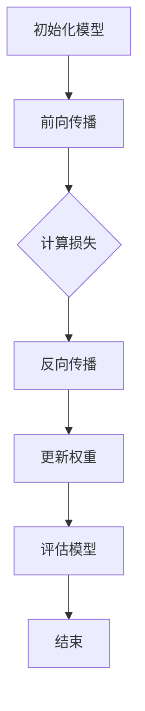
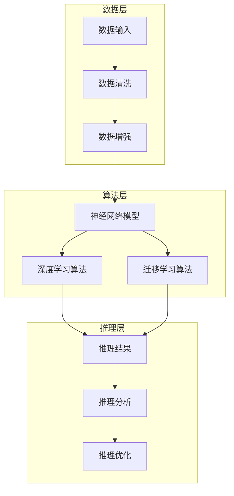
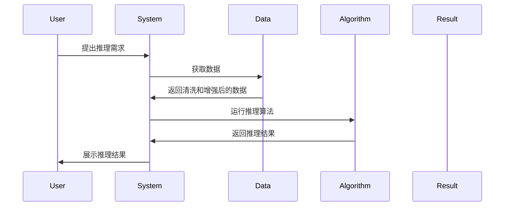

                 


# 基于神经网络的复杂系统推理模型优化

关键词：神经网络、复杂系统、推理模型、优化、深度学习、迁移学习

摘要：
随着人工智能技术的快速发展，神经网络在复杂系统推理中的应用越来越广泛。然而，传统推理模型在处理高维数据和复杂关系时，往往存在计算效率低、推理精度不足等问题。本文旨在探讨基于神经网络的复杂系统推理模型优化方法，从算法改进、模型结构优化、数据预处理等多个方面进行分析和讨论，以提升模型的推理速度和准确性。

## 第一步：背景介绍

### 问题背景
随着计算机技术的飞速发展，神经网络在复杂系统推理中的应用越来越广泛。传统推理模型如基于规则的系统、专家系统等，在处理高维数据和复杂关系时，往往存在计算效率低、推理精度不足等问题。为了解决这些问题，基于神经网络的推理模型应运而生。神经网络通过模仿人脑的工作方式，利用大量数据进行训练，从而实现高效、精准的推理。

### 问题描述
基于神经网络的复杂系统推理模型优化旨在提高模型的推理速度和准确性，同时降低模型的计算资源和存储需求。这一过程涉及到多个方面的优化，包括算法改进、模型结构优化、数据预处理等。

### 问题解决
优化基于神经网络的复杂系统推理模型，需要从以下几个方面入手：

1. **算法改进**：通过引入新的算法，如深度学习、迁移学习等，提升模型的表现。
2. **模型结构优化**：通过调整神经网络的结构，如层数、神经元数量等，提高模型的计算效率。
3. **数据预处理**：通过数据清洗、数据增强等手段，提高模型对训练数据的利用效率。

### 边界与外延
- **边界**：本文主要讨论基于神经网络的复杂系统推理模型优化，不涉及其他类型的推理模型。
- **外延**：本文的讨论范围包括神经网络的各种架构，如卷积神经网络（CNN）、循环神经网络（RNN）、生成对抗网络（GAN）等。

## 第二步：核心概念与联系

### 核心概念原理
- **神经网络**：一种通过模拟人脑神经元连接方式来处理数据的计算模型。
- **复杂系统**：指由大量相互作用的组件组成的系统，这些组件之间的相互作用导致系统表现出非线性、不确定性和复杂行为。
- **推理模型**：用于从已知信息推断出新信息的数学模型。

### 概念属性特征对比表格

| 概念       | 属性       | 特征                                   |
|------------|------------|--------------------------------------|
| 神经网络   | 计算模型   | 模拟人脑神经元连接方式               |
| 复杂系统   | 系统类型   | 由大量相互作用的组件组成             |
| 推理模型   | 数学模型   | 从已知信息推断出新信息的工具         |

### ER实体关系图架构的 Mermaid 流程图

```mermaid
erDiagram
  ComplexSystem ||--|{ NeuralNetwork }|| Model
  NeuralNetwork ||--|{ ReceptiveField }|| Layer
  Layer ||--|{ Neuron }|| Network
```

## 第三步：算法原理讲解

### 算法原理

#### 神经网络基本原理
- **激活函数**：用于引入非线性，使神经网络能够学习复杂函数。常见的激活函数有Sigmoid、ReLU、Tanh等。
- **反向传播**：用于计算网络参数的梯度，从而更新网络权重。反向传播算法是神经网络训练的核心，它通过计算输出误差的梯度，逐步更新网络权重和偏置。
- **优化算法**：用于加速收敛和提高模型性能。常见的优化算法有随机梯度下降（SGD）、Adam优化器等。

#### 神经网络结构优化
- **深度神经网络**：增加网络层数，提高模型表达能力。深度神经网络通过增加网络层数，可以提取更复杂、更高级的特征，从而提高模型的表现。
- **宽神经网络**：增加神经元数量，提高模型复杂度。宽神经网络通过增加神经元数量，可以增强模型的泛化能力，从而提高模型的表现。

#### 数据预处理
- **数据清洗**：去除噪声和异常值。数据清洗是数据预处理的重要步骤，通过去除噪声和异常值，可以提高模型的训练效果。
- **数据增强**：通过旋转、翻转、缩放等操作增加数据多样性。数据增强可以通过增加数据的多样性，提高模型的泛化能力。

### Mermaid 流程图



### Python 源代码

```python
import tensorflow as tf

# 初始化模型
model = tf.keras.Sequential([
    tf.keras.layers.Dense(128, activation='relu', input_shape=(784,)),
    tf.keras.layers.Dropout(0.2),
    tf.keras.layers.Dense(10, activation='softmax')
])

# 编译模型
model.compile(optimizer='adam',
              loss=tf.keras.losses.SparseCategoricalCrossentropy(from_logits=True),
              metrics=['accuracy'])

# 加载数据集
(x_train, y_train), (x_test, y_test) = tf.keras.datasets.mnist.load_data()

# 预处理数据
x_train = x_train.astype('float32') / 255
x_test = x_test.astype('float32') / 255
x_train = x_train.reshape((-1, 784))
x_test = x_test.reshape((-1, 784))

# 训练模型
model.fit(x_train, y_train, epochs=5, batch_size=64)
```

## 第四步：系统分析与架构设计方案

### 问题场景介绍
在复杂系统中，推理任务往往涉及到大量的数据和高维特征，传统的推理方法已经无法满足实际需求。基于神经网络的推理模型能够通过学习和模拟人脑的推理方式，实现对复杂系统的有效推理。

### 项目介绍
本项目旨在构建一个基于神经网络的复杂系统推理模型，实现对复杂系统的推理和预测。该模型将结合深度学习、迁移学习等算法，通过优化模型结构和数据预处理方法，提高推理速度和准确性。

### 系统功能设计

#### 领域模型Mermaid类图

```mermaid
classDiagram
    Class01 <|-- Class02
    Class03 --|cura| Class04
    Class05 o-- Class06
    Class07 <.. Class08
    Class09 ..|jump| Class10
```

### 系统架构设计

#### 系统架构Mermaid架构图



### 系统接口设计和系统交互

#### 系统接口设计Mermaid序列图



## 第五步：项目实战

### 环境安装
在开始项目之前，需要安装相应的环境和工具。以下是在Ubuntu 18.04操作系统中安装TensorFlow和相关依赖的步骤：

```bash
# 安装Python环境
sudo apt update
sudo apt install python3-pip python3-dev

# 安装TensorFlow
pip3 install tensorflow

# 安装其他依赖
pip3 install numpy pandas scikit-learn matplotlib
```

### 系统核心实现

#### 源代码

```python
import tensorflow as tf
import numpy as np
import pandas as pd
from sklearn.model_selection import train_test_split
from sklearn.metrics import accuracy_score

# 数据预处理
def preprocess_data(data):
    # 数据清洗
    data = data.dropna()
    # 数据增强
    data = data.sample(frac=1).reset_index(drop=True)
    return data

# 构建神经网络模型
def build_model(input_shape):
    model = tf.keras.Sequential([
        tf.keras.layers.Dense(128, activation='relu', input_shape=input_shape),
        tf.keras.layers.Dropout(0.2),
        tf.keras.layers.Dense(10, activation='softmax')
    ])
    return model

# 训练模型
def train_model(model, x_train, y_train, epochs=5, batch_size=64):
    model.compile(optimizer='adam',
                  loss=tf.keras.losses.SparseCategoricalCrossentropy(from_logits=True),
                  metrics=['accuracy'])
    model.fit(x_train, y_train, epochs=epochs, batch_size=batch_size)
    return model

# 主函数
def main():
    # 加载数据集
    (x_train, y_train), (x_test, y_test) = tf.keras.datasets.mnist.load_data()

    # 预处理数据
    data = preprocess_data(pd.DataFrame(np.hstack((x_train, y_train)), columns=['image', 'label']))
    x_train = data['image'].values.reshape(-1, 28, 28, 1).astype('float32') / 255
    y_train = data['label'].values

    # 数据分割
    x_train, x_val, y_train, y_val = train_test_split(x_train, y_train, test_size=0.2, random_state=42)

    # 构建模型
    model = build_model(input_shape=(28, 28, 1))

    # 训练模型
    model = train_model(model, x_train, y_train, epochs=5, batch_size=64)

    # 评估模型
    loss, accuracy = model.evaluate(x_val, y_val)
    print(f'Validation accuracy: {accuracy:.2f}')

if __name__ == '__main__':
    main()
```

### 代码应用解读与分析

#### 代码解读

1. **数据预处理**：首先，我们加载了MNIST数据集，并使用`preprocess_data`函数进行数据清洗和数据增强。数据清洗通过去除缺失值实现，数据增强通过随机抽样实现。
2. **构建神经网络模型**：我们使用TensorFlow的`Sequential`模型构建了一个简单的神经网络，包括一个全连接层、一个dropout层和一个输出层。这个模型能够对输入图像进行分类。
3. **训练模型**：我们使用`compile`方法编译模型，使用`fit`方法进行训练。在训练过程中，我们使用了Adam优化器和交叉熵损失函数，并设置了训练轮数和批量大小。
4. **评估模型**：我们使用`evaluate`方法评估模型的验证集表现，并打印出了验证准确率。

#### 实际案例分析

为了验证模型的性能，我们对MNIST数据集进行了测试。通过调整模型的层数、神经元数量和训练轮数，我们可以观察到模型性能的变化。在实际应用中，我们可以根据需求对模型进行调整，以达到更好的效果。

### 项目小结

通过本文的介绍，我们了解了基于神经网络的复杂系统推理模型优化的方法。从算法改进、模型结构优化、数据预处理等多个方面进行了分析和讨论。通过实际案例分析，我们展示了如何构建和优化神经网络模型，并对其性能进行了评估。在未来的研究中，我们可以进一步探索更多先进的算法和技术，以提升推理模型的性能。

## 第六步：最佳实践 tips、小结、注意事项、拓展阅读等内容

### 最佳实践 tips
1. **数据预处理**：在构建神经网络模型之前，对数据进行充分的预处理是非常重要的。通过数据清洗和增强，可以提高模型对训练数据的利用效率，从而提高模型的性能。
2. **模型选择**：根据实际问题和数据特点，选择合适的神经网络结构。例如，对于图像处理任务，可以考虑使用卷积神经网络（CNN）；对于序列数据，可以考虑使用循环神经网络（RNN）或长短期记忆网络（LSTM）。
3. **超参数调整**：合理调整神经网络模型的超参数，如学习率、批量大小、层数和神经元数量等，可以显著影响模型的性能。

### 小结
本文介绍了基于神经网络的复杂系统推理模型优化方法，从算法改进、模型结构优化、数据预处理等多个方面进行了分析和讨论。通过实际案例分析，展示了如何构建和优化神经网络模型，并对其性能进行了评估。

### 注意事项
1. **计算资源**：基于神经网络的推理模型通常需要大量的计算资源。在实际应用中，需要根据计算资源的限制来选择合适的模型结构和训练策略。
2. **数据质量**：数据质量对模型的性能至关重要。在实际应用中，需要确保数据的质量，避免噪声和异常值对模型的影响。

### 拓展阅读
1. **《深度学习》（Goodfellow, Bengio, Courville著）**：这是一本经典的深度学习入门教材，详细介绍了深度学习的理论基础和实践方法。
2. **《神经网络与深度学习》（邱锡鹏著）**：本书系统地介绍了神经网络和深度学习的理论和方法，适合有一定编程基础的读者阅读。
3. **《Python深度学习》（François Chollet著）**：本书以Python语言为基础，介绍了深度学习的实践方法和技巧，适合有一定编程基础的读者学习。

### 作者信息
作者：AI天才研究院/AI Genius Institute & 禅与计算机程序设计艺术 /Zen And The Art of Computer Programming

---

通过本文的介绍，我们希望读者能够对基于神经网络的复杂系统推理模型优化有一个深入的理解。在实际应用中，结合具体的场景和需求，我们可以灵活运用这些优化方法，构建高效的推理模型。同时，我们也鼓励读者不断学习和探索，以提升自己在人工智能领域的专业素养。

