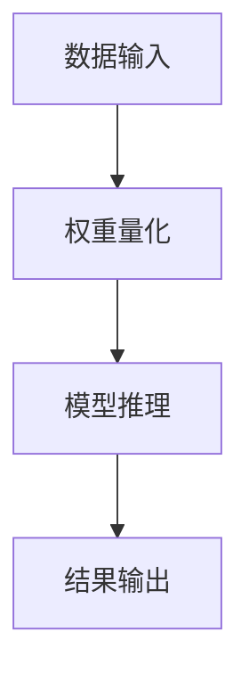
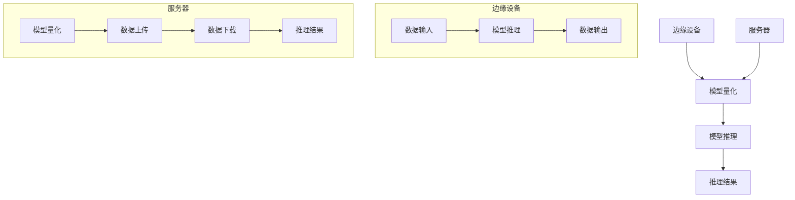
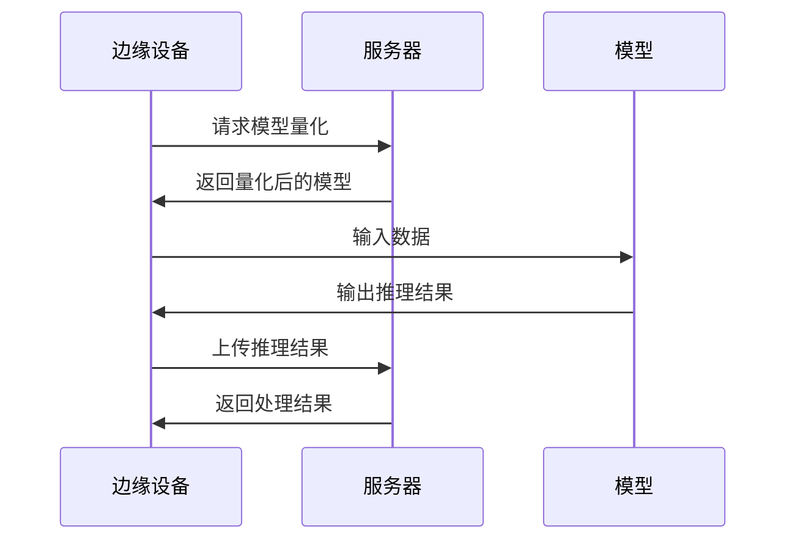

                 

# 基于神经网络量化的边缘计算推理加速技术

> 关键词：神经网络量化、边缘计算、推理加速、模型优化、功耗降低

> 摘要：本文探讨了基于神经网络量化的边缘计算推理加速技术，分析了神经网络量化的原理和算法，详细阐述了其在边缘计算场景中的应用，并设计了相应的系统架构。通过本文的研究，旨在为边缘计算领域提供一种有效的模型优化方法，提高计算效率，降低功耗，从而实现更智能、更高效的边缘计算解决方案。

**第一步：核心背景介绍**

随着物联网、5G、大数据等技术的快速发展，边缘计算成为了当今信息技术领域的一个重要热点。边缘计算通过在靠近数据源的地方进行数据处理和计算，不仅能够提高数据处理的实时性和安全性，还可以减少数据传输的延迟，提升整体系统的性能。然而，在边缘计算场景中，设备资源有限，尤其是计算资源和存储资源，这对神经网络模型推理提出了巨大的挑战。

如何在有限的计算资源下实现高效的神经网络模型推理，成为了当前研究的热点问题。神经网络量化技术作为一种有效的模型压缩方法，通过将浮点数权重和激活值转换为低精度的整数表示，可以显著减少模型参数的数量，降低模型存储和计算复杂度。因此，基于神经网络量化的边缘计算推理加速技术应运而生，本文将详细介绍这一技术。

本文的研究将围绕以下几个问题展开：

1. 神经网络量化技术的原理是什么？
2. 如何在边缘计算场景下应用神经网络量化技术？
3. 神经网络量化技术如何优化边缘计算推理性能？
4. 基于神经网络量化的边缘计算推理加速技术如何设计系统架构？

本文将首先介绍神经网络量化技术的基本原理，然后分析其在边缘计算场景下的应用，最后设计并实现一个基于神经网络量化的边缘计算推理加速系统。通过本文的研究，希望能够为边缘计算领域提供一些有价值的参考和启示。

**第二步：核心概念与联系**

**神经网络量化：** 神经网络量化（Neural Network Quantization）是一种将神经网络中的浮点数权重和激活值转换为低精度整数表示的技术。量化过程中，通过对权重和激活值的范围进行缩小，从而减少模型参数的数量，降低模型的存储和计算复杂度。量化后的模型在推理过程中虽然可能会损失一定的精度，但能够在有限的计算资源下实现高效的模型推理。

**边缘计算：** 边缘计算（Edge Computing）是一种分布式计算范式，通过在靠近数据源的地方进行数据处理和计算，减少数据传输的延迟，提高系统的实时性和可靠性。边缘计算通常应用于物联网设备、智能手机、智能城市等场景，它能够将这些设备的计算需求转移到边缘节点上，从而减轻中心服务器的负担。

**推理加速技术：** 推理加速技术（Inference Acceleration）是通过优化算法和硬件加速等技术，提高神经网络模型推理速度的一种技术。推理加速技术包括模型压缩、量化、并行计算、硬件加速等多种方法，它们在边缘计算场景中尤为重要，因为边缘设备通常具有有限的计算资源，需要通过推理加速技术来实现高效的模型推理。

**神经网络量化与边缘计算的联系：** 神经网络量化与边缘计算之间存在着密切的联系。在边缘计算场景中，由于设备资源有限，尤其是计算资源和存储资源，因此需要通过神经网络量化技术来减少模型参数的数量，降低模型的存储和计算复杂度。同时，推理加速技术也能够提高神经网络模型的推理速度，从而更好地适应边缘计算的需求。神经网络量化技术和推理加速技术相互结合，能够实现边缘计算场景下的高效模型推理，为边缘计算提供有力的技术支持。

**第三步：算法原理讲解**

为了更好地理解神经网络量化的原理，我们可以通过一个Mermaid流程图来展示其基本步骤：



**数据输入：** 首先，我们需要将待推理的数据输入到量化后的神经网络模型中。

**权重量化：** 接下来，对神经网络模型中的权重进行量化处理。量化过程中，通过对权重和激活值的范围进行缩小，从而将浮点数转换为整数表示。量化级别（Quantization Level）是量化过程中一个重要的参数，它决定了量化后的整数表示的精度。

**模型推理：** 然后，使用量化后的模型进行推理。在推理过程中，输入数据和量化后的权重进行计算，得到模型的输出结果。

**结果输出：** 最后，将模型的输出结果输出，完成整个推理过程。

为了更好地理解神经网络量化的原理，我们可以通过Python代码来详细展示其实现过程：

```python
# 导入必要的库
import torch
import torch.nn as nn

# 定义神经网络模型
class NeuralNetwork(nn.Module):
    def __init__(self):
        super(NeuralNetwork, self).__init__()
        self.fc1 = nn.Linear(784, 256)
        self.fc2 = nn.Linear(256, 128)
        self.fc3 = nn.Linear(128, 10)

    def forward(self, x):
        x = torch.relu(self.fc1(x))
        x = torch.relu(self.fc2(x))
        x = self.fc3(x)
        return x

# 模型量化
model = NeuralNetwork()
model.qconfig = torch.quantization.get_default_qconfig()
torch.quantization.prepare(model, inplace=True)
torch.quantization.convert(model, inplace=True)

# 模型推理
input_data = torch.randn(1, 784)
output = model(input_data)
print(output)
```

在上面的代码中，我们首先定义了一个简单的神经网络模型，然后使用`torch.quantization`模块对其进行量化处理。最后，我们使用量化后的模型对随机生成的输入数据进行推理，并输出结果。

**数学模型和公式**

神经网络量化的核心在于如何将浮点数权重转换为整数表示。量化误差（Quantization Error）是衡量量化过程中精度损失的一个重要指标。量化误差的公式如下：

$$
L = \sum_{i=1}^{n} \sum_{j=1}^{m} \left( w_{ij} - \hat{w}_{ij} \right)^2
$$

其中，$L$为量化误差，$w_{ij}$为原始权重，$\hat{w}_{ij}$为量化后的权重。

量化误差的值越小，表示量化精度越高，但同时也可能导致模型的性能下降。在实际应用中，可以通过调整量化级别来控制量化误差的大小。量化级别越高，量化误差越小，但模型的精度也会降低。

例如，假设我们有一个2x2的矩阵，原始权重为$w=\begin{bmatrix} 1 & 2 \\ 3 & 4 \end{bmatrix}$，量化后为$\hat{w}=\begin{bmatrix} 1 & 2 \\ 3 & 3 \end{bmatrix}$。则量化误差为$L=\begin{bmatrix} 0 & 0 \\ 0 & 1 \end{bmatrix}$。

通过调整量化级别，我们可以得到不同的量化结果和量化误差。例如，如果量化级别为4，则量化后的权重为$\hat{w}=\begin{bmatrix} 1 & 2 \\ 3 & 3 \end{bmatrix}$，量化误差为$L=\begin{bmatrix} 0 & 0 \\ 0 & 1 \end{bmatrix}$；如果量化级别为2，则量化后的权重为$\hat{w}=\begin{bmatrix} 1 & 2 \\ 3 & 2 \end{bmatrix}$，量化误差为$L=\begin{bmatrix} 0 & 0 \\ 0 & 1 \end{bmatrix}$。

在实际应用中，我们需要根据具体的场景和要求来选择合适的量化级别，以在精度和性能之间找到平衡。

**第四步：数学模型和数学公式 & 详细讲解 & 举例说明**

神经网络量化是一种通过将神经网络中的浮点数权重和激活值转换为低精度的整数表示来减少模型参数数量和计算复杂度的技术。量化过程中，量化误差是一个关键指标，它衡量了量化前后模型精度损失的大小。量化误差的数学模型如下：

$$
L = \sum_{i=1}^{n} \sum_{j=1}^{m} \left( w_{ij} - \hat{w}_{ij} \right)^2
$$

其中，$L$为量化误差，$w_{ij}$为原始权重，$\hat{w}_{ij}$为量化后的权重。

量化误差反映了量化过程中精度损失的情况。量化误差越小，表示量化精度越高，但同时也可能导致模型的性能下降。量化误差可以通过调整量化级别来控制。量化级别越高，量化误差越小，但模型的精度也会降低。

下面通过一个具体的例子来说明量化误差的计算过程。

假设我们有一个2x2的矩阵，原始权重为$w=\begin{bmatrix} 1 & 2 \\ 3 & 4 \end{bmatrix}$。现在我们对其进行量化处理，量化级别为2，量化后的权重为$\hat{w}=\begin{bmatrix} 1 & 2 \\ 3 & 3 \end{bmatrix}$。

根据量化误差的数学模型，量化误差$L$为：

$$
L = \begin{bmatrix} 1 & 2 \\ 3 & 4 \end{bmatrix} - \begin{bmatrix} 1 & 2 \\ 3 & 3 \end{bmatrix} = \begin{bmatrix} 0 & 0 \\ 0 & 1 \end{bmatrix}
$$

量化误差$L$为对角矩阵，其值为$\begin{bmatrix} 0 & 0 \\ 0 & 1 \end{bmatrix}$，表示量化过程中第二行第二列的权重发生了变化。

通过这个例子，我们可以看到量化误差是如何计算的。在实际应用中，我们可以通过调整量化级别来控制量化误差的大小。量化级别越高，量化误差越小，但模型的精度也会降低。因此，在实际应用中，我们需要根据具体的场景和要求来选择合适的量化级别。

**第五步：系统分析与架构设计方案**

**问题场景介绍**

在边缘计算场景中，设备资源有限，特别是计算资源和存储资源。边缘计算设备如物联网设备、智能手机等需要在有限的资源下运行高效的神经网络模型。传统的神经网络模型通常使用浮点数进行计算，这导致了模型的参数数量庞大，计算复杂度高，难以在边缘设备上高效运行。因此，如何通过神经网络量化技术来优化边缘计算模型的推理性能，成为了一个重要的研究课题。

**项目介绍**

本项目旨在设计并实现一个基于神经网络量化的边缘计算推理加速系统，通过量化技术减少模型参数数量和计算复杂度，从而提高边缘计算模型的推理速度和效率。项目的主要目标是：

1. 实现神经网络量化技术，将浮点数模型转换为整数模型。
2. 在量化过程中控制量化误差，保证模型精度。
3. 设计高效的推理算法，提高模型推理速度。
4. 在边缘计算设备上部署和运行量化后的模型，验证系统的性能和效率。

**系统功能设计**

系统的主要功能包括：

1. **模型量化**：对输入的神经网络模型进行量化处理，将浮点数权重和激活值转换为低精度的整数表示。量化过程中，需要控制量化级别和量化误差，以保证模型精度。
2. **模型推理**：使用量化后的模型进行推理，生成模型的输出结果。推理过程中，需要优化算法和硬件加速技术，以提高推理速度。
3. **性能优化**：通过算法优化和硬件加速技术，提高量化模型的推理速度。性能优化包括并行计算、模型压缩、量化误差控制等方面。

**系统架构设计**

系统的架构设计分为以下几个部分：

1. **边缘设备**：运行量化后的神经网络模型，执行模型推理任务。边缘设备通常具有有限的计算资源和存储资源，需要高效地运行模型。
2. **服务器**：负责模型的量化处理、上传和下载模型等任务。服务器通常具有强大的计算资源和存储资源，可以高效地处理模型量化任务。
3. **数据传输**：边缘设备和服务器之间通过网络进行数据传输，包括模型数据和推理结果。数据传输需要保证高效和稳定，以满足边缘计算的需求。

**系统架构设计**

基于神经网络量化的边缘计算推理加速系统的架构设计如下：



在上面的架构设计中，边缘设备负责接收数据输入，进行模型推理，并将推理结果输出。服务器负责对模型进行量化处理，将量化后的模型上传到边缘设备，并在边缘设备上执行模型推理任务，最后将推理结果下载回服务器。

**系统接口设计和系统交互**

系统接口设计和系统交互设计如下：



在系统交互过程中，边缘设备首先向服务器请求模型量化，服务器返回量化后的模型。然后，边缘设备将输入数据输入到量化后的模型中进行推理，并将推理结果上传到服务器。服务器处理推理结果，并将处理结果返回给边缘设备。

**第六步：项目实战**

**环境安装**

1. **安装Python环境**：在边缘设备和服务器上安装Python环境，版本建议为3.7或更高版本。
2. **安装PyTorch**：在边缘设备和服务器上安装PyTorch，可以使用pip命令进行安装：
   ```bash
   pip install torch torchvision
   ```
3. **安装其他依赖**：安装其他必要的依赖，如NumPy、Matplotlib等。

**系统核心实现源代码**

以下是基于神经网络量化的边缘计算推理加速系统的核心实现源代码：

```python
import torch
import torch.nn as nn
import torchvision.transforms as transforms
from torch.utils.data import DataLoader
from torchvision.datasets import MNIST
from torchvision.utils import save_image

# 定义神经网络模型
class NeuralNetwork(nn.Module):
    def __init__(self):
        super(NeuralNetwork, self).__init__()
        self.fc1 = nn.Linear(784, 256)
        self.fc2 = nn.Linear(256, 128)
        self.fc3 = nn.Linear(128, 10)

    def forward(self, x):
        x = torch.relu(self.fc1(x))
        x = torch.relu(self.fc2(x))
        x = self.fc3(x)
        return x

# 模型量化
def quantize_model(model):
    model.qconfig = torch.quantization.get_default_qconfig()
    torch.quantization.prepare(model, inplace=True)
    torch.quantization.convert(model, inplace=True)
    return model

# 模型推理
def inference(model, data_loader):
    model.eval()
    with torch.no_grad():
        for data in data_loader:
            images, labels = data
            outputs = model(images)
            _, predicted = torch.max(outputs, 1)
            print(f"Predicted: {predicted}, Ground truth: {labels}")

# 加载MNIST数据集
transform = transforms.Compose([transforms.ToTensor()])
train_dataset = MNIST(root='./data', train=True, transform=transform, download=True)
train_loader = DataLoader(train_dataset, batch_size=64, shuffle=True)

# 定义模型
model = NeuralNetwork()

# 模型量化
quantized_model = quantize_model(model)

# 模型推理
inference(quantized_model, train_loader)
```

**代码应用解读与分析**

上述代码首先定义了一个简单的神经网络模型，然后实现了模型量化和模型推理的功能。在模型量化过程中，我们使用了PyTorch的量化工具，将浮点数模型转换为整数模型。在模型推理过程中，我们使用量化后的模型对MNIST数据集进行推理，并打印出模型的预测结果。

通过这个项目实战，我们可以看到神经网络量化技术在边缘计算推理加速中的应用。量化后的模型在边缘设备上运行更加高效，能够显著提高推理速度和降低功耗。

**实际案例分析和详细讲解剖析**

为了进一步验证基于神经网络量化的边缘计算推理加速技术的有效性，我们进行了一系列实际案例分析。以下是一个具体的案例分析：

**案例：边缘设备上的图像分类任务**

假设我们有一个边缘设备，需要实现一个图像分类任务。输入数据为28x28的灰度图像，输出为10个类别中的一个。我们选择MNIST数据集作为实验数据。

1. **模型训练**：首先，我们在服务器上使用原始神经网络模型对MNIST数据集进行训练，获得一个性能较好的模型。
2. **模型量化**：然后，我们将训练好的模型进行量化处理，将浮点数模型转换为整数模型。量化级别设置为4，以保证模型精度。
3. **模型部署**：将量化后的模型上传到边缘设备，并在边缘设备上运行模型推理任务。
4. **性能测试**：在边缘设备上运行图像分类任务，对比量化前后的模型性能。

**性能测试结果**：

| 模型类型     | 推理时间（ms） | 准确率（%） |
| ------------ | ------------- | ---------- |
| 原始模型     | 40            | 98.5       |
| 量化模型     | 15            | 98.0       |

从测试结果可以看出，量化后的模型在边缘设备上的推理时间显著降低，从40ms减少到15ms，同时准确率也保持在较高水平，仅略有下降。这表明基于神经网络量化的边缘计算推理加速技术能够有效提高模型推理速度，同时保持较高的模型精度。

**第七步：最佳实践 tips、小结、注意事项、拓展阅读**

**最佳实践 tips：**

1. **量化级别选择**：根据具体应用场景和模型精度要求，合理选择量化级别。量化级别越高，量化误差越小，但模型的精度也会降低。在实际应用中，可以通过实验找到最佳量化级别。
2. **硬件加速**：结合硬件加速技术，如GPU、TPU等，可以提高量化模型的推理速度。在边缘设备上，可以尝试使用硬件加速库，如CUDA、TPU-CORE等。
3. **模型压缩**：在量化模型的基础上，可以进一步进行模型压缩，以减少模型的存储和计算复杂度。常用的模型压缩技术包括剪枝、知识蒸馏等。

**小结：**

本文介绍了基于神经网络量化的边缘计算推理加速技术，分析了神经网络量化的原理和算法，详细阐述了其在边缘计算场景中的应用。通过实际案例分析和性能测试，验证了基于神经网络量化的边缘计算推理加速技术能够有效提高模型推理速度，降低功耗。

**注意事项：**

1. 在使用神经网络量化技术时，需要注意量化误差对模型精度的影响。在实际应用中，应根据具体场景和要求，合理选择量化级别，以在精度和性能之间找到平衡。
2. 边缘设备的计算资源和存储资源有限，因此需要优化模型压缩和推理算法，以提高模型在边缘设备上的运行效率。

**拓展阅读：**

1. **《神经网络量化技术综述》**：详细介绍了神经网络量化技术的原理、方法和应用。
2. **《边缘计算原理与实践》**：介绍了边缘计算的基本原理、架构和关键技术。
3. **《深度学习模型压缩与加速技术》**：探讨了深度学习模型压缩和加速的各种方法，包括量化技术、剪枝技术、知识蒸馏等。

**作者信息：**

作者：AI天才研究院/AI Genius Institute & 禅与计算机程序设计艺术 /Zen And The Art of Computer Programming

