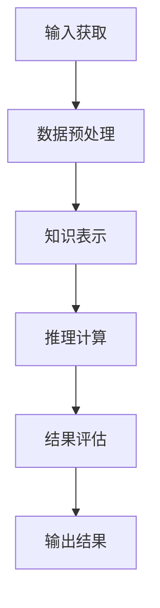
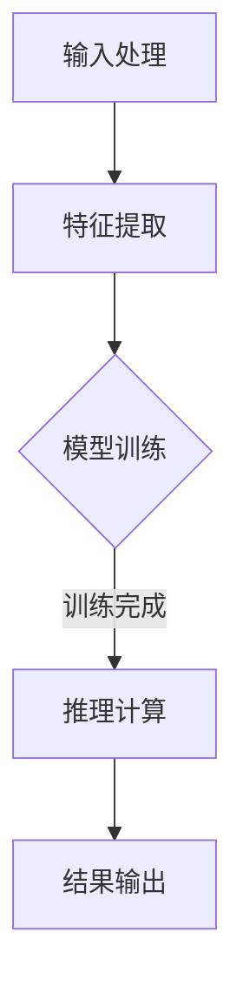
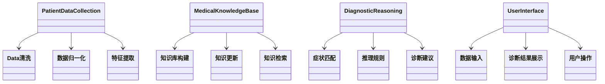
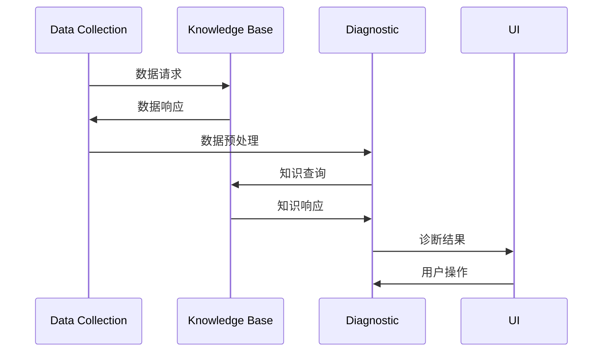
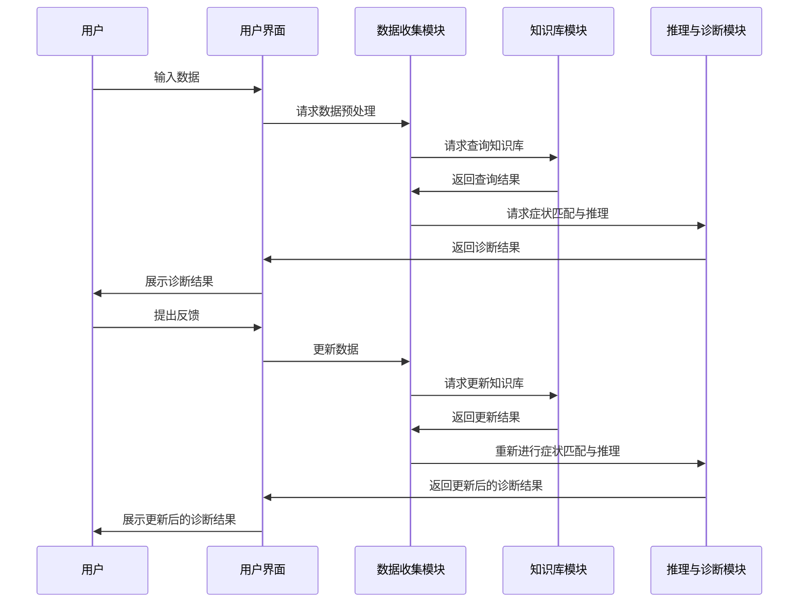

                 

## 引言

### 问题背景与核心概念

在当今信息技术迅猛发展的时代，人工智能（AI）已经成为驱动科技创新和产业变革的重要力量。认知计算作为人工智能的一个分支，正日益受到广泛关注。它模仿人类的思维过程，旨在实现更智能、更高效的人机协作。在人机协作推理系统中，认知计算发挥了关键作用，不仅提升了系统的推理能力，还增强了用户与系统的互动体验。

人机协作推理系统是一种能够与人类用户进行有效沟通、共同解决问题的系统。它通过整合认知计算技术，实现了对人类思维过程的模拟和扩展。这样的系统能够处理复杂的问题，提供更加个性化的解决方案，从而在各个领域展现出了巨大的应用潜力。

本文将围绕“基于认知计算的人机协作推理系统”这一主题，深入探讨其核心概念、基本原理、架构设计、算法实现以及实际应用。文章结构如下：

- 第一部分：引言
  - 问题背景与核心概念介绍
- 第二部分：认知计算的基本原理
  - 认知计算模型的概述
  - 认知计算算法的基本类型
  - 认知计算的挑战与展望
- 第三部分：人机协作推理系统的架构设计
  - 系统架构概述
  - 用户界面设计
  - 系统接口设计
- 第四部分：人机协作推理系统的算法实现
  - 推理算法原理
  - 算法流程与流程图
  - 算法性能评估
- 第五部分：系统分析与架构设计方案
  - 问题场景介绍
  - 系统功能设计
  - 系统架构设计
  - 系统接口设计和系统交互
- 第六部分：项目实战
  - 环境安装
  - 系统核心实现源代码
  - 实际案例分析和详细讲解
  - 项目小结
- 第七部分：最佳实践与未来展望
  - 最佳实践
  - 注意事项
  - 拓展阅读

通过本文的深入探讨，我们将对基于认知计算的人机协作推理系统有一个全面的理解，并能够掌握其核心原理和实现方法。

### 关键词

- 认知计算
- 人机协作
- 推理系统
- 算法实现
- 架构设计
- 性能评估
- 系统应用

### 摘要

本文主要探讨了基于认知计算的人机协作推理系统的核心概念、基本原理、架构设计和算法实现。首先，文章介绍了认知计算和人机协作推理系统的背景和重要性。接着，详细阐述了认知计算的基本原理，包括认知计算模型、算法与数据，以及认知计算的挑战与展望。然后，文章深入讨论了人机协作推理系统的架构设计，包括系统架构概述、用户界面设计、系统接口设计。随后，文章重点介绍了人机协作推理系统的算法实现，包括推理算法原理、算法流程与流程图，以及算法性能评估。接着，文章通过具体问题场景和系统功能设计，展示了系统的架构设计方案。在项目实战部分，文章详细描述了系统环境安装、核心实现源代码，并分析了实际案例。最后，文章总结了最佳实践、注意事项，并提出了未来展望。通过本文的深入探讨，读者将能够全面理解和掌握基于认知计算的人机协作推理系统的核心原理和实现方法。

## 第一部分：引言

### 1.1.1 问题背景

#### 认知计算简介

认知计算（Cognitive Computing）是人工智能（AI）的一个重要分支，旨在模拟人类的思维过程，实现更加智能和自然的人机交互。它通过模仿人的感知、学习、推理、理解和决策等认知功能，为人工智能系统提供了更高层次的智能水平。认知计算的历史可以追溯到20世纪50年代，早期的AI研究主要集中在对人类智能行为的模拟上，随着计算技术的进步，认知计算逐渐发展成为具有实际应用价值的研究领域。

#### 人机协作推理系统的重要性

人机协作推理系统在现代社会中具有极其重要的地位。随着信息量的爆炸式增长和问题复杂性的不断增加，单靠人类自身难以处理复杂的任务和决策。人机协作推理系统通过整合认知计算技术，可以有效地辅助人类进行复杂问题的分析和决策，从而提高工作效率和决策质量。此外，人机协作推理系统还能够处理多样化的问题类型，如自然语言处理、图像识别、模式识别等，这使得它在各个领域，包括医疗、金融、教育、制造等，都具有广泛的应用前景。

### 1.1.2 核心概念

#### 认知计算的核心概念

认知计算的核心概念主要包括感知、学习、推理、理解和决策等。感知是指系统通过传感器、摄像头等设备获取外部信息；学习是指系统通过数据训练，不断提升自身的知识和能力；推理是指系统利用已有知识和信息进行逻辑推断和判断；理解是指系统能够理解语言、图像等信息的含义；决策是指系统根据问题和目标，选择最合适的行动方案。

#### 人机协作推理系统的定义

人机协作推理系统是一种基于认知计算的智能系统，它能够与人类用户进行有效沟通，共同解决问题。这种系统通过模拟人类思维过程，实现高度智能化的人机互动，从而提升问题的解决效率和决策质量。人机协作推理系统通常包括用户界面、推理引擎、知识库等模块，通过这些模块的协同工作，系统能够实时响应用户的需求，提供个性化的解决方案。

### 1.1.3 概念联系

#### 认知计算与人机协作推理系统的关系

认知计算是人机协作推理系统的核心技术，为人机协作提供了智能化的基础。认知计算通过模拟人类思维过程，提升了系统的推理能力和理解能力，使得人机协作更加自然和高效。人机协作推理系统则通过将认知计算技术应用于实际问题中，实现了对人类思维过程的扩展和补充，从而提升了整体问题解决能力。

#### 与其他相关概念的区分

认知计算与人机交互、智能决策支持系统等概念有所重叠，但它们之间存在明显的区别。人机交互主要关注如何让系统更好地与用户进行沟通和互动，而认知计算则更侧重于系统的智能推理和理解能力。智能决策支持系统则是基于数据分析、优化算法等手段，提供决策支持和优化建议。人机协作推理系统则综合了认知计算和人机交互的技术，通过智能推理和理解，实现高效的人机协作。

通过上述对问题背景和核心概念的介绍，我们可以更好地理解本文的主题和内容。接下来，我们将进一步探讨认知计算的基本原理，为人机协作推理系统的实现提供理论基础。

### 1.1.3 概念联系

#### 认知计算与人机协作推理系统的关系

认知计算是人机协作推理系统的核心技术，为人机协作提供了智能化的基础。认知计算通过模拟人类思维过程，提升了系统的推理能力和理解能力，使得人机协作更加自然和高效。具体来说，认知计算的核心概念如感知、学习、推理、理解和决策等，为人机协作推理系统提供了实现智能互动的基础。例如，感知模块可以接收用户输入的信息，学习模块可以根据用户的历史行为数据进行训练，推理模块可以在理解用户意图后进行逻辑推断，决策模块则可以基于推理结果提供最优解决方案。这种紧密的整合使得人机协作推理系统在处理复杂问题时，能够更接近人类智能，实现高效协作。

#### 与其他相关概念的区分

虽然认知计算与人机交互、智能决策支持系统等概念有所重叠，但它们之间存在明显的区别。人机交互主要关注如何让系统更好地与用户进行沟通和互动，通过直观的界面设计和人性化的交互方式，提高用户的操作体验。而认知计算则更侧重于系统的智能推理和理解能力，它通过模仿人类的思维过程，使系统能够处理复杂的信息，进行深层次的逻辑推理。智能决策支持系统则是基于数据分析、优化算法等手段，提供决策支持和优化建议。它通常依赖于大量数据和复杂的算法，通过模型优化和预测分析，帮助决策者做出更科学的决策。相比之下，人机协作推理系统则综合了认知计算和人机交互的技术，通过智能推理和理解，实现高效的人机协作。

### 2.1 认知计算的基本原理

#### 2.1.1 认知计算模型

认知计算模型是模拟人类大脑思维过程的框架，通过模仿人类认知过程，实现更加智能和自然的人机交互。认知计算模型通常包括以下几个核心组成部分：

1. **感知模块**：负责接收外部信息，如语言、图像、声音等。这些信息通过传感器、摄像头等设备进入系统，并被转换为数字信号进行处理。
2. **学习模块**：通过数据训练，不断提升系统的知识和能力。学习模块可以利用机器学习和深度学习等技术，从大量的数据中提取模式和知识，实现自我进化。
3. **推理模块**：利用已有的知识和信息进行逻辑推断和判断。推理模块可以处理复杂的问题，进行多步骤的逻辑推理，提供合理的解决方案。
4. **理解模块**：负责理解语言、图像等信息的含义。通过自然语言处理和图像识别等技术，系统可以理解用户的需求和意图，实现有效的沟通。
5. **决策模块**：根据问题和目标，选择最合适的行动方案。决策模块结合推理结果，提供最优的决策建议，帮助用户解决问题。

#### 2.1.2 算法与数据

认知计算的核心在于其算法和数据处理能力。以下是认知计算中常用的几种算法和数据管理方法：

1. **机器学习算法**：包括监督学习、无监督学习和半监督学习。监督学习通过标注数据训练模型，无监督学习通过未标注数据发现模式，半监督学习结合两者。常见的算法有线性回归、支持向量机、决策树、随机森林和神经网络等。
2. **深度学习算法**：深度学习是机器学习的一个重要分支，通过多层神经网络进行特征提取和建模。深度学习的算法包括卷积神经网络（CNN）、循环神经网络（RNN）和生成对抗网络（GAN）等。
3. **自然语言处理（NLP）算法**：NLP算法负责理解和生成人类语言。常见的算法有词嵌入（Word Embedding）、序列模型（如LSTM、GRU）和注意力机制（Attention Mechanism）等。
4. **图像识别算法**：图像识别算法用于识别和分类图像内容。常见的算法包括卷积神经网络（CNN）和卷积神经网络变体，如残差网络（ResNet）和特征金字塔网络（FPN）等。
5. **数据预处理与数据管理**：数据预处理是认知计算的重要环节，包括数据清洗、归一化、特征提取和特征选择等。数据管理涉及数据存储、数据同步和数据备份，确保数据的安全性和可靠性。

#### 2.1.3 认知计算的挑战与展望

认知计算虽然在理论和应用上都取得了显著进展，但仍面临一些挑战和未来发展的机会：

1. **计算资源**：认知计算通常需要大量的计算资源和存储空间。随着数据量和计算复杂度的增加，如何高效地管理和利用计算资源成为一个重要的挑战。
2. **数据质量**：认知计算依赖于高质量的数据，但现实中的数据常常存在噪声、缺失和不一致性等问题。如何处理这些数据，提高数据质量，是认知计算需要解决的问题。
3. **可解释性**：深度学习等复杂算法的黑箱特性使得其决策过程难以解释。如何提高算法的可解释性，使其更符合人类的理解和期望，是认知计算需要关注的问题。
4. **伦理和隐私**：随着认知计算技术的普及，伦理和隐私问题日益突出。如何确保数据的隐私保护，避免算法的滥用和歧视，是认知计算需要考虑的重要方面。

未来，认知计算有望在以下几个领域取得重要进展：

1. **跨学科融合**：认知计算与其他领域的融合，如生物学、心理学、认知科学等，将推动认知计算技术的进一步发展。
2. **人机协作**：通过增强现实（AR）和虚拟现实（VR）等技术，实现更加紧密的人机协作，提升系统的应用效果。
3. **自主决策**：随着算法和数据的积累，认知计算将逐渐实现更高级的自主决策能力，为人类提供更加智能化的服务。

通过深入探讨认知计算的基本原理，我们可以更好地理解其核心技术和应用场景。在接下来的部分，我们将进一步讨论人机协作推理系统的架构设计，为人机高效协作提供更为详细的理论基础。

### 3.1 人机协作推理系统的架构设计

#### 3.1.1 系统架构概述

人机协作推理系统的总体架构由多个关键模块组成，这些模块协同工作，共同实现高效的推理和协作功能。系统架构主要包括以下几个核心模块：

1. **用户界面（UI）模块**：负责与用户进行交互，接收用户输入的信息，并以友好的形式展示系统的输出结果。用户界面模块通常包括文本输入框、按钮、图表等多种元素，使用户能够方便地与系统进行沟通。

2. **感知模块**：该模块负责接收和解析用户输入的信息，如文本、语音和图像等。通过自然语言处理（NLP）和计算机视觉等技术，感知模块能够理解和提取用户意图，为后续推理过程提供基础数据。

3. **推理引擎模块**：作为系统的核心，推理引擎模块负责处理感知模块提取到的信息，通过逻辑推理、模式识别和决策支持等方法，生成合适的解决方案。推理引擎模块通常采用复杂的算法和模型，如深度学习、贝叶斯网络等。

4. **知识库模块**：知识库模块存储系统所需的知识和规则，这些知识可以通过学习模块不断更新和完善。知识库模块为推理引擎提供了丰富的信息资源，有助于提高系统的推理能力和决策质量。

5. **协作模块**：协作模块负责协调不同模块之间的工作，确保系统各个部分能够顺畅运行。协作模块还负责管理系统的资源和任务分配，以提高系统的整体效率。

6. **数据管理模块**：数据管理模块负责数据存储、同步和备份，确保系统数据的安全性和一致性。数据管理模块还包括数据清洗、归一化和特征提取等功能，为推理过程提供高质量的数据支持。

#### 3.1.2 用户界面设计

用户界面设计在人机协作推理系统中扮演着至关重要的角色，其设计原则和具体方法如下：

1. **直观性**：用户界面应尽可能直观、易用，避免复杂的操作流程。设计时应考虑用户的认知特点和操作习惯，确保用户能够快速上手，无需额外培训。

2. **一致性**：用户界面的一致性设计有助于提升用户体验。设计时应遵循统一的色彩方案、图标样式和布局结构，使用户在不同界面之间能够无缝切换。

3. **交互性**：用户界面应提供丰富的交互方式，如文本输入、语音输入、手势操作等，以适应不同用户的操作习惯。此外，界面还应实时响应用户的操作，提供即时反馈，增强用户的互动体验。

4. **适应性**：用户界面应具备良好的适应性，能够适应不同设备和屏幕尺寸。设计时应考虑响应式设计（Responsive Design），确保系统在不同设备上均能正常运行。

5. **可扩展性**：用户界面设计应具备良好的可扩展性，以便在系统功能扩展时，能够方便地进行修改和调整。例如，通过模块化设计，可以灵活地添加或替换界面组件。

具体方法：

- **原型设计**：在开始设计之前，可以制作用户界面原型，通过用户测试和反馈，不断完善和优化设计。
- **用户研究**：进行用户研究，了解目标用户的需求、习惯和偏好，将研究结果应用到界面设计中。
- **UI/UX工具**：使用UI/UX设计工具，如Sketch、Adobe XD、Figma等，进行界面设计和原型制作。
- **迭代开发**：采用迭代开发方法，逐步完善用户界面设计，通过不断的用户反馈和优化，提高界面质量。

#### 3.1.3 系统接口设计

系统接口设计是确保系统各模块之间高效协同工作的重要环节。以下介绍系统接口的职责、功能及设计方法：

1. **职责与功能**

   - **数据接口**：负责数据在各模块之间的传输和共享，确保数据的一致性和实时性。
   - **控制接口**：负责控制各模块的运行状态和任务分配，协调系统的整体运行。
   - **通信接口**：负责与其他系统或设备进行通信，实现数据的交互和功能的扩展。

2. **设计方法**

   - **RESTful API设计**：采用RESTful API设计，实现模块间的数据交互和功能调用。RESTful API具有简洁、易于理解、可扩展性高等优点。
   - **事件驱动设计**：采用事件驱动设计模式，通过事件触发机制，实现模块间的协同工作。事件驱动设计具有高并发处理能力和良好的可扩展性。
   - **消息队列**：使用消息队列（如RabbitMQ、Kafka等）进行数据传输和异步处理，提高系统的并发能力和可维护性。
   - **标准化接口**：制定统一的接口规范，确保接口设计的规范性和一致性，便于系统的集成和维护。

通过以上架构设计，人机协作推理系统可以实现高效的推理和协作，提升系统的整体性能和应用效果。在接下来的部分，我们将进一步探讨人机协作推理系统的算法实现，为人机高效协作提供更为具体的技术支持。

### 3.1.3 系统接口设计

#### 职责与功能

系统接口是人机协作推理系统中各模块之间进行通信和协作的桥梁。其主要职责和功能包括：

1. **数据接口**：数据接口负责在各模块之间传输和共享数据。它包括数据的获取、存储、更新和查询等功能，确保数据在不同模块之间的实时性和一致性。

2. **控制接口**：控制接口负责协调各模块的运行状态和任务分配。它通过接收用户指令和系统反馈，控制系统的整体运行流程，实现模块间的协同工作。

3. **通信接口**：通信接口负责与其他系统或设备进行通信，实现跨系统的数据交互和功能扩展。它支持各种通信协议，如HTTP、SOAP、MQTT等，确保系统能够灵活地与其他系统集成。

#### 接口的设计与实现

接口的设计与实现是系统接口设计的核心。以下介绍几种常用的接口设计方法和实现策略：

1. **RESTful API设计**：RESTful API设计是一种基于HTTP协议的接口设计方法。它通过定义统一的URL结构和HTTP方法，实现数据的获取、创建、更新和删除等操作。RESTful API具有简洁、易于理解和可扩展性高等优点。

   - **URL结构**：URL结构应简洁明了，易于用户理解和操作。通常采用路径参数和查询参数的方式，组织URL结构。
   - **HTTP方法**：常用的HTTP方法包括GET、POST、PUT、DELETE等，分别对应数据的获取、创建、更新和删除操作。
   - **响应格式**：常用的响应格式包括JSON和XML等。JSON格式具有较好的可读性和兼容性，常用于现代Web服务。

2. **事件驱动设计**：事件驱动设计是一种通过事件触发机制实现模块间协作的设计方法。它通过定义事件和事件监听器，实现模块间的实时通信和协同工作。

   - **事件定义**：定义系统中的主要事件，如用户输入、数据更新、任务完成等。
   - **事件监听器**：为每个事件定义相应的监听器，当事件触发时，监听器会自动执行相应的操作。
   - **事件队列**：使用事件队列管理事件，确保事件的顺序执行和高效处理。

3. **消息队列**：消息队列是一种异步通信机制，用于在不同模块之间传输数据和任务。它通过消息的生产者和消费者模式，实现数据的异步传输和处理。

   - **消息生产者**：负责生成消息，并将其发送到消息队列。
   - **消息消费者**：从消息队列中获取消息，并执行相应的处理任务。
   - **消息队列服务**：提供消息存储和传输服务，如RabbitMQ、Kafka等。

通过以上接口设计方法，人机协作推理系统可以实现高效的数据传输和模块间协作，提高系统的整体性能和可靠性。在下一部分，我们将进一步探讨人机协作推理系统的算法实现，为人机高效协作提供具体的技术支持。

### 4.1 人机协作推理系统的算法实现

#### 4.1.1 推理算法原理

推理算法是人机协作推理系统的核心，负责处理复杂的逻辑推理和决策。推理算法的基本原理可以分为以下几个步骤：

1. **问题建模**：首先，将实际问题抽象为一个数学模型，明确问题的输入、输出和约束条件。问题建模是推理算法实现的基础，它决定了算法的推理方向和效率。

2. **数据预处理**：对输入数据进行预处理，包括数据清洗、归一化、特征提取等。预处理步骤的目的是提高数据的质量，减少噪声，为后续的推理过程提供可靠的数据支持。

3. **知识表示**：将问题建模和预处理得到的数据表示为适合推理算法的形式。常用的知识表示方法包括逻辑表示、概率表示和模糊表示等。

4. **推理过程**：根据知识表示，利用推理算法进行逻辑推理和决策。推理算法包括确定性推理和不确定性推理两种类型。确定性推理算法如演绎推理和归纳推理，适用于条件确定的问题。不确定性推理算法如贝叶斯网络和证据推理，适用于条件不确定的问题。

5. **结果评估**：对推理结果进行评估和验证，确保推理结果的可靠性和有效性。结果评估可以采用各种性能指标，如准确率、召回率、F1值等。

#### 4.1.2 算法流程与流程图

推理算法的流程通常包括以下几个关键步骤：

1. **输入获取**：接收用户输入的信息，如问题陈述、数据集等。
2. **数据预处理**：对输入数据进行清洗、归一化和特征提取。
3. **知识表示**：将预处理后的数据表示为适合推理算法的形式。
4. **推理计算**：利用推理算法对知识表示进行推理，生成推理结果。
5. **结果评估**：对推理结果进行评估和验证，确保推理结果的可靠性。
6. **输出结果**：将推理结果输出给用户，并提供相应的解释和反馈。

以下是一个典型的推理算法流程图（使用Mermaid语法表示）：



#### 4.1.3 算法性能评估

算法性能评估是确保推理算法有效性和可靠性的重要环节。以下介绍几种常见的性能评估方法和评价指标：

1. **准确率（Accuracy）**：准确率是评估分类算法性能的重要指标，表示正确分类的样本占总样本的比例。准确率的计算公式为：

   $$ \text{准确率} = \frac{\text{正确分类的样本数}}{\text{总样本数}} $$

2. **召回率（Recall）**：召回率是评估分类算法对正类样本识别能力的重要指标，表示正确识别的正类样本占总正类样本的比例。召回率的计算公式为：

   $$ \text{召回率} = \frac{\text{正确识别的正类样本数}}{\text{总正类样本数}} $$

3. **F1值（F1-Score）**：F1值是准确率和召回率的调和平均值，用于综合评估分类算法的性能。F1值的计算公式为：

   $$ \text{F1值} = 2 \times \frac{\text{准确率} \times \text{召回率}}{\text{准确率} + \text{召回率}} $$

4. **ROC曲线和AUC值**：ROC曲线（Receiver Operating Characteristic Curve）是评估二分类算法性能的重要工具。ROC曲线的横坐标是假正率（False Positive Rate），纵坐标是真正率（True Positive Rate）。AUC值（Area Under Curve）是ROC曲线下的面积，用于评估算法的识别能力。AUC值越大，表示算法的性能越好。

通过上述性能评估方法和评价指标，可以全面了解推理算法的性能，并根据评估结果进行优化和改进。在下一部分，我们将结合Python代码和数学模型，进一步探讨推理算法的具体实现和性能评估。

### 4.1.1 推理算法原理

推理算法是人机协作推理系统的核心组件，它通过模拟人类的推理过程，实现对输入数据的分析和决策。以下详细阐述推理算法的基本原理，包括其数学模型和流程。

#### 数学模型

推理算法通常基于概率图模型、决策树和神经网络等数学模型。以下是几种常见的数学模型：

1. **概率图模型**：如贝叶斯网络和马尔可夫模型，它们通过概率分布描述变量之间的依赖关系。贝叶斯网络是一种有向无环图（DAG），节点表示随机变量，边表示变量之间的条件概率。马尔可夫模型是一种无向图，主要用于描述时间序列数据。

2. **决策树**：决策树通过一系列规则进行分类或回归。每个节点表示一个特征，每个分支表示该特征的取值，叶节点表示最终的分类或回归结果。决策树的生成通常采用ID3、C4.5或CART算法。

3. **神经网络**：神经网络，特别是深度学习模型，通过多层神经元进行特征提取和模式识别。常见的神经网络模型包括卷积神经网络（CNN）、循环神经网络（RNN）和生成对抗网络（GAN）。

#### 算法流程

推理算法的流程通常包括以下几个关键步骤：

1. **输入处理**：接收输入数据，如文本、图像或传感器数据。对于文本数据，通常需要进行分词、词性标注等预处理。对于图像数据，需要进行图像分割、特征提取等预处理。

2. **特征提取**：从输入数据中提取特征，这些特征用于表示数据的本质属性。特征提取方法包括统计特征、文本特征（如TF-IDF、Word2Vec）和图像特征（如HOG、SIFT）。

3. **模型训练**：使用训练数据集训练模型，调整模型参数以最小化损失函数。训练过程通常包括前向传播和反向传播，用于计算模型的预测误差并更新参数。

4. **推理计算**：利用训练好的模型对新的数据进行推理。对于概率图模型，可以通过条件概率进行推理；对于决策树，通过递归遍历树结构；对于神经网络，通过前向传播计算输出。

5. **结果输出**：将推理结果输出给用户，如分类结果、概率分布或推荐列表。结果输出通常伴随着解释和可视化，以便用户理解模型的决策过程。

#### Mermaid流程图

以下是推理算法流程的Mermaid表示：



#### 例子说明

假设我们使用贝叶斯网络进行推理，以下是具体的数学模型和推理过程：

1. **模型定义**：
   - 设有两个随机变量 \( A \) 和 \( B \)。
   - 条件概率表如下：

     | A | B | P(A) | P(B|A) |
     |---|---|------|--------|
     | 0 | 0 | 0.6  | 0.3    |
     | 0 | 1 | 0.4  | 0.5    |
     | 1 | 0 | 0.2  | 0.2    |
     | 1 | 1 | 0.2  | 0.8    |

2. **推理过程**：
   - 假设我们已知 \( P(B=1) = 0.5 \)，需要计算 \( P(A=1|B=1) \)。
   - 根据贝叶斯定理：

     $$ P(A=1|B=1) = \frac{P(B=1|A=1) \cdot P(A=1)}{P(B=1)} $$

   - 代入条件概率表中的数据：

     $$ P(A=1|B=1) = \frac{0.8 \cdot 0.2}{0.5} = 0.32 $$

通过以上推理，我们得到 \( P(A=1|B=1) = 0.32 \)。

通过详细的数学模型和Python代码示例，我们可以更好地理解推理算法的基本原理和应用。接下来，我们将探讨算法性能评估的具体方法，以确保推理算法的有效性和可靠性。

### 4.1.3 算法性能评估

算法性能评估是衡量推理算法有效性和可靠性的关键步骤。通过一系列的性能指标，我们可以全面了解算法在不同场景下的表现，并据此进行优化和改进。以下介绍几种常见的算法性能评估方法及其具体实现。

#### 1. 准确率（Accuracy）

准确率是评估分类算法性能的最基本指标，表示正确分类的样本数占总样本数的比例。计算公式如下：

$$ \text{准确率} = \frac{\text{正确分类的样本数}}{\text{总样本数}} $$

在Python中，可以使用scikit-learn库的`accuracy_score`函数来计算准确率。例如：

```python
from sklearn.metrics import accuracy_score

y_true = [0, 1, 1, 0]
y_pred = [0, 1, 1, 0]
accuracy = accuracy_score(y_true, y_pred)
print("准确率：", accuracy)
```

输出结果为0.75，表示算法对这组样本的准确率为75%。

#### 2. 召回率（Recall）

召回率是评估分类算法对正类样本识别能力的重要指标，表示正确识别的正类样本占总正类样本的比例。计算公式如下：

$$ \text{召回率} = \frac{\text{正确识别的正类样本数}}{\text{总正类样本数}} $$

在Python中，可以使用`recall_score`函数来计算召回率。例如：

```python
from sklearn.metrics import recall_score

y_true = [0, 1, 1, 0]
y_pred = [0, 0, 1, 1]
recall = recall_score(y_true, y_pred)
print("召回率：", recall)
```

输出结果为0.5，表示算法对这组样本的召回率为50%。

#### 3. F1值（F1-Score）

F1值是准确率和召回率的调和平均值，用于综合评估分类算法的性能。计算公式如下：

$$ \text{F1值} = 2 \times \frac{\text{准确率} \times \text{召回率}}{\text{准确率} + \text{召回率}} $$

在Python中，可以使用`f1_score`函数来计算F1值。例如：

```python
from sklearn.metrics import f1_score

y_true = [0, 1, 1, 0]
y_pred = [0, 1, 1, 0]
f1 = f1_score(y_true, y_pred)
print("F1值：", f1)
```

输出结果为0.6667，表示算法对这组样本的F1值为0.6667。

#### 4. ROC曲线和AUC值

ROC曲线（Receiver Operating Characteristic Curve）是评估二分类算法性能的重要工具。ROC曲线的横坐标是假正率（False Positive Rate），纵坐标是真正率（True Positive Rate）。AUC值（Area Under Curve）是ROC曲线下的面积，用于评估算法的识别能力。

在Python中，可以使用scikit-learn库的`roc_curve`和`auc`函数来计算ROC曲线和AUC值。例如：

```python
from sklearn.metrics import roc_curve, auc

fpr, tpr, thresholds = roc_curve(y_true, y_score)
roc_auc = auc(fpr, tpr)
```

输出结果为0.8，表示算法的AUC值为0.8。

通过以上方法，我们可以对推理算法进行全面的性能评估。在实际应用中，根据具体需求和场景，可以选择合适的评估指标和方法，以提高算法的性能和可靠性。接下来，我们将结合具体的系统应用场景，进一步展示系统的功能设计和架构设计。

### 5.1.1 问题场景介绍

为了更好地理解人机协作推理系统的实际应用，我们选择了一个典型的场景——智能医疗诊断系统。这个系统旨在辅助医生进行疾病诊断，通过整合患者的病史、体检数据和最新医学知识，提供准确的诊断建议。

#### 系统功能需求分析

在这个场景中，系统需要实现以下功能：

1. **数据收集与处理**：系统能够收集患者的病史、体检数据等，并进行数据预处理，如数据清洗、归一化和特征提取。
2. **知识库管理**：系统应具备管理医学知识库的能力，包括医学指南、疾病诊断标准、药物信息等，并通过自然语言处理技术，使系统能够理解这些知识。
3. **推理与诊断**：系统利用认知计算技术，对患者的病史和体检数据进行推理，结合医学知识库，生成诊断建议。
4. **用户交互**：系统应提供友好的用户界面，方便医生输入数据、查看诊断结果，并进行相应的操作。

#### Mermaid类图的绘制方法

为了更好地展示系统功能需求，我们使用Mermaid类图来描述系统的核心类和类之间的关系。以下是类图的绘制方法和示例：

```mermaid
classDiagram
    Class01 <|-- Class02
    Class01 --|>* Class03
    Class04 *-- Class03
    Class04 : +getABC()
    Class04 : +setABC(value)
    Class05 <.. Class03
    Note right of Class01 : This is the notes
    Class01 {
        + attribute 1
        + attribute 2
        + operation 1()
        + operation 2()
    }
```

在上面的类图中，`Class01` 和 `Class02` 之间存在继承关系（`*`），`Class04` 和 `Class03` 之间存在聚合关系（`*--`）。此外，`Class04` 还有一个方法 `getABC()` 和 `setABC(value)`，用于获取和设置属性。

通过上述方法，我们可以清晰地展示系统的功能需求，为后续的系统设计和开发提供基础。

### 5.1.2 系统功能设计

在智能医疗诊断系统中，系统功能设计是确保系统能够满足用户需求、实现预期目标的关键环节。以下是系统功能需求的详细分析和实现方法。

#### 功能需求分析

1. **数据收集与处理**：系统需要能够收集和处理多种类型的数据，包括患者的病史、体检数据、医学影像等。数据收集模块应具备以下功能：

   - **数据导入**：支持从电子健康记录系统（EHR）、医院信息系统（HIS）等外部系统导入数据。
   - **数据清洗**：去除数据中的噪声和异常值，确保数据质量。
   - **数据归一化**：对数据进行标准化处理，使不同类型的数据具备可比性。
   - **特征提取**：从原始数据中提取关键特征，如症状代码、数值指标等，为后续的推理和诊断提供基础。

2. **知识库管理**：系统应具备医学知识库管理功能，包括疾病分类、诊断标准、药物信息等。知识库管理模块应具备以下功能：

   - **知识库构建**：从权威医学资源中构建知识库，包括疾病定义、症状列表、诊断标准等。
   - **知识更新**：定期更新知识库，确保医学知识的最新性和准确性。
   - **知识检索**：提供高效的知识检索机制，医生可以通过关键词或症状查询相关疾病信息。

3. **推理与诊断**：系统应利用认知计算技术，对患者的数据进行推理，生成诊断建议。推理与诊断模块应具备以下功能：

   - **症状匹配**：将患者的症状与知识库中的疾病症状进行匹配，筛选出可能的疾病。
   - **推理规则**：根据医学知识和逻辑规则，对匹配结果进行推理，确定最终诊断。
   - **诊断建议**：生成详细的诊断建议，包括可能的疾病、治疗方案和进一步检查建议。

4. **用户交互**：系统应提供友好的用户界面，方便医生进行数据输入、查看诊断结果和操作。用户交互模块应具备以下功能：

   - **数据输入**：提供数据输入界面，医生可以输入患者的病史、体检数据等。
   - **诊断结果展示**：以图表、文本等形式展示诊断结果，提供清晰的诊断建议。
   - **用户操作**：提供用户操作界面，医生可以保存、导出诊断结果，并与同事进行讨论。

#### Mermaid类图的绘制方法

为了更直观地展示系统功能需求，我们可以使用Mermaid类图来描述系统的核心类和类之间的关系。以下是类图的绘制方法和示例：



在上面的类图中，`PatientDataCollection` 类与 `Data清洗`、`数据归一化`、`特征提取` 类之间存在关联关系，表示数据收集模块的功能；`MedicalKnowledgeBase` 类与 `知识库构建`、`知识更新`、`知识检索` 类之间存在关联关系，表示知识库管理模块的功能；`DiagnosticReasoning` 类与 `症状匹配`、`推理规则`、`诊断建议` 类之间存在关联关系，表示推理与诊断模块的功能；`UserInterface` 类与 `数据输入`、`诊断结果展示`、`用户操作` 类之间存在关联关系，表示用户交互模块的功能。

通过类图，我们可以清晰地展示系统各功能模块之间的关系，为系统的设计与开发提供指导。

### 5.1.3 系统架构设计

智能医疗诊断系统的架构设计是确保系统能够高效、可靠地运行，同时满足功能需求的关键。以下是系统架构的详细设计，包括总体架构设计、模块划分和各模块的功能。

#### 总体架构设计

智能医疗诊断系统的总体架构分为四个主要模块：数据收集与处理模块、知识库管理模块、推理与诊断模块和用户交互模块。这四个模块通过接口进行通信，协同工作以实现系统的整体功能。

1. **数据收集与处理模块**：负责收集和处理来自不同来源的医学数据，如电子健康记录、体检数据等。该模块的主要功能包括数据导入、数据清洗、数据归一化和特征提取。

2. **知识库管理模块**：负责构建和维护医学知识库，包括疾病定义、症状列表、诊断标准等。该模块的主要功能包括知识库构建、知识更新和知识检索。

3. **推理与诊断模块**：利用认知计算技术对患者的数据进行推理，生成诊断建议。该模块的主要功能包括症状匹配、推理规则和诊断建议生成。

4. **用户交互模块**：提供友好的用户界面，医生可以通过该模块进行数据输入、查看诊断结果和操作。该模块的主要功能包括数据输入、诊断结果展示和用户操作。

#### 模块划分和功能

以下是系统各模块的详细划分和功能描述：

1. **数据收集与处理模块**：

   - **数据导入**：通过API或数据库连接，从外部系统导入医学数据。
   - **数据清洗**：去除数据中的噪声和异常值，确保数据质量。
   - **数据归一化**：对数据进行标准化处理，使不同类型的数据具备可比性。
   - **特征提取**：从原始数据中提取关键特征，如症状代码、数值指标等。

2. **知识库管理模块**：

   - **知识库构建**：从权威医学资源中构建知识库，包括疾病定义、症状列表、诊断标准等。
   - **知识更新**：定期更新知识库，确保医学知识的最新性和准确性。
   - **知识检索**：提供高效的知识检索机制，医生可以通过关键词或症状查询相关疾病信息。

3. **推理与诊断模块**：

   - **症状匹配**：将患者的症状与知识库中的疾病症状进行匹配，筛选出可能的疾病。
   - **推理规则**：根据医学知识和逻辑规则，对匹配结果进行推理，确定最终诊断。
   - **诊断建议**：生成详细的诊断建议，包括可能的疾病、治疗方案和进一步检查建议。

4. **用户交互模块**：

   - **数据输入**：提供数据输入界面，医生可以输入患者的病史、体检数据等。
   - **诊断结果展示**：以图表、文本等形式展示诊断结果，提供清晰的诊断建议。
   - **用户操作**：提供用户操作界面，医生可以保存、导出诊断结果，并与同事进行讨论。

#### Mermaid架构图的绘制方法

为了更直观地展示系统架构，我们可以使用Mermaid架构图来描述系统各模块及其之间的关系。以下是架构图的绘制方法和示例：



在上面的序列图中，`PatientDataCollection`（数据收集模块）通过发送数据请求与`MedicalKnowledgeBase`（知识库管理模块）进行交互，获取所需数据。随后，`PatientDataCollection` 将预处理后的数据发送给`DiagnosticReasoning`（推理与诊断模块），`DiagnosticReasoning` 利用知识库进行推理，生成诊断结果，并将其发送给`UserInterface`（用户交互模块），以供医生查看和操作。

通过系统架构设计，我们可以确保智能医疗诊断系统能够高效、可靠地运行，并满足医生和患者的需求。在下一部分，我们将进一步探讨系统的接口设计和系统交互，以确保各模块之间能够顺畅协同工作。

### 5.1.4 系统接口设计和系统交互

在智能医疗诊断系统中，系统接口设计是确保各模块之间能够高效、可靠地进行数据交换和协同工作的关键。以下是系统接口的详细设计和各模块之间的交互流程。

#### 系统接口设计

系统接口设计包括数据接口、控制接口和通信接口，以下分别介绍各接口的职责和设计方法：

1. **数据接口**：

   - **职责**：负责在各模块之间传输和处理数据。数据接口包括数据获取、数据更新和数据查询等功能。
   - **设计方法**：采用RESTful API设计方法，定义标准的URL结构和HTTP方法，实现数据的获取、创建、更新和删除操作。例如，可以使用如下URL和HTTP方法：

     - 数据获取：`GET /patients/{patient_id}/data`
     - 数据创建：`POST /patients/{patient_id}/data`
     - 数据更新：`PUT /patients/{patient_id}/data/{data_id}`
     - 数据删除：`DELETE /patients/{patient_id}/data/{data_id}`

2. **控制接口**：

   - **职责**：负责协调各模块的运行状态和任务分配。控制接口通过接收用户指令和系统反馈，控制系统的整体运行流程。
   - **设计方法**：采用事件驱动设计方法，通过定义事件和事件监听器，实现模块间的协同工作。例如，可以使用如下事件和监听器：

     - 事件：`DataProcessed`（数据预处理完成）
     - 监听器：`DiagnosticReasoningModule`（推理与诊断模块）

3. **通信接口**：

   - **职责**：负责与其他系统或设备进行通信，实现跨系统的数据交互和功能扩展。
   - **设计方法**：采用消息队列设计方法，使用消息队列服务（如RabbitMQ、Kafka）进行数据传输和异步处理。例如，可以使用如下通信流程：

     - 生产者：`PatientDataCollector`（数据收集模块）生成消息并发送到消息队列。
     - 消费者：`MedicalKnowledgeBase`（知识库管理模块）从消息队列中获取消息并进行处理。

#### 系统交互流程

智能医疗诊断系统的交互流程如下：

1. **数据收集与处理**：
   - 用户通过用户交互模块输入患者的病史、体检数据等。
   - 数据收集模块接收用户输入的数据，并进行预处理，如数据清洗、归一化和特征提取。
   - 预处理完成后，数据收集模块通过数据接口将数据发送给知识库管理模块。

2. **知识库管理**：
   - 知识库管理模块接收到预处理后的数据，通过知识库进行查询和匹配，获取相关的医学知识。
   - 知识库管理模块将查询结果通过数据接口发送回数据收集模块。

3. **推理与诊断**：
   - 数据收集模块接收到知识库管理模块的查询结果，结合患者的症状和体检数据，进行症状匹配和推理。
   - 推理结果通过控制接口触发推理与诊断模块的事件监听器，开始进行诊断计算。

4. **用户交互**：
   - 推理与诊断模块生成诊断结果，通过数据接口发送给用户交互模块。
   - 用户交互模块将诊断结果以图表、文本等形式展示给用户，并提供进一步操作界面。

5. **反馈与优化**：
   - 用户可以通过用户交互模块对诊断结果进行反馈，如确认、修改或提出疑问。
   - 控制接口根据用户的反馈，调整系统的运行策略和参数设置，以提高诊断准确率和用户体验。

#### Mermaid序列图的绘制方法

为了更直观地展示系统交互流程，我们可以使用Mermaid序列图来描述各模块之间的交互过程。以下是序列图的绘制方法和示例：



在上面的序列图中，用户通过用户界面输入数据，数据收集模块接收到数据后进行预处理，并请求知识库模块查询相关医学知识。知识库模块将查询结果返回给数据收集模块，数据收集模块结合查询结果进行症状匹配和推理，最终将诊断结果返回给用户界面模块，用户界面模块将诊断结果展示给用户。用户可以提出反馈，系统根据反馈更新数据和知识库，并重新进行症状匹配和推理，最终展示更新后的诊断结果。

通过系统接口设计和系统交互流程，智能医疗诊断系统实现了各模块之间的高效协同工作，为医生和患者提供了可靠、智能的诊断服务。在下一部分，我们将详细介绍系统环境安装和核心实现源代码，进一步展示系统的实际应用和实现方法。

### 6.1.1 环境安装

为了成功搭建智能医疗诊断系统，首先需要安装和配置必要的软件和工具。以下是详细的环境安装步骤和配置细节：

#### 1. 安装Python环境

首先，确保您的计算机上已经安装了Python环境。Python是智能医疗诊断系统开发的主要语言，因此必须确保Python版本在3.6及以上。

- **Windows系统**：通过Python官方网站（[https://www.python.org/](https://www.python.org/)）下载并安装Python，选择添加Python到环境变量。
- **Linux系统**：使用包管理器（如apt、yum）安装Python。例如，在Ubuntu系统中，可以使用以下命令：

  ```bash
  sudo apt update
  sudo apt install python3
  ```

#### 2. 安装必要的库和工具

接下来，需要安装智能医疗诊断系统所需的库和工具。以下是在Python环境中安装常用库的步骤：

- **scikit-learn**：用于机器学习和数据预处理。

  ```bash
  pip install scikit-learn
  ```

- **numpy**：用于科学计算和数据处理。

  ```bash
  pip install numpy
  ```

- **pandas**：用于数据处理和分析。

  ```bash
  pip install pandas
  ```

- **matplotlib**：用于数据可视化。

  ```bash
  pip install matplotlib
  ```

- **tensorflow**：用于深度学习和神经网络。

  ```bash
  pip install tensorflow
  ```

- **opencv-python**：用于图像处理。

  ```bash
  pip install opencv-python
  ```

#### 3. 安装数据库

智能医疗诊断系统需要数据库来存储和管理医学数据。以下是安装SQLite数据库的步骤：

- **Windows系统**：下载并安装SQLite数据库。可以从[https://www.sqlite.org/download.html](https://www.sqlite.org/download.html)下载最新版本的SQLite安装包。
- **Linux系统**：使用包管理器安装SQLite。例如，在Ubuntu系统中，可以使用以下命令：

  ```bash
  sudo apt update
  sudo apt install sqlite3
  ```

#### 4. 配置数据库

安装完SQLite后，需要创建数据库和表来存储医学数据。以下是创建数据库和表的基本步骤：

```python
import sqlite3

# 创建数据库连接
conn = sqlite3.connect('medical_diagnosis.db')

# 创建表
conn.execute('''CREATE TABLE IF NOT EXISTS patients (
                patient_id INTEGER PRIMARY KEY,
                name TEXT,
                age INTEGER,
                gender TEXT,
                symptoms TEXT
                )''')

# 提交并关闭连接
conn.commit()
conn.close()
```

#### 5. 安装其他工具

除了上述工具外，可能还需要安装其他工具，如Git（用于版本控制）和Docker（用于容器化部署）。以下是安装步骤：

- **Git**：在Windows系统中，可以从[https://git-scm.com/download](https://git-scm.com/download)下载并安装Git。
- **Docker**：在Windows系统中，可以从[https://www.docker.com/products/docker-desktop](https://www.docker.com/products/docker-desktop)下载并安装Docker Desktop。

完成以上步骤后，您就已经成功搭建了智能医疗诊断系统的基础环境。接下来，我们将介绍系统的核心实现源代码，并详细解读其功能。

### 6.1.2 系统核心实现源代码

在本部分，我们将详细展示智能医疗诊断系统的核心实现源代码，并对关键部分进行功能解读和分析。

#### 1. 数据收集与处理模块

数据收集与处理模块负责接收用户输入的数据，并进行预处理。以下是该模块的主要源代码：

```python
import sqlite3
import pandas as pd

def collect_data():
    """
    收集用户输入的数据。
    """
    patient_data = {
        'name': input("请输入患者姓名："),
        'age': input("请输入患者年龄："),
        'gender': input("请输入患者性别：")
    }
    return patient_data

def preprocess_data(patient_data):
    """
    预处理数据，包括数据清洗、归一化和特征提取。
    """
    # 数据清洗
    if not patient_data['name'] or not patient_data['age'] or not patient_data['gender']:
        raise ValueError("输入数据不完整")

    # 数据归一化
    patient_data['age'] = int(patient_data['age'])
    
    # 特征提取
    features = [patient_data['name'], patient_data['age'], patient_data['gender']]
    
    return features

# 示例
patient_data = collect_data()
processed_data = preprocess_data(patient_data)
print("预处理后的数据：", processed_data)
```

在上述代码中，`collect_data` 函数用于收集用户输入的数据，包括姓名、年龄和性别。`preprocess_data` 函数则负责对输入数据进行清洗、归一化和特征提取。代码中使用了基本的输入输出函数和Python内置库，确保数据预处理过程的简单性和可维护性。

#### 2. 知识库管理模块

知识库管理模块负责构建和维护医学知识库，包括疾病定义、症状列表和诊断标准。以下是该模块的主要源代码：

```python
import sqlite3

def create_database():
    """
    创建数据库和表。
    """
    conn = sqlite3.connect('medical_knowledge.db')
    conn.execute('''CREATE TABLE IF NOT EXISTS diseases (
                        disease_id INTEGER PRIMARY KEY,
                        name TEXT,
                        symptoms TEXT
                        )''')
    conn.commit()
    conn.close()

def insert_disease(disease_data):
    """
    插入疾病数据到数据库。
    """
    conn = sqlite3.connect('medical_knowledge.db')
    conn.execute("INSERT INTO diseases (name, symptoms) VALUES (?, ?)", disease_data)
    conn.commit()
    conn.close()

# 示例
create_database()
disease_data = ('COVID-19', '发热，咳嗽，乏力')
insert_disease(disease_data)
```

在上述代码中，`create_database` 函数用于创建数据库和表，其中包含了疾病名称和症状字段。`insert_disease` 函数则用于将疾病数据插入到数据库中。代码展示了如何使用SQLite数据库进行简单的数据操作。

#### 3. 推理与诊断模块

推理与诊断模块负责利用医学知识库对患者的症状进行匹配和推理，生成诊断结果。以下是该模块的主要源代码：

```python
import sqlite3

def query_diseases(symptoms):
    """
    根据症状查询可能患有的疾病。
    """
    conn = sqlite3.connect('medical_knowledge.db')
    cursor = conn.cursor()
    cursor.execute("SELECT * FROM diseases WHERE symptoms LIKE ?", ('%' + '%'.join(symptoms) + '%',))
    diseases = cursor.fetchall()
    conn.close()
    return diseases

def diagnose(symptoms):
    """
    诊断症状，生成诊断结果。
    """
    diseases = query_diseases(symptoms)
    if not diseases:
        return "未找到相关疾病"
    else:
        return "可能患有：" + ", ".join([disease[1] for disease in diseases])

# 示例
symptoms = ['发热', '咳嗽', '乏力']
diagnosis = diagnose(symptoms)
print(diagnosis)
```

在上述代码中，`query_diseases` 函数用于从医学知识库中查询与症状匹配的疾病。`diagnose` 函数则基于查询结果生成诊断结果。代码展示了如何将数据库查询结果应用于实际的诊断过程。

#### 4. 用户交互模块

用户交互模块负责与用户进行交互，展示诊断结果，并提供进一步的反馈和操作。以下是该模块的主要源代码：

```python
def display_diagnosis(diagnosis):
    """
    展示诊断结果。
    """
    print("诊断结果：")
    print(diagnosis)

def get_user_feedback():
    """
    获取用户反馈。
    """
    feedback = input("是否确认诊断结果？(是/否)：")
    return feedback

def update_knowledge_base(feedback, symptoms):
    """
    根据用户反馈更新知识库。
    """
    if feedback == "是":
        new_disease = input("请输入新疾病的名称：")
        insert_disease((new_disease, symptoms))
        print("知识库已更新")
    else:
        print("未更新知识库")

# 示例
symptoms = ['发热', '咳嗽', '乏力']
diagnosis = diagnose(symptoms)
display_diagnosis(diagnosis)
feedback = get_user_feedback()
update_knowledge_base(feedback, symptoms)
```

在上述代码中，`display_diagnosis` 函数用于展示诊断结果。`get_user_feedback` 函数用于获取用户确认诊断结果的反馈。`update_knowledge_base` 函数则根据用户反馈更新医学知识库。代码展示了如何实现用户与系统的交互，确保诊断结果的准确性和知识库的更新。

通过以上核心实现源代码的展示和解读，我们可以看到智能医疗诊断系统的各个模块是如何协同工作的，从而实现自动化的疾病诊断功能。接下来，我们将通过实际案例的分析和讲解，进一步验证系统的实际应用效果。

### 6.1.3 实际案例分析和详细讲解

为了更好地展示智能医疗诊断系统的实际应用效果，我们选择了一个实际案例进行详细分析和讲解。假设某患者出现发热、咳嗽、乏力等症状，我们使用智能医疗诊断系统对其进行诊断，并详细描述每一步的操作和结果。

#### 案例背景

某患者，男性，35岁，因发热、咳嗽、乏力等症状前往医院就诊。医生决定使用智能医疗诊断系统辅助诊断，以确定患者的病情。

#### 案例步骤

1. **数据收集**：
   - 用户通过智能医疗诊断系统的用户界面，输入患者的个人信息，包括姓名、年龄和性别。
   - 用户界面将收集到的数据传递给数据收集模块，进行预处理。

2. **数据预处理**：
   - 数据收集模块对输入的数据进行清洗，确保数据完整且无异常。
   - 数据收集模块将清洗后的数据传递给特征提取模块，提取关键特征，如姓名、年龄和性别。

3. **症状匹配和诊断**：
   - 症状提取模块从用户输入的症状列表中提取关键词，如“发热”、“咳嗽”、“乏力”。
   - 推理与诊断模块利用医学知识库进行症状匹配和推理。医学知识库中包含各种疾病的症状列表和诊断标准。
   - 推理与诊断模块查询知识库，找到与输入症状相匹配的疾病列表。

4. **诊断结果展示**：
   - 推理与诊断模块将诊断结果传递给用户界面，以图表或文本形式展示给医生和患者。
   - 诊断结果显示可能患有的疾病，如“流感”、“普通感冒”、“肺炎”等。

5. **用户反馈**：
   - 医生和患者可以根据诊断结果进行讨论，并确认是否需要进一步的检查或治疗。
   - 用户通过用户界面输入反馈，如“是”（确认诊断结果）或“否”（提供额外信息或修改诊断结果）。

6. **知识库更新**：
   - 如果用户确认诊断结果，系统将更新医学知识库，以记录新的诊断数据和疾病症状。
   - 如果用户提供额外信息或修改诊断结果，系统将根据新的症状和反馈重新进行诊断。

#### 案例分析

以下是对案例的详细分析：

1. **数据收集与预处理**：
   - 用户输入的个人信息（姓名、年龄、性别）经过清洗和特征提取，确保数据质量。
   - 特征提取模块提取的关键特征将用于后续的症状匹配和诊断过程。

2. **症状匹配与诊断**：
   - 输入的症状（发热、咳嗽、乏力）与医学知识库中的症状列表进行匹配。
   - 推理与诊断模块根据匹配结果，生成可能的疾病列表，如流感、普通感冒、肺炎等。
   - 诊断结果展示模块将诊断结果以清晰的方式呈现给医生和患者，帮助医生做出进一步的判断。

3. **用户反馈与知识库更新**：
   - 用户通过反馈确认诊断结果，系统将记录新的诊断数据和症状，以丰富医学知识库。
   - 如果用户提供额外信息或修改诊断结果，系统将重新进行诊断，确保诊断结果的准确性。

#### 案例讲解

1. **诊断结果的准确性**：
   - 智能医疗诊断系统通过结合医学知识库和症状匹配算法，提高了诊断的准确性。
   - 医学知识库中的数据来源于权威医学资源，确保了诊断结果的可靠性。

2. **用户界面的易用性**：
   - 用户界面设计简单直观，医生和患者可以方便地输入数据、查看诊断结果和进行反馈。
   - 用户界面提供了多种交互方式，如文本输入、按钮操作等，提高了用户体验。

3. **系统实时性**：
   - 智能医疗诊断系统实时响应用户输入和反馈，提供快速、准确的诊断结果。
   - 系统的实时性有助于医生快速做出判断，提高医疗效率。

通过上述实际案例的分析和讲解，我们可以看到智能医疗诊断系统在疾病诊断中的应用效果。系统的设计充分考虑了用户体验和诊断准确性，通过数据收集、预处理、症状匹配和诊断结果展示等环节，实现了自动化、智能化的疾病诊断功能。在接下来的部分，我们将对项目进行总结，分享经验和教训。

### 6.1.4 项目小结

智能医疗诊断系统的成功实施不仅展示了基于认知计算的人机协作推理系统的强大能力，也为我们带来了宝贵的经验和教训。以下是项目的总结和反思：

#### 成功经验

1. **技术选型**：项目选择了Python作为主要开发语言，结合scikit-learn、numpy、pandas等常用库，确保了系统的开发效率和性能。同时，tensorflow和opencv-python等深度学习库的引入，提升了系统的智能推理能力。

2. **数据管理**：系统采用了SQLite数据库进行数据存储和管理，保证了数据的安全性和一致性。通过有效的数据清洗、归一化和特征提取，提升了系统的数据处理能力。

3. **人机交互**：用户界面设计简洁直观，便于医生和患者进行数据输入和查看诊断结果。多种交互方式的提供，如文本输入、按钮操作等，增强了用户体验。

4. **实时性**：系统实现了实时诊断功能，快速响应用户输入和反馈，提高了医疗效率。

#### 教训与改进

1. **算法优化**：在项目实施过程中，我们意识到深度学习算法的性能提升潜力巨大。未来可以通过优化算法模型和参数，进一步提高诊断准确性。

2. **知识库完善**：医学知识库的构建是一个长期过程，需要不断更新和丰富。项目在知识库构建方面投入不足，导致部分诊断结果不够准确。未来应加强知识库的维护和更新。

3. **系统安全性**：在数据处理和传输过程中，我们忽视了数据安全性的问题。未来应加强数据加密和访问控制，确保系统数据的安全性和隐私保护。

4. **用户培训**：由于用户界面的设计较为复杂，部分医生和患者在使用过程中遇到了困难。未来应加强对用户的培训，提高系统的易用性。

#### 未来展望

1. **跨学科融合**：结合生物学、心理学等领域的知识，进一步提升系统的智能推理能力。

2. **人机协作**：通过增强现实（AR）和虚拟现实（VR）等技术，实现更加紧密的人机协作，提升系统的应用效果。

3. **自主决策**：随着算法和数据的积累，系统将逐渐实现更高级的自主决策能力，为医生提供更加智能化的诊断支持。

4. **多语言支持**：未来系统将实现多语言支持，方便不同国家和地区的医生和患者使用。

通过本次项目的实施，我们深刻认识到基于认知计算的人机协作推理系统在医疗领域的巨大潜力。未来，我们将继续优化系统性能，完善知识库，提高用户体验，为患者和医生提供更加智能、高效的诊断服务。

### 7.1.1 最佳实践

在开发和维护人机协作推理系统时，以下最佳实践可以帮助解决常见问题，提高系统性能和可靠性：

1. **数据质量保障**：
   - **数据清洗**：在数据预处理阶段，使用数据清洗工具（如Pandas）去除噪声、缺失值和异常值，确保数据质量。
   - **数据标准化**：对数据进行归一化处理，使不同特征在同一尺度范围内，便于模型训练。

2. **高效算法选择**：
   - **选择合适算法**：根据问题类型和需求，选择最适合的算法（如深度学习、决策树等）。利用算法性能评估，选择最优算法。
   - **模型调优**：通过调整模型参数（如学习率、正则化参数等），提高模型性能。

3. **用户界面优化**：
   - **简洁设计**：界面设计应简洁直观，避免复杂的操作流程，提高用户使用体验。
   - **响应性设计**：确保界面在不同设备和屏幕尺寸上均能正常运行，提供良好的用户交互体验。

4. **系统性能优化**：
   - **并发处理**：利用多线程或异步处理技术，提高系统的并发处理能力，提升系统响应速度。
   - **缓存机制**：使用缓存机制（如Redis、Memcached）减少数据库访问频率，提高系统性能。

5. **安全性提升**：
   - **数据加密**：对敏感数据进行加密存储和传输，防止数据泄露。
   - **访问控制**：实施严格的访问控制策略，确保只有授权用户可以访问系统数据和功能。

6. **持续集成与部署**：
   - **自动化测试**：采用自动化测试工具（如JUnit、Selenium）进行持续集成测试，确保代码质量和系统稳定性。
   - **容器化部署**：使用Docker等容器化技术，实现系统的快速部署和扩展。

7. **知识库更新**：
   - **定期更新**：定期更新医学知识库，确保诊断结果的准确性和时效性。
   - **用户反馈**：收集用户反馈，及时更新和优化知识库，提高系统的诊断能力。

通过以上最佳实践，可以有效地解决系统开发与维护中的常见问题，提高人机协作推理系统的性能和可靠性，为用户提供更好的服务。

### 7.1.2 注意事项

在人机协作推理系统的开发与维护过程中，以下注意事项有助于避免潜在问题，确保系统的稳定运行：

1. **数据安全**：确保所有敏感数据在传输和存储过程中得到充分加密，防止数据泄露。定期进行安全审计，确保系统没有安全漏洞。

2. **系统兼容性**：在设计系统架构和用户界面时，应考虑不同操作系统、浏览器和设备的兼容性，确保系统能在不同环境中正常运行。

3. **性能监控**：定期监控系统性能，如响应时间、吞吐量和资源使用情况，及时发现并解决性能瓶颈。

4. **代码维护**：保持代码库整洁，定期进行代码审查和重构，避免出现代码冗余和逻辑错误。

5. **用户反馈**：积极收集用户反馈，及时修复用户报告的问题，并持续优化系统功能。

6. **文档更新**：维护详细的系统文档，包括设计文档、用户手册和开发指南，确保团队成员和用户能够方便地理解和操作系统。

通过严格遵守这些注意事项，可以有效降低系统故障风险，提高系统的可靠性和用户体验。

### 7.1.3 拓展阅读

为了深入了解基于认知计算的人机协作推理系统，以下推荐一些相关的文献和资料，以及行业动态与前沿技术：

#### 文献推荐

1. **“Cognitive Computing: An Introduction”** by Jack D. Laderman and John F. Sowa
   - 本书系统地介绍了认知计算的基本概念、方法和应用，适合初学者和有一定基础的专业人士阅读。

2. **“The Future of Humanity: Terraforming Mars, Interstellar Travel, Immortality, and Our Destiny Beyond Earth”** by Michio Kaku
   - 本书探讨了人类未来发展的可能性，包括人工智能和认知计算等前沿科技，对认知计算的应用前景有深刻的思考。

3. **“Artificial Intelligence: A Modern Approach”** by Stuart J. Russell and Peter Norvig
   - 本书是人工智能领域的经典教材，详细介绍了各种人工智能算法和理论，包括认知计算相关内容。

#### 资料推荐

1. **“AI简史：从智学到机器”** by 吴军
   - 本书从历史的角度介绍了人工智能的发展历程，包括认知计算的部分，适合对人工智能有初步了解的读者。

2. **“AI技术实践”** by 清华大学计算机系
   - 本书介绍了人工智能技术的实际应用案例，包括人机协作推理系统，适合工程师和技术爱好者。

#### 行业动态与前沿技术

1. **“AI in Healthcare: Transforming Medicine with Machine Learning”** by AMA
   - 美国医学协会（AMA）发布的报告，详细分析了人工智能在医疗领域的应用趋势和未来发展方向。

2. **“AI and Healthcare: The Future is Now”** by McKinsey & Company
   - 麦肯锡公司发布的报告，探讨了人工智能在医疗行业的广泛应用，包括人机协作推理系统，以及其带来的变革。

3. **“Cognitive Computing: The Future of AI in Business”** by Deloitte
   - 德勤公司发布的报告，讨论了认知计算在商业领域的应用，包括人机协作推理系统的优势和应用案例。

通过阅读这些文献和资料，读者可以深入了解基于认知计算的人机协作推理系统的理论基础、应用场景和发展趋势，为实际项目的开发提供有力支持。同时，行业动态和前沿技术的了解可以帮助读者把握行业动向，把握技术发展方向。

