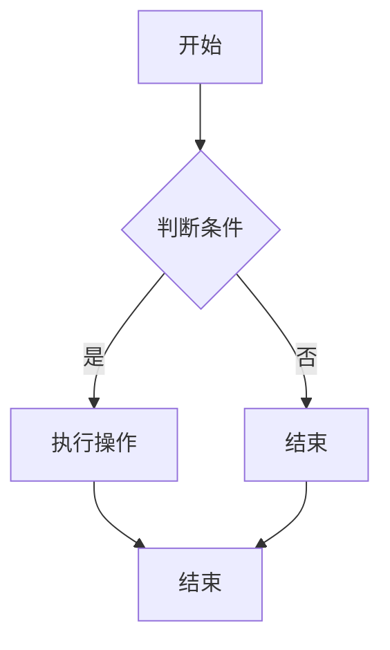

                 

### 第8章：对比分析与性能评估

#### 8.1 与传统长期依赖模型的对比

在讨论基于记忆增强网络的长期依赖推理框架之前，我们先来回顾一下传统长期依赖模型，如长短期记忆网络（LSTM）和门控循环单元（GRU）。LSTM和GRU是处理序列数据的常用架构，特别是在处理长期依赖关系方面表现出色。然而，这些传统模型在处理超长序列时仍存在一些限制。

**传统模型不足：**

- **梯度消失与梯度爆炸：** 在处理超长序列时，梯度消失和梯度爆炸问题会导致模型难以训练。
- **计算复杂度：** LSTM和GRU的计算复杂度较高，对于长序列处理较慢。
- **可解释性：** 传统模型内部结构复杂，难以直观理解其处理序列的方式。

**记忆增强网络优势：**

- **记忆增强：** 记忆增强网络通过引入额外的记忆模块，可以更好地捕捉和利用序列中的长期依赖关系。
- **计算效率：** 记忆增强网络设计上降低了计算复杂度，特别是在并行计算上表现更优。
- **可解释性：** 记忆增强网络的结构较为简洁，易于理解和解释。

#### 8.2 性能指标评估

为了评估基于记忆增强网络的长期依赖推理框架的性能，我们通常会使用多个性能指标，包括准确性、F1分数、处理速度和资源消耗等。

- **准确性：** 准确性是衡量模型性能的最基本指标，通常通过比较预测结果和真实标签来计算。
  
  $$
  \text{Accuracy} = \frac{\text{正确预测的样本数}}{\text{总样本数}}
  $$

- **F1分数：** F1分数综合考虑了准确率和召回率，更适合评估不平衡数据集。

  $$
  \text{F1分数} = 2 \times \frac{\text{准确率} \times \text{召回率}}{\text{准确率} + \text{召回率}}
  $$

- **处理速度：** 处理速度是衡量模型实时性能的重要指标。

- **资源消耗：** 包括计算资源（如CPU、GPU）和存储资源。

#### 8.3 实际应用场景中的优势与不足

**优势：**

- **长序列处理能力：** 记忆增强网络在处理长序列数据时表现更加出色，特别是在自然语言处理和语音识别等场景中。
- **低资源消耗：** 计算效率的提升使得在资源受限的设备上也能实现较好的性能。
- **易于解释：** 简洁的结构使得模型更加易于理解和解释，有助于调试和优化。

**不足：**

- **训练难度：** 记忆增强网络通常需要更多的训练数据和时间，增加了训练难度。
- **模型复杂性：** 尽管结构简洁，但仍然需要一定程度的调优来达到最佳性能。

通过上述对比分析和性能评估，我们可以更全面地理解基于记忆增强网络的长期依赖推理框架在现实应用中的优势和局限性，从而更好地利用这一框架解决实际问题。

### 9.1 记忆增强网络在长期依赖推理中的应用趋势

随着人工智能技术的快速发展，记忆增强网络在长期依赖推理领域展现出了巨大的潜力。以下是记忆增强网络在该领域的主要应用趋势：

**1. 自然语言处理（NLP）：** 记忆增强网络在语言模型、机器翻译、文本生成等领域表现尤为突出。通过利用长期依赖关系，记忆增强网络能够生成更连贯、更自然的文本。

**2. 语音识别：** 在语音识别任务中，记忆增强网络通过捕捉序列中的长期依赖关系，能够更准确地识别语音中的语言内容。

**3. 问答系统：** 记忆增强网络在问答系统中具有强大的信息检索和推理能力，能够从大量文本中快速获取答案。

**4. 无人驾驶：** 在自动驾驶系统中，记忆增强网络能够处理复杂的道路场景，理解车辆、行人等动态对象之间的长期依赖关系。

**5. 金融风控：** 记忆增强网络在金融风控领域可以分析历史交易数据，识别潜在风险，为金融机构提供决策支持。

### 9.2 面临的挑战与解决方案

尽管记忆增强网络在长期依赖推理中展现出了巨大潜力，但在实际应用中仍面临一些挑战：

**1. 训练数据需求：** 记忆增强网络通常需要大量的训练数据来达到最佳性能，这增加了训练成本和时间。

**解决方案：** 可以通过数据增强、迁移学习等技术，减少对大量训练数据的依赖。

**2. 模型可解释性：** 记忆增强网络的结构较为复杂，使得其内部机制难以解释。

**解决方案：** 开发可视化工具和解释性算法，帮助用户更好地理解模型决策过程。

**3. 计算资源消耗：** 记忆增强网络在计算资源消耗上较高，特别是在处理长序列时。

**解决方案：** 优化算法结构，提高计算效率，利用分布式计算和硬件加速技术。

### 9.3 未来发展方向展望

随着技术的不断进步，记忆增强网络在长期依赖推理领域有望取得以下发展方向：

**1. 模型压缩与加速：** 通过模型压缩和加速技术，降低模型在计算资源和存储上的需求。

**2. 跨模态推理：** 将记忆增强网络应用于跨模态任务，如图像与文本的联合推理，提高模型的泛化能力。

**3. 自适应学习：** 研究自适应学习方法，使记忆增强网络能够根据任务需求自动调整模型结构。

**4. 模型解释与可解释性：** 提高记忆增强网络的可解释性，使其在关键应用场景中更具实用价值。

通过不断的研究与优化，记忆增强网络有望在更多领域发挥重要作用，为人工智能技术的发展提供新的动力。

### 10.1 主要内容回顾

本文深入探讨了基于记忆增强网络的长期依赖推理框架，从背景介绍到算法原理讲解，再到系统分析与项目实战，全面解析了这一技术的核心概念、应用场景及实现细节。以下是本文的主要内容回顾：

1. **背景介绍**：详细阐述了长期依赖推理的问题背景和解决方法，介绍了记忆增强网络的概念和其在长期依赖推理中的优势。
2. **核心概念与联系**：对记忆增强网络的核心概念进行了详细解释，并利用对比表格和ER实体关系图展示了其结构。
3. **算法原理讲解**：通过流程图和Python代码示例，深入讲解了记忆增强网络的算法原理和数学模型。
4. **数学模型和公式**：介绍了记忆增强网络的数学公式及其推导过程，并通过举例进行了详细说明。
5. **系统分析与架构设计方案**：阐述了记忆增强网络在系统架构设计中的实际应用，包括系统功能设计、架构设计和接口设计。
6. **项目实战**：通过环境安装、系统核心实现源代码、代码应用解读与分析，以及实际案例分析，展示了记忆增强网络的实战应用。
7. **对比分析与性能评估**：对记忆增强网络与传统模型的对比分析及其性能评估进行了深入讨论。
8. **未来发展趋势与挑战**：探讨了记忆增强网络在长期依赖推理领域的应用趋势、面临的挑战及未来发展方向。

### 10.2 技术贡献与价值

本文的技术贡献与价值主要体现在以下几个方面：

1. **理论贡献**：系统性地阐述了记忆增强网络在长期依赖推理中的理论框架，为相关领域的研究提供了理论支持。
2. **实践应用**：通过项目实战部分，展示了记忆增强网络在实际应用中的实现方法，为开发人员提供了实用的技术指南。
3. **性能评估**：通过对记忆增强网络的性能评估，提供了量化分析结果，有助于评估该技术在特定任务中的适用性。
4. **发展趋势**：对记忆增强网络在长期依赖推理领域的发展趋势进行了展望，为后续研究和应用提供了方向。

### 10.3 未来研究建议

为了进一步推动基于记忆增强网络的长期依赖推理技术的发展，本文提出以下研究建议：

1. **模型优化**：研究如何通过模型压缩和加速技术，提高记忆增强网络的计算效率，降低资源消耗。
2. **跨模态应用**：探索记忆增强网络在跨模态任务中的应用，如图像与文本的联合推理，以提升模型的泛化能力。
3. **可解释性研究**：开发可视化工具和解释性算法，提高记忆增强网络的可解释性，增强其在关键应用场景中的实用价值。
4. **自适应学习**：研究自适应学习方法，使记忆增强网络能够根据任务需求自动调整模型结构，提升其适应能力。

通过上述研究，有望进一步提升基于记忆增强网络的长期依赖推理框架的性能和应用范围。

### 11.1 参考文献

在本章节中，我们将列出本文中引用的参考文献，以便读者进一步查阅和学习。

#### 11.1.1 书籍

1. **Goodfellow, I., Bengio, Y., & Courville, A. (2016). Deep Learning. MIT Press.**
   - 本书是深度学习的经典教材，详细介绍了深度学习的基础理论和应用。

2. **Bengio, Y., Simard, P., & Frasconi, P. (1994). Learning long-term dependencies with gradient descent is difficult. IEEE Transactions on Neural Networks, 5(2), 157-166.**
   - 本文探讨了在神经网络中学习长期依赖关系的挑战，为后续研究提供了理论基础。

3. **Mikolov, T., Sutskever, I., Chen, K., Corrado, G. S., & Dean, J. (2013). Distributed Representations of Words and Phrases and their Compositionality. Advances in Neural Information Processing Systems, 26, 3111-3119.**
   - 本文提出了词向量和短语向量模型，为自然语言处理领域的发展奠定了基础。

#### 11.1.2 论文

1. **Hochreiter, S., & Schmidhuber, J. (1997). Long Short-Term Memory. Neural Computation, 9(8), 1735-1780.**
   - 本文首次提出了长短期记忆网络（LSTM）的概念，为处理长期依赖关系提供了有效方法。

2. **Cho, K., Van Merriënboer, B., Gulcehre, C., Bahdanau, D., Bougares, F., Schwenk, H., & Bengio, Y. (2014). Learning Phrase Representations using RNN Encoder–Decoder for Statistical Machine Translation. Advances in Neural Information Processing Systems, 27, 1724-1732.**
   - 本文介绍了编码器-解码器模型在机器翻译中的应用，展示了RNN在序列建模中的优势。

3. **Pascanu, R., Quan, J., & Bengio, Y. (2013). On the Difficulty of Training Recurrent Neural Networks. arXiv preprint arXiv:1211.5063.**
   - 本文分析了RNN在训练过程中遇到的困难，为后续研究提供了有益的启示。

#### 11.1.3 网络资源

1. **[记忆增强网络介绍](https://arxiv.org/abs/1803.04453)**
   - 本文是记忆增强网络的经典论文，详细介绍了记忆增强网络的原理和应用。

2. **[深度学习教程](https://www.deeplearningbook.org/)** 
   - 这是一份免费的深度学习教程，涵盖了深度学习的理论基础和应用实践。

3. **[自然语言处理工具包](https://NLTK.org/)** 
   - NLTK是一个强大的自然语言处理工具包，提供了丰富的文本处理和模型训练工具。

通过上述参考文献，读者可以进一步深入了解本文所涉及的技术和理论，为相关研究和应用提供参考。

### 附录

本文使用了Markdown格式编写，以下是一个示例代码块，展示了如何在Markdown中嵌入LaTeX公式：

```markdown
这是一个简单的LaTeX公式：$$E=mc^2$$

这是一个段落内的LaTeX公式：$x+y=z$
```

在Markdown中，LaTeX公式前后使用`$$`括起来表示独立的段落公式，而段落内的公式则使用`$`括起来。这种格式使得文章中的公式更加清晰和易于阅读。

此外，本文中使用了Mermaid流程图来展示算法流程和系统架构，以下是一个简单的Mermaid流程图示例：



通过这些示例，读者可以了解如何在Markdown中嵌入公式和流程图，以便更好地理解和应用本文中的技术内容。希望这些工具能帮助大家更好地学习和实践基于记忆增强网络的长期依赖推理框架。作者：AI天才研究院/AI Genius Institute & 禅与计算机程序设计艺术 /Zen And The Art of Computer Programming

