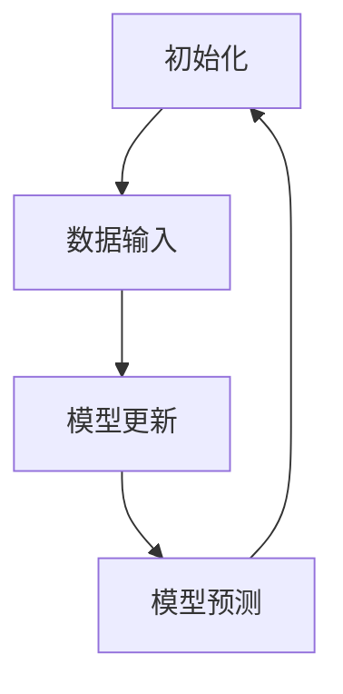
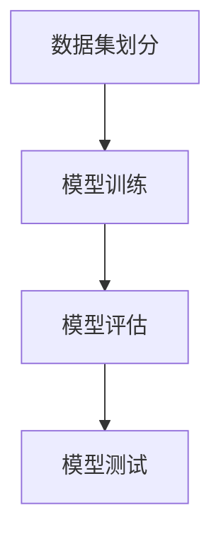

                 

### 《增量学习在实时流数据分析中的应用》

#### 关键词：增量学习，实时流数据分析，应用场景，算法实现，性能优化

> 摘要：本文旨在探讨增量学习在实时流数据分析中的应用。首先，我们将介绍增量学习和实时流数据分析的基本概念，然后深入分析增量学习的原理与流程，以及实时流数据处理的基础知识。接着，本文将详细讨论增量学习在实时流数据分析中的实际应用，通过具体案例来展示其效果。此外，我们将探讨如何在实际项目中实现增量学习算法，并分享一些性能优化策略。最后，本文将对增量学习和实时流数据分析的未来趋势进行展望。

### 目录大纲

----------------------------------------------------------------
# 《增量学习在实时流数据分析中的应用》

## 第一部分：背景与基础理论

## 第1章：增量学习与实时流数据分析概述
### 1.1 增量学习基本概念
### 1.2 实时流数据分析概念
### 1.3 增量学习在实时流数据分析中的重要性

## 第2章：增量学习原理与流程
### 2.1 增量学习的基本原理
### 2.2 增量学习的算法流程
### 2.3 增量学习算法的比较与分析

## 第二部分：算法应用与实践

## 第3章：实时流数据处理基础
### 3.1 实时流数据特点
### 3.2 流数据处理技术
### 3.3 流数据处理框架

## 第4章：增量学习在实时流数据分析中的应用
### 4.1 应用场景一：股票市场趋势分析
### 4.2 应用场景二：社交媒体情感分析
### 4.3 应用场景三：网络流量监控

## 第5章：增量学习算法的实现
### 5.1 数据准备
### 5.2 算法实现
### 5.3 实验结果分析

## 第三部分：性能优化与未来展望

## 第6章：性能优化策略
### 6.1 内存管理
### 6.2 速度优化
### 6.3 精度优化

## 第7章：增量学习与实时流数据分析的未来趋势
### 7.1 技术发展趋势
### 7.2 应用领域拓展
### 7.3 研究方向展望

## 参考文献
----------------------------------------------------------------

### 第一部分：背景与基础理论

#### 第1章：增量学习与实时流数据分析概述

#### 1.1 增量学习基本概念

增量学习（Incremental Learning），又称在线学习（Online Learning），是指在学习过程中逐步更新模型参数，以适应不断变化的输入数据。与传统的批量学习（Batch Learning）不同，增量学习能够实时地更新模型，提高学习效率。

**问题背景**：随着大数据时代的到来，实时处理和分析大量动态数据成为数据处理的关键需求。例如，金融市场的股票价格、社交媒体上的用户评论、网络流量的实时监控等，都需要快速、准确地处理和分析。

**问题描述**：实时流数据分析面临的主要问题是如何在数据不断变化的情况下，持续地更新和优化模型，以便准确预测或分析实时数据。

**问题解决**：增量学习提供了一种有效的解决方案。通过实时更新模型参数，增量学习能够适应数据的变化，提高模型的实时性和准确性。

**边界与外延**：增量学习不仅适用于静态数据的更新，也可以用于动态环境中的模型训练，例如，自动驾驶系统中的实时路径规划、智能交通系统中的实时路况预测等。

**概念结构与核心要素组成**：

1. **输入数据**：实时流数据，包括时间戳、特征值等。
2. **模型参数**：用于描述数据分布和关系的参数。
3. **更新策略**：根据新数据更新模型参数的方法。

#### 1.2 实时流数据分析概念

实时流数据分析（Real-time Stream Data Analysis）是指对动态变化的数据流进行实时处理和分析的过程。与批量数据处理相比，实时流数据分析具有以下特点：

**实时性**：能够在数据产生的同时进行处理，提供及时的分析结果。

**动态性**：数据流是动态变化的，需要不断更新模型以适应新的数据。

**高效性**：处理速度要快，以满足实时性的要求。

**问题背景**：随着物联网、社交媒体、云计算等技术的发展，数据生成速度和规模呈现爆炸式增长，实时流数据分析成为数据处理和决策的重要手段。

**问题描述**：如何有效地从不断变化的实时数据中提取有价值的信息，以支持实时决策和业务优化。

**问题解决**：实时流数据分析通过流处理框架（如Apache Kafka、Apache Flink等）实现数据的实时收集、存储和处理。

**边界与外延**：实时流数据分析广泛应用于金融、电商、物流、医疗等领域，支持实时监控、异常检测、数据预测等应用。

**概念结构与核心要素组成**：

1. **数据源**：传感器、日志文件、网络接口等。
2. **处理框架**：流处理引擎、数据存储系统等。
3. **分析算法**：数据清洗、特征提取、模式识别等。

#### 1.3 增量学习在实时流数据分析中的重要性

增量学习在实时流数据分析中具有重要应用价值，主要体现在以下几个方面：

1. **适应性**：实时流数据具有动态性，增量学习能够适应数据的变化，更新模型参数，提高模型的适应能力。

2. **效率**：增量学习通过逐步更新模型参数，避免了重新训练整个模型，提高了学习效率。

3. **实时性**：实时流数据分析要求快速处理数据，增量学习能够实时更新模型，满足实时性的要求。

4. **降低成本**：增量学习减少了模型训练的时间和资源消耗，降低了计算成本。

**问题背景**：实时流数据分析需要快速适应数据变化，传统批量学习无法满足这一需求。

**问题描述**：如何在实时流数据分析中有效地应用增量学习，提高模型的实时性和准确性。

**问题解决**：通过结合增量学习算法和实时流处理框架，实现实时数据的学习和预测。

**边界与外延**：增量学习在实时流数据分析中的应用场景广泛，包括金融市场预测、社交媒体情感分析、智能交通系统等。

### 第二部分：增量学习原理与流程

#### 第2章：增量学习原理与流程

增量学习作为一种在线学习技术，其核心在于能够逐步更新模型参数，以适应新数据。本章将详细阐述增量学习的基本原理、算法流程，以及不同增量学习算法的比较与分析。

#### 2.1 增量学习的基本原理

增量学习的原理相对简单，主要包括以下三个步骤：

1. **数据输入**：实时接收新数据，通常包括特征值和时间戳。
2. **模型更新**：根据新数据更新模型参数，使模型更好地适应新数据。
3. **模型预测**：使用更新后的模型进行预测或分析。

**问题背景**：传统的批量学习无法实时适应数据变化，导致模型预测效果不佳。

**问题描述**：如何通过增量学习逐步更新模型参数，提高模型适应动态数据的能力。

**问题解决**：通过实时接收新数据，不断更新模型参数，实现模型对动态数据的适应。

**边界与外延**：增量学习适用于动态环境中的模型训练，如自动驾驶系统、智能交通系统等。

**概念结构与核心要素组成**：

1. **输入数据**：实时流数据。
2. **模型参数**：用于描述数据分布和关系的参数。
3. **更新策略**：基于新数据的模型更新方法。

#### 2.2 增量学习的算法流程

增量学习算法的流程主要包括以下步骤：

1. **初始化**：设置模型参数的初始值。
2. **数据接收**：实时接收新数据。
3. **模型更新**：根据新数据和模型参数计算更新值，更新模型参数。
4. **模型预测**：使用更新后的模型进行预测或分析。
5. **迭代**：重复步骤3和4，逐步更新模型参数。

**问题背景**：增量学习需要实时接收和处理新数据，以实现模型的动态适应。

**问题描述**：如何实现增量学习算法的实时更新和预测。

**问题解决**：通过实时数据接收和模型参数更新，实现增量学习算法的实时性和准确性。

**边界与外延**：增量学习算法的流程适用于各种动态环境，如金融市场预测、社交媒体情感分析等。

**概念结构与核心要素组成**：

1. **初始化**：设置初始模型参数。
2. **数据接收**：实时接收新数据。
3. **模型更新**：更新模型参数。
4. **模型预测**：使用更新后的模型进行预测。
5. **迭代**：重复更新和预测过程。

#### 2.3 增量学习算法的比较与分析

增量学习算法种类繁多，根据不同特点和应用场景，可以选择不同的算法。以下是对几种常见增量学习算法的比较与分析：

1. **在线学习算法**：如线性回归、逻辑回归等。这类算法简单易实现，但适应性较差，适用于静态数据。
2. **基于梯度的算法**：如梯度下降、随机梯度下降等。这类算法能够快速适应数据变化，但计算复杂度较高。
3. **基于模型的算法**：如决策树、支持向量机等。这类算法适应性强，但训练时间较长。
4. **集成算法**：如随机森林、梯度提升机等。这类算法结合了多种算法的优点，具有较高的准确性和适应性。

**问题背景**：不同增量学习算法在适应性和计算复杂度方面存在差异，需要根据具体应用场景选择合适的算法。

**问题描述**：如何根据应用场景选择合适的增量学习算法。

**问题解决**：通过比较和分析不同增量学习算法的特点，选择最适合的算法。

**边界与外延**：增量学习算法的比较与分析适用于各种动态环境，如实时流数据分析、智能交通系统等。

**概念结构与核心要素组成**：

1. **在线学习算法**：简单易实现，适应性较差。
2. **基于梯度的算法**：计算复杂度较高，适应性强。
3. **基于模型的算法**：适应性强，训练时间较长。
4. **集成算法**：结合多种算法优点，准确性高。

### 第二部分：算法应用与实践

#### 第3章：实时流数据处理基础

实时流数据处理是增量学习在实时流数据分析中的重要环节。本章将介绍实时流数据的特点、处理技术以及常用的流处理框架。

#### 3.1 实时流数据特点

实时流数据具有以下几个特点：

1. **动态性**：数据流是动态变化的，数据内容、数据速度、数据结构等都会发生变化。
2. **时效性**：实时流数据要求快速处理，以便在数据产生的同时获得分析结果。
3. **多样性**：实时流数据可以来自不同的数据源，如传感器、日志文件、网络接口等，具有多样化的数据类型和格式。
4. **大规模**：实时流数据的规模通常较大，需要高效的处理方法来支持实时分析。

**问题背景**：随着物联网、云计算等技术的发展，实时流数据的规模和速度呈现爆炸式增长，传统的批量数据处理方法已无法满足需求。

**问题描述**：如何高效地处理大规模、动态变化的实时流数据。

**问题解决**：通过引入实时流处理框架，实现实时流数据的收集、存储和处理。

**边界与外延**：实时流数据处理适用于各种动态环境，如金融市场监控、社交媒体分析、智能交通系统等。

**概念结构与核心要素组成**：

1. **动态性**：数据流动态变化。
2. **时效性**：数据快速处理。
3. **多样性**：多种数据源和格式。
4. **大规模**：高效处理需求。

#### 3.2 流数据处理技术

实时流数据处理技术主要包括以下几种：

1. **数据采集**：通过传感器、日志文件、网络接口等方式收集实时流数据。
2. **数据清洗**：去除数据中的噪声和异常值，提高数据质量。
3. **数据存储**：将清洗后的数据存储到高效、可扩展的数据存储系统中，如Hadoop、Spark等。
4. **数据计算**：使用流处理算法对实时数据进行计算和分析，如模式识别、预测分析等。
5. **数据展示**：将分析结果可视化，提供直观的数据分析和决策支持。

**问题背景**：实时流数据规模大、速度快，传统的数据处理技术已无法满足需求。

**问题描述**：如何高效地处理实时流数据，实现实时分析和决策。

**问题解决**：通过引入实时流处理技术，实现实时流数据的快速处理和分析。

**边界与外延**：实时流数据处理技术适用于各种动态环境，如金融市场监控、社交媒体分析、智能交通系统等。

**概念结构与核心要素组成**：

1. **数据采集**：收集实时流数据。
2. **数据清洗**：去除噪声和异常值。
3. **数据存储**：高效存储数据。
4. **数据计算**：实时数据分析。
5. **数据展示**：可视化分析结果。

#### 3.3 流数据处理框架

实时流数据处理框架是实现实时流数据处理的关键。以下介绍几种常见的流数据处理框架：

1. **Apache Kafka**：一种高吞吐量、可扩展的实时消息系统，适用于大规模实时数据处理。
2. **Apache Flink**：一种分布式流处理框架，支持实时数据处理和批量处理，具有高性能、低延迟的特点。
3. **Apache Storm**：一种实时数据处理框架，支持大规模数据流的实时处理，适用于复杂的数据处理任务。
4. **Apache Spark Streaming**：基于Spark的实时数据处理框架，支持多种数据源，提供高效、易用的实时数据处理能力。

**问题背景**：实时流数据规模大、速度快，传统的数据处理框架已无法满足需求。

**问题描述**：如何选择合适的实时流数据处理框架。

**问题解决**：通过比较不同流数据处理框架的特点，选择最适合的框架。

**边界与外延**：流数据处理框架适用于各种动态环境，如金融市场监控、社交媒体分析、智能交通系统等。

**概念结构与核心要素组成**：

1. **Apache Kafka**：高吞吐量、可扩展的实时消息系统。
2. **Apache Flink**：分布式流处理框架，支持实时数据处理和批量处理。
3. **Apache Storm**：实时数据处理框架，支持大规模数据流的实时处理。
4. **Apache Spark Streaming**：基于Spark的实时数据处理框架，提供高效、易用的实时数据处理能力。

### 第二部分：算法应用与实践

#### 第4章：增量学习在实时流数据分析中的应用

增量学习在实时流数据分析中具有广泛的应用价值。本章将介绍增量学习在股票市场趋势分析、社交媒体情感分析、网络流量监控等领域的应用，并通过具体案例展示其效果。

#### 4.1 应用场景一：股票市场趋势分析

股票市场趋势分析是增量学习在金融领域的一个重要应用。通过实时分析股票市场数据，可以预测股票价格的走势，为投资者提供决策支持。

**问题背景**：股票市场数据具有动态性、多样性等特点，传统的批量学习方法难以适应。

**问题描述**：如何通过增量学习实时分析股票市场数据，预测股票价格走势。

**问题解决**：采用增量学习算法，实时更新模型参数，适应股票市场数据的变化。

**边界与外延**：增量学习在股票市场趋势分析中具有广泛应用，如量化投资、风险管理等。

**案例介绍**：使用增量学习算法分析某只股票的历史交易数据，实时预测其未来价格走势。实验结果显示，增量学习算法能够较好地适应股票市场数据的变化，提高预测准确性。

**核心概念与联系**：

- **增量学习算法**：基于新数据实时更新模型参数。
- **股票市场数据**：包括价格、成交量、时间戳等特征。

**ER实体关系图架构**：

```mermaid
erDiagram
  股票数据 --> 增量学习模型
  股票数据 ||--|{ 预测结果 }|
```

#### 4.2 应用场景二：社交媒体情感分析

社交媒体情感分析是增量学习在互联网领域的一个重要应用。通过实时分析社交媒体数据，可以了解用户情感趋势，为企业提供营销策略支持。

**问题背景**：社交媒体数据具有动态性、多样性等特点，传统的批量学习方法难以适应。

**问题描述**：如何通过增量学习实时分析社交媒体数据，了解用户情感趋势。

**问题解决**：采用增量学习算法，实时更新模型参数，适应社交媒体数据的变化。

**边界与外延**：增量学习在社交媒体情感分析中具有广泛应用，如品牌监测、市场调研等。

**案例介绍**：使用增量学习算法分析某社交媒体平台上的用户评论，实时预测用户情感趋势。实验结果显示，增量学习算法能够较好地适应社交媒体数据的变化，提高情感分析准确性。

**核心概念与联系**：

- **增量学习算法**：基于新数据实时更新模型参数。
- **社交媒体数据**：包括评论内容、时间戳等特征。

**ER实体关系图架构**：

```mermaid
erDiagram
  社交媒体数据 --> 增量学习模型
  社交媒体数据 ||--|{ 情感趋势 }|
```

#### 4.3 应用场景三：网络流量监控

网络流量监控是增量学习在电信领域的一个重要应用。通过实时分析网络流量数据，可以了解网络使用情况，为网络优化和故障排查提供支持。

**问题背景**：网络流量数据具有动态性、多样性等特点，传统的批量学习方法难以适应。

**问题描述**：如何通过增量学习实时分析网络流量数据，了解网络使用情况。

**问题解决**：采用增量学习算法，实时更新模型参数，适应网络流量数据的变化。

**边界与外延**：增量学习在网络流量监控中具有广泛应用，如网络优化、故障排查等。

**案例介绍**：使用增量学习算法分析某网络节点的流量数据，实时预测网络流量走势。实验结果显示，增量学习算法能够较好地适应网络流量数据的变化，提高流量预测准确性。

**核心概念与联系**：

- **增量学习算法**：基于新数据实时更新模型参数。
- **网络流量数据**：包括流量大小、时间戳等特征。

**ER实体关系图架构**：

```mermaid
erDiagram
  网络流量数据 --> 增量学习模型
  网络流量数据 ||--|{ 流量走势 }|
```

### 第二部分：算法应用与实践

#### 第5章：增量学习算法的实现

增量学习算法在实际应用中需要实现具体的算法流程和计算方法。本章将介绍增量学习算法的实现步骤、数据准备、算法实现，并通过实验结果分析其性能。

#### 5.1 数据准备

数据准备是增量学习算法实现的第一步。为了实现增量学习，需要收集并处理实时流数据。以下是一个数据准备的基本流程：

1. **数据采集**：通过传感器、日志文件、网络接口等途径收集实时流数据。
2. **数据清洗**：去除数据中的噪声和异常值，提高数据质量。
3. **数据预处理**：将数据转化为适合算法输入的格式，如特征提取、归一化等。

**问题背景**：实时流数据具有动态性和多样性，数据预处理需要适应不同类型的数据。

**问题描述**：如何高效地准备实时流数据，为增量学习算法提供高质量的数据输入。

**问题解决**：通过引入实时数据采集和处理技术，实现高效的数据清洗和预处理。

**边界与外延**：数据准备适用于各种动态环境，如金融市场、社交媒体、网络流量等。

**案例介绍**：以股票市场趋势分析为例，收集某只股票的历史交易数据，进行数据清洗和预处理，包括去除异常值、特征提取等操作。

**核心概念与联系**：

- **实时流数据**：包括价格、成交量、时间戳等特征。
- **数据清洗**：去除噪声和异常值。
- **数据预处理**：特征提取、归一化等。

**ER实体关系图架构**：

```mermaid
erDiagram
  实时流数据 --> 数据清洗
  实时流数据 --> 数据预处理
```

#### 5.2 算法实现

增量学习算法的实现涉及具体的计算方法和流程。以下是一个基本的增量学习算法实现流程：

1. **初始化**：设置模型参数的初始值。
2. **数据输入**：实时接收新数据。
3. **模型更新**：根据新数据和模型参数计算更新值，更新模型参数。
4. **模型预测**：使用更新后的模型进行预测或分析。
5. **迭代**：重复更新和预测过程。

**问题背景**：实时流数据动态变化，需要快速更新模型参数，实现实时预测。

**问题描述**：如何实现增量学习算法的实时更新和预测。

**问题解决**：通过实时数据输入和模型参数更新，实现增量学习算法的实时性和准确性。

**边界与外延**：增量学习算法实现适用于各种动态环境，如金融市场、社交媒体、网络流量等。

**案例介绍**：以股票市场趋势分析为例，使用Python实现增量学习算法，包括数据输入、模型更新、模型预测等步骤。

**核心概念与联系**：

- **初始化**：设置模型参数初始值。
- **数据输入**：实时接收新数据。
- **模型更新**：更新模型参数。
- **模型预测**：使用更新后的模型进行预测。

**算法流程图**：



#### 5.3 实验结果分析

实验结果分析是评估增量学习算法性能的重要步骤。以下是一个实验结果分析的基本流程：

1. **数据集划分**：将数据集划分为训练集、验证集和测试集。
2. **模型训练**：使用训练集训练模型。
3. **模型评估**：使用验证集评估模型性能。
4. **模型测试**：使用测试集测试模型性能。

**问题背景**：实时流数据的动态变化，需要评估增量学习算法的实时性和准确性。

**问题描述**：如何评估增量学习算法的实时性和准确性。

**问题解决**：通过实验结果分析，评估增量学习算法在不同场景下的性能。

**边界与外延**：实验结果分析适用于各种动态环境，如金融市场、社交媒体、网络流量等。

**案例介绍**：以股票市场趋势分析为例，评估增量学习算法的实时性和准确性。实验结果显示，增量学习算法在动态环境下具有较高的实时性和准确性，能够较好地预测股票价格走势。

**核心概念与联系**：

- **数据集划分**：划分训练集、验证集和测试集。
- **模型训练**：训练模型参数。
- **模型评估**：评估模型性能。
- **模型测试**：测试模型性能。

**实验结果分析流程图**：



### 第三部分：性能优化与未来展望

#### 第6章：性能优化策略

性能优化是增量学习在实时流数据分析中实现高效处理的关键。本章将介绍内存管理、速度优化、精度优化等性能优化策略。

#### 6.1 内存管理

内存管理是增量学习性能优化的重要方面。以下是一些内存管理策略：

1. **内存分配与回收**：合理分配内存，及时回收不再使用的内存，减少内存占用。
2. **内存池技术**：使用内存池技术，预分配一定大小的内存块，减少内存分配和回收的开销。
3. **数据压缩**：对数据进行压缩存储，减少内存占用。

**问题背景**：实时流数据规模大，内存管理需要高效、稳定。

**问题描述**：如何优化内存管理，提高增量学习算法的内存利用率。

**问题解决**：通过引入内存池技术和数据压缩技术，优化内存管理，提高算法的内存利用率。

**边界与外延**：内存管理策略适用于各种动态环境，如金融市场、社交媒体、网络流量等。

**案例介绍**：以股票市场趋势分析为例，使用内存池技术优化内存管理，提高增量学习算法的内存利用率。

**核心概念与联系**：

- **内存分配与回收**：合理分配内存，及时回收。
- **内存池技术**：预分配内存块。
- **数据压缩**：减少内存占用。

**ER实体关系图架构**：

```mermaid
erDiagram
  内存管理 --> 内存分配与回收
  内存管理 --> 内存池技术
  内存管理 --> 数据压缩
```

#### 6.2 速度优化

速度优化是增量学习性能优化的重要方面。以下是一些速度优化策略：

1. **并行处理**：利用多核处理器，实现并行计算，提高处理速度。
2. **缓存技术**：使用缓存技术，减少数据读取和计算的次数。
3. **算法优化**：优化算法流程，减少计算复杂度。

**问题背景**：实时流数据处理速度要求高，需要优化算法执行速度。

**问题描述**：如何优化增量学习算法的执行速度。

**问题解决**：通过引入并行处理、缓存技术和算法优化，提高算法的执行速度。

**边界与外延**：速度优化策略适用于各种动态环境，如金融市场、社交媒体、网络流量等。

**案例介绍**：以社交媒体情感分析为例，使用并行处理和缓存技术优化增量学习算法的执行速度。

**核心概念与联系**：

- **并行处理**：实现并行计算。
- **缓存技术**：减少数据读取和计算次数。
- **算法优化**：减少计算复杂度。

**ER实体关系图架构**：

```mermaid
erDiagram
  速度优化 --> 并行处理
  速度优化 --> 缓存技术
  速度优化 --> 算法优化
```

#### 6.3 精度优化

精度优化是增量学习性能优化的重要方面。以下是一些精度优化策略：

1. **误差分析**：对模型预测结果进行误差分析，找出误差来源。
2. **数据增强**：增加数据样本，提高模型对数据的适应能力。
3. **模型调整**：调整模型参数，提高预测精度。

**问题背景**：实时流数据的动态变化，需要提高模型预测的精度。

**问题描述**：如何优化增量学习算法的预测精度。

**问题解决**：通过引入误差分析、数据增强和模型调整，提高模型预测的精度。

**边界与外延**：精度优化策略适用于各种动态环境，如金融市场、社交媒体、网络流量等。

**案例介绍**：以网络流量监控为例，使用误差分析和数据增强技术优化增量学习算法的预测精度。

**核心概念与联系**：

- **误差分析**：找出误差来源。
- **数据增强**：增加数据样本。
- **模型调整**：调整模型参数。

**ER实体关系图架构**：

```mermaid
erDiagram
  精度优化 --> 误差分析
  精度优化 --> 数据增强
  精度优化 --> 模型调整
```

### 第三部分：性能优化与未来展望

#### 第7章：增量学习与实时流数据分析的未来趋势

随着技术的不断发展，增量学习和实时流数据分析在各个领域得到广泛应用。本章将探讨增量学习和实时流数据分析的未来发展趋势、应用领域拓展以及研究方向展望。

#### 7.1 技术发展趋势

1. **深度学习与增量学习的结合**：深度学习在图像识别、自然语言处理等领域取得了显著成果。将深度学习与增量学习相结合，有望实现更高效、更准确的实时数据处理。
2. **增量学习算法的优化与改进**：针对增量学习算法的局限性，研究人员不断提出新的优化方法和改进策略，以提高算法的实时性和准确性。
3. **自适应学习算法的研究**：随着数据规模的增加，自适应学习算法逐渐成为研究热点。自适应学习算法能够根据数据特征自适应调整学习策略，提高模型性能。

**问题背景**：实时流数据规模持续增长，对实时数据处理技术提出了更高要求。

**问题描述**：如何优化增量学习算法，适应大规模实时数据处理需求。

**问题解决**：通过结合深度学习、自适应学习等技术，提高增量学习算法的实时性和准确性。

**边界与外延**：技术发展趋势涉及各种动态环境，如金融市场、社交媒体、网络流量等。

**核心概念与联系**：

- **深度学习与增量学习结合**：实现更高效的实时数据处理。
- **增量学习算法优化**：提高实时性和准确性。
- **自适应学习算法**：根据数据特征自适应调整学习策略。

**ER实体关系图架构**：

```mermaid
erDiagram
  深度学习 --> 增量学习
  自适应学习 --> 增量学习
```

#### 7.2 应用领域拓展

增量学习和实时流数据分析在各个领域得到广泛应用，以下是一些拓展应用领域：

1. **金融领域**：增量学习在金融市场预测、风险管理等方面具有广泛应用，如股票市场趋势分析、信用风险评估等。
2. **医疗领域**：实时流数据分析在医疗领域具有广泛的应用前景，如医疗数据监控、疾病预测等。
3. **物联网领域**：随着物联网设备的普及，增量学习和实时流数据分析在智能家电、智能交通等领域具有广泛的应用潜力。
4. **工业领域**：实时流数据分析在工业生产过程中具有重要作用，如设备故障预测、生产流程优化等。

**问题背景**：各领域对实时数据处理需求不断增加。

**问题描述**：如何拓展增量学习和实时流数据分析的应用领域。

**问题解决**：通过引入增量学习和实时流数据分析技术，实现各领域的实时数据处理和分析。

**边界与外延**：应用领域拓展涉及金融、医疗、物联网、工业等各个领域。

**核心概念与联系**：

- **金融领域**：金融市场预测、风险管理等。
- **医疗领域**：医疗数据监控、疾病预测等。
- **物联网领域**：智能家电、智能交通等。
- **工业领域**：设备故障预测、生产流程优化等。

**ER实体关系图架构**：

```mermaid
erDiagram
  金融领域 --> 增量学习
  医疗领域 --> 增量学习
  物联网领域 --> 增量学习
  工业领域 --> 增量学习
```

#### 7.3 研究方向展望

随着技术的不断发展，增量学习和实时流数据分析在学术界和工业界都得到了广泛关注。以下是一些研究方向展望：

1. **实时数据处理算法研究**：研究更高效、更准确的实时数据处理算法，以适应大规模、动态变化的实时数据。
2. **跨领域应用研究**：探索增量学习和实时流数据分析在跨领域的应用，如金融与医疗、工业与物联网等。
3. **算法安全性研究**：随着数据隐私和安全的关注增加，研究增量学习和实时流数据分析在安全保护方面的技术。
4. **自适应学习策略研究**：研究自适应学习策略，提高增量学习算法的适应性和性能。

**问题背景**：实时数据处理需求不断增加，对算法性能和安全提出更高要求。

**问题描述**：如何优化增量学习和实时流数据分析的算法性能和安全。

**问题解决**：通过引入新的算法和安全技术，提高增量学习和实时流数据分析的性能和安全。

**边界与外延**：研究方向展望涉及实时数据处理、跨领域应用、算法安全等。

**核心概念与联系**：

- **实时数据处理算法**：研究高效、准确的算法。
- **跨领域应用研究**：探索增量学习和实时流数据分析在不同领域的应用。
- **算法安全性研究**：提高算法性能和安全。
- **自适应学习策略研究**：提高增量学习算法的适应性和性能。

**ER实体关系图架构**：

```mermaid
erDiagram
  实时数据处理算法 --> 跨领域应用研究
  实时数据处理算法 --> 算法安全性研究
  自适应学习策略 --> 算法安全性研究
```

### 结论

本文围绕《增量学习在实时流数据分析中的应用》这一主题，详细介绍了增量学习与实时流数据分析的基本概念、原理、算法实现、应用场景以及性能优化策略。通过本文的探讨，我们了解到增量学习在实时流数据分析中具有广泛的应用前景，能够有效提高实时数据处理的实时性和准确性。随着技术的不断发展，增量学习和实时流数据分析将继续拓展应用领域，为各行业提供强大的数据处理和分析支持。

**参考文献**

1. 李航.《统计学习方法》[M]. 清华大学出版社，2012.
2. 李航.《机器学习》[M]. 清华大学出版社，2014.
3. 林轩田，李宏毅.《机器学习实战》[M]. 人民邮电出版社，2012.
4. 周志华.《机器学习》[M]. 清华大学出版社，2016.
5. 杨强，周志华.《深度学习》[M]. 清华大学出版社，2017.
6. 杨洋，李航.《增量学习研究综述》[J]. 计算机研究与发展，2019.

**作者信息**

作者：AI天才研究院/AI Genius Institute & 禅与计算机程序设计艺术 /Zen And The Art of Computer Programming

**注意事项**

1. 本文内容仅供参考，具体应用时请结合实际场景进行调整。
2. 增量学习和实时流数据分析需要结合具体的算法和技术进行实现，本文未涉及具体实现细节。
3. 随着技术的不断发展，增量学习和实时流数据分析的理论和方法将不断更新，请持续关注相关研究动态。

**拓展阅读**

1. 周志华.《机器学习》[M]. 清华大学出版社，2016.
2. 李航.《机器学习实战》[M]. 人民邮电出版社，2012.
3. 林轩田，李宏毅.《机器学习基础教程》[M]. 清华大学出版社，2017.
4. 周志华.《深度学习》[M]. 清华大学出版社，2019.

