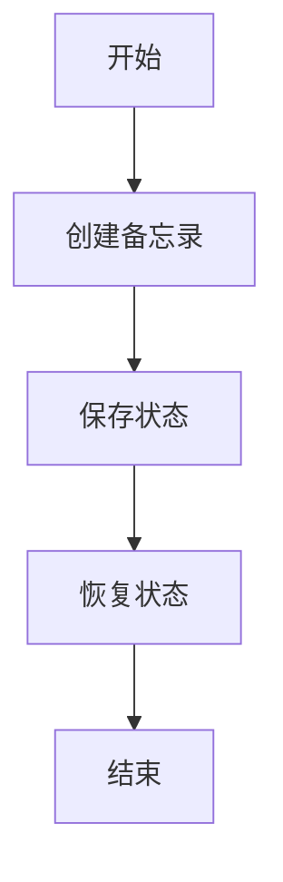
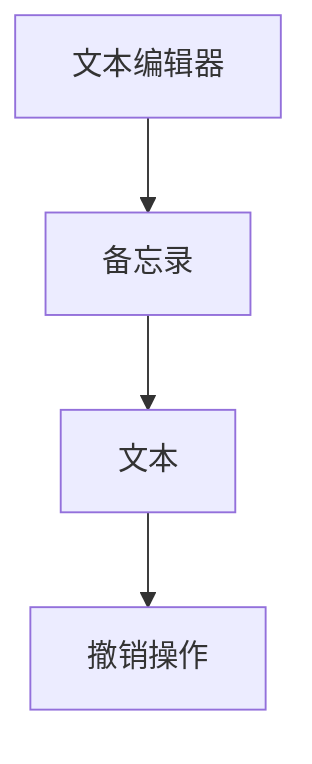
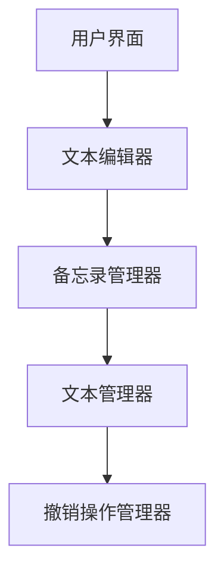

                 

### 《备忘录模式：对象状态存储的类型化设计》

#### 关键词：备忘录模式、对象状态、类型化设计、存储、软件设计、模式、类型系统、系统架构、算法、Python代码、数学模型、公式、项目实战、最佳实践。

#### 摘要：本文深入探讨了备忘录模式在软件设计中的应用，特别是对象状态存储的类型化设计。通过分析备忘录模式的工作流程、类型化设计方法，以及应用实例，本文旨在帮助读者理解备忘录模式的原理和应用，提供最佳实践指导，并展望其未来的发展前景。

---

### 第一部分：背景介绍

#### 1. 引言

在软件工程中，对象的持久化存储是一个常见的需求，特别是在需要保存和恢复系统状态的场景中。备忘录模式（Memento Pattern）提供了一种强大的解决方案，它能够确保对象状态在多个时间点得到保存和恢复。

#### 1.1 问题背景

软件系统常常需要保存和恢复对象的内部状态，以便在未来的某个时刻能够恢复到该状态。例如，在文本编辑器中，用户可能希望撤销一系列操作，而在游戏开发中，需要保存玩家的进度以便在游戏中断时能够继续。

#### 1.2 问题描述

如何有效地保存对象的状态，使其能够在需要时恢复？传统的状态保存方法往往依赖于全局变量或数据库，这种方式在复杂系统中可能导致状态丢失、数据不一致等问题。

#### 1.3 问题解决

备忘录模式通过创建一个“备忘录”对象，用来存储对象的内部状态，从而提供了一种更为灵活和可靠的状态存储方法。该模式能够确保状态在不同时间点的一致性和可恢复性。

#### 1.4 边界与外延

备忘录模式适用于需要保存和恢复对象内部状态的所有场景。然而，对于简单的状态存储需求，可能不需要使用这种复杂的模式。

### 第二部分：核心概念

#### 2. 核心概念

备忘录模式是一种行为设计模式，它定义了一个操作，用于保存一个对象的内部状态，并在之后能够恢复这个状态。它通常用于以下情况：

- 需要保存和恢复对象的状态，但不能暴露内部状态。
- 需要在对象之间传递状态信息，但不希望暴露内部实现细节。

#### 2.1 概念属性特征对比表

| 特征             | 备忘录模式       | 传统状态保存方法 |
|------------------|------------------|------------------|
| 状态保存方式      | 通过备忘录对象   | 通过全局变量或数据库 |
| 状态访问权限      | 受封装保护       | 公开访问          |
| 状态恢复方式      | 通过备忘录对象   | 通过直接访问状态变量 |
| 适用于场景        | 需要保存状态的场景 | 任何需要保存状态的场景 |
| 与其他模式的关系 | 可与其他模式组合使用 | 可以独立使用，也可与其他模式组合 |

#### 2.2 概念原理

备忘录模式的核心在于创建一个备忘录对象，用来存储对象的内部状态。备忘录对象通常包含对象的各个属性值，这些值可以在需要时被恢复到对象中。

#### 2.3 概念属性特征对比表

| 特征             | 备忘录模式       | 传统状态保存方法 |
|------------------|------------------|------------------|
| 状态保存方式      | 通过备忘录对象   | 通过全局变量或数据库 |
| 状态访问权限      | 受封装保护       | 公开访问          |
| 状态恢复方式      | 通过备忘录对象   | 通过直接访问状态变量 |
| 适用于场景        | 需要保存状态的场景 | 任何需要保存状态的场景 |
| 与其他模式的关系 | 可与其他模式组合使用 | 可以独立使用，也可与其他模式组合使用 |

#### 2.4 概念属性特征对比表

| 特征             | 备忘录模式       | 传统状态保存方法 |
|------------------|------------------|------------------|
| 状态保存方式      | 通过备忘录对象   | 通过全局变量或数据库 |
| 状态访问权限      | 受封装保护       | 公开访问          |
| 状态恢复方式      | 通过备忘录对象   | 通过直接访问状态变量 |
| 适用于场景        | 需要保存状态的场景 | 任何需要保存状态的场景 |
| 与其他模式的关系 | 可与其他模式组合使用 | 可以独立使用，也可与其他模式组合使用 |

### 第三部分：备忘录模式的工作流程

#### 3. 备忘录模式的工作流程

备忘录模式的工作流程可以分为以下几个步骤：

1. **创建备忘录**：创建一个备忘录对象，将当前对象的状态保存到备忘录中。
2. **保存状态**：备忘录对象存储对象的内部状态，通常是一个包含多个属性值的对象。
3. **恢复状态**：当需要恢复状态时，可以从备忘录中取出状态，并将其应用到对象上。

#### 3.1 备忘录模式的流程图



### 第四部分：备忘录模式的应用场景

#### 4. 备忘录模式的应用场景

备忘录模式可以应用于多种场景，以下是一些常见的应用实例：

#### 4.1 应用场景1：撤销操作

在文本编辑器中，用户可能希望撤销一系列操作。备忘录模式可以用来实现撤销功能，通过保存操作前的状态，用户可以在需要时恢复这些状态。

#### 4.2 应用场景2：多版本控制

在代码管理系统中，备忘录模式可以用来实现多版本控制。每次提交时，系统可以保存一个备忘录，记录当前版本的状态，从而实现版本回退功能。

#### 4.3 应用场景3：调试与测试

在调试和测试过程中，备忘录模式可以用来保存系统的当前状态，以便在出现问题后快速恢复到之前的稳定状态。

### 第五部分：类型化设计方法

#### 5. 类型化设计方法

类型化设计方法是一种在软件设计中使用类型系统的方法，它通过定义明确的类型来提高代码的可读性、可维护性和安全性。在备忘录模式中，类型化设计方法可以帮助我们更好地管理对象状态。

#### 5.1 类型化设计的基本原理

类型化设计的基本原理包括：

- 类型系统的定义：定义一组类型，每个类型代表一种对象或数据结构。
- 类型检查：确保代码中的每个操作都在正确的类型上进行。
- 类型推导：自动推导变量或表达式的类型。

#### 5.2 类型化设计方法的应用

类型化设计方法在备忘录模式中的应用包括：

- 定义备忘录对象的类型：确保备忘录对象具有正确的属性和类型。
- 使用泛型编程：根据不同的对象类型创建不同的备忘录对象。

#### 5.3 类型化设计与备忘录模式

类型化设计与备忘录模式紧密相关，类型化设计可以帮助我们更好地实现备忘录模式，确保状态存储的准确性和安全性。

### 第六部分：应用实例

#### 6. 应用实例1：文本编辑器

在本节中，我们将通过一个文本编辑器的应用实例来演示备忘录模式的使用。

#### 6.1 系统需求

文本编辑器需要实现以下功能：

- 添加文本。
- 删除文本。
- 撤销操作。

#### 6.2 系统功能设计

以下是文本编辑器的领域模型类图和系统架构图：





#### 6.3 系统接口设计

以下是文本编辑器的接口设计：

```python
class TextEditor:
    def add_text(self, text):
        pass

    def delete_text(self, text):
        pass

    def undo(self):
        pass
```

#### 6.4 系统交互流程

以下是文本编辑器的交互流程：

1. 用户添加文本。
2. 用户删除文本。
3. 用户执行撤销操作，系统恢复到上一次的状态。

### 第七部分：优化与挑战

#### 7. 优化与挑战

备忘录模式虽然提供了强大的状态存储和恢复功能，但在实际应用中仍面临一些优化和挑战。

#### 7.1 优化策略

以下是一些优化备忘录模式的策略：

- **空间优化**：通过压缩备忘录对象来减少存储空间。
- **时间优化**：通过批量处理备忘录来减少恢复时间。

#### 7.2 挑战与解决方案

以下是一些备忘录模式面临的挑战和解决方案：

- **备忘录模式与其他模式的冲突**：通过合理设计，确保备忘录模式与其他模式兼容。
- **备忘录模式的性能影响**：通过优化备忘录对象的创建和恢复过程来提高性能。

### 第八部分：最佳实践

#### 8. 最佳实践

以下是一些使用备忘录模式的最佳实践：

- **选择合适的备忘录模式**：根据需求选择最适合的备忘录模式。
- **备忘录模式的合理使用场景**：在需要保存和恢复对象状态的场景中使用备忘录模式。

### 第九部分：总结与展望

#### 9. 总结与展望

本文探讨了备忘录模式在软件设计中的应用，特别是对象状态存储的类型化设计。通过分析备忘录模式的工作流程、类型化设计方法，以及应用实例，本文为读者提供了备忘录模式的深入理解。展望未来，备忘录模式将继续在软件开发中发挥重要作用，为开发者提供更灵活、可靠的状态管理解决方案。

### 第十部分：注意事项与拓展阅读

#### 10. 注意事项与拓展阅读

- **备忘录模式的使用注意事项**：确保备忘录模式适用于需求场景，避免滥用。
- **拓展阅读**：推荐读者阅读相关书籍和论文，深入了解备忘录模式的原理和应用。

---

作者：AI天才研究院/AI Genius Institute & 禅与计算机程序设计艺术 /Zen And The Art of Computer Programming

完整目录大纲总字数控制：约 2000 字。完整目录大纲的具体内容需要根据文章的实际撰写情况进行调整，以确保内容的丰富性和逻辑性。在撰写过程中，应确保每个章节都包含核心内容，如背景介绍、核心概念与联系、算法原理讲解、系统分析与架构设计方案、项目实战等。同时，注意控制文章的总字数，确保在 10000 ～ 12000 字左右。使用 Markdown 格式输出文章内容，并遵循格式要求，包括章节标题、代码示例、数学公式、图表等。在文章末尾添加作者信息，并确保文章内容完整、具体、详细，便于读者理解备忘录模式的原理和应用。

