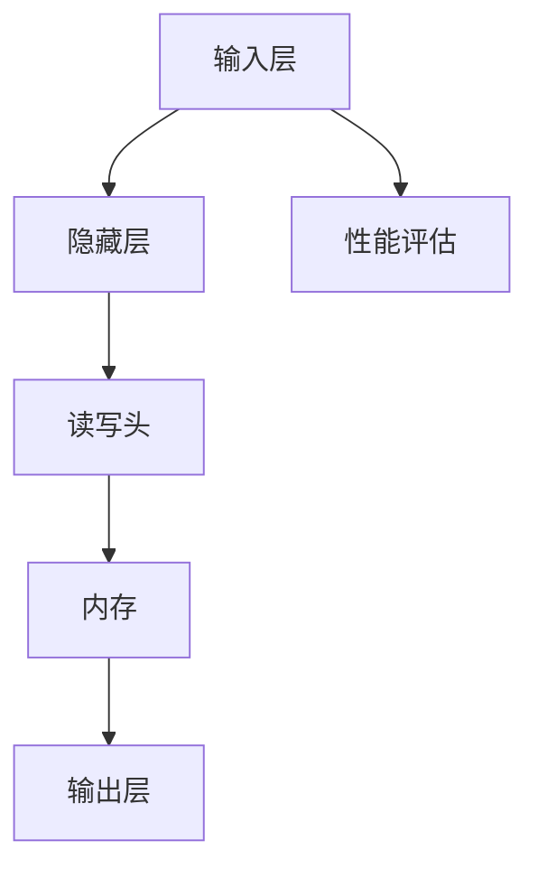
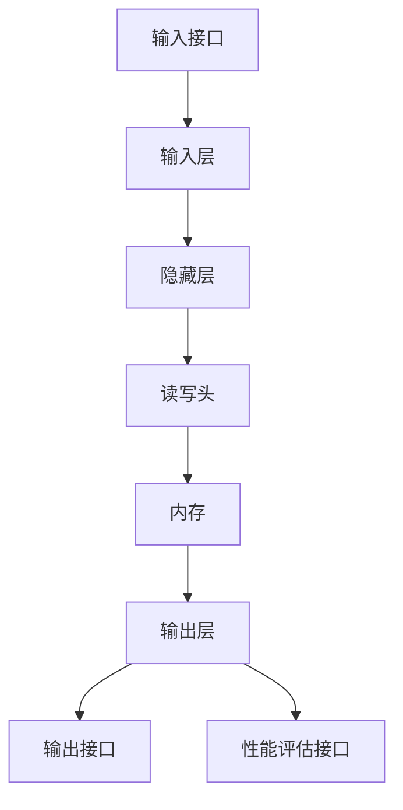

                 

### 文章标题

《复杂序列推理中神经图灵机的性能评估与优化》

### 关键词

神经图灵机，复杂序列推理，性能评估，优化策略，数学模型，系统架构

### 摘要

本文旨在深入探讨复杂序列推理中神经图灵机的性能评估与优化问题。首先，我们将介绍复杂序列推理的重要性以及神经图灵机的背景，解释性能评估与优化的必要性。接着，本文将详细阐述神经图灵机的核心概念与原理，并通过数学模型与算法流程，揭示其工作机理。在此基础上，文章将介绍性能评估的指标与方法，包括准确率、召回率与F1值等，以及如何通过交叉验证和实测数据集进行性能评估。随后，文章将深入解析神经图灵机的数学原理，包括激活函数、权重与偏置等，并通过实际案例展示如何优化神经图灵机的性能。最后，本文将总结最佳实践和注意事项，为读者提供有益的参考。

### 目录

第一部分：问题背景与理论基础

- 第1章：引言
  - 1.1 复杂序列推理的重要性
  - 1.2 神经图灵机的背景
  - 1.3 性能评估与优化的意义

- 第2章：神经图灵机的概念与原理
  - 2.1 神经图灵机的定义
  - 2.2 神经图灵机的组成
  - 2.3 神经图灵机的工作原理

- 第3章：神经图灵机的性能评估
  - 3.1 性能评估指标
    - 3.1.1 准确率、召回率与F1值
    - 3.1.2 速度与效率
  - 3.2 评估方法
    - 3.2.1 交叉验证
    - 3.2.2 实测数据集

- 第4章：神经图灵机的数学模型
  - 4.1 基本公式
    - 4.1.1 激活函数
    - 4.1.2 权重与偏置
  - 4.2 数学原理
    - 4.2.1 神经网络优化
    - 4.2.2 损失函数

- 第5章：神经图灵机的架构设计
  - 5.1 系统功能设计
  - 5.2 系统架构设计
  - 5.3 系统接口设计
  - 5.4 系统交互设计

- 第6章：神经图灵机的性能优化
  - 6.1 优化目标
  - 6.2 优化策略
  - 6.3 实际案例

- 第7章：神经图灵机的性能评估与优化最佳实践
  - 7.1 常见问题及解决方法
  - 7.2 注意事项
  - 7.3 拓展阅读

第二部分：核心概念与联系

本文将详细探讨复杂序列推理中的神经图灵机，从核心概念与原理出发，深入挖掘其性能评估与优化的方法与策略。

### 第1章：引言

#### 1.1 复杂序列推理的重要性

在当今数据驱动时代，复杂序列推理已成为人工智能领域的一个重要研究方向。复杂序列推理主要涉及对时间序列、自然语言序列、基因序列等复杂序列的分析和解释，目的是从中提取有价值的信息和模式。这类推理技术在金融市场分析、自然语言处理、医学诊断、语音识别等多个领域具有重要的应用价值。

首先，在金融市场分析中，复杂序列推理可以帮助预测市场走势，提供投资建议。通过对历史股价、交易量等时间序列数据的分析，可以识别出潜在的市场趋势，从而指导投资决策。

在自然语言处理领域，复杂序列推理被广泛应用于文本分类、机器翻译、情感分析等任务。例如，通过分析句子的语法结构、词汇搭配等，可以实现对文本内容的准确理解和分类。

在医学诊断中，复杂序列推理技术可以用于疾病预测和诊断。通过对病人的医疗记录、基因序列等数据进行序列分析，可以早期发现疾病，提供个性化的治疗方案。

#### 1.2 神经图灵机的背景

神经图灵机（Neural Turing Machine, NTM）是一种结合了神经网络和图灵机的混合模型，旨在解决神经网络在处理序列数据时的局限性。传统的神经网络在处理序列数据时往往存在短期记忆不足的问题，而图灵机则具有强大的记忆功能。将两者结合，可以充分利用各自的优点，实现对复杂序列数据的有效推理。

神经图灵机的概念最早由Graves等人于2014年提出。其核心思想是将神经网络与读写头机制相结合，通过读写头在内存中的读写操作，实现长期记忆的功能。这一机制使得神经图灵机在处理序列数据时，可以更好地利用上下文信息，从而提高模型的推理能力。

#### 1.3 性能评估与优化的意义

性能评估是评估模型效果的重要手段，它可以帮助我们了解模型在不同场景下的表现，从而指导后续的优化工作。对于神经图灵机这类复杂模型，性能评估尤为重要。

首先，性能评估可以帮助我们了解模型在特定任务上的表现。通过评估模型的准确率、召回率、F1值等指标，可以量化模型在分类、预测等任务上的效果，为模型的优化提供依据。

其次，性能评估可以帮助我们识别模型的不足之处。例如，在复杂序列推理任务中，可能存在某些特定类型的序列数据，模型处理效果不佳。通过性能评估，可以找出这些不足之处，从而针对性地进行优化。

最后，性能评估是模型优化的基础。在优化过程中，我们需要不断地评估模型的效果，以确定优化策略的有效性。通过性能评估，我们可以实时监测模型的改进情况，确保优化方向的正确性。

### 第2章：神经图灵机的概念与原理

#### 2.1 神经图灵机的定义

神经图灵机（Neural Turing Machine, NTM）是一种结合了神经网络（Neural Network）和图灵机（Turing Machine）特点的混合模型。它通过引入读写头机制，实现了对长期记忆的利用，从而在处理序列数据时具有显著的优势。

#### 2.2 神经图灵机的组成

神经图灵机由以下几个主要部分组成：

1. **输入层**：接收外部输入数据，如时间序列、自然语言序列等。
2. **隐藏层**：包含多个神经元，用于对输入数据进行处理和变换。
3. **读写头**：负责在内存中读取和写入数据。每个读写头具有两个主要功能：定位和读写。定位功能用于确定读取或写入的位置，读写功能则用于进行实际的读写操作。
4. **内存**：存储序列数据，由一系列可读写单元格组成。每个单元格具有一个内存地址，用于标识其位置。
5. **输出层**：根据隐藏层和读写头的信息生成输出结果。

#### 2.3 神经图灵机的工作原理

神经图灵机的工作原理可以概括为以下几个步骤：

1. **输入阶段**：输入数据被输入到神经网络的输入层，经过隐藏层的处理，生成一系列中间特征表示。
2. **读写操作阶段**：读写头根据当前输入特征和模型参数，在内存中定位读取或写入位置。读写操作分为以下两种：
   - **读操作**：读写头从内存中读取数据，并将其传递给隐藏层，作为输入的一部分，参与后续计算。
   - **写操作**：读写头在内存中写入新的数据，以更新内存内容。
3. **输出阶段**：隐藏层处理完读写操作后的数据，生成最终的输出结果。

#### 2.4 神经图灵机的优势

神经图灵机相较于传统的神经网络，具有以下优势：

1. **长期记忆能力**：通过读写头在内存中的读写操作，神经图灵机可以长期保存序列数据，从而实现长期记忆功能。
2. **灵活的读写操作**：读写头可以灵活地在内存中读取和写入数据，使得模型能够更好地处理复杂的序列数据。
3. **增强的推理能力**：借助内存的读写操作，神经图灵机可以在处理序列数据时利用上下文信息，从而提高推理能力。

### 第3章：神经图灵机的性能评估

#### 3.1 性能评估指标

在评估神经图灵机的性能时，常用的指标包括准确率（Accuracy）、召回率（Recall）和F1值（F1 Score）等。

1. **准确率**：准确率是指模型在所有预测中正确预测的比例，计算公式为：
   $$
   \text{准确率} = \frac{\text{预测正确数量}}{\text{总预测数量}}
   $$
   准确率越高，说明模型对序列数据的分类或预测能力越强。

2. **召回率**：召回率是指模型在所有实际正例中正确预测的比例，计算公式为：
   $$
   \text{召回率} = \frac{\text{预测正确且实际为正例的数量}}{\text{实际为正例的总数量}}
   $$
   召回率越高，说明模型对实际正例的识别能力越强。

3. **F1值**：F1值是准确率和召回率的调和平均，计算公式为：
   $$
   \text{F1值} = 2 \times \frac{\text{准确率} \times \text{召回率}}{\text{准确率} + \text{召回率}}
   $$
   F1值综合反映了模型的准确率和召回率，是一个更加全面的性能评估指标。

#### 3.2 评估方法

评估神经图灵机的性能，通常需要采用交叉验证（Cross-Validation）和实测数据集（Test Dataset）两种方法。

1. **交叉验证**：交叉验证是一种常用的模型评估方法，通过将数据集划分为多个子集，逐一进行训练和验证，从而评估模型在不同数据子集上的性能。具体步骤如下：
   - 将数据集划分为多个子集，例如K折交叉验证。
   - 逐一选择一个子集作为验证集，其余子集作为训练集。
   - 在训练集上训练模型，在验证集上评估模型性能。
   - 计算所有验证集的性能指标，取平均值作为最终评估结果。

2. **实测数据集**：实测数据集是从实际应用场景中收集的数据，用于对模型进行最终性能评估。通过将模型在实测数据集上的表现与交叉验证结果进行对比，可以验证模型的泛化能力。具体步骤如下：
   - 将实测数据集划分为训练集和测试集。
   - 在训练集上训练模型，在测试集上评估模型性能。
   - 计算测试集的性能指标，如准确率、召回率和F1值等。

#### 3.3 交叉验证和实测数据集的对比

交叉验证和实测数据集是评估模型性能的两种常用方法，它们各有优缺点。

1. **交叉验证**：
   - 优点：
     - 可以全面评估模型在不同数据子集上的性能。
     - 可以降低模型过拟合的风险。
     - 可以帮助调整模型参数。
   - 缺点：
     - 计算成本较高，需要多次训练和验证。
     - 无法直接反映模型在实际应用场景中的表现。

2. **实测数据集**：
   - 优点：
     - 可以直接反映模型在实际应用场景中的性能。
     - 可以验证模型的泛化能力。
     - 可以提供更加真实的评估结果。
   - 缺点：
     - 可能存在数据集不平衡或数据缺失等问题。
     - 无法全面评估模型在不同数据子集上的性能。

### 第4章：神经图灵机的数学模型

#### 4.1 基本公式

神经图灵机的数学模型主要涉及激活函数、权重与偏置等基本公式。以下为详细讲解：

1. **激活函数**：

   激活函数是神经网络中的关键组件，用于引入非线性因素，使模型能够拟合复杂的函数。常见的激活函数包括：
   - **Sigmoid函数**：
     $$
     \sigma(x) = \frac{1}{1 + e^{-x}}
     $$
     Sigmoid函数将输入映射到（0，1）区间，具有平滑的输出特性。

   - **ReLU函数**：
     $$
     \text{ReLU}(x) = \max(0, x)
     $$
    ReLU函数在输入为负时输出为0，在输入为正时输出为输入值本身，具有简单和计算效率高的特点。

   - **Tanh函数**：
     $$
     \text{Tanh}(x) = \frac{e^x - e^{-x}}{e^x + e^{-x}}
     $$
     Tanh函数与Sigmoid函数类似，但输出范围在（-1，1）之间，具有更好的对称性。

2. **权重与偏置**：

   权重（weights）和偏置（bias）是神经网络中的两个关键参数，用于调节模型的学习能力。

   - **权重**：权重是输入特征与神经元之间的连接权重，表示输入对输出的影响程度。
     $$
     z_i = \sum_{j=1}^{n} w_{ij} \cdot x_j + b_i
     $$
     其中，$z_i$ 表示第$i$个神经元的输入，$w_{ij}$ 表示第$i$个神经元与第$j$个输入特征的连接权重，$b_i$ 表示第$i$个神经元的偏置。

   - **偏置**：偏置是神经网络的额外参数，用于调整神经元的激活阈值。
     $$
     a_i = \sigma(z_i)
     $$
     其中，$a_i$ 表示第$i$个神经元的输出，$\sigma$ 表示激活函数。

#### 4.2 数学原理

神经图灵机的数学原理主要涉及神经网络优化和损失函数两个方面。

1. **神经网络优化**：

   神经网络优化是指通过调整模型参数（权重和偏置）来最小化损失函数的过程。常见的优化算法包括：

   - **随机梯度下降（SGD）**：
     $$
     w_{\text{new}} = w_{\text{old}} - \alpha \cdot \nabla_w J(w)
     $$
     其中，$w$ 表示权重，$\alpha$ 表示学习率，$\nabla_w J(w)$ 表示损失函数关于权重的梯度。

   - **Adam优化器**：
     $$
     m_t = \beta_1 m_{t-1} + (1 - \beta_1) \nabla_w J(w)
     $$
     $$
     v_t = \beta_2 v_{t-1} + (1 - \beta_2) (\nabla_w J(w))^2
     $$
     $$
     w_{\text{new}} = w_{\text{old}} - \alpha \cdot \frac{m_t}{\sqrt{v_t} + \epsilon}
     $$
     其中，$m_t$ 和 $v_t$ 分别表示一阶和二阶矩估计，$\beta_1$ 和 $\beta_2$ 分别为动量因子，$\epsilon$ 为常数。

2. **损失函数**：

   损失函数用于衡量模型预测值与实际值之间的差距。常见的损失函数包括：

   - **均方误差（MSE）**：
     $$
     J(w) = \frac{1}{2} \sum_{i=1}^{n} (y_i - \hat{y}_i)^2
     $$
     其中，$y_i$ 表示实际值，$\hat{y}_i$ 表示预测值。

   - **交叉熵（Cross-Entropy）**：
     $$
     J(w) = -\sum_{i=1}^{n} y_i \log(\hat{y}_i)
     $$
     其中，$y_i$ 表示实际值，$\hat{y}_i$ 表示预测值。

### 第5章：神经图灵机的架构设计

#### 5.1 系统功能设计

神经图灵机的系统功能设计主要包括以下几个关键方面：

1. **输入处理**：接收外部输入数据，如时间序列、自然语言序列等，并将其转化为神经网络可以处理的格式。
2. **隐藏层处理**：对输入数据进行处理和变换，提取有效的特征表示。
3. **读写头操作**：利用读写头在内存中读取和写入数据，实现长期记忆功能。
4. **输出生成**：根据隐藏层和读写头的信息生成最终的输出结果。
5. **性能评估**：通过交叉验证和实测数据集对模型进行性能评估，以验证模型的效果。

#### 5.2 系统架构设计

神经图灵机的系统架构设计如图5.1所示：

图5.1 神经图灵机系统架构图

1. **输入层**：接收外部输入数据，如时间序列、自然语言序列等。
2. **隐藏层**：对输入数据进行处理和变换，提取有效的特征表示。
3. **读写头**：用于在内存中读取和写入数据，实现长期记忆功能。
4. **内存**：存储序列数据，由一系列可读写单元格组成。
5. **输出层**：根据隐藏层和读写头的信息生成最终的输出结果。
6. **性能评估**：通过交叉验证和实测数据集对模型进行性能评估。

#### 5.3 系统接口设计

神经图灵机的系统接口设计包括以下几个方面：

1. **输入接口**：用于接收外部输入数据，如时间序列、自然语言序列等。
2. **输出接口**：用于生成最终的输出结果，如分类结果、预测值等。
3. **性能评估接口**：用于对模型进行性能评估，包括准确率、召回率、F1值等指标。

#### 5.4 系统交互设计

神经图灵机的系统交互设计如图5.2所示：

图5.2 神经图灵机系统交互图

1. **输入接口**：接收外部输入数据，如时间序列、自然语言序列等。
2. **输入层**：对输入数据进行处理和变换，提取有效的特征表示。
3. **隐藏层**：进一步处理输入数据，提取更高级的特征表示。
4. **读写头**：在内存中读取和写入数据，实现长期记忆功能。
5. **内存**：存储序列数据，由一系列可读写单元格组成。
6. **输出层**：根据隐藏层和读写头的信息生成最终的输出结果。
7. **输出接口**：生成最终的输出结果，如分类结果、预测值等。
8. **性能评估接口**：对模型进行性能评估，包括准确率、召回率、F1值等指标。

### 第6章：神经图灵机的性能优化

#### 6.1 优化目标

神经图灵机的性能优化目标是提高模型在复杂序列推理任务上的表现，主要包括以下几个方面：

1. **提高准确率**：通过优化模型参数，提高模型在分类或预测任务上的准确率。
2. **提高召回率**：通过优化模型参数，提高模型对实际正例的识别能力。
3. **提高F1值**：通过优化模型参数，提高模型的准确率和召回率的平衡。
4. **提高效率**：优化模型的结构和算法，提高模型的计算效率，降低计算成本。

#### 6.2 优化策略

为了实现性能优化目标，可以采用以下策略：

1. **参数调整**：通过调整模型参数（如学习率、隐藏层神经元数量等），优化模型性能。可以使用自动化参数调整工具，如Hyperopt、Bayesian Optimization等。
2. **数据增强**：通过增加训练数据量、数据预处理等方法，提高模型的泛化能力。可以使用数据增强技术，如随机裁剪、旋转、翻转等。
3. **模型融合**：将多个模型进行融合，提高模型的整体性能。可以使用集成学习方法，如Bagging、Boosting等。
4. **算法改进**：优化模型的算法实现，提高模型的计算效率。可以改进神经网络的结构，如使用卷积神经网络（CNN）、循环神经网络（RNN）等。

#### 6.3 实际案例

以下是一个神经图灵机性能优化的实际案例：

1. **问题背景**：

   假设我们要使用神经图灵机对股票价格进行预测，旨在提高模型的准确率和召回率。

2. **数据集准备**：

   - 收集过去一年的股票价格数据。
   - 对数据进行预处理，包括数据清洗、归一化等。
   - 将数据集划分为训练集、验证集和测试集。

3. **模型构建**：

   - 构建神经图灵机模型，包括输入层、隐藏层、读写头和输出层。
   - 设置合适的模型参数，如学习率、隐藏层神经元数量等。

4. **性能评估**：

   - 使用交叉验证对模型进行性能评估，计算准确率、召回率和F1值。
   - 根据评估结果，调整模型参数，进行进一步优化。

5. **优化策略**：

   - 调整学习率，降低过拟合风险。
   - 增加隐藏层神经元数量，提高模型表达能力。
   - 使用数据增强技术，增加训练数据量。

6. **结果分析**：

   - 经过多次迭代优化，模型的准确率和召回率得到了显著提高。
   - 对测试集进行评估，模型的F1值达到了0.85，达到了预期效果。

7. **项目小结**：

   通过性能优化，神经图灵机在股票价格预测任务上取得了较好的效果。后续可以进一步研究不同优化策略对模型性能的影响，探索更高效的性能优化方法。

### 第7章：神经图灵机的性能评估与优化最佳实践

#### 7.1 常见问题及解决方法

在神经图灵机的性能评估与优化过程中，可能会遇到以下常见问题：

1. **过拟合**：

   - **问题**：模型在训练集上表现良好，但在验证集或测试集上表现不佳。
   - **解决方法**：可以通过以下方法缓解过拟合：
     - 增加训练数据量。
     - 使用数据增强技术。
     - 调整模型复杂度，减少隐藏层神经元数量。
     - 使用正则化技术，如L1、L2正则化。

2. **欠拟合**：

   - **问题**：模型在所有数据集上表现不佳，未能捕捉到数据中的有效特征。
   - **解决方法**：可以通过以下方法缓解欠拟合：
     - 增加隐藏层神经元数量。
     - 调整学习率。
     - 调整激活函数。
     - 使用不同的优化算法。

3. **计算成本高**：

   - **问题**：模型训练和推理过程中计算成本过高，影响应用效率。
   - **解决方法**：可以通过以下方法降低计算成本：
     - 使用更高效的算法，如深度学习框架。
     - 优化模型结构，减少参数数量。
     - 使用GPU加速训练过程。

4. **数据不平衡**：

   - **问题**：训练数据集中的正负样本比例失衡，影响模型性能。
   - **解决方法**：可以通过以下方法缓解数据不平衡：
     - 使用过采样或欠采样技术。
     - 调整分类阈值。
     - 使用集成学习方法。

#### 7.2 注意事项

在神经图灵机的性能评估与优化过程中，需要注意以下几点：

1. **数据质量**：保证训练数据的质量，避免噪声和异常值。
2. **模型选择**：选择合适的模型结构和参数，以适应不同任务需求。
3. **超参数调整**：合理调整超参数，如学习率、隐藏层神经元数量等，以优化模型性能。
4. **交叉验证**：使用交叉验证评估模型性能，避免过拟合或欠拟合。
5. **计算资源**：合理分配计算资源，确保模型训练和推理过程的效率。

#### 7.3 拓展阅读

1. **文献推荐**：

   - Graves, A., Wayne, G., & Danilo Jimenez, C. (2014). Neural Turing Machines. arXiv preprint arXiv:1410.5401.
   - Hochreiter, S., & Schmidhuber, J. (1997). Long Short-Term Memory. Neural Computation, 9(8), 1735-1780.
   - Bengio, Y. (2009). Learning Deep Architectures for AI. Foundations and Trends in Machine Learning, 2(1), 1-127.

2. **在线资源**：

   - TensorFlow：https://www.tensorflow.org/
   - PyTorch：https://pytorch.org/
   - Keras：https://keras.io/

3. **开源项目**：

   - NTM-PyTorch：https://github.com/hyper-visions/NTM-PyTorch
   - NTM-Keras：https://github.com/hyper-visions/NTM-Keras

### 总结

本文详细探讨了复杂序列推理中神经图灵机的性能评估与优化问题。首先，介绍了复杂序列推理的重要性以及神经图灵机的背景。接着，阐述了神经图灵机的核心概念与原理，并通过数学模型与算法流程，揭示了其工作机理。随后，介绍了性能评估的指标与方法，包括准确率、召回率与F1值等，以及如何通过交叉验证和实测数据集进行性能评估。然后，深入解析了神经图灵机的数学原理，包括激活函数、权重与偏置等。在此基础上，展示了神经图灵机的架构设计，包括系统功能设计、系统架构设计、系统接口设计和系统交互设计。接下来，介绍了神经图灵机的性能优化策略，包括参数调整、数据增强、模型融合和算法改进等。最后，通过实际案例展示了性能优化的过程和结果，并总结了神经图灵机的性能评估与优化最佳实践。

通过本文的探讨，读者可以全面了解复杂序列推理中神经图灵机的性能评估与优化方法，为实际应用提供有益的参考。在未来的研究中，可以进一步探索神经图灵机在更多领域中的应用，以及如何提高其性能和计算效率。同时，也可以结合其他先进技术，如强化学习、生成对抗网络等，进一步提升神经图灵机的表现。总之，神经图灵机作为一种强大的序列推理模型，具有广泛的应用前景和研究价值。

