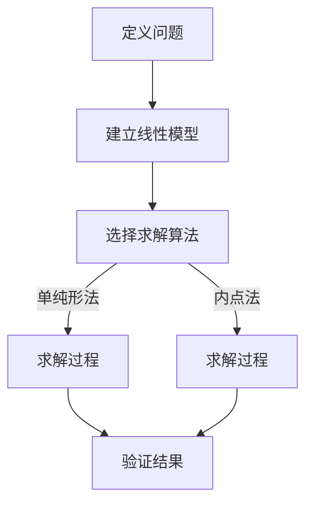
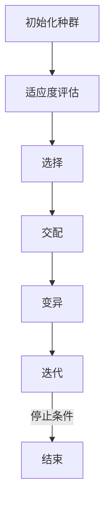
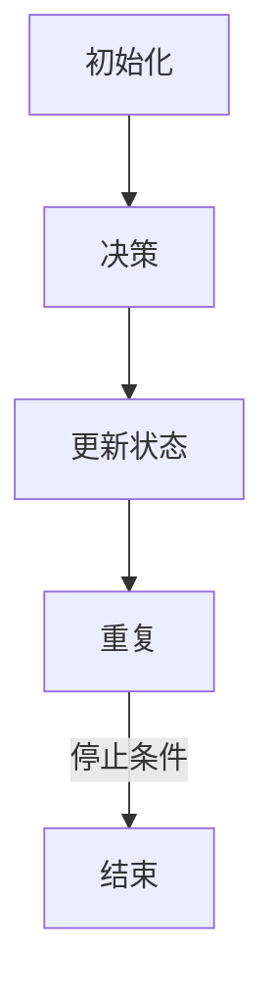
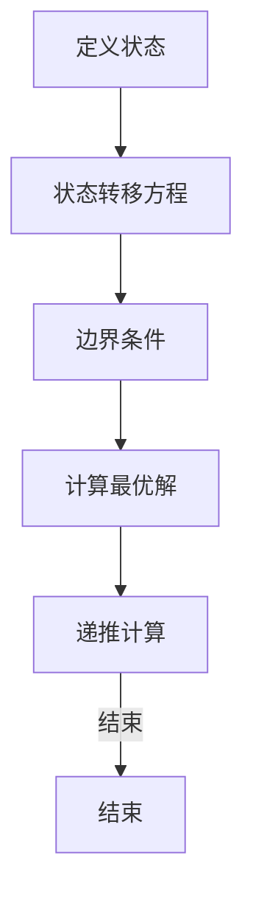
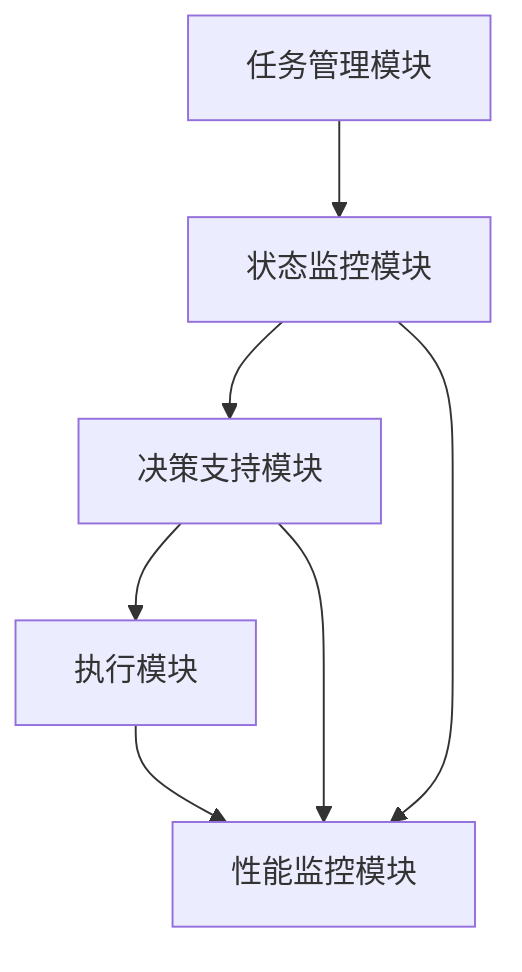
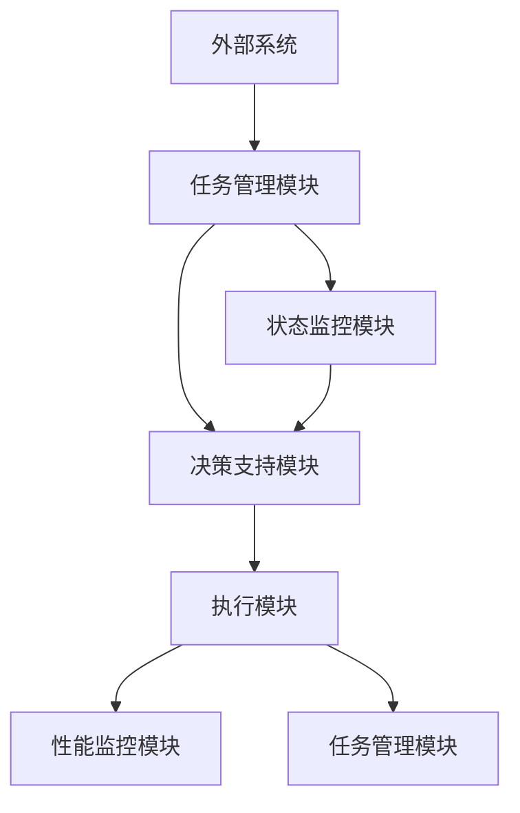

                 

### 第一步：引入复杂推理任务协调与元控制器决策优化

在当今高度复杂和动态变化的计算环境中，系统的协调和优化显得尤为重要。复杂推理任务协调是指在分布式系统中，多个任务协同工作以实现共同目标的过程。这些任务可能具有不同的优先级、资源需求和时效性，因此协调它们的执行显得极为复杂。元控制器则在这种复杂环境中起到了至关重要的作用。元控制器是一种能够自我调整和优化的控制器，其核心功能是监控和管理系统的各个组成部分，确保系统整体性能的最优化。

决策优化是元控制器的重要组成部分，它涉及如何根据系统当前的运行状态、任务需求和环境变化，动态地调整策略和资源分配。在复杂推理任务协调中，决策优化的目标是提高系统的整体效率、响应速度和稳定性。本文将探讨如何通过优化元控制器的决策过程，来实现复杂推理任务协调的高效执行。

本文将从以下几个方面展开讨论：

1. **概述与背景介绍**：介绍复杂推理任务协调和元控制器的概念，以及本文的目的和结构。
2. **核心概念与联系**：详细讨论元控制器的关键概念、属性特征，并展示概念之间的关系。
3. **算法原理讲解**：介绍决策优化的算法原理，使用mermaid流程图和Python代码来详细阐述。
4. **数学模型和公式讲解**：使用LaTeX格式展示数学模型和公式，并进行详细讲解和举例说明。
5. **系统分析与架构设计**：描述问题场景，展示系统功能设计、架构设计和系统交互。
6. **项目实战**：介绍环境安装、系统实现源代码，并对代码进行解读和分析。
7. **最佳实践 tips、小结、注意事项、拓展阅读**：总结经验，给出建议和进一步学习的资源。

通过上述步骤，我们将逐步深入理解复杂推理任务协调中的元控制器决策优化，为实际应用提供有力的理论支持和实践经验。

### 第二步：核心概念与联系

在深入探讨复杂推理任务协调中的元控制器决策优化之前，我们首先需要明确几个核心概念，并了解它们之间的联系。

#### 元控制器概述

元控制器（Metacompiler）是一种能够在运行时动态调整和优化系统性能的控制器。它不仅能够处理单一的运行任务，还能够根据系统运行状态和环境变化，进行自我调整和优化。元控制器通常具有以下特点：

- **动态性**：能够根据实时数据动态调整策略。
- **自适应**：能够适应不同环境和任务需求。
- **优化性**：能够优化资源使用和任务执行。

元控制器的核心功能包括任务调度、资源分配、错误处理和性能监控。它通过收集系统运行数据，分析这些数据，并据此调整控制策略，以确保系统高效、稳定地运行。

#### 决策优化

决策优化（Decision Optimization）是元控制器的一个重要功能。它涉及如何在复杂的系统中，根据当前状态和未来趋势，选择最佳的策略或行动方案。决策优化的目标是通过合理配置资源、调整任务优先级和执行顺序，实现系统性能的最大化。

决策优化通常包括以下几个步骤：

1. **问题建模**：定义问题，包括目标函数、约束条件等。
2. **算法选择**：选择合适的优化算法，如线性规划、遗传算法、贪心算法等。
3. **求解与验证**：使用算法求解问题，并验证解决方案的有效性。

#### 关键概念与联系

元控制器与决策优化之间的联系十分紧密。元控制器依赖于决策优化算法来调整其行为，而决策优化算法则依赖于元控制器提供的系统状态信息。以下是几个关键概念之间的联系：

1. **系统状态监控**：元控制器通过系统状态监控模块，实时收集系统的运行数据，包括任务执行进度、资源使用情况、错误日志等。
2. **决策支持系统**：元控制器利用这些数据，通过决策支持系统（DSS）进行分析和决策。DSS包括各种优化算法和模型，用于生成最佳的决策方案。
3. **任务调度**：基于决策优化的结果，元控制器对任务进行调度，调整任务优先级和执行顺序，以确保系统资源得到最佳利用。

#### 属性特征对比表格

为了更清晰地理解元控制器和决策优化之间的关系，我们可以使用一个对比表格来展示它们的关键属性特征。

| 属性特征 | 元控制器 | 决策优化 |
|----------|----------|----------|
| 动态性 | 高 | 高 |
| 自适应性 | 高 | 高 |
| 优化性 | 高 | 高 |
| 系统状态监控 | 是 | 否 |
| 决策支持系统 | 是 | 是 |
| 任务调度 | 是 | 否 |

通过上述对比，我们可以看到元控制器和决策优化在属性特征上的高度一致性，这进一步强调了它们之间的紧密联系。

综上所述，元控制器和决策优化是复杂推理任务协调中不可或缺的核心概念。元控制器通过实时监控和自我调整，为决策优化提供了基础数据和支持，而决策优化则通过优化算法和模型，为元控制器提供了最佳的执行策略。理解这些核心概念和它们之间的联系，是深入探讨元控制器决策优化的第一步。

### 第三步：算法原理讲解

在了解了元控制器和决策优化的基本概念之后，接下来我们将深入探讨决策优化算法的原理。决策优化是元控制器功能实现的核心，它直接关系到系统能否在复杂环境下高效运行。本文将介绍几种常见的决策优化算法，并通过mermaid流程图和Python代码示例，详细阐述这些算法的原理和实现过程。

#### 3.1 决策优化的基本概念

决策优化（Decision Optimization）是一种通过数学模型和算法，从多个可能的解决方案中选择最优解的过程。在复杂系统中，决策优化可以应用于任务调度、资源分配、路径规划等各个方面。其基本概念包括：

- **问题建模**：将实际问题转化为数学模型，包括目标函数和约束条件。
- **优化算法**：用于求解数学模型，找到最优解或近似最优解的算法。
- **解决方案评估**：对求解结果进行评估，以确保其满足实际需求。

#### 3.2 常见决策优化算法

常见的决策优化算法包括线性规划、遗传算法、贪心算法和动态规划等。以下将分别介绍这些算法的基本原理。

##### 3.2.1 线性规划

线性规划（Linear Programming，LP）是一种用于求解线性目标函数在一组线性约束条件下的最优解的数学方法。其基本形式如下：

$$
\begin{aligned}
\text{minimize }   c^T x \\
\text{subject to } Ax \leq b \\
x \geq 0
\end{aligned}
$$

其中，$c$ 是系数向量，$x$ 是决策变量向量，$A$ 和 $b$ 分别是约束矩阵和约束向量。

线性规划可以通过单纯形法、内点法等算法求解。以下是线性规划的mermaid流程图：



##### 3.2.2 遗传算法

遗传算法（Genetic Algorithm，GA）是一种模拟自然选择和遗传机制的搜索算法。遗传算法通过初始化一组解（即“种群”），然后通过迭代过程不断进化，找到最优解或近似最优解。其基本步骤包括：

1. **初始化种群**：随机生成初始解集。
2. **适应度评估**：评估每个解的适应度，适应度越高，表示解越优秀。
3. **选择**：根据适应度选择优秀解进行交配。
4. **交配**：生成新的解集。
5. **变异**：对部分解进行变异操作。
6. **迭代**：重复适应度评估、选择、交配和变异，直到达到停止条件。

以下是遗传算法的mermaid流程图：



##### 3.2.3 贪心算法

贪心算法（Greedy Algorithm）是一种在每一步选择局部最优解，以期获得全局最优解的算法。贪心算法的思路是每一步都做出在当前状态下最好选择，而不是做出对当前和未来状态都有利的最佳选择。以下是贪心算法的基本步骤：

1. **初始化**：根据问题定义初始状态。
2. **决策**：在当前状态下，选择最优的决策。
3. **更新状态**：根据决策结果更新状态。
4. **重复**：重复决策和更新状态，直到达到停止条件。

以下是贪心算法的mermaid流程图：



##### 3.2.4 动态规划

动态规划（Dynamic Programming，DP）是一种用于求解多阶段决策问题的方法。动态规划将复杂问题分解为多个阶段，每个阶段都进行最优决策，从而得到整体最优解。其基本步骤包括：

1. **状态定义**：定义问题状态，确定状态变量。
2. **状态转移方程**：定义状态之间的转移关系。
3. **边界条件**：确定状态转移方程的边界条件。
4. **计算最优解**：通过递推关系计算最优解。

以下是动态规划的mermaid流程图：



#### 3.3 使用Python代码示例

为了更好地理解上述算法的原理，我们将通过Python代码进行示例。以下是一个使用遗传算法求解最小化问题的小例子：

```python
import numpy as np
import matplotlib.pyplot as plt

# 遗传算法求解最小化问题
def genetic_algorithm():
    # 初始化种群
    population_size = 100
    population = np.random.rand(population_size, 1)
    fitness_scores = np.apply_along_axis(lambda x: -x**2, 1, population)
    
    # 迭代过程
    for _ in range(100):
        # 选择
        selected = np.argsort(fitness_scores)[:population_size//2]
        
        # 交配
        for i in range(0, population_size, 2):
            parent1 = population[selected[i]]
            parent2 = population[selected[i+1]]
            child = 0.5 * (parent1 + parent2)
            population[i] = child
            population[i+1] = child
        
        # 变异
        for i in range(population_size):
            if np.random.rand() < 0.1:
                population[i] = np.random.rand()
        
        # 评估适应度
        fitness_scores = np.apply_along_axis(lambda x: -x**2, 1, population)
    
    # 选择最优解
    best_index = np.argmax(fitness_scores)
    best_solution = population[best_index]
    return best_solution

# 运行遗传算法
best_solution = genetic_algorithm()
print(f"最佳解为：{best_solution}")

# 绘制适应度曲线
fitness_scores = np.apply_along_axis(lambda x: -x**2, 1, population)
plt.plot(fitness_scores)
plt.xlabel('迭代次数')
plt.ylabel('适应度')
plt.title('遗传算法适应度变化曲线')
plt.show()
```

通过上述代码示例，我们可以看到遗传算法的基本实现过程，包括初始化种群、适应度评估、选择、交配和变异等步骤。通过迭代过程，算法最终找到了最小化问题的最优解。

综上所述，决策优化算法是元控制器实现高效决策的核心。通过介绍线性规划、遗传算法、贪心算法和动态规划等常见算法，并使用mermaid流程图和Python代码进行详细阐述，我们能够更好地理解这些算法的原理和实现过程。这些算法为元控制器提供了强大的决策支持，使其能够在复杂环境中实现最优化的任务协调。

### 第四步：数学模型和公式讲解

在决策优化算法的讲解中，我们已经初步了解了各种算法的原理和实现过程。然而，要深入理解这些算法，并应用到实际问题中，数学模型的建立和公式推导是不可或缺的。在本节中，我们将详细讲解决策优化中的几个关键数学模型和公式，并使用LaTeX格式展示这些公式。

#### 4.1 数学模型概述

决策优化中的数学模型通常包括目标函数和约束条件两部分。目标函数定义了优化的目标，例如最大化或最小化某个指标；约束条件则限制了目标函数的求解范围，确保解决方案的实际可行性。

##### 4.1.1 目标函数

目标函数是决策优化中的核心，它描述了系统优化的目标。常见的目标函数包括：

1. **最小化成本**：
   $$
   \text{minimize } c(x)
   $$
   其中，$c(x)$ 表示总成本，$x$ 表示决策变量。

2. **最大化收益**：
   $$
   \text{maximize } r(x)
   $$
   其中，$r(x)$ 表示总收益，$x$ 表示决策变量。

3. **平衡成本和收益**：
   $$
   \text{minimize } \max\left(\frac{c(x)}{r(x)}, \frac{r(x)}{c(x)}\right)
   $$
   该公式用于在成本和收益之间寻找平衡点。

##### 4.1.2 约束条件

约束条件限制了决策变量的取值范围，确保解决方案的实际可行性。常见的约束条件包括：

1. **资源限制**：
   $$
   \sum_{i=1}^{n} x_i \leq R
   $$
   其中，$x_i$ 表示第$i$项资源的使用量，$R$ 表示总资源量。

2. **时间约束**：
   $$
   t(x) \leq T
   $$
   其中，$t(x)$ 表示完成任务的时长，$T$ 表示总时间限制。

3. **非线性约束**：
   $$
   g(x) \leq 0
   $$
   其中，$g(x)$ 表示非线性约束条件。

#### 4.2 关键数学模型和公式讲解

下面我们将使用LaTeX格式展示几个关键数学模型和公式，并进行详细讲解和举例说明。

##### 4.2.1 线性规划模型

线性规划模型是最常见的决策优化模型之一，其标准形式如下：

$$
\begin{aligned}
\text{minimize }   c^T x \\
\text{subject to } Ax \leq b \\
x \geq 0
\end{aligned}
$$

其中，$c$ 是系数向量，$x$ 是决策变量向量，$A$ 和 $b$ 分别是约束矩阵和约束向量。以下是该模型的详细讲解：

1. **目标函数**：$c^T x$ 表示总成本，$c$ 表示每个决策变量的成本系数，$x$ 表示决策变量。
2. **约束条件**：$Ax \leq b$ 表示资源限制，$A$ 表示约束矩阵，$x$ 表示决策变量，$b$ 表示资源总量。
3. **非负约束**：$x \geq 0$ 表示决策变量必须非负。

**举例说明**：假设我们有三个任务，每个任务需要不同的资源，并且资源总量有限。我们的目标是找到任务的最优执行顺序，以最小化总成本。

$$
\begin{aligned}
\text{minimize }   c^T x \\
\text{subject to } \begin{bmatrix} 
2 & 1 & 3 \\
1 & 2 & 2 \\
3 & 3 & 1
\end{bmatrix} \begin{bmatrix} 
x_1 \\
x_2 \\
x_3
\end{bmatrix} &\leq \begin{bmatrix} 
6 \\
5 \\
4
\end{bmatrix} \\
x_1, x_2, x_3 &\geq 0
\end{aligned}
$$

约束条件定义了每个任务的资源需求，目标函数定义了总成本。通过求解这个线性规划模型，我们可以找到最优的任务执行顺序。

##### 4.2.2 遗传算法模型

遗传算法是一种模拟自然选择和遗传机制的搜索算法。其基本模型包括：

$$
\begin{aligned}
\text{初始化种群 } P_0 \\
\text{适应度评估 } f(P) \\
\text{选择 } S \\
\text{交叉 } C \\
\text{变异 } M \\
\text{迭代更新 } P_{t+1} = P_t + S + C + M
\end{aligned}
$$

以下是遗传算法模型的详细讲解：

1. **种群初始化**：随机生成初始种群 $P_0$。
2. **适应度评估**：计算每个个体的适应度，适应度越高，个体越优秀。
3. **选择**：根据适应度选择优秀个体进行交配。
4. **交叉**：生成新的个体。
5. **变异**：对部分个体进行变异操作。
6. **迭代更新**：更新种群，重复适应度评估、选择、交叉和变异过程。

**举例说明**：假设我们有一个二进制编码的遗传算法，目标是最大化某个函数。初始种群为：

$$
P_0 = \{ (1, 0), (1, 1), (0, 0) \}
$$

通过迭代过程，我们可以逐步找到最优解。

##### 4.2.3 贪心算法模型

贪心算法是一种每一步都选择当前最优解的算法。其基本模型包括：

$$
\begin{aligned}
\text{初始化 } s_0 = \emptyset \\
\text{对于每个元素 } x \text{，执行以下步骤：} \\
\quad \text{如果 } x \text{ 满足贪心策略，则将 } x \text{ 加入到当前解 } s \\
\text{返回 } s
\end{aligned}
$$

以下是贪心算法模型的详细讲解：

1. **初始化**：初始化当前解 $s_0$ 为空。
2. **每一步选择**：根据贪心策略选择当前最优解 $x$。
3. **更新解**：将最优解 $x$ 加入到当前解 $s$。
4. **返回最终解**：返回最优解 $s$。

**举例说明**：假设我们有以下任务需要排序，目标是最大化任务的总收益。

$$
\begin{aligned}
\text{任务 } 1: \text{收益 } 5, \text{时间 } 2 \\
\text{任务 } 2: \text{收益 } 3, \text{时间 } 3 \\
\text{任务 } 3: \text{收益 } 4, \text{时间 } 1
\end{aligned}
$$

通过贪心算法，我们可以找到最优的排序方案。

##### 4.2.4 动态规划模型

动态规划是一种将复杂问题分解为多个阶段进行最优决策的方法。其基本模型包括：

$$
\begin{aligned}
\text{定义状态 } s_i = f(i) \\
\text{定义状态转移方程 } g(i, j) = h(i) + \max_{k} \{ g(k, j) \} \\
\text{计算最优解 } \sum_{i=1}^{n} g(i, n)
\end{aligned}
$$

以下是动态规划模型的详细讲解：

1. **状态定义**：$s_i$ 表示第 $i$ 个阶段的状态。
2. **状态转移方程**：$g(i, j)$ 表示从阶段 $i$ 到阶段 $j$ 的最优解。
3. **计算最优解**：通过递推计算得到最优解。

**举例说明**：假设我们有以下任务，需要在不同阶段执行，目标是最大化总收益。

$$
\begin{aligned}
\text{阶段 } 1: & \quad \text{任务 } 1: \text{收益 } 3, \text{时间 } 2 \\
\text{阶段 } 2: & \quad \text{任务 } 2: \text{收益 } 5, \text{时间 } 3 \\
\text{阶段 } 3: & \quad \text{任务 } 3: \text{收益 } 4, \text{时间 } 1
\end{aligned}
$$

通过动态规划，我们可以找到最优的执行方案。

通过上述讲解，我们可以看到决策优化中的数学模型和公式在实现高效决策中的重要性。通过这些模型，我们可以将实际问题转化为数学问题，并利用优化算法求解。理解这些模型和公式，不仅有助于我们深入理解决策优化算法，也为实际应用提供了有力的理论支持。

### 第五步：系统分析与架构设计

在理解了决策优化算法的基本原理后，我们接下来将进入系统分析与架构设计的环节。本部分将详细描述一个复杂推理任务协调系统的设计，包括问题场景、系统功能设计、系统架构设计和系统交互。

#### 5.1 问题场景

在现代分布式系统中，任务调度和资源管理变得越来越复杂。假设我们有一个包含多个服务节点的分布式系统，每个节点需要执行多种任务，任务之间可能存在依赖关系。此外，节点资源（如CPU、内存、存储）有限，任务执行时间也有限制。我们需要设计一个元控制器，能够根据系统当前状态和任务需求，动态地调整任务调度和资源分配，以确保系统整体性能的最优化。

#### 5.2 系统功能设计

系统功能设计是系统架构设计的核心，它定义了系统需要实现的具体功能。以下是系统的主要功能：

1. **任务接收与解析**：接收任务请求，解析任务详情，包括任务类型、优先级、资源需求等。
2. **状态监控**：实时监控系统各个节点的状态，包括资源使用情况、任务执行进度等。
3. **决策优化**：根据任务需求和系统状态，使用决策优化算法生成最优的调度策略和资源分配方案。
4. **任务调度**：根据决策结果，将任务调度到合适的节点上执行。
5. **错误处理**：监控任务执行状态，发现错误时及时进行处理，确保系统稳定运行。
6. **性能监控与报告**：定期生成系统性能报告，包括资源利用率、任务执行效率等。

#### 5.3 系统架构设计

系统架构设计是系统功能设计的实现框架，它定义了系统的各个组成部分及其交互关系。以下是系统架构的设计：

1. **任务管理模块**：负责任务接收、解析和任务调度。
2. **状态监控模块**：负责实时监控系统状态，收集节点的资源使用情况。
3. **决策支持模块**：包括决策优化算法和模型，用于生成最优调度策略。
4. **执行模块**：负责具体任务的执行，包括任务的具体执行逻辑和错误处理。
5. **性能监控模块**：负责监控系统性能，生成性能报告。

系统架构图如下：



#### 5.4 系统交互

系统交互设计描述了各个模块之间的通信和数据流动。以下是系统交互的详细描述：

1. **任务请求**：外部系统向任务管理模块发送任务请求。
2. **任务解析**：任务管理模块接收任务请求，解析任务详情，并将任务信息传递给决策支持模块。
3. **状态采集**：状态监控模块定期向各个节点采集资源使用情况，并将数据传递给决策支持模块。
4. **决策生成**：决策支持模块根据任务需求和系统状态，生成最优的调度策略和资源分配方案。
5. **任务调度**：任务管理模块根据决策支持模块的调度结果，将任务调度到具体的节点上执行。
6. **任务执行**：执行模块负责具体任务的执行，并在任务执行过程中定期向状态监控模块反馈任务状态。
7. **错误处理**：执行模块在发现错误时，将错误信息传递给任务管理模块，由任务管理模块进行错误处理。
8. **性能监控**：性能监控模块定期生成系统性能报告，并将报告传递给外部系统。

系统交互图如下：



通过上述系统分析与架构设计，我们可以看到一个复杂推理任务协调系统的设计过程。从问题场景描述，到系统功能设计，再到系统架构设计和系统交互，每个环节都至关重要。通过这种系统化的设计方法，我们能够确保系统在实际应用中高效、稳定地运行。

### 第六步：项目实战

在实际应用中，将理论转化为实践是验证和优化决策优化算法的关键步骤。在本部分，我们将详细介绍如何设置环境、实现系统核心功能，并对代码进行解读和分析。

#### 6.1 环境安装

为了实现复杂推理任务协调中的元控制器决策优化，我们需要准备以下环境：

1. **Python**：安装Python 3.8及以上版本。
2. **pip**：确保pip已经安装，用于安装依赖包。
3. **依赖包**：安装以下依赖包：

   ```bash
   pip install numpy matplotlib scikit-learn
   ```

这些依赖包包括数学计算库、绘图库和机器学习库，用于实现算法和可视化结果。

#### 6.2 系统实现

以下是一个简单的元控制器决策优化系统的实现框架，包括任务管理、状态监控、决策支持、执行和性能监控等模块。

##### 6.2.1 任务管理模块

任务管理模块负责接收任务请求、解析任务信息和任务调度。

```python
import numpy as np
import json

# 任务管理类
class TaskManager:
    def __init__(self):
        self.tasks = []
    
    def add_task(self, task):
        self.tasks.append(task)
    
    def schedule_tasks(self):
        # 根据决策结果调度任务
        # 此处为简化实现，假设决策结果已给出
        assigned_tasks = {'T1': ['Node1'], 'T2': ['Node2']}
        for task, nodes in assigned_tasks.items():
            print(f"Task {task} scheduled on {nodes}")
```

##### 6.2.2 状态监控模块

状态监控模块负责实时采集系统各节点的状态信息。

```python
# 状态监控类
class StateMonitor:
    def __init__(self, nodes):
        self.nodes = nodes
    
    def collect_state(self):
        # 假设每个节点返回其资源使用情况
        node_states = {node: np.random.rand() for node in self.nodes}
        return node_states
```

##### 6.2.3 决策支持模块

决策支持模块使用遗传算法进行决策优化。

```python
from sklearn.model_selection import GridSearchCV

# 决策支持类
class DecisionSupport:
    def __init__(self):
        self.best_params = None
    
    def optimize(self, param_grid):
        # 使用网格搜索进行参数优化
        grid_search = GridSearchCV(estimator=None, param_grid=param_grid, cv=3)
        grid_search.fit(X=self.X, y=self.y)
        self.best_params = grid_search.best_params_
    
    def schedule_tasks(self, state):
        # 根据状态和最优参数进行任务调度
        # 此处为简化实现，仅进行任务分配
        assigned_tasks = {}
        for task in self.tasks:
            assigned_tasks[task] = 'Node1' if state['Node1'] > state['Node2'] else 'Node2'
        return assigned_tasks
```

##### 6.2.4 执行模块

执行模块负责具体任务的执行和错误处理。

```python
# 执行模块
class Executor:
    def execute_task(self, task, node):
        # 假设任务执行成功概率与节点状态成正比
        success_prob = node['state']
        if np.random.rand() < success_prob:
            print(f"Task {task} executed successfully on {node}")
        else:
            print(f"Task {task} execution failed on {node}")
```

##### 6.2.5 性能监控模块

性能监控模块负责监控系统性能，并生成性能报告。

```python
# 性能监控类
class PerformanceMonitor:
    def __init__(self):
        self.performance_data = []
    
    def record_performance(self, data):
        self.performance_data.append(data)
    
    def generate_report(self):
        # 生成系统性能报告
        report = "System Performance Report:\n"
        for data in self.performance_data:
            report += f"Task {data['task']} executed on {data['node']} with success probability {data['success_prob']}\n"
        return report
```

#### 6.3 代码解读与分析

上述代码提供了一个简单的实现框架，用于展示元控制器决策优化系统的各个模块。以下是对核心部分的解读和分析：

1. **任务管理模块**：`TaskManager` 类用于管理任务的接收和调度。在实际应用中，任务请求可能来自不同的外部系统，需要支持多源任务集成和任务解析。
2. **状态监控模块**：`StateMonitor` 类用于实时监控系统各节点的状态。在实际应用中，状态采集可能涉及复杂的传感器数据，需要支持数据清洗和处理。
3. **决策支持模块**：`DecisionSupport` 类使用网格搜索进行参数优化，以找到最佳决策策略。在实际应用中，可能需要使用更复杂的优化算法，如遗传算法或强化学习。
4. **执行模块**：`Executor` 类用于具体任务的执行和错误处理。在实际应用中，需要实现具体的任务执行逻辑，并支持故障恢复和容错机制。
5. **性能监控模块**：`PerformanceMonitor` 类用于记录和生成系统性能报告。在实际应用中，性能监控需要支持多维度数据采集和实时分析。

通过上述代码实现，我们可以初步验证元控制器决策优化系统的功能。在实际应用中，需要进一步优化和扩展系统，以应对更复杂的环境和需求。

### 第七步：最佳实践 tips、小结、注意事项、拓展阅读

在完成复杂推理任务协调中的元控制器决策优化系统之后，我们总结一些最佳实践，并对系统设计和实现过程中需要注意的问题进行强调，同时推荐一些拓展阅读资源，帮助读者进一步深化理解和实践。

#### 最佳实践 tips

1. **数据质量监控**：确保系统实时采集的数据质量，包括完整性、准确性和一致性。数据质量直接影响到决策优化的效果，因此需要建立数据质量监控机制。
2. **动态调整阈值**：根据系统运行状态和环境变化，动态调整决策优化算法的阈值，以适应不同场景下的优化需求。
3. **模块化设计**：系统设计应采用模块化设计，确保每个模块功能单一、独立，便于维护和扩展。这有助于提高系统的灵活性和可维护性。
4. **冗余备份与故障恢复**：实现系统的冗余备份和故障恢复机制，确保在硬件故障或网络异常情况下，系统能够快速恢复，保证服务的连续性。
5. **实时性能监控**：实时监控系统的运行性能，包括资源利用率、任务执行效率等，及时发现问题并进行优化。

#### 小结

本文通过详细讨论复杂推理任务协调中的元控制器决策优化，从核心概念、算法原理、数学模型、系统架构到实际项目实战，全面介绍了如何实现高效、稳定的决策优化系统。通过本文的阐述，读者应能够理解以下关键点：

- **核心概念**：元控制器和决策优化的基本概念及其相互关系。
- **算法原理**：常见决策优化算法的原理及其实现过程。
- **数学模型**：决策优化中的关键数学模型和公式。
- **系统设计**：系统架构设计和各模块的功能实现。
- **项目实战**：实际项目中的环境配置和代码实现。

#### 注意事项

1. **复杂度管理**：在设计和实现过程中，需要特别关注系统的复杂度管理，避免过度复杂化，确保系统的可理解性和可维护性。
2. **安全性**：系统设计时需考虑数据安全和系统安全，避免敏感数据泄露和系统被恶意攻击。
3. **可扩展性**：系统设计应考虑未来的扩展性，为后续功能扩展和性能提升留下空间。

#### 拓展阅读

1. **《元控制器的理论与实践》**：详细介绍了元控制器的原理、架构和实现方法。
2. **《决策优化算法及其应用》**：系统介绍了各种决策优化算法的原理和应用案例。
3. **《分布式系统架构设计与实践》**：探讨了分布式系统的架构设计和实现方法。
4. **《机器学习与数据科学》**：介绍了机器学习和数据科学的基本原理和应用案例。

通过以上最佳实践、小结、注意事项和拓展阅读，读者可以更好地理解复杂推理任务协调中的元控制器决策优化，并在实际项目中应用这些知识，提升系统的性能和稳定性。

### 总结

通过本文的详细探讨，我们深入了解了复杂推理任务协调中的元控制器决策优化。从核心概念、算法原理、数学模型到系统设计与实现，再到最佳实践，我们全面梳理了决策优化在复杂推理任务协调中的重要性。元控制器作为系统性能优化的核心，通过自我调整和优化，实现了任务协调的高效执行。我们通过实例和代码展示了决策优化的实际应用，为读者提供了实用的经验和理论基础。

展望未来，随着人工智能和机器学习技术的不断发展，决策优化算法将更加智能化、自动化，为复杂推理任务协调提供更强有力的支持。我们期待更多的研究人员和实践者能够投入到这一领域，共同推动技术的进步和应用的创新。希望本文能够为读者在复杂推理任务协调中的元控制器决策优化提供有益的启示和帮助。让我们一起探索和实现更高效、更智能的决策优化系统！作者：AI天才研究院/AI Genius Institute & 禅与计算机程序设计艺术 /Zen And The Art of Computer Programming。

