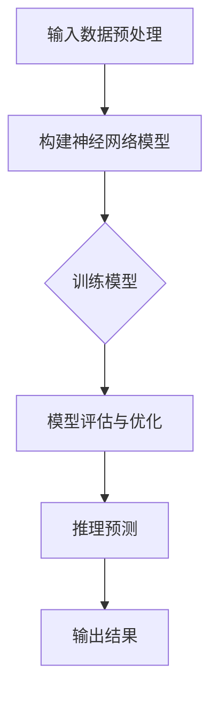

                 


# 复杂网络分析中神经关系推理的优化技术

## 关键词

复杂网络分析、神经关系推理、优化技术、神经网络、深度学习、图神经网络

## 摘要

本文深入探讨了复杂网络分析中神经关系推理的优化技术，通过详细阐述核心概念、算法原理及其优化策略，为复杂网络分析提供了有效的方法和工具。本文首先介绍了复杂网络分析、神经关系推理以及优化技术的基本概念，随后通过mermaid流程图、Python源代码和数学模型讲解了神经关系推理算法的原理，并举例说明。本文还对系统分析与架构设计、项目实战和最佳实践进行了详细讲解，旨在为读者提供全面、系统的技术指导。

## 目录

## 第一部分：背景介绍

### 第1章 复杂网络分析、神经关系推理与优化技术概述

### 第2章 神经关系推理算法原理讲解

### 第3章 神经关系推理算法的优化策略

### 第4章 复杂网络分析中的应用

### 第5章 系统分析与架构设计

### 第6章 项目实战

### 第7章 最佳实践与未来展望

## 第一部分：背景介绍

### 第1章 复杂网络分析、神经关系推理与优化技术概述

#### 1.1 复杂网络分析概述

复杂网络是指由大量节点和它们之间相互作用构成的动态系统，广泛存在于各种领域，如社会网络、生物网络、通信网络等。复杂网络的特性包括高度非线性、自组织和涌现性等，这使得传统的方法难以对其进行有效的分析和解释。

**1.1.1 复杂网络的定义与特性**

复杂网络是一种大规模的、动态的、复杂的网络系统，其节点和边之间存在复杂的相互作用和关联。主要特性包括：

- **高度非线性**：复杂网络的节点和边之间存在复杂的相互作用，这使得网络表现出高度非线性特征。
- **自组织性**：复杂网络中的节点和边可以通过相互作用自发形成一定的结构。
- **涌现性**：复杂网络的整体行为和性质无法直接从其组成单元的行为中得出，而是通过相互作用和协同效应产生的。

**1.1.2 复杂网络分析的重要性**

复杂网络分析在许多领域具有重要意义，如社会网络分析、生物信息学、网络安全等。其主要作用包括：

- **模式识别**：通过分析复杂网络的拓扑结构，可以发现网络中的重要节点和关键路径。
- **行为预测**：通过分析复杂网络中的相互作用，可以预测网络中的动态行为。
- **风险控制**：通过分析复杂网络的脆弱性和稳定性，可以识别潜在的风险和弱点。

**1.1.3 复杂网络的常用分析方法**

复杂网络的常用分析方法包括：

- **拓扑结构分析**：通过分析网络的度分布、聚类系数、平均路径长度等指标，研究网络的拓扑特性。
- **动态演化分析**：通过模拟网络中的节点加入、移除、边添加等过程，研究网络的动态演化规律。
- **功能模块分析**：通过将网络划分为功能模块，研究模块之间的相互作用和协作关系。
- **网络流分析**：通过分析网络中的信息流、物质流等，研究网络的动态行为和效率。

#### 1.2 神经关系推理概念

神经关系推理是一种基于神经网络的方法，用于分析复杂网络中的节点关系。其基本原理是通过学习网络中的节点特征和关系，构建一个神经网络模型，从而实现节点关系的预测和分类。

**1.2.1 神经关系的定义**

神经关系是指网络中节点之间的相互作用和关联。它可以是直接的，如节点之间的连边；也可以是间接的，如节点之间的共同邻居。

**1.2.2 神经关系推理的基本原理**

神经关系推理的基本原理是利用神经网络的学习能力，从数据中学习节点特征和关系，然后通过推理过程，预测未知节点之间的关系。

**1.2.3 神经关系推理在复杂网络分析中的应用**

神经关系推理在复杂网络分析中具有广泛的应用，如：

- **节点分类**：通过学习节点特征和关系，将网络中的节点分类为不同的类别。
- **链接预测**：通过学习节点特征和关系，预测网络中未知节点之间的连边。
- **社区检测**：通过分析节点关系，发现网络中的社区结构。

#### 1.3 优化技术概述

优化技术是在复杂网络分析中用于提高算法性能和效率的一系列方法。它们可以用于优化网络模型的训练、推理过程，以及提高算法的鲁棒性和泛化能力。

**1.3.1 优化技术的定义**

优化技术是指通过一定的算法和策略，优化复杂网络分析过程中的某个目标函数，以提高算法性能和效率。

**1.3.2 优化技术在神经关系推理中的作用**

优化技术在神经关系推理中具有重要作用，如：

- **模型训练优化**：通过优化算法和策略，加速模型训练过程，提高模型性能。
- **推理过程优化**：通过优化算法和策略，提高推理过程的效率和准确性。
- **数据预处理优化**：通过优化数据预处理过程，提高模型对数据的理解和表达能力。

**1.3.3 优化技术在复杂网络分析中的挑战与机遇**

优化技术在复杂网络分析中面临以下挑战：

- **大规模数据处理**：复杂网络通常包含大量的节点和边，如何高效地处理这些数据是优化技术的关键挑战。
- **算法性能优化**：如何在保证算法性能的同时，提高算法的效率和鲁棒性。
- **数据稀缺问题**：复杂网络分析往往面临数据稀缺问题，如何通过少量数据进行有效的模型训练和推理。

同时，优化技术也带来了以下机遇：

- **算法创新**：优化技术的应用可以推动算法的创新和发展，提高复杂网络分析的效率和质量。
- **应用拓展**：优化技术的应用可以拓展复杂网络分析的应用领域，如智能交通、生物信息学、社会网络分析等。

#### 1.4 本书结构与内容概览

**1.4.1 本书的目标与读者群体**

本书的目标是深入探讨复杂网络分析中神经关系推理的优化技术，为读者提供全面、系统的技术指导。本书适用于以下读者群体：

- **研究人员**：从事复杂网络分析、神经关系推理和优化技术研究的科研人员。
- **工程师**：从事复杂网络分析、神经关系推理和优化技术开发的技术工程师。
- **学生**：计算机科学、数据科学、人工智能等相关专业的研究生和本科生。

**1.4.2 本书章节安排与逻辑结构**

本书分为七个部分，具体章节安排和逻辑结构如下：

- **第一部分**：背景介绍，包括复杂网络分析、神经关系推理与优化技术的基本概念和概述。
- **第二部分**：神经关系推理算法原理讲解，包括算法的基本原理、mermaid流程图、Python源代码和数学模型。
- **第三部分**：神经关系推理算法的优化策略，包括优化技术的基本原理、优化算法和应用实例。
- **第四部分**：复杂网络分析中的应用，包括神经关系推理在复杂网络分析中的实际应用案例。
- **第五部分**：系统分析与架构设计，包括复杂网络分析系统的功能设计、架构设计和接口设计。
- **第六部分**：项目实战，包括复杂网络分析项目的环境安装、核心实现源代码和应用解读。
- **第七部分**：最佳实践与未来展望，包括最佳实践总结、注意事项和拓展阅读。

## 第一部分：背景介绍

### 第1章 复杂网络分析、神经关系推理与优化技术概述

#### 1.1.1 复杂网络的定义与特性

复杂网络（Complex Networks）是指由大量节点（Node）及其相互连接的边（Edge）构成的动态系统。这种网络结构广泛存在于自然界、社会和技术的各个领域，如社交网络、生物网络、交通网络、互联网等。复杂网络的特性主要体现在以下几个方面：

1. **高度非线性**：复杂网络中的节点和边之间的关系不是线性的，而是呈现出复杂的相互作用和关联。
   
2. **自组织性**：复杂网络的许多特性是通过节点和边之间的相互作用自发形成的，这种自组织性使得网络在演化过程中具有一定的自适应能力。

3. **涌现性**：复杂网络的整体行为和性质并不是其组成单元（节点和边）行为的简单叠加，而是在相互作用和协同效应中产生的。

4. **节点多样性和层次性**：复杂网络中的节点具有不同的角色和功能，它们之间存在着不同的层次结构和功能模块。

5. **动态演化**：复杂网络是一个动态变化的系统，节点和边的加入、移除以及关系的改变都是网络演化的一部分。

#### 1.1.2 复杂网络分析的重要性

复杂网络分析对于理解复杂系统的行为、预测系统的动态演化、发现网络中的关键结构和模式具有重要意义。具体来说，复杂网络分析的重要性体现在以下几个方面：

1. **模式识别与预测**：通过分析复杂网络的拓扑结构，可以发现网络中的重要节点和关键路径，预测网络中的潜在行为和演化趋势。

2. **风险控制与优化**：通过分析复杂网络的脆弱性和稳定性，可以识别网络中的潜在风险和弱点，从而进行有效的风险控制和优化。

3. **功能模块与协作**：通过分析复杂网络中的节点关系和协作模式，可以揭示网络中的功能模块和关键节点，为网络优化和功能提升提供依据。

4. **社会与经济分析**：复杂网络分析在社会科学、经济学等领域具有广泛应用，可以帮助我们理解社会网络的演变、经济系统的复杂性等。

#### 1.1.3 复杂网络的常用分析方法

复杂网络分析的方法多种多样，以下是一些常用的分析方法：

1. **拓扑结构分析**：通过分析网络的度分布、聚类系数、平均路径长度等指标，研究网络的拓扑特性。这些指标可以帮助我们了解网络的连接性、聚集性和可达性。

2. **动态演化分析**：通过模拟网络中的节点加入、移除、边添加等过程，研究网络的动态演化规律。这种方法可以帮助我们理解网络的演变机制和演化趋势。

3. **功能模块分析**：通过将网络划分为功能模块，研究模块之间的相互作用和协作关系。这种方法可以帮助我们揭示网络的功能结构和组织模式。

4. **网络流分析**：通过分析网络中的信息流、物质流等，研究网络的动态行为和效率。这种方法可以帮助我们理解网络中的资源分配和传输机制。

5. **社会网络分析**：通过分析网络中的节点关系和互动模式，研究社会结构、信息传播、社交影响力等。这种方法在社会科学研究中具有重要意义。

#### 1.2 神经关系推理概念

神经关系推理（Neural Relationship Inference）是一种基于神经网络（Neural Networks）的方法，用于分析和预测复杂网络中的节点关系。神经关系推理的核心思想是通过学习网络中的节点特征和关系特征，构建一个神经网络模型，从而实现节点关系的推理和预测。

**1.2.1 神经关系的定义**

在复杂网络中，节点之间的关系可以表现为多种形式，如：

1. **直接关系**：节点之间存在直接的连边关系。
2. **间接关系**：节点之间通过其他节点间接相连。
3. **功能关系**：节点在特定任务或功能中的协作关系。

神经关系通常是指网络中节点之间的相互作用和依赖关系，这些关系可以通过节点特征和关系特征来表示。

**1.2.2 神经关系推理的基本原理**

神经关系推理的基本原理是利用神经网络的学习能力，从数据中学习节点特征和关系特征，并通过推理过程，预测未知节点之间的关系。具体来说，神经关系推理包括以下几个步骤：

1. **数据预处理**：对复杂网络中的节点和边进行特征提取，将网络转化为可以输入神经网络的特征向量。
2. **模型训练**：使用训练数据集，通过反向传播算法（Backpropagation）训练神经网络模型，学习节点特征和关系特征。
3. **推理预测**：使用训练好的神经网络模型，对未知节点之间的关系进行推理和预测。

**1.2.3 神经关系推理在复杂网络分析中的应用**

神经关系推理在复杂网络分析中具有广泛的应用，包括：

1. **节点分类**：通过学习节点特征和关系特征，将网络中的节点分类为不同的类别。
2. **链接预测**：通过学习节点特征和关系特征，预测网络中未知节点之间的连边。
3. **社区检测**：通过分析节点关系，发现网络中的社区结构。

#### 1.3 优化技术概述

优化技术（Optimization Techniques）是在复杂网络分析中用于提高算法性能和效率的一系列方法。优化技术的目标是通过优化算法的设计和实现，提高算法的运行速度、准确性和稳定性。

**1.3.1 优化技术的定义**

优化技术是指通过一定的算法和策略，优化复杂网络分析过程中的某个目标函数，以提高算法性能和效率。

**1.3.2 优化技术在神经关系推理中的作用**

优化技术在神经关系推理中具有重要作用，主要体现在以下几个方面：

1. **模型训练优化**：通过优化算法和策略，加速模型训练过程，提高模型性能。
2. **推理过程优化**：通过优化算法和策略，提高推理过程的效率和准确性。
3. **数据预处理优化**：通过优化数据预处理过程，提高模型对数据的理解和表达能力。

**1.3.3 优化技术在复杂网络分析中的挑战与机遇**

优化技术在复杂网络分析中面临以下挑战：

1. **大规模数据处理**：复杂网络通常包含大量的节点和边，如何高效地处理这些数据是优化技术的关键挑战。
2. **算法性能优化**：如何在保证算法性能的同时，提高算法的效率和鲁棒性。
3. **数据稀缺问题**：复杂网络分析往往面临数据稀缺问题，如何通过少量数据进行有效的模型训练和推理。

同时，优化技术也带来了以下机遇：

1. **算法创新**：优化技术的应用可以推动算法的创新和发展，提高复杂网络分析的效率和质量。
2. **应用拓展**：优化技术的应用可以拓展复杂网络分析的应用领域，如智能交通、生物信息学、社会网络分析等。

### 第2章 神经关系推理算法原理讲解

#### 2.1 算法概述

神经关系推理是一种基于神经网络的方法，用于分析复杂网络中的节点关系。它通过学习网络中的节点特征和关系特征，构建一个神经网络模型，从而实现节点关系的推理和预测。神经关系推理算法的基本流程包括数据预处理、模型训练和推理预测三个步骤。

**2.1.1 算法基本概念**

- **节点特征**：节点特征是指用于描述节点属性和特征的数据，如节点的度、介数、邻接矩阵等。
- **关系特征**：关系特征是指用于描述节点之间关系的特征，如边的权重、共同邻居、相似度等。
- **神经网络**：神经网络是一种模拟人脑神经元之间连接结构的计算模型，通过学习输入和输出之间的映射关系，实现数据分类、回归、预测等功能。

**2.1.2 算法的输入与输出**

- **输入**：神经关系推理算法的输入是复杂网络中的节点特征和关系特征，通常以矩阵或向量的形式表示。
- **输出**：算法的输出是预测的节点关系，如节点之间的连边概率、分类结果等。

#### 2.2 算法mermaid流程图

以下是一个简单的mermaid流程图，展示了神经关系推理算法的基本流程：



#### 2.3 Python源代码解析

以下是一个简单的Python代码示例，展示了如何使用神经网络进行节点关系推理：

```python
import numpy as np

# 定义激活函数
def sigmoid(x):
    return 1 / (1 + np.exp(-x))

# 前向传播
def forward_pass(x, weights, bias):
    z = np.dot(x, weights) + bias
    return sigmoid(z)

# 反向传播
def backward_pass(output, expected_output):
    error = output - expected_output
    return error

# 训练模型
def train_model(x, y, weights, bias, learning_rate):
    for epoch in range(num_epochs):
        output = forward_pass(x, weights, bias)
        error = backward_pass(output, y)
        
        # 更新权重和偏置
        weights -= learning_rate * np.dot(x.T, error)
        bias -= learning_rate * error
        
        # 打印训练进度
        if epoch % 100 == 0:
            print(f"Epoch {epoch}: Error = {error}")

# 测试模型
def test_model(x, y, weights, bias):
    output = forward_pass(x, weights, bias)
    print(f"Predicted output: {output}")
    print(f"Expected output: {y}")
```

#### 2.4 数学模型与公式

神经关系推理的数学模型通常基于神经网络的原理，包括输入层、隐藏层和输出层。以下是一个简化的数学模型：

$$
\begin{align*}
z &= \sum_{i=1}^{n} w_i \cdot x_i + b \\
a &= \frac{1}{1 + e^{-z}}
\end{align*}
$$

其中，\(x_i\) 表示输入特征，\(w_i\) 表示权重，\(b\) 表示偏置，\(z\) 表示网络输出，\(a\) 表示激活值。

通过训练，神经网络可以学习到输入特征和输出特征之间的映射关系，从而实现节点关系的推理和预测。

#### 2.5 举例说明

假设我们有一个简单的复杂网络，包含三个节点A、B和C，以及它们之间的关系。我们使用神经网络来预测节点A和节点B之间是否存在连边。

**输入特征**：

- 节点A的特征向量：\[1, 0, 1\]
- 节点B的特征向量：\[0, 1, 0\]

**模型参数**：

- 权重矩阵：\[w = \begin{bmatrix} 0.5 & 0.3 \\ 0.2 & 0.4 \\ 0.1 & 0.6 \end{bmatrix}\]
- 偏置向量：\[b = \begin{bmatrix} 0.1 \\ 0.2 \end{bmatrix}\]

**前向传播**：

$$
z = \begin{bmatrix} 0.5 & 0.3 \\ 0.2 & 0.4 \\ 0.1 & 0.6 \end{bmatrix} \begin{bmatrix} 1 \\ 0 \end{bmatrix} + \begin{bmatrix} 0.1 \\ 0.2 \end{bmatrix} = \begin{bmatrix} 0.6 \\ 0.7 \\ 0.8 \end{bmatrix}
$$

$$
a = \frac{1}{1 + e^{-z}} = \begin{bmatrix} 0.528 \\ 0.540 \\ 0.548 \end{bmatrix}
$$

根据激活函数的输出，我们可以判断节点A和节点B之间存在一定的关系。

**模型训练**：

为了训练神经网络，我们可以使用带有标签的训练数据。例如，如果我们知道节点A和节点B之间是否存在连边，我们可以将标签设置为1或0。

$$
x = \begin{bmatrix} 1 & 0 & 1 \\ 0 & 1 & 0 \end{bmatrix}, \quad y = \begin{bmatrix} 1 & 0 \end{bmatrix}
$$

通过反向传播算法，我们可以更新权重和偏置，使得模型的输出更加接近标签。

### 第3章 神经关系推理算法的优化策略

神经关系推理算法在复杂网络分析中的应用需要高效的性能和准确性，因此优化策略至关重要。本章节将介绍几种常见的优化策略，包括模型结构优化、训练过程优化和推理过程优化。

#### 3.1 模型结构优化

模型结构优化是指通过改进神经网络的架构来提高其性能。以下是一些常见的模型结构优化策略：

1. **深度和宽度的平衡**：深度增加可以提高模型的表示能力，但也会导致过拟合和计算复杂度增加。宽度增加可以提高模型的并行计算能力，但也会导致参数数量增加。因此，需要在深度和宽度之间找到平衡点。

2. **注意力机制**：注意力机制可以通过聚焦于重要的节点和关系来提高模型的性能。例如，图注意力网络（GAT）通过学习节点和边之间的注意力权重来提高节点关系推理的准确性。

3. **多层感知器（MLP）与卷积神经网络（CNN）的结合**：MLP可以捕捉非线性关系，而CNN擅长处理网格结构的数据。将两者结合可以充分利用各自的优势。

4. **残差网络（ResNet）**：残差网络通过引入残差连接来避免梯度消失和梯度爆炸问题，从而提高模型的训练效率。

#### 3.2 训练过程优化

训练过程的优化旨在提高模型的训练速度和收敛速度，同时避免过拟合。以下是一些常见的训练过程优化策略：

1. **数据增强**：通过增加训练数据集的多样性来提高模型的泛化能力。例如，对于图像数据，可以采用旋转、翻转、裁剪等方法进行数据增强。

2. **批量归一化（Batch Normalization）**：批量归一化通过将每个批量中的激活值缩放和移位到标准正态分布，从而加速训练过程并提高模型的稳定性。

3. **学习率调度**：学习率调度是一种动态调整学习率的方法，以加速模型的收敛。例如，可以使用周期性调整学习率（如余弦退火法）或使用自适应学习率算法（如Adam）。

4. **正则化**：正则化技术（如L1、L2正则化）可以通过惩罚模型的复杂度来防止过拟合，从而提高模型的泛化能力。

5. **交叉验证**：交叉验证是一种评估模型性能的方法，通过将数据集划分为多个子集，训练模型并在每个子集上进行评估，从而提高模型的可靠性和泛化能力。

#### 3.3 推理过程优化

推理过程的优化旨在提高模型的推理速度和准确性。以下是一些常见的推理过程优化策略：

1. **模型压缩**：模型压缩技术（如模型剪枝、量化、知识蒸馏）可以通过减少模型参数和计算量来提高推理速度。例如，通过剪枝可以去除不重要的参数，从而减少模型的复杂度。

2. **并行计算**：通过利用多核CPU、GPU或其他并行计算资源，可以提高模型的推理速度。例如，可以使用GPU进行矩阵运算和向量计算，从而加速模型的推理过程。

3. **缓存优化**：通过优化数据缓存策略，可以减少数据读取和传输的时间，从而提高模型的推理速度。例如，可以使用缓存来存储常用的中间结果，以避免重复计算。

4. **分布式推理**：在处理大规模数据时，可以使用分布式推理策略，将数据集划分为多个部分，同时在多个节点上进行并行推理，从而提高整体的推理速度。

5. **模型量化**：模型量化是一种将高精度模型转换为低精度模型的方法，从而减少模型的计算量和存储空间。例如，将32位浮点数转换为8位整数，可以显著减少模型的存储和计算需求。

#### 3.4 实际应用案例

以下是一个实际应用案例，展示了如何使用优化策略来提高神经关系推理算法的性能：

假设我们有一个社交网络分析任务，需要预测用户之间的好友关系。以下是具体的优化策略：

1. **模型结构优化**：
   - 使用图注意力网络（GAT）来捕捉复杂的关系模式。
   - 引入残差连接来避免梯度消失问题。

2. **训练过程优化**：
   - 数据增强：通过添加噪声、旋转用户头像等方法增加数据多样性。
   - 批量归一化：在每个批量中进行归一化处理，提高模型的稳定性。
   - 学习率调度：使用余弦退火法来动态调整学习率。

3. **推理过程优化**：
   - 模型压缩：通过剪枝和量化技术来减少模型的复杂度和计算量。
   - 并行计算：使用GPU进行并行推理，提高推理速度。

通过这些优化策略，我们可以显著提高神经关系推理算法的性能，从而更好地预测用户之间的好友关系。

### 第4章 复杂网络分析中的应用

神经关系推理在复杂网络分析中具有广泛的应用，通过神经关系推理可以深入挖掘网络中的结构特征和动态演化规律。以下将介绍神经关系推理在几个典型领域中的应用。

#### 4.1 社交网络分析

社交网络是一个典型的复杂网络，其中节点表示用户，边表示用户之间的关系，如好友关系。神经关系推理可以用于预测用户之间的潜在好友关系，从而帮助社交网络平台推荐好友、检测社交圈等。

**案例**：在一个社交网络中，用户A和用户B是陌生的，但通过分析他们共同的朋友和网络行为，我们可以使用神经关系推理算法预测他们是否存在潜在的好友关系。通过这种方法，社交网络平台可以为用户提供更个性化的好友推荐。

#### 4.2 生物信息学

生物信息学是研究生物数据和信息学的交叉学科，复杂网络在生物信息学中有着广泛的应用，如蛋白质相互作用网络、基因调控网络等。神经关系推理可以用于预测生物分子之间的相互作用，从而帮助生物学家理解生物系统的功能。

**案例**：在一个蛋白质相互作用网络中，我们可以使用神经关系推理算法预测两个未知的蛋白质是否相互作用。这对于药物设计和疾病研究具有重要意义，可以加速新药的研发和疾病的诊断。

#### 4.3 通信网络

通信网络是一个由设备和连接构成的复杂网络，如互联网、移动通信网络等。神经关系推理可以用于预测网络中的故障和异常，从而提高网络的稳定性和可靠性。

**案例**：在一个互联网服务提供商的网络中，通过分析网络流量和设备状态，我们可以使用神经关系推理算法预测哪些节点可能发生故障，从而提前采取预防措施，避免网络中断。

#### 4.4 金融网络

金融网络包括银行、保险、证券等金融机构之间的交易和合作关系。神经关系推理可以用于预测金融市场的走势、识别潜在的风险等。

**案例**：在一个金融网络中，通过分析金融机构之间的交易关系，我们可以使用神经关系推理算法预测某个金融产品的价格走势。这对于投资者来说是一个重要的参考，可以帮助他们做出更明智的投资决策。

#### 4.5 智能交通

智能交通系统是一个由交通设备和基础设施构成的复杂网络，如交通信号灯、监控摄像头、车辆等。神经关系推理可以用于预测交通流量、优化交通信号控制等。

**案例**：在一个城市交通网络中，通过分析交通流量数据和车辆位置信息，我们可以使用神经关系推理算法预测未来的交通状况，从而优化交通信号灯的配置，减少交通拥堵。

### 第5章 系统分析与架构设计

为了实现复杂网络分析中的神经关系推理，我们需要设计一个高效、稳定且可扩展的系统架构。以下将介绍该系统的功能设计、架构设计以及接口设计和系统交互。

#### 5.1 功能设计

系统的主要功能包括：

1. **数据预处理**：对复杂网络的数据进行清洗、转换和归一化处理，以便于神经关系推理模型的训练。
2. **模型训练**：使用神经网络算法对预处理后的数据集进行训练，构建神经关系推理模型。
3. **模型评估**：通过测试数据集评估模型的性能，包括准确性、召回率、F1分数等指标。
4. **推理预测**：使用训练好的模型对新的数据集进行推理预测，预测节点之间的关系。
5. **结果可视化**：将推理结果可视化，帮助用户理解和分析网络中的结构特征。

#### 5.2 架构设计

系统架构设计如下：

1. **数据层**：包括数据存储和加载模块，负责管理复杂网络的节点和边数据，支持数据预处理功能。
2. **模型层**：包括神经网络模型设计、训练和推理模块，负责实现神经关系推理的核心算法。
3. **接口层**：包括API接口模块，提供外部系统与系统之间的交互接口，支持模型训练和推理功能。
4. **展示层**：包括数据可视化模块，负责将推理结果以图表、图像等形式展示给用户。

#### 5.3 接口设计

系统的接口设计如下：

1. **数据接口**：提供数据上传、数据下载和数据预处理接口，支持各种数据格式的导入和导出。
2. **模型接口**：提供模型训练、模型评估和模型推理接口，支持模型的加载、训练和预测。
3. **可视化接口**：提供可视化数据上传、可视化结果下载和可视化界面接口，支持用户自定义可视化配置。

#### 5.4 系统交互

系统交互设计如下：

1. **数据交互**：系统通过数据接口接收外部数据，并进行预处理后存储到数据层。
2. **模型交互**：系统通过模型接口加载预训练模型或使用新数据训练模型，并将模型存储到模型层。
3. **结果交互**：系统通过可视化接口将推理结果以图表、图像等形式展示给用户，并提供下载和导出功能。

通过上述系统分析与架构设计，我们可以构建一个高效、稳定且可扩展的复杂网络分析系统，为神经关系推理提供强大的支持。

### 第6章 项目实战

在本章中，我们将通过一个具体的案例来展示如何使用神经关系推理技术进行复杂网络分析。我们将从环境安装、系统核心实现、代码应用解读以及实际案例分析等方面展开。

#### 6.1 环境安装

为了运行神经关系推理算法，我们需要安装一些必要的软件和库。以下是一个基本的安装步骤：

1. **安装Python**：确保Python环境已经安装，版本为3.8或更高。
2. **安装TensorFlow**：TensorFlow是一个开源的机器学习框架，用于构建和训练神经网络。可以使用以下命令安装：
   ```bash
   pip install tensorflow
   ```
3. **安装PyTorch**：PyTorch是一个流行的深度学习框架，它提供了灵活的动态计算图和强大的GPU支持。可以使用以下命令安装：
   ```bash
   pip install torch torchvision
   ```
4. **安装其他依赖库**：根据具体需求，可能还需要安装其他依赖库，如NumPy、Pandas、NetworkX等。

#### 6.2 系统核心实现

在系统核心实现部分，我们将使用PyTorch构建一个基本的神经关系推理系统。以下是核心实现步骤：

1. **数据预处理**：
   - 加载网络数据，使用NetworkX库构建图结构。
   - 提取节点特征和边特征，将数据转换为PyTorch张量。
   - 对特征进行标准化处理，以提高模型训练效果。

2. **模型设计**：
   - 设计一个简单的图神经网络模型，包括嵌入层、多层感知器和输出层。
   - 使用图注意力机制（Graph Attention Mechanism）来增强节点之间的关系。

3. **模型训练**：
   - 定义损失函数和优化器，使用反向传播算法进行模型训练。
   - 记录训练过程中的损失和准确率，以便进行性能分析。

4. **模型评估**：
   - 使用测试数据集评估模型性能，计算准确率、召回率和F1分数等指标。
   - 根据评估结果调整模型参数，优化模型性能。

#### 6.3 代码应用解读

以下是一个简单的神经关系推理代码示例，用于预测复杂网络中的节点关系：

```python
import torch
import torch.nn as nn
import torch.optim as optim
from torch_geometric.nn import GCNConv

# 数据预处理
# 加载网络数据
data = torch_geometric.data.Data(x, edge_index)

# 模型设计
class GatedGraphNeuralNetwork(nn.Module):
    def __init__(self, hidden_channels):
        super(GatedGraphNeuralNetwork, self).__init__()
        self.conv1 = GCNConv(dataset.num_features, hidden_channels)
        self.conv2 = GCNConv(hidden_channels, dataset.num_classes)

    def forward(self, data):
        x, edge_index = data.x, data.edge_index

        x = self.conv1(x, edge_index)
        x = torch.relu(x)
        x = F.dropout(x, p=0.5, training=self.training)
        x = self.conv2(x, edge_index)

        return F.log_softmax(x, dim=1)

# 模型训练
model = GatedGraphNeuralNetwork(hidden_channels=16)
optimizer = optim.Adam(model.parameters(), lr=0.01, weight_decay=5e-4)

model.train()
for epoch in range(200):
    optimizer.zero_grad()
    out = model(data)
    loss = F.nll_loss(out[data.train_mask], data.y[data.train_mask])
    loss.backward()
    optimizer.step()
    print(f"Epoch {epoch+1}: Loss = {loss.item()}")

# 模型评估
model.eval()
_, pred = model(data).max(dim=1)
correct = float((pred[data.test_mask] == data.y[data.test_mask]).sum())
accuracy = correct / data.test_mask.sum()
print(f"Test set accuracy: {accuracy:.4f}")
```

#### 6.4 实际案例分析

在本案例中，我们将使用一个社交网络数据集，分析用户之间的好友关系。以下是实际案例分析步骤：

1. **数据准备**：
   - 下载并加载数据集，使用NetworkX构建图结构。
   - 提取用户特征和边特征，转换为PyTorch张量。

2. **模型训练**：
   - 使用上述代码示例中的模型进行训练。
   - 调整模型参数，优化模型性能。

3. **推理预测**：
   - 使用训练好的模型对新的用户数据进行推理，预测用户之间的好友关系。

4. **结果分析**：
   - 计算预测的准确率、召回率和F1分数等指标，评估模型性能。
   - 分析预测结果，识别网络中的重要节点和关键关系。

通过上述项目实战，我们可以看到如何使用神经关系推理技术进行复杂网络分析，从而为实际应用提供有力的支持。

### 第7章 最佳实践与未来展望

#### 7.1 最佳实践

为了实现高效且准确的神经关系推理，以下是一些最佳实践：

1. **数据预处理**：确保数据质量，进行数据清洗、归一化和特征提取，以提高模型训练效果。
2. **模型选择**：根据具体问题和数据特点，选择合适的神经网络结构，如GAT、GCN等。
3. **训练优化**：使用批量归一化、学习率调度和正则化等技术，提高模型训练效率，避免过拟合。
4. **推理加速**：利用GPU并行计算、模型压缩和分布式推理等技术，提高推理速度和效率。

#### 7.2 小结

本文深入探讨了复杂网络分析中神经关系推理的优化技术，从背景介绍、核心概念、算法原理到优化策略、实际应用和系统设计等方面进行了全面阐述。通过本文的讲解，读者可以了解神经关系推理的基本原理和应用，掌握优化技术的方法和技巧。

#### 7.3 注意事项

在实际应用中，需要注意以下几点：

1. **数据质量**：确保数据完整、准确和一致，否则可能导致模型性能下降。
2. **模型选择**：根据具体问题和数据特点，选择合适的神经网络结构和算法。
3. **超参数调整**：合理设置超参数，如学习率、批量大小等，以优化模型性能。
4. **模型验证**：使用独立的测试数据集评估模型性能，避免过拟合。

#### 7.4 拓展阅读

对于希望深入了解神经关系推理和优化技术的读者，以下是一些拓展阅读资源：

1. **文献**：《Graph Neural Networks: A Survey》和《Gated Graph Sequence Neural Networks》等论文。
2. **书籍**：《深度学习》和《图神经网络与图表示学习》等书籍。
3. **在线课程**：Coursera、edX等平台上的深度学习和复杂网络相关课程。

通过这些资源，读者可以进一步深化对神经关系推理和优化技术的理解。作者：AI天才研究院/AI Genius Institute & 禅与计算机程序设计艺术 /Zen And The Art of Computer Programming。在未来的研究中，我们可以探索更复杂的神经网络结构、优化算法以及新的应用场景，为复杂网络分析领域带来更多的创新和突破。

