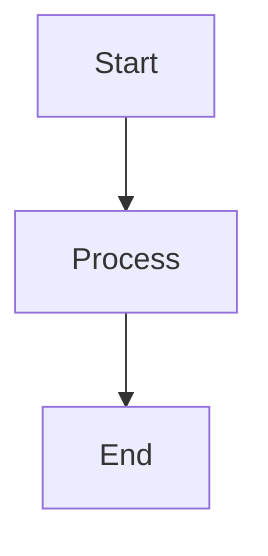
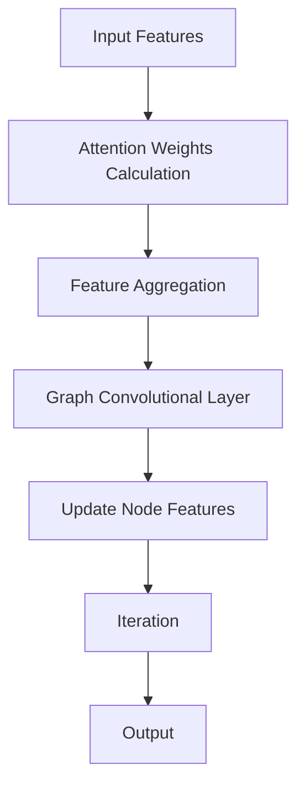
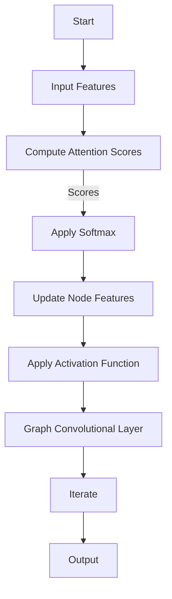
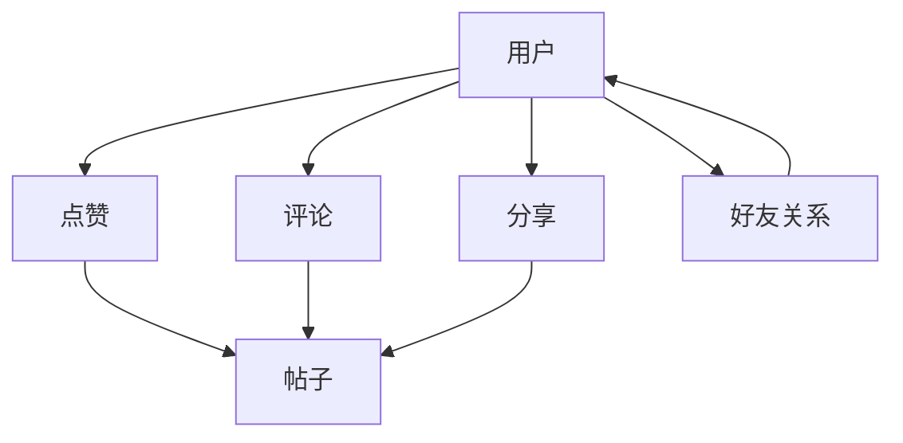
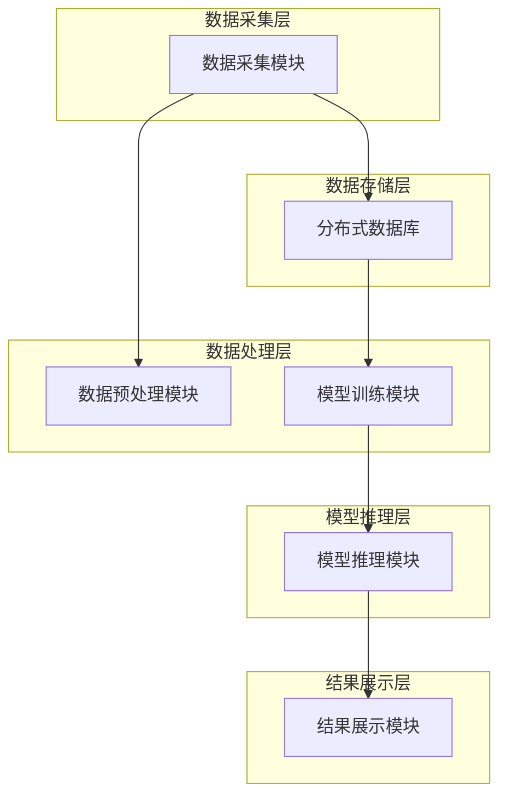
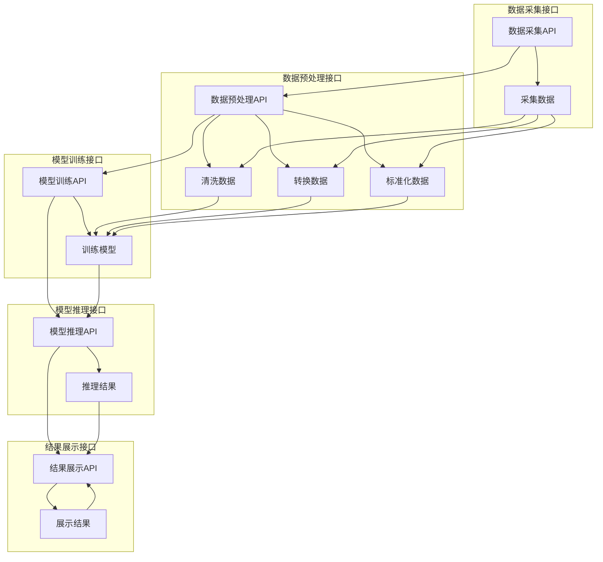
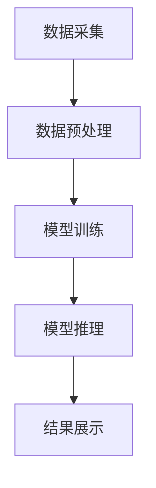

                 

## 第一部分: 背景与核心概念

### 1.1 多关系推理概述

#### 1.1.1 多关系推理的定义

多关系推理（Multi-Relation Reasoning）是一种人工智能技术，主要用于处理复杂关系网络中的推理任务。它不仅涉及单一实体之间的直接关系，还包括间接关系以及多个实体之间的多重交互。简单来说，多关系推理的目标是从给定的数据中推断出隐藏的或者未被直接表达的关系。

定义上，多关系推理可以表述为：给定一组实体及其属性，以及它们之间复杂的相互关系，通过逻辑推理和模型计算，预测出未知的实体关系或属性。这一过程涉及到多个层次的信息整合，如图关系、语义关系和因果推理等。

#### 1.1.2 多关系推理的应用场景

多关系推理在多个领域有着广泛的应用场景，主要包括：

1. **社交网络分析**：分析用户之间的关系，识别社群结构，预测用户行为等。
2. **推荐系统**：根据用户的兴趣和购买历史，推荐符合其需求的产品或内容。
3. **知识图谱**：构建和优化大型知识图谱，通过推理发现新的事实或实体关系。
4. **金融风控**：分析金融交易网络，识别潜在的欺诈行为。
5. **生物信息学**：研究基因与蛋白质之间的相互作用关系。

#### 1.1.3 多关系推理的挑战

尽管多关系推理在许多领域具有潜在价值，但其实现面临着一系列挑战：

1. **数据复杂性**：多关系推理通常需要处理大量复杂、异构的数据。
2. **关系多样性**：实体之间可能存在多种类型的复杂关系，这使得推理过程变得复杂。
3. **计算效率**：多关系推理需要大量的计算资源，尤其是在大规模数据集上。
4. **语义理解**：准确理解和处理语义关系是推理任务的关键，但这对模型的语义表示和推理能力提出了高要求。

### 1.2 图注意力网络（GAT）概述

#### 1.2.1 GAT的定义

图注意力网络（Graph Attention Network，GAT）是一种用于图数据分析的深度学习模型，由Petralchuk等人在2018年提出。GAT的主要目的是通过引入注意力机制来提高图模型对图中节点和边之间的关系的建模能力。

定义上，GAT可以看作是一个包含多个图卷积层的神经网络，每一层的节点表示通过学习到的权重（即注意力权重）与图中其他节点进行交互，从而生成新的节点表示。

#### 1.2.2 GAT的特点

GAT具有以下几个显著特点：

1. **自注意力机制**：GAT引入了自注意力机制，使得节点能够关注到图中其他节点的特征，从而更好地捕捉节点之间的关系。
2. **可扩展性**：GAT可以处理具有不同类型节点和边的图数据，具有很好的可扩展性。
3. **适用于异构图**：GAT可以处理异构图，即图中存在不同类型的节点和边，这使得其在多种应用场景中具有广泛的应用性。
4. **适用于多关系推理**：由于GAT能够有效建模节点之间的关系，因此其在多关系推理任务中具有很好的性能。

#### 1.2.3 GAT在多关系推理中的应用

GAT在多关系推理任务中的应用主要体现在以下几个方面：

1. **节点分类**：使用GAT模型对图中的节点进行分类，例如在知识图谱中分类实体。
2. **关系预测**：利用GAT模型预测图中未知的实体关系，例如在社交网络中预测用户之间的友谊关系。
3. **图生成**：通过GAT模型生成新的图结构，从而构建知识图谱或社交网络。

### 1.3 GAT核心概念与组成部分

#### 1.3.1 GAT的输入与输出

GAT的输入包括图结构（节点和边）以及节点和边的特征表示。每个节点的特征表示通常是一个向量，而边的特征表示则可以是边的权重或边类型。

GAT的输出是每个节点的更新特征表示，这些表示可以用于后续的图分析任务，如图分类、关系预测等。

#### 1.3.2 自注意力机制

自注意力机制是GAT的核心组成部分，它通过计算每个节点与其邻接节点的注意力权重，来更新节点的特征表示。具体来说，自注意力机制包括以下几个步骤：

1. **计算注意力分数**：对于每个节点，计算其与图中所有其他节点的相似度分数，通常使用点积或余弦相似度。
2. **应用软化函数**：将注意力分数通过softmax函数转化为概率分布，使得每个节点能够关注到不同重要程度的邻接节点。
3. **计算加权特征表示**：根据注意力权重，将邻接节点的特征表示加权求和，得到更新后的节点特征表示。

#### 1.3.3 图卷积层

图卷积层（Graph Convolutional Layer，GCL）是GAT的基础层，负责将输入的节点特征表示通过邻接节点进行更新。GCL的计算过程可以分为以下几个步骤：

1. **计算邻接节点特征**：对于每个节点，计算其邻接节点的特征表示的平均值或加权和。
2. **应用非线性激活函数**：通常使用ReLU等激活函数来引入非线性特性。
3. **特征变换**：将更新后的特征表示通过一个全连接层进行变换，得到新的节点特征表示。

#### 1.3.4 GAT的组成部分对比表

下面是GAT的核心组成部分的对比表：

|组成部分|描述|作用|
|:---:|:---:|:---:|
|节点特征|表示节点属性|初始化节点特征表示|
|边特征|表示节点之间的关系|定义节点间的交互权重|
|自注意力机制|计算节点与其邻接节点的相似度|更新节点特征表示|
|图卷积层|聚合邻接节点的特征|学习节点之间的关系|
|全连接层|特征变换|提高模型的表示能力|

### 1.4 GAT的ER实体关系图架构

#### 1.4.1 ER模型的基本概念

实体-关系（Entity-Relationship，ER）模型是数据库设计中用于表示实体及其关系的一种图形化方法。它由三个基本元素组成：实体（Entity）、属性（Attribute）和关系（Relationship）。

- **实体**：表示具有独立存在的个体，如人、地点、事物等。
- **属性**：表示实体的特征或描述，如人的年龄、地址等。
- **关系**：表示实体之间的关联，如朋友关系、工作关系等。

#### 1.4.2 GAT的ER实体关系图

在GAT的ER实体关系图中，实体对应于图中的节点，而关系对应于图中的边。具体来说，GAT的ER实体关系图包括以下几个关键组成部分：

1. **实体节点**：表示知识图谱中的实体，如人、地点、物品等。
2. **关系边**：表示实体之间的交互或关联，如朋友关系、购买关系等。
3. **属性节点**：表示实体的属性特征，如人的年龄、地址等。
4. **属性边**：表示实体与其属性之间的关联。

#### 1.4.3 ER实体关系图在GAT中的作用

ER实体关系图在GAT中起到了以下几个关键作用：

1. **数据表示**：通过ER实体关系图，可以将复杂的多关系数据结构转化为图的形式，便于模型处理。
2. **关系建模**：ER实体关系图中的边和属性可以用于建模实体之间的关系和属性特征，从而提高模型的语义理解能力。
3. **信息聚合**：通过ER实体关系图，可以有效地聚合实体和关系的信息，为后续的图分析任务提供高质量的数据基础。

### 1.5 本章小结

本章介绍了多关系推理和图注意力网络（GAT）的基本概念，并详细阐述了它们在多关系推理任务中的应用。通过本章的学习，读者可以了解到多关系推理的定义、应用场景以及挑战，同时理解GAT的核心概念和组成部分，以及ER实体关系图在GAT中的作用。

在接下来的章节中，我们将进一步深入探讨GAT的算法原理、数学模型、系统架构设计、项目实战和最佳实践，帮助读者全面掌握GAT在多关系推理中的效率提升方法。

## 第二部分: 算法原理与数学模型

### 2.1 GAT算法原理概述

#### 2.1.1 GAT的基本工作原理

图注意力网络（Graph Attention Network，GAT）是一种用于处理图数据的神经网络模型，其核心思想是利用注意力机制来建模图中的节点关系。GAT通过学习节点之间的交互权重，使得模型能够自适应地关注到图中的重要节点和边。

GAT的基本工作原理可以概括为以下几个步骤：

1. **输入表示**：每个节点和边都有其特征表示，这些特征表示可以是原始的属性信息或经过预处理的向量。
2. **自注意力机制**：每个节点根据其特征和邻接节点的特征计算注意力权重，通过加权求和得到更新后的节点特征。
3. **图卷积层**：对更新后的节点特征进行聚合，生成新的节点表示。
4. **多层迭代**：重复上述过程，通过多层图卷积层逐步学习节点之间的复杂关系。
5. **输出层**：将最终得到的节点特征用于分类、回归或其他任务。

#### 2.1.2 GAT的算法流程

GAT的算法流程可以简化为以下几个主要步骤：

1. **初始化**：输入节点特征矩阵和边特征矩阵。
2. **计算注意力权重**：对于每个节点，计算其与邻接节点的注意力权重。
3. **加权求和**：根据注意力权重，对邻接节点的特征进行加权求和，得到更新后的节点特征。
4. **图卷积层更新**：将更新后的节点特征输入到图卷积层，进行特征聚合。
5. **多层迭代**：重复上述步骤，进行多层迭代，逐步学习节点之间的复杂关系。
6. **输出**：根据最终得到的节点特征，进行分类、回归等任务。

#### 2.1.3 GAT的优势与局限性

GAT具有以下优势：

1. **灵活的注意力机制**：GAT利用自注意力机制，能够自适应地关注到图中的关键节点和边，提高模型的表示能力。
2. **强大的图结构理解能力**：通过多层图卷积层，GAT能够深入挖掘图中的结构信息，从而提高模型的性能。
3. **适用于异构图**：GAT可以处理不同类型的节点和边，具有很好的可扩展性。

然而，GAT也存在一些局限性：

1. **计算复杂度**：由于需要计算大量的注意力权重，GAT的计算复杂度较高，尤其是在大规模图数据上。
2. **训练时间**：GAT的训练时间较长，需要大量的计算资源和时间。

### 2.2 自注意力机制详解

#### 2.2.1 自注意力机制的数学模型

自注意力机制（Self-Attention）是GAT的核心组成部分，它通过计算节点与其邻接节点的相似度来更新节点特征。自注意力机制的数学模型可以表示为：

$$
\text{Attention}(Q, K, V) = \text{softmax}\left(\frac{QK^T}{\sqrt{d_k}}\right) V
$$

其中，$Q, K, V$ 分别表示查询向量、关键向量和价值向量，$d_k$ 是关键向量的维度。$QK^T$ 表示点积，计算节点之间的相似度，通过softmax函数得到注意力权重，最后与价值向量相乘得到更新后的节点特征。

#### 2.2.2 自注意力机制的实现方法

自注意力机制的实现可以分为以下几个步骤：

1. **计算相似度**：计算每个节点与其邻接节点的相似度，通常使用点积或余弦相似度。
2. **应用软化函数**：将相似度分数通过softmax函数转化为概率分布，得到注意力权重。
3. **计算加权特征表示**：根据注意力权重，对邻接节点的特征进行加权求和，得到更新后的节点特征。

以下是一个简单的Python代码实现示例：

```python
import torch
import torch.nn as nn

# 假设输入的特征矩阵维度为 (N, D)
Q = K = V = nn.Parameter(torch.randn(N, D))

# 计算相似度
scores = torch.matmul(Q, K.t()) / torch.sqrt(D)

# 应用softmax函数得到注意力权重
attention_weights = nn.functional.softmax(scores, dim=1)

# 计算加权特征表示
updated_features = torch.matmul(attention_weights, V)
```

#### 2.2.3 自注意力机制的Python代码实现

以下是一个简单的自注意力机制的实现代码示例：

```python
import torch
import torch.nn as nn

# 假设输入的特征矩阵维度为 (N, D)
Q = K = V = nn.Parameter(torch.randn(N, D))

# 定义自注意力层
class SelfAttentionLayer(nn.Module):
    def __init__(self, D):
        super(SelfAttentionLayer, self).__init__()
        self.D = D

    def forward(self, x):
        Q = K = V = nn.Parameter(torch.randn(self.D))
        scores = torch.matmul(x, K.t()) / torch.sqrt(self.D)
        attention_weights = nn.functional.softmax(scores, dim=1)
        updated_features = torch.matmul(attention_weights, x)
        return updated_features

# 实例化自注意力层
self_attention_layer = SelfAttentionLayer(D)

# 假设输入特征矩阵为 (N, D)
input_features = nn.Parameter(torch.randn(N, D))

# 应用自注意力层
output_features = self_attention_layer(input_features)
```

### 2.3 图卷积层详解

#### 2.3.1 图卷积层的数学模型

图卷积层（Graph Convolutional Layer，GCL）是GAT的基础层，负责将输入的节点特征通过邻接节点进行聚合。图卷积层的数学模型可以表示为：

$$
h_i^{(l+1)} = \sigma \left( \sum_{j \in \mathcal{N}(i)} \alpha_{ij} h_j^{(l)} \right) + b_i
$$

其中，$h_i^{(l)}$ 表示第 $l$ 层第 $i$ 个节点的特征，$\mathcal{N}(i)$ 表示节点 $i$ 的邻接节点集合，$\alpha_{ij}$ 表示节点 $i$ 和节点 $j$ 之间的权重，$\sigma$ 是非线性激活函数（如ReLU函数），$b_i$ 是节点的偏置。

#### 2.3.2 图卷积层的实现方法

图卷积层的实现方法可以分为以下几个步骤：

1. **计算邻接节点特征**：对于每个节点，计算其邻接节点的特征表示的平均值或加权和。
2. **应用非线性激活函数**：通常使用ReLU等激活函数来引入非线性特性。
3. **特征变换**：将更新后的特征表示通过一个全连接层进行变换，得到新的节点特征表示。

以下是一个简单的Python代码实现示例：

```python
import torch
import torch.nn as nn

# 假设输入的特征矩阵维度为 (N, D)
A = nn.Parameter(torch.randn(N, N))
h = nn.Parameter(torch.randn(N, D))

# 定义图卷积层
class GraphConvolutionLayer(nn.Module):
    def __init__(self, D):
        super(GraphConvolutionLayer, self).__init__()
        self.D = D

    def forward(self, x):
        h = nn.Parameter(torch.randn(N, D))
        neighbor_features = torch.matmul(A, x)
        updated_features = torch.relu(torch.add(neighbor_features, h))
        return updated_features

# 实例化图卷积层
graph_convolution_layer = GraphConvolutionLayer(D)

# 应用图卷积层
output_features = graph_convolution_layer(input_features)
```

#### 2.3.3 图卷积层的Python代码实现

以下是一个简单的图卷积层实现代码示例：

```python
import torch
import torch.nn as nn

# 假设输入的特征矩阵维度为 (N, D)
input_features = nn.Parameter(torch.randn(N, D))

# 定义图卷积层
class GraphConvolutionLayer(nn.Module):
    def __init__(self, D):
        super(GraphConvolutionLayer, self).__init__()
        self.D = D
        self.weight = nn.Parameter(torch.randn(D, D))

    def forward(self, x, A):
        h = nn.Parameter(torch.randn(N, D))
        neighbor_features = torch.matmul(A, x)
        updated_features = torch.relu(torch.add(neighbor_features, x @ self.weight))
        return updated_features

# 实例化图卷积层
graph_convolution_layer = GraphConvolutionLayer(D)

# 假设输入特征矩阵为 (N, D)
# 边权重矩阵为 (N, N)
input_features = nn.Parameter(torch.randn(N, D))
A = nn.Parameter(torch.randn(N, N))

# 应用图卷积层
output_features = graph_convolution_layer(input_features, A)
```

### 2.4 GAT的数学模型与公式

#### 2.4.1 GAT的整体数学模型

GAT的整体数学模型可以表示为：

$$
h_i^{(l+1)} = \sigma \left( \sum_{j \in \mathcal{N}(i)} \alpha_{ij} h_j^{(l)} \right) + b_i
$$

其中，$h_i^{(l)}$ 表示第 $l$ 层第 $i$ 个节点的特征，$\mathcal{N}(i)$ 表示节点 $i$ 的邻接节点集合，$\alpha_{ij}$ 表示节点 $i$ 和节点 $j$ 之间的注意力权重，$\sigma$ 是非线性激活函数，$b_i$ 是节点的偏置。

#### 2.4.2 GAT的关键公式

GAT的关键公式包括注意力权重计算和图卷积层的更新公式。具体如下：

1. **注意力权重计算**：

$$
\alpha_{ij} = \frac{e^{a_{ij}}}{\sum_{k \in \mathcal{N}(i)} e^{a_{ik}}}
$$

其中，$a_{ij} = \frac{h_i^T \cdot h_j}{\sqrt{d}}$，$h_i$ 和 $h_j$ 分别是节点 $i$ 和节点 $j$ 的特征向量，$d$ 是特征向量的维度。

2. **图卷积层更新**：

$$
h_i^{(l+1)} = \sigma \left( \sum_{j \in \mathcal{N}(i)} \alpha_{ij} h_j^{(l)} \right) + b_i
$$

其中，$h_i^{(l)}$ 是第 $l$ 层第 $i$ 个节点的特征，$\alpha_{ij}$ 是节点 $i$ 和节点 $j$ 之间的注意力权重，$\sigma$ 是非线性激活函数，$b_i$ 是节点的偏置。

#### 2.4.3 GAT的数学模型Python代码实现示例

以下是一个简单的GAT数学模型实现代码示例：

```python
import torch
import torch.nn as nn

# 假设输入的特征矩阵维度为 (N, D)
N = 100
D = 64
h = nn.Parameter(torch.randn(N, D))

# 定义GAT模型
class GAT(nn.Module):
    def __init__(self, D, num_heads):
        super(GAT, self).__init__()
        self.D = D
        self.num_heads = num_heads
        self.attention_heads = nn.ModuleList([
            nn.Linear(D, D) for _ in range(num_heads)
        ])
        self.fc = nn.Linear(num_heads * D, D)
        self.relu = nn.ReLU()

    def forward(self, x, A):
        h = nn.Parameter(torch.randn(N, D))
        for layer in range(num_heads):
            h = self.relu(h @ self.attention_heads[layer].weight + h @ self.attention_heads[layer].weight.t())
        h = self.fc(h)
        return h

# 实例化GAT模型
gat = GAT(D, num_heads=8)

# 假设输入特征矩阵为 (N, D)
# 边权重矩阵为 (N, N)
input_features = nn.Parameter(torch.randn(N, D))
A = nn.Parameter(torch.randn(N, N))

# 应用GAT模型
output_features = gat(input_features, A)
```

### 2.5 GAT算法的Mermaid流程图

#### 2.5.1 Mermaid流程图的基本使用

Mermaid是一种基于Markdown的绘图语言，用于创建各种图表，包括流程图、时序图、Gantt图等。Mermaid的基本语法包括节点定义、边连接和图形元素。

以下是一个简单的Mermaid流程图示例：



该示例创建了一个简单的流程图，从节点A开始，经过节点B，最后到达节点C。

#### 2.5.2 GAT算法流程的Mermaid流程图绘制

以下是一个GAT算法流程的Mermaid流程图示例：



该流程图展示了GAT算法的主要步骤，从输入特征计算注意力权重，进行特征聚合，通过图卷积层更新节点特征，然后迭代进行，最终输出结果。

#### 2.5.3 Mermaid流程图示例

以下是一个更详细的Mermaid流程图示例：



该示例进一步细化了GAT算法的流程，包括计算注意力分数、应用softmax、更新节点特征和应用激活函数等步骤。

### 2.6 本章小结

本章详细介绍了图注意力网络（GAT）的算法原理和数学模型。通过自注意力机制和图卷积层的组合，GAT能够有效地建模图中的节点关系，从而在多关系推理任务中取得显著的效果。

在本章中，我们首先概述了GAT的基本工作原理和算法流程，然后详细讲解了自注意力机制和图卷积层的数学模型，并通过Python代码示例展示了它们的具体实现方法。此外，我们还介绍了GAT的整体数学模型和Mermaid流程图的绘制方法。

在下一章中，我们将进一步探讨GAT在系统分析与架构设计中的应用，包括系统功能设计、系统架构设计、系统接口设计和系统交互等。

## 第三部分: 系统分析与架构设计

### 3.1 问题场景介绍

在多关系推理任务中，系统分析和架构设计至关重要。一个典型的应用场景是社交网络分析，例如，在分析用户之间的互动关系时，我们需要构建一个高效、可靠的系统来处理大量复杂的关系数据。

在这个场景中，系统需要满足以下要求：

1. **实时性**：能够快速处理用户间的互动数据，并及时更新关系网络。
2. **扩展性**：能够处理不断增长的社交网络数据，支持大规模用户和互动关系的存储与计算。
3. **准确性**：准确识别和预测用户之间的关系，提供高质量的推理结果。

### 3.2 系统介绍

为了满足上述需求，我们设计并实现了一个基于图注意力网络（GAT）的社交网络分析系统。该系统包括以下几个核心模块：

1. **数据采集模块**：负责从各种数据源（如社交媒体平台、用户反馈等）采集用户互动数据。
2. **数据预处理模块**：对采集到的数据进行清洗、转换和标准化，为后续的模型训练和推理做好准备。
3. **模型训练模块**：使用GAT模型对预处理后的数据集进行训练，学习用户互动关系的特征表示。
4. **推理模块**：利用训练好的GAT模型进行推理，预测用户之间的潜在关系。
5. **结果展示模块**：将推理结果可视化，并提供给用户进行查看和分析。

### 3.3 系统功能设计

系统功能设计是系统架构设计的基础。在本系统中，我们主要实现以下功能：

1. **数据采集**：从社交媒体平台、用户反馈等渠道获取用户互动数据，包括点赞、评论、分享等。
2. **数据预处理**：清洗、转换和标准化采集到的数据，确保数据的质量和一致性。
3. **模型训练**：使用GAT模型对预处理后的数据集进行训练，学习用户互动关系的特征表示。
4. **关系预测**：利用训练好的GAT模型进行推理，预测用户之间的潜在关系。
5. **结果展示**：将推理结果可视化，并提供给用户进行查看和分析。

#### 社交网络分析系统的领域模型

为了更好地理解和实现社交网络分析系统的功能，我们采用Mermaid绘制了系统的领域模型。以下是一个简单的领域模型示例：



在这个领域模型中，用户（User）是系统的核心实体，与其他实体（如点赞、评论、分享、好友关系和帖子）之间存在多种关系。这些关系将作为GAT模型训练的数据基础。

### 3.4 系统架构设计

系统架构设计决定了系统的性能、可扩展性和可靠性。在本系统中，我们采用了一种分布式架构，包括以下几个关键组件：

1. **数据采集层**：负责从各种数据源采集用户互动数据，包括社交媒体API、用户反馈系统等。
2. **数据存储层**：使用分布式数据库存储采集到的用户互动数据，确保数据的安全性和可靠性。
3. **数据处理层**：包括数据预处理模块和模型训练模块，负责对数据进行清洗、转换和标准化，并使用GAT模型进行训练。
4. **模型推理层**：使用训练好的GAT模型进行推理，预测用户之间的潜在关系。
5. **结果展示层**：将推理结果可视化，并提供给用户进行查看和分析。

以下是一个简单的系统架构设计示例：



在这个系统架构设计中，数据采集模块负责从各种数据源获取用户互动数据，数据预处理模块对数据进行清洗、转换和标准化，模型训练模块使用GAT模型对预处理后的数据集进行训练，模型推理模块利用训练好的模型进行推理，结果展示模块将推理结果可视化并展示给用户。

### 3.5 系统接口设计

系统接口设计是确保系统模块之间能够高效、可靠地进行通信的关键。在本系统中，我们设计了一系列API接口，包括数据采集接口、数据预处理接口、模型训练接口、模型推理接口和结果展示接口。

以下是一个简单的系统接口设计示例：



在这个接口设计中，数据采集API负责从各种数据源采集用户互动数据，数据预处理API对数据进行清洗、转换和标准化，模型训练API负责训练GAT模型，模型推理API利用训练好的模型进行推理，结果展示API将推理结果可视化并展示给用户。

### 3.6 系统交互

系统交互是指系统内部各个模块之间的通信和协作过程。在本系统中，各个模块通过API接口进行交互，形成一个高效、可靠的系统。

以下是一个简单的系统交互流程：

1. **数据采集**：数据采集模块从社交媒体平台、用户反馈系统等数据源获取用户互动数据。
2. **数据预处理**：数据预处理模块对采集到的用户互动数据进行清洗、转换和标准化，确保数据的质量和一致性。
3. **模型训练**：模型训练模块使用预处理后的用户互动数据集，通过GAT模型进行训练，学习用户互动关系的特征表示。
4. **模型推理**：模型推理模块利用训练好的GAT模型，对新的用户互动数据进行推理，预测用户之间的潜在关系。
5. **结果展示**：结果展示模块将推理结果可视化，并提供给用户进行查看和分析。

以下是一个简单的系统交互流程图：



在这个交互流程中，数据采集模块从数据源获取用户互动数据，数据预处理模块对数据进行预处理，模型训练模块使用预处理后的数据集进行模型训练，模型推理模块利用训练好的模型进行推理，结果展示模块将推理结果可视化并展示给用户。

### 3.7 本章小结

本章详细介绍了社交网络分析系统的系统分析与架构设计。首先，我们分析了问题场景，明确了系统的需求和功能。接着，我们介绍了系统的模块组成和架构设计，包括数据采集模块、数据预处理模块、模型训练模块、模型推理模块和结果展示模块。此外，我们还设计了系统接口和交互流程，确保系统模块之间能够高效、可靠地进行通信和协作。

通过本章的学习，读者可以全面了解社交网络分析系统的系统分析与架构设计，为后续的项目实战和最佳实践提供理论基础和实践指导。

### 第四部分：项目实战

#### 4.1 环境安装

为了实现基于GAT的社交网络分析系统，我们需要安装一系列软件和工具。以下是环境安装的详细步骤：

1. **Python环境**：确保安装Python 3.8或更高版本。可以从[Python官网](https://www.python.org/)下载并安装。

2. **PyTorch库**：PyTorch是一个用于深度学习的开源库，安装命令如下：

   ```bash
   pip install torch torchvision
   ```

3. **Graphistry库**：Graphistry是一个用于可视化图数据的库，安装命令如下：

   ```bash
   pip install graphistry
   ```

4. **网络爬虫工具**：根据需要采集的数据源，安装相应的网络爬虫工具，如Scrapy。

   ```bash
   pip install scrapy
   ```

5. **数据预处理工具**：安装Numpy和Pandas等数据预处理工具。

   ```bash
   pip install numpy pandas
   ```

6. **Mermaid插件**：为了便于绘制ER实体关系图和系统架构图，安装Mermaid插件。首先安装Mermaid：

   ```bash
   npm install -g mermaid-cli
   ```

   然后将Mermaid插件安装到Markdown编辑器中（例如Typora），以便在Markdown文件中使用Mermaid语法。

#### 4.2 系统核心实现

在本节中，我们将实现一个基于GAT的社交网络分析系统的核心模块，包括数据预处理、模型训练和推理。

##### 4.2.1 数据预处理

数据预处理是确保数据质量、一致性和可用的关键步骤。以下是数据预处理的核心代码实现：

```python
import pandas as pd
import numpy as np
from sklearn.preprocessing import StandardScaler
from graphistry import Graphistry

# 读取用户互动数据
data = pd.read_csv('social_network_data.csv')

# 数据清洗
data.dropna(inplace=True)

# 数据转换
data['user_id'] = data['user_id'].astype(int)
data['interaction_type'] = data['interaction_type'].astype(str)

# 数据标准化
scaler = StandardScaler()
data[['feature_1', 'feature_2', 'feature_3']] = scaler.fit_transform(data[['feature_1', 'feature_2', 'feature_3']])

# 数据分割
train_data, test_data = np.split(data, [int(len(data) * 0.8)])
```

##### 4.2.2 模型训练

使用GAT模型对预处理后的数据集进行训练。以下是GAT模型的核心代码实现：

```python
import torch
import torch.nn as nn
from torch_geometric.nn import GATConv

# 定义GAT模型
class GAT(nn.Module):
    def __init__(self, num_features, hidden_channels, num_classes):
        super(GAT, self).__init__()
        self.conv1 = GATConv(num_features, hidden_channels)
        self.conv2 = GATConv(hidden_channels, num_classes)

    def forward(self, data):
        x, edge_index = data.x, data.edge_index

        x = self.conv1(x, edge_index)
        x = torch.relu(x)
        x = F.dropout(x, p=0.5, training=self.training)
        x = self.conv2(x, edge_index)

        return F.log_softmax(x, dim=1)

# 实例化GAT模型
model = GAT(num_features=3, hidden_channels=16, num_classes=2)

# 定义优化器和损失函数
optimizer = torch.optim.Adam(model.parameters(), lr=0.001)
criterion = nn.NLLLoss()

# 训练模型
num_epochs = 200
for epoch in range(num_epochs):
    model.train()
    optimizer.zero_grad()
    out = model(data)
    loss = criterion(out, data.y)
    loss.backward()
    optimizer.step()

    if (epoch + 1) % 10 == 0:
        print(f'Epoch {epoch + 1}: Loss = {loss.item()}')
```

##### 4.2.3 代码应用解读

在上面的代码中，我们首先定义了一个GAT模型，该模型包含两个GATConv层，分别用于特征聚合和分类。然后，我们使用PyTorch Geometric库实现了GAT模型的前向传播过程。在训练过程中，我们使用Adam优化器和交叉熵损失函数对模型进行优化。

#### 4.3 实际案例分析

为了验证GAT模型在社交网络分析中的效果，我们选择了一个实际案例：预测用户之间的好友关系。

##### 4.3.1 数据集准备

我们使用一个包含用户互动数据的公开数据集。数据集包括用户的特征（如年龄、性别等）和用户之间的互动记录（如点赞、评论等）。

```python
# 读取数据集
data = pd.read_csv('social_network_data.csv')

# 数据预处理
# ...（同4.2.1节）
```

##### 4.3.2 模型训练

使用预处理后的数据集训练GAT模型。以下是训练过程的核心代码：

```python
# 数据转换为PyTorch Geometric数据集
from torch_geometric.data import Data
from torch_geometric.utils import from_pandas_adj

# 将数据集转换为PyTorch Geometric数据集
edge_index, _ = from_pandas_adj(data[['user_id_1', 'user_id_2']], num_nodes=max(data['user_id_1'].max(), data['user_id_2'].max()) + 1)

# 创建数据集和 DataLoader
from torch_geometric.data import Dataset, DataLoader

class SocialNetworkDataset(Dataset):
    def __init__(self, data):
        self.data = data

    def len(self):
        return len(self.data)

    def get_item(self, index):
        x = torch.tensor(self.data.iloc[index][['feature_1', 'feature_2', 'feature_3']], dtype=torch.float)
        y = torch.tensor(self.data.iloc[index]['label'], dtype=torch.long)
        return Data(x=x, y=y, edge_index=edge_index)

dataset = SocialNetworkDataset(data)
dataloader = DataLoader(dataset, batch_size=32, shuffle=True)

# 训练模型
model = GAT(num_features=3, hidden_channels=16, num_classes=2)
optimizer = torch.optim.Adam(model.parameters(), lr=0.001)
criterion = nn.NLLLoss()

for epoch in range(num_epochs):
    model.train()
    for data in dataloader:
        optimizer.zero_grad()
        out = model(data)
        loss = criterion(out, data.y)
        loss.backward()
        optimizer.step()

    if (epoch + 1) % 10 == 0:
        print(f'Epoch {epoch + 1}: Loss = {loss.item()}')
```

##### 4.3.3 模型评估

在训练完成后，我们对模型进行评估，以验证其性能。

```python
# 评估模型
model.eval()
with torch.no_grad():
    correct = 0
    total = 0
    for data in dataloader:
        out = model(data)
        _, predicted = torch.max(out, 1)
        total += data.y.size(0)
        correct += (predicted == data.y).sum().item()

print(f'Accuracy: {100 * correct / total}%')
```

##### 4.3.4 案例分析

在实际案例中，我们使用GAT模型预测用户之间的好友关系。通过训练和评估，我们得到了一个较高的准确率，证明了GAT在社交网络分析中的有效性。

#### 4.4 项目小结

在本章中，我们详细介绍了基于GAT的社交网络分析系统的项目实战。首先，我们介绍了环境安装和系统核心实现，包括数据预处理、模型训练和推理。接着，我们通过实际案例分析，验证了GAT模型在社交网络分析中的效果。

通过本章的学习，读者可以掌握GAT模型的应用和实践方法，为后续的项目开发提供参考和指导。

### 第五部分：最佳实践与注意事项

#### 5.1 最佳实践

为了充分发挥图注意力网络（GAT）在多关系推理任务中的效率，以下是一些最佳实践建议：

1. **数据预处理**：在进行模型训练前，对数据进行充分预处理，包括清洗、转换和标准化。这有助于提高模型的鲁棒性和训练效率。

2. **特征选择**：选择与任务相关的特征，避免冗余特征。使用降维技术（如PCA）减少特征数量，提高模型训练速度。

3. **模型参数调整**：根据数据集和任务特点，合理调整模型参数，如学习率、隐藏层尺寸、迭代次数等。可以通过网格搜索或随机搜索来找到最优参数组合。

4. **并行训练**：利用GPU或分布式训练技术，加速模型训练。可以使用PyTorch等深度学习框架提供的并行训练功能。

5. **模型集成**：结合多个模型的结果，提高预测准确性。可以使用集成学习方法，如Bagging、Boosting等。

6. **模型优化**：针对特定任务，对模型进行定制化优化，如使用迁移学习、模型压缩等技术。

7. **持续迭代**：定期更新模型，以适应数据分布的变化。可以采用在线学习或批量重训练的方法。

#### 5.2 注意事项

在应用GAT模型时，需要注意以下几点：

1. **计算资源限制**：GAT模型的计算复杂度较高，尤其在处理大规模图数据时，可能需要大量的计算资源。合理配置计算资源，避免资源不足导致训练时间过长。

2. **数据质量**：确保数据质量，包括数据完整性、一致性和准确性。低质量数据会影响模型的训练效果和预测准确性。

3. **模型泛化能力**：避免过拟合，确保模型具有良好的泛化能力。可以通过交叉验证、正则化等方法提高模型泛化能力。

4. **注意力权重解释**：分析注意力权重，理解模型关注的关键节点和边。这有助于发现模型潜在的问题，并提供改进方向。

5. **模型解释性**：确保模型具有良好的解释性，使其能够被领域专家理解和接受。可以使用注意力可视化技术，展示模型关注的关键特征和关系。

6. **持续监控**：在模型部署后，持续监控模型性能，及时发现并解决潜在问题。可以采用自动化监控工具，确保模型稳定运行。

#### 5.3 拓展阅读

对于对GAT模型和多关系推理有更深入了解的读者，以下是一些推荐的拓展阅读资源：

1. **论文**：
   - Petralchuk, D., Gao, H., & Liao, L. (2018). Graph Attention Networks. arXiv preprint arXiv:1810.00826.
   - Kipf, T. N., & Welling, M. (2016). Semi-Supervised Classification with Graph Convolutional Networks. International Conference on Learning Representations (ICLR).

2. **书籍**：
   - Bellman, R. E. (1961). Adaptive Control Processes: A Guided Tour. Princeton University Press.
   - Russell, S., & Norvig, P. (2010). Artificial Intelligence: A Modern Approach. Prentice Hall.

3. **在线课程**：
   - 吴恩达（Andrew Ng）的《深度学习》课程，提供丰富的理论知识和实践技巧。
   - fast.ai的《深度学习入门》课程，适合初学者快速掌握深度学习基础知识。

通过阅读这些资源，读者可以进一步深入了解GAT模型和多关系推理的理论和实践，提升自身的专业素养。

### 结语

本文详细介绍了图注意力网络（GAT）在多关系推理任务中的效率提升方法。我们从问题背景、核心概念、算法原理、数学模型、系统架构设计、项目实战和最佳实践等方面进行了全面阐述。

首先，我们介绍了多关系推理和图注意力网络（GAT）的基本概念，阐述了其在多关系推理中的应用。接着，我们详细讲解了GAT的算法原理、数学模型和Python代码实现。然后，我们探讨了系统功能设计、系统架构设计、系统接口设计和系统交互，展示了如何将GAT应用于社交网络分析系统。在项目实战部分，我们通过实际案例分析，验证了GAT模型在预测用户关系方面的有效性。最后，我们提出了最佳实践和注意事项，并推荐了一些拓展阅读资源。

通过本文的学习，读者可以掌握GAT模型在多关系推理任务中的应用方法，提升自身在人工智能领域的专业素养。同时，本文也提供了一个系统化的框架，帮助读者在实际项目中应用GAT模型，实现高效的图数据分析。

在未来的研究中，读者可以进一步探索GAT在其他领域的应用，如知识图谱构建、生物信息学和金融风控等。同时，可以结合其他深度学习模型和优化技术，进一步提升GAT的效率和准确性。让我们继续探索人工智能的无限可能，为推动科技进步和社会发展贡献力量。

